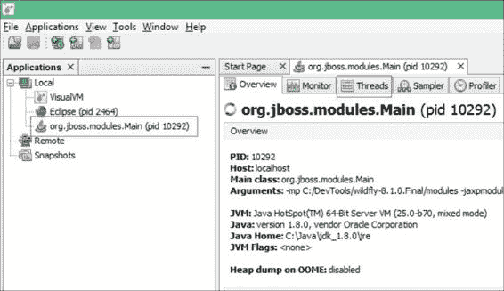
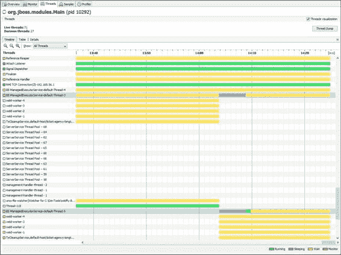
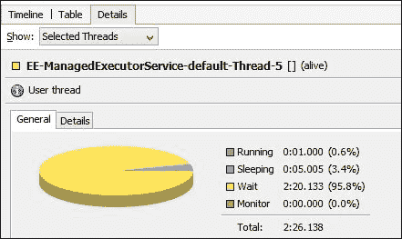

# 第十二章。长期任务执行

到目前为止，我们的应用程序专注于与用户的交互。这可能是你未来项目最重要的方面，但有一些场景需要不同的方法。维护任务、导入大量数据或耗时的计算通常以批处理模式而不是交互式方式处理。通常，这类作业不是标准操作的一部分，而应在服务器负载最低或定期时调用。

在 Java EE 7 之前，没有标准化的方式来实现批处理作业（不需要用户交互的操作）。随着 JSR 352 ([`jcp.org/en/jsr/detail?id=352`](https://jcp.org/en/jsr/detail?id=352)) 和批处理框架的引入，这一情况发生了变化，该框架使用 XML 语言来定义作业。

当涉及到处理器密集型任务时，自然想到的是并行化。现代 CPU 具有多个核心，这些核心可以很容易地被 JVM 利用。唯一的问题是，在 Java EE 中，使用来自 Java SE 的并发原语是不被鼓励的。程序员可能会损害整个容器的稳定性和可用性。

再次强调，新的 JSR 236 ([`jcp.org/en/jsr/detail?id=236`](https://jcp.org/en/jsr/detail?id=236)) 提供了克服这种架构障碍的新方法。新的规范 `ManagedExecutorService` 是 Java SE 中已知的 `ExecutorService` 的容器感知版本。

在本章中，我们将涵盖以下主题：

+   如何创建和执行批处理作业

+   不同批处理作业类型之间的区别是什么

+   如何在 Java EE 容器内创建我们的自定义工作线程

# 批处理框架概述

步骤是基本的工作单元，也是我们主要关注的领域。批处理框架定义了两种类型的步骤，如下所示：

+   **分块步骤**：这些步骤在三个阶段上对数据块进行处理：读取、处理和写入（对于每个阶段，都创建一个单独的类）。这些块可以配置为在一个事务中应该处理元素的数量。

+   **任务步骤**：这些执行程序员创建的特定代码块，没有任何特殊约束。它们用于大多数非数据处理任务。

此外，批处理框架允许监听器为整个作业或特定任务阶段进行注册。

现在我们已经涵盖了基本词汇，最好直接进入编码。

## 我们的第一个批处理作业

WildFly 提供了一个名为 JBeret 的 JSR 352 实现 ([`github.com/jberet/jsr352`](https://github.com/jberet/jsr352)). 这意味着我们可以通过简单地实现所需的接口轻松地将批处理作业扩展到我们的票务应用程序中；不需要额外的依赖项。所有 API 都已经在我们当前的示例中就绪，所以我们只需要创建一些类和一个 XML 文件来指定作业流程。

作为本章开发的基线，最好使用第五章中的代码，*将持久性与 CDI 结合*。持久化层将允许我们编写一个示例导入批处理作业。为了保持简单，让我们首先定义一个人工的外部服务，它将为我们提供应预订的票证的 ID。我们可以将其作为应用程序的一部分或作为单独的 WAR 文件部署。此示例基于 REST 端点，因此请确保在部署中配置 JAX-RS（有关详细信息，请参阅第七章，*将 Web 服务添加到您的应用程序*）。以下是一个代码片段：

```java
@Singleton
@Startup
@ConcurrencyManagement(ConcurrencyManagementType.BEAN)
@Path("/external")
@Produces(MediaType.TEXT_PLAIN)
public class PendingSeats {

    private final Queue<Integer> seats = 
                               new ConcurrentLinkedQueue<>();

    @PostConstruct
    private void setUp() {
        for (int i = 5; i < 10; i++) {
            seats.add(i);
        }
    }

 @GET
    public Integer getNextSeat() {
 return seats.poll();
    }
}
```

```java
5 to 9, and on every GET request, it will provide the ID as the output. When all IDs are emitted, a null value will be returned. This endpoint will serve as a model of a reservation system. For simplicity, it produces plaintext values instead of JSON. Of course, a flat file or any other source of data could also be used for integration.
```

### 创建基于块的批处理步骤

我们的集成场景将非常直接。我们需要从外部系统读取所有预订 ID，以从我们的数据库中获取相应的座位，并将更改写回数据库。记录导入操作日志也会很好。让我们从项目读取器开始：

```java
package com.packtpub.wflydevelopment.chapter12.batching;

import java.io.Serializable;
import javax.batch.api.chunk.AbstractItemReader;
import javax.inject.Named;
import javax.ws.rs.client.Client;
import javax.ws.rs.client.ClientBuilder;
import javax.ws.rs.client.WebTarget;

@Named
public class ExternalSystemReader extends AbstractItemReader {

    private WebTarget target;

    @Override
    public void open(Serializable checkpoint) throws Exception {
        final Client restclient = ClientBuilder.newClient();
        this.target = restclient.target("http://localhost:8080/ticket-agency-longterm/rest/external");
    }

    @Override
    public Object readItem() throws Exception {
        return target.request().get(String.class);
    }
}
```

我们的读者扩展了`AbstractItemReader`类，这样我们就不必实现`javax.batch.api.chunk.ItemReader`接口的所有方法。我们感兴趣的只有两个方法：`open`和`readItem`。第一个方法初始化 REST 客户端，将从服务器获取数据。实现是可选的，因为并非每个读取器都需要初始化逻辑。请注意，一个检查点参数被传递给该方法。它可以用来从特定点重新启动批处理作业。然而，我们将省略这个功能。

`readItem`方法从外部服务请求数据，并将单个项目返回给批处理框架。null 值是一个指示没有更多数据的标志。`ItemReader`接口的其他方法负责检查点处理和读取器的关闭。

当我们为批处理作业定义 XML 规范时，我们必须使用管理 bean 的名称来引用我们想要的读取器、处理器或写入器（就像在 JSF 中一样）。因此，我们需要`@Named`注解来提供一个基于字符串的限定符；默认情况下，它将是放置注解的类的名称的小写。对于`ExternalSystemReader`bean，我们将使用`externalSystemReader`名称。

在读取一个项目后，我们可能会处理它。我们的`SeatProcessor`类如下代码片段：

```java
package com.packtpub.wflydevelopment.chapter12.batching;

import javax.batch.api.chunk.ItemProcessor;
import javax.inject.Inject;
import javax.inject.Named;
import com.packtpub.wflydevelopment.chapter12.control.SeatDao;
import com.packtpub.wflydevelopment.chapter12.entity.Seat;

@Named
public class SeatProcessor implements ItemProcessor {

 @Inject
 private SeatDao dao;

    @Override
    public Object processItem(Object id) throws Exception {
        Seat seat = dao.find(Long.parseLong((String) id));
        if (seat != null) {
            if (seat.getBooked() == true) {
                return null;
            }
            seat.setBooked(true);
        }
        return seat;
    }
}
```

我们的处理器从读取器检索 ID，并在数据库中找到相应的条目。为了找到实体，我们重用了上一章中已知的`SeatDao`类。因为我们有 CDI 在批处理框架上工作，所以我们只需注入我们的 EJB，无需关心事务处理。

如果找到座位，我们检查它是否已被预订。如果是，我们可以简单地返回一个 null 值，以从进一步处理中省略此项目。

最后一步是 `SeatWriter`。以下是一个代码片段：

```java
package com.packtpub.wflydevelopment.chapter12.batching;

import javax.batch.api.chunk.AbstractItemWriter;
import javax.batch.runtime.context.JobContext;
import javax.inject.Inject;
import javax.inject.Named;
import javax.persistence.EntityManager;
import javax.persistence.PersistenceContext;

@Named
public class SeatWriter extends AbstractItemWriter {

    public static final String FILENAME_PARAM = "logFile";

 @Inject
 private JobContext jobContext;

    @PersistenceContext
    private EntityManager em;

    private BufferedWriter writer;

    @Override
    public void open(Serializable ckpt) throws Exception {
        Properties jobProperties = jobContext.getProperties();
        String fileName = jobProperties.getProperty(FILENAME_PARAM);

        writer = new BufferedWriter(new FileWriter(fileName));
        writer.write("Importing...");
        writer.newLine();
    }

    @Override
 public void writeItems(List<Object> items) throws Exception {
        writer.write("Chunk size: " + items.size());
        writer.newLine();

        for (Object obj : items) {
            em.persist(obj);
            writer.write("Persisted: " + obj);
            writer.newLine();
        }
    }

    @Override
    public void close() throws Exception {
        writer.write("Import finished");
        writer.newLine();
        writer.close();
    }
}
```

我们的 `ItemWriter` 类首先定义了一个 `open` 方法，该方法获取一个用于写入的文件。新创建的日志文件名取自作业属性。我们关于当前批处理作业的信息来源是注入的 `JobContext` 类（还有一个 `StepContext` 对象，它提供了有关特定步骤的信息）。它为我们提供了获取作业定义的属性、当前 ID、状态和附加瞬态数据的机会。

我们写入器的核心当然是 `writeItem` 方法。它接收要写入的项目列表（在我们的例子中是座位），其责任是持久化它们。此方法可以在没有更多数据要写入之前多次调用。您可以配置每个块中要处理元素的数量。更重要的是，每个块都在自己的事务中运行。

最后，当最后一个块写入完成后，`close` 方法会写入摘要并关闭文件。

所有元素现在都已就绪，因此我们需要创建一个批处理作业规范。`externalSystem.xml` 文件应放置在您的项目中 `src/main/resources/META-INF/batch-jobs` 目录下。内容如下：

```java
<job id="externalSystem" 
    version="1.0"> [1]
    <properties>
        <property name="logFile" value="log.txt" /> [2]
    </properties>
    <step id="processData">
        <chunk item-count="2"> [3]
            <reader ref="externalSystemReader" /> [4]
            <processor ref="seatProcessor" />
            <writer ref="seatWriter" />
        </chunk>
    </step>
</job>
```

结构非常简单。首先，我们定义一个与文件名 `[1]` 匹配的作业 ID。接下来，在属性部分，我们设置一个名为 `logFile` 的属性，其值为 `log.txt` `[2]`，我们在 `SeatWriter` 中使用它来创建输出文件 `[3]`。然后，我们定义一个包含数据块的分步操作。`item-count` 属性定义了我们在一个事务中处理的项目数量。最后，我们在相应的标签 `[4]` 中引用我们的读取器、处理器和写入器。

现在，当我们的作业定义完成后，是时候启动它了。为此，我们需要使用 BatchRuntime 的静态方法 `getJobOperator`。为了简化解决方案，我们将使用 REST 端点的 GET 方法来调用我们的代码：

```java
package com.packtpub.wflydevelopment.chapter12.batching;

import java.util.Properties;
import javax.batch.runtime.BatchRuntime;
import javax.ejb.Stateless;
import javax.ws.rs.GET;
import javax.ws.rs.Path;

@Stateless
@Path("/job")
public class JobStarter {

    @GET
    public String start() {
 long jobId = BatchRuntime.getJobOperator()
 .start("externalSystem", new Properties());
        return Long.toString(jobId);
    }
}
```

`JobOperator start` 方法返回一个作业 ID，它是正在进行的批处理过程的表示。我们需要提供定义批处理作业的文件名（不带 XML 扩展名）和一组运行时参数。

### 注意

在运行时提供的属性与我们之前使用的不同！这类属性不是绑定到特定作业的（与在 XML 文件中定义的属性相反），但可以从作业执行中访问。批处理框架称它们为参数。如果您需要在您的应用程序中实现这类逻辑，您只需在作业启动期间传递它们，并使用作业执行 ID 来访问它们：

```java
JobOperator operator = BatchRuntime.getJobOperator();
Properties properties = new Properties();
properties.put("propertyName", "propertyValue");

long jobId = operator.start("externalSystem", properties);

JobExecution execution = operator.getJobExecution(jobId);
Properties jobParameters = execution.getJobParameters();
```

您可以将浏览器指向 `http://localhost:8080/ticket-agency-longterm/rest/job` 并启动您的批处理作业！在运行作业之前，请务必设置您的座位（控制台位于 `http://localhost:8080/ticket-agency-longterm/faces/views/setup.xhtml`）。

在您的 WildFly 的 bin 目录中，一个示例输出文件可能看起来如下：

```java
Importing...
Chunk size: 2
Persisted: Seat [id=5, booked=true, seatType=com.packtpub.wflydevelopment.chapter12.entity.SeatType@a55bb6e]
Persisted: Seat [id=6, booked=true, seatType=com.packtpub.wflydevelopment.chapter12.entity.SeatType@a55bb6e]
Chunk size: 2
Persisted: Seat [id=7, booked=true, seatType=com.packtpub.wflydevelopment.chapter12.entity.SeatType@440a007]
Persisted: Seat [id=8, booked=true, seatType=com.packtpub.wflydevelopment.chapter12.entity.SeatType@440a007]
Chunk size: 1
Persisted: Seat [id=9, booked=true, seatType=com.packtpub.wflydevelopment.chapter12.entity.SeatType@307124b7]
Import finished

```

当然，你还可以在应用程序中的特定事件之后或作为传入 JMS 消息的效果使用 Java EE 定时器启动批处理作业。你还可以使用检索到的作业 ID 来监控已运行的作业或根据需要终止它们。批处理框架 API 在作业管理领域提供了许多可能性，而不会带来太多的复杂性。

### 创建基于作业的批处理步骤

我们基于分块的作业非常适合处理大数据集。然而，如果我们只想执行一个特定的任务怎么办？除了创建分块，我们还可以定义将简单地调用特定类的过程方法的步骤。这些类必须实现 `Batchlet` 接口（或扩展 `AbstractBatchlet` 类）。

在我们的示例中，让我们尝试联系一个外部 API 来询问当前的比特币汇率（一种去中心化、虚拟货币）。然后，我们将把我们的票价的当前价格存储在一个简单的平面文件中。我们的批处理单元将如下所示：

```java
@Named
public class BitcoinTask extends AbstractBatchlet { 

    private static final String EXTERNAL_API = "https://api.bitcoinaverage.com/exchanges/USD";
    public static final String FILENAME_PARAM = "bitcoinFile";

    @Inject
    private SeatTypeDao seatTypeDao;

    @Inject
    private JobContext jobContext;

    @Override
    public String process() throws Exception { // [1]
        WebTarget api = ClientBuilder.newClient().target(EXTERNAL_API);
        Response response = api.request().get();
 JsonObject entity = response.readEntity(JsonObject.class); // [2]

        double averageValue = entity.getJsonObject("btce").getJsonObject("rates").getJsonNumber("bid").doubleValue(); 

        Map<SeatType, Double> pricesInBitcoins = calculeteBitcoinPrices(averageValue, seatTypeDao.findAll()); // [3]

 writeToFile(pricesInBitcoins); // [4]

        return "OK";
    }

    private Map<SeatType, Double> calculeteBitcoinPrices(double averageValue, List<SeatType> findAll) {
        return findAll.stream().collect(
                Collectors.toMap(seatType -> seatType, seatType -> seatType.getPrice() / averageValue));
    }

    private void writeToFile(Map<SeatType, Double> pricesInBitcoins) throws Exception {
 Properties jobProperties = jobContext.getProperties(); // [5]
        String fileName = jobProperties.getProperty(FILENAME_PARAM);
        try (BufferedWriter writer = new BufferedWriter(new FileWriter(fileName))) {
            writer.write(pricesInBitcoins.toString());
            writer.newLine();
        }
    }
}
```

流程方法 `[1]` 是我们进入批处理单元的入口点。我们将首先向外部 API `[2]` 发起一个 `REST` 请求，并使用响应来计算我们的比特币价格 `[3]`。最后，我们将尝试将收集到的数据写入文件。正如你所见，又一次，我们使用 `JobContext` 从批处理框架（在这种情况下是文件名）获取配置属性。

你可能会想知道，`process` 方法中的返回类型有什么意义？它仅仅表示作业的状态，如果它已经成功完成或者没有。

那就是我们想要做的，我们通过单个批处理步骤就实现了它：读取、处理和写入。在面向分块的方法中，我们将有三种独立的机制来完成这个任务。让我们将我们的新步骤添加到 `externalSystem.xml` 中，该文件位于 `src/main/resources/META-INF/batch-jobs`：

```java
<job id="externalSystem" 
    version="1.0">
    <properties>
        <property name="logFile" value="log.txt" />
        <property name="bitcoinFile" value="bitcoins.txt" /> [1]
    </properties>
    <step id="processData" next="checkBitcoins"> [2]
        <chunk item-count="2">
            <reader ref="externalSystemReader" />
            <processor ref="seatProcessor" />
            <writer ref="seatWriter" />
        </chunk>
    </step>
    <step id="checkBitcoins"> [3]
        <batchlet ref="bitcoinTask" />
    </step>
</job>
```

在 XML 文件中有三个新的需要注意的地方。首先，我们添加了一个新的属性，我们之前在我们的批处理单元 `[1]` 中引用过。接下来，我们定义了在分块处理步骤之后，我们希望调用另一个步骤，即 `checkBitcoins` `[2]`。最后，我们创建了一个新的步骤，在其中我们引用了我们的 `batchlet` 类。

你可以再次启动你的作业，完成后，一个 `bitcoins.txt` 文件应该出现在 WildFly 的 `bin` 目录中。

我们已经涵盖了批处理框架的基础，它允许你满足企业应用中定义的大多数常见需求。然而，规范中还有更多内容，例如拆分、分区以及与工作流相关的元素（状态和决策），如果你正在实施的业务流程需要更复杂的机制，你可以探索这些内容。

我们下一步是使用新的并发工具在 Java EE 容器内提供一些并行性。

## 在 Java EE 中使用并发工具

在 Java EE 6（特别是在 EJB 容器中），不建议创建新线程，因为应用程序服务器将无法控制平台的稳定性，也无法保证任何事务功能。这可能对希望有效使用 CPU 并并行执行多个任务的应用程序造成问题。可以通过使用 JCA 适配器来克服这一点，但实现它们需要额外的努力。

幸运的是，JSR 236 引入了 `ManagedExecutorService`（以及 `ManagedScheduledExecutorService`），这是 Java SE 中使用的 `ExecutorService` 的容器感知版本。已知的 API 已移植到 Java EE 平台，为 EJB 容器中的并发操作提供了顺畅的工作流程。新的托管执行器服务相对于标准服务有以下优点：

+   它们依赖于容器提供的线程池。这意味着服务器控制着可以由所有部署的应用程序生成的许多线程，你可以调整配置以确保所需的服务质量。

+   线程配置完全独立于代码，因此可以在不更改应用程序本身的情况下更改它。

+   可以将调用者上下文传播到创建的线程中。例如，可以使用启动新线程的用户请求的安全主体。

+   应用程序服务器允许监控当前线程数。

+   由托管执行器启动的线程可以为业务组件创建新的事务；然而，它们不能参与来自其他组件的事务。

并发实用工具的主要部分在以下表中描述：

| 组件 | 描述 |
| --- | --- |
| `ManagedExecutorService` | 这用于以异步方式执行提交的任务。开发者可以提交 `Callable` 或 `Runnable` 函数，并使用返回的 `Future` 在结果可用时检查结果。容器上下文将由容器传播。该接口扩展了标准的 `ExecutorService` 接口。 |
| `ManagedScheduledExecutorService` | 这与 `ManagedExecutorService` 类似，但它用于在特定时间执行任务（循环、计划或延迟）。该接口扩展了标准的 `ScheduleExecutorService`，但还提供了触发功能；创建一个动态对象的可能性，该对象可以决定何时触发特定事件（请参阅 `javax.enterprise.concurrent.Trigger`）。 |
| `ContextService` | 这用于捕获容器的上下文；然后可以在提交作业到执行器服务时使用它。 |
| `ManagedThreadFactory` | 这用于由容器创建线程。开发者可以提供自己的线程工厂以满足特定的用例（例如，在创建的对象上设置特定的属性）。 |

可以通过 JNDI 查找或`@Resource`注入来获取这些组件的实例。Java EE 7 规范要求每个容器提供一组默认资源，这些资源可以在没有任何额外配置的情况下注入。因此，在 WildFly 中，获取它们的简单方法就是输入以下代码：

```java
@Resource
private ManagedExecutorService executorService;

@Resource
private ManagedScheduledExecutorService scheduledExecutorService;

@Resource
private ContextService contextService;
```

您还可以在`standalone.xml`文件中找到任何额外的执行服务以及默认执行服务的配置（以及其他配置文件变体）。以下展示了相关子系统的一部分配置：

```java
<subsystem >
    <spec-descriptor-property-replacement>false</spec-descriptor-property-replacement>
    <concurrent>
        (…)
        <managed-executor-services>
            <managed-executor-service name="default" jndi-name="java:jboss/ee/concurrency/executor/default" context-service="default" hung-task-threshold="60000" core-threads="5" max-threads="25" keepalive-time="5000"/>
        </managed-executor-services>
        (…)
    </concurrent>
</subsystem>
```

如您所见，`standalone.xml`文件包含了默认`ManagedExecutorService`的配置。您可以使用另一个名称和 JNDI 路径添加一个新的自定义配置；您也可以为每个部署的应用程序创建一个单独的配置。

### 注意

注意，默认的 ManagedExecutorService 有两个 JNDI 名称：配置文件中的那个和 Java EE 规范中定义的那个（`java:comp/DefaultManagedExecutorService`）。您可以通过`standalone.xml`文件中的 default-bindings 标签切换到默认的执行服务（以及其他组件）。

让我们更详细地查看一些执行服务的属性：

+   **core-threads**：这定义了在所有时间都应该在线程池中保持活跃的线程数量（即使这些线程是空闲的，服务器也没有处理用户请求）。

+   **max-threads**：这表示服务器在必要时可以启动多少个线程（包括核心线程），例如，在负载很重的情况下。

+   **keepalive-time**：这定义了线程在服务器将其杀死之前可以空闲多少毫秒（仅当运行的线程数多于指定的 core-threads 参数时适用）。此配置值定义了服务器在不再需要额外线程时将保留这些线程的时间长度。

+   **hung-task-threshold**：这定义了服务器将在多少毫秒后将一个线程标记为挂起。如果设置为`0`，则线程永远不会被标记为挂起（线程将没有执行时间限制）。

通过使用这些配置属性和创建额外的执行服务，服务器管理员可以精细控制服务器在特定时间可以处理的最大负载。确保在应用程序性能调整期间仔细查看它们。

对于开发而言，默认配置非常适合我们，因此现在是时候通过并发工具的示例用法来深入代码了！

### 将线程引入企业 Bean

当我们与批处理框架一起工作时，我们联系了一个 REST 端点，该端点在我们的示例中模拟了一个外部系统。现在，我们将向其中添加一些并发性。

外部系统可能从多个来源汇总预订请求。如果每个请求都需要大量时间，同时发出所有请求可能是个好主意。让我们从创建 `Callable` 开始，它将返回应该预订的座位 ID 列表。如下面的代码片段所示：

```java
package com.packtpub.wflydevelopment.chapter12.external;

import java.util.concurrent.Callable;
import javax.enterprise.concurrent.ManagedTask;
import javax.enterprise.concurrent.ManagedTaskListener;
import javax.enterprise.inject.Instance;

public class GenerateSeatRequestFromArtificial implements Callable<List<Integer>>, ManagedTask [1] {

    @Inject
    private Logger logger;

 @Inject
 private Instance<TaskListener> taskListener; [2]

    @Override
    public ManagedTaskListener getManagedTaskListener() {
        return taskListener.get(); [3]
    }

    @Override 
    public Map<String, String> getExecutionProperties() {
 return new HashMap<>(); [4]
    }

    @Override
    public List<Integer> call() throws Exception {
        logger.info("Sleeping...");
 Thread.sleep(5000); [5]
        logger.info("Finished sleeping!");

        return Arrays.asList(4, 5, 6);
    }
}
```

我们的任务实现了 `[1]` 两个接口：`Callable` 和 `ManagedTask`。`ManagedExecutorService` 需要一个满足 Java SE 中 `Callable` 或 `Runnable` 接口契约的对象。

`ManagedTask` 接口是可选的，但它允许我们与任务本身一起注册 `ManagedTaskListener` 并从任务返回额外的属性。任务监听器有一组生命周期回调，这些回调在任务执行期间被调用。我们将使用它来记录有关我们任务的额外信息。为了创建任务监听器的实例，我们使用了 `Instance<T>` 类 `[2]`。它用于按需创建 CDI 实例。我们从 `ManagedTask` 接口的方法中返回 `ManagedTaskListener` `[3]`。我们不需要任何额外的属性；因此，我们从 `ManagedTask` 接口的第二个方法中返回一个空对象 `[4]`。

最后，我们实现了 `call` 方法；线程将被挂起 5 秒钟（以模拟长时间工作）并返回一个预定义的 ID 列表。

我们的任务监听器只是一个带有记录器的 bean，它将获取有关任务生命周期的所有信息。如下面的代码片段所示：

```java
public class TaskListener implements ManagedTaskListener {

    @Inject
    private Logger logger;

    @Override
    public void taskSubmitted(Future<?> future, ManagedExecutorService executor, Object task) {
        logger.info("Submitted " + task);
    }

    @Override
    public void taskAborted(Future<?> future, ManagedExecutorService executor, Object task, Throwable exception) {
        logger.log(Level.WARNING, "Aborted", exception);
    }

    @Override
    public void taskDone(Future<?> future, ManagedExecutorService executor, Object task, Throwable exception) {
        logger.info("Finished task " + task);
    }

    @Override
    public void taskStarting(Future<?> future, ManagedExecutorService executor, Object task) {
        logger.info("Starting " + task);
    }
}
```

如您所见，大多数实现的方法都是获取执行器服务、未来和任务本身作为参数。我们简单地使用注入的记录器记录当前状态。

因此，我们已经创建了一个任务，它相当静态。现在，让我们尝试创建另一个任务，该任务将联系数据库。和之前一样，我们需要一个 `Callable` 实现来返回一个整数列表。如下面的代码片段所示：

```java
public class GenerateSeatRequestsFromDatabase implements Callable<List<Integer>> {

    private static final int SEATS_TO_RETURN = 3;

    @Inject
 private SeatDao dao; // [1]

    @Inject
    private Logger logger;

    @Override
    public List<Integer> call() throws Exception {
        logger.info("Sleeping...");
 Thread.sleep(5000); // [4]
        logger.info("Finished sleeping!");

 List<Seat> databaseSeats = dao.findAll(); // [2]

 List<Integer> freeSeats = databaseSeats.stream()
 .filter(seat -> !seat.getBooked())
 .limit(SEATS_TO_RETURN)
 .map(seat -> seat.getId().intValue())
 .collect(Collectors.toList()); // [3]

        if (freeSeats.isEmpty()) {
            logger.info("No seats to book");
        } else {
            logger.info("Requesting booking for " + freeSeats);
        }
        return freeSeats;
    }
}
```

与上一个任务相比，主要区别在于我们注入了一个 EJB `[1]`，这将启动一个底层事务。在 `call` 方法中，发出一个数据库请求 `[2]`。然后，返回的座位列表被过滤并转换成一个座位 ID 列表 `[3]`。

此外，如前所述，我们将停止线程 5 秒钟，以便我们可以在稍后观察执行情况 `[4]`。

我们已经准备好了构建块。现在，是时候将它们组合成一个工作示例了。我们可以从本章开头提到的 `PendingSeats` 类开始，如下面的代码所示：

```java
package com.packtpub.wflydevelopment.chapter12.external;

@Singleton
@Startup
public class PendingSeats {

    private final Queue<Long> seats = 
                                new ConcurrentLinkedQueue< >();

 @Resource
 private ManagedExecutorService executorService; // [1]

 @Inject  // [2]
 private Instance<GenerateSeatRequestsFromDatabase> databaseCollector; 

 @Inject
 private Instance<GenerateSeatRequestFromArtificial> artificalCollector;

    @Inject
    private Logger logger;

    @PostConstruct
    private void setUp() {
        try {
 List<Future<List<Integer>>> futures = executorService.invokeAll(Arrays.asList(
 databaseCollector.get(), artificalCollector.get()
)); // [3]

 List<Integer> requestedIds = futures.stream().flatMap(future -> get(future).stream()).distinct()
 .collect(Collectors.toList()); // [4]

            logger.info(requestedIds.toString());
        } catch (InterruptedException e) {
            logger.log(Level.SEVERE, e.getMessage(), e);
        }

    }

    private List<Integer> get(Future<List<Integer>> future) {
        try {
            return future.get();
        } catch (InterruptedException | ExecutionException e) {
            logger.log(Level.SEVERE, e.getMessage(), e);
            return new ArrayList<>();
        }
    }
}
```

我们首先使用`@Resource`注解[1]获取`ManagedExecutorService`的实例。接下来，使用 CDI 的`Instance<T>`类模式[2]注入先前创建的任务。多亏了这一点，它们是管理 Bean，并且它们的依赖项被注入。有了依赖项，我们使用`executorService`的`invokeAll`方法[3]一次性启动所有任务（我们也可以使用多次调用`submit`方法）。返回值代表一组未来结果，可以在数据准备好时用于检索收集的数据。

到目前为止，我们的任务已经开始运行，因此我们可以在未来结果上简单地执行阻塞的`get`调用并等待数据[4]。当它准备好时，我们删除任何重复项，并使用`flatMap`操作将结果收集到一个单独的列表中。如您所记得，我们之前的两个任务各自等待了 5 秒钟。由于它们是同时执行的，我们预计它们将在 5 秒后同时完成。

因为我们的 Bean 是一个带有启动注解的单例，所以整个流程将在我们的应用程序部署期间被调用。现在就试试看吧！

当然，数据库任务需要在`seats`表中有一些数据，否则将返回空结果（对我们来说这不是一个大问题）。如果您希望应用程序自动将一些数据种入数据库，您可以创建另一个单例 Bean，例如：

```java
@Startup
public class DatabaseInitializer {

    @PersistenceContext
    private EntityManager em;

    @PostConstruct
    public void setup() {
        SeatType seatType = new SeatType();
        seatType.setPosition(SeatPosition.BALCONY);
        seatType.setDescription("Test Data");
        seatType.setQuantity(10);
        seatType.setPrice(10);
        em.persist(seatType);

        Seat seat = new Seat();
        seat.setSeatType(seatType);
        em.persist(seat);

    }
}
```

请确保在`PendingSeats`Bean 上添加`@DependsOn("DatabaseInitializer")`注解，以便初始化器在我们数据库收集器之前运行。

如果一切顺利，您应该在控制台看到如下内容：

```java
23:42:48,455 INFO  [TaskListener] (ServerService Thread Pool -- 54) Submitted GenerateSeatRequestFromArtificial@4256cb0c
23:42:48,456 INFO  [GenerateSeatRequestsFromDatabase] (EE-ManagedExecutorService-default-Thread-1) Sleeping... (1)
23:42:48,456 INFO  [TaskListener] (EE-ManagedExecutorService-default-Thread-2) Starting GenerateSeatRequestFromArtificial@4256cb0c
23:42:48,456 INFO  [GenerateSeatRequestFromArtificial] (EE-ManagedExecutorService-default-Thread-2) Sleeping... (2)
23:42:53,457 INFO  [GenerateSeatRequestsFromDatabase] (EE-ManagedExecutorService-default-Thread-1) Finished sleeping!
23:42:53,461 INFO  [GenerateSeatRequestFromArtificial] (EE-ManagedExecutorService-default-Thread-2) Finished sleeping!
23:42:53,461 INFO  [TaskListener] (EE-ManagedExecutorService-default-Thread-2) Finished task GenerateSeatRequestFromArtificial@4256cb0c
23:42:53,617 INFO  [GenerateSeatRequestsFromDatabase] (EE-ManagedExecutorService-default-Thread-1) Requesting booking for [1]
23:42:53,621 INFO  [PendingSeats] (ServerService Thread Pool -- 54) [1, 4, 5, 6] (3)

```

如您所见，两个任务同时在两个不同的线程中启动（1 和 2），注意日志中的`EE-ManagedExecutorService-default-Thread-1`和`…-Thread-2`条目）。最终结果在大约 5 秒后产生，它包含来自两个收集器的数据，并且还收集在最初提交任务的线程中（`ServerService Thread Pool -- 54`）。

您还可以使用 Java VisualVM 工具来可视化应用程序服务器中的线程。该工具位于您的 JDK 安装的`bin`目录中（`jvisualvm`可执行文件）。运行它后，您应该在左侧树中看到 JBoss，并在点击 JBoss 节点后看到**线程**选项卡。这在上面的屏幕截图中显示：



如果您在应用程序部署期间切换到**线程**选项卡，您将看到一个图表，如以下屏幕截图所示：



紫色表示休眠线程，时间轴上带有紫色部分的两个突出显示的线程是执行过程中的我们的任务。您可以使用详细的线程视图来进一步检查您的工作线程。这在上面的屏幕截图中显示：



Java VisualVM 为每个开发者提供了许多有用的功能，例如虚拟机的资源监控、分析器、采样器等，这些功能都作为专用插件实现。务必查看它们！

在本节中，我们实现了一个在 Java EE 之前版本中难以适当覆盖的用例。得益于提供给开发者的高级 API，我们能够用更少的代码完成这项工作。

# 摘要

在本章中，你学习了如何使用新的批处理框架以两种不同的方式创建批处理应用程序。接下来，我们尝试了一些并发工具提供的机制。我们的探索从用户交互转向了中间件层的内部。

在下一章中，我们将填补 Java EE 开发者工具箱中的最后一个空白，即使用 Arquillian 进行集成测试。
