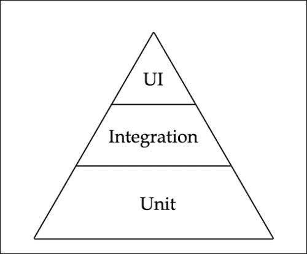
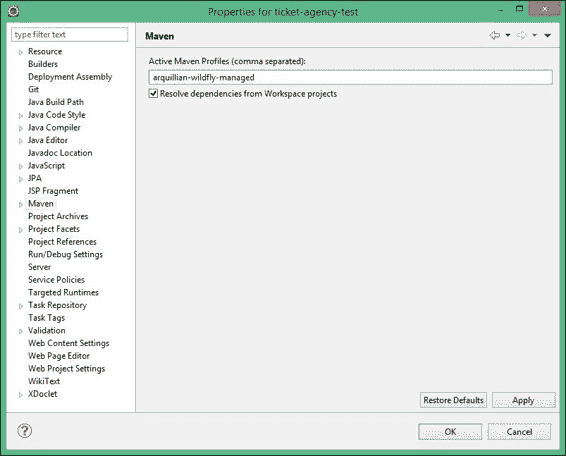
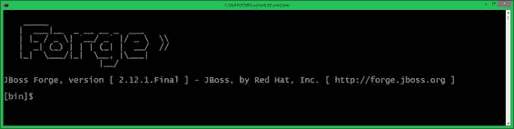
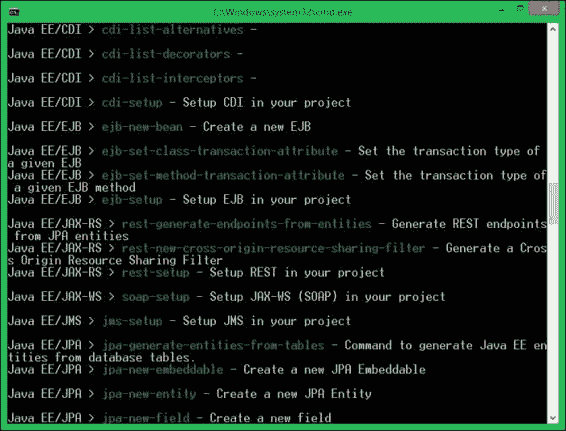
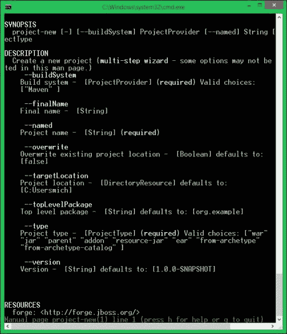
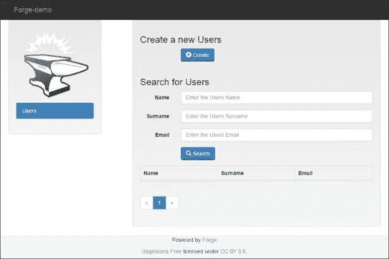
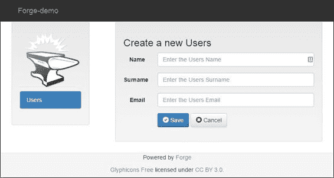

# 第十三章。测试你的应用程序

在前面的章节中，我们介绍了 Java EE 平台最重要的技术。然而，每个专业开发者都知道，软件开发应该从编写测试开始。起初，能够验证 EJBs、数据库相关代码或 REST 服务等的执行正确性似乎并不容易，但使用正确的工具时，这看起来非常直接！在本章中，我们将介绍用于 Java EE 应用程序测试的基本测试框架：Arquillian。此外，我们还将探讨其扩展和相关库。

在本章中，我们将重点关注以下主题：

+   从模拟对象到 Arquillian 框架的企业级测试简介

+   如何将 Arquillian 测试用例集成到我们的票务机应用程序中

+   如何使用 Eclipse IDE 和 Maven shell 运行 Arquillian 测试

+   最重要的 Arquillian 扩展及其使用方法

# 测试类型

“测试”这个词可以有多种解释。最常见的是，测试执行应用程序需求的验证和验证。测试可以在多个级别上执行，从单个方法到整个业务功能。测试还可以涵盖非功能性方面，如安全或性能。

首先，让我们介绍验证功能性需求的测试类别。Mike Cohn 提出了一个测试金字塔的概念，如下所示：



正如你所见，应用程序中的大多数测试通常是覆盖代码单元的测试。一个单元可以是一个单独的方法，这是最基本的功能。正因为这个范围，这类测试被称为**单元测试**。它们可以被定义为程序员编写的测试，以验证相对较小的功能是否按预期工作。由于单元相对较小，这些测试的数量会迅速增加，因此它们成为金字塔最低层的应用测试基础。

下一种类型的测试关注更大的代码区域。它们覆盖整个服务或业务功能。这意味着它们覆盖多个代码单元，涉及不同的模块和库。这种测试的数量将低于单元测试的数量。这种类型的测试通常被称为**集成测试**。集成测试的目的是证明系统的不同部分可以协同工作；由于它们覆盖整个应用程序，因此需要投入更多的努力来构建。例如，它们通常需要为它们分配数据库实例和硬件等资源。集成测试在证明系统如何工作方面做得更有说服力（尤其是对非程序员来说）；至少在集成测试环境与生产环境相似的程度内。

最后一种测试类型是 UI 测试，也可以称为验收测试。它们在项目中的数量最少；它们通常是最难编写的，以模拟用户与应用程序的交互。它们覆盖整个需求和功能。

让我们暂时放下非功能性测试的话题。目前，你只需要记住它们可以涵盖与性能、安全等相关的话题。

## 用于测试的仪器

如你所想，每种测试类型都使用不同的方法，通常需要不同的测试库。

当你编写单元测试时，你只需提供一些方法输入参数，并验证它们的输出是否符合预期。在 Java 中，你可能已经使用了**JUnit**、**TestNG**或**Spock**。当你从更大的代码部分转向测试整个服务时，可能会出现一些问题。通常很难分离你想要测试的代码，使其可测试而不需要运行所有其他服务。你通常会创建一些模拟对象来模拟你不想包含在测试中的模块的行为。如果你有一个你想要测试的对象，并且如果这些方法依赖于另一个对象，你可以创建一个依赖项的模拟而不是依赖项的实际实例。这允许你在隔离的情况下测试你的对象。

例如，一个常见的用例可能是在数据库应用程序中，你想要测试，例如，用户注册过程，但你不想运行整个数据库（这意味着你将设置其模式，一些初始数据，并在测试完成后手动清理其状态）。你可以模拟数据库交互并定义某些方法执行的行为，例如，你的存根将始终返回四个用户，这些用户将被硬编码在你的测试代码中。

这种方法虽然很容易理解并付诸实践，但有几个局限性。首先，它让你陷入一个人工环境，你经常会对该环境的行為和稳定性做出无效的假设。

其次，你可能会得到一段难以维护的模拟代码，这会让你的测试通过，并给你一种完成了出色工作的温暖感觉。

第三，有时很难隔离你想要测试的服务，并且模拟所有交互的代码可能比有意义的测试代码还要长。

因此，即使模拟对象可能对启动系统提供一些好处，尤其是在你没有某个特定子系统的完整实现时，最好尽可能接近代码预期运行的靶环境。在某个时刻，无模拟运动（**非仅模拟运动**）被发起，指出模拟通常花费太多时间，并让你专注于编写模拟而不是编写测试。

**Arquillian**试图解决这些问题。它是一个简化 Java 中间件集成测试的平台。它处理所有容器管理、部署和框架初始化的底层工作，这样你就可以专注于编写测试任务——真正的测试。Arquillian 通过覆盖测试执行周围的方面来最小化对开发者的负担；以下是一些方面：

+   管理容器的生命周期（启动/停止）

+   将测试类及其依赖的类和资源捆绑成一个可部署的存档

+   增强测试类（例如，解决`@Inject`、`@EJB`和`@Resource`注入）

+   将存档部署到测试应用程序（部署/卸载），并捕获结果和失败

Arquillian 还有扩展，可以增强其功能，例如，允许它执行 UI 测试或一些非功能性测试。

在下一节中，我们将讨论运行你的集成测试所需的仪器。

# 开始使用 Arquillian

虽然 Arquillian 不依赖于特定的构建工具，但它通常与 Maven 一起使用；它提供依赖管理，因此简化了将 Arquillian 库包含到应用程序中的任务，因为它们分布在 Maven 中央仓库中。

根据你用于生成的存档类型，你的项目可能会有不同的文件夹结构；这不是问题。真正重要的是，你需要在你的`src`文件夹下提供以下结构：

+   `main/java/`: 将所有应用程序 Java 源文件放在这里（在 Java 包下）

+   `main/resources/`: 将所有应用程序配置文件放在这里

+   `test/java/`: 将所有测试 Java 源文件放在这里（在 Java 包下）

+   `test/resources/`: 将所有测试配置文件放在这里（例如，`persistence.xml`）

因此，到目前为止，我们将在`test/java`下工作，这是我们放置第一个 Arquillian 测试类的地方。

## 编写 Arquillian 测试

如果你一直在使用 JUnit ([`www.junit.org`](http://www.junit.org))，你将找到一个类似的 Arquillian 测试，其中包含一些额外的特色。

为了做到这一点，我们将使用 Eclipse 和 Maven，就像我们迄今为止所做的那样。如果你即将向你的项目添加测试类，显然没有必要为此创建一个新的项目。然而，为了学习目的，我们在这个单独的项目中提供了这个示例，这样你可以确切地看到为了运行 Arquillian 测试需要添加什么。

为了避免从头开始重新创建整个项目，你可以简单地克隆`ticket-agency-jpa`项目并将其命名为`ticket-agency-test`，将根包从`com.packtpub.wflydevelopment.chapter5`移动到`com.packtpub.wflydevelopment.chapter13`。如果这仍然看起来工作量太大，你可以直接从书中的示例导入`Chapter13`项目。

## 配置 pom.xml 文件

运行 Arquillian 测试所必需的第一件事是包含`junit`依赖项，这是运行我们的单元测试所必需的：

```java
<dependency>
    <groupId>junit</groupId>
    <artifactId>junit</artifactId>
    <scope>test</scope>
    <version>4.11</version>
</dependency>
```

在前面的章节中，我们介绍了术语**物料清单**（**BOM**）。现在，我们将使用 Arquillian BOM 来导入所有与 Arquillian 相关的依赖项的版本：

```java
<dependencyManagement>
    <dependencies>
        <dependency>
            <groupId>org.jboss.arquillian</groupId>
            <artifactId>arquillian-bom</artifactId>
            <version>1.1.5.Final</version>
            <scope>import</scope>
            <type>pom</type>
        </dependency>
    </dependencies>
</dependencyManagement>
```

我们使用 Arquillian 与 JUnit（如前所述，其他可能性有`TestNG`、`Spock`、`JBehave`和`Cucumber`），因此我们需要包含适当的依赖项：

```java
<dependency>
    <groupId>org.jboss.arquillian.junit</groupId>
    <artifactId>arquillian-junit-container</artifactId>
    <scope>test</scope>
</dependency>
```

在完成基本依赖项之后，我们现在必须指定测试将运行的容器。对于更重要的 Java EE 应用程序服务器（WildFly、Glassfish、WebLogic 和 WebSphere）以及一些 Servlet 容器（如 Tomcat 或 Jetty），都提供了容器适配器。在这里，我们想使用 WildFly，因此我们将使用适当的容器适配器。然而，我们有几种可能的选择。容器适配器可以分为三个基本组：

+   **嵌入式**：这是在测试运行的同一 JVM 实例上运行容器的模式。通常，在这种模式下运行的容器不是原始的，而是打包到一个单一的 JAR 文件中，具有有限的版本。

+   **托管**：在这种模式下，真实的应用程序服务器在单独的 JVM 上运行。正如其名所示，可以管理容器状态，启动它，停止它等。默认情况下，当你运行测试时，服务器启动，测试针对它运行，然后停止。然而，可以配置 Arquillian 在已运行的实例上运行测试。

+   **远程**：在这种模式下，我们只是连接到某个现有的服务器实例并对其运行测试。

运行测试的最通用选择是托管容器。测试在真实服务器上运行，与生产环境相同，此外，还可以管理其状态，允许进行一些更高级的测试，例如测试与高可用性或运行在不同实例上的两个应用程序之间的通信相关的功能。现在，我们需要将适当的容器适配器添加到我们的`pom.xml`文件中。为此，我们将创建一个 Maven 配置文件：

```java
<profile>
    <id>arq-wildfly-managed</id>
    <dependencies>
        <dependency>
            <groupId>org.wildfly</groupId>
            <artifactId>wildfly-arquillian-container-managed</artifactId>
            <scope>test</scope>
        </dependency>
    </dependencies>
</profile>
```

可能会有一些情况，你希望针对不同的应用程序服务器运行测试。你可以定义几个 Maven 配置文件，并多次运行测试，每次激活其他配置文件。记住，一些应用程序服务器不提供所有类型的适配器。

有一个与容器相关的话题。我们的 Arquillian 测试使用一个协议与应用程序服务器上的微部署进行通信。如果我们不指定协议，容器将选择默认的协议。为了手动指定它，我们需要添加`org.jboss.arquillian.protocol`依赖项（这样命名是为了与 Servlet 3.0 规范兼容）：

```java
<dependency>
    <groupId>org.jboss.arquillian.protocol</groupId>
    <artifactId>arquillian-protocol-servlet</artifactId>
    <scope>test</scope>
</dependency>
```

## 编写你的第一个 Arquillian 测试

一旦配置完成，我们最终将编写我们的测试代码。因此，在包`com.packtpub.wflydevelopment.chapter13.test`下创建一个名为`TicketTest`的 Java 类。你将首先添加到这个类的以下注解，告诉 JUnit 使用 Arquillian 作为测试控制器：

```java
@RunWith(Arquillian.class)
public class TicketServiceTest {

}
```

Arquillian 随后会寻找一个带有`@Deployment`注解的静态方法；它创建一个包含所有指定类和资源的微部署（而不是部署整个应用程序），允许只测试系统的一部分：

```java
@Deployment
public static Archive<?> createTestArchive() {
    return ShrinkWrap.create(WebArchive.class)
         addPackage(SeatType.class.getPackage())
        .addPackage(TicketService.class.getPackage())
        .addPackage(LoggerProducer.class.getPackage())
        .addAsResource("META-INF/persistence.xml")
        .addAsWebInfResource(EmptyAsset.INSTANCE, "beans.xml");
}
```

**ShrinkWrap**项目提供的流畅 API（[`www.jboss.org/shrinkwrap`](http://www.jboss.org/shrinkwrap)）使得使用`create`方法实现这种技术成为可能，该方法接受部署单元的类型（`WebArchive`）作为参数，并将所有资源包含在这个归档中。在我们的例子中，我们不是包含所有单个类，而是使用`addPackage`实用方法添加包含在类包中的所有类（例如，通过添加`SeatType.class.getPackage()`方法，我们将包括与`SeatType`类在同一包中的所有类）。我们的项目使用 JPA，所以我们还添加了持久化配置；在这里，我们指定`.xml`文件的路径，这样我们就可以指向使用其他非生产数据库的某些其他测试配置。当然，我们还需要添加空的`beans.xml`文件以启用 CDI。

最后，我们注入我们想要测试的服务（是的，可以将服务注入到测试类中）并添加一个测试方法：

```java
@Inject
TicketService ticketService;

@Test
public void shouldCreateSeatType() throws Exception {
    // given
    final SeatType seatType = new SeatType();
    seatType.setDescription("Balcony");
    seatType.setPrice(11);
    seatType.setQuantity(5);

    // when
    ticketService.createSeatType(seatType);

    // then
    assertNotNull(seatType.getId());
}
```

在这里，`shouldCreateSeatType`方法将使用`TicketService`类的`createSeatType`方法创建一个新的`SeatType`属性。注意我们如何像在服务器端运行此代码一样注入`TicketService`。

我们的第一个测试用例现在准备好了。我们只需要在我们的项目`src/test/resources`下添加一个名为`arquillian.xml`的 Arquillian 配置文件：

```java
<?xml version="1.0" encoding="UTF-8"?>
<arquillian 

            xsi:schemaLocation="http://jboss.org/schema/arquillian
        http://jboss.org/schema/arquillian/arquillian_1_0.xsd">

    <container qualifier="jboss-managed" default="true">
        <!-- Additional configuration -->
    </container>

</arquillian>
```

你必须配置容器适配器。在这个例子中，我们假设你已经将`JBOSS_HOME`环境变量设置为 WildFly 主目录。在这种情况下，不需要更多的配置。然而，如果你想运行非标准的东西，例如连接到具有更改的管理端口的远程容器，那么这个文件是修改这个设置的适当位置。当你没有指定`JBOSS_HOME`时，你可以使用`property`如下设置 WildFly 的位置：

```java
<container qualifier="jboss-managed" default="true">
    <configuration>
        <property name="jbossHome">C:\wildfly</property>
    </configuration>
</container>
```

然而，当有多个人在项目上工作时，这个方法可能很难维护。为了避免问题，你可以使用系统属性解析，例如`${jbossHome}`。

如果你配置了远程容器，配置看起来就像这样：

```java
<container qualifier="jboss-remote" default="true">
    <configuration>
        <property name="managementAddress">localhost</property>
        <property name="managementPort">9999</property>
    </configuration>
</container>
```

## 运行 Arquillian TicketTest

你可以从 Maven 和你的 IDE 中运行 Arquillian 测试。你必须记住我们在 Maven 配置文件中声明了容器适配器，因此为了运行完整的构建，你必须运行以下命令行：

```java
mvn clean package –Parquillian-wildfly-managed

```

如果你想要从 Eclipse 运行测试，你必须导航到项目属性并选择 **Maven** 属性。在 **活动 Maven 配置文件** 字段中，输入 `arquillian-wildfly-managed`（如以下截图所示），这是我们之前在 `pom.xml` 文件中声明的：



现在你只需要右键单击你的 `TicketServiceTest` 类并选择 **运行 As JUnit Test**。Arquillian 引擎将启动，在 JUnit 视图中产生测试结果（你可以通过导航到 **菜单** | **窗口** | **显示视图** | **JUnit**）来使其可见）。

恭喜！JUnit 控制台记录了第一个成功运行的测试。

如果你只想在测试中使用一个容器，那么在 `pom.xml` 文件中添加以下行以设置默认 Maven 配置文件是一个好主意：

```java
<activation>
    <activeByDefault>true</activeByDefault>
</activation>
```

## 使用 Spock 运行 Arquillian 测试

Arquillian 不仅限于仅使用 JUnit。正如我们之前提到的，已经有容器，例如 TestNG 和 Spock；让我们专注于第二个。

**Spock** 是一个用 Groovy 编写的现代测试框架，它使用了一些 Groovy 语言特性来使你的测试更易于阅读和编写。Spock 的主要目标是测试 Groovy 代码，但它非常适合编写各种 Java 代码的测试。Spock 通过其 **领域特定语言** (**DSL**) 引入了一些额外的语义，以便使测试更加简单和开发者友好。

让我们使用 Spock 重新编写之前的测试示例：

```java
@RunWith(ArquillianSputnik.class)
class TicketServiceTest extends Specification {

    @Deployment
    def static WebArchive createTestArchive() {
        return ShrinkWrap.create(WebArchive.class)
               .addPackage(SeatType.class.getPackage())
               .addPackage(TicketService.class.getPackage())
               .addPackage(LoggerProducer.class.getPackage())
               .addAsResource('META-INF/persistence.xml')
               .addAsWebInfResource(EmptyAsset.INSTANCE, 'beans.xml');
    }

    @Inject
    TicketService ticketService;

    def "should create SeatType"() {
        given:
        def seatType = new SeatType(description: "Balcony", 
                                    price: 11, quantity: 6)

        when:
        ticketService.createSeatType(seatType);

        then:
        seatType.getId() != null
    }
}
```

你可以注意到一些差异。首先，它确实是 Groovy！其次，测试使用了一个不同的运行器，`ArquillianSputnik`。更重要的是，你在这里已经可以看到一些 Spock DSL，例如来自 **行为驱动开发** (**BDD**) 的 **given**、**when** 和 **then** 构造。**given** 构造预期将系统置于特定状态，**when** 描述一个动作，而 **then** 包含验证动作结果的断言。

这个完整的 Spock 示例，包括完整的 `pom.xml` 配置，可以在本章的示例项目 `ticket-agency-spock` 中找到。有关 Arquillian Spock 测试运行器、其功能和用法说明的更多信息，可以在 GitHub 上找到：[`github.com/arquillian/arquillian-testrunner-spock`](https://github.com/arquillian/arquillian-testrunner-spock)。有关 Spock 的更多信息也可以在 GitHub 上找到：[`github.com/spockframework/spock`](https://github.com/spockframework/spock)。

## ShrinkWrap 解析器

几乎在每一个 Arquillian 测试中，你可能会使用 ShrinkWrap 来创建微部署。在使用它一段时间后，你可能会注意到一些不足之处。你可能想知道当你有一个依赖于某些外部库的测试时会发生什么；你是否需要添加该库的所有包？答案是：不需要。**ShrinkWrap 解析器**提供了与 Maven 的集成，并且基本 Gradle 支持也是可用的。你只需在测试中写下你想要包含在存档中的依赖项，它将与微部署一起部署。

让我们看看 ShrinkWrap 解析器 Maven 集成的基本示例：

```java
Maven.resolver().resolve("G:A:V").withTransitivity().asFile();
```

前面的行意味着我们想要从 Maven 的中心仓库中解析具有给定组 ID、工件 ID 和版本（规范形式的 Maven 坐标）的工件，包括所有依赖项，并将其转换为文件列表。

然而，在这个例子中，你必须同时在测试代码和构建文件中维护工件版本。你可以改进这一点！只需从你的`pom.xml`文件中导入一些依赖项数据，这样 ShrinkWrap 解析器就可以解析与主项目使用相同版本的工件：

```java
Maven.resolver().loadPomFromFile("/path/to/pom.xml").
resolve("G:A").withTransitivity().asFile();
```

因此，首先，加载`pom.xml`数据，包括所有依赖管理部分和工件版本。此外，工件坐标不必包含版本。

这些是最基本的功能。你可以手动完全配置解析器，你想要使用的存储库，要应用 Maven 配置文件，以及更多。现在让我们抓取一个例子。

假设你正在使用 JUnit 和一些花哨的断言库来测试你的项目。**AssertJ**（**FEST**断言的继任者）是一个流畅的断言库，它允许你以更易于阅读的形式编写你的项目：

```java
assertThat(frodo.getName()).isEqualTo("Frodo");
```

在每个测试中使用这样的库意味着你必须将它包含在每个微部署中。还有另一件事你总是需要的：`beans.xml`文件。所以让我们创建一些实用类：

```java
public class ArquillianWarUtils {

    private static final String BEANS_XML = "beans.xml";
    private static final String ASSERTJ_COORDINATE =
                                  "org.assertj:assertj-core";

    private static File[] ASSERTJ_ARTIFACT = Maven.resolver()
     .loadPomFromFile("pom.xml").resolve(ASSERTJ_COORDINATE)
     .withTransitivity().asFile();

    public static WebArchive getBasicWebArchive() {
        return ShrinkWrap.create(WebArchive.class)
            .addAsLibraries(ASSERTJ_ARTIFACT)
            .addAsWebInfResource(EmptyAsset.INSTANCE, BEANS_XML);
    }
}
```

此外，现在在每一个测试用例中，你只需编写以下代码：

```java
    @Deployment
    public static WebArchive createDeployment() {
        return ArquillianWarUtils.getBasicWebArchive()
                    .addPackage(SomePackage.class.getPackage();
    }
```

在某个时候，你可能还想做另一件事；而不是手动添加所有库，你可以在运行时依赖项中导入它们：

```java
Maven.resolver().loadPomFromFile("pom.xml")
               .importRuntimeDependencies().resolve()
               .withTransitivity().asFile();
```

有一些不幸的情况，其中无法将项目的一部分隔离以进行微部署。你只是不断地向其中添加更多和更多的类，而且没有尽头。这意味着你的项目可能设计得不好，但假设你想要在某个现有的遗留项目中引入 Arquillian，而你对其结构没有影响力。在这种情况下，你可能希望将整个项目导入到集成测试中。有些人会玩一些小把戏；他们只是使用基本的 ShrinkWrap，并使用`ZipImporter` ShrinkWrap 导入`.jar`或`.war`文件：

```java
ShrinkWrap
    .create(ZipImporter.class)
    .importFrom(new File("/target/myPackage.war"))
    .as(WebArchive.class);
```

问题在于这个存档中到底有什么？你很可能导入了在之前的构建过程中创建的存档，因为它是测试完成后创建的！更重要的是，当你只是从 IDE 中工作而不运行完整的 Maven 构建时，它甚至可能不存在！这是你可以使用 `MavenImporter` 类的地方。请参考以下代码：

```java
ShrinkWrap.create(MavenImporter.class)
    .loadPomFromFile("/path/to/pom.xml")
    .importBuildOutput()
    .as(WebArchive.class);
```

就这样！内部运行简化构建，收集编译后的类和资源，并将其打包到存档中。它不会在完整的 Maven 构建中使用某个嵌入实例运行，因为那样会慢得多。你可能想将此类方法添加到你的测试工具中：

```java
public class ArquillianWarUtils {

    // already presented code

    public static WebArchive getBasicWebArchive() { . . . }

    public static WebArchive importBuildOutput() {
        return ShrinkWrap.create(MavenImporter.class)
                  .loadPomFromFile("pom.xml")
                  .importBuildOutput()
                  .as(WebArchive.class);
    }
}
```

自 ShrinkWrap Resolver 2.2.0-alpha-1 以来，Gradle 项目也存在一个类似的功能。然而，它内部使用 Gradle 工具 API：

```java
ShrinkWrap.create(EmbeddedGradleImporter.class)
    .forProjectDirectory("/path/to/dir")
    .importBuildOutput()
    .as(WebArchive.class);
```

在某个时候，你可能会惊讶地发现最后一个例子没有工作。原因可能是 `arquillian-bom` 没有包含这个 ShrinkWrap 解析器版本。然而，可以通过另一个 BOM 覆盖 BOM 导入的版本。这很简单；只需首先插入更重要的 BOM：

```java
<dependencyManagement>
     <!-- shrinkwrap resolvers import must be before arquillian bom! -->
    <dependency>
        <groupId>org.jboss.shrinkwrap.resolver</groupId>
        <artifactId>shrinkwrap-resolver-bom</artifactId>
        <version>${version.shrinkwrap-resolver}</version>
        <scope>import</scope>
        <type>pom</type>
    </dependency>
    <dependency>
        <groupId>org.jboss.shrinkwrap</groupId>
        <artifactId>shrinkwrap-bom</artifactId>
        <version>${version.shrinkwrap}</version>
        <scope>import</scope>
        <type>pom</type>
    </dependency>
</dependencyManagement>
```

更多关于 ShinkWrap 解析器的信息可以在其 GitHub 仓库[`github.com/shrinkwrap/resolver`](https://github.com/shrinkwrap/resolver)中找到。

## ShrinkWrap 描述符

ShrinkWrap 家族还有一个项目。它相对不太受欢迎，很多人都不了解，它被称为 **ShrinkWrap 描述符**。它的目标是提供一个流畅的 API，用于创建你通常创建并插入到你的微部署中的描述符资源。

让我们从例子开始。假设你正在编写一个持久化框架扩展。在这样做的时候，你使用了大量的 `persistence.xml` 文件，如下面的代码所示：

```java
<persistence>
   <persistence-unit name="myapp">
      <provider>org.hibernate.ejb.HibernatePersistence</provider>
      <jta-data-source>java:/DefaultDS</jta-data-source>
      <properties>
         <property name="hibernate.dialect" 
                  value="org.hibernate.dialect.HSQLDialect"/>
         <property name="hibernate.hbm2ddl.auto" value="create-drop"/>
      </properties>
   </persistence-unit>
</persistence>
```

使用 ShrinkWrap 描述符，你不必将这些文件全部放在 `src/test/resources` 中，然后再从特定的测试中引用它们，你只需在测试本身中放入一些代码：

```java
final PersistenceDescriptor persistence = Descriptors
  .create(PersistenceDescriptor.class)
            .createPersistenceUnit()
               .name("myapp")
               .provider("org.hibernate.ejb.HibernatePersistence")
               .jtaDataSource("java:/DefaultDS")
               .getOrCreateProperties()
                  .createProperty().name("hibernate.dialect")
                     .value("org.hibernate.dialect.HSQLDialect").up()
                  .createProperty().name("hibernate.hbm2ddl.auto")
                     .value("create-drop").up()
               .up().up()
```

这样的 `PersistenceDescriptor` 类可以导出为 `String`，或者直接添加到 `ShrinkWrap` 存档中。

默认情况下，项目包含适用于 Java EE 平台所有最重要的 `.xml` 文件的描述符。然而，它还允许使用 XSD 和 DTD 文件进行代码生成。请注意，它仍处于 alpha 阶段。它是稳定的，但 API 可能已经更改。

## 持久化测试

真正的挑战开始于你必须将其他系统包含到测试过程中时。即使只是测试与关系型数据库的交互，也可能引发问题。在第五章中，*将持久化与 CDI 结合*，我们介绍了 JPA。现在，是时候描述如何测试与它的交互了。

在测试数据库相关代码时，必须考虑以下几个问题：

+   如何验证数据是否真的被插入到数据库中？

+   如何在测试之间维护数据库状态，以及如何自动清理它？

Arquillian 持久性扩展允许您测试这两件事。在运行测试之前，您可以从`.xml`、`.xls`、`.yaml`、`.json`或自定义 SQL 脚本中为数据库播种。这是通过仅使用`@UsingDataSet("path-to-seeding-file")`注解来注解测试用例来完成的。在测试执行后，您可以使用`@ShouldMatchDataSet("path-to-dataset")`注解将数据库状态与另一个文件进行比较。让我们看一个例子：

```java
@Test
@UsingDataSet("datasets/seats.yml")
@ShouldMatchDataSet("datasets/expected-seats.yml")
public void shouldMakeACleanup() throws Exception {
    // given
    // from annotation

    // when
    ticketService.doCleanUp();

    // then
    // from annotation
}
```

`seats.yml`和`expected-seats.xml`文件只是简单的 YAML 文件，放置在`/src/test/resources/datasets`中。第一个文件包含`SeatType`：

```java
Seat_Type:
  - description: test
    position: "box"
    price: 10
    quantity: 10
```

第二个文件包含：

```java
Seat_Type:
```

由于我们正在执行清理。请注意，这里使用的名称和值是 SQL 名称，而不是 JPA 名称。

JPA 允许您使用二级缓存来提高操作性能。有了这个，并非所有操作都会立即反映在数据库状态上。在测试运行期间，您可能对`@JpaCacheEviction`注解感兴趣，该注解在每次测试运行后使缓存失效。每个测试也被封装在一个单独的事务中，这样它就不会影响其他测试的执行

当然，您需要一些依赖项才能使此扩展正常工作。恰好有三个，如下所示：

```java
<dependency>
    <groupId>org.jboss.arquillian.extension</groupId>
    <artifactId>arquillian-persistence-dbunit</artifactId>
    <version>1.0.0.Alpha7</version>
    <scope>test</scope>
</dependency>
```

Arquillian 1.1.4.Final 版本有一个 bug，即使不应该通过所有持久性测试，它也会通过。1.1.5.Final 版本工作正常。

本章的完整配置示例项目命名为`ticket-agency-test-ape`。

Arquillian Persistence Extension 的手册可在 GitHub 上找到：[`github.com/arquillian/arquillian-extension-persistence`](https://github.com/arquillian/arquillian-extension-persistence)。

## Arquillian Warp

我们在这里将要讨论的最后一个 Arquillian 扩展是**Warp**。作者表示，它允许您编写断言服务器端逻辑的客户端测试。更具体地说，它允许执行客户端请求，然后执行服务器端测试。这填补了客户端和服务器端测试之间的空白。

为了全面理解 Warp，我们必须引入`@RunAsClient`注解。它可以放置在测试类或测试方法上，并指出测试将在客户端执行，而不是在服务器端执行。第二个重要的注解是`@Deployment`，您已经在创建存档的方法中遇到过它。然而，它可以接受一些布尔值可测试的参数。如果可测试的值为`false`，它也会在客户端执行，而不是重新打包部署等等。然而，Warp 混合了这两种模式，并需要`@Deployment(testable=true)`和`@RunAsClient`注解。测试类必须额外注解为`@WarpTest`：

```java
@RunWith(Arquillian.class)
@WarpTest
@RunAsClient
public class BasicWarpTest {

    @Deployment(testable = true)
    public static WebArchive createDeployment() {
       ...
    }

    @Test
    public void test() {
        // Warp test
    }
}
```

每个 Warp 测试都使用以下结构：

```java
Warp
    .initiate(Activity)
    .inspect(Inspection);
```

活动是客户端部分，它发起请求。检查是服务器端断言。也可以通过观察者的额外指定来过滤一些请求：

```java
Warp
    .initiate(Activity)
    .observer(Observer)
    .inspect(Inspection);
```

例如，观察者可以过滤 HTTP 地址。

让我们看看一些更具体的内容。Arquillian Warp 也有一些扩展。目前，所有这些扩展都是面向 HTTP 的；然而，可以将 Warp 扩展以覆盖非 HTTP 用例。这些扩展为测试添加了一些特殊类：

+   JSF

+   JAX-RS

+   Spring MVC

现在我们将查看 JAX-RS 部分。为此，我们将使用来自第七章，*将 Web 服务添加到您的应用程序*的代码。我们想要测试我们的 REST 服务。首先，我们需要添加所有标准 Arquillian 相关依赖项和`arquillian.xml`文件。对于 Warp 本身，我们需要以下依赖项：

```java
<dependency>
    <groupId>org.jboss.arquillian.extension</groupId>
    <artifactId>arquillian-warp</artifactId>
    <version>1.0.0.Alpha7</version>
    <type>pom</type>
    <scope>test</scope>
</dependency>
```

对于 JAX-RS 扩展，我们需要以下依赖项：

```java
<dependency>
    <groupId>org.jboss.arquillian.extension</groupId>
    <artifactId>arquillian-rest-warp-impl-jaxrs-2.0</artifactId>
    <version>1.0.0.Alpha2</version>
    <scope>test</scope>
</dependency>
```

此外，我们将使用 JAX-RS 客户端：

```java
<dependency>
    <groupId>org.jboss.resteasy</groupId>
    <artifactId>resteasy-client</artifactId>
    <version>3.0.9.Final</version>
    <scope>test</scope>
</dependency>
```

我们的测试将如下所示：

```java
@RunWith(Arquillian.class)
@WarpTest
@RunAsClient
public class SeatsResourceTest {

    @Deployment(testable = true)
    public static WebArchive deployment() {
        return ShrinkWrap.create(MavenImporter.class)
                         .loadPomFromFile("pom.xml")
                         .importBuildOutput()
                         .as(WebArchive.class);
    }

    @ArquillianResource
 private URL contextPath;            // [1]

    private ResteasyWebTarget target;

    @Before
    public void setUp() {
        final ResteasyClient client = 
                   new ResteasyClientBuilder().build();
        this.target = client.target(contextPath + "rest/seat");
    }

    @Test
    public void testasd() {
        Warp.initiate(new Activity() {
            @Override
            public void perform() {
                final String response = target
                 .request(MediaType.APPLICATION_JSON_TYPE)
 .get(String.class);  // [2]
 assertNotNull(response);              // [3]
            }
        }).inspect(new Inspection() {

            private static final long serialVersionUID = 1L;

            @ArquillianResource
            private RestContext restContext;

            @AfterServlet
            public void testGetSeats() {
                assertEquals(200, restContext.getHttpResponse().getStatusCode());
                assertEquals(MediaType.APPLICATION_JSON, restContext.getHttpResponse().getContentType());
 assertNotNull(restContext.getHttpResponse().getEntity());  // [4]
            }
        });
    }
}
```

首先，你可以看到之前提到的所有注解。在这里，我们使用`ShrinkWrap Resolver MavenImporter`类来获取整个部署项目。`[1]`对象是应用程序 URL 的注入。在`[2]`中，我们执行一个客户端请求以获取座位，在`[3]`中，我们进行一些基本的客户端断言。在`[4]`中，我们测试服务器端，以检查是否返回了适当的 HTTP 代码等。在更复杂的场景中，我们可以执行一些 bean 逻辑以确认服务器端执行了适当的状态更改。这一点将 Arquillian Warp 与客户端模式（`@RunAsClient`注解）运行测试以及使用`ResteasyWebTarget`进行断言区分开来。

关于这个扩展的更多信息可以在[`github.com/arquillian/arquillian-extension-warp`](https://github.com/arquillian/arquillian-extension-warp)找到。

## WebSocket 测试

我们在前面章节中介绍了 WebSocket 的话题。现在让我们看看如何测试它们。要在纯 Java 中完成这个任务，我们需要一个 WebSocket 客户端实现；请确保将**Tyrus**添加到您的`pom.xml`文件中：

```java
<dependency>
    <groupId>org.glassfish.tyrus.bundles</groupId>
    <artifactId>tyrus-standalone-client</artifactId>
    <scope>test</scope>
    <version>1.8.3</version>
</dependency>
```

在这个例子中，我们将使用来自第八章，*添加 WebSocket*的 Tyrus 作为基础代码。我们的测试实现了一个简单场景。使用 REST API，我们预订一个座位，作为 WebSocket 客户端，我们等待广播有关新预订的信息的消息。让我们看看代码：

```java
@RunAsClient
@RunWith(Arquillian.class)
public class TicketServiceTest {

    private static final String WEBSOCKET_URL = "ws://localhost:8080/ticket-agency-test-websockets/tickets";
    private static final String SEAT_RESOURCE_URL = "http://localhost:8080/ticket-agency-test-websockets/rest/seat";

    @Deployment
 public static Archive<?> createTestArchive() { // [1]
        return ShrinkWrap.create(MavenImporter.class).loadPomFromFile("pom.xml").importBuildOutput()
            .as(WebArchive.class);
    }

    @Test
    public void shouldReceiveMessageOnBooking() throws Exception {
        // given
        final int seatNumber = 4;
 final Deque<JsonObject> messages = new ConcurrentLinkedDeque<>(); // [2]
 final CountDownLatch messageLatch =new CountDownLatch(1); // [3]
 final MessageHandler.Whole<String> handler = // [4]
          new MessageHandler.Whole<String>() {
            @Override
 public void onMessage(String message) {
                messages.add(Json
                 .createReader(new StringReader(message))
                 .readObject());
                messageLatch.countDown();
            }
        };

 ContainerProvider.getWebSocketContainer()  // [5]
                         .connectToServer(new Endpoint() {
            @Override
 public void onOpen(Session session, 
 EndpointConfig endpointConfig) {
                session.addMessageHandler(handler);
            }
        }, new URI(WEBSOCKET_URL));

        // when
 RestAssured.when()
 .post(SEAT_RESOURCE_URL + "/" + seatNumber)
 .then().statusCode(200); // [6]
 messageLatch.await(10, TimeUnit.SECONDS); // [7]

 // then [8]
        assertThat(messages.size(), equalTo(1));
        final JsonObject message = messages.poll();
        assertThat(message.getInt("id"), equalTo(seatNumber));
    }
}
```

测试按照本章描述的客户端模式运行，并使用 Tyrus：底层的 WebSocket 客户端参考实现。对于这个测试来说，完美的部署是我们的整个应用程序，因此我们将使用`MavenImporter [1]`。在测试中，我们声明了一个并发双端队列来收集接收到的消息`[2]`和一个门闩`[3]`，我们将使用它们在`[7]`中等待。为了处理客户端的 WebSocket，我们必须声明一个处理器`[4]`，它指定了接收消息时的行为。在这里，我们只是将消息添加到我们的双端队列中，并执行门闩倒计时。在`[5]`中，我们必须注册处理器，以便它将在一个打开的会话中使用。REST 调用使用 rest-assured 库执行，它提供了一个流畅的 API 来测试 REST API。最后，在`[8]`中，我们执行一些关于接收到的消息的基本断言。

完全配置的`pom.xml`文件和整个工作项目可以在`ticket-agency-test-websockets`下找到。

## 提高你的 Arquillian 测试

你可能已经注意到，我们故意只创建了所需的集成测试的一部分。我们没有达到最后一英里，也就是说，创建座位并预定一个。实际上，如果你记得的话，我们的票务应用程序使用`ConversationScope`来跟踪用户的导航。因此，我们需要将`ConversationScope`绑定到我们的测试中。

幸运的是，`Weld`容器通过`org.jboss.weld.context.bound.BoundConversationContext`提供了你所需要的一切，它需要注入到你的测试类中：

```java
@Inject BoundConversationContext conversationContext;

@Before
public void init() {
      conversationContext.associate(
      new MutableBoundRequest(new HashMap<String, Object>(),
                              new HashMap<String, Object>()));
      conversationContext.activate();
}
```

### 注意

注意，`@Before`注解在每个测试方法之前和注入发生之后被调用。在我们的情况下，它用于在`conversationContext.activate`激活之前将`conversationContext`与`MutableBoundRequest`关联。这是在 Arquillian 测试环境中模拟会话行为所必需的。

为了完整性，你必须知道`BoundRequest`接口是在 Weld API 中定义的，用于保持跨越多个请求的会话，但比会话短。

这里是完整的`TicketTest`类，它包含在`testTicketAgency`方法中的剧院创建和座位预订：

```java
@RunWith(Arquillian.class)
public class TicketTest {

    @Inject BoundConversationContext conversationContext;

    @Before
    public void init() {
        conversationContext.associate(
        new MutableBoundRequest(new HashMap<String, Object>(),
            new HashMap<String, Object>()));
        conversationContext.activate();
    }

    @Deployment
    public static Archive<?> createTestArchive() {
        return ShrinkWrap.create(WebArchive.class, "ticket.war")
           .addPackage(SeatProducer.class.getPackage())
           .addPackage(Seat.class.getPackage())
           .addPackage(TicketService.class.getPackage())
           .addPackage(DataManager.class.getPackage())
           .addAsResource("META-INF/persistence.xml")
           .addAsWebInfResource(EmptyAsset.INSTANCE, "beans.xml");
    }

    @Inject
    TicketService ticketService;

    @Inject
    BookerService bookerService;

    @Inject
    Logger log;

    @Test
    public void testTicketAgency () throws Exception {

        SeatType seatType = new SeatType();
        seatType.setDescription("Balcony");
        seatType.setPrice(20);
        seatType.setQuantity(5);

        ticketService.createSeatType(seatType);
        log.info("Created Seat Type");
        assertNotNull(seatType.getId());

        List<SeatType> listSeats = new ArrayList();
        listSeats.add(seatType);
        ticketService.createTheatre(listSeats);

        log.info("Created Theatre");
        log.info(seatType.getDescription() + " was persisted with id " + seatType.getId());

        bookerService.bookSeat(new Long(seatType.getId()), seatType.getPrice());
        log.info("Created Theatre");
        log.info("Money left: " +bookerService.getMoney());
        assertTrue(bookerService.getMoney() <100); 
    }
}
```

## 其他信息

Arquillian 项目是一个不断发展的框架，有许多其他有趣的主题。然而，描述所有其扩展超出了本书的范围。然而，其他值得关注的领域是**Drone**和**Graphene**，它们将**WebDriver**和**Page Object**模式引入 Arquillian 测试。

在某个时候，你可能会发现自己在每个测试用例中创建单独的部署方法。你可以通过使用**Arquillian Suite Extension**来改变这种行为，它允许为一系列测试用例指定部署。

Arquillian 是完全开源的，因此您可以从[`arquillian.org/`](http://arquillian.org/)提供的在线文档中了解更多关于它的信息。当您需要帮助或有关于新特性的绝佳想法时，您可以在论坛或 IRC 上联系 Arquillian 社区([`arquillian.org/community/`](http://arquillian.org/community/))。记住，如果您发现了一个 bug，不要抱怨；只需在 JBoss JIRA 上提交一个问题[`issues.jboss.org`](https://issues.jboss.org)。

Arquillian 的贡献者之一 John D. Ament 已经出版了一本关于这个主题的书，名为《Arquillian 测试指南》，由 Packt Publishing 出版。

# 摘要

在本章中，我们探讨了企业系统的一个关键部分：集成测试。从历史上看，Java EE 的一个主要缺点是其可测试性，但 Arquillian 确实在很大程度上解决了这个问题。

作为 JUnit 框架的扩展，Arquillian 在检查暴露在企业 Java 应用程序中的业务逻辑的集成层方面表现出色。

Arquillian 挂钩到您的测试框架中，以管理容器的生命周期。它还将`test`类捆绑到一个可部署的归档中，其中包含依赖的类和资源。

这是最后一章，涵盖了基本的 Java EE 和 WildFly 特性。我们从一个会话 Bean 开始，最终到达了 web sockets、异步消息系统、RESTful API，甚至还有一点 JavaScript。在本书的整个过程中，我们看到了 Java EE 的最新版本为我们提供了创建现代和可扩展应用程序的工具。该平台的目标是帮助开发者专注于业务逻辑。这意味着通过整个应用程序堆栈从后端到视图层移除样板代码。在大多数领域，我们只涵盖了 Java EE 提供的多种技术的最重要的特性。还有很多东西可以探索！

在附录中，我们将了解一些关于 JBoss Forge 工具的知识，该工具可以极大地提高使用 Java EE 进行工作时的工作效率。

# 附录 A. 使用 JBoss Forge 快速开发

在本书的附录中，我们将为您概述 JBoss Forge，这是一个强大的、快速的应用程序开发（针对 Java EE）和项目理解工具。使用 Forge，您可以通过几个命令从头开始启动一个新项目并生成您应用程序的骨架。然而，它也可以通过额外的插件对现有项目进行增量增强。

# 安装 Forge

为了安装 Forge，您需要执行以下步骤：

1.  从[`forge.jboss.org/`](http://forge.jboss.org/)下载并解压 Forge 到您的硬盘上的一个文件夹中；这个文件夹将是您的`FORGE_HOME`。

1.  将`FORGE_HOME/bin`添加到您的路径中（Windows、Linux 和 Mac OS X）。

在基于 Unix 的操作系统上，这通常意味着编辑您的`~/.bashrc`或`~/`.profile；您需要输入以下代码片段：

```java
export FORGE_HOME=~/forge/
export PATH=$PATH:$FORGE_HOME/bin
```

在 Windows 系统中，您需要打开**控制面板**窗口，然后导航到**系统属性** | **高级** | **环境变量**，并可视地添加这两个条目。建议为 Forge 设置用户变量，除非您已将未压缩的发行版放置在所有用户都可以访问的文件夹中。

如果出现任何问题，请查看可在线获取的安装指南，链接为 [`forge.jboss.org/document/installation`](http://forge.jboss.org/document/installation)。

# 启动 Forge

为了启动 Forge，有一个名为 `forge.bat`（或等效的 Unix Forge）的脚本。运行以下脚本：

```java
forge.bat
```

这将启动 Forge 控制台，如下面的截图所示：



控制台接受大量命令，例如用于导航和操作文件系统、创建新项目、操作 Forge 环境和 UI 生成以及脚手架命令的命令。它还提供了自动完成功能。

为了学习当前上下文中可用的以下命令，请按 *Tab* 键两次：

```java
[bin]$
alias                                   echo
unalias                                 edit
export                                  exit
about                                   git-clone
addon-build-and-install                 grep
addon-install                           less
addon-install-from-git                  ls
addon-list                              man
addon-remove                            mkdir
archetype-add                           more
archetype-list                          open
archetype-remove                        pl-cmil-forge-ecore-ui
cat                                     project-new
cd                                      pwd
clear                                   rm
command-list                            run
config-clear                            system-property-get
config-list                             system-property-set
config-set                              touch
connection-create-profile               track-changes
connection-remove-profile               transaction-start
cp                                      version
date                                    wait

```

### 注意

除了标准命令外，您还可以通过附加组件来丰富 Forge 命令行的语法，这为您的项目创建增加了高级功能。您可以在 [`forge.jboss.org/addons`](http://forge.jboss.org/addons) 上找到可用的插件列表。例如，我们将使用 `angular-js` 插件来为我们的应用程序创建一个图形用户界面。

在下一节中，我们将演示如何使用一些可用的命令来创建一个 Java EE 7 应用程序。

# 使用 JBoss Forge 创建您的第一个 Java EE 7 应用程序

因此，Forge 安装相当简单；然而，创建您的第一个 Java EE 7 应用程序将会更快！尽管我们可以使用 Forge 创建相当高级的应用程序，但为了学习的目的，我们只会使用一个包含用户表的简单模式，该模式可以使用以下命令构建：

```java
CREATE TABLE users (
  id serial PRIMARY KEY,
  name varchar(50),
  surname varchar(50),
  email varchar(50)
);
```

我们需要做的第一件事是使用 `project-new` 命令创建一个新的项目。请在 `Forge` shell 中执行以下命令：

```java
[bin]$ project-new --named forge-demo --topLevelPackage com.packtpub.wflydevelopment.appendix –projectFolder forge-demo
```

现在，您有一个新的 Forge 项目，它基于 Maven 项目结构。可以说，生成新项目并不是 Forge 的最大价值所在——这同样可以通过 Maven 架构师实现。Forge 的美妙之处在于，现在您可以在项目生成后交互式地定义自己的应用程序骨架。这意味着您可以使用 Maven 架构师首先创建项目，然后使用 Forge 的直观建议进行扩展。

当项目创建完成后，您可以从 shell 中进入命令列表，如下面的截图所示，其中列出了您可以在 Forge 2.12.1 Final 中使用的所有基本命令：



如果您想了解更多关于单个命令的信息，可以使用 `man` 后跟命令名称，如下面的屏幕截图所示：



当您学会了如何使用 Forge 获取帮助后，让我们回到我们的应用程序。

在第一步，我们需要指定我们想要使用的 Java 和 Java EE 版本：

```java
[forge-demo]$ project-set-compiler-version --sourceVersion 1.8 --targetVersion 1.8
[forge-demo]$ javaee-setup --javaEEVersion 7
***SUCCESS*** JavaEE 7 has been installed.

```

到目前为止，我们的项目已经包含了 Java EE 7 API 依赖项。现在，由于我们需要将数据库表反向工程到 Java 实体中，下一步将是为您的应用程序配置 **Java 持久性 API**（**JPA**）层。此应用程序将基于基于 Hibernate 提供程序的 WildFly JPA 实现，引用名为 Forge 的数据库。此数据库可通过名为 `java:jboss/datasources/PostgreSqlDS` 的 **Java 命名和目录接口**（**JNDI**）访问。如下所示：

```java
[forge-demo]$ jpa-setup --jpaVersion 2.1 --provider HIBERNATE --container WILDFLY --dbType POSTGRES  --dataSourceName java:jboss/datasources/PostgreSqlDS

```

`persistence.xml` 文件已生成，当前控制台指示我们正在编辑它。我们可以使用 `cat` 命令来检查其内容：

```java
[persistence.xml]$ cat .
<?xml version="1.0" encoding="UTF-8" standalone="yes"?>
<persistence  xmlns:xsi="http://w
ww.w3.org/2001/XMLSchema-instance" version="2.1" xsi:schemaLocation="http://xmln
s.jcp.org/xml/ns/persistence http://xmlns.jcp.org/xml/ns/persistence/persistence
_2_1.xsd">
 <persistence-unit name="forge-demo-persistence-unit" transaction-type="JTA">
 <description>Forge Persistence Unit</description>
 <provider>org.hibernate.ejb.HibernatePersistence</provider>
 <jta-data-source>java:jboss/datasources/PostgreSqlDS</jta-data-source>
 <exclude-unlisted-classes>false</exclude-unlisted-classes>
 <properties>
 <property name="hibernate.hbm2ddl.auto" value="create-drop"/>
 <property name="hibernate.show_sql" value="true"/>
 <property name="hibernate.format_sql" value="true"/>
 <property name="hibernate.transaction.flush_before_completion" value="true
"/>
 <property name="hibernate.dialect" value="org.hibernate.dialect.PostgreSQL
Dialect"/>
 </properties>
 </persistence-unit>
</persistence>

```

接下来，我们将使用 `jpa-generate-entities-from-tables` 命令来生成您的 `Entity` 类。您需要提供以下 **Java 数据库连接**（**JDBC**）连接信息：

+   JDBC URL

+   用户名和密码

+   SQL 方言

+   JDBC 驱动程序类名

+   JDBC 驱动程序在文件系统中的路径

+   将生成实体的包

您可以在一行命令中指定所有参数，或者通过交互式完成。最终的命令将看起来像这样（添加换行以提高可读性）：

```java
[persistence.xml]$ jpa-generate-entities-from-tables  \
--jdbcUrl jdbc:postgresql://localhost:5432/forge \
--hibernateDialect org.hibernate.dialect.PostgreSQLDialect \
--userName jboss \
--userPassword jboss \
--driverLocation c:\\forge\\postgresql-9.3-1101.jdbc41.jar \
--driverClass org.postgresql.Driver \
--databaseTables users 

```

在完成持久层之后，我们现在将使用 `scaffold` 命令创建 GUI 应用程序，该命令可以与多个提供程序相关联，例如 AngularJS。首先，让我们使用以下 shell 命令安装插件（请注意，它应该在您的系统 shell 中执行，而不是在 Forge CLI 中）：

```java
forge --install org.jboss.forge.addon:angularjs

```

安装完成后，我们需要发出三个更多命令。首先，我们将准备脚手架框架：

```java
[forge-demo]$ scaffold-setup --provider AngularJS

```

我们的应用程序现在是一个带有 AngularJS 库的 Web 应用程序。接下来，我们将定义我们想要为 `Users` 实体生成 UI：

```java
[forge-demo]$ scaffold-generate --provider AngularJS --targets com.packtpub.wflydevelopment.appendix.model.Users

```

最后，我们创建一个 `JAX-RS` 端点：

```java
[forge-demo]$ rest-generate-endpoints-from-entities --targets com.packtpub.wflydevelopment.appendix.model.Users

```

完成了！应用程序现在是一个完整的 Java EE 应用程序，具有 REST 端点、JPA 和 AngularJS UI。

### 注意

当这些示例被编写时，JBoss Forge 并未完全支持所有 Java EE 7 依赖项。这可以通过手动修改生成的项目的 `pom.xml` 文件来修复。您只需删除以下代码片段中显示的所有依赖项之外的所有依赖项：

```java
<dependency>
    <groupId>javax</groupId>
    <artifactId>javaee-api</artifactId>
    <version>7.0</version>
    <scope>provided</scope>
</dependency>
```

此外，如果您的 `Users` 实体在其 ID 字段中没有 `@javax.persistence.GeneratedValue` 注解，请确保您手动添加它（JPA 插件中目前存在一个错误）：

```java
   @Id
   @Column(name = "id", unique = true, nullable = false)
   @GeneratedValue(strategy=GenerationType.IDENTITY)
   public int getId() {
      return this.id;
   }
```

## 构建和部署应用程序

现在，是时候使用`build`命令构建您的应用程序了，这个命令将会编译并打包您的应用程序为一个网络应用程序归档（`forge-demo.war`）：

```java
[forge-demo]$ build
***SUCCESS*** Build Success 
```

`Maven 构建`命令在您的项目`target`文件夹中创建了一个名为`forge-demo-1.0.0-SNAPSHOT.war`的归档。现在，您可以选择手动将归档复制到应用程序服务器的`deployments`文件夹，或者使用`management`接口。

记住服务器应该定义了`java:jboss/datasources/PostgreSqlDS`数据源！

# 您的 Forge-demo 应用程序运行中的截图

您可以在默认 URL `http://localhost:8080/ forge-demo-1.0.0-SNAPSHOT/` 访问您的应用程序。

主要应用程序屏幕将包含左侧菜单中的实体列表。如果您选择**用户**选项，那么您应该看到已添加的用户列表，一个**搜索**按钮，可以用来过滤用户，以及一个**创建**按钮，显然它将插入一些数据。这将在以下屏幕截图中显示：



点击**创建**按钮，您将被带到允许向数据库插入新用户的屏幕（记住我们已经配置了这个应用程序以针对`PostgreSQL`数据库运行）。这将在以下屏幕截图中显示：



这样，我们就创建了一个基于 Java EE 的基本 AngularJS 应用程序。它可以作为您项目的基石，或者只是一个沙盒，您可以在其中尝试新想法。请确保查看其他可用的插件，并记住您始终有创建自己的插件的可能性！
