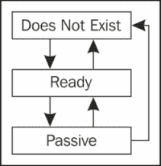
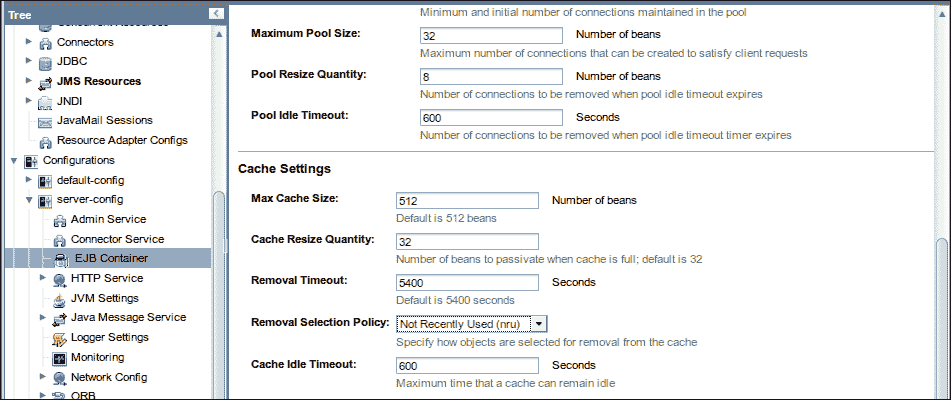
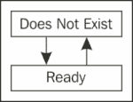
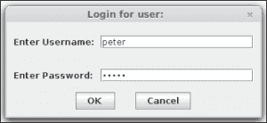

# 第四章：企业 JavaBeans

企业 JavaBeans 是封装应用程序业务逻辑的服务端组件。企业 JavaBeans 通过自动管理事务管理和安全性来简化应用程序开发。企业 JavaBeans 有两种类型：执行业务逻辑的会话 Bean，以及充当消息监听器的消息驱动 Bean。

熟悉 J2EE 的读者可能会注意到，在前一段落中没有提到实体 Bean。在 Java EE 5 中，实体 Bean 被废弃，取而代之的是**Java 持久化 API**（**JPA**）。尽管实体 Bean 仍然支持向后兼容，但执行对象关系映射的首选方式是通过 JPA。

本章将涵盖以下主题：

+   会话 Bean

    +   一个简单的会话 Bean

    +   更现实的例子

    +   使用会话 Bean 实现 DAO 设计模式

    +   单例会话 Bean

+   消息驱动 Bean

+   企业 JavaBeans 中的事务

    +   容器管理的交易

    +   Bean 管理的交易

+   企业 JavaBeans 生命周期

    +   状态与会话 Bean 的生命周期

    +   无状态会话 Bean 的生命周期

    +   消息驱动 Bean 的生命周期

    +   EJB 定时器服务

    +   EJB 安全性

# 会话 Bean 简介

如我们之前提到的，会话 Bean 通常封装业务逻辑。在 Java EE 中，创建会话 Bean 只需要创建一个或两个工件，即 Bean 本身和可选的业务接口。这些工件需要用适当的注解装饰，以便让 EJB 容器知道它们是会话 Bean。

### 注意

J2EE 要求应用程序开发者创建几个工件以创建会话 Bean。这些工件包括 Bean 本身、本地或远程接口（或两者），本地 Home 或远程 Home 接口（或两者），以及 XML 部署描述符。正如我们将在本章中看到的，Java EE 极大地简化了 EJB 开发。

## 开发一个简单的会话 Bean

以下示例说明了一个非常简单的会话 Bean：

```java
package net.ensode.glassfishbook;

import javax.ejb.Stateless;

@Stateless
public class SimpleSessionBean implements SimpleSession
{  
  private String message = 
      "If you don't see this, it didn't work!";

  public String getMessage()
  {
    return message;
  }
}
```

`@Stateless`注解让 EJB 容器知道这个类是一个无状态会话 Bean。有三种类型的会话 Bean：无状态、状态与会话和单例。在我们解释这些类型会话 Bean 之间的区别之前，我们需要明确 EJB 实例是如何提供给 EJB 客户端应用程序的。

当无状态或状态与会话 Bean 部署时，EJB 容器为每个会话 Bean 创建一系列实例。这通常被称为 EJB 池。当 EJB 客户端应用程序获取 EJB 的一个实例时，应用程序服务器（在我们的例子中是 GlassFish）将池中的一个实例提供给客户端应用程序。

有状态会话 bean 和无状态会话 bean 之间的区别在于，有状态会话 bean 与客户端保持会话状态，而无状态会话 bean 则不保持。简单来说，这意味着当一个 EJB 客户端应用程序获取一个有状态会话 bean 的实例时，我们可以保证 bean 中任何实例变量的值在方法调用之间是一致的。在有状态会话 bean 上修改任何实例变量都是安全的，因为它们将在下一次方法调用中保留其值。EJB 容器通过钝化有状态会话 bean 来保存会话状态，并在 bean 被激活时检索该状态。会话状态是有状态会话 bean 的生命周期比无状态会话 bean 和消息驱动 bean 复杂一些的原因（EJB 生命周期将在本章后面讨论）。

当 EJB 客户端应用程序请求一个无状态会话 bean 的实例时，EJB 容器可能会从池中提供任何 EJB 实例。由于我们不能保证每次方法调用都使用相同的实例，因此在无状态会话 bean 中设置的任何实例变量的值可能会“丢失”（它们实际上并没有丢失；修改发生在池中 EJB 的另一个实例中）。

除了被`@Stateless`注解装饰之外，之前的类并没有什么特别之处。请注意，它实现了一个名为`SimpleSession`的接口。这个接口是 bean 的业务接口。`SimpleSession`接口在下面的代码中展示：

```java
package net.ensode.glassfishbook;

import javax.ejb.Remote;

@Remote
public interface SimpleSession
{
  public String getMessage();
}
```

这个接口唯一特殊的地方是它被`@Remote`注解装饰。这个注解表示这是一个远程业务接口。这意味着该接口可能位于调用它的客户端应用程序不同的 JVM 中。远程业务接口甚至可以在网络上被调用。

业务接口也可以被`@Local`接口装饰。这个注解表示业务接口是一个本地业务接口。本地业务接口的实现必须与调用其方法的客户端应用程序在同一个 JVM 中。

由于远程业务接口可以从与客户端应用程序相同的 JVM 或不同的 JVM 中调用，乍一看，我们可能会倾向于将所有业务接口都做成远程的。在这样做之前，我们必须提醒自己，远程业务接口提供的灵活性伴随着性能上的代价，因为方法调用是在假设它们将在网络上进行的情况下进行的。事实上，大多数典型的 Java EE 应用程序由充当 EJB 客户端应用程序的 Web 应用程序组成；在这种情况下，客户端应用程序和 EJB 运行在同一个 JVM 上，因此本地接口比远程业务接口使用得更多。

一旦我们编译了会话 Bean 及其对应的企业接口，我们需要将它们放入一个 JAR 文件中并部署它们。就像处理 WAR 文件一样，部署 EJB JAR 文件最简单的方法是将它复制到 `[glassfish 安装目录]/glassfish/domains/domain1/autodeploy`。

既然我们已经看到了会话 Bean 及其对应的企业接口，让我们看一下一个客户端示例应用程序：

```java
package net.ensode.glassfishbook;

import javax.ejb.EJB;

public class SessionBeanClient
{
 @EJB
  private static SimpleSession simpleSession;

  private void invokeSessionBeanMethods()
  {
    System.out.println(simpleSession.getMessage());

    System.out.println("\nSimpleSession is of type: "
        + simpleSession.getClass().getName());
  }

  public static void main(String[] args)
  {
    new SessionBeanClient().invokeSessionBeanMethods();
  }

}
```

前面的代码只是声明了一个类型为 `net.ensode.SimpleSession` 的实例变量，这是我们的会话 Bean 的企业接口。这个实例变量被 `@EJB` 注解所装饰。`@EJB` 注解让 EJB 容器知道这个变量是一个会话 Bean 的企业接口。然后 EJB 容器注入一个企业接口的实现供客户端代码使用。

由于我们的客户端是一个独立的应用程序（而不是像 WAR 文件或另一个 EJB JAR 文件这样的 Java EE 艺术品），为了使其能够访问服务器上部署的代码，它必须被放入一个 JAR 文件中并通过 appclient 工具执行。appclient 工具是 GlassFish 特定的工具，允许独立 Java 应用程序访问部署到应用服务器的资源。这个工具可以在 `[glassfish 安装目录]/glassfish/bin/` 找到。假设这个目录在 `PATH` 环境变量中，并且我们已经将我们的客户端代码放入了一个名为 `simplesessionbeanclient.jar` 的 JAR 文件中，我们将在命令行中键入以下命令来执行前面的客户端代码：

```java
appclient -client simplesessionbeanclient.jar

```

执行前面的命令会产生以下控制台输出：

```java
If you don't see this, it didn't work!

SimpleSession is of type: net.ensode.glassfishbook._SimpleSession_Wrapper

```

这是 `SessionBeanClient` 类的输出。

### 注意

我们正在使用 Maven 来构建我们的代码。在这个例子中，我们使用了 Maven Assembly 插件 ([`maven.apache.org/plugins/maven-assembly-plugin/`](http://maven.apache.org/plugins/maven-assembly-plugin/)) 来构建一个包含所有依赖项的客户端 JAR 文件；这使我们免去了在 `appclient` 工具的 `-classpath` 命令行选项中指定所有依赖 JAR 文件的麻烦。要构建这个 JAR 文件，只需在命令行中调用 `mvn assembly:assembly` 即可。

输出的第一行仅仅是我们在会话 Bean 中实现的 `getMessage()` 方法的返回值。输出的第二行显示了实现企业接口的类的完全限定名称。请注意，类名不是我们所写的会话 Bean 的完全限定名称；相反，实际上提供的是由 EJB 容器在幕后创建的企业接口的实现。

## 一个更实际的例子

在上一节中，我们看到了一个非常简单、类似于“Hello world”的示例。在本节中，我们将展示一个更实际的示例。会话 Bean 通常用作**数据访问对象**（**DAO**）。有时，它们用作 JDBC 调用和其他调用（例如获取或修改 JPA 实体）的包装器。在本节中，我们将采用后一种方法。

以下示例说明了如何在会话 Bean 中实现 DAO 设计模式。在查看 Bean 实现之前，让我们看看它对应的业务接口：

```java
package net.ensode.glassfishbook;

import javax.ejb.Remote;

@Remote
public interface CustomerDao
{
  public void saveCustomer(Customer customer);

  public Customer getCustomer(Long customerId);

  public void deleteCustomer(Customer customer);
}
```

如我们所见，之前的代码是一个实现三个方法的远程接口：`the saveCustomer()`方法将客户数据保存到数据库中，`getCustomer()`方法从数据库中获取客户数据，而`deleteCustomer()`方法从数据库中删除客户数据。其中两个方法以我们在第三章中开发的`Customer`实体实例作为参数。第三个方法`getCustomer()`，它接受一个`Long`值，代表我们希望从数据库中检索的`Customer`对象的 ID。

现在我们来看看实现先前业务接口的会话 Bean。正如我们将在下面的代码中看到的，在会话 Bean 中实现 JPA 代码的方式和在普通 Java 对象中实现的方式之间有一些区别：

```java
package net.ensode.glassfishbook;

import javax.ejb.Stateful;
import javax.persistence.EntityManager;
import javax.persistence.PersistenceContext;

@Stateful
public class CustomerDaoBean implements CustomerDao {

    @PersistenceContext
    private EntityManager entityManager;    

    public void saveCustomer(Customer customer) {
        if (customer.getCustomerId() == null) {
            saveNewCustomer(customer);
        } else {
            updateCustomer(customer);
        }
    }

    private void saveNewCustomer(Customer customer) {
        entityManager.persist(customer);
    }

    private void updateCustomer(Customer customer) {
        entityManager.merge(customer);
    }

    public Customer getCustomer(Long customerId) {
        Customer customer;

        customer = entityManager.find(Customer.class, customerId);

        return customer;
    }

    public void deleteCustomer(Customer customer) {
        entityManager.remove(customer);
    }
}
```

我们会话 Bean 与之前的 JPA 示例之间的主要区别在于，JPA 调用被包裹在`UserTransaction.begin()`和`UserTransaction.commit()`调用之间。我们必须这样做的原因是 JPA 调用需要被包裹在事务中；如果它们没有被包裹在事务中，大多数 JPA 调用将抛出`TransactionRequiredException`。在这种情况下，我们不需要像之前示例中那样显式地包裹 JPA 调用在事务中，因为会话 Bean 方法隐式地是事务性的；我们不需要做任何事情来使它们成为那样。这种默认行为被称为**容器管理事务**。容器管理事务将在本章后面详细讨论。

### 注意

如第三章中所述，*使用 JPA 进行对象关系映射*，当从一笔交易中检索 JPA 实体并将其更新到另一笔交易时，需要调用`EntityManager.merge()`方法来更新数据库中的数据。在这种情况下调用`EntityManager.persist()`将导致`Cannot persist detached object`异常。

## 从 Web 应用程序调用会话 Bean

通常，Java EE 应用程序由充当 EJB 客户端的 Web 应用程序组成。在 Java EE 6 之前，部署由 Web 应用程序和一个或多个会话 Bean 组成的 Java EE 应用程序的最常见方式是将 Web 应用程序的 WAR 文件和 EJB JAR 文件打包成一个 EAR（企业存档）文件。

Java EE 6 简化了由 EJB 和 Web 组件组成的应用程序的打包和部署。

在本节中，我们将开发一个 JSF 应用程序，其中包含一个 CDI 命名的 Bean 作为我们之前章节中讨论的 DAO 会话 Bean 的客户端。

为了使这个应用程序充当 EJB 客户端，我们将开发一个名为`CustomerController`的 Bean，以便将保存新客户到数据库的逻辑委托给我们在上一节中开发的`CustomerDaoBean`会话 Bean。我们将开发一个名为`CustomerController`的 Bean，如下面的代码所示：

```java
package net.ensode.glassfishbook.jsfjpa;

//imports omitted for brevity

@Named
@RequestScoped
public class CustomerController implements Serializable {

 @EJB
 private CustomerDaoBean customerDaoBean;

    private Customer customer;

    private String firstName;
    private String lastName;
    private String email;

    public CustomerController() {
        customer = new Customer();
    }

    public String saveCustomer() {
        String returnValue = "customer_saved";

        try {
            populateCustomer();
            customerDaoBean.saveCustomer(customer);
        } catch (Exception e) {
            e.printStackTrace();
            returnValue = "error_saving_customer";
        }

        return returnValue;
    }

    private void populateCustomer() {
        if (customer == null) {
            customer = new Customer();
        }
        customer.setFirstName(getFirstName());
        customer.setLastName(getLastName());
        customer.setEmail(getEmail());
    }

//setters and getters omitted for brevity

}
```

如我们所见，我们只需声明一个`CustomerDaoBean`会话 Bean 的实例，并用`@EJB`注解装饰它，以便注入相应的 EJB 实例，然后调用 EJB 的`saveCustomer()`方法。

注意，我们直接将会话 Bean 的实例注入到我们的客户端代码中。我们可以这样做的原因是 Java EE 6 引入的一个特性。当使用 Java EE 6 或更高版本时，我们可以去掉本地接口，并在客户端代码中直接使用会话 Bean 实例。

现在我们已经修改了我们的 Web 应用程序以作为我们的会话 Bean 的客户端，我们需要将其打包成 WAR（Web 存档）文件并部署以使用它。

## 单例会话 Bean 简介

Java EE 6 中引入的一种新型会话 Bean 是单例会话 Bean。每个单例会话 Bean 在应用程序中只存在一个实例。

单例会话 Bean 对于缓存数据库数据很有用。在单例会话 Bean 中缓存常用数据可以提高性能，因为它大大减少了访问数据库的次数。常见的模式是在我们的 Bean 中有一个用`@PostConstruct`注解装饰的方法；在这个方法中，我们检索我们想要缓存的数据。然后我们提供一个 setter 方法供 Bean 的客户端调用。以下示例说明了这种技术：

```java
package net.ensode.glassfishbook.singletonsession;

import java.util.List;
import javax.annotation.PostConstruct;
import javax.ejb.Singleton;
import javax.persistence.EntityManager;
import javax.persistence.PersistenceContext;
import javax.persistence.Query;
import net.ensode.glassfishbook.entity.UsStates;

@Singleton
public class SingletonSessionBean implements
    SingletonSessionBeanRemote {

  @PersistenceContext
  private EntityManager entityManager;
  private List<UsStates> stateList;

  @PostConstruct
  public void init() {
    Query query = entityManager.createQuery(
        "Select us from UsStates us");
    stateList = query.getResultList();
  }

  @Override
  public List<UsStates> getStateList() {
    return stateList;
  }
}
```

由于我们的 Bean 是单例的，所以所有客户端都会访问同一个实例，避免了多次查询数据库。此外，由于它是单例的，可以安全地指定实例变量，因为所有客户端都访问同一个 Bean 的实例。

## 异步方法调用

有时进行一些异步处理是有用的，也就是说，调用一个方法调用并立即将控制权返回给客户端，而无需让客户端等待方法完成。

在 Java EE 的早期版本中，调用 EJB 方法异步的唯一方法是使用消息驱动豆（将在下一节中讨论）。尽管消息驱动豆编写起来相对简单，但它们在使用之前确实需要一些配置，例如设置 JMS 消息队列或主题。

EJB 3.1 引入了`@Asynchronous`注解，它可以用来标记会话豆中的方法为异步。当 EJB 客户端调用异步方法时，控制权立即返回客户端，无需等待方法完成。

异步方法只能返回 void 或`java.util.concurrent.Future`接口的实现。`Future`接口是在 Java 5 中引入的，表示异步计算的最终结果。以下示例说明了这两种情况：

```java
package net.ensode.glassfishbook.asynchronousmethods;

import java.util.concurrent.Future;
import java.util.logging.Level;
import java.util.logging.Logger;
import javax.ejb.AsyncResult;
import javax.ejb.Asynchronous;
import javax.ejb.Stateless;

@Stateless
public class AsynchronousSessionBean implements
    AsynchronousSessionBeanRemote {

  private static Logger logger = Logger.getLogger(
      AsynchronousSessionBean.class.getName());

 @Asynchronous
  @Override
 public void slowMethod() {
    long startTime = System.currentTimeMillis();
    logger.info("entering " + this.getClass().getCanonicalName()
        + ".slowMethod()");
    try {
      Thread.sleep(10000); //simulate processing for 10 seconds
    } catch (InterruptedException ex) {
      Logger.getLogger(AsynchronousSessionBean.class.getName()).
          log(Level.SEVERE, null, ex);
    }
    logger.info("leaving " + this.getClass().getCanonicalName()
        + ".slowMethod()");
    long endTime = System.currentTimeMillis();
    logger.info("execution took " + (endTime - startTime)
        + " milliseconds");
  }

 @Asynchronous
  @Override
 public Future<Long> slowMethodWithReturnValue() {
    try {
      Thread.sleep(15000); //simulate processing for 15 seconds
    } catch (InterruptedException ex) {
      Logger.getLogger(AsynchronousSessionBean.class.getName()).
          log(Level.SEVERE, null, ex);
    }

    return new AsyncResult<Long>(42L);
  }
}
```

当我们的异步方法返回 void 时，我们只需要用`@Asynchronous`注解装饰方法，然后像往常一样从客户端代码中调用它。

如果我们需要返回值，则此值需要包装在`jav.util.concurrent.Future`接口的实现中。Java EE API 以`javax.ejb.AsyncResult`类的形式提供了一个便利的实现。`Future`接口和`AsyncResult`类都使用泛型，因此我们需要指定我们的返回类型作为这些实体的类型参数。

`Future`接口有几种我们可以用来取消异步方法执行、检查方法是否完成、获取方法的返回值以及检查方法是否被取消的方法。以下表格列出了这些方法：

| 方法 | 描述 |
| --- | --- |
| `cancel(boolean mayInterruptIfRunning)` | 此方法将取消方法执行。如果布尔参数为`true`，则此方法将尝试取消方法执行，即使它已经在运行。 |
| `get()` | 此方法将返回方法的“未包装”返回值；它将是方法返回的`Future`接口实现类型参数。 |
| `get(long timeout, TimeUnit unit)` | 此方法将尝试获取方法的`未包装`返回值；返回值将是方法返回的`Future`接口实现类型参数。此方法将阻塞指定的时间参数。等待时间的单位由第二个参数确定，`TimeUnit`枚举具有 NANOSECONDS、MILLISECONDS、SECONDS、MINUTES 等常量。有关完整列表，请参阅其 Javadoc 文档。 |
| `isCancelled()` | 如果方法已被取消，则此方法返回`true`；否则返回`false`。 |
| `isDone()` | 如果方法已执行完成，则此方法返回`true`；否则返回`false`。 |

如我们所见，`@Asynchronous` 注解使得在不设置消息队列或主题的开销下进行异步调用变得非常容易。这无疑是 EJB 规范中的一个受欢迎的补充。

# 消息驱动 Bean

**Java 消息服务**（**JMS**）是一个用于不同应用程序之间异步通信的 Java EE API。JMS 消息存储在消息队列或消息主题中。

消息驱动 Bean 的目的是从 JMS 队列或 JMS 主题（根据所使用的消息域）消费消息（参见第八章，*Java 消息服务*）。消息驱动 Bean 必须使用 `@MessageDriven` 注解进行装饰。此注解的 `mappedName` 属性必须包含 Bean 将从中消费消息的 JNDI 名称的 JMS 消息队列或 JMS 消息主题。以下示例演示了一个简单的消息驱动 Bean：

```java
package net.ensode.glassfishbook;

import javax.ejb.MessageDriven;
import javax.jms.JMSException;
import javax.jms.Message;
import javax.jms.MessageListener;
import javax.jms.TextMessage;

@MessageDriven(mappedName = "jms/GlassFishBookQueue")
public class ExampleMessageDrivenBean implements MessageListener
{
  public void onMessage(Message message)
  {
    TextMessage textMessage = (TextMessage) message;
    try
    {
      System.out.print("Received the following message: ");
      System.out.println(textMessage.getText());
      System.out.println();
    }
    catch (JMSException e)
    {
      e.printStackTrace();
    }
  }
}
```

建议消息驱动 Bean 实现 `javax.jms.MessageListener` 接口，但这不是必需的。然而，消息驱动 Bean 必须有一个名为 `onMessage()` 的方法，其签名与前面的示例相同。

客户端应用程序永远不会直接调用消息驱动 Bean 的方法。相反，它们将消息放入消息队列或主题，然后 Bean 消费这些消息并相应地执行。前面的示例只是将消息打印到标准输出，因为消息驱动 Bean 在 EJB 容器中执行；标准输出被重定向到日志。要查看 GlassFish 服务器日志中的消息，请打开 `[GlassFish 安装目录]/glassfish/domains/domain1/logs/server.log` 文件。

# 企业 JavaBean 中的事务

如我们本章前面提到的，默认情况下，所有 EJB 方法都会自动被事务包装。这种默认行为被称为**容器管理事务**，因为事务是由 EJB 容器管理的。应用程序开发者也可以选择自己管理事务；这可以通过使用 Bean 管理事务来实现。这两种方法将在以下章节中讨论。

## 容器管理事务

由于 EJB 方法默认是事务性的，当从已经处于事务中的客户端代码调用 EJB 方法时，我们会遇到一个有趣的困境。EJB 容器应该如何表现？它应该挂起客户端事务，在一个新的事务中执行其方法，然后恢复客户端事务？或者它不应该创建新的事务，而是将方法作为客户端事务的一部分执行？或者它应该抛出异常？

默认情况下，如果 EJB 方法被已经在事务中的客户端代码调用，EJB 容器将简单地执行会话 bean 方法作为客户端事务的一部分。如果这不是我们需要的操作，我们可以通过使用`@TransactionAttribute`注解来改变它。这个注解有一个`value`属性，它决定了当会话 bean 方法在现有事务中调用以及在外部任何事务中调用时，EJB 容器将如何行为。`value`属性的值通常是定义在`javax.ejb.TransactionAttributeType`枚举中的常量。

以下表格列出了`@TransactionAttribute`注解的可能值：

| @TransactionAttribute value | 描述 |
| --- | --- |
| `TransactionAttributeType.MANDATORY` | 强制方法作为客户端事务的一部分被调用。如果这个方法在任何事务之外被调用，它将抛出`TransactionRequiredException`异常 |
| `TransactionAttributeType.NEVER` | 该方法永远不会在事务中执行。如果它作为客户端事务的一部分被调用，将抛出`RemoteException`异常。如果没有在客户端事务中调用该方法，则不会创建任何事务。 |
| `TransactionAttributeType.NOT_SUPPORTED` | 该方法作为客户端事务的一部分被调用，客户端事务被挂起，方法在任意事务之外执行。方法执行完毕后，客户端事务将恢复。如果没有在客户端事务中调用该方法，则不会创建任何事务。 |
| `TransactionAttributeType.REQUIRED` | 该方法作为客户端事务的一部分被调用，它作为该事务的一部分执行。如果方法在事务外部被调用，将为该方法创建一个新的事务。这是默认行为。 |
| `TransactionAttributeType.REQUIRES_NEW` | 该方法作为客户端事务的一部分被调用，该事务被挂起，并为该方法创建一个新的事务。一旦方法执行完毕，客户端事务将恢复。如果方法在事务外部被调用，将为该方法创建一个新的事务。 |
| `TransactionAttributeType.SUPPORTS` | 该方法作为客户端事务的一部分被调用，它作为该事务的一部分执行。如果方法在事务外部被调用，不会为该方法创建新的事务。 |

尽管在大多数情况下默认事务属性是合理的，但如果需要，能够覆盖这个默认设置是很好的。例如，事务会有性能影响。因此，能够关闭不需要事务的方法的事务是有益的。对于这种情况，我们可以在以下代码片段中看到，我们会对方法进行装饰：

```java
@TransactionAttribute(value=TransactionAttributeType.NEVER)
public void doitAsFastAsPossible()
{
  //performance critical code goes here.
}
```

可以通过在`TransactionAttributeType`枚举中用相应的常量注解方法来声明其他事务属性类型。

如果我们希望一致地覆盖会话 Bean 中所有方法的默认交易属性，我们可以用 `@TransactionAttribute` 注解装饰会话 Bean 类；其 `value` 属性的值将应用于会话 Bean 中的每个方法。

容器管理的交易在 EJB 方法中抛出异常时将自动回滚。此外，我们可以通过在对应于要讨论的会话 Bean 的 `javax.ejb.EJBContext` 实例上调用 `setRollbackOnly()` 方法来程序化地回滚容器管理的交易。以下是一个示例，展示了我们在本章前面看到的会话 Bean 的新版本，修改后可以在必要时回滚交易：

```java
package net.ensode.glassfishbook;

//imports omitted

@Stateless
public class CustomerDaoRollbackBean implements CustomerDaoRollback
{
 @Resource
 private EJBContext ejbContext;

  @PersistenceContext
  private EntityManager entityManager;

  @Resource(name = "jdbc/__CustomerDBPool")
  private DataSource dataSource;

  public void saveNewCustomer(Customer customer)
  {
 if (customer == null || customer.getCustomerId() != null)
 {
 ejbContext.setRollbackOnly();
 }
    else
    {
      customer.setCustomerId(getNewCustomerId());
      entityManager.persist(customer);
    }
  }

  public void updateCustomer(Customer customer)
  {
 if (customer == null || customer.getCustomerId() == null)
 {
 ejbContext.setRollbackOnly();
 }
    else
    {
      entityManager.merge(customer);
    }
  }
//Additional methods omitted for brevity.

}
```

在这个 DAO 会话 Bean 的版本中，我们删除了 `saveCustomer()` 方法，并将 `saveNewCustomer()` 和 `updateCustomer()` 方法设置为公共。现在，这些方法中的每一个都会检查我们试图执行的操作的 `customerId` 字段是否设置正确（对于插入为 `null`，对于更新则不为 `null`）。它还会检查要持久化的对象是否不为 `null`。如果任何检查导致无效数据，方法将简单地通过在注入的 `EJBContext` 实例上调用 `setRollBackOnly()` 方法来回滚交易，并且不会更新数据库。

## Bean 管理的交易

正如我们所见，容器管理的交易使得编写包含在交易中的代码变得极其容易。毕竟，我们不需要做任何特别的事情来使它们变得这样；事实上，一些开发者在开发会话 Bean 时有时甚至没有意识到他们正在编写将具有交易性质的代码。容器管理的交易涵盖了我们将遇到的典型情况的大部分。然而，它们确实有一个限制：每个方法最多只能包含一个交易。使用容器管理的交易，无法实现生成多个交易的交易，这可以通过如以下代码所示的 Bean 管理的交易来完成：

```java
package net.ensode.glassfishbook;

import java.sql.Connection;
import java.sql.PreparedStatement;
import java.sql.ResultSet;
import java.sql.SQLException;
import java.util.List;

import javax.annotation.Resource;
import javax.ejb.Stateless;
import javax.ejb.TransactionManagement;
import javax.ejb.TransactionManagementType;
import javax.persistence.EntityManager;

//imports omitted 

@Stateless
@TransactionManagement(value = TransactionManagementType.BEAN)
public class CustomerDaoBmtBean implements CustomerDaoBmt
{
 @Resource
 private UserTransaction userTransaction;

  @PersistenceContext
  private EntityManager entityManager;

  @Resource(name = "jdbc/__CustomerDBPool")
  private DataSource dataSource;

  public void saveMultipleNewCustomers(
      List<Customer> customerList)
  {
    for (Customer customer : customerList)
    {
      try
      {
 userTransaction.begin();
        customer.setCustomerId(getNewCustomerId());
        entityManager.persist(customer);
 userTransaction.commit();
      }
      catch (Exception e)
      {
        e.printStackTrace();
      }
    }
  }

  private Long getNewCustomerId()
  {
    Connection connection;
    Long newCustomerId = null;
    try
    {
      connection = dataSource.getConnection();
      PreparedStatement preparedStatement = 
          connection.prepareStatement("select " +
          "max(customer_id)+1 as new_customer_id " + 
          "from customers");

      ResultSet resultSet = preparedStatement.executeQuery();

      if (resultSet != null && resultSet.next())
      {
        newCustomerId = resultSet.getLong("new_customer_id");
      }

      connection.close();
    }
    catch (SQLException e)
    {
      e.printStackTrace();
    }

    return newCustomerId;
  }
}
```

在这个示例中，我们实现了一个名为 `saveMultipleNewCustomers()` 的方法。此方法仅接受一个客户 `List` 作为其唯一参数。此方法的目的是在 `ArrayList` 中尽可能多地保存元素。保存实体时发生异常不应阻止方法尝试保存剩余元素。使用容器管理的交易无法实现此行为，因为如果在保存实体时抛出异常，则整个交易将回滚。实现此行为的唯一方法是使用 Bean 管理的交易。

如前例所示，我们通过在类上添加`@TransactionManagement`注解，并使用`TransactionManagementType.BEAN`作为其`value`属性的值（此属性的另一个有效值是`TransactionManagementType.CONTAINER`，但由于这是默认值，因此没有必要指定它）来声明会话 Bean 使用 Bean 管理的交易。

为了能够以编程方式控制事务，我们注入一个`javax.transaction.UserTransaction`的实例，然后在`saveMultipleNewCustomers()`方法内的`for`循环中使用它来开始和提交每个循环迭代的交易。

如果我们需要回滚一个 Bean 管理的交易，我们可以通过在适当的`javax.transaction.UserTransaction`实例上调用`rollback()`方法来实现。

在继续之前，值得注意的是，尽管本节中的所有示例都实现为会话 Bean，但这些概念同样适用于消息驱动 Bean。

# 企业 JavaBean 生命周期

企业 JavaBean 在其生命周期中会经历不同的状态。每种类型的 EJB 都有不同的状态。每种类型 EJB 的特定状态将在下一节中讨论。

## 有状态会话 Bean 的生命周期

对于熟悉 J2EE 先前版本的读者来说，可能会记得在先前版本的规范中，会话 Bean 必须实现`javax.ejb.SessionBean`接口。此接口提供了在会话 Bean 生命周期中特定点执行的方法。由`SessionBean`接口提供的方法包括：

+   `ejbActivate()`

+   `ejbPassivate()`

+   `ejbRemove()`

+   `setSessionContext(SessionContext ctx)`

前三个方法旨在在 Bean 的生命周期中的特定点执行。在大多数情况下，这些方法的实现中没有什么可做的。这一事实导致了绝大多数会话 Bean 实现了这些方法的空版本。幸运的是，从 Java EE 5 开始，不再需要实现`SessionBean`接口，然而，如果需要，我们仍然可以编写将在 Bean 生命周期中的特定点执行的方法。我们可以通过使用特定的注解来装饰方法来实现这一点。

在解释可用于实现生命周期方法的可用的注解之前，有必要简要说明会话 Bean 的生命周期。有状态会话 Bean 的生命周期与无状态会话 Bean 的生命周期不同。

有状态会话 Bean 的生命周期包含三个状态：**不存在**、**就绪**和**被动**，如下所示：



在有状态会话 bean 部署之前，它处于不存在状态。部署成功后，EJB 容器为 bean 执行任何必需的依赖注入，bean 进入就绪状态。此时，bean 准备好被客户端应用程序调用其方法。

当一个有状态会话 bean 处于就绪状态时，EJB 容器可能会决定将其钝化，即将其从主内存移动到二级存储。当这种情况发生时，bean 进入**被动**状态。如果一段时间内没有访问有状态会话 bean 的实例，EJB 容器将把 bean 设置为不存在状态。默认情况下，GlassFish 将在 90 分钟的非活动状态后将有状态会话 bean 发送到不存在状态。此默认值可以通过以下步骤进行更改：

1.  登录到 GlassFish 管理控制台。

1.  展开左侧树中的**配置**节点。

1.  展开**server-config**节点。

1.  点击**EJB 容器**节点。

1.  将页面滚动到页面底部并修改**移除超时**文本字段的值。

1.  点击**保存**按钮，如下面的截图所示：



此技术为所有有状态会话 bean 设置超时值。如果我们需要修改特定会话 bean 的超时值，我们需要在包含会话 bean 的 JAR 文件中包含一个`glassfish-ejb-jar.xml`部署描述符。在这个部署描述符中，我们可以将超时值设置为`<removal-timeout-in-seconds>`元素的值，如下面的代码所示：

```java
<?xml version="1.0" encoding="UTF-8"?>
<!DOCTYPE glassfish-ejb-jar PUBLIC "-//GlassFish.org//DTD GlassFish Application Server 3.1 EJB 3.1//EN" "http://glassfish.org/dtds/glassfish-ejb-jar_3_1-1.dtd">
<glassfish-ejb-jar>
  <enterprise-beans>
    <ejb>
 <ejb-name>MyStatefulSessionBean</ejb-name>
      <bean-cache>
 <removal-timeout-in-seconds>
 600
 </removal-timeout-in-seconds>
      </bean-cache>
    </ejb>
  </enterprise-beans>
</glassfish-ejb-jar>
```

尽管我们不再需要为我们的会话 bean 创建`ejb-jar.xml`文件（这在 J2EE 规范的前版本中是必须的），但如果我们愿意，我们仍然可以创建一个。`glassfish-ejb-jar.xml`部署描述符中的`<ejb-name>`元素必须与`ejb-jar.xml`中同名元素的值匹配。如果我们选择不创建`ejb-jar.xml`文件，此值必须与 EJB 类的名称匹配。有状态会话 bean 的超时值必须是`<removal-timeout-in-seconds>`元素的值；正如元素名称所暗示的，时间单位是秒。在先前的例子中，我们将超时值设置为 600 秒，即 10 分钟。

在有状态会话 bean 中装饰了`@PostActivate`注解的任何方法将在有状态会话 bean 激活后立即被调用。这相当于在 J2EE 的早期版本中实现`ejbActivate()`方法。同样，任何装饰了`@PrePassivate`注解的方法将在有状态会话 bean 钝化之前被调用；这相当于在 J2EE 的早期版本中实现`ejbPassivate()`方法。

当一个处于就绪状态的有状态会话豆超时并被发送到“不存在”状态时，任何被 `@PreDestroy` 注解装饰的方法都会执行。如果会话豆在被动状态下超时，则不会执行被 `@PreDestroy` 注解装饰的方法。此外，如果状态会话豆的客户执行了一个被 `@Remove` 注解装饰的方法，则所有被 `@PreDestroy` 注解装饰的方法都会执行，并且豆将被标记为垃圾回收。用 `@Remove` 注解装饰一个方法等同于在 J2EE 规范的前版本中实现 `ejbRemove()` 方法。

`@PostActivate`、`@PrePassivate` 和 `@Remove` 注解仅适用于有状态会话豆，而 `@PreDestroy` 和 `@PostConstruct` 注解适用于有状态会话豆、无状态会话豆和消息驱动豆。

## 无状态会话豆的生命周期

无状态会话豆的生命周期只包含**不存在**和**就绪**状态，如下面的图所示：



无状态会话豆永远不会钝化。无状态会话豆的方法可以被 `@PostConstruct` 和 `@PreDestroy` 注解装饰。就像有状态会话豆一样，任何被 `@PostConstruct` 注解装饰的方法将在无状态会话豆从“不存在”状态变为“就绪”状态时执行，任何被 `@PreDestroy` 注解装饰的方法将在无状态会话豆从“就绪”状态变为“不存在”状态时执行。无状态会话豆永远不会钝化，任何无状态会话豆中的 `@PrePassivate` 和 `@PostActivate` 注解都将被 EJB 容器简单地忽略。

就像有状态会话豆一样，我们可以通过管理控制台来控制 GlassFish 如何管理无状态会话豆（和消息驱动豆）的生命周期，如下面的屏幕截图所示：


+   **初始和最小池大小**指的是池中的最小豆数

+   **最大池大小**指的是池中的最大豆数

+   **池大小调整数量**指的是当**池空闲超时**值到期时，将从池中移除多少豆

+   **池空闲超时**指的是在从池中移除豆之前需要经过的不活动秒数

之前的设置会影响所有 `poolable` EJB，例如无状态会话豆和无状态消息驱动豆。就像有状态会话豆一样，这些设置可以通过添加一个 GlassFish 特定的 `glassfish-ejb-jar.xml` 部署描述符来逐个案例覆盖，如下面的代码所示：

```java
<?xml version="1.0" encoding="UTF-8"?>
<!DOCTYPE glassfish-ejb-jar PUBLIC "-//GlassFish.org//DTD GlassFish Application Server 3.1 EJB 3.1//EN" "http://glassfish.org/dtds/glassfish-ejb-jar_3_1-1.dtd">
<glassfish-ejb-jar>
    <enterprise-beans>
        <ejb>
            <ejb-name>MyStatelessSessionBean</ejb-name>
            <bean-pool>
                <steady-pool-size>10</steady-pool-size>
                <max-pool-size>60</max-pool-size>
                <resize-quantity>5</resize-quantity>
                <pool-idle-timeout-in-seconds>
                    900
                </pool-idle-timeout-in-seconds>
            </bean-pool>
        </ejb>
    </enterprise-beans>
</glassfish-ejb-jar>
```

+   `<steady-pool-size>` 行对应于 GlassFish 控制台中的**初始和最小池大小**

+   `<max-pool-size>`行对应于 GlassFish Web 控制台中的**最大池大小**。

+   `<resize-quantity>`行对应于 GlassFish Web 控制台中的**池调整数量**。

+   `<pool-idle-timeout-in-seconds>`行对应于 GlassFish Web 控制台中的**池空闲超时**。

## 消息驱动 Bean 生命周期

就像无状态会话 Bean 一样，消息驱动 Bean 只存在于“不存在”和“就绪”状态，如下所示：


上面的图像与之前的图像完全相同。消息驱动 Bean 与无状态会话 Bean 具有相同的生命周期。因此，用于说明生命周期的图像被重新使用。

消息驱动 Bean 可以有被`@PostConstruct`和`@PreDestroy`方法装饰的方法。被`@PostConstruct`方法装饰的方法将在 Bean 进入就绪状态之前执行。被`@PreDestroy`注解装饰的方法将在 Bean 进入不存在状态之前执行。

# EJB 计时器服务简介

无状态会话 Bean 和消息驱动 Bean 可以有一个在固定时间间隔定期执行的方法。这可以通过使用**EJB 计时器服务**来实现。以下示例说明了如何利用此功能：

```java
package net.ensode.glassfishbook;

//imports omitted

@Stateless
public class EjbTimerExampleBean implements EjbTimerExample
{
  private static Logger logger = Logger.getLogger(EjbTimerExampleBean.class
      .getName());
  @Resource
  TimerService timerService;

  public void startTimer(Serializable info)
  {
    Timer timer = timerService.createTimer
      (new Date(), 5000, info);
  }

  public void stopTimer(Serializable info)
  {
    Timer timer;
    Collection timers = timerService.getTimers();

    for (Object object : timers)
    {
      timer = ((Timer) object);

      if (timer.getInfo().equals(info))
      {
        timer.cancel();
        break;
      }
    }
  }

  @Timeout
  public void logMessage(Timer timer)
  {
    logger.info("This message was triggered by :" +
        timer.getInfo() + " at "
        + System.currentTimeMillis());
  }
}
```

在我们的示例中，我们通过使用`@Resource`注解装饰该类型的实例变量，注入了`javax.ejb.TimerService`接口的实现。然后，我们通过调用`TimerService`实例的`createTimer()`方法创建了一个计时器。

`createTimer()`方法有几个重载版本。我们选择使用的方法接受一个`java.util.Date`实例作为其第一个参数；此参数用于指示计时器应该何时首次到期（关闭）。在示例中，我们选择使用一个新的`Date`类实例，这实际上使得计时器立即到期。`createTimer()`方法的第二个参数是在计时器再次到期之前要等待的时间，以毫秒为单位。在我们的示例中，计时器被设置为每五秒到期一次。`createTimer()`方法的第三个参数可以是实现`java.io.Serializable`接口的任何类的实例。由于单个 EJB 可以同时执行多个计时器，因此此第三个参数用于唯一标识每个计时器。如果我们不需要标识计时器，可以将`null`作为此参数的值传递。

### 小贴士

调用`TimerService.createTimer()`方法的 EJB 方法必须来自 EJB 客户端。将此调用放置在带有`@PostConstruct`注解的 EJB 方法中，以便在 Bean 处于就绪状态时自动启动计时器，将会导致抛出`IllegalStateException`异常。

我们可以通过调用其 `cancel()` 方法来停止计时器。无法直接获取与 EJB 关联的单个计时器。我们需要做的是在 `TimerService` 实例上调用 `getTimers()` 方法，该实例与 EJB 相关联；此方法将返回一个包含与 EJB 关联的所有计时器的集合。然后我们可以遍历集合，通过调用其 `getInfo()` 方法来取消正确的计时器。此方法将返回我们传递给 `createTimer()` 方法的 `Serializable` 对象。

最后，任何带有 `@Timeout` 注解的 EJB 方法在计时器到期时都会执行。带有此注解的方法必须返回 void 并接受一个类型为 `javax.ejb.Timer` 的单个参数。在我们的例子中，该方法只是将一条消息写入服务器日志。

下面的类是之前 EJB 的独立客户端：

```java
package net.ensode.glassfishbook;

import javax.ejb.EJB;

public class Client
{
  @EJB
  private static EjbTimerExample ejbTimerExample;

  public static void main(String[] args)
  {
    try
    {
      System.out.println("Starting timer 1...");
 ejbTimerExample.startTimer("Timer 1");
      System.out.println("Sleeping for 2 seconds...");
      Thread.sleep(2000);
      System.out.println("Starting timer 2...");
 ejbTimerExample.startTimer("Timer 2");
      System.out.println("Sleeping for 30 seconds...");
      Thread.sleep(30000);
      System.out.println("Stopping timer 1...");
 ejbTimerExample.stopTimer("Timer 1");
      System.out.println("Stopping timer 2...");
 ejbTimerExample.stopTimer("Timer 2");
      System.out.println("Done.");
    }
    catch (InterruptedException e)
    {
      e.printStackTrace();
    }
  }
}
```

之前的例子只是启动了一个计时器，等待几秒钟，然后启动第二个计时器。然后它睡眠 30 秒，然后停止两个计时器。部署 EJB 并执行客户端后，我们应该在服务器日志中看到一些如下所示的条目：

```java
[2013-08-26T20:44:55.180-0400] [glassfish 4.0] [INFO] [] [net.ensode.glassfishbook.EjbTimerExampleBean] [tid: _ThreadID=147 _ThreadName=__ejb-thread-pool1] [timeMillis: 1377564295180] [levelValue: 800] [[

  This message was triggered by :Timer 1 at 1377564295180]]

[2013-08-26T20:44:57.203-0400] [glassfish 4.0] [INFO] [] [net.ensode.glassfishbook.EjbTimerExampleBean] [tid: _ThreadID=148 _ThreadName=__ejb-thread-pool2] [timeMillis: 1377564297203] [levelValue: 800] [[

  This message was triggered by :Timer 2 at 1377564297203]]

[2013-08-26T20:44:58.888-0400] [glassfish 4.0] [INFO] [] [net.ensode.glassfishbook.EjbTimerExampleBean] [tid: _ThreadID=149 _ThreadName=__ejb-thread-pool3] [timeMillis: 1377564298888] [levelValue: 800] [[

  This message was triggered by :Timer 1 at 1377564298888]]

[2013-08-26T20:45:01.156-0400] [glassfish 4.0] [INFO] [] [net.ensode.glassfishbook.EjbTimerExampleBean] [tid: _ThreadID=150 _ThreadName=__ejb-thread-pool4] [timeMillis: 1377564301156] [levelValue: 800] [[

  This message was triggered by :Timer 2 at 1377564301156]]
```

每当其中一个计时器到期时，都会创建这些条目。

## 基于日历的 EJB 计时器表达式

上一个示例中的例子有一个缺点：会话 beans 中的 `startTimer()` 方法必须从客户端调用才能启动计时器。这种限制使得计时器在 bean 部署后立即启动变得困难。

Java EE 6 引入了基于日历的 EJB 计时器表达式。基于日历的表达式允许我们的会话 beans 中的一个或多个方法在特定的日期和时间执行。例如，我们可以配置我们的一个方法在每晚 8:10 p.m. 执行，这正是以下示例所做的那样：

```java
package com.ensode.glassfishbook.calendarbasedtimer;

import java.util.logging.Logger;
import javax.ejb.Stateless;
import javax.ejb.LocalBean;
import javax.ejb.Schedule;

@Stateless
@LocalBean
public class CalendarBasedTimerEjbExampleBean {

  private static Logger logger = Logger.getLogger(
      CalendarBasedTimerEjbExampleBean.class.getName());

 @Schedule(hour = "20", minute = "10")
  public void logMessage() {
    logger.info("This message was triggered at:"
        + System.currentTimeMillis());
  }
}
```

正如您在这个例子中所看到的，我们通过 `javax.ejb.Schedule` 注解设置方法执行的时间。在这个特定的例子中，我们通过将 `@Schedule` 注解的 `hour` 属性设置为 `"20"`，并将其分钟属性设置为 `"10"` 来设置我们的方法在晚上 8:10 p.m. 执行。`hour` 属性是基于 24 小时的；20 点相当于晚上 8:00。

`@Schedule` 注解有几个其他属性，允许在指定方法何时执行时具有很大的灵活性；例如，我们可以让一个方法在每月的第三个星期五执行，或者月底的最后一天，等等。

下表列出了 `@Schedule` 注解中所有允许我们控制注解方法何时执行的属性：

| 属性 | 描述 | 示例值 | 默认值 |
| --- | --- | --- | --- |
| `dayOfMonth` | 月份中的某一天。 | `"3"`：月份的第三天`"Last"`：月底的最后一天`"-2"`：月底前两天`"1st Tue"`：月份的第一个星期二 | `"*"` |
| `dayOfWeek` | 周中的某一天 | `"3"`：每周三`"Thu"`：每周四 | `"*"` |
| `hour` | 一天中的小时（基于 24 小时制） | `"14"`：下午 2 点 | `"0"` |
| `minute` | 小时的分钟 | `"10"`：小时后的十分钟 | `"0"` |
| `month` | 年份的月份 | `"2"`：二月`"March"`：三月 | `"*"` |
| `second` | 分钟的第二位 | `"5"`：分钟后的五秒 | `"0"` |
| `timezone` | 时区 ID | `"America/New York"` | `""` |
| `year` | 四位数的年份 | `"2010"` | `"*"` |

除了单个值之外，大多数属性接受星号（`"*"”）作为通配符，这意味着被注释的方法将定期执行（每天、每小时等）。

此外，我们可以通过逗号分隔值来指定多个值，例如，如果我们需要一种方法在每个星期二和星期四执行，我们可以将该方法注释为`@Schedule(dayOfWeek="Tue, Thu")`。

我们也可以指定一个值的范围；第一个和最后一个值由连字符（*-*）分隔。要执行从星期一到星期五的方法，我们可以使用`@Schedule(dayOfWeek="Mon-Fri")`。

此外，我们可以指定方法需要每 n 个时间单位执行一次（例如，每天、每 2 小时、每 10 分钟等）。要执行类似的操作，我们可以使用`@Schedule(hour="*/12")`，这将使方法每 12 小时执行一次。

如我们所见，`@Schedule`注解在指定方法执行时间方面提供了很大的灵活性。此外，它还提供了我们不需要客户端调用即可激活调度的优势。它还具有使用类似于 cron 的语法的优势；因此，熟悉此 Unix 工具的开发者将感到使用此注解非常得心应手。

# EJB 安全

企业 JavaBeans 允许我们声明性地决定哪些用户可以访问其方法。例如，某些方法可能仅供具有特定角色的用户使用。一个典型的场景是，只有具有管理员角色的用户才能添加、删除或修改系统中的其他用户。

以下示例是本章前面看到的 DAO 会话 bean 的略微修改版本。在这个版本中，一些之前是私有的方法被改为公开。此外，会话 bean 被修改为只允许具有特定角色的用户访问其方法。

```java
package net.ensode.glassfishbook;

// imports omitted

@Stateless
@RolesAllowed("appadmin")
public class CustomerDaoBean implements CustomerDao
{
  @PersistenceContext
  private EntityManager entityManager;

  @Resource(name = "jdbc/__CustomerDBPool")
  private DataSource dataSource;

  public void saveCustomer(Customer customer)
  {
    if (customer.getCustomerId() == null)
    {
      saveNewCustomer(customer);
    }
    else
    {
      updateCustomer(customer);
    }
  }

  public Long saveNewCustomer(Customer customer)
  {    
    entityManager.persist(customer);

    return customer.getCustomerId();
  }

  public void updateCustomer(Customer customer)
  {
    entityManager.merge(customer);
  }

 @RolesAllowed(
 { "appuser", "appadmin" })
  public Customer getCustomer(Long customerId)
  {
    Customer customer;

    customer = entityManager.find(Customer.class, customerId);

    return customer;
  }

  public void deleteCustomer(Customer customer)
  {
    entityManager.remove(customer);
  }
}
```

如我们所见，我们使用`@RolesAllowed`注解声明哪些角色可以访问方法。此注解可以接受单个字符串或字符串数组作为其参数。当使用单个字符串作为此注解的参数时，只有具有该参数指定的角色的用户可以访问该方法。如果使用字符串数组作为参数，则具有数组元素中指定的任何角色的用户都可以访问该方法。

可以使用`@RolesAllowed`注解来装饰 EJB 类，在这种情况下，其值适用于 EJB 中的所有方法，或者适用于一个或多个方法。在后一种情况下，其值仅适用于被注解的方法。如果，像我们之前的例子一样，EJB 类及其一个或多个方法都被`@RolesAllowed`注解装饰，则方法级别的注解具有优先权。

应用程序角色需要映射到安全域的组名称（有关详细信息，请参阅第九章[Securing Java EE Applications]，*Securing Java EE Applications*）。此映射以及要使用的域设置在`glassfish-ejb-jar.xml`部署描述符中，如下所示：

```java
<?xml version="1.0" encoding="UTF-8"?>
<!DOCTYPE glassfish-ejb-jar PUBLIC "-//GlassFish.org//DTD GlassFish Application Server 3.1 EJB 3.1//EN" "http://glassfish.org/dtds/glassfish-ejb-jar_3_1-1.dtd">
<glassfish-ejb-jar>
 <security-role-mapping>
 <role-name>appuser</role-name>
 <group-name>appuser</group-name>
 </security-role-mapping>
 <security-role-mapping>
 <role-name>appadmin</role-name>
 <group-name>appadmin</group-name>
 </security-role-mapping>
    <enterprise-beans>
        <ejb>
            <ejb-name>CustomerDaoBean</ejb-name>
            <ior-security-config>
 <as-context>
 <auth-method>username_password</auth-method>
 <realm>file</realm>
 <required>true</required>
 </as-context>
            </ior-security-config>
        </ejb>
    </enterprise-beans>
</glassfish-ejb-jar>
```

`glassfish-ejb-jar.xml`中的`<security-role-mapping>`元素执行应用程序角色与安全域组的映射。`<role-name>`子元素的值必须包含应用程序角色；此值必须与`@RolesAllowed`注解中使用的值匹配。`<group-name>`子元素的值必须包含 EJB 使用的安全域中的安全组名称。在我们的示例中，我们将两个应用程序角色映射到安全域中的相应组。尽管在这个特定的例子中应用程序角色的名称和安全组的名称匹配，但这并不一定需要如此。

### 小贴士

**自动匹配角色到安全组**

可以自动将任何应用程序角色匹配到安全域中具有相同名称的安全组。这可以通过登录到 GlassFish Web 控制台，点击**配置**节点，然后点击**安全**，接着点击标记为**默认主体到角色映射**的复选框，并保存此配置更改来实现。

如我们的示例所示，用于身份验证的安全域定义在`<as-context>`元素的`<realm>`子元素中。此子元素的值必须与应用服务器中有效安全域的名称匹配。`<as-context>`元素的其它子元素包括`<auth-method>`，此元素的唯一有效值是`username_password`，以及`<required>`，其唯一有效值是`true`和`false`。

## 客户端身份验证

如果访问受保护 EJB 的客户端代码是某个已经通过其用户界面登录（即用户通过 Web 界面登录）的 Web 应用程序的一部分，那么用户的凭据将用于确定用户是否应该被允许访问他们试图执行的方法。

独立客户端必须通过`appclient`实用程序执行。以下代码演示了之前受保护的会话 Bean 的典型客户端：

```java
package net.ensode.glassfishbook;

import javax.ejb.EJB;

public class Client
{
  @EJB
  private static CustomerDao customerDao;

  public static void main(String[] args)
  {
    Long newCustomerId;

    Customer customer = new Customer();
    customer.setFirstName("Mark");
    customer.setLastName("Butcher");
    customer.setEmail("butcher@phony.org");

    System.out.println("Saving New Customer...");
    newCustomerId = customerDao.saveNewCustomer(customer);

    System.out.println("Retrieving customer...");
    customer = customerDao.getCustomer(newCustomerId);
    System.out.println(customer);
  }
}
```

如我们所见，代码中并没有执行任何用于验证用户的操作。会话 Bean 通过 `@EJB` 注解简单地注入到代码中，并按常规使用。这是因为 `appclient` 工具在通过 `appclient` 工具调用客户端代码后负责验证用户，如下所示：

```java
appclient -client ejbsecurityclient.jar
```

当 `appclient` 工具尝试在 EJB 上调用安全方法时，它会向用户展示一个登录窗口，如下面的截图所示：



假设凭证正确且用户具有适当的权限，EJB 代码将执行，我们应该从 `Client` 类看到预期的输出：

```java
Saving New Customer...
Retrieving customer...
customerId = 29
firstName = Mark
lastName = Butcher
email = butcher@phony.org

```

# 摘要

在本章中，我们介绍了如何通过无状态和有状态会话 Bean 实现业务逻辑。此外，我们还介绍了如何实现消息驱动 Bean 以消费 JMS 消息。

我们还解释了如何利用 EJB 的事务性来简化实现数据访问对象（DAO）模式。

此外，我们解释了容器管理事务的概念以及如何使用适当的注解来控制它们。我们还解释了在容器管理事务不足以满足我们的要求时，如何实现 Bean 管理事务。

我们还涵盖了不同类型的企业 JavaBeans 的生命周期，包括如何让 EJB 容器在生命周期中的特定点自动调用 EJB 方法。

我们还解释了如何利用 EJB 定时器服务让 EJB 容器定期调用 EJB 方法。

最后，我们解释了如何通过注释 EJB 类和/或方法以及添加适当的条目到 `glassfish-ejb-jar.xml` 部署描述符中，以确保 EJB 方法只被授权用户调用。

在下一章中，我们将介绍上下文和依赖注入。
