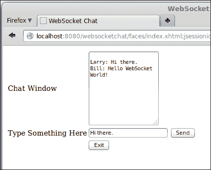
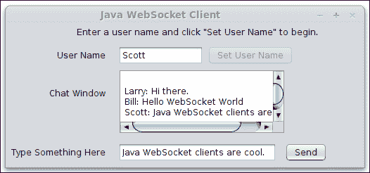

# 第七章：WebSocket

传统上，Web 应用程序是使用 HTTP 协议之后的请求/响应模型开发的。在这个模型中，请求始终由客户端发起，然后服务器将响应返回给客户端。

服务器从未有过独立向客户端发送数据的方式（无需等待浏览器请求），直到现在。WebSocket 协议允许客户端（浏览器）和服务器之间全双工、双向通信。

Java EE 7 引入了 Java API for WebSocket，允许我们在 Java 中开发 WebSocket 端点。Java API for WebSocket 是 Java EE 标准中的全新技术。

### 注意

套接字是一个双向管道，其存活时间比单个请求长。应用于符合 HTML5 规范的浏览器，这将允许与 Web 服务器进行连续通信，而无需加载新页面（类似于 AJAX）。

在本章中，我们将涵盖以下主题：

+   开发 WebSocket 服务器端点

+   在 JavaScript 中开发 WebSocket 客户端

+   在 Java 中开发 WebSocket 客户端

# 开发 WebSocket 服务器端点

WebSocket 服务器端点是一个部署到应用服务器的 Java 类，用于处理 WebSocket 请求。

我们可以通过两种方式使用 Java API for WebSocket 实现 WebSocket 服务器端点：要么通过编程开发端点，在这种情况下，我们需要扩展 `javax.websocket.Endpoint` 类，要么通过使用 WebSocket 特定的注解装饰 **Plain Old Java Objects**（**POJOs**）。这两种方法非常相似；因此，我们将详细讨论注解方法，并在本节稍后简要解释第二种方法，即通过编程开发 WebSocket 服务器端点。

在本章中，我们将开发一个简单的基于 Web 的聊天应用程序，充分利用 Java API for WebSocket。

## 开发注解 WebSocket 服务器端点

以下 Java 类代码演示了如何通过注解 Java 类来开发 WebSocket 服务器端点：

```java
package net.ensode.glassfishbook.websocketchat.serverendpoint;

import java.io.IOException;
import java.util.logging.Level;
import java.util.logging.Logger;
import javax.websocket.OnClose;
import javax.websocket.OnMessage;
import javax.websocket.OnOpen;
import javax.websocket.Session;
import javax.websocket.server.ServerEndpoint;

@ServerEndpoint("/websocketchat")
public class WebSocketChatEndpoint {

  private static final Logger LOG = Logger.getLogger(WebSocketChatEndpoint.class.getName());

 @OnOpen
  public void connectionOpened() {
    LOG.log(Level.INFO, "connection opened");
  }

 @OnMessage
  public synchronized void processMessage(Session session, String message) {
    LOG.log(Level.INFO, "received message: {0}", message);

    try {
 for (Session sess : session.getOpenSessions()) {
 if (sess.isOpen()) {
 sess.getBasicRemote().sendText(message);
 }
 }
    } catch (IOException ioe) {
      LOG.log(Level.SEVERE, ioe.getMessage());
    }
  }

  @OnClose
  public void connectionClosed() {
    LOG.log(Level.INFO, "connection closed");
  }

}
```

类级别的 `@ServerEndpoint` 注解表示该类是一个 WebSocket 服务器端点。服务器端点的 **URI**（**统一资源标识符**）是注解后面的括号中指定的值（在这个例子中是 `"/websocketchat"`）——WebSocket 客户端将使用此 URI 与我们的端点进行通信。

`@OnOpen` 注解用于装饰一个方法，每当任何客户端打开 WebSocket 连接时，都需要执行此方法。在我们的示例中，我们只是向服务器日志发送一些输出，但当然，任何有效的服务器端 Java 代码都可以放在这里。

任何被`@OnMessage`注解的方法都会在我们服务器端点从客户端接收到消息时被调用。由于我们正在开发一个聊天应用，我们的代码只是简单地将接收到的消息广播给所有已连接的客户端。

在我们的示例中，`processMessage()`方法被`@OnMessage`注解，并接受两个参数：一个实现了`javax.websocket.Session`接口的类的实例，以及一个包含接收到的消息的`String`参数。由于我们正在开发一个聊天应用，我们的 WebSocket 服务器端点简单地广播接收到的消息给所有已连接的客户端。

`Session`接口上的`getOpenSessions()`方法返回一个表示所有打开会话的会话对象集合。我们遍历这个集合，通过在每个会话实例上调用`getBasicRemote()`方法，然后调用前一个方法返回的`RemoteEndpoint.Basic`实现上的`sendText()`方法，将接收到的消息广播给所有已连接的客户端。

`Session`接口上的`getOpenSessions()`方法在调用时返回所有打开的会话。在方法调用后，可能有一个或多个会话已经关闭；因此，在尝试向客户端返回数据之前，建议在`Session`实现上调用`isOpen()`方法。如果我们尝试访问已关闭的会话，可能会抛出异常。

最后，我们需要使用`@OnClose`注解来装饰一个方法，以防我们需要处理客户端从服务器端点断开连接的事件。在我们的示例中，我们只是简单地将一条消息记录到服务器日志中。

在我们的示例中，还有一个我们没有使用的额外注解——`@OnError`注解；它用于装饰一个在发送或接收客户端数据时出现错误时需要调用的方法。

如我们所见，开发注解 WebSocket 服务器端点很简单。我们只需要添加一些注解，应用程序服务器就会根据需要调用我们的注解方法。

如果我们希望以编程方式开发 WebSocket 服务器端点，我们需要编写一个扩展`javax.websocket.Endpoint`的 Java 类。这个类有`onOpen()`、`onClose()`和`onError()`方法，这些方法在端点生命周期中的适当时间被调用。没有与`@OnMessage`注解等效的方法来处理来自客户端的消息。需要在会话中调用`addMessageHandler()`方法，传递一个实现了`javax.websocket.MessageHandler`接口（或其子接口）的类的实例作为其唯一参数。

### 注意

通常，与它们的编程对应物相比，开发注解 WebSocket 端点更容易、更直接。因此，我们建议尽可能使用注解方法。

# 开发 WebSocket 客户端

大多数 WebSocket 客户端都是作为 HTML5 网页实现的，利用 JavaScript WebSocket API。因此，它们必须使用 HTML5 兼容的网页浏览器（大多数现代网页浏览器都是 HTML5 兼容的）。

Java WebSocket API 提供了客户端 API，允许我们开发作为独立 Java 应用程序的 WebSocket 客户端。我们将在后面的部分介绍如何做到这一点，*在 Java 中开发 WebSocket 客户端*。

## 开发 JavaScript 客户端 WebSocket 代码

在本节中，我们将介绍如何开发客户端 JavaScript 代码来与我们在上一节中开发的 WebSocket 端点进行交互。

我们的 WebSocket 示例客户端页面是使用 HTML5 友好标记实现的 JSF 页面（如第二章第二章。JavaServer Faces 中所述）。

我们的客户端页面包括一个文本区域，我们可以看到我们应用程序的用户在说什么（毕竟，这是一个聊天应用程序），以及一个输入文本，我们可以用它向其他用户发送消息，如下面的截图所示：



我们的客户端页面的标记如下所示：

```java
<?xml version="1.0" encoding="UTF-8"?>
<!DOCTYPE html>
<html >
  <head>
    <title>WebSocket Chat</title>
    <meta name="viewport" content="width=device-width"/>
 <script type="text/javascript">
 var websocket;
 function init() {
 websocket = new WebSocket('ws://localhost:8080/websocketchat/websocketchat');

 websocket.onopen = function(event) {
 websocketOpen(event)
 };
 websocket.onmessage = function(event) {
 websocketMessage(event)
 };
 websocket.onerror = function(event) {
 websocketError(event)
 };
 }

 function websocketOpen(event) {
 console.log("webSocketOpen invoked");
 }

 function websocketMessage(event) {
 console.log("websocketMessage invoked");
 document.getElementById('chatwindow').value += '\r' + event.data;
 }

 function websocketError(event) {
 console.log("websocketError invoked");
 }

 function sendMessage() {
 var userName =
 document.getElementById('userName').value;
 var msg =
 document.getElementById('chatinput').value;

 websocket.send(userName + ": " + msg);
 }
 function closeConnection(){
 websocket.close();
 }

 window.addEventListener("load", init);
 </script>
  </head>
  <body>
    <form jsf:prependId="false">
      <input type="hidden" id="userName" value="#{user.userName}"/>
      <table border="0">
      <tbody>
        <tr>
          <td>
            <label for="chatwindow">
              Chat Window
            </label>
          </td>
          <td>
 <textArea id="chatwindow" rows="10"/>
          </td>
        </tr>
        <tr>
          <td>
            <label for="chatinput">
              Type Something Here
            </label>
          </td>
          <td>
 <input type="text" id="chatinput"/>
 <input id="sendBtn" type="button" value="Send" onclick="sendMessage()"/>
          </td>
        </tr>
        <tr>
          <td></td>
          <td>
 <input type="button" id="exitBtn" value="Exit" onclick="closeConnection()"/>
          </td>
        </tr>
      </tbody>
      </table>
    </form>
  </body>
</html>
```

我们 JavaScript 代码的最后一行（`window.addEventListener("load", init);`）将我们的 JavaScript `init()`函数设置为在页面加载时执行。

在`init()`方法中，我们初始化一个新的 JavaScript `websocket`对象，将我们的服务器端点 URI 作为参数传递。这告诉我们的 JavaScript 代码服务器端点的位置。

JavaScript 的`websocket`对象具有多种函数类型，用于处理不同的事件，例如打开连接、接收消息和处理错误。我们需要将这些类型设置为我们自己的 JavaScript 函数，以便我们可以处理这些事件，这正是我们在调用 JavaScript `websocket`对象构造函数后立即在`init()`方法中做的。在我们的例子中，我们分配给`websocket`对象的函数只是将它们的功能委托给独立的 JavaScript 函数。

每次 WebSocket 连接打开时，都会调用我们的`websocketOpen()`函数。在我们的例子中，我们只是向浏览器 JavaScript 控制台发送一条消息。

每次浏览器从我们的 WebSocket 端点接收到 WebSocket 消息时，都会调用`webSocketMessage()`函数。在我们的例子中，我们更新了`id`为`chatWindow`的文本区域内容和消息内容。

每次发生与 WebSocket 相关的错误时，都会调用`websocketError()`函数。在我们的例子中，我们只是向浏览器 JavaScript 控制台发送一条消息。

JavaScript 的`sendMessage()`函数将消息发送到 WebSocket 服务器端点，包含用户名和文本输入的`id`为`chatinput`的内容。当用户点击`id`为`sendBtn`的按钮时，会调用此函数。

`closeConnection()` JavaScript 函数关闭与我们的 WebSocket 服务器端点的连接。当用户点击具有 `id` 为 `exitBtn` 的按钮时，会调用此函数。

从这个例子中我们可以看出，编写客户端 JavaScript 代码与 WebSocket 端点交互相当简单。

## 使用 Java 开发 WebSocket 客户端

虽然目前开发基于 Web 的 WebSocket 客户端是最常见的方式，但 Java API for WebSocket 提供了一个客户端 API，我们可以使用它来在 Java 中开发 WebSocket 客户端。

在本节中，我们将使用 Java API for WebSocket 的客户端 API 来开发一个简单的 WebSocket 客户端。最终产品如图所示：



然而，我们不会在本节中介绍 GUI 代码（使用 Swing 框架开发），因为它与本次讨论无关。示例的完整代码（包括 GUI 代码）可以从 Packt Publishing 网站下载，网址为 [www.packtpub.com](http://www.packtpub.com)。

就像 WebSocket 服务器端点一样，Java WebSocket 客户端可以以编程方式或使用注解的方式开发。再次强调，我们只会介绍注解方法：编程客户端的开发方式与编程服务器端点非常相似，即编程客户端必须扩展 `javax.websocket.Endpoint` 并重写适当的方法。

不再赘述，以下是我们 Java WebSocket 客户端的代码：

```java
package net.ensode.websocketjavaclient;

import java.io.IOException;
import java.net.URI;
import java.net.URISyntaxException;
import javax.websocket.ClientEndpoint;
import javax.websocket.CloseReason;
import javax.websocket.ContainerProvider;
import javax.websocket.DeploymentException;
import javax.websocket.OnClose;
import javax.websocket.OnError;
import javax.websocket.OnMessage;
import javax.websocket.OnOpen;
import javax.websocket.Session;
import javax.websocket.WebSocketContainer;

@ClientEndpoint
public class WebSocketClient {

  private String userName;
  private Session session;
  private final WebSocketJavaClientFrame webSocketJavaClientFrame;

  public WebSocketClient(WebSocketJavaClientFrame webSocketJavaClientFrame) {
  this.webSocketJavaClientFrame = webSocketJavaClientFrame;

  try {
 WebSocketContainer webSocketContainer = ContainerProvider.getWebSocketContainer();
 webSocketContainer.connectToServer(this, new URI("ws://localhost:8080/websocketchat/websocketchat"));
  }
  catch (DeploymentException | IOException | URISyntaxException ex) {
    ex.printStackTrace();
  }

  }

 @OnOpen
  public void onOpen(Session session) {
    System.out.println("onOpen() invoked");
    this.session = session;
  }

 @OnClose
  public void onClose(CloseReason closeReason) {
    System.out.println("Connection closed, reason: "+ closeReason.getReasonPhrase());
  }

 @OnError
  public void onError(Throwable throwable) {
    System.out.println("onError() invoked");
    throwable.printStackTrace();
  }

 @OnMessage
  public void onMessage(String message, Session session) {
    System.out.println("onMessage() invoked");
    webSocketJavaClientFrame.getChatWindowTextArea().setText(webSocketJavaClientFrame.getChatWindowTextArea().getText() + "\n" + message);
  }

  public void sendMessage(String message) {
    try {
      System.out.println("sendMessage() invoked, message = " + message);
 session.getBasicRemote().sendText(userName + ": " + message);
    }
    catch (IOException ex) {
      ex.printStackTrace();
    }
  }

  public String getUserName() {
    return userName;
  }

  public void setUserName(String userName) {
    this.userName = userName;
  }

}
```

类级别的 `@ClientEndPoint` 注解表示我们的类是一个 WebSocket 客户端——所有 Java WebSocket 客户端都必须使用此注解。

建立与 WebSocket 服务器端点连接的代码位于我们的类构造函数中。首先，我们需要调用 `ContainerProvider.getWebSocketContainer()` 来获取 `javax.websocket.WebSocketContainer` 的一个实例。然后，通过在 `WebSocketContainer` 实例上调用 `connectToServer()` 方法来建立连接；然后我们将一个带有 `@ClientEndpoint` 注解的类作为第一个参数传递（在我们的例子中，由于连接代码位于我们的 WebSocket Java 客户端代码中，我们使用 `this`）；然后我们传递一个包含 WebSocket 服务器端点 URI 的 URI 对象作为第二个参数。

连接建立后，我们就可以准备响应 WebSocket 事件了。细心的读者可能已经注意到，我们用来开发服务器端点的确切相同的注解再次在我们的客户端代码中使用。

带有 `@OnOpen` 注解的任何方法都会在连接到 WebSocket 服务器端点时自动调用。该方法必须返回 void，并且可以有一个可选的 `javax.websocket.Session` 类型的参数。在我们的例子中，我们向控制台发送一些输出，并用接收到的 `Session` 实例初始化一个类变量。

带有`@OnClose`注解的方法会在 WebSocket 会话关闭时被调用。被注解的方法可以包含可选的`javax.websocket.Session`和`CloseReason`类型的参数。在我们的示例中，我们选择只使用`CloseReason`可选参数，因为它的类有一个方便的`getReasonPhrase()`方法，可以提供会话关闭的简要解释。

`@OnError`注解用于装饰在发生错误时被调用的任何方法。带有`@OnError`注解的方法必须有一个类型为`java.lang.Throwable`（`java.lang.Exception`的父类）的参数，并且可以有一个可选的类型为`Session`的参数。在我们的示例中，我们只是将`Throwable`参数的堆栈跟踪发送到`stderr`。

带有`@OnMessage`注解的方法会在接收到传入的 WebSocket 消息时被调用。`@OnMessage`方法可以根据接收到的消息类型以及我们希望如何处理它来具有不同的参数。在我们的示例中，我们使用了最常见的情况：接收文本消息。在这种情况下，我们需要一个`String`参数来保存消息的内容，以及一个可选的`Session`参数。

### 注意

有关如何处理其他类型消息的信息，请参阅`@OnMessage`的 JavaDoc 文档，网址为[`docs.oracle.com/javaee/7/api/javax/websocket/OnMessage.html`](http://docs.oracle.com/javaee/7/api/javax/websocket/OnMessage.html)。

在我们的示例中，我们简单地更新了**聊天窗口**文本区域，将接收到的消息追加到其内容中。

要发送 WebSocket 消息，我们在`Session`实例上调用`getBasicRemote()`方法，然后在这个调用返回的`RemoteEndpoint.Basic`实现上调用`sendText()`方法（如果这看起来很熟悉，那是因为我们在 WebSocket 服务器端点代码中做了完全相同的事情）。在我们的示例中，我们在`sendMessage()`方法中这样做。

# 关于 Java API for WebSocket 的更多信息

在本章中，我们介绍了 Java API for WebSocket 提供的功能的大部分。有关更多信息，请参阅 Tyrus 用户指南，它是 Java API for WebSocket 的参考实现，网址为[`tyrus.java.net/documentation/1.3.1/user-guide.html`](https://tyrus.java.net/documentation/1.3.1/user-guide.html)。

# 摘要

在本章中，我们介绍了 Java API for WebSocket，这是一个新的 Java EE API，用于开发 WebSocket 服务器端点和客户端。

我们首先看到了如何通过利用 Java API for WebSockets 来开发 WebSocket 服务器端点。我们专注于开发基于注解的 WebSocket 端点。

然后，我们介绍了如何使用 JavaScript 和 JavaScript 内置的 WebSocket API 开发基于 Web 的 WebSocket 客户端。

最后，我们解释了如何通过`@ClientEndpoint`注解在 Java 中开发 WebSocket 客户端应用程序。

在下一章中，我们将介绍**Java 消息服务**（**JMS**）。
