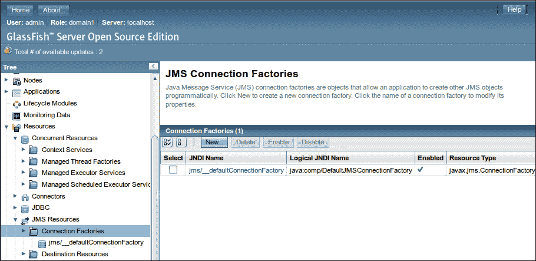
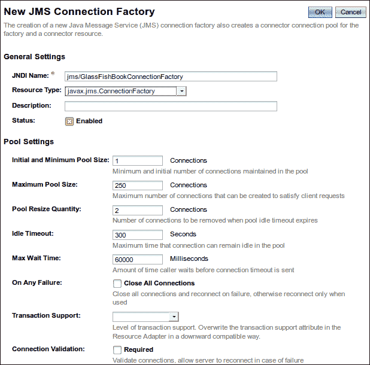
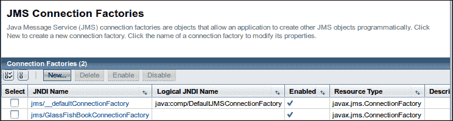
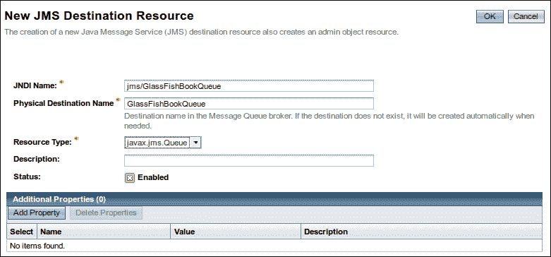
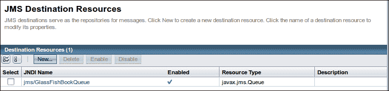
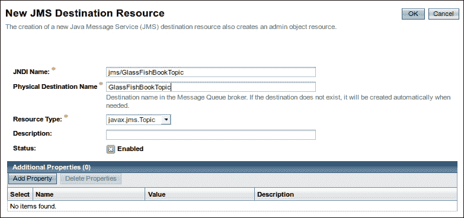
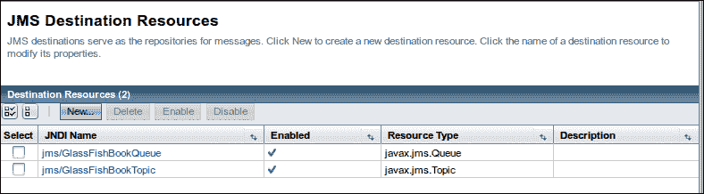
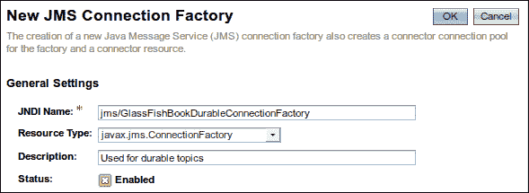

# 第八章. Java 消息服务

**Java 消息服务**（**JMS**）**API**为 Java EE 应用程序之间发送消息提供了一个机制。Java EE 7 引入了 JMS 2.0，这是 JMS 的一个新版本，它极大地简化了涉及消息功能的应用程序的开发。

JMS 应用程序不直接通信；相反，消息生产者将消息发送到目的地，而消息消费者从目的地接收该消息。

当使用**点对点**（**PTP**）消息域时，消息目的地是一个消息队列，当使用发布/订阅（pub/sub）消息域时，消息目的地是一个消息主题。

在本章中，我们将涵盖以下主题：

+   设置 GlassFish 以支持 JMS

+   使用消息队列

+   使用消息主题

# 设置 GlassFish 以支持 JMS

在我们可以开始编写代码以利用 JMS API 之前，我们需要配置一些 GlassFish 资源。具体来说，我们需要设置一个 JMS 连接工厂、一个消息队列和一个消息主题。

### 注意

Java EE 7 要求所有符合标准的应用服务器提供默认的 JMS 连接工厂。GlassFish 是一个完全符合 Java EE 7 的应用服务器（也是 Java EE 7 的参考实现），符合这一要求；因此，严格来说，我们实际上并不需要设置连接工厂，然而，在许多情况下，我们可能需要设置一个。因此，在下一节中，我们将说明如何进行设置。

## 设置 JMS 连接工厂

设置 JMS 连接工厂最简单的方法是通过 GlassFish 的网页控制台。回想一下第一章，“开始使用 GlassFish”，网页控制台可以通过在命令行中输入以下命令来访问我们的域：

```java
 asadmin start-domain domain1

```

然后，转到`http://localhost:4848`并登录。



可以通过展开位于网页控制台左侧的**资源**节点来添加连接工厂；为此，展开**JMS 资源**节点，点击**连接工厂**节点，然后在网页控制台的主要区域中点击**新建...**按钮。



对于我们的目的，我们可以保持大多数默认设置；我们唯一需要做的是在**JNDI 名称**字段中输入一个池名称，并为我们的连接工厂选择一个资源类型。

### 注意

在命名 JMS 资源时，始终使用以`"jms/"`开头的池名称是一个好主意。这样，在浏览 JNDI 树时可以轻松识别 JMS 资源。

在标记为**JNDI 名称**的字段中输入`jms/GlassFishBookConnectionFactory`。本章后面的代码示例将使用此 JNDI 名称来获取对连接工厂的引用。

**资源类型**下拉菜单有以下三个选项：

+   **javax.jms.TopicConnectionFactory**：此选项用于创建一个连接工厂，该工厂为使用发布/订阅消息域的 JMS 客户端创建 JMS 主题

+   **javax.jms.QueueConnectionFactory**：此选项用于创建一个连接工厂，该工厂为使用 PTP 消息域的 JMS 客户端创建 JMS 队列

+   **javax.jms.ConnectionFactory**：此选项用于创建一个连接工厂，该工厂可以创建 JMS 主题或 JMS 队列

在我们的示例中，我们将选择**javax.jms.ConnectionFactory**；这样，我们可以为所有示例使用相同的连接工厂，包括使用 PTP 消息域和发布/订阅消息域的示例。

在**JNDI 名称**字段中输入我们的连接工厂的池名称，选择连接工厂类型，并可选地输入我们的连接工厂的描述后，我们需要单击**确定**按钮以使更改生效。

我们应该会看到新创建的连接工厂（**jms/GlassFishBookConnectionFactory**）在 GlassFish Web 控制台的主区域中列出，如下面的截图所示：



## 设置 JMS 队列

可以通过以下步骤添加 JMS 队列：

1.  在 Web 控制台左侧的树中展开**资源**节点。

1.  在**JNDI 名称**字段中输入一个值。

1.  在**物理目标名称**字段中输入一个值。

1.  在**资源类型**字段中选择**javax.jms.Queue**。

1.  单击**确定**按钮。

在我们的示例中，消息队列的 JNDI 名称为`jms/GlassFishBookQueue`。消息队列的资源类型必须是`javax.jms.Queue`。此外，必须在**物理目标名称**字段中输入一个值。在我们的示例中，我们将`GlassFishBookQueue`用作此字段的值。

单击**确定**按钮后，我们应该会看到新创建的队列，如下面的截图所示：



## 设置 JMS 主题

在 GlassFish 中设置 JMS 主题与设置消息队列非常相似。执行以下步骤：

1.  展开 JMS **资源**节点。

1.  单击**目的地**节点。

1.  在 Web 控制台的主区域中单击**新建...**按钮。

1.  在**JNDI 名称**字段中为我们的主题输入一个名称。

1.  在**物理目标名称**字段中为我们的主题输入一个物理目标名称。

1.  从**资源类型**下拉菜单中选择**javax.jms.Topic**。

1.  单击以下截图所示的**确定**按钮：



我们的示例将在**JNDI 名称**字段中使用`jms/GlassFishBookTopic`。由于这是一个消息主题，**资源类型**必须设置为`javax.jms.Topic`。**描述**字段是可选的。**物理目标名称**属性是必需的；在我们的示例中，我们将使用`GlassFishBookTopic`作为此属性的值。

点击**确定**按钮后，我们可以看到我们新创建的消息主题如下：



现在我们已经设置了一个连接工厂、一个消息队列和一个消息主题，我们就可以开始使用 JMS API 编写代码了。

# 与消息队列一起工作

正如我们之前提到的，当我们的 JMS 代码使用**点对点**（**PTP**）消息域时，会使用消息队列。对于 PTP 消息域，通常有一个消息生产者和一个消息消费者。消息生产者和消息消费者不需要同时运行以进行通信。消息生产者放入消息队列中的消息将保留在那里，直到消息消费者执行并从队列中请求消息。

## 向消息队列发送消息

向 JMS 队列发送消息包括将一些资源注入到我们的代码中，并执行一些简单的 JMS API 调用。

以下示例说明了如何向消息队列添加消息：

```java
package net.ensode.glassfishbook;

import javax.annotation.Resource;
import javax.jms.ConnectionFactory;
import javax.jms.JMSContext;
import javax.jms.JMSProducer;
import javax.jms.Queue;

public class MessageSender {

 @Resource(mappedName = "jms/GlassFishBookConnectionFactory")
 private static ConnectionFactory connectionFactory;

 @Resource(mappedName = "jms/GlassFishBookQueue")
 private static Queue queue;

    public void produceMessages() {

        JMSContext jmsContext = connectionFactory.createContext();
        JMSProducer jmsProducer = jmsContext.createProducer();

        String msg1 = "Testing, 1, 2, 3\. Can you hear me?";
        String msg2 = "Do you copy?";
        String msg3 = "Good bye!";

        System.out.println("Sending the following message: "
                + msg1);
 jmsProducer.send(queue, msg1);
        System.out.println("Sending the following message: "
                + msg2);
 jmsProducer.send(queue, msg2);
        System.out.println("Sending the following message: "
                + msg3);
 jmsProducer.send(queue, msg3);
    }

    public static void main(String[] args) {
        new MessageSender().produceMessages();
    }
}
```

在深入研究代码的细节之前，细心的读者可能已经注意到`MessageSender`类是一个独立的 Java 应用程序，因为它包含一个主方法。由于这个类是独立的，它是在应用程序服务器之外执行的；然而，我们可以看到一些资源被注入到其中，特别是连接工厂对象和队列。我们可以将资源注入到这个代码中，即使它是在应用程序服务器之外运行的，这是因为 GlassFish 包含一个名为`appclient`的实用程序。

此实用程序允许我们“包装”一个可执行的 JAR 文件，并允许它访问应用程序服务器资源。假设我们的代码打包在一个名为`jmsptpproducer.jar`的可执行 JAR 文件中，我们将在命令行中输入以下内容：

```java
appclient -client jmsptpproducer.jar

```

在一些 GlassFish 日志条目之后，我们将在控制台上看到以下输出：

```java
Sending the following message: Testing, 1, 2, 3\. Can you hear me?
Sending the following message: Do you copy?
Sending the following message: Good bye!

```

`appclient`可执行脚本可以在`[GlassFish 安装目录]/glassfish/bin`下找到；我们的示例假设此目录在`PATH`变量中，如果不是，必须在命令行中输入`appclient`脚本的完整路径。

在解决这个问题之后，我们现在可以解释代码。

`produceMessages()`方法执行所有必要的步骤以将消息发送到消息队列。

此方法首先执行的操作是通过在注入的`javax.jms.ConnectionFactory`实例上调用`createContext()`方法来创建一个`javax.jms.JMSContext`实例。请注意，装饰连接工厂对象的`@Resource`注解的`mappedName`属性与我们在 GlassFish Web 控制台中设置的连接工厂的 JNDI 名称相匹配。在幕后，使用此名称进行 JNDI 查找以获取连接工厂对象。

接下来，我们通过在刚刚创建的`JMSContext`实例上调用`createProducer()`方法来创建一个`javax.jms.JMSProducer`实例。

获取`JMSProducer`实例后，代码通过调用其`send()`方法发送一系列文本消息；该方法将消息目的地作为其第一个参数，将包含消息文本的字符串作为其第二个参数。

在`JMSProducer`中，`send()`方法有几个重载版本；我们示例中使用的是一种便利方法，该方法创建一个`javax.jms.TextMessage`实例，并将其文本设置为方法调用中提供的第二个参数的字符串。

虽然我们的示例只向队列发送文本消息，但我们并不局限于只发送此类消息。JMS API 提供了多种类型的消息，这些消息可以被 JMS 应用程序发送和接收。所有消息类型都在`javax.jms`包中定义为接口。

以下表格列出了所有可用的消息类型：

| 消息类型 | 描述 |
| --- | --- |
| `BytesMessage` | 允许发送字节数组作为消息。`JMSProducer`有一个便利的`send()`方法，它将字节数组作为其参数之一；在发送消息时，该方法会动态创建一个`javax.jms.BytesMessage`实例。 |
| `MapMessage` | 允许发送`java.util.Map`的实现作为消息。`JMSProducer`有一个便利的`send()`方法，它将`Map`作为其参数之一；在发送消息时，该方法会动态创建一个`javax.jms.MapMessage`实例。 |
| `ObjectMessage` | 允许发送实现`java.io.Serializable`接口的任何 Java 对象作为消息。`JMSProducer`有一个便利的`send()`方法，它将实现`java.io.Serializable`接口的类的实例作为其第二个参数；在发送消息时，该方法会动态创建一个`javax.jms.ObjectMessage`实例。 |
| `StreamMessage` | 允许发送字节数组作为消息。与`BytesMessage`不同，它存储添加到流中的每个原始类型的类型。 |
| `TextMessage` | 允许发送`java.lang.String`作为消息。正如我们的示例所示，`JMSProducer`有一个便利的`send()`方法，它将`String`类型作为其第二个参数；在发送消息时，该方法会动态创建一个`javax.jms.TextMessage`实例。 |

关于所有 JMS 消息类型的更多信息，请参阅[`docs.oracle.com/javaee/7/api/`](http://docs.oracle.com/javaee/7/api/)的 JavaDoc 文档。

## 从消息队列中检索消息

当然，如果没有任何接收者，从队列中发送消息是没有意义的。以下示例说明了如何从 JMS 消息队列中检索消息：

```java
package net.ensode.glassfishbook;

import javax.annotation.Resource;
import javax.jms.ConnectionFactory;
import javax.jms.JMSConsumer;
import javax.jms.JMSContext;
import javax.jms.Queue;

public class MessageReceiver {

 @Resource(mappedName = "jms/GlassFishBookConnectionFactory")
 private static ConnectionFactory connectionFactory;
 @Resource(mappedName = "jms/GlassFishBookQueue")
 private static Queue queue;

    public void getMessages() {
        String message;
        boolean goodByeReceived = false;

 JMSContext jmsContext = connectionFactory.createContext();
 JMSConsumer jMSConsumer = jmsContext.createConsumer(queue);

        System.out.println("Waiting for messages...");
        while (!goodByeReceived) {
 message = jMSConsumer.receiveBody(String.class);

            if (message != null) {
                System.out.print("Received the following message: ");
                System.out.println(message);
                System.out.println();
                if (message.equals("Good bye!")) {
                    goodByeReceived = true;
                }
            }
        }
    }

    public static void main(String[] args) {
        new MessageReceiver().getMessages();
    }
}
```

就像之前的示例一样，使用`@Resource`注解注入了`javax.jms.ConnectionFactory`和`javax.jms.Queue`的实例。

在我们的代码中，我们通过调用`ConnectionFactory`的`createContext()`方法来获取`javax.jms.JMSContext`实例，就像在之前的示例中一样。

在此示例中，我们通过在 `JMSContext` 实例上调用 `createConsumer()` 方法来获取 `javax.jms.JMSConsumer` 的实例。

通过在 `JMSConsumer` 的实例上调用 `receiveBody()` 方法来接收消息。此方法接受我们期望的消息类型作为其唯一参数（在我们的示例中是 `String.class`）。此方法返回其参数指定的类型的对象（在我们的示例中是一个 `java.lang.String` 实例）。

在这个特定的示例中，我们将这个方法调用放在了一个 `while` 循环中，因为我们期望一个消息会告诉我们没有更多的消息到来。具体来说，我们正在寻找包含文本 `"Good bye!"` 的消息。一旦我们收到这个消息，我们就退出循环并继续进行进一步的处理。在这个特定的案例中，没有更多的处理要做，因此，在退出循环后执行结束。

就像在先前的示例中一样，使用 `appclient` 工具允许我们将资源注入到代码中，并防止我们不得不将任何库添加到 CLASSPATH 中。通过 `appclient` 工具执行代码后，我们应该在命令行中看到以下输出：

```java
appclient -client target/jmsptpconsumer.jar 
Waiting for messages...
Received the following message: Testing, 1, 2, 3\. Can you hear me?

Received the following message: Do you copy?

Received the following message: Good bye!

```

先前的示例在队列上放置了一些消息。此示例检索这些消息。如果先前的示例尚未执行，则没有要检索的消息。

## 异步从消息队列接收消息

`JMSConsumer.receiveBody()` 方法有一个缺点：它会在接收到队列中的消息之前阻塞执行。在先前的示例中，我们通过在接收到特定消息（`"Good bye!"`）后退出循环来绕过这个限制。

我们可以通过实现 `javax.jms.MessageListener` 接口来异步接收消息，从而防止我们的 JMS 消费者代码阻塞执行。

`javax.jms.MessageListener` 接口包含一个名为 `onMessage` 的单方法，它接受一个实现 `javax.jms.Message` 接口的类的实例作为其唯一参数。以下示例说明了此接口的典型实现：

```java
package net.ensode.glassfishbook;

import javax.jms.JMSException;
import javax.jms.Message;
import javax.jms.MessageListener;
import javax.jms.TextMessage;

public class ExampleMessageListener implements MessageListener {

  @Override
  public void onMessage(Message message) {
    TextMessage textMessage = (TextMessage) message;

    try {
      System.out.print("Received the following message: ");
      System.out.println(textMessage.getText());
      System.out.println();
    } catch (JMSException e) {
      e.printStackTrace();
    }
  }
}
```

在这种情况下，`onMessage()` 方法只是将消息文本输出到控制台。回想一下，在幕后，当我们使用 `String` 作为第二个参数调用 `JMSProducer.send()` 时，JMS API 会创建 `javax.jms.TextMessage` 的实例；我们的 `MessageListener` 实现将接收到的 `Message` 实例作为参数转换为 `TextMessage`，然后获取由 `JMSProducer` 变量发送的 `String message`，调用其 `getText()` 方法。

我们的主代码现在可以将消息检索委托给我们的自定义 `MessageListener` 实现：

```java
package net.ensode.glassfishbook;

import javax.annotation.Resource;
import javax.jms.ConnectionFactory;
import javax.jms.JMSConsumer;
import javax.jms.JMSContext;
import javax.jms.Queue;

public class AsynchMessReceiver {

 @Resource(mappedName = "jms/GlassFishBookConnectionFactory")
 private static ConnectionFactory connectionFactory;
 @Resource(mappedName = "jms/GlassFishBookQueue")
 private static Queue queue;

    public void getMessages() {
        try {
            JMSContext jmsContext = connectionFactory.createContext();
            JMSConsumer jMSConsumer = jmsContext.createConsumer(queue);

 jMSConsumer.setMessageListener(
 new ExampleMessageListener());

            System.out.println("The above line will allow the "
                    + "MessageListener implementation to "
                    + "receiving and processing messages"
                    + " from the queue.");
            Thread.sleep(1000);
            System.out.println("Our code does not have to block "
                    + "while messages are received.");
            Thread.sleep(1000);
            System.out.println("It can do other stuff "
                    + "(hopefully something more useful than sending "
                    + "silly output to the console. :)");
            Thread.sleep(1000);

        } catch (InterruptedException e) {
            e.printStackTrace();
        }
    }

    public static void main(String[] args) {
        new AsynchMessReceiver().getMessages();
    }
}
```

与上一节中的示例相比，唯一的区别在于本例中，我们在从 JMS 上下文获取的`javax.jms.JMSConsumer`实例上调用`setMessageListener()`方法。我们将我们的自定义`javax.jms.MessageListener`实现实例传递给此方法；每当队列中有等待的消息时，其`onMessage()`方法会自动被调用。使用这种方法，主代码在等待接收消息时不会阻塞执行。

执行前面的示例（当然，使用 GlassFish 的`appclient`实用程序），将产生以下输出：

```java
appclient -client target/jmsptpasynchconsumer.jar 
The above line will allow the MessageListener implementation to receive and process messages from the queue.

Received the following message: Testing, 1, 2, 3\. Can you hear me?

Received the following message: Do you copy?

Received the following message: Good bye!

Our code does not have to block while messages are received.

It can do other stuff (hopefully something more useful than sending silly output to the console. :)

```

注意，在主线程执行过程中，消息是如何被接收和处理的。我们可以通过观察`MessageListener`类`onMessage()`方法的输出位于主类中`System.out.println()`调用之间来判断这一点。

## 浏览消息队列

JMS 提供了一种在不实际从队列中删除消息的情况下浏览消息队列的方法。以下示例说明了如何进行此操作：

```java
package net.ensode.glassfishbook;

import java.util.Enumeration;

import javax.annotation.Resource;
import javax.jms.ConnectionFactory;
import javax.jms.JMSContext;
import javax.jms.JMSException;
import javax.jms.Queue;
import javax.jms.QueueBrowser;
import javax.jms.TextMessage;

public class MessageQueueBrowser {

 @Resource(mappedName = "jms/GlassFishBookConnectionFactory")
 private static ConnectionFactory connectionFactory;
 @Resource(mappedName = "jms/GlassFishBookQueue")
 private static Queue queue;

    public void browseMessages() {
        try {
            Enumeration messageEnumeration;
            TextMessage textMessage;
            JMSContext jmsContext = connectionFactory.createContext();
 QueueBrowser browser = jmsContext.createBrowser(queue);

 messageEnumeration = browser.getEnumeration();

            if (messageEnumeration != null) {
                if (!messageEnumeration.hasMoreElements()) {
                    System.out.println("There are no messages "
                            + "in the queue.");
                } else {
                    System.out.println(
                             "The following messages are "
                             + "in the queue");
 while (messageEnumeration.hasMoreElements()) {
 textMessage = (TextMessage) messageEnumeration.nextElement();
 System.out.println(textMessage.getText());
                    }
                }
            }
        } catch (JMSException e) {
            e.printStackTrace();
        }
    }

    public static void main(String[] args) {
        new MessageQueueBrowser().browseMessages();
    }
}
```

如我们所见，浏览消息队列的流程非常直接。我们以通常的方式获取 JMS 连接工厂、JMS 队列和 JMS 上下文，然后在 JMS 上下文对象上调用`createBrowser()`方法。此方法返回一个实现`javax.jms.QueueBrowser`接口的实例，其中包含一个`getEnumeration()`方法，我们可以调用它来获取包含队列中所有消息的`Enumeration`。要检查队列中的消息，我们只需遍历这个枚举并逐个获取消息。在我们的示例中，我们简单地调用了队列中每个消息的`getText()`方法。

# 与消息主题一起工作

当我们的 JMS 代码使用发布/订阅（pub/sub）消息域时，会使用消息主题。当使用此消息域时，相同的消息可以发送到主题的所有订阅者。

## 向消息主题发送消息

向 JMS 主题发送消息与向队列发送消息非常相似；只需注入所需的资源并执行一些简单的 JMS API 调用即可。

以下示例说明了如何向消息主题发送消息：

```java
package net.ensode.glassfishbook;

import javax.annotation.Resource;
import javax.jms.ConnectionFactory;
import javax.jms.JMSContext;
import javax.jms.JMSProducer;
import javax.jms.Topic;

public class MessageSender {

    @Resource(mappedName = "jms/GlassFishBookConnectionFactory")
    private static ConnectionFactory connectionFactory;
 @Resource(mappedName = "jms/GlassFishBookTopic")
    private static Topic topic;

    public void produceMessages() {
        JMSContext jmsContext = connectionFactory.createContext();
        JMSProducer jmsProducer = jmsContext.createProducer();

        String msg1 = "Testing, 1, 2, 3\. Can you hear me?";
        String msg2 = "Do you copy?";
        String msg3 = "Good bye!";

        System.out.println("Sending the following message: "
                + msg1);
 jmsProducer.send(topic, msg1);
        System.out.println("Sending the following message: "
                + msg2);
 jmsProducer.send(topic, msg2);
        System.out.println("Sending the following message: "
                + msg3);
        jmsProducer.send(topic, msg3);

    }

    public static void main(String[] args) {
        new MessageSender().produceMessages();
    }
}
```

如我们所见，这个示例几乎与我们在讨论点对点消息时看到的`MessageSender`类相同。事实上，唯一不同的代码行是那些被突出显示的。JMS API 就是这样设计的，以便应用程序开发者不需要学习两个不同的 API 来处理 PTP 和 pub/sub 域。

由于代码几乎与*使用消息队列*部分中的相应示例相同，我们只解释两个示例之间的差异。在这个例子中，我们不是声明一个实现`javax.jms.Queue`的类的实例，而是声明一个实现`javax.jms.Topic`的类的实例。然后我们将这个`javax.jms.Topic`的实例作为`JMSProducer`对象的`send()`方法的第一参数传递，以及我们希望发送的消息。

## 从消息主题接收消息

就像向消息主题发送消息几乎与向消息队列发送消息相同一样，从消息主题接收消息几乎与从消息队列接收消息相同，如下例所示：

```java
package net.ensode.glassfishbook;

import javax.annotation.Resource;
import javax.jms.ConnectionFactory;
import javax.jms.JMSConsumer;
import javax.jms.JMSContext;
import javax.jms.Topic;

public class MessageReceiver {

    @Resource(mappedName = "jms/GlassFishBookConnectionFactory")
    private static ConnectionFactory connectionFactory;
 @Resource(mappedName = "jms/GlassFishBookTopic")
 private static Topic topic;

    public void getMessages() {
        String message;
        boolean goodByeReceived = false;

        JMSContext jmsContext = connectionFactory.createContext();
 JMSConsumer jMSConsumer = jmsContext.createConsumer(topic);

        System.out.println("Waiting for messages...");
        while (!goodByeReceived) {
 message = jMSConsumer.receiveBody(String.class);

            if (message != null) {
                System.out.print("Received the following message: ");
                System.out.println(message);
                System.out.println();
                if (message.equals("Good bye!")) {
                    goodByeReceived = true;
                }
            }
        }
    }

    public static void main(String[] args) {
        new MessageReceiver().getMessages();
    }
}
```

再次强调，此代码与 PTP 消息的相应代码之间的差异很简单。我们不是声明一个实现`javax.jms.Queue`的类的实例，而是声明一个实现`javax.jms.Topic`的类。我们使用`@Resource`注解，通过在 GlassFish web 控制台创建它时使用的 JNDI 名称，将此类的实例注入到我们的代码中。然后我们像以前一样获取`JMSContext`和`JMSConsumer`的实例，然后通过在`JMSConsumer`上调用`receiveBody()`方法从主题接收消息。

如本节所示，使用发布/订阅消息域的优点是消息可以发送到多个消息消费者。这可以通过同时执行本节开发的`MessageReceiver`类的两个实例来轻松测试，然后执行上一节开发的`MessageSender`类。我们应该看到每个实例的控制台输出，表明两个实例都接收到了所有消息。

就像从消息队列中检索消息一样，可以从消息主题异步检索消息。执行此操作的步骤与消息队列版本非常相似，因此我们将不展示示例。要将本章前面展示的异步示例转换为使用消息主题，只需将`javax.jms.Queue`变量替换为`javax.jms.Topic`的一个实例，并使用`"jms/GlassFishBookTopic"`作为装饰`javax.jms.Topic`实例的`@Resource`注解的`mappedName`属性的值来注入适当的实例。

## 创建持久订阅者

使用发布/订阅消息域的缺点是，当消息被发送到主题时，消息消费者必须正在运行。如果消息消费者当时没有运行，它将不会收到消息；而在 PTP 中，消息将保存在队列中，直到消息消费者运行。幸运的是，JMS API 提供了一种使用发布/订阅消息域并保持消息在主题中直到所有已订阅的消息消费者运行并接收消息的方法。这可以通过为 JMS 主题创建持久订阅者来实现。

为了能够为持久订阅者提供服务，我们需要设置我们的 JMS 连接工厂的`ClientId`属性。每个持久订阅者都必须有一个唯一的客户端 ID；因此，必须为每个潜在的持久订阅者声明一个唯一的连接工厂。

### 小贴士

**InvalidClientIdException**？

只有一个 JMS 客户端可以连接到特定客户端 ID 的主题。如果有多个 JMS 客户端尝试使用相同的连接工厂获取 JMS 连接，将抛出一个`JMSException`，指出客户端 ID 已被使用。解决方案是为每个将接收持久主题消息的潜在客户端创建一个连接工厂。

正如我们之前提到的，通过 GlassFish 网页控制台添加连接工厂的最简单方法是按照以下步骤进行：

1.  展开位于网页控制台左侧的**资源**节点。

1.  展开**JMS 资源**节点。

1.  点击**连接工厂**节点。

1.  点击页面主区域中的**新建...**按钮。

我们接下来的示例将使用以下截图显示的设置：



在点击**确定**按钮之前，我们需要滚动到页面底部，点击**添加属性**按钮，并输入一个名为`ClientId`的新属性。我们的示例将使用`ExampleId`作为此属性的值，如下截图所示：


现在我们已经设置了 GlassFish 以能够提供持久订阅，我们准备好编写一些代码来利用它们：

```java
package net.ensode.glassfishbook;

import javax.annotation.Resource;
import javax.jms.Connection;
import javax.jms.ConnectionFactory;
import javax.jms.JMSConsumer;
import javax.jms.JMSContext;
import javax.jms.JMSException;
import javax.jms.MessageConsumer;
import javax.jms.Session;
import javax.jms.TextMessage;
import javax.jms.Topic;

public class MessageReceiver {

 @Resource(mappedName
 = "jms/GlassFishBookDurableConnectionFactory")
    private static ConnectionFactory connectionFactory;
    @Resource(mappedName = "jms/GlassFishBookTopic")
    private static Topic topic;

    public void getMessages() {
        String message;
        boolean goodByeReceived = false;

        JMSContext jmsContext = connectionFactory.createContext();
 JMSConsumer jMSConsumer =
 jmsContext.createDurableConsumer(topic, "Subscriber1");

        System.out.println("Waiting for messages...");
        while (!goodByeReceived) {
            message = jMSConsumer.receiveBody(String.class);

            if (message != null) {
                System.out.print("Received the following message: ");
                System.out.println(message);
                System.out.println();
                if (message.equals("Good bye!")) {
                    goodByeReceived = true;
                }
            }
        }

    }

    public static void main(String[] args) {
        new MessageReceiver().getMessages();
    }
}
```

如我们所见，此代码与之前用于检索消息的示例代码没有太大区别，其目的是检索消息。与之前的示例相比，只有两个不同之处：我们注入的`ConnectionFactory`实例是我们在本节中较早设置的，用于处理持久订阅，并且我们不是在 JMS 上下文对象上调用`createConsumer()`方法，而是调用`createDurableConsumer()`。`createDurableConsumer()`方法接受两个参数：一个用于检索消息的 JMS 主题对象和一个指定此订阅名称的`String`。此第二个参数必须在该持久主题的所有订阅者中是唯一的。

# 摘要

在本章中，我们介绍了如何使用 GlassFish 网页控制台在 GlassFish 中设置 JMS 连接工厂、JMS 消息队列和 JMS 消息主题。

我们还介绍了如何通过`javax.jms.JMSProducer`接口向消息队列发送消息。

此外，我们还介绍了如何通过`javax.jms.JMSConsumer`接口从消息队列接收消息。我们还介绍了如何通过实现`javax.jms.MessageListener`接口异步地从消息队列接收消息。

我们还看到了如何使用这些接口在 JMS 消息主题之间发送和接收消息。

我们还介绍了如何通过`javax.jms.QueueBrowser`接口在消息队列中浏览消息，而无需从队列中移除它们。

最后，我们学习了如何设置和与 JMS 主题的持久订阅进行交互。

在下一章中，我们将介绍如何确保 Java EE 应用程序的安全性。
