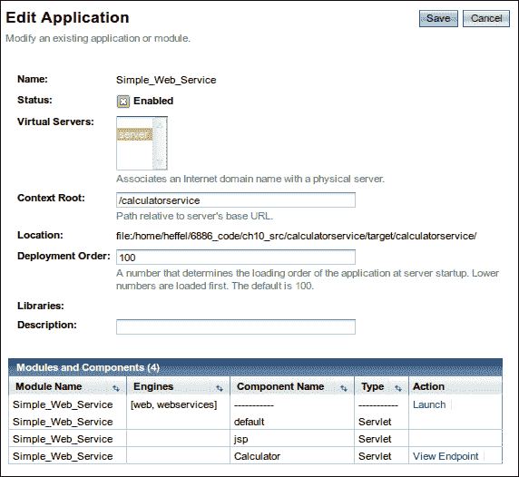
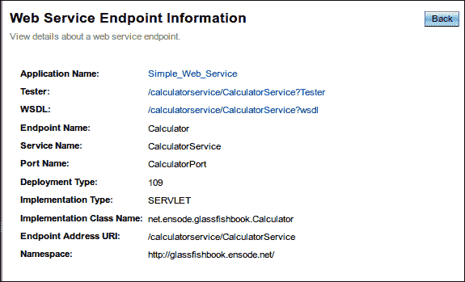
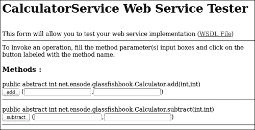
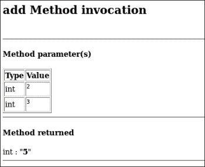
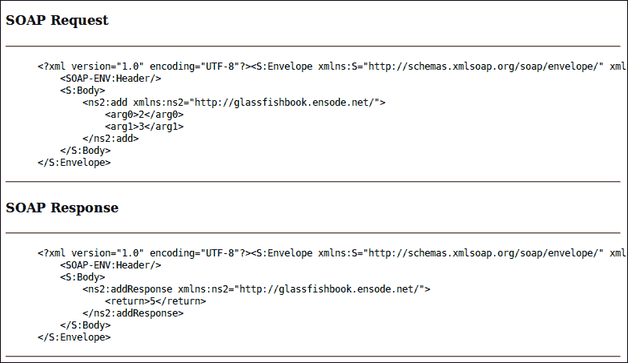
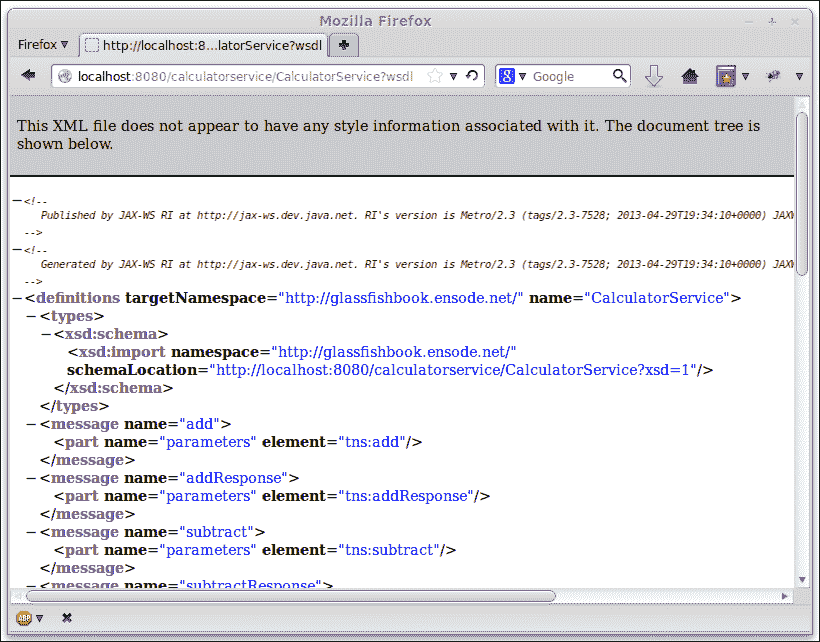
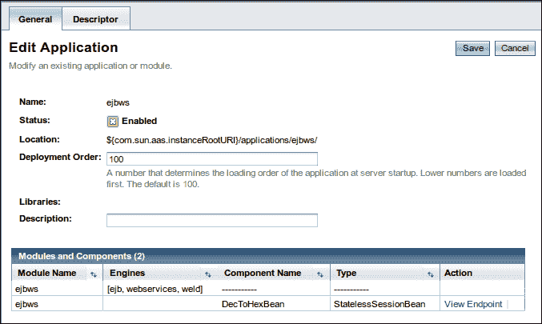

# 第十章。使用 JAX-WS 的网络服务

Java EE 规范将 JAX-WS API 作为其技术之一。JAX-WS 是在 Java 平台上开发 **简单对象访问协议** (**SOAP**) 网络服务的标准方式。它代表 **Java API for XML Web Services**。JAX-WS 是一个高级 API；通过 JAX-WS 调用网络服务是通过远程过程调用完成的。JAX-WS 是 Java 开发者非常自然的 API。

网络服务是可以远程调用的应用程序编程接口。网络服务可以从任何编程语言编写的客户端调用。

我们将涵盖的一些主题包括：

+   使用 JAX-WS API 开发网络服务

+   使用 JAX-WS API 开发网络服务客户端

+   在网络服务调用中添加附件

+   将 EJB 作为网络服务公开

+   保护网络服务

# 使用 JAX-WS API 开发网络服务

JAX-WS 是一个高级 API，它简化了基于 SOAP 的网络服务的开发。通过 JAX-WS 开发网络服务包括编写一个具有公开方法的类，这些方法将被公开为网络服务。该类需要使用 `@WebService` 注解进行装饰。类中的所有公开方法都将自动公开为网络服务，它们可以选择使用 `@WebMethod` 注解进行装饰。以下示例说明了这个过程：

```java
package net.ensode.glassfishbook;

import javax.jws.WebMethod;
import javax.jws.WebService;

@WebService
public class Calculator {

 @WebMethod
    public int add(int first, int second) {
        return first + second;
    }

 @WebMethod
    public int subtract(int first, int second) {
        return first - second;
    }
}
```

前面的类将其两个方法公开为网络服务。`add()` 方法简单地将它接收的两个 `int` 基本参数相加并返回结果。`subtract()` 方法从其两个参数中减去并返回结果。

我们通过使用 `@WebService` 注解来装饰类，表明该类实现了网络服务。任何我们希望公开为网络服务的方法都可以使用 `@WebMethod` 注解进行装饰；然而，这不是必需的，因为所有公开方法都自动公开为网络服务。

为了部署我们的网络服务，我们需要将其打包成 `.war` 文件。在 Java EE 6 之前，所有有效的 `.war` 文件都必须在其 `WEB-INF` 目录中包含一个 `web.xml` 部署描述符。正如我们在前面的章节中已经讨论过的，在 Java EE 6（及以后）中，这个部署描述符是可选的，并且在这个环境中部署网络服务时不需要。

如果我们选择添加 `web.xml` 部署描述符，为了成功部署我们的网络服务，不需要在 `.war` 文件的 `web.xml` 中添加任何内容。只需在部署描述符中有一个空的 `<web-app>` 元素就足够成功部署我们的 WAR 文件，如下面的代码所示：

```java
<?xml version="1.0" encoding="UTF-8"?>
<web-app  version="2.5"

  xsi:schemaLocation="http://java.sun.com/xml/ns/javaee http://java.sun.com/xml/ns/javaee/web-app_2_5.xsd">
</web-app>
```

编译、打包和部署代码后，我们可以通过登录 GlassFish 管理员 Web 控制台并展开左侧的 **应用程序** 节点来验证它是否成功部署。我们应该在这个节点下看到我们新部署的网络服务，如下面的截图所示：



在前面的截图中，请注意页面右下角有一个 **查看端点** 链接。点击该按钮将带我们到以下截图所示的 **Web 服务端点信息** 页面，其中包含有关我们的 Web 服务的某些信息：



注意前面的截图中的链接标签为 **Tester:**；点击此链接将带我们到一个自动生成的页面，允许我们测试我们的 Web 服务。此页面看起来如下面的截图所示：



要测试方法，我们只需在文本框中输入一些参数，然后点击相应的按钮。例如，在 `add` 方法的文本框中输入值 `2` 和 `3`，然后点击 **add** 按钮将产生以下输出：



JAX-WS 在幕后使用 SOAP 协议在 Web 服务客户端和服务器之间交换信息。通过向下滚动前面的页面，我们可以看到我们的测试生成的 SOAP 请求和响应，如下面的截图所示：



作为应用程序开发者，我们不需要过多关注这些 SOAP 请求，因为它们由 JAX-WS API 自动处理。

Web 服务客户端需要一个 **Web 服务定义语言** (**WSDL**) 文件，以便生成可执行代码，他们可以使用这些代码来调用 Web 服务。WSDL 是一种基于 XML 的标准接口定义语言，它定义了 Web 服务的功能。

WSDL 文件通常放置在 Web 服务器上，并通过其 URL 由客户端访问。当部署使用 JAX-WS 开发的 Web 服务时，会自动为我们生成一个 WSDL 文件。我们可以通过点击 **Web 服务端点信息** 页面上的 **查看 WSDL** 链接来查看它及其 URL，如下面的截图所示：



注意浏览器位置文本框中的 WSDL URL。在为我们 Web 服务开发客户端时，我们需要这个 URL。

## 开发 Web 服务客户端

如前所述，需要从 Web 服务的 WSDL 生成可执行代码。然后，Web 服务客户端将调用此可执行代码来访问 Web 服务。

GlassFish 包含一个用于从 WSDL 生成 Java 代码的实用工具。该实用工具的名称是 `wsimport`。它可以在 `[glassfish 安装目录]/glassfish/bin/` 下找到。`wsimport` 的唯一必需参数是 WSDL 的 URL，它对应于 Web 服务，例如，`wsimport` `http://localhost:8080/calculatorservice/CalculatorService?wsdl`。

前一个屏幕截图中的命令将生成以下编译后的 Java 类，允许客户端应用程序访问我们的 Web 服务：

+   `Add.class`

+   `AddResponse.class`

+   `Calculator.class`

+   `CalculatorService.class`

+   `ObjectFactory.class`

+   `package-info.class`

+   `Subtract.class`

+   `SubtractResponse.class`

### 注意

**保留生成的源代码**

默认情况下，生成的类文件的源代码会自动删除；可以通过传递`-keep`参数给`wsimport`来保留它。

这些类需要添加到客户端的 CLASSPATH 中，以便客户端代码可以访问它们。

除了命令行工具之外，GlassFish 还包括一个自定义的 ANT 任务，可以从 WSDL 生成代码。以下 ANT 构建脚本说明了其用法：

```java
<project name="calculatorserviceclient" default="wsimport" basedir="."> 
  <target name="wsimport"> 
    <taskdef name="wsimport"  
       classname="com.sun.tools.ws.ant.WsImport"> 
       <classpath path="/opt/glassfish-4.0/glassfish/modules/webservices-osgi.jar"/>
       <classpath path="/opt/glassfish-4.0/glassfish/modules/jaxb-osgi.jar"/>
       <classpath path="/opt/glassfish-4.0/glassfish/lib/javaee.jar"/>
    </taskdef> 
     <wsimport wsdl=" HYPERLINK "http://localhost:8080/calculatorservice/CalculatorService?wsdl"http://localhost:8080/calculatorservice/CalculatorService?wsdl"xendorsed="true"/>
  </target>
</project>
```

上述示例是一个非常简单的 ANT 构建脚本，它仅说明了如何设置自定义的`<wsimport>` ANT 目标。实际上，项目的 ANT 构建脚本会有几个其他目标，用于编译、构建`.war`文件等。

由于`<wsimport>`是一个自定义的 ANT 目标，并且它不是标准的，我们需要在我们的 ANT 构建脚本中添加一个`<taskdef>`元素。我们需要设置`name`和`classname`属性，如示例所示。此外，我们还需要通过嵌套的`<classpath>`元素将以下`.jar`文件添加到任务的 CLASSPATH 中：

+   `webservices-osgi.jar`

+   `jaxb-osgi.jar`

+   `javaee.jar`

`webservices-osgi.jar`和`jaxb-osgi.jar`文件可以在`[glassfish 安装目录]/glassfish/modules`目录下找到。`javaee.jar`文件包含所有 Java EE API，可以在`[glassfish 安装目录]/glassfish/lib`下找到。

一旦我们通过`<taskdef>`元素设置了自定义的`<wsimport>`任务，我们就可以使用它了。我们需要通过其`wsdl`属性来指定 WSDL 的位置。一旦这个任务执行，就会生成访问由 WSDL 定义的 Web 服务所需的 Java 代码。

JDK 1.6 捆绑了 JAX-WS 2.1。如果我们使用这个版本的 JDK，我们需要告诉 ANT 使用 GlassFish 中包含的 JAX-WS 2.2 API。这可以通过将自定义`wsimport` ANT 任务的`xendorsed`属性设置为`true`轻松完成。

使用 Maven 构建项目的读者可以利用 Maven 的`AntRun`插件在构建代码时执行`wsimport` ANT 目标。这种方法在以下`pom.xml`文件中得到了说明。

```java
<?xml version="1.0" encoding="UTF-8" ?> 
<project   xsi:schemaLocation="http://maven.apache.org/POM/4.0.0 http://maven.apache.org/maven-v4_0_0.xsd">
  <modelVersion>4.0.0</modelVersion>
  <groupId>net.ensode.glassfishbook</groupId>
  <artifactId>calculatorserviceclient</artifactId>
  <packaging>jar</packaging>
  <name>Simple Web Service Client</name>
  <version>1.0</version>
  <url>http://maven.apache.org</url>
  <repositories>
    <repository>
      <id>maven2-repository.dev.java.net</id>
      <name>Java.net Repository for Maven 2</name>
      <url>http://download.java.net/maven/2/</url>
    </repository>
  </repositories>
  <dependencies>
    <dependency>
      <groupId>javax</groupId>
      <artifactId>javaee-api</artifactId>
      <version>6.0</version>
      <scope>provided</scope>
    </dependency>
  </dependencies>
  <build>
    <finalName>calculatorserviceclient</finalName>
    <plugins>
      <plugin>
        <groupId>org.apache.maven.plugins</groupId>
        <artifactId>maven-antrun-plugin</artifactId>
        <executions>
          <execution>
            <phase>generate-sources</phase>
            <configuration>
              <tasks>
                <property name="target.dir" value="target" />
                <delete dir="${target.dir}/classes/com/testapp/ws/client" />
                <delete dir="${target.dir}/generated-sources/main/java/com/testapp/ws/client" />
                <mkdir dir="${target.dir}/classes" />
                <mkdir dir="${target.dir}/generated-sources/main/java" />
                <taskdef name="wsimport" classname="com.sun.tools.ws.ant.WsImport">
                  <classpath path="/home/heffel/sges-v3/glassfish/modules/webservices-osgi.jar" />
                  <classpath path="/home/heffel/sges-v3/glassfish/modules/jaxb-osgi.jar" />
                  <classpath path="/home/heffel/sges-v3/glassfish/lib/javaee.jar" />
                </taskdef>
                <wsimport wsdl="http://localhost:8080/calculatorservice/CalculatorService?wsdl" destdir="${target.dir}/classes" verbose="true" keep="true" sourceDestDir="${target.dir}/generated-sources/main/java" xendorsed="true" />
              </tasks>
              <sourceRoot>${project.build.directory}/generated-sources/main/java</sourceRoot>
            </configuration>
            <goals>
              <goal>run</goal>
            </goals>
          </execution>
        </executions>
      </plugin>
      <plugin>
        <groupId>org.apache.maven.plugins</groupId>
        <artifactId>maven-jar-plugin</artifactId>
        <configuration>
          <archive>
            <manifest>
              <mainClass>net.ensode.glassfishbook.CalculatorServiceClient</mainClass>
              <addClasspath>true</addClasspath>
            </manifest>
          </archive>
        </configuration>
      </plugin>
      <plugin>
        <groupId>org.apache.maven.plugins</groupId>
        <artifactId>maven-compiler-plugin</artifactId>
        <configuration>
          <source>1.6</source>
          <target>1.6</target>
        </configuration>
      </plugin>
    </plugins>
  </build>
</project>
```

在`pom.xml`文件的`<configuration>`标签内部，对应于`AntRun`插件，我们放置任何需要执行的 ANT 任务。不出所料，我们示例中这个标签的正文几乎与刚刚讨论的 ANT 构建文件相同。

现在我们知道了如何使用 ANT 或 Maven 构建我们的代码，我们可以开发一个简单的客户端来访问我们的 Web 服务，使用以下代码：

```java
package net.ensode.glassfishbook;

import javax.xml.ws.WebServiceRef;

public class CalculatorServiceClient {

 @WebServiceRef(wsdlLocation = "http://localhost:8080/calculatorservice/CalculatorService?wsdl")
    private static CalculatorService calculatorService;

    public void calculate() {
 Calculator calculator = calculatorService.getCalculatorPort();

        System.out.println("1 + 2 = "
                + calculator.add(1, 2));
        System.out.println("1 - 2 = "
                + calculator.subtract(1, 2));
    }

    public static void main(String[] args) {
        new CalculatorServiceClient().calculate();
    }
}
```

`@WebServiceRef` 注解将 Web 服务的实例注入到我们的客户端应用程序中。它的 `wsdlLocation` 属性包含我们正在调用的 Web 服务的 WSDL 的 URL。

注意，Web 服务类是名为 `CalculatorService` 的类的实例。这个类是在我们调用 `wsimport` 工具时创建的。`wsimport` 工具总是生成一个类，其名称是我们实现的类的名称加上 `Service` 后缀。我们使用这个服务类来获取我们开发的 Web 服务类的实例。在我们的例子中，我们通过在 `CalculatorService` 实例上调用 `getCalculatorPort()` 方法来实现这一点。一般来说，获取我们 Web 服务类实例的方法遵循 `getNamePort()` 的模式，其中 `Name` 是我们编写的实现 Web 服务的类的名称。一旦我们获取了 Web 服务类的实例，我们就可以像使用任何常规 Java 对象一样调用它的方法。

### 注意

严格来说，服务类的 `getNamePort()` 方法返回一个实现由 `wsimport` 生成的接口的类的实例。这个接口被赋予我们的 Web 服务类的名称，并声明了我们声明的所有作为 Web 服务的方法。对于所有实际用途，返回的对象与我们的 Web 服务类等效。

回顾我们之前的讨论，为了在独立客户端（未部署到 GlassFish）中使资源注入工作，我们需要通过 `appclient` 工具执行它。假设我们将客户端打包在一个名为 `calculatorserviceclient.jar` 的 `.jar` 文件中，执行命令如下：

```java
appclient -client calculatorserviceclient.jar

```

在命令行中输入前面的命令后，我们应该在控制台上看到客户端的以下输出：

```java
1 + 2 = 3
1 - 2 = -1

```

在这个例子中，我们传递了原始类型作为参数和返回值。当然，也可以将对象作为参数和返回值传递。不幸的是，并非所有标准 Java 类或原始类型都可以在调用 Web 服务时用作方法参数或返回值。这是因为幕后，方法参数和返回类型会被映射到 XML 定义，并且并非所有类型都可以正确映射。

可以在 JAX-WS Web 服务调用中使用的有效类型如下所示：

+   `java.awt.Image`

+   `java.lang.Object`

+   `Java.lang.String`

+   `java.math.BigDecimal`

+   `java.math.BigInteger`

+   `java.net.URI`

+   `java.util.Calendar`

+   `java.util.Date`

+   `java.util.UUID`

+   `javax.activation.DataHandler`

+   `javax.xml.datatype.Duration`

+   `javax.xml.datatype.XMLGregorianCalendar`

+   `javax.xml.namespace.QName`

+   `javax.xml.transform.Source`

此外，以下原始类型也可以使用：

+   `boolean`

+   `byte`

+   `byte[]`

+   `double`

+   `float`

+   `int`

+   `long`

+   `short`

我们还可以将我们自己的自定义类用作方法参数和/或返回值，但我们的类的成员变量必须是前面列表中列出的类型之一。

此外，数组可以作为方法参数或返回值使用，然而，在执行`wsimport`时，这些数组被转换为`Lists`，导致 Web 服务中的方法签名与客户端调用的方法调用之间产生不匹配。因此，更倾向于使用`Lists`作为方法参数和/或返回值，因为这同样是有效的，并且不会在客户端和服务器之间产生不匹配。

### 注意

JAX-WS 内部使用**Java Architecture for XML Binding**（**JAXB**）从方法调用创建 SOAP 消息。我们允许用于方法调用和返回值的类型是 JAXB 支持的类型。您可以在[`jaxb.dev.java.net/`](https://jaxb.dev.java.net/)上获取有关 JAXB 的更多信息。

## 向 Web 服务发送附件

除了发送和接受前面各节中讨论的数据类型外，Web 服务方法还可以发送和接受文件附件。以下示例说明了如何做到这一点：

```java
package net.ensode.glassfishbook;

import java.io.FileOutputStream;
import java.io.IOException;

import javax.activation.DataHandler;
import javax.jws.WebMethod;
import javax.jws.WebService;

@WebService
public class FileAttachment {

  @WebMethod
 public void attachFile(DataHandler dataHandler) {
    FileOutputStream fileOutputStream;
    try {

      // substitute "/tmp/attachment.gif" with
      // a valid path, if necessary.
 fileOutputStream = new FileOutputStream(
 "/tmp/attachment.gif");

 dataHandler.writeTo(fileOutputStream);

      fileOutputStream.flush();
      fileOutputStream.close();
    } catch (IOException e) {
      e.printStackTrace();
    }

  }
}
```

为了编写一个接收一个或多个附件的 Web 服务方法，我们只需要为方法将接收的每个附件添加一个类型为`javax.activation.DataHandler`的参数。在前面的示例代码中，`attachFile()`方法接受一个此类参数并将其简单地写入文件系统。

就像任何标准 Web 服务一样，前面的代码需要打包成 WAR 文件并部署。一旦部署，WSDL 将自动生成。然后我们需要执行`wsimport`实用程序来生成我们的 Web 服务客户端可以用来访问 Web 服务的代码。正如之前讨论的，`wsimport`实用程序可以直接从命令行或通过自定义 ANT 目标调用。

一旦我们执行了`wsimport`来生成访问 Web 服务的代码，我们可以编写和编译我们的客户端代码如下：

```java
package net.ensode.glassfishbook;

import java.io.File;
import java.io.FileInputStream;
import java.io.IOException;
import java.nio.ByteBuffer;
import java.nio.channels.FileChannel;

import javax.xml.ws.WebServiceRef;

public class FileAttachmentServiceClient {

  @WebServiceRef(wsdlLocation = "http://localhost:8080/fileattachmentservice/"+ "FileAttachmentService?wsdl")
  private static FileAttachmentService fileAttachmentService;

  public static void main(String[] args) {
    FileAttachment fileAttachment = fileAttachmentService.
        getFileAttachmentPort();
    File fileToAttach = new File("src/main/resources/logo.gif");

 byte[] fileBytes = fileToByteArray(fileToAttach);

 fileAttachment.attachFile(fileBytes);
    System.out.println("Successfully sent attachment.");
  }

  static byte[] fileToByteArray(File file) {
    byte[] fileBytes = null;

    try {
      FileInputStream fileInputStream;
      fileInputStream = new FileInputStream(file);

      FileChannel fileChannel = fileInputStream.getChannel();
      fileBytes = new byte[(int) fileChannel.size()];
      ByteBuffer byteBuffer = ByteBuffer.wrap(fileBytes);
      fileChannel.read(byteBuffer);
    } catch (IOException e) {
      e.printStackTrace();
    }
    return fileBytes;
  }
}
```

需要向 Web 服务发送一个或多个附件的 Web 服务客户端首先像往常一样获取 Web 服务的实例。然后，它创建一个`java.io.File`实例，将附件文件的路径作为其构造函数的参数。

一旦我们有一个包含我们希望附加的文件的`java.io.File`实例，我们接下来需要将文件转换为字节数组，并将这个字节数组传递给期望附件的 Web 服务方法。

注意，当客户端调用期望附件的方法时使用的参数类型与在 Web 服务器代码中该方法使用的参数类型不同。Web 服务器代码中的方法期望每个附件都是一个 `javax.activation.DataHandler` 实例。然而，由 `wsimport` 生成的代码期望每个附件都是一个字节数组。这些字节数组在 `wsimport` 生成的代码背后被转换为正确的类型（`javax.activation.DataHandler`）。作为应用程序开发者，我们不需要关心为什么会出现这种情况的细节。我们只需要记住，当向 Web 服务方法发送附件时，Web 服务代码和客户端调用中的参数类型将不同。

# 将 EJB 作为 Web 服务公开

除了在上一节中描述的创建 Web 服务之外，无状态会话 Bean 的公共方法可以很容易地公开为 Web 服务。以下示例说明了如何做到这一点：

```java
package net.ensode.glassfishbook;

import javax.ejb.Stateless;
import javax.jws.WebService;

@Stateless
@WebService
public class DecToHexBean {

  public String convertDecToHex(int i) {
    return Integer.toHexString(i);
  }
}
```

正如我们所见，要公开无状态会话 Bean 的公共方法，我们只需要用 `@WebService` 注解装饰其类声明。由于该类是一个无状态会话 Bean，它还需要用 `@Stateless` 注解进行装饰。

正如常规无状态会话 Bean 一样，那些方法被公开为 Web 服务的需要部署在一个 `.jar` 文件中。一旦部署，我们可以在 GlassFish 管理员 Web 控制台的 **应用程序** 节点下看到新的 Web 服务。点击应用程序节点，我们可以在 GlassFish 控制台中看到一些详细信息，如下面的屏幕截图所示：



注意，我们新 Web 服务的 **类型** 列表中的值是 **StatelessSessionBean**。这使我们能够一眼看出该 Web 服务是以 **企业 JavaBean**（**EJB**）的形式实现的。

正如标准 Web 服务一样，EJB Web 服务在部署时自动生成一个 WSDL，供其客户端使用；可以通过点击 **查看端点** 链接来访问它。

## EJB Web 服务客户端

以下类说明了从客户端应用程序访问 EJB Web 服务方法的步骤：

```java
package net.ensode.glassfishbook;

import javax.xml.ws.WebServiceRef;

public class DecToHexClient {

  @WebServiceRef(wsdlLocation = "http://localhost:8080/DecToHexBeanService/DecToHexBean?wsdl")
  private static DecToHexBeanService decToHexBeanService;

  public void convert() {
    DecToHexBean decToHexBean = decToHexBeanService.getDecToHexBeanPort();

    System.out.println("decimal 4013 in hex is: "
        + decToHexBean.convertDecToHex(4013));
  }

  public static void main(String[] args) {
    new DecToHexClient().convert();
  }
}
```

正如我们所见，当从客户端访问 EJB Web 服务时，不需要做任何特殊的事情。过程与标准 Web 服务相同。

由于前面的示例是一个独立的应用程序，它需要通过以下方式通过 `appclient` 应用程序执行：

```java
appclient -client ejbwsclient.jar

```

前一个命令的结果如下：

```java
decimal 4013 in hex is: fad

```

# 保护 Web 服务

正如常规 Web 应用程序一样，Web 服务可以被安全地设置，以便只有授权用户才能访问它们。这可以通过修改 Web 服务的 `web.xml` 部署描述符来实现，如下面的代码所示：

```java
<?xml version="1.0" encoding="UTF-8"?>
<web-app  version="2.5"

         xsi:schemaLocation="http://java.sun.com/xml/ns/javaee
         http://java.sun.com/xml/ns/javaee/web-app_2_5.xsd">
 <security-constraint>
 <web-resource-collection>
 <web-resource-name>Calculator Web Service</web-resource-name>
 <url-pattern>/CalculatorService/*</url-pattern>
 <http-method>POST</http-method>
 </web-resource-collection>
 <auth-constraint>
 <role-name>user</role-name>
 </auth-constraint>
 </security-constraint>
 <login-config>
 <auth-method>BASIC</auth-method>
 <realm-name>file</realm-name>
 </login-config>
</web-app>
```

在这个例子中，我们修改了我们的计算器服务，使其只能被授权用户访问。请注意，为了保护 Web 服务所需的修改与保护任何常规 Web 应用程序所需的修改没有区别。用于 `<url-pattern>` 元素的 URL 模式可以通过点击对应于我们服务的 **查看 WSDL** 链接来获取。在我们的例子中，链接的 URL 是：

`http://localhost:8080/calculatorservice/CalculatorService?wsdl`

用于 `<url-pattern>` 的值是紧接在上下文根（在我们的例子中是 `/CalculatorService`）之后，并在问号之前，后面跟着一个斜杠和一个星号。

### 注意

注意，前面的 `web.xml` 部署描述符仅保护 HTTP `POST` 请求。这样做的原因是 `wsimport` 使用 `GET` 请求获取 WSDL 并生成相应的代码。如果 `GET` 请求受到保护，`wsimport` 将会失败，因为它将无法访问 WSDL。

以下代码演示了一个独立客户端如何访问受保护的 Web 服务：

```java
package net.ensode.glassfishbook;

import javax.xml.ws.BindingProvider;
import javax.xml.ws.WebServiceRef;

public class CalculatorServiceClient {

  @WebServiceRef(
  wsdlLocation = "http://localhost:8080/securecalculatorservice/CalculatorService?wsdl")
  private static CalculatorService calculatorService;

  public void calculate() {
    //add a user named "joe" with a password of "password"
    //to the file realm to successfuly execute the web service.
    //"joe" must belong to the group "appuser".
    Calculator calculator = calculatorService.getCalculatorPort();
 ((BindingProvider) calculator).getRequestContext().put(
 BindingProvider.USERNAME_PROPERTY, "joe");
 ((BindingProvider) calculator).getRequestContext().put(
 BindingProvider.PASSWORD_PROPERTY, "password");

    System.out.println("1 + 2 = " + calculator.add(1, 2));
    System.out.println("1 - 2 = " + calculator.subtract(1, 2));
  }

  public static void main(String[] args) {
    new CalculatorServiceClient().calculate();
  }
}
```

前面的代码是我们在本章前面看到的 `Calculator` 服务独立客户端的修改版本。这个版本被修改为访问服务的安全版本。从代码中可以看出，要访问受保护的服务版本，我们只需要在请求上下文中放入一个用户名和一个密码。用户名和密码必须是对用于验证 Web 服务的域有效的。

我们可以通过将我们的 Web 服务端点类转换为 `javax.xml.ws.BindingProvider` 并调用其 `getRequestContext()` 方法来将用户名和密码添加到请求上下文中。此方法返回一个 `java.util.Map` 实例。然后我们可以简单地通过调用 `Map` 的 `put` 方法，并使用在 `BindingProvider` 中定义的常量 `USERNAME_PROPERTY` 和 `PASSWORD_PROPERTY` 作为键，相应的 `String` 对象作为值来添加用户名和密码。

# 保护 EJB Web 服务

就像标准 Web 服务一样，作为 Web 服务公开的 EJB 可以被保护，以便只有授权客户端可以访问它们。这可以通过通过以下方式配置 EJB 实现：通过 `glassfish-ejb-jar.xml` 文件：

```java
<?xml version="1.0" encoding="UTF-8"?>
<!DOCTYPE glassfish-ejb-jar PUBLIC "-//GlassFish.org//DTD GlassFish Application Server 3.1 EJB 3.1//EN" "http://glassfish.org/dtds/glassfish-ejb-jar_3_1-1.dtd">
<glassfish-ejb-jar>
    <ejb>
        <ejb-name>SecureDecToHexBean</ejb-name>
 <webservice-endpoint> 
 <port-component-name>
 SecureDecToHexBean
 </port-component-name>
 <login-config>
 <auth-method>BASIC</auth-method>
 <realm>file</realm>
 </login-config>
 </webservice-endpoint>
    </ejb>
</glassfish-ejb-jar>
```

如前所述的部署描述符所示，将 EJB 作为 Web 服务公开与使用标准 EJB 相比，其安全设置不同。对于作为 Web 服务公开的 EJB，安全配置是在 `glassfish-ejb-jar.xml` 文件的 `<webservice-endpoint>` 元素内部完成的。

`<port-component-name>` 元素必须设置为我们要公开为 Web 服务的 EJB 的名称。此名称在 EJB 的 `<ejb-name>` 元素中定义。

`<login-config>` 元素与网络应用程序的 `web.xml` 部署描述符中相应的元素非常相似。`<login-config>` 元素必须包含一个授权方法，由其 `<auth-method>` 子元素定义，以及用于身份验证的领域。领域由 `<realm>` 子元素定义。

### 注意

不要为打算公开为网络服务的 EJB 使用 `@RolesAllowed` 注解。此注解旨在 EJB 方法通过其远程或本地接口访问时使用。如果一个 EJB 或其一个或多个方法被此注解装饰，那么调用该方法将因安全异常而失败。

一旦我们为身份验证配置了 EJB 网络服务，我们就将其打包成 `.jar` 文件，然后像往常一样部署它。现在，EJB 网络服务已经准备好供客户端访问了。

以下代码示例说明了 EJB 网络服务客户端如何访问安全的 EJB 网络服务：

```java
package net.ensode.glassfishbook;

import javax.xml.ws.BindingProvider;
import javax.xml.ws.WebServiceRef;

public class DecToHexClient {

  @WebServiceRef(
  wsdlLocation = "http://localhost:8080/SecureDecToHexBeanService/SecureDecToHexBean?wsdl")
  private static SecureDecToHexBeanService secureDecToHexBeanService;

  public void convert() {
    SecureDecToHexBean secureDecToHexBean = secureDecToHexBeanService.
        getSecureDecToHexBeanPort();
    ((BindingProvider) secureDecToHexBean).getRequestContext().put(
        BindingProvider.USERNAME_PROPERTY, "joe");
    ((BindingProvider) secureDecToHexBean).getRequestContext().put(
        BindingProvider.PASSWORD_PROPERTY, "password");

    System.out.println("decimal 4013 in hex is: "
        + secureDecToHexBean.convertDecToHex(4013));
  }

  public static void main(String[] args) {
    new DecToHexClient().convert();
  }
}
```

如前例所示，访问作为网络服务公开的 EJB 的过程与访问标准网络服务相同。网络服务的实现与客户端无关。

# 摘要

在本章中，我们介绍了如何通过 JAX-WS API 开发网络服务和网络服务客户端。我们解释了在使用 ANT 或 Maven 作为构建工具时，如何将网络服务客户端的代码生成集成到网络服务中。我们还涵盖了可以通过 JAX-WS 进行远程方法调用的有效类型。此外，我们还讨论了如何向网络服务发送附件。我们还介绍了如何将 EJB 方法公开为网络服务。最后，我们介绍了如何确保网络服务不被未经授权的客户端访问。

在下一章中，我们将介绍使用 JAX-RS 的 RESTful 网络服务。
