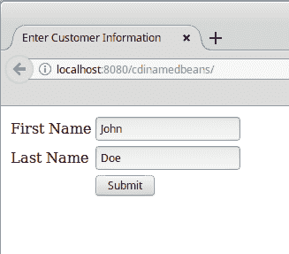
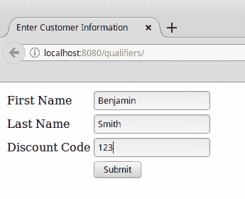
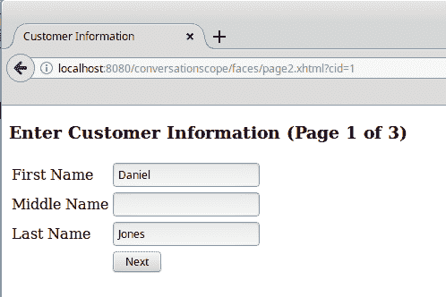
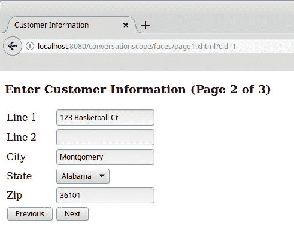

# 第五章：上下文和依赖注入

**上下文**和**依赖注入**（**CDI**）在 Java EE 6 中被添加到 Java EE 规范中。Java EE 8 包括 CDI 的新版本，它添加了新的功能，如异步事件和事件排序。CDI 为 Java EE 开发者提供了之前不可用的几个优势，例如允许任何 JavaBean 用作 JSF 管理 Bean，包括无状态和有状态的会话 Bean。正如其名称所暗示的，CDI 简化了 Java EE 应用程序中的依赖注入。

在本章中，我们将涵盖以下主题：

+   命名 Bean

+   依赖注入

+   范围

+   标准化

+   CDI 事件

# 命名 Bean

CDI 通过`@Named`注解为我们提供了命名我们的 Bean 的能力。命名 Bean 允许我们轻松地将我们的 Bean 注入依赖于它们的其他类（参见下一节），并且可以通过统一表达式语言从 JSF 页面轻松地引用它们。

以下示例显示了`@Named`注解的作用：

```java
package net.ensode.javaee8book.cdidependencyinjection.beans; 

import javax.enterprise.context.RequestScoped; 
import javax.inject.Named; 

@Named 
@RequestScoped 
public class Customer { 

  private String firstName; 
  private String lastName; 

  public String getFirstName() { 
    return firstName; 
  } 

  public void setFirstName(String firstName) { 
    this.firstName = firstName; 
  } 

  public String getLastName() { 
    return lastName; 
  } 

  public void setLastName(String lastName) { 
    this.lastName = lastName; 
  } 
} 
```

如我们所见，我们只需要用`@Named`注解装饰我们的类来命名我们的类。默认情况下，Bean 的名称将是类名，其首字母转换为小写；在我们的例子中，Bean 的名称将是`customer`。如果我们希望使用不同的名称，我们可以通过设置`@Named`注解的`value`属性来实现。例如，如果我们想为上面的 Bean 使用名称`customerBean`，我们可以通过修改`@Named`注解如下：

```java
@Named(value="customerBean") 
```

或者简单地：

```java
@Named("customerBean") 
```

由于`value`属性名称不需要指定，如果我们不使用属性名称，则隐含`value`。

这个名称可以用来通过统一表达式语言从 JSF 页面访问我们的 Bean：

```java
<?xml version='1.0' encoding='UTF-8' ?> 
<!DOCTYPE html PUBLIC "-//W3C//DTD XHTML 1.0 Transitional//EN" "http://www.w3.org/TR/xhtml1/DTD/xhtml1-transitional.dtd"> 
<html  
      > 
  <h:head> 
    <title>Enter Customer Information</title> 
  </h:head> 
  <h:body> 
    <h:form> 
      <h:panelGrid columns="2"> 
        <h:outputLabel for="firstName" value="First  
         Name"/> 
        <h:inputText id="firstName" 
         value="#{customer.firstName}"/> 
        <h:outputLabel for="lastName" value="Last  
         Name"/> 
        <h:inputText id="lastName" 
         value="#{customer.lastName}"/>         
        <h:panelGroup/>        
      </h:panelGrid> 
    </h:form> 
  </h:body> 
</html> 
```

如我们所见，命名 Bean 的访问方式与标准 JSF 管理 Bean 的访问方式完全相同。这允许 JSF 访问任何命名 Bean，将 Java 代码与 JSF API 解耦。

当部署和执行时，我们的简单应用程序看起来像这样：



# 依赖注入

**依赖注入**是一种向 Java 类提供外部依赖的技术。Java EE 5 通过`@Resource`注解引入了依赖注入，然而，这个注解仅限于注入资源，如数据库连接、JMS 资源等。CDI 包括`@Inject`注解，它可以用来将 Java 类的实例注入到任何依赖对象中。

JSF 应用程序通常遵循**模型-视图-控制器**（**MVC**）设计模式。因此，通常一些 JSF 管理 Bean 在模式中扮演控制器的角色，而其他则扮演模型的角色。这种方法通常要求控制器管理 Bean 能够访问一个或多个模型管理 Bean。CDI 的依赖注入功能使得将 Bean 注入到彼此中非常简单，如下面的示例所示：

```java
package net.ensode.javaee8book.cdidependencyinjection.ejb; 

import java.util.logging.Logger; 
import javax.inject.Inject; 
import javax.inject.Named; 

@Named 
@RequestScoped 
public class CustomerController { 

  private static final Logger logger = Logger.getLogger( 
      CustomerController.class.getName()); 
  @Inject 
  private Customer customer; 

  public String saveCustomer() { 

    logger.info("Saving the following information \n" + customer. 
        toString()); 

    //If this was a real application, we would have code to save 
    //customer data to the database here. 

    return "confirmation"; 
  } 
} 
```

注意，我们初始化`Customer`实例所需要做的只是用`@Inject`注解来装饰它。当 Bean 由应用服务器构建时，`Customer` Bean 的实例会自动注入到这个字段中。注意，注入的 Bean 在`saveCustomer()`方法中被使用。

# 限定符

在某些情况下，我们希望注入到我们的代码中的 Bean 类型可能是一个接口或 Java 超类，但我们可能对注入特定的子类或实现接口的类感兴趣。对于这种情况，CDI 提供了我们可以用来指示我们希望注入到我们的代码中的特定类型的限定符。

CDI 限定符是一个必须用`@Qualifier`注解装饰的注解。这个注解然后可以用来装饰我们希望限定的特定子类或接口实现。此外，客户端代码中的注入字段也需要用限定符来装饰。

假设我们的应用程序可能有一种特殊的客户类型；例如，常客可能会被赋予高级客户的地位。为了处理这些高级客户，我们可以扩展我们的`Customer`命名 Bean 并用以下限定符装饰它：

```java
package net.ensode.javaee8book.cdidependencyinjection.qualifiers; 

import static java.lang.annotation.ElementType.TYPE; 
import static java.lang.annotation.ElementType.FIELD; 
import static java.lang.annotation.ElementType.PARAMETER; 
import static java.lang.annotation.ElementType.METHOD; 
import static java.lang.annotation.RetentionPolicy.RUNTIME; 
import java.lang.annotation.Retention; 
import java.lang.annotation.Target; 
import javax.inject.Qualifier; 

@Qualifier 
@Retention(RUNTIME) 
@Target({METHOD, FIELD, PARAMETER, TYPE}) 
public @interface Premium { 
} 
```

正如我们之前提到的，限定符是标准注解；它们通常具有运行时保留，可以针对方法、字段、参数或类型，如上例所示。限定符和标准注解之间的唯一区别是限定符被装饰了`@Qualifier`注解。

一旦我们设置了限定符，我们需要用它来装饰特定的子类或接口实现：

```java
package net.ensode.javaee8book.cdidependencyinjection.beans; 

import javax.enterprise.context.RequestScoped; 
import javax.inject.Named; 
import net.ensode.javaee8book.cdidependencyinjection.qualifiers.Premium; 

@Named 
@RequestScoped 
@Premium 
public class PremiumCustomer extends Customer { 

  private Integer discountCode; 

  public Integer getDiscountCode() { 
    return discountCode; 
  } 

  public void setDiscountCode(Integer discountCode) { 
    this.discountCode = discountCode; 
  } 
} 
```

一旦我们装饰了需要限定的特定实例，我们就可以在`client`代码中使用我们的限定符来指定确切的依赖类型：

```java
package net.ensode.javaee8book.cdidependencyinjection.beans; 

import java.util.Random; 
import java.util.logging.Logger; 
import javax.enterprise.context.RequestScoped; 
import javax.inject.Inject; 
import javax.inject.Named; 
import net.ensode.javaee8book.cdidependencyinjection.qualifiers.Premium; 

@Named 
@RequestScoped 
public class CustomerController { 

  private static final Logger logger = Logger.getLogger( 
      CustomerController.class.getName()); 
  @Inject  
  @Premium 
  private Customer customer; 

  public String saveCustomer() { 

    PremiumCustomer premiumCustomer = (PremiumCustomer) customer; 

    premiumCustomer.setDiscountCode(generateDiscountCode()); 

    logger.info("Saving the following information \n" 
        + premiumCustomer.getFirstName() + " " 
        + premiumCustomer.getLastName() 
        + ", discount code = " 
        + premiumCustomer.getDiscountCode()); 

    //If this was a real application, we would have code to save 
    //customer data to the database here. 

    return "confirmation"; 
  } 

  public Integer generateDiscountCode() { 
    return new Random().nextInt(100000); 
  } 
} 
```

由于我们用`@Premium`限定符来装饰客户字段，因此`PremiumCustomer`的实例被注入到该字段中，因为这个类也被装饰了`@Premium`限定符。

就我们的 JSF 页面而言，我们只需像往常一样通过其名称访问我们的命名 Bean：

```java
<?xml version='1.0' encoding='UTF-8' ?> 
<!DOCTYPE html PUBLIC "-//W3C//DTD XHTML 1.0 Transitional//EN" "http://www.w3.org/TR/xhtml1/DTD/xhtml1-transitional.dtd"> 
<html  
      > 
    <h:head> 
        <title>Enter Customer Information</title> 
    </h:head> 
    <h:body> 
        <h:form> 
            <h:panelGrid columns="2"> 
                <h:outputLabel for="firstName" value="First Name"/> 
                <h:inputText id="firstName" 
                   value="#{premiumCustomer.firstName}"/> 
                <h:outputLabel for="lastName" value="Last Name"/> 
                <h:inputText id="lastName"           
                   value="#{premiumCustomer.lastName}"/> 
                <h:outputLabel for="discountCode" value="Discount     
                 Code"/> 
                <h:inputText id="discountCode" 
                   value="#{premiumCustomer.discountCode}"/> 
                <h:panelGroup/> 
                <h:commandButton value="Submit" 
                  action="#{customerController.saveCustomer}"/> 
            </h:panelGrid> 
        </h:form> 
    </h:body> 
</html> 
```

在这个例子中，我们正在使用 Bean 的默认名称，即类名首字母小写。

从用户的角度来看，我们的简单应用程序渲染和操作就像一个“普通”的 JSF 应用程序：



# 命名 Bean 作用域

就像 JSF 管理 Bean 一样，CDI 命名 Bean 也有作用域。这意味着 CDI Bean 是上下文对象。当需要命名 Bean 时，无论是由于注入还是因为从 JSF 页面引用，CDI 都会在其所属的作用域中寻找 Bean 的实例，并将其注入到依赖的代码中。如果没有找到实例，就会创建一个并存储在适当的作用域中供将来使用。不同的作用域是 Bean 存在上下文。

下表列出了不同的有效 CDI 作用域：

| **作用域** | **注解** | **描述** |
| --- | --- | --- |
| 请求 | `@RequestScoped` | 请求作用域的 bean 在单个请求的持续期间共享。单个请求可能指的是 HTTP 请求、对 EJB 方法的方法调用、Web 服务调用，或者向消息驱动 bean 发送 JMS 消息。 |
| 对话 | `@ConversationScoped` | 对话作用域可以跨越多个请求，但通常比会话作用域短。 |
| 会话 | `@SessionScoped` | 会话作用域的 bean 在 HTTP 会话的所有请求中共享。每个应用程序的用户都会获得自己的会话作用域 bean 实例。 |
| 应用 | `@ApplicationScoped` | 应用作用域的 bean 在整个应用程序生命周期中存活。此作用域中的 bean 在用户会话之间共享。 |
| 依赖 | `@Dependent` | 依赖作用域的 bean 不共享；每次注入依赖作用域 bean 时，都会创建一个新的实例。 |

如我们所见，CDI 包括了 JSF 支持的大多数作用域，并添加了几个自己的作用域。CDI 的**请求作用域**与 JSF 的请求作用域不同，其中请求不一定指的是 HTTP 请求；它可能只是对 EJB 方法的调用、Web 服务调用，或者向消息驱动 bean 发送 JMS 消息。

**对话作用域**在 JSF 中不存在。这个作用域类似于 JSF 的流程作用域，因为它比请求作用域长，但比会话作用域短，通常跨越三个或更多页面。希望访问对话作用域 bean 的类必须注入`javax.enterprise.context.Conversation`的实例。在我们想要开始对话的点，必须在这个对象上调用`begin()`方法。在我们想要结束对话的点，必须在这个对象上调用`end()`方法。

CDI 的**会话作用域**与 JSF 的对应作用域行为相同。会话作用域 bean 的生命周期与 HTTP 会话的生命周期绑定。

CDI 的**应用作用域**也像 JSF 中的等效作用域一样行为。应用作用域 bean 与应用程序的生命周期绑定。每个应用作用域 bean 在每个应用程序中只有一个实例，这意味着相同的实例对所有 HTTP 会话都是可访问的。

就像对话作用域一样，CDI 的**依赖作用域**在 JSF 中不存在。每次需要时，都会实例化新的依赖作用域 bean；通常是在将其注入依赖于它的类时。

假设我们想要让用户输入一些将被存储在单个命名 bean 中的数据，但该 bean 有几个字段。因此，我们希望将数据输入分成几个页面。这是一个相当常见的情况，而且使用之前版本的 Java EE（JSF 2.2 添加了 Faces Flows 来解决这个问题；请参阅 第二章，*JavaServer Faces*），或者就 servlet API 而言，这种情况并不容易管理。这种情况之所以难以管理，是因为你可以将一个类放在请求作用域中，在这种情况下，该类会在每次请求后销毁，从而在过程中丢失其数据，或者放在会话作用域中，在这种情况下，该类会在需要之后长时间留在内存中。对于这种情况，CDI 的会话作用域是一个很好的解决方案：

```java
package net.ensode..javaee8book.conversationscope.model; 

import java.io.Serializable; 
import javax.enterprise.context.ConversationScoped; 
import javax.inject.Named; 
import org.apache.commons.lang3.builder.ReflectionToStringBuilder; 

@Named 
@ConversationScoped 
public class Customer implements Serializable { 

    private String firstName; 
    private String middleName; 
    private String lastName; 
    private String addrLine1; 
    private String addrLine2; 
    private String addrCity; 
    private String state; 
    private String zip; 
    private String phoneHome; 
    private String phoneWork; 
    private String phoneMobile; 

    public String getAddrCity() { 
        return addrCity; 
    } 

    public void setAddrCity(String addrCity) { 
        this.addrCity = addrCity; 
    } 

    public String getAddrLine1() { 
        return addrLine1; 
    } 

    public void setAddrLine1(String addrLine1) { 
        this.addrLine1 = addrLine1; 
    } 

    public String getAddrLine2() { 
        return addrLine2; 
    } 

    public void setAddrLine2(String addrLine2) { 
        this.addrLine2 = addrLine2; 
    } 

    public String getFirstName() { 
        return firstName; 
    } 

    public void setFirstName(String firstName) { 
        this.firstName = firstName; 
    } 

    public String getLastName() { 
        return lastName; 
    } 

    public void setLastName(String lastName) { 
        this.lastName = lastName; 
    } 

    public String getMiddleName() { 
        return middleName; 
    } 

    public void setMiddleName(String middleName) { 
        this.middleName = middleName; 
    } 

    public String getPhoneHome() { 
        return phoneHome; 
    } 

    public void setPhoneHome(String phoneHome) { 
        this.phoneHome = phoneHome; 
    } 

    public String getPhoneMobile() { 
        return phoneMobile; 
    } 

    public void setPhoneMobile(String phoneMobile) { 
        this.phoneMobile = phoneMobile; 
    } 

    public String getPhoneWork() { 
        return phoneWork; 
    } 

    public void setPhoneWork(String phoneWork) { 
        this.phoneWork = phoneWork; 
    } 

    public String getState() { 
        return state; 
    } 

    public void setState(String state) { 
        this.state = state; 
    } 

    public String getZip() { 
        return zip; 
    } 

    public void setZip(String zip) { 
        this.zip = zip; 
    } 

    @Override 
    public String toString() { 
        return ReflectionToStringBuilder.reflectionToString(this); 
    } 
}  
```

我们通过使用 `@ConversationScoped` 注解来声明我们的 bean 是会话作用域的。会话作用域的 bean 还需要实现 `java.io.Serializable`。除了这两个要求之外，我们的代码没有特别之处；它是一个简单的 JavaBean，具有私有属性和相应的 `getter` 和 `setter` 方法。

我们在代码中使用 Apache `commons-lang` 库来轻松实现我们 bean 的 `toString()` 方法。`commons-lang` 包含几个这样的 `utility` 方法，它们实现了频繁需要的、编写起来繁琐的功能。`commons-lang` 可在中央 `Maven` 仓库和 [`commons.apache.org/lang`](http://commons.apache.org/lang) 获取。

除了注入我们的会话作用域 bean 之外，我们的客户端代码还必须注入一个 `javax.enterprise.context.Conversation` 的实例，如下例所示：

```java
package net.ensode.javaee8book.conversationscope.controller; 

import java.io.Serializable; 
import javax.enterprise.context.Conversation; 
import javax.enterprise.context.RequestScoped; 
import javax.inject.Inject; 
import javax.inject.Named; 
import net.ensode.javaee8book.conversationscope.model.Customer; 

@Named 
@RequestScoped 
public class CustomerInfoController implements Serializable { 

    @Inject 
    private Conversation conversation; 
    @Inject 
    private Customer customer; 

    public String customerInfoEntry() { 
        conversation.begin(); 
        System.out.println(customer); 
        return "page1"; 
    } 

    public String navigateToPage1() { 
        System.out.println(customer); 
        return "page1"; 
    } 

    public String navigateToPage2() { 
        System.out.println(customer); 
        return "page2"; 
    } 

    public String navigateToPage3() { 
        System.out.println(customer); 
        return "page3"; 
    } 

    public String navigateToConfirmationPage() { 
        System.out.println(customer); 
        conversation.end(); 
        return "confirmation"; 
    } 
} 
```

会话可以是 **长时间运行** 或 **短暂的**。短暂的会话在请求结束时结束，而长时间运行的会话跨越多个请求。在大多数情况下，我们使用长时间运行的会话来在 Web 应用程序中跨多个 HTTP 请求保持对会话作用域 bean 的引用。

当在注入的 `Conversation` 实例上调用 `begin()` 方法时，开始一个长时间运行的会话，并且它在我们对该对象调用 `end()` 方法时结束。

JSF 页面像往常一样访问我们的 CDI bean：

```java
<?xml version='1.0' encoding='UTF-8' ?> 
<!DOCTYPE html PUBLIC "-//W3C//DTD XHTML 1.0 Transitional//EN" "http://www.w3.org/TR/xhtml1/DTD/xhtml1-transitional.dtd"> 
<html  
      > 
    <h:head> 
        <title>Customer Information</title> 
    </h:head> 
    <h:body> 
        <h3>Enter Customer Information (Page 1 of 3)</h3> 
        <h:form> 
            <h:panelGrid columns="2"> 
                <h:outputLabel for="firstName" value="First Name"/> 
                <h:inputText id="firstName" value="#
                 {customer.firstName}"/> 
                <h:outputLabel for="middleName" value="Middle  
                 Name"/> 
                <h:inputText id="middleName" value="#  
                 {customer.middleName}"/> 
                <h:outputLabel for="lastName" value="Last Name"/> 
                <h:inputText id="lastName" value="# 
                 {customer.lastName}"/> 
                <h:panelGroup/> 
                <h:commandButton value="Next"  
                action="#
                {customerInfoController.navigateToPage2}"/> 
            </h:panelGrid> 
        </h:form> 
    </h:body> 
</html> 
```

当我们从一页导航到下一页时，我们保持我们的会话作用域 bean 的相同实例；因此，所有用户输入的数据都保持不变。当在会话 bean 上调用 `end()` 方法时，会话结束，我们的会话作用域 bean 被销毁。

将我们的 bean 保持会话作用域简化了实现 *向导式* 用户界面的任务，其中数据可以跨多个页面输入：



在我们的例子中，在第一页上点击“下一步”按钮后，我们可以在应用服务器日志中看到我们的部分填充的 bean：

```java
INFO: net.ensode..javaee8book.conversationscope.model.Customer@6e1c51b4[firstName=Daniel,middleName=,lastName=Jones,addrLine1=,addrLine2=,addrCity=,state=AL,zip=<null>,phoneHome=<null>,phoneWork=<null>,phoneMobile=<null>] 
```

在这一点上，我们简单向导的第二页被显示：



当我们点击“下一步”时，我们可以看到在我们的会话作用域 bean 中填充了额外的字段：

```java
INFO: net.ensode.javaee8book.conversationscope.model.Customer@6e1c51b4[firstName=Daniel,middleName=,lastName=Jones,addrLine1=123 Basketball Ct,addrLine2=,addrCity=Montgomery,state=AL,zip=36101,phoneHome=<null>,phoneWork=<null>,phoneMobile=<null>] 
```

当我们在向导的第三页提交时（未显示），将填充与该页面上字段对应的额外 bean 属性。

当我们到达不需要在内存中保留客户信息的时候，我们需要调用注入到我们代码中的`Conversation` bean 上的`end()`方法。这正是我们在显示确认页面之前在代码中所做的：

```java
public String navigateToConfirmationPage() { 
        System.out.println(customer); 
        conversation.end(); 
        return "confirmation"; 
    } 
```

在完成显示确认页面的请求后，我们的会话作用域 bean 被销毁，因为我们调用了注入的`Conversation`类中的`end()`方法。

我们应该注意，自从对话以来，范围需要注入一个`javax.enterprise.context.Conversation`实例，因此这个范围要求用于在页面之间导航的命令按钮或链接中的操作是一个解析为命名 bean 方法的表达式。使用静态导航将不会工作，因为`Conversation`实例不会被注入到任何地方。

# CDI 事件

CDI 提供了事件处理功能。事件允许不同 CDI bean 之间的松散耦合通信。一个 CDI bean 可以触发一个事件，然后一个或多个事件监听器处理该事件。

# 触发 CDI 事件

以下示例是我们在上一节中讨论的`CustomerInfoController`类的新版本。该类已被修改为每次用户导航到新页面时触发一个事件：

```java
package net.ensode.javaee8book.cdievents.controller; 

import java.io.Serializable; 
import javax.enterprise.context.Conversation; 
import javax.enterprise.context.RequestScoped; 
import javax.enterprise.event.Event; 
import javax.inject.Inject; 
import javax.inject.Named; 
import net.ensode.javaee8book.cdievents.event.NavigationInfo; 
import net.ensode.javaee8book.cdievents.model.Customer; 

@Named 
@RequestScoped 
public class CustomerInfoController implements Serializable { 

    @Inject 
    private Conversation conversation; 
    @Inject 
    private Customer customer; 
    @Inject 
    private Event<NavigationInfo> navigationInfoEvent; 

    public String customerInfoEntry() { 
        conversation.begin(); 
        NavigationInfo navigationInfo = new NavigationInfo(); 
        navigationInfo.setPage("1"); 
        navigationInfo.setCustomer(customer); 

        navigationInfoEvent.fire(navigationInfo); 
        return "page1"; 
    } 

    public String navigateToPage1() { 
        NavigationInfo navigationInfo = new NavigationInfo(); 
        navigationInfo.setPage("1"); 
        navigationInfo.setCustomer(customer); 

        navigationInfoEvent.fire(navigationInfo); 

        return "page1"; 
    } 

    public String navigateToPage2() { 
        NavigationInfo navigationInfo = new NavigationInfo(); 
        navigationInfo.setPage("2"); 
        navigationInfo.setCustomer(customer); 

        navigationInfoEvent.fire(navigationInfo); 
        return "page2"; 
    } 

    public String navigateToPage3() { 
        NavigationInfo navigationInfo = new NavigationInfo(); 
        navigationInfo.setPage("3"); 
        navigationInfo.setCustomer(customer); 

        navigationInfoEvent.fire(navigationInfo); 
        return "page3"; 
    } 

    public String navigateToConfirmationPage() { 
        NavigationInfo navigationInfo = new NavigationInfo(); 
        navigationInfo.setPage("confirmation"); 
        navigationInfo.setCustomer(customer); 

        navigationInfoEvent.fire(navigationInfo); 
        conversation.end(); 
        return "confirmation"; 
    } 
} 
```

正如我们所见，要创建一个事件，我们需要注入一个`javax.enterprise.event.Event`实例。这个类使用泛型，因此我们需要指定其类型；`Event`类的类型可以是实现`java.io.Serializable`接口的任何类。在我们的例子中，我们传递了一个简单的 POJO 实例作为类型参数。我们的 POJO 叫做`NavigationInfo`，有两个属性：一个`Customer`类型和一个包含用户正在导航到的页面的`String`。回想一下，在前面的章节中，我们`CustomerInfoController`类上的每个方法都会触发应用程序中一个页面到另一个页面的导航。在这个控制器的这个版本中，每次我们导航到新页面时都会触发一个 CDI 事件。在每种情况下，我们创建一个新的`NavigationInfo`实例，填充它，然后通过在我们的`javax.enterprise.event.Event`实例上调用`fire()`方法来触发事件。

# 处理 CDI 事件

要处理 CDI 事件，处理事件的 CDI 实例需要实现一个 `observer` 方法。`observer` 方法接受一个参数类型，即用于触发事件的类型，即创建触发事件的泛型类型。在我们的示例中，事件泛型类型是一个名为 `NavigationInfo` 的类的实例，如前一小节中我们事件声明所示。为了处理事件，观察者方法需要注解相应的参数为 `@Observes` 注解，以下示例进行了说明：

```java
package net.ensode.javaee8book.cdievents.eventlistener; 

import java.io.Serializable; 
import javax.enterprise.context.SessionScoped; 
import javax.enterprise.event.Observes; 
import net.ensode.javaee8book.cdievents.event.NavigationInfo; 

@SessionScoped 
public class NavigationEventListener implements Serializable { 

    public void handleNavigationEvent(
         @Observes NavigationInfo navigationInfo) { 
        System.out.println("Navigation event fired"); 
        System.out.println("Page: " + navigationInfo.getPage()); 
        System.out.println("Customer: " +                     
         navigationInfo.getCustomer()); 
    } 
} 
```

在本例的事件处理器中，`handleNavigationEvent()` 方法接受一个 `NavigationInfo` 实例作为参数。请注意，此参数被注解为 `@Observes`；这会导致 CDI 在每次触发 `NavigationInfo` 类型事件时自动调用该方法。

在我们的示例中，我们只有一个事件监听器，但在实际应用中，我们可以根据需要拥有任意多个事件监听器。

# 异步事件

CDI 2.0 引入了异步触发事件的能力。异步触发事件可以帮助提高性能，因为各种观察者方法可以并发调用。异步触发事件与同步触发事件非常相似，唯一的区别是，我们不是在 `Event` 实例中调用 `fire()` 方法，而是调用其 `fireAsync()` 方法。以下示例说明了如何实现这一点：

```java
public class EventSource{ 
  @Inject Event<MyEvent> myEvent; 
  public void fireEvent(){ 
   myEvent.fireAsync(myEvent); 
  } 
} 
```

处理异步事件的观察者方法与其同步对应者相同。

# 事件排序

CDI 2.0 中引入的另一个新功能是能够指定 `observer` 方法处理 CDI 事件的顺序。这可以通过 `@Priority` 注解实现，以下示例进行了说明：

```java
import javax.annotation.Priority; 
import javax.enterprise.context.SessionScoped; 
import javax.enterprise.event.Observes; 
import javax.interceptor.Interceptor; 

@SessionScoped 
public class EventHandler{ 
    void handleIt (
      @Observes @Priority(Interceptor.Priority.APPLICATION)
       MyEvent me){ 
    //handle the event 
  } 
} 
```

`@Priority` 注解接受一个类型为 `int` 的参数。此参数指定了 `observer` 方法的优先级。最高优先级由 `Interceptor.Priority` 类中定义的 `APPLICATION` 常量定义。这是我们给示例中的 `observer` 方法指定的优先级。较低的优先级值具有优先权；默认优先级是 `Interceptor.Priority.APPLICATION + 100`。

# 摘要

在本章中，我们介绍了上下文和依赖注入（CDI）。我们介绍了 JSF 页面如何访问 CDI 命名豆，就像它们是 JSF 管理豆一样。我们还介绍了 CDI 如何通过 `@Inject` 注解使代码注入依赖变得简单。此外，我们解释了如何使用限定符来确定要将哪个特定依赖项的实现注入到我们的代码中。最后，我们介绍了 CDI 豆可以放置的所有作用域，这些作用域包括所有 JSF 作用域的等效作用域，另外还有两个不在 JSF 中包含的作用域，即会话作用域和依赖作用域。
