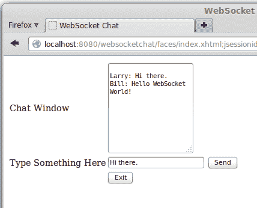
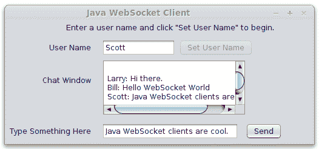

# 第七章：WebSocket

传统上，Web 应用程序是使用 HTTP 协议之后的请求/响应模型开发的。在这个传统的请求/响应模型中，请求始终由客户端发起，然后服务器将响应发送回客户端。

服务器从未有过独立向客户端发送数据的方式，也就是说，无需等待请求，直到现在。WebSocket 协议允许客户端（浏览器）和服务器之间进行全双工、双向通信。

Java EE 7 引入了 Java API for WebSocket，它允许我们在 Java 中开发 WebSocket 端点。

在本章中，我们将涵盖以下主题：

+   开发 WebSocket 服务器端点

+   在 JavaScript 中开发 WebSocket 客户端

+   在 Java 中开发 WebSocket 客户端

# 开发 WebSocket 服务器端点

我们可以通过两种方式使用 Java API for WebSocket 实现 WebSocket 服务器端点。我们既可以程序化地开发端点，在这种情况下，我们需要扩展`javax.websocket.Endpoint`类，也可以通过 WebSocket 特定注解装饰**普通 Java 对象**（**POJOs**）。这两种方法非常相似，因此，我们将在本章中详细讨论注解方法，并在稍后简要解释如何程序化地开发 WebSocket 服务器端点。

在本章中，我们将开发一个简单的基于 Web 的聊天应用程序，充分利用 Java API for WebSocket。

# 开发一个带注释的 WebSocket 服务器端点

以下 Java 类说明了我们如何通过注解 Java 类来开发 WebSocket 服务器端点：

```java
package net.ensode.javaeebook.websocketchat.serverendpoint; 

import java.io.IOException; 
import java.util.logging.Level; 
import java.util.logging.Logger; 
import javax.websocket.OnClose; 
import javax.websocket.OnMessage; 
import javax.websocket.OnOpen; 
import javax.websocket.Session; 
import javax.websocket.server.ServerEndpoint; 

@ServerEndpoint("/websocketchat")
public class WebSocketChatEndpoint {

    private static final Logger LOG = Logger.getLogger(WebSocketChatEndpoint.class.getName());

    @OnOpen
    public void connectionOpened() {
        LOG.log(Level.INFO, "connection opened");
    }

    @OnMessage
    public synchronized void processMessage(Session session, String
        message) {
        LOG.log(Level.INFO, "received message: {0}", message);

        try {
            for (Session sess : session.getOpenSessions()) {
 if (sess.isOpen()) {
 sess.getBasicRemote().sendText(message);
 }
 }
        } catch (IOException ioe) {
            LOG.log(Level.SEVERE, ioe.getMessage());
        }
    }

    @OnClose
    public void connectionClosed() {
        LOG.log(Level.INFO, "connection closed");
    }

}

```

类级别的`@ServerEndpoint`注解表示该类是一个 WebSocket 服务器端点。服务器端点的**URI**（**统一资源标识符**）是注解后面的括号中指定的值（在这个例子中是`"/websocketchat"`）。WebSocket 客户端将使用此 URI 与我们的端点进行通信。

`@OnOpen`注解用于装饰一个方法，该方法需要在任何客户端打开 WebSocket 连接时执行。在我们的例子中，我们只是向服务器日志发送一些输出，但当然，任何有效的服务器端 Java 代码都可以放在这里。

任何被`@OnMessage`注解的方法都会在我们服务器端点从任何客户端接收到消息时被调用。由于我们正在开发一个聊天应用程序，我们的代码只是将接收到的消息广播给所有已连接的客户端。

在我们的例子中，`processMessage()`方法被`@OnMessage`注解，它接受两个参数：一个实现了`javax.websocket.Session`接口的类的实例，以及一个包含接收到的消息的`String`。由于我们正在开发一个聊天应用程序，我们的 WebSocket 服务器端点只是将接收到的消息广播给所有已连接的客户端。

`Session`接口的`getOpenSessions()`方法返回一个表示所有打开会话的`Session`对象集合。我们遍历这个集合，通过在每个`Session`实例上调用`getBasicRemote()`方法，然后调用此调用返回的`RemoteEndpoint.Basic`实现上的`sendText()`方法，将接收到的消息广播回所有已连接的客户端。

`Session`接口上的`getOpenSessions()`方法在调用该方法时返回所有打开的会话。在方法调用后，可能有一个或多个会话已经关闭，因此，在尝试向客户端发送数据之前，建议在`Session`实现上调用`isOpen()`方法。

最后，如果我们需要处理客户端从服务器端点断开连接的事件，我们需要用`@OnClose`注解装饰一个方法。在我们的例子中，我们只是简单地将一条消息记录到服务器日志中。

我们在示例中没有使用的一个额外注解是`@OnError`注解，它用于装饰在发送或接收数据到或从客户端发生错误时需要调用的方法。

如我们所见，开发带有注释的 WebSocket 服务器端点是直接的；我们只需添加几个注解，应用程序服务器就会根据需要调用我们的注解方法。

如果我们希望以程序化的方式开发 WebSocket 服务器端点，我们需要编写一个扩展`javax.websocket.Endpoint`的 Java 类。这个类有`onOpen()`、`onClose()`和`onError()`方法，这些方法在端点生命周期中的适当时间被调用。没有与`@OnMessage`注解等效的方法来处理来自客户端的消息；需要在`Session`中调用`addMessageHandler()`方法，传递一个实现`javax.websocket.MessageHandler`接口（或其子接口）的类的实例作为其唯一参数。

通常情况下，与程序化方式相比，开发带有注释的 WebSocket 端点更容易且更直接，因此，在可能的情况下，我们推荐使用注释方法。

# 开发 WebSocket 客户端

大多数 WebSocket 客户端都是作为利用 JavaScript WebSocket API 的网页实现的。我们将在下一节中介绍如何做到这一点。

Java WebSocket API 提供了客户端 API，允许我们开发作为独立 Java 应用程序的 WebSocket 客户端。我们将在本章后面介绍这一功能。

# 开发 JavaScript 客户端 WebSocket 代码

在本节中，我们将介绍如何开发与我们在上一节中开发的 WebSocket 端点交互的客户端 JavaScript 代码。

我们 WebSocket 示例的客户端页面是一个使用 HTML5 友好标记的 JSF 页面（如第二章[9059bc2f-04fb-43df-a5c5-8b2cce80792e.xhtml]中所述，*JavaServer Faces*）。

我们的客户页面由一个文本区域组成，我们可以看到我们应用程序的用户在说什么（毕竟，这是一个聊天应用程序），以及一个我们可以用来向其他用户发送消息的输入文本：



我们客户页面的标记如下所示：

```java
<?xml version="1.0" encoding="UTF-8"?> 
<!DOCTYPE html> 
<html  
> 
<head> 
<title>WebSocket Chat</title> 
<meta name="viewport" content="width=device-width"/> 
<script type="text/javascript"> 
var websocket; 
function init() { 
websocket = new WebSocket( 
'ws://localhost:8080/websocketchat/websocketchat'); 

websocket.onopen = function(event) { 
websocketOpen(event) 
}; 
websocket.onmessage = function(event) { 
websocketMessage(event) 
}; 
websocket.onerror = function(event) { 
websocketError(event) 
}; 

} 

function websocketOpen(event) { 
console.log("webSocketOpen invoked"); 
} 

function websocketMessage(event) { 
console.log("websocketMessage invoked"); 
document.getElementById('chatwindow').value += '\r' + 
event.data; 
} 

function websocketError(event) { 
console.log("websocketError invoked"); 
} 

function sendMessage() { 
var userName = 
document.getElementById('userName').value; 
var msg = 
document.getElementById('chatinput').value; 

websocket.send(userName + ": " + msg); 
} 

function closeConnection(){ 
websocket.close(); 
} 

window.addEventListener("load", init);  
</script> 
</head> 
<body> 
<form jsf:prependId="false"> 
<input type="hidden" id="userName" 
value="#{user.userName}"/> 
<table border="0"> 
<tbody> 
<tr> 
<td> 
<label for="chatwindow"> 
Chat Window 
</label> 
</td> 
<td> 
<textArea id="chatwindow" rows="10"/> 
</td> 
</tr> 
<tr> 
<td> 
<label for="chatinput"> 
Type Something Here 
</label> 
</td> 
<td> 
<input type="text" id="chatinput"/>  
<input id="sendBtn" type="button" value="Send"  
 onclick="sendMessage()"/> 
</td> 
</tr> 
<tr> 
<td></td> 
<td> 
<input type="button" id="exitBtn" value="Exit"  
 onclick="closeConnection()"/> 
</td> 
</tr> 
</tbody> 
</table> 
</form> 
</body> 
</html> 
```

我们 JavaScript 代码的最后一行 (`window.addEventListener("load", init);`) 将我们的 JavaScript `init()` 函数设置为在页面加载后立即执行。

在 `init()` 函数中，我们初始化一个新的 JavaScript WebSocket 对象，将我们的服务器端点的 URI 作为参数传递。这使我们的 JavaScript 代码知道我们的服务器端点的位置。

JavaScript WebSocket 对象具有多种函数类型，用于处理不同的事件，例如打开连接、接收消息和处理错误。我们需要将这些类型设置为我们的 JavaScript 函数，以便我们可以处理这些事件，这正是我们在 `init()` 函数中做的，紧随 JavaScript WebSocket 对象构造函数的调用之后。在我们的示例中，我们分配给 WebSocket 对象的函数只是将它们的功能委托给独立的 JavaScript 函数。

我们的 `websocketOpen()` 函数会在 WebSocket 连接打开时被调用。在我们的示例中，我们只是简单地向浏览器的 JavaScript 控制台发送一条消息。

我们的 `webSocketMessage()` 函数会在浏览器从我们的 WebSocket 端点接收到 WebSocket 消息时被调用。在我们的示例中，我们使用消息的内容更新具有 ID `chatWindow` 的文本区域的内容。

我们的 `websocketError()` 函数会在发生与 WebSocket 相关的错误时被调用。在我们的示例中，我们只是简单地向浏览器的 JavaScript 控制台发送一条消息。

我们的 JavaScript `sendMessage()` 函数将消息发送到 WebSocket 服务器端点，包含用户名和具有 ID `chatinput` 的文本输入的内容。当用户点击具有 ID `sendBtn` 的按钮时，会调用此函数。

我们的 `closeConnection()` JavaScript 函数关闭与我们的 WebSocket 服务器端点的连接。当用户点击具有 ID `exitBtn` 的按钮时，会调用此函数。

如此示例所示，编写客户端 JavaScript 代码以与 WebSocket 端点交互相当简单。

# 在 Java 中开发 WebSocket 客户端

虽然目前开发基于 Web 的 WebSocket 客户端是开发 WebSocket 客户端最常见的方式，但 Java API for WebSocket 提供了一个客户端 API，我们可以使用它来在 Java 中开发 WebSocket 客户端。

在本节中，我们将使用 Java API for WebSocket 的客户端 API 开发一个简单的 WebSocket 客户端。最终产品看起来像这样：



然而，我们不会涵盖 GUI 代码（使用 Swing 框架开发的），因为它与讨论无关。示例的完整代码，包括 GUI 代码，可以从 Packt Publishing 网站下载。

就像 WebSocket 服务器端点一样，Java WebSocket 客户端可以编程开发或使用注解开发。再次强调，我们只会介绍注解方法；编程客户端的开发方式与编程服务器端点非常相似，也就是说，编程客户端必须扩展`javax.websocket.Endpoint`并重写适当的方法。

不再赘述，以下是我们的 Java WebSocket 客户端代码：

```java
package net.ensode.websocketjavaclient;

import java.io.IOException;
import java.net.URI;
import java.net.URISyntaxException;
import javax.websocket.ClientEndpoint;
import javax.websocket.CloseReason;
import javax.websocket.ContainerProvider;
import javax.websocket.DeploymentException;
import javax.websocket.OnClose;
import javax.websocket.OnError;
import javax.websocket.OnMessage;
import javax.websocket.OnOpen;
import javax.websocket.Session;
import javax.websocket.WebSocketContainer;

@ClientEndpoint
public class WebSocketClient {

    private String userName;
    private Session session;
    private final WebSocketJavaClientFrame webSocketJavaClientFrame;

    public WebSocketClient(WebSocketJavaClientFrame
        webSocketJavaClientFrame) {
        this.webSocketJavaClientFrame = webSocketJavaClientFrame;

        try {
            WebSocketContainer webSocketContainer =
 ContainerProvider.getWebSocketContainer();
 webSocketContainer.connectToServer(this, 
 new URI(

 "ws://localhost:8080/websocketchat/websocketchat"));
        } catch (DeploymentException |
                      IOException | URISyntaxException ex) {
            ex.printStackTrace();
        }

    }

    @OnOpen
    public void onOpen(Session session) {
        System.out.println("onOpen() invoked");
        this.session = session;
    }

 @OnClose
    public void onClose(CloseReason closeReason) {
        System.out.println("Connection closed, reason: "
                + closeReason.getReasonPhrase());
    }

    @OnError
    public void onError(Throwable throwable) {
        System.out.println("onError() invoked");
        throwable.printStackTrace();
    }

    @OnMessage
    public void onMessage(String message, Session session) {
        System.out.println("onMessage() invoked");
          webSocketJavaClientFrame.getChatWindowTextArea().
            setText(
            webSocketJavaClientFrame.getChatWindowTextArea().
            getText() + "\n" + message);
    }

    public void sendMessage(String message) {
        try {
            System.out.println("sendMessage() invoked, message = " 
             + message);
            session.getBasicRemote().sendText(userName + ": " +
             message);
        } catch (IOException ex) {
            ex.printStackTrace();
        }
    }

    public String getUserName() {
        return userName;
    }

    public void setUserName(String userName) {
        this.userName = userName;
    }

}
```

类级别的`@ClientEndPoint`注解表示我们的类是一个 WebSocket 客户端；所有 Java WebSocket 客户端都必须使用这个注解。

建立与 WebSocket 服务器端点的连接代码位于我们的类构造函数中。首先，我们需要调用`ContainerProvider.getWebSocketContainer()`来获取`javax.websocket.WebSocketContainer`的一个实例。然后，通过在`WebSocketContainer`实例上调用`connectToServer()`方法来建立连接，第一个参数是一个带有`@ClientEndpoint`注解的类（在我们的例子中，我们使用它是因为连接代码位于我们的 WebSocket Java 客户端代码中），第二个参数是一个包含 WebSocket 服务器端点 URI 的 URI 对象。

连接建立后，我们就可以准备响应 WebSocket 事件了。细心的读者可能已经注意到，我们用于开发服务器端点的确切相同的注解再次在我们的客户端代码中使用。

带有`@OnOpen`注解的任何方法都会在连接到 WebSocket 服务器端点时自动被调用。该方法必须返回 void，并且可以有一个可选的`javax.websocket.Session`类型的参数。在我们的例子中，我们向控制台发送一些输出，并用我们接收到的`Session`实例初始化一个类变量。

带有`@OnClose`注解的方法会在 WebSocket 会话关闭时被调用。被注解的方法可以有一个可选的`javax.websocket.Session`参数和一个可选的`CloseReason`参数。在我们的例子中，我们选择只使用`CloseReason`可选参数，因为这个类有一个方便的`getReasonPhrase()`方法，可以提供会话关闭的简短解释。

`@OnError`注解用于装饰在发生错误时将被调用的任何方法。带有`@OnError`注解的方法必须有一个`java.lang.Throwable`参数（`java.lang.Exception`的父类），并且可以有一个可选的`type session`参数。在我们的例子中，我们只是将`Throwable`参数的堆栈跟踪发送到`stderr`。

被注解为`@OnMessage`的方法会在接收到任何传入的 WebSocket 消息时被调用。`@OnMessage`方法可以根据接收到的消息类型以及我们希望如何处理它来具有不同的参数。在我们的例子中，我们使用了最常见的情况，即接收一个文本消息。在这种情况下，我们需要一个`String`参数，它将保存消息的内容，以及一个可选的`Session`参数。

有关如何处理其他类型消息的信息，请参阅`@OnMessage`的 JavaDoc 文档，链接为[`docs.oracle.com/javaee/7/api/javax/websocket/OnMessage.html`](https://javaee.github.io/javaee-spec/javadocs/javax/websocket/OnMessage.html)。

在我们的例子中，我们只是简单地更新了聊天窗口的文本区域，将接收到的消息追加到其内容中。

要发送 WebSocket 消息，我们在`Session`实例上调用`getBasicRemote()`方法，然后在该`R.remoteEndpoint`上调用`sendText()`方法。此调用返回一个基本实现（如果这看起来很熟悉，那是因为我们在 WebSocket 服务器端点代码中做了完全相同的事情）。在我们的例子中，我们在`sendMessage()`方法中这样做。

# 关于 Java WebSocket API 的附加信息

在本章中，我们介绍了 Java WebSocket API 提供的功能的大部分。有关更多信息，请参阅 Tyrus 用户指南，它是 Java WebSocket API 的参考实现，链接为[`tyrus.java.net/documentation/1.3.1/user-guide.html`](https://tyrus.java.net/documentation/1.3.1/user-guide.html)。

# 摘要

在本章中，我们介绍了 Java WebSocket API，这是一个 Java EE API，用于开发 WebSocket 服务器端点和客户端。我们首先看到了如何利用 Java WebSocket API 开发 WebSocket 服务器端点。然后，我们介绍了如何使用 JavaScript 开发基于 Web 的 WebSocket 客户端。最后，我们解释了如何在 Java 中开发 WebSocket 客户端应用程序。
