# 第十四章：配置和部署到 GlassFish

在撰写本文时，GlassFish 5 是唯一发布的符合 Java EE 8 规范的应用服务器，因此，所有示例代码都是针对 GlassFish 进行测试的，然而，它们应该可以在任何符合 Java EE 8 规范的应用服务器上运行。

想要使用 GlassFish 运行示例代码的读者可以遵循本附录中的说明来设置它。

# 获取 GlassFish

可以从 [`javaee.github.io/glassfish/download`](https://javaee.github.io/glassfish/download)[.](https://glassfish.dev.java.net/) 下载 GlassFish。


Java EE 规范有配置文件的概念，Web Profile 实现了 Java EE 规范的子集，并缺少一些功能，例如 JMS 和一些 EJB 功能。为了能够成功部署本书中的所有示例，我们应该通过点击标有“GlassFish 5.0 - Full Platform”的链接来下载实现完整 Java EE 8 规范的 GlassFish 版本。

# 安装 GlassFish

GlassFish 5.0 以 zip 文件的形式分发；安装 GlassFish 与将 zip 文件解压缩到我们选择的目录一样简单。

GlassFish 假设系统中存在一些依赖项。

# GlassFish 依赖项

为了安装 GlassFish 5，必须在您的工作站上安装一个较新的 Java SE 版本（需要 Java SE 8），并且 Java 可执行文件必须在您的系统 PATH 中。Java SE 8 可在 [`www.oracle.com/technetwork/java/javase/downloads/jdk8-downloads-2133151.html`](http://www.oracle.com/technetwork/java/javase/downloads/jdk8-downloads-2133151.html) 下载。

# 进行安装

一旦 JDK 已经安装，可以通过简单地解压缩下载的压缩文件来开始 GlassFish 的安装：

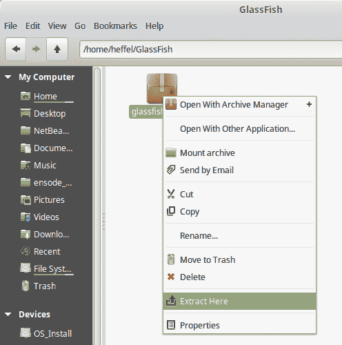

所有现代操作系统，包括 Linux、Windows 和 macOS，都自带支持提取压缩 ZIP 文件的功能，有关详细信息，请参阅您的操作系统文档。

解压缩 zip 文件后，将创建一个名为 glassfish5 的新目录，这个新目录包含我们的 GlassFish 安装。

# 启动 GlassFish

要从命令行启动 GlassFish，请将目录更改为 `[glassfish 安装目录]/glassfish5/bin`，并执行以下命令：

```java
./asadmin start-domain
```

上一条命令以及本章中显示的大多数命令都假设使用的是 Unix 或类 Unix 操作系统，如 Linux 或 macOS。对于 Windows 系统，初始的 `./` 是不必要的。

在执行前面的命令后不久，我们应该在终端底部看到类似以下的消息：

```java
Waiting for domain1 to start .............. 
    Successfully started the domain : domain1 
    domain  Location: /home/heffel/glassfish-5/glassfish5/glassfish/domains/domain1 
    Log File: /home/heffel/glassfish- 
 5/glassfish5/glassfish/domains/domain1/logs/server.log 
    Admin Port: 4848 

Command start-domain executed successfully.
```

然后，我们可以打开一个浏览器窗口，并在浏览器地址栏中输入以下 URL：`http://localhost:8080`。

如果一切顺利，我们应该看到一个页面，表明您的 GlassFish 服务器现在正在运行：

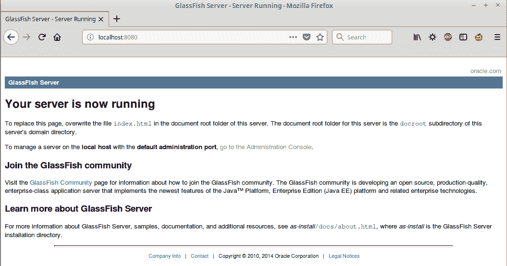

# 部署我们的第一个 Java EE 应用程序

为了进一步测试我们的 GlassFish 安装是否运行正常，我们将部署一个 WAR（Web 归档）文件，并确保它正确部署和执行。在继续之前，请从本书的代码包中下载`simpleapp.war`文件。

# 通过 Web 控制台部署应用程序

要部署`simpleapp.war`，打开浏览器并导航到以下 URL：`http://localhost:4848`。你应该会看到默认的 GlassFish 服务器管理页面：

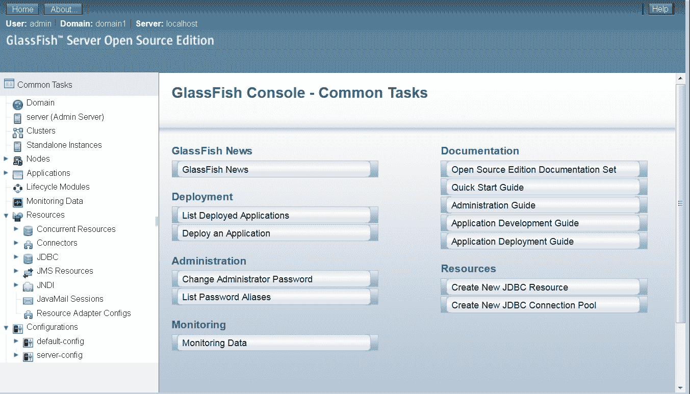

默认情况下，GlassFish 以开发模式安装，在此模式下，访问 GlassFish Web 控制台无需输入用户名和密码。在生产环境中，强烈建议配置 Web 控制台，使其受密码保护。

在这一点上，我们应该点击主屏幕上的部署部分下的“部署应用程序”项。

要部署我们的应用程序，我们应该选择“从 GlassFish 服务器可访问的本地打包文件或目录”单选按钮，并输入我们的 WAR 文件的路径或通过点击“浏览文件...”按钮选择它：

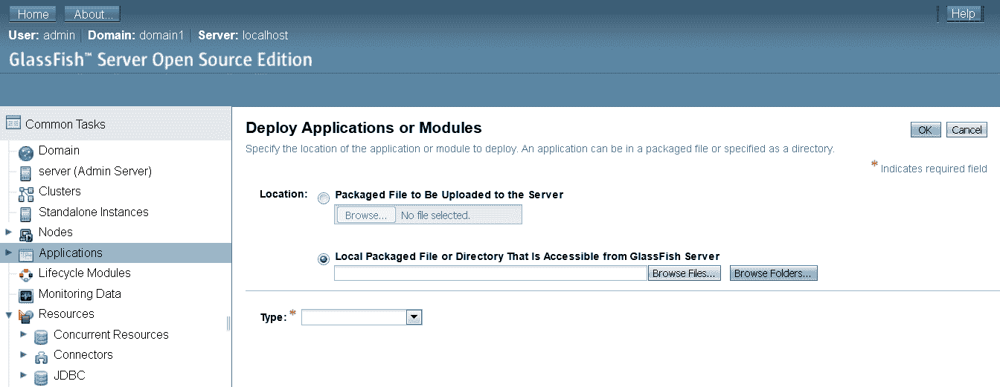

在我们选择了我们的 WAR 文件后，会显示一些输入字段，允许我们指定几个选项。就我们的目的而言，所有默认设置都很好，我们只需简单地点击页面右上角的“确定”按钮：

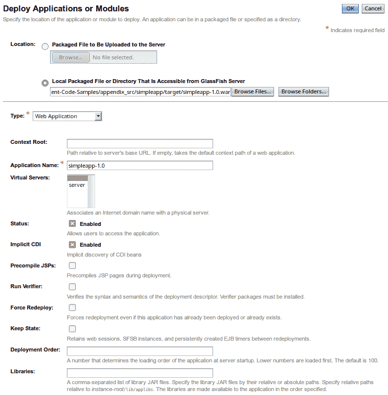

一旦我们部署了应用程序，GlassFish Web 控制台会显示应用程序窗口，我们的应用程序被列为已部署应用程序之一：

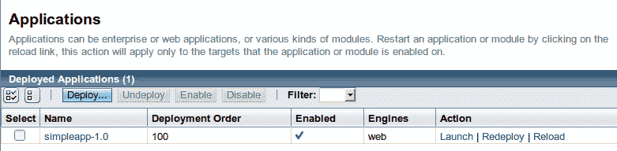

要执行`simpleapp`应用程序，请在浏览器地址栏中输入以下 URL：`http://localhost:8080/simpleapp-1.0/simpleServlet`。生成的页面应该看起来像这样：

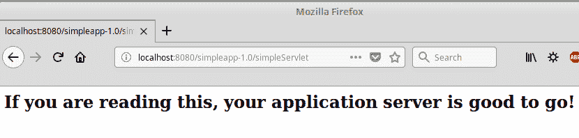

就这样！我们已经成功部署了我们的第一个 Java EE 应用程序。

# 通过 GlassFish 管理控制台卸载应用程序

要卸载我们刚刚部署的应用程序，请在浏览器中输入以下 URL 以登录 GlassFish 管理控制台：`http://localhost:4848`。

然后，要么点击左侧导航面板中的“应用程序”菜单项，要么点击管理控制台主页上的“列出已部署应用程序”项。

无论哪种方式，都会带我们到应用程序管理页面：

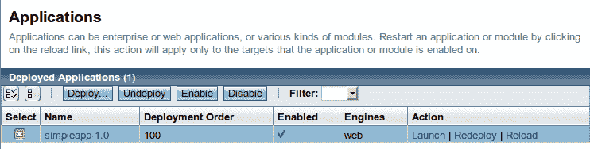

可以通过从已部署应用程序列表中选择应用程序并点击列表上方“卸载”按钮来简单地卸载应用程序：

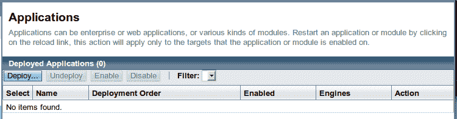

# 通过命令行部署应用程序

有两种方式可以通过命令行部署应用程序：一种是将我们想要部署的工件复制到 `autodeploy` 目录，另一种是使用 GlassFish 的 `asadmin` 命令行工具。

# 自动部署目录

现在我们已经卸载了 `simpleapp.war` 文件，我们准备使用命令行来部署它。要以这种方式部署应用程序，只需将 `simpleapp.war` 复制到 `[glassfish 安装目录]/glassfish4/glassfish/domains/domain1/autodeploy`。只需将应用程序复制到这个目录，它就会自动部署。

我们可以通过查看服务器日志来验证应用程序是否已成功部署。服务器日志位于 `[glassfish 安装目录]/glassfish4/glassfish/domains/domain1/logs/server.log`。该文件的最后几行应该看起来像这样：

```java
    [2017-11-22T19:02:41.206-0500] [glassfish 5.0] [INFO] [] [javax.enterprise.system.tools.deployment.common] [tid: _ThreadID=91 _ThreadName=AutoDeployer] [timeMillis: 1511395361206] [levelValue: 800] [[
      visiting unvisited references]]

    [2017-11-22T19:02:41.237-0500] [glassfish 5.0] [INFO] [AS-WEB-GLUE-00172] [javax.enterprise.web] [tid: _ThreadID=91 _ThreadName=AutoDeployer] [timeMillis: 1511395361237] [levelValue: 800] [[
      Loading application [simpleapp-1.0] at [/simpleapp-1.0]]]

    [2017-11-22T19:02:41.246-0500] [glassfish 5.0] [INFO] [] [javax.enterprise.system.core] [tid: _ThreadID=91 _ThreadName=AutoDeployer] [timeMillis: 1511395361246] [levelValue: 800] [[
      simpleapp-1.0 was successfully deployed in 50 milliseconds.]]

    [2017-11-22T19:02:41.247-0500] [glassfish 5.0] [INFO] [NCLS-DEPLOYMENT-02035] [javax.enterprise.system.tools.deployment.autodeploy] [tid: _ThreadID=91 _ThreadName=AutoDeployer] [timeMillis: 1511395361247] [levelValue: 800] [[

  [AutoDeploy] Successfully autodeployed : /home/heffel/glassfish-5/glassfish5/glassfish/domains/domain1/autodeploy/simpleapp-1.0.war.]] 
```

我们当然也可以通过访问应用程序的 URL 来验证部署，这个 URL 将与我们在通过 Web 控制台部署时使用的 URL 相同，即 `http://localhost:8080/simpleapp/simpleservlet`，应用程序应该能够正常运行。

以这种方式部署的应用程序可以通过简单地从 `autodeploy` 目录中删除工件（在我们的例子中是 WAR 文件）来卸载。删除文件后，我们应该在服务器日志中看到类似以下的消息：

```java
    [2017-11-22T19:04:23.198-0500] [glassfish 5.0] [INFO] [NCLS-DEPLOYMENT-02026] [javax.enterprise.system.tools.deployment.autodeploy] [tid: _ThreadID=91 _ThreadName=AutoDeployer] [timeMillis: 1511395463198] [levelValue: 800] [[
      Autoundeploying application:  simpleapp-1.0]]

    [2017-11-22T19:04:23.218-0500] [glassfish 5.0] [INFO] [NCLS-DEPLOYMENT-02035] [javax.enterprise.system.tools.deployment.autodeploy] [tid: _ThreadID=91 _ThreadName=AutoDeployer] [timeMillis: 1511395463218] [levelValue: 800] [[
      [AutoDeploy] Successfully autoundeployed : /home/heffel/glassfish-5/glassfish5/glassfish/domains/domain1/autodeploy/simpleapp-1.0.war.]]

```

# asadmin 命令行工具

通过命令行部署应用程序的另一种替代方法是使用以下命令：

```java
asadmin deploy [path to file]/simpleapp-1.0.war
```

上述命令必须在 `[glassfish 安装目录]/glassfish4/bin` 下运行。

我们应该在命令行终端上看到确认消息，告知我们文件已成功部署：

```java
Application deployed with name simpleapp-1.0.

Command deploy executed successfully.
```

服务器日志文件应该显示类似以下的消息：

```java
    [2017-11-22T19:06:36.342-0500] [glassfish 5.0] [INFO] [AS-WEB-GLUE-00172] [javax.enterprise.web] [tid: _ThreadID=128 _ThreadName=admin-listener(6)] [timeMillis: 1511395596342] [levelValue: 800] [[
      Loading application [simpleapp-1.0] at [/simpleapp-1.0]]]

    [2017-11-22T19:06:36.349-0500] [glassfish 5.0] [INFO] [] [javax.enterprise.system.core] [tid: _ThreadID=128 _ThreadName=admin-listener(6)] [timeMillis: 1511395596349] [levelValue: 800] [[

 simpleapp-1.0 was successfully deployed in 51 milliseconds.]] 
```

可以通过发出如下命令来使用 `asadmin` 可执行文件卸载应用程序：

```java
asadmin undeploy simpleapp-1.0
```

以下消息应该在终端窗口的底部显示：

```java
[2017-11-22T19:06:36.349-0500] [glassfish 5.0] [INFO] [] [javax.enterprise.system.core] [tid: _ThreadID=128 _ThreadName=admin-listener(6)] [timeMillis: 1511395596349] [levelValue: 800] [[
simpleapp-1.0 was successfully deployed in 51 milliseconds.]]
```

请注意，文件扩展名不用于卸载应用程序，`asadmin` 卸载的参数应该是应用程序名称，默认为 WAR 文件名（减去扩展名）。

# GlassFish 域

警惕的读者可能会注意到 `autodeploy` 目录位于 `domains/domain1` 子目录下。GlassFish 有一个名为 **domains** 的概念。域允许将相关应用程序一起部署。可以同时启动多个域。GlassFish 域的行为类似于单独的 GlassFish 实例，在安装 GlassFish 时会创建一个默认域 `domain1`。

# 创建域

可以通过发出以下命令从命令行创建额外的域：

```java
asadmin create-domain domainname 
```

上述命令需要几个参数来指定域将监听的服务（HTTP、Admin、JMS、IIOP、安全 HTTP 等）的端口；在命令行中输入以下命令以查看其参数：

```java
asadmin create-domain --help 
```

如果我们想在同一服务器上同时运行多个域，这些端口必须仔细选择，因为为不同的服务（或甚至跨域的同一服务）指定相同的端口将阻止其中一个域正常工作。

默认 `domain1` 域的默认端口列在以下表格中：

| **服务** | **端口** |
| --- | --- |
| Admin | 4848 |
| HTTP | 8080 |
| Java 消息系统 (JMS) | 7676 |
| 互联网间对象请求代理协议 (IIOP) | 3700 |
| 安全 HTTP (HTTPS) | 8181 |
| 安全 IIOP | 3820 |
| 互认授权 IIOP | 3920 |
| Java 管理扩展 (JMX) 管理 | 8686 |

请注意，在创建域时，只需指定管理端口，如果未指定其他端口，则将使用表中列出的默认端口。在创建域时必须小心，因为，如上所述，如果任何服务在相同的端口上监听连接，则同一服务器上的两个域不能同时运行。

创建域而不必为每个服务指定端口的另一种方法是发出以下命令：

```java
asadmin create-domain --portbase [port number] domainname
```

`--portbase` 参数的值决定了域的基本端口；不同服务的端口将是给定端口号的偏移量。以下表格列出了分配给所有不同服务的端口：

| **服务** | **端口** |
| --- | --- |
| Admin | 端口基础 + 48 |
| HTTP | 端口基础 + 80 |
| Java 消息系统 (JMS) | 端口基础 + 76 |
| 互联网间对象请求代理协议 (IIOP) | 端口基础 + 37 |
| 安全 HTTP (HTTPS) | 端口基础 + 81 |
| 安全 IIOP | 端口基础 + 38 |
| 互认授权 IIOP | 端口基础 + 39 |
| Java 管理扩展 (JMX) 管理 | 端口基础 + 86 |

当然，在选择端口基础值时必须小心，确保分配的端口不会与其他域冲突。

根据经验法则，使用大于 8000 且能被 1000 整除的端口基础数字创建的域不会相互冲突，例如，使用端口基础为 9000 创建一个域是安全的，另一个使用端口基础为 10000，依此类推。

# 删除域

删除域非常简单，可以通过在命令行中发出以下命令来完成：

```java
asadmin delete-domain domainname 
```

我们应该在终端窗口看到如下信息：

```java
Command delete-domain executed successfully.
```

请谨慎使用前面的命令；一旦删除了一个域，它就无法轻易重新创建（所有已部署的应用程序都将消失，以及任何连接池、数据源等）。

# 停止域

可以通过发出以下命令来停止正在运行的域：

```java
asadmin stop-domain domainname 
```

此命令将停止名为 `domainname` 的域。

如果只有一个域正在运行，`domainname` 参数是可选的。

本书假设读者正在使用默认域 `domain1` 和默认端口进行工作。如果不是这种情况，给出的说明需要修改以匹配适当的域和端口。

# 设置数据库连接

任何非平凡的 Java EE 应用程序都将连接到关系型数据库管理系统（RDBMS）。支持的 RDBMS 系统包括 JavaDB、Oracle、Derby、Sybase、DB2、Pointbase、MySQL、PostgreSQL、Informix、Cloudscape 和 SQL Server。在本节中，我们将演示如何设置 GlassFish 与 MySQL 数据库通信，对于其他 RDBMS 系统，该过程类似。

GlassFish 随附一个名为 JavaDB 的 RDBMS。这个 RDBMS 基于 Apache Derby。为了限制遵循本书代码所需的下载和配置，大多数需要 RDBMS 的示例都使用捆绑的 JavaDB RDBMS。本节中的说明是为了说明如何将 GlassFish 连接到第三方 RDBMS。

# 设置连接池

打开和关闭数据库连接是一个相对较慢的操作。出于性能考虑，GlassFish 和其他 Java EE 应用程序服务器会保持一个打开的数据库连接池。当部署的应用程序需要数据库连接时，会从池中提供一个，当应用程序不再需要数据库连接时，该连接将被返回到池中。

在设置连接池时，首先要做的是将包含我们 RDBMS JDBC 驱动程序的 JAR 文件复制到域的 `lib` 目录中（有关获取此 JAR 文件的信息，请参阅您的 RDBMS 文档）。如果我们想要添加连接池的 GlassFish 域在复制 JDBC 驱动程序时正在运行，则必须重新启动该域以使更改生效。可以通过执行 `asadmin restart-domain` 来重新启动域。

一旦将 JDBC 驱动程序复制到适当的位置并且应用程序服务器已重新启动，请通过将浏览器指向 `http://localhost:4848` 来登录管理控制台。

然后，点击资源 | JDBC | JDBC 连接池，浏览器现在应该看起来像这样：

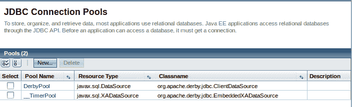

点击新建...按钮；在输入我们 RDBMS 的适当值后，页面主区域应该看起来像这样：

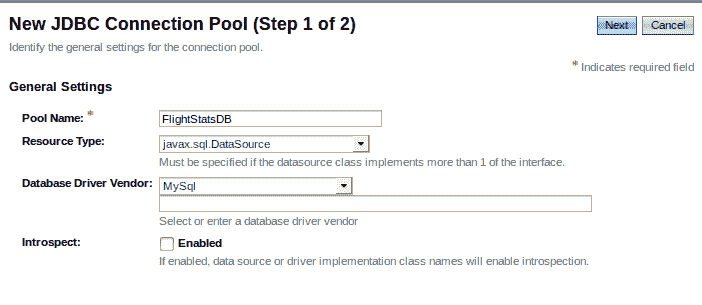

点击下一步按钮后，我们应该看到如下页面：

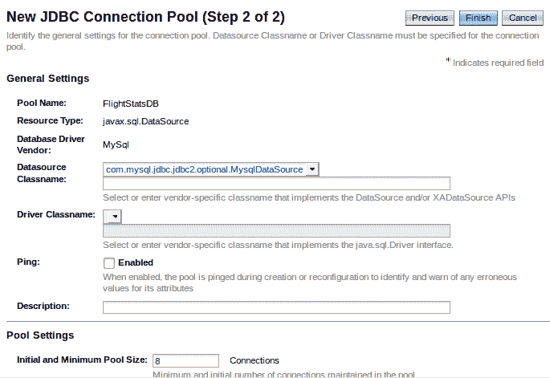

此页面上方的默认值大部分都是合理的。滚动到页面底部，并输入我们 RDBMS 的适当属性值（至少包括用户名、密码和 URL），然后点击屏幕右上角的完成按钮。

属性名称取决于我们使用的 RDBMS，但通常，有一个 URL 属性，我们应该在其中输入我们数据库的 JDBC URL，以及用户名和密码属性，我们应该在其中输入我们数据库的认证凭据。

我们新创建的连接池现在应该出现在连接池列表中：

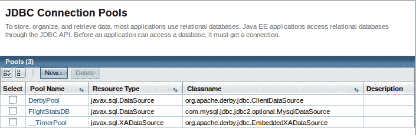

在某些情况下，在设置新的连接池后，可能需要重新启动 GlassFish 域。

我们可以通过点击其“池名称”，然后在结果页面上点击“Ping”按钮来验证我们的连接池是否成功设置：

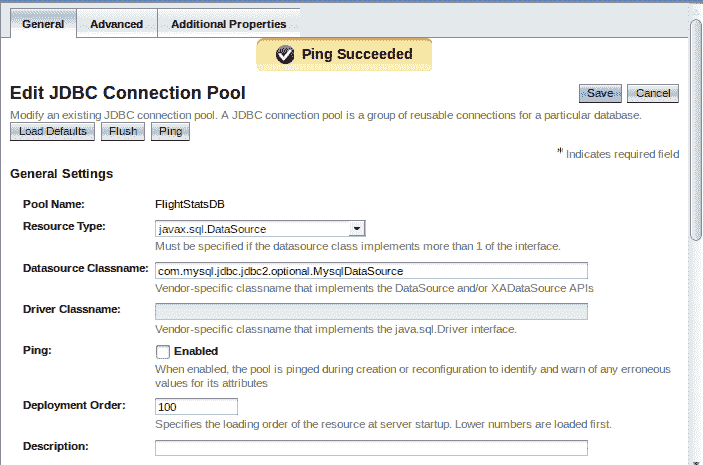

我们的联系池现在已准备好供我们的应用程序使用。

# 设置数据源

Java EE 应用程序不直接访问连接池，而是访问指向连接池的数据源。要设置新的数据源，请点击 Web 控制台左侧的“JDBC 资源”菜单项，然后点击“新建...”按钮。

在填写完我们新数据源的相关信息后，Web 控制台的主要区域应该看起来像这样：

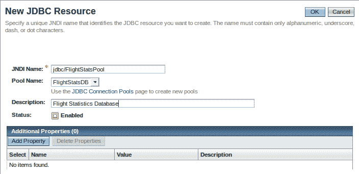

点击“确定”按钮后，我们可以看到我们新创建的数据源：

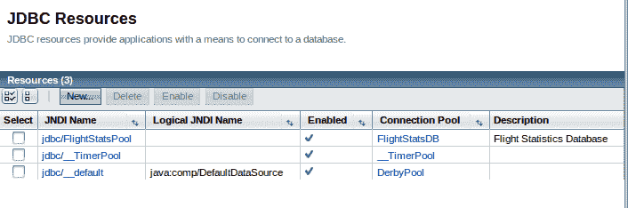

# 设置 JMS 资源

在我们开始编写代码以利用 JMS API 之前，我们需要配置一些 GlassFish 资源。具体来说，我们需要设置一个**JMS 连接工厂**、一个**消息队列**和一个**消息主题**。

Java EE 7 和 Java EE 8 要求所有合规的应用服务器提供默认的 JMS 连接工厂。作为完全合规的 Java EE 8 应用服务器（以及 Java EE 8 参考实现），GlassFish 符合这一要求，因此，严格来说，我们实际上并不需要设置连接工厂。在许多情况下，我们可能需要设置一个，因此在下文中，我们将说明如何进行设置。

# 设置 JMS 连接工厂

设置 JMS 连接工厂的最简单方法是通过 GlassFish 的 Web 控制台。正如之前在第一章“Java EE 简介”中提到的，我们可以通过在命令行中输入以下命令来启动我们的域，从而访问 Web 控制台：

```java
asadmin start-domain domain1 
```

然后，我们可以将浏览器指向`http://localhost:4848`并登录：

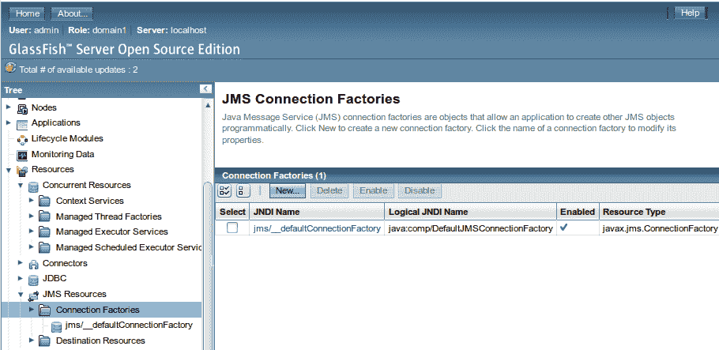

可以通过展开 Web 控制台左侧的树中的“资源”节点，展开“JMS 资源”节点，然后点击“连接工厂”节点，再点击 Web 控制台主区域的“新建...”按钮来添加一个连接工厂。

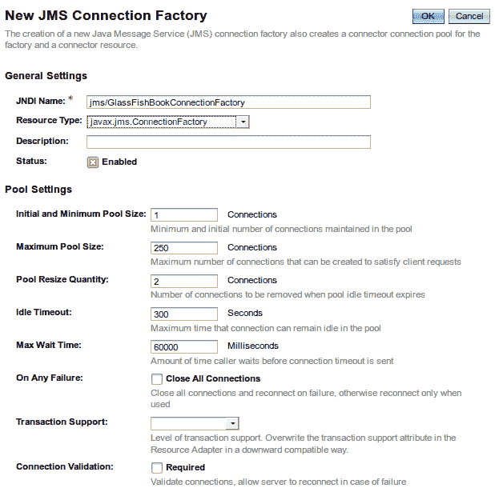

对于我们的目的，我们可以使用大多数默认设置；我们唯一需要做的是输入一个池名称并为我们的连接工厂选择一个资源类型。

在选择 JMS 资源名称时，始终使用以`jms/`开头的池名称是一个好主意。这样，在浏览 JNDI 树时可以轻松识别 JMS 资源。

在标有“JNDI 名称”的文本字段中，输入`jms/GlassFishBookConnectionFactory`。

资源类型下拉菜单有三个选项：

+   `javax.jms.TopicConnectionFactory`：用于创建一个连接工厂，该工厂为使用 pub/sub 消息域的 JMS 客户端创建 JMS 主题

+   `javax.jms.QueueConnectionFactory`：用于创建一个连接工厂，该工厂为使用 PTP 消息域的 JMS 客户端创建 JMS 队列

+   `javax.jms.ConnectionFactory`：用于创建一个连接工厂，该工厂可以创建 JMS 主题或 JMS 队列

在我们的示例中，我们将选择`javax.jms.ConnectionFactory`；这样我们就可以为所有示例使用相同的连接工厂，无论是使用 PTP 消息域的示例，还是使用 pub/sub 消息域的示例。

在输入我们的连接工厂的池名称、选择连接工厂类型以及可选地输入我们的连接工厂的描述后，我们必须点击“确定”按钮以使更改生效：

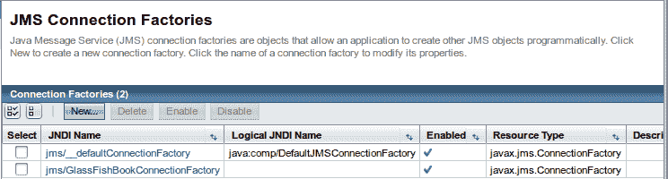

我们应该能够在 GlassFish Web 控制台的主区域看到我们新创建的连接工厂。

# 设置 JMS 消息队列

可以通过展开 Web 控制台左侧树中的“资源”节点，然后展开“JMS 资源”节点，点击“目的地资源”节点，接着在 Web 控制台主区域点击“新建...”按钮来添加一个 JMS 消息队列：

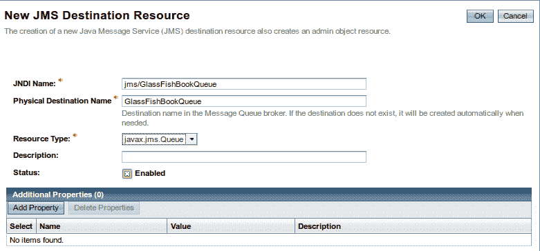

在我们的示例中，消息队列的 JNDI 名称为`jms/GlassFishBookQueue`。消息队列的资源类型必须是`javax.jms.Queue`。此外，必须输入物理目的地名称。在先前的示例中，我们使用`GlassFishBookQueue`作为此字段的值。

在点击“新建...”按钮、输入我们的消息队列的适当信息并点击“确定”后，我们应该能看到新创建的队列：

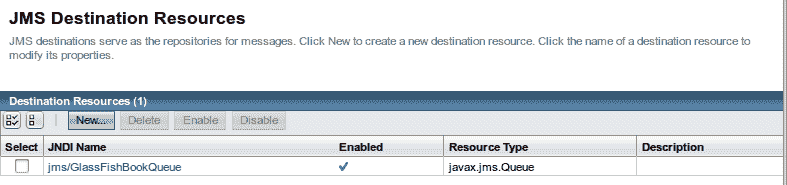

# 设置 JMS 消息主题

在 GlassFish 中设置 JMS 消息主题与设置消息队列非常相似。

在 GlassFish Web 控制台中，展开左侧树中的“资源”节点，然后展开“JMS 资源”节点，点击“目的地”节点，然后在 Web 控制台主区域点击“新建...”按钮：

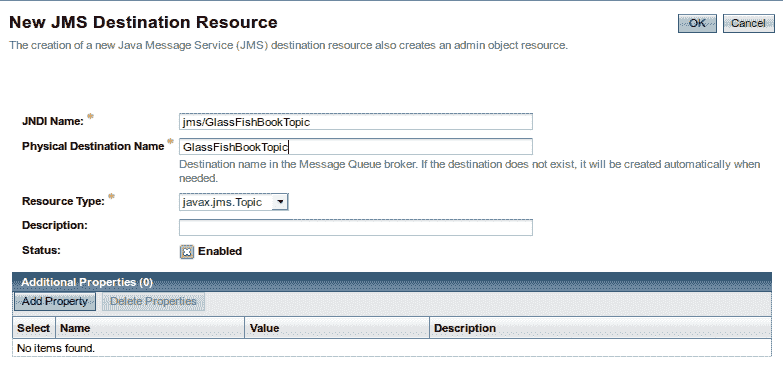

我们的示例将使用 JNDI 名称为`jms/GlassFishBookTopic`。由于这是一个消息主题，资源类型必须是`javax.jms.Topic`。描述字段是可选的。物理目的地名称属性是必需的；在我们的示例中，我们将使用`GlassFishBookTopic`作为名称属性的值。

点击“确定”按钮后，我们可以看到我们新创建的消息主题：

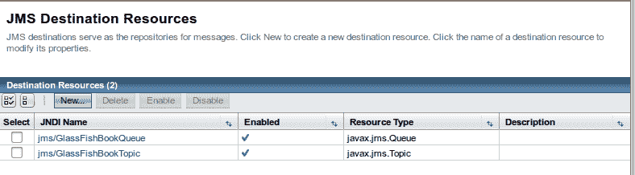

现在我们已经设置了一个连接工厂、一个消息队列和一个消息主题，我们就可以开始使用 JMS API 编写代码了。

# 配置持久订阅者

正如我们之前提到的，通过 GlassFish Web 控制台添加连接工厂是最简单的方法。回想一下，要通过 GlassFish Web 控制台添加 JMS 连接工厂，我们需要展开左侧的“资源”节点，然后展开“JMS 资源”节点，点击“连接工厂”节点，然后在页面主区域点击“新建...”按钮。我们的下一个示例将使用以下截图显示的设置：

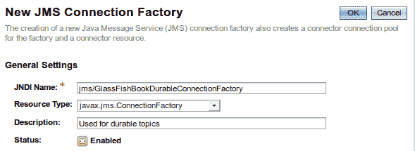

在点击“确定”按钮之前，我们需要滚动到页面底部，点击“添加属性”按钮，并输入一个名为`ClientId`的新属性。我们的示例将使用`ExampleId`作为此属性的值：

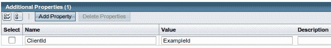

# 摘要

在本附录中，我们讨论了如何下载和安装 GlassFish。我们还讨论了通过 GlassFish Web 控制台、通过`asadmin`命令以及通过将文件复制到`autodeploy`目录来部署 Java EE 应用程序的几种方法。我们还讨论了基本的 GlassFish 管理任务，例如设置域和通过添加连接池和数据源来设置数据库连接。
