# 第一章：介绍 JEE 和 Eclipse

Java 企业版（JEE，之前称为 J2EE）已经存在很多年了。它是一个用于开发企业应用的非常健壮的平台。J2EE 首次于 1999 年发布，但在 2006 年发布第 5 版时经历了重大变化。自第 5 版以来，它已被更名为**Java 企业版**（**JEE**）。JEE 的最新版本使得开发多层分布式应用变得更加容易。J2EE 专注于核心服务，并将使应用开发变得更容易的任务留给了外部框架，例如 MVC 和持久化框架。但 JEE 将这些框架中的许多引入了核心服务。随着对注解的支持，这些服务在很大程度上简化了应用开发。

任何运行时技术如果没有好的开发工具都是不好的。**集成开发环境**（**IDE**）在快速开发应用中起着重要作用，Eclipse 为 JEE 提供了这样的环境。在 Eclipse 中，你不仅得到良好的代码编辑支持，还得到构建、单元测试、版本控制和软件应用开发不同阶段的重要任务的支持。

在本章中，我们将介绍以下主题：

+   JEE 不同技术的介绍

+   Eclipse 开发环境的介绍

+   本书介绍的一些常用软件的安装和配置，例如，JEE 服务器、Eclipse IDE 和 MySQL 数据库服务器

本书的目标是展示如何通过使用 Eclipse 在应用开发的各个阶段使用其许多功能，高效地开发 JEE 应用。但首先，这里简要介绍 JEE 和 Eclipse。

2017 年，Oracle 同意将 Java EE 的控制权移交给 Eclipse 基金会。2018 年 4 月，Eclipse 基金会将 Java EE 更名为 Jakarta EE。您可以在[`jakarta.ee/`](https://jakarta.ee/)找到有关 Jakarta EE 的更多信息。在撰写本文时，最新的 Java EE 版本是 8。但所有未来的 Java EE 版本都将被称为 Jakarta EE。

# JEE

JEE 是 Java 社区过程（[`www.jcp.org`](https://www.jcp.org)）的许多项目的集合。目前，JEE 处于第 8 版。然而，JEE 的不同规范处于它们各自的不同版本。

JEE 规范可以大致分为以下几组：

+   表示层

+   业务层

+   企业集成层

注意，JEE 规范并不一定将 API 分类到前面提到的广泛组中，但这种分类有助于更好地理解 JEE 中不同规范和 API 的目的。

在我们查看每个这些类别的 API 之前，让我们了解一个典型的 JEE Web 应用流程，如图中所示，以及前面的每一层适合的位置：

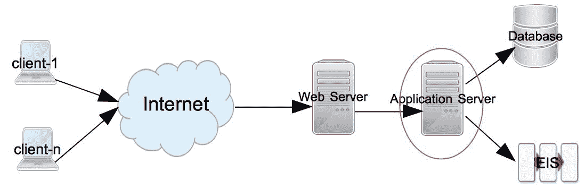

图 1.1：典型的 JEE Web 应用流程

请求从客户端开始。客户端可以是任何请求从远程应用程序获取服务的应用程序——例如，它可以是浏览器或桌面应用程序。请求首先由目标处的 Web 服务器接收。Web 服务器的例子包括 Apache Web 服务器、IIS 和 nginx。如果是一个静态内容的请求，则由 Web 服务器（们）提供。然而，动态请求通常需要一个应用服务器来处理。JEE 服务器就是这样处理动态请求的应用服务器。大多数 JEE 规范 API 在应用服务器中执行。JEE 应用服务器的例子包括 WebSphere、GlassFish 和 WildFly。

大多数非平凡 JEE 应用程序访问外部系统，例如数据库或 **企业集成服务器**（**EIS**），以访问数据并处理它。响应从应用服务器返回到 Web 服务器，然后到客户端。

以下各节简要描述了不同层中每个 JEE 规范的概述。我们将在后续章节中更详细地了解如何使用这些规范及其 API。然而，请注意，以下不是 JEE 中所有规范的详尽列表。我们将在本节中查看最常用的规范。要获取详尽列表，请访问 [`www.oracle.com/technetwork/java/javaee/tech/index.html`](http://www.oracle.com/technetwork/java/javaee/tech/index.html)。

# 表示层

此层的 JEE 规范或技术从 Web 服务器接收请求并返回响应，通常是 HTML 格式。然而，也可以仅从表示层返回数据，例如在 **JavaScript 对象表示法**（**JSON**）或 **可扩展标记语言**（**XML**）格式中，这可以通过 **异步 JavaScript 和 XML**（**AJAX**）调用仅更新页面的一部分，而不是渲染整个 HTML 页面。表示层中的类大多在 Web 容器中执行——它是处理 Web 请求的应用服务器的一部分。Tomcat 是流行的 Web 容器的一个例子。

现在，让我们来看看这一层的一些规范。

# Java Servlets

Java Servlets 是服务器端模块，通常用于在 Web 应用程序中处理请求并返回响应。Servlets 对于处理不生成大量 HTML 标记响应的请求很有用。它们通常用作 **模型-视图-控制器**（**MVC**）框架中的控制器，用于转发/重定向请求，或用于生成非 HTML 响应，例如 PDF。要从 Servlet 生成 HTML 响应，您需要在 Java 代码中嵌入 HTML 代码（作为 Java 字符串）。因此，它不是生成大量 HTML 响应最方便的选项。JEE 8 包含 Servlet API 4.0。

# JavaServer Pages

类似于 servlet，**JavaServer Pages**（**JSP**）也是用于处理 Web 请求的服务器端模块。JSP 非常适合处理生成大量 HTML 标记响应的请求。在 JSP 页面中，Java 代码或 JSP 标签可以与其他 HTML 代码（如 HTML 标签、JavaScript 和 CSS）混合使用。由于 Java 代码嵌入到更大的 HTML 代码中，因此从 JSP 页面生成 HTML 响应更容易（比 servlet）。JSP 规范 2.3 包含在 JEE 8 中。

# JavaServer Faces

**JavaServer Faces**（**JSF**）通过在其实现中结合 MVC 设计模式，使服务器端创建用户界面模块化。它还提供了易于使用的标签，用于常见的用户界面控件，可以在客户端和服务器之间的多个请求-响应交换中保存状态。例如，如果你有一个从浏览器提交表单数据的页面，你可以让 JSF 将数据保存到一个 Java Bean 中，以便在随后的响应中用于相同或不同的请求。JSF 还使在服务器端处理 UI 事件和指定应用程序中的页面导航变得更容易。

你可以在 JSP 中使用为 JSF 创建的自定义 JSP 标签来编写 JSF 代码。JavaServer Faces API 2.3 是 JEE 8 的一部分。

# 业务层

业务层是通常编写代码来处理应用程序业务逻辑的地方。对这个层的请求可能来自表示层、直接来自客户端应用程序，或来自由但不限于 Web 服务的中间层。这个层的类在 JEE 服务器的应用程序容器部分中执行。GlassFish 和 WebSphere 是 Web 容器加应用程序容器的例子。

让我们浏览一下这个组中的一些规范。

# 企业 JavaBeans

**企业 JavaBean**（**EJB**）是你可以编写业务逻辑的 Java 类。尽管使用 EJB 来编写业务逻辑不是强制性的要求，但它们确实提供了企业应用程序中许多基本的服务。这些服务包括安全性、事务管理、组件查找、对象池等。

你可以将 EJB 分布到多个服务器上，并让应用程序容器（也称为 EJB 容器）负责组件查找（搜索组件）和组件池（对可扩展性很有用）。这可以提高应用程序的可扩展性。

EJB 有两种类型：

+   **会话 Bean**：会话 Bean 可以直接由客户端或中间层对象调用

+   **消息驱动的 Bean**：消息驱动的 Bean 是在响应**Java 消息服务**（**JMS**）事件时被调用的

JMS 和消息驱动豆可以用于处理异步请求。在一个典型的异步请求处理场景中，客户端将请求放入消息队列或主题，并不等待立即响应。服务器端的应用程序获取请求消息，要么直接使用 JMS API，要么通过使用 MDBs。它处理请求，并将响应放入不同的队列或主题，客户端会监听并获取响应。

Java EE 8 包含 EJB 规范 3.2 和 JMS 规范 2.0。

# 企业集成层

此层中的 API 用于与企业外部（相对于 JEE 应用程序）的系统进行交互。大多数应用程序都需要访问数据库，用于访问该数据库的 API 属于这一组。

# Java 数据库连接

**Java 数据库连接**（**JDBC**）是一种规范，用于以通用和一致的方式访问关系数据库。使用 JDBC，您可以使用通用 API 执行 SQL 语句并在不同的数据库上获取结果。数据库特定的驱动程序位于 JDBC 调用和数据库之间，并将 JDBC 调用转换为数据库供应商特定的 API 调用。JDBC 可以直接在表示层和业务层中使用，但建议将数据库调用从 UI 和业务代码中分离出来。通常，这是通过创建**数据访问对象**（**DAOs**）来完成的，这些对象封装了访问数据库的逻辑。实际上，JDBC 是 Java 标准版的一部分。Java SE 8 包含 JDBC 4.2。

# Java 持久化 API

使用 JDBC API 直接的一个问题是您必须不断在 Java 对象和关系数据库中列或行中的数据之间映射数据。例如 Hibernate 和 Spring 这样的框架通过使用称为**对象关系映射**（**ORM**）的概念使这个过程变得简单。ORM 以**Java 持久化 API**（**JPA**）的形式融入 JEE。

JPA 为您提供了将对象映射到关系数据库中的表，并使用或不用**结构化查询语言**（**SQL**）执行查询的灵活性。当在 JPA 的内容中使用时，查询语言被称为**Java 持久化查询语言**。JPA 规范 2.2 是 JEE8 的一部分。

# Java 连接器架构

**Java 连接器架构**（**JCA**）API 可以在 JEE 应用程序中使用，用于与企业集成系统（**EISes**），如 SAP 和 Salesforce 进行通信。就像您有数据库驱动程序在 JDBC API 和关系数据库之间进行通信中介一样，您在 JCA 调用和 EISes 之间有 JCA 适配器。现在大多数 EIS 应用程序都提供 REST API，这些 API 轻量级且易于使用，因此 REST 可以在某些情况下替代 JCA。然而，如果您使用 JCA，您将从 JEE 应用程序服务器获得事务和连接池支持。

# 互联网服务

Web 服务是远程应用程序组件，并公开自包含的 API。Web 服务可以根据以下两个标准进行广泛分类：

+   **简单对象访问协议**（**SOAP**）

+   **表示状态转移**（**REST**）

Web 服务可以在集成不同应用程序中发挥重要作用，因为它们基于标准且平台无关。

JEE 提供了许多规范以简化开发和对两种类型 Web 服务的使用，例如，JAX-WS（Java API for XML—web services）和 JAX-RS（Java API for RESTful web services）。

上述只是 JEE 中的一部分规范。还有许多其他独立规范和许多启用规范，如依赖注入和并发工具，我们将在后续章节中看到。

# Eclipse IDE

一个好的 IDE 对于提高编码时的生产力至关重要。Eclipse 就是这样一种 IDE，它具有出色的编辑器功能和许多与 JEE 技术的集成点。本书的主要目的是向您展示如何使用 Eclipse 开发 JEE 应用程序。因此，以下是对 Eclipse 的快速介绍，如果您还不熟悉它的话。

Eclipse 是一个开源 IDE，用于开发多种不同编程语言的应用程序。它因开发多种不同类型的 Java 应用程序而非常受欢迎。其架构是可插拔的——有一个核心 IDE 组件，可以添加许多不同的插件。实际上，许多语言的支持都是作为 Eclipse 插件添加的，包括对 Java 的支持。

除了编辑器支持外，Eclipse 还提供了插件来与开发过程中使用的许多外部系统进行交互。例如，包括源代码控制系统如 SVN 和 Git，构建工具如 Apache Ant 和 Maven，用于远程系统（使用 FTP）的文件浏览器，管理服务器如 Tomcat 和 GlassFish，数据库浏览器，内存和 CPU 分析器。我们将在后续章节中看到许多这些功能。以下截图显示了 Eclipse 为 JEE 应用程序开发提供的默认视图：

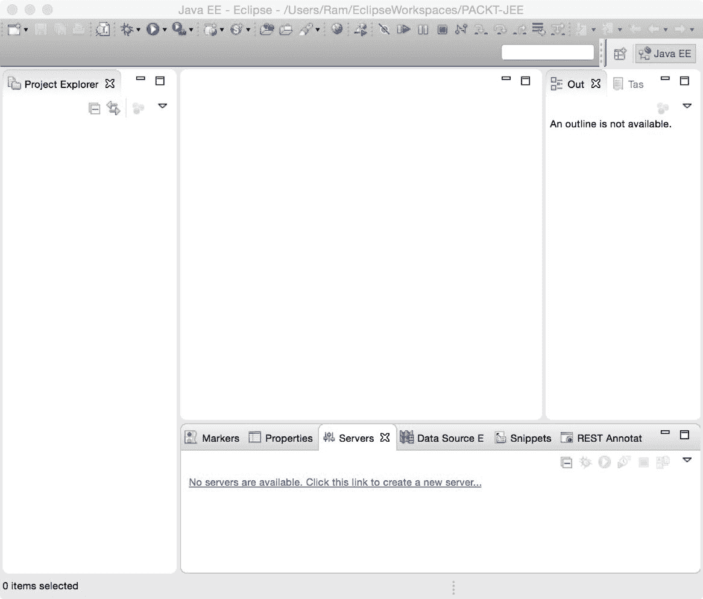

图 1.2：默认 Eclipse 视图

在使用 Eclipse 时，了解以下术语是很有帮助的。

# 工作空间

Eclipse 工作空间是一组项目、设置和首选项的集合。这是一个 Eclipse 存储这些信息的文件夹。您必须创建一个工作空间才能开始使用 Eclipse。您可以创建多个工作空间，但一次只能由一个 Eclipse 运行实例打开一个。然而，您可以使用不同工作空间的多个 Eclipse 实例。

# 插件

Eclipse 具有可插拔架构。Eclipse 的许多功能都是作为插件实现的，例如，Java 和其他语言的编辑器插件，SVN 和 Git 插件，等等。Eclipse 的默认安装包含许多内置插件，并且您可以添加更多插件以获得您想要的特性。

# 编辑器和视图

Eclipse 中的大多数窗口都可以归类为编辑器或视图。编辑器是你可以更改其中显示的信息的地方。视图仅显示信息，不允许你更改它。Java 编辑器是一个编辑器的例子，你在其中编写代码。大纲视图是一个视图的例子，它显示你正在编辑的代码的分层结构（在 Java 编辑器的情况下，它显示正在编辑的文件中的类和方法）。

要查看给定 Eclipse 安装中的所有视图，请打开“窗口 | 显示视图 | 其他”菜单：

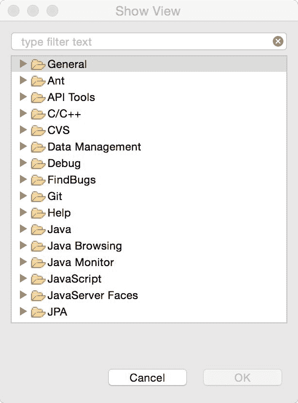

图 1.3：显示所有 Eclipse 视图

# 视图

视图是一个编辑器和视图的集合，以及它们如何在主 Eclipse 窗口中布局或排列。在开发的各个阶段，你需要显示不同的视图。例如，当你编辑代码时，你需要看到项目资源管理器和任务视图，但在调试应用程序时，你不需要这些视图，而是希望看到变量和断点视图。因此，编辑视图显示其他视图和编辑器中的项目资源管理器和任务视图，而调试视图显示与调试活动相关的视图和编辑器。你可以更改默认视图以适应你的需求。

# Eclipse 首选项

Eclipse 首选项窗口（*图 1.4*）是自定义许多插件/功能的地方。首选项在 Eclipse 的 Windows 和 Linux 安装的“窗口”菜单中可用，在 Mac 的 Eclipse 菜单中：

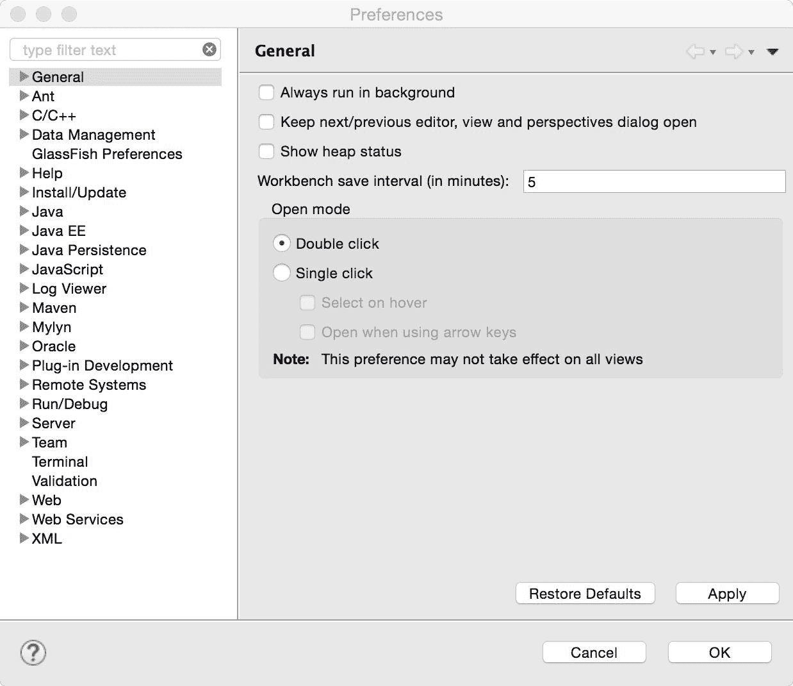

图 1.4：Eclipse 首选项

# 安装产品

在随后的章节中，我们将学习如何在 Eclipse 中开发 JEE 应用程序。但是，这些应用程序将需要一个 JEE 应用程序服务器和一个数据库。在前几章中，我们将使用 Tomcat 网络容器，然后使用 GlassFish JEE 应用程序服务器。我们将使用 MySQL 数据库。

我们将需要这些产品来开发我们即将开发的大多数应用。因此，以下章节将描述如何安装和配置 Eclipse、Tomcat、GlassFish 和 MySQL。

# 安装 Eclipse

从[`eclipse.org/downloads/`](https://eclipse.org/downloads/)下载 Eclipse 的最新版本。你会看到许多不同的 Eclipse 包。确保安装 Eclipse IDE for Java EE Developers 包。根据你的操作系统和 JVM 架构（32 位或 64 位）选择合适的包。你可能需要运行命令`java -version`来了解 JVM 是 32 位还是 64 位。

如果你计划使用 Eclipse 进行 AWS 开发，那么建议从 Oomph 安装程序下载 Eclipse。请参阅[`wiki.eclipse.org/Eclipse_Installer`](https://wiki.eclipse.org/Eclipse_Installer)和[`docs.aws.amazon.com/toolkit-for-eclipse/v1/user-guide/setup-install.html`](https://docs.aws.amazon.com/toolkit-for-eclipse/v1/user-guide/setup-install.html)。

解压下载的 ZIP 文件，然后运行 Eclipse 应用程序（在运行 Eclipse 之前，您必须安装 JDK）。第一次运行 Eclipse 时，您将被要求指定一个工作空间。在您的文件系统中创建一个新的文件夹，并将其作为初始工作空间文件夹选择。如果您打算在每次启动 Eclipse 时使用相同的文件夹作为工作空间，请勾选“使用此作为默认值，不再询问”复选框：

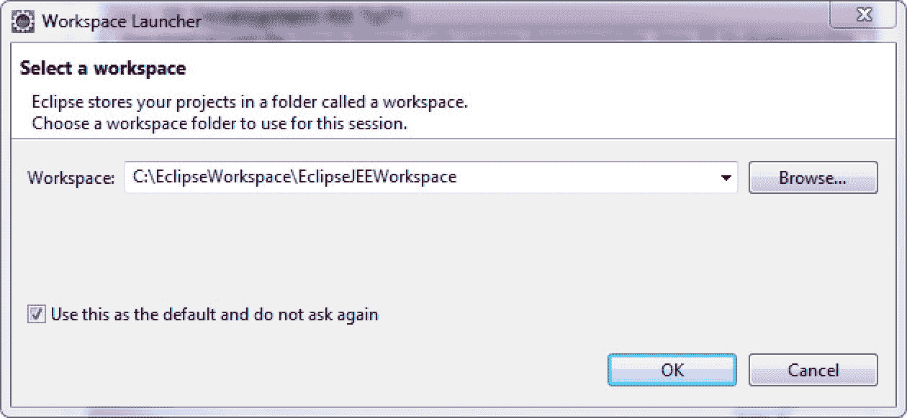

图 1.5：选择 Eclipse 工作空间

您将看到如图 *1.2* 所示的默认 Java EE 视图。

# 安装 Tomcat 服务器

Tomcat 是一个 Web 容器。它支持之前描述的表示层 API。此外，它还支持 JDBC 和 JPA。配置简单，如果您不想使用 EJBs，它可能是一个不错的选择。

从 [`tomcat.apache.org/`](http://tomcat.apache.org/) 下载最新版本的 Tomcat。将下载的文件解压到一个文件夹中。设置 `JAVA_HOME` 环境变量，使其指向 JDK 安装文件夹（文件夹路径应该是包含 `bin` 子文件夹的 JDK 文件夹）。要在 Windows 的命令提示符中启动服务器，请运行 `startup.bat`；在 Mac 和 Linux 的终端窗口中运行 `startup.sh`。如果没有错误，您应该会看到消息 `Server startup in --ms` 或 `Tomcat started`。

默认的 Tomcat 安装配置为使用端口 `8080`。如果您想更改端口，请打开位于 `conf` 文件夹下的 `server.xml` 文件，并查找如下所示的连接器声明：

```java
<Connector port="8080" protocol="HTTP/1.1" 
               connectionTimeout="20000" 
               redirectPort="8443" /> 
```

将端口号更改为您想要的任何端口号，尽管在这本书中我们将使用默认端口 `8080`。在我们打开 Tomcat 的默认页面之前，我们将为 Tomcat 服务器的管理添加一个用户。使用任何文本编辑器打开位于 `conf` 文件夹下的 `tomcat-users.xml` 文件。在文件末尾，您将看到如何添加用户的注释示例。在 `</tomcat-users>` 标签关闭之前添加以下配置：

```java
  <role rolename="manager-gui"/> 
  <user username="admin" password="admin" roles="manager-gui"/> 
```

在这里，我们正在向名为 `manager-gui` 的角色添加一个用户 `admin`，密码也是 `admin`。此角色可以访问 Tomcat 中管理应用程序的网页。此角色和其他安全角色在 `manager` 应用程序的 `web.xml` 文件中定义。您可以在 `webapps/manager/WEB-INF/web.xml` 中找到它。

关于管理 Tomcat 服务器的更多信息，请参阅 [`tomcat.apache.org/tomcat-8.0-doc/manager-howto.html`](http://tomcat.apache.org/tomcat-8.0-doc/manager-howto.html)。

在进行上述更改后，打开一个网页浏览器，并浏览到 `http://localhost:8080`（如果您已更改默认端口，请修改端口号）。您将看到以下默认的 Tomcat 页面：

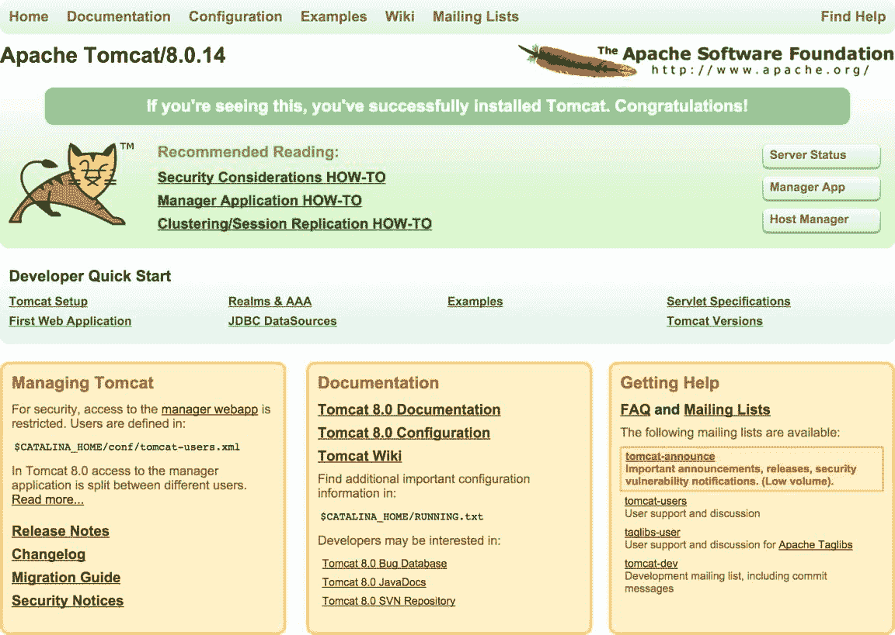

图 1.6：默认的 Tomcat Web 应用程序

点击右侧的“Manager App”按钮。您将被要求输入用户名和密码。输入您之前在 `tomcat-users.xml` 中为 `manager-gui` 配置的用户名和密码，如前所述。成功登录后，您将看到 *图 1.7* 所示的 Tomcat 网络应用程序管理器页面。您可以在该页面上看到 Tomcat 中部署的所有应用程序。您也可以从该页面部署应用程序：

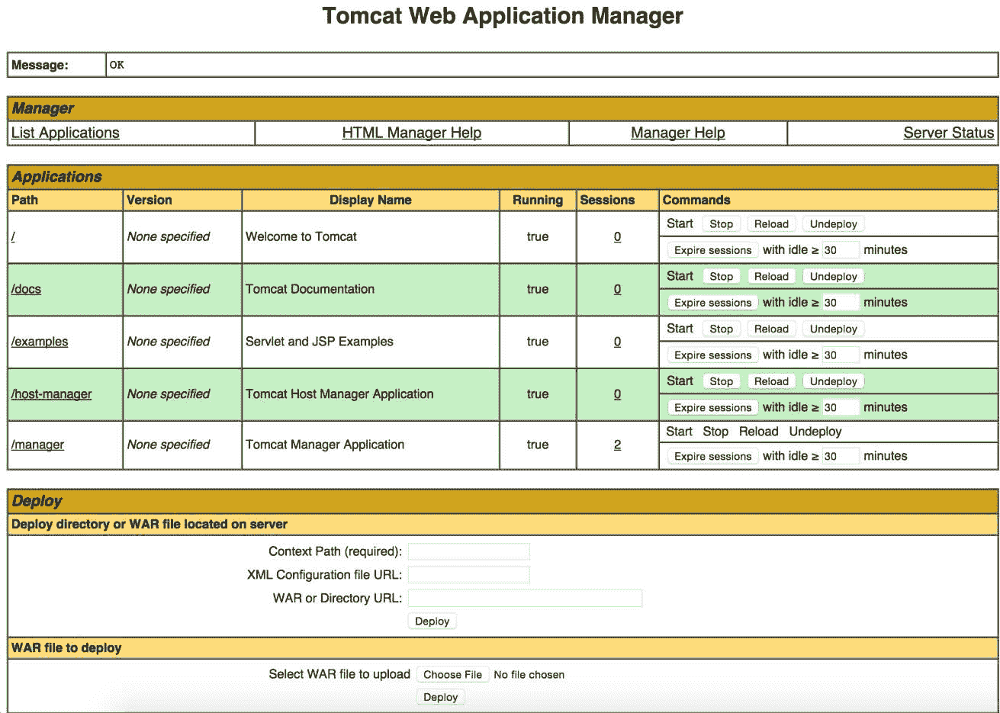

图 1.7：Tomcat 网络应用程序管理器

要停止 Tomcat 服务器，请按 *Ctrl*/*cmd* + *C* 或在 `bin` 文件夹中运行关机脚本。

# 安装 GlassFish 服务器

从 [`glassfish.java.net/download.html`](https://javaee.github.io/glassfish/download) 下载 GlassFish。GlassFish 有两种版本：Web Profile 和 Full Platform。Web Profile 类似于 Tomcat，它不包括 EJB 支持。因此，请下载 Full Platform。

在文件夹中解压下载的文件。GlassFish 服务器的默认端口是 `8080`。如果您想更改它，请在文本编辑器中打开 `glassfish/domains/domain1/config/domain.xml`（您也可以使用 Eclipse，通过“文件 | 打开文件”菜单选项打开）并查找 `8080`。您应该在 `<network-listener>` 中的一个位置看到它。如果您想更改端口（如果其他应用程序已经使用该端口，则可能需要这样做），请更改它。

要启动服务器，运行 `startserv` 脚本（`.bat` 或 `.sh` 取决于您使用的操作系统）。一旦服务器启动，打开网页浏览器并浏览到 `http://localhost:8080`。您应该会看到一个像以下这样的页面：


图 1.8：默认 Glassfish 网络应用程序

此页面位于 `glassfish/domains/domain1/docroot/index.html`。点击页面上的“转到管理控制台”链接以打开 GlassFish 管理员（见以下截图）：


图 1.9：Glassfish 管理员

有关管理 GlassFish 服务器详情，请参阅 [`javaee.github.io/glassfish/doc/5.0/administration-guide.pdf`](https://javaee.github.io/glassfish/doc/5.0/administration-guide.pdf)。

要停止 GlassFish 服务器，在 `glassfish/bin` 文件夹中运行 `stopserv` 脚本。

# 安装 MySQL

我们将在本书的许多示例中使用 MySQL 数据库。以下各节描述了如何为不同平台安装和配置 MySQL。 

我们还希望安装 MySQL Workbench，这是一个用于管理 MySQL 服务器的客户端应用程序。从 [`dev.mysql.com/downloads/workbench/`](https://dev.mysql.com/downloads/workbench/) 下载 MySQL Workbench。

# 在 Windows 上安装 MySQL

从 [`dev.mysql.com/downloads/mysql/`](http://dev.mysql.com/downloads/mysql/) 下载 MySQL Community Server。您可以选择下载网络安装程序或全功能安装程序。网络安装程序只会下载您所选的组件。以下说明使用网络安装程序显示下载选项。

网络安装程序首先下载一个小应用程序，并为你提供了选择要安装的组件的选项：

1.  选择自定义选项并点击下一步：

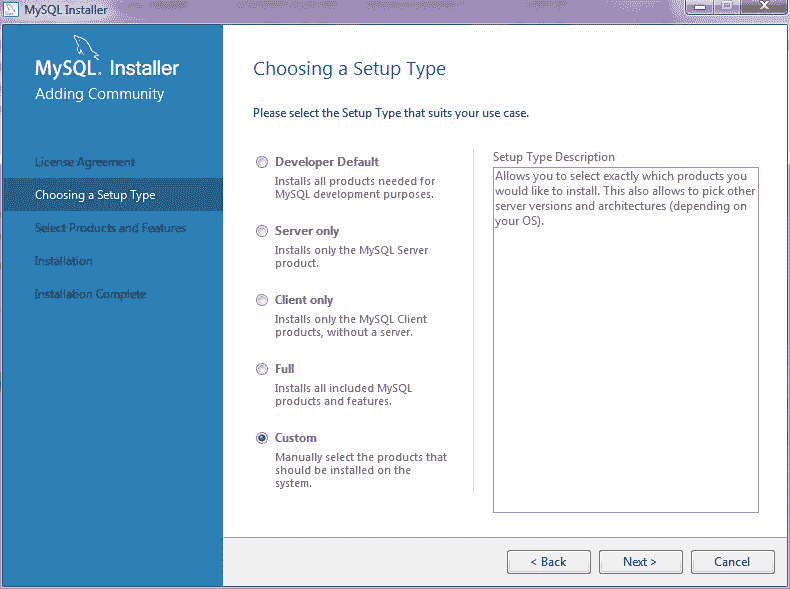

图 1.10：Windows 的 MySQL 安装程序

1.  选择 MySQL 服务器和 MySQL Workbench 产品并完成安装。在服务器安装过程中，你将被要求设置`root`密码，并可以选择添加更多用户。为应用程序添加一个非 root 用户总是个好主意：

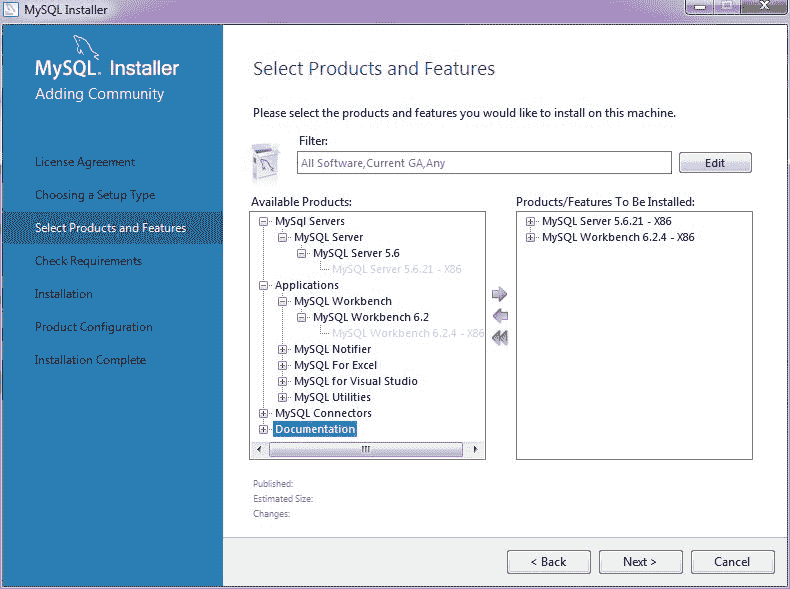

图 1.11：选择要安装的 MySQL 产品和功能

1.  确保在添加用户时选择所有主机，这样你就可以从任何有网络访问 MySQL 安装机器的远程机器访问 MySQL 数据库：

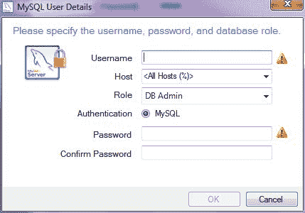

图 1.12：添加 MySQL 用户

1.  安装完成后运行 MySQL Workbench。你会发现默认的本地 MySQL 实例连接已经为你创建好了！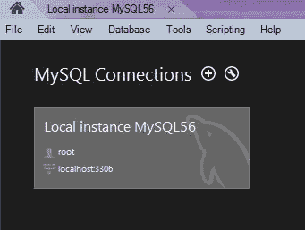

图 1.13：MySQL Workbench 连接

1.  点击本地连接，系统会要求你输入`root`密码。输入你在安装 MySQL 服务器时设置的`root`密码。MySQL Workbench 打开并显示默认的测试模式：

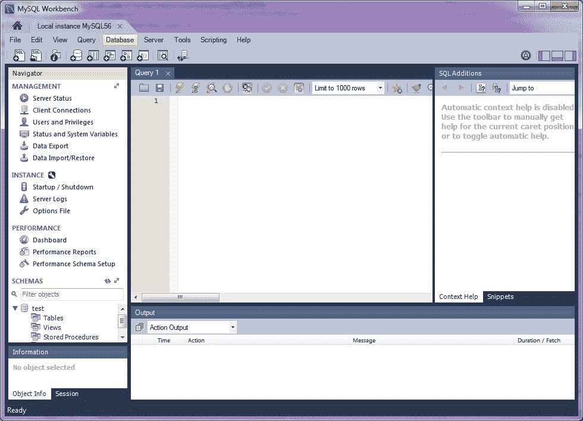

图 1.14：MySQL Workbench

# 在 macOS X 上安装 MySQL

OS X 版本在 10.7 之前的系统默认安装了 MySQL 服务器。如果你使用的是 OS X 10.7 或更高版本，那么你需要从[`dev.mysql.com/downloads/mysql/`](http://dev.mysql.com/downloads/mysql/)下载并安装 MySQL 社区服务器。

在 OS X 上安装 MySQL 也有多种不同的方法。有关 OS X 的安装说明，请参阅[`dev.mysql.com/doc/refman/5.7/en/osx-installation.html`](http://dev.mysql.com/doc/refman/5.7/en/osx-installation.html)。请注意，OS X 用户在安装 MySQL 服务器时需要有管理员权限。

安装服务器后，你可以从命令提示符或系统偏好设置中启动它：

1.  要从命令提示符启动，请在终端中执行以下命令：

```java
sudo /usr/local/mysql/support-files/mysql.server start  
```

1.  要从系统偏好设置启动，打开偏好设置并点击 MySQL 图标：

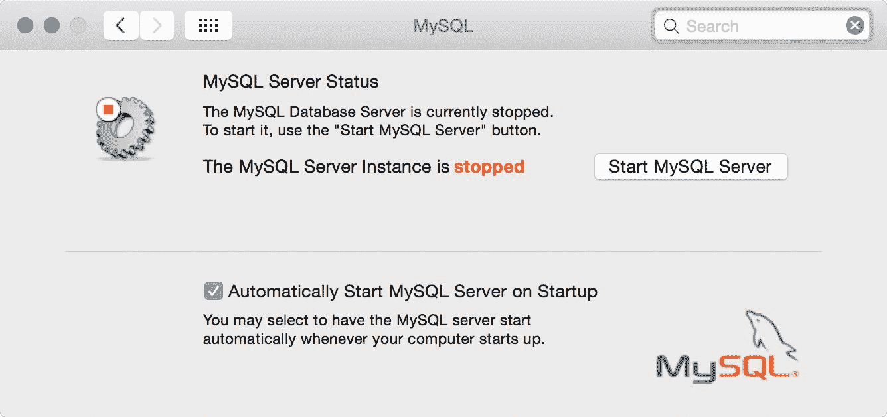

图 1.15：MySQL 系统偏好设置 - OS X

1.  点击“启动 MySQL 服务器”按钮。

# 在 Linux 上安装 MySQL

在 Linux 上安装 MySQL 有多种不同的方法。有关详细信息，请参阅[`dev.mysql.com/doc/refman/5.7/en/linux-installation.html`](https://dev.mysql.com/doc/refman/5.7/en/linux-installation.html)。

# 创建 MySQL 用户

你可以从命令提示符或使用 MySQL Workbench 创建 MySQL 用户：

1.  要从命令提示符执行 SQL 和其他命令，请打开终端并输入以下命令：

```java
mysql -u root -p<root_password> 
```

1.  登录成功后，你会看到`mysql`命令提示符：

```java
mysql>  
```

1.  要创建用户，首先选择`mysql`数据库：

```java
mysql>use mysql;
Database changed
mysql>create user 'user1'@'%' identified by 'user1_pass';  
mysql>grant all privileges on *.* to 'user1'@'%' with grant option
```

上述命令将创建一个名为 `'user1'` 的用户，密码为 `'user1_pass'`，拥有所有权限，例如插入、更新和从数据库中选择。而且因为我们指定了主机为 `'%'`，这个用户可以从任何主机访问服务器。

有关将用户添加到 MySQL 数据库的更多详细信息，请参阅[`dev.mysql.com/doc/refman/5.7/en/adding-users.html`](https://dev.mysql.com/doc/refman/5.7/en/adding-users.html)

如果你更喜欢使用 **图形用户界面**（**GUI**）来管理用户，那么运行 MySQL Workbench，连接到本地 MySQL 服务器（参见 *图 1.13* MySQL Workbench 连接），然后在管理部分下点击用户和权限：

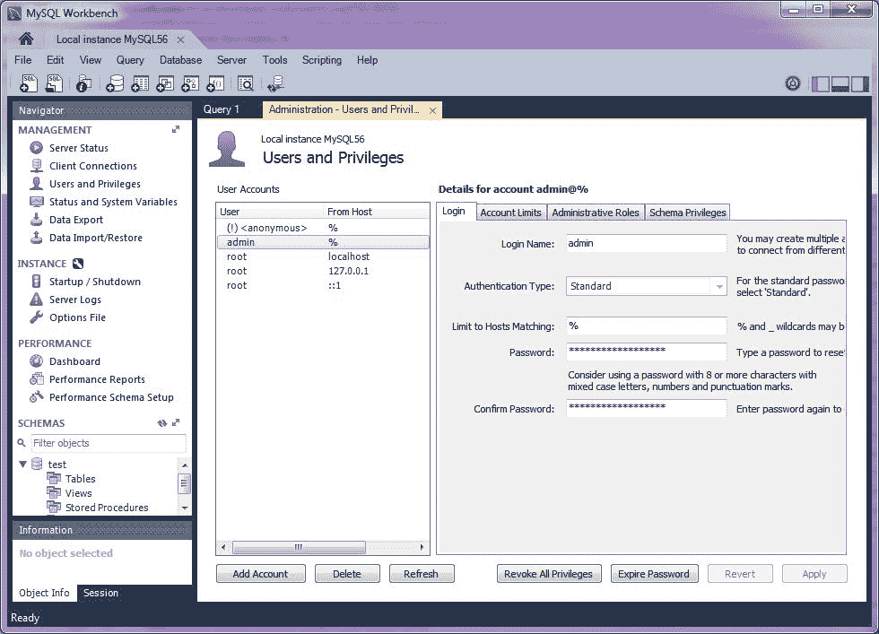

图 1.16：在 MySQL Workbench 中创建用户

安装完所有前面的产品后，你应该能够开始开发 JEE 应用程序。我们可能需要一些额外的软件，但我们将在适当的时候看到如何安装和配置它。

# 摘要

在本章中，我们简要介绍了用于表示层、业务层和企业集成层的不同 JEE 规范。我们学习了 Eclipse IDE 中的一些重要术语。然后我们学习了如何安装 Eclipse、Tomcat、Glassfish、MySQL 和 MySQL Workbench。我们将在本书中使用这些产品来开发 JEE 应用程序。

在下一章中，我们将配置 JEE 服务器并使用 servlets、JSPs 和 JSFs 创建一个简单应用程序。我们还将学习如何使用 Maven 构建和打包 JEE 应用程序。
