# 第二章：创建一个简单的 JEE Web 应用程序

上一章为您简要介绍了 JEE 和 Eclipse。我们还学习了如何安装 Eclipse JEE 包以及如何安装和配置 Tomcat。Tomcat 是一个 servlet 容器，它易于使用和配置。因此，许多开发者使用它在本地上运行 JEE Web 应用程序。

本章我们将涵盖以下主题：

+   在 Eclipse 中配置 Tomcat 并从 Eclipse 部署 Web 应用程序

+   使用不同的技术创建 JEE 中的 Web 应用程序，例如 JSP、JSTL、JSF 和 servlet

+   使用 Maven 依赖管理工具

# 在 Eclipse 中配置 Tomcat

我们将执行以下步骤以在 Eclipse 中配置 Tomcat：

1.  在 Eclipse 的 Java EE 视图中，您将在底部找到“服务器”选项卡。由于尚未添加服务器，您将在选项卡中看到一个链接，如下面的截图所示——没有可用的服务器。点击此链接以创建一个新的服务器……

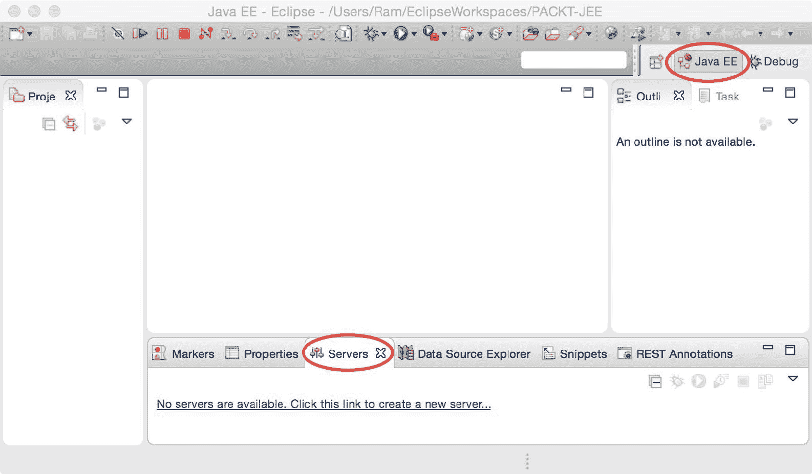

图 2.1：Eclipse JEE 中的“服务器”选项卡

1.  点击“服务器”选项卡中的链接以添加新的服务器。

1.  展开`Apache`组并选择您已安装的 Tomcat 版本。如果 Eclipse 和 Tomcat 服务器在同一台机器上，则将服务器的计算机名保留为`localhost`。否则，输入 Tomcat 服务器的计算机名或 IP 地址。点击“下一步”：

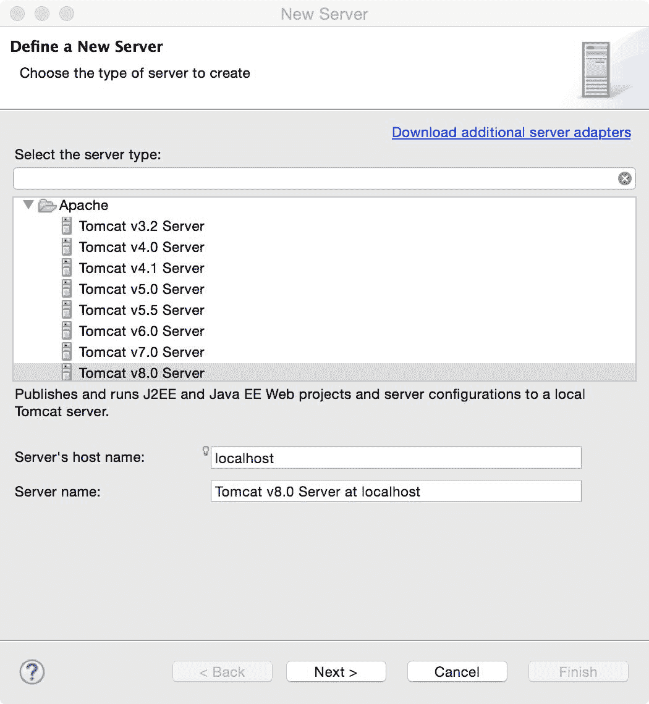

图 2.2：在新建服务器向导中选择服务器

1.  点击“浏览...”按钮并选择 Tomcat 安装的文件夹。

1.  点击“下一步”直到完成向导。在最后，您将在“服务器”视图中看到添加的 Tomcat 服务器。如果 Tomcat 还未启动，您将看到状态为“停止”。

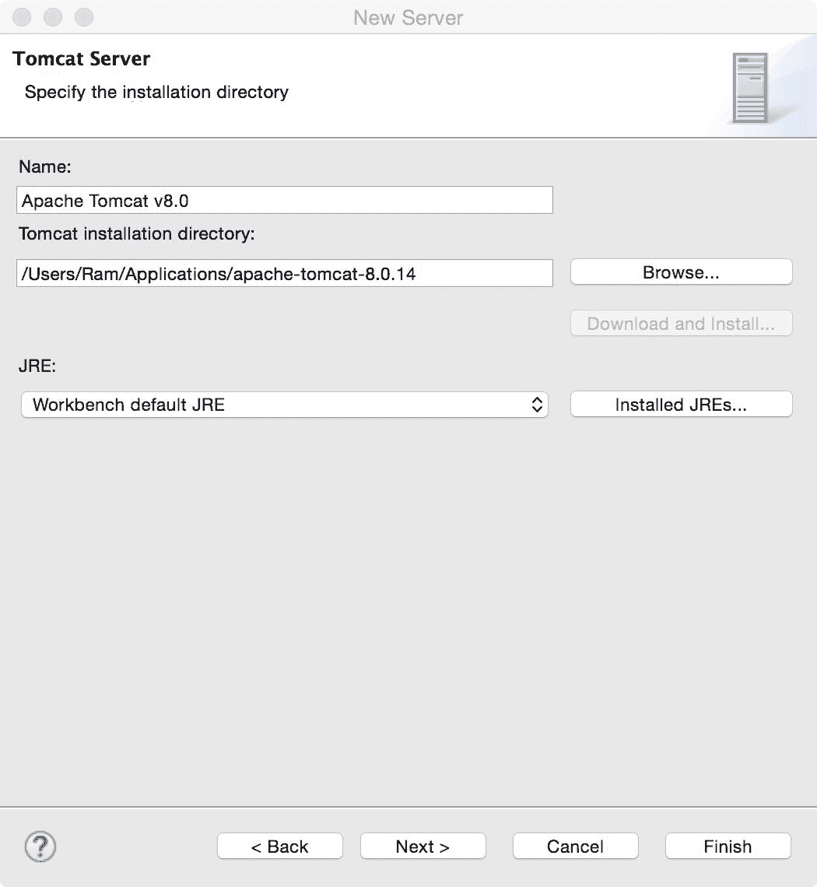

图 2.3：在新建服务器向导中配置 Tomcat 文件夹

1.  要启动服务器，右键单击服务器并选择“启动”。您也可以通过点击“服务器”视图工具栏中的“启动”按钮来启动服务器。

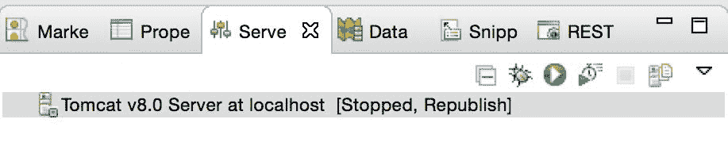

图 2.4：添加到“服务器”视图中的 Tomcat 服务器

服务器成功启动后，您将看到状态更改为“已启动”。如果您点击“控制台”选项卡，您将看到 Tomcat 服务器在启动期间输出的控制台消息。

如果您在“项目资源管理器”视图中展开“服务器”组，您将看到您刚刚添加的 Tomcat 服务器。展开 Tomcat 服务器节点以查看配置文件。这是一种编辑 Tomcat 配置的简单方法，这样您就不必在文件系统中查找配置文件。

双击 `server.xml` 以在 XML 编辑器中打开它。您将获得“设计视图”以及“源视图”（编辑器底部的两个选项卡）。我们在上一章学习了如何更改 Tomcat 的默认端口。您可以通过打开 `server.xml` 并转到 Connector 节点来轻松地在 Eclipse 编辑器中更改它。如果您需要搜索文本，您可以将编辑器切换到源选项卡（编辑器底部的选项卡）。

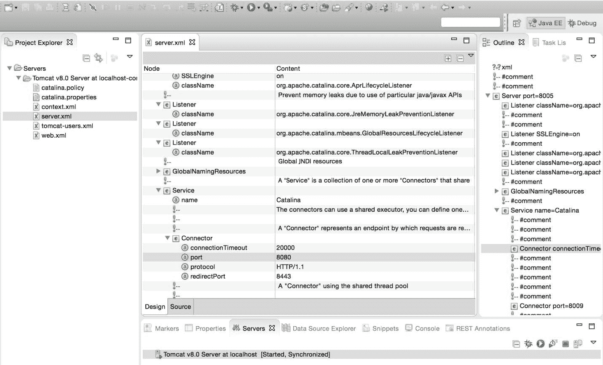

图 2.5：打开 server.xml

你也可以轻松编辑`tomcat-users.xml`以添加/编辑 Tomcat 用户。回想一下，我们在第一章，“介绍 JEE 和 Eclipse”中添加了一个 Tomcat 用户来管理 Tomcat 服务器。

默认情况下，当你在 Eclipse 中添加服务器时，Eclipse 不会在 Tomcat 安装文件夹中做任何更改。相反，它会在工作区中创建一个文件夹，并将 Tomcat 配置文件复制到这个文件夹中。在 Tomcat 中部署的应用程序也会从这个文件夹中复制和发布。这在开发阶段工作得很好，当你不想修改 Tomcat 设置或服务器中部署的任何应用程序时。然而，如果你想使用实际的 Tomcat 安装文件夹，那么你需要修改 Eclipse 中的服务器设置。在服务器视图中双击服务器以在编辑器中打开它。

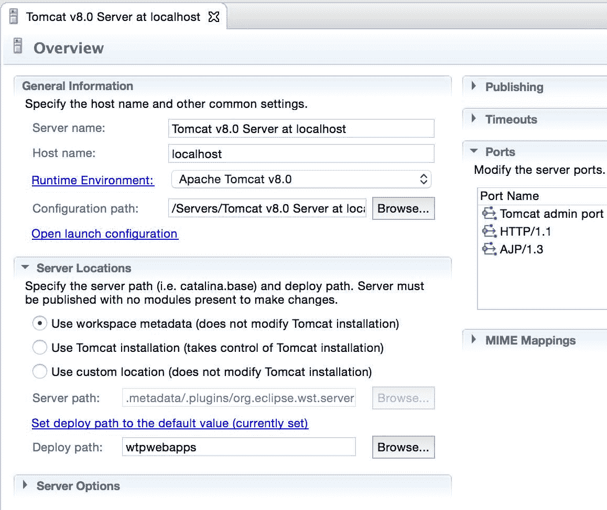

图 2.6：Tomcat 设置

注意服务器位置下的选项。如果你想使用实际的 Tomcat 安装文件夹进行配置和从 Eclipse 内部发布应用程序，请选择第二个选项，使用“Tomcat 安装”。

# JavaServer Pages

我们将从一个创建简单 JSP 的项目开始。我们将创建一个登录 JSP，该 JSP 将数据提交给自己并验证用户。

# 创建动态网络项目

我们将执行以下步骤来创建动态网络项目：

1.  选择“文件 | 新建 | 其他”菜单。这会打开选择向导。在向导的顶部，你将找到一个带有交叉图标在极右侧的文本框。

1.  在文本框中输入`web`。这是过滤器框。Eclipse 中的许多向导和视图都有这样的过滤器文本框，这使得查找项目变得非常容易。

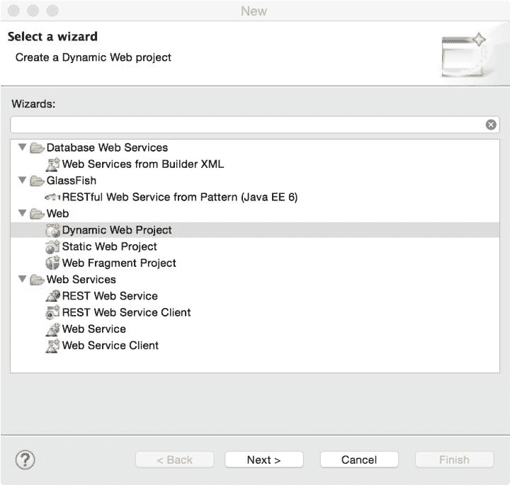

图 2.7：新建选择向导

1.  选择动态网络项目并点击“下一步”以打开动态网络项目向导。输入项目名称，例如，`LoginSampleWebApp`。注意，在此页面的动态网络模块版本字段中列出了 Servlet API 版本号。选择 3.0 或更高版本。点击“下一步”。

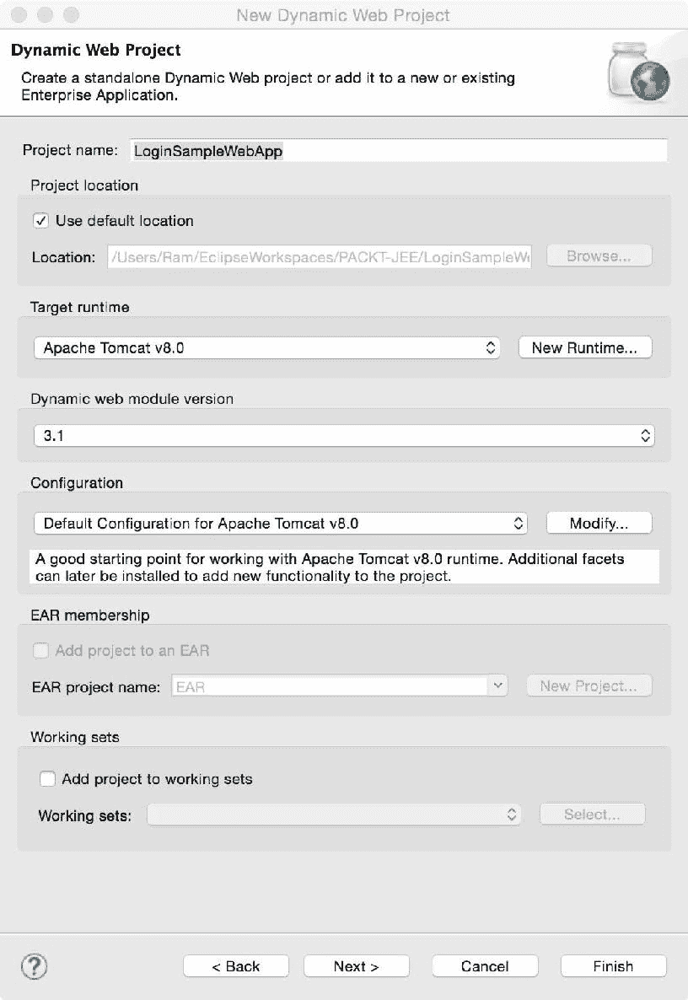

图 2.8：新建动态网络项目向导

1.  在以下页面中点击“下一步”，在最后一页点击“完成”以创建`LoginSimpleWebApp`项目。此项目也添加到项目资源管理器中。

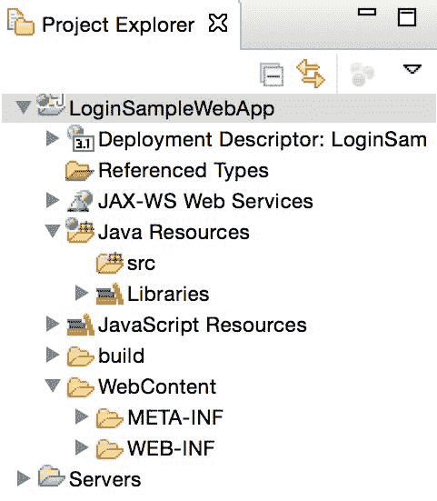

图 2.9：新建网络项目

Java 源文件放在`Java Resources`下的`src`文件夹中。Web 资源，如 HTML、JS 和 CSS 文件，放在`WebContent`文件夹中。

在下一节中，我们将创建一个登录 JSP 页面。

在第一个 JSP 中，为了保持页面简单，我们不会遵循许多最佳实践。我们将 UI 代码与应用程序业务代码混合。这种设计在真实的应用程序中不被推荐，但可能对快速原型设计有用。我们将在本章的后面部分看到如何编写具有清晰分离 UI 和业务逻辑的更好的 JSP 代码。

# 创建 JSP

我们将执行以下步骤来创建 JSP：

1.  右键单击`WebContent`文件夹，选择“新建”|“JSP 文件”。将其命名为`index.jsp`。文件将在编辑器中以分割视图打开。顶部部分显示设计视图，底部部分显示代码。如果文件未在分割编辑器中打开，请右键单击项目资源管理器中的`index.jsp`，然后选择“打开方式”|“网页编辑器”。

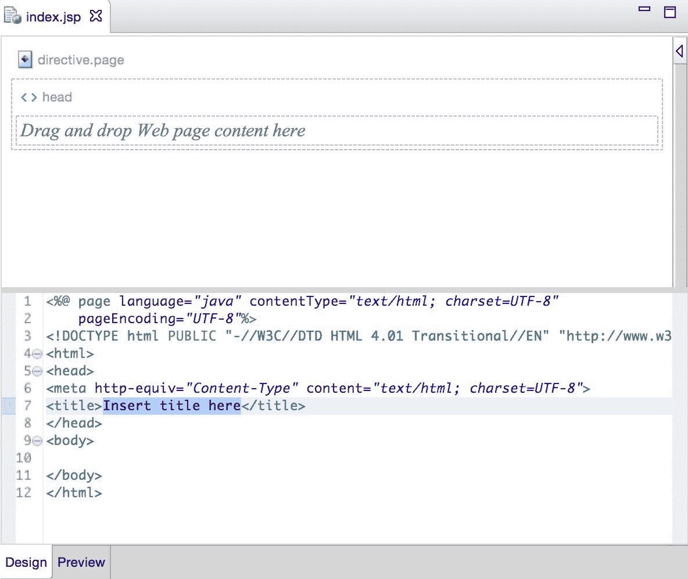

图 2.10：JSP 编辑器

1.  如果您不喜欢分割视图，并想看到完整的设计视图或代码视图，请使用右上角的相应工具栏按钮，如下面的截图所示：


图 2.11：JSP 编辑器显示按钮

1.  将标题从`Insert title here`更改为`Login`。

1.  现在我们来看看 Eclipse 如何为 HTML 标签提供代码辅助。请注意，输入字段必须位于`form`标签内。我们稍后会添加`form`标签。在`body`标签内，输入`User Name:`标签。然后，输入`<`。如果您稍等片刻，Eclipse 会弹出代码辅助窗口，显示所有有效 HTML 标签的选项。您也可以手动调用代码辅助。

1.  在`<`之后放置一个光标，并按*Ctrl* + *Spacebar*。

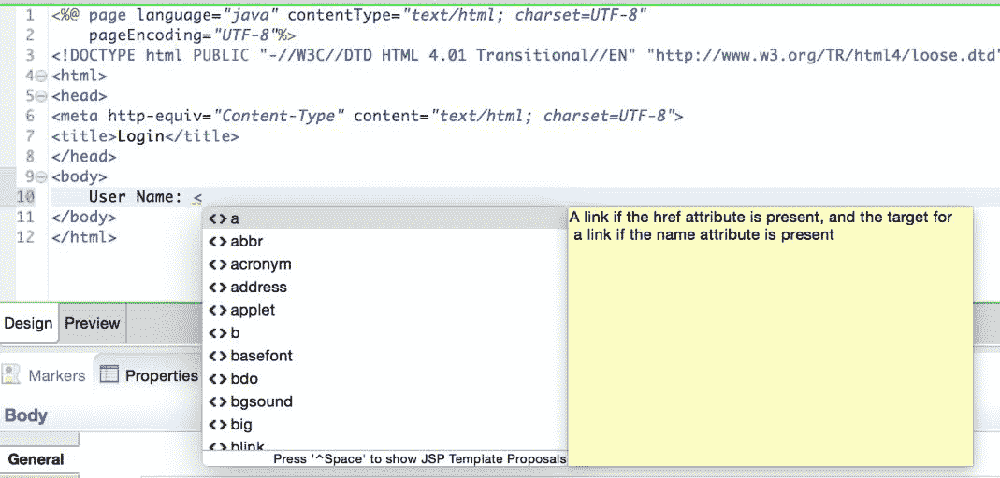

图 2.12：JSP 中的 HTML 代码辅助

代码辅助也适用于部分文本；例如，如果您在文本`<i`之后调用代码辅助，您将看到以`i`开头的 HTML 标签列表（`i`、`iframe`、`img`、`input`等）。您还可以使用代码辅助进行标签属性和属性值的操作。

目前，我们想要插入用户名的`input`字段。

1.  从代码辅助建议中选择`input`，或者直接输入它。

1.  在插入`input`元素后，将光标移至关闭的`>`内部，并再次调用代码辅助（*Ctrl*/*Cmd* + *Spacebar*）。您将看到`input`标签属性的提议列表。

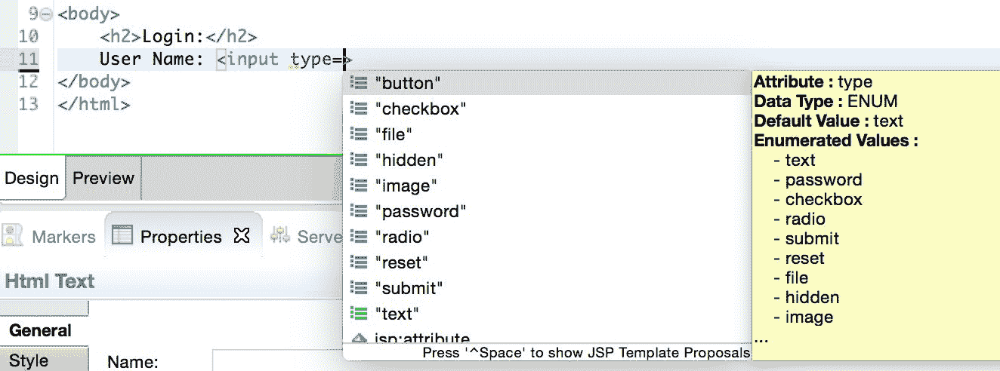

图 2.13：标签属性值的代码辅助

1.  输入以下代码以创建登录表单：

```java
<body> 
  <h2>Login:</h2> 
  <form method="post"> 
    User Name: <input type="text" name="userName"><br> 
    Password: <input type="password" name="password"><br> 
    <button type="submit" name="submit">Submit</button> 
    <button type="reset">Reset</button> 
  </form> 
</body> 

```

下载示例代码

您可以从您在[`www.packtpub.com`](http://www.packtpub.com)的账户下载示例代码文件，以获取您购买的所有 Packt Publishing 书籍。如果您在其他地方购买了这本书，您可以访问[`www.packtpub.com/support`](http://www.packtpub.com/support)并注册，以便将文件直接通过电子邮件发送给您。

如果您正在使用分割编辑器（设计和源页面），您可以在设计视图中看到登录表单的渲染效果。如果您想查看网页在浏览器中的外观，请点击编辑器底部的预览标签。您将看到网页在编辑器内的浏览器视图中显示。因此，您不需要离开 Eclipse 来测试您的网页。

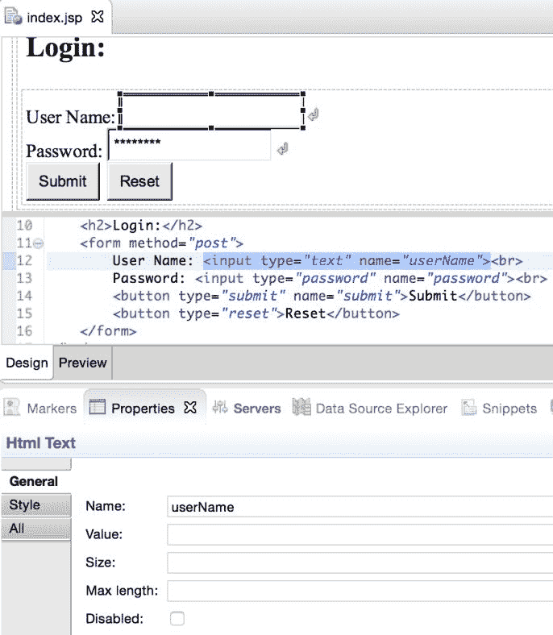

图 2.14：设计和源视图

如果你在设计视图中点击任何用户界面控件，你将在属性视图中看到其属性（见*图 2.14*）。你可以编辑属性，例如所选元素的名称和值。点击属性窗口的“样式”选项卡来编辑元素的 CSS 样式。

在先前的表单中，我们没有指定`action`属性。此属性指定当用户点击“提交”按钮时，表单数据要提交到的 URL。如果此属性未指定，则请求或表单数据将提交到同一页面；在这种情况下，表单数据将提交到`index.jsp`。我们现在将编写处理表单数据的代码。

如第一章中所述，“介绍 JEE 和 Eclipse”，你可以在同一个 JSP 中编写 Java 代码和客户端代码（HTML、CSS 和 JavaScript）。将 Java 代码与 HTML 代码混合通常不被认为是好的做法，但我们将在这个例子中这样做以使代码更简单。本书的后面部分，我们将看到如何使我们的代码模块化。

Java 代码在 JSP 中用`<%`和`%>`编写；JSP 中的这些 Java 代码块被称为**脚本片段**。你还可以在 JSP 中设置页面级属性。它们被称为**页面指令**，并包含在`<%@`和`%>`之间。我们创建的 JSP 已经有一个页面指令来设置页面的内容类型。内容类型告诉浏览器服务器返回的响应类型（在这种情况下，`html/text`）。浏览器根据内容类型显示适当的响应：

```java
<%@ page language="java" contentType="text/html; charset=UTF-8" 
    pageEncoding="UTF-8"%> 
```

在 JSP 中，你可以访问一些对象来帮助你处理和生成响应，如下表所述：

| **对象名称** | **类型** |
| --- | --- |
| `request` | `HttpServletRequest` ([`docs.oracle.com/javaee/7/api/javax/servlet/http/HttpServletRequest.html`](http://docs.oracle.com/javaee/7/api/javax/servlet/http/HttpServletRequest.html)). 使用此对象获取请求参数和其他与请求相关的数据。 |
| `response` | `HttpServletResponse` ([`docs.oracle.com/javaee/7/api/javax/servlet/http/HttpServletResponse.html`](http://docs.oracle.com/javaee/7/api/javax/servlet/http/HttpServletResponse.html)). 使用此对象发送响应。 |
| `out` | `JSPWriter` ([`docs.oracle.com/javaee/7/api/javax/servlet/jsp/JspWriter.html`](http://docs.oracle.com/javaee/7/api/javax/servlet/jsp/JspWriter.html)). 使用此对象生成文本响应。 |
| `session` | `HttpSession` ([`docs.oracle.com/javaee/7/api/javax/servlet/http/HttpSession.html`](http://docs.oracle.com/javaee/7/api/javax/servlet/http/HttpSession.html)). 使用此对象在会话中获取或放置对象。 |
| `application` | `ServletContext` ([`docs.oracle.com/javaee/7/api/javax/servlet/ServletContext.html`](http://docs.oracle.com/javaee/7/api/javax/servlet/ServletContext.html)). 使用此对象在上下文中获取或放置对象，这些对象在同一个应用程序中的所有 JSP 和 servlet 之间共享。 |

在这个例子中，我们将利用`request`和`out`对象。我们首先检查是否使用`POST`方法提交了表单。如果是，我们将获取用户名和密码字段的值。如果凭证有效（在这个例子中，我们将硬编码用户名为`admin`和密码），我们将打印一条欢迎信息：

```java
<% 
  String errMsg = null; 
  //first check whether the form was submitted 
  if ("POST".equalsIgnoreCase(request.getMethod()) && 
   request.getParameter("submit") != null) 
  { 
    //form was submitted 
    String userName = request.getParameter("userName"); 
    String password = request.getParameter("password"); 
    if ("admin".equalsIgnoreCase(userName) && 
     "admin".equalsIgnoreCase(password)) 
    { 
      //valid user 
      System.out.println("Welcome admin !"); 
    } 
    else 
    { 
      //invalid user. Set error message 
      errMsg = "Invalid user id or password. Please try again"; 
    } 
  } 
%> 
```

在前面的代码中，我们使用了两个内置对象——`request`和`out`。我们首先检查表单是否已提交——“`"POST".equalsIgnoreCase(request.getMethod())`”。然后，我们检查是否使用了提交按钮来提交表单——“`request.getParameter("submit") != null`”。

我们通过调用`request.getParameter`方法来获取用户名和密码。为了使代码简单，我们将其与硬编码的值进行比较。在实际应用程序中，您很可能会将凭证与数据库或某些命名和文件夹服务进行验证。如果凭证有效，我们将使用`out`（`JSPWriter`）对象打印一条消息。如果凭证无效，我们将设置一个错误消息。我们将在登录表单之前打印任何错误消息：

```java
<h2>Login:</h2> 
  <!-- Check error message. If it is set, then display it --> 
  <%if (errMsg != null) { %> 
    <span style="color: red;"><%=;"><%=;"><%=errMsg %></span> 
  <%} %> 
  <form method="post"> 
  ... 
  </form> 
```

在这里，我们通过使用`<%%>`开始另一个 Java 代码块。如果错误消息不为空，我们将使用`span`标签显示它。注意错误消息的值是如何打印的——“`<%=errMsg %>`”。这是一个`<%out.print(errMsg);%>`的简写语法。同时注意，第一个 Java 代码块开始的大括号在下一个独立的 Java 代码块中完成。在这两个代码块之间，您可以添加任何 HTML 代码，并且只有当`if`语句中的条件表达式评估为真时，它才会包含在响应中。

这里是我们在本节中创建的 JSP 的完整代码：

```java
<%@ page language="java" contentType="text/html; charset=UTF-8" 
    pageEncoding="UTF-8"%> 
<!DOCTYPE html PUBLIC "-//W3C//DTD HTML 4.01 Transitional//EN" 
 "http://www.w3.org/TR/html4/loose.dtd"> 
<html> 
<head> 
<meta http-equiv="Content-Type" content="text/html; 
charset=UTF-8"> 
<title>Login</title> 
</head> 
<% 
  String errMsg = null; 
  //first check whether the form was submitted 
  if ("POST".equalsIgnoreCase(request.getMethod()) && 
   request.getParameter("submit") != null) 
  { 
    //form was submitted 
    String userName = request.getParameter("userName"); 
    String password = request.getParameter("password"); 
    if ("admin".equalsIgnoreCase(userName) && 
     "admin".equalsIgnoreCase(password)) 
    { 
      //valid user 
      out.println("Welcome admin !"); 
      return; 
    } 
    else 
    { 
      //invalid user. Set error message 
      errMsg = "Invalid user id or password. Please try again"; 
    } 
  } 
%> 
<body> 
  <h2>Login:</h2> 
  <!-- Check error message. If it is set, then display it --> 
  <%if (errMsg != null) { %> 
    <span style="color: red;"><%out.print(errMsg); %></span> 
  <%} %> 
  <form method="post"> 
    User Name: <input type="text" name="userName"><br> 
    Password: <input type="password" name="password"><br> 
    <button type="submit" name="submit">Submit</button> 
    <button type="reset">Reset</button> 
  </form> 
</body> 
</html> 
```

# 在 Tomcat 中运行 JSP

要在 Web 浏览器中运行上一节中创建的 JSP，您需要在 servlet 容器中部署应用程序。我们已经看到了如何在 Eclipse 中配置 Tomcat。确保 Tomcat 正在运行，可以通过检查 Eclipse 的“服务器视图”中的状态来确认：


图 2.15：在服务器视图中启动 Tomcat

有两种方法可以将项目添加到配置的服务器，以便在服务器上运行应用程序：

1.  在“服务器视图”中右键单击服务器，选择“添加和移除”选项。从左侧的列表（可用资源）中选择您的项目，然后单击“添加”将其移动到“配置”列表。单击“完成”。

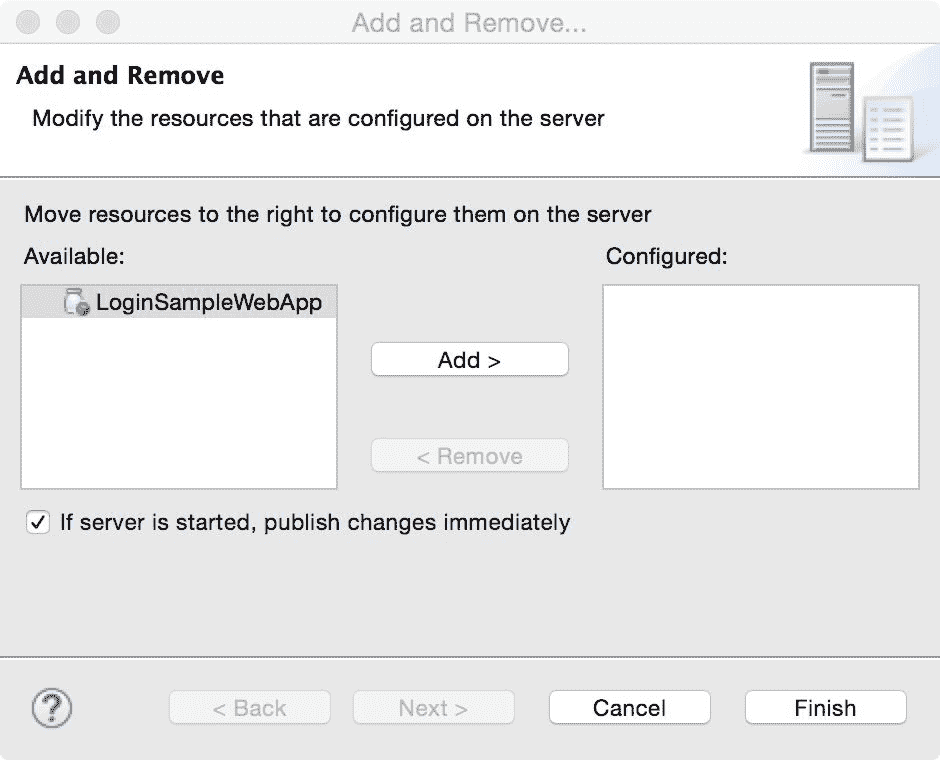

图 2.16：将项目添加到服务器

1.  将项目添加到服务器的另一种方法是右键单击“项目资源管理器”中的项目，选择“属性”。这将打开“项目属性”对话框。在列表中单击“服务器”，然后选择您想要部署此项目的服务器。单击“确定”或“应用”。

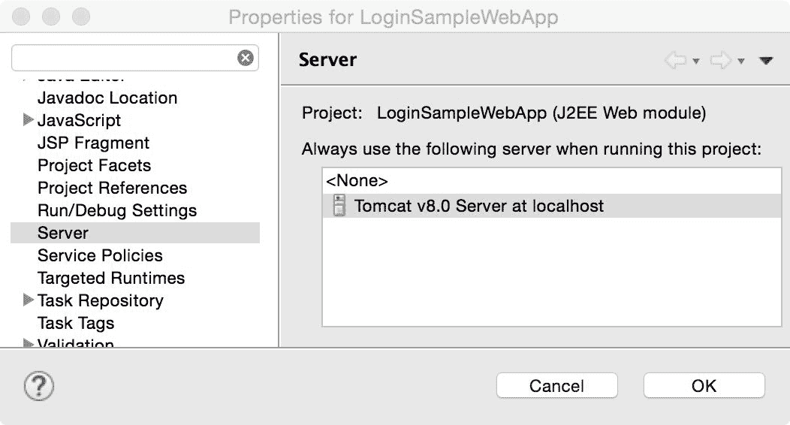

图 2.17：在项目属性中选择服务器

在第一种方法中，项目将立即在服务器上部署。在第二种方法中，只有在您在服务器上运行项目时才会部署。

1.  要运行应用程序，在项目资源管理器中右键单击项目，然后选择“运行”|“在服务器上运行”。第一次运行时，将提示您重新启动服务器。一旦应用程序部署，您将在服务器视图中看到它：

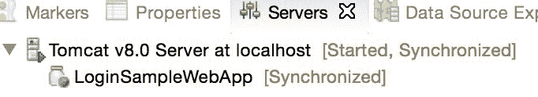

图 2.18：在服务器上部署的项目

1.  在用户名和密码框中输入除 admin 之外的其他文本

    然后点击提交。您应该看到错误消息，并且应该再次显示相同的表单。

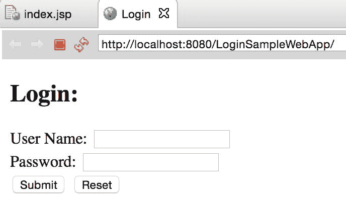

图 2.19：在 Eclipse 内置浏览器中运行的项目

1.  现在输入 `admin` 作为用户名和密码，然后提交表单。您应该看到欢迎信息。

JSPs 是动态编译成 Java 类的，所以如果您在页面上进行了任何更改，在大多数情况下，您不需要重新启动服务器；只需刷新页面，如果页面已更改，Tomcat 将重新编译页面，并显示修改后的页面。在需要重新启动服务器以应用更改的情况下，Eclipse 将提示您是否要重新启动服务器。

# 在 JSP 中使用 JavaBeans

我们之前创建的 JSP 并未遵循 JSP 最佳实践。一般来说，在 JSP 中包含脚本（Java 代码）是一个不好的主意。在大多数大型组织中，UI 设计师和程序员是不同的角色，由不同的人执行。因此，建议 JSP 主要包含标记标签，以便设计师更容易进行页面设计。Java 代码应放在单独的类中。从可重用性的角度来看，将 Java 代码移出 JSP 也是有意义的。

您可以从 JSP 将业务逻辑的处理委托给 JavaBeans。JavaBeans 是具有属性和获取器/设置器方法的简单 Java 对象。JavaBeans 中获取器/设置器方法的命名约定是前缀 `get`/`set` 后跟属性名称，每个单词的首字母大写，也称为驼峰式命名法。例如，如果您有一个名为 `firstName` 的类属性，则获取器方法将是 `getFirstName`，设置器将是 `setFirstName`。

JSP 有一个用于使用 JavaBeans 的特殊标签——`jsp:useBean`：

```java
<jsp:useBean id="name_of_variable" class="name_of_bean_class" 
 scope="scope_of_bean"/>
```

范围表示豆子的生命周期。有效值有 `application`、`page`、`request` 和 `session`。

| **作用域名称** | **描述** |
| --- | --- |
| `page` | 豆子只能在当前页面中使用。 |
| `request` | 豆子可以在处理相同请求的任何页面中使用。如果一个页面将请求转发到另一个页面，一个 Web 请求可以由多个 JSP 处理。 |
| `session` | 豆子可以在相同的 HTTP 会话中使用。如果您的应用程序想要在与应用程序的每次交互中保存用户数据，例如在在线商店应用程序中保存购物车中的项目，会话非常有用。 |
| `application` | Bean 可以在同一个 web 应用程序中的任何页面中使用。通常，web 应用程序作为 **web 应用程序存档** (**WAR**) 文件部署在 web 应用程序容器中。在应用程序范围内，WAR 文件中的所有 JSP 都可以使用 JavaBeans。 |

我们将把验证用户的代码移动到我们的登录示例中的 `JavaBean` 类。首先，我们需要创建一个 `JavaBean` 类：

1.  在项目资源管理器中，右键单击 `src` 文件夹，选择 New | Package 菜单选项。

1.  创建一个名为 `packt.book.jee_eclipse.ch2.bean` 的包。

1.  右键单击包，选择 New | Class 菜单选项。

1.  创建一个名为 `LoginBean` 的类。

1.  按照以下方式创建两个私有 `String` 成员：

```java
public class LoginBean { 
  private String userName; 
  private String password; 
} 
```

1.  在类内部（在编辑器中）的任何位置右键单击，并选择 Source | Generate Getters and Setters 菜单选项：

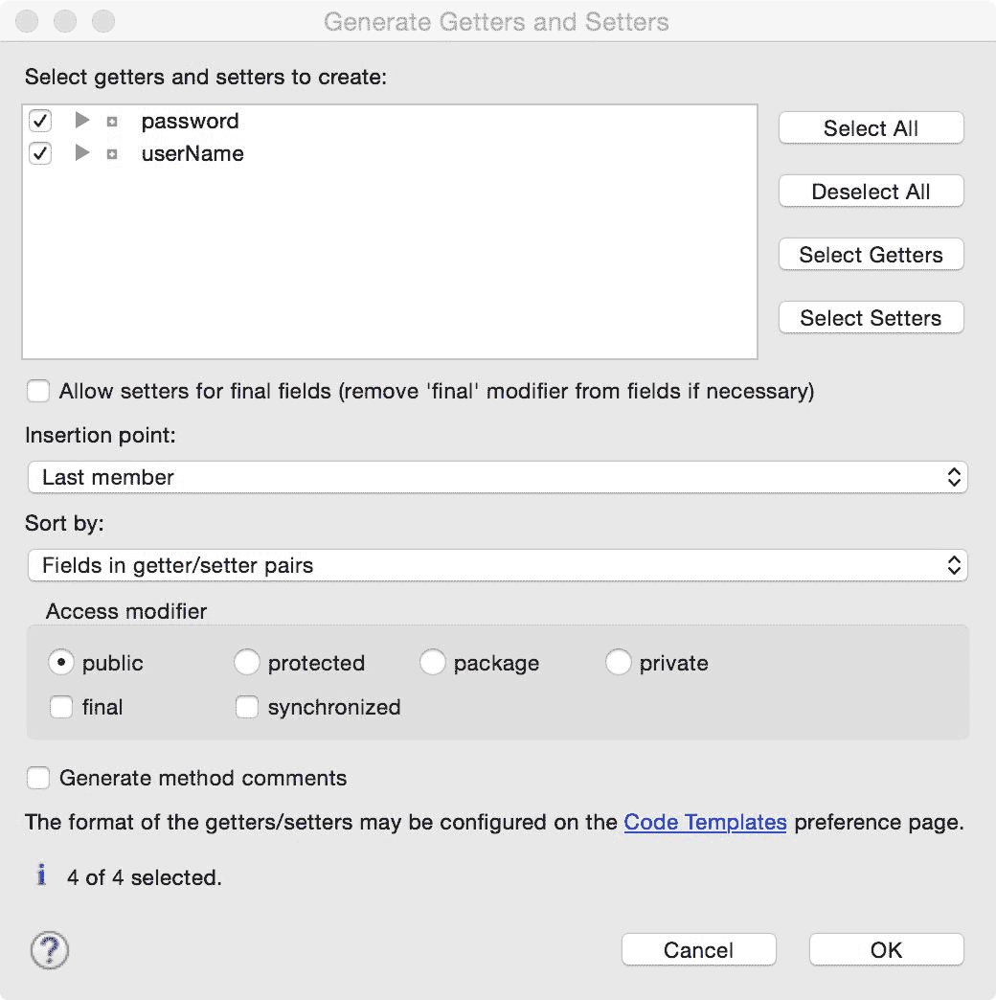

图 2.20：生成获取器和设置器

1.  我们希望为类的所有成员生成获取器和设置器。因此，点击全选按钮，并从下拉列表中选择插入点为最后一个成员，因为我们希望在声明所有成员变量之后插入获取器和设置器。

`LoginBean` 类现在应该如下所示：

```java
public class LoginBean { 
private String userName; 
  private String password; 
  public String getUserName() { 
    return userName; 
  } 
  public void setUserName(String userName) { 
    this.userName = userName; 
  } 
  public String getPassword() { 
    return password; 
  } 
  public void setPassword(String password) { 
    this.password = password; 
  } 
} 
```

1.  我们将向其中添加一个额外的验证用户名和密码的方法：

```java
public boolean isValidUser() 
  { 
    //Validation can happen here from a number of sources 
    //for example, database and LDAP 
    //We are just going to hardcode a valid username and 
    //password here. 
    return "admin".equals(this.userName) && 
            "admin".equals(this.password); 
  } 
```

这完成了我们用于存储用户信息和验证的 JavaBean。

现在，我们将使用这个 Bean 在我们的 JSP 中，并将验证用户的任务委托给这个 Bean。打开 `index.jsp`。将前面代码中 `<body>` 标签上面的 Java 脚本替换为以下内容：

```java
<%String errMsg = null; %> 
<%if ("POST".equalsIgnoreCase(request.getMethod()) && request.getParameter("submit") != null) {%> 
  <jsp:useBean id="loginBean" 
   class="packt.book.jee_eclipse.ch2.bean.LoginBean"> 
    <jsp:setProperty name="loginBean" property="*"/> 
  </jsp:useBean> 
  <% 
    if (loginBean.isValidUser()) 
    { 
      //valid user 
      out.println("<h2>Welcome admin !</h2>"); 
      out.println("You are successfully logged in"); 
    } 
    else 
    { 

      errMsg = "Invalid user id or password. Please try again"; 

    } 
  %> 
<%} %> 
```

在我们讨论前面代码中的更改之前，请注意，您还可以调用并获取 `<jsp:*>` 标签的属性和值的代码辅助。如果您不确定代码辅助是否可用，只需按 *Ctrl*/*Cmd* + *C*。

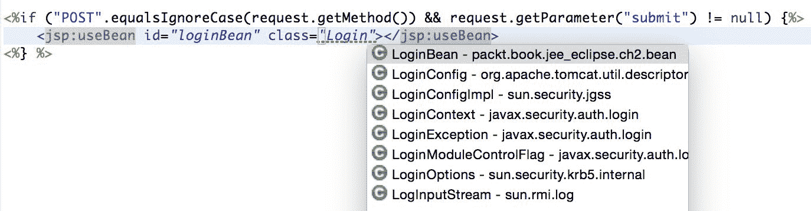

图 2.21：JSP 标签中的代码辅助

注意，Eclipse 显示了我们刚刚添加的 JavaBean 的代码辅助。

让我们现在理解我们在 JSP 中做了什么更改：

+   我们创建了多个脚本，一个用于声明 `errMsg` 变量，另外两个用于单独的 `if` 块。

+   我们在第一个 `if` 条件中添加了一个 `<jsp:useBean>` 标签。当 `if` 语句中的条件为真时，即当通过点击提交按钮提交表单时，会创建该 Bean。

+   我们使用了 `<jsp:setProperty>` 标签来设置 Bean 的属性：

```java
<jsp:setProperty name="loginBean" property="*"/> 
```

我们正在设置 `loginBean` 的成员变量值。此外，我们通过指定 `property="*"` 来设置所有成员变量的值。然而，我们在哪里指定这些值呢？因为这些值是隐式指定的，因为我们已经将 `LoginBean` 的成员名称命名为与表单中的字段相同的名称。因此，JSP 运行时会从 `request` 对象中获取参数，并将具有相同名称的值分配给 JavaBean 成员。

如果 JavaBean 成员的名称与请求参数不匹配，那么您需要显式设置这些值：

```java
<jsp:setProperty name="loginBean" property="userName" 
  value="<%=request.getParameter("userName")%>"/> 
<jsp:setProperty name="loginBean" property="password" 
  value="<%=request.getParameter("password")%>"/> 
```

+   我们通过调用 `loginBean.isValidUser()` 来检查用户是否有效。处理错误信息的代码没有变化。

要测试页面，请执行以下步骤：

1.  在项目资源管理器中右键点击 `index.jsp`。

1.  选择“运行”|“在服务器上运行”菜单选项。Eclipse 将提示您重启 Tomcat 服务器。

1.  点击“确定”按钮以重启服务器。

页面将在内部 Eclipse 浏览器中显示。它应该与上一个示例中的行为相同。

尽管我们已经将用户验证移动到 `LoginBean`，但我们仍然在 Java 脚本中有很多代码。理想情况下，我们应该在 JSP 中尽可能少地使用 Java 脚本。我们仍然有用于检查条件和变量赋值的脚本。我们可以通过使用标签来编写相同的代码，这样它就与 JSP 中剩余的基于标签的代码保持一致，并且对网页设计师来说更容易工作。这可以通过使用 **JSP 标准标签库**（**JSTL**）来实现。

# 使用 JSTL

JSTL 标签可以用来替换 JSP 中的大部分 Java 脚本。JSTL 标签分为五大类：

+   **核心**：包括流程控制和变量支持等

+   **XML**：处理 XML 文档的标签

+   **i18n**：支持国际化的标签

+   **SQL**：访问数据库的标签

+   **函数**：执行一些常见的字符串操作

有关 JSTL 的更多详细信息，请参阅 [`docs.oracle.com/javaee/5/tutorial/doc/bnake.html`](http://docs.oracle.com/javaee/5/tutorial/doc/bnake.html)。

我们将修改登录 JSP 以使用 JSTL，这样它就不会包含任何 Java 脚本。

1.  下载 JSTL 库及其 API 实现。在撰写本文时，最新的 `.jar` 文件是 `javax.servlet.jsp.jstl-api-1.2.1.jar` ([`search.maven.org/remotecontent?filepath=javax/servlet/jsp/jstl/javax.servlet.jsp.jstl-api/1.2.1/javax.servlet.jsp.jstl-api-1.2.1.jar`](http://search.maven.org/remotecontent?filepath=javax/servlet/jsp/jstl/javax.servlet.jsp.jstl-api/1.2.1/javax.servlet.jsp.jstl-api-1.2.1.jar)) 和 `javax.servlet.jsp.jstl-1.2.1.jar` ([`search.maven.org/remotecontent?filepath=org/glassfish/web/javax.servlet.jsp.jstl/1.2.1/javax.servlet.jsp.jstl-1.2.1.jar`](http://search.maven.org/remotecontent?filepath=org/glassfish/web/javax.servlet.jsp.jstl/1.2.1/javax.servlet.jsp.jstl-1.2.1.jar))。确保将这些文件复制到 `WEB-INF/lib`。此文件夹中的所有 `.jar` 文件都添加到 Web 应用的 `classpath` 中。

1.  我们需要在我们的 JSP 中添加 JSTL 的声明。在第一个页面声明（`<%@ page language="java" ...>`）下方添加以下 `taglib` 声明：

```java
<%@ taglib prefix="c" uri="http://java.sun.com/jsp/jstl/core" %> 
```

`taglib` 声明包含 `tag` 库的 URL 和 `prefix`。在 JSP 中使用 `prefix` 访问 `tag` 库中的所有标签。

1.  将 `<%String errMsg = null; %>` 替换为 JSTL 的 `set` 标签：

```java
<c:set var="errMsg" value="${null}"/> 
<c:set var="displayForm" value="${true}"/> 
```

我们将值放在 `${}` 中。这被称为 **表达式语言**（**EL**）。在 JSTL 中，您将 Java 表达式放在 `${}` 中。

1.  替换以下代码：

```java
<%if ("POST".equalsIgnoreCase(request.getMethod()) && 
request.getParameter("submit") != null) {%> 
```

使用 JSTL 的 `if` 标签：

```java
<c:if test="${"POST".equalsIgnoreCase(pageContext.request 
.method) && pageContext.request.getParameter("submit") != 
 null}">
```

在 JSTL 标签中，通过 `pageContext` 访问 `request` 对象。

1.  JavaBean 标签位于 `if` 标签内。这段代码没有变化：

```java
<jsp:useBean id="loginBean" 
  class="packt.book.jee_eclipse.ch2.bean.LoginBean"> 
  <jsp:setProperty name="loginBean" property="*"/> 
</jsp:useBean> 
```

1.  我们接着添加标签来调用 `loginBean.isValidUser()`，并根据其返回值设置消息。然而，我们在这里不能使用 JSTL 的 `if` 标签，因为我们还需要写 `else` 语句。JSTL 没有用于 `else` 的标签。相反，对于多个 `if...else` 语句，你需要使用 `choose` 语句，这与 `switch` 语句有些相似：

```java
<c:choose> 
  <c:when test="${!loginBean.isValidUser()}"> 
    <c:set var="errMsg" value="Invalid user id or password. Please 
     try again"/> 
  </c:when> 
  <c:otherwise> 
    <h2><c:out value="Welcome admin !"/></h2> 
    <c:out value="You are successfully logged in"/> 
    <c:set var="displayForm" value="${false}"/> 
  </c:otherwise> 
</c:choose>
```

如果用户凭据无效，我们设置错误信息。或者（在 `c:otherwise` 标签中），我们打印欢迎信息并将 `displayForm` 标志设置为 `false`。如果用户成功登录，我们不希望显示登录表单。

1.  我们现在将替换另一个 `if` 脚本代码为 `<%if%>` 标签。替换以下代码片段：

```java
<%if (errMsg != null) { %> 
  <span style="color: red;"><%out.print(errMsg); %></span> 
<%} %> 
```

使用以下代码：

```java
<c:if test="${errMsg != null}"> 
  <span style="color: red;"> 
    <c:out value="${errMsg}"></c:out> 
  </span> 
</c:if>
```

注意，我们使用了 `out` 标签来打印错误信息。

1.  最后，我们将整个 `<body>` 内容包裹在另一个 JSTL `if` 标签中：

```java
<c:if test="${displayForm}"> 
<body> 
   ... 
</body> 
</c:if> 
```

这里是完整的 JSP 源代码：

```java
<%@ page language="java" contentType="text/html; charset=UTF-8" 
    pageEncoding="UTF-8"%> 
<%@ taglib prefix="c" uri="http://java.sun.com/jsp/jstl/core" %> 

<!DOCTYPE html PUBLIC "-//W3C//DTD HTML 4.01 Transitional//EN" "http://www.w3.org/TR/html4/loose.dtd"> 
<html> 
<head> 
<meta http-equiv="Content-Type" content="text/html; charset=UTF- 
 8"> 
<title>Login</title> 
</head> 

<c:set var="errMsg" value="${null}"/> 
<c:set var="displayForm" value="${true}"/> 
<c:if test="${"POST".equalsIgnoreCase(pageContext.request.method) 
&& pageContext.request.getParameter("submit") != null}"> 
  <jsp:useBean id="loginBean" 
   class="packt.book.jee_eclipse.ch2.bean.LoginBean"> 
    <jsp:setProperty name="loginBean" property="*"/> 
  </jsp:useBean> 
  <c:choose> 
    <c:when test="${!loginBean.isValidUser()}"> 
      <c:set var="errMsg" value="Invalid user id or password. 
       Please try again"/> 
    </c:when> 
    <c:otherwise> 
    <h2><c:out value="Welcome admin !"/></h2> 
      <c:out value="You are successfully logged in"/> 
      <c:set var="displayForm" value="${false}"/> 
    </c:otherwise> 
  </c:choose> 
</c:if> 

<c:if test="${displayForm}"> 
<body> 
  <h2>Login:</h2> 
  <!-- Check error message. If it is set, then display it --> 
  <c:if test="${errMsg != null}"> 
    <span style="color: red;"> 
      <c:out value="${errMsg}"></c:out> 
    </span> 
  </c:if> 
  <form method="post"> 
    User Name: <input type="text" name="userName"><br> 
    Password: <input type="password" name="password"><br> 
    <button type="submit" name="submit">Submit</button> 
    <button type="reset">Reset</button> 
  </form> 
</body> 
</c:if> 
</html> 
```

如你所见，前面的代码中没有 Java 脚本。所有这些，从之前的代码，都被标签所替代。这使得网页设计师可以轻松编辑页面，而不用担心 Java 脚本。

在我们离开 JSP 主题之前，有一点需要注意。在实际应用中，用户成功登录后，你可能会将请求转发到另一个页面，而不是在同一个页面上只显示欢迎信息。你可以使用 `<jsp:forward>` 标签来实现这一点。

# Java Servlet

我们现在将看到如何使用 Java Servlet 实现登录应用程序。在 Eclipse 中创建一个新的 **动态 Web 应用程序**，如前所述。我们将称这个为 `LoginServletApp`：

1.  在项目资源管理器中，在 `Java Resources` 下的 `src` 文件夹上右键单击项目。选择“新建 | Servlet”菜单选项。

1.  在创建 Servlet 向导中，输入包名为 `packt.book.jee_eclipse.book.servlet`，类名为 `LoginServlet`。然后，点击完成。

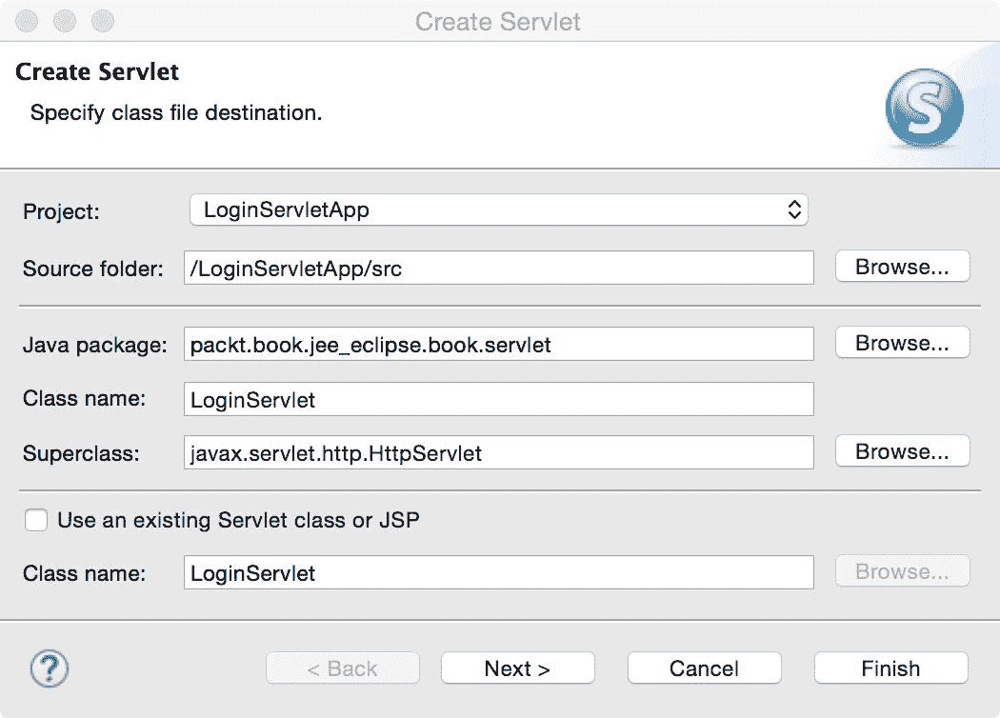

图 2.22：创建 Servlet 向导

1.  Servlet 向导为您创建了类。注意类声明上方有 `@WebServlet("/LoginServlet")` 注解。在 JEE 5 之前，你必须在 `WEB-INF` 文件夹中的 `web.xml` 中声明 servlet。你仍然可以这样做，但如果你使用适当的注解，你可以跳过这个声明。使用 `WebServlet`，我们告诉 servlet 容器 `LoginServlet` 是一个 servlet，并且我们将其映射到 `/LoginServlet` URL 路径。因此，我们通过使用这个注解避免了 `web.xml` 中的以下两个条目：`<servlet>` 和 `<servlet-mapping>`。

我们现在将映射从 `/LoginServlet` 更改为 `/login`。因此，我们将修改注解如下：

```java
@WebServlet("/login") 
public class LoginServlet extends HttpServlet {...} 
```

1.  工具程序还创建了`doGet`和`doPost`方法。这些方法是从以下基类中重写的：`HttpServlet`。`doGet`方法被调用以创建对`Get`请求的响应，而`doPost`被调用以创建对`Post`请求的响应。

我们将在`doGet`方法中创建一个登录表单，并在`doPost`方法中处理表单数据（`Post`）。然而，因为`doPost`可能需要显示表单，以防用户凭证无效，我们将编写一个`createForm`方法，该方法可以从`doGet`和`doPost`中调用。

1.  添加一个如下所示的`createForm`方法：

```java
protected String createForm(String errMsg) { 
 StringBuilder sb = new StringBuilder("<h2>Login</h2>"); 
//check whether error message is to be displayed 
  if (errMsg != null) { 
    sb.append("<span style='color: red;'>") 
      .append(errMsg) 
      .append("</span>"); 
  } 
  //create form 
  sb.append("<form method='post'>n") 
    .append("User Name: <input type='text' 
     name='userName'><br>n")    .append("Password: <input type='password' 
     name='password'><br>n")    .append("<button type='submit' 
     name='submit'>Submit</button>n") 
    .append("<button type='reset'>Reset</button>n") 
    .append("</form>"); 

  return sb.toString(); 
} 
```

1.  现在，我们将修改一个`doGet`方法以调用`createForm`方法并返回响应：

```java
protected void doGet(HttpServletRequest request, 
 HttpServletResponse response) 
  throws ServletException, IOException { 
  response.getWriter().write(createForm(null)); 
} 
```

我们在`response`对象上调用`getWrite`方法，并通过调用`createForm`函数将表单内容写入其中。请注意，当我们显示表单时，最初没有错误信息，因此我们传递一个`null`参数给`createForm`。

1.  我们将修改`doPost`以处理用户通过点击提交按钮提交的表单内容：

```java
protected void doPost(HttpServletRequest request, 
HttpServletResponse response) 
  throws ServletException, IOException { 
    String userName = request.getParameter("userName"); 
    String password = request.getParameter("password"); 

  //create StringBuilder to hold response string 
  StringBuilder responseStr = new StringBuilder(); 
  if ("admin".equals(userName) && "admin".equals(password)) { 
    responseStr.append("<h2>Welcome admin !</h2>") 
    .append("You are successfully logged in"); 
  } 
  else { 
    //invalid user credentials 
    responseStr.append(createForm("Invalid user id or password. 
     Please try again")); 
  } 

  response.getWriter().write(responseStr.toString()); 
} 
```

我们首先通过调用`request.getParameter`方法从`request`对象中获取用户名和密码。如果凭证有效，我们在`response`字符串中添加一条欢迎信息；否则，我们调用带有错误信息的`createForm`方法，并将表单的标记（表单的标记）添加到`response`字符串中。

最后，我们从`response`字符串中获取`Writer`对象，并写入响应。

1.  在项目资源管理器中右键单击`LoginServlet.java`文件，然后选择“运行方式 | 在服务器上运行”选项。我们尚未将此项目添加到 Tomcat 服务器。因此，Eclipse 将询问您是否要使用配置的服务器运行此 servlet。点击向导的“完成”按钮。

1.  由于服务器上部署了新的 Web 应用程序，Tomcat 需要重新启动。Eclipse 将提示您重新启动服务器。点击“确定”。

当在 Eclipse 的内部浏览器中运行 servlet 时，请注意 URL；它以`/login`结尾，这是我们已在 servlet 注解中指定的映射。然而，您将观察到，页面没有渲染 HTML 表单，而是显示了标记文本。这是因为我们在`response`对象上遗漏了一个重要的设置。我们没有告诉浏览器我们返回的内容类型，所以浏览器假设它是文本，并以纯文本的形式渲染它。我们需要告诉浏览器它是 HTML 内容。我们通过在`doGet`和`doPost`方法中调用`response.setContentType("text/html")`来实现这一点。以下是完整的源代码：

```java
package packt.book.jee_eclipse.book.servlet; 

// skipping imports to save space

/** 
 * Servlet implementation class LoginServlet 
 */ 
@WebServlet("/login") 
public class LoginServlet extends HttpServlet { 
  private static final long serialVersionUID = 1L; 

  public LoginServlet() { 
    super(); 
  } 
  //Handles HTTP Get requests 
  protected void doGet(HttpServletRequest request, HttpServletResponse response)  
    throws ServletException, IOException { 
  response.setContentType("text/html"); 
  response.getWriter().write(createForm(null)); 
  } 
  //Handles HTTP POST requests 
  protected void doPost(HttpServletRequest request, 
   HttpServletResponse response) 
      throws ServletException, IOException { 
    String userName = request.getParameter("userName"); 
    String password = request.getParameter("password"); 

    //create StringBuilder to hold response string 
    StringBuilder responseStr = new StringBuilder(); 
    if ("admin".equals(userName) && "admin".equals(password)) { 
      responseStr.append("<h2>Welcome admin !</h2>") 
        .append("You're are successfully logged in"); 
    } else { 
      //invalid user credentials 
      responseStr.append(createForm("Invalid user id or password. 
       Please try again")); 
    } 
    response.setContentType("text/html"); 
    response.getWriter().write(responseStr.toString()); 
  }

  //Creates HTML Login form 
  protected String createForm(String errMsg) { 
    StringBuilder sb = new StringBuilder("<h2>Login</h2>"); 
    //check if error message to be displayed 
    if (errMsg != null) { 
      sb.append("<span style='color: red;'>") 
        .append(errMsg) 
        .append("</span>"); 
    } 
    //create form 
    sb.append("<form method='post'>n") 
      .append("User Name: <input type='text' 
       name='userName'><br>n")      .append("Password: <input type='password' 
       name='password'><br>n")      .append("<button type='submit' 
       name='submit'>Submit</button>n") 
      .append("<button type='reset'>Reset</button>n") 
      .append("</form>"); 
    return sb.toString(); 
  } 
} 
```

如您所见，在 servlet 中编写 HTML 标记并不太方便。因此，如果您正在创建一个包含大量 HTML 标记的页面，那么使用 JSP 或纯 HTML 会更好。Servlets 适用于处理不需要生成太多标记的请求，例如，在**模型-视图-控制器**（**MVC**）框架中的控制器，处理生成非文本响应的请求，或创建 Web 服务或 WebSocket 端点。

# 创建 WAR

到目前为止，我们一直在 Eclipse 中运行我们的 Web 应用程序，它负责将应用程序部署到 Tomcat 服务器。这在开发过程中工作得很好，但当你想要将其部署到测试或生产服务器时，你需要创建一个**Web 应用程序存档**（**WAR**）。我们将看到如何从 Eclipse 创建 WAR。然而，首先我们将从 Tomcat 中取消部署现有应用程序。

1.  前往“服务器视图”，选择应用程序，然后右键单击并选择“移除”选项：

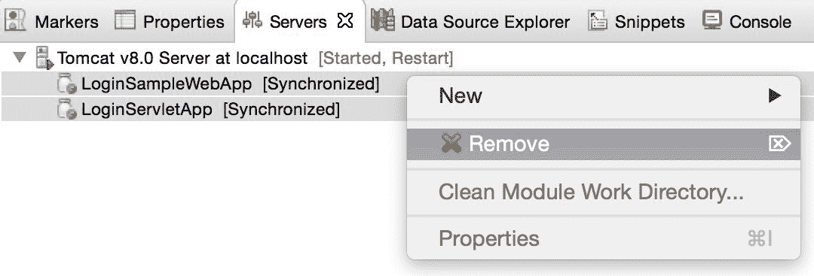

图 2.23 从服务器取消部署 Web 应用程序

1.  然后，在项目资源管理器中右键单击项目，选择导出 | WAR 文件。选择 WAR 文件的目标位置：

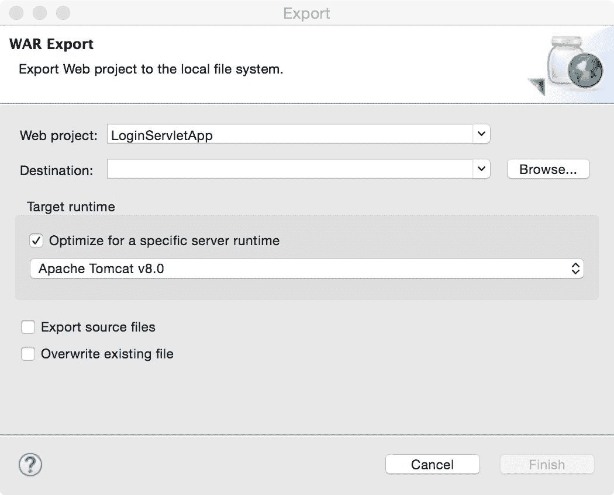

图 2.24 导出 WAR

要将 WAR 文件部署到 Tomcat，将其复制到`<tomcat_home>/webapps`文件夹。然后如果服务器尚未运行，请启动服务器。如果 Tomcat 已经运行，则不需要重新启动它。

Tomcat 监视`webapps`文件夹，并将任何复制到其中的 WAR 文件自动部署。您可以通过在浏览器中打开应用程序的 URL 来验证此操作，例如，`http://localhost:8080/LoginServletApp/login`。

# JavaServer Faces

在使用 JSP 时，我们看到了将脚本片段与 HTML 标记混合不是一个好主意。我们通过使用 JavaBean 解决了这个问题。JavaServer Faces 将这种设计进一步发展。除了支持 JavaBeans 之外，JSF 还提供了用于 HTML 用户控制的内置标签，这些标签是上下文感知的，可以执行验证，并且可以在请求之间保留状态。我们现在将使用 JSF 创建登录应用程序：

1.  在 Eclipse 中创建一个动态 Web 应用程序；让我们称它为`LoginJSFApp`。在向导的最后一步，确保勾选“生成 web.xml 部署描述符”复选框。

1.  从[`maven.java.net/content/repositories/releases/org/glassfish/javax.faces/2.2.9/javax.faces-2.2.9.jar`](https://maven.java.net/content/repositories/releases/org/glassfish/javax.faces/2.2.9/javax.faces-2.2.9.jar)下载 JSF 库，并将它们复制到项目中的`WEB-INF/lib`文件夹。

1.  JSF 遵循 MVC 模式。在 MVC 模式中，生成用户界面（视图）的代码与数据容器（模型）是分开的。控制器作为视图和模型之间的接口。它根据配置选择模型来处理请求，一旦模型处理了请求，它根据模型处理的结果选择要生成的视图并返回给客户端。MVC 的优点是 UI 和业务逻辑（需要不同的专业知识）有明确的分离，因此它们可以独立开发，在很大程度上。在 JSP 中，MVC 的实现是可选的，但 JSF 强制执行 MVC 设计。

视图是作为`xhtml`文件创建的 JSF。控制器是 JSF 库中的 servlet，模型是**管理 Bean**（JavaBean）。

```java
</web-app>:
```

```java
<servlet> 
  <servlet-name>JSFServlet</servlet-name> 
  <servlet-class>javax.faces.webapp.FacesServlet</servlet-class> 
  <load-on-startup>1</load-on-startup> 
</servlet> 

<servlet-mapping> 
  <servlet-name>JSFServlet</servlet-name> 
  <url-pattern>*.xhtml</url-pattern> 
</servlet-mapping> 
```

注意，在创建前面的元素时，按*Ctrl*/*Cmd* + *C*可以获取代码辅助。

您可以为`servlet-name`指定任何名称；只需确保在`servlet-mapping`中使用相同的名称。servlet 的类为`javax.faces.webapp.FacesServlet`，它位于我们下载作为 JSF 库并复制到`WEB-INF/lib`的 JAR 文件中。此外，我们将所有以`.xhtml`结尾的请求映射到这个 servlet 上。

接下来，我们将为我们的登录页面创建一个管理 Bean。这与我们之前创建的 JavaBean 相同，但增加了 JSF 特定的注解：

1.  在项目资源管理器中，在`Java Resources`下的`src`文件夹上右键单击。

1.  选择“新建 | 类”菜单选项。

1.  按照本章中“在 JSP 中使用 JavaBeans”部分所述，创建 JavaBean `LoginBean`。

1.  为`userName`和`password`创建两个成员。

1.  为它们创建 getter 和 setter。然后，添加以下两个注解：

```java
package packt.book.jee_eclipse.bean; 
import javax.faces.bean.ManagedBean; 
import javax.faces.bean.RequestScoped; 

@ManagedBean(name="loginBean") 
@RequestScoped 
public class LoginBean { 
  private String userName; 
  private String password; 
  public String getUserName() { 
    return userName; 
  } 
  public void setUserName(String userName) { 
    this.userName = userName; 
  } 
  public String getPassword() { 
    return password; 
  } 
  public void setPassword(String password) { 
    this.password = password; 
  } 
}
```

（您也可以在创建前面的元素时通过按*Ctrl*/*Cmd* + *C*来获取代码辅助。代码辅助也适用于注解的`key-value`属性对，例如，对于`ManagedBean`注解的`name`属性）。

1.  通过选择“文件 | 新建 | 文件”菜单选项，在项目的`WebContent`文件夹内创建一个名为`index.xhtml`的新文件。当使用 JSF 时，您需要在文件的顶部添加一些命名空间声明：

```java
<html  

  > 
```

在这里，我们正在声明 JSF 内置`tag`库的命名空间。我们将使用前缀`f`访问核心 JSF `tag`库中的标签，并使用前缀`h`访问 HTML 标签。

1.  添加标题并开始`body`标签：

```java
<head> 
<title>Login</title> 
</head> 
<body> 
  <h2>Login</h2> 
```

对于`head`和`body`，有相应的 JSF 标签，但我们没有使用任何特定的 JSF 属性；因此，我们使用了简单的 HTML 标签。

1.  然后，我们添加代码来显示错误消息，如果它不为空：

```java
<h:outputText value="#{loginBean.errorMsg}" 
              rendered="#{loginBean.errorMsg != null}" 
              style="color:red;"/> 
```

在这里，我们使用 JSF 和表达式语言特定的标签来显示错误消息的值。`OutputText`标签类似于我们在 JSTL 中看到的`c:out`标签。我们还添加了一个条件，仅在托管 Bean 中的错误消息不是`null`时渲染它。此外，我们还设置了此输出文本的颜色。

1.  我们还没有将`errorMsg`成员添加到托管 Bean 中。因此，让我们添加声明、获取器和设置器。打开`LoginBean`类并添加以下代码：

```java
private String errorMsg; 
public String getErrorMsg() { 
  return errorMsg; 
} 
public void setErrorMsg(String errorMsg) { 
  this.errorMsg = errorMsg; 
} 
```

注意，我们通过使用`ManagedBean`注解的`name`属性的值来访问 JSF 中的托管 Bean。此外，与 JSP 中的 JavaBean 不同，我们不是通过`<jsp:useBean>`标签来创建它的。如果它不在所需的范围内，JSF 运行时会创建 Bean，在这个例子中，是`Request`范围。

1.  让我们回到编辑`index.xhtml`。我们现在将添加以下表单：

```java
<h:form> 
  User Name: <h:inputText id="userName" 
                value="#{loginBean.userName}"/><br/> 
  Password: <h:inputSecret id="password" 
                value="#{loginBean.password}"/><br/> 
  <h:commandButton value="Submit" 
   action="#{loginBean.validate}"/> 
</h:form> 
```

这里发生了很多事情。首先，我们使用了 JSF 的`inputText`标签来创建用户名和密码的文本框。我们使用`loginBean`的相应成员设置它们的值。我们使用了 JSF 的`commandButton`标签来创建一个提交按钮。当用户点击提交按钮时，我们将其设置为调用`loginBean.validate`方法（使用`action`属性）。

1.  我们还没有在`loginBean`中定义一个`validate`方法，所以让我们添加它。打开`LoginBean`类并添加以下代码：

```java
public String validate() 
{ 
  if ("admin".equals(userName) && "admin".equals(password)) { 
    errorMsg = null; 
    return "welcome"; 
  } else { 
    errorMsg = "Invalid user id or password. Please try 
     again"; 
    return null; 
  } 
}
```

注意，`validate`方法返回一个字符串。返回值是如何使用的？它用于 JSF 中的导航目的。JSF 运行时会查找与在`commandButton`的`action`属性中评估的表达式返回的字符串值相同的 JSF 文件。在`validate`方法中，如果用户凭据有效，我们返回`welcome`。在这种情况下，我们告诉 JSF 运行时导航到`welcome.xhtml`。如果凭据无效，我们设置错误消息并返回`null`，在这种情况下，JSF 运行时会显示同一页面。

1.  我们现在将添加`welcome.xhml`页面。它只包含欢迎消息：

```java
<html  

      > 
  <body> 
    <h2>Welcome admin !</h2> 
      You are successfully logged in 
  </body> 
</html> 
```

这里是`index.html`的完整源代码：

```java
<html  

  > 

  <head> 
    <title>Login</title> 
  </head> 
  <body> 
  <h2>Login</h2> 
  <h:outputText value="#{loginBean.errorMsg}" 
  rendered="#{loginBean.errorMsg != null}" 
  style="color:red;"/> 
  <h:form> 
    User Name: <h:inputText id="userName" 
     value="#{loginBean.userName}"/><br/>    Password: <h:inputSecret id="password" 
     value="#{loginBean.password}"/><br/> 
  <h:commandButton value="Submit" action="#{loginBean.validate}"/> 
  </h:form> 
</body> 
</html>
```

这里是`LoginBean`类的源代码：

```java
package packt.book.jee_eclipse.bean; 
import javax.faces.bean.ManagedBean; 
import javax.faces.bean.RequestScoped; 

@ManagedBean(name="loginBean") 
@RequestScoped 
public class LoginBean { 
  private String userName; 
  private String password; 
  private String errorMsg; 
  public String getUserName() { 
    return userName; 
  } 
  public void setUserName(String userName) { 
    this.userName = userName; 
  } 
  public String getPassword() { 
    return password; 
  } 
  public void setPassword(String password) { 
    this.password = password; 
  } 
  public String getErrorMsg() { 
    return errorMsg; 
  } 
  public void setErrorMsg(String errorMsg) { 
    this.errorMsg = errorMsg; 
  } 
  public String validate() 
  { 
    if ("admin".equals(userName) && "admin".equals(password)) { 
      errorMsg = null; 
      return "welcome"; 
    } 
    else { 
      errorMsg = "Invalid user id or password. Please try again"; 
      return null; 
    } 
  } 
} 
```

要运行应用程序，在项目资源管理器中右键单击`index.xhtml`，然后选择“运行”|“在服务器上运行”选项。

JSF 可以做的不仅仅是我们在这个小示例中看到的内容——它支持验证输入和创建页面模板。然而，这些主题超出了本书的范围。

访问[`docs.oracle.com/cd/E11035_01/workshop102/webapplications/jsf/jsf-app-tutorial/Introduction.html`](http://docs.oracle.com/cd/E11035_01/workshop102/webapplications/jsf/jsf-app-tutorial/Introduction.html)以获取 JSF 教程。

# 使用 Maven 进行项目管理

在本章中我们创建的项目中，我们已经管理了许多项目管理任务，例如下载项目依赖的库，将它们添加到适当的文件夹中以便 Web 应用程序可以找到它，以及导出项目以创建部署的 WAR 文件。这些只是我们迄今为止执行的一些项目管理任务，但还有很多更多，我们将在后续章节中看到。有一个工具为我们执行许多项目管理任务是有帮助的，这样我们就可以专注于应用程序开发。Java 有一些知名的构建管理工具可用，例如 Apache Ant ([`ant.apache.org/`](http://ant.apache.org/)) 和 Maven ([`maven.apache.org/`](http://maven.apache.org/))).

在本节中，我们将了解如何将 Maven 用作项目管理工具。通过遵循创建项目结构的惯例并允许项目定义层次结构，Maven 使得项目管理比 Ant 更简单。Ant 主要是一个构建工具，而 Maven 是一个项目管理工具，它也进行构建管理。请参阅[`maven.apache.org/what-is-maven.html`](http://maven.apache.org/what-is-maven.html)了解 Maven 能做什么。

尤其是 Maven 简化了依赖管理。在本章前面的 JSF 项目中，我们首先下载了 JSF 所需的相应`.jar`文件，并将它们复制到`lib`文件夹中。Maven 可以自动化这个过程。您可以在`pom.xml`中配置 Maven 设置。**POM**代表**项目对象模型**。

在我们使用 Maven 之前，了解它是如何工作的是非常重要的。Maven 使用仓库。仓库包含许多知名库/项目的插件。一个插件包括项目配置信息、在您的项目中使用此项目所需的`.jar`文件以及任何其他支持性工件。默认的 Maven 仓库是一个插件集合。您可以在默认的 Maven 仓库中找到插件列表，网址为[`maven.apache.org/plugins/index.html`](http://maven.apache.org/plugins/index.html)。您还可以浏览 Maven 仓库的内容，网址为[`search.maven.org/#browse`](http://search.maven.org/#browse)。Maven 还在您的机器上维护一个本地仓库。这个本地仓库只包含您的项目指定的依赖项的插件。在 Windows 上，您可以在`C:/Users/<username>.m2`找到本地仓库，而在 macOS X 上，它位于`~/.m2`。

您在 `pom.xml` 的 `dependencies` 部分定义了项目所依赖的插件（我们将在创建 Maven 项目时稍后看到 `pom.xml` 的结构）。例如，我们可以指定对 JSF 的依赖。当您运行 Maven 工具时，它首先检查 `pom.xml` 中的所有依赖项。然后，它会检查所需版本的依赖插件是否已经下载到本地仓库中。如果没有，它会从中央（远程）仓库下载它们。您也可以指定要查找的仓库。如果您没有指定任何仓库，则依赖项将在中央 Maven 仓库中搜索。

我们将创建一个 Maven 项目并更详细地探索 `pom.xml`。然而，如果您想了解 `pom.xml` 是什么，请访问 [`maven.apache.org/pom.html#What_is_the_POM`](http://maven.apache.org/pom.html#What_is_the_POM)。

Eclipse JEE 版本已内置 Maven，因此您不需要下载它。但是，如果您计划在 Eclipse 外部使用 Maven，则可以从 [`maven.apache.org/download.cgi`](http://maven.apache.org/download.cgi) 下载它。

# Eclipse JEE 中的 Maven 视图和首选项

在我们创建 Maven 项目之前，让我们探索 Eclipse 中特定的 Maven 视图和首选项：

1.  选择 Window | Show View | Other... 菜单。

1.  在过滤器框中输入 `Maven`。您将看到两个 Maven 视图：

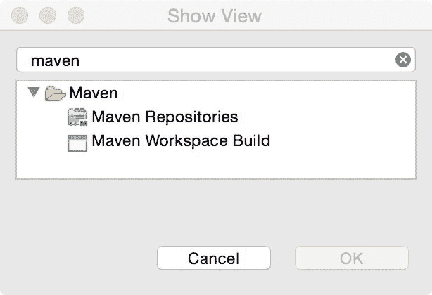

图 2.25：Maven 视图

1.  选择 Maven Repositories 视图并点击 OK。此视图将在 Eclipse 底部选项卡窗口中打开。您可以看到本地和远程仓库的位置。

1.  右键单击全局仓库以查看索引仓库的选项：

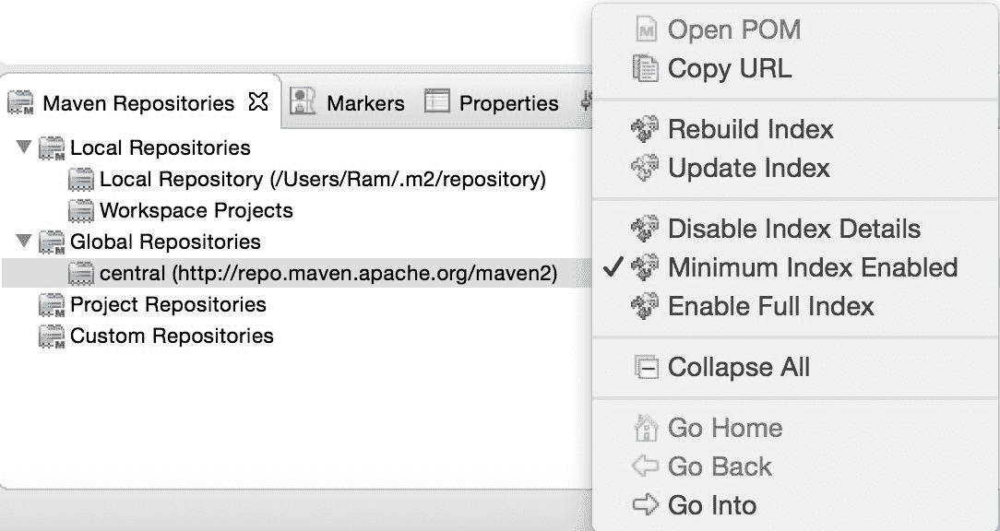

图 2.26：Maven 仓库视图

1.  打开 Eclipse 首选项，并在过滤器框中输入 `Maven` 以查看所有 Maven 首选项：

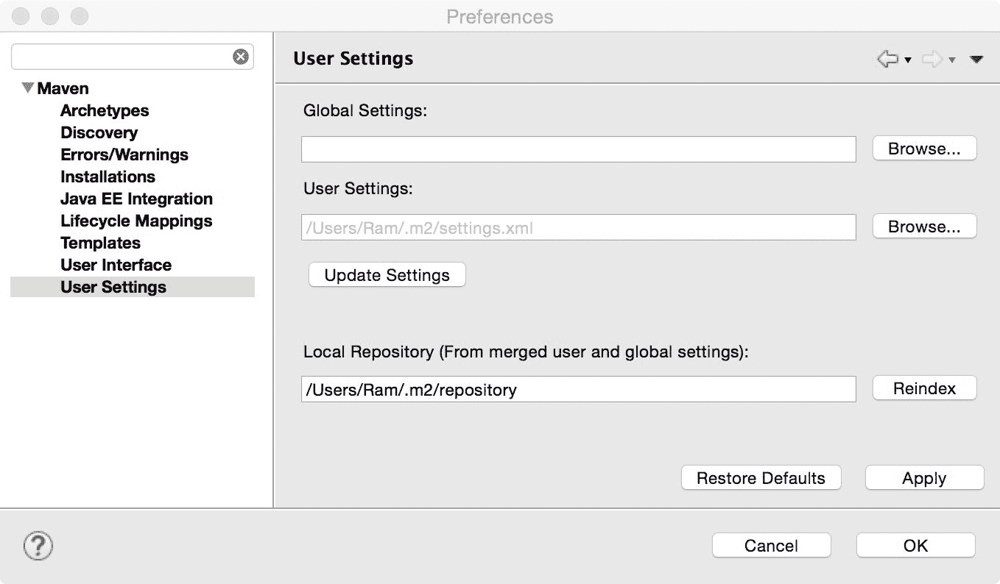

图 2.27：Maven 首选项

您应将 Maven 首选项设置为在启动时刷新仓库索引，以便在您向项目添加依赖项时可以使用最新的库（我们将在稍后学习如何添加依赖项）。

1.  在首选项中点击 Maven 节点并设置以下选项：

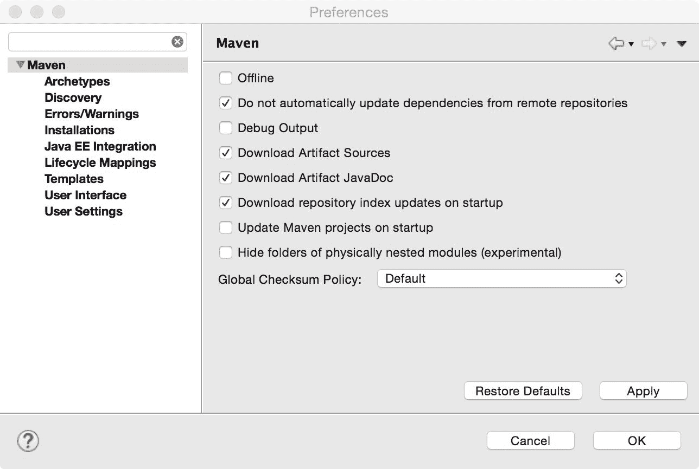

图 2.28：启动时更新索引的 Maven 首选项

# 创建 Maven 项目

在以下步骤中，我们将看到如何在 Eclipse 中创建 Maven 项目：

1.  选择 New | Maven Project 菜单：

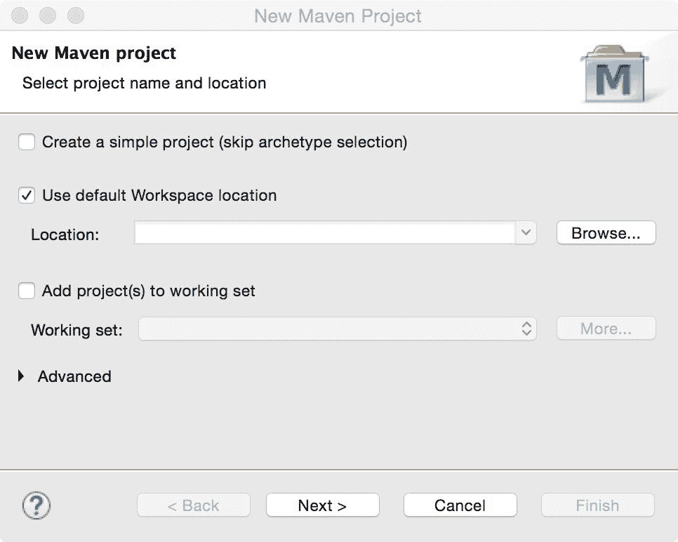

图 2.29：Maven 新建项目向导

1.  接受所有默认选项并点击 Next。在过滤器框中输入 `webapp` 并选择 maven-archetype-webapp：

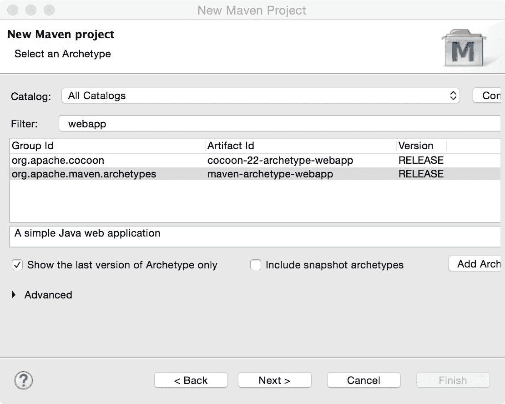

图 2.30：新建 Maven 项目 - 选择原型

# Maven 原型

在前面的向导中，我们选择了 maven-archetype-webapp。原型是一个项目模板。当您使用原型创建项目时，模板（原型）中定义的所有依赖项和其他 Maven 项目配置都将导入到您的项目中。

更多关于 Maven 原型的信息请参阅[`maven.apache.org/guides/introduction/introduction-to-archetypes.html`](http://maven.apache.org/guides/introduction/introduction-to-archetypes.html)。

1.  继续使用 New Maven Project 向导，点击 Next。在 Group Id 字段中输入`packt.book.jee_eclipse`。在 Artifact Id 字段中输入`maven_jsf_web_app`：

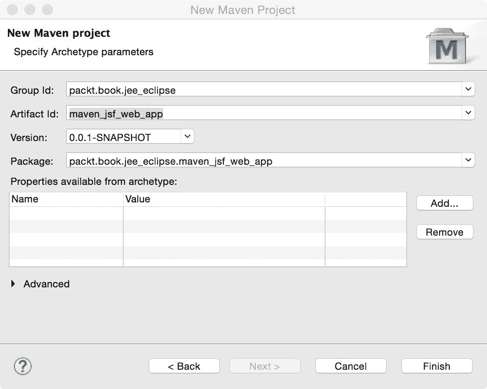

图 2.31：新建 Maven 项目 - 原型参数

1.  点击 Finish。在项目资源管理器中添加了一个`maven_jsf_web_app`项目。

# 探索 POM

在编辑器中打开`pom.xml`文件并切换到 pom.xml 标签页。文件应包含以下内容：

```java
<project   
  xsi:schemaLocation="http://maven.apache.org/POM/4.0.0 
   http://maven.apache.org/maven-v4_0_0.xsd"> 
  <modelVersion>4.0.0</modelVersion> 
  <groupId>packt.book.jee_eclipse</groupId> 
  <artifactId>maven_jsf_web_app</artifactId> 
  <packaging>war</packaging> 
  <version>0.0.1-SNAPSHOT</version> 
  <name>maven_jsf_web_app Maven Webapp</name> 
  <url>http://maven.apache.org</url> 
  <dependencies> 
    <dependency> 
      <groupId>junit</groupId> 
      <artifactId>junit</artifactId> 
      <version>3.8.1</version> 
      <scope>test</scope> 
    </dependency> 
  </dependencies> 
  <build> 
    <finalName>maven_jsf_web_app</finalName> 
  </build> 
</project> 
```

让我们详细看看前面代码片段中使用的不同标签：

+   `modelVersion`: 在`pom.xml`文件中，这代表 Maven 的版本。

+   `groupId`: 这是用于将项目分组在一起的业务单元或组织中的通用 ID。尽管使用包结构格式对于组 ID 不是必需的，但它通常被使用。

+   `artifactId`: 这是项目名称。

+   `version`: 这是项目的版本号。在指定依赖项时，版本号很重要。你可以有一个项目的多个版本，并且可以在不同的项目中指定不同的版本依赖项。Maven 还会将其创建的项目 JAR、WAR 或 EAR 文件的版本号附加到其中。

+   `packaging`: 这告诉 Maven 在项目构建时我们想要什么样的最终输出。在这本书中，我们将使用 JAR、WAR 和 EAR 打包类型，尽管存在更多类型。

+   `name`: 这实际上是项目的名称，但在 Eclipse 的项目资源管理器中显示为`artifactid`。

+   `url`: 如果你在网上托管项目信息，这是你项目的 URL。默认情况下是 Maven 的 URL。

+   `dependencies`: 这个部分是我们指定项目所依赖的库（或其他 Maven 工件）。我们为这个项目选择的原型已经将 JUnit 的默认依赖项添加到我们的项目中。我们将在第五章，*单元测试*中了解更多关于 JUnit 的内容。

+   `finalName`: 在`build`标签中的这个标签表示 Maven 为你的项目生成的输出文件（JAR、WAR 或 EAR）的名称。

# 添加 Maven 依赖项

我们为项目选择的原型不包括 JEE Web 项目所需的某些依赖项。因此，你可能会在`index.jsp`中看到错误标记。我们将通过添加 JEE 库的依赖项来修复这个问题：

1.  在编辑器中打开`pom.xml`文件后，点击 Dependencies 标签页。

1.  点击 Add 按钮。这会打开 Select Dependency 对话框。

1.  在过滤器框中，输入`javax.servlet`（我们想在项目中使用 servlet API）。

1.  选择 API 的最新版本并点击 OK 按钮。

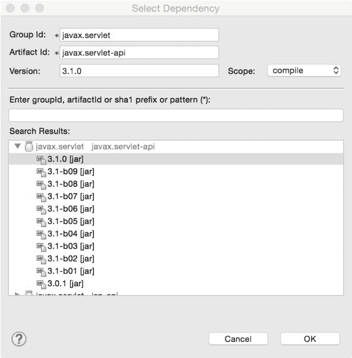

图 2.32：添加 servlet API 依赖项

然而，我们只需要在编译时使用 servlet API 的 JAR 文件；在运行时，这些 API 由 Tomcat 提供。我们可以通过指定依赖的范围来表示这一点；在这种情况下，将其设置为 provided，这告诉 Maven 仅为此依赖项进行评估，并将其打包到 WAR 文件中。有关依赖范围的更多信息，请参阅 [`maven.apache.org/guides/introduction/introduction-to-dependency-mechanism.html`](http://maven.apache.org/guides/introduction/introduction-to-dependency-mechanism.html)。

1.  要设置依赖的范围，从 POM 编辑器的“依赖”选项卡中选择依赖项。

1.  点击“属性”按钮。然后，从下拉列表中选择提供的范围：

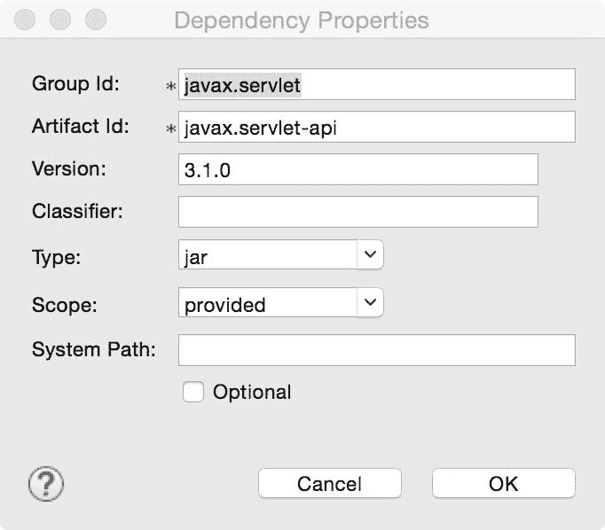

图 2.33：设置 Maven 依赖范围

1.  现在我们需要为 JSF API 及其实现添加依赖。再次点击“添加”按钮，并在搜索框中输入 `jsf`。

1.  从列表中选择 Group Id 为 **`com.sun.faces`** 的 **`jsf-api`**，然后点击“确定”按钮：

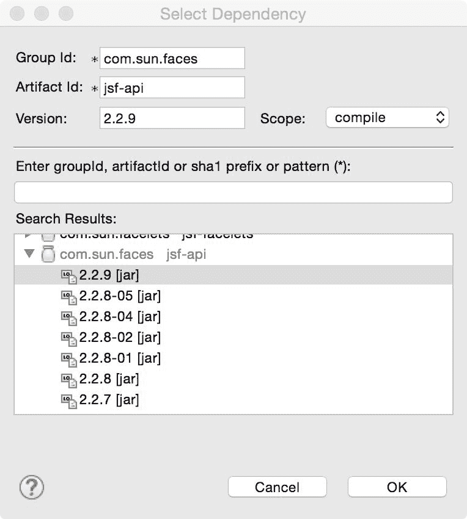

图 2.34：为 JSF 添加 Maven 依赖

1.  类似地，添加一个 `jsf-impl` 依赖，Group Id 为 `com.sun.faces`。你的 `pom.xml` 文件中的依赖部分应如下所示：

```java
<dependencies> 
    <dependency> 
      <groupId>junit</groupId> 
      <artifactId>junit</artifactId> 
      <version>3.8.1</version> 
      <scope>test</scope> 
    </dependency> 
    <dependency> 
      <groupId>javax.servlet</groupId> 
      <artifactId>javax.servlet-api</artifactId> 
      <version>3.1.0</version> 
      <scope>provided</scope> 
    </dependency> 
    <dependency> 
      <groupId>com.sun.faces</groupId> 
      <artifactId>jsf-api</artifactId> 
      <version>2.2.16</version> 
      </dependency> 
    <dependency> 
      <groupId>com.sun.faces</groupId> 
      <artifactId>jsf-impl</artifactId> 
      <version>2.2.16</version> 
    </dependency> 
  </dependencies> 

```

如果 Tomcat 抛出找不到 `javax.faces.webapp.FacesServlet` 的异常，那么你可能需要下载 `jsf-api-2.2.16.jar` ([`central.maven.org/maven2/com/sun/faces/jsf-impl/2.2.16/jsf-impl-2.2.16.jar`](http://central.maven.org/maven2/com/sun/faces/jsf-impl/2.2.16/jsf-impl-2.2.16.jar)) 和 `jsf-impl-2.2.16.jar` ([`central.maven.org/maven2/com/sun/faces/jsf-impl/2.2.16/jsf-impl-2.2.16.jar`](http://central.maven.org/maven2/com/sun/faces/jsf-impl/2.2.16/jsf-impl-2.2.16.jar))，并将它们复制到 `<tomcat-install-folder>/lib` 文件夹中。

# Maven 项目结构

Maven 项目向导在主项目文件夹下创建 `src` 和 `target` 文件夹。正如其名所示，所有源文件都放在 `src` 下。然而，Java 包结构从 `main` 文件夹开始。按照惯例，Maven 预期 Java 源文件在 `java` 文件夹下。因此，在 `src/main` 下创建一个 `java` 文件夹。Java 包结构从 `java` 文件夹开始，即 `src/main/java/<java-packages>`。Web 内容，如 HTML、JS、CSS 和 JSP，放在 `src/main/webapp` 下的 `webapp` 文件夹中。由 Maven 构建过程生成的编译类和其他输出文件存储在 `target` 文件夹中：

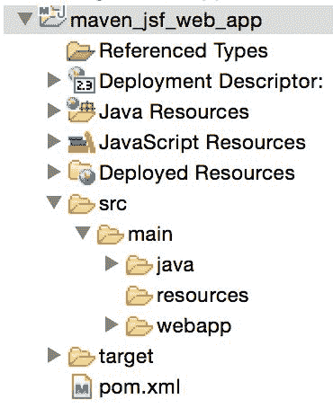

图 2.35：Maven 网络应用程序项目结构

我们登录 JSF 页面的源代码与之前 `LoginJSFApp` 示例中的相同。因此，将那个项目的 `src` 文件夹中的 `packt` 文件夹复制到这个 Maven 项目的 `src/main/java` 文件夹中。这会将 `LoginBean.java` 添加到项目中。然后，将 `web.xml` 从 `WEB-INF` 文件夹复制到这个项目的 `src/main/webapp/WEB-INF` 文件夹中。将 `index.xhtml` 和 `welcome.xhtml` 复制到 `src/main/webapp` 文件夹：

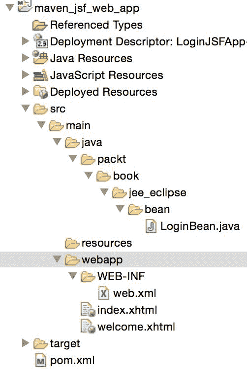

图 2.36：添加源文件后的项目结构

在源代码中不需要进行任何更改。要运行应用程序，请右键单击`index.xhtml`并选择运行方式 | 在服务器上运行。

在本书的其余部分，我们将使用 Maven 进行项目管理。

# 使用 Maven 创建 WAR 文件

在前面的示例中，我们使用 Eclipse 的导出选项创建了 WAR 文件。在 Maven 项目中，你可以通过调用 Maven Install 插件来创建 WAR 文件。右键单击项目并选择运行方式 | Maven 安装选项。WAR 文件将在`target`文件夹中创建。然后你可以通过将其复制到 Tomcat 的`webapps`文件夹中来部署 WAR 文件。

# 摘要

在本章中，我们学习了如何在 Eclipse 中配置 Tomcat。我们学习了同一个网页可以使用三种不同的技术实现，即 JSP、Servlet 和 JSF。所有这些都可以用于开发任何动态 Web 应用程序。然而，JSP 和 JSF 更适合于更注重 UI 的页面，而 servlets 更适合于控制器，以及作为 Web 服务和 WebSocket 的端点。JSF 强制执行 MVC 设计模式，并且与 JSP 相比提供了许多额外的服务。

我们还学习了如何使用 Maven 进行许多项目管理任务。

在下一章中，我们将学习如何配置和使用源代码管理系统，特别是 SVN 和 Git。
