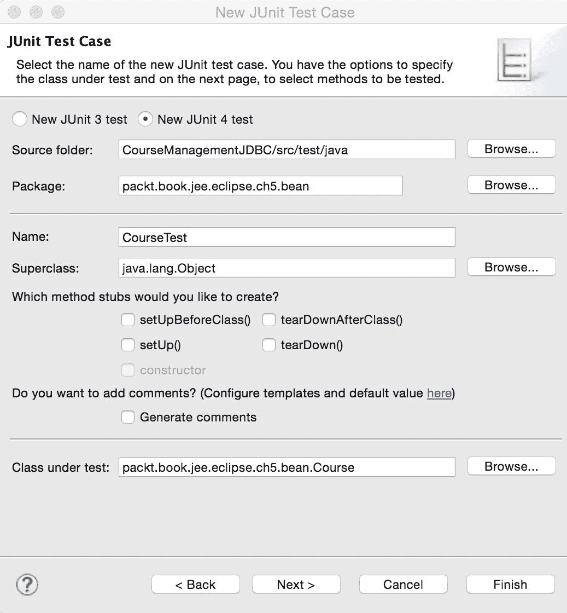
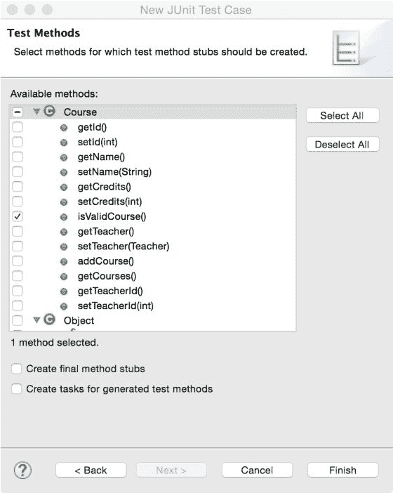
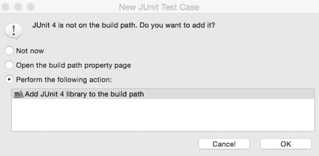
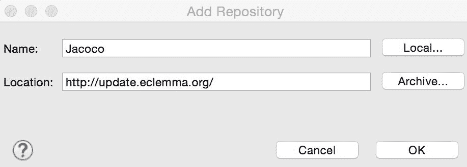
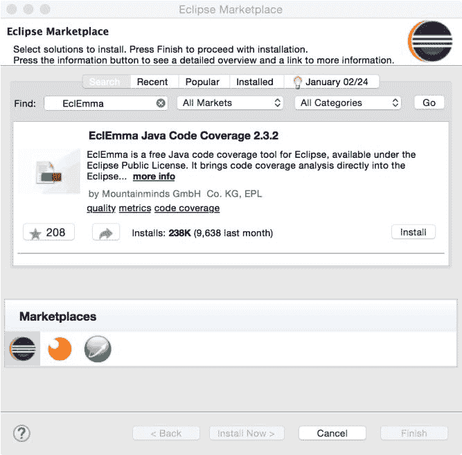
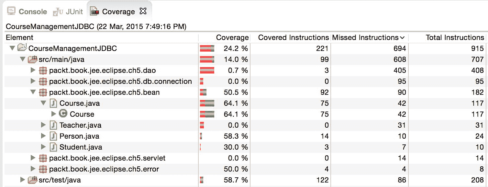
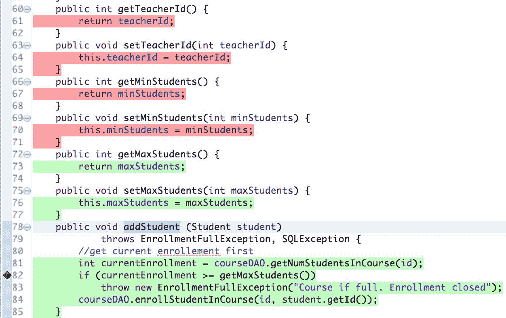
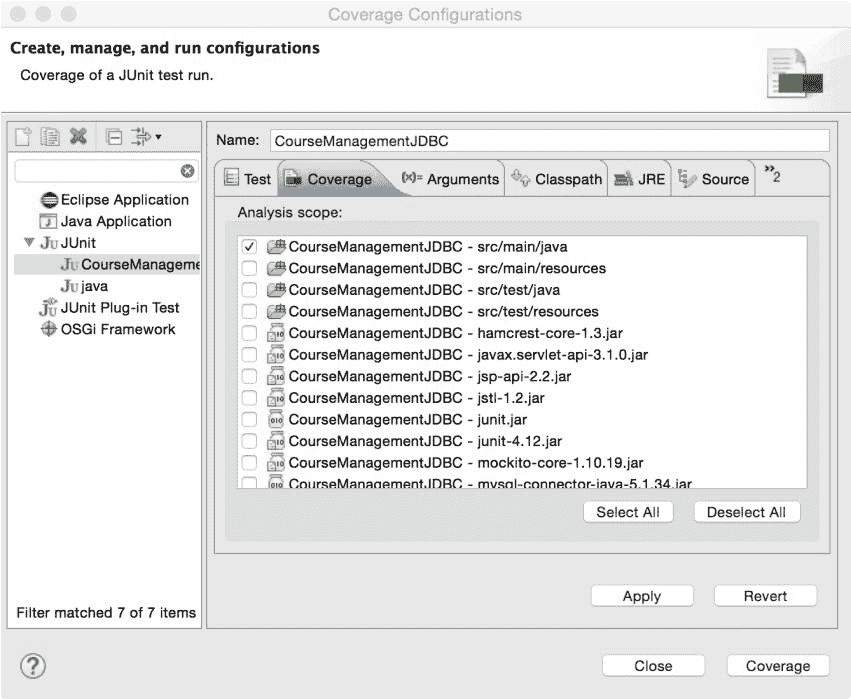

# 第五章：单元测试

在上一章中，我们学习了如何创建使用数据库的 Web 应用程序。在本章中，我们将学习如何在 Eclipse 中为 JEE 应用程序编写和执行单元测试。本章将涵盖以下主题：

+   使用 Eclipse JEE 创建和执行单元测试

+   从 Eclipse IDE 执行单元测试

+   为单元测试模拟外部依赖

+   计算单元测试覆盖率

测试你开发的软件是整个软件开发周期中非常重要的一个部分。测试的类型有很多；每一种都有其特定的目的，并且范围各不相同。测试的例子包括功能测试、集成测试、场景测试和单元测试。

在所有这些类型中，单元测试的范围最窄，通常由开发者编码和执行。每个单元测试旨在测试特定的、小块的功能（通常是一个类中的方法），并且预期在没有外部依赖的情况下执行。以下是你应该编写高效单元测试的一些原因：

+   为了尽早捕捉到错误。如果在功能或集成测试中发现错误，这些测试的范围要广泛得多，那么可能很难隔离导致错误的代码。在单元测试中捕捉和修复错误要容易得多，因为单元测试，按照定义，在一个更窄的范围内工作，如果测试失败，你将确切知道去哪里修复问题。

+   单元测试可以帮助你捕捉到在编辑代码时可能引入的任何回归。有很好的工具和库可用于自动化单元测试的执行。例如，使用构建工具如 Ant 和 Maven，你可以在构建成功后执行单元测试，这样你就可以立即发现你所做的更改是否破坏了之前正常工作的代码。

如前所述，编写单元测试并执行它们通常是开发者的责任。因此，大多数 IDE 都提供了良好的内置支持来编写和执行单元测试。Eclipse JEE 也不例外。它内置了对 JUnit 的支持，JUnit 是一个流行的 Java 单元测试框架。

在本章中，我们将了解如何为我们在第四章中构建的*课程管理*网络应用程序编写和执行 JUnit 测试，*创建 JEE 数据库应用程序*。然而，首先，这里有一个 JUnit 的快速介绍。

# 介绍 JUnit

JUnit 测试类是与你要测试的类分开的 Java 类。每个测试类可以包含许多测试用例，这些测试用例只是标记为在执行 JUnit 测试时执行的方法。测试套件是一组测试类。

习惯上，将测试类命名为你想要测试的类的相同名称，并在该名称后附加 `Test`。例如，如果你想要测试上一章中的 `Course` 类，那么你会创建一个 JUnit 测试类，并将其命名为 `CourseTest`。测试用例（方法）名称以 `test` 开头，后跟你要测试的类中的方法名称；例如，如果你想要测试 `Course` 类中的 `validate` 方法，那么你会在 `CourseTest` 类中创建 `testValidate` 方法。测试类也创建在与要测试的类所在的包相同的包中。在 Maven 项目中，测试类通常位于 `src/test/java` 文件夹下。习惯上，在 `test` 文件夹中创建与 `src/main/java` 文件夹相同的包结构。

JUnit 支持使用注解标记单元测试和测试套件。以下是对 `Course` 类的简单测试用例：

```java
/** 
* Test for {@link Course} 
*/ 
Class CourseTest { 
  @Test 
  public void testValidate() { 
    Course course = new Course(); 
    Assert.assertFalse(course.validate()); 
    course.setName("course1") 
    Assert.assetFalse(course.validate()); 
    Course.setCredits(-5); 
    Assert.assetFalse(course.validate()); 
    course.setCredits(5); 
    Assert.assertTrue(course.validate()); 
  } 
} 
```

假设 `validate` 方法检查课程 `name` 是否为非空，以及 `credits` 是否大于零。

前面的测试用例被标记为 `@Test` 注解。它创建了一个 `Course` 类的实例，然后调用 `Assert.assertFalse` 方法来确保 `validate` 方法返回 `false`，因为 `name` 和 `credits` 没有设置，它们将具有默认值，分别是 `null` 和 `0`。`Assert` 是由 JUnit 库提供的一个类，它有许多断言方法来测试多种条件（更多信息请参见 [`junit.sourceforge.net/javadoc/org/junit/Assert.html`](http://junit.sourceforge.net/javadoc/org/junit/Assert.html)）。

然后，测试用例仅设置名称，并再次执行相同的验证，期望 `validate` 方法返回 `false`，因为学分仍然是零。最后，测试用例设置名称和学分，并调用 `Assert.assertTrue` 方法来确保 `course.validate()` 返回 `true`。如果任何断言失败，则测试用例失败。

除了 `@Test`，你还可以使用 JUnit 提供的以下注解：

+   `@Before` 和 `@After`：带有这些注解的方法在每个测试前后执行。你可能想在 `@Before` 中初始化资源，并在 `@After` 中释放它们。

+   `@BeforeClass` 和 `@AfterClass`：与 `@Before` 和 `@After` 类似，但它们不是针对每个测试调用，而是在每个测试类中只调用一次。带有 `@BeforeClass` 注解的方法在该类中的任何测试用例执行之前被调用，而带有 `@AfterClass` 注解的方法在所有测试用例执行之后被调用。

你可以在 [`junit.org/junit4/javadoc/latest/org/junit/package-summary.html`](https://junit.org/junit4/javadoc/latest/org/junit/package-summary.html) 找到更多关于 JUnit 的注解。

# 使用 Eclipse JEE 创建和执行单元测试

要了解如何编写单元测试，让我们以我们在第四章，“创建 JEE 数据库应用程序”中开发的*课程管理*应用程序的 JDBC 版本为例。让我们从一个简单的测试用例开始，用于验证课程。以下是`Course.java`的源代码：

```java
package packt.book.jee.eclipse.ch5.bean; 

import java.sql.SQLException; 
import java.util.List; 

import packt.book.jee.eclipse.ch5.dao.CourseDAO; 

public class Course { 
  private int id; 
  private String name; 
  private int credits; 
  private Teacher teacher; 
  private int teacherId; 
  private CourseDAO courseDAO = new CourseDAO(); 

  public int getId() { 
    return id; 
  } 
  public void setId(int id) { 
    this.id = id; 
  } 
  public String getName() { 
    return name; 
  } 
  public void setName(String name) { 
    this.name = name; 
  } 
  public int getCredits() { 
    return credits; 
  } 
  public void setCredits(int credits) { 
    this.credits = credits; 
  } 
  public boolean isValidCourse() { 
    return name != null && credits != 0; 
  } 
  public Teacher getTeacher() { 
    return teacher; 
  } 
  public void setTeacher(Teacher teacher) { 
    this.teacher = teacher; 
  } 
  public void addCourse() throws SQLException { 
    courseDAO.addCourse(this); 
  } 
  public List<Course> getCourses() throws SQLException { 
    return courseDAO.getCourses(); 
  } 
  public int getTeacherId() { 
    return teacherId; 
  } 
  public void setTeacherId(int teacherId) { 
    this.teacherId = teacherId; 
  } 
} 
```

# 创建单元测试用例

Maven 项目遵循某些约定；Maven 项目的整个应用程序源代码位于`src/main/java`文件夹中，单元测试预期位于`src/test/java`文件夹中。实际上，当你使用 Eclipse 创建 Maven 项目时，它会为你创建`src/test/java`文件夹。我们将在该文件夹中创建我们的测试用例。我们将为测试类创建与应用程序源相同的包结构；也就是说，为了测试`packt.book.jee.eclipse.ch5.bean.Course`类，我们将在`src/test/java`文件夹下创建`packt.book.jee.eclipse.ch5.bean`包，然后创建一个名为`CourseTest`的 JUnit 测试类，如下所示：

1.  在 Eclipse 的包资源管理器中，右键单击`src/test/java`文件夹，选择新建 | JUnit 测试用例（如果你在菜单中找不到此选项，请选择新建 | 其他，并在过滤器文本框中输入`junit`。然后，选择 JUnit 测试用例选项）。

1.  输入包名为`packt.book.jee.eclipse.ch5.bean`，类名为`CourseTest`。

1.  点击“测试用例下的类”旁边的浏览...按钮。在过滤器文本框中输入`course`，并选择`Course`类：

    图 5.1：JUnit 测试用例向导

    1.  点击下一步。页面显示我们想要为它们创建测试用例的类（`Course`）中的方法。选择你想要为它们创建测试用例的方法。

    1.  我们不想测试 getter 和 setter，因为它们是简单的方法，除了获取或设置成员变量之外，没有做太多其他的事情。目前，我们将只创建一个方法的测试用例：`isValidTestCase`。选择此方法的复选框：

    图 5.2：选择测试用例的方法

    1.  点击完成。Eclipse 会检查 JUnit 库是否包含在你的项目中，如果没有，会提示你包含它们：

        图 5.3：在项目中包含 JUnit 库

        1.  点击确定。Eclipse 创建包和测试类，包含一个名为`testIsValidCourse`的方法/测试用例。请注意，该方法使用`@Test`注解，表示它是一个 JUnit 测试用例。

        我们如何测试`isValidCourse`是否按预期工作？我们创建一个`Course`类的实例，设置一些我们知道是有效/无效的值，调用`isValidateCourse`方法，并将结果与预期结果进行比较。JUnit 在`Assert`类中提供了许多方法，用于比较通过调用测试方法获得的实际结果与预期结果。因此，让我们将测试代码添加到`testIsValidCourse`方法中：

        ```java
        package packt.book.jee.eclipse.ch5.bean; 
        import org.junit.Assert; 
        import org.junit.Test; 
        public class CourseTest { 

          @Test 
          public void testIsValidCourse() { 
            Course course = new Course(); 
            //First validate without any values set 
            Assert.assertFalse(course.isValidCourse()); 
            //set  name 
            course.setName("course1"); 
            Assert.assertFalse(course.isValidCourse()); 
            //set zero credits 
            course.setCredits(0); 
            Assert.assertFalse(course.isValidCourse()); 
            //now set valid credits 
            course.setCredits(4); 
            Assert.assertTrue(course.isValidCourse()); 
          } 

        } 
        ```

        我们首先创建 `Course` 类的一个实例，并且不设置其任何值，然后调用 `isValidCourse` 方法。我们知道它不是一个有效课程，因为名称和学分是有效课程中必需的字段。因此，我们通过调用 `Assert.assertFalse` 方法来检查 `isValidCourse` 返回的值是否为 `false`。然后我们设置名称并再次检查，预期实例是一个无效课程。然后，我们为 `Course` 设置 `0` 学分值，最后，我们为 `Course` 设置 `4` 学分。现在，`isValidCourse` 预期返回 `true`，因为名称和学分都是有效的。我们通过调用 `Assert.assertTrue` 来验证这一点。

        # 运行单元测试用例

        让我们在 Eclipse 中运行这个测试用例。在文件上右键单击，或在包资源管理器中的项目中的任何位置，然后选择 Run As | JUnit Test 菜单。Eclipse 会找到项目中的所有单元测试，执行它们，并在 JUnit 视图中显示结果：

        

        图 5.4：JUnit 结果视图

        此视图显示了运行测试用例的摘要。在这种情况下，它已运行了一个测试用例，并且是成功的。绿色条表示所有测试用例都成功执行。

        现在，让我们在方法中添加一个额外的检查：

        ```java
          @Test 
          public void testIsValidCourse() { 
            ... 
            //set empty course name 
            course.setName(""); 
            Assert.assertFalse(course.isValidCourse()); 
          } 
        ```

        然后，再次运行测试用例：

        

        图 5.5：显示失败测试的 JUnit 结果视图

        测试用例失败是因为当课程名称设置为空字符串时，`course.isValidCourse()` 返回了 `true`，而测试用例预期实例应该是一个无效课程。因此，我们需要修改 `Course` 类的 `isValidCourse` 方法以修复这个失败：

        ```java
        public boolean isValidCourse() { 
          return name != null && credits != 0 && name.trim().length() > 0; 
        } 
        ```

        我们已经添加了检查 `name` 字段长度的条件。这应该可以修复测试用例失败。你可以再次运行测试用例以验证。

        # 使用 Maven 运行单元测试用例

        你也可以使用 Maven 运行单元测试。事实上，Maven 的 install 目标也会运行单元测试。然而，你可以只运行单元测试。为此，在包资源管理器中右键单击项目，然后选择 Run As | Maven test。

        你可能在控制台看到以下错误：

        ```java
        java.lang.NoClassDefFoundError: org/junit/Assert 
          at packt.book.jee.eclipse.ch5.bean.CourseTest.testIsValidCourse 
        (CourseTest.java:10) 
        Caused by: java.lang.ClassNotFoundException: org.junit.Assert 
          at java.net.URLClassLoader$1.run(URLClassLoader.java:366) 
          at java.net.URLClassLoader$1.run(URLClassLoader.java:355) 
          at java.security.AccessController.doPrivileged(Native Method) 
        ```

        这个错误的原因是我们没有为我们的 Maven 项目添加 JUnit 依赖。在 `pom.xml` 中添加以下依赖项：

        ```java
            <dependency> 
              <groupId>junit</groupId> 
              <artifactId>junit</artifactId> 
              <version>4.12</version> 
            </dependency> 
        ```

        请参考第二章 *使用 Maven 进行项目管理* 中的 *创建简单的 JEE Web 应用程序* 部分，了解如何向 Maven 项目添加依赖项。

        再次运行 Maven 测试；这次测试应该会通过。

        # 为单元测试模拟外部依赖

        单元测试旨在在没有任何外部依赖的情况下执行。我们当然可以编写细粒度的方法，使得核心业务逻辑方法与具有外部依赖的方法完全分离。然而，有时这并不实际，我们可能不得不为紧密依赖于访问外部系统的方法的代码编写单元测试。

        例如，假设我们必须在`Course`对象中添加一个方法来添加学生到课程中。我们还将强制规定课程对学生数量的上限，一旦达到这个上限，就不能再添加更多学生。让我们向我们的`Course`对象添加以下方法：

        ```java
        public void addStudent (Student student) 
            throws EnrolmentFullException, SQLException { 
          //get current enrolement first 
          int currentEnrolment = courseDAO.getNumStudentsInCourse(id); 
          if (currentEnrolment >= getMaxStudents()) 
            throw new EnrolmentFullException("Course if full. Enrolment closed"); 
          courseDAO.enrolStudentInCourse(id, student.getId()); 
        } 
        ```

        `addStudent`方法首先找到课程当前的学生注册人数。为此，它使用`CourseDAO`类查询数据库。然后，它检查当前注册人数是否小于最大注册人数。然后，它调用`CourseDAO`的`enrollStudentInCourse`方法。

        `addStudent`方法有一个外部依赖。它依赖于成功访问外部数据库。我们可以为这个函数编写以下单元测试：

        ```java
        @Test 
        public void testAddStudent() { 
          //create course 
          Course course = new Course(); 
          course.setId(1); 
          course.setName("course1"); 
          course.setMaxStudents(2); 
          //create student 
          Student student = new Student(); 
          student.setFirstName("Student1"); 
          student.setId(1); 
          //now add student 
          try { 
            course.addStudent(student); 
          } catch (Exception e) { 
            Assert.fail(e.getMessage()); 
          } 
        } 
        ```

        `testAddStudent`方法旨在检查当所有外部依赖都满足时，`addStudent`方法是否运行正常；在这种情况下，这意味着数据库连接已建立，数据库服务器正在运行，并且表已正确配置。如果我们想通过考虑所有依赖项来验证在课程上注册学生的功能是否正常工作，那么我们应该编写一个功能测试。单元测试只需要检查不依赖于外部依赖的代码是否运行正常；在这种情况下，这是一个简单的检查，以验证总注册人数是否小于最大允许注册人数。这是一个简单的例子，但在实际应用中，你可能需要测试更多复杂的代码。

        之前单元测试的问题是我们可能会出现假失败，从单元测试的角度来看，因为数据库可能已关闭或可能没有正确配置。一个解决方案是模拟外部依赖；我们可以模拟对数据库的调用（在这种情况下，对`CourseDAO`的调用）。我们不需要对数据库进行实际调用，而是可以创建返回一些模拟数据或执行模拟操作的存根。例如，我们可以编写一个模拟函数，为`CourseDAO`的`getNumStudentsInCourse`方法返回一些硬编码的值。然而，我们不想修改应用程序源代码来添加模拟方法。幸运的是，有一些开源框架允许我们在单元测试中模拟依赖项。接下来，我们将看到如何使用名为 Mockito 的流行框架来模拟依赖项（[`mockito.org/`](http://mockito.org/))。

        # 使用 Mockito

        在非常高的层面上，我们可以使用 Mockito 做两件事：

        +   在应用程序类中提供依赖方法的包装器实现

        +   验证这些包装器实现是否被调用

        我们使用 Mockito 的静态方法指定包装器实现：

        ```java
        Mockito.when(object_name.method_name(params)).thenReturn(return_value); 
        ```

        此外，我们通过调用 Mockito 的另一个静态方法来验证包装器方法是否被调用：

        ```java
        Mockito.verify(object_name, Mockito.atLeastOnce()).method_name(params);
        ```

        要在我们的项目中使用 Mockito，我们需要在`pom.xml`中添加对其的依赖：

        ```java
            <dependency> 
              <groupId>org.mockito</groupId> 
              <artifactId>mockito-core</artifactId> 
              <version>2.17.0</version> 
            </dependency> 
        ```

        在我们开始使用 Mockito 编写单元测试用例之前，我们将在`Course`类中进行一些小的修改。目前，`Course`类中的`CourseDAO`是私有的，并且没有为其提供 setter 方法。在`Course`类中添加 setter 方法（`setCourseDAO`）：

        ```java
        public void setCourseDAO(CourseDAO courseDAO) { 
          this.courseDAO = courseDAO; 
        } 
        ```

        现在，让我们使用 Mockito 重写我们的测试用例。

        首先，我们需要告诉 Mockito 我们想要模拟哪些方法调用以及模拟函数中应该采取什么操作（例如，返回特定值）。在我们的例子中，我们希望模拟从`Course.addStudent`方法中调用的`CourseDAO`中的方法，因为`CourseDAO`中的方法访问数据库，而我们希望我们的单元测试独立于数据访问代码。因此，我们使用 Mockito 创建了一个模拟的（包装）`CourseDAO`实例：

        ```java
        CourseDAO courseDAO = Mockito.mock(CourseDAO.class); 
        ```

        然后，我们告诉 Mockito 在这个对象中要模拟哪些具体方法。我们想要模拟`getNumStudentsInCourse`和`getNumStudentsInCourse`如下：

        ```java
        try { 
        Mockito.when(courseDAO.getNumStudentsInCourse(1)).thenReturn(60); 
        Mockito.doNothing().when(courseDAO).enrollStudentInCourse(1, 1); 
        } catch (SQLException e) { 
          Assert.fail(e.getMessage()); 
        } 
        ```

        这段代码位于`try...catch`块中，因为`getNumStudentsInCourse`和`getNumStudentsInCourse`方法会抛出`SQLException`。由于模拟的方法不会调用任何 SQL 代码，所以这不会发生。然而，由于这些方法的签名表明`SQLException`可以从这些方法中抛出，我们必须在`try...catch`中调用它们以避免编译器错误。

        `try`块中的第一个语句告诉 Mockito，当在`courseDAO`对象上调用`getNumStudentsInCourse`方法，并传递参数`1`（课程 ID）时，它应该从模拟的方法中返回`60`。

        第二个语句告诉 Mockito，当在`courseDAO`对象上调用`enrollStudentInCourse`方法，并传递参数`1`（课程 ID）和`1`（学生 ID）时，它应该不执行任何操作。我们并不想在单元测试代码中真正地将任何记录插入到数据库中。

        现在，我们将创建`Course`和`Student`对象，并调用`Course`的`addStudent`方法。这段代码与我们在前面的测试用例中写的类似：

        ```java
        Course course = new Course(); 
        course.setCourseDAO(courseDAO); 

        course.setId(1); 
        course.setName("course1"); 
        course.setMaxStudents(60); 
        //create student 
        Student student = new Student(); 
        student.setFirstName("Student1"); 
        student.setId(1); 
        //now add student 
        course.addStudent(student); 
        ```

        注意，我们在创建`Course`和`Student`对象时使用的课程 ID 和学生 ID 应该与我们模拟方法时传递给`getNumStudentsInCourse`和`enrollStudentInCourse`的参数相匹配。

        我们已经将允许在这个课程中学习的最大学生人数设置为`60`。当模拟`getNumStudentsInCourse`时，我们要求 Mockito 也返回`60`。因此，`addStudent`方法应该抛出一个异常，因为课程已满。我们将在稍后添加`@Test`注解来验证这一点。

        测试结束时，我们想要验证模拟的方法实际上被调用了：

        ```java
        try { 
          Mockito.verify(courseDAO, Mockito.atLeastOnce()).getNumStudentsInCourse(1); 
        } catch (SQLException e) { 
          Assert.fail(e.getMessage()); 
        } 
        ```

        前面的代码验证了当运行这个测试时，Mockito 至少调用了一次`courseDAO`的`getNumStudentsInCourse`方法。

        以下是完整的测试用例，包括`@Test`注解属性，以确保函数抛出异常：

        ```java
          @Test (expected = EnrollmentFullException.class) 
          public void testAddStudentWithEnrollmentFull() throws Exception 
           { 
            CourseDAO courseDAO = Mockito.mock(CourseDAO.class); 
            try { 
        Mockito.when(courseDAO.getNumStudentsInCourse(1)).thenReturn(60); 
        Mockito.doNothing().when(courseDAO).enrollStudentInCourse(1, 1); 
            } catch (SQLException e) { 
              Assert.fail(e.getMessage()); 
            } 
            Course course = new Course(); 
            course.setCourseDAO(courseDAO); 

            course.setId(1); 
            course.setName("course1"); 
            course.setMaxStudents(60); 
            //create student 
            Student student = new Student(); 
            student.setFirstName("Student1"); 
            student.setId(1); 
            //now add student 
            course.addStudent(student); 

            try { 
              Mockito.verify(courseDAO, 
               Mockito.atLeastOnce()).getNumStudentsInCourse(1); 
            } catch (SQLException e) { 
              Assert.fail(e.getMessage()); 
            } 

            //If no exception was thrown then the test case was successful 
            //No need of Assert here 
          } 
        ```

        现在，运行单元测试。所有测试都应该通过。

        这里有一个类似的测试用例，它使 Mockito 返回当前的注册人数为`59`，并确保学生成功注册：

        ```java
          @Test 
          public void testAddStudentWithEnrollmentOpen() throws Exception 
           { 
            CourseDAO courseDAO = Mockito.mock(CourseDAO.class); 
            try { 
        Mockito.when(courseDAO.getNumStudentsInCourse(1)).thenReturn(59); 
        Mockito.doNothing().when(courseDAO).enrollStudentInCourse(1, 1); 
            } catch (SQLException e) { 
              Assert.fail(e.getMessage()); 
            } 
            Course course = new Course(); 
            course.setCourseDAO(courseDAO); 

            course.setId(1); 
            course.setName("course1"); 
            course.setMaxStudents(60); 
            //create student 
            Student student = new Student(); 
            student.setFirstName("Student1"); 
            student.setId(1); 
            //now add student 
            course.addStudent(student); 

            try { 
              Mockito.verify(courseDAO, 
               Mockito.atLeastOnce()).getNumStudentsInCourse(1);      Mockito.verify(courseDAO, 
               Mockito.atLeastOnce()).enrollStudentInCourse(1,1); 
            } catch (SQLException e) { 
              Assert.fail(e.getMessage()); 
            } 

            //If no exception was thrown then the test case was successful 
            //No need of Assert here 
          } 
        ```

        注意，这个测试用例不期望抛出任何异常（如果抛出异常，则测试用例失败）。我们还可以验证被模拟的`enrollStudentInCourse`方法是否被调用。我们之前没有验证这一点，因为在`Course.addStudent`方法调用此方法之前抛出了异常。

        在本节中，我们还没有涵盖 JUnit 的许多主题。我们鼓励您阅读 JUnit 文档[`github.com/junit-team/junit4/wiki`](https://github.com/junit-team/junit4/wiki)。特别是，以下主题可能对您感兴趣：

        +   JUnit 测试套件。您可以在一个套件中聚合来自不同测试类的测试用例。有关测试套件的更多信息，请参阅[`github.com/junit-team/junit4/wiki/Aggregating-tests-in-suites`](https://github.com/junit-team/junit4/wiki/Aggregating-tests-in-suites)。

        +   参数化测试用例；更多信息请参阅[`github.com/junit-team/junit4/wiki/Parameterized-tests`](https://github.com/junit-team/junit4/wiki/Parameterized-tests)。

        +   如果您使用 Apache Ant 构建项目，那么请查看 JUnit Ant 任务[`ant.apache.org/manual/Tasks/junit.html`](https://ant.apache.org/manual/Tasks/junit.html)。

        # 计算单元测试覆盖率

        单元测试可以告诉您您的应用程序代码是否按预期行为。单元测试对于维护代码质量和在开发周期早期捕获错误非常重要。然而，如果您没有编写足够的单元测试来测试您的应用程序代码，或者测试用例中没有测试所有可能的输入条件以及异常路径，那么这个目标就处于风险之中。为了衡量测试用例的质量和充分性，您需要计算测试用例的覆盖率。简单来说，覆盖率告诉您在运行单元测试时，您的应用程序代码中有多少百分比被触及。有不同方法来计算覆盖率：

        +   覆盖的行数

        +   覆盖的分支数量（使用`if`、`else`、`elseif`、`switch`和`try`/`catch`语句创建）

        +   覆盖的函数数量

        这三个指标共同为您单元测试的质量提供了一个公正的衡量。Java 有许多代码覆盖率工具。在本章中，我们将探讨一个名为 JaCoCo 的开源代码覆盖率工具[`www.eclemma.org/jacoco/`](http://www.eclemma.org/jacoco/)。JaCoCo 还有一个 Eclipse 插件[`www.eclemma.org/`](http://www.eclemma.org/)，我们可以在 Eclipse 中直接测量代码覆盖率。

        您可以使用更新 URL（[`update.eclemma.org/`](http://update.eclemma.org/））或从 Eclipse Marketplace 安装 JaCoCo 插件。要使用更新站点安装它，选择帮助 | 安装新软件...菜单。点击添加按钮并输入更新站点的名称（您可以给出任何名称）和更新 URL：

        

        图 5.6：为 JaCoCo 添加更新站点

        然后，按照说明安装插件。

        或者，您也可以从市场安装它。选择帮助 | Eclipse Marketplace...菜单。在查找文本框中输入`EclEmma`，然后点击 Go 按钮：

        

        图 5.7：从 Eclipse Marketplace 安装 EclEmma 代码覆盖率插件

        点击安装按钮并按照说明操作。

        要验证插件是否正确安装，打开窗口 | 显示视图 | 其他。在过滤器文本框中输入`coverage`并确保在 Java 类别下的覆盖率（Coverage）视图可用。打开该视图。

        要运行带有覆盖率单元测试，在包资源管理器中右键单击项目并选择覆盖率作为 | JUnit Test。测试运行后，覆盖率信息将在覆盖率视图中显示：

        

        图 5.8：覆盖率结果

        您如何解释这些结果？总体而言，在项目级别，覆盖率是 24.2%。这意味着在我们为这个应用程序编写的所有代码中，我们的单元测试用例只接触了 24.2%。然后，还有包级别和类级别的覆盖率百分比。

        在覆盖率视图中双击`Course.java`以查看此文件中哪些行被覆盖。以下截图显示了文件的一部分，其中红色行表示未覆盖的代码，绿色行表示覆盖的代码：

        

        图 5.9：行覆盖率详情

        我们为`addStudent`编写了单元测试，这个类的覆盖率是 100%，这是好的。我们没有在我们的单元测试中使用所有的`getters`和`setters`，因此其中一些没有被覆盖。

        如您所见，覆盖率结果可以帮助您了解代码中未编写单元测试或部分被单元测试覆盖的地方。基于这些数据，您可以添加未覆盖的代码的单元测试。当然，如果代码非常简单，例如前面类中的获取器和设置器，您可能不希望所有行都被覆盖。

        在*图 5.8*中，观察一下覆盖率工具也分析了测试类。通常，我们不想对测试类进行覆盖率测量；我们希望通过运行测试类来测量应用程序代码的覆盖率。要排除测试类从这次分析中，在项目上右键单击并选择覆盖率作为 | 覆盖率配置...。点击覆盖率选项卡并仅选择 CourseManagementJDBC - src/main/java：

        

        图 5.10：覆盖率配置

        点击覆盖率以使用新设置运行覆盖率。您将在覆盖率视图中看到测试类没有出现在报告中，并且项目的整体测试覆盖率也有所下降。

        如果您想使用 Maven 运行覆盖率，请参阅[`www.eclemma.org/jacoco/trunk/doc/maven.html`](http://www.eclemma.org/jacoco/trunk/doc/maven.html)。具体来说，查看`pom.xml`([`jacoco.org/jacoco/trunk/doc/examples/build/pom-it.xml`](http://jacoco.org/jacoco/trunk/doc/examples/build/pom-it.xml))，它为 JUnit 和 JaCoCo 覆盖率创建报告。

        # 摘要

        编写单元测试是应用程序开发过程中的重要部分。单元测试帮助您在非常早期阶段捕捉到应用程序中的错误；它们还帮助您捕捉到由于后续代码更改而引起的任何回归。JUnit 和 Eclipse 提供了一种简单的方法将单元测试集成到您的开发工作流程中。Eclipse 还在 JUnit 视图中创建了一个漂亮的报告，这使得识别失败的测试和跳转到测试失败的代码行变得容易。

        单元测试旨在在没有任何外部依赖的情况下执行。Mockito 等库可以帮助您模拟任何外部依赖。

        使用 JaCoCo 等覆盖率工具来检查您所编写的单元测试的质量。覆盖率工具会告诉您应用程序代码中有多少百分比被单元测试覆盖。您还可以查看每个类中哪些行被单元测试覆盖，哪些没有被覆盖。这样的报告可以帮助您决定是否需要编写更多的单元测试用例，或者修改现有的单元测试用例以覆盖单元测试未测试的重要代码。

        在下一章中，我们将看到如何从 Eclipse 调试 Java 应用程序。这一章还将解释如何连接到远程 JEE 服务器进行调试。
