# 第十章：使用 JMS 进行异步编程

在上一章中，我们学习了如何在 JEE 中创建 Web 服务。我们学习了如何创建基于 RESTful 和 SOAP 的 Web 服务。在本章中，我们将学习如何在 JEE 中与消息系统一起工作。到目前为止，我们已经看到了客户端向 JEE 服务器发出请求并等待服务器发送响应的示例。这是编程的同步模型。当服务器处理请求需要很长时间时，这种编程模型可能不适用。在这种情况下，客户端可能希望向服务器发送请求并立即返回，而不必等待响应。服务器将处理请求，并以某种方式将结果提供给客户端。在这种情况下，请求和响应是通过消息发送的。此外，还有一个消息代理确保消息被发送到适当的接收者。这也被称为**面向消息的架构**。以下是采用面向消息的架构的一些优点：

+   它可以极大地提高应用程序的可伸缩性。请求被放入一端的队列中，而在另一端可能有多个处理程序正在监听队列并处理请求。随着负载的增加，可以添加更多的处理程序，而当负载减少时，可以移除一些处理程序。

+   消息系统可以作为不同软件应用程序之间的粘合剂。使用 PHP 开发的应用程序可以将 JSON 或 XML 消息放入消息系统中，该消息可以被 JEE 应用程序处理。

+   它可以用来实现事件驱动的程序。事件可以作为消息放入消息系统中，并且任何数量的监听器都可以在另一端处理事件。

+   它可以减少应用程序中系统故障的影响，因为消息在处理之前是持久化的。

企业级消息系统有很多，例如 Apache ActiveMQ ([`activemq.apache.org/`](http://activemq.apache.org/))、RabbitMQ ([`www.rabbitmq.com/`](https://www.rabbitmq.com/)) 和 MSMQ ([`msdn.microsoft.com/en-us/library/ms711472(v=vs.85).aspx`](https://msdn.microsoft.com/en-us/library/ms711472(v=vs.85).aspx))。Java 消息服务（**JMS**）规范为与许多不同的消息系统工作提供了一个统一的接口。JMS 也是整体 Java EE 规范的一部分。有关 JMS API 的概述，请参阅 [`javaee.github.io/tutorial/jms-concepts.html#BNCDQ`](https://javaee.github.io/tutorial/jms-concepts.html#BNCDQ)。

任何消息系统都有两种类型的消息容器：

+   **队列**：这是用于点对点消息的。一个消息生产者将消息放入队列，只有一个消息消费者接收该消息。可以为队列设置多个监听器，但只有一个监听器接收消息。然而，同一个监听器不一定能接收到所有消息。

+   **主题**：这在发布-订阅类型的场景中使用。一个消息生产者将消息放入一个主题，许多订阅者接收该消息。主题对于广播消息很有用。

我们将涵盖以下主题：

+   使用 JMS API 在队列和主题之间发送和接收消息

+   使用 JSP、JSF 和 CDI Bean 创建 JMS 应用程序

+   使用消息驱动 Bean（MDB）消费消息

我们将在本章中看到如何使用队列和主题的示例。我们将使用具有内置 JMS 提供程序的 GlassFish 服务器。我们将使用 JMS API 在*课程管理*应用程序中实现一个用例，这是我们在这本书的其他章节中一直在构建的应用程序。

# 使用 JMS 发送和接收消息的步骤

然而，在我们开始使用 JMS API 之前，让我们看看使用它们所涉及的通用步骤。以下步骤展示了如何向队列发送消息并接收它。尽管步骤集中在队列上，但主题的步骤类似，但需要使用适当的主题相关类：

1.  使用 JNDI 查找`ConnectionFactory`：

```java
InitialContext ctx = new InitialContext(); 
QueueConnectionFactory connectionFactory = (QueueConnectionFactory)initCtx.lookup("jndi_name_of_connection_factory"); 
```

1.  创建一个 JMS 连接并启动它：

```java
QueueConnection con = connectionFactory.createQueueConnection(); 
con.start(); 
```

1.  创建一个 JMS 会话：

```java
QueueSession session = con.createQueueSession(false, Session.AUTO_ACKNOWLEDGE); 
```

1.  查找 JMS `Queue`/`Topic`：

```java
Queue queue = (Queue)initCtx.lookup("jndi_queue_name"); 
```

1.  对于发送消息，执行以下步骤：

    1.  创建一个发送者：

```java
QueueSender sender = session.createSender(queue); 
```

1.  1.  创建消息。它可以以下列任何类型：`TextMessage`/`ObjectMessage`/`MapMessage`/`BytesMessage`/`StreamMessage`：

```java
TextMessage textMessage = session.createTextMessage("Test Message");
```

1.  1.  发送消息：

```java
sender.send(textMessage); 
```

1.  1.  当不再需要时关闭连接：

```java
con.close();
```

1.  对于接收消息，执行以下步骤：

    1.  创建一个接收者：

```java
//create a new session before creating the receiver. 
QueueReceiver receiver = session.createReceiver(queue); 
```

1.  1.  注册消息监听器或调用`receive`方法：

```java
receiver.setMessageListener(new MessageListener() { 
    @Override 
    public void onMessage(Message message) { 
        try { 
            String messageTxt = 
             ((TextMessage)message).getText(); 
            //process message 
        } catch (JMSException e) { 
            //handle exception 
        } 
    } 
}); 
```

1.  1.  或者，你可以使用接收方法的任何变体：

```java
Message message = receiver.receive(); //this blocks the thread till a message is received 
```

+   1.  或者你可以使用以下方法：

```java
Message message = receiver.receive(timeout); // with timeout
```

1.  1.  或者你可以使用以下方法：

```java
Message message = receiver.receiveNoWait(); //returns null if no message is available. 
```

在使用 EJB 的 JEE 应用程序中，建议使用 MDB。我们将在本章后面看到 MDB 的示例。

1.  完成后，关闭连接。这也会停止消息监听器：

```java
con.close(); 
```

当使用 JMS 注解或使用 MDB 接收消息时，可以跳过一些步骤。我们将在稍后看到示例。

现在，让我们创建一个使用 JMS 发送和接收消息的工作示例。确保你已经安装了 GlassFish 应用程序服务器（参考第一章的*安装 GlassFish 服务器*部分，*介绍 JEE 和 Eclipse*），并在 Eclipse JEE 中配置了它（参考第七章的*在 Eclipse 中配置 GlassFish 服务器*部分，*使用 EJB 创建 JEE 应用程序*）。在这个示例中，我们将实现添加新课程的使用案例。尽管这不是异步处理的一个强用例，但我们将假设这个操作需要很长时间，并且需要异步处理。

# 在 GlassFish 中创建队列和主题

让我们在 GlassFish 中创建一个队列和一个主题。确保 GlassFish 服务器正在运行。打开 GlassFish 管理控制台。您可以在 Eclipse（在“服务器视图”）中配置的 GlassFish 服务器实例上右键单击，并选择 GlassFish | 查看管理控制台。这将在内置的 Eclipse 浏览器中打开管理控制台。如果您想在外部 Eclipse 中打开它，在浏览器中，则浏览到`http://localhost:4848/`（假设默认的 GlassFish 安装）。

我们首先将创建一个 JMS 连接工厂。在管理控制台中，转到“资源”|“JMS 资源”|“连接工厂”页面。点击“新建”按钮来创建一个新的连接工厂：

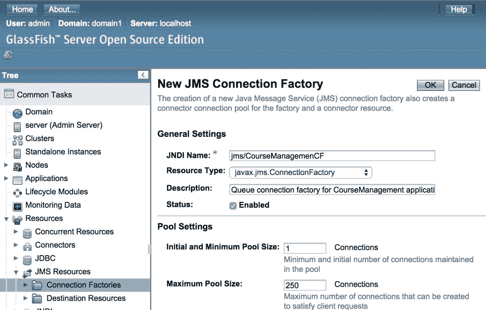

图 10.1：创建 JMS 连接工厂

输入工厂的 JNDI 名称为`jms/CourseManagementCF`，并选择 javax.jms.ConnectionFactory 作为资源类型。保留池设置的默认值。点击“确定”。

要创建队列和主题，转到“资源”|“JMS 资源”|“目的地资源”页面。点击“新建”按钮：

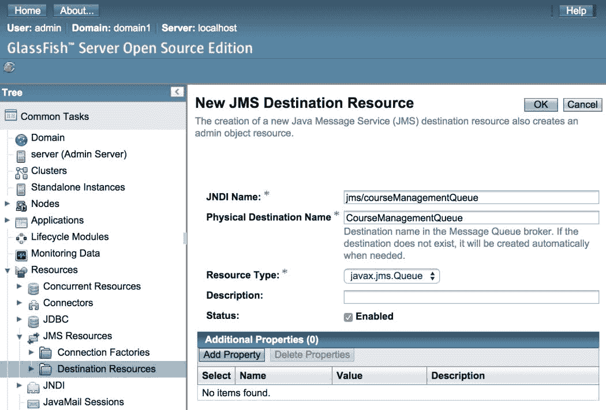

图 10.2：创建 JMS 队列

输入队列的 JNDI 名称为`jms/courseManagementQueue`，物理目的地名称为`CourseManagementQueue`，并选择 javax.jms.Queue 作为资源类型。点击“确定”以创建队列。

类似地，通过输入 JNDI 名称为`jms/courseManagementTopic`，物理目的地名称为`CourseManagementTopic`，并选择 javax.jms.Topic 作为资源类型来创建主题。

现在，你应该已经在目的地资源页面中配置了一个队列和一个主题：

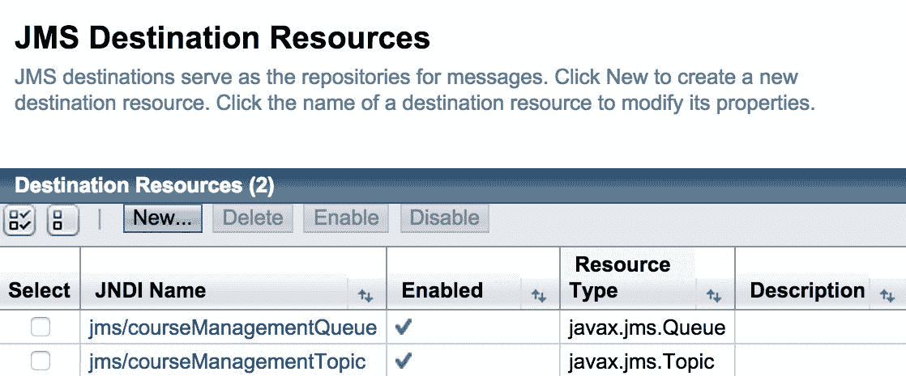

图 10.3：在 GlassFish 中创建的队列和主题

# 为 JMS 应用程序创建 JEE 项目

我们将看到使用 JMS API 的三种不同方式的示例。

在第一个示例中，我们将创建一个简单的`addCourse.jsp`页面，一个 JSP Bean 和一个实际执行 JMS 任务的`Service`类。

在第二个示例中，我们将使用 JSF 和托管 Bean。我们将在托管 Bean 中使用 JMS API。我们还将看到如何在 JSF 托管 Bean 中使用 JMS 注解。

在最后一个示例中，我们将使用 MDB 来消费 JMS 消息。

让我们从第一个示例开始，该示例使用 JSP、Bean 和 JMS API。通过选择“文件”|“新建”|“动态 Web 项目”或“文件”|“新建”|“其他”然后“Web”|“动态 Web 项目”来创建一个 Web 项目：

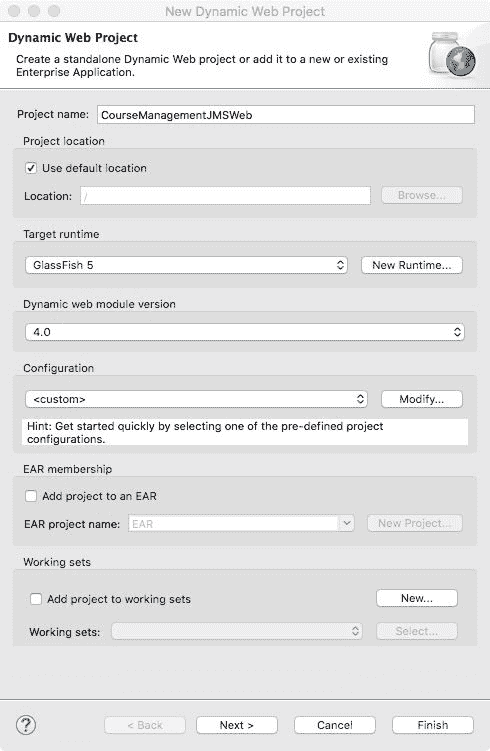

图 10.4：为 JMS 应用程序创建动态 Web 项目

输入项目名称为`CourseManagementJMSWeb`。确保目标运行时为 GlassFish。点击“下一步”，接受所有默认选项。点击“完成”以创建项目。

# 使用 JSP 和 JSP Bean 创建 JMS 应用程序

让我们先创建一个 JSP 页面，用于显示输入课程详情的表单。我们还将创建一个 JSP Bean 来处理表单数据。在项目资源管理器视图下的项目中的`WebContent`文件夹上右键单击，选择“新建”|“JSP 文件”。创建名为`addCourse.jsp`的 JSP 文件。

我们现在将创建`CourseDTO`和名为`CourseJSPBean`的 JSP bean。在`packt.jee.eclipse.jms.dto`包中创建`CourseDTO`类。添加`id`、`name`和`credits`属性，以及它们的 getter 和 setter 方法：

```java
import java.io.Serializable; 
public class CourseDTO implements Serializable { 
  private static final long serialVersionUID = 1L; 
  private int id; 
  private String name; 
  private int credits; 

  //getters and setters follow 
} 
```

在`packt.jee.eclipse.jms.jsp.beans`包中创建`CourseJSPBean`：

```java
import packt.jee.eclipse.jms.dto.CourseDTO; 

public class CourseJSPBean { 

  private CourseDTO course = new CourseDTO(); 

  public void setId(int id) { 
    course.setId(id); 
  } 
  public String getName() { 
    return course.getName(); 
  } 
  public void setName(String name) { 
    course.setName(name); 
  } 
  public int getCredits() { 
    return course.getCredits(); 
  } 
  public void setCredits(int credits) { 
    course.setCredits(credits); 
  } 
  public void addCourse() { 
    //TODO: send CourseDTO object to a JMS queue 
  } 
} 
```

我们将在`addCourse`方法中稍后实现发送`CourseDTO`对象的代码。现在，将以下代码添加到`addCourse.jsp`中：

```java
<%@ page language="java" contentType="text/html; charset=UTF-8" 
    pageEncoding="UTF-8"%> 
<%@ taglib uri="http://java.sun.com/jsp/jstl/core" prefix="c" %> 
<!DOCTYPE html PUBLIC "-//W3C//DTD HTML 4.01 Transitional//EN" 
 "http://www.w3.org/TR/html4/loose.dtd"> 
<html> 
<head> 
<meta http-equiv="Content-Type" content="text/html; charset=UTF- 
 8"> 
<title>Add Course</title> 
</head> 
<body> 
  <!-- Check if form is posted --> 
  <c:if test="${"POST".equalsIgnoreCase(pageContext.request.method) 
      && pageContext.request.getParameter("submit") != null}"> 

    <!-- Create CourseJSPBean -->   
    <jsp:useBean id="courseService" class="packt.jee.eclipse.jms.jsp_beans.CourseJSPBean" 
 scope="page"></jsp:useBean> 

    <!-- Set Bean properties with values from form submission --> 
    <jsp:setProperty property="name" name="courseService" 
     param="course_name"/>    <jsp:setProperty property="credits" name="courseService" 
     param="course_credits"/> 

    <!-- Call addCourse method of the bean --> 
    ${courseService.addCourse()} 
    <b>Course detailed are sent to a JMS Queue. It will be 
     processed later</b> 
  </c:if> 

  <h2>New Course:</h2> 

  <!-- Course data input form --> 
  <form method="post"> 
    <table> 
      <tr> 
        <td>Name:</td> 
        <td> 
          <input type="text" name="course_name"> 
        </td> 
      </tr> 
      <tr> 
        <td>Credits:</td> 
        <td> 
          <input type="text" name="course_credits"> 
        </td> 
      </tr> 
      <tr> 
        <td colspan="2"> 
          <button type="submit" name="submit">Add</button> 
        </td> 
      </tr> 
    </table> 
  </form> 

</body> 
</html> 
```

在 JSP 文件的顶部，我们检查表单是否已提交。如果是，我们则创建一个`CourseJSPBean`实例，并使用表单提交的值设置其属性。然后，我们调用 bean 的`addCourse`方法。

# 执行 addCourse.jsp

我们还没有添加任何代码将`Course`对象放入 JMS 队列。然而，如果你想测试 JSP 和 bean，请将项目添加到 Eclipse 中配置的 GlassFish 服务器。为此，在 Eclipse 的“服务器视图”中右键单击配置的服务器，然后选择“添加和移除...”选项。选择我们创建的 Web 项目，然后单击“完成”。确保服务器已启动，状态为[已启动，同步]：

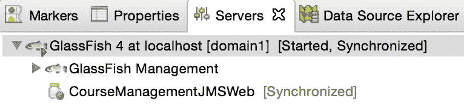

图 10.5：添加 Web 项目后 GlassFish 的状态

如果状态是重新发布，则右键单击服务器并选择“发布”选项。如果状态是重启，则右键单击服务器并选择“重启”选项。你可能不需要在添加项目后立即执行此操作，但在我们修改代码后，你可能需要重新发布或重启服务器，或者两者都要。所以，在你在 Eclipse 中执行代码之前，请密切关注服务器状态。

要执行`addCourse.jsp`，在项目资源管理器或编辑器中右键单击文件，然后选择“运行方式 | 在服务器上运行”选项。这将打开内置的 Eclipse 浏览器并在其中打开 JSP。你应该看到添加课程详情的表单。如果你点击“提交”按钮，你应该看到我们在 JSP 中添加的消息，当表单提交时。

现在我们添加一个类来将课程详情发送到 JMS 队列。

# 实现 JMS 队列发送类

让我们在`packt.jee.eclipse.jms`包中创建名为`CourseQueueSender`的类，内容如下：

```java
package packt.jee.eclipse.jms; 

//skipped imports 

public class CourseQueueSender { 
  private QueueConnection connection; 
  private QueueSession session; 
  private Queue queue; 

  public CourseQueueSender() throws Exception { 
    //Create JMS Connection, session, and queue objects 
    InitialContext initCtx = new InitialContext(); 
    QueueConnectionFactory connectionFactory = 
     (QueueConnectionFactory)initCtx. 
          lookup("jms/CourseManagemenCF"); 
    connection = connectionFactory.createQueueConnection(); 
    connection.start(); 
    session = connection.createQueueSession(false, 
     Session.AUTO_ACKNOWLEDGE); 
    queue = (Queue)initCtx.lookup("jms/courseManagementQueue"); 

  } 

  public void close() { 
    if (connection != null) { 
      try { 
        connection.close(); 
      } catch (JMSException e) { 
        e.printStackTrace(); 
      } 
    } 
  } 
  @Override 
  protected void finalize() throws Throwable { 
    close(); //clean up 
    super.finalize(); 
  } 

  public void sendAddCourseMessage (CourseDTO course) throws 
   Exception { 
    //Send CourseDTO object to JMS Queue 
    QueueSender sender = session.createSender(queue); 
    ObjectMessage objMessage = 
     session.createObjectMessage(course); 
    sender.send(objMessage); 
  } 
} 
```

在构造函数中，我们查找 JMS 连接工厂并创建连接。然后我们创建一个 JMS 会话，并使用我们在前面的部分中创建队列时使用的 JNDI 名称查找队列。

注意，我们在构建`InitialContext`时没有指定任何配置属性。这是因为代码是在托管 JMS 提供者的 GlassFish Server 的同一实例中执行的。如果你正在连接到托管在另一个 GlassFish Server 中的 JMS 提供者，那么你将不得不指定配置属性，特别是对于远程主机，例如：

```java
Properties jndiProperties = new Properties(); 
jndiProperties.setProperty("org.omg.CORBA.ORBInitialHost", 
 "<remote_host>"); 
//target ORB port. default is 3700 in GlassFish 
jndiProperties.setProperty("org.omg.CORBA.ORBInitialPort", 
 "3700"); 

InitialContext ctx = new InitialContext(jndiProperties); 
```

`CourseQueueSender.sendAddcourseMessage` 方法创建了 `QueueSender` 和 `ObjectMessage` 的实例。由于本例中的消息生产者和消费者都是 Java，我们使用了 `ObjectMessage`。然而，如果你需要向一个消息系统发送消息，而该消息将由非 Java 消费者消费，那么你可以从 Java 对象创建 JSON 或 XML，并发送 `TextMessage`。我们已经在 第九章，*创建 Web 服务* 中看到了如何使用 JAXB 和 JSON-B 将 Java 对象序列化为 JSON 和 XML。

现在，让我们修改 `CourseJSPBean` 中的 `addCourse` 方法，以使用 `CourseQueueSender` 类发送 JMS 消息。请注意，我们可以在 `CouseJSPBean` 的类中创建 `CourseQueueSender` 的实例，但每次请求页面时都会创建一个 bean。因此，`CourseQueueSender` 将频繁创建，JMS 连接工厂和队列的查找也将频繁执行，这是不必要的。因此，我们将创建一个 `CourseQueueSender` 的实例并将其保存在 HTTP 会话中。然后，我们将修改 `addCourse` 方法以接受 `HttpServletRequest` 作为参数。我们还将从请求中获取 `HttpSession` 对象：

```java
  public void addCourse(HttpServletRequest request) throws 
   Exception { 
    //get HTTP session 
    HttpSession session = request.getSession(true); 

    //look for instance of CourseQueueSender in Session 
    CourseQueueSender courseQueueSender = 
     (CourseQueueSender)session 
                        getAttribute("CourseQueueSender"); 
    if (courseQueueSender == null) { 
      //Create instance of CourseQueueSender and save in Session 
      courseQueueSender = new CourseQueueSender(); 
      session.setAttribute("CourseQueueSender", 
       courseQueueSender); 
    } 

    //TODO: perform input validation 
    if (courseQueueSender != null) { 
      try { 
        courseQueueSender.sendAddCourseMessage(course); 
      } catch (Exception e) { 
        e.printStackTrace(); 
        //TODO: log exception 
      } 
    } 
  } 
```

如果我们在会话中找不到 `CourseQueueSender` 对象，那么我们将创建一个并将其保存在会话中。

我们需要修改 `addcourse.jsp` 中对 `addCourse` 方法的调用。目前，我们没有向该方法传递任何参数。然而，随着对 `addCourse` 方法的先前更改，我们需要向其中传递 `HttpServletRequest` 对象。JSP 有一个内置属性 `pageContext`，它提供了对 `HttpServletRequest` 对象的访问。因此，修改 `addCourse.jsp` 中调用 `courseService.addCourse` 的代码如下：

```java
<!-- Call addCourse method of the bean --> 
${courseService.addCourse(pageContext.request)} 
```

我们现在可以测试我们的代码，尽管消息已发送到队列，但我们还没有实现任何消费者来从队列中接收它们。因此，让我们为我们的 `Course` 队列实现一个 JMS 队列消费者。

# 实现 JMS 队列接收类

让我们在 `packt.jee.eclipse.jms` 包中创建 `CourseQueueReceiver` 类，其内容如下：

```java
public class CourseQueueReceiver { 

  private QueueConnection connection; 
  private QueueSession session; 
  private Queue queue; 

  private String receiverName; 

  public CourseQueueReceiver(String name) throws Exception{ 

    //save receiver name 
    this.receiverName = name; 

    //look up JMS connection factory 
    InitialContext initCtx = new InitialContext(); 
    QueueConnectionFactory connectionFactory = 
 (QueueConnectionFactory)initCtx.lookup("jms/CourseManagemenCF"); 

    //create JMS connection 
    connection = connectionFactory.createQueueConnection(); 
    connection.start(); 

    //create JMS session 
    session = connection.createQueueSession(false, 
     Session.AUTO_ACKNOWLEDGE); 
    //look up queue 
    queue = (Queue)initCtx.lookup("jms/courseManagementQueue"); 

    topicPublisher = new CourseTopicPublisher(); 

    QueueReceiver receiver = session.createReceiver(queue); 
    //register message listener 
    receiver.setMessageListener(new MessageListener() { 

      @Override 
      public void onMessage(Message message) { 
        //we expect ObjectMessage here; of type CourseDTO 
        //skipping validation 
        try { 
          CourseDTO course = (CourseDTO) 
           ((ObjectMessage)message).getObject();          //process addCourse action. For example, save it in the 
           database          System.out.println("Received addCourse message for Course name - " + 
               course.getName() + " in Receiver " + receiverName); 

        } catch (Exception e) { 
          e.printStackTrace(); 
          //TODO: handle and log exception 
        } 
      } 
    }); 
  } 

  public void stop() { 
    if (connection != null) { 
      try { 
        connection.close(); 
      } catch (JMSException e) { 
        e.printStackTrace(); 
        //TODO: log exception 
      } 
    } 
  } 
}
```

查找连接工厂和队列的代码与`CourseQueueSender`中的代码类似。注意构造函数接受一个`name`参数。我们实际上并不需要使用 JMS API，但我们将使用它作为`CourseQueueReceiver`类实例的标识符。我们在构造函数中注册一个消息监听器，并在监听器类的`onMessage`方法中从消息中获取`CourseDTO`对象并将消息打印到控制台。当我们执行代码时，这个消息将出现在 Eclipse 中的 GlassFish 控制台中。为了使示例简单，我们没有实现将`Course`信息保存到数据库的代码，但你可以使用我们在第四章，“创建 JEE 数据库应用程序”中学到的 JDBC 或 JDO API 来实现。

我们需要在应用程序启动时实例化`CourseQueueReceiver`类，以便它开始监听消息。实现这一种方法是在一个启动时加载的 servlet 中。

让我们在`packt.jee.eclipse.jms.servlet`包中创建`JMSReceiverInitServlet`类。我们将使用注解标记这个 servlet 在启动时加载，并在`init`方法中实例化`CourseQueueReceiver`：

```java
package packt.jee.eclipse.jms.servlet; 

//skipped imports 

@WebServlet(urlPatterns="/JMSReceiverInitServlet", loadOnStartup=1) 
public class JMSReceiverInitServlet extends HttpServlet { 
  private static final long serialVersionUID = 1L; 

  private CourseQueueReceiver courseQueueReceiver = null; 

    public JMSReceiverInitServlet() { 
        super(); 
    } 

    @Override 
    public void init(ServletConfig config) throws ServletException 
 { 
      super.init(config); 
      try { 
      courseQueueReceiver = new CourseQueueReceiver("Receiver1"); 
    } catch (Exception e) { 
      log("Error creating CourseQueueReceiver", e); 
    } 
    } 

    @Override 
    public void destroy() { 
      if (courseQueueReceiver != null) 
        courseQueueReceiver.stop(); 
      super.destroy(); 
    } 
} 
```

再次在服务器上发布项目并执行`addCourse.jsp`（参见本章的*执行 addCourse.jsp*部分）。切换到 Eclipse 中的控制台视图。你应该会看到我们在`CourseQueueReceiver`中的`onMessage`方法中打印的消息：

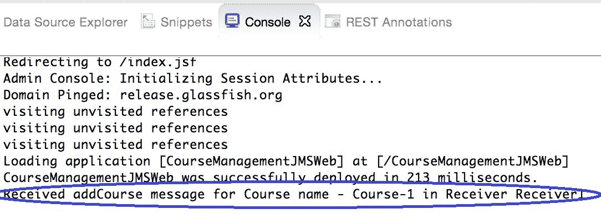

图 10.6：JMS 接收器类的控制台消息示例

# 添加多个队列监听器

队列用于点对点通信，但这并不意味着一个队列不能有多个监听器。然而，只有一个监听器会接收到消息。此外，也不能保证同一个监听器每次都会接收到消息。如果你想测试这一点，在`JMSReceiverInitServlet`中添加一个`CourseQueueReceiver`的更多实例。让我们添加第二个实例，并给它一个不同的名字，比如`Receiver2`：

```java
@WebServlet(urlPatterns="/JMSReceiverInitServlet", loadOnStartup=1) 
public class JMSReceiverInitServlet extends HttpServlet { 
  private CourseQueueReceiver courseQueueReceiver = null; 
  private CourseQueueReceiver courseQueueReceiver1 = null; 

    @Override 
    public void init(ServletConfig config) throws ServletException 
{ 
      super.init(config); 
      try { 
        //first instance of CourseQueueReceiver 
      courseQueueReceiver = new CourseQueueReceiver("Receiver1"); 
      //create another instance of CourseQueueReceiver with a 
       different name 
      courseQueueReceiver1 = new CourseQueueReceiver("Receiver2"); 

    } catch (Exception e) { 
      log("Error creating CourseQueueReceiver", e); 
    } 
    } 

    @Override 
    public void destroy() { 
      if (courseQueueReceiver != null) 
        courseQueueReceiver.stop(); 
      if (courseQueueReceiver1 != null) 
        courseQueueReceiver1.stop(); 
      super.destroy(); 
    } 

    //rest of the code remains the same 
} 
```

重新发布项目，执行`addCourse.jsp`，并添加一些课程。检查控制台消息。你可能看到一些消息被`Receiver1`接收，而其他则被`Receiver2`接收：

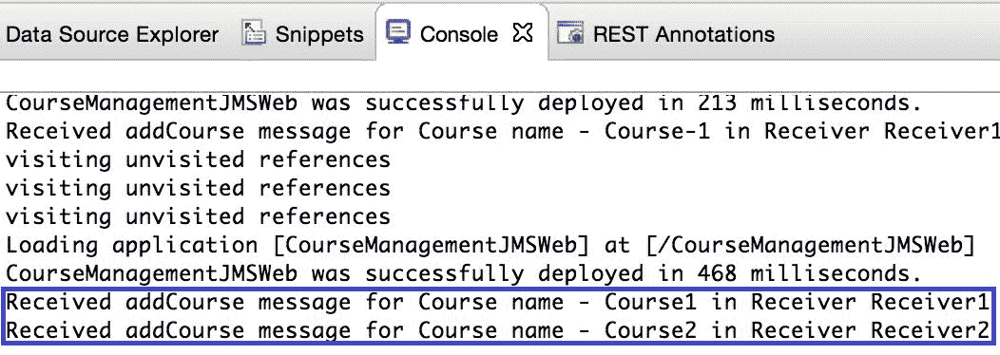

图 10.7：控制台输出显示多个 JMS 接收器正在监听 JMS 队列

# 实现 JMS 主题发布者

假设我们想在添加新课程时通知一组应用程序。这样的用例最好通过一个**JMS 主题**来实现。一个主题可以有多个订阅者。当消息添加到主题时，所有订阅者都会收到相同的消息。这与队列不同，在队列中只有一个队列监听器会收到消息。

发布消息到主题和订阅消息的步骤与队列的步骤非常相似，只是类不同，在某些情况下，方法名也不同。

让我们实现一个主题发布者，当在`CourseQueueReceiver`类中实现的监听器的`onMessage`方法成功处理添加课程的消息时，我们将使用它。

在`packt.jee.eclipse.jms`包中创建名为`CourseTopicPublisher`的类，内容如下：

```java
package packt.jee.eclipse.jms; 

//skipped imports 

public class CourseTopicPublisher { 
  private TopicConnection connection; 
  private TopicSession session; 
  private Topic topic; 

  public CourseTopicPublisher() throws Exception { 
    InitialContext initCtx = new InitialContext(); 
    TopicConnectionFactory connectionFactory = 
     (TopicConnectionFactory)initCtx. 
        lookup("jms/CourseManagemenCF"); 
    connection = connectionFactory.createTopicConnection(); 
    connection.start(); 
    session = connection.createTopicSession(false, 
     Session.AUTO_ACKNOWLEDGE); 
    topic = (Topic)initCtx.lookup("jms/courseManagementTopic"); 
  } 

  public void close() { 
    if (connection != null) { 
      try { 
        connection.close(); 
      } catch (JMSException e) { 
        e.printStackTrace();. 
      } 
    } 
  } 

  public void publishAddCourseMessage (CourseDTO course) throws 
   Exception { 
    TopicPublisher sender = session.createPublisher(topic); 
    ObjectMessage objMessage = 
     session.createObjectMessage(course); 
    sender.send(objMessage); 
  } 
} 
```

代码相当简单且易于理解。现在让我们修改我们实现的队列接收器类`CourseQueueReceiver`，在队列中的消息成功处理后，从`onMessage`方法向主题发布消息：

```java
public class CourseQueueReceiver { 

  private CourseTopicPublisher topicPublisher; 

  public CourseQueueReceiver(String name) throws Exception{ 

    //code to lookup connection factory, create session, 
    //and look up queue remains unchanged. Skipping this code 

    //create topic publisher 
    topicPublisher = new CourseTopicPublisher(); 

    QueueReceiver receiver = session.createReceiver(queue); 
    //register message listener 
    receiver.setMessageListener(new MessageListener() { 

      @Override 
      public void onMessage(Message message) { 
        //we expect ObjectMessage here; of type CourseDTO 
        //Skipping validation 
        try { 
          //code to process message is unchanged. Skipping it 

          //publish message to topic 
          if (topicPublisher != null) 
            topicPublisher.publishAddCourseMessage(course); 

        } catch (Exception e) { 
          e.printStackTrace(); 
          //TODO: handle and log exception 
        } 
      } 
    }); 
  } 

  //remaining code is unchanged. Skipping it 
} 
```

# 实现 JMS 主题订阅者

我们现在将实现一个主题订阅者类来接收发布到我们之前创建的主题的消息。在`packt.jee.eclipse.jms`包中创建名为`CourseTopicSubscriber`的类，内容如下：

```java
package packt.jee.eclipse.jms; 
//skipping imports 
public class CourseTopicSubscriber { 

  private TopicConnection connection; 
  private TopicSession session; 
  private Topic topic; 

  private String subscriberName; 

  public CourseTopicSubscriber(String name) throws Exception{ 

    this.subscriberName = name; 

    InitialContext initCtx = new InitialContext(); 
    TopicConnectionFactory connectionFactory = 
 (TopicConnectionFactory)initCtx.lookup("jms/CourseManagemenCF"); 
    connection = connectionFactory.createTopicConnection(); 
    connection.start(); 
    session = connection.createTopicSession(false, 
     Session.AUTO_ACKNOWLEDGE); 
    topic = (Topic)initCtx.lookup("jms/courseManagementTopic"); 

    TopicSubscriber subscriber = session.createSubscriber(topic); 
    subscriber.setMessageListener(new MessageListener() { 

      @Override 
      public void onMessage(Message message) { 
        //we expect ObjectMessage here; of type CourseDTO 
        //skipping validation 
        try { 
          CourseDTO course = (CourseDTO) 
           ((ObjectMessage)message).getObject();          //process addCourse action. For example, save it in 
           database          System.out.println("Received addCourse notification for 
           Course name - "              + course.getName() + " in Subscriber " + 
               subscriberName); 

        } catch (JMSException e) { 
          e.printStackTrace(); 
          //TODO: handle and log exception 
        } 
      } 
    }); 
  } 

  public void stop() { 
    if (connection != null) { 
      try { 
        connection.close(); 
      } catch (JMSException e) { 
        e.printStackTrace(); 
        //TODO: log exception 
      } 
    } 
  } 
} 
```

再次，订阅主题的 JMS API 与`CourseQueueReceiver`中的类似，但类名和方法名不同。我们还通过名称标识订阅者，以便我们知道哪个类的实例接收了消息。

在前面的示例中，我们通过调用`TopicSession.createSubscriber`创建了主题订阅者。在这种情况下，订阅者将接收主题的消息，只要订阅者处于活动状态。如果订阅者变得不活跃然后再次活跃，它将丢失在该期间发布的主题消息。如果您想确保订阅者接收所有消息，您需要使用`TopicSession.createDurableSubscriber`创建一个持久订阅。除了主题名称外，此方法还接受订阅者名称作为第二个参数。有关更多信息，请参阅[`javaee.github.io/javaee-spec/javadocs/javax/jms/TopicSession.html#createDurableSubscriber-javax.jms.Topic-java.lang.String-`](https://javaee.github.io/javaee-spec/javadocs/javax/jms/TopicSession.html#createDurableSubscriber-javax.jms.Topic-java.lang.String-)。

我们将在`JMSReceiverInitServlet`中创建`CourseTopicSubscriber`类的两个实例（因此将有两个主题订阅者）。这两个实例将在应用程序启动时开始监听消息（servlet 在启动时加载）：

```java
@WebServlet(urlPatterns="/JMSReceiverInitServlet", loadOnStartup=1) 
public class JMSReceiverInitServlet extends HttpServlet { 
  private CourseQueueReceiver courseQueueReceiver = null; 
  private CourseTopicSubscriber courseTopicSubscriber = null; 
  private CourseQueueReceiver courseQueueReceiver1 = null; 
  private CourseTopicSubscriber courseTopicSubscriber1 = null; 

    @Override 
    public void init(ServletConfig config) throws ServletException 
 { 
      super.init(config); 
      try { 
      courseQueueReceiver = new CourseQueueReceiver("Receiver1"); 
      courseQueueReceiver1 = new CourseQueueReceiver("Receiver2"); 
      courseTopicSubscriber = new 
       CourseTopicSubscriber("Subscriber1");      courseTopicSubscriber1 = new 
       CourseTopicSubscriber("Subscriber2"); 

    } catch (Exception e) { 
      log("Error creating CourseQueueReceiver", e); 
    } 
    } 

    //remaining code is unchanged. Skipping it 
} 
```

当应用程序启动时，我们现在有两个队列监听器和两个主题监听器就绪。重新发布项目，执行`addCourse.jsp`，并添加一门课程。检查 Eclipse 的控制台视图中的消息。您将看到发布在主题中的消息被所有订阅者接收，但发布在队列中的相同消息只被一个接收器接收：

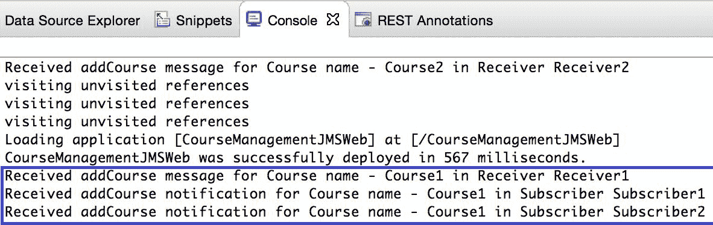

图 10.8：控制台输出显示多个 JMS 接收器正在监听 JMS 队列和主题

# 使用 JSF 和 CDI 豆创建 JMS 应用程序

在本节中，我们将看到如何使用 JSF 和**组件依赖注入**（**CDI**）组件创建一个 JMS 应用程序。使用 CDI 组件，我们可以减少使用 JMS API 编写的代码，因为我们可以使用注解来注入诸如 JMS 连接工厂、队列和主题等对象。一旦我们获得了这些对象的引用，发送或接收数据的步骤与上一节中讨论的相同。因此，本节中的示例没有列出完整的代码。对于完整的源代码，请下载本章的源代码。

为了使我们的项目能够使用 JSF，我们需要创建`web.xml`并在其中添加 JSF servlet 定义和映射。在项目上右键单击并选择 Java EE Tools | Generate Deployment Descriptor Stub 选项。这将在`WebContent/WEB-INF`文件夹中创建`web.xml`。在`web.xml`中添加以下 servlet 定义和映射（在`web-app`标签内）：

```java
  <servlet> 
    <servlet-name>JSFServelt</servlet-name> 
    <servlet-class>javax.faces.webapp.FacesServlet</servlet-class> 
    <load-on-startup>1</load-on-startup> 
  </servlet> 

  <servlet-mapping> 
    <servlet-name>JSFServelt</servlet-name> 
    <url-pattern>*.xhtml</url-pattern> 
  </servlet-mapping> 
```

为了使 CDI（Contexts and Dependency Injection）组件工作，我们需要在`META-INF`文件夹中创建一个`beans.xml`文件。你可以在 Eclipse 项目中`WebContent`文件夹下找到`META-INF`文件夹。让我们在`META-INF`中创建一个包含以下内容的`bean.xml`文件：

```java
<beans xmlns="http://java.sun.com/xml/ns/javaee" 
  xmlns:xsi="http://www.w3.org/2001/XMLSchema-instance"
  xsi:schemaLocation="
    http://java.sun.com/xml/ns/javaee
    http://java.sun.com/xml/ns/javaee/beans_1_0.xsd">
</beans>
```

我们现在将为 JSF 页面创建两个 CDI（Contexts and Dependency Injection）组件。第一个是`CourseManagedMsgSenderBean`。第二个是`CourseJSFBean`，它将在 JSF 页面中被引用。

在`packt.jee.eclipse.jms.jsf_bean`包中创建`CourseManagedMsgSenderBean`类，内容如下：

```java
package packt.jee.eclipse.jms.jsf_bean;

import javax.enterprise.context.SessionScoped;
import javax.inject.Named;
//skipped other imports 

@Named("courseMessageSender")
@SessionScoped
public class CourseManagedMsgSenderBean implements Serializable {

  @Resource(name = "jms/CourseManagementCF")
  private QueueConnectionFactory connectionFactory;
  @Resource(lookup = "jms/courseManagementQueue")
  private Queue queue;

  QueueConnection connection;
  QueueSession session;
  Exception initException = null;

  @PostConstruct
  public void init() {
    try {
      connection = connectionFactory.createQueueConnection();
      connection.start();
      session = connection.createQueueSession(false, Session.AUTO_ACKNOWLEDGE);
    } catch (Exception e) {
      initException = e;
    }
  }

  @PreDestroy
  public void cleanup() {
    if (connection != null) {
      try {
        connection.close();
      } catch (JMSException e) {
        e.printStackTrace();
        //TODO: log exception
      }
    }
  }

  public void addCourse(CourseDTO courseDTO) throws Exception {

    if (initException != null)
      throw initException;

    QueueSender sender = session.createSender(queue);
    ObjectMessage objMessage = session.createObjectMessage(courseDTO);
    sender.send(objMessage);
  }
}
```

注意，JMS 连接工厂和队列对象是通过`@Resource`注解注入的。我们使用了`@PostConstruct`注解来创建一个 JMS 连接和会话，以及`@PreDestroy`注解来进行清理操作。`addCourse`方法与我们在上一节中实现的`CourseQueueSender`类中的代码类似。

现在让我们在`packt.jee.eclipse.jms.jsf_bean`包中创建`CourseJSFBean`类，内容如下：

```java
package packt.jee.eclipse.jms.jsf_bean;

import javax.enterprise.context.RequestScoped;
import javax.inject.Inject;
import javax.inject.Named;

import packt.jee.eclipse.jms.dto.CourseDTO;;

@Named("course")
@RequestScoped
public class CourseJSFBean {
  private CourseDTO courseDTO = new CourseDTO();

  @Inject
  private CourseManagedMsgSenderBean courseMessageSender;

  public String getName() {
    return this.courseDTO.getName();
  }
  public void setName(String name) {
    this.courseDTO.setName(name); 
  }
  public int getCredits() {
    return this.courseDTO.getCredits();
  }
  public void setCredits(int credits) {
    this.courseDTO.setCredits(credits);;
  }

  public void addCourse() throws Exception {
    //skipping validation
    //TODO: handle exception properly and show error message
    courseMessageSender.addCourse(courseDTO);
  }
}
```

使用`@Inject`注解将`CourseManagedMsgSenderBean`的实例注入到`CourseJSFBean`中。`addCourse`方法简单地调用相同名称的方法在`CourseManagedMsgSenderBean`中。

最后，让我们在`WebContents`文件夹中创建`addCourse.xhtml`，内容如下：

```java
<html  

 > 

<head> 
  <title>Add Course</title> 
</head> 

 <body> 
  <h2>Course Details</h2> 

  <h:form> 
    <table> 
      <tr> 
        <td>Name:</td> 
        <td> 
          <h:inputText id="course_name" value="#{course.name}"/> 
        </td> 
      </tr> 
      <tr> 
        <td>Credits:</td> 
        <td> 
          <h:inputText id="course_credits" 
           value="#{course.credits}"/> 
        </td> 
      </tr> 
      <tr> 
        <td colspan="2"> 
            <h:commandButton value="Submit" 
             action="#{course.addCourse}"/> 
        </td> 
      </tr> 
    </table> 
  </h:form> 

</body> 

</html> 
```

表单字段绑定到`CourseJSFBean`中的字段。当点击提交按钮时，将调用相同 bean 中的`addCourse`方法，该方法将消息放入 JMS 队列。

重新发布项目并通过右键单击`addCourse.xhtml`选择运行方式 | 在服务器上运行来执行它。添加一门课程并查看在 Eclipse 的 GlassFish 控制台视图中打印的消息。

# 使用消息驱动 Bean（MDBs）消费 JMS 消息

**消息驱动 Bean（MDB**）使消费 JMS 消息变得容易得多。只需使用几个注解并实现`onMessage`方法，你就可以使任何 Java 对象成为 JMS 消息的消费者。在本节中，我们将实现一个 MDB 来从`Course`队列中消费消息。要实现 MDB，我们需要创建一个 EJB 项目。从主菜单中选择“文件 | 新建 | EJB 项目”：

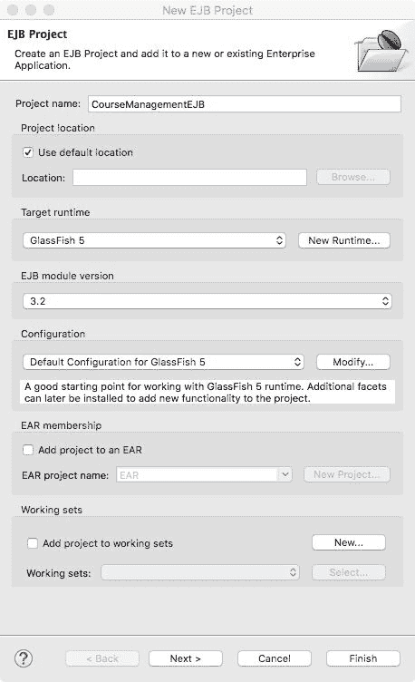

图 10.9：创建一个 EJB 项目以实现消息驱动 Bean（MDB）

将项目名称输入为`CourseManagementEJB`。点击“下一步”。在随后的页面上接受默认值，并在最后一页点击“完成”。

右键单击项目，选择“新建 | 消息驱动 Bean”选项。这会打开 MDB 创建向导：

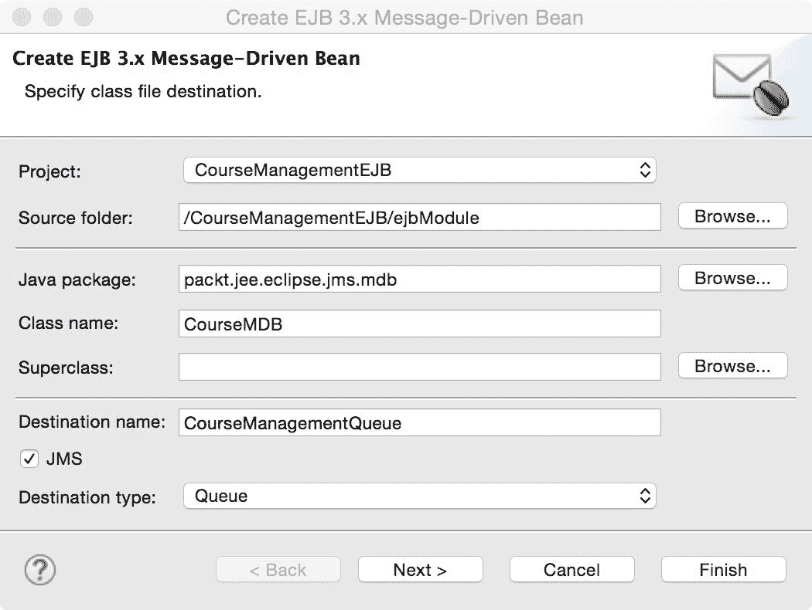

图 10.10：MDB 创建向导 – 类文件信息

将`packt.jee.eclipse.jms.mdb`作为 Java 包名，将`CourseMDB`作为类名。保持目标类型为队列。

目标名称是在创建队列时指定的物理目标名称，而不是 JNDI 名称：

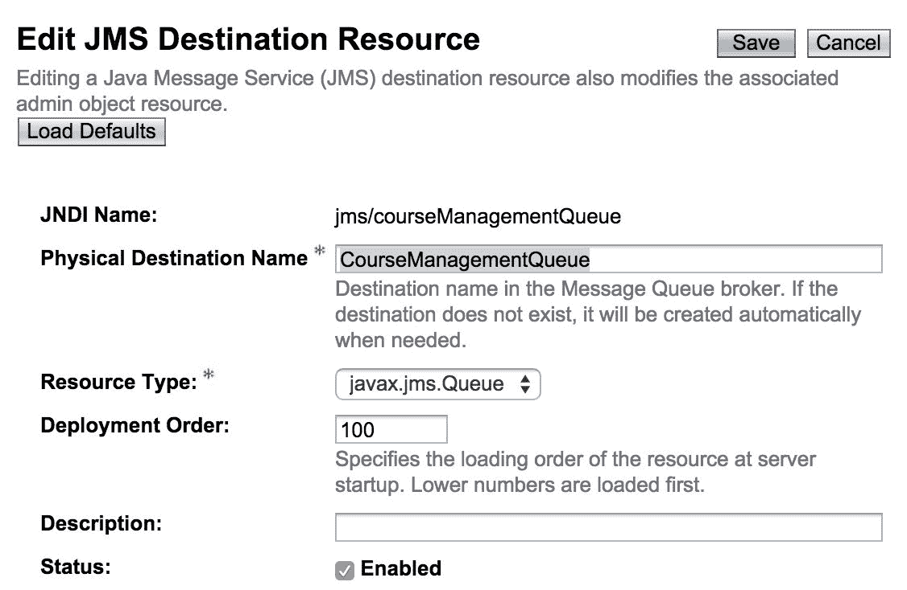

图 10.11：GlassFish 管理控制台中的 JMS 队列物理目标名称

将目标类型输入为`CourseManagementQueue`。点击“下一步”。在第二页接受默认值并点击“完成”。向导生成以下代码：

```java
@MessageDriven( 
    activationConfig = { 
      @ActivationConfigProperty(propertyName = "destinationType", 
            propertyValue = "javax.jms.Queue"), 
      @ActivationConfigProperty(propertyName = "destination", 
            propertyValue = "CourseManagementQueue") 
    }, 
    mappedName = "jms/courseManagementQueue") 
public class CourseMDB implements MessageListener { 

    /** 
     * Default constructor. 
     */ 
    public CourseMDB() { 
        // TODO Auto-generated constructor stub 
    } 

  /** 
     * @see MessageListener#onMessage(Message) 
     */ 
    public void onMessage(Message message) { 
        System.out.println("addCourse message received in 
         CourseMDB"); 

    } 

} 
```

该类使用`@MessageDriven`注解，并在向导中指定了`activationConfig`和 JMS 目标参数。它还创建了`onMessage`方法。在这个方法中，我们只是打印出 MDB 接收到的用于添加课程的消息。为了处理本类中的`ObjectMessage`，我们需要将`CourseDTO`类重构为一个共享的`.jar`文件，在 EJB 和 Web 项目之间。这留作读者的练习。

JEE 容器为单个 MDB 类创建一个 MDB 对象池。传入的消息可以由池中的任何一个 MDB 实例处理。这有助于构建可扩展的消息处理应用程序。

如果你想测试 MDB，请将项目添加到在 Eclipse 中配置的 GlassFish 服务器。为此，在 Eclipse 的“服务器”视图中右键单击配置的服务器，并选择“添加和移除...”选项。选择我们创建的`CourseManagementEJB`项目并点击“完成”。确保服务器已启动且状态为[已启动，同步]。你还需要将`CourseManagementJMSWeb`项目添加到服务器，因为我们有 JSF 和 JSP 页面在该项目中添加课程。从`CourseManagementJMSWeb`项目运行`addCourse.xhtml`或`addCourse.jsp`，添加课程，并在 Eclipse 中的 GlassFish 控制台检查从消息接收器和本节中创建的 MDB 打印的消息。然而，请注意，无论是 MDB 还是我们在`CourseManagementJMSWeb`中开发的队列监听器之一，都将接收消息，而不是所有接收器。

# 摘要

消息系统可以是一个强大的工具，用于整合不同的应用程序。它提供了一个异步的编程模型。客户端不需要等待服务器的响应，服务器也不一定会在客户端发送请求的同时处理这些请求。消息系统对于构建可扩展的应用程序和批量处理也非常有用。JMS 提供了统一的 API 来访问不同的消息系统。

在本章中，我们学习了如何从队列发送和接收消息，以及如何从主题发布和订阅消息。使用 JMS API 有众多不同的方式。我们首先从基本的 JMS API 开始，然后学习了注解如何帮助减少一些代码。我们还学习了如何使用消息驱动 Bean（MDB）来消费消息。

在下一章中，我们将看到一些用于分析 Java 应用程序 CPU 和内存使用情况的技巧和工具。
