# 第十三章：云中部署 JEE 应用程序

在上一章中，我们学习了如何开发 JEE 微服务并将它们部署到 Docker 容器中。

在本章中，我们将学习如何在云中部署 JEE 应用程序，具体来说是在**亚马逊网络服务 (AWS**)云和谷歌云平台中，使用 Eclipse 工具。重点将更多地放在使用 Eclipse 工具部署 JEE 应用程序在云上，而不是学习特定的云平台。

在本章中，我们将涵盖以下主题：

+   在 AWS EC2 实例中部署 JEE 应用程序

+   在 AWS Beanstalk 中部署 REST 网络服务

+   在谷歌计算引擎中部署 Docker 容器

+   在谷歌应用引擎中部署 RESTful 网络服务

# 云中部署

在云中部署应用程序有许多优点，例如根据其负载扩展应用程序，以及无需维护自己的数据中心或物理机器的所有好处。除了托管应用程序和灵活性之外，大多数云平台还提供数据库、文件存储、消息传递等服务，这些服务可以轻松集成到您的应用程序中。

云平台提供的部署服务可以大致分为以下几类：

+   **基础设施即服务 (IaaS)**: 在这项服务中，您将获得完全控制的**虚拟机 (VMs**)。您可以在它们上安装任何软件并设置负载均衡、存储、网络和安全。这就像在云中拥有自己的数据中心一样。IaaS 的例子包括亚马逊**弹性计算云 (EC2**)和谷歌计算引擎。

+   **平台即服务 (PaaS)**: 在这项服务中，您将获得预装操作系统和服务器软件的虚拟机。负载均衡、安全、网络等服务也为您预先配置（或使配置变得非常简单）。因此，您可以专注于应用程序的部署。例如，您可以取一个 WAR 文件并直接在 PaaS 中部署它。PaaS 的例子包括亚马逊弹性豆茎和谷歌应用引擎。

虽然 IaaS 提供了更多的灵活性，但它的配置比 PaaS 更困难。

在以下章节中，我们将看到如何在 AWS 和谷歌云中部署上述类型的 JEE 应用程序。

注意

本书，尤其是本章，解释了开发和测试的部署，而不是生产部署。生产部署是一个庞大而复杂的话题，需要考虑许多因素，如安全性、扩展性等，这些都不在本书的范围之内。

您需要拥有您想要使用的云服务提供商的账户才能使用服务。根据您使用的服务和服务器负载，云部署可能会花费您很多钱。然而，几乎所有的云提供商都提供免费服务，以便您可以尝试它们一段时间。为了遵循本章中的示例，请确保您有 AWS 云([`aws.amazon.com/`](https://aws.amazon.com/))和谷歌云平台([`cloud.google.com`](https://cloud.google.com))的账户。

# 在 AWS 云中部署

我们将在 AWS 中首先创建一个用户组，并在其中创建一个用户。当您设置用户组的权限时，该组中的所有用户也将获得相同的权限。

# 创建用户组和用户

我们将执行以下步骤来创建一个用户组：

1.  前往 AWS 管理控制台([`console.aws.amazon.com/`](https://console.aws.amazon.com/))并登录。

1.  从顶部的菜单中选择“服务 | IAM（身份与访问管理）”。

1.  从左侧的列表中选择“组”。

1.  点击“创建新组”按钮。

1.  按照向导指定组的名称并附加访问策略。让我们将组命名为`aws_eclipse_users`。

1.  选择组的“管理员访问策略”。

我们将执行以下步骤来创建一个用户：

1.  从左侧的列表中选择“用户”，然后点击“添加用户”按钮。

1.  将用户名设置为 aws_eclipse_user。

1.  在访问类型选项中，选择 AWS 管理控制台访问选项。如果您希望，可以关闭“需要密码重置”选项。

1.  点击“下一步：权限”按钮，然后选择我们之前创建的组，即 aws_eclipse_users。

1.  按照页面上的步骤完成工作流程，最终将引导您创建用户。

现在，您应该有具有管理员访问权限的 aws_eclipse_users 组和该组中的 aws_eclipse_user 用户。

下一步是为用户创建访问密钥。转到列出所有用户的页面（点击页面左侧的“用户”），然后点击用户 aws_eclipse_user。点击“安全凭证”选项卡，然后点击“创建访问密钥”按钮。它创建了一个访问密钥，并显示了访问密钥 ID 和秘密访问密钥。为将来使用保存此信息。AWS 为您提供下载包含此信息的 CSV 文件选项。

注意

访问 AWS 服务从 Eclipse 需要访问密钥 ID 和秘密访问密钥。这是 AWS 唯一显示秘密访问密钥的地方。如果您丢失了这些信息，以后将无法找回，所以请确保保存这些信息。

接下来，我们将添加一个安全组并指定相同的入站流量规则。在 AWS 管理控制台中，转到 服务 | EC2 | 网络 & 安全 | 安全组页面。点击 创建安全组 按钮。输入 安全组名称 为 `eclipse-dev`。输入任何描述（这是一个必填字段）。然后创建以下入站规则：

| 类型 | 协议 | 端口范围 | 源 |
| --- | --- | --- | --- |
| SSH | TCP | 22 | 任何地方 (*见下表中的说明*) |
| 自定义 TCP | TCP | 8080 | 任何地方 |

注意

上述 SSH 入站规则将允许从任何 IP 地址访问您的 EC2 实例。如果您想限制访问，请不要选择“任何地方”作为源，而是设置特定的 IP 地址，选择自定义。

因为本章解释了如何在 xloud 中部署 JEE 应用程序以进行开发和测试，所以源被选择为“任何地方”（任何 IP）。

前面的安全组将为端口 22 上的任何外部 IP 提供 SSH 访问，并为端口 8080 提供 TCP 访问。

# 安装 Eclipse 的 AWS 工具包

在本节中，我们将学习如何在 Eclipse 中安装 AWS 工具包插件。转到 Eclipse 菜单的 帮助 | Eclipse 市场位置.... 搜索 `AWS Toolkit`：

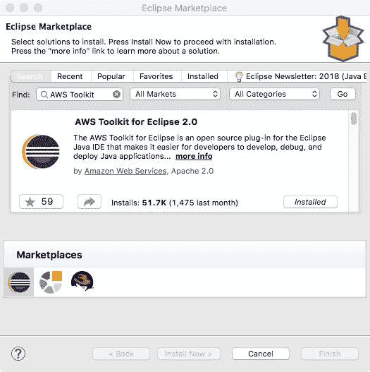

图 13.1：安装 Eclipse 的 AWS 工具包

安装插件。在本章的后面部分，我们将看到这个插件的多项功能。访问 [`docs.aws.amazon.com/toolkit-for-eclipse/v1/user-guide/welcome.html`](http://docs.aws.amazon.com/toolkit-for-eclipse/v1/user-guide/welcome.html) 获取完整文档。

我们需要使用上一节中创建的访问密钥 ID 和秘密访问密钥来配置插件。打开 Eclipse 首选项并转到 AWS 工具包首选项：

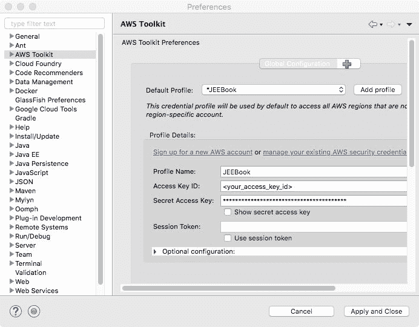

图 13.2：设置访问密钥 ID 和秘密访问密钥 AWS 工具包首选项

您可以使用默认配置文件或创建一个新的配置文件。输入访问密钥 ID 和秘密访问密钥，然后点击 应用和关闭 按钮。这些信息将被 Eclipse 插件用于访问 AWS 中您的配置信息。

一旦认证成功，您就可以在 Eclipse 中访问 AWS 控制台网页上大部分信息。切换到 AWS 管理视角（选择 窗口 | 视角 | 打开视角 或点击右上角的 打开视角 工具栏按钮）：

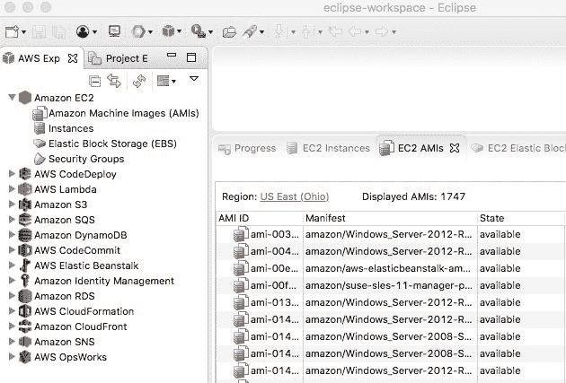

图 13.3：AWS 管理视角

在 AWS 探索器中展开 亚马逊 EC2 类别，您将看到查看 EC2 AMI、EC2 实例等选项。**亚马逊机器镜像**（**AMI**）可以被认为是一个模板，可以从它创建多个虚拟机实例。

# 启动 EC2 实例

现在，让我们从 AMI 创建一个 EC2 实例。如果 EC2 AMI 视图尚未在 Eclipse 的 AWS 管理视图中打开，请在 AWS 资源管理器中的 AMIs 节点上右键单击，并选择打开 EC2 AMIs 视图。此视图可能需要很长时间才能加载，因为有许多 AMI 可供选择。我们将选择一个在免费层（在您的试用期间）可用的 Linux AMI。不幸的是，在 Eclipse 视图中搜索此 AMI 并不容易，因为视图不显示或允许您根据描述搜索 AMI。这意味着您不能通过在搜索框中输入`linux`来搜索 AMI。令人惊讶的是，视图中的平台筛选选项也没有显示 Linux 选项，至少在撰写本书时是这样的。

我们将从 AMI ID `ami-f63b1193`创建一个实例（您可以在创建新实例时从 AWS 控制台网页中看到 AMI 列表的更好视图）。在搜索框中输入`ami-f63b1193`，您应该在视图中看到一个结果。右键单击 AMI 并选择启动选项：

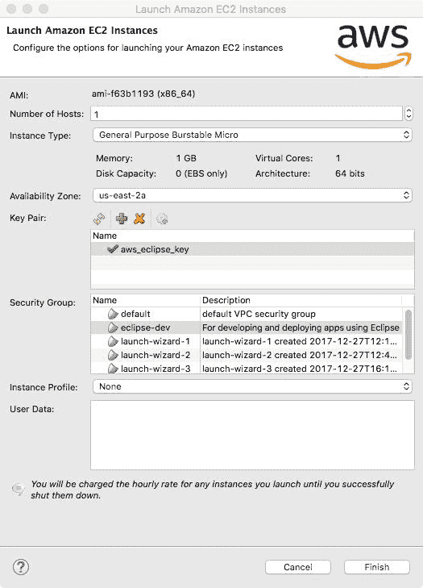

图 13.4：从 AMI 启动实例

选择合适的实例类型。在本例中，我们将选择通用可扩展微实例类型。

选择可用区。请参阅[`docs.aws.amazon.com/AWSEC2/latest/UserGuide/using-regions-availability-zones.html#concepts-available-regions`](https://docs.aws.amazon.com/AWSEC2/latest/UserGuide/using-regions-availability-zones.html#concepts-available-regions)获取可用区的列表。

接下来，选择一个密钥对以从您的宿主机连接到实例。如果没有列出密钥对，请单击加号图标并添加一个新的密钥对。您只需指定密钥的名称和它将在您的机器上保存的位置。

接下来，选择一个新的实例的安全组。我们将选择`eclipse-dev`安全组（向导不允许您完成，除非您选择安全组和密钥对）。点击完成。新实例将被添加到 EC2 实例视图中的实例列表中。注意实例的状态。当您刚刚创建实例时，状态将是挂起。一旦实例成功启动，状态将变为运行。右键单击实例以查看实例上的可用菜单选项：

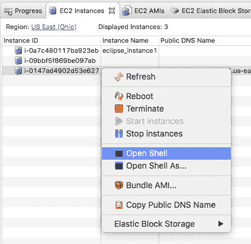

图 13.5：EC2 实例视图中的上下文菜单

要打开外壳以执行 OS 命令，从弹出菜单中选择打开外壳选项：

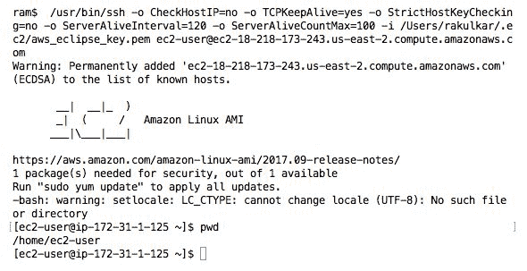

图 13.6：AWS 实例中打开的外壳

我们将使用此选项（开放外壳）来在我们的实例中执行命令。

# 在 EC2 实例中安装 CourseManagement EJB 应用程序

在第七章，“使用 EJB 创建 JEE 应用程序”中，我们为`CourseManagement`开发了一个 EJB 应用程序。我们将看到如何将此应用程序部署在上一节中创建的 EC2 实例中。我们需要在实例中安装 GlassFish 5 和 MySQL 服务器。虽然您可以在单独的实例上安装这些服务器（这在生产设置中是推荐的），但我们将把它们都安装在同一实例上，以便我们可以减少创建新实例的步骤数量。让我们首先安装 GlassFish 5 服务器。

# 安装 GlassFish 5 服务器

在编写本章时，AWS 创建的 Linux 实例已预装了 JDK 7。然而，我们在本书中使用的是 JDK 8。因此，我们将首先卸载 JDK 7 并安装 JDK 8。在 Eclipse 中打开实例的 shell（有关详细信息，请参阅前面的章节）并运行以下命令：

| **命令** | **描述** |
| --- | --- |

|

```java
sudo yum remove java-1.7.0-openjdk -y
```

| 从实例中移除 JDK 7。 |
| --- |

|

```java
sudo yum install java-1.8.0 -y
```

| 安装 JDK 8。 |
| --- |

|

```java
wget http://download.oracle.com/glassfish/5.0/release/glassfish-5.0.zip
```

| 下载 GlassFish 5。 |
| --- |

|

```java
unzip glassfish-5.0.zip
```

| 解压下载的 GlassFish 5 ZIP 文件。 |
| --- |

|

```java
glassfish5/glassfish/bin/asadmin --host localhost --port 4848 change-admin-password
```

| 更改服务器的密码。默认安装包含一个名为 admin 的用户且未设置密码。我们需要为服务器的远程管理员设置一个密码，以便远程管理能够工作。请注意，用户 ID 是 admin，旧密码为空（没有密码）。设置一个新密码，例如，`admin`。 |
| --- |

|

```java
glassfish5/glassfish/bin/startserv > /dev/null 2>&1 &
```

| 启动服务器。 |
| --- |

|

```java
curl localhost:8080
```

| 检查服务器是否启动。 |
| --- |

|

```java
glassfish5/glassfish/bin/asadmin --host localhost --port 4848 enable-secure-admin
```

| 启用 GlassFish 5 服务器的远程管理。 参见此表后面的说明。 |
| --- |

|

```java
sudo glassfish5/glassfish/bin/asadmin
 asadmin> create-service
```

| 创建一个服务，以便在 VM 实例启动时启动。在运行`asadmin`命令后，在`asadmin>`提示符下运行`create-service`命令。 |
| --- |

|

```java
glassfish5/glassfish/bin/stopserv glassfish5/glassfish/bin/startserv > /dev/null 2>&1 &
```

| 停止并启动服务器，以便使前面的更改生效。 |
| --- |

注意

在编写本章和本书出版之间，如果与 JDK 版本 1.8.0.151 以上一起使用，GlassFish 5 的启用安全管理的功能会中断。远程访问 GlassFish 5 管理控制台会失败，并出现以下错误（记录在`glassfish/domains/domain1logs/server.log`）：

`java.lang.NoClassDefFoundError: sun/security/ssl/SupportedEllipticPointFormatsExtension`

您可以参考 GlassFish 5 的 bug [`github.com/javaee/glassfish/issues/22407`](https://github.com/javaee/glassfish/issues/22407)。

现在，我们需要指示 AWS 允许在此实例上端口 `4848`（用于管理员）、`8080`（用于访问 Web 应用程序）和 `3306`（用于远程连接到 MySQL 服务器）上的 TCP 请求。我们将通过在此实例的安全组上设置入站规则来实现这一点。回想一下，在前一节中我们选择了 eclipse-dev 安全组。我们需要在此组上设置入站规则。不幸的是，我们无法从 Eclipse 插件（在撰写本书时）中完成此操作。登录到 AWS 控制台网页，转到服务 | EC2，然后转到网络与安全 | 安全组。右键单击安全组 eclipse-user，选择“编辑入站规则”选项。添加规则以允许来自您机器 IP（您将从该机器远程访问实例的地方）的 TCP 流量（您可以使用类似 [`www.whatismyip.com/what-is-my-public-ip-address/`](https://www.whatismyip.com/what-is-my-public-ip-address/) 的网站来查找您机器的真实 IP 地址）：

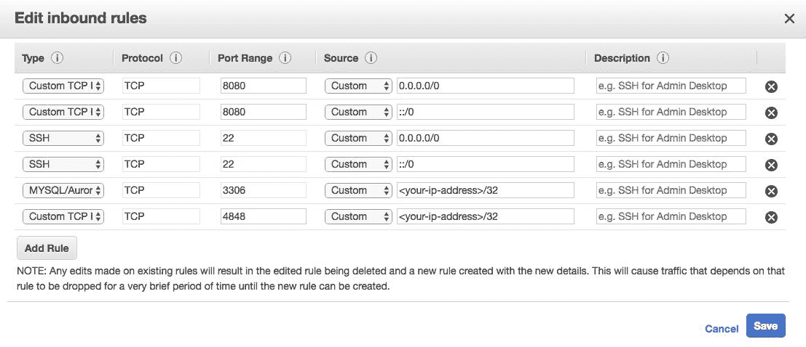

图 13.7：在安全组中设置入站规则

注意，如果您的机器接收动态 IP，那么您将不得不在上面的页面上更新它。

您现在可以浏览到您实例上的 GlassFish 5 管理站点——转到 `https://<your-instance-public-address>:4848`。您可以从 Eclipse 视图 EC2 实例或从 AWS 控制台在线找到公共地址。

# 安装 MySQL 服务器

如前所述，我们将在这个 EC2 实例上安装 MySQL 服务器。您也可以使用 AWS 的 RDS 实例，这是亚马逊推荐用于 MySQL 数据库的实例。RDS 有许多优点，但为了简洁起见，我们将在同一个 VM 实例上安装 MySQL。确保按照前面解释的那样，在实例上打开一个 shell，并执行以下命令：

| **命令** | **描述** |
| --- | --- |

|

```java
sudo yum install mysql-server -y
```

| 安装 MySQL |
| --- |

|

```java
sudo chkconfig mysqld on
```

| 激活 MySQL 服务 |
| --- |

|

```java
sudo service mysqld start
```

| 启动 MySQL 服务 |
| --- |

|

```java
mysqladmin -u root password [your_new_pwd]
```

| 设置密码 |
| --- |

|

```java
mysqladmin -u root -p create course_management
```

| 创建 `course_management` 数据库 |
| --- |

|

```java
create user 'eclipse-user'@'%' identified by ‘enter_password_for_new_user’
```

| 创建新用户 |
| --- |

|

```java
 mysql -u root -p
```

| 从命令行登录 MySQL |
| --- |

|

```java
create user 'eclipse-user'@'%' identified by ‘password_for_eclipse_user’;
```

| 在 `mysql>` 提示符下执行此命令以创建名为 `eclipse-user` 的新用户 |
| --- |

|

```java
grant all privileges on *.* to 'eclipse-user'@'%' with grant option;
```

| 授予新用户权限 |
| --- |

|

```java
exit
```

| 退出 MySQL 控制台 |
| --- |

您现在可以从您的宿主机连接到此 MySQL 服务器实例。但在尝试连接到服务器之前，请确保您已在 EC2 实例上设置了入站规则，允许从您的机器（IP）在端口 `3306` 上进行连接（见 *图 13.7*）。然后您可以从终端（命令行）连接，或者使用 MySQL Workbench（见 第一章，*介绍 JEE 和 Eclipse*<q class="calibre207">,</q> 了解有关安装 MySQL Workbench 的更多信息）。使用实例的公共 DNS 名称进行连接。

根据第四章创建 JEE 数据库应用程序中的说明在此数据库中创建表。或者，使用位于本章源代码`CourseManagementEAR`文件夹中的`course_management.sql`来导入表。在 MySQL Workbench 中，选择“服务器 | 数据导入”菜单。选择“从自包含文件导入”并输入`course_management.sql`的路径。将`course_management`作为默认目标模式。选择“结构和数据”。然后，点击“开始导入”按钮。

# 在 GlassFish 5 服务器中配置数据源

在 GlassFish 5 服务器中配置我们的数据源，首先需要下载 MySQL JDBC 驱动程序。您可以在[`dev.mysql.com/downloads/connector/j/`](https://dev.mysql.com/downloads/connector/j/)找到下载驱动程序的链接。在为我们的 EC2 实例打开的 shell 中执行以下命令：

| **命令** | **描述** |
| --- | --- |

|

```java
wget https://dev.mysql.com/get/Downloads/Connector-J/mysql-connector-java-5.1.45.zip
```

| 下载驱动程序 |
| --- |

|

```java
unzip mysql-connector-java-5.1.45.zip 
```

| 解压文件 |
| --- |

|

```java
cp mysql-connector-java-5.1.45/mysql-connector-java-5.1.45-bin.jar glassfish5/glassfish//domains/domain1//lib/ext/
```

| 将驱动程序 JAR 文件复制到 GlassFish 服务器类路径中的一个文件夹 |
| --- |

重启 EC2 实例（这是必要的，以便 GlassFish 5 可以加载 MySQL JAR 文件）。然后，按照第七章中“配置 Glassfish 中的数据源”部分的说明操作，*使用 EJB 创建 JEE 应用程序*。确保在配置数据源时使用您的 EC2 实例域名而不是 localhost（特别是在设置 JDBC 连接池的附加属性时）。您可以通过浏览到`https://<enter_domain_name_of_ec2_instance>:4848`来访问 GlassFish 5 的管理控制台。

在 GlassFish 管理控制台中配置连接池和 JDBC 数据源后，部署`CourseManagementMavenEAR-1.ear`。这是我们第七章中“使用 EJB 创建 JEE 应用程序”部分在`CourseManagementMavenEAR`项目（和相关项目）中创建的相同 EAR 文件。为了您的方便，相同的 EAR 文件也包含在本章源代码的`CourseManagementEAR`文件夹中。在管理控制台中，从左侧菜单栏点击“应用程序”。然后，点击“部署”按钮。从`CourseManagementEAR`文件夹中选择`CourseManagementMavenEAR-1.ear`并部署应用程序。

应用程序部署成功后，您应该能够浏览到`http://<ec2_instance_domain_name>:8080/CourseManagementMavenWebApp/course.xhtml`并看到课程列表（如果没有数据，则显示空列表）。

您可以通过创建 AMI 并将未来实例基于该 AMI 创建来将前面的设置保存为模板。要从运行实例创建 AMI，请浏览到 AWS 控制台并选择“服务 | EC2”选项。然后，转到运行实例列表。右键单击您想要创建映像的实例，并选择“创建映像”。

# 使用 Elastic Beanstalk 安装 CourseManagmenet REST 服务

Elastic Beanstalk (EBS) 是 AWS（[`aws.amazon.com/elasticbeanstalk/`](https://aws.amazon.com/elasticbeanstalk/））提供的 PaaS（平台即服务）产品。其理念是您主要关注应用程序的开发，并将服务器配置（包括所需软件的安装）、负载均衡、日志文件管理等留给了 PaaS 提供商。然而，在 Elastic Beanstalk 中，您对服务器的控制不如您在配置自己的 EC2 实例时那么大。

EBS 为不同平台提供预配置的托管解决方案，包括 Java 的一种。它提供预配置 Tomcat 的服务器。您只需上传您的 WAR 文件，应用程序就会被部署。在本节中，我们将学习如何在 EBS 中部署 RESTful Web 服务。

回想一下，我们在 第九章，“创建 Web 服务”中开发了 `CourseManagmenetREST` 服务。我们将使用 EBS 在 Tomcat EBS 平台上部署相同的服务。确保您已创建了 `CourseManagmenetREST` 项目的 WAR 文件——如果尚未导入项目，请在 Eclipse 中项目资源管理器中右键单击项目，选择运行 As | Maven 安装。这将创建 `target` 文件夹中的 `CourseManagementREST-1.war` 文件。我们将使用 EBS 在 Tomcat 服务器上部署此 WAR 文件。

# 从 Eclipse 创建 Elastic Beanstalk 应用程序

我们首先将在 Eclipse 中为 EBS Tomcat 平台创建一个服务器。转到 Eclipse 的服务器视图。在默认的 JEE 视图中，此视图位于底部的一个选项卡中，位于编辑器下方。右键单击它并选择新建 | 服务器：

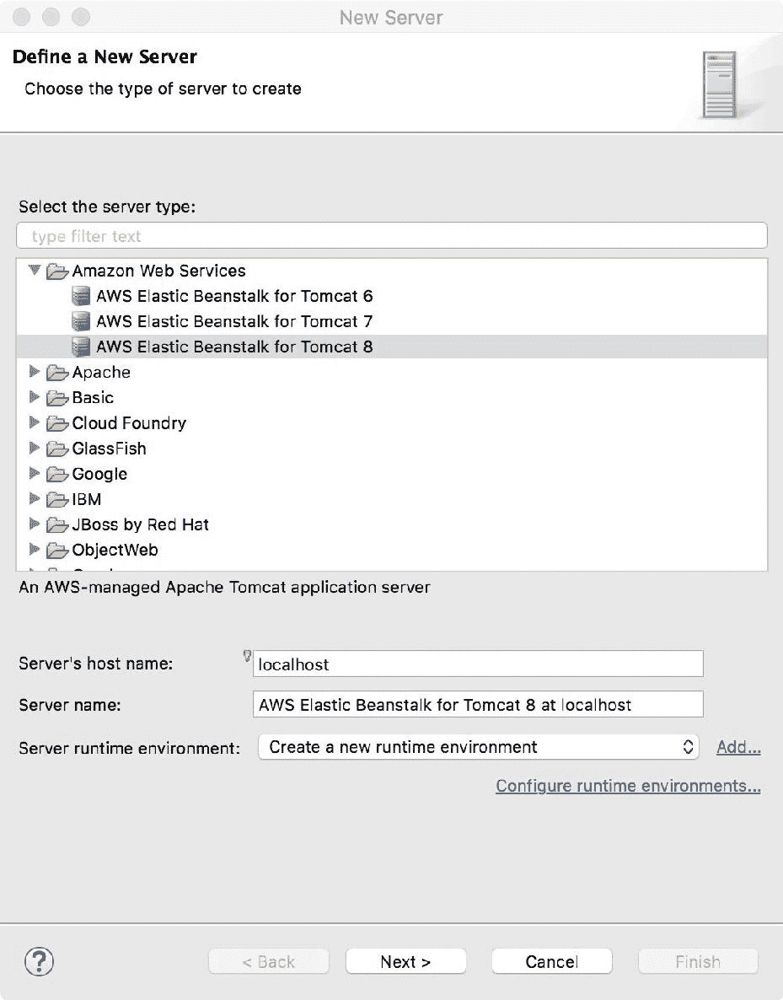

图 13.8：在 Eclipse 中添加 Elastic Beanstalk 服务器

从 Amazon Web Services 组中选择 AWS Elastic Beanstalk for Tomcat 8，或可用的最新 Tomcat 配置。保持其他默认选项。点击下一步：

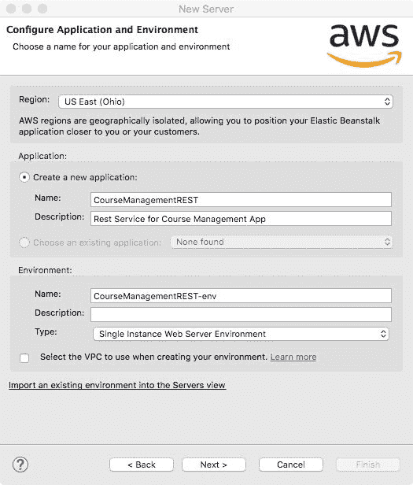

图 13.9：配置 EBS 应用程序和环境

选择创建新应用程序的选项。让我们将此应用程序命名为 `CourseManagementREST`，环境为 `CourseManagementREST-env`。由于我们正在部署一个 Web 应用程序，请从下拉框中选择单实例 Web 服务器环境或负载均衡 Web 服务器环境。第三种类型，工作环境，通常用于长时间运行的批处理应用程序。点击下一步。此时，插件可能会警告您 IAM 操作不允许。点击确定继续：

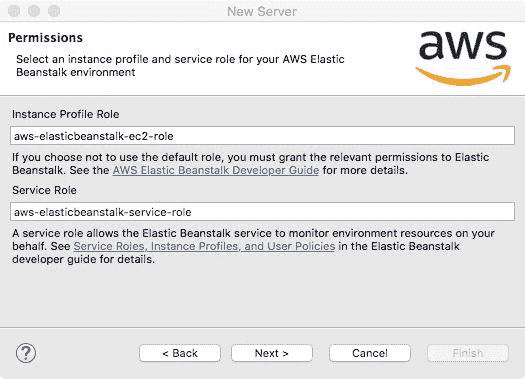

图 13.10：选择 EBS 应用程序的实例配置文件和服务角色

在权限页面保持默认值并点击下一步：


图 13.11：选择 EBS 部署的密钥对

选择“使用密钥对部署”选项并从列表中选择一个密钥。如果没有列出密钥对，请点击加号图标并添加一个新的密钥对。你只需要指定密钥的名称和它在你的机器上的保存位置。点击下一步。

如果你已经从第九章创建 Web 服务中导入 `CourseManagementREST` 项目到 Eclipse 工作区，那么它将作为一个可部署的应用程序出现。点击“添加”按钮将其移动到“配置”列表中：

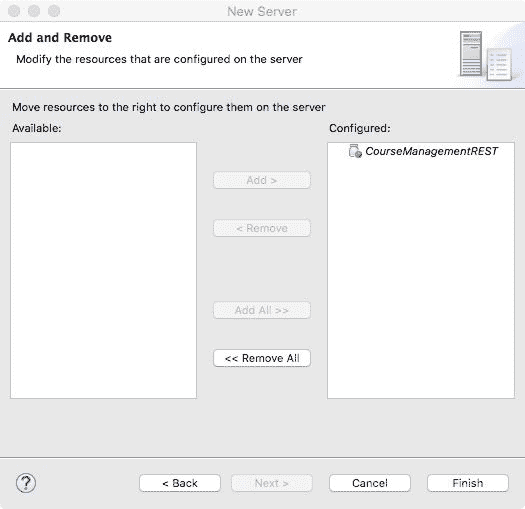

图 13.12：将应用程序添加到 EBS 部署

点击完成。我们刚刚添加的 EBS 服务器应该会出现在服务器视图中：

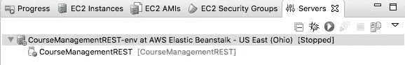

图 13.13：添加了 EBS 服务器后的服务器视图

点击“开始”按钮（或右键单击服务器并选择“开始”选项）。Eclipse 会要求你输入部署的版本标签：

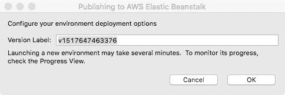

图 13.14：设置 EBS 部署的版本标签

设置标签（或保留默认标签）并点击确定。一旦服务器启动（你可以在服务器视图中检查状态——确保状态为已启动），浏览到 `http://<your-ebs-app-domain>/services/course/get/1`。你应该会看到包含课程 ID 1 的详细信息的 XML 输出。

要找到你的 EBS 服务器域名，在服务器视图中双击服务器。这将在编辑器中显示服务器属性：

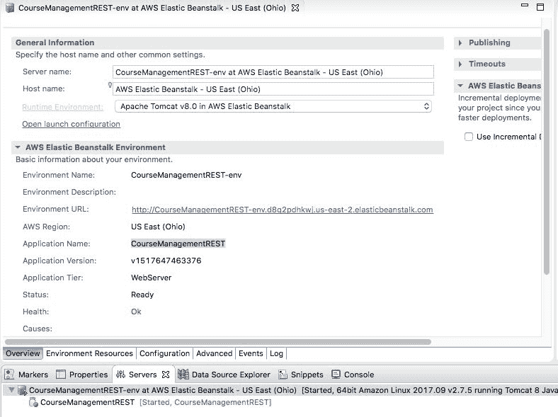

图 13.15：EBS 服务器属性

你可以在环境 URL 链接中找到域名。点击其他选项卡以查看有关服务器配置的更多信息。点击“日志”选项卡将显示你的服务器日志，这对于故障排除问题非常有用。

如果你想要查看 AWS 为你的 Beanstalk 应用程序创建的 EC2 实例，请点击“环境资源”选项卡：

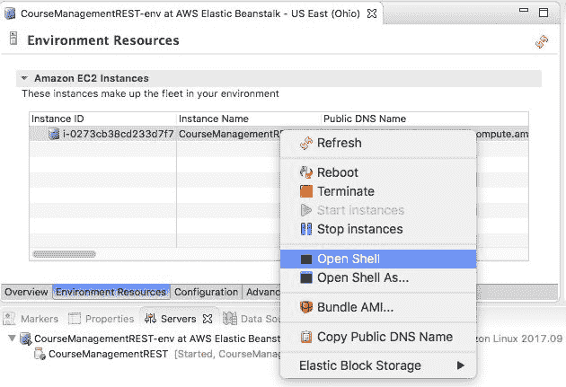

图 13.16：EBS 中的 EC2 实例

右键单击实例行并选择打开外壳。这也可以用于故障排除应用程序。请注意，你对 EBS 中的 EC2 实例所做的任何更改（如安装软件）在部署新版本的应用程序时将会丢失。

你可以在 Eclipse 的 AWS 探索器中看到 EBS 应用程序和环境：

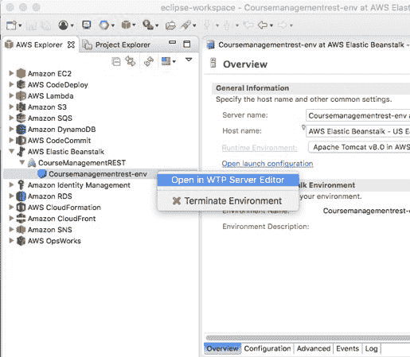

图 13.17：在 AWS 探索器中浏览 EBS 应用程序和环境

登录 AWS 控制台并转到服务 | 弹性豆舱，以查看所有应用程序和环境，包括从 Eclipse 创建的：

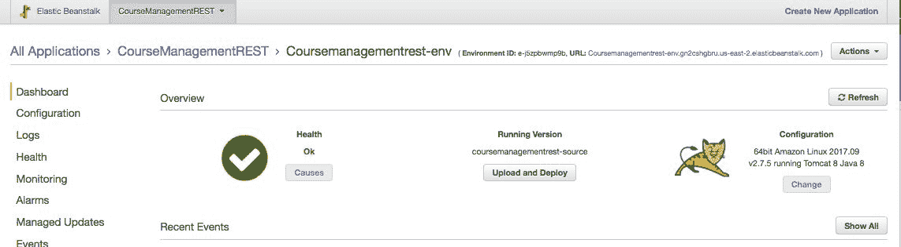

图 13.18：EBS 仪表板

如果你有一个要部署/更新的 WAR 文件，请点击“上传和部署”按钮并选择你想要部署的 WAR 文件。

你可以通过点击仪表板下方的“配置”链接来修改你环境的配置。配置页面中的选项允许你修改实例、容量、负载均衡器、安全设置等设置。如果你的应用程序使用数据库，你也可以进行配置。

您可以通过打开 `<环境 URL 在图 13.15>/services/course/get/1` 来浏览应用程序，`CourseManagementREST`。

如果由于某种原因，应用程序从 Eclipse 无法正确部署，则可以通过点击 *图 13.18* 中的“上传和部署”按钮，从 AWS Console 重新部署应用程序，并浏览到项目 `target` 文件夹中创建的 WAR 文件（如果未创建 WAR 文件，则右键单击项目并选择 Run As | Maven Install）。

Elastic Beanstalk 可以显著节省将应用程序部署到云中的时间。它需要的设置和配置要少得多。

# 在 Google Cloud 中部署

在本节中，我们将了解如何在 Google Compute Engine（IaaS 提供服务）和 Google App Engine（PaaS 提供服务）中部署 JEE 应用程序。Compute Engine ([`cloud.google.com/compute/`](https://cloud.google.com/compute/)) 可以被认为是 AWS EC2 的对应物，而 App Engine ([`cloud.google.com/appengine`](https://cloud.google.com/appengine) ) 可以被认为是 Elastic Beanstalk 的对应物。您需要有一个 Google 账户才能登录到 [`console.cloud.google.com`](https://console.cloud.google.com) 的 Cloud Console。您需要在 Google Cloud 中创建至少一个项目才能部署应用程序。当您登录到 Cloud Console 时，如果没有可用的项目，它将提示您创建一个项目：

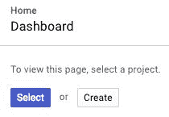

图 13.19：从仪表板创建 Google Cloud 项目

在创建项目页面中，您只需要输入项目的名称。项目 ID 将自动为您选择。您应该保留这个项目 ID，因为许多 SDK 命令需要一个项目 ID 作为它们的参数之一。

如果您已经有了项目，但想为这本书创建一个新的项目，请打开 Google Cloud Console 网页，转到 IAM & admin | 管理资源页面。点击页面上的“创建项目”链接。

# 设置 Google Cloud Tools

设置 Google Cloud Tools 需要多个步骤。让我们从安装 SDK 开始。

# 安装 Google Cloud SDK

从 [`cloud.google.com/sdk/`](https://cloud.google.com/sdk/) 下载 SDK。解压它，并从 `bin` 文件夹运行以下命令：

```java
gcloud init
```

有关初始化 SDK 的更多选项，请参阅 [`cloud.google.com/sdk/docs/initializing`](https://cloud.google.com/sdk/docs/initializing)。

# 安装 App Engine SDK 的 Java 扩展

运行以下命令（确保已安装和配置 Cloud SDK）：

```java
gcloud components install app-engine-java
```

有关管理 Google Cloud 组件的详细信息，请参阅 [`cloud.google.com/sdk/docs/managing-components`](https://cloud.google.com/sdk/docs/managing-components)。

接下来，设置 `gcloud` 命令的默认项目名称：

```java
gcloud config set project <your-project-name-here>
```

# 安装 Google Cloud Tools for Eclipse

要在 Eclipse 中安装 Google Cloud 插件，请打开 Eclipse Marketplace（选择菜单 Help | Eclipse Marketplace...）。搜索 Google Cloud Tools：

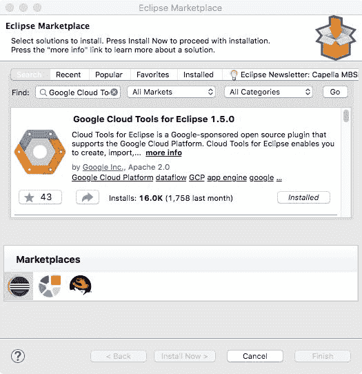

图 13.20：从市场安装 Google Cloud Tools 插件

# 为 Google Cloud Tools 设置 Eclipse 首选项

打开 Eclipse 首选项并转到 Google Cloud Tools 首选项：

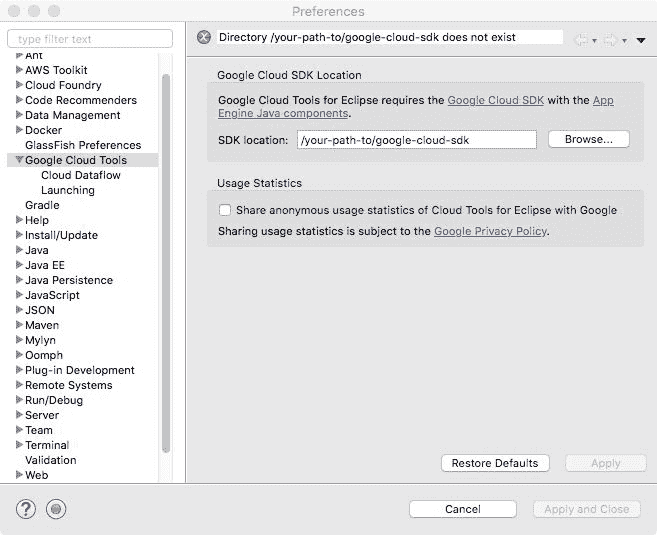

图 13.21：在 Google Cloud Tools 首选项中设置 SDK 路径

在 SDK 位置字段中输入您解压缩 SDK 的文件夹路径。

# 在 Google Compute Engine 中部署应用程序

在本节中，我们将在 Google Compute Engine 中创建一个虚拟机实例并在其中部署一个 JEE 应用程序。一旦我们创建了一个虚拟机，我们就可以遵循与在前面 *在 EC2 实例中安装 CourseManagement EJB 应用程序* 部分中安装 GlassFish 服务器和 *Course Management* 应用程序相同的步骤。但让我们在 Compute Engine 中部署一个不同的应用程序。在上一章中，我们看到了如何在 Docker 容器中部署 JEE 应用程序。所以，让我们在 Compute Engine 的虚拟机中安装 Docker 并部署 `CourseManagement` 服务。但首先，让我们创建一个虚拟机。不幸的是，在撰写本书时，Google Cloud Tools for Eclipse 并没有为与 Compute Engine 的工作提供很多支持。因此，我们将使用 Google Cloud Console 网页或主机机器上的终端。

# 在 Google Compute Engine 中创建虚拟机实例

登录到 Google Cloud 控制台 ([`console.cloud.google.com`](https://console.cloud.google.com)) 并转到 计算引擎 | 虚拟机实例 页面。点击 创建实例 链接。使用 Debian GNU/Linux 引导盘创建实例。请确保选择 允许 HTTP 流量 和 允许 HTTPS 流量 选项。

# 在虚拟机实例中安装 Docker

在虚拟机实例页面，选择您要使用的实例并下拉 SSH 选项（在表格的 连接 列中）：

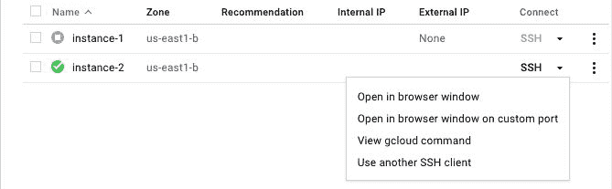

图 13.22：打开到虚拟机实例的 SSH 连接

选择在浏览器窗口中打开。此选项将在浏览器窗口中打开并打开虚拟机实例的 SSH shell。在 shell 中运行以下命令以安装 Docker：

| **命令** | **描述** |
| --- | --- |

|

```java
sudo apt-get update
```

| 获取软件包和依赖项的最新版本 |
| --- |

|

```java
curl -fsSL get.docker.com -o get-docker.sh
```

| 下载 Docker 安装脚本 |
| --- |

|

```java
sudo sh get-docker.sh
```

| 运行安装脚本 |
| --- |

有关在 Debian 发行版上安装 Docker 的更多信息，请参阅 [`docs.docker.com/install/linux/docker-ce/debian/`](https://docs.docker.com/install/linux/docker-ce/debian/)。

一旦安装了 Docker，我们需要执行几个命令，以便可以在不使用 `sudo` 的情况下调用 Docker 命令（Docker 以 root 身份运行）：

| **命令** | **描述** |
| --- | --- |

|

```java
sudo groupadd docker
```

| 创建 Docker 用户组。它可能已经存在。 |
| --- |

|

```java
sudo usermod -aG docker $USER
```

| 将当前用户添加到 Docker 组中。 |
| --- |

有关更多详细信息，请参阅 [`docs.docker.com/install/linux/linux-postinstall/#manage-docker-as-a-non-root-user`](https://docs.docker.com/install/linux/linux-postinstall/#manage-docker-as-a-non-root-user)。

从外壳注销并重新登录（关闭外壳窗口并打开一个新的外壳窗口）。如果所有前面的命令都已成功执行，那么您应该能够在没有`sudo`的情况下运行`docker ps`命令。

接下来，我们将在实例中安装`docker-compose`（请参阅[`docs.docker.com/compose/install/`](https://docs.docker.com/compose/install/)）。执行以下命令（安装`docker-compose`的命令行版本号可能不同）：

| **命令** | **描述** |
| --- | --- |

|

```java
sudo curl -L https://github.com/docker/compose/releases/download/1.18.0/docker-compose-`uname -s`-`uname -m` -o /usr/local/bin/docker-compose
```

| 下载`docker-compose` |
| --- |

|

```java
sudo chmod +x /usr/local/bin/docker-compose
```

| 使`docker-compose`可执行 |
| --- |

我们在第十二章中创建了`docker-compose`部署配置，*微服务*。我们将在本节中创建的虚拟机实例中部署相同的配置。本章的源代码包括一个名为`coursemanagement-docker-compose`的文件夹。将此文件夹中的所有文件上传到虚拟机实例。您可以从浏览器外壳窗口上传，或者使用主机机器上的`gcloud`命令。在浏览器外壳中，点击右上角的设置图标，选择上传文件选项。上传`coursemanagement-docker-compose`文件夹中的所有文件。要从终端上传，在将文件夹更改为`coursemanagement-docker-compose`后，执行以下`gcloud`命令：

```java
gcloud compute scp * <your-instance-name-here>:~/
```

此命令将当前文件夹（在我们的案例中是`coursemanagement-docker-compose`）中的所有文件复制到实例中用户的主文件夹。

无论您使用哪种方法上传文件，请确保您在虚拟机实例中有以下文件：

+   `course-management-db.dockerfile`

+   `course-management-service.dockerfile`

+   `docker-compose.yml`

+   `course-management-db.sql`

+   `coursemanagementspring-0.0.1-SNAPSHOT.jar`

在虚拟机实例的浏览器外壳中，执行以下命令以在 Docker 容器中设置数据库和 REST 服务：

```java
docker-compose up -d
```

请参阅第十二章，*微服务*，以获取有关前面文件和命令的更多详细信息。一旦命令执行成功，浏览到`http://<instance_external_ip>/course_management/courses`。您将只看到一个空的 JSON 数组，因为没有数据在数据库中。您可以从“计算引擎 | 虚拟机实例”页面找到您实例的外部 IP。

执行`docker-compose down`命令以关闭容器。

# 在 Google App Engine 中部署应用程序

App Engine 是 Google 的**平台即服务**（**PaaS**），类似于亚马逊的 Elastic Beanstalk。在《从 Eclipse 创建 Elastic Beanstalk 应用程序》这一节中，我们使用 Elastic Beanstalk 部署了`CourseManagementREST`服务。在本节中，我们将学习如何使用 Google App Engine 部署相同的服务。

让我们复制 `CourseManagementREST` 项目。在 Eclipse 项目资源管理器中右键单击项目，然后选择复制。在项目资源管理器中的任何位置右键单击，然后选择粘贴。Eclipse 将提示您命名项目。让我们将其命名为 `CourseManagementREST-GAE`。我们将使用 Google App Engine 部署此项目。

让我们配置我们的项目为 App Engine 项目。在项目资源管理器中右键单击 CourseManagementREST-GAE 项目，然后选择配置 | 转换为 App Engine 标准项目。

如果您正在创建一个用于部署到 Google App Engine 的新项目，请转到文件 | 新建 | Google App Engine 标准 Java 项目菜单。或者，从工具栏中的 Google Cloud Platform 图标下拉菜单中选择创建新项目 | Google App Engine 标准 Java 项目。

在我们部署项目之前，请从 `src/main/webapp/WEB-INF` 文件夹中删除 `web.xml`。Google App Engine 的 Java 平台使用 Jetty 服务器，并且在此部署中不需要 `web.xml`。

在删除 `web.xml` 后，您可能会看到一个错误，表明 `web.xml` 缺失，并且 `<failOnMissingWebXml>` 设置为 true。为了抑制此错误，请在 `pom.xml` 中添加以下属性：

`<properties>`

`    <failOnMissingWebXml>false</failOnMissingWebXml>   `

`</properties>`

要在本地测试此应用程序，请转到服务器视图，右键单击它，然后选择新建 | 服务器。然后，展开 Google 组并选择 App Engine Standard：

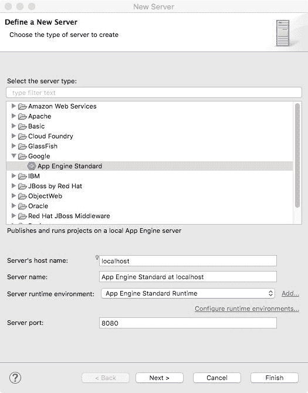

图 13.23：创建本地 App Engine 服务器

点击下一步并添加用于部署的 CourseManagementREST-GAE 项目：

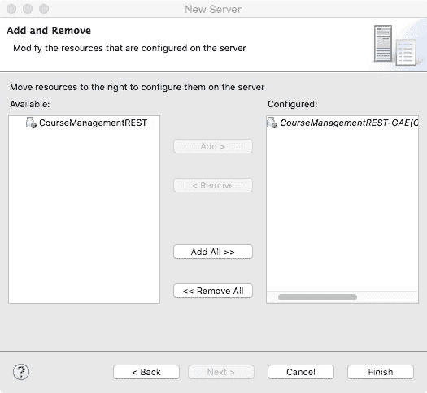

图 13.24：为部署添加 CourseManagementREST-GAE 项目

点击完成并从服务器视图启动服务器。然后，浏览到 `http://localhost:8080/services/course/get/1` 以验证应用程序是否已正确部署。

如果您在 `pom.xml` 中遇到有关 JDK 版本的错误，请在 `pom.xml` 中的依赖项部分上方添加以下部分：

`<properties>`

`  <maven.compiler.source>1.8</maven.compiler.source>`

`  <maven.compiler.target>1.8</maven.compiler.target>`

`</properties>`

在您将此项目部署到 Google App Engine 之前，您应该确保在 Google App Engine 中已创建应用程序。浏览到 [`console.cloud.google.com/appengine`](https://console.cloud.google.com/appengine) 并检查是否存在任何应用程序。如果不存在，您可以从该页面创建应用程序。或者，您可以在终端中运行以下命令：

```java
gcloud app create
```

要将此项目部署到 Google App Engine，请在项目资源管理器中选择项目，并从 Google Cloud Platform 工具栏按钮的下拉菜单中选择：

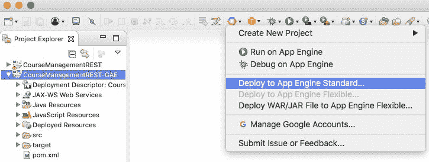

图 13.25：将项目部署到 Google App Engine

选择部署到 App Engine 标准菜单：

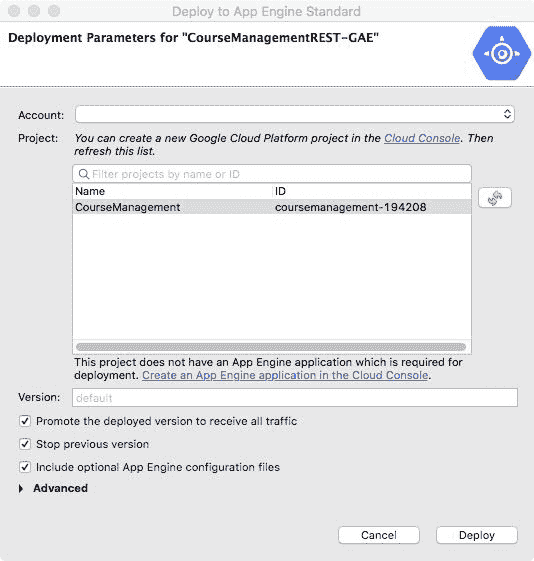

图 13.26：设置 Google App Engine 的部署参数

从下拉菜单中选择你的 Google 账户，如果没有选择，然后选择你想要部署应用程序的 Google Cloud 项目。

一旦项目部署完成，请浏览到 `https://<your_project_id>.appsport.com/services/course/get/1` 以验证它。

要停止应用程序，你需要禁用应用程序——打开 [`console.cloud.google.com`](https://console.cloud.google.com)，转到 App Engine | 设置并点击“禁用应用程序”按钮。

# 摘要

在本章中，我们了解了亚马逊和谷歌提供的两种云部署服务类型。一种是 IaaS，另一种是 PaaS。PaaS 允许你在预配置的环境中部署你的应用程序，而 IaaS 则让你完全控制部署配置。亚马逊的 IaaS 提供服务称为 EC2，谷歌的称为 Compute Engine。亚马逊的 PaaS 提供服务称为 Elastic Beanstalk，谷歌的称为 App Engine。

我们在亚马逊 EC2 的一个实例中的 GlassFish 服务器上部署了 `CourseManagement` EJB 应用程序。然后我们在 Elastic Beanstalk 中部署了 `CourseManagementREST` 服务。

然后，我们在 Google Compute Engine 的一个实例中部署了一个带有 `CourseManagement` 服务的 Docker 容器。最后，我们在 Google App Engine 中部署了 `CourseManagementREST` 服务。

在下一章中，我们将学习如何确保 JEE 应用程序的安全。
