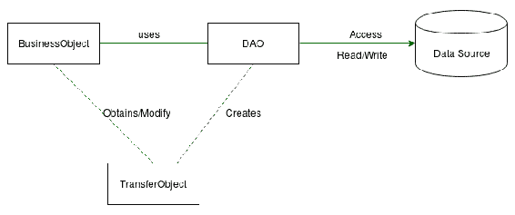
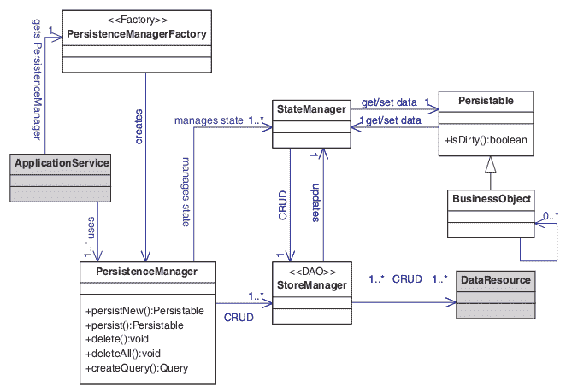
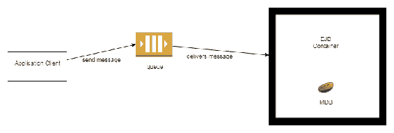
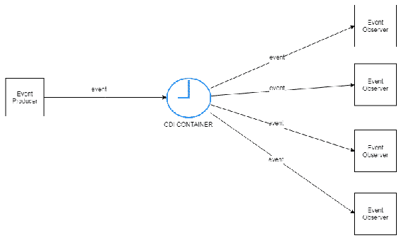

# 第四章：集成模式

在本章中，我们将解释一些集成模式，并查看它们在 Java EE 的集成层上的工作方式。阅读本章后，您将能够实现这些模式，并使用它们来解决资源或系统之间的集成问题。您还将能够在集成层上工作，并熟悉与集成模式相关的概念。本章的主题如下：

+   解释集成层的理念

+   解释数据访问对象模式的理念

+   实现数据访问对象模式

+   解释领域存储模式的理念

+   实现领域存储模式

+   解释服务激活模式的理念

+   实现服务激活模式

# 解释集成层的理念

如前几章所述，Java EE 分为三个著名的层——表示层、业务层和集成层。这些层共同工作，以促进高度解耦的解决方案。

在商业环境中，软件开发非常困难，因为我们需要考虑企业的整个生态系统。一个生态系统包括其数据源、软件、数据政策、安全和设备。因此，开发者需要考虑如何在这些数据源中读取和写入数据，软件之间如何相互通信，数据政策如何在系统中实施，商业环境中的安全机制如何运作，等等。在这种情况下，创建一个层来解决所有集成和通信问题将是有益的，因为它们的解决方案将与业务逻辑解耦。这就是产生集成层的思维过程。

集成层是负责在整个应用程序中将业务逻辑与集成逻辑解耦的层。这个层具有与外部资源或系统通信的逻辑，并且与业务逻辑保持分离。这个层将使得从外部源读取和写入数据成为可能，使得应用程序和商业生态系统组件之间的通信变得可行。此外，这个层将隐藏所有通信复杂性，使业务层接收数据时无需了解组件之间的通信复杂性和它们的结构。

现在，开发一个没有与外部资源集成但具有某种集成功能的程序极为罕见。这是因为应用程序总是需要从源读取数据，而这个源通常位于应用程序之外，如数据库或文件系统中。如果应用程序依赖外部数据源，那么这个应用程序需要集成以从外部数据源访问数据。因此，更简单的应用程序将需要一个集成层。

随着时间的推移，资源或系统之间集成的复杂性增加，因为越来越多的业务逻辑需要集成以促进对业务的良好响应。因此，有必要创建一个通用的解决方案来解决反复出现的集成问题，并且因此产生了集成模式。

# 解释数据访问对象模式的概念

在商业世界中，应用程序总是需要与数据源集成，以便读取、写入、删除或更新数据。这个数据源可以是关系数据库、NoSQL 数据库、**LDAP**（**轻量级目录访问协议**）或文件系统，例如。每种类型的数据源都有其结构，并且连接、读取和写入数据都有其复杂性。这些复杂性不应该暴露给业务逻辑，而应该与之解耦。

数据访问对象模式是一种用于从业务层抽象和隐藏所有数据源访问的模式。该模式封装了所有数据源访问逻辑及其复杂性，从业务层解耦所有数据源访问逻辑。如果我们想用另一个数据源替换它，我们只需要修改数据访问对象模式的代码，这种修改在业务层是不可见的。以下图显示了数据访问对象模式模型：



在前面的图中，我们看到了**BusinessObject**，它包含业务逻辑；DAO，它包含数据访问逻辑；**TransferObject**，它是用于传输的对象；以及数据源，它是数据存储的外部本地。当**BusinessObject**需要访问数据时，它会从 DAO 请求数据。DAO 访问数据源并读取数据，然后将数据作为**TransferObject**返回给**BusinessObject**。一些开发人员和专业人士认为这种模式仅应与关系数据库和`NoSql`一起使用，但当我们数据源是文件系统或其他类型的数据持久化时，我们也应该使用 DAO，以促进业务逻辑和持久化逻辑之间的解耦，以及组织我们的代码。

# 实现数据访问对象模式

要使用 Java EE 8 的最佳实践来实现此模式，我们将使用关系型数据库，并通过 JPA 规范实现数据的读取和写入。在这个例子中，我们将有一个名为 *employee* 的表，其中包含员工数据。我们还将创建一个名为 `EmployeeDao` 的类，它将包含四个方法 —— `save(employee)`、`findByName(name)`、`findAll()` 和 `delete(employee)`。`save` 方法将接收一个员工对象并将其保存到数据库中，`findByName` 将接收一个参数作为名称，并在数据库中按名称查找员工，`delete` 将接收一个员工对象并将其从数据库中删除。此外，我们还将创建一个名为 `Employee` 的传输对象，这是一个 JPA 实体类，它具有与数据库表的映射。

# 使用 JPA 实现实体

JPA 实体是一个表示数据库中的某个表或视图的类。实体需要一个属性来唯一标识一个实体，需要有一个无参构造函数，并且 JPA 实体的每个对象都只标识表或视图中的一行。

在以下代码中，我们有一个名为 `Entity` 的接口，所有 JPA 实体都将根据以下方法实现：

```java
public interface Entity < T > {

    public T getId();
}  
```

在以下代码中，我们有一个名为 `Employee` 的传输对象，它是一个 JPA 实体。这个类有一个名为 `Employee` 的映射表，以及应用程序使用的列。业务层只需要知道传输对象、DAO 和发送给 DAO 的参数：

```java
import javax.persistence.*;
import javax.validation.constraints.NotNull;
import java.util.Objects;

@javax.persistence.Entity(name = "Employee")
public class Employee implements Entity<Long> {

    @Id
    @GeneratedValue
    @Column(name = "id")
    private Long id;

    @NotNull
    @Column(name="name")
    private String name;

    @Column(name="address")
    private String address;

    @NotNull
    @Column(name="salary")
    private Double salary;

    public Employee(){}

    public Employee( String name, String address, Double salary){

        this.name = name;
        this.address = address;
        this.salary = salary;

    }

    public void setId(Long id) {
        this.id = id;
    }

    public String getName() {
        return name;
    }

    public void setName(String name) {
        this.name = name;
    }

    public String getAddress() {
        return address;
    }

    public void setAddress(String address) {
        this.address = address;
    }

    public Double getSalary() {
        return salary;
    }

    public void setSalary(Double salary) {
        this.salary = salary;
    }

    @Override
    public Long getId() {
        return this.id;
    }

    @Override
    public boolean equals(Object o) {
        if (this == o) return true;
        if (o == null || getClass() != o.getClass()) return false;
        Employee employee = (Employee) o;
        return Objects.equals(id, employee.id);
    }

    @Override
    public int hashCode() {

        return Objects.hash(id);
    }
}        

```

# 实现 DAO

为了重用大量代码并推广实现 DAO 的最佳实践，我们将创建一个抽象 DAO，称为 `AbstractDao`，它是所有 DAO 的超类，具有所有 DAO 都可以使用的通用逻辑方法：

```java
import javax.persistence.EntityManager;
import javax.persistence.PersistenceContext;
import javax.persistence.TypedQuery;
import java.lang.reflect.ParameterizedType;
import java.util.List;
import java.util.Map;
import java.util.Optional;

public abstract class AbstractDao <T extends Entity>{

    //EntityManager that provide JPA functionalities
    @PersistenceContext
    protected EntityManager em;

    //Get the type of Subclass that implements Entity interface
    protected Class<T> getType() {
        ParameterizedType genericType = (ParameterizedType) 
        this.getClass().getGenericSuperclass();
        return (Class<T>) genericType.getActualTypeArguments()[0];
    }

    //Find entity filtering by id.
    public Optional<T> findById ( T entity ){

        return Optional.ofNullable( em.find( (Class<T>) 
        entity.getClass(), entity.getId() ) );

    }

    public Optional<T> persist (T entity ){

        em.persist( entity );
        return Optional.of( entity );

    }

    public Optional<T> update ( T entity ){

        return Optional.ofNullable( em.merge( entity ) );

    }

    public void delete ( T entity ){
        em.remove( entity );
    }

    protected List<T> listWithNamedQuery(String namedQuery, Map<String, 
    Object> parameters){

        TypedQuery<T> query = em.createNamedQuery( namedQuery, 
        getType() );
        parameters.keySet().stream().forEach( key-> query.setParameter( 
        key, parameters.get( key ) ) );
        return query.getResultList();

    }

    protected Optional<T> findWithNamedQuery(String namedQuery, 
    Map<String, Object> parameters){

        TypedQuery<T> query = em.createNamedQuery( namedQuery, 
        getType() );
        parameters.keySet().stream().forEach( key-> query.setParameter( 
        key, parameters.get( key ) ) );
        return Optional.ofNullable(query.getSingleResult());

    }

}
```

为了防止用户实例化 `AbstractDao`，我们在前面的代码中将该类创建为一个抽象类。另一个 `AbstractDao` 的特点是方法的返回值，它只返回 `Entity` 或 `Entity` 的列表。这是一个好的实践，因为我们知道这个方法返回的对象类型，并且它组织了我们的代码，因为我们知道我们的方法可能返回什么类型的值：

```java
import javax.ejb.Stateless;
import java.util.Collections;
import java.util.List;

@Stateless
public class EmployeeDao extends AbstractDao <Employee> {

    public List<Employee> findByName(String name ){

        return this.listWithNamedQuery("Employee.findByName",
                                       Collections.singletonMap( 
                                       "name", name ) );

    }

    public List<Employee> findAll(){

        return this.listWithNamedQuery("Employee.findAll",
                                        Collections.emptyMap());

    }

}
```

我们可以看到`EmployeeDao`类，这是读取和写入`Employee`数据的 DAO。这个类是一个 EJB，这意味着它可以控制所有由 JTA 规范定义的事务——假设事务由 Java EE 容器管理——并使事务控制对应用程序透明。为了读取员工数据，我们可以调用`findAll`、`findByName`和`findById`方法；为了写入员工数据，我们可以调用`persist`和`update`方法；为了删除（删除）员工数据，我们可以调用`delete`方法。请注意，业务类——一个在业务层上执行操作的类——不知道读取和写入数据的过程；它只知道要调用的方法的参数以及它的返回值。因此，我们可以替换数据源而不影响业务逻辑。我们有`EmployeeBusiness`使用 DAO 来读取和写入数据，我们将在下面看到：

```java
import com.packt.javaee8.dao.EmployeeDao;
import com.packt.javaee8.entity.Employee;

import javax.ejb.Stateless;
import javax.inject.Inject;
import java.util.List;
import java.util.Optional;

@Stateless
public class EmployeeBusiness{

    @Inject
    protected EmployeeDao employeeDao;

    public List<Employee> listByName( String name ){

        return employeeDao.findByName( name );

    }

    public boolean save ( Employee employee ){

        return employeeDao.persist( employee ).isPresent();

    }

    public List<Employee> listAll(){

        return employeeDao.findAll();

    }

    public Optional<Employee> findById(Employee employee ){
        return employeeDao.findById(employee);
    }
}
```

这是一个很好的模式；它的应用非常广泛，大多数应用程序都实现了它。在实现这个模式时，请注意不要暴露数据源特性，例如，通过将 SQL 查询作为参数发送给 DAO 的执行，或者通过将文件系统的路径作为参数发送给 DAO 的执行。

# 解释领域存储模式的概念

在上一节中，我们介绍了数据访问对象模式，并探讨了该模式如何从业务层抽象数据访问逻辑。然而，数据访问对象模式是一个无状态模式，它不保存状态和智能过程。一些问题中数据之间存在复杂的关系，数据持久化需要通过智能过程来完成。为了促进这一特性，数据访问对象模式不参与。这是因为 DAO 不应该维护状态，不应该包含任何智能过程，只需要包含保存或更新的过程。为了解决这个问题，领域存储模式被创建——这是一个可以为 DAO 添加功能的模式。

领域存储模式是一种使对象模型持久化透明化的模式，将持久化逻辑与对象模型分离，使得应用程序可以根据对象状态选择持久化逻辑。在这个模式中存在一个 DAO，它被设计用来与数据源进行通信和操作数据，但这个 DAO 对应用程序是隐藏的。由于 JPA 已经作为一个领域存储模式工作，因此开发者很少实现这种模式。这是因为 JPA 实现了一些智能过程来定义何时以及如何保存数据，并且这些智能过程是以 JPA 实体上的映射为导向的。然而，当我们决定在另一种类型的数据源中实现持久化时，我们可能希望实现这种模式并在我们的应用程序中使用它。在下面的图中，我们可以看到领域存储模式模型：



许多开发者认为在 JPA 之后 DAO 已经过时。这是因为 JPA 与领域存储模式一起工作，并且已经有一个内置的 DAO。然而，对我们来说，DAO 是 Java EE 项目上使用的好模式。这是因为 JPA 与关系数据库有更强的关系，如果我们用另一种类型的数据源替换关系数据库，我们可能需要移除 JPA 并使用另一种机制。如果所有 JPA 调用都在 DAO 内部，应用程序将只看到 DAO，JPA 实现将隐藏于应用程序之外。这使得业务层与集成层和持久化逻辑解耦。

# 实现领域存储模式

这是一个非常长的模式。为了实现和促进这种实现，我们将所有数据保存在 HashMap 中。这是一个重要的步骤，因为本小节的重点是展示如何实现领域存储模式。为了便于理解，我们将查看在*实现数据访问对象模式*小节中涵盖的相同场景。在这里，我们有传输对象，称为`Employee`，我们还将对数据源进行读写操作。然而，持久化将面向对象状态，并在其逻辑中具有智能。在这个实现中，我们有以下类、接口和注解：

+   `PersistenceManagerFactory`: 这作为一个工厂模式工作，负责创建`PersistenceManager`类的实例。`PersistenceManagerFactory`是一个单例，在整个应用程序中只有一个实例。

+   `PersistenceManager`: 这管理持久化和查询数据。这些数据是一个作为*工作单元*的对象模型。

+   `Persistence`: 这是一个用作 CDI*资格*的注解。这个资格用于定义`PersistenceManagerFactory`的方法，它负责创建`PersistenceManager`实例。

+   `EmployeeStoreManager`: 这作为一个**数据访问对象**（**DAO**）工作，与数据源交互并封装所有数据源复杂性。DAO 负责在数据源上读取和写入员工数据。

+   `StageManager`: 这是一个用于创建所有`StageManager`实现的接口。

+   `EmployeeStageManager`: 这根据其状态和规则协调数据的读写操作。

+   `TransactionFactory`**:** 这作为一个工厂模式工作，负责创建`Transaction`实例。`TransactionFactory`是一个单例，在整个应用程序中只有一个实例。

+   `Transaction`**:** 这用于创建面向事务的策略。此类控制事务的生命周期并定义事务限制。

+   `Transaction`（注解）：用作 CDI*资格*的注解。这个资格用于定义`TransactionFactory`的方法，它负责创建`Transaction`实例。

为了实现这个模式，我们将从`PersistenceManagerFactory`类开始，这是一个`PersistenceManager`的工厂。

# 实现 PersistenceManagerFactory 类

在下面的代码中，我们有用于注入`PersistenceManager`类的限定符：

```java
import javax.inject.Qualifier;
import static java.lang.annotation.ElementType.FIELD;
import static java.lang.annotation.ElementType.METHOD;
import static java.lang.annotation.ElementType.PARAMETER;
import static java.lang.annotation.ElementType.TYPE;
import static java.lang.annotation.RetentionPolicy.RUNTIME;

import java.lang.annotation.Retention;
import java.lang.annotation.Target;

@Qualifier
@Retention(RUNTIME)
@Target({TYPE, METHOD, FIELD, PARAMETER})

public @interface Persistence {
}
```

查看以下代码，我们可以看到我们有一个`PersistenceManagerFactory`类，该类负责创建`PersistenceManager`的新实例。这个类使用了`@Singleton`注解，这是一个用于通过 Java EE 机制创建单例模式的 EJB 注解。`getPersistenceManager`方法有`@Produces`注解，它用于定义一个负责创建新实例的方法。它还包含`@Persistence`注解，它用作一个*限定符*：

```java
import javax.ejb.Singleton;
import javax.enterprise.inject.Produces;
import java.util.HashSet;
import java.util.Set;

@Singleton
public class PersistenceManagerFactory {

    Set<StageManager>  stateManagers = new HashSet<StageManager>();

    public @Produces @Persistence PersistenceManager 
    getPersistenceManager(){

        //Logic to build PersistenceManager
        return new PersistenceManager();

    }

}
```

# 实现 PersistenceManager 类

我们需要管理所有持久化和查询数据的过程。为此，我们需要创建一个类。

`PersistenceManager`类负责管理所有的持久化和查询过程：

```java
import javax.annotation.PostConstruct;
import javax.inject.Inject;
import java.util.LinkedHashSet;
import java.util.Optional;
import java.util.Set;
import java.util.stream.Collectors;

public class PersistenceManager {

    private Set<StageManager> stateManagers;

    @Inject @Transactional Transaction transaction;

    @PostConstruct
    public void init(){
        stateManagers = new LinkedHashSet<StageManager>();

    }

    public Optional<Entity> persist ( Entity entity ) {

        if ( entity instanceof Employee ){
            stateManagers.add( new EmployeeStageManager( (Employee) 
            entity ) );
        }

        return Optional.ofNullable(entity);
    }

    public void begin() throws Exception {

        if( !transaction.isOpened() ){
            transaction.begin();
        }
        else{

            throw new Exception( "Transaction already is opened" );

        }
    }

    public Optional<Entity> load(Object id){

        Entity  entity = stateManagers.stream()
                .filter( e-> e.getEntity().getId().equals( id ) )
                .map( s->s.getEntity() )
                .findFirst()
                .orElseGet( ()-> new EmployeeStoreManager().load( id ) );

        if( Optional.ofNullable(entity).isPresent()
                && stateManagers.stream().map( s->s.getEntity() 
          ).collect( Collectors.toList() ).contains( entity ) )
                stateManagers.add( new EmployeeStageManager( (Employee) 
                entity) );

        return Optional.ofNullable(entity);

    }

    public void commit() throws Exception {

        if( transaction.isOpened() ){
            stateManagers.stream().forEach( s-> s.flush() );
            transaction.commit();
        }
        else{

            throw new Exception( "Transaction is not opened" );

        }
    }

    public void rollback() throws Exception {

        if( transaction.isOpened() ) {
            stateManagers = new LinkedHashSet<StageManager>();
            transaction.rollback();
        }

        else {

            throw new Exception( "Transaction is not opened" );

        }
    }
}
```

在前面的代码中，我们有`PersistenceManager`类。这个类有一个`stateManagers`属性，它是一组`StateManager`，用于控制每个对象模型的读写。它还有一个`Transaction`属性，用于控制事务的生命周期。这个类还有一个`persist`方法，用于写入由对象模型表示的数据；`begin`方法，用于开始事务；`load`方法，用于读取对象模型的数据；`commit`方法，用于提交事务；最后，`rollback`方法，用于回滚事务。

# 实现 EmployeeStoreManager 类

`EmployeeStoreManager`类负责与数据源连接以及读取和写入员工数据：

```java
import com.packt.javaee8.entity.Employee;

import java.util.HashMap;
import java.util.Map;

public class EmployeeStoreManager {

    private Map<Object, Employee> dataSource = new HashMap<>();

    public void storeNew ( Employee employee ) throws Exception {

        if( dataSource.containsKey( employee.getId() ) ) throw new Exception( "Data already exist" );

        dataSource.put( employee.getId(), employee );
    }

    public void update ( Employee employee ) throws Exception {

        if( !dataSource.containsKey( employee.getId() ) ) throw new Exception( "Data not exist" );

        dataSource.put( employee.getId(), employee );
    }

    public void delete ( Employee employee ) throws Exception {

        if( !dataSource.containsKey( employee.getId() ) ) throw new Exception( "Data not exist" );

        dataSource.remove( employee.getId() );

    }

    public Employee load(Object key){

        return dataSource.get( key );

    }

}
```

在前面的代码块中，我们有`EmployeeStoreManager`类，该类负责与数据源连接以及读取和写入员工数据。这个类作为一个 DAO 工作，封装了所有的数据源复杂性。它还有一个`dataSource`属性，这是一个表示数据源的映射。此外，这个类有`storeNew`方法，用于写入由对象模型表示的新员工数据。它还有一个`update`方法，用于写入由对象模型表示的现有员工数据。此方法用于更新存储的数据。`delete`方法也用于删除现有员工数据，而`load`方法用于以对象模型读取员工数据。

# 实现 StageManager 接口

`StageManager`是一个接口，由`EmployeeStageManager`实现：

```java
public interface StageManager {

    public void flush();

    public void load();

    public Entity getEntity();
}
```

在前面的代码块中，我们有`StageManager`接口。这个接口由`EmployeeStageManager`实现：

```java
public class EmployeeStageManager implements StageManager {

    private boolean isNew;

    private Employee employee;

    public EmployeeStageManager ( Employee employee ){

        this.employee = employee;

    }

    public void flush(){

        EmployeeStoreManager employeeStoreManager = new EmployeeStoreManager();

        if( isNew ){
            try {
                employeeStoreManager.storeNew( employee );
            } catch ( Exception e ) {
                e.printStackTrace();
            }
            isNew = false;
        }
        else {
            try {
                employeeStoreManager.update( employee );
            } catch ( Exception e ) {
                e.printStackTrace();
            }
        }

    }

    public void load() {
        EmployeeStoreManager storeManager =
                new EmployeeStoreManager();
        Employee empl = storeManager.load( employee.getId() );
        updateEmployee( empl );
    }

    private void updateEmployee( Employee empl ) {

        employee.setId( empl.getId() );
        employee.setAddress( empl.getAddress() );
        employee.setName( empl.getName() );
        employee.setSalary( empl.getSalary() );

        isNew = false;

    }

    public Entity getEntity() {

        return employee;

    }

}
```

在前面的代码块中，我们看到了`isNew`属性，用于定义对象模型是否为新的写入（将在数据源上创建新数据）。代码还包含`employee`属性，这是用于表示员工数据的对象模型。我们还可以看到`flush`方法，用于执行在数据源上写入数据的过程；`load`方法，用于从数据源读取数据；`updateEmployee`方法，这是一个私有方法，用于更新`employee`属性；以及`getEntity`方法，用于返回`employee`属性。

# 实现 TransactionFactory 类

在下面的代码中，我们看到了`Transactional`注解，这是一个`Qualifier`，用于注入`Transaction`类：

```java
import javax.inject.Qualifier;
import java.lang.annotation.Retention;
import java.lang.annotation.Target;

import static java.lang.annotation.ElementType.*;
import static java.lang.annotation.RetentionPolicy.RUNTIME;

@Qualifier
@Retention(RUNTIME)
@Target({TYPE, METHOD, FIELD, PARAMETER})
public @interface Transactional {
}
```

在前面的代码块中，我们看到了`TransactionFactory`类，该类负责创建`Transaction`类的新实例。这个类使用了`@Singleton`注解，这是一个用于通过 Java EE 机制创建单例模式的 EJB 注解。`getTransaction`方法有`@Produces`注解，用于定义一个负责创建新实例的方法，以及`@Transactional`注解，用作限定符：

```java
import javax.ejb.Singleton;
import javax.enterprise.inject.Produces;

@Singleton
public class TransactionFactory {

    public @Produces @Transactional Transaction getTransaction(){
        //Logic to create Transations.
        return new Transaction();
    }
}
```

# 实现 Transaction 类

`Transaction`类负责控制事务生命周期和定义事务界限：

```java
package com.packt.javaee8.domainstore;

import javax.annotation.PostConstruct;

public class Transaction {

    private boolean opened;

    @PostConstruct
    public void init(){
        this.opened = false;
    }

    public void commit() throws Exception {
        if( !opened ) throw new Exception("Transaction is not opened");
        opened = false;
    }

    public void rollback() throws Exception {
        if( !opened ) throw new Exception("Transaction is not opened");
        opened = false;
    }

    public void begin() throws Exception {
        if( opened ) throw new Exception("Transaction already is opened");
        opened = true;
    }

    public boolean isOpened(){
        return opened;
    }
}
```

在前面的代码块中，我们看到了`Transaction`类，该类负责控制事务生命周期和定义事务界限。这个类有`init()`方法，被`@PostConstruct`注解，配置该方法在构造函数执行后调用。此外，这个类还有`commit`方法，用于用户需要确认事务时；`rollback`方法，用于撤销所有事务；`begin`方法，用于开启事务；以及`isOpened`方法，用于验证事务是否开启。

如果没有调用`begin`方法，或者调用了`commit`或`rollback`方法但没有再次调用`begin`方法，则事务将关闭。

# 实现 EmployeeBusiness 类

`EmployeeBusiness`类包含员工业务逻辑：

```java
import javax.ejb.Stateless;
import javax.inject.Inject;
import java.util.Optional;

@Stateless
public class EmployeeBusiness{

   @Inject @Persistence
   protected PersistenceManager persistenceManager;

   public boolean save ( Employee employee ) throws Exception {

       //Begin Transaction 
       persistenceManager.begin();
       persistenceManager.persist(employee);
       //End Transaction
       persistenceManager.commit();       

       return true;

   }

   public Optional<Employee> findById(Employee employee ){
        return Optional.ofNullable( (Employee) persistenceManager.load(employee.getId()).get());
    }

}
```

在前面的代码块中，我们看到了`EmployeeBusiness`类，该类包含员工业务逻辑。这个类有`save(Employee)`方法，用于保存员工数据，以及`findById(Employee )`方法，用于根据 ID 查找员工。请注意，在`save`方法中，我们同时调用了`PersistenceManager`类的`begin()`和`commit()`方法。这些调用定义了事务的界限，并且只有在调用`commit()`方法时，数据才会被保存在数据源中。

# 解释服务激活器模式的概念

假设一个客户端需要请求一个业务服务，这是一个耗时较长的过程。在这种情况下，客户端不应该以同步的方式等待过程结束。相反，必须有一种方法来进行异步服务调用，这样就不会阻塞客户端或用户。这个服务可以在未来的某个时刻被激活。过程延迟可能有几个原因。例如，可能有一个消耗大量时间的数据库查询，或者对当前应用程序控制之外的遗留系统的访问。异步执行所需任务的模式被称为服务激活器。

因此，当客户端需要异步调用服务时，总是使用服务激活器模式。这意味着客户端发出请求，并不等待响应。

我们可以想象一些替代的解决方案来解决这个问题。一种方法是将请求发送到队列，而另一个服务将从这个队列中读取请求并在其中执行任务。或者，当客户端请求一个服务时，这个服务可以被放置在数据库中，并且可能有一个监听器或作业来检查尚未执行的任务。如果任务尚未执行，它将被执行。

实际上，JEE 规范为我们提供了非常好的解决方案，用于实现服务激活器模式。以下是对这些解决方案的描述：

+   **Java 消息服务**（**JMS**）

+   EJB 异步方法

+   异步事件：生产者和观察者

这三个解决方案是在 JEE 规范演化的过程中按顺序提出的。在接下来的章节中，我们将更详细地探讨每个解决方案。

# Java 消息服务（JMS）

**消息驱动中间件**（**MOM**）是一种使用消息交换的架构，这指的是在应用程序的模块之间或分布式系统之间发送和接收消息。MOM 提供了一些良好的服务，例如消息持久性或消息投递保证。例如，消息代理基于 MOM。

Java 消息服务（JMS）是一个应用程序编程接口（API），为希望进行异步处理的客户端提供了一个消息中间件（MOM）接口。JMS 成为 EJB 2.0 规范的一部分，并引入了一个新的会话 Bean：消息驱动 Bean（MDB）。

MDB Bean 是一个无状态的会话 Bean，用于监听到达 JMS 队列的请求或对象。需要注意的是，MDB 可以实现任何类型的消息，但它更常用于处理 JMS 消息。

消息驱动 Bean 监听发送到队列或主题的消息。然而，我们只将看到发送到队列的消息示例。消息可以由任何 JEE 组件或 JEE 上下文之外的应用程序发送。

以下图表显示了消息的轨迹，从发送到由 MDB 接收：



在本章的后面部分，我们将看到一个消息生产者和消息接收器的实现示例。消息接收器将通过 MDB 实现。现在，我们将引用一些关于 MDB 的重要事项。MDB 实现具有以下结构：

```java
@MessageDriven (mappedName = "myQueue")
public class BeanMessage implements MessageListener {
   @Override
   public void onMessage (Message message) {
      try {
         // message process
      }catch (JMSException ex) {
         // handle exception
      }
   }
}
```

`@MessageDriven`注解将 bean 设置为消息驱动的。此外，bean 类必须是公共的，但不能是抽象的或最终的，并且类必须包含一个无参数的公共构造函数。

`mappedName`属性指定了将接收要消费的消息的 JMS 的 JNDI 名称。`@MessageDriven`注解中还有其他属性用于配置 bean。例如，`activationConfig`属性可能包含一个`@ActivationConfigProperty`注解数组，该数组包含一个键/值对，用于改进 bean 的配置。

该 bean 必须实现`MessageListener`接口，该接口只有一个方法，称为`onMessage`。当消息被 MDB 消费时，容器会调用此方法。

我们可以识别以下 MDB 的特征：

+   它不在与消息发送者相同的事务上下文中

+   它不是由另一个会话 bean 直接调用的

+   它可以调用其他会话 bean

+   它可以发送 JMS 消息

+   它没有与客户端访问相关的远程或本地接口

# EJB 异步方法

EJB 3.1 规范通过使用`@javax.ejb.Asynchronous`注解将异步方法纳入会话 bean。因此，我们可以从对 EJB 方法的简单调用中获得异步处理。

`@javax.ejb.Asynchronous`注解可以应用于会话 bean 的类或应用于此类中的单个方法。如果应用于整个类，则此 bean 的所有业务方法都将异步调用。否则，只有带有注解的方法才会异步调用：

```java
@Stateless 
public class MyBean
    @Asynchronous
    public void veryTimeConsumingProcess1 (SomeFilterBean filter) {
        //código para cadastrar um pedido
    }
    @Asynchronous
    public Future veryTimeConsumingProcess2 (SomeFilterBean filter) {
        //autoriza demora .....
    }
}
```

第二个方法返回一个`java.util.concurrent.Future`实例。通过此对象，客户端可以检查结果是否已经到达，甚至可以中止任务。然而，该方法会立即返回给客户端线程，并不会阻塞进程。

# 异步事件 - 生产者和观察者

在 JEE 平台演化的尺度上出现的另一个替代方案是 CDI 规范的一部分事件机制。该机制由事件的生产者和消费者组成，这意味着一个组件触发事件，而另一个应用组件接收事件，充当监听器或观察者。

在 JEE8 规范之前，此事件机制是同步执行的。随着 JEE8 规范中 CDI 2.0 的引入，事件 API 包括了异步使用等改进。

以下图展示了发送和接收事件的异步机制：



现在，我们将看到如何实现异步事件的 *生产者* 和 *观察者* 代码的基本方法：

```java
public class SomeProducer {

 @Inject private Event<BeanTO> someEvent;

 public void finalizaCompra() {
 BeanTO bean = new BeanTO(...);
 someEvent.fireAsync(bean);
 }
}
```

```java
public class SomeObserver {

 public void doSomething (@ObservesAsync BeanTO bean) {
 // do some task with bean (like send email, calling another business process, etc.
 }
}
```

`someEvent` 事件被注入到 `SomeProducer` 类中，`Event.fireAsync()` 方法负责异步事件触发。经过一段时间后，观察者也会异步地接收到事件。观察者方法具有带有 `@ObservesAsync` 注解的参数。

异步观察者是在新的事务上下文中被调用的。然而，它们属于与 `Event.fireAsync` 调用相同的上下文安全。

# 实现 service-activator 模式

现在，我们将展示 Java EE 平台提供的三个解决方案的代码示例。

# 使用 JMS 发送和接收消息

以下是一个 JMS 消息发送者的示例。这是一个负责发送消息的 CDI Bean：

```java
public class MessageSender {
   @Inject
   @JMSConnectionFactory("jms/connectionFactory")
   JMSContext context;

   @Resource(mappedName = "jms/myQueue")
   Destination queue;

   public void sendSomeMessage (String message) {
      context.createProducer().send(queue, message);
   }
}
```

`@JMSConnectionFactory` 注解指示应该使用哪个 `ConnectionFactory` 来创建 `JMSContext`。以下代码块展示了一个接收前面描述的生产者生成的消息的 MDB：

```java
@MessageDriven(
 activationConfig = { @ActivationConfigProperty(
 propertyName = "destinationType", propertyValue = "javax.jms.Queue")
 })
public class EmailService implements MessageListener {
    @Resource
    private MessageDrivenContext mdc;

    public void onMessage (Message message) {
    try {
        String str = message.getBody (String.class);
    } 
    catch (JMSException ex){
        // handling exception ...
        mdc.setRollbackOnly();
    }   
}
```

如前所述，`@MessageDriven` 注解将一个简单的 Bean 转换为一个消息驱动 Bean (MDB)。此注解具有许多由 JMS 规范定义的激活配置属性。示例中显示的两个重要属性如下：

+   `destinationLookup`：队列或主题的 JNDI 查询名称

+   `destinationType`：队列类型，`javax.jms.Queue` 或 `javax.jms.Topic`

与无状态会话 Bean 类似，容器可以创建一个实例池来处理多个消息。`onMessage` 方法属于单个事务上下文，并且这个上下文会传播到 `onMessage` 内部调用的其他方法。

可以将 `MessageDrivenContext` 对象注入到 MDB 中。此对象在运行时提供对 MDB 上下文的访问。例如，我们可以使用前面提到的示例中的 `setRollbackOnly()` 方法回滚事务。

# 实现 EJB 异步方法

以下代码展示了无状态 EJB 异步方法的示例。假设有一个负责批准和安排学生测试审查的方法，我们希望以异步方式调用此方法：

```java
@javax.ejb.Stateless
public AcademicServiceBean {
 @javax.ejb.Asynchronous 
 public Future requestTestReview( Test test) { 
 // ...
 } 
 }
```

我们将查看一个 Bean 客户端，该客户端请求测试审查服务，如下所示：

```java
@Named 
@SessionScope
public TestController { 
    @Inject
    private AcademicServiceBean academicBean; 
    private Future statusTestReview;

    public void requestTestReview(){ 
/* get Test object which has the test data,    like: test date; student who made the test; discipline, etc.*/
        Test testToBeReviewed = ...;
        this.statusTestReview = academicBean.requestTestReview (testToBeReviewed); 
    }

    public Future<TestReview> checkTestReviewStatus()
     { 
         // ...
     }
}
```

异步方法可以返回 `void` 或 `java.util.concurrent.Future <T>` 的实例。在先前的示例中，返回的是一个 `Future <TestReview>` 的实例。异步方法的调用结果会立即返回，并且客户端线程没有锁。然而，客户端可以随时查询这个 `Future` 实例以检查结果。`TestReview` 对象包含诸如布尔类型、测试审查是否被批准以及测试审查的日程日期等信息。

# 实现异步事件 - 生产者和观察者

假设一个客户想要向大学生发送电子邮件，邀请他们参加一个科技研讨会。并且假设发送的电子邮件会生成用于后续分析的统计数据。在这种情况下，客户不需要立即等待回复。我们可以创建一个事件生产者和两个事件观察者：一个负责发送电子邮件本身的观察者，另一个负责统计控制。这两个过程是相互独立的。以下代码展示了生产者和两个观察者。

这是`SeminarProducer`类：

```java
public class SeminarProducer {
    @Inject private Event<Seminar> seminarEvent;
    public void sendEmailProcess(Date date, String title, String description) {
        Seminar seminar = new Seminar(date, title, description);
        seminarEvent.fireAsync(seminar);
    }
}
```

这些是两个观察者：

```java
public class SeminarServiceBean {

 public void inviteToSeminar (@ObservesAsync Seminar seminar) {
 // sen email for the college students inviting for the seminar
 }
}
```

```java
public class StatisticControlingBean {

 public void generateStatistic (@ObservesAsync Seminar seminar) {
 // create some statistic data
 }
} 
```

# 摘要

在本章中，你学习了集成层，以及集成模式和它们的实现方式。我们学习到的集成模式包括数据访问对象模式、领域存储模式和业务激活者模式。我们还学习了这些模式的实现。此外，我们学习了数据访问对象模式的概念，以及如何使用 Java EE 8 的最佳实践来实现它。我们还学习了领域存储模式的概念，领域存储模式与数据访问对象模式之间的区别，以及何时以及如何实现领域存储模式。最后，我们学习了业务激活者模式的概念，以及如何使用 JMS、EJB 异步方法、异步事件机制和 Java EE 8 的最佳实践来实现它。

在下一章中，我们将介绍反应式模式，重点关注何时使用它们以及如何使用 Java EE 8 的最佳实践来实现它们。
