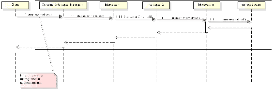

# 第五章：面向方面编程与设计模式

在本章中，我们将探讨**面向方面编程**（**AOP**）的概念，重点关注哪些情况下应该使用 AOP，以及如何通过使用 CDI 拦截器和装饰器来实现 AOP。最后，我们还将探讨其实现的一些示例。到本章结束时，你将能够使用拦截器和装饰器识别需要 AOP 的情况。此外，你还将能够识别实现这些概念的最佳方法。本章涵盖的主题如下：

+   面向方面编程

+   JEE 场景中的 AOP – 拦截器

+   EJB 拦截器实现

+   CDI 拦截器实现

+   装饰器模式

+   JEE 场景中的装饰器模式

+   装饰器实现

# 面向方面编程

AOP 是一种编程范式，它允许我们将业务逻辑与跨越所有应用程序的一些技术代码分离。换句话说，AOP 允许分离横切关注点。当我们向某些方法中输入日志代码以显示技术支持信息时，我们会遇到横切代码。我们也会在输入统计代码以查看方法被调用多少次或使用应用程序的用户是谁，或者甚至用于异常和错误处理时遇到它。我们在应用程序的几乎所有部分都能看到这种代码——这是在整个应用程序中重复的代码。这种代码有其自己的目标和关注点，将其从与应用程序用例相关的业务代码中分离出来是一个非常好的主意。

这些系统方面（如日志或异常处理）在模块化实现中非常困难。我们在这里说的是，我们不希望将这些方面与业务代码混合。通过混合这两种类型的代码，我们得到的是一个更难维护的最终代码。

使用 AOP，我们可以在不改变源代码的情况下添加或连接可执行代码，这意味着源代码保持完整。正如我们所说，如果我们想记录一个方法，例如，我们可以那样做而不破坏我们的业务代码，比如使用日志服务这样的服务代码。

# 编译时与运行时 AOP

AOP 是通过编译时或运行时代码注入来实现的。

在编译时实现 AOP 的框架会改变二进制代码（即`.class`文件），因此当拦截器代码被注入时，我们得到的是一个与未注入代码生成的`.class`文件不同的`.class`文件。结果`.class`文件与源代码不兼容。

另一方面，运行时注入不会修改源代码或`.class`文件。在这种情况下，拦截方法是在包含方法的类或位置之外的单独代码中完成的。因此，在方法原始调用之前和之后执行的拦截代码位于另一个类中。

Java 没有提供 AOP 的内置解决方案，但一些第三方框架，如 Eclipse AspectJ 和 Spring，在 Java 应用程序中得到了广泛使用。例如，我们可以使用 Eclipse AspectJ 来实现 AOP。Eclipse AspectJ 是 Java 编程语言的无缝面向方面扩展。它是一个兼容且易于使用的 Java 平台。然而，JEE 使用一种称为**拦截器**的新概念来实现 AOP，我们将在下一节中看到它是如何工作的。所有 JEE 程序员都可以使用拦截器来实现 AOP，而不需要获取与 AspectJ 解决方案相关的 JAR 依赖项并将其放入我们的应用程序中。

# JEE 场景中的 AOP – 拦截器

面向方面的软件开发使得对横切关注点的清晰模块化成为可能。为了所有 JEE 程序员的利益，我们还可以将业务代码与横切关注点分离，这是拦截器技术通过实现 JEE 提供的解决方案。

当调用 EJB 方法或托管 Bean 时，如果与此调用关联有拦截器（我们很快将看到它是如何实现的），我们可以在方法调用之前和之后（即方法返回之后）编写要立即执行的代码。

拦截过滤器模式是另一种用于拦截请求的模式。在 JEE 中，我们可以使用 Web 过滤器和 Servlet 实现过滤器模式。通过使用 Web 过滤器，Java Web 应用程序实现了对 Web 请求和响应的拦截。Web 应用程序可以拦截请求，执行操作，也可以拦截响应。以下列表包含了一些具有许多操作的过滤器示例：

+   认证/授权过滤器

+   日志和审计过滤器

+   图像转换过滤器

+   数据压缩过滤器

+   加密过滤器

+   分词过滤器

拦截器充当过滤器的作用，因此我们可以将 Web 过滤器视为拦截器。然而，这种机制与 Web 请求和响应相关。在本章中，我们不会讨论这种类型的拦截。相反，我们将介绍在托管 Bean 中使用的拦截器模式，即 EJB 拦截器、CDI Bean 拦截器以及一种称为*装饰器*的业务逻辑拦截器。

# 简要介绍 CDI 和 Bean

我们假设读者已经了解围绕 CDI 的基本特征，以及其主要目标和用途。然而，强调 CDI 的一些定义和方面非常重要。

CDI 技术是 JEE 平台的一个支柱，它存在于其大多数服务中。这意味着这些服务以某种方式依赖于 CDI 机制——CDI 与 EE 规范中的 bean 概念密切相关，因此让我们看看 bean 实际上是什么。

# 豆类

bean 的概念相当通用。在这里，我们不是在谈论 JavaBeans 的概念，即带有 getters 和 setters 访问方法的概念。相反，我们是在谈论 bean 作为 Web 组件或业务组件的概念。在这种情况下，我们会遇到几种类型的 bean，例如 Web 和 JEE 相关的 Java 类，如 EJB bean 和 JSF 托管 bean。甚至还有一些 JEE 规范之外的第三方框架（如 Spring）对 bean 有不同的概念。JEE bean 的概念被称为**托管 bean**，它由容器管理，需要程序员很少的干预，并且具有明确的生命周期。此外，托管 bean 可以提供拦截其执行和生命周期回调方法的机制，并且可以被注入到其他 bean 或 JEE 对象中。

因此，具有良好定义的生命周期上下文的对象可以被视为一个 bean 或一个托管 bean。换句话说，托管 bean 是容器构建和销毁（作为管理其生命周期的一部分）的组件。CDI 为几种不同类型的 bean 提供了内置支持。以下 Java EE 组件可以注入：

+   **托管 bean**：EJB 会话 bean、使用`@ManagedBean`注解的类、装饰器以及符合 CDI 规则成为托管 bean 的类

+   **Java EE 资源**：可以从组件环境命名空间引用的资源

+   **任意对象**：由生产者方法和字段返回的对象

托管 bean 也可以注入其他 bean。

**注意**：JSF 规范还描述了一种称为托管 bean 的技术。这些托管 bean 与我们这里描述的不同。Java EE 基础托管 bean 是 JSF 的一个泛化，并不限于 Web 模块。

JEE 平台还有其他对象（如 servlet 和拦截器对象）不被归类为 JEE bean，并且可能通过 CDI 机制注入 bean。可能注入 bean 的 JEE 平台组件如下：

+   Servlets（包括 Servlet 过滤器和服务监听器）

+   JSP 标签处理器和标签库事件监听器

+   JSF 作用域托管 bean

+   JAX-RS 组件

+   JAX-WSS 服务端点和处理器

+   WebSocket 端点

# CDI 中的托管 bean

有几种方法可以将 Java 类声明为托管 bean。例如，如果我们使用`@ManageBean`注解一个类，它就被定义为托管 bean。然而，CDI 规范坚持认为，一个类必须根据某些标准被视为托管 bean。这些标准如下：

+   它不是一个非静态内部类

+   它是一个具体类，或者它被`@Decorator`注解

+   它不是一个 EJB 组件

+   它不实现`javax.enterprise.inject.spi.Extension`

+   它要么有一个无参构造函数，要么声明了一个带有`@Inject`注解的构造函数

# 松散耦合

在 JEE 上下文中使用模式的一些目标是为了减少不同层之间——甚至同一层——的类之间的耦合，以及代码重用（即使用提供一定功能的现有代码）。有了这两个目标，我们能够提高软件维护和质量。但如何做到呢？

松散耦合允许程序员在最小影响其他层的情况下，在一个层中修复错误或开发新的功能。此外，随着每一段测试过的代码，可以从应用程序的不同部分调用特殊豆或对象的方法，从而提高软件组织和清晰度。因此，软件质量得到提升，开发时间减少。

如我们所知，松散耦合使代码更容易维护。

实际上，CDI 提供了松散耦合。此外，CDI 使用资格注解而不是字符串标识符，以强大、安全的方式工作。

在 JEE 中，使用事件、拦截器和装饰器提供松散耦合，如下列所示：

+   **事件通知**：在事件生成客户端和事件监听器（观察者）之间建立解耦

+   **拦截器**：将技术关注点与业务逻辑分离

+   **装饰器**：允许扩展业务关注点（向现有业务功能添加业务功能）

在本章中，我们将看到拦截器和装饰器如何实现这一目标。

# JEE 平台中的拦截器

一个 Oracle 教程将拦截器定义为如下：

"*拦截器是一个用于在关联的目标类中插入调用**方法**或生命周期事件的类。"*

如前所述，拦截器通常用于技术任务，称为横切任务。这包括审计、记录、控制统计等。这些任务与业务逻辑分开，并且可能在整个应用程序中重复。因此，我们可以将拦截器代码放入一个与我们要拦截的目标类不同的单独类中，以提高代码维护性。

拦截器的概念首次在 JEE5 中引入，并且最初仅用于 EJB（会话 Bean 和消息驱动 Bean）。随着 JEE6 中**上下文和依赖注入**（**CDI**）的引入，拦截器被扩展到所有托管 Bean——即满足 CDI 托管 Bean 的 Bean。

拦截器方法在关联的目标类上被调用。

我们可以在目标类内部定义一个拦截器作为拦截器方法，或者我们可以在一个单独的类（称为**拦截器类**）中定义拦截器，该类包含拦截器方法。拦截器方法总是在目标类方法被注解为需要拦截并被调用时，或者当生命周期回调方法被拦截（例如在 bean 构造或销毁之前）时被调用。需要注意的是，对于简单的应用，我们可以在目标类中放置拦截器。然而，对于更复杂的应用，或者当应用变得复杂时，我们应该将拦截器放在一个单独的类中。

每个你想拦截的元素被称为**建议**。我们说拦截器装饰了建议，每次建议被调用时，都会执行拦截器代码（如果存在）。此代码执行点的位置被称为**切入点**。

当建议目标类的方法被调用，或者当有生命周期事件并且与事件相关的生命周期回调方法被调用时，将调用关联的目标类上的拦截器方法。

以下图显示了拦截器序列图：



此序列图显示了拦截器链。当客户端调用业务方法并且与之关联有一个拦截器链时，首先调用第一个拦截器并执行某些操作（即，执行此第一个拦截器方法的代码），然后显式调用第二个拦截器，依此类推。这个过程一直持续到链中的最后一个拦截器调用托管 bean 的业务方法。我们将在稍后看到这个调用是如何进行的。现在，我们可以这样说，拦截器链中的每个元素以相同的方式调用下一个元素，直到最后一个元素——即托管 bean 本身的业务方法被调用。

我们可以使用注解来定义拦截器类和拦截器方法，或者，作为替代，我们可以定义应用的部署描述符。然而，在本节中，我们只将涵盖注解的使用。以下表格显示了在拦截器方法中使用的注解，这些注解定义了拦截的条件或拦截发生的时间：

| **拦截器注解** | **描述** |
| --- | --- |
| `javax.interceptor.AroundConstruct` | 这定义了一个在目标类构造函数被调用时接收回调的拦截方法 |
| `javax.interceptor.AroundInvoke` | 这定义了一个拦截方法，当目标类中被标记为需要通过注解进行拦截的方法被调用时执行 |
| `javax.interceptor.AroundTimeout` | 这定义了一个拦截超时方法的拦截器方法 |
| `javax.annotation.PostConstruct` | 这定义了一个用于后构造生命周期事件的拦截器方法 |
| `javax.annotation.PreDestroy` | 这定义了一个用于预销毁生命周期事件的拦截器方法 |

# EJB 拦截器实现

在本节中，我们将查看一个原始 EJB 拦截器实现的示例。

假设存在一个无状态会话 EJB，例如`AcademicFacadeImpl`，以及一个名为`testReview`的业务方法。这个方法负责安排学生测试复习。假设我们想从统计学的角度知道哪些学生提出了最多的测试复习请求。我们可以在业务代码中这样做，但这不是我们想要的。相反，我们希望将统计逻辑与业务逻辑分开——我们希望有一个统计拦截器。

首先，我们将创建一个名为`AcademicFacadeImpl`的 EJB 目标类（这个类已经在上一章中创建过）。一开始，没有拦截器引用，如下代码所示：

```java
@Stateless
@LocalBean 
public class AcademicFacadeImpl {
    ...
    ...
    // this method will be intercepted for some statistical 
    // interceptor:
    public void requestTestReview (@Observes TestRevisionTO 
    testRevisionTO) {
        System.out.println("enrollment : " + 
        testRevisionTO.getEnrollment());
        LocalDateTime dateTime = scheduleTestReview (testRevisionTO);
        // send an email with the schedule date for review:
        sendEmail (testRevisionTO, dateTime); 
    }
}
```

因此，我们使用前表中列出的拦截器注解之一来定义一个拦截器。这个拦截器可以在目标类内部或单独的拦截器类中找到。以下代码展示了在目标类中声明的`@AroundInvoke`拦截器方法：

```java
@Stateless
public class AcademicFacadeImpl {
   ...
   ...
   @AroundInvoke
  public Object statisticMethod (InvocationContext invocationContext)  throws Exception{
   ...
}

}
```

或者，我们可以使用一个单独的拦截器类。我们可以应用`@Interceptor`注解，但拦截器类不必注解。拦截器类必须有一个`public`和`无参数`的构造函数。以下代码展示了带有`@Interceptor`和`@AroundInvoke`拦截器方法的拦截器类：

```java
@Interceptor
public class StatisticInterceptor implements Serializable {

  @Inject 
  private Event<String> event; 

  @AroundInvoke
  public Object statisticMethod (InvocationContext invocationContext) throws Exception{
    System.out.println("Statistical method : "
        + invocationContext.getMethod().getName() + " " 
        + invocationContext.getMethod().getDeclaringClass()
        );

    // get the enrollment:
    TestRevisionTO testRevisionTO = 
    (TestRevisionTO)invocationContext.getParameters()[0];

    System.out.println("Enrolment : " + 
    testRevisionTO.getEnrollment());

    // fire an asynchronous statistical event:
    event.fire (testRevisionTO.getEnrollment());

    return invocationContext.proceed();

  }

}
```

在这个例子中，我们使用 CDI 事件 API。这个 API 用于实现事件触发机制。基本上，它使用一个 bean 来触发事件，一个或多个 bean 观察这个触发。这个机制是从一个`Event`类对象实现的，如下代码所示。我们使用`String`类型来限定事件，但我们可以使用任何其他类型，或者使用限定符来限定我们的事件。

我们还可以看到`statisticMethod`方法的参数`InvocationContext`对象。这个对象提供了关于拦截调用上下文的信息。此外，这个对象有控制链式拦截器的方法。例如，`proceed`方法调用拦截器链中的下一个拦截器，或者业务对象的拦截方法。我们将在后面了解更多关于`InvocationContext`的信息。

接下来，我们必须使用`@Interceptors`注解定义至少一个拦截器。我们可以在目标类的类或方法级别定义拦截器，通过指定我们是否想拦截所有业务方法或只是某些特定的业务方法。以下代码仅展示了在类级别声明的一个拦截器：

```java
@Stateless
@Interceptors({StatisticInterceptor.class})
public class AcademicFacadeImpl
```

以下代码声明了相同的拦截器，但位于方法级别：

```java
@Stateless
public class AcademicFacadeImpl{
   ...
   @Interceptors({StatisticInterceptor.class})
   public void requestTestReview (@Observes TestRevisionTO 
   testRevisionTO) {
      ...
   }
}
```

我们将在方法级别放置`@Interceptors`。这是因为我们不想拦截所有其他 EJB 方法。

最后，我们必须创建一个将观察统计事件的类。这个类将处理统计问题。如下代码所示：

```java
public class StatisticalFacadeImpl {

    public void control (@Observes String enrolment ) {
        System.out.println("This enrolment is asking for a test 
        revision : " +  enrolment);
        // Here we can persist this information, for example. 
    }
}
```

当调用`AcademicFacadeImpl`类的`requestTestReview`方法时，它会被拦截（此方法带有拦截器标记），因此会调用`StatisticInterceptor`类的`statisticMethod`方法。在执行此方法期间，会触发一个统计事件。这里的目的是对业务方法的执行进行异步的统计控制。

作为一种替代方案，我们可以将`StatisticalFacadeImpl`转换为 EJB，并使用`@Asynchronous`注解`control`方法。结果，我们就不必触发统计事件，而是可以调用以下异步方法：

```java
@Stateless
@LocalBean
public class StatisticalFacadeImpl {
    @Asynchronous
    public void control (String enrolment ) {
        System.out.println("This enrolment is asking for a test 
        revision : " +  enrolment);
    }
}
```

# 拦截方法调用

如果我们想让一个特定方法成为切入点，我们必须使用`@AroundInvoke`注解它。`@AroundInvoke`方法（或切入点方法）必须*返回一个对象*，并且必须有一个`InvocationContext`类型的参数。此外，切入点方法应该*抛出异常*。

可以调用`InvocationContext`方法来访问有关当前上下文的信息，例如切入点的名称、方法注解、方法参数等。然而，重要的是要注意，在拦截情况下，只有当`@AroundInvoke`方法调用`proceed`方法时，目标类方法才会被调用。因此，`@AroundInvoke`方法必须调用`proceed`方法来调用目标类方法。在拦截器链的情况下，每次调用 EJB 业务方法时，每个链拦截器的每个`@AroundInvoke`方法都会按照它们配置的顺序（通过`@Interceptors`）被调用，直到调用目标类方法。

这些`@AroundInvoke`拦截器方法可以具有任何访问级别修饰符——公共的、受保护的、私有的或包级别的。然而，方法不能是静态的或最终的。请记住，每个类只允许有一个`@AroundInvoke`拦截器方法。

`AroundInvoke`拦截器方法具有以下形式：

`@AroundInvoke`

`[public, protected, private or package-level ] Object method-name (InvocationContext) throws Exception { ...}`

每个类只允许有一个`AroundInvoke`拦截器方法。

另一个需要记住的重要事情是，`AroundInvoke`拦截器可以与目标方法具有相同的事务上下文。

# 拦截器类和多个方法拦截器

在单独的类中拥有拦截器可以通过在类之间提供清晰的职责划分来提高代码维护性，这意味着类变得更加紧密。此外，拦截器类可能被注入资源和托管 Bean。

另一个值得注意的重要因素是，拦截器方法属于同一个 EJB 事务上下文。因此，每次我们想要拦截业务逻辑以执行技术任务，例如日志记录或统计持久化时，我们必须小心。例如，我们不希望在统计控制期间抛出任何错误，从而生成业务事务回滚。

在这种情况下，我们应该执行异步统计控制。这将保证任何最终错误都会在一个新的事务中发生，与当前事务分离。因此，在编码之前实现良好的软件设计和强大的业务知识是至关重要的。

拦截器类可以注入资源和托管 Bean。

`@Interceptors` 注解用于将一个或多个拦截器注入到 EJB 目标类或 EJB 目标方法中。请参见以下代码：

```java
@Interceptors({PrimaryInterceptor.class, SecondaryInterceptor.class,
        LastInterceptor.class})
public void method(String prm) { ... }
```

拦截器按照在 `@Interceptors` 注解中定义的顺序被调用。然而，如果拦截器也在部署描述符中定义，则可以覆盖此顺序。因此，如果存在拦截器链，拦截器将按照 `@Interceptors` 中指定的顺序通过调用 `InvocationContext.proceed` 方法来调用下一个拦截器。这将继续，直到调用业务方法。

拦截器类在 EJB 目标类中被引用，这导致目标类发现拦截器类。这种情况在两个类之间建立了耦合。我们将在稍后介绍 CDI 拦截器机制如何纠正这种情况。

# 拦截生命周期回调事件

用于生命周期回调事件（`AroundConstruct`、`PostConstruct` 和 `PreDestroy`）的拦截器方法遵循与之前描述的拦截器实现模型相同的模式，关于位置方面。这可以在目标类、拦截器类或两个类中定义。在本章中，我们将仅看到 `PostConstruct` 和 `PreDestroy` 回调事件的示例。

如前表中的拦截器注解所述，带有 `@PostConstruct` 注解的方法用于拦截 `PostConstruct` 生命周期事件，而带有 `@PreDestroy` 注解的方法用于拦截 `PreDestroy` 生命周期事件。拦截器类具有与目标类相同的生命周期。这意味着当目标类的一个实例被创建时，目标类中每个拦截器类的声明都会创建一个拦截器对象。

然而，还有另一种方法可以解决这个问题。我们可以为生命周期事件定义回调方法，并为这些回调方法定义拦截器方法。因此，我们真正想要拦截的是回调方法。目标类内部的生命周期事件回调方法（或目标类侧的生命周期事件拦截器）具有以下语法：

```java
void someMethod() { ... }
```

这的例子可能是以下内容：

```java
@PostConstruct
void initialize() { ... }

@PreDestroy
void finalize () { ...}
```

在拦截器类中定义的此回调方法（或在拦截器类侧的生命周期事件拦截器）的拦截器方法具有以下语法：

```java
void someOtherMethod(InvocationContext ctx) { ... }
```

一个例子可能是以下内容：

```java
@PostConstruct
void initialize (InvocationContext ctx){...}
@PreDestroy
void cleanup(InvocationContext ctx) { ... }
```

我们可以定义生命周期事件（`AroundConstruct`、`PostConstruct`和`PreDestroy`）的回调方法，我们也可以为这些回调方法定义拦截器方法。

在测试各种情况时，我们注意到一些有趣的事情。

对于类级别的`@Interceptors`，如果目标类和拦截器类中定义了同一生命周期事件的两个方法，那么只调用回调拦截器。然而，如果在回调拦截器内部显式调用了`InvocationContext.proceed`，则目标类中的回调方法也会被调用。让我们看看当我们用`@PostConstruct`注解同时注解 EJB 类和`Interceptor`类时会发生什么。

下面的代码显示了 EJB `AcademicFacadelImpl`类的`initialize`方法（它有一个`@PostConstruct`注解）：

```java
public AcademicFacadelImpl  () {
    System.out.println ("creating  bean.");
}

@PostConstruct
public void initialize () {
    System.out.println ("post construct of bean.");
}
```

下面的代码显示了`Interceptor`类的`initialize`方法（它有一个`@PostConstruct`注解）：

```java
@PostConstruct
 public void initialize (InvocationContext ctx) {
    System.out.println ("intercepting post construct of bean.");
 }
```

我们将收到以下响应：

```java
creating  bean.
intercepting post construct of bean.
```

然而，我们也可以在`Interceptor`类中这样做，如下所示：

```java
@PostConstruct
 public void initialize (InvocationContext ctx) {
    System.out.println ("intercepting post construct of bean.");
    ctx.proceed();
 }
```

通过这样做，我们将收到以下响应：

```java
creating bean.
intercepting post construct of bean.
post construct of bean
```

对于方法级别的`@Interceptors`，只有回调方法会被调用，无论在拦截器类中是否调用了`InvocationContext.proceed`。

# CDI 拦截器实现

在介绍 CDI 机制的同时，基于之前看到的 Java EE 拦截器的功能，建立了一种新的拦截器方法。使用 CDI 引擎，您可以拦截 CDI 管理的业务方法，而不仅仅是 EJB 方法。在 CDI 上下文中，拦截器的一个关键区别是拦截器注入到管理 bean 的方式。我们现在有了拦截器绑定类型的概念。这是一个注解，用于限定 bean 所需的拦截器类型。

假设我们想要创建一个用于日志记录的拦截器。在这种情况下，我们最初会创建一个名为`@Loggable`的拦截器绑定类型，其描述如下：

```java
@Inherited
@InterceptorBinding
@Retention(RUNTIME)
@Target({METHOD, TYPE})
public @interface Loggable {
}
```

然后，我们将创建一个拦截器类。拦截器类同时注解了拦截器绑定类型和`@Interceptor`注解。在这个例子中，我们创建了`LoggedInterceptor`类，如下面的代码所示：

```java
@Loggable
@Interceptor
public class LoggedInterceptor implements Serializable {

 @AroundInvoke
 public Object logMethod (InvocationContext invocationContext) throws 
 Exception{
 System.out.println("Entering method : "
 + invocationContext.getMethod().getName() + " " 
 + invocationContext.getMethod().getDeclaringClass()
 );
 return invocationContext.proceed();
 }
}
```

`@AroundInvoke`方法与之前在 EJB 拦截器中描述的方式相同。

此外，`@Loggable`作为类拦截器的限定符。由于它是一种限定符，因此总是很有趣地将拦截器绑定类型声明为形容词。因此，我们使用单词*可记录的*，这意味着它适合于日志记录。

一旦我们创建了拦截器绑定类型和拦截器类，我们就可以用绑定类型注解整个 bean 或某些单个 bean 方法，以拦截所有 bean 方法或特定方法。看看以下示例：

```java
@Loggable
public class ProfessorDAO implements Serializable {
 ...
}
```

对于特定方法，我们将使用以下方法：

```java
public class ProfessorDAO implements Serializable {
   ...
    @Loggable
    public Professor findByName (String name) {
        ... 
    }
}
```

要调用拦截器 CDI，必须在`beans.xml`中指定，如下面的代码所示：

```java
<interceptors>
 <class>academic.interceptors.LoggedInterceptor</class>
 </interceptors>
```

一个应用程序可以使用多个拦截器。如果一个应用程序使用了多个拦截器，那么拦截器的调用顺序将按照`beans.xml`文件中指定的顺序进行。

CDI 拦截器和过去的 EJB 拦截器之间存在根本性的区别。CDI bean 对拦截器实现类一无所知；它只知道拦截器绑定类型。这种方法导致了松耦合。

让我们使用与 EJB 拦截器相同的示例。然而，这次我们将使用 CDI 拦截器机制。我们将使用相同的`AcademicFacadeImpl` EJB，但我们将使用一个名为`Statistic`的拦截器绑定类型，并用此绑定类型注解`StatisticInterceptor`类。

让我们看看以下代码：

```java
@Inherited
@InterceptorBinding
@Retention (RetentionPolicy.RUNTIME)
@Target({ElementType.METHOD, ElementType.TYPE})
public @interface Statistic {
}
@Statistical
@Interceptor
public class StatisticInterceptor implements Serializable {

  @Inject 
  Event<String> event; 

  @AroundInvoke
  public Object statisticMethod (InvocationContext invocationContext) 
  throws Exception{
    System.out.println("Statistical method : "
        + invocationContext.getMethod().getName() + " " 
        + invocationContext.getMethod().getDeclaringClass()
        );

    // get the enrolment:
    TestRevisionTO testRevisionTO = (TestRevisionTO)invocationContext.getParameters()[0];

    System.out.println("Enrollment : " + testRevisionTO.getEnrollment());

    // fire an asynchronous statistical event:
    event.fire (testRevisionTO.getEnrollment());
    return invocationContext.proceed();
  }

}
```

我们将使用与`StatisticalFacadeImpl`相同的 EJB 来处理统计元素，如下面的代码所示：

```java
/**
 * Session Bean implementation class StatisticalFacadeImpl
 */
@Stateless
public class StatisticalFacadeImpl {

    /**
     * Default constructor. 
     */
    public StatisticalFacadeImpl() {
        // TODO Auto-generated constructor stub
    }

    public void control (@Observes String enrolment ) {
      System.out.println("This enrolment is asking for a test revision : " + enrolment);
    }

}
```

最后，我们将使用`@Statistic`注解我们的业务方法（或类）。在这种情况下，我们将注解一个业务方法：

```java
**
 * Session Bean implementation class AcademicFacadeImpl
 */
@Stateless
public class AcademicFacadeImpl  {
   ...
   ...
@Statistic
public void requestTestReview (@Observes TestRevisionTO testRevisionTO) {
    System.out.println("Enrollment : " + testRevisionTO.getEnrollment());
    LocalDateTime dateTime = scheduleTestReview (testRevisionTO);
    sendEmail (testRevisionTO, dateTime); // send an email with the schedule date for the test review:
  }   
    ...
    ...
}
```

每当客户端调用带有`@Statistic`注解的 EJB 方法（或任何 CDI 管理的 bean 的任何被拦截的方法）时，首先调用`StatisticInterceptor`类的`@AroundInvoke`方法。在我们的示例中，`@AroundInvoke`方法触发一个异步事件。这种方式是故意设置的，以便统计控制不参与业务流程。

# 装饰器

装饰器是一种模式，它使得在运行时动态地扩展特定功能性的业务逻辑成为可能。装饰器模式作为一个业务组件包装器，拦截负责执行功能的`call`方法。换句话说，这个模式通过包装相同的对象来装饰原始业务对象，同时提供额外的功能，同时保持现有功能完整。装饰器模式是一种结构型设计模式。

这种模式在运行时动态地改变对象的功能方式，而不影响现有对象的功能。简而言之，这个模式通过包装对象来向对象添加额外的行为。

# 装饰器模式

装饰器模式是 GoF 结构模式中最常用的模式之一。其类图如下所示：


该模式的构成元素在《设计模式》：*可复用面向对象软件元素*（GoF 书籍）中进行了描述，并在下表中展示：

| `Component` | 这定义了可以动态添加职责的对象的接口 |
| --- | --- |
| `ConcreteComponent` | 这定义了一个对象，可以附加额外的职责 |
| `Decorator` | 这维护了对组件对象的引用，并定义了一个符合组件接口的接口 |
| `ConcreteDecorator` | 这向组件添加职责 |

我们可以在编译时使用继承或组合来扩展业务类或域的基本行为。然而，我们无法在运行时这样做。装饰器模式用于在运行时扩展功能。

为了更好地解释装饰器模式，让我们从一个学术领域的例子开始。想象一下，我们有一个名为 `BasicEngineering` 的域类，并且这个类有一个执行列出基本工程所使用的学科的任务的方法。让我们假设我们还有两个其他工程模型——机械工程和电气工程。每个模型都有自己的学科。因此，每个工程模型都有一个基本学科的列表加上其自己的特定学科的列表。

以下类图显示了这种安排：


我们可以在经典的装饰器模式中实现这个模式，但这不是我们的目标。实际上，我们不需要以简单的方式实现它，因为 JEE 技术已经为我们提供了一个使用 CDI 技术实现装饰器模式的机制。我们将使用 `@Decorator` 注解来实现这个模式。

# JEE 场景中的装饰器

首先，我们创建一个 `Engineering` 接口，该接口具有我们想要装饰的业务方法。然后，我们创建一个名为 `BasicEngineering` 的抽象类，它扩展了 `Engineering`。如下代码所示，我们可以使用两个具体装饰器来创建一个抽象的 `EngineeringDecorator`，或者我们可以创建两个直接实现 `Engineering` 的抽象装饰器类。没有义务保持装饰器类是具体的。

为了简化，让我们创建两个装饰器类为抽象的，而不需要从基本装饰器类扩展它们。因此，`ElectronicDecorator` 和 `MechanicalDecorator` 类都将装饰 `Engineering` 对象（`ElectronicEngineering` 和 `MechanicalEngineering`）。

以下代码显示了在此示例中使用的模型类：

```java
public interface Engineering {
 List<String> getDisciplines ();
}
public class BasicEngineering implements Engineering {

 @Override
 public List<String> getDisciplines() {
 return Arrays.asList("d7", "d3");
 }
}
@Electronic
public class ElectronicEngineering extends BasicEngineering {
 ... 
}
@Mechanical
public class MechanicalEngineering extends BasicEngineering {
 ...
}
```

我们可以看到，`ElectronicEngineering` 和 `MechanicalEngineering` 类分别被 `@Electronic` 和 `@Mechanical` 装饰器修饰。我们可以看到，通过限定符，我们可以识别出将要装饰的对象类型。因此，`MechanicalDecorator` 装饰任何具有 `@Mechanical` 限定符的 `Engineering` 对象，而 `ElectronicDecorator` 装饰任何具有 `@Electronic` 限定符的 `Engineering` 对象。

# 装饰器实现

以下代码显示了`MechanicalDecorator`和`ElectronicDecorator`装饰器类：

```java
@Decorator
public abstract class MechanicalDecorator implements Engineering {
   @Mechanical
   @Any
   @Inject
   @Delegate
   Engineering engineering;

   @Override
   public List<String> getDisciplines() {
      System.out.println("Decorating Mechanical Engineering");
      List<String> disciplines = new ArrayList<>
      (engineering.getDisciplines());
      disciplines.addAll (Arrays.asList("d31", "d37", "d33", "d34", 
      "d32"));
      return disciplines;
    }
}
@Decorator
public abstract class EngineeringDecorator implements Engineering {
   @Electronic
   @Any
   @Inject
   @Delegate
   Engineering engineering;

   @Override
   public List<String> getDisciplines() {
      System.out.println("Decorating Electronic");
      List<String> disciplines = new ArrayList<>
      (engineering.getDisciplines());
      disciplines.addAll (Arrays.asList("d21", "d27", "d23", "d24", 
      "d22"));
      return disciplines;
    }
}
```

我们可以看到`Engineering`对象被注解为`@Delegate`。这是将被装饰的业务对象。当被调用时，`getDisciplines`业务方法会将调用传递给装饰器的`getDisciplines`方法。在这个时候，装饰器负责处理这种情况。装饰器的`getDisciplines`方法调用代理对象的`getDisciplines`方法并添加装饰学科。这意味着它通过添加特定的学科来扩展基本功能。

同样重要的是要记住，`@Electronic`限定符标识了被装饰的对象。因此，`ElectronicDecorator`装饰了`@Electronic`对象，而`MechanicalDecorator`装饰了`@Mechanical`对象。

有理由怀疑为什么`getDisciplines`方法不能放入每个模型类中。根据业务类型的不同，这种方法可能更好。然而，假设学科可能有很大的差异，并且我们有大量的工程模型。在这种情况下，事情可能会变得更加复杂，使用装饰器可以为已经建立的东西添加功能。

装饰器可以声明为抽象类，这样它就不必实现接口的所有业务方法。

此外，为了在 CDI 上下文中调用装饰器，它必须在`beans.xml`文件中指定，就像拦截器一样。因此，我们的示例装饰器指定如下：

```java
<decorators>
     <class>book.chapter3.decorator.ElectronicDecorator</class>
     <class>book.chapter3.decorator.MechanicalDecorator</class>
 </decorators>
```

如果应用程序使用多个装饰器，则装饰器按在`beans.xml`文件中指定的顺序调用。

如果应用程序既有拦截器又有装饰器，则首先调用拦截器。

装饰器必须在`beans.xml`文件中像拦截器一样指定。装饰器按在`beans.xml`文件中指定的顺序调用。

实际上，我们可以创建另一个名为`BasicEngineeringDecorator`的装饰器，它将负责装饰任何`Engineering`对象。然后我们只需简单地输入`@any`限定符来限定`Engineering`对象。当然，我们也应该担心顺序。这应该是首先调用的因素。因此，装饰器在`beans.xml`文件中按如下顺序列出：

```java
<decorators>
     <class>book.chapter3.decorator.BasicEngineeringDecorator</class>
         <class>book.chapter3.decorator.ElectronicEngineeringDecorator</class>
     <class>book.chapter3.decorator.MechanicalEngineeringDecorator</class>
 </decorators>
```

# 摘要

在本章中，我们了解到拦截器和装饰器是 JEE 平台提供面向方面编程的平台。拦截器用于在关联的目标类中插入某些方法调用或生命周期事件的调用。拦截器负责处理在整个应用程序中重复出现的技术任务，称为**横切任务**，例如日志记录、审计和异常处理。这些任务与业务逻辑分开，将拦截器放在单独的类中以便于维护是一个好主意。

我们学习了经典拦截器机制在 EJB 中的应用，以及 CDI 检查器机制，它可以拦截任何托管 Bean，而不仅仅是 EJB 管理的 Bean。

当拦截器负责技术任务时，我们可以通过装饰器向现有的业务逻辑中添加功能。我们了解到装饰器模式是一种众所周知的结构型设计模式。装饰器是业务类的一种拦截器，当我们想要在不破坏业务类的前提下为其添加功能时，就会使用它。

使用拦截器和装饰器促进了低耦合和易于维护。然而，我们必须谨慎使用它们。例如，关于装饰器，我们应该避免过度地在应用程序中扩散它们。过度的分散化可能会产生相反的效果，并恶化代码维护。

拦截器属于它所拦截的业务类的相同事务上下文。由于拦截器只处理技术问题，与之相关的任务不能影响业务逻辑的执行。因此，在技术任务中产生的错误不能抛给业务逻辑。同样地，这些任务的执行时间不能组成业务逻辑的执行时间。
