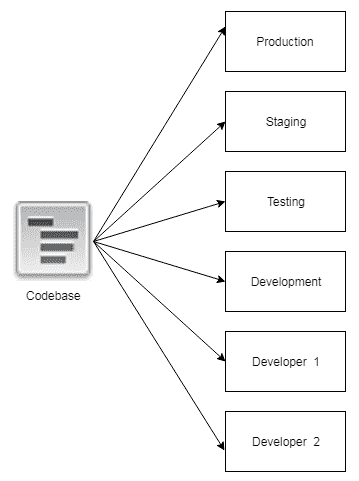
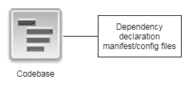
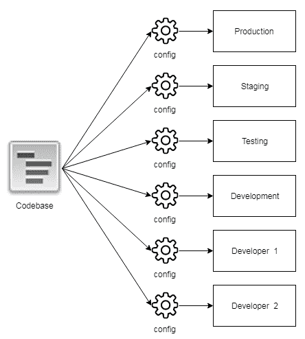
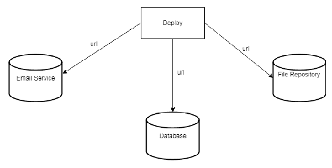
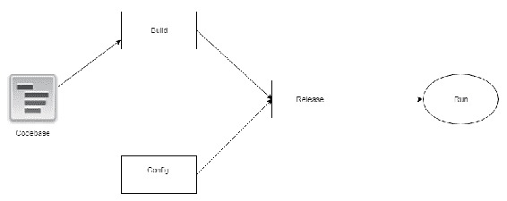
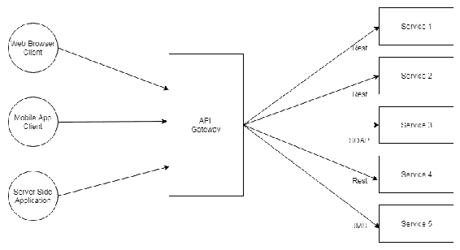
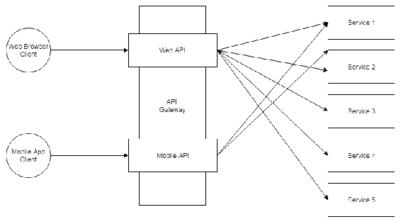
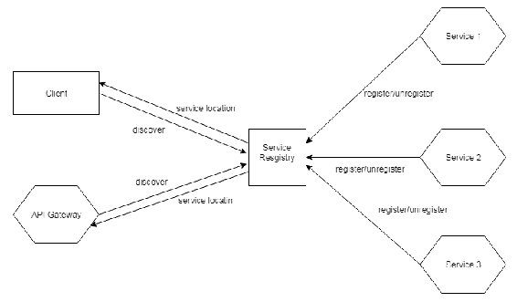
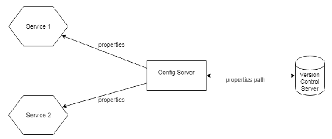

# 第八章：云原生应用程序模式

在本章中，我们将解释云原生应用程序模式，探讨云原生应用程序是什么以及其目标是什么。我们还将展示之前章节中描述的图案以及针对基于云的应用程序出现的新图案。阅读本章后，读者将能够理解表征云架构的概念和模式。

在本章中，我们将涵盖以下主题：

+   解释云原生应用程序的概念

+   解释云应用程序的目标

+   解释云设计模式

# 解释云原生应用程序的概念

云及其资源正越来越多地成为企业生活的一部分。在过去，云资源被用于存储管理、电子邮件、文档和照片等解决方案。如今，在云结构中部署企业应用程序无疑指明了公司应遵循的道路。

云已成为开发业务应用程序时首先考虑的策略之一。这里的重大挑战是使此应用程序使用云提供的功能，如弹性、可扩展性和可用性，以利于业务。

首先，单体应用程序被迁移并部署到云中。我们取得了一些成果，如更好的管理和控制，以及可用性。但我们真正想要的是与云提供的功能集成的应用程序，即利用云计算资源更好地解决业务问题。

然后是云原生应用程序，这是一种利用云提供的优势和能力的应用程序。该应用程序的开发使用了一套设计模式。我们将在本章后面更详细地探讨云架构中使用的某些主要设计模式。

云计算环境在基本意义上是弹性的，即计算资源根据需求使用和释放。因此，与数据中心控制下的应用程序相比，可扩展性和可用性以更少的复杂性实现。

基于云原生计算基础，指导云原生应用程序的特性如下：

+   **容器封装**：应用程序在隔离单元中执行

+   **动态管理**：有一个中央编排来管理应用程序，提高资源利用率，并降低运营成本

+   **面向微服务**：云中的应用程序是松散耦合的

因此，云原生应用程序具有高度分布的特性。这是因为该应用程序部署在云中，并且这些特性得到了满足。

# 解释云原生应用程序的目标

云设计模式旨在构建安全、可靠的云应用程序。以下列表将展示云原生应用程序要实现的其他特征：

+   **可用性**：应用程序运行和运行的时间。所期望的是所有系统功能的持续运行。

+   **数据管理**：应用程序处理的数据是云应用程序的基石。数据可以在多个服务器（或集群）之间分布或复制，以实现可伸缩性、可用性，甚至性能。

+   **消息传递**：为了提高可伸缩性，云中的服务或应用程序具有低耦合性，并且通常使用异步消息进行通信。

+   **管理和监控**：由于云应用程序在远程环境中运行，必须有一种方法可以通过日志和报告来监控非功能性属性状态——例如计算资源的使用情况。此外，我们必须能够部署新的实现，而无需停止应用程序（保持可用性特性）。

+   **性能和可伸缩性**：即使在计算资源的使用和应用程序扩展增加的情况下，也能保持性能。

+   **弹性**：云应用程序应该能够快速克服故障。这个问题对于保持可用性非常重要。

+   **安全性**：云应用程序向用户公开了其多个元素，应该能够防止恶意用户或恶意程序发起的攻击。

在这里需要注意的是，在实现分布式应用程序，尤其是云原生应用程序时，有一些问题应该予以考虑。这些由 L. Peter Deutsch 和 Sun Microsystems 的其他人提出的“分布式计算谬误”描述了关于分布式编程的错误假设：

+   网络可靠

+   延迟为零

+   带宽无限

+   网络安全

+   拓扑结构不改变

+   只有一位管理员

+   传输成本为零

+   网络同质

一方面，云原生应用程序要实现的目标和挑战，另一方面，分布式应用程序实现中一直存在的困难，我们推出了设计模式来解决云原生应用程序面临的问题。随着我们的进展，我们将展示在云架构中使用的的主要设计模式。

# 解释云设计模式

既然云应用程序的概念及其挑战已经定义，让我们直接进入正题，讨论用于实现云架构的设计模式：

+   复合应用程序（微服务）

+   抽象

+   十二要素

+   API 网关

+   服务注册表

+   配置服务器

+   电路断路器

# 复合应用程序（微服务）

在第七章，《微服务模式》中，我们展示了将应用程序分解为函数的优势（以及劣势），并从中获得多方面的好处，始终以应用业务为目标。在该章中，确立了基于微服务的架构的特点，即通过将应用程序分解为小型、功能独立且具有良好定义的松散耦合通信接口的组件。

# 抽象

此模式指出，重点必须放在客户端的需求上，而不是现有的硬件结构上。从这个意义上说，云计算的计算资源是按需使用的，这体现了弹性可伸缩性。这样，资源以抽象的方式看待，并根据客户的需求进行改变。

# 十二要素

十二要素方法基于指导创建成功 SaaS 项目的十二要素。这项技术是在 Heroku 的开发过程中创建的，Heroku 是一个支持多种编程语言的云服务平台（PaaS），包括 Ruby、Java、Node.js、Scala、Clojure、Python 和 PHP。

在开发和支持 SaaS 应用程序期间获得的经验被编目，即记录遇到的错误，并为出现的问题制定解决方案。因此，创建了十二要素方法，这是一套使开发基于云的应用程序更加容易的指南。为了教学目的，这里有一些定义——SaaS 代表*软件即服务*，PaaS 代表*平台即服务*。SaaS 最广为人知，因为它在市场上的增长率最高。以下为十二要素：

+   **代码库**: 在版本控制中跟踪一个代码库，同时进行多次部署

+   **依赖项**: 明确声明并隔离依赖项

+   **配置**: 在环境中存储配置

+   **备份服务**: 将备份服务视为附加资源

+   **构建、发布、运行**: 严格分离构建和运行阶段

+   **进程**: 以一个或多个无状态进程执行应用程序

+   **端口绑定**: 通过端口绑定导出服务

+   **并发**: 通过进程模型进行扩展

+   **可丢弃性**: 通过快速启动和优雅关闭最大化鲁棒性

+   **开发/生产一致性**: 尽可能保持开发、预发布和生产环境的相似性

+   **日志**: 将日志视为事件流

+   **管理进程**: 将管理/管理任务作为一次性进程运行

# 代码库

代码库是指任何单一存储代码的仓库。每个应用程序只能有一个代码库。在十二要素方法中，多个应用程序不能共享相同的代码库。在这种情况下，一种解决方案是通过生成作为依赖项进入项目的库来重构共享代码。

代码库必须由版本控制系统（如 subversion 或 Git）进行管理。从这个代码库中生成各种部署，每个部署针对不同的环境——开发、预发布和生产。

开发者在本地开发环境中运行应用程序的一个版本（即部署）：

# 依赖项

项目使用的每个依赖项都必须声明，并且与代码隔离。在这种情况下，我们可以使用一些包管理工具（如 Maven、grundle 和 npm）。例如，Maven 工具用于构建和记录项目。依赖项在`pom.xml`文件中声明，我们可以声明项目依赖项：

# 配置

应用程序的配置是不同部署之间所有变化的配置。它可以包括：

+   数据库访问的主机、端口和凭证

+   数据库模式

+   缓存设置

+   访问消息队列的主机、端口和凭证

十二要素方法要求将配置与代码分离。因此，配置永远不应该在代码中，因为配置可能在不同部署之间有所不同，但代码不会。十二要素方法不推荐将配置放在文件中，如 Java 属性文件，因为总有可能在不同环境中放置相同的配置数据（例如，当开发者在版本控制存储库中提交其本地配置时）。另一个弱点是这些配置文件的安全问题。十二要素方法建议使用环境变量，这些变量可以在部署应用程序到特定环境时注入：

# 后备服务

后备服务是应用程序使用的外部服务，例如数据库、消息服务、文件存储库或电子邮件服务。十二要素方法将应用程序外部每个服务视为一种资源。这些资源必须通过 URL 或位置以及应用配置中的凭证属性来访问。这样，对服务位置（如数据库或文件存储库）的任何更改都不会影响应用程序代码。这种变化对代码来说是不可察觉的，从而实现了低耦合。我们还可以使用抽象或接口来访问这些服务，除了应用配置之外。

作为第一个例子，我们有一个存储在存储库中的文件。无论本地还是远程访问（如 Amazon S3），都可以通过 URL 访问存储库。为此，我们使用应用配置。当然，在最后实例中，存储文件本地或远程的方式可能不同，但使用接口可以极大地改善这个问题。

作为第二个例子，我们有在不同环境中使用 SQL 数据库的情况（生产、预发布和开发）。我们应该只通过应用程序的配置来更改连接到数据库的 URL。这种策略应该扩展到数据库管理系统可能的变化，例如从 MySQL 到 DB2。当然，我们知道在实践中，使用特定数据库的机制可以提高性能。然而，如果发生变化，这些变化将是微小的：

# 构建、发布、运行

将代码库转换为特定环境的过程必须分为三个严格独立的阶段：

+   **构建**：编译并生成可执行包；例如，生成 EAR 或 WAR 存档。

+   **发布**：将应用程序的配置应用于可执行包。生成的发布，即构建过程中生成的包与应用程序配置的组合，已准备好在包含配置的环境中扫描。

+   **运行**（或运行时）：在特定环境中初始化应用程序。

这些步骤的分离，即定义它们的职责，对于提高系统维护和自动化非常重要。在这些步骤中使用了持续集成工具（Maven 和 Jenkins 是这些工具的例子）：

# 进程

十二因素方法论强调，所有应用程序的过程或组件都必须是无状态的和无共享的，也就是说，它们不应该存储信息。因此，在分解为微服务应用程序中，每个微服务都不应该在内存中存储信息或使用服务器缓存。这是提升应用程序的一个重要因素。如果有在请求之间存储某些状态或稍后要使用的一些数据的需求，我们可以使用数据库。

当我们使用内存来存储信息以供后续请求使用时，我们面临风险，因为下一个请求可能位于不同的进程（或者请求甚至可以由另一个服务器处理）：

# 端口绑定

十二因素应用程序是完全自包含的，不依赖于使用外部服务器（如 Tomcat 或 Apache）作为服务导出。十二因素应用程序必须通过端口绑定导出 HTTP 服务，这意味着应用程序也通过 URL 与世界交互。这样，一个应用程序可以成为另一个应用程序的后端服务或外部资源。

# 并发

十二要素应用必须设计成使用允许并行执行进程的进程模型来扩展。这就像在执行守护进程时使用的 UNIX 进程模型。因此，我们可以设计只处理 HTTP 请求的进程，同时也可以有处理非常长且在后台执行的任务的进程。当应用需要扩展时，进程模型显示出其重要性，因为此时应用被复制，而不是执行一个新实例。

# 可丢弃性

在云计算的世界里，进程不断涌现和消亡；这正是导致按需扩展加剧的原因。在这些条件下，进程的诞生或起源必须尽可能快，你的中断应该尽可能快，并且影响尽可能小。

十二要素应用的进程是可丢弃的，这意味着它们可以随时初始化和停止。一个没有造成影响的进程意味着它应该优雅地结束，如果需要的话保存状态，并释放分配的计算资源。

# 开发/生产一致性

十二要素应用应尽可能保持生产、测试和开发环境的状态相似。这有助于持续部署的过程，同时避免在构建从开发环境发送到生产环境时可能产生的错误。

# 日志

十二要素应用的日志应被视为事件流。在传统环境中，日志可以生成一个文件。然而，可能会出现问题，例如磁盘空间不足。我们知道在云计算环境中，根据需求具有弹性可伸缩性，进程不断诞生和消亡。同样，机器和容器可能不再被使用。在云中的这种调整过程中，日志文件可能会丢失。在云平台上将日志视为事件流是至关重要的。这样，日志可以被导向任何地方。例如，它们可以被导向 NoSQL 数据库、另一个服务、存储库中的文件、日志索引和分析系统，或者数据仓库系统。

# 管理进程

十二要素方法指出，维护任务，如数据迁移的脚本执行、初始数据加载和缓存清理，应该自动化并在规定时间内执行。因为我们的应用将在多个环境中运行，并且跨越多个服务器，因此有必要使用相同的一套工具、软件和配置文件来执行这些任务。因此，不同环境之间的并行问题减少。

# API 网关

将应用程序分解成小型、智能且定义良好的组件是云计算领域中的一个重要设计模式。这些组件是绑定应用程序业务的微服务。然而，正如第七章《微服务模式》中所述，随着应用程序历史中功能的增长，对这些微服务的控制变得复杂。解决这个问题的方法之一被称为**API 网关**。由于 API 网关已经在第七章《微服务模式》中进行了详细探讨，我们现在将只简要介绍它。

API 网关作为云应用程序客户端的前端。有时，请求是对特定微服务的简单调用，但通常 API 网关作为一个粗粒度层接收请求并对与所需功能相关的微服务执行多个调用。这个问题也与微服务聚合器模式和微服务代理模式有关。API 名称正好来自客户端访问微服务的方式，这与 API 的使用方式类似，如下面的图表所示：

根据所讨论的客户端类型，给定系统的功能有时可能有所不同，应用程序可能会以不同的信息响应。当调用系统服务时，移动客户端接收的信息集合比桌面计算机使用的 Web 客户端（浏览器）要小。考虑到这一点，API 网关有一个扩展。扩展的 API 网关可以为每种类型的客户端提供特定的 API。这样，移动客户端将访问移动 API，而 Web 客户端或浏览器将访问 Web API：

# 服务注册模式

我们知道微服务通过 HTTP/REST 等访问协议暴露。这意味着服务通过 URL 访问。然而，我们处于具有弹性可伸缩性的云世界中。容器和虚拟机的 IP 地址是动态的，并且可以频繁更改。因此，驻留在这些容器中的服务的位置也可能会发生变化。正如我们之前所说，微服务的实例不断被创建和终止。因此，以下问题产生了——微服务的客户端如何处理这个问题？解决方案是实现服务注册模式。服务注册表是已注册服务的数据库。当微服务诞生时，它被记录在这个数据库上，当它死亡时，它从数据库中注销。

微服务客户端访问负责了解微服务是否可用的服务注册表，并为客户端提供其位置。让我们看一下以下图表：

# 配置服务器

一个应用程序，无论是否在云中，都有诸如凭证和数据库位置、应用程序特定信息和访问外部资源的 URL 等属性。对于传统应用程序，这些属性通常位于属性文件中。如果我们更改这些属性中的一个的值，我们必须停止应用程序并重新启动应用程序容器。当存在不同的环境，如生产、预发布和开发时，这个问题变得更加关键。每个环境都有自己的配置。

在云的背景下，微服务可能位于不同的位置或服务器上。让我们假设这些属性位于同一个微服务位置。要更改一个属性，我们必须定位微服务，更改属性，并重新启动容器。在大量微服务的情况下，这将会变得非常关键。

为了解决这个问题，引入了一层名为**云配置服务器**的层，其作用是基于微服务管理应用程序的属性。这一层负责维护这些属性，并且每当这些属性中的任何一个发生变化时，这种变化都会在无需重建或重启服务的情况下反映到微服务（或应用程序）中。

配置服务器负责为每个已注册的微服务（服务注册）提供属性。当配置服务器初始化时，微服务属性是从在微服务注册时指定的路径中获取的。获取到的属性随后存储在内存中。这个路径由版本服务器（如 git 或 subversion）控制。当已注册的微服务初始化时，它会前往配置服务器并获取相关的属性。当需要更改微服务的属性时，我们必须前往配置服务器中的路径，更改属性，并重新启动配置服务器，如下面的图示所示：

# 断路器模式

在具有分布式系统的云场景中，由于连接不足或服务不可用等原因，存在服务失败的概率。在云中创建的服务必须依赖于这种场景，并准备好容错。这样，当出现故障时，故障的原因可能会得到修复，服务将再次工作。然而，也存在由于完全意想不到的事件导致的故障，尽管服务试图再次工作，但它无法做到。当存在超时管理时，这种情况变得更加关键。

对于失败在合理时间内未消失的情况，非常长的等待期会导致计算资源因超时时间而被阻塞。此外，当相同服务的其他要求到达时，情况变得更糟。依赖于该服务（即等待故障结束）的服务也处于不可操作状态，导致问题级联。解决这个问题的方法是实现断路器模式。断路器模式处理需要很长时间才能恢复的故障。

断路器模式防止操作在执行过程中可能失败的情况下反复尝试运行。此外，此模式检查失败是否已解决。如果已解决，代理将请求发送到操作。如果操作失败，失败计数器立即增加。

# 断路器机制

断路器通过将请求路由到操作或立即返回异常来充当代理。这个模式之所以叫这个名字，是因为它的操作类似于电路。这个代理有三个不同的状态，如下面的图所示：

+   **关闭状态**：代理将请求发送到操作。代理维护一个之前失败的顺序计数器。如果操作的执行失败，则该计数器增加。如果失败计数器超过设定的阈值，代理将切换到开启状态。然而，此时，启动一个具有指定超时时间的计时器。这样做的目的是在超时期间纠正失败。当计时器到期时，代理变为半开启状态。

+   **开启状态**：当请求到达时，立即返回异常。

+   **半开启状态**：将有限数量的请求传递到操作。如果这些请求成功，状态变为关闭，并且失败计数器重置。如果有任何请求失败，状态变为开启，并且重新启动超时计时器。半开启状态对于避免在短时间内向操作发送大量请求非常重要。

# 概述

在本章中，我们解释了云原生应用程序的概念，以及云应用程序的目标和特性。我们看到了有助于构建云应用程序的主要设计模式。在主要模式中，我们回顾了微服务架构和 API 网关。我们还了解了十二要素方法，它有助于云应用程序的实施。最后，我们探讨了服务注册模式，它返回服务位置，配置服务器，为微服务提供必要的配置，而无需重新启动任何容器，以及断路器，这是一种处理长期故障的模式。
