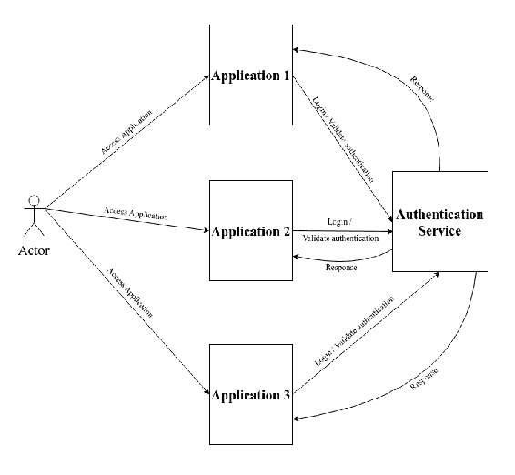
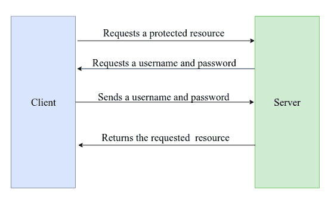
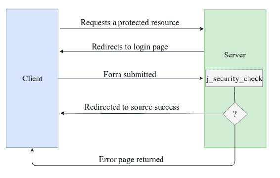
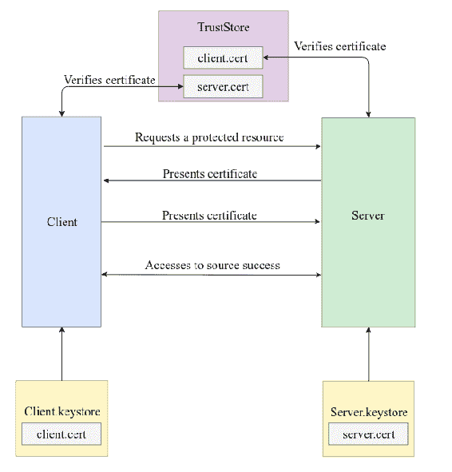
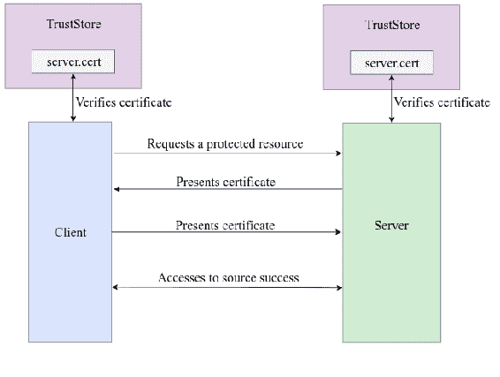

# 第九章：安全模式

在本章中，我们将探讨安全模式的概念以及它们如何帮助我们实现更好的安全应用程序。我们还将了解单点登录模式以及它如何帮助我们提供安全的应用程序。此外，我们还将了解认证机制和认证拦截器，重点关注如何实现这些概念。阅读本章后，我们将能够创建一个安全应用程序并使用 Java EE 8 实现它。本章涵盖的主题如下：

+   解释安全模式的概念

+   解释单点登录模式的概念

+   实现单点登录模式

+   解释认证机制

+   实现认证机制

+   解释认证拦截器

+   实现认证拦截器

# 解释安全模式的概念

应用程序与数据和其存储有密切关系。这是因为应用程序基本上由管理数据组成，以便通过自动化任务优化业务，帮助决策，组织任务和管理特定区域。此外，许多公司需要存储敏感数据并验证访问控制。随着时间的推移，对安全软件的需求显著增长，许多公司越来越多地投资于创建安全的应用程序。安全的一个基本要素是安全信息，它遵循以下基本原则：

+   **机密性**：数据不应被非授权用户或请求访问数据的任何实体访问。

+   **完整性**：数据不能以非授权的方式更新或修改。

+   **可用性**：数据应在需要时可用。

+   **不可否认性**：用户不能使用数据或任何其他过程否认或否认关系。

为了使应用程序安全，它需要提供至少以下基本原则。

安全模式是一组针对常见安全问题的解决方案，这些问题反复出现。这些安全模式中的很大一部分致力于解决与认证相关的问题，这与机密性和完整性原则相关。使用安全模式，开发者可以编写具有高安全性的软件，针对已知的问题和问题使用经过测试和验证的解决方案。

# 解释单点登录模式的理念

在商业环境中，当用户登录到系统时，他们通常会自动登录到业务内的各种其他系统，而无需再次输入他们的登录详细信息。一个例子是谷歌服务。在这里，如果用户登录到一个谷歌应用程序（Gmail、YouTube、Google Drive），他们将登录到所有可用的谷歌服务。例如，如果我们登录到 Gmail，我们可以访问 YouTube 而无需再次登录。

单点登录是一种安全模式，它创建了一个认证服务，该服务被一个域的多个应用程序共享，以实现认证的中心验证，并在这个域中只对用户进行一次认证。用户随后可以访问该域的所有应用程序，而无需再次进行认证。所有依赖于此类型的应用程序都会与认证服务通信，以验证用户的认证并登录，如果他们尚未登录。这些应用程序可以用任何语言或技术制作，并可以位于多个网络或不同的物理位置。在下面的图中，我们可以看到使用单点登录的认证过程：



在前面的图中，我们有三个用户可以访问的应用程序以及一个登录和验证认证的单一点。这个单一点在我们的图中通过**认证服务**表示。当用户（在图中由**参与者**表示）向一个应用程序（**应用程序 1**、**应用程序 2**或**应用程序 3**）发送请求时，该应用程序等待**认证服务**验证用户是否已登录。如果没有，他们将被重定向到登录页面，用户可以在那里登录。用户登录后，当他们访问**应用程序 1**、**应用程序 2**或**应用程序 3**时，他们不需要再次登录。

单点注销模式是在用户注销某个东西时发生的过程。此时，他们将从这个认证服务登录的所有应用程序中注销。这是一个很好的模式，因为它使得用户只需登录和注销一次即可，同时也将所有认证逻辑从业务逻辑中分离出来，将其放入一个独立的服务中。这促进了认证逻辑和业务逻辑的解耦，使得在不影响业务逻辑的情况下更改认证逻辑成为可能。此模式可以使用 OAuth、SAML 或自定义认证过程来实现。在现实世界中，使用第三方解决方案非常普遍，例如 OAuth0 和**红帽单点登录**（**RH-SSO**）。在我们的例子中，我们将完成一个自定义认证过程。

# 实现单点登录模式

在我们实现 **单点登录**（**SSO**）的示例中，我们将通过自定义过程创建认证服务以认证用户，并允许用户使用其登录凭证登录。之后，将生成一个令牌并发送给用户。进一步，我们将创建两个应用程序（`App1` 和 `App2`），当用户尝试在不登录的情况下访问这些应用程序时，应用程序将在认证服务上验证用户，用户将无需再次登录即可访问 `App1` 和 `App2`。认证服务将是一个使用 JAX-RS 编写的 REST 应用程序，而 `App1` 和 `App2` 将是实现 JAX-RS 客户端以验证用户访问的应用程序。因此，将创建以下类以配合我们的示例使用：

+   `AuthenticationResource`：此功能负责处理登录请求并验证用户的认证。此类使用 JAX-RS 编写，位于认证服务应用程序内部。

+   `AuthSession`：这是一个包含登录数据和信息的会话。此类具有应用程序范围，即 Java EE 范围。

+   `Auth`：这是一个表示已登录用户的 Bean。此类包含用户的登录详情、密码和上次登录日期。

+   `TokenUtils`：这是一个包含生成令牌方法的类。

+   `App1`：如果用户已登录，则此应用程序发送 `Welcome to App1` 文本。如果用户未登录，则此应用程序会引发错误。

+   `App2`：如果用户已登录，则此应用程序发送 `Welcome to App2` 文本。如果用户未登录，则此应用程序会引发错误。

+   `Auth`：这是一个具有调用认证服务方法的责任的接口。

+   `AuthImpl`：这是一个实现 `Auth` 接口的类。此类是一个 EJB。

`App1` 和 `App2` 应用程序没有登录所需的任何流程或逻辑；这是认证服务的责任（验证认证的资源），该服务具有负责此功能的 `AuthenticationResource` 类。

# 实现 `AuthenticationResource` 类

`AuthenticationResource` 是一个 JAX-RS 资源，这使得登录和验证应用程序的认证成为可能。在下面的代码中，我们有它的实现：

```java
import javax.inject.Inject;
import javax.ws.rs.*;
import javax.ws.rs.core.Response;
import java.util.Date;
import java.util.Optional;

@Path("auth")
public class AuthenticationResource {

    @Inject
    private AuthSession authSession;

    @POST
    @Consumes("application/x-www-form-urlencoded")
    public Response login(@FormParam("login") String login, @FormParam("password") String password ) {

        //If user already logged, then get it token
        Optional<String> key = authSession.getToken(login, password);
        if ( key.isPresent() ){

           return Response.ok(key.get()).build();

        }

        //Validade login and password on data source
        if( !authSession.getDataSource().containsKey(login)
                || !authSession.getDataSource()
                .get(login)
                .getPassword()
                .equals( password) )
            return Response.status(Response.Status.UNAUTHORIZED).build();

        String token = TokenUtils.generateToken();
        //Persiste the information of authentication on AuthSession
        authSession.putAuthenticated( token, new Auth(login, password, new Date()));

        return Response.ok(token).build();

    }

    @HEAD
    @Path("/{token}")
    public Response checkAuthentication(@PathParam("token")String token)  {

        if( authSession.getAuthenticated().containsKey( token )){

            return Response.ok().build();

        }

        return Response.status(Response.Status.UNAUTHORIZED).build();

    }

}
```

在前面的代码块中，我们有`AuthenticationResource`，它包含用于在数据源中持久化登录信息并获取包含用于验证登录凭证的用户信息的数据源的`authSession`属性。此外，`AuthenticationResource`有两个方法：`login(String login, String password)`，用于处理登录请求，以及`checkAuthentication(String token)`，用于允许客户端检查用户是否已认证。在下面的代码块中，我们有`login`方法，用于登录用户：

```java
    @POST
    @Consumes("application/x-www-form-urlencoded")
    public Response login(@FormParam("login") String login, @FormParam("password") String password ) {

        //If user already logged, then get it token 
        Optional<String> key = authSession.getToken(login, password);
        if ( key.isPresent() ){

           return Response.ok(key.get()).build();

        }

        //Validate the login and password on data source    
        if( !authSession.getDataSource().containsKey(login)
                || !authSession.getDataSource()
                .get(login)
                .getPassword()
                .equals( password) )
            return Response.status(Response.Status.UNAUTHORIZED).build();

        String token = TokenUtils.generateToken();
        //Persiste the information of authentication on the AuthSession.
        authSession.putAuthenticated( token, new Auth(login, password, new Date()));

        return Response.ok(token).status(Response.Status.CREATED).build();

    }
```

在前面的代码块中，我们可以看到如果用户已经登录，则返回一个令牌作为响应。如果用户未登录，则验证登录和密码详情，并生成一个新的令牌作为响应返回。注意，当客户端向该资源发送`POST`请求时，会调用此方法。

另一个方法是`checkAuthentication(String token)`，用于允许客户端检查用户是否已认证。在先前的代码块中，我们有这个方法。如果用户已登录，则该方法向客户端返回 200 HTTP 状态码，如果用户未登录，则返回 401 HTTP 状态码：

```java
    @HEAD
    @Path("/{token}")
    public Response checkAuthentication(@PathParam("token")String token)  {

        if( authSession.getAuthenticated().containsKey( token )){

            return Response.ok().build();

        }

        return Response.status(Response.Status.UNAUTHORIZED).build();

    }
```

注意，当客户端发送`HEAD`请求时，会调用`checkAuthentication(String token)`方法。

`AuthSession`类在`AuthenticationResource`类中使用。`AuthSession`类具有应用范围，用于持久化有关已登录用户的信息，并且有一个包含所有用户登录凭证的数据源：

```java
import javax.annotation.PostConstruct;
import javax.enterprise.context.ApplicationScoped;
import java.util.HashMap;
import java.util.Map;
import java.util.Optional;

@ApplicationScoped
public class AuthSession {

    private Map<String,Auth> authenticated;

    private Map<String,Auth> dataSource;

    @PostConstruct
    public void init(){

        authenticated = new HashMap<>();
        dataSource = new HashMap<>();

        for(int i = 1; i <= 50; i++){
            dataSource.put("login"+i, new Auth("login"+i, "123456") );
        }

    }

    public AuthSession putAuthenticated(String key, Auth auth){

        authenticated.put(key, auth);
        return this;

    }

    public AuthSession removeAuthenticated(String key, Auth auth){

        authenticated.remove(key, auth);
        return this;

    }

    public Map<String, Auth> getAuthenticated() {
        return authenticated;
    }

    public Map<String, Auth> getDataSource() {
        return dataSource;
    }

    public Optional<String> getToken(String login, String password){

        for( String key :  authenticated.keySet() ){

            Auth auth = authenticated.get( key );
            if( auth.getLogin().equals(login)
                    &&  auth.getPassword().equals( password )){
                return Optional.of(key);
            }

        }

        return Optional.empty();

    }
}
```

`Auth`是一个包含用户登录详情信息的 bean：

```java
import java.util.Date;

public class Auth {

    private String login;

    private String password;

    private Date loginDate;

    public Auth(){}

    public Auth(String login, String password){

        this.login = login;
        this.password = password;

    }

    public Auth(String login, String password, Date loginDate){

        this.login = login;
        this.password = password;
        this.loginDate = loginDate;

    }

    public String getLogin() {
        return login;
    }

    public void setLogin(String login) {
        this.login = login;
    }

    public String getPassword() {
        return password;
    }

    public void setPassword(String password) {
        this.password = password;
    }

    public Date getLoginDate() {
        return loginDate;
    }

    public void setLoginDate(Date loginDate) {
        this.loginDate = loginDate;
    }

}
```

如所示，`TokenUtils`是一个使用`generateToken()`方法生成新令牌的类：

```java
import java.security.SecureRandom;
import java.util.Date;

public class TokenUtils {

    public static String generateToken(){

        SecureRandom random = new SecureRandom();
        long longToken = Math.abs( random.nextLong() );
        return Long.toString(new Date().getTime()) + Long.toString( longToken, 16 );

    }
}
```

# 实现`App1`和`App2`类

在前面的代码块中，我们有`App1`应用的代码。当这个应用通过一个`GET`请求被访问时，会向认证服务发送一个请求以验证用户是否已经登录：

```java
import javax.inject.Inject;
import javax.ws.rs.*;
import javax.ws.rs.core.Response;
import java.util.Objects;

@Path("app1")
public class App1 {

    @Inject
    private Auth auth;

    @GET
    public Response helloWorld( String token ){

        if( !auth.isLogged( token ) ){
            throw new WebApplicationException(Response.Status.UNAUTHORIZED);
        }

        return Response.ok("Hello World. Welcome to App1!").build();

    }

    @POST
    @Consumes("application/x-www-form-urlencoded")
    public Response helloWorld(@FormParam("login") String login, @FormParam("password") String password ) {

        if( Objects.isNull(login) || Objects.isNull(password) ){
            throw new WebApplicationException(Response.Status.INTERNAL_SERVER_ERROR);
        }

        String token = auth.login(login,password);

        return Response
                .ok("Hello World. Welcome to App1!")
                .header("token",token)
                .build();
    }

}
```

在前面的代码中，我们有`App1`类，它包含`auth`参数，这是一个用于与认证服务集成的 EJB。此外，这个类有两个名为`helloWorld`的方法，具有不同的签名。在`helloWorld(String login, String password)`中，完成登录后，将`Hello World. Welcome to App1!`消息发送给用户。在`helloWorld(String token)`中，验证令牌，如果它是有效的令牌并且用户已登录，则将`Hello World. Welcome to App1!`消息发送给用户。

在下面的代码块中，我们有`App2`类。这个类与`App1`具有相同的代码，但向用户打印另一条消息。这个类位于另一个应用中，对我们来说称为`App2`：

```java
import javax.inject.Inject;
import javax.ws.rs.*;
import javax.ws.rs.core.Response;
import java.util.Objects;

@Path("app2")
public class App2 {

    @Inject
    private Auth auth;

    @GET
    public Response helloWorld( String token ){

        if( !auth.isLogged( token ) ){
            throw new WebApplicationException(Response.Status.UNAUTHORIZED);
        }

        return Response.ok("Hello World. Welcome to App2!").build();

    }

    @POST
    @Consumes("application/x-www-form-urlencoded")
    public Response helloWorld(@FormParam("login") String login, @FormParam("password") String password ) {

        if( Objects.isNull(login) || Objects.isNull(password) ){
            throw new WebApplicationException(Response.Status.INTERNAL_SERVER_ERROR);
        }

        String token = auth.login(login,password);

        return Response
                .ok("Hello World. Welcome to App2!")
                .header("token",token)
                .build();
    }

}
```

在下面的代码块中，我们有`Auth`接口。此接口包含与负责与认证服务集成、验证认证和登录的方法的合约：

```java
public interface Auth {

    public boolean isLogged(String token);

    public String login(String login, String password);

    String logout(String token);
}
```

在下面的代码块中，我们有`AuthImpl`类，它实现了`Auth`接口，并且是一个无状态的 EJB：

```java
import javax.ejb.Stateless;
import javax.ws.rs.client.ClientBuilder;
import javax.ws.rs.client.Entity;
import javax.ws.rs.client.WebTarget;
import javax.ws.rs.core.Form;

@Stateless
public class AuthImpl implements Auth {

    private String URL = "http://localhost:8080/javaEE8ExampleSSOAppService/resources/auth";

    @Override
    public boolean isLogged(String token) {

        return prepareWebTarget().path("/"+ token)
                .request()
                .head().getStatus() == 200;
    }

    @Override
    public String login(String login, String password) {

        return prepareWebTarget()
                .request()
                .post(Entity.form(new Form("login", login )
                                .param("password", password)),
                      String.class);

    }

    @Override
    public String logout(String token) {

        return prepareWebTarget().path("/"+ token)
                .request()
                .delete(String.class);

    }

    protected WebTarget prepareWebTarget() {

```

```java
        return ClientBuilder.newClient().target(URL);

    }

}
```

在前面的代码块中，我们有三个方法，分别称为`isLogged`、`login`和`logout`，它们的签名分别是`isLogged(String token)`、`login(String login, String password)`和`logout(String token)`。

当用户登录到应用程序（无论是`App1`还是`App2`），并且当用户使用令牌导航到另一个应用程序时，此用户将不需要再次登录。

# 解释认证机制

在企业环境中，每个应用程序或资源都需要验证用户访问并确保所有访问这些应用程序或资源的用户都将被识别和验证，以防止未经授权的访问。当用户请求访问受保护区域时，他们需要进行认证，然后服务器将验证他们的权限。为了允许开发者进行用户认证和验证，Java EE 8 必须有一个认证机制，这是 Java EE 8 中的一种常见解决方案，允许开发者以快速和简单的方式对用户进行认证和验证。Java EE 8 有五种机制来认证用户：

+   基本认证

+   基于表单的认证

+   摘要认证

+   客户端认证

+   互惠认证

认证机制通过识别定义用户权限的角色来工作。身份通常通过使用用户名和密码登录来定义。关于用户的信息需要保存在一个数据库中，通常称为*域*，以便服务器验证信息。为了使用认证机制，我们使用部署描述符文件对其进行配置，使用注解或编程方式。通常，我们将使用注解或部署描述符文件指定一个认证机制。

# 解释基本认证

如果开发者在未定义认证机制的情况下使用认证机制，则基本认证是默认机制。使用这种认证机制时，如果用户在发送请求时未进行认证，则会返回一个请求用户名和密码的对话框。这种机制并不完全安全，因为用户名和密码容易被捕获，使得中间人攻击成为可能。为了使用这种认证机制，建议使用安全的传输机制，例如 SSL（HTTPS）或 VPN。以下图表示了一个 Java EE 教程，展示了使用基本认证时会发生什么：



# 解释基于表单的认证

基于表单的认证是一种使用表单请求用户名和密码的认证机制，允许开发者自定义登录和错误屏幕。当用户请求访问受保护资源时，认证机制会向用户发送登录页面，然后用户输入用户名和密码并发送给服务器。如果用户名或密码不正确，服务器将返回错误页面或返回请求的资源。此机制也不安全，因为用户名和密码也容易以这种方式被捕获，使得中间人攻击成为可能。如前所述，建议在使用此认证机制时使用安全的传输机制，例如 SSL（HTTPS）或 VPN。

以下图表示一个 Java EE 教程，展示了使用基于表单的认证时会发生什么：



# 解释摘要认证

摘要认证是一种使用密码和附加数据的一向加密散列的认证机制。使用此机制，开发者不需要使用安全的传输机制来保护登录凭证。这是因为此机制已经提供了安全性。当用户向服务器发送摘要时，摘要认证需要明文密码以便进行摘要和验证访问，比较发送的明文密码与服务器上保存的密码。

# 解释客户端认证

客户端认证是一种通过使用其公钥证书而不是用户名和密码来认证客户端的机制，例如在基本和基于表单的认证中。此机制被认为更安全，因为它使用基于 SSL 的 HTTP（HTTPS）并使用客户端的公钥证书。

# 解释相互认证

相互认证是一种服务器认证客户端，客户端也认证服务器的认证机制。相互认证与基于证书或基于用户名/密码的工作。在基于证书的情况下，客户端请求访问受保护资源，然后服务器响应，向客户端发送其证书。之后，客户端验证服务器证书，如果服务器证书有效，客户端将发送其证书给服务器。服务器随后验证客户端证书，如果客户端证书有效，服务器将授予客户端访问受保护资源的权限。以下图显示了基于证书的相互认证时会发生什么：



在基于**用户名/密码**的认证中，客户端请求访问受保护的资源，然后服务器响应，向客户端发送其证书。客户端随后验证服务器证书，如果它是有效的，客户端将发送其用户名和密码到服务器。随后，服务器验证凭证，如果这些凭证有效，服务器将授予客户端访问受保护资源的权限。以下图示显示了当使用基于**用户名/密码**的相互认证时会发生什么：



# 何时使用部署描述符、注解或程序化配置

要指定和配置认证机制，我们可以使用部署描述符文件、使用注解，或者以程序化的方式定义配置。通常，我们选择注解，因为它在 Java EE 项目中易于使用。然而，有时使用部署描述符或程序化配置可能更简单、更有趣。如果是这种情况，那么在什么适当的场景下使用每种方法呢？

当我们使用部署描述符时，我们定义一个配置文件并创建一组资源的配置。这使得我们能够在单个位置配置我们的安全策略并将其与一组资源关联。然而，当我们使用注解时，我们在特定资源上定义一个策略，如果存在部署描述符，它将覆盖部署描述符。使用注解，我们创建认证的配置，因为它不需要设置 XML 文件。然而，当我们使用程序化配置时，我们可以认证不存在其他特性，并且我们可以以动态的方式使用认证机制。此外，当我们想要为一系列资源创建配置时，我们可以使用部署描述符文件。当我们想要使用动态行为创建认证时，我们使用程序化配置，而当我们需要以简单的方式创建配置时，我们使用注解。

# 实现认证机制

在我们实现认证机制的示例中，我们将创建一个包含接收请求并返回 *hello world* 消息给用户的资源的应用程序。然而，此资源受到保护，用户需要认证才能访问此资源。此外，我们将在部署描述符文件中设置一些安全策略和关联，一些安全策略通过注解应用于某些资源，一些安全策略通过程序性配置应用于某些资源。我们还将使用基本认证。为了使用部署描述符文件和程序性配置配置安全策略，我们将使用 JAX-RS 资源。为了使用注解配置安全策略，我们将使用 Servlet。这里使用的所有示例在 Web 应用中都是安全的，但 Java EE 8 允许在企业应用中使用认证机制。在这个例子中，使用了以下类：

+   `web.xml`：这是一个用于配置认证机制的部署描述符文件。

+   `HelloWorld`：这是一个包含由部署描述符文件和程序性配置使用的认证机制的 JAX-RS 资源类。

+   `HelloWorldServlet`：这是一个包含由注解使用的认证机制的 Servlet 类。

# 实现 web.xml 文件

`web.xml` 是一个 Web 应用的部署描述符，它包含许多关于 Web 应用的配置。在下面的部署描述符中，我们有我们 Web 应用的安全配置：

```java
<?xml version="1.0" encoding="UTF-8" ?>
<web-app >
    <security-constraint>
        <web-resource-collection>
            <web-resource-name>helloworld</web-resource-name>
            <url-pattern>/resources/helloworld/*</url-pattern>
        </web-resource-collection>
        <auth-constraint>
            <role-name>user</role-name>
        </auth-constraint>
        <user-data-constraint>
            <transport-guarantee>CONFIDENTIAL</transport-guarantee>
        </user-data-constraint>
    </security-constraint>

    <login-config>
        <auth-method>BASIC</auth-method>
    </login-config>
</web-app>

web.xml that defines a URL pattern:
```

```java
 <web-resource-collection>
     <web-resource-name>helloworld</web-resource-name>
     <url-pattern>/resources/helloworld/*</url-pattern>
 </web-resource-collection>
```

```java
web.xml that defines security roles:
```

```java
<auth-constraint>
    <role-name>user</role-name>
</auth-constraint>
web.xml that defines the authentication mechanism:
```

```java
<login-config>
    <auth-method>BASIC</auth-method>
</login-config>
```

# 实现 HelloWorld 类

`HelloWorld` 类是一个响应发送到 `/helloworld` 路径的请求的 JAX-RS 资源。这个类有两个方法，分别具有 `helloWorldWithDeploymentDescriptor()` 和 `helloWorldWithProgrammatically()` 签名。在 `helloWorldWithDeploymentDescriptor()` 中，认证验证由部署描述符配置导向，而在 `helloWorldWithProgrammatically()` 中，认证验证由开发者编写的代码导向：

```java
import javax.ws.rs.GET;
import javax.ws.rs.Path;
import javax.ws.rs.core.Context;
import javax.ws.rs.core.Response;
import javax.ws.rs.core.SecurityContext;

@Path("helloworld")
public class HelloWorld {

    @Context
    private SecurityContext securityContext;

    @GET
    @Path("/deploymentdescriptor")
    public Response helloWorldWithDeploymentDescriptor(){

        return Response
                .ok("Hello World. Welcome to App with validation by deployment descriptor!")
                .build();

    }

    @GET
    @Path("/programmatically")
    public Response helloWorldWithProgrammatically() {

        if (!securityContext.isUserInRole("user")) {
            return Response.status(401).header("WWW-Authenticate", "Basic").build();
        }

        return Response
                .ok("Hello World. Welcome to App with validation by programmatically.")
                .build();
    }

}
HelloWorld class that includes the helloWorldWithDeploymentDescriptor() method:
```

```java
    @GET
    @Path("/deploymentdescriptor")
    public Response helloWorldWithDeploymentDescriptor(){

        return Response
                .ok("Hello World. Welcome to App with validation by deployment descriptor!")
                .build();

    }
HelloWorld class that includes a helloWorldWithProgrammatically() method that uses a code to validate the role associated with each user that sent a request:
```

```java
@GET
    @Path("/programmatically")
    public Response helloWorldWithProgrammatically() {

        if (!securityContext.isUserInRole("user")) {
            return Response.status(401).header("WWW-Authenticate", "Basic").build();
        }

        return Response
                .ok("Hello World. Welcome to App with validation by programmatically.")
                .build();
    }
```

要以程序方式在浏览器中显示对话框，请使用以下代码：

```java
 if (!securityContext.isUserInRole("user")) {
      return Response.status(401).header("WWW-Authenticate", 
      "Basic").build();
 }
```

# 实现 HelloWordServlet 类

`HelloWorldServlet` 类是一个响应发送到 `/helloworld/annotation` 路径的请求的 Servlet 类。这个类有一个 `doGet(HttpServletRequest request, HttpServletResponse response)` 方法，它响应所有 `GET` 请求。在此方法处理完毕后，进行认证验证，如果用户与 `user` 角色相关联，则处理该方法。如果不相关联，则将对话框返回给用户：

```java
import javax.annotation.security.DeclareRoles;
import javax.servlet.ServletException;
import javax.servlet.annotation.HttpConstraint;
import javax.servlet.annotation.ServletSecurity;
import javax.servlet.annotation.WebServlet;
import javax.servlet.http.HttpServlet;
import javax.servlet.http.HttpServletRequest;
import javax.servlet.http.HttpServletResponse;
import java.io.IOException;

@WebServlet(name = "HelloWorldServlet", urlPatterns = "/helloworld/annotation")
@DeclareRoles("user")
@ServletSecurity(@HttpConstraint(transportGuarantee = ServletSecurity.TransportGuarantee.NONE,
        rolesAllowed = {"user"}))
public class HelloWorldServlet extends HttpServlet {

    protected void doGet(HttpServletRequest request, 
   HttpServletResponse response) throws ServletException, IOException {

        response.getWriter().write("Hello World. Welcome to App with 
        validation by annotation!");

    }
}
```

# 解释认证拦截器

在企业应用中，认证是一个非常重要的过程，这可以通过许多技术来完成。在 Java EE 8 中，这些技术之一是拦截器模式。

拦截器模式是一种高级编程技术，它使得在处理对象调用之前或之后拦截对象调用并处理算法成为可能。这就像**面向切面编程**（**AOP**）一样，使得在不改变其逻辑的情况下将行为包含在过程中成为可能。要使用 Java EE 8 实现此功能，我们可以使用 EJB 拦截器或 CDI 拦截器。我们还可以根据我们是否正在拦截 EJB 类/方法或 CDI 类/方法来选择要使用的拦截器类型。

认证拦截器是一种使用 EJB 拦截器或 CDI 拦截器通过拦截器模式的技术。这样做是为了在面向业务逻辑的方面使用业务逻辑之前或之后添加认证逻辑。然后我们可以验证认证，而无需将认证逻辑与业务逻辑耦合。在 EJB 类中使用业务逻辑时，最好使用 EJB 拦截器，而在 Web 层中使用 CDI 类时，最好使用 CDI 拦截器。

# 实现认证拦截器

在我们实现认证拦截器的最终示例中，我们将创建一个包含资源的应用程序，这些资源接收用户请求并向用户返回*hello world*消息，但此资源受到保护，用户需要认证才能访问资源。然而，这种保护是通过使用 CDI 拦截器实现的拦截器来实现的，它捕获对资源的调用并验证用户访问。此外，我们将使用基本认证机制进行认证验证；用户数据源将由应用程序服务器和 Java EE 管理，而不是由自定义数据源管理。在这个例子中，以下类被使用：

+   `DataSource`: 这是一个包含安全用户信息的数据库源。

+   `Auth`: 这是一个用于定义验证认证和授权方法的接口。

+   `AuthImpl`: 这是一个实现`Auth`接口的类。

+   `Authentication`: 这是一个用于配置要拦截的方法的限定符。

+   `AuthenticationInterceptor`: 这是一个拦截对`HelloWorld`方法调用的拦截器，并验证用户访问权限。

+   `HelloWorld`: 这是一个包含部署描述符文件和程序配置中使用的认证机制的 JAX-RS 资源类。

+   `AuthUtils`: 这是一个用于认证的实用工具类。

# 实现 CDI 拦截器

要实现 CDI 拦截器，我们需要创建一个用于配置要拦截的类或方法的限定符。在下面的代码块中，我们有一个名为`Authentication`的限定符，它有一个名为 roles 的参数，这些参数用于声明允许访问资源的角色：

```java
import javax.enterprise.util.Nonbinding;
import javax.interceptor.InterceptorBinding;
import java.lang.annotation.*;

@Inherited
@InterceptorBinding
@Retention(RetentionPolicy.RUNTIME)
@Target({ElementType.METHOD, ElementType.TYPE})
public @interface Authentication {
    @Nonbinding String[] roles() default {};
}
```

在下面的代码块中，我们有`AuthenticationInteceptor`类，它用作拦截器。这个类被`@Authentication`注解标注，表示这个类将拦截所有标注了`@Authentication`的方法调用，并将处理标注了`@AroundInvoke`的方法：

```java
import javax.inject.Inject;
import javax.interceptor.AroundInvoke;
import javax.interceptor.Interceptor;
import javax.interceptor.InvocationContext;
import javax.servlet.http.HttpServletRequest;
import javax.servlet.http.HttpServletResponse;
import java.io.IOException;
import java.io.Serializable;
import java.util.Arrays;

@Authentication
@Interceptor
public class AuthenticationInterceptor implements Serializable{

    @Inject
    private Auth auth;

    @AroundInvoke
    public Object authentication(InvocationContext context) throws 
    IOException {

      HttpServletRequest request = getHttpServletRequest( context );
      HttpServletResponse response = getHttpServletResponse( context );

      String[] credentials = AuthUtils.readBasicAuthHeader( request );

        if(credentials.length < 2){
            prepareDialogBox( response );
            return null;
        }

        String login = credentials[AuthUtils.INDEX_LOGIN];
        String password = credentials[AuthUtils.INDEX_PASSWORD];

        Authentication authentication = 
       context.getMethod().getAnnotation( Authentication.class );

        if( !auth.isAuthenticated( login, password ) ){
            prepareDialogBox( response );
            return null;

        }

        if ( Arrays.stream(authentication.roles()).noneMatch( role -> 
        auth.isAuthorized( login, role )) ){

            response.sendError(HttpServletResponse.SC_UNAUTHORIZED);
            return null;
        }

        try {
            return context.proceed();
        } catch (Exception e) {
            e.printStackTrace();

      response.sendError(HttpServletResponse.SC_INTERNAL_SERVER_ERROR);
        }

        return null;

    }

    public void prepareDialogBox( HttpServletResponse response ) throws 
    IOException {
        response.addHeader("WWW-Authenticate", "Basic");
        response.sendError(HttpServletResponse.SC_UNAUTHORIZED);
    }

    private HttpServletRequest getHttpServletRequest(InvocationContext 
    ic) {

        return (HttpServletRequest) Arrays
                .stream(ic.getParameters()).filter(p ->  p instanceof 
                 HttpServletRequest )
                .findFirst()
                .get();

    }

    private HttpServletResponse 
    getHttpServletResponse(InvocationContext ic) {

        return (HttpServletResponse) Arrays
                .stream(ic.getParameters()).filter(p ->  p instanceof 
                 HttpServletResponse )
                .findFirst()
                .get();

    }

}
@Authentication:
```

```java
@Authentication
@Interceptor
public class AuthenticationInterceptor implements Serializable{
...
}
```

注意，这个拦截器期望目标方法的参数为`HttpServletRequest`和`HttpServletResponse`。这样做是为了允许对认证和授权进行验证。

在下面的代码块中，我们有一个拦截器的片段。它配置了一个在调用被拦截时处理的方法：

```java
    @AroundInvoke
    public Object authentication(InvocationContext context) throws IOException {
        ...
    }
```

在前面的代码块中，我们有`Auth`接口：

```java
public interface Auth {

    public Boolean isAuthorized(String login, String role);

    public Boolean isAuthenticated(String login, String password);

}
```

在前面的代码块中，我们有实现`Auth`接口的类。在这个类中，我们将从数据源中查询用户信息。这个类是一个 EJB：

```java
import javax.ejb.Stateless;
import javax.inject.Inject;

@Stateless
public class AuthImpl implements Auth {

    @Inject
    private DataSource dataSource;

    @Override
    public Boolean isAuthorized(String login,String role) {
        return dataSource.readUserRoles( login ).contains( role );
    }

    @Override
    public Boolean isAuthenticated(String login, String password) {
        return dataSource.readUserPassword( login ).contains( password );
    }
}
```

在前面的代码块中，我们有一个`DataSource`类。这个类包含读取用户信息逻辑，并且在这个数据源中的所有信息都保持为映射形式。然而，我们可以将这些信息保存到关系型数据库、非关系型数据库、文件系统或 LDAP 中。这个类具有应用范围，并在整个应用生命周期中维护所有安全数据：

```java
import javax.annotation.PostConstruct;
import javax.enterprise.context.ApplicationScoped;
import java.util.Arrays;
import java.util.HashMap;
import java.util.List;
import java.util.Map;

@ApplicationScoped
public class DataSource {

    private Map<String, List<String>> roles;
    private Map<String, String> passwords;

    @PostConstruct
    public void init(){
        roles = new HashMap<>();
        roles.put("rhuan", Arrays.asList("user","admin"));
        roles.put("joao", Arrays.asList("user","admin"));

        passwords = new HashMap<>();
        passwords.put("rhuan", "123456");
        passwords.put("joao", "123456");
    }

    public List<String> readUserRoles(String login){
        return roles.get( login );
    }

    public String readUserPassword(String login){
        return passwords.get( login );
    }
}
```

在下面的代码块中，我们有`AuthUtils`。这是一个认证工具类。这个类使用`readBasicHeader`方法，该方法接收`HttpServletRequest`作为参数，并在请求使用基本认证时提取用户名和密码：

```java
import javax.servlet.http.HttpServletRequest;
import java.nio.charset.Charset;
import java.util.Base64;

public class AuthUtils {

    public static final int INDEX_LOGIN = 0;
    public static final int INDEX_PASSWORD = 1;

    public static String[] readBasicAuthHeader( HttpServletRequest request ){

        final String authorization = request.getHeader("Authorization");

        if (authorization != null && authorization.startsWith("Basic")) {

            String base64Credentials = authorization.substring("Basic".length()).trim();
            String credentials =
                    new String(
                            Base64.getDecoder().decode(
                                    base64Credentials),
                            Charset.forName("UTF-8"));

            return credentials.split(":", 2);
        }

        return new String[0];
    }
}
```

在下面的代码块中，我们有`beans.xml`，它包含一个`<interceptors>`标签，声明了所有 CDI 拦截器。CDI 拦截器要正常工作，需要这个配置：

```java
<?xml version="1.0" encoding="UTF-8"?>
<beans xmlns="http://xmlns.jcp.org/xml/ns/javaee"
       xmlns:xsi="http://www.w3.org/2001/XMLSchema-instance"
       xsi:schemaLocation="http://xmlns.jcp.org/xml/ns/javaee http://xmlns.jcp.org/xml/ns/javaee/beans_1_1.xsd"
       bean-discovery-mode="all">

    <interceptors>
        <class>com.packt.rhuan.interceptors.AuthenticationInterceptor</class>
    </interceptors>

</beans>

```

# 实现 JAX-RS 资源

```java
HelloWorld. This class receives a request and returns a message to the client. Before the execution of the resource logic, AuthenticationInterceptor intercepts a call to a method and processes the authentication logic:
```

```java
import javax.servlet.http.HttpServletRequest;
import javax.servlet.http.HttpServletResponse;
import javax.ws.rs.GET;
import javax.ws.rs.Path;
import javax.ws.rs.core.Context;
import javax.ws.rs.core.Response;

@Path("helloworld")
public class HelloWorld {

    @GET
    @Authentication(roles = {"user"})
    public Response helloWorld(@Context HttpServletRequest request, 
    @Context HttpServletResponse response)  {

        return Response
       .ok("Hello World. Welcome to App with validation by 
       authentication interceptor!")
                .build();

    }

}
```

注意，`helloWorld(@Context HttpServletRequest request, @Context HttpServletResponse response)`方法具有`@Authentication(roles={"user"})`注解，以及`HttpServletRequest`和`HttpServletResponse`参数。通过`@Authentication(roles={"user"})`，我们配置了`helloWorld(@Context HttpServletRequest request, @Context HttpServletResponse response)`方法被`AuthenticationInterceptor`拦截。如前所述，目标方法必须具有`HttpServletRequest`和`HttpServletResponse`作为参数：

```java
    @GET
    @Authentication(roles = {"user"})
```

```java
    public Response helloWorld(@Context HttpServletRequest request, @Context HttpServletResponse response)  {
        ...
   }
```

# 摘要

在本章中，我们介绍了安全模式以及如何使用 Java EE 及其最佳实践实现安全应用。我们还探讨了单点登录（SSO）、认证机制和认证拦截器。此外，我们展示了如何使用 Java EE 8 实现这些功能。

在单点登录这个话题上，我们使用 JAX-RS 实现单点登录，并创建了一个服务来处理所有的认证和授权逻辑。正如讨论的那样，实现单点登录通常由第三方应用程序完成，例如红帽单点登录（RH-SSO）或 Oracle 企业单点登录，但我们也可以创建自己的解决方案。

我们学习了认证机制以及如何使用 Java EE 8 中的这个 HTTP 工具。使用 Java EE 8，我们实现了一个基本机制，并在应用服务器上的领域保存了用户信息。此外，我们还演示了如何在 servlet 和 REST 资源中实现认证机制。

我们使用 CDI 拦截器实现了一个认证拦截器，并将其配置为拦截 JAX-RS 资源。JAX-RS 资源认证拦截器通常是一个更好的解决方案，但我们也可以在 servlet 或 EJB 类中使用这个解决方案。

在下一章中，我们将探讨部署模式，为什么这些模式对于项目的成功至关重要，什么是蓝绿部署，为什么使用蓝绿部署很重要，什么是持续部署，以及为什么我们应该使用持续部署。
