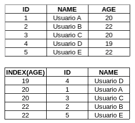

# 第十一章：操作模式

在本章中，我们将探讨操作模式，特别是关注为什么我们使用它们以及它们如何影响应用项目。然后，我们将涵盖性能和可扩展性模式以及管理和监控模式。阅读本章后，我们将了解操作模式的概念。本章将涵盖以下主题：

+   操作模式的概念

+   性能和可扩展性模式的概念

+   管理和监控模式的概念

# 解释操作模式的概念

要成功解决问题，我们需要评估多个重要步骤，以确保错误的可能性最小化。这些步骤如下：

1.  正确识别问题

1.  定义解决问题的操作

1.  开发解决问题的操作

在商业环境中，无论是在应用项目中还是在其他领域，快速响应问题是任务成功的关键。同时，我们还需要创建一个定义明确的解决问题流程，这将增加成功的可能性，使我们的工作更有条理，并导致更可靠的解决方案。

在第一步，如前所述，我们确定需要解决的问题。在这里，定义问题的边界以及评估所识别的问题是否确实是问题，这一点非常重要。

接下来，我们为问题定义一个高级解决方案。在这一步，解决方案将被描述，但无需担心如何实现。相反，我们关注在较高层次思想中的解决方案的线索或操作。高级、中级和低级思想指的是通用思考的程度，其中高级思想比中级更通用，而中级思想又比低级思想更通用。

在第三步，我们开发出解决问题的操作。在这一步，工作更加实际，因此我们需要以中低层次的思想进行工作。

操作模式通过促进对重复出现的问题的常见高级解决方案来工作。然而，尽管操作模式描述了问题的解决方案，但它们并不关心解决方案是如何开发的。因此，这些模式帮助我们简化问题和解决方案，并定义一个良好、可执行的过程。

# 解释性能和可扩展性模式的概念

在商业环境中，为了生成响应和解决方案，过程和任务需要快速完成。考虑到这一点，应用程序也需要更加高效和可扩展。性能指的是应用程序响应请求的速度，而可扩展性指的是应用程序在增加请求时能够响应而不影响其性能或容量的能力。换句话说，性能更多地关于服务请求所需的时间，而可扩展性是关于系统能够根据需要升级和降级资源。

在商业环境中，关于性能的问题通常是围绕读取数据或外部资源（如文件系统或网络中的其他应用程序）的问题。由于商业环境通常没有硬编码的逻辑或具有长数学计算的代码，因此由错误的逻辑或算法引起的性能问题较为罕见。商业环境的算法通常使用逻辑通过角色读取和保存数据；因此，性能增长通常包括尽可能快地读取和写入数据以及访问资源。

可扩展性与性能直接相关，因为它包括扩展应用程序的规模。换句话说，如果我们扩展了应用程序的规模，我们应该能够响应请求的增加而不影响性能，否则应用程序将以增加的性能响应请求。

性能和可扩展性模式是用于解决性能和可扩展性常见问题的操作模式，它们为应用程序提供始终如一的高性能和可用性。在本章中，我们将介绍以下性能和可扩展性模式：

+   **缓存旁路（Cache-aside）**: 这种模式根据需求从数据存储中将数据加载到缓存中。

+   **CQRS（Command Query Responsibility Segregation）**: 这种模式通过使用单独的接口将读取数据的操作与更新数据的操作分离。

+   **事件溯源（Event sourcing）**: 这种模式使用只追加存储来记录对领域内数据所采取的操作。

+   **索引表（Index table）**: 这种模式在数据存储中创建索引，这些索引经常被查询引用。

+   **物化视图（Materialized view）**: 当数据不是理想地格式化以进行所需的查询操作时，这种模式会在一个或多个数据存储中生成预填充的视图。

+   **分片（Sharding）**: 这种模式将数据存储划分为一组水平分区或分片。

+   **静态内容托管（Static content hosting）**: 这种模式将静态内容部署到可以直接向客户端交付数据的基于云的存储服务。

# 缓存旁路模式

如前所述，提高性能通常意味着最小化读取数据所需的时间。实现这一目标的一种方法是通过缓存旁路模式。

缓存旁路模式是一种按需从数据存储将数据加载到缓存中的模式。如果应用程序更新了任何数据缓存，它也会将数据更新到数据存储。当用户请求数据且数据不可用时，数据会被加载到缓存中。因此，当再次访问此数据时，应用程序将从缓存中读取并响应用户。这种模式帮助我们保持缓存中的数据和数据存储之间的数据一致性。缓存是另一个数据源，它维护着从原始数据存储中复制的数据，允许应用程序快速读取数据。然而，这种模式并不能保证数据存储和缓存之间的数据一致性，因为另一个应用程序可以更新数据存储中的数据，从而使缓存过时。

以下图示说明了缓存旁路模式的工作原理：

正如我们所见，当应用程序从数据存储读取任何数据时，应用程序首先咨询缓存中的数据。然而，如果数据不存在，则应用程序会咨询数据存储中的数据。当应用程序咨询数据存储中的数据时，数据存储返回的数据随后被加载到缓存中，以便应用程序在将来更快地读取数据。当应用程序更新缓存中的数据时，数据将被保存到数据存储中，然后缓存中的数据将被更新或使无效。

# 何时使用缓存旁路模式

建议在数据不经常更新或并发更新不频繁时使用缓存旁路模式。重要的是要注意，缓存旁路模式只有在必要时才应使用。这是因为缓存增加了应用程序的复杂性，因为涉及数据定义的脏读有时可能发生。考虑到这一点，我们建议您只有在读取数据是一个缓慢的过程时才应用此模式。

# 缓存数据的生命周期

缓存数据的生命周期是关于缓存旁路模式的一个重要问题，因为生命周期策略决定了缓存是否高效。生命周期定义了数据的过期时间，根据一个过期策略，如果数据在指定的时间限制内未被访问，则该策略将使数据无效并从缓存中移除。因此，定义一个好的生命周期策略意味着定义一个既不太长也不太短的生命周期。还强烈建议您不要创建一个全局过期策略，而应该为数据存储中的每种类型的项目创建一个。这是因为某些数据比其他数据更新得更频繁。

# 驱除数据

一些缓存有有限的大小，并需要策略来弹出数据。此外，一些缓存选择最近最少使用的数据来弹出。然而，我们可以自定义此策略，甚至可以使用我们自己的逻辑从缓存中删除数据。通常，用于删除数据的逻辑大小有限，但我们也可以使用有关更新的逻辑。

弹出数据与设置过期策略不同，因为过期策略是一种静态逻辑，当数据过期时从缓存中删除数据。然而，弹出数据涉及动态逻辑。过期策略允许我们最小化脏读的可能性，而弹出数据允许我们创建逻辑，以最小化缓存达到其限制的可能性并优化缓存数据的一致性。

# 缓存预热

我们可能希望以针对应用程序使用优化的数据开始我们的缓存。因此，我们应该使用应用程序启动过程中的数据填充缓存。重要的是指出，我们需要评估在启动过程中加载的数据的过期时间；如果数据在应用程序使用之前过期，则加载启动过程数据是不必要的。

# 一致性

缓存旁路模式不能保证缓存中的数据与数据存储中的数据之间的一致性。这是因为外部应用程序或资源可以在任何时间更新缓存中没有反映的数据。在实现时记住一致性非常重要，以避免脏读的风险。

# 本地（内存）缓存

为了提高读取数据的过程，只要数据被频繁访问，缓存可以是本地和内存的。由于本地缓存是私有的，因此需要创建另一个缓存。在这种情况下，数据可以复制到任何本地缓存。为了实现本地缓存，我们需要一个具有足够内存的服务器，以允许我们的应用程序运行，并确保我们不会导致内存溢出。

# CQRS 模式

在应用程序中，使用相同的模型或实体执行从数据存储读取和写入数据的命令是一种好方法。这是因为管理数据在编程中通常很容易，我们还可以使用脚手架来生成项目。然而，当存在大量写入数据，并且并发写入操作的风险很高时，合并数据的需求更为迫切。当我们使用相同的模型来执行读取和写入数据时，读取数据的操作通常读取模型中的所有数据，写入数据的操作通常写入模型中的所有数据。有时，我们可能需要写入比模型中更少的列数据。此外，使用单个模型读取和写入数据可以提高安全性，因为某些数据仅供查询使用。

**CQRS（命令和查询责任分离）**是一种将读取操作与写入操作分离的模型，为这些操作创建了一个独立且解耦的接口。考虑到这一点，我们需要创建一个用于读取数据的模型和另一个用于写入数据的模型，同时只使用这些操作所需的数据。

# 何时使用 CQRS 模式

建议在应用程序具有复杂业务角色且其数据频繁由资源或事件更新，从而增加写入操作风险时使用 CQRS 模式。当数据合并和写入操作产生的性能问题并发时，也建议实施此模式。使用 CQRS 模式会增加应用程序的复杂性，因此此模式仅在必要时使用。

# 事件源模式

在典型的方法中，当用户与数据交互时，应用程序会改变数据的状态。然而，这种方法经常会减慢性能和响应速度，也可能生成其他并发更新。除非我们使用额外的机制，否则我们没有审计和记录操作或生成历史记录的机制。

事件源是一种模式，它维护当前的数据状态，并将数据更新事件保存到事件存储库中。此存储库作为一个只追加存储，当消费者访问数据时，它会接收事件并在领域上应用更新。使用此模式通过解耦事件逻辑和可伸缩性以及审计对数据应用的所有操作来提高性能。

# 理解事件源事件

在事件源模式中，事件被视为将应用于数据的更新。当用户请求数据更新时，应用程序不会实时更新它，而是获取数据，创建一个更新的强制描述，并保存带有该描述的事件。然后，该事件被保存在事件存储库中。请注意，事件消费者可以是另一个应用程序或资源。

使用事件源模式，最终用户能够看到数据的旧版本，因为数据仅在事件存储库上保存并运行时才更新。考虑到这一点，最终用户将不会实时看到更新，因为更新是计划好的，可以在任何时间执行。记住，事件存储库可以是关系数据库、文件系统或其他数据源。

消费者可以是保存事件到事件存储库的同一应用程序的一部分，也可以是另一个应用程序。事件消费者在接收到事件时总是检查它是否可以运行它。

# 提高性能

使用事件源模式应提高性能。这是因为任何更新都可以由消费者在任何时候完成，更新操作可以锁定数据并影响数据查询。因此，这个过程最小化了更新操作冲突的风险。此外，更新操作可以作为在服务器上运行的背景进程完成。

# 促进解耦

使用事件源模式也将促进事件逻辑的解耦，因为更新可以由另一个应用程序或资源完成。事件发布者不需要了解事件消费者，事件可以被分割以允许多个应用程序或资源执行更新过程的某一部分。

# 促进可伸缩性

使用事件源模式将促进可伸缩性，因为它也促进了事件发布者和事件消费者的解耦。因此，一旦考虑了向应用程序或资源的请求量，我们就可以复制事件发布者和事件消费者。

# 促进审计

使用事件源模式将促进对应用于数据的所有操作的审计，因为事件的历史可以用来重新生成关于数据的老信息。这是因为事件存储库不允许您更新或删除事件。所有数据历史都在事件存储库中显示。

# 解释索引表模式

这些天，数据量不断增长，应用程序需要能够读取大量数据。为了能够更快地读取数据，通常需要求助于数据结构或索引。在商业环境中，数据可以组织为具有主键的实体集合。然而，我们还想能够使用不包含索引的属性作为查询中的过滤器来读取数据。以下图表说明了数据组织；如果数据保持组织良好，我们可以使用一个检索速度更快的算法。

关系型数据库通过索引工作，并允许我们创建索引以加快数据读取速度。其他数据存储不会使用索引来读取数据，因此我们需要创建自己的索引机制以促进更快的数据读取。

索引表模式是一种创建使用其他数据或特定键组织数据的表的模式。使用此模式，我们可以更快地读取数据。该模式使用三种策略；如下所述：

+   复制数据并在不同的键中组织它

+   创建按不同键组织并使用主键引用原始数据的索引表

+   创建按不同键组织且重复频繁检索字段的索引表

以下图表说明了第一种策略：

在以下图中展示的策略中，数据在每个索引表中重复。这根据反规范化工作，更适合用于主要静态数据。以下图示说明了第二种策略：

在以下图中展示的策略中，数据是根据不同的键组织起来的，并使用主键引用原始数据。在这个策略中，数据的主键首先通过一个属性检索，然后通过使用 ID。以下图示说明了第三种策略：

在前一个图中展示的策略中，数据是根据不同的键组织起来的，这些键在部分归一化的索引表中频繁地重复检索属性。

索引表模式是一个快速检索数据的良好机制。然而，过度使用此模式可能会在数据更新期间产生性能问题，因为它们需要我们重新组织我们的索引表。

# 物化视图模式

有时，业务角色需要读取需要非平凡查询的数据。用户有时可能需要看到由不同物理位置组合而成的数据。这通常会导致性能问题，使得读取数据变慢。对于关系型数据，这些位置是表。因此，为了提高性能，一种策略可以是创建来自多个物理位置的预填充视图。因此，当应用程序执行查询时，数据已经准备好，因此可以更快地返回。

物化视图模式是一种创建和物化数据以符合应用程序在查询中所需格式的模式。如果查询涉及连接或需要计算的数据，物化视图模式可以提高性能，使得读取数据更快。请注意，物化视图中的数据永远不会在物化视图中更新；它只是实际数据的快照。当实际数据更新时，物化视图需要重建。以下图示说明了物化视图模式：

# 重建物化视图

当数据源上的数据发生变化时，必须重建物化视图以反映这些变化。重建物化视图可以通过自动或手动过程完成。为了定义重建物化视图所需的策略，我们首先需要定义数据是否允许脏读，以及查看这种读取的影响。如果数据不能有脏读，那么物化视图需要在原始数据更新的同时重建。

# 何时使用物化视图模式

物化视图模式可以显著提高性能。这是因为任何数据读取都不需要执行连接或计算来检索数据。然而，如果数据变化得太快，物化视图将比必要的次数重建更多次，这会影响性能。

使用物化视图模式的好处与原始数据变化速度成反比。因此，当数据很少修改且不动态时，建议使用物化视图。 

# 解释分片模式

如果我们有一个快速增长的表，在业务环境中读取和写入数据时会产生问题，我们需要应用一个既能解决性能问题又能解决数据量问题的解决方案。

分片模式是一种将数据存储水平分割成分区或分片的模式。这可以提高可扩展性和性能。分片可以在同一个节点或多个节点上运行，但每个分片具有相同的模式。当我们把单个数据库分割成分片时，数据库的行会在它们之间分布。此外，如果数据库支持，分片模式可以通过数据库实现，或者通过应用程序实现。

分片模式在实施过程中有三种常见的策略。这些策略包括以下内容：

+   **查找策略**：这种策略将数据分成多个分片，并通过分片逻辑实现一个映射，使用分片键将请求路由到数据。之后，每个分片通过分片键来识别，并包含其自己的数据集。

+   **范围策略**：这种策略将数据分成多个分片，并通过分片逻辑将相关数据分组在一起。这些分片通过分片键来识别。当我们需要使用范围查询来检索数据时，这种策略非常有用。

+   **哈希策略**：这种策略将数据分成多个分片，并通过分片逻辑实现数据在分片之间的均匀分布。这些分片通过分片键来识别。在这里，分片是平衡的，减少了分片中负载不均的风险。

# 何时使用分片模式

使用分片模式的好处是显而易见的，但同时也可能增加项目的复杂性。正因为如此，这个模式只有在必要时才应该使用，因为增加项目的复杂性会增加出现错误的机会。

当需要提高数据检索性能时，应该使用分片模式——特别是在数据集非常大的时候。分片减少了用于检索数据的数据量，从而提高了性能。此外，使用分片模式使得数据存储可以扩展，并且数据可以高度可用。

# 解释管理和监控模式的概念

在云中运行的应用程序数量不断增加，这些应用程序通常在远程数据中心运行。因此，我们无法完全控制应用程序的基础设施，管理远程运行的应用程序可能会变得困难。

管理和监控模式被创建出来，以便我们能够管理和监控我们的应用程序，并在不重新部署应用程序的情况下，暴露关于应用程序的运行时信息，以支持业务变更和定制。使用此模式，我们可以将监控逻辑与应用程序逻辑解耦，并且我们还可以更新使节而不影响应用程序。在本节中，我们将解释以下管理和监控模式：

+   使节模式

+   健康端点监控模式

+   外部配置存储模式

# 使节模式

在某些情况下，您可能想在云应用程序上实现路由、计费或监控等功能；您可能还希望更新网络配置。然而，有时维护应用程序和更新代码可能很困难。此外，可能有一些库不是由我们维护的，因此无法修改。

使节模式创建了一个外部进程，包括满足管理和监控需求所需的所有逻辑、库和框架。该外部进程充当应用程序或外部服务之间的代理。以下图展示了使节模式：

# 何时使用使节模式

使节模式的目的是在需要支持云以连接需求时或需要修改应用程序时进行指示。使节模式还可以帮助为多种语言或框架构建一组通用的客户端连接功能。然而，当存在关键请求延迟时，不建议使用此模式。这是因为使节模式在网络中引入了开销，可能会影响应用程序。

# 解释健康端点监控模式

在商业环境中，应用程序始终需要可用并正确执行。因此，有必要监控所有服务是否如此。然而，在云上监控应用程序通常很困难。

健康端点监控模式通过向应用程序的端点发送请求并验证它们返回的状态来实现健康监控。然后，该模式分析应用程序返回的结果并执行健康验证检查，如下面的图所示：

在前图中，我们可以看到**应用程序**和**代理**。这代表了一种向应用程序和服务发送请求并检查其返回结果的解决方案。请注意，**代理**还检查**数据存储**。

健康端点监控模式可以执行以下检查：

+   验证响应代码；在 HTTP 协议中，状态码 200 表示成功

+   检查检测到的错误响应的内容

+   测量请求与其响应之间的时间间隔

+   检查位于应用程序外部资源或服务

+   检查 SSL 证书的过期情况

+   验证 DNS 查找返回的 URL 以确保正确条目

# 何时使用健康端点监控模式

健康端点监控模式建议用于监控 Web 应用程序或服务的可用性和性能。它可以帮助监控中间层和共享服务，以便识别和隔离故障。

使用此模式可以帮助早期识别故障并采取解决问题的必要措施，这对最终用户的影响很小。今天，快速识别故障的能力对商业来说非常重要。

# 解释外部配置存储模式

应用程序始终需要遵循一组配置才能执行其功能并推广服务。通常，这些配置是通过应用程序读取并从中获取信息的文件来实现的。这些配置文件通常与应用程序包一起部署。这些配置文件中的某些更新需要重新部署应用程序，从而增加了配置文件更新的复杂性。此外，与应用程序一起部署配置文件需要为每个应用程序创建每个配置文件，并且这些文件不能共享。

外部配置存储模式创建一个外部配置模式仓库，为应用程序提供读取配置文件的接口。使用此接口，我们可以更新配置文件而无需重新部署应用程序，我们还可以在多个应用程序之间共享配置，使环境更加有序且易于管理，如下图所示：

如前图所示，应用程序从称为配置仓库的公共位置读取配置。如果配置文件随后被更新，所有应用程序都将看到更新。

# 何时使用外部配置存储模式

当与应用程序共享配置文件或在无需重新部署应用程序的情况下需要更新时，建议使用外部配置存储模式。共享配置文件使我们能够轻松管理应用程序的配置，因为所有应用程序都将看到并受到在单一位置进行的更新的影响。使用此模式还可以最大限度地减少更新配置文件时的错误风险，因此采用此模式是一种良好的实践。

# 摘要

在本章中，我们探讨了操作模式、性能和可扩展性模式以及管理和监控模式。我们还讨论了为什么我们应该使用这些操作模式以及如何评估它们的最优使用方式。

在性能和可扩展性模式的话题上，我们研究了如缓存旁路、CQRS、事件溯源、索引表、物化视图和分片等性能和可扩展性模式。然后，我们解释了每个模式的概念、它的好处以及何时实现它。我们现在熟悉了提高企业应用程序性能所需的技术，以及如何使应用程序可扩展。

在管理和监控模式的话题上，我们探讨了如大使模式、健康端点监控模式和外部配置存储模式等管理和监控模式。我们解释了每个模式的概念、它的好处以及何时实现它。我们现在熟悉了管理和监控企业应用程序所需的技术。

在下一章中，我们将探讨 Eclipse MicroProfile 项目及其规范。
