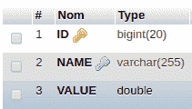
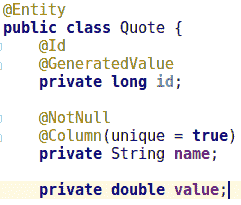
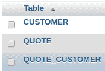
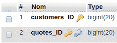
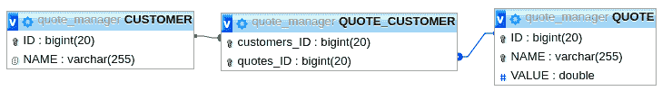
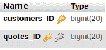
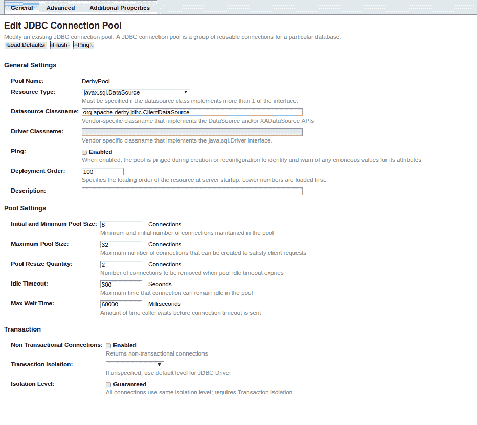

# 第二章：查看底层 – 这个 EE 东西是什么？

Java EE 可以看起来像是一个部署的魔法工具。然而，实际上它只是 Java 代码。本章旨在揭开服务器的面纱，确保您了解您应该从应用程序的性能中期待哪些影响。由于涵盖整个 Java EE 领域相当不可能，本章将处理最常见的模式和主要规范。

在本章中，我们将探讨一些常用的规范，并检查它们的作用以及您应该期待对运行时的哪些影响。最后，您应该能够做到以下几件事情：

+   了解您可以从容器中期望的服务以及与之相关的高级开销

+   评估代码模式是否会影响性能

+   判断您的运行时（Java EE）开销是否正常

# 上下文和依赖注入 – 你对我的 beans 做了什么？

**上下文和依赖注入**（**CDI**）是 Java EE 的核心规范。其作用是 *管理* 您定义的 bean。它与称为 **控制反转**（**IoC**）的模式直接相关，它提供了一种在您的类之间实现松耦合的方法。目标是使方式灵活，以便当前实例相互链接。它还控制实例的生命周期和实例化。

# IoC – 一个相当简单的例子

在探索 CDI 之前，让我们用一个非常简单的例子（我会说，一个 *手工制作的例子*）来说明什么是 bean 容器。

我们将使用一个具有 `TimeService` 的应用程序，它简单地提供了一个返回当前 `LocalDateTime` 的 `now()` 方法。

下面是它在代码中的样子：

```java
public interface TimeService {
    LocalDateTime now();
}
```

一个平凡的实现将依赖于本地的 `now()` 实现：

```java
public class TimeServiceImpl implements TimeService {
    @Override
    public LocalDateTime now() {
        return LocalDateTime.now();
    }
}
```

但您可能还需要能够切换到模拟（例如，用于测试或另一个客户）：

```java
public class MockTimeService implements TimeService {
    @Override
    public LocalDateTime now() {
        return LocalDateTime.of(2017, Month.SEPTEMBER, 4, 19, 0);
    }
}
```

在代码方面，您可能会使用普通的工厂模式实现 switch：

```java
public static class TimeServiceFactory {
    public TimeService create() {
        if (useDefault()) {
            return new TimeServiceImpl();
        }
        return new MockTimeService();
    }
}
```

然后，您需要在调用者处到处使用工厂，这影响很大，尤其是在您需要向 `create()` 方法添加参数时。为了解决这个问题，您可以将所有应用程序实例放在一个地方，我们将称之为 `Container`：

```java
public class Container {
    private final Map<Class<?>, Class<?>> instances = new HashMap<>();

    public <A, I extends A> Container register(final Class<A> api,
    final Class<I> implementation) {
        instances.put(api, implementation);
        return this;
    }

    public <T> T get(final Class<T> api) {
        try {
            return api.cast(
                    ofNullable(instances.get(api))
                            .orElseThrow(() -> new
                            IllegalArgumentException("No bean for api
                            <" + api.getName() + ">"))
                            .getConstructor()
                            .newInstance());
        } catch (final Exception e) {
            throw new IllegalArgumentException(e);
        }
    }
}
```

这是一个非常简单且平凡的实现。但一旦完成，您只需在启动类中注册所有应用程序的 bean，所有代码都将依赖于 `Container` 来检索实例。换句话说，类的查找是集中的。这也意味着更新更简单：

```java
public class Main {
    public static void main(final String[] args) {
        final Container container = new Container()
                .register(TimeService.class, TimeServiceImpl.class)
                /*other registers if needed*/;

        final TimeService timeService =
        container.get(TimeService.class);
        System.out.println(timeService.now());
    }
}
```

在开始处理 CDI 之前，您可以在容器之上添加服务，因为实例是由 `Container` 创建的。例如，如果您想记录对已注册 API 方法的任何调用，您可以按以下方式更改 `get(Class<?>)` 方法：

```java
public <T> T get(final Class<T> api) {
    try {
        final Object serviceInstance = ofNullable(instances.get(api))
                .orElseThrow(() -> new IllegalArgumentException("No
                bean registered for api <" + api.getName() + ">"))
                .getConstructor()
                .newInstance();

        return api.cast(Proxy.newProxyInstance(api.getClassLoader(),
        new Class<?>[]{api}, new LoggingHandler(serviceInstance,
        api)));
    } catch (final Exception e) {
        throw new IllegalArgumentException(e);
    }
}
```

整个逻辑将在`LoggingHandler`中实现，它将完全用日志调用装饰已注册实例的逻辑。换句话说，对代理实例的每次方法调用都将转发到处理程序：

```java
public class LoggingHandler implements InvocationHandler {
    private final Object delegate;
    private final Logger logger;

    public LoggingHandler(final Object delegate, final Class<?> api) {
        this.delegate = delegate;
        this.logger = Logger.getLogger(api.getName());
    }

    @Override
    public Object invoke(final Object proxy, final Method method, final
    Object[] args) throws Throwable {
        logger.info(() -> "Calling " + method.getName());
        try {
            return method.invoke(delegate, args);
        } catch (final InvocationTargetException ite) {
            throw ite.getTargetException();
        } finally {
            logger.info(() -> "Called " + method.getName());
        }
    }
}
```

现在，如果你调用`TimeService.now()`，你将能够观察到相应的输出。使用默认的日志设置，它看起来像这样：

```java
sept. 03, 2017 4:29:27 PM com.github.rmannibucau.container.LoggingHandler invoke
INFOS: Calling now
sept. 03, 2017 4:29:27 PM com.github.rmannibucau.container.LoggingHandler invoke
INFOS: Called now
```

单独来看，它并不那么有用，但如果你添加一些度量（计时）、参数日志记录等，它可以变得非常整洁。此外，请记住，你可以将添加到代理上的处理程序链接起来。

这对性能意味着什么？嗯，这意味着我们对完全控制的方法（用户方法）的简单调用可以执行真正不同的操作；它将由于`Container`类而变慢，而不是由于用户代码。如果你对此表示怀疑，请考虑用户方法实现为空且处理程序暂停几分钟的情况。当然，EE 实现不会这样做，但它会在最终用户代码之上添加一些复杂性。

# CDI 的主要功能

与我们的小型容器相比，CDI 是一个非常完整的规范，具有许多特性。然而，CDI 的工作方式与容器类似，只是它在启动时扫描`classloader`应用程序以查找 bean，而不是需要手动注册。

要了解 CDI 如何影响您应用程序的性能，我们将详细说明 CDI 的一些主要功能，解释服务器必须执行的工作以提供它们。

# 注入

如果你查看我们的报价管理应用程序，你可能已经注意到`QuoteService`被注入到`QuoteResource`或`DirectQuoteSocket`中。我们正好处于 CDI 容器的 IoC 区域。在这里，算法全局看起来如下（伪代码）：

```java
Object createInstance() {
    Object[] constructorArguments = createConstructorArguments(); <1>
    Object instance = createNewInstance(constructorArguments); <2>
    for each injected field of (instance) { <3>
        field.inject(instance);
    }
    return prepare(instance); <4>
}
```

为了履行其角色，CDI 需要实例化一个实例并初始化它。为此，它按照以下步骤进行，从而为您提供现成的实例：

1.  CDI 允许从构造函数参数、通过字段注入或通过设置器注入进行注入。因此，在实例化实例之前，CDI 需要解决所需的参数并为每个参数获取一个实例。

1.  现在，容器可以提供构造函数参数；它只是从 bean 构造函数创建当前实例。

1.  现在容器有一个实例，它会填充其字段/设置器注入。

1.  如果需要，实例将被包装在一个代理中，添加所需的服务/处理程序（CDI 语义中的拦截器/装饰器）。

在性能方面，这种逻辑对我们以及我们可以在高性能环境和应用程序中依赖 CDI 的方式有一些影响。现在简单的 bean 实例化需要看起来简单但实际上可能很昂贵的操作，这可能是由于它们必须执行的实际工作，如分配内存或使用元编程，或者由于它们隐藏的复杂性：

+   大多数步骤都涉及到一些反射（即 Java 反射），因此容器必须缓存所有内容以避免在反复检索反射数据时浪费时间。

+   *步骤 1* 和 *步骤 3* 可以意味着为其他实例调用`createInstance()`，这意味着如果没有注入创建实例的复杂度为 1，那么带有 N 个注入的实例创建复杂度将是*1+N*。如果 N 个注入有 M 个注入，那么将是*1+NxM*。

# 范围

CDI 的一个非常整洁的特性是为你处理范围生命周期。具体来说，你使用`@ApplicationScoped`和`@RequestScoped`装饰你的 bean，bean 的生命周期要么绑定到应用程序（它是一个单例），要么绑定到请求持续时间（这意味着你可以有与并发请求一样多的不同实例）。

范围实现被称为*上下文*，上下文主要负责查找正确的上下文实例或创建它。应用程序范围的实例将在整个应用程序共享的单个映射中查找。然而，请求范围的实例也将通过`ServletRequestListener`与请求生命周期关联的`ThreadLocal`中查找。

对性能的影响是相当直接的：

+   上下文设置可能很昂贵（取决于范围）并可能添加一些你可能不需要的开销。实际上，如果你没有`@RequestScoped` bean，你不需要`ServletRequestListener`实例（即使它不是很昂贵）。

+   每次上下文需要时重新创建你的 bean 将触发我们在上一部分看到的进程，以及 bean 的生命周期钩子（`@PostConstruct`和`@PreDestroy`）。

# 拦截器/装饰器

拦截器是 CDI 在 bean 之上添加自定义处理器的途径。例如，我们的日志处理器在 CDI 中将是这个拦截器：

```java
@Log
@Interceptor
@Priority(Interceptor.Priority.APPLICATION)
public class LoggingInterceptor implements Serializable {
    @AroundInvoke
    public Object invoke(final InvocationContext context) throws Exception {
        final Logger logger = Logger.getLogger(context.getTarget().getClass().getName());
        logger.info(() -> "Calling " + context.getMethod().getName());
        try {
            return context.proceed();
        } finally {
            logger.info(() -> "Called " + context.getMethod().getName());
        }
    }
}
```

装饰器做同样的工作，但它们会根据它们实现的接口自动应用，并注入当前实现。它们不需要绑定（例如，使用`@Log`将方法放在上面以激活`LoggingInterceptor`），但它们更具体于一组类型。

在性能方面，拦截器/装饰器显然会增加一些逻辑，因此会增加一些执行时间。但它还增加了一个更恶性的开销：上下文创建。这部分取决于你的服务器使用的 CDI 实现（Weld、OpenWebBeans、CanDI 等）。然而，如果你没有拦截器，容器不需要创建上下文，因此也不需要填充它。大多数上下文创建都很便宜，但`getParameter()`方法，它代表方法的参数，可能很昂贵，因为它需要将堆栈调用转换为数组。

CDI 实现在这里有多个选择，我们不会逐一介绍。这里需要记住的重要方程是以下内容：

```java
business_code_execution_time + interceptors_code_execution_time < method_execution_time
```

如果你只有不做什么的拦截器，你通常可以假设容器尽可能正确地处理它。如果你将它与一个你需要手动完成所有工作的框架进行比较，你可能会看到这个开销。

就其本身而言，相关的开销仍然是可接受的，并不大，以至于在维护/复杂性 versus 性能权衡中，你不需要在你的代码中使用拦截器。然而，当你开始添加大量的拦截器时，你需要确保它们也得到了良好的实现。这意味着什么？为了理解，我们需要退后一步看看拦截器是如何使用的。

要将拦截器与实现链接起来，你需要使用我们所说的拦截器绑定，这是你的拦截器的标记注解（用 `@InterceptorBinding` 装饰）。到目前为止没有大问题，但这个绑定通常包含一些配置，使得拦截器行为可配置。

如果我们使用我们的日志拦截器，日志名称是可配置的：

```java
@InterceptorBinding
@Retention(RUNTIME)
@Target({TYPE, METHOD})
public @interface Log {
    /**
     * @return the logger name to use to trace the method invocations.
     */
    @Nonbinding
    String value();
}
```

现在，`LoggingInterceptor` 需要获取回值，这个值将被传递给日志工厂以获取我们的拦截器将用于装饰实际豆调用（bean invocation）的日志实例。这意味着我们只需修改之前的实现，如下面的代码片段所示，以尊重日志配置：

```java
@Log("")
@Interceptor
@Priority(Interceptor.Priority.APPLICATION)
public class LoggingInterceptor implements Serializable {
    @AroundInvoke
    public Object invoke(final InvocationContext context) throws Exception {
        final String loggerName = getLoggerName();
        final Logger logger = Logger.getLogger(loggerName);
        logger.info(() -> "Calling " + context.getMethod().getName());
        try {
            return context.proceed();
        } finally {
            logger.info(() -> "Called " + context.getMethod().getName());
        }
    }
}
```

所有棘手的部分都在 `getLoggerName()`。一个坏的和脆弱的实现——因为它依赖于简单的反射而不是 CDI 元模型——但常见的实现如下：

```java
private String getLoggerName(InvocationContext context) {
    return ofNullable(context.getMethod().getAnnotation(Log.class))
            .orElseGet(() -> context.getTarget().getClass().getAnnotation(Log.class))
            .value();
}
```

为什么它脆弱？因为没有保证类处理（class handling）是有效的，因为你可以得到一个代理实例并忽略类型使用（stereotype usage）。这很糟糕，因为它在每次调用时都使用反射，而 JVM 并没有针对这种使用进行优化。实现者应该只调用一次 `getAnnotation`。

关于性能，更好的实现是确保我们不在每次调用时都使用反射，而只使用一次，因为 Java 模型（`Class` 元数据）在一般情况下在运行时不会改变。为了做到这一点，我们可以使用 `ConcurrentMap`，它将在内存中保存已经计算过的名称，并避免在调用相同方法时重复计算：

```java
private final ConcurrentMap<Method, String> loggerNamePerMethod = new ConcurrentHashMap<>();

private String getLoggerName(InvocationContext context) {
    return loggerNamePerMethod.computeIfAbsent(context.getMethod(), m -> ofNullable(m.getAnnotation(Log.class))
            .orElseGet(() -> context.getTarget().getClass().getAnnotation(Log.class))
            .value());
}
```

它只是为每个方法缓存日志记录器名称并一次性计算。这样，在第一次调用之后不再涉及反射；相反，我们依赖于缓存。`ConcurrentHashMap` 是一个很好的候选者，并且与同步结构相比，其开销是可以忽略不计的。

为了快速执行，我们是否只需要确保拦截器缓存元数据？实际上，这还不够。记住，拦截器是具有强制作用域的豆（beans）：`@Dependent`。这个作用域意味着 *每次需要时创建*。在拦截器的上下文中，这意味着 *每次创建被拦截的豆时都创建拦截器的一个实例*。

如果你考虑一个 `@RequestScoped` 豆，那么它的拦截器将为每个请求创建，这将完全违背其目的。

为了解决这个问题，不要在拦截器中缓存，而是在一个`@ApplicationScoped`的豆中缓存，该豆被注入到拦截器中：

```java
@ApplicationScoped
class Cache {
    @Inject
    private BeanManager beanManager;

    private final ConcurrentMap<Method, String> loggerNamePerMethod = new ConcurrentHashMap<>();

    String getLoggerName(final InvocationContext context) {
        return loggerNamePerMethod.computeIfAbsent(context.getMethod(), mtd -> {
            // as before
        });
    }
}

@Log("")
@Interceptor
@Priority(Interceptor.Priority.APPLICATION)
public class LoggingInterceptor implements Serializable {
    @Inject
    private Cache cache;

    @AroundInvoke
    public Object invoke(final InvocationContext context) throws Exception {
        final String loggerName = cache.getLoggerName(context);
        final Logger logger = Logger.getLogger(loggerName);
        logger.info(() -> "Calling " + context.getMethod().getName());
        try {
            return context.proceed();
        } finally {
            logger.info(() -> "Called " + context.getMethod().getName());
        }
    }
}
```

这个简单的技巧确保我们的缓存本身是`@ApplicationScoped`的，因此每个应用程序只计算一次。如果您想确保在运行时根本不计算它，甚至可以强制通过`AfterDeploymentValidation`事件的观察者中的 CDI 扩展来初始化它（但这会对性能产生较小的影响）。

为了总结这部分，请注意，现在的规范现在依赖于拦截器来提供其功能和集成（安全 API、JTA、JSF、JAX-RS 等）。EJB 规范在 Java EE 7 之前提供 JTA 集成（由`@Transactional`取代）和安全 API 直到 Java EE 8（由安全 API 取代）。这是一个临时的实现这些集成的实现（如本章开头提到的我们的`Container`），但它严格等同于拦截器功能的使用。至于性能，这两种实现（EJB 和基于 CDI 的）通常非常接近。

# 事件

CDI 事件在应用程序中全局提供事件总线。它们可以是同步的或异步的。为了让您有一个概念，以下是一个可能的代码示例：

```java
@ApplicationScoped
public class LifecycleManager {
    @Inject
    private Event<Starting> startingEvent;

    public void starting() {
        final Starting event = new Starting();

        startingEvent.fire(event);
        startingEvent.fireAsync(event);
    }
}
```

由于这两种类型的调用都是互斥的，我们可以在这里注意的是，这些片段调用`fire()`和`fireAsync()`*.* 要能够针对所有观察者，您需要调用两者。这意味着相关的逻辑将是两倍。

不深入到不影响我们性能的细节，这两种情况具有相同的解析机制：

1.  根据事件类型解决观察者。

1.  移除与火灾类型（异步或同步）不匹配的观察者。

1.  按优先级排序观察者。

1.  处理调用。

同步和异步案例之间的区别是*第 4 点*。在同步情况下，这意味着*调用观察者*，而在异步情况下，这意味着*异步调用并返回*代表所有调用结果的`CompletionStage`。

影响性能的部分是观察者和调用的解析，这可能需要一些豆类解析。

我们已经看到了豆类解析，所以让我们深入探讨观察者解析。实际上，实现是特定于您所使用的供应商。但是，由于无法使用静态分析来实现这部分，解析是在运行时通过每个事件类型的缓存来完成的。请注意，缓存在很大程度上取决于实现。大多数只会缓存原始类型事件。

这具体意味着，如下所示的无泛型调用，将比实现泛型并强制 CDI 容器进行更多解析的调用要快得多：

```java
event.fire(new MyEvent());
```

在代码方面，为了让您与前面的示例进行比较，具有泛型的代码将完全相同，只是事件将是参数化的：

```java
event.fire(new MyEvent<String>());
```

然后，一旦你有了潜在的观察者集，你需要根据调用者为事件配置的限定符来减少这个集合。这也意味着需要一些反射，多多少少是缓存的，具体取决于实现。

最后，一些运行时检查是通过供应商必须通过的测试集强制执行的，这样我们就可以声称符合规范。

所有这些步骤都由供应商根据他们可能收到的投诉进行不同程度的优化。但在所有这些中，你可能会遇到在运行时为每个事件的触发执行所有操作的代码路径，这在性能方面可能会成为一个痛点。

# 动态查找

CDI 的另一个重要特性是能够控制 Bean 的懒加载或解析。这是通过`Provider<?>`和`Instance<?>` API 实现的。*Instance*是一个*Provider*，允许你在运行时解析一个 Bean。*Provider*是一个实例包装器，允许你决定何时实例化底层实例。

看一下下面的代码片段：

```java
@ApplicationScoped
public class DynamicInstance {
    @Inject
    private Provider<MyService> myServiceProvider;

    @Inject
    private Instance<MyService> myServices;

    public MyService currentService() {
        return myServiceProvider.get(); <1>
    }

    public MyService newService(final Annotation qualifier) {
        return myServices.select(qualifier).get(); <2>
    }
}
```

让我们看看前面代码片段的底层机制：

+   调用`Provider.get()`将触发底层实例（这里为`MyService`）的创建。它延迟了注入或实例化的实例化，使其条件化。请注意，这取决于 Bean 的作用域，并且一个正常作用域的 Bean 不会从这种使用中获得太多好处。

+   调用`Instance.select(...)`将使 Bean 定义根据注入点变得更加具体。在这种情况下，我们从一个具有隐式`@Default`限定符的 Bean 类型（`MyService`*）开始，并用作为参数传递的限定符替换隐式限定符。然后，我们解析 Bean 并获取其实例。这对于动态和条件性地切换实现是有用的。

由于*Instance*是一个*Provider*，它们的实现共享相同的代码，这意味着它们的性能将是相同的。

现在的问题是，使用程序化查找与直接注入相比的成本是什么？是更贵还是不贵？从实现的角度来看，代码相当相似，它必须解析 Bean 以进行实例化，然后实例化它，这样我们就可以非常接近注入。我们将忽略那些对性能影响不大的小差异。这里有一个问题是它的使用：如果你注入了一个*Provider*并为其每次使用进行解析，那么你将大大增加在*解析和实例化*与*仅使用已解析和创建的实例*之间花费的时间。

# JAX-RS – servlet 路由器

即使 JAX-RS 并非完全绑定到 HTTP，并且可以在 JMS、WebSockets 等上使用，我们在这里只考虑 HTTP 的情况，尤其是它运行在 servlet 规范之上（这是最常见的情况）。

JAX-RS 的目标是提供基于 API 的命令模式以实现 HTTP 通信。换句话说，它通过 Java 模型抽象 I/O。你可以将其视为一个 HTTP Java 对象绑定解决方案。这就是`QuoteResource`所使用的。

JAX-RS 的作用是提供所有必要的工具，使 servlet 抽象在大多数情况下可以直接使用。为此，它提供了以下功能：

+   一个路由层，允许开发者直接根据请求的路径映射请求

+   一个序列化层，允许将 Java 对象转换为 HTTP 模型和流

+   一个异常处理层，可以将异常映射到 HTTP 响应

# 路由器

JAX-RS 是面向命令的。这意味着请求必须绑定到一个 Java 方法。为此，匹配会考虑请求的多个参数：

+   补丁

+   Accept 头

+   Content-Type 头

这里是路由的简化算法：

1.  根据路径找到匹配请求的类（这是一个类似于正则表达式的逻辑）。

1.  从*步骤 1*中找到的类中，根据路径找到匹配请求的方法。（这类似于*步骤 1*，但应用于具有子资源处理的方法。）

1.  从*步骤 2*中找到的方法，根据 MIME 类型（Accept/Content-Type 头）来处理请求。这一级别解析媒体类型以处理头部的服务质量选项（q、qs 等）。

这不是一个复杂的算法，但它相当动态，并且取决于传入的请求。因此，大多数情况下，它由提供者在运行时完成，可能会增加一点开销，这在基准测试中可以注意到。

# Marshalling

（反）序列化是将 Java 对象写入通信格式的过程。它通常是将对象转换为 XML 或 JSON 有效负载的部分，但实际上可以是任何格式，包括二进制格式。

这种转换在实现中通常是同步的，并且根据你使用的模型和激活的序列化器，可能会很昂贵。与你自己序列化想要读取/返回的有效负载的 servlet API 相比，这里任务由框架完成，因此有点隐藏。

在这个阶段的一个关键点是确保被操作的对象几乎没有逻辑，并且初始化/读取速度快。如果你不遵守这个点，你可能会长时间保持 HTTP 流，这会严重影响你的可伸缩性。在更普遍的做法中，你可能会面临一些 JPA 的懒加载数据，这可能会失败或根据 JPA 提供程序和配置导致意外的连接使用。另一个坏情况是在开始写入之前，先计算一些昂贵的值，然后再继续写入，因此迫使序列化过程暂停并延迟写入。这不仅对请求线程池有直接影响，也对 HTTP I/O 有影响。

与用于匹配要调用的方法（参见上一部分）的算法精神相同，JAX-RS 运行时必须解析要使用的提供者（根据您是读取还是写入，使用`MessageBodyReader`或`MessageBodyWriter`），以便与 Java 模型建立联系。在这里，这种解析同样依赖于传入的请求（或正在构建的响应）和媒体类型头，即使它是可缓存的并且通常很快，但也不像预期的那样平坦。

# 过滤器和拦截器

JAX-RS 2.0 添加了`ContainerRequestFilter`和`ContainerResponseFilter`来修改请求上下文。它在方法调用周围执行，但已经通过了方法解析。从高层次来看，它可以被视为 CDI 拦截器，但仅限于 HTTP 层。这些过滤器在执行大量逻辑之前不会显著影响性能，而且有几个地方是放置逻辑的好位置。一个非常常见的例子是根据 HTTP 头验证安全令牌或登录用户。在调查应用程序正在做什么时，不要对看到这种组件感到惊讶。

同样地，`ReaderInterceptor`和`WriterInterceptor`拦截`MessageBodyReader`或`MessageBodyWriter`*.* 它们的目的是封装输入/输出流以添加一些支持，例如 GZIP 压缩。然而，由于我们接近当前的 I/O，如果负载很大或算法复杂，我们需要注意不要在这里添加太多逻辑。实际上，由于流操作被频繁调用，一个实现不当的包装器可能会影响性能。

# @Suspended 或异步操作

JAX-RS 2.1 获得了一个全新的反应式 API 来与 Java 8 CompletionStage 集成，但服务器也有一个很好的集成来变得反应式：`@Suspended`。例如，`QuoteResource`的`findAll`方法可能看起来如下：

```java
@Path("quote")
@RequestScoped
public class QuoteResource {
    @Inject
    private QuoteService quoteService;

    @Resource
    private ManagedExecutorService managedExecutorService;

    @GET
    public void findAll(@Suspended final AsyncResponse response, <1>
                        @QueryParam("from") @DefaultValue("0") final int from,
                        @QueryParam("to") @DefaultValue("10") final int to) {
        managedExecutorService.execute(() -> { <2>
            try {
              final long total = quoteService.countAll();
              final List<JsonQuote> items = quoteService.findAll(from, to)
                        .map(quote -> {
                            final JsonQuote json = new JsonQuote();
                            json.setId(quote.getId());
                            json.setName(quote.getName());
                            json.setValue(quote.getValue());
                           json.setCustomerCount(ofNullable(quote.getCustomers())
                            .map(Collection::size).orElse(0));
                            return json;
                        })
                        .collect(toList());

                final JsonQuotePage page = new JsonQuotePage();
                page.setItems(items);
                page.setTotal(total);
                response.resume(page); <3>
            } catch (final RuntimeException re) {
                response.resume(re); <3>
            }
        });
    }

    // ...
}
```

在 JAX-RS 方法的同步版本中，返回的实例是响应负载。然而，当变为异步时，返回的实例在 JAX-RS 2.0 中不再用作负载；唯一的选择是使用`AsyncResponse` JAX-RS API 来让容器通知请求处理的状况。自从 JAX-RS 2.1（Java EE 8）以来，你也可以返回一个 Java 8 CompletionStage 实例，这为你提供了相同的钩子，服务器可以与之集成以通知调用的成功或失败。在任何情况下，这两种 API 都隐含了相同类型的逻辑：

1.  `@Suspended`注解标记了一个`AsyncResponse`类型的参数以供注入。这是您用来通知 JAX-RS 您已完成执行并让 JAX-RS 恢复 HTTP 请求的回调持有者。如果您使用`CompletionStage` API 版本，您不需要此参数，可以直接几乎以相同的方式使用您的`CompletionStage`实例。

1.  当响应的计算是异步的时候，这种异步 API 是有意义的。因此，我们需要在线程池中提交任务。在 EE 8 中，正确完成这个任务的最佳方式是依赖于 EE 并发实用工具 API，因此使用 `ManagedExecutorService`。

1.  一旦计算完成，使用 `resume()` 发送响应（正常有效载荷或 `throwable`），这将使用 `ExceptionMappers` 将其转换为有效载荷。

使用这种模式，你需要考虑到除了 HTTP 线程池之外，还有一个其他的线程池。它将在不同层面上产生影响，我们将在稍后处理，但一个重要的观点是，增加线程数量并不一定意味着在所有情况下都能提高性能，对于快速执行，你甚至可以降低性能。

# JPA – 数据库链接

**Java 持久化 API**（**JPA**）是数据库的链接（对于我们在第一章中创建的报价应用，是 MySQL）。它的目标是使应用程序能够将数据库模型映射到 Java 对象。好处是我们可以像使用任何对象一样使用数据库。

例如，考虑以下表格，它与我们在第一章中创建的报价应用在数据库中的表示相匹配：



前面的表格可以通过 JPA 注解转换为以下 Java 对象：



虽然表是 *扁平的*，但在 JPA 中映射它们相当直接，但随着模型复杂性的增加，你会越来越多地意识到两个对立的世界：构建一个优秀的 Java 模型可能会导致一个糟糕的数据库模型，或者相反。为什么？因为它们并不完全共享相同的哲学，可能会导致一些反模式。

例如，在我们的模型中，我们将 *Quote* 与 *Customer* 映射链接起来。由于一个客户可以有多个报价（反之亦然），我们使用了 `@ManyToMany` 关系。如果你检查由 JPA 生成的数据库，你可能会惊讶地看到一个没有模型化的表：



如果你打开 **QUOTE_CUSTOMER** 表模型，它相当简单：



如你所见，它只是在 *QUOTE* 和 *CUSTOMER* 表之间建立了一个链接。这是我们会在数据库端手动做的，除了我们会模型化这个表（它不会是隐式的）并且可能添加一些由关系拥有的属性（这是我们当前 Java 模型无法做到的）。

当然，你总是可以模型化这个连接表，并通过 `@ManyToOne` 关系将其链接到 *Quote* 和 *Customer*，如果你需要更多的灵活性或者更接近数据库模型的话。

这个例子在两个层面上都很有趣：

+   由于中间存在这个连接表，JPA 提供商会如何获取客户的报价呢？

+   模型是对称的：客户可以获取他们可以访问的报价，我们可以从报价中访问允许的客户。在 Java 中，它将通过`quote.getCustomers()`和`customer.getQuotes()`来翻译。它们是否做的是同一件事？在性能方面它们是否相似？在 Java 中，它们看起来真的很相似，对吧？

要深入了解提供者的作用，我们必须首先检查提供者如何使用一些与对象相关的代码和查询语言在数据库端实际工作，而数据库端使用的是不同的范式。为此，我们将首先研究我们的 Java 代码是如何转换为原生 SQL 的，然后检查建模如何影响性能。

# 从 JPA 到数据库

JPA 让您用纯 Java 表示您的数据库。换句话说，它让您将关系模型表示为对象模型。这在开发和维护中非常常见，但在某个时候，尤其是在您将验证性能时，您将需要检查映射器（JPA 实现）正在做什么，以及它是如何将对象代码/模型转换为关系模型的（SQL）。

当您检查 JPA 调用代码时，您通常会有以下内容：

```java
final Quote quote = entityManager.find(Quote.class, id);
....
entityManager.persist(quote);
```

对于更复杂的查询，它看起来像以下这样：

```java
final Number count = entityManager.createQuery("select count(q) from Quote q", Number.class);
```

我不会在本部分讨论命名查询与这种查询之间的区别，但重要的是，该模型是基于对象/Java 的。即使是 JPQL 查询也是与对象相关，而不是纯 SQL。

这导致了 JPA 提供者的主要作用：将所有代码从对象/Java 模型转换为关系/SQL 模型。

为了理解这一点，我们将配置我们的服务器上的 JPA 提供者以记录它所做的工作。由于我们使用 GlassFish，我们需要配置 Eclipselink，它是 JPA 提供者。为此，我们只需在持久化单元中添加以下属性：

```java
<property name="eclipselink.logging.level" value="FINEST"/>
<property name="eclipselink.logging.logger" value="JavaLogger"/>
```

此配置将激活 Eclipselink 在日志记录器的`FINEST`级别记录大量信息。要查看这些信息，我们需要确保`FINEST`日志级别被记录在某处，而不是默认跳过。为此，您需要将 Eclipselink 日志记录器级别配置为`FINEST`。这样，Eclipselink 将以日志记录器输出的级别进行记录。您可以在 GlassFish 中这样做，将以下行添加到您的`logging.properties`文件中：

```java
org.eclipse.persistence.level = FINEST
```

注意，如果我们使用在第一章中设置的 maven 插件*Money – The Quote Manager Application*来运行 GlassFish，它将回退到 JVM 的`logging.properties`，您需要修改`$JAVA_HOME/jre/lib/logging.properties`或启动服务器时设置另一个配置。以下是激活控制台日志记录的潜在内容：

```java
# output configuration - console here
java.util.logging.ConsoleHandler.level = FINEST
java.util.logging.ConsoleHandler.formatter = java.util.logging.SimpleFormatter

# global configuration (default)
.level = INFO
.handlers = java.util.logging.ConsoleHandler

# eclipselink specific logging level
org.eclipse.persistence.level = FINEST

```

最后，在启动服务器时使用此文件，只需设置系统属性`java.util.logging.config.file`（假设您将文件放在`src/main/glassfish/conf/logging.properties`），如下所示：

```java
MAVEN_OPTS="-Djava.util.logging.config.file=src/main/glassfish/conf/logging.properties" mvn package embedded-glassfish:run
```

日志记录器名称使用以下模式：

```java
org.eclipse.persistence.session./file:<path to the webapp>/WEB-INF/classes/_<entity simple name in lowercase>.[sql|query]
```

现在，如果您启动服务器，您将看到更多几行：

```java
...
Sep 09, 2017 5:21:51 PM org.eclipse.persistence.session./file:/home/rmannibucau/dev/quote-manager/target/quote-manager-1.0-SNAPSHOT/WEB-INF/classes/_quote.sql
FINE: SELECT ID, NAME, VALUE FROM QUOTE WHERE (NAME = ?)
  bind => [1 parameter bound]
...
Sep 09, 2017 5:41:53 PM org.eclipse.persistence.session./file:/home/rmannibucau/dev/quote-manager/target/quote-manager-1.0-SNAPSHOT/WEB-INF/classes/_quote.sql
FINE: INSERT INTO QUOTE (ID, NAME, VALUE) VALUES (?, ?, ?)
  bind => [3 parameters bound]
....
Sep 09, 2017 5:44:26 PM org.eclipse.persistence.session./file:/home/rmannibucau/dev/quote-manager/target/quote-manager-1.0-SNAPSHOT/WEB-INF/classes/_quote.sql
FINE: SELECT t1.ID, t1.NAME FROM QUOTE_CUSTOMER t0, CUSTOMER t1 WHERE ((t0.quotes_ID = ?) AND (t1.ID = t0.customers_ID))
  bind => [1 parameter bound]
```

这些行是由我们的 JPA 提供商（此处为 EclipseLink）在每次向数据库发出查询时生成的。这些查询使用绑定参数。这在两个层面上都很有趣。第一个层面是关于安全性的，旨在防止 SQL 注入 - 注意出于安全原因，默认情况下不会记录值。如果要将它们记录为绑定参数的数量，可以在持久化单元属性中设置 `eclipselink.logging.parameters` 为 true。第二个有趣的后果是直接与性能相关，并且提供者可以使用预编译语句而不是每次创建查询时都创建语句。结合可以缓存这些预编译语句的数据源池，与每次需要时才创建它们的实现相比，执行语句的成本非常低。

根据您的 JPA 提供商，您需要更改属性以激活查询日志。例如，Hibernate 和 OpenJPA 使用其他属性和记录器名称。或者，某些容器或 JDBC 驱动程序允许您在另一个级别进行配置。例如，在 Apache TomEE 中，您可以直接在 `DataSource` 资源中设置 `LogSQL=true`。

有趣的是看到我们在 Java 中编写的内容对 SQL 侧面的影响。

`INSERT` 情况很简单，直接将 JPA 模型转换为相应的 SQL 语句，将所有值插入到相应的数据库中：

```java
INSERT INTO QUOTE (ID, NAME, VALUE) VALUES (?, ?, ?)
```

`SELECT` 也是一个直接绑定，它通过实体的标识符上的子句选择所有列：

```java
SELECT ID, NAME, VALUE FROM QUOTE WHERE (ID = ?)
```

在这里，JPA 提供者的作用非常明显；它将 Java 与 SQL 链接起来，这意味着以下内容：

+   将 JPA API 和 JPQL 转换为当前的 SQL。请注意，在所有 JPA 提供商中，都有一个数据库 SQL 语言的概念，以便它们可以处理数据库的特定细节（例如列类型或分页）。EclipseLink 称之为 *platform*，Hibernate 称之为 *dialect*，OpenJPA 称之为 *dictionary*。

+   处理 Java 到数据库的映射：数据库列名转换为字段名，表名转换为类名，等等。

然而，如果您在通过 JAX-RS 端点查询报价时仔细查看日志，可能会感到惊讶：

```java
SELECT t1.ID, t1.NAME FROM QUOTE_CUSTOMER t0, CUSTOMER t1 WHERE ((t0.quotes_ID = ?) AND (t1.ID = t0.customers_ID))
```

它从哪里来？如果您稍作调查，您会很快在 JAX-RS 层中识别出这一行：

```java
json.setCustomerCount(ofNullable(quote.getCustomers()).map(Collection::size).orElse(0));
```

它做了什么？它只是设置了与 *Quote* 链接的客户数量。触发这个附加查询的部分是什么？对关系集合的简单调用触发了它。在我们的例子中，它是 `size()`：

```java
quote.getCustomers().size();
```

由于 `Quote` 和 `Customer` 之间的关系是延迟加载的，这条简单的语句将触发 EclipseLink 的附加查询。有趣的是，如果您检查 JAX-RS 资源，它不是 `@Transactional`，并且这个查询可能会根据 JPA 提供商而失败，因为延迟处理必须在事务中进行。

提供者足够聪明，不会触发任何查询，只是调用 `getCustomers()`*.* 但在调用返回集合的任何方法，如这里的 `size()` 时，它会这样做。根据提供者，null 可能是可能的，也可能不是，这就是为什么原始代码假设它可以返回 null。

我们将在另一章中讨论建模，但使关系 *eager* 的明显解决方案并不是真正的解决方案，因为你会慢慢地加载所有对象图，这样做可能会导致性能问题，甚至内存问题。所以尽量抵制这种诱惑。

当你在玩 JPA 和 SQL 时，我建议你禁用 EclipseLink 的默认共享缓存，因为它很容易隐藏查询（稍后我们将讨论为什么即使在生产中也要禁用它）。这可以通过添加以下属性到你的持久化单元中来实现：

```java
<property name="eclipselink.cache.shared.default" value="false"/>
```

# 模型和影响

本节并不打算讨论所有情况；其他专注于 JPA 的书籍做得很好。为了避免做可能对性能产生负面影响的事情，这部分将向你展示 JPA 所做的抽象确实需要一些关注。

为了说明这个说法，我们将重用 **Customer***/***Quote** 关系。由于它是一个 *ManyToMany*，它依赖于一个连接表。以下是模型的表示：



用例是当你想要访问关系的另一侧时：来自 *客户* (`getQuotes()`) 的 *引用* 或相反 (`getCustomers().size()`)*.*

在这里，提供者将找到所有在连接表中具有当前实体标识符的实体。

这听起来非常合理，但它如何影响性能呢？如果你检查 MySQL 中连接表的结构，你将立即看到一些细微的差异：



`quotes_ID` 列有一个索引，而 `customers_ID` 列则没有。不要被图片和事实所欺骗，即两个列都有黄色的键。主键是两个列的组合键，因此索引不是无用的，它允许我们快速从 `quotes_ID` 中选择行。为什么 `quotes_ID` 有索引而 `customers_ID` 没有？因为 *Quote* 实体是关系的所有者。然而，通过 *Quote* 标识符选择列总是比通过 *Customer* 标识符选择列要快。

现在有趣的部分是比较这两个调用：

```java
quote.getCustomers()
customer.getQuotes() 
```

第一次调用将从已加载的引用中加载客户，而第二次调用将加载与已加载客户相关的引用。

现在让我们看看相应的生成的 SQL 将会是什么。第一次调用将被转换为以下语句：

```java
SELECT t1.ID, t1.NAME FROM QUOTE_CUSTOMER t0, CUSTOMER t1 WHERE ((t0.quotes_ID = ?) AND (t1.ID = t0.customers_ID))
```

第二次调用 (`customer.getQuotes()`) 将被转换为以下内容：

```java
SELECT t1.ID, t1.NAME, t1.VALUE FROM QUOTE_CUSTOMER t0, QUOTE t1 WHERE ((t0.customers_ID = ?) AND (t1.ID = t0.quotes_ID)) 
```

连接是通过关系的已知侧面进行的，这意味着包含关系的实体（实体集）。然而，我们看到了连接表的两个列中只有一个有索引。这意味着一个侧面将比另一个侧面慢。如果您使用双向关系，您应该确保关系的所有者要么是以下之一：

+   那个比另一个使用得多的选项（如果存在巨大差异）

+   那个将返回比另一个更小实体集的选项

这只是一个例子，说明了一个非常快的模型如何影响性能。这是一个适用于任何建模的一般性陈述。无论如何，由于 JPA 使建模变得非常简单，并且与数据库相关的程度不高，因此更容易出错。

# Java 事务 API

**Java 事务 API**（**JTA**）是负责提供确保您数据在广泛意义上一致性的 API 的元素。在我们的报价管理器中，它仅应用于数据库数据，但可以应用于 JMS 消息，如果使用连接器，则可能应用于文件等。

不深入细节和协议，其想法是在多个系统之间确保要么所有提交要么所有回滚，而不是介于两者之间，以确保系统的致性（这是混合 NoSQL 系统的一个常见问题）。

为了做到这一点，JTA 使用我们所说的*两阶段提交协议*：

+   要求所有系统准备提交，这意味着系统必须验证并确保它将在下一阶段能够提交

+   要求所有系统实际进行提交

许多事务管理器或服务器针对单个资源进行了优化，以限制所有相关的开销。

在我们的报价管理器应用程序中，我们只有一个数据库，因此我们应该从大多数服务器中受益于这些优化。尽管如此，我们仍然使用 JTA 骨干，不回退到 JPA 事务管理（*RESOURCE_LOCAL*），后者更快。

在 JTA 中需要了解的重要信息是，事务绑定到一个线程上。每个资源都有其表示和标识符，一个完整的生命周期（参见*XAResource*）。有一个事务绑定注册表来存储数据（有点像*a@TransactionScoped*豆）以及与事务生命周期集成的监听器。

所有这些在内存和 CPU 周期方面都不成立，但如果需要，可以证明它是合理的，要么因为您有多个系统，要么因为您使用服务器 JTA 监控（您很少使用带有*RESOURCE_LOCAL* i*n 管理 UI 的监控）。

# 服务器资源

在多个层级上，服务器为您的应用程序提供了一些资源。在我们的报价管理器中，我们通过其 JNDI 名称将数据源注入到持久化单元中：

```java
<jta-data-source>java:app/jdbc/quote_manager</jta-data-source>
```

此数据源也可以在代码的任何其他地方注入：

```java
@Resource(lookup = "java:app/jdbc/quote_manager")
private DataSource datasource;
```

但服务器管理的资源更多。资源很重要，因为它们由服务器提供和处理，但由应用程序使用。换句话说，这是一种从应用程序外部控制应用程序行为的方式。它使你能够在不关心配置的情况下开发，并在以后调整它或根据部署应用程序的环境对其进行调整。下表列出了最有用的 JavaEE 资源类型子集，这些类型可能会影响你的性能，如果你的应用程序使用其中一些，你可能需要留意。

| **资源类型** | **描述** | **示例** |
| --- | --- | --- |
| `ManagedExecutorService` | 一个 EE *ExecutorService*，用于确保在自定义异步任务中继承 EE 上下文。对于链接到 JAX-RS *@Suspended* 或第三方库等非常有用。 |

```java
@Resource
private ManagedExecutorService mes;
```

|

| `ManagedScheduledExecutorService` | 接近`ManagedExecutorService`，它重用`ScheduledExecutorService` API 并添加 EE 集成。 |
| --- | --- |

```java
@Resource
private ManagedScheduledExecutorService mses;
```

|

| `DataSource` | 如前所述，它允许通过提供`DataSource`实例来连接到数据库。 |
| --- | --- |

```java
@Resource
private DataSource ds;
```

|

| `XADataSource` | 与`DataSource`相同，但支持两阶段提交。 |
| --- | --- |

```java
@Resource
private XADataSource ds;
```

|

| `Queue` | JMS *队列*，它定义了一个队列类型的目的地。在配置方面，其名称可以区分逻辑名称（应用程序）和实际名称（部署）。 |
| --- | --- |

```java
@Resource
private Queue queue;
```

|

| `Topic` | 与`Queue`相同，但用于类型为`topic`的目的地。 |
| --- | --- |

```java
@Resource
private Topic topic;
```

|

| `ConnectionFactory` | 定义了与 JMS 集成的方式以及获取 *连接*（或 Java EE 7 以来的 *JMSContext*）。 |
| --- | --- |

```java
@Resource
private ConnectionFactory cf;
```

|

存在其他类型的资源，但这些都是与应用程序外部链接的主要资源，以及与性能相关的配置，如池配置。

# 数据源配置

为了说明配置，让我们使用在报价管理器中依赖的配置：数据源。如第一章中所示，*货币 - 报价管理器应用程序*，你可以这样定义数据源：

```java
<?xml version="1.0" encoding="UTF-8"?>
<!DOCTYPE resources PUBLIC "-//GlassFish.org//DTD GlassFish Application Server 3.1 Resource Definitions//EN"
    "http://glassfish.org/dtds/glassfish-resources_1_5.dtd">
<resources>

  <1>
  <jdbc-connection-pool allow-non-component-callers="false"
                        associate-with-thread="false"
                        connection-creation-retry-attempts="0"
                        connection-creation-retry-interval-in-seconds="10"
                        connection-leak-reclaim="false"
                        connection-leak-timeout-in-seconds="0"
                        connection-validation-method="auto-commit"
                        datasource-classname="com.mysql.jdbc.jdbc2.optional.MysqlDataSource"
                        fail-all-connections="false"
                        idle-timeout-in-seconds="300"
                        is-connection-validation-required="false"
                        is-isolation-level-guaranteed="true"
                        lazy-connection-association="false"
                        lazy-connection-enlistment="false"
                        match-connections="false"
                        max-connection-usage-count="0"
                        max-pool-size="10"
                        max-wait-time-in-millis="120000"
                        name="MySQLConnectinoPool"
                        non-transactional-connections="false"
                        pool-resize-quantity="2"
                        res-type="javax.sql.DataSource"
                        statement-timeout-in-seconds="-1"
                        steady-pool-size="8"
                        validate-atmost-once-period-in-seconds="0"
                        validation-table-name="DUAL" wrap-jdbc-objects="false">
    <property name="URL" value="jdbc:mysql://localhost:3306/quote_manager"/>
    <property name="User" value="root"/>
    <property name="Password" value="password"/>
  </jdbc-connection-pool>

  <2>
  <jdbc-resource jndi-name="java:app/jdbc/quote_manager" pool-name="MySQLConnectinoPool" enabled="true"/>
</resources>
```

此 XML 配置定义了 JPA 提供者将使用的数据源，这得益于两个声明：允许容器创建数据源实例，并允许 JPA 提供者找到此数据源：

+   池定义了如何创建、缓存和验证数据库连接。

+   通过其 JNDI 名称将池与应用程序之间的链接，以便应用程序可以使用它——这就是 JPA 如何查找实例的方式

属性是数据源实例（基于配置的类）的配置，但`jdbc-connection-pool`属性主要是池配置。

非常重要的是要注意，配置取决于服务器。例如，在 Wildly 中，你会使用这种类型的声明：

```java
<datasources>
  <xa-datasource jndi-name="java:jboss/quote_manager" pool-name="QuoteManagerPool">
    <driver>mysql</driver>
    <xa-datasource-property name="ServerName">localhost</xa-datasource-property>
    <xa-datasource-property name="DatabaseName">quote_manager</xa-datasource-property>
    <pool>
      <min-pool-size>10</min-pool-size>
      <max-pool-size>50</max-pool-size>
    </pool>
    <security>
      <user-name>root</user-name>
      <password>secret</password>
    </security>
    <validation>
      <valid-connection-checker class-
      name="org.jboss.jca.adapters.jdbc.extensions.mysql
      .MySQLValidConnectionChecker"></valid-connection-checker>
      <exception-sorter class-
      name="org.jboss.jca.adapters.jdbc.extensions.mysql.MySQLExceptionSorter"></exception-sorter>
    </validation>
  </xa-datasource>
  <drivers>
    <driver name="mysql" module="com.mysql">
      <xa-datasource-class>com.mysql.jdbc.jdbc2.optional.MysqlXADataSource</xa-datasource-class>
    </driver>
  </drivers>
</datasources>
```

在这里，我们再次发现了一个属性部分和一个池部分。然而，它不再包含属性，而是使用纯标签。

在 Apache TomEE 中，相同的资源声明看起来像：

```java
<Resource id="quote_manager" type="DataSource">
  JdbcDriver = com.mysql.jdbc.Driver
  JdbcUrl = jdbc:mysql://localhost:3306/quote_manager?tcpKeepAlive=true
  UserName = root
  Password = secret
  ValidationQuery = SELECT 1
  ValidationInterval = 30000
  NumTestsPerEvictionRun = 5
  TimeBetweenEvictionRuns = 30 seconds
  TestWhileIdle = true
  MaxActive = 50
</Resource>
```

在这里，配置不是完全基于 XML，但它与属性（如`java.util.Properties`）混合，这些属性包含池配置和连接信息，这些信息将被传递给 tomcat-jdbc 或 commons-dbcp2 连接池库。

值得注意的是整体思路。大多数服务器共享相同的配置类型，以下是您需要关注的关键配置条目：

| **配置类型** | **描述** |
| --- | --- |
| 最大池大小 | 池可以创建的连接数。这是一个关键的配置，必须与您在部署和数据库最大连接配置中需要的可扩展性保持一致。 |
| 最大等待时间 | 调用者等待多长时间才能从池中获得超时。对于性能来说，不激活它（0）并不坏，以确保您能够识别出池太小。例如，如果您设置为 10 秒，基准测试可能会变慢，因为所有调用者都在等待连接。 |
| 空闲超时 | 连接空闲时可以保持多少次。 |
| 验证 | 连接如何验证，这对于确保连接在池中保持有效且未损坏非常重要。例如，MySQL 默认情况下会在 8 小时后关闭每个连接，因此如果您的池不更新连接，您将遇到错误。验证类型很重要，因为它通常可以通过后台线程定期执行或在借用或释放连接时主动执行。所有这些都会对一致性和/或性能产生影响，因此这是一个权衡选择，如果您可以依赖您的数据库，那么通常有一个后台驱逐器比一个主动的驱逐器更好。 |
| 最小（或稳定）池大小 | 池应强制执行的最低大小。目标是确保当应用程序空闲并接收到新请求时，它不需要在那个时刻创建连接，而可以重用现有的一个，因为创建连接是一个昂贵的操作。 |
| 初始（或稳定）池大小 | 创建资源时创建的连接数（通常在启动时）。在 GlassFish 中，这合并了最小池大小（*steady-pool-size*）。 |

关于资源的最后一点是，大多数服务器允许以多种方式配置它们：

1.  纯配置文件（通常基于 XML）。

1.  一个命令行界面。

1.  一个 REST API。

1.  一个用户界面。例如，这里是一个 Glassfish JDBC 池配置的截图，您将找到我们讨论的所有参数：



# Java EE 和性能

作为提醒，这本书不是关于 Java EE 角色的，所以我们不能详细说明所有规范，但了解 Java EE 是什么以及它的角色对于能够平静地开始工作在 Java EE 性能方面是非常重要的。

很常见，一行小的注释或代码可以隐藏很多逻辑。实体管理器就是一个很好的例子：大部分的方法都隐藏了一些 SQL 生成和执行，这不是一个简单的操作。

随着 CDI 在应用程序中的标准化，对具有简单复杂性的方法的简单调用可能意味着：

+   验证调用（BeanValidation），如果对象图很大，可能会产生影响

+   验证已登录用户及其权限（安全 API），这有时会根据配置和实现与外部系统进行通信

+   集成多个外部系统（JTA）等

所有这些功能都可以使用 CDI 拦截器完成，并且是向方法中虚拟添加的额外逻辑。

# 确保您了解服务器

因此，在您开始调查应用程序性能之前或在进行性能分析时，了解服务器做了什么对于了解您应该期望的性能至关重要。在运行时，服务器是您应用程序的一部分。这意味着如果服务器有错误（它仍然是一个软件，所以即使经过广泛测试也可能有错误或问题），或者有性能瓶颈，您将直接受到影响。

一些服务器可以嵌入到您的应用程序中，而另一些则不行。然而，在任何情况下，您都需要确保验证您的应用程序（以及您的服务器）以全面了解您的运行时，并在需要时能够对其产生影响。

在这里，您服务器的选择将非常关键。您可能需要问自己，如果服务器出现错误或性能瓶颈，您将如何应对。以下是一些您在基准测试之前或开始开发时可以调查的标准：

| **标准** | **注释** |
| --- | --- |
| 服务器是否开源？ | 如果服务器是开源的，您将能够检查您识别的问题与源代码，并对其进行验证。您还可以使用补丁重新编译它，并且可能不需要等待服务器团队修复问题，而是自己修复它，这在基准测试中如果有一些相关成本（如定位服务器或专用场地）可能非常有意义。 |
| 服务器是否受支持？ | 拥有一个您支付以修复性能问题（或错误）的公司可能也很重要。然而，请注意，如果您支付不足，一些服务器可能会非常慢地响应，这在基准测试期间帮助不大。如果您选择这种解决方案，请确保有适当的 SLA 或选择开源解决方案。 |
| 应用程序是否可移植？ | 如果应用程序是可移植的，您将能够比较服务器并使用最快的那个。即使自从 Java EE 6 以来这变得更容易，您也需要确保在开发过程中是这种情况。但如果一个服务器版本有性能问题，这可能是值得的。 |

直到最近，Java EE 的哲学是托管应用程序。这就是*应用服务器*名称的由来。这种意图至今仍然有效，即确保服务器由不同于应用程序的团队管理（通常是运营团队和开发团队）。

然而，随着 Docker 和可嵌入容器（Apache TomEE、Wildfly Swarm、Payara micro 等）的出现，运营责任开始被重新考虑，开发者对服务器的控制越来越多。这意味着您将问自己同样的问题（我如何轻松地修补我的服务器？），但也意味着您需要一位专家开发者，无论是来自您的开发团队还是来自计算机支持公司。

# 确保您了解您的应用程序

如果之前不够明确，了解服务器为您的应用程序做了什么至关重要。在开发阶段这已经很重要，但当您开始关注性能时，这更是必须的。这意味着您需要足够了解应用程序，以便知道它将使用服务器中的哪部分以及这对您的性能有何影响。

换句话说，您不仅需要完全理解您应用程序的使用案例，还需要了解实现它所使用的技术。一个简单的例子是，如果您的应用程序使用了 JPA 的*RESOURCE_LOCAL*模式，但您看到很多 JTA 的使用，那么您需要找出原因。如果您没有这种洞察力，您可能会认为应用程序使用了 JTA，并且这是可以的。然而，这种事实可能意味着*某些配置不当*，这不仅可能影响应用程序的行为，还可能影响其原始性能甚至可扩展性。

了解使用了哪些规范部分也非常重要。为了说明这一点，我们再次使用 JPA。JPA 与 Bean Validation 集成。这意味着每次您持久化/合并一个实体时，该实体都会被验证以确保它通过了模型约束。这是一个很好的特性，但如果您在应用程序的外部（例如 JAX-RS）验证模型，那么您很少（在理论上，如果应用程序做得正确，永远不会）需要在内部重新验证它（JPA）。这意味着 Bean Validation 层在这里是无用的，可以禁用。这个特定的例子是通过更新`persistence.xml`并在正确的持久化单元中添加`validation-mode`标签来完成的：

```java
<validation-mode>NONE</validation-mode>
```

# 确保您了解您的资源

正确调整资源（数据库、线程池等）至关重要。自 Java EE 6 以来，一些资源可以在应用程序中定义。例如，可以使用以下方式定义`DataSource`：

```java
@DataSourceDefinition(
        name = "java:app/jdbc/quote_manager",
        className = "com.mysql.jdbc.Driver",
        url = "jdbc:mysql://localhost:3306/quote_manager",
        user = "root",
        password = "password"
)
public class DataSourceConfiguration {
}
```

这通常不是一个好主意，因为您无法外部配置它（它是硬编码的）。因此，您通常会结束于在服务器特定的文件或 UI 中配置资源。

这是在应用程序中应该避免的良好实践。但是，在应用程序之外，Java EE 没有定义任何方式或标准来配置服务器。一切都是供应商特定的。然而，你需要调整它！因此，确保你知道这一点至关重要：

+   你的应用程序需要哪些资源

+   如何在服务器中创建它们并配置它们

这对于应用程序来说是一个很好的开始，但资源通常与一个*外部*方面（如数据库）相关联。在这里，了解资源本身、它的配置以及如果需要的话如何调整它，将非常重要。一个非常简单的例子是数据库上你可以使用的连接数。如果你只能使用 20 个连接，就没有必要在应用程序中配置 100 个，这会生成大量错误并减慢应用程序的速度，或者根据池的配置，甚至可能导致它失败。

# 摘要

在本章中，你了解到 Java EE 服务器的角色是使应用程序的开发更加容易和快速，提供即插即用的服务和实现。我们浏览了一些常见示例，详细说明了它们在代码和性能方面的含义。我们看到了 JPA 自动、安全、正确地处理语句创建，如果你的代码没有足够接近数据设计，可能会暗示一些未优化的查询。这是一个很好的例子，说明 Java EE 旨在让你尽可能容易地构建最佳应用程序，尽管你需要注意一些点（通常与设计相关），以确保你满足性能要求。

在这一点上，我们有一个应用程序（第一章，*货币 - 引用管理器应用程序*），我们知道它做什么，以及 Java EE 服务器如何帮助它（本章）。因此，在着手性能之前，我们需要能够对其进行测量。这正是我们下一章将要讨论的内容。
