# 第三章：监控您的应用程序

当涉及到应用程序的性能时，您很快就需要知道应用程序在做什么，并获取性能指标。在本章中，我们将介绍几种获取应用程序洞察的方法。

因此，在本章中，我们将学习如何监控应用程序的行为，以便能够将其与我们观察到的响应时间和执行时间进行比较。因此，这将向您展示以下内容：

+   如何向现有应用程序添加监控或分析

+   如何读取与应用程序监控相对应的重要数据

+   如何确保应用程序性能得到监控，并且任何意外变化都是可见的

# Java 工具，了解我的应用程序在做什么

当您将应用程序视为黑盒时，有两个关键因素与性能直接相关：

+   **内存使用**：如果消耗了过多的内存，它可能会减慢应用程序的速度，甚至使其无法正常工作

+   **CPU 时间**：如果操作太慢，它将消耗大量的 CPU 周期，并影响整体性能

在不使用太多外部工具（除了**Java 开发工具包**（**JDK**）和/或操作系统工具）的情况下，您可以轻松地提取大量信息并开始性能分析工作。

# jcmd 命令——这个小巧的命令行实用工具功能强大

自 Java 8 以来，JDK 已经附带`jcmd`命令，该命令允许您使用与您要检查的实例相同的用户/组在本地 Java 实例上执行命令。

`jcmd`的使用，尽管基于命令，但相当简单。为了理解它，我们首先将使用我们在第一章中看到的命令启动我们的报价管理器应用程序，*Money – The Quote Manager Application*：

```java
mvn clean package embedded-glassfish:run
```

现在，在另一个控制台中，只需执行`jcmd`。在我的系统中，它将输出以下内容：

```java
$ jcmd
4981 com.intellij.idea.Main
7704 sun.tools.jcmd.JCmd
7577 org.codehaus.plexus.classworlds.launcher.Launcher clean package embedded-glassfish:run
5180 org.jetbrains.idea.maven.server.RemoteMavenServer
```

第一列是程序的**进程 ID**（**PID**），接下来是启动命令（主命令和参数）。由于我们使用 maven 启动了服务器，我们可以通过 maven 主命令（`org.codehaus.plexus.classworlds.launcher.Launcher`）或与我们所启动的命令完全匹配的参数（`clean package embedded-glassfish:run`）来识别它。

如果您启动一个独立的 GlassFish，您可能会看到以下类似的行：

```java
7877 com.sun.enterprise.glassfish.bootstrap.ASMain -upgrade false -domaindir /home/dev/glassfish5/glassfish/domains/domain1 -read-stdin true -asadmin-args --host,,,localhost,,,--port,,,4848,,,--secure=false,,,--terse=false,,,--echo=false,,,--interactive=true,,,start-domain,,,--verbose=false,,,--watchdog=false,,,--debug=false,,,--domaindir,,,/home/dev/glassfish5/glassfish/domains,,,domain1 -domainname domain1 -instancename server -type DAS -verbose false -asadmin-classpath /home/dev/glassfish5/glassfish/lib/client/appserver-cli.jar -debug false -asadmin-classname com.sun.enterprise.admin.cli.AdminMain
```

这个输出相当详细，但您可以识别出主要（第一个字符串）引用了`glassfish`，并且您可以找到 domains 目录来区分多个实例。

仅为了给您另一个想法，如果您使用 Apache Tomcat 或 TomEE，您将使用以下行来识别它：

```java
8112 org.apache.catalina.startup.Bootstrap start
```

现在，我们已经有了我们的 Java 进程的 PID；我们可以将其传递给`jcmd`：

```java
jcmd <PID> help
```

例如，对于我们之前的 maven GlassFish 实例，它看起来如下所示：

```java
jcmd 7577 help
```

输出应该看起来如下所示：

```java
7577:
The following commands are available:
JFR.stop
JFR.start
JFR.dump
JFR.check
VM.native_memory
VM.check_commercial_features
VM.unlock_commercial_features
ManagementAgent.stop
ManagementAgent.start_local
ManagementAgent.start
GC.rotate_log
Thread.print
GC.class_stats
GC.class_histogram
GC.heap_dump
GC.run_finalization
GC.run
VM.uptime
VM.flags
VM.system_properties
VM.command_line
VM.version
help
```

如你所见，输出基本上是一个你可以使用`jcmd`调用的命令列表。其中许多命令是信息性的，例如`VM.version`（这将仅记录你正在使用的 JVM），但有些命令是实际的操作，例如`GC.run`（这将调用`System.gc()`）。关于性能，我们感兴趣的是`Thread.print`，这是`jstack`的替代品。GC 数据命令，如`GC.class_histogram`，与垃圾收集数据相关，而`JFR`命令与**Java 飞行记录器**相关。

让我们从最基本但也许也是最重要的命令开始：`Thread.print`。这将允许我们通过挖掘应用程序的*当前*线程堆栈来了解应用程序正在做什么。

# Thread.print

如果你执行`Thread.print`命令，输出将看起来像以下内容：

```java
$ jcmd 7577 Thread.print
7577:
2017-09-10 16:39:12
Full thread dump Java HotSpot(TM) 64-Bit Server VM (25.144-b01 mixed mode):

"....." #xxx [daemon] prio=xxx os_prio=xxx tix=0x.... nid=0x.... [condition]
  java.lang.Thread.State: XXXXX
  at ......
  at ......
  ...

"....." #xxx [daemon] prio=xxx os_prio=xxx tix=0x.... nid=0x.... [condition]
  java.lang.Thread.State: XXXXX
  at ......
  at ......
  ...

"....." #xxx [daemon] prio=xxx os_prio=xxx tix=0x.... nid=0x.... [condition]
  java.lang.Thread.State: XXXXX
  at ......
  at ......
  ...
```

由于重现这个命令的完整输出将占用整个章节，它已经被某种形式的线程堆栈的骨架所取代。这里重要的是要识别出每个以引号开头的行开始的块是一个线程。

因此，转储重复了这个模式：

```java
"thread_name" #thread_id_as_int [daemon if the thread is daemon] prio=java_priority os_prio=native_priority tid=thread_id_pointer_format nid=native_id [state]
   thread_stack_trace
```

当服务器空闲时——也就是说，当它没有处理任何请求或执行任何计划中的任务时——我们可以确定大多数线程只是在等待一个任务（在线程池中）：

```java
"dol-jar-scanner" #50 daemon prio=5 os_prio=0 tid=0x00007f3b7dd0a000 nid=0x1ddf waiting on condition [0x00007f3ae6bae000]
   java.lang.Thread.State: WAITING (parking)
  at sun.misc.Unsafe.park(Native Method)
  - parking to wait for <0x00000000877529a8> (a java.util.concurrent.locks.AbstractQueuedSynchronizer$ConditionObject)
  at java.util.concurrent.locks.LockSupport.park(LockSupport.java:175)
  at java.util.concurrent.locks.AbstractQueuedSynchronizer$ConditionObject.await(AbstractQueuedSynchronizer.java:2039)
  at java.util.concurrent.LinkedBlockingQueue.take(LinkedBlockingQueue.java:442)
  at java.util.concurrent.ThreadPoolExecutor.getTask(ThreadPoolExecutor.java:1074)
  at java.util.concurrent.ThreadPoolExecutor.runWorker(ThreadPoolExecutor.java:1134)
  at java.util.concurrent.ThreadPoolExecutor$Worker.run(ThreadPoolExecutor.java:624)
  at java.lang.Thread.run(Thread.java:748)
```

要理解这个转储，你需要了解`ExecutorService`是如何工作的。它基本上是通过创建带有任务称为*Workers*的线程来实现的，每个工作可以从队列中获取一些任务（为了简化问题）。在这里我们可以看到以下内容：

+   `ThreadPoolExecutor$Work`，这意味着我们处于线程池任务处理器中

+   `LinkedBlockingQueue.take`，这意味着线程正在等待一个新任务

我们也可以在这个转储中识别到 I/O 层的一些传入请求，例如等待一个套接字连接到 NIO `Selector`：

```java
"http-listener-kernel(1) SelectorRunner" #27 daemon prio=5 os_prio=0 tid=0x00007f3b7cfe7000 nid=0x1dc8 runnable [0x00007f3b1eb7d000]
   java.lang.Thread.State: RUNNABLE
  at sun.nio.ch.EPollArrayWrapper.epollWait(Native Method)
  at sun.nio.ch.EPollArrayWrapper.poll(EPollArrayWrapper.java:269)
  at sun.nio.ch.EPollSelectorImpl.doSelect(EPollSelectorImpl.java:93)
  at sun.nio.ch.SelectorImpl.lockAndDoSelect(SelectorImpl.java:86)
  - locked <0x000000008675cc20> (a sun.nio.ch.Util$3)
  - locked <0x000000008675cc10> (a java.util.Collections$UnmodifiableSet)
  - locked <0x000000008675c1f8> (a sun.nio.ch.EPollSelectorImpl)
  at sun.nio.ch.SelectorImpl.select(SelectorImpl.java:97)
  at org.glassfish.grizzly.nio.DefaultSelectorHandler.select(DefaultSelectorHandler.java:115)
  at org.glassfish.grizzly.nio.SelectorRunner.doSelect(SelectorRunner.java:339)
  at org.glassfish.grizzly.nio.SelectorRunner.run(SelectorRunner.java:279)
  at org.glassfish.grizzly.threadpool.AbstractThreadPool$Worker.doWork(AbstractThreadPool.java:593)
  at org.glassfish.grizzly.threadpool.AbstractThreadPool$Worker.run(AbstractThreadPool.java:573)
  at java.lang.Thread.run(Thread.java:748)
```

这里重要的一行是`epollWait`（如果你熟悉操作系统原生）或者`Selector*.select`（如果你更熟悉 Java 代码的 Java 端，这意味着它在等待一个连接）。

现在，如果我们向我们的应用程序注入一些请求（让我们使用 Apache Bench 或**AB**来对我们的`findById`端点执行一些`GET`请求），我们可以看到一些实际上正在工作的线程。（注意，由于长度较长，为了避免有多个页面的线程堆栈跟踪，`[...]`已被缩短）：

```java
"http-listener(3)" #23 daemon prio=5 os_prio=0 tid=0x00007f3b7d063800 nid=0x1dc4 runnable [0x00007f3b1ef7d000]
   java.lang.Thread.State: RUNNABLE
  [...]
  at com.sun.enterprise.connectors.ConnectionManagerImpl.internalGetConnection(ConnectionManagerImpl.java:254)
  [...]
  at com.sun.gjc.spi.base.AbstractDataSource.getConnection(AbstractDataSource.java:115)
  at org.eclipse.persistence.sessions.JNDIConnector.connect(JNDIConnector.java:135)
  [...]
  at org.eclipse.persistence.queries.ObjectLevelReadQuery.executeDatabaseQuery(ObjectLevelReadQuery.java:1221)
  at org.eclipse.persistence.queries.DatabaseQuery.execute(DatabaseQuery.java:911)
  at org.eclipse.persistence.queries.ObjectLevelReadQuery.execute(ObjectLevelReadQuery.java:1180)
  at org.eclipse.persistence.queries.ReadAllQuery.execute(ReadAllQuery.java:464)
  [...]
  at org.eclipse.persistence.indirection.IndirectSet.size(IndirectSet.java:624)
  [...]
  at java.util.Optional.map(Optional.java:215)
  at com.github.rmannibucau.quote.manager.front.QuoteResource.findById(QuoteResource.java:48)
  [...]
  at org.glassfish.jersey.servlet.WebComponent.service(WebComponent.java:370)
  at org.glassfish.jersey.servlet.ServletContainer.service(ServletContainer.java:389)
  [...]
  at org.apache.catalina.core.ApplicationFilterChain.doFilter(ApplicationFilterChain.java:208)
  at org.apache.catalina.core.StandardWrapperValve.invoke(StandardWrapperValve.java:256)
  at org.apache.catalina.core.StandardContextValve.invoke(StandardContextValve.java:160)
  [...]
  at org.glassfish.grizzly.http.server.HttpHandler.runService(HttpHandler.java:206)
  at org.glassfish.grizzly.http.server.HttpHandler.doHandle(HttpHandler.java:180)
  [...]
  at org.glassfish.grizzly.threadpool.AbstractThreadPool$Worker.doWork(AbstractThreadPool.java:593)
  at org.glassfish.grizzly.threadpool.AbstractThreadPool$Worker.run(AbstractThreadPool.java:573)
  at java.lang.Thread.run(Thread.java:748)

```

有其他类型的线程堆栈，但这个尤其有趣，因为我们能识别出我们的大多数端点堆栈。记住，我们正在调用一个 JAX-RS 端点，该端点调用 JPA 以查找一个将依赖于 `DataSource` 连接到当前数据库的报价。我们可以用 `org.glassfish.jersey lines` 识别 JAX-RS 层，用 `org.eclipse.persistence` lines 识别 JPA 层，用我们自己的包（在这个例子中是 `com.github.rmannibucau`）识别我们的应用程序，以及用 `ConnectionManager` lines 识别数据源连接检索。我们还可以确定 Jersey（GlassFish 的 JAX-RS 实现）部署在 Tomcat 上，这要归功于 `org.apache.catalina` 包（但仅限于应用程序管道管理）和 Grizzly 用于 I/O 处理（`org.glassfish.grizzly` 包）。

这项分析很有趣，因为它显示了你在 Java EE 中需要注意的事情：Java EE 定义了 API，但运行时实际上运行的是实现。你很少在线程转储中看到 `javax.*` 条目，所以你可能需要检查你的服务器使用的是哪个实现，以便使你的分析更容易、更快。

现在的问题是，我们能从这个堆栈中得出什么结论吗？是的，当然可以！我们可以得出结论，我们的应用程序通过了我们预期的堆栈。然而，从性能的角度来看，这并不意味着什么。影响的是你看到相同堆栈被调用的频率。具体来说，如果你看到在特定调用中有 30 个线程在 100 个线程中等待，这可能意味着这是一个优化的好地方。如果堆栈甚至在该行旁边添加了 BLOCKED，这意味着你需要确保应用程序在这里锁定是正常的，也许需要改变一些东西（无论是代码还是配置）。

在进入下一节之前，请记住，你可以用多种方式获得相同类型的输出。`jstack` 工具是另一个你可以用来做更多或更少相同事情的 Java 工具，但一个有趣的提示是使用 Linux（或 Windows）的本地工具来获取确切的信息。如果你有 JRE（没有开发工具的 Java）而不是 JDK，以下是如何在 Linux 上操作的：

```java
kill -3 $JAVA_SERVER_PID
```

# 内存

`GC.class_histogram` 命令允许你获取堆直方图。我们将在接下来的章节中处理这个问题。但为了快速总结，堆是大多数 Java 对象将去的地方。因此，了解它是如何被使用的是很重要的。

如果我们在我们的进程中执行 `GC.class_histogram` 命令，输出将如下所示：

```java
$ jcmd 7577 GC.class_histogram
7577:

 num #instances #bytes class name
----------------------------------------------
 1: 192795 16202648 C
 2: 10490 4667040 [B
 3: 191582 4597968 java.lang.String
 4: 38779 3412552 java.lang.reflect.Method
 5: 20107 2243296 java.lang.Class
 6: 70045 2241440 java.util.HashMap$Node
 7: 24429 2078312 [Ljava.util.HashMap$Node;
 8: 47188 1887520 java.util.LinkedHashMap$Entry
 9: 28134 1745104 [Ljava.lang.Object;
 38: 2175 121800 com.sun.tools.javac.file.ZipFileIndex$DirectoryEntry
 39: 1890 120960 com.mysql.jdbc.ConnectionPropertiesImpl$BooleanConnectionProperty
1739: 6 192 java.util.regex.Pattern$3
2357: 1 96 com.sun.crypto.provider.SunJCE
2478: 4 96 org.glassfish.jersey.server.AsyncContext$State
2548: 1 88 org.glassfish.ejb.startup.EjbDeployer
2558: 2 80 [Lcom.mysql.jdbc.StringUtils$SearchMode;
2649: 2 80 org.glassfish.kernel.embedded.EmbeddedDomainPersistence
2650: 2 80 org.glassfish.persistence.jpa.PersistenceUnitInfoImpl
2652: 1 80 org.hibernate.validator.internal.engine.ConfigurationImpl
2655: 5 80 org.jboss.weld.manager.BeanManagerImpl
2678: 1 72 [Lorg.glassfish.jersey.uri.UriComponent$Type;
2679: 2 72 [Lsun.security.jca.ProviderConfig;
2680: 1 72 com.github.rmannibucau.quote.manager.model.Quote
2689: 3 72 com.sun.enterprise.container.common.impl.ComponentEnvManagerImpl$FactoryForEntityManagerWrapper
2770: 3 72 org.eclipse.persistence.jpa.jpql.parser.TableExpressionFactory
6925: 1 16 sun.reflect.ReflectionFactory
Total 1241387 61027800
```

在这里，它是一个部分输出（在多个地方被截断），因为对于这本书来说太冗长了。如果我们发现我们了解的大多数环境，那么注意以下事项是很重要的：

+   `com.mysql` 是我们应用程序使用的 JDBC 驱动程序

+   `com.github.rmannibucau` 是我们的应用程序（特别是报价实体）

+   `com.sun.enterprise` 是用于 GlassFish 服务器的

+   `org.jboss.weld` 是 GlassFish 的 CDI 容器

+   `org.hibernate.validator` 是用于 GlassFish 实现的 Bean 验证

+   `sun`、`com.sun`、`java`等 JVM 相关

现在，一个重要的事情是能够解释这些数据。第一列不是很重要，但接下来的两列是。如表格标题所述，它们代表实例的数量及其字节大小。

如果你同时在你的服务器上运行多个并发请求，并过滤输出以查看你的引用实体，你可以看到以下内容：

```java
 138:           591          42552  com.github.rmannibucau.quote.manager.model.Quote
```

这行意味着当前堆中有 591 个`Quote`实例，占用 42,552 字节。

这意味着这是一个可以在服务器运行时实时检查的统计信息。但正如命令帮助中所述，它会影响服务器（减慢其速度），因此你只能用于调整目的。

`GC.class_histogram`命令的最后有趣的数字是堆的总大小，这是最后打印的数字。在我们的前一个输出中，它是 61,027,800 字节（大约 61 MB）。

# JVisualVM – JVM 监控的 UI 界面

`jcmd`命令是一个优秀的命令行工具，但有点原始。然而，JVM 提供了额外的工具来提供与性能相关的度量，特别是 CPU 和内存。`JVisualVM`和`JConsole`是两个包含在 JDK（不是 JRE）中的工具。由于两者非常相似，我们本节只处理`JVisualVM`，但大部分信息和工具也可以与`JConsole`一起使用。

要启动`JVisualVM`，你只需要执行同名的命令：

```java
$ $JAVA_HOME/bin/jvisualvm
```

一旦启动，你将看到`jvisualvm`的欢迎屏幕：

![图片要开始使用`jvisualvm`，你需要选择一个 JVM。这是通过屏幕左侧的树来完成的。有两个选项：本地和远程。在这种情况下，我们将在本地机器上运行服务器，因此它会被`jvisualvm`自动检测（只需确保从与服务器使用相同 JDK 的 JDK 启动它）。在前一个屏幕截图中，你可以看到三个进程：+   `VisualVM`：这是一个 Java 进程，并会自动检测自己。+   `GlassFish`：这是一个独立的 GlassFish 服务器。+   `org.codehaus.plexus.classworlds.launcher.Launcher`：这是一个 maven 进程。如果你使用 maven 启动 GlassFish，正如我们在第一章“货币 – 引用管理应用”中看到的，这是需要选择的过程。一旦你在列表中识别出你的进程，你需要双击它，你将看到以下屏幕，显示关于进程的高级信息：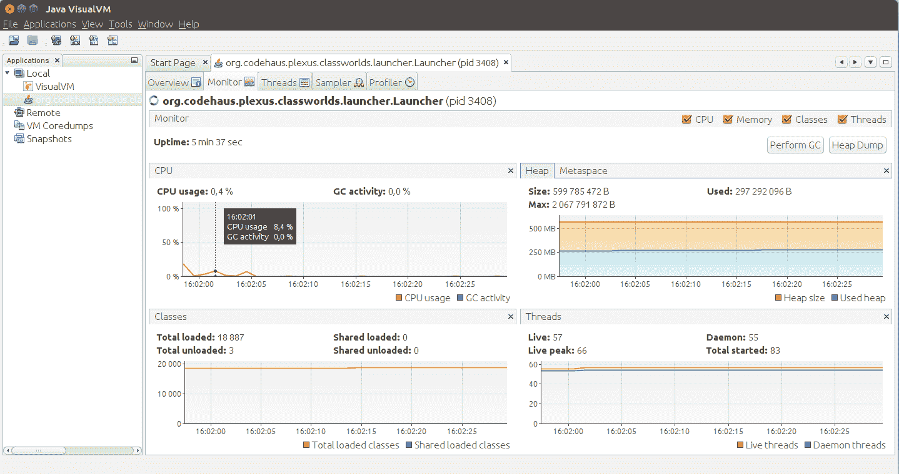

一旦你在左侧选择了 JVM，右侧窗格将显示关于 JVM 的信息。它组织在标签页中：

+   概览：这提供了关于 JVM（进程 ID、主类、参数、Java 版本、系统属性等）的高级信息。

+   监控：这提供了 CPU 使用率、内存使用率（特别是堆）、加载的类数量和线程数量的概述。

+   线程：这提供了 JVM 管理的现有线程的实时视图，并显示了线程状态随时间的变化（是否空闲或活跃）。以下是截图：

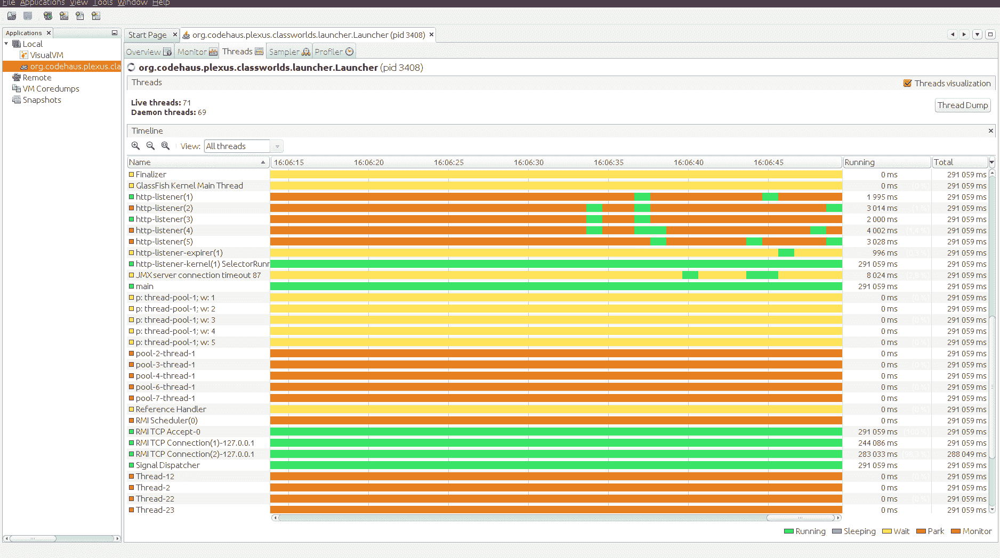

传奇故事位于右下角，并使用颜色帮助此视图可读：绿色代表运行，紫色代表睡眠，黄色代表等待，红色代表分叉，橙色代表监控。

有趣的是绿色块。这是线程正在执行某事的时候。以 http-listener(x)线程为例，你可以看到它们是橙色和绿色的。橙色部分是线程等待请求的时候，绿色部分是它们在提供服务的时候。这个视图必须与线程转储（或线程堆栈视图）结合使用，以确保等待的线程实际上正在等待某些相关的事情（例如等待某些 I/O），这是应用程序无法控制的。

+   样本采集器：这个标签非常有趣，允许你捕获服务器在 CPU 和内存方面的操作。我们发现了一些与`jcmd`相关的信息，但使用起来更简单。你只需要点击 CPU 或内存按钮，`jvisualvm`就会开始捕获相关信息。以下是捕获一些样本后你将得到的内存视图：


这个视图非常接近`jcmd`的 GC 直方图命令；你将找到类名、相应的字节数和实例数。你可以使用与你的应用程序相关的任何模式在底部过滤可见的类；在这个截图中，我们通过 Quote 进行了过滤。

如果你捕获了一些 CPU 样本，视图将集中在方法和它们的执行时间上：

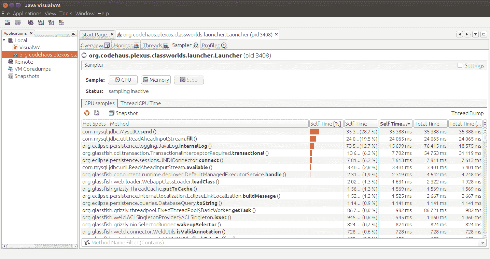

第一列是方法标识符，其他列显示了相应方法的对应时间。Self Time 是方法本身的时间。Self Time (CPU)与 Self Time 相同，但忽略了等待时间（锁等）。同样适用于 Total Time 列。Self Time 列和 Total Time 列之间主要区别是什么？Total Time 列包括进一步的方法调用，而 Self Time 列不包括。

当你在 CPU 视图上时，你可以点击线程转储来获取线程转储，与`jcmd`相同，但它在`jvisualvm`中直接可访问。

+   分析器：这是 JVM 视图的最后一个选项卡，提供与采样选项卡大致相同的视图。主要区别在于它捕获数据的方式。如果你在分析器中点击和看到第一份数据之间的时间相当长，请不要担心。而采样选项卡只是定期从 JVM（内存或线程堆栈）中获取*快照*并从中生成近似统计，分析器选项卡则修改类（实际字节码）以捕获准确数据。这意味着采样开销不是很大，但如果它影响到整个代码库，包括快速方法（默认情况下都会进行仪器化），则分析开销可能会很大。如果你想获得精确的度量，你需要使用分析器，但建议你勾选设置复选框，精确调整你想要获取度量信息的类，而不是使用默认设置，因为默认设置范围太广，可能会影响系统。

# 如何远程连接

本地连接很简单，因为`jvisualvm`只需本地查找正在运行的 JVM。但为了远程连接，你需要做一些额外的设置。

所有通信都依赖于 JMX，因此你需要设置一个远程 JMX 连接。这依赖于所谓的连接器（可以看作是一个小型嵌入式 JMX 服务器）。有多种协议可用，但默认情况下，它们依赖于 RMI 通信和系统属性的配置。

要添加这些系统属性，最快和最简单的方法如下：

```java
-Dcom.sun.management.jmxremote.port=1234
-Dcom.sun.management.jmxremote.ssl=false
-Dcom.sun.management.jmxremote.authenticate=false
```

它将在 1234 端口上启用 JMX 并禁用 SSL 和安全功能。为了性能，我们不需要更多，但如果你想在生产环境中使用它，你可能需要配置安全和 SSL。有关如何操作的更多详细信息，你可以参考 Oracle 网站上的[`docs.oracle.com/javase/8/docs/technotes/guides/management/agent.html`](https://docs.oracle.com/javase/8/docs/technotes/guides/management/agent.html)。

一旦配置完成，你只需在左侧树中的本地项上右键单击，选择添加 JMX 连接，并填写相关信息（主机/端口以及如果你已配置安全性的潜在凭证）。

# Java Mission Control

自从 Java 7u40 版本起，JDK 已经包含了 Java 飞行记录器工具。如果你记得`jcmd`中可用的命令，你有一些`JFR.*`选项，这些选项与这个工具直接相关。它允许你捕获一组 JVM 事件。它与**Java Mission Control**（**JMC**）结合使用，使你能够分析和利用 JVM 事件。

启动它很简单：

```java
$ $JAVA_HOME/bin/jmc
```

一旦启动，你将看到一个欢迎屏幕；视图看起来与`jvisualvm`视图相似，左侧列出了可用的进程：

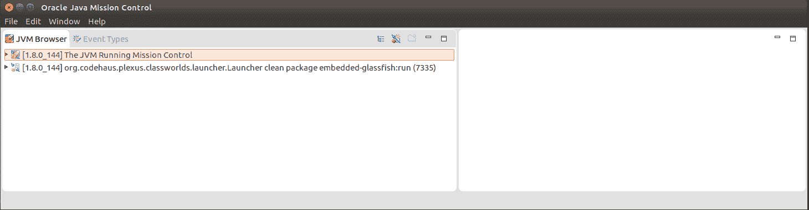

您可以使用与`jvisualvm`相同的提示来识别进程。如果您不太确定，请不要犹豫，使用`jps -v`命令，它将显示每个正在运行的 JVM 的命令行及其 PID（这将允许您在 JMC 中识别括号中的数字）。

一旦您已识别出您的进程，您可以右键单击它并选择“启动 JMX 控制台”，以获得类似于`jvisualvm`且针对所选 JVM 的视图：

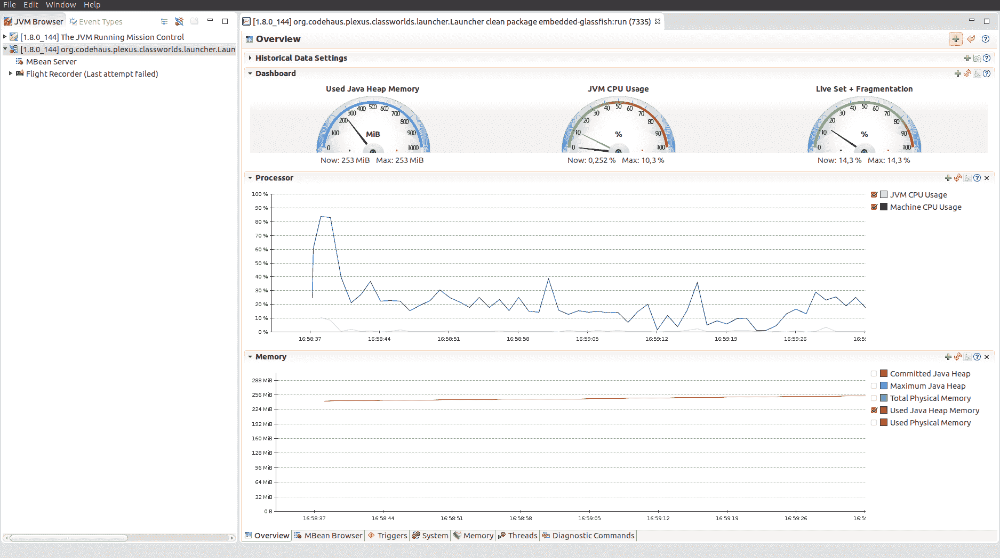

您可以找到 CPU（处理器）、内存和线程信息，以及 MBean 视图，这是 JVM 以标准方式导出内部数据的方式。

一个有趣的事情是当您转到“诊断命令”选项卡时，您将认出列出的`jcmd`命令：

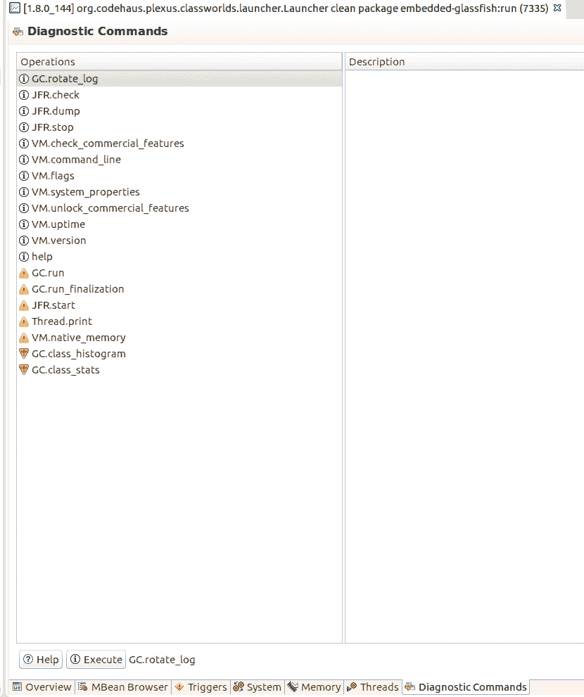

此面板允许您直接从 UI 执行`jcmd`命令。在这里，我们感兴趣的是**Java 飞行记录器**（**JFR**）命令，因为我们想获取更多关于我们的 JVM 的信息。

在前面的屏幕截图中，您可能已经注意到左侧树中有一个飞行记录器项。它为这些命令提供了一个用户界面。然而，如果您点击“开始录音”，您将得到以下错误：

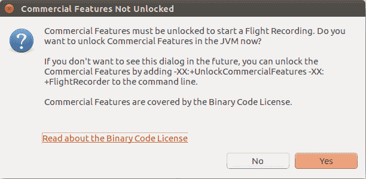

要使用 Java 飞行记录器，您需要将以下选项添加到您的 JVM 中：

```java
-XX:+UnlockCommercialFeatures -XX:+FlightRecorder
```

这两个选项将激活 Java 飞行记录器功能。要将它们添加到 GlassFish 中，您可以编辑`$GLASSFISH_HOME/glassfish/domains/domain1/config/domain.xml`文件，并在`jvm-options`之后将其添加到`java-config`块中。或者，您可以使用`create-jvm-options`命令行的`glassfish`命令。无论如何，您都需要在此修改后重新启动（或启动）您的服务器。

如果您想使用我们的 maven GlassFish 进行测试，您只需将它们添加到`MAVEN_OPTS`：

```java
$ MAVEN_OPTS="-XX:+UnlockCommercialFeatures -XX:+FlightRecorder" mvn embedded-glassfish:run
```

现在选项已在 JVM 上激活；您可以返回 Java 任务控制台，在“启动飞行记录器”项上点击开始录音。它将询问您存储录音的文件位置以及录音的时长或限制（大小/年龄）。最后，您可以选择是否要分析您的服务器或只是监控它。在这里，差异在于相关的开销。现在让我们选择分析。然后您可以点击“下一步”并选择您想要监控的内容。一个重要的参数是堆参数，但如果您继续通过向导，您将看到您可以精确地自定义您要监控的内容，包括 I/O。一旦一切配置妥当，只需点击“完成”。它将开始录音并在完成后打开。

首次使用时，请选择 1 分钟作为录音时长；这将避免您等待过长时间。

录音完成后，您应该得到一个类似于以下视图的视图，显示捕获的数据：

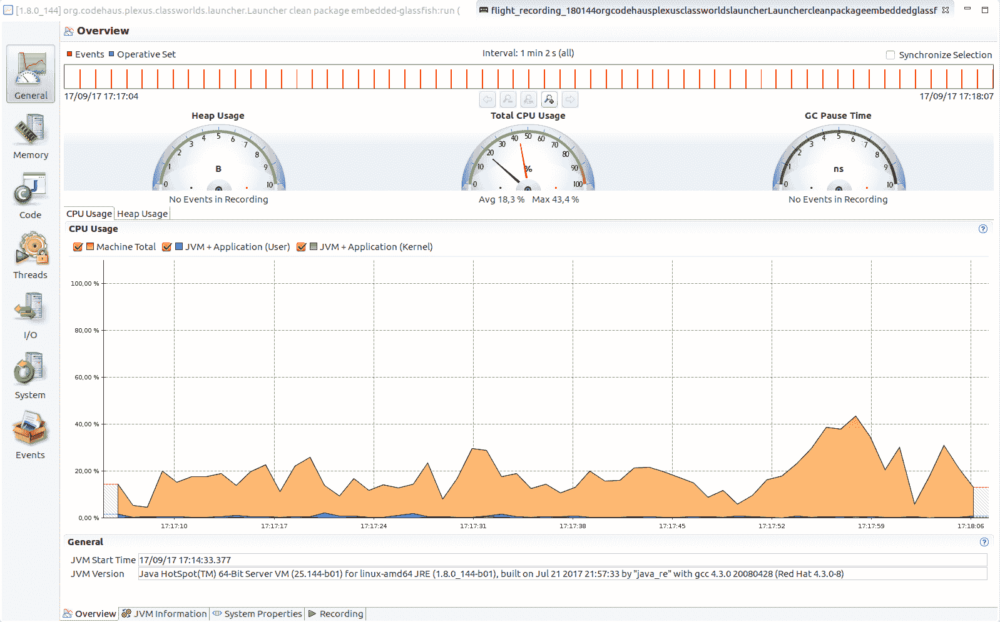

从顶部看，我们可以看到事件时间线。您可以点击它来细化时间选择。计数器显示了内存和 CPU 捕获的摘要。最后，在底部，您有 CPU 和内存图。

使这个工具比之前的工具更先进的是，您可以在代码标签页（在这个工具中标签位于左侧）中可视化代码热点，并在单个工具中查看 I/O。内置的 JDK 也使得使用它相当容易，而开销并不重要（如果您选择连续监视，一个对应的是统计信息可能不会非常准确，但足够接近，以便给您一个大致的概念）。这个工具的一个主要优势是代码标签页的调用树视图。它允许您通过堆栈将方法执行时间成本与方法调用关联起来。例如，当服务器运行时，这个捕获显示我们的`findAll`方法成本主要与我们将每个报价映射的方式有关，这需要使用 JPA 层（eclipselink）和数据库：

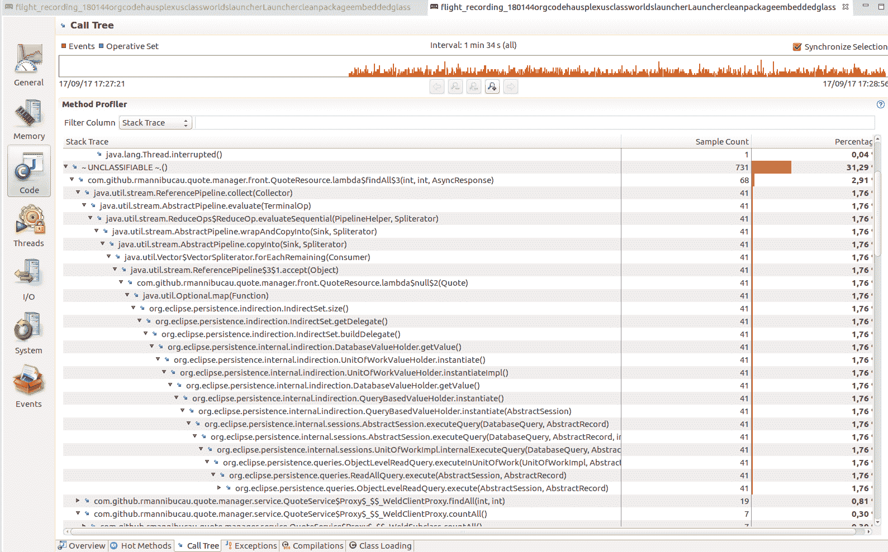

此视图是调查应用程序热点的一种真正很好的方式。它有点将线程转储和性能视图（有时称为*路径跟踪*）合并在一起，并允许您直接访问成本较高的操作。

# GlassFish 临时监视

许多服务器都有内置的监视功能。这高度取决于服务器，但它可以在不使用其他工具的情况下提供一些有趣的见解。当您无法控制机器或没有权限访问/配置服务器时，这非常宝贵。

为了说明这种监视，让我们使用我们的 Java EE 参考实现：GlassFish。

一旦使用正常的`./bin/asadmin start-domain`命令启动，您可以使用此附加命令激活监视：

```java
$ ./bin/asadmin enable-monitoring
Command enable-monitoring executed successfully.
```

如果您想禁用监视，确实有一个对称的命令：

```java
$./bin/asadmin disable-monitoring

```

您可以使用`get`命令列出可用的监视器：

```java
$ ./bin/asadmin get server.monitoring-service.*
server.monitoring-service.module-monitoring-levels.cloud=OFF
server.monitoring-service.module-monitoring-levels.cloud-elasticity=OFF
server.monitoring-service.module-monitoring-levels.cloud-orchestrator=OFF
server.monitoring-service.module-monitoring-levels.cloud-tenant-manager=OFF
server.monitoring-service.module-monitoring-levels.cloud-virt-assembly-service=OFF
server.monitoring-service.module-monitoring-levels.connector-connection-pool=OFF
server.monitoring-service.module-monitoring-levels.connector-service=OFF
server.monitoring-service.module-monitoring-levels.deployment=OFF
server.monitoring-service.module-monitoring-levels.ejb-container=OFF
server.monitoring-service.module-monitoring-levels.http-service=OFF
server.monitoring-service.module-monitoring-levels.jdbc-connection-pool=OFF
server.monitoring-service.module-monitoring-levels.jersey=HIGH
server.monitoring-service.module-monitoring-levels.jms-service=OFF
server.monitoring-service.module-monitoring-levels.jpa=OFF
server.monitoring-service.module-monitoring-levels.jvm=OFF
server.monitoring-service.module-monitoring-levels.orb=OFF
server.monitoring-service.module-monitoring-levels.security=OFF
server.monitoring-service.module-monitoring-levels.thread-pool=OFF
server.monitoring-service.module-monitoring-levels.transaction-service=OFF
server.monitoring-service.module-monitoring-levels.web-container=OFF
server.monitoring-service.module-monitoring-levels.web-services-container=OFF
server.monitoring-service.dtrace-enabled=false
server.monitoring-service.mbean-enabled=true
server.monitoring-service.monitoring-enabled=true
Command get executed successfully.
```

此输出显示，Jersey 的监视级别为`HIGH`，但其他监视器处于禁用状态（`OFF`）。

另一种选择是使用管理 UI（默认情况下在`http://localhost:4848`，对于独立安装）。转到左侧树中的配置部分，您将有一个监视项，您可以访问相同的条目：

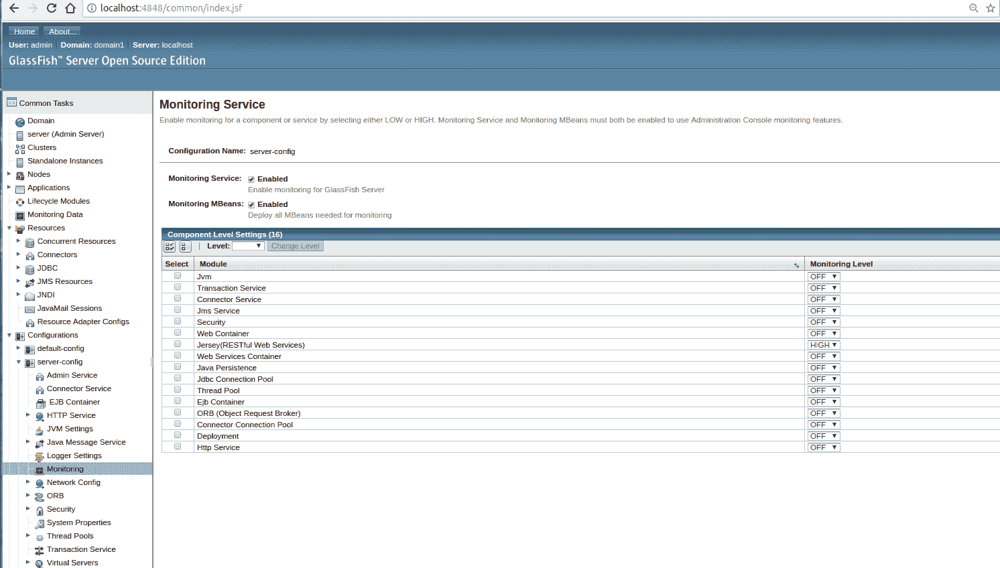

在表格左侧选择您想要的对应模块的级别将激活相关的监视。一旦监视被激活，通常需要重新启动服务器，以便 GlassFish 能够考虑它。

完成后，您可以通过左侧树的监视数据项访问相关信息：

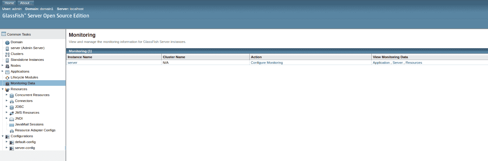

在这里，您可以查看监控的实例。（如果您使用独立的 GlassFish，您可能只有一个条目。）“查看监控数据”列将允许您选择您想要查看的数据。例如，如果您点击“应用程序”，您将获得相应的屏幕，其中填写了信息，具体取决于您之前激活的监控级别。以下是一个示例截图：

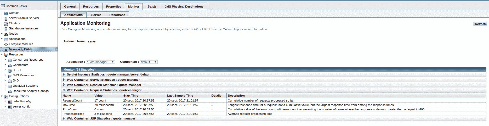

根据应用的不同，这会有所不同。然而，对于我们（一个 JAX-RS 服务）来说，即使它只提供高级信息，请求统计块也是有趣的。我们可以用它来监控最大响应时间和错误计数。仅凭它本身，可能不足以提高性能，但它将使我们能够将其与客户端信息进行比较；然后我们可以轻松地获取和验证我们的性能测试。

需要记住的是，服务器通常为最近的生产监控提供汇总的性能数据，而不是性能调整。这并不意味着它是无用的，而是您只能依靠临时的监控来验证您的性能测量管道（简单来说，就是您的客户端或请求注入器）。

# 库监控您的应用程序

我们看到了 JVM 为我们提供的工具以及服务器给我们提供的性能提示，但还有很多库旨在帮助您提高性能。

# 计数器、仪表、计时器以及更多

最著名的库可能是来自 Dropwizard 的*Metrics*（[`metrics.dropwizard.io`](http://metrics.dropwizard.io)），但所有库都共享更多或更少的相同类型的 API。度量值围绕几个重要概念展开：

+   **仪表**：这些提供了在特定时间点的值度量。它们旨在构建时间序列。最著名的例子是 CPU 或内存使用情况。

+   **计数器**：这些是长值，通常与仪表相关联，以构建时间序列。

+   **直方图**：这种结构允许您计算围绕值的统计信息，例如，请求长度的平均值或百分位数。

+   **计时器**：这些有点像直方图；它们基于一个度量值计算其他度量。在这里，目标是获取关于值速率的信息。

+   **健康检查**：这些与性能关系不大；它们允许您验证资源（如数据库）是否正在运行。如果资源不工作，健康检查会抛出警告/错误。

所有这些库都提供了不同的方式来导出/公开收集到的数据。常见的配置与 JMX（通过 MBeans）、Graphite、Elasticsearch 等相关，或者只是控制台/日志作为输出。

这些概念如何与性能联系起来？对我们来说最重要的功能将是仪表和计数器。仪表将使我们能够确保服务器运行良好（例如，CPU 不总是达到 100%，内存得到良好释放等）。计数器将使我们能够衡量执行时间。它们还将使我们能够在针对多个实例进行测试时导出聚合存储中的数据，这样你就可以检测一个实例对另一个实例的潜在副作用（例如，如果你有任何聚类的话）。

具体来说，我们希望衡量我们代码的一些重要部分。在极端情况下，如果你对应用程序一无所知，你可能会想要衡量代码的所有部分，然后在你对应用程序有更多了解时再对其进行细化。

为了非常具体地说明我们试图实现的目标，我们希望用这种模式来替换应用程序方法：

```java
@GET
@Path("{id}")
public JsonQuote findById(@PathParam("id") final long id) {
    final Timer.Context metricsTimer = getMonitoringTimer("findById").time();
    try {
        return defaultImpl();
    } finally {
        metricsTimer.stop();
    }
}
```

换句话说，我们希望用计时器包围我们的业务代码，以收集关于我们执行时间的统计数据。你可以尝试的一个常见且*简陋*的解决方案是使用日志记录器来完成。它通常看起来如下：

```java
@GET
@Path("{id}")
public JsonQuote findById(@PathParam("id") final long id) {
    final long start = System.nanoTime();
    try {
        return defaultImpl();
    } finally {
        final long end = System.nanoTime();
        MONITORING_LOGGER.info("perf(findById) = " +
        TimeUnit.NANOSECONDS.toMillis(end - start) + "ms");
    }
}
```

上述代码手动测量方法的执行时间，然后，将带有描述性文本的结果输出到特定的日志记录器中，以识别与之相关的代码部分。

在这样做的时候，你将遇到的问题是，你将无法获得任何关于你所衡量的统计数据，并且需要预处理你收集的所有数据，这将延迟使用指标来识别应用程序的热点并对其进行工作。这看起来可能不是一个大问题，但因为你很可能在基准测试阶段多次这样做，你将不希望手动进行。

然后，其他问题都与这样一个事实有关，即你需要将此类代码添加到你想要衡量的所有方法中。因此，你会在代码中添加监控代码，这通常是不值得的。如果你只是临时添加它以获取指标并在之后移除，那么影响会更大。这意味着你将尽可能避免这种工作。

最后一个问题是你可能会错过服务器或库（依赖）数据，因为你不拥有这段代码。这意味着你可能会花费数小时数小时地工作在一个代码块上，而这个代码块实际上并不是最慢的。

# 代码仪表化

立即的问题是*如何在不修改代码的情况下对想要衡量的代码进行仪表化？* 第一个目标是避免在代码中过于侵入，同时也要避免为了基准测试的持续时间而影响整个应用程序。第二个目标是能够*切换*仪表化，并能够将其停用，以便在不进行监控的情况下测量应用程序（尤其是如果你将其放在每个地方），并忽略你获取的指标上的相关开销。

现在，在 Java 和 Java EE 状态下，您有几种方法可以对代码进行插装。我们将浏览其中大部分，但这里是对您所拥有的选择的概述：

+   **选择 1 – 手动**：在这个解决方案中，您使用您所依赖的监控框架的*Factory*包装您使用的实例，返回的实例被包装在一个监控代理中（新实例委托给原始实例）。具体来说，它可以看起来像以下这样：

```java
@ApplicationScoped
public class QuoteResource {
    @Inject
    private QuoteService service;

    @PostConstruct
    private void monitorOn() {
        service = MonitoringFactory.monitor(service);
    }
}
```

从我们之前讨论的内容来看，这有一个缺点，即影响代码并限制插装仅限于您拥有的（或可以修改的）代码。然而，它的一个重大优势是它简单易集成，并且可以与任何类型的代码（由 EE 容器管理或不管理）一起工作。具体来说，大多数监控库都将拥有此类实用程序，并且通常在其他的集成中内部使用它。

+   **选择 2 – 通过 CDI（或拦截器 API）**：将逻辑注入到服务中的 Java EE 标准方式是使用拦截器。我们将在专门的部分详细说明它是如何工作的，但总体思路是将方法标记为被监控。在这里，限制将是您需要通过 CDI 容器访问您想要监控的代码。然而，在编码方面，它比前一种解决方案的影响要小。

如果您的应用程序依赖于 Spring，Spring 框架有相同类型的工具（在他们的文档中称为*AOP*）。因此，即使激活的方式略有不同，同样的概念也适用。

+   **选择 3 – 通过 javaagent**：javaagent 是插装代码的最强大方式。缺点是您需要直接在 JVM 上配置它，而优点是您可以监控几乎所有的类（除了 JVM 本身的少数几个类）。

一些容器（例如 Tomcat/TomEE 等）允许您配置`java.lang.instrument.ClassFileTransformer`。这基本上使您能够在加载时（动态地）执行字节码插装。这使得您能够享受到几乎与 javaagent 相同的强大功能，但您将无法对容器——以及可能的部分 JVM——进行插装，而只能对应用程序的类进行插装。然而，它仍然比 CDI 插装更强大，因为它可以看到应用程序的所有类，而不仅仅是 CDI 处理的那些类。

# CDI 插装

如果我们再次关注 Metrics 库，我们会发现几个 CDI 集成。全局的想法是在代码上装饰一些注解，并自动获取与执行代码关联的度量。显然，这种方式会影响您的代码（例如使用[`github.com/astefanutti/metrics-cdi`](https://github.com/astefanutti/metrics-cdi)）：

```java
@Transactional
@ApplicationScoped
public class QuoteService {
    @PersistenceContext
    private EntityManager entityManager;

    @Timed(name = "create")
    public Quote create(final Quote newQuote) {
        entityManager.persist(newQuote);
        entityManager.flush();
        return newQuote;
    }
}
```

`@Timed`注解将自动将方法执行包装在 Metrics 计时器中，因此将提供关于方法执行时间的统计信息。与`@Timed`注解关联的拦截器的相关代码非常接近以下逻辑：

```java
private Object onInvocation(InvocationContext context) throws Exception {
    Timer.Context time = findTimer(context).time();
    try {
        return context.proceed();
    } finally {
        time.stop();
    }
}
```

这正是我们想要实现的目标，但它有一个我们还没有考虑到的陷阱：异常处理。为了理解这一点，我们可以比较在已退役的项目（称为 Apache Sirona）中使用的代码，该项目具有以下不同实现的功能：

```java
protected Object doInvoke(final InvocationContext context) throws Throwable {
    final Context ctx = before(context);
    Throwable error = null;
    try {
        return proceed(context);
    } catch (final Throwable t) {
        error = t;
        throw t;
    } finally {
        if (error == null) {
            ctx.stop();
        } else {
            ctx.stopWithException(error);
        }
    }
}
```

这里重要的是要注意，在异常的情况下代码路径会发生变化。从统计学的角度来看，这意味着失败将会有与成功调用不同的标记在指标报告中。这一点很重要，因为失败的执行时间很少与成功可比较，即使是对于简单的方法。让我们从一个简单的报价管理应用程序的查找示例中观察这一点。以下是我们要调查的行：

```java
entityManager.find(Quote.class, id)
```

一个正常的带有有效 ID 的调用大约在 6 到 7 毫秒（在我的参考机器上，使用我的个人配置）。`EntityManager#find`方法可以接受任何类型的标识符，因此如果我们传递错误类型（例如，`String`而不是`long`），那么调用应该编译并执行。Eclipselink 会抛出异常，但性能影响是很有趣的：0 毫秒！确实，这个例子非常极端，是一个错误，但如果你在端点上有一些速率限制或在方法开始时有一些合理性检查，你可能会观察到相同的影响。

这意味着如果你使用的框架将所有调用（无论是否有错误）放入同一个桶中，你可能会获得非常好的性能，但应用程序可能会非常慢，因为成功/失败的平均值使得数据看起来很好。

# 实现你自己的可配置监控拦截器

实现 CDI 拦截器并不复杂。因此，如果你找不到符合你期望的库，你可能想自己实现。它可以从两个方面直接影响你使用监控的方式：

+   能够根据你所在的情况控制你使用的计数器。这包括成功/失败处理，但也可能是与租户相关的（如果你的应用程序正在处理多个租户）。如果你不使用与租户完全相同的系统（例如，一个可能比另一个慢的数据库），这可能非常重要。

+   能够配置要监控的 Bean。是的，使用 CDI，你也可以避免装饰你想要监控的 Bean，而是从配置中自动完成。

创建 CDI 拦截器的第一步是拥有 CDI 所说的*拦截器绑定*。这是你将在你的 Bean 上使用的注解，它将标记方法为被监控。这里有一个简单的例子：

```java
@InterceptorBinding
@Target({ElementType.TYPE, ElementType.METHOD})
@Retention(RetentionPolicy.RUNTIME)
public @interface Monitored {
}
```

这是一个普通的注解，你可以将其放在方法中（或类中以标记所有方法为监控）。唯一特别的是它的`@InterceptorBinding`标记。

然后，要将这个拦截器绑定到实际的拦截器实现，你需要创建一个具有相同注解的拦截器：

```java
@Interceptor
@Monitored
@Priority(Interceptor.Priority.PLATFORM_BEFORE)
public class MonitoredInterceptor implements Serializable {
    @AroundInvoke
    @AroundTimeout
    public Object monitor(final InvocationContext invocationContext) throws Exception {
        final Context ctx = newContext(invocationContext);
        Exception error = null;
        try {
            return invocationContext.proceed();
        } catch (final Exception t) {
            error = t;
            throw t;
        } finally {
            if (error == null) {
                ctx.stop();
            } else {
                ctx.stopWithException(error);
            }
        }
    }
}
```

被`@AroundInvoke`装饰的方法将处理方法调用，而被`@AroundTimeout`装饰的方法也将支持 EJB 定时器回调（`@Timeout`）。

注意，如果你还想监控构造函数，你也可以这样做，但你需要实现一个`@AroundConstruct`方法（与我们的`monitor`方法有类似的实现）。我们的拦截器自动被`@Priority`装饰，因此它被启用，你不需要在`beans.xml`中激活它。

使用这段代码，你可以用`@Monitored`装饰任何方法，并且假设你的`Context`存储了指标，你将在使用的报告解决方案中获得你的数据。

然而，编写自定义实现的一个目标也是能够配置它。使用 CDI，可以通过`Extension`来实现。全局思路将是观察应用程序类型/方法，如果配置为要监控，我们将自动添加`@Monitored`。这样，我们将在应用程序中没有代码影响，并且我们可以通过简单地更改我们的配置来轻松激活/停用监控。对于配置，我们可以从以下`performance.properties`资源开始（注意，它将很容易更改为应用程序外的特定文件）：

```java
public class PerformanceExtension implements Extension {
    private final Annotation monitored = new
    AnnotationLiteral<Monitored>() {};
    private final Properties configuration = new Properties();
    private boolean enabled;

    void loadConfiguration(final @Observes BeforeBeanDiscovery
    beforeBeanDiscovery) {
        try (final InputStream configStream =
        Thread.currentThread().getContextClassLoader()

        .getResourceAsStream("performances.properties")) {
            if (configStream != null) {
                configuration.load(configStream);
            }
        }   catch (final IOException ioe) {
            throw new IllegalArgumentException(ioe);
        }
        enabled =
        Boolean.parseBoolean(configuration.getProperty("enabled",
        "true"));
    }

    <A> void processAnnotatedType(final @Observes 
    ProcessAnnotatedType<A> pat) {
        if (!enabled) {
            return;
        }

        final String beanClassName =
        pat.getAnnotatedType().getJavaClass().getName();
        if(Boolean.parseBoolean(configuration.getProperty(beanClassName
        + ".monitor", "false"))) {
            pat.setAnnotatedType(new WrappedAnnotatedType<>
            (pat.getAnnotatedType(), monitored));
        }
    }
}
```

此代码使用`BeforeBeanDiscovery`事件（CDI 生命周期的开始）来加载我们的配置。在这里，你可以从任何地方读取。一个小优化是有一个特殊的键来检查扩展是否已激活。如果它设置为除了 true 之外的其他值，那么我们将跳过所有其他事件。如果它被启用，我们将通过`ProcessAnnotatedType`事件观察所有发现类型。如果 bean 应该被监控（我们这里的测试非常简单，我们只是检查类名后缀*monitor*是否在我们的配置中为 true），那么我们将覆盖`AnnotatedType`，保留所有其信息，但将`@Monitored`添加到类的注解集合中。

你也可以在方法级别上做完全相同的事情，通过`AnnotatedType#getMethods`返回的`AnnotatedMethod`包装。逻辑是相同的；你只需要多一个配置级别（针对方法）。

`WrappedAnnotatedType`实现是一个简单的代理实现，除了注解访问器，这里使用了一个新集合而不是原始集合：

```java
public class WrappedAnnotatedType<A> implements AnnotatedType<A> {
    private final AnnotatedType<A> delegate;
    private final Set<Annotation> annotations;

    public WrappedAnnotatedType(final AnnotatedType<A> at, final
    Annotation additionalAnnotation) {
        this.delegate = at;

        this.annotations = new HashSet<Annotation
        >(at.getAnnotations().size() + 1);
        this.annotations.addAll(at.getAnnotations());
        this.annotations.add(additionalAnnotation);
    }

    @Override
    public Set<Annotation> getAnnotations() {
        return annotations;
    }

    @Override
    public <T extends Annotation> T getAnnotation(final Class<T>
    annotationType) {
        for (final Annotation ann : annotations) {
            if (ann.annotationType() == annotationType) {
                return annotationType.cast(ann);
            }
        }
        return null;
    }

    @Override
    public boolean isAnnotationPresent(final Class<? extends
    Annotation> annotationType) {
        return getAnnotation(annotationType) != null;
    }

    // other methods fully delegate the invocations to the delegate
    instance
}
```

如你所见，唯一的逻辑在`getAnnotation`和构造函数中，其中创建了一个新集合的注解来替换原始集合。

最后，为了启用`Extension`并让 CDI 找到它，我们只需将它的全限定名放在我们项目资源中的`META-INF/services/javax.enterprise.inject.spi.Extension`。

一旦将此扩展添加到您的应用程序中（如果您想将其开发为库，只需将`jar`文件添加到您的`war`包内部即可），您可以通过`performances.properties`来配置它。

在我们的案例中，监控我们的报价服务看起来是这样的：

```java
# activate the monitoring
enabled = true

# monitor the QuoteService class
com.github.rmannibucau.quote.manager.service.QuoteService.monitor = true
```

更重要的是，您可以在要监控的类旁边添加一行。不要忘记在更新此文件时重启，因为配置和 CDI 模型包装仅在启动时完成。

# Javaagent – 一种复杂但强大的仪器化

如果您再次回到指标，您甚至可以找到现有的 javaagents，尽管它们可能不多，因为编写代理稍微复杂一些。

Javaagent 是 JVM 提供的主方法的一种特殊类型，它允许您注册`ClassFileTransformer`，这是一种在类被加载之前修改类字节码的方法。换句话说，您将编写一些代码并编译它，但 JVM 永远不会执行它。相反，它将执行代码的重写版本。

我们不会在这里详细说明如何做。实际上，这比编写拦截器更复杂（您需要处理类加载器，使用 ASM 库或等效的低级字节码编写，等等）。然而，重要的是要看到 javaagent 的范围是 JVM——不是应用程序，不是容器，而是整个 JVM。由于技术原因，正如您可能猜到的，您不能对所有的 JVM 类进行仪器化，但可以对 javaagent 启动后加载的所有类进行仪器化（这已经足够远了）。

使用 javaagent 进行`java.net.HttpURLConnection`的仪器化是一个使用 javaagent 进行仪器化的好例子。

此类通常用于实现 Java HTTP 客户端，但它通常被库（如 JAX-RS 客户端实现）隐藏。因此，如果您不能测量这个特定的类，您就很难获得当前的请求和框架时间。

这就是 javaagent 将比 CDI 或 Spring 仪器化更强大的原因。

为了让您了解您可以使用 javaagent 做什么，我们将在报价管理应用程序中配置 Sirona 项目。

# Sirona javaagent

为了保持简单易懂，我们将使用 maven，但您可以在任何应用程序服务器上遵循相同的步骤，因为 javaagent 是在 JVM 上设置的，而不是在特定的服务器上。

第一步是下载 javaagent `jar`文件。要使用 maven 这样做，您只需在`pom.xml`中添加依赖项 maven 插件即可：

```java
<plugin>
  <groupId>org.apache.maven.plugins</groupId>
  <artifactId>maven-dependency-plugin</artifactId>
  <version>3.0.2</version>
  <executions>
    <execution>
      <id>sirona</id>
      <goals>
        <goal>copy</goal>
      </goals>
      <configuration>
        <artifactItems>
          <artifactItem>
            <groupId>com.github.rmannibucau.sirona</groupId>
            <artifactId>sirona-javaagent</artifactId>
            <version>0.6</version>
            <type>jar</type>
            <classifier>shaded</classifier>
            <overWrite>true</overWrite>
            <outputDirectory>${project.basedir}</outputDirectory>
            <destFileName>sirona-javaagent.jar</destFileName>
          </artifactItem>
        </artifactItems>
      </configuration>
    </execution>
  </executions>
</plugin>
```

它被配置为下载 sirona-javaagent 阴影 JAR（全部在一个包中）。现在，如果您执行此 maven 命令，您应该能在您的 maven 项目中获得 javaagent JAR：

```java
$ mvn dependency:copy@sirona
```

一旦执行此命令，您应该能在 pom 旁边找到`sirona-javaagent.jar`文件。

现在我们有了 javaagent，我们需要对其进行配置。为了简化，Sirona 支持当前目录中的`sirona.properties`配置文件，因此我们将使用它。以下是它将包含的内容以激活应用程序中的监控：

```java
com.github.rmannibucau.sirona.javaagent.listener.CounterListener.includes=prefix:com.github.rmannibucau.quote.manager
com.github.rmannibucau.sirona.javaagent.listener.CounterListener.excludes=container:jvm

com.github.rmannibucau.sirona.store.counter.CounterDataStore=com.github.rmannibucau.sirona.store.counter.CsvLoggingCounterDataStore

com.github.rmannibucau.sirona.csvlogging.counter.period=5000
com.github.rmannibucau.sirona.csvlogging.counter.clearAfterCollect=true

com.github.rmannibucau.sirona.javaagent.path.tracking.activate=false

```

与`CounterListener`相关的配置是关于监控的范围：哪些被仪器化，哪些没有被仪器化。在这里，我们只是仪器化我们的应用程序包，并让 Sirona 忽略 JVM 类（`container`是内置排除集的别名）。然后，我们配置`CounterDataStore`，其中存储指标。在这个例子中，我们使用日志风格（指标将被输出到日志中）和 CSV 格式。这是最简单的方法，但您也可以配置它以将数据输出到 Elasticsearch、Graphite 或任何外部系统。然后，我们配置我们的存储以每 5 秒（5000 毫秒）记录一次——这主要是为了演示，但在现实生活中，您可能希望等待一分钟左右。接下来，我们请求在收集后清除存储。这一点意味着每次记录数据时，数据都会重置。它避免了启动数据对运行时数据产生副作用。最后，最后一行禁用了 Sirona 的路径跟踪功能，该功能是 javaagent 内置的，但在这里我们不需要它。

现在一切配置就绪，我们只需确保我们的应用程序已准备好运行（如果您有疑问，可以重新执行`mvn clean package`）然后使用 JVM 上的 javaagent 启动它（如果使用 maven 启动 GlassFish，则使用 maven；如果使用独立实例，则直接使用 GlassFish）：

```java
MAVEN_OPTS="-javaagent:sirona-javaagent.jar" mvn embedded-glassfish:run
```

如您所见，添加 javaagent 就像在 JVM 上添加`-javaagent`选项一样简单，后面跟着 JAR 的路径。

如果代理是原生开发的，而不是用 Java 编写的，命令将非常相似（但使用`-agentlib`）。这就是您如何区分 Java 和原生代理，但原则是相同的。

一旦启动了服务器，如果您等待几秒钟（~5 秒，如我们的配置），您将开始获得一些与 Sirona 收集的指标相关的输出：

```java
sept. 23, 2017 12:16:32 PM com.github.rmannibucau.sirona.store.counter.LoggingCounterDataStore pushCountersByBatch
INFOS: "com.github.rmannibucau.quote.manager.service.ProvisioningService$Data.getQuoteSummary()";"performances";70;1;3045.0;157.0;842.514285714286;58976.0;622.1554571298391
sept. 23, 2017 12:16:32 PM com.github.rmannibucau.sirona.store.counter.LoggingCounterDataStore pushCountersByBatch
INFOS: "com.github.rmannibucau.quote.manager.service.QuoteService$Proxy$_$$_WeldSubclass.weld$$$46()";"performances";1;1;6054.0;6054.0;6054.0;6054.0;0.
```

输出格式取决于日志记录器配置。默认情况下，它并不那么花哨，但如果您配置了您的日志记录器，您将获得纯 CSV 输出。在 Sirona 中，默认情况下，日志记录器名称将是`com.github.rmannibucau.sirona.counters`。如果您想在没有特定格式化模式的情况下配置此特定日志记录器到特定文件，您将必须使用日志记录器名称而不是类名。

为了让我们更简单，我们只需更改 JVM 中的`SimpleFormatter`格式（它将影响使用此格式器的所有日志记录器）：

```java
MAVEN_OPTS="-Djava.util.logging.SimpleFormatter.format=%5\$s%6\$s%n -javaagent:sirona-javaagent.jar"
```

注意，根据您的操作系统，您可能需要（或不需）转义美元符号，就像上一个例子中那样（它是针对 Linux 的）。

一旦服务器以这种新配置启动，输出将更易于阅读：

```java
"com.github.rmannibucau.quote.manager.service.QuoteService$Proxy$_$$_WeldSubclass.weld$$$94()";"performances";1;1;4347.0;4347.0;4347.0;4347.0;0.0
"com.github.rmannibucau.quote.manager.service.QuoteService$Proxy$_$$_WeldSubclass.weld$$$98()";"performances";1;1;3842.0;3842.0;3842.0;3842.0;0.0
"com.github.rmannibucau.quote.manager.service.QuoteService$Proxy$_$$_WeldSubclass.weld$$$102()";"performances";1;1;4186.0;4186.0;4186.0;4186.0;0.0
"com.github.rmannibucau.quote.manager.model.Quote._persistence_new(org.eclipse.persistence.internal.descriptors.PersistenceObject)";"performances";11;1;15760.0;4272.0;8134.545454545455;89480.0;3191.1807959949983
"com.github.rmannibucau.quote.manager.service.QuoteService.mutate(java.lang.String,java.util.function.Function)";"performances";10;1;1.3095653E7;5517805.0;9319597.6;9.3195976E7;2502831.398655584
"com.github.rmannibucau.quote.manager.service.ProvisioningService$Data.getQuoteSummary()";"performances";70;1;7909.0;519.0;1455.4142857142854;101879.0;1239.6496056226922
```

这里有趣的是，你可以直接将其导入 CSV 编辑器，包括 Microsoft Excel 或 LibreOffice Calc，并处理数据（排序、比较等）。

为了有效地处理数据，你需要知道列代表什么。对于这个特定的数据存储，以下是标题列表：

+   计时器/计数器名称

+   计时器/计数器角色（*性能*表示执行时间被测量，*失败*表示发生了异常）

+   击中次数（指示在测量窗口中方法被调用的频率）

+   最大并发性（指示在测量窗口中方法的最大并发调用）

+   最大值（给出最大执行时间）

+   最小值（给出最小执行时间）

+   平均值（给出平均执行时间）

+   总和（给出所有执行时间的总和）

+   窗口中所有执行时间的标准差

在你调查寻找方法瓶颈以深入挖掘（为了优化性能）的过程中，你必须考虑多个数据集。第一个数据将是*总和*。如果你按*总和*（降序）排序，第一个方法将是消耗你应用大量时间的那个。然而，你需要验证它与击中次数的关系。例如，如果你只有一个击中，那么你知道缓存这个方法的数据将不会有所帮助。标准差（或比较最小/最大范围）也会给你关于方法行为的想法。如果范围很大，那么你需要调查这个方法做了什么，以及为什么它有时快有时慢。

一旦你找到了一个好的方法来调查，你可以重复使用我们之前提到的工具来深入研究这个方法。拥有这种程度的信息开始工作通常更容易处理，并且更侧重于应用概述而不是详细视图，后者可能难以（或耗时）组织。从详细视图开始钻取性能数据总是比从详细视图开始更容易。

现在，为了展示 javaagent 有多强大，我们将暂时更改我们的 sirona 配置。我们将排除 Oracle 包（只是为了覆盖默认排除，即整个 JVM），并将包括`HttpURLConnection`。

我们应用的目标可以是比较我们在配置过程中花费的时间和当前网络成本，因为我们无法优化它，因为它与环境相关联，我们假设在基准测试阶段它是恒定的。

现在配置看起来是这样的：

```java
com.github.rmannibucau.sirona.javaagent.listener.CounterListener.includes=prefix:com.github.rmannibucau.quote.manager,\
    prefix:sun.net.www.protocol.http.HttpURLConnection
com.github.rmannibucau.sirona.javaagent.listener.CounterListener.excludes=prefix:oracle

com.github.rmannibucau.sirona.store.counter.CounterDataStore=com.github.rmannibucau.sirona.store.counter.CsvLoggingCounterDataStore

com.github.rmannibucau.sirona.csvlogging.counter.period=5000
com.github.rmannibucau.sirona.csvlogging.counter.clearAfterCollect=true

com.github.rmannibucau.sirona.javaagent.path.tracking.activate=false

```

只有前两行发生变化，你可以看到 JVM 不再被排除在外，以便能够对 sum 包进行仪器化，而`HttpUrlConnection`现在被包括在仪器化类的白名单中。

我们重新启动我们的服务器，并在配置后，我们得到这些新的输出：

```java
"sun.net.www.protocol.http.HttpURLConnection.plainConnect()";"performances";1;1;1.288844214E9;1.288844214E9;1.288844214E9;1.288844214E9;0.0
"sun.net.www.protocol.http.HttpURLConnection.getNewHttpClient(java.net.URL,java.net.Proxy,int)";"performances";1;1;1.288132398E9;1.288132398E9;1.288132398E9;1.288132398E9;0.0
....
```

配置更改包括 JVM HTTP 客户端监控，我们现在可以了解实际网络中花费的部分时间以及客户端代码本身花费的时间，包括重试和所有嵌入的逻辑。这是没有 javaagent 就无法获得的信息。

*现代* 架构倾向于鼓励微服务。这意味着你将主要将你的整体系统拆分为具有明确责任分离的子系统。这涉及到很多问题，例如处理跨不同系统的交易需求（就像在它那个时代所做的那样），添加多个远程通信，这会减慢整体过程，等等，但这也带来了允许你更快地开发系统并更轻松地投入生产的优势。总是存在权衡。

在任何情况下，如果你专注于性能，你现在可能必须处理这样的系统，因此需要知道哪些工具可以帮助你。

主要有两种解决方案可以帮助你很多：

+   **数据聚合**：所有应用程序的所有数据都将聚合到单个系统中。例如，之前捕获的 N 个实例的执行时间将存储在单个 *数据库*（例如 InfluxDB 或 Elasticsearch）中。

+   **跟踪**：整个系统将传播单个 *事务 ID*（也称为 *请求 ID*），这将使你能够识别跨所有系统和你所处的阶段（例如管道中的第三个系统）的请求（用户操作）。

# SQL 监控

在许多应用程序中，大部分时间都将被 SQL 查询的执行所占用。因此，监控它们非常重要。你可以使用之前的技术，但也有一些专门的方法来监控它们。

通常，想法是替换你使用的本地驱动程序（例如 Oracle、MySQL 等）为监控驱动程序，该驱动程序将包装默认驱动程序并将所有逻辑委托给原始驱动程序，并在其之上添加一些指标。

例如，使用 sirona JDBC 驱动程序（[`repo.maven.apache.org/maven2/com/github/rmannibucau/sirona/sirona-jdbc/0.6/`](http://repo.maven.apache.org/maven2/com/github/rmannibucau/sirona/sirona-jdbc/0.6/)) 作为我们的数据源，我们将以这种方式定义应用程序数据源：

```java
@DataSourceDefinition(
        name = "java:app/jdbc/quote_manager",
        className = "com.github.rmannibucau.sirona.jdbc.SironaDriver",
        url = "jdbc:sirona:mysql://localhost:3306/quote_manager?delegateDriver=com.mysql.jdbc.Driver",
        user = "root",
        password = "password"
)
public class DataSourceConfiguration {
}
```

驱动程序的类名现在是监控类，URL 也略有变化以配置监控驱动程序。在这里，使用 Sirona，你在本地驱动程序 URL 之前和 `jdbc:` 前缀之后附加 `sirona`，并将 `delegateDriver` 查询参数添加到 URL 中，其值为本地驱动程序的类名。

一旦完成，Sirona 将自动为每个语句创建计数器并将其添加到其报告中。

这种解决方案与预定义语句配合得非常好，因为你将重用相同的 *键*（SQL 值）。这通常是任何 JPA 提供商所做的事情。

这种在 Java 和数据库之间的可视化可以帮助确定慢查询。这类实现有很多。只需选择你喜欢的，比如 Sirona、Jamon、JavaSimon、Log4jJDBC、P6Spy 以及其他。

# 数据聚合

微服务——或者更普遍地说，具有小范围的服务——通常是快速移动的应用程序，并且很容易在全局系统中添加/删除它们。在这种情况下，性能需要与任何兄弟服务的变更（这可能会通过过度使用或误用影响中心服务）相媲美且可验证。

能够对所有系统有一个集中视角是理解如何优化另一个应用程序可以使你的应用程序运行更快的关键。这个陈述的推论是，当你依赖于另一个应用程序，而这个应用程序对于你的服务级别协议来说太慢时，你需要尽快意识到这一点。一旦确定，你可以添加缓存或替代方式，使你的应用程序对其他应用程序的依赖性降低，并运行得更快。

并非总是可能——例如，在我们的报价管理应用程序中，我们无法获取有关 Yahoo 的数据——但在微服务结构中，你通常会得到公司政策或至少是讨论和实施它的联系人。

在实践中，这主要关于同意一种识别应用程序的方式（这只是在整体系统中定义一个约定，由所有子系统共享）以及放入聚合器中的数据格式。例如，你可以说你将使用`Company-ID` HTTP 头作为请求标识符，日志格式将是`${Company-Id} | ${Tenant-Id} | ${Machine-Id} | ${Execution-Time} | ${action/method} | ${message}`。

这只是一个简单的例子，但想法是能够快速浏览跨应用程序的日志。

一旦你知道你将记录什么，你需要选择一个系统来存储你的数据。在这里，你有许多选择，但不要忘记检查你能否在数据存储后利用这些数据。这意味着你需要确保你有一个好的用户界面，它将满足你对存储的期望。

最知名的是这些：

+   Elastic 堆栈：它基于 Elasticsearch 来存储数据，Kibana 来可视化数据。它是免费的。

+   Splunk：这是一个专门用于数据聚合的自定义堆栈。

+   Grafana：它主要是一个 UI 工具，但它可以连接到大多数监控数据库，包括 Elasticsearch、Graphite 或 InfluxDB。

# 跟踪

跟踪有多种选择（Zipkin、Dapper 等），但其中一些似乎已经成为了主流。其中之一是 OpenTracing 倡议（[`opentracing.io/`](http://opentracing.io/)）。所有这些或多或少都基于 span 的设计。

全球理念是让每个事务的参与者用跨度标记他们的存在。跨度包含一个标识符，一些关于调用的元数据以及执行时间。标识符通常由多个值组成，代表整体跟踪标识符（请求标记）、跨度标识符，以及通常的父标识符。

当正确安装时，跟踪发生在客户端和服务器端，因此你可以全面了解系统处理，并且它与系统各部分的处理时间相关联。这确实是为了确保你的系统的每个部分都得到了适当的配置——每次你退出或进入系统时，你必须设置好以处理相关的跟踪。这包括 HTTP 客户端/服务器，以及 JDBC 或 NoSQL 驱动程序。

至于监控库，这依赖于存储，但也有本地实现（有点像我们在讨论 Sirona javaagent 时提到的 CSV 记录器），你可以用来测试你的配置或作为无法使用真实监控数据库时的后备方案。然而，使用此类系统的本地输出会使你的工作更加困难和耗时，因为它实际上是将多个数据聚合以获得整体视图。你需要理解的是，你不必犹豫投资建立一个专门用于数据收集的服务器。这不仅有助于性能，还有助于追踪你的系统。因此，这是一项值得的投资！

# APM

你可以在市场上找到称为**应用性能管理（APM**）的工具。这些工具确实是监控工具中的劳斯莱斯，允许你完全追踪应用程序的所有步骤，回到过去了解发生了什么，并快速推断支持问题的原因。付费方案通常还包括基础设施，这并非微不足道，因为它涉及到大量数据操作。

技术上，它们重用了之前的一些技术，但确实是一个一站式解决方案，这使得它们非常有价值。然而，它们通常很昂贵，很少开源。

尽管如此，你仍然可以找到一些开源实现，例如 PinPoint([`github.com/naver/pinpoint`](https://github.com/naver/pinpoint))、InspectIT([`github.com/inspectIT/inspectIT`](https://github.com/inspectIT/inspectIT))和 Glowroot([`glowroot.org/`](https://glowroot.org/))。在领先的商业解决方案方面，你可以找到 New Relic ([`newrelic.com/java`](https://newrelic.com/java))、DripStat ([`dripstat.com`](https://dripstat.com))或 DynaTrace ([`www.dynatrace.com/`](https://www.dynatrace.com/))。

# 摘要

在这部分，我们看到了许多收集关于 JVM 和应用程序信息的方法。我们还看到，JVM 本身提供了一套工具，以提供有关内存、CPU 和垃圾回收的信息。其中大部分可以通过命令行（在没有 UI 的情况下进行基准测试时可能非常有用）获取，但它们也附带了一些用户界面，一旦您能够连接到 JVM，就可以轻松获取信息。这些工具之一是 JMC：它提供了大量信息，甚至允许您深入到方法调用中，以获得您应用程序的详细视图。

然而，这还不够，您可能需要获取有关池使用情况的服务器信息，在这种情况下，服务器可以为您提供有关配置问题（例如配置过小的池）的一些更多信息。然后，一系列库允许您以更高效和面向性能的方式获取监控信息，这使您能够在没有深入了解或任何假设的情况下调查应用程序。请注意，这些工具（如 Metrics 或 Sirona）还聚合了更多数据，并且通常具有针对服务器的插件，这可以防止您使用特定于服务器的监控来获得更全面的视角。

最后，我们看到了在多系统应用程序中，您需要确保您能够监控您的应用程序以及与之链接的应用程序，以便您可以识别对您自己的应用程序的影响，并尝试减少它们的影响。

所有这些工具，在某种程度上，都有某种重叠，但它们都满足不同的需求，并回答了不同之间的权衡，包括易用性、信息完整性和投资。根据您对正在工作的应用程序的了解，以及您可以为代码和基准测试平台的架构投资多少，您将选择一个解决方案。

在下一章中，我们将探讨资源对应用程序及其性能的影响。我们将了解 Java 内存管理和服务器资源处理，例如`DataSource`和`ConnectionFactory`。
