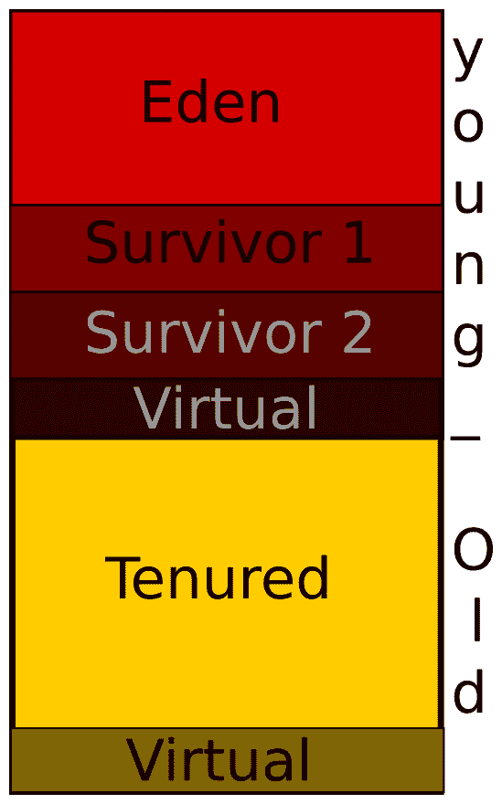
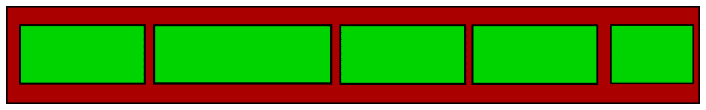
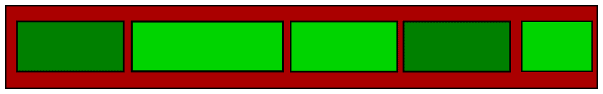
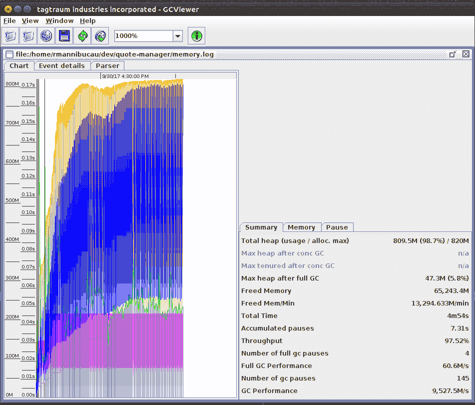
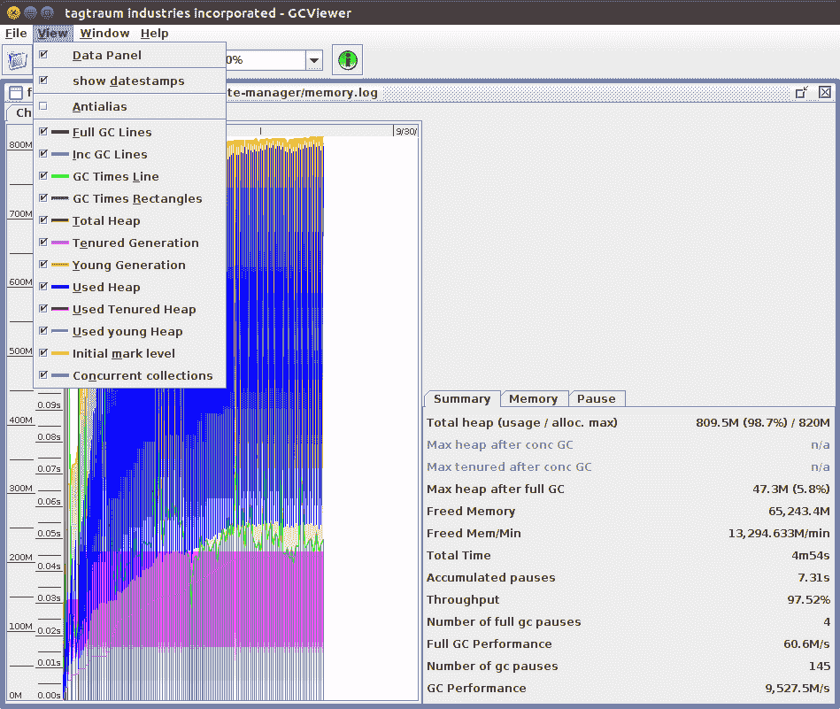
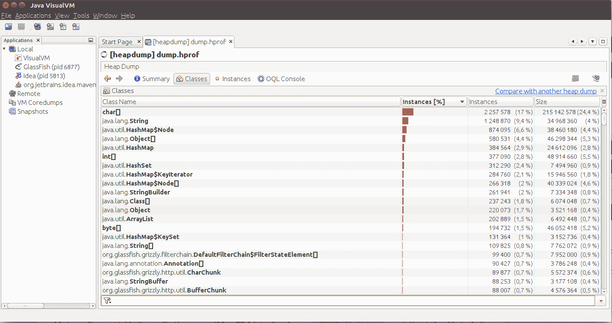
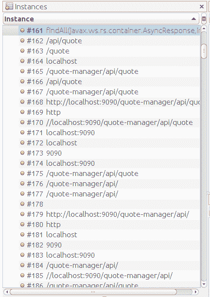
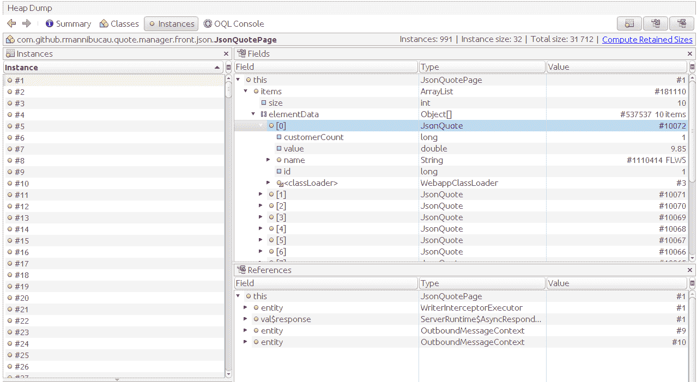

# 第四章：应用优化 – 内存管理和服务器配置

我们现在知道如何获取我们应用程序的性能信息。从高级执行时间到深入容器内部，我们可以确定代码的哪个部分在拖慢我们的进度。

然而，这主要关于我们的代码或堆栈（Java EE 容器）。还有其他标准可能会影响同一台机器的性能（考虑到 CPU 和内存是固定的）。

在本章中，我们将调查以下内容：

+   JVM 如何管理内存并自动释放未使用的对象

+   比较不同的选项以释放 JVM 提供的内存

+   看看服务器配置如何也会影响性能

# Java 和内存

Java 是一种高级语言，这意味着它在为你做很多工作。如今，大多数语言都在做这件事（如 Scala、Go，甚至最近的 C++ 更新），但为了理解内存挑战，我们需要回到早期的编程时代，并比较两个简单的代码段。

第一个是一个简化的我们的配置服务版本，直接从我们的报价管理应用程序中取出：

```java
public void refresh() {
    final Client client = ClientBuilder.newClient();
    try {
        final String[] symbols = getSymbols(client);
        for (String symbol : symbols) {
            final Data data = client.target(financialData)
                        .resolveTemplate("symbol", symbol)
                        .request(APPLICATION_JSON_TYPE)
                        .get(Data.class);
            quoteService.createOrUpdate(new UpdateRequest(data));
        }
    } finally {
        client.close();
    }
}
```

变量使用情况值得观察。关于 Java 变量作用域，`client` 对整个 `refresh` 方法都是可用的，`symbols` 数组在 `try` 块中可用。因此，`for` 循环和 `data` 只是对循环的一次迭代。然而，我们从未真正显式地分配任何对象内存；我们可以调用 `new` 来引用构造函数，但我们没有内存视图、指针或大小。

如果我们将相同的代码块与需要管理内存的版本进行比较，它将如下所示：

```java
public void refresh() {
    final Client client = ClientBuilder.newClient();
    try {
        final String[] symbols = getSymbols(client);
        try {
            for (String symbol : symbols) {
                 final Data data = client.target(financialData)
                        .resolveTemplate("symbol", symbol)
                        .request(APPLICATION_JSON_TYPE)
                        .get(Data.class);
                try {
                    final UpdateRequest updateRequest = new
                    UpdateRequest(data);
                    try {
                        quoteService.createOrUpdate(updateRequest);
                    } finally {
                        releaseMemory(updateRequest);
                    }
                } finally {
                    releaseMemory(data);
                }
            }
        } finally {
            releaseMemory(symbols);
        }
    } finally {
        client.close();
    }
}
```

即使这个例子假设 `client.close()` 处理释放，代码也会变得更加复杂，这是不可能的。实际上，每个分配的对象都需要调用 `releaseMemory()` 函数来释放分配的结构。这也意味着我们不应该错过任何调用。否则，我们就会泄漏内存。前面的代码示例使用了大量的嵌套 `try`/`finally` 来保证这一点。

我们应该从这个简单的例子中学到什么？我们应该学到的是 Java 允许开发者大多数情况下不必关心内存管理。如果你通过 JNI 使用一些本地集成，例如，你可能仍然需要处理它。为了确保应用程序表现良好且不会泄漏——这对于不应该重新启动的服务器来说很重要——JVM 提供了几个内存管理解决方案。这是透明地完成的，但直接影响了性能，因为内存分配对进程来说很敏感，内存释放也有一些挑战。

# 垃圾收集器

垃圾收集器是 JVM 中处理内存的部分。为了使其非常简单，它就是释放一些未使用对象持有的内存并将此内存空间重新分配给新对象的部分。

这一部分取决于你使用的 JVM，但所有算法都使用类似的逻辑。因此，了解它在高层次上是如何工作的非常重要，然后你可以调查你特定 JVM 的具体细节。

在本书的背景下，我们将限制自己讨论 HotSpot JVM（即 Oracle 的那个）。

堆内存分为两个主要空间：年轻代和老生代。年轻代本身又分为多个空间：Eden 和幸存者（有两个幸存者）。这两个代也都有一个**虚拟**空间，主要存在是为了支持垃圾收集操作或代大小调整。

自 Java 8 以来，永久空间（在 Java 7 中使用）已被移除，并由元空间取代。它的作用是在内存中保存应用程序的元数据，例如类（名称、注解、字段等）。如果你还记得之前关于如何监控应用程序的章节，你可能会想到`jcmd GC.class_stats`命令，它提供了关于这个内存空间的信息。在性能方面，确保这个空间在 JVM 热稳定后保持恒定非常重要。具体来说，这意味着一旦我们执行了应用程序所有可能的代码路径，我们不应该看到分配给该空间的内存有太多变化。如果你在那之后仍然看到它有显著移动，你可能有一个泄漏或类加载器问题，在继续工作之前你需要调查这些问题。

从现在起，我们只处理堆。这是你在开始为生产部署或基准测试调整应用程序时需要从其开始的内存部分。为了总结我们刚才讨论的内容，你可以用以下图表来可视化内存的分割方式：



整体思路是首先填充**第一个**区域（年轻代中的**Eden**区域）——你可以将其想象为与请求相关的对象，并使用一个心理模型来可视化——一旦填满，垃圾收集器会将仍然被使用的对象移动到下一个区域（**Survivor 1**、**Survivor 2**，最后是**Tenured**区域）。这是对代的高层次理解。这样分割内存的目的是，当垃圾收集器需要运行时，它可以在小于完整内存的区域内工作，并且可以对每个区域应用不同的算法，从而提高效率。请记住，你进入老生代越深，在应用运行时内存中存活的对象就越多。

年轻代和老年代之间主要的不同之处在于垃圾收集器对应用程序的影响方式。当在年轻代工作并运行时，它将执行所谓的**小收集**。这会遍历相应的区域，通常很快，并且对应用程序性能的影响很小。

然而，当一个收集器在旧代执行时，它被称为**主要收集器**，通常会导致应用程序阻塞。这意味着在收集器运行期间，您的应用程序可能无法响应，这会严重影响性能。

现在有几个更详细的方法可以深入了解 JVM 垃圾收集器的工作方式，并且它们都对性能有影响。

# 垃圾收集器算法

多年来，垃圾收集器算法得到了增强，现在有多种算法可供选择。它们匹配多种类型的应用程序，并且根据产品或多或少进行了适应：

+   **串行收集器**：这是一个单线程实现，是客户端机器（32 位或单处理器）的默认算法。

+   **并行收集器**：串行收集器算法适应服务器资源（快速 CPU 和大内存大小）。并行收集器是服务器机器（>= 2 处理器）的默认收集器。

+   **并行压缩收集器**：这允许并行处理老年代。

+   **并发标记清除（CMS）收集器**：使用此收集器时，老年代将与应用程序并行处理。

+   **垃圾优先收集器（G1）**：这种收集器与应用程序同时进行，目标是本书中我们处理的服务器应用程序。这将是 Java 9 的默认收集器，但已经在 Java 8 中可用。

# **串行收集器**

要强制使用串行收集器，您需要将以下选项添加到您的 JVM 中：

```java
-XX:+UseSerialGC
```

一旦将此选项添加到 JVM 中，您将有一个使用单个线程的垃圾收集器，并且可能会锁定应用程序以进行收集。

第一次收集会将仍然使用的对象从伊甸园移动到第一个空的幸存者空间。如果使用对象太大，它们将直接移动到老年代。然后，*幸存者 1*（也称为*幸存者来源*）空间中的较年轻对象如果空间允许，将移动到*幸存者 2*（也称为*幸存者目标*）空间；否则，它们将直接移动到老年代。较老的对象将移动到老年代。

一旦完成所有这些移动，伊甸园和幸存者空间（之前已满）就可以释放。请注意，幸存者空间在角色上被反转，这意味着幸存者空间始终为空。

这里有一种表示算法的方法：


我们从一个状态开始，其中伊甸园已满，第一个幸存者有一些对象：


在第一阶段，如果它们适合（两个小绿色块），则使用的对象将从伊甸园移动到第二个幸存者，或者如果太大（最后的大块），则直接移动到持久空间：


现在，相同的逻辑应用于第一个幸存者空间，因此我们有小块使用的对象移动到另一个幸存者，而大块则移动到持久空间。在这个阶段，你仍然可以在第一个幸存者中找到未使用的对象：


最后一步是释放未使用的内存：在我们的例子中是伊甸园和第一个幸存者。在下一个周期中，将遵循完全相同的逻辑，但两个幸存者空间将颠倒。

这个算法主要关注年轻代的管理，但它本身并不足够，因为它会很快填满老一代。因此，一个完整的周期需要一个名为标记-清扫-压缩的第二个算法，它应用于持久空间。

如你所猜，该算法有三个阶段：

1.  **标记**：在这个阶段，收集器识别出仍然被使用的实例，并标记相关的内存空间

1.  **清扫**：上一步中未标记的内存被释放

1.  **压缩**：上一步可能已经在内存空间中创建了空洞，因此收集器将其压缩，确保所有对象都并排放置以实现更快的访问

你可以用以下图表来可视化它——对于一个单独的内存区域：



假设我们的初始状态是前面的图表。我们有五个对象填充空间。第一步是将仍然使用的对象*标记*，以便能够移除剩余的（不再使用的）。可以用以下图表来表示：



在这个说明中，较暗的块是不再使用的，较亮的块是仍然使用的。现在我们已经从*标记*阶段进行，我们将执行*清扫*阶段并移除未使用的块：


到目前为止，在内存量方面我们做得很好。这意味着我们已经释放了我们能释放的所有内存，我们几乎可以在这里停止收集。然而，正如你在这张图中看到的，有一些空闲空间的空洞。

一个问题是，如果我们需要分配一个大对象，那么它可以分成多个内存区域，内存访问可能会变慢。为了优化这一点，我们有了最后一步，即*压缩*：


在这一最后步骤之后，内存得到了优化（压缩）；所有对象都并排放置，我们在最后得到了最大的可用内存区域空闲。

对于服务器（别忘了我们在这本书中讨论的是 Java EE），这通常不是最快的垃圾收集器模式，但理解这些概念非常重要。如果你编写一个 Java EE 客户端（例如使用 JAX-RS 客户端 API），它仍然适用于你的最终交付，这不会需要大量的内存分配。

# 并行和并行压缩收集器

并行收集器接近于串行收集器（这就是为什么理解串行算法很重要）。主要区别将在于它如何设置收集。我们看到了在串行收集中，单个线程负责收集，但在并行收集器中，多个线程承担这个角色。这意味着你可以期望通过线程数（理论上）来减少 *停止世界* 的持续时间（当垃圾收集器强制应用程序停止响应并执行其任务时）。

这可以通过在 JVM 中添加此选项来激活/强制（这应该是服务器机器的默认设置）：`-XX:+UseParallelGC`。

并行收集器可以通过几个 JVM 选项进行调整，但以下是一些你可能想要自定义的选项：

+   `-XX:MaxGCPauseMillis=N`：你将值（`N`）配置为你希望垃圾收集器暂停的最大持续时间。请注意，这只是一个提示，并不能保证你将获得期望的结果，但它可以作为第一次尝试是有趣的。同时，请记住，这将优化垃圾收集器暂停的持续时间（也许，不是应用程序的吞吐量，这可能是服务器的一个问题）。最后，你可能需要手动调整堆大小和比率，但开始测试这个 JVM 选项可以给你一些关于如何进行的提示。

+   `-XX:GCTimeRatio=N`：这也是一个提示，允许你请求应用程序时间中不超过 *1/(1+N)* 的时间用于垃圾收集。这是为了优化应用程序的吞吐量——这通常是服务器的情况。这不是最容易理解配置，所以让我们用一个小的例子来说明。如果你将 *N* 设置为 19，那么应用程序时间的 1/20（5%）将分配给垃圾收集。默认值是 99，所以只有 1% 的应用程序时间分配给垃圾收集。

+   `-XX:ParallelGCThreads=N`：这允许你配置分配给并行垃圾收集的线程数。

这些标志没有魔法值，但一旦你确定了应用程序的内存需求，调整它们以与应用程序要求相一致是非常有趣的。

值得注意的是，垃圾收集器可以根据配置的比率调整代的大小，试图尊重它。这是通过增加代的大小来减少收集时间来实现的。默认情况下，代的大小增加 20%，减少 8%。在这里，你也可以通过一些 JVM 标志来自定义这种调整。

有很多标志，它们的名称和支持的值可能取决于您使用的 JVM。由于它们不是可移植的标志，您可能需要根据您的 JVM 文档进行检查。对于 Hotspot，您可以使用以下命令：

```java
java -XX:+PrintFlagsFinal -version
```

此命令打印 Java 版本（仅为了防止任何错误）以及 JVM 标志，允许您列出所有标志，这是我们关注的重点部分。一旦您获得输出，您只需过滤您想要的标志。在我们的情况下，我们想要自定义增加/减少生成大小的方式，因此我们可以使用`grep`命令（在 Unix 上）通过`Generation`关键字来过滤标志：

```java
$ java -XX:+PrintFlagsFinal -version 2>&amp;amp;1 | grep Generation
 uintx TenuredGenerationSizeIncrement = 20 {product}
 uintx TenuredGenerationSizeSupplement = 80 {product}
 uintx TenuredGenerationSizeSupplementDecay = 2 {product}
 bool UseAdaptiveGenerationSizePolicyAtMajorCollection = true {product}
 bool UseAdaptiveGenerationSizePolicyAtMinorCollection = true {product}
 uintx YoungGenerationSizeIncrement = 20 {product}
 uintx YoungGenerationSizeSupplement = 80 {product}
 uintx YoungGenerationSizeSupplementDecay = 8 {product}
```

`+PrintFlagsFinal`允许您列出选项、它们的值（等于号之后）、它们的类型（第一个字符串）以及标志类型（在大括号中）。

如果您向 JVM 添加其他选项（如`-client`或`-server`），它将调整值以反映这些标志。

如您在前面的截图中所见，您可以使用`-XX:YoungGenerationSizeIncrement`来在需要时自定义年轻代增加的百分比，以尊重配置的比率。`YoungGenerationSizeSupplement`是启动时使用的年轻代大小增加的补充，而衰减标志是补充值的衰减因子。实际上，老年代也有类似的配置。

这些配置非常高级，您必须在执行之前确保您能解释为什么调整它们；否则，您可能会弄乱您的 JVM 配置，并使您的应用程序表现不佳。

最后，并行 GC 仍然使用单个线程进行老年代收集。

现在，还有一个压缩并行收集器。它与年轻代中的并行收集器相同，但在老年代中，算法略有不同。它接近于*标记*/*清除*/*压缩*算法，除了它将空间分成更多区域，以便收集器可以并行地在这上面工作。然后，清除阶段被一个*总结*阶段所取代，其中检查密度以请求压缩。最后，压缩是并行完成的。要使用此选项，您需要激活另一个 JVM 标志：`-XX:+UseParallelOldGC`。此选项对于具有大堆的应用程序来说应该是好的，这对于处理大量并发请求并使用某些缓存机制的应用程序来说是这种情况。

# 并发标记清除（CMS）

CMS 的目标是减少 GC 暂停，使您能够在应用程序运行时执行 GC。为此，它使用多个线程。主要思想是在老年代充满之前释放一些内存，并且 GC 需要暂停应用程序线程。如果这种情况发生得太频繁，您可能需要调整应用程序调优（CMS 配置）以尽可能避免这种情况，并保持其正确行为。您可以通过检查`verbose:gc`输出和`Concurrent Mode Failure`消息来识别此类问题。

与标准的*标记*阶段相比，*CMS*算法将暂停应用程序两次：第一次暂停标记从内存图根直接可达的对象，第二次暂停识别在并发跟踪阶段遗漏的对象。这个并发跟踪阶段将占用应用程序不能再使用的资源，并且吞吐量可能会略微下降。

一个集合主要有两个触发器：

+   一种基于内存历史统计信息的超时机制，并添加了一个安全边界以避免并发模式失败，这代价非常高。这个安全边界可以通过`-XX:CMSIncrementalSafetyFactory=N`标志根据百分比进行控制。

+   基于剩余的持久空间大小。这个触发器可以通过`-XX:CMSInitiatingOccupancyFaction=N`进行控制，其中*N*是如果满了应该触发收集的持久空间的百分比。默认情况下，它是 92%（N=92）。

在调查长时间的 GC 暂停时，你可能需要调整安全因子，并可能调整占用分数选项，以查看提前（或延迟）触发 GC 是否有所帮助。

关于这个算法的最后一件事是，没有压缩，所以随着时间的推移，内存访问可能会变慢。

# 垃圾收集器第一代（G1）

垃圾收集器第一代（Garbage First collector）是最新的实现。它是一种服务器端实现，旨在减少暂停时间，并与应用程序并发工作。它引入了一种新的堆可视化方式。

堆被分成固定大小的区域。G1 开始并发标记区域。在这个阶段之后，它知道哪些区域几乎为空，然后开始从这些区域收集内存，使 G1 能够快速且不费劲地获得大量内存。这就是这个算法名称的由来。然后，在压缩阶段，G1 可以将多个区域的对象复制到单个区域，以确保其效率。

关于 G1 实现的一个重要事项是，它基于统计信息，即使模型在实际应用中相当准确，执行过程中也可能出现一些小故障。

G1 将堆分成区域的事实也意味着它适用于使用大量内存（Oracle 声称超过 6 GB）且需要很短暂停时间（小于 0.5 秒）的应用程序。这意味着从 CMS 切换到 G1 并不总是值得的；在切换到 G1 之前，你应该确保满足以下标准之一：

+   大约 50%的堆被活动数据使用

+   与 CMS 算法相比，统计信息并不那么准确（如果分配率变化很大）

+   你已经识别出长时间的 GC 暂停

G1 还有一些 JVM 标志，您可以使用它们来定制垃圾收集器应采取的行为。例如，`-XX:MaxGCPauseMillis` 设置您接受的暂停时间（统计上再次），而 `-XX:ConcGCThreads=N` 定义用于标记区域的并发线程数（建议设置为并行 GC 线程数的约 25%）。默认设置旨在针对最常见的用例，但您可能需要调整配置以适应您的应用程序及其使用（或重用）内存的方式。

再次，激活 G1 收集器需要其自己的 JVM 标志：`-XX:UseG1GC`。

# 常见内存设置

我们看到了内存的收集方式，以及有很多调整选项（再次提醒，不要忘记检查您特定的 JVM 选项）。然而，有一些非常常见的内存设置，在精细调整收集器之前，您可能希望自定义这些设置。以下是一个包含这些内存设置的小表格：

| **选项** | **描述** |
| --- | --- |
| `-Xmx<size>` | 分配给堆的最大内存大小，例如，`-Xmx1g` 允许堆增长到 1GB |
| `-Xms<size>` | 分配给堆的起始内存大小，例如，`-Xms512m` 将 512 MB 分配给堆 |
| `-Xss<size>` | 栈大小（可以避免 `StackOverflowError`） |
| `-XX:SurvivorRatio=N` | Eden 和幸存空间之间的比率 |
| `-XX:MinHeapFreeRatio=N` 和 `-XX:MaxHeapFreeRatio=N` | 触发堆调整的比率，最小标志将触发堆增加，而最大标志将触发堆大小减少 |

根据我们之前看到的，这意味着调整 JVM 内存可以导致一大组选项/标志，但不要害怕，这只是掌握其应用程序的问题。以下是一个完整的标志集示例：

```java
-Xms24G -Xmx24G -XX:+UseG1GC -XX:MaxGCPauseMillis=150 -XX:ParallelGCThreads=16 -XX:ConcGCThreads=4 -XX:InitiatingHeapOccupancyPercent=70 ....
```

此命令是针对具有大量可用内存的服务器的常见服务器内存配置：

+   为堆分配 24 GB（由于最小和最大内存大小设置为相同的大小，因此是固定的）。

+   强制 JVM 使用 G1 收集器（准确，因为我们使用了超过 6 GB 的堆）并自定义 G1 配置。它定义了一个目标最大 GC 暂停时间为 150 毫秒，并要求 G1 使用 16 个并行线程进行内存收集，并在收集后使用四个线程标记区域。

+   最后，如果堆占用率达到 70%，将开始收集周期。

对于服务器来说，这不是一个坏的起始设置（您可以稍微增加线程数，但不要太多，因为它们可以在您的应用程序运行时同时使用）；如果可以接受，增加最大 GC 暂停时间。

您可能调整最多的参数是堆大小（在先前的示例中为 24 GB），这取决于您应用程序的需求。

# 调试 GC 行为

现在我们知道了如何非常精细地调整 JVM 内存，我们需要了解我们的应用程序做了什么，以便能够调整配置。为此，JVM 提供了几个专门工具。

对于内存来说，最常见且可能最有用的工具是`-verbose:gc`选项，你可以在启动 JVM 时传递它。它将输出内存信息。如果我们激活它在我们的引用应用程序中，你将很快看到这些类型的行：

```java
[GC (Allocation Failure) 41320K->14967K(153600K), 0.0115487 secs]
[GC (Metadata GC Threshold) 44213K->20306K(153600K), 0.0195955 secs]
[Full GC (Metadata GC Threshold) 20306K->13993K(139264K), 0.0596210 secs]
[GC (Allocation Failure) 77481K->23444K(171008K), 0.0081158 secs]
[GC (Metadata GC Threshold) 69337K->23658K(207360K), 0.0094964 secs]
[Full GC (Metadata GC Threshold) 23658K->20885K(248320K), 0.0792653 secs]
[GC (Allocation Failure) 144789K->27923K(252416K), 0.0078509 secs]
[GC (Allocation Failure) 155923K->36753K(252416K), 0.0174981 secs]
[GC (Metadata GC Threshold) 68430K->37173K(275968K), 0.0146621 secs]
[Full GC (Metadata GC Threshold) 37173K->31086K(321536K), 0.1868723 secs]
```

我们可以区分两种类型的行，对应不同的代区收集：

+   **GC**: 这是一个年轻代收集器

+   **Full GC**: 这是一个老年代收集器

每次收集都与一个原因相关联：

+   **分配失败**：GC 被要求运行，因为没有更多的内存可用

+   **元数据 GC 阈值**：元空间阈值已达到

然后，你可以看到内存的调整；例如，`41320K->14967K(153600K)`表示使用的内存从约 41M 调整到约 15M。括号中的数字是可用空间（这里约 150MB）。

不要害怕看到 GC 经常运行，甚至出现完整的 GC 行。虽然它们的执行速度快，而且你看到内存大小是可以接受的，但这根本不是问题。然而，如果执行时间长，即使收集后内存仍然很高，那么你可能需要调整 GC 或更新应用程序以确保它快速且可靠地返回。

如果你通过 JMX 激活这个输出，你可以转到`java.lang:type=Memory` MBean 并将`Verbose`属性设置为`true`。

如果你想要更多关于 GC 的详细信息，你可以添加`-XX:+PrintGCDetails`选项，这样行就会更加详细：

```java
[GC (Allocation Failure) [PSYoungGen: 145920K->16360K(162304K)] 177095K->54877K(323072K), 0.0152172 secs] [Times: user=0.03 sys=0.01, real=0.02 secs]
```

我们可以识别之前的信息，但也有一些新的数据：

+   `PSYoungGen`：这是收集器类型；这个值表示小 GC

+   (`X->Y(Z)`)之后的调整显示了年轻代的大小

+   最后的调整是整个堆的调整

+   最后，持续时间以用户时间、系统时间和实际时间来表示

如果你想要将所有这些信息（日志行）保存到文件中，你可以添加一个带有文件路径的标志，JVM 将把这个输出写入文件而不是控制台：

```java
-Xloggc:/path/to/output.log  -XX:+PrintGCDetails
```

这将允许你**离线**分析 GC 行为。有一些工具可以解析这个输出并直接可视化它。其中之一是*GCViewer*，你可以在[`github.com/chewiebug/GCViewer/wiki/Changelog`](https://github.com/chewiebug/GCViewer/wiki/Changelog)找到它。一旦下载了 JAR 文件，你可以直接用 Java 运行它：

```java
java -jar gcviewer-1.35.jar
```

然后，只需在界面中打开`output.log`文件，你应该会这样可视化你的 GC：



这个工具有两个主要有趣的功能：

+   从日志输出推导出的时间图

+   右侧的统计标签（显示 GC 的统计摘要和暂停的次数和持续时间）

这最后的信息可以让你在添加一些缓存或与主应用程序并行执行的某些后台任务后验证应用程序的行为。

这将使您能够确保应用程序的一部分对另一部分在内存方面的影响，并且如果内存受到新功能的过度影响，可能会发现性能问题。

这里是与图表颜色相关的图例：



我们在前面部分讨论的大多数信息都可以找到，特别是集合、世代等。请注意，*Y*轴可以读取两个单位（时间和内存大小），具体取决于您正在查看哪个图表。您可能会过滤打印的图表以清楚地查看它，但您将在 GC 运行时找到您需要查看的所有信息。

# 堆转储

有时，您可能需要获取堆转储以调查内存中的内容以及为什么垃圾回收（GC）运行如此频繁或如此长时间。为此，JDK 提供了一个名为`jmap`的工具，允许您从 Java PID 中获取转储：

```java
jmap -dump:format=b,file=/path/to/dump.hprof <PID>
```

此命令将停止应用程序（类似于*停止世界*暂停）并将所有实例写入配置的文件中。使用`jvisualvm`打开输出文件将使您能够调查实例，特别是实例的数量和相应的分配大小。

它可能看起来像这样：



通常，您应该主要看到 JVM 类，如`char[]`、`String`、`Map`等。

如果您双击一个类型，您将看到实例。例如，在我们的报价管理器转储中的`String`上，我们将有一个类似这样的视图：



在这里，我们可视化与请求相关的`String`实例（请求 URL 或其子部分，例如协议、主机或端口）。因此，我们可以推断出这些实例与请求及其解析相关。这是完全正常的，但如果您开始看到很多自己的类在类、视图和/或几个类中，但分配大小巨大，您可以双击这些类型以获取实例详细信息以确定为什么会发生这种情况。

如果我们双击`JsonQuotePage`，我们将看到类似这样的内容：



左侧（实例列表）的实例引用对我们帮助不大，但单个实例的详细视图（右侧）显示了实际的数据结构及其值。

作为提醒，我们的 POJO 页面模型如下所示：

```java
@JsonbPropertyOrder({"total", "items"})
public class JsonQuotePage {
    private long total;
    private List<JsonQuote> items;

    // getters/setters
}
```

我们的结构（类）有两个字段：`total`和`items`，我们可以在从转储中获得的实例的详细视图中找到这两个条目。如图所示，我们甚至可以浏览`items`值。这将帮助您确定是否存在特定值，以及您是否需要自定义用于检索数据的查询。

# Java EE 和资源

使用 Java EE，你可能会遇到很多绑定到请求上的易变对象（生命周期较短）。如果我们以`QuoteResource`为例，我们首先会分配我们的 JSON 模型，然后是我们的实体模型，等等。所有这些实例仅用于请求，不再需要其他。因此，垃圾收集器会迅速收集它们。垃圾收集器对于这种动态应用来说相当不错。然而，这并不意味着我们没有长期存在的实例。即使没有应用程序缓存，服务器也会缓存大量元数据以确保其正常运行和快速运行。一个例子是 CDI 容器，它会将所有 bean 的元数据保存在内存中，以确保当应用程序请求时可以创建它们。这会占用内存，并且只有在应用程序未部署时才会释放。这意味着通过调整应用程序的内存，你还需要确保调整服务器的内存。正如之前已经解释过的，在性能调整中，应用程序不仅由你的代码组成，还包括服务器代码；否则，你将错过大部分逻辑，你无法准确调整应用程序。

通常，服务器会添加一些长期存在的实例以确保服务器层不会减慢你的应用程序。然而，服务器为你实现的一种特定逻辑会直接影响应用程序的性能，你需要注意：资源。

我们在应用程序服务器中称为资源的东西通常是由服务器管理的。这通常是你在应用程序外部想要能够配置的东西，即使 Java EE 6 引入了一些`@XXXDefinition`注解，以便能够从应用程序本身执行此操作。目标是注入一个预先配置并且适应当前环境的实例。它通常也与外部资源或与机器资源直接相关。由于下一章将介绍线程，在这里，我们将关注外部资源。

在最常用资源列表的顶部，我们发现`DataSource`。这代表了我们报价应用程序中连接到数据库（如 MySQL）的连接。在深入研究`DataSource`案例之前，你可以遇到以下一些其他知名资源：

+   并发资源（`ManagedExecutorService`）用于处理并发。我们将在下一章中处理它们。

+   `DataSource`，它连接到数据库。

+   JMS 资源，例如`ConnectionFactory`，它连接到代理，以及`Queue`和`Topic`，它们代表目的地。

+   Java 邮件`Session`，它允许你与邮箱交互（通常用于从应用程序发送邮件）。

+   资源适配器，它提供了一种以 EE 方式处理输入/输出的方式（与安全性和事务集成）。

所有这些资源都可以在服务器中进行配置——大多数来自应用程序——并允许操作团队（或负责部署的人员）调整应用程序使用的资源。这也让开发者不必关心配置，并确保部署足够可定制。

# 数据源

为了说明这一点，我们将参考我们的`DataSource`示例。在第一章中，我们配置了一个池和数据源。数据源只是应用程序在 JNDI 中使用的一个名称，用于查找数据源，并在其 JPA 层中使用它。这基本上就是数据源：一个连接工厂。这里关键的是连接的管理方式。

大多数情况下，生产数据源是远程进程，或者至少需要网络连接。如果你记得我们的 MySQL 连接 URL，我们使用了以下：

```java
jdbc:mysql://localhost:3306/quote_manager
```

这是一个非常常见的*开发*配置，并且它连接到`localhost`*.* 因此，网络成本是机器本地环路的成本，这通常被优化得非常快。在实际部署中，你更有可能连接到以下：

```java
jdbc:mysql://application.mysql.company.com:3306/quote_manager
```

这个 URL 将标记一个远程主机，获取连接将涉及一些实际延迟。确实，它不会像互联网连接那样慢，因为网络有很多交换机、路由器和跳数。然而，通过网络始终意味着一些毫秒级的延迟。

数据源（这通常也适用于 JMS 资源）有趣的地方在于与连接关联的协议是一个连接协议。理解一旦获得连接，发送命令就会更快，因为你不必创建另一个连接。

如果你运行了报价管理器应用程序，你可能会得到一些这样的警告：

```java
Sat Sep 30 17:06:25 CEST 2017 WARN: Establishing SSL connection without server's identity verification is not recommended. According to MySQL 5.5.45+, 5.6.26+ and 5.7.6+ requirements SSL connection must be established by default if explicit option isn't set. For compliance with existing applications not using SSL the verifyServerCertificate property is set to 'false'. You need either to explicitly disable SSL by setting useSSL=false, or set useSSL=true and provide truststore for server certificate verification.
```

这个警告是由 MySQL 驱动程序发出的，并鼓励你使用 SSL 进行网络通信。这主要是出于安全原因，但 SSL 连接甚至更慢。你可以查看 HTTP2 协议（在 Servlet 4.0 版本中引入，包含在 Java EE 8 中），它引入了推送协议以避免浏览器通过 SSL 进行过多的连接，因为随着现代应用程序拥有大量网络资源，这已经开始变得非常慢。

这意味着反复重用相同的连接总是一个好主意，因为它将减少实际的连接步骤，并让应用程序发出命令并执行其业务。

为了解决这个*连接*问题，服务器将数据源配置为连接池。一个池是一组可重用的连接。每个服务器都有自己的池和自己的配置，这些配置或多或少是高级的，但都遵循相同的逻辑：

+   **一些大小配置**：在服务器空闲时保持内存中的连接数量（最小值），可以创建的连接数量（最大值），连接可以等待多长时间，等等

+   **一些驱逐配置**：确定一个连接应该从池中移除的方式

驱逐非常重要，因为池与长时间运行的连接相关。因此，你需要能够透明地移除损坏的连接。例如，MySQL 服务器默认情况下在 8 小时后丢弃连接。所以，如果你运行你的应用程序 8 小时又 1 分钟，如果没有驱逐，所有请求都将开始失败。对于数据源，这通常是通过`ValidationQuery`完成的，这是一个定时执行的 SQL 查询。如果这个查询失败，它被认为是验证连接无效并从池中移除。*定时*通常也可以配置，主要可以意味着三个时刻：*在连接被共享并分配给应用程序之前*，*当连接被归还到池中时*（应用程序已经完成），或者*在后台线程中连接空闲时*。

选择是在*你接受因为连接尚未被后台线程驱逐而导致一些请求失败*和*你接受它稍微慢一点，因为每次连接都需要验证*之间权衡。你甚至可以混合所有这些验证类型。这里一个非常重要的点是确保验证查询执行非常快。永远不要使用`SELECT * from CUSTOMER`，这可能会返回成千上万（或更多）行。始终使用一个常量结果集查询。对于 MySQL，建议你使用`SELECT 1`，这将只返回`1`。每个数据库都有这种查询，所以请检查它，并确保它在你的池中配置得当。

你确实会发现根据你所依赖的池子，会有其他配置，但它们对性能的影响较小，所以我们在这里不会详细说明。

关于连接池的一个关键点是——无论是数据源连接池还是其他类型的连接池——确保你不会等待它们。如前所述，如果你在等待连接，那么你的速度会比应有的速度慢，因为连接池应该避免这种情况。这意味着在性能方面，你不必犹豫，只需要求你的连接池永远不要等待连接。这个参数通常被称为*最大等待时间*。将其设置为 0 或非常小可能导致你的应用程序开始失败，并抛出异常，表示应用程序无法在配置的时间内检索到连接。这正是我们想要的！这意味着连接池对于应用程序的需求来说太小了，因此你需要增加连接池的大小。或者，你也可以减少发送到服务器的负载。这并不意味着在生产环境中你不应该配置任何等待时间。这是一个可以确保你响应客户的参数，但它可能会增加你的响应时间。如果这是可以接受的，一旦调整了应用程序，你就不必犹豫地增加这个值，但在做之前，请确保你没有使用错误配置的连接池。

如果你的连接池大小过小，你可能会在堆栈跟踪中看到它，或者在调用时设置的监控中看到，例如`allocateConnection`或`getConnection`，具体取决于你的服务器。

在调整大小方面，简单地设置尽可能多的连接可能很有吸引力，但你需要记住几个重要点：

+   数据库连接数可能有限。永远不要将所有连接都分配给你的应用程序集群，并确保你可以保留至少几个用于维护目的。例如，如果你的 MySQL 允许 152 个连接（MySQL 的默认`max_connections`为 151，而`mysqld`允许`max_connections+1`个实际连接），那么你的应用程序作为一个集群，可以使用 140 个连接。

+   连接池的处理需要你处理并发。你的应用程序将从所有线程请求连接，然后容器池需要为所有线程提供不同的连接，以确保没有跨线程连接使用的数据损坏。另一方面，在应用程序运行的同时也会发生回收，可能会锁定连接池（这接近 GC 算法问题）。需要处理的池工作越少，它的表现就越好，对应用程序的影响就越小。

这意味着不过度调整连接池也很重要。这通常是一个基于你的应用程序和目标 SLA 的启发式方法。如果你对必须使用的连接池大小没有头绪，你可以从将连接池的最大大小设置为最大并发线程数的 25%（例如 HTTP 连接池大小）开始，然后逐渐增加，直到不再出现错误，最大等待时间为 0。

# Java EE 和连接池

Java EE 在其堆栈中涉及许多池类型。以下是在调整应用程序时你可能想查看的池类型总结。每次调整逻辑都将基于相同的逻辑：没有等待时间，并从中等大小开始，以避免过度分配资源并过度影响应用程序。

| **池类型** | **描述** |
| --- | --- |
| `DataSource` 池 | 这处理和回收数据库连接。 |
| `ConnectionFactory` 池 | 这处理与代理的 JMX 连接。 |
| `@Stateless` 池 | 这处理无状态实例的回收。如今，当无状态实例用作穷人的节流实现（最大实例 = 最大并发性）或实例访问某些不安全的资源时，这些资源非常昂贵且难以实例化，它就变得相关。它可以被视为针对应用程序需求的 Java EE 池 API。 |
| HTTP 线程池 | 这些线程用于处理请求。它们通常有一些兄弟线程来接受连接（选择器线程）。 |
| 管理的线程池 | 应用程序可以使用这些线程池来执行自定义任务。它们通常用于反应式编程，以继承反应堆栈中的 EE 功能，如 RxJava。 |
| 资源适配器/ JCA 连接器池 | JCA 规范定义了多个池：以依赖方式配置但与其他池具有相同原则的实例池，以及使用 `WorkManager` 的线程池，这是在 EE 并发工具方式中，由服务器注入到应用程序（连接器此处）的用户线程池。如今，应用程序很少使用 JCA 连接器，但如果你继承了其中一个，请确保它已良好调整并与你的服务器集成。 |

# Java EE 和 HTTP 池

即使 Java EE 容器越来越多地用于守护程序和独立应用程序，但大多数开发的应用程序仍然是 Web 应用程序，因此要么作为其他服务器的客户端使用 HTTP，要么作为服务器本身。

在最后一句话中，*Java EE 容器* 包括广泛的嵌入式容器，如 TomEE Embedded、Apache Meecrowave、WildFly Swarm 等，并不仅限于独立容器或完整配置的服务器。

这意味着 Java EE 配置将不得不处理 HTTP 配置。它需要在多个级别（网络、HTTP 缓存等）以及多个层次（服务器/HTTP 连接器、客户端连接池、SSL 调优等）进行处理。

我们将在第五章 深入探讨此细节，*扩展：线程和影响*，以及第六章 懒加载，缓存你的数据中详细介绍相关配置。

# Java EE 隐含特性

Java EE 哲学始终是 *即开即用*。然而，它可能对性能有一定影响，因为有时功能被激活，而你的应用程序根本不需要它们。如果你知道你不需要一个功能，请不要犹豫去禁用它。

例如，在 `persistence.xml`*，* 我们通过添加以下行禁用了 bean 验证集成：

```java
<validation-mode>NONE</validation-mode>
```

这样可以避免 JPA 提供者添加用于验证实体的 bean 验证监听器，从而在不影响应用程序的情况下节省一些 CPU 周期。如果你检查我们应用程序的链，我们使用 JAX-RS（具有 bean 验证集成）然后是 JPA（具有另一个 bean 验证集成）。

验证的规则可以是始终在数据进入系统时（对我们来说是 JAX-RS）进行验证，而不是在内部进行验证。实际上，从应用程序逻辑的角度来看是多余的。这就是为什么在 JPA 层禁用它是可以的。

# 摘要

在本章中，我们看到了 Java 如何管理内存，以及如何影响它以优化和适应你的应用程序需求。我们还看到了 Java EE 服务器提供的资源如何帮助你节省时间，因为它们不仅使你能够跳过使用之间的重新连接时间，而且意味着对服务器内存和 CPU 的专用调整。

本章背后的想法是确保你拥有调查任何内存问题的关键和知识，并且能够在不迷失方向或使用一些随机数字的情况下调整内存和资源。

此外，这部分可能是最不可移植的部分，并且将与你在部署中使用的 JVM（对于内存）和服务器（对于资源）相关。所有概念仍然适用，但调整它们的方式可能不同，因为这不是一个标准化的东西——即使 JVM 调优的变化不如服务器配置那么大。然而，不要犹豫去查看你的 JVM 或服务器文档，并确保在进入基准测试阶段之前已经阅读过，以免在测试你事先不知道的选项时浪费时间。

在下一章中，我们将看到如何充分利用 Java EE 并发编程，以及它与 Java EE 线程模型的关系，以确保你的应用程序可以扩展。内存和 CPU 是服务器在机器上使用的两种最核心的资源：我们刚刚看到了内存资源，现在我们将通过线程研究来处理 CPU。
