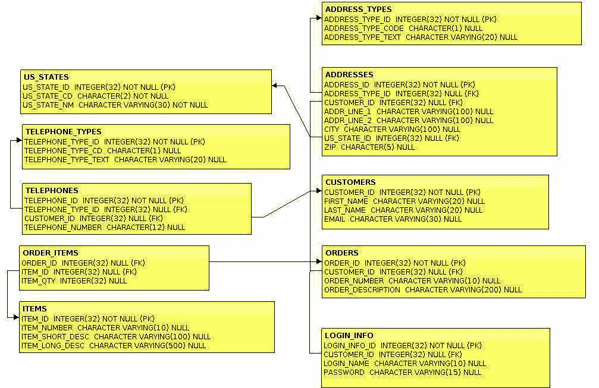

# 第八章：使用 Jakarta Persistence 进行对象关系映射

Jakarta EE 应用程序通常需要在关系型数据库中持久化数据。在本章中，我们将介绍如何通过**Jakarta Persistence**连接到数据库并执行**创建、读取、更新和删除**（**CRUD**）**操作**。

Jakarta Persistence 是 Jakarta EE 标准的**对象关系映射**（**ORM**）工具。我们将在本章中详细讨论此 API。

本章涵盖了以下主题：

+   CUSTOMERDB 数据库

+   配置 Jakarta Persistence

+   使用 Jakarta Persistence 持久化数据

+   实体关系

+   复合主键

+   Jakarta Persistence 查询语言

+   条件 API

+   Bean 验证支持

注意

本章中使用的源代码可以在 GitHub 上找到：[`github.com/PacktPublishing/Jakarta-EE-Application-Development/tree/main/ch08_src`](https://github.com/PacktPublishing/Jakarta-EE-Application-Development/tree/main/ch08_src)。

# CUSTOMERDB 数据库

本章中的示例使用一个名为`CUSTOMERDB`的数据库。这个数据库包含跟踪虚构商店客户和订单信息的表。为了简化，数据库使用内存中的 H2 数据库。

本书示例代码中包含一个简单的实用程序，该实用程序可以自动启动数据库并填充所有参考表。该实用程序位于`ch08_src/customerdb`下。它是一个 Maven 应用程序。因此，可以通过命令行通过`mvn install`构建它。它创建了一个包含所有依赖项的可执行 JAR 文件。创建的 JAR 文件位于`target`目录下，可以通过以下命令在命令行中运行：

```java
java -jar customerdb-jar-with-dependencies.jar
```

`CUSTOMERDB`数据库的模式如图*8**.1*所示。



图 8.1 – CUSTOMERDB 数据库模式（此模式的目的是展示布局；标题下方框中文字的可读性不是必需的。）

如图中所示，数据库包含存储客户信息的表，包括他们的姓名、地址和电子邮件地址。它还包含存储订单和项目信息的表。

`ADDRESS_TYPES`表存储诸如“家庭”、“邮寄”和“运输”等值，以区分`ADDRESSES`表中的地址类型；同样，`TELEPHONE_TYPES`表存储“手机”、“家庭”和“工作”等值。这两个表在创建数据库时预先填充，以及`US_STATES`表。

注意

为了简化，我们的数据库仅处理美国地址。

# 配置 Jakarta Persistence

在我们的代码能够正常工作之前，Jakarta Persistence 需要一些配置。需要定义一个数据源。数据源指定了我们连接到的**关系数据库管理系统（RDBMS**）系统的信息（服务器、端口、数据库用户凭据等）。有两种设置方式。可以通过 Jakarta EE 实现配置来完成，但具体如何操作取决于特定的实现。

还可以通过使用`@DataSourceDefinition`注解来注解一个应用范围的 CDI bean 来完成。

每种方法都有其优缺点。将数据源定义为 Jakarta EE 运行时配置的一部分，允许我们将代码部署到不同的环境（开发、测试、生产）而无需对代码进行任何修改。它还可以防止将任何用户凭据添加到我们的源中。使用`@DataSourceDefinition`可以在 Jakarta EE 实现之间工作，并允许我们在不配置 Jakarta EE 运行时的情况下测试和部署我们的代码。

为了简单起见，我们的示例使用`@DataSourceDefinition`，但对于生产代码来说，配置 Jakarta EE 实现可能是一个更好的选择。

通常，我们在应用范围的 CDI bean 中使用`@DataSourceDefinition`，如下例所示：

```java
package com.ensode.jakartaeebook.beanvalidation.init;
//imports omitted for brevity
@ApplicationScoped
@DataSourceDefinition(name =
  "java:app/jdbc/customerdbDatasource",
  className = "org.h2.jdbcx.JdbcDataSource",
  url = "jdbc:h2:tcp://127.0.1.1:9092/mem:customerdb",
  user = "sa",
  password = "")
public class DbInitializer {
  private void init(@Observes @Initialized(ApplicationScoped.class) Object object) {
    //This method will be invoked when the CDI application scope is initialized, during deployment
    //No logic necessary, class level @DataSourceDefinition will create a data source to be used by the application.
  }
}
```

`@DataSourceDefinition`中`name`属性值定义了 JNDI 名称或我们的数据源。`@DataSourceDefinition`中`url`属性值定义了`user`和`password`属性，这些属性定义了登录到我们的数据库所需的用户凭据。

定义数据源后，必须在包含上述 bean 的 WAR 文件中部署一个名为`persistence.xml`的 XML 配置文件。此文件必须放置在 WAR 文件内的`WEB-INF/classes/META-INF/`目录中。下面是一个示例`persistence.xml`配置文件：

```java
<?xml version="1.0" encoding="UTF-8"?>
<persistence version="3.0" 

         xsi:schemaLocation="https://jakarta.ee/xml/ns/persistence
           https://jakarta.ee/xml/ns/persistence/persistence_3_0.xsd">
  <persistence-unit name="customerPersistenceUnit">
    <provider>org.eclipse.persistence.jpa.PersistenceProvider</provider>
    <jta-data-source>java:app/jdbc/customerdbDatasource</jta-data-source>
    <exclude-unlisted-classes>false</exclude-unlisted-classes>
  </persistence-unit>
</persistence>
```

`persistence.xml`必须至少包含一个`<persistence-unit>`元素。每个`<persistence-unit>`元素必须为其`name`属性提供一个值，并且必须包含一个`<jta-data-source>`子元素，其值是要用于持久化单元的数据源的 JNDI 名称。

`<jta-data-source>`标签的值必须来自我们在 Jakarta EE 实现中配置的数据源。注意，在我们的示例中，`<jta-data-source>`标签的值与使用`@DataSourceDefinition`定义的数据源中`name`属性值相匹配。

`<provider>`标签的值必须是`jakarta.persistence.spi.PersistenceProvider`接口的实现。确切的值取决于所使用的 Jakarta Persistence 实现。在我们的示例中，我们使用 GlassFish 作为我们的 Jakarta EE 实现，它包括 EclipseLink 作为其 Jakarta Persistence 实现。因此，我们使用 EclipseLink 提供的 PersistenceProvider 实现。

允许多个 `<persistence-unit>` 元素的原因是，一个应用程序可能需要访问多个数据库。对于应用程序将要访问的每个数据库，都需要一个 `<persistence-unit>` 元素。如果应用程序定义了多个 `<persistence-unit>` 元素，那么用于注入 `EntityManager` 的 `@PersistenceContext` 注解必须为其 `unitName` 元素提供一个值。此元素的值必须与 `persistence.xml` 中相应 `<persistence-unit>` 元素的 `name` 属性匹配。

如果我们的 `persistence.xml` 配置类定义了多个持久化单元，我们需要通过在每个 `<persistence-unit>` 标签内使用 `<class>` 标签列出该持久化单元管理的 Jakarta Persistence 实体。在 `<persistence-unit>` 内列出每个 Jakarta EE 实体是一个繁琐的任务，但幸运的是，大多数项目只定义了一个持久化单元。我们可以通过使用 `<exclude-unlisted-classes>` 标签并设置值为 `false` 来避免列出每个 Jakarta Persistence 实体，如我们的示例所示。

# 使用 Jakarta Persistence 持久化数据

Jakarta Persistence 用于将数据持久化到 RDBMS。Jakarta Persistence 实体是常规的 Java 类；Jakarta EE 运行时知道这些类是实体，因为它们被 `@Entity` 注解装饰。让我们看看一个映射到 `CUSTOMERDB` 数据库中 `CUSTOMER` 表的 Jakarta Persistence 实体映射示例：

```java
package com.ensode.jakartaeebook.persistenceintro.entity
//imports omitted for brevity
@Entity
@Table(name = "CUSTOMERS")
public class Customer implements Serializable {
  @Id
  @Column(name = "CUSTOMER_ID")
  private Long customerId;
  @Column(name = "FIRST_NAME")
  private String firstName;
  @Column(name = "LAST_NAME")
  private String lastName;
  private String email;
  //getters and setters omitted for brevity
}
```

在我们的示例代码中，`@Entity` 注解让任何其他 Jakarta EE 兼容的运行时知道这个类是一个 Jakarta Persistence 实体。

`@Table(name = "CUSTOMERS")` 注解让应用程序服务器知道将实体映射到哪个表。名称元素的值包含实体映射到的数据库表名称。此注解是可选的。如果类的名称映射到数据库表的名称（不区分大小写），则不需要指定实体映射到的表。

`@Id` 注解表示 `customerId` 字段映射到主键。

`@Column` 注解将每个字段映射到表中的列。如果字段的名称与数据库列的名称匹配，则不需要此注解。这就是为什么 `email` 字段没有被注解的原因。

`EntityManager` 接口用于将实体持久化到数据库。以下示例说明了其用法：

```java
package com.ensode.jakartaeebook.persistenceintro.namedbean;
//imports omitted for brevity
@Named
@RequestScoped
public class JakartaPersistenceDemoBean {
  @PersistenceContext
  private EntityManager entityManager;
  @Resource
  private UserTransaction userTransaction;
  public String updateDatabase() {
    String retVal = "confirmation";
    Customer customer = new Customer();
    Customer customer2 = new Customer();
    Customer customer3;
    customer.setCustomerId(3L);
    customer.setFirstName("James");
    customer.setLastName("McKenzie");
    customer.setEmail("jamesm@example.com");
    customer2.setCustomerId(4L);
    customer2.setFirstName("Charles");
    customer2.setLastName("Jonson");
    customer2.setEmail("cjohnson@example.org");
    try {
      userTransaction.begin();
      entityManager.persist(customer);
      entityManager.persist(customer2);
      customer3 = entityManager.find(Customer.class, 4L);
      customer3.setLastName("Johnson");
      entityManager.persist(customer3);
      entityManager.remove(customer);
      userTransaction.commit();
    } catch (Exception e) {
      retVal = "error";
      e.printStackTrace();
    }
    return retVal;
  }
}
```

我们的示例 CDI 命名豆通过依赖注入获取实现 `jakarta.persistence.EntityManager` 接口类的实例。这是通过使用 `@PersistenceContext` 注解装饰 `EntityManager` 变量来完成的。

然后，通过 `@Resource` 注解注入实现 `jakarta.transaction.UserTransaction` 接口的一个实例。这个对象是必要的，因为没有它，代码在调用持久化实体到数据库时将抛出 `jakarta.persistence.TransactionRequiredException`。

`EntityManager`实例执行许多数据库相关任务，包括在数据库中查找实体、更新它们和删除它们。

由于 Jakarta Persistence 实体是**普通的 Java 对象**（**POJOs**），它们可以通过 new 运算符进行实例化。

在`EntityManager`上调用`persist()`方法必须在事务中进行，因此需要通过调用`UserTransaction`上的`begin()`方法来启动一个事务。

然后，我们通过在`EntityManager`上调用`persist()`方法，为之前在代码中填充的两个`Customer`类实例插入`CUSTOMERS`表中的两个新行。

在将`customer`和`customer2`对象中的数据持久化后，我们在`CUSTOMERS`表中搜索具有键值 4 的行。我们通过在`EntityManager`上调用`find()`方法来完成此操作。此方法将我们要搜索的`Entity`类的类作为其第一个参数，以及我们想要获取的对象对应的行的键值。

我们为`customer2`对象设置的键是 4，因此我们现在有一个该对象的副本。当我们将这位客户的数据最初插入数据库时，他的姓氏拼写错误，所以我们现在通过在`customer3`上调用`setLastName()`方法来纠正约翰逊先生的姓氏，然后通过调用`entityManager.persist()`来更新数据库中的信息。

然后，通过调用`entityManager.remove()`并传递`customer`对象作为参数，我们删除客户对象的信息。

最后，通过在`userTransaction`上调用`commit()`方法将更改提交到数据库。

无法持久化分离对象异常

通常，应用程序会通过`EntityManager.find()`方法检索 Jakarta Persistence 实体，然后将该实体传递到业务或用户界面层，在那里它可能会被修改，之后将更新与实体对应的数据库数据。在这种情况下，调用`EntityManager.persist()`将导致异常。为了以这种方式更新 Jakarta Persistence 实体，我们需要调用`EntityManager.merge()`。此方法接受一个 Jakarta Persistence 实体实例作为其唯一参数，并使用其中存储的数据更新数据库中的对应行。

现在我们已经看到了如何处理单个 Jakarta Persistence 实体，我们将关注如何定义实体关系。

# 实体关系

在上一节中，我们看到了如何从数据库中检索、插入、更新和删除单个实体。实体很少是孤立的 - 在绝大多数情况下，它们与其他实体相关联。

实体可以有一对一、一对多、多对一和多对多关系。

例如，在 CUSTOMERDB 数据库中，有一个`LOGIN_INFO`表和`CUSTOMERS`表。这意味着每个客户在登录信息表中恰好有一行对应。还有一个`CUSTOMERS`表和`ORDERS`表。这是因为一个客户可以下很多订单，但每个订单只属于一个客户。还有一个`ORDERS`表和`ITEMS`表。这是因为一个订单可以包含多个项目，而一个项目可以出现在多个订单中。

在接下来的几节中，我们将讨论如何建立 Jakarta Persistence 实体之间的关系。

## 一对一关系

当一个实体的实例可以对应零个或一个另一个实体的实例时，就会发生一对一关系。

一对一实体关系可以是双向的（每个实体都了解这种关系）或单向的（只有其中一个实体了解这种关系）。在 CUSTOMERDB 数据库中，`LOGIN_INFO`和`CUSTOMERS`表之间的一对一映射是单向的，因为`LOGIN_INFO`表有一个指向`CUSTOMERS`表的外键，但反过来没有。我们将很快看到，这个事实并不会阻止我们在这两个实体之间创建一个双向的一对一关系。

映射到`LOGIN_INFO`表的`LoginInfo`实体的源代码如下：

```java
package com.ensode.jakartaeebook.entityrelationship.entity;
//imports omitted for brevity
@Entity
@Table(name = "LOGIN_INFO")
public class LoginInfo {
  @Id
  @Column(name = "LOGIN_INFO_ID")
  private Long loginInfoId;
  @Column(name = "LOGIN_NAME")
  private String loginName;
  private String password;
  @OneToOne
  @JoinColumn(name = "CUSTOMER_ID")
  private Customer customer;
  //getters and setters omitted for brevity
}
```

这个实体的代码与`Customer`实体的代码非常相似；它定义了映射到数据库列的字段。每个名称与数据库列名称不匹配的字段都带有`@Column`注解，除此之外，主键还带有`@Id`注解。

前面的代码变得有趣的地方在于`customer`字段的声明。如代码所示，`customer`字段带有`@OneToOne`注解，这使 Jakarta EE 运行时知道这个实体与`Customer`实体之间存在一对一的关系。`customer`字段还带有`@JoinColumn`注解。这个注解让容器知道`LOGIN_INFO`表中的哪一列是`CUSTOMER`表上主键的外键。由于`LOGIN_INFO`表（`LoginInfo`实体映射到的表）有一个指向`CUSTOMER`表的外键，因此`LoginInfo`实体拥有这个关系。如果这个关系是单向的，我们就不必对`Customer`实体做任何修改。然而，由于我们希望这两个实体之间有一个双向关系，我们需要在`Customer`实体中添加一个`LoginInfo`字段，以及相应的 getter 和 setter 方法。

正如我们之前提到的，为了使`Customer`和`LoginInfo`实体之间的一对一关系双向化，我们需要对`Customer`实体做一些简单的修改：

```java
package com.ensode.jakartaeebook.entityrelationship.entity;
//imports omitted for brevity
@Entity
@Table(name = "CUSTOMERS")
public class Customer implements Serializable {
  @Id
  @Column(name = "CUSTOMER_ID")
  private Long customerId;
  @Column(name = "FIRST_NAME")
  private String firstName;
  @Column(name = "LAST_NAME")
  private String lastName;
  private String email;
  @OneToOne(mappedBy = "customer")
  private LoginInfo loginInfo;
  public LoginInfo getLoginInfo() {
    return loginInfo;
  }
  public void setLoginInfo(LoginInfo loginInfo) {
    this.loginInfo = loginInfo;
  }
  //additional setters and getters omitted for brevity
}
```

我们需要做的唯一更改是将`LoginInfo`字段添加到`Customer`实体中，以及相应的 setter 和 getter 方法。`loginInfo`字段被注解为`@OneToOne`。由于`Customer`实体不拥有这个关系（它映射的表没有对应表的外键），因此需要添加`@OneToOne`注解的`mappedBy`元素。此元素指定对应实体中具有关系另一端字段是什么。在这种情况下，`LoginInfo`实体中的`customer`字段对应于这个一对一关系的另一端。

以下 Java 类说明了前面实体的使用：

```java
package com.ensode.jakartaeebook.entityrelationship.namedbean;
//imports omitted for brevity
@Named
@RequestScoped
public class OneToOneRelationshipDemoBean {
  @PersistenceContext
  private EntityManager entityManager;
  @Resource
  private UserTransaction userTransaction;
  public String updateDatabase() {
    String retVal = "confirmation";
    Customer customer;
    LoginInfo loginInfo = new LoginInfo();
    loginInfo.setLoginInfoId(1L);
    loginInfo.setLoginName("charlesj");
    loginInfo.setPassword("iwonttellyou");
    try {
      userTransaction.begin();
      customer = entityManager.find(Customer.class, 4L);
      loginInfo.setCustomer(customer);
      entityManager.persist(loginInfo);
      userTransaction.commit();
    } catch (Exception e) {
      retVal = "error";
      e.printStackTrace();
    }
    return retVal;
  }
}
```

在这个例子中，我们首先创建一个`LoginInfo`实体的实例，并用一些数据填充它。然后，我们通过调用`EntityManager`的`find()`方法从数据库中获取一个`Customer`实体的实例（此实体的数据在之前的某个例子中已插入到`CUSTOMERS`表中）。然后，我们在`LoginInfo`实体上调用`setCustomer()`方法，将客户对象作为参数传递。最后，我们调用`EntityManager.persist()`方法将数据保存到数据库中。

在幕后发生的事情是，`LOGIN_INFO`表的`CUSTOMER_ID`列被填充了`CUSTOMERS`表中相应行的主键。这可以通过查询 CUSTOMERDB 数据库来轻松验证。

注意

注意到调用`EntityManager.find()`以获取客户实体是在调用`EntityManager.persist()`的同一事务中进行的。如果不是这样，数据库将无法成功更新。

## 一对多关系

Jakarta Persistence 的一对多实体关系可以是双向的（即，一个实体包含一个多对一关系，相应的实体包含一个反向的一对多关系）或单向的（一个实体包含对另一个实体的多对一关系，而另一个实体没有定义相应的一对多关系）。

使用 SQL，一对一关系通过一个表中的外键来定义。关系的“多”部分是包含对关系的“一”部分的外键的部分。在 RDBMS 中定义的一对多关系通常是单向的，因为使它们双向通常会导致数据非规范化。

就像在关系型数据库管理系统（RDBMS）中定义单向一对一关系一样，在 Jakarta Persistence 中，关系的“多”部分是指具有对关系的“一”部分的引用的部分，因此用于定义关系的注解是`@ManyToOne`。

在 CUSTOMERDB 数据库中，客户和订单之间存在单向一对一关系。我们在`Order`实体中定义此关系：

```java
package com.ensode.jakartaeebook.entityrelationship.entity;
//imports omitted for brevity
@Entity
@Table(name = "ORDERS")
public class Order {
  @Id
  @Column(name = "ORDER_ID")
  private Long orderId;
  @Column(name = "ORDER_NUMBER")
  private String orderNumber;
  @Column(name = "ORDER_DESCRIPTION")
  private String orderDescription;
  @ManyToOne
  @JoinColumn(name = "CUSTOMER_ID")
  private Customer customer;
  //setters and getters omitted for brevity
}
```

如果我们要在`Orders`实体和`Customer`实体之间定义一个单向多对一关系，我们就不需要对`Customer`实体进行任何更改。为了在两个实体之间定义双向一对一关系，需要在`Customer`实体中添加一个用`@OneToMany`注解装饰的新字段，如下一个示例所示：

```java
package com.ensode.jakartaeebook.entityrelationship.entity;
//imports omitted for brevity
@Entity
@Table(name = "CUSTOMERS")
public class Customer implements Serializable {
  @Id
  @Column(name = "CUSTOMER_ID")
  private Long customerId;
  @Column(name = "FIRST_NAME")
  private String firstName;
  @Column(name = "LAST_NAME")
  private String lastName;
  private String email;
  @OneToOne(mappedBy = "customer")
  private LoginInfo loginInfo;
  @OneToMany(mappedBy = "customer")
  private Set<Order> orders;
  public Set<Order> getOrders() {
    return orders;
  }
  public void setOrders(Set<Order> orders) {
    this.orders = orders;
  }
  //additional getters and setters omitted for brevity
}
```

与之前的`Customer`实体版本相比，唯一的区别是添加了订单字段和相关 getter 和 setter 方法。特别值得注意的是装饰此字段的`@OneToMany`注解。`mappedBy`属性必须与对应实体中关系“多”部分的相应字段名称匹配。简单来说，`mappedBy`属性值必须与关系另一侧的 bean 中用`@ManyToOne`注解装饰的字段名称匹配。

以下示例代码说明了如何将一对一关系持久化到数据库中：

```java
package com.ensode.jakartaeebook.entityrelationship.namedbean;
//imports omitted for brevity
@Named
@RequestScoped
public class OneToManyRelationshipDemoBean {
  @PersistenceContext
  private EntityManager entityManager;
  @Resource
  private UserTransaction userTransaction;
  public String updateDatabase() {
    String retVal = "confirmation";
    Customer customer;
    Order order1;
    Order order2;
    order1 = new Order();
    order1.setOrderId(1L);
    order1.setOrderNumber("SFX12345");
    order1.setOrderDescription("Dummy order.");
    order2 = new Order();
    order2.setOrderId(2L);
    order2.setOrderNumber("SFX23456");
    order2.setOrderDescription("Another dummy order.");
    try {
      userTransaction.begin();
      customer = entityManager.find(Customer.class, 4L);
      order1.setCustomer(customer);
      order2.setCustomer(customer);
      entityManager.persist(order1);
      entityManager.persist(order2);
      userTransaction.commit();
    }catch (NotSupportedException |
      SystemException |
      SecurityException |
      IllegalStateException |
      RollbackException |
      HeuristicMixedException |
      HeuristicRollbackException e) {
      retVal = "error";
      e.printStackTrace();
     }
      return retVal;
  }
}
```

我们的示例创建了两个`Order`实体的实例，用一些数据填充它们，然后在事务中找到`Customer`实体的一个实例，并将其用作两个`Order`实体实例的`setCustomer()`方法的参数。然后我们通过为每个`Order`实体调用`EntityManager.persist()`来持久化这两个`Order`实体。

就像处理一对一关系时一样，幕后发生的事情是，CUSTOMERDB 数据库中`ORDERS`表的`CUSTOMER_ID`列被填充了对应于`CUSTOMERS`表中相关行的主键。

由于关系是双向的，我们可以通过在`Customer`实体上调用`getOrders()`方法来获取与客户相关的所有订单。

## 多对多关系

在 CUSTOMERDB 数据库中，`ORDERS`表和`ITEMS`表之间存在多对多关系。我们可以通过向`Order`实体添加一个新的`Collection<Item>`字段并使用`@ManyToMany`注解来映射这种关系：

```java
package com.ensode.jakartaeebook.entityrelationship.entity;
//imports omitted for brevity
@Entity
@Table(name = "ORDERS")
public class Order {
  @Id
  @Column(name = "ORDER_ID")
  private Long orderId;
  @Column(name = "ORDER_NUMBER")
  private String orderNumber;
  @Column(name = "ORDER_DESCRIPTION")
  private String orderDescription;
  @ManyToOne
  @JoinColumn(name = "CUSTOMER_ID")
  private Customer customer;
  @ManyToMany
  @JoinTable(name = "ORDER_ITEMS",
    joinColumns = @JoinColumn(name = "ORDER_ID",
      referencedColumnName = "ORDER_ID"),
    inverseJoinColumns = @JoinColumn(name = "ITEM_ID",
      referencedColumnName = "ITEM_ID"))
  private Collection<Item> items;
  public Collection<Item> getItems() {
    return items;
  }
  public void setItems(Collection<Item> items) {
    this.items = items;
  }
  //additional getters and setters omitted
}
```

如前述代码所示，除了被注解为`@ManyToMany`外，`items`字段还被注解为`@JoinTable`。正如其名称所暗示的，这个注解让应用服务器知道哪个表被用作连接表来在两个实体之间创建多对多关系。

`@JoinTable`有三个相关元素：`name`元素，它定义了连接表的名字；以及`joinColumns`和`inverseJoinColumns`元素，它们定义了在连接表中作为外键的列，这些列指向实体的主键。`joinColumns`和`inverseJoinColumns`元素的值是另一个注解，即`@JoinColumn`注解。这个注解有两个相关元素，`name`元素，它定义了连接表中的列名；以及`referencedColumnName`元素，它定义了实体表中的列名。

`Item`实体是一个简单的实体，映射到 CUSTOMERDB 数据库中的`ITEMS`表：

```java
package com.ensode.jakartaeebook.entityrelationship.entity;
//imports omitted for brevity
@Entity
@Table(name = "ITEMS")
public class Item {
  @Id
  @Column(name = "ITEM_ID")
  private Long itemId;
  @Column(name = "ITEM_NUMBER")
  private String itemNumber;
  @Column(name = "ITEM_SHORT_DESC")
  private String itemShortDesc;
  @Column(name = "ITEM_LONG_DESC")
  private String itemLongDesc;
  @ManyToMany(mappedBy = "items")
  private Collection<Order> orders;
  public Collection<Order> getOrders() {
    return orders;
  }
  public void setOrders(Collection<Order> orders) {
    this.orders = orders;
  }
  //addtional getters and setters omitted for brevity
}
```

就像一对一和多对一关系一样，多对多关系可以是单向的或双向的。由于我们希望`Order`和`Item`实体之间的多对多关系是双向的，所以我们添加了一个`Collection<Order>`字段，并用`@ManyToMany`注解装饰它。由于`Order`实体中相应的字段已经定义了连接表，因此在这里不需要再次定义。包含`@JoinTable`注解的实体被称为拥有关系，在多对多关系中，任一实体都可以拥有这个关系。在我们的例子中，`Order`实体拥有这个关系，因为它的`Collection<Item>`字段被`@JoinTable`注解装饰。

就像一对一和多对一关系一样，双向多对多关系非拥有方上的`@ManyToMany`注解必须包含一个`mappedBy`元素，指明在拥有实体中定义关系的字段。

现在我们已经看到了在`Order`和`Item`实体之间建立双向多对多关系所需的更改，我们可以在下面的示例中看到这个关系在实际中的应用：

```java
package com.ensode.jakartaeebook.entityrelationship.namedbean;
//imports omitted for brevity
@Named
@RequestScoped
public class ManyToManyRelationshipDemoBean {
  @PersistenceContext
  private EntityManager entityManager;
  @Resource
  private UserTransaction userTransaction;
  public String updateDatabase() {
    String retVal = "confirmation";
    Order order;
    Collection<Item> items = new ArrayList<Item>();
    Item item1 = new Item();
    Item item2 = new Item();
    item1.setItemId(1L);
    item1.setItemNumber("BCD1234");
    item1.setItemShortDesc("Notebook Computer");
    item2.setItemId(2L);
    item2.setItemNumber("CDF2345");
    item2.setItemShortDesc("Cordless Mouse");
    items.add(item1);
    items.add(item2);
    try {
      userTransaction.begin();
      entityManager.persist(item1);
      entityManager.persist(item2);
      order = entityManager.find(Order.class, 1L);
      order.setItems(items);
      entityManager.persist(order);
      userTransaction.commit();
    } catch (Exception e) {
      retVal = "error";
      e.printStackTrace();
    }
    return retVal;
  }
}
```

上述代码创建了两个`Item`实体的实例，并填充了一些数据。然后，将这些实例添加到一个集合中。接着开始一个事务，将这两个`Item`实例持久化到数据库中。然后从数据库中检索`Order`实体的一个实例。随后调用`Order`实体实例的`setItems()`方法，并将包含两个`Item`实例的集合作为参数传递。然后，将`Customer`实例持久化到数据库中。此时，在`ORDER_ITEMS`表中创建了两个行，这是`ORDERS`和`ITEMS`表之间的连接表。

# 组合主键

在 CUSTOMERDB 数据库中的大多数表中，都有一个列的唯一目的是作为主键（这种类型的主键有时被称为代理主键或人工主键）。然而，一些数据库并不是这样设计的。相反，数据库中一个已知在行之间是唯一的列被用作主键。如果没有列的值在行之间不是保证唯一的，那么两个或更多列的组合被用作表的主键。可以通过使用**主键类**来将这种类型的主键映射到 Jakarta Persistence 实体。

在 CUSTOMERDB 数据库中有一个表没有代理主键，这个表是`ORDER_ITEMS`表。这个表作为`ORDERS`和`ITEMS`表之间的连接表。除了为这两个表有外键之外，这个表还有一个额外的列叫做`ITEM_QTY`，用于存储订单中每个项目的数量。由于这个表没有代理主键，映射到它的 Jakarta Persistence 实体必须有一个自定义主键类。在这个表中，`ORDER_ID`和`ITEM_ID`列的组合必须是唯一的。因此，这是一个复合主键的好组合，如下面的示例所示：

```java
package com.ensode.jakartaeebook.compositeprimarykeys.entity;
import java.io.Serializable;
public class OrderItemPK implements Serializable {
  public Long orderId;
  public Long itemId;
  public OrderItemPK() {
  }
  public OrderItemPK(Long orderId, Long itemId) {
    this.orderId = orderId;
    this.itemId = itemId;
  }
  @Override
  public boolean equals(Object obj) {
    boolean returnVal = false;
    if (obj == null) {
      returnVal = false;
    } else if (!obj.getClass().equals(this.getClass())) {
      returnVal = false;
    } else {
      OrderItemPK other = (OrderItemPK) obj;
      if (this == other) {
        returnVal = true;
      } else if (orderId != null && other.orderId != null
          && this.orderId.equals(other.orderId)) {
        if (itemId != null && other.itemId != null
            && itemId.equals(other.itemId)) {
          returnVal = true;
        }
      } else {
        returnVal = false;
      }
    }
    return returnVal;
  }
  @Override
  public int hashCode() {
    if (orderId == null || itemId == null) {
      return 0;
    } else {
      return orderId.hashCode() ^ itemId.hashCode();
    }
  }
}
```

一个自定义主键类必须满足以下要求：

+   该类必须是公开的

+   它必须实现`java.io.Serializable`

+   它必须有一个不接受任何参数的公开构造函数

+   它的字段必须是`public`或`protected`

+   它的字段名称和类型必须与实体的匹配

+   它必须重写`java.lang.Object`类中定义的默认`hashCode()`和`equals()`方法

前面的`OrderPK`类满足所有这些要求。它还有一个方便的构造函数，接受两个`Long`对象，用于初始化其`orderId`和`itemId`字段。这个构造函数是为了方便而添加的；这不是将类用作主键类的必要条件。

当一个实体使用自定义主键类时，它必须注解了`@IdClass`。由于`OrderItem`类使用`OrderItemPK`作为其自定义主键类，因此它被注解了：

```java
package com.ensode.jakartaeebook.compositeprimarykeys.entity;
//imports omitted
@Entity
@Table(name = "ORDER_ITEMS")
@IdClass(value = OrderItemPK.class)
public class OrderItem {
  @Id
  @Column(name = "ORDER_ID")
  private Long orderId;
  @Id
  @Column(name = "ITEM_ID")
  private Long itemId;
  @Column(name = "ITEM_QTY")
  private Long itemQty;
  //getters and setters omitted
}
```

`OrderItem`实体与之前我们看到的实体有两个不同之处。第一个不同之处在于这个实体被注解了`@IdClass`，表示与它对应的主键类。第二个不同之处在于`OrderItem`有多个字段被注解了`@Id`。由于这个实体有一个复合主键，每个作为主键一部分的字段都必须注解这个注解。

获取具有复合主键的实体的引用与获取具有单字段主键的实体的引用没有太大区别。以下示例演示了如何做到这一点：

```java
package com.ensode.jakartaeebook.compositeprimarykeys.namedbean;
//imports omitted for brevity
@Named
@RequestScoped
public class CompositePrimaryKeyDemoBean {
  @PersistenceContext
  private EntityManager entityManager;
  private OrderItem orderItem;
  public String findOrderItem() {
    String retVal = "confirmation";
    try {
      orderItem = entityManager.find(OrderItem.class,
     new OrderItemPK(1L, 2L));
    } catch (Exception e) {
      retVal = "error";
      e.printStackTrace();
    }
    return retVal;
  }
  //getters and setters omitted
}
```

如此示例所示，使用复合主键定位实体与使用单字段主键的实体之间的唯一区别是，必须将自定义主键类的实例作为`EntityManager.find()`方法的第二个参数传递；对于此实例的字段必须填充主键组成部分的每个字段适当的值。

# Jakarta Persistence Query Language

到目前为止，我们所有的例子都方便地假设在事先知道实体的主键。我们都知道，这通常并不是情况。每当我们需要通过除实体主键之外的字段来搜索实体时，我们可以使用**Jakarta Persistence Query Language**（**JPQL**）。

JPQL 是一种类似于 SQL 的语言，用于在数据库中检索、更新和删除实体。以下示例说明了如何使用 JPQL 从 CUSTOMERDB 数据库中的`US_STATES`表检索状态子集：

```java
package com.ensode.jakartaeebook.jpql.namedbean;
//imports omitted for brevity
@Named
@RequestScoped
public class SelectQueryDemoBean {
  @PersistenceContext
  private EntityManager entityManager;
  private List<UsState> matchingStatesList;
  public String findStates() {
    String retVal = "confirmation";
    try {
      Query query = entityManager.createQuery(
          "SELECT s FROM UsState s WHERE s.usStateNm "
            + "LIKE :name");
      query.setParameter("name", "New%");
      matchingStatesList = query.getResultList();
    } catch (Exception e) {
      retVal = "error";
      e.printStackTrace();
    }
    return retVal;
  }
  //getters and setters omitted for brevity
}
```

前述代码调用了`EntityManager.createQuery()`方法，传递一个包含 JPQL 查询的`String`参数。此方法返回一个`jakarta.persistence.Query`实例。查询检索所有以单词“New”开头的`UsState`实体。

如前述代码所示，JPQL 类似于 SQL，然而，有一些差异可能会让有 SQL 知识的人感到困惑。代码中查询的等效 SQL 代码如下：

```java
SELECT * from US_STATES s where s.US_STATE_NM like 'New%'
```

JPQL 与 SQL 之间的第一个区别在于，在 JPQL 中，我们总是引用实体名称，而在 SQL 中引用的是表名。JPQL 查询中实体名称后面的`s`是实体的别名。在 SQL 中表别名是可选的，但在 JPQL 中实体别名是必需的。记住这些区别，JPQL 查询现在应该会少一些令人困惑。

查询中的`:name`是`EntityManager.createQuery()`调用返回的`jakarta.persistence.Query`实例中的`setParameter()`方法。JPQL 查询可以有多个命名参数。

要实际运行查询并从数据库检索实体，我们可以在从`EntityManager.createQuery()`获得的`jakarta.persistence.Query`实例上调用`getResultList()`方法。此方法返回实现`java.util.List`接口的类的实例，该列表包含符合查询标准的实体。如果没有实体符合标准，则返回空列表。

如果我们确定查询将返回恰好一个实体，那么可以在`Query`上调用`getSingleResult()`方法，这个方法返回一个`Object`，必须将其转换为适当的实体。

之前的例子使用了`LIKE`运算符来查找名称以“New”开头的实体。这是通过将查询的命名参数替换为值`New%`来实现的。参数值末尾的百分号表示“New”词之后的任意数量的字符都将与表达式匹配。百分号可以在参数值中的任何位置使用，例如，值为`%Dakota`将匹配任何以“Dakota”结尾的实体，而值为`A%a`将匹配任何以大写“A”开头并以小写“a”结尾的州。参数值中可以有多个百分号。下划线符号（`_`）可以用来匹配单个字符，所有关于百分号的规则也适用于下划线。

除了`LIKE`运算符之外，还有其他可以用来从数据库中检索实体的运算符：

+   `=`运算符将检索运算符左侧的字段与运算符右侧的值完全匹配的实体

+   `>`运算符将检索运算符左侧的字段大于运算符右侧的值的实体

+   `<`运算符将检索运算符左侧的字段小于运算符右侧的值的实体

+   `>=`运算符将检索运算符左侧的字段大于或等于运算符右侧的值的实体

+   `<=`运算符将检索运算符左侧的字段小于或等于运算符右侧的值的实体

所有的上述运算符与 SQL 中等效运算符的工作方式相同。就像在 SQL 中一样，这些运算符可以与“AND”和“OR”运算符结合使用。与“AND”运算符结合的条件如果两个条件都为真则匹配，而与“OR”运算符结合的条件如果至少有一个条件为真则匹配。

如果我们打算多次使用查询，它可以通过`@NamedQuery`注解来存储。这个注解有两个元素，一个`name`元素用于设置查询的名称；另一个`query`元素定义查询本身。要执行命名查询，必须在`EntityManager`的实例上调用`createNamedQuery()`方法。此方法接受一个包含查询名称的`String`作为其唯一参数，并返回一个`jakarta.persistence.Query`实例。

除了检索实体之外，JPQL 还可以用来修改或删除实体。然而，可以通过`EntityManager`接口以编程方式执行实体修改和删除，这样做产生的代码通常比使用 JPQL 时更易于阅读。因此，我们将不会介绍通过 JPQL 进行实体修改和删除的内容。对编写 JPQL 查询以修改和删除实体感兴趣的读者，以及对 JPQL 有更多了解愿望的读者，应查阅 Jakarta Persistence 3.1 规范。该规范可在[`jakarta.ee/specifications/persistence/3.1/jakarta-persistence-spec-3.1`](https://jakarta.ee/specifications/persistence/3.1/jakarta-persistence-spec-3.1)找到。

除了 JPQL 之外，Jakarta Persistence 提供了一个我们可以用来创建查询的 API，恰当地命名为 Criteria API。

# Criteria API

Jakarta Persistence 的**Criteria API**旨在作为 JPQL 的补充。Criteria API 允许我们以编程方式编写 Jakarta Persistence 查询，而无需依赖于 JPQL。

Criteria API 相对于 JPQL 提供了一些优势——例如，JPQL 查询被存储为字符串，编译器无法验证 JPQL 语法。此外，JPQL 不是类型安全的；我们可能编写一个 JPQL 查询，其中`where`子句可能有一个字符串值用于数值属性，而我们的代码可以编译并顺利部署。

以下代码示例说明了如何在我们的 Jakarta EE 应用程序中使用 Criteria API：

```java
package com.ensode.jakartaeebook.criteriaapi.namedbean;
//imports omitted for brevity
@Named
@RequestScoped
public class CriteriaApiDemoBean {
  @PersistenceContext
  private EntityManager entityManager;
  private List<UsState> matchingStatesList;
  public String findStates() {
    String retVal = "confirmation";
    try {
      CriteriaBuilder criteriaBuilder = entityManager.
          getCriteriaBuilder();
      CriteriaQuery<UsState> criteriaQuery =
        criteriaBuilder.createQuery(UsState.class);
      Root<UsState> root = criteriaQuery.from(
          UsState.class);
      Metamodel metamodel = entityManager.getMetamodel();
      EntityType<UsState> usStateEntityType =
        metamodel.entity(UsState.class);
      SingularAttribute<UsState, String> usStateAttribute =
       usStateEntityType.getDeclaredSingularAttribute(
         "usStateNm",String.class);
      Path<String> path = root.get(usStateAttribute);
      Predicate predicate = criteriaBuilder.like(
        path, "New%");
      criteriaQuery = criteriaQuery.where(predicate);
      TypedQuery typedQuery = entityManager.createQuery(
              criteriaQuery);
      matchingStatesList = typedQuery.getResultList();
    } catch (Exception e) {
      retVal = "error";
      e.printStackTrace();
    }
    return retVal;
  }
  //getters and setters omitted for brevity
}
```

前面的示例与我们在本章前面看到的 JPQL 示例等效。然而，这个示例利用了 Criteria API 而不是依赖于 JPQL。

当使用 Criteria API 编写代码时，我们首先需要做的是获取一个实现`jakarta.persistence.criteria.CriteriaBuilder`接口的类的实例。正如我们可以在前面的示例中看到的那样，我们需要通过在`EntityManager`上调用`getCriteriaBuilder()`方法来获取这个实例。

从我们的`CriteriaBuilder`实现中，我们需要获取一个实现`jakarta.persistence.criteria.CriteriaQuery`接口的类的实例。我们通过在`CriteriaBuilder`实现中调用`createQuery()`方法来完成这个操作。请注意，`CriteriaQuery`是泛型类型的。泛型类型参数决定了我们的`CriteriaQuery`实现执行后将返回的结果类型。通过这种方式利用泛型，Criteria API 允许我们编写类型安全的代码。

一旦我们获取了`CriteriaQuery`实现，我们可以从中获取一个实现`jakarta.persistence.criteria.Root`接口的类的实例。Root 实现决定了我们将从哪个 Jakarta Persistence 实体进行查询。它与 JPQL（和 SQL）中的`FROM`查询类似。

在我们的示例中的下一行和下一行，我们利用了 Jakarta Persistence 规范的另一个特性，即通过在我们的 `EntityManager` 上调用 `getMetamodel()` 方法来使用 `jakarta.persistence.metamodel.Metamodel` 接口。

从我们的 `Metamodel` 实现中，我们可以获得一个泛型类型的 `jakarta.persistence.metamodel.EntityType` 接口实例。泛型类型参数表示我们的 `EntityType` 实现对应的 Jakarta Persistence 实体。`EntityType` 允许我们在运行时浏览 Jakarta Persistence 实体的持久属性。这正是我们在示例中的下一行所做的事情。在我们的情况下，我们正在获取一个 `SingularAttribute` 的实例，它映射到我们的 Jakarta Persistence 实体中的一个简单、单一属性。`EntityType` 有方法可以获取映射到集合、集合、列表和映射的属性。获取这些类型的属性与获取 `SingularAttribute` 非常相似，因此我们不会直接介绍这些。有关更多信息，请参阅 [`jakarta.ee/specifications/platform/10/apidocs/`](https://jakarta.ee/specifications/platform/10/apidocs/) 上的 Jakarta EE API 文档。

如我们示例中所示，`SingularAttribute` 包含两个泛型类型参数。第一个参数指定了我们正在处理的 Jakarta Persistence 实体，第二个参数表示属性的类型。我们通过在我们的 `EntityType` 实现上调用 `getDeclaredSingularAttribute()` 方法并传递属性名称（如在我们 Jakarta Persistence 实体中声明的那样）作为字符串来获取我们的 `SingularAttribute`。

一旦我们获得了我们的 `SingularAttribute` 实现，我们需要通过在我们的 `Root` 实例中调用 `get()` 方法来获取一个导入的 `jakarta.persistence.criteria.Path` 实现，并将我们的 `SingularAttribute` 作为参数传递。

在我们的示例中，我们将获取美国所有“新”州（即所有以“New”开头的州）的列表。当然，这是一个“like”条件的任务。我们可以通过在 `CriteriaBuilder` 实现上调用 `like()` 方法使用 Criteria API 来完成这项工作。`like()` 方法将我们的 `Path` 实现作为其第一个参数，将搜索值作为其第二个参数。

`CriteriaBuilder` 有许多类似于 SQL 和 JPQL 子句的方法，如 `equals()`, `greaterThan()`, `lessThan()`, `and()`, `or()` 等（完整列表请参阅在线 Jakarta EE 文档）。这些方法可以通过 Criteria API 组合起来创建复杂的查询。

`CriteriaBuilder` 中的 `like()` 方法返回一个 `jakarta.persistence.criteria.Predicate` 接口的实现，我们需要将其传递给我们的 `CriteriaQuery` 实现中的 `where()` 方法。此方法返回一个新的 `CriteriaBuilder` 实例，我们将其分配给我们的 `criteriaBuilder` 变量。

到这一点，我们已准备好构建我们的查询。当使用 Criteria API 时，我们处理的是`jakarta.persistence.TypedQuery`接口，这可以被认为是与 JPQL 一起使用的`Query`接口的一个类型安全的版本。我们通过在`EntityManager`中调用`createQuery()`方法并传递我们的`CriteriaQuery`实现作为参数来获取一个`TypedQuery`实例。

要将我们的查询结果作为列表获取，我们只需在`TypedQuery`实现上调用`getResultList()`。值得注意的是，Criteria API 是类型安全的，因此尝试将`getResultList()`的结果分配给错误类型的 List 会导致编译错误。

让我们看看如何使用 Criteria API 来更新数据。

## 使用 Criteria API 更新数据

我们可以使用`CriteriaUpdate`接口使用 Criteria API 来更新数据库数据。以下示例展示了如何做到这一点：

```java
package com.ensode.jakartaeebook.criteriaupdate.namedbean;
//imports omitted for brevity
@Named
@RequestScoped
public class CriteriaUpdateDemoBean {
  @PersistenceContext
  private EntityManager entityManager;
  @Resource
  private UserTransaction userTransaction
  private int updatedRows;
  public String updateData() {
    String retVal = "confirmation";
    try {
      userTransaction.begin();
      insertTempData();
      CriteriaBuilder criteriaBuilder =
        entityManager.getCriteriaBuilder();
      CriteriaUpdate<Address> criteriaUpdate =
        criteriaBuilder.createCriteriaUpdate(Address.class);
      Root<Address> root = criteriaUpdate.from(
          Address.class);
      criteriaUpdate.set("city", "New York");
      criteriaUpdate.where(criteriaBuilder.equal(
          root.get("city"), "New Yorc"));
      Query query = entityManager.createQuery(
          criteriaUpdate);
      updatedRows = query.executeUpdate();
      userTransaction.commit();
    } catch (Exception e) {
      retVal = "error";
      e.printStackTrace();
    }
    return retVal;
  }
 //getters and setters omitted
  private void insertTempData() throws Exception {
    //method body omitted
  }
}
```

这个例子所做的是找到所有包含名为“New Yorc”（一个拼写错误）的城市的数据库行，并将其值替换为正确的拼写“New York”。

就像上一个例子一样，我们通过在`EntityManager`实例上调用`getCriteriaBuilder()`方法来获取一个实现`CriteriaBuilder`接口的类的实例。

然后，我们通过在`CriteriaBuilder`实例上调用`createCriteriaUpdate()`来获取一个实现`CriteriaUpdate`的类的实例。

下一步是获取一个实现`Root`的类的实例，这是通过在`CriteriaUpdate`实例上调用`from()`方法来完成的。

然后，我们在`CriteriaUpdate`上调用`set()`方法来指定更新后我们的行将具有的新值。`set()`方法的第一参数必须是一个与实体类中的属性名称匹配的`String`，第二个参数必须是新值。

在这一点上，我们通过在`CriteriaUpdate`上调用`where()`方法并传递由`CriteriaBuilder`中调用的`equal()`方法返回的`Predicate`来构建`where`子句。

然后，我们通过在`EntityManager`上调用`createQuery()`并传递我们的`CriteriaUpdate`实例作为参数，来获取一个`Query`实现。

最后，我们通过在`Query`实现上调用`executeUpdate()`来像往常一样执行我们的查询。

## 使用 Criteria API 删除数据

我们可以使用 Jakarta Persistence Criteria API 来删除数据库数据。这可以通过`CriteriaDelete`接口来完成。以下代码片段展示了其用法：

```java
package com.ensode.jakartaeebook.criteriadelete.namedbean;
//imports omitted
@Named
@RequestScoped
public class CriteriaDeleteDemoBean {
  @PersistenceContext
  private EntityManager entityManager;
  @Resource
  private UserTransaction userTransaction;
  private int deletedRows;
  public String deleteData() {
    String retVal = "confirmation";
    try {
      userTransaction.begin();
      CriteriaBuilder criteriaBuilder =
        entityManager.getCriteriaBuilder();
      CriteriaDelete<Address> criteriaDelete
= criteriaBuilder.createCriteriaDelete(
          Address.class);
      Root<Address> root = criteriaDelete.from(
        Address.class);
      criteriaDelete.where(criteriaBuilder.or(
        criteriaBuilder.equal(
          root.get("city"), "New York"),
          criteriaBuilder.equal(root.get("city"),
              "New York")));
      Query query = entityManager.createQuery(
criteriaDelete);
      deletedRows = query.executeUpdate();
      userTransaction.commit();
    } catch (HeuristicMixedException
            | HeuristicRollbackException
            | NotSupportedException
            | RollbackException
            | SystemException
            | IllegalStateException
            | SecurityException e) {
      retVal = "error";
      e.printStackTrace();
    }
    return retVal;
  }
  //getters and setters omitted
}
```

要使用`CriteriaDelete`，我们首先像往常一样获取一个`CriteriaBuilder`实例，然后在我们的`CriteriaBuilder`实例上调用`createCriteriaDelete()`方法来获取一个`CriteriaDelete`实现。

一旦我们有了`CriteriaDelete`的一个实例，我们就像通常使用 Criteria API 那样构建`where`子句。

一旦我们构建了`where`子句，我们就获得了一个`Query`接口的实现，并像往常一样在其上调用`executeUpdate()`。

现在我们已经看到了如何插入和检索数据库数据，我们将转向通过 Bean Validation 进行数据验证。

# Bean Validation 支持

Bean Validation 是 Jakarta EE 规范，由一系列用于简化数据验证的注解组成。Jakarta Persistence Bean Validation 支持允许我们使用 Bean Validation 注解来注解我们的实体。这些注解使我们能够轻松验证用户输入并执行数据清理。

利用 Bean Validation 非常简单。我们只需要用`jakarta.validation.constraints`包中定义的任何验证注解来注解我们的 Jakarta Persistence 实体字段或 getter 方法。一旦我们的字段被适当地注解，`EntityManager`将阻止非验证数据被持久化。

以下代码示例是本章前面看到的`Customer` Jakarta Persistence 实体的修改版本。它已被修改以利用其某些字段中的 Bean Validation：

```java
package com.ensode.jakartaeebook.beanvalidation.entity;
//imports omitted for brevity
@Entity
@Table(name = "CUSTOMERS")
public class Customer implements Serializable {
  @Id
  @Column(name = "CUSTOMER_ID")
  private Long customerId;
  @Column(name = "FIRST_NAME")
  @NotNull
  @Size(min = 2, max = 20)
  private String firstName;
  @Column(name = "LAST_NAME")
  @NotNull
  @Size(min = 2, max = 20)
  private String lastName;
  private String email;
  // getters and setters omitted for brevity
}
```

在这个示例中，我们使用了`@NotNull`注解来防止我们的实体的`firstName`和`lastName`字段以`null`值被持久化。我们还使用了`@Size`注解来限制这些字段的最低和最高长度。

这就是我们利用 Jakarta Persistence 中的 bean 验证所需要做的全部。如果我们的代码尝试持久化或更新一个未通过声明的验证的实体实例，将抛出一个类型为`jakarta.validation.ConstraintViolationException`的异常，并且实体将不会被持久化。

正如我们所见，Bean Validation 几乎自动化了数据验证，使我们免于手动编写验证代码。

除了前面示例中讨论的两个注解之外，`jakarta.validation.constraints`包还包含几个额外的注解，我们可以使用它们来自动化 Jakarta Persistence 实体的验证。请参阅在线 Jakarta EE 10 API 以获取完整列表。

# 最后的注意事项

在本章的示例中，我们展示了从作为控制器的 CDI 命名豆直接访问数据库。我们这样做是为了清晰地传达观点，而不被细节所困扰；然而，在一般情况下，这并不是一个好的做法。数据库访问代码应该封装在**数据访问对象**（**DAOs**）中。

DAO 设计模式

有关 DAO 设计模式的更多信息，请参阅[`www.oracle.com/technetwork/java/dao-138818.html`](http://www.oracle.com/technetwork/java/dao-138818.html)。

命名豆类通常在采用**模型-视图-控制器**（**MVC**）设计模式时扮演控制器和/或模型的角色，这种做法非常普遍，以至于已经成为 Jakarta EE 应用程序的事实标准。

MVC 设计模式

有关 MVC 设计模式的更多信息，请参阅[`en.wikipedia.org/wiki/Model%E2%80%93view%E2%80%93controller`](https://en.wikipedia.org/wiki/Model%E2%80%93view%E2%80%93controller)。

此外，我们选择不在示例中展示任何用户界面代码，因为这与当前主题无关。然而，本章的代码下载包括调用本章中命名的 Bean 的 Jakarta Faces 页面，并在命名 Bean 调用完成后显示确认页面。

# 摘要

本章介绍了如何通过 Jakarta Persistence 访问数据库中的数据，Jakarta Persistence 是 Jakarta EE 的标准对象关系映射 API。

在本章中，我们涵盖了以下主题：

+   如何通过使用 `@Entity` 注解将 Java 类标记为 Jakarta Persistence 实体，以及如何通过 `@Table` 注解将其映射到数据库表。我们还介绍了如何通过 `@Column` 注解将实体字段映射到数据库列。

+   使用 `jakarta.persistence.EntityManager` 接口查找、持久化和更新 Jakarta Persistence 实体。

+   如何在 Jakarta Persistence 实体之间定义单向和双向的一对一、一对多和多对多关系。

+   如何通过开发自定义主键类来使用复合主键。

+   如何使用 **Jakarta Persistence 查询语言**（**JPQL**）和 Criteria API 从数据库中检索实体。

+   Bean Validation，它允许我们通过简单地注解 Jakarta Persistence 实体字段来轻松验证输入。

Jakarta Persistence 抽象了数据库访问代码，并允许我们针对 Java 对象进行编码，而不是数据库表。它还与每个流行的关系数据库管理系统（RDBMS）系统兼容，使得我们的代码可以轻松地在不同的关系数据库管理系统之间移植。
