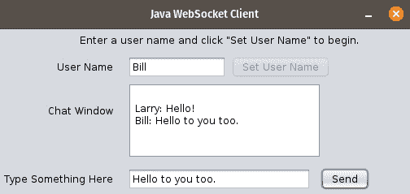

# 第九章：WebSockets

传统上，Web 应用程序是使用 HTTP 之后的请求/响应模型开发的。在这个传统的请求/响应模型中，请求始终由客户端发起，然后服务器将响应发送回客户端。

服务器从未有过独立向客户端发送数据的方式，也就是说，不需要等待请求，直到现在。WebSocket 协议允许客户端（浏览器）和服务器之间进行全双工、双向通信。

Jakarta API for WebSocket 允许我们在 Java 中开发 WebSocket 端点。

在本章中，我们将涵盖以下主题：

+   开发 WebSocket 服务器端点

+   使用 JavaScript 开发 WebSocket 客户端

+   使用 Java 开发 WebSocket 客户端

注意

本章的源代码可以在 GitHub 上找到：[`github.com/PacktPublishing/Jakarta-EE-Application-Development/tree/main/ch09_src`](https://github.com/PacktPublishing/Jakarta-EE-Application-Development/tree/main/ch09_src)。

# 开发 WebSocket 服务器端点

我们可以通过两种方式使用 Jakarta API 为 WebSocket 实现 WebSocket 服务器端点：我们既可以编程式地开发端点，在这种情况下，我们需要扩展`jakarta.websocket.Endpoint`类，或者我们可以使用 WebSocket 特定的注解来注解**普通 Java 对象**（**POJOs**）。这两种方法非常相似，因此我们只将详细讨论注解方法，并在本章后面简要解释如何编程式地开发 WebSocket 服务器端点。

在本章中，我们将开发一个简单的基于 Web 的聊天应用程序，充分利用 Jakarta API for WebSocket。

## 开发注解 WebSocket 服务器端点

下面的 Java 类演示了我们可以通过注解 Java 类来开发 WebSocket 服务器端点：

```java
package com.ensode.jakartaeebook.websocketchat.serverendpoint;
//imports omitted
@ServerEndpoint("/websocketchat")
public class WebSocketChatEndpoint {
  private static final Logger LOG =
    Logger.getLogger(WebSocketChatEndpoint.class.getName());
  @OnOpen
  public void connectionOpened() {
    LOG.log(Level.INFO, "connection opened");
  }
  @OnMessage
  public synchronized void processMessage(Session session,
    String message) {
    LOG.log(Level.INFO, "received message: {0}", message);
    session.getOpenSessions().forEach(sess -> {
      if (sess.isOpen()) {
        try {
          sess.getBasicRemote().sendText(message);
        } catch (IOException ex) {
          LOG.log(Level.SEVERE, ex.getMessage(), ex);
        }
      }
    });
  }
  @OnClose
  public void connectionClosed() {
    LOG.log(Level.INFO, "connection closed");
  }
}
```

类级别的`@ServerEndpoint`注解表示该类是一个 WebSocket 服务器端点。在这个例子中，`"/websocketchat"`（即）。WebSocket 客户端将使用此 URI 与我们的端点进行通信。

`@OnOpen`注解用于指示每当从任何客户端打开 WebSocket 连接时需要执行的方法。在我们的例子中，我们只是向服务器日志发送一些输出，但当然，任何有效的服务器端 Java 代码都可以放在这里。

任何带有`@OnMessage`注解的方法将在我们的服务器端点从任何客户端接收到消息时被调用。由于我们正在开发一个聊天应用程序，我们的代码只是将接收到的消息广播给所有已连接的客户端。

在我们的示例中，`processMessage()`方法被注解为`@OnMessage`，它接受两个参数，一个实现`jakarta.websocket.Session`接口的类的实例，以及一个包含接收到的消息的`String`。由于我们正在开发一个聊天应用程序，我们的 WebSocket 服务器端点只是将接收到的消息广播给所有已连接的客户端。

`Session`接口的`getOpenSessions()`方法返回一个包含所有打开会话的`Set`集合，我们遍历这个集合，通过在每个`Session`实例上调用`getBasicRemote()`方法，然后调用此调用返回的`RemoteEndpoint.Basic`实现上的`sendText()`方法，将接收到的消息广播回所有已连接的客户端。

`Session`接口上的`getOpenSessions()`方法在调用该方法时返回所有打开的会话。在方法调用之后，一个或多个会话可能已经关闭，因此建议在尝试向客户端发送数据之前，在`Session`实现上调用`isOpen()`方法。

最后，我们需要使用`@OnClose`注解来标注一个方法，以处理客户端从服务器端点断开连接的事件。在我们的示例中，我们只是简单地将一条消息记录到服务器日志中。

我们在示例中没有使用的一个附加注解。`@OnError`注解用于指示在向客户端发送或从客户端接收数据时发生错误时需要调用的方法。

如我们所见，开发注解 WebSocket 服务器端点很简单。我们只需添加几个注解，应用程序服务器就会根据需要调用我们的注解方法。

如果我们希望以编程方式开发 WebSocket 服务器端点，我们需要编写一个扩展`jakarta.websocket.Endpoint`的 Java 类。这个类有`onOpen()`、`onClose()`和`onError()`方法，这些方法在端点生命周期中的适当时间被调用。没有与`@OnMessage`注解等效的方法——要处理来自客户端的传入消息，需要在会话中调用`addMessageHandler()`方法，传递一个实现`jakarta.websocket.MessageHandler`接口（或其子接口）的类的实例作为其唯一参数。

通常，与它们的程序化对应物相比，开发注解 WebSocket 端点更为直接。因此，我们建议尽可能使用注解方法。

现在我们已经看到了如何开发 WebSocket 端点，我们将把注意力集中在开发 WebSocket 客户端上。

# 在 JavaScript 中开发 WebSocket 客户端

大多数 WebSocket 客户端都是作为利用 JavaScript WebSocket API 的网页实现的。我们将在下一节中介绍如何实现这一点。

Jakarta API 为 WebSocket 提供了一个客户端 API，允许我们开发作为独立 Java 应用程序的 WebSocket 客户端。我们将在本章后面介绍这一功能。

## 开发 JavaScript 客户端 WebSocket 代码

在本节中，我们将介绍如何开发客户端 JavaScript 代码，以与我们在上一节中开发的 WebSocket 端点交互。

我们 WebSocket 示例的客户端页面是使用 HTML5 友好的标记实现的 JSF 页面（如*第七章*中所述）。

如**图 9.1**所示，我们的客户端页面由一个文本区域组成，我们可以在这里看到我们应用的用户在说什么（毕竟，这是一个聊天应用），以及一个文本输入框，我们可以用它向其他用户发送消息。


**图 9.1** – JavaScript WebSocket 客户端

我们客户端页面的 JavaScript 代码如下所示：

```java
<script type="text/javascript">
  var websocket;
  function init() {
    websocket = new WebSocket(
     'ws://localhost:8080/websocketchat/websocketchat');
     websocket.onopen = function (event) {
      websocketOpen(event)
    };
    websocket.onmessage = function (event) {
      websocketMessage(event)
    };
    websocket.onerror = function (event) {
      websocketError(event)
    };
   }
   function websocketOpen(event) {
    console.log("webSocketOpen invoked");
  }
  function websocketMessage(event) {
    console.log("websocketMessage invoked");
    document.getElementById('chatwindow').value += '\r' +
      event.data;
  }
  function websocketError(event) {
    console.log("websocketError invoked");
  }
  function sendMessage() {
    var userName = document.getElementById('userName').value;
    var msg = document.getElementById('chatinput').value;
     websocket.send(userName + ": " + msg);
  }
  function closeConnection() {
    websocket.close();
  }
  window.addEventListener("load", init, false);
</script>
```

我们 JavaScript 代码的最后一行（`window.addEventListener("load", init);`）将我们的 JavaScript `init()`函数设置为在页面加载时立即执行。

在`init()`函数中，我们初始化一个新的 JavaScript WebSocket 对象，将我们的服务器端点 URI 作为参数传递。这使我们的 JavaScript 代码知道我们的服务器端点的位置。

JavaScript WebSocket 对象有几种函数类型，用于处理不同的事件，如打开连接、接收消息和处理错误。我们需要将这些类型设置到我们自己的 JavaScript 函数中，以便我们可以处理这些事件，这正是我们在调用 JavaScript WebSocket 对象构造函数后立即在`init()`方法中做的。在我们的例子中，我们分配给 WebSocket 对象的函数只是将它们的功能委托给独立的 JavaScript 函数。

当 WebSocket 连接打开时，会调用我们的`websocketOpen()`函数。在我们的例子中，我们只是向浏览器 JavaScript 控制台发送一条消息。

当浏览器从我们的 WebSocket 端点接收到 WebSocket 消息时，会调用我们的`webSocketMessage()`函数。在我们的例子中，我们使用消息的内容更新具有聊天窗口 ID 的文本区域的内文。

当发生与 WebSocket 相关的错误时，会调用我们的`websocketError()`函数。在我们的例子中，我们只是向浏览器 JavaScript 控制台发送一条消息。

我们的`sendMessage()`JavaScript 函数向 WebSocket 服务器端点发送一条消息，其中包含用户名和具有`chatinput` ID 的文本输入的内容。当用户点击具有`sendBtn` ID 的按钮时，会调用此函数。

我们的`closeConnection()`JavaScript 函数关闭了与我们的 WebSocket 服务器端点的连接。

从这个例子中我们可以看出，编写客户端 JavaScript 代码与 WebSocket 端点交互相当简单。

## 在 Java 中开发 WebSocket 客户端

尽管目前开发基于 Web 的 WebSocket 客户端是开发 WebSocket 客户端最常见的方式，但 Jakarta API 为 WebSocket 提供了一个客户端 API，我们可以使用它来开发 Java WebSocket 客户端。

在本节中，我们将使用 Jakarta API for WebSocket 的客户端 API 开发一个简单的图形 WebSocket 客户端。*图 9.2*展示了我们的 Java WebSocket 客户端的 GUI。



图 9.2 – 使用 Java 开发的 WebSocket 客户端

注意

我们不会介绍 GUI 代码，因为它与讨论无关。示例的完整代码，包括 GUI 代码，可以从本书的 GitHub 仓库下载。

就像 WebSocket 服务器端点一样，Java WebSocket 客户端可以通过编程方式或使用注解来开发。再次强调，我们只介绍注解方法。开发程序客户端的方式与开发程序服务器端点的方式非常相似，也就是说，程序客户端必须扩展`jakarta.websocket.Endpoint`并重写适当的方法。

不再赘述，以下是我们的 Java WebSocket 客户端代码：

```java
package com.ensode.websocketjavaclient;
//imports omitted
@ClientEndpoint
public class WebSocketClient {
  private static final Logger LOG =
    Logger.getLogger(WebSocketClient.class.getName());
  private String userName;
  private Session session;
  private final WebSocketJavaClientFrame webSocketJavaClientFrame;
  public WebSocketClient(WebSocketJavaClientFrame
    webSocketJavaClientFrame) {
    this.webSocketJavaClientFrame = webSocketJavaClientFrame;
    try {
      WebSocketContainer webSocketContainer =
     ContainerProvider.getWebSocketContainer();
      webSocketContainer.connectToServer(this, new URI(
     "ws://localhost:8080/websocketchat/websocketchat"));
    } catch (DeploymentException | IOException | URISyntaxException ex) {
      ex.printStackTrace();
    }
  }
  @OnOpen
  public void onOpen(Session session) {
 this.session = session;
  }
  @OnClose
  public void onClose(CloseReason closeReason) {
    LOG.log(Level.INFO, String.format(
      "Connection closed, reason: %s",
      closeReason.getReasonPhrase()));
  }
  @OnError
public void onError(Throwable throwable) {
    throwable.printStackTrace();
  }
  @OnMessage
  public void onMessage(String message, Session session) {
    webSocketJavaClientFrame.getChatWindowTextArea().setText(
            webSocketJavaClientFrame.getChatWindowTextArea().getText()
            + ""
            + "\n" + message);
  }
  public void sendMessage(String message) {
    try {
      session.getBasicRemote().sendText(userName + ": " + message);
    } catch (IOException ex) {
      ex.printStackTrace();
    }
  }
  //setters and getters omitted
}
```

类级别的`@ClientEndPoint`注解将我们的类标记为 WebSocket 客户端。所有 Java WebSocket 客户端都必须使用此注解。

建立与 WebSocket 服务器端点连接的代码位于我们的类构造函数中。首先，我们需要调用`ContainerProvider.getWebSocketContainer()`来获取`jakarta.websocket.WebSocketContainer`的实例。然后，通过在`WebSocketContainer`实例上调用`connectToServer()`方法来建立连接，将一个被`@ClientEndpoint`注解的类作为第一个参数（在我们的例子中，我们使用`this`，因为连接代码位于我们的 WebSocket Java 客户端代码中），以及包含 WebSocket 服务器端点 URI 的`URI`对象作为第二个参数。

连接建立后，我们就可以准备响应 WebSocket 事件了。细心的读者可能已经注意到，我们在客户端代码中再次使用了我们用于开发服务器端点相同的注解。

任何被`@OnOpen`注解的方法，在 WebSocket 服务器端点连接建立时都会自动被调用，该方法必须返回 void，并且可以有一个可选的`jakarta.websocket.Session`类型参数。在我们的例子中，我们使用接收到的`Session`实例初始化一个类变量。

被`@OnClose`注解的方法在 WebSocket 会话关闭时被调用。被注解的方法可以有一个可选的`jakarta.websocket.Session`类型参数和一个`CloseReason`类型参数。在我们的例子中，我们选择只使用`CloseReason`可选参数，因为这个类有一个方便的`getReasonPhrase()`方法，可以提供会话关闭的简短解释。

`@OnError`注解用于指示当发生错误时将调用该方法。带有`@OnError`注解的方法必须有一个类型为`java.lang.Throwable`（`java.lang.Exception`的父类）的参数，并且可以有一个类型为`Session`的可选参数。在我们的示例中，我们只是将`Throwable`参数的堆栈跟踪发送到`stderr`。

当接收到传入的 WebSocket 消息时，带有`@OnMessage`注解的方法将被调用。`@OnMessage`方法可以根据接收到的消息类型以及我们希望如何处理它来具有不同的参数。在我们的示例中，我们使用了最常见的情况，接收文本消息。在这种情况下，我们需要一个`String`参数来保存消息的内容，以及一个可选的`Session`参数。

注意

有关如何处理其他类型消息的信息，请参阅`@OnMessage`的 JavaDoc 文档，网址为[`jakarta.ee/specifications/platform/10/apidocs/jakarta/websocket/onmessage`](https://jakarta.ee/specifications/platform/10/apidocs/jakarta/websocket/onmessage)。

在我们的示例中，我们只是更新了聊天窗口的文本区域，将接收到的消息追加到其内容中。

要发送 WebSocket 消息，我们在 Session 实例上调用`getBasicRemote()`方法，然后在该调用返回的`RemoteEndpoint.Basic`实现上调用`sendText()`方法（如果这看起来很熟悉，那是因为我们在 WebSocket 服务器端点代码中确实做了完全相同的事情）。在我们的示例中，我们在`sendMessage()`方法中这样做。

关于 Jakarta API for WebSocket 的附加信息

在本章中，我们介绍了 Jakarta API for WebSocket 提供的功能的大部分。有关更多信息，请参阅 Tyrus 的用户指南，这是一个流行的开源 Jakarta API for WebSocket 实现，网址为[`eclipse-ee4j.github.io/tyrus-project.github.io/documentation/latest/index/`](https://eclipse-ee4j.github.io/tyrus-project.github.io/documentation/latest/index/)。

# 摘要

在本章中，我们介绍了 Jakarta API for WebSocket，这是一个用于开发 WebSocket 服务器端点和客户端的 Jakarta EE API：

+   我们首先了解了如何利用 Jakarta API for WebSockets 开发 WebSocket 服务器端点

+   然后，我们介绍了如何使用 JavaScript 开发基于 Web 的 WebSocket 客户端

+   最后，我们解释了如何在 Java 中开发 WebSocket 客户端应用程序

WebSockets 使我们能够实现网页浏览器和网页服务器之间的实时、双向通信。正如我们在本章中看到的，Jakarta EE WebSocket API 负责处理底层细节，使我们能够通过几个简单的注解来开发 WebSocket 端点。
