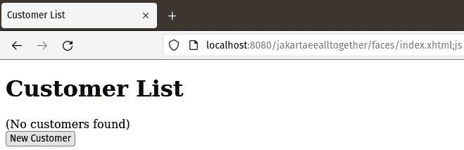
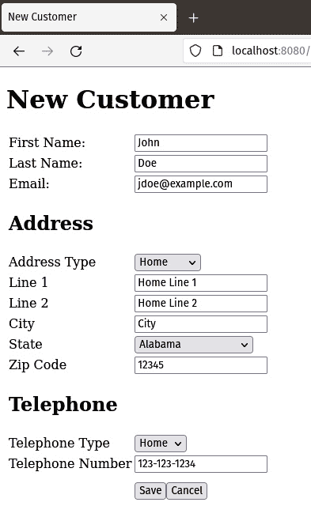
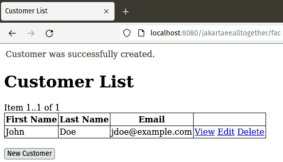
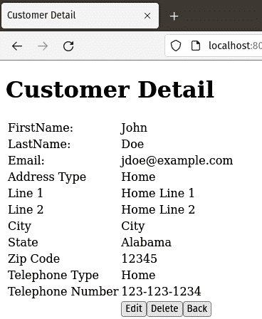
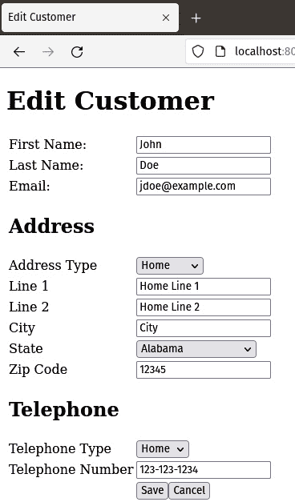
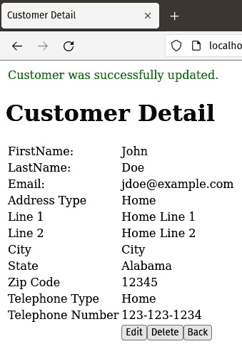
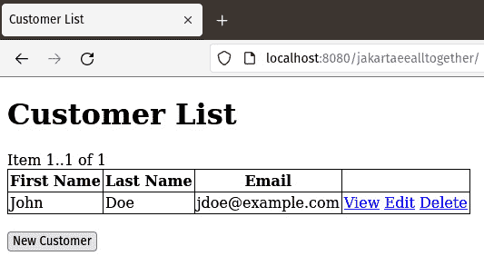
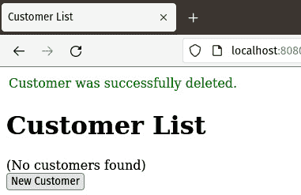
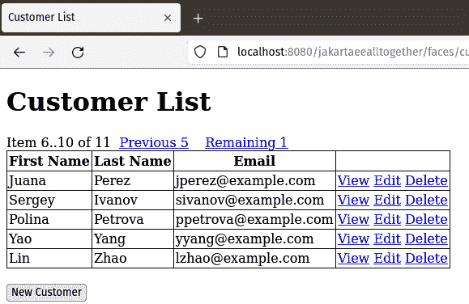

# 第十五章：整合所有内容

在前面的章节中，我们分别介绍了 Jakarta EE API 和规范。然而，在本章中，我们将使用流行的 Jakarta EE API 开发一个应用，展示如何将它们一起使用。

在本章中，我们将涵盖以下主题：

+   样例应用

+   创建客户数据

+   查看客户数据

+   更新客户数据

+   删除客户数据

+   实现分页

到本章结束时，你将学会如何开发一个结合了几个流行的 Jakarta EE API 的完整应用。

注意

本章的示例源代码可以在 GitHub 上找到，地址为 [`github.com/PacktPublishing/Jakarta-EE-Application-Development/tree/main/ch15_src`](https://github.com/PacktPublishing/Jakarta-EE-Application-Development/tree/main/ch15_src)

# 样例应用

本章我们将开发一个典型的 CRUD（创建、读取、更新和删除）应用示例。我们将使用 CDI 来开发我们的控制器，使用 Jakarta Persistence 作为我们的对象关系映射工具，利用 Jakarta Enterprise Beans 来处理事务，以及使用 Jakarta Faces 来开发用户界面。我们将介绍一些高级的 Jakarta Faces 功能，例如开发自定义转换器和实现自定义**表达式语言**（**EL**）解析器。

该应用是一个基于 Web 的应用，用于在数据库中维护客户信息。它提供了查看所有客户、查看单个客户的详细信息以及更新和删除新客户的功能。

## 首页

我们的应用程序首页是一个非常简单的 Facelets 页面，它有一个简单的命令链接，该链接会在主控制器上调用方法，如下面的代码片段所示。

```java
<h:body>
  <h:form>
    <h:commandLink action="#{customerController.listSetup}"
      value="View all customers"/>
  </h:form>
</h:body>
```

我们应用的主要控制器是一个名为 `CustomerController` 的类。它被实现为一个会话作用域的 CDI 命名豆。当用户点击页面上的链接时，我们的 Facelets 页面会调用控制器上的 `listSetup()` 方法。这个方法进行一些初始化，然后将用户引导到显示所有现有客户的页面，如下面的代码段所示。

```java
package com.ensode.jakartaeealltogether.faces.controller;
//imports omitted for brevity
@Named
@SessionScoped
public class CustomerController implements Serializable {
  //variable declarations omitted
  public String listSetup() {
    reset(true);
    return "/customer/List";
  }
  private void reset(boolean resetFirstItem) {
    customer = null;
    customerItems = null;
    pagingInfo.setItemCount(-1);
    if (resetFirstItem) {
      pagingInfo.setFirstItem(0);
    }
  }
  //additional methods omitted
}
```

我们控制器中的 `listSetup()` 方法调用一个 `reset()` 方法，用于分页（稍后会有更多介绍），然后返回一个与显示现有客户列表页面路径匹配的字符串。

第一次导航到显示客户列表的页面时，我们简单地显示一条消息，说明没有找到客户，因为数据库中的 CUSTOMERS 表是空的。



图 15.1 – 空客户列表

我们的 Facelets 页面有一个 `<h:outputText>` 标签，仅在客户列表为空时渲染。

```java
<h:form styleClass="jsfcrud_list_form">
  <h:outputText escape="false" value="(No customers found)"
    rendered=
      "#{customerController.pagingInfo.itemCount == 0}" />
   <!-- Additional markup omitted →
   <h:commandButton
     action="#{customerController.createSetup}"
     value="New Customer"/>
</form>
```

我们的 Facelets 页面还有一个标记为 **New Customer** 的命令按钮，它会在控制器上调用逻辑以将客户数据插入数据库。

## 创建客户数据

显示客户列表的 Facelets 页面上的命令按钮调用 `CustomerController` 上的 `createSetup()` 方法，该方法在显示允许用户输入新客户数据的表单之前进行一些初始化。

```java
package com.ensode.jakartaeealltogether.faces.controller;
//imports omitted
@Named
@SessionScoped
public class CustomerController implements Serializable {
  private Customer customer = null;
  private PagingInfo pagingInfo = null;
  //additional variable declarations omitted
  public String createSetup() {
    reset(false);
    customer = new Customer();
    List<Address> addressList = new ArrayList<>(1);
    Address address = new Address();
    List<Telephone> telephoneList = new ArrayList<>(1);
    Telephone telephone = new Telephone();
    address.setCustomer(customer);
    addressList.add(address);
    telephone.setCustomer(customer);
    telephoneList.add(telephone);
    customer.setAddressList(addressList);
    customer.setTelephoneList(telephoneList);
    return "/customer/New";
  }
  private void reset(boolean resetFirstItem) {
    customer = null;
    customerItems = null;
    pagingInfo.setItemCount(-1);
    if (resetFirstItem) {
      pagingInfo.setFirstItem(0);
    }
  }
}
```

如我们所见，`createSetup()` 方法调用了 `reset()` 方法，该方法简单地从内存中清除一些数据并执行一些分页逻辑，然后创建一个新的 `Customer` 对象。`Customer` 类是一个简单的 JPA 实体，它与两个额外的 JPA 实体 `Address` 和 `Telephone` 有一个多对多的关系。

```java
package com.ensode.jakartaeealltogether.entity;
//imports omitted
@Entity
@Table(name = "CUSTOMERS")
public class Customer implements Serializable {
  private static final long serialVersionUID = 1L;
  @Id
  @Basic(optional = false)
  @GeneratedValue(strategy = GenerationType.AUTO)
  @Column(name = "CUSTOMER_ID")
  private Integer customerId;
  @Column(name = "FIRST_NAME")
  private String firstName;
  @Column(name = "LAST_NAME")
  private String lastName;
  @Column(name = "EMAIL")
  private String email;
  @OneToMany(mappedBy = "customer",
    cascade = CascadeType.ALL)
  private List<Address> addressList;
  @OneToMany(mappedBy = "customer",
    cascade = CascadeType.ALL)
  private List<Telephone> telephoneList;
  //methods omitted
}
```

`createSetup()` 方法初始化 `Customer` 新实例上的 `Address` 和 `Telephone` 列表，将其设置为包含相应类型单个元素的 `ArrayList` 实例，然后导航到用户可以输入新客户数据的 Facelets 页面。见 *图 15**.2*。



图 15.2 – 输入新客户数据

我们页面的标记是一个相当标准的 Facelets 页面，它实现了一些自定义逻辑来填充页面上的所有下拉菜单，例如，获取 `addressTypeItemsAvailableSelectOne()` 上的选项，在一个名为 `AddressTypeController` 的 CDI 实体上。

```java
 <h:selectOneMenu id="selectOneAddr" value=
   "#{customerController.customer.addressList[0].
      addressType}" required="true">
   <f:selectItems id="selectOneAddrOpts" value="#{addressTypeController.addressTypeItemsAvailableSelectOne}"/>
</h:selectOneMenu>
```

`AddressTypeController.getAddressTypeItemsAvailableSelectOne()` 方法在名为 `JSFUtil` 的实用类上的 `getSelectItems()` 上调用一个简单的方法。

```java
package com.ensode.jakartaeealltogether.faces.controller;
//imports omitted
@Named
@SessionScoped
public class AddressTypeController implements Serializable {
  @EJB
  private AddressTypeDao dao;
  public SelectItem[]
        getAddressTypeItemsAvailableSelectOne() {
    return JsfUtil.getSelectItems(
        dao.findAddressTypeEntities(), true);
  }
}
```

`JSFUtil.getSelectItems()` 方法遍历返回的实体，并返回一个 `SelectItem` 数组，使用每个实体的 `toString()` 方法的返回值作为标签，实体本身作为值。

```java
package com.ensode.jakartaeealltogether.faces.util;
//imports omitted
public class JsfUtil {
  public static SelectItem[] getSelectItems(List<?> entities, 
    boolean selectOne) {
    int size = selectOne ? entities.size() + 1 :
      entities.size();
    SelectItem[] items = new SelectItem[size];
    int i = 0;
    if (selectOne) {
      items[0] = new SelectItem("", "---");
      i++;
    }
    for (Object x : entities) {
      items[i++] = new SelectItem(x, x.toString());
    }
    return items;
  }
}
```

填充页面上的其他下拉菜单的逻辑非常相似。

新客户页面上的 **保存** 按钮实现为一个命令按钮：

```java
<h:commandButton action="#{customerController.create}"
  value="Save"/>
```

命令按钮在 `CustomerController` 类中调用一个名为 `create()` 的方法。

```java
package com.ensode.jakartaeealltogether.faces.controller;
//imports omitted
@Named
@SessionScoped
public class CustomerController implements Serializable {
  @EJB
  private CustomerDao dao;
  //additional methods and variable declarations omitted
  public String create() {
    try {
      dao.create(customer);
      JsfUtil.addSuccessMessage(
        "Customer was successfully created.");
    } catch (Exception e) {
      JsfUtil.ensureAddErrorMessage(e,
        "A persistence error occurred.");
      return null;
    }
    return listSetup();
  }
}
```

`CustomerController.create()` 方法简单地调用我们数据访问对象（DAO）中同名的 `create()` 方法，DAO 方法简单地在一个新的行中插入 `CUSTOMERS`、`ADDRESSES` 和 `TELEPHONES` 数据库表，这些表分别对应于 `Customer`、`Address` 和 `Telephone` Jakarta Persistence 实体。

`CustomerrController.create()` 方法在操作成功时向用户显示一条成功消息，如果操作失败则显示一条错误消息。然后它将用户导向列出所有客户对象的页面。见 *图 15**.3*。



图 15.3 – 已填充的客户列表

现在我们已经创建了一个客户，我们的 **客户列表** 页面显示一个数据表，列出我们刚刚创建的客户。它包含用于查看、编辑或删除每个客户的命令链接。我们将在下一节中介绍如何查看现有客户数据。

## 查看客户数据

如前所述，**客户列表**页面上的数据表中的每一行都有一个**查看**命令链接。命令链接的标记如下：

```java
<h:commandLink value="View" action="#{customerController.detailSetup}">
  <f:param name="jsfcrud.currentCustomer" value="#{jsfcrud_class['com.ensode.jakartaeealltogether.faces.util.JsfUtil'].jsfcrud_method['getAsConvertedString'][item1][customerController.converter].jsfcrud_invoke}"/>
</h:commandLink>
```

注意命令链接内的`<f:param>`标签。此标签在用户点击按钮时创建的 HTTP 请求中添加一个请求参数。

我们正在使用高级的 Jakarta Faces 技术来动态生成请求参数的值。我们使用自定义的表达式语言解析器，这样我们就可以在我们的 Jakarta Faces 表达式语言中实现自定义逻辑。

为了使用自定义的表达式语言解析器，我们需要在我们的应用程序的`faces-config.xml`配置文件中声明它。

```java
<?xml version='1.0' encoding='UTF-8'?>
<faces-config version="4.0"

    xsi:schemaLocation="https://jakarta.ee/xml/ns/jakartaee https://
      jakarta.ee/xml/ns/jakartaee/web-facesconfig_4_0.xsd">
  <application>
    <el-resolver>
      com.ensode.jakartaeealltogether.faces.util.JsfCrudELResolver
    </el-resolver>
  </application>
</faces-config>
```

如我们所见，我们通过在 faces-config.xml 中的`<el-resolver>`标签内放置其完全限定名称来注册我们的自定义表达式语言解析器。

我们的表达式语言解析器的详细信息超出了范围，只需说，它的`getValue()`方法在解析`<f:param>`的值属性时自动调用，它使用 Java 的反射 API 来确定要调用哪个方法。在我们的具体示例中，它调用名为`JsfUtil`的类中的`getConvertedAsString()`方法，并将一个名为`CustomerConverter`的自定义转换器的实例作为参数传递。

以下代码片段显示了我们的自定义`ELResolver`的`getValue()`方法的签名，本书的 GitHub 仓库包含完整的源代码。

```java
package com.ensode.jakartaeealltogether.faces.util;
//imports omitted
public class JsfCrudELResolver extends ELResolver {
  //variable declarations omitted
  @Override
  public Object getValue(ELContext context, Object base,
    Object property) {
    //use reflection to determine which method to invoke
  }
  //additional methods omitted
}
```

一切都完成后，我们的`ELResolver`返回相应`Customer`对象的键值。

当用户点击`CustomerController.detailSetup()`时，它被调用，在浏览器上显示客户信息之前执行一些初始化操作。

```java
package com.ensode.jakartaeealltogether.faces.controller;
//imports omitted
@Named
@SessionScoped
public class CustomerController implements Serializable {
  @PostConstruct
  public void init() {
    converter = new CustomerConverter();
  }
  private Customer customer = null;
  private CustomerConverter converter = null;
  //additional variable declarations omitted
  public String detailSetup() {
    return scalarSetup("/customer/Detail");
  }
  private String scalarSetup(String destination) {
    reset(false);
    customer = (Customer) JsfUtil.
      getObjectFromRequestParameter(
       "jsfcrud.currentCustomer", converter, null);
    if (customer == null) {
     //error handling code omitted
    }
    return destination;
  }
  //additional methods omitted
}
```

`CustomerController.detailSetup()`方法简单地将其大部分逻辑委托给`scalarSetup()`方法，该方法在每次我们需要显示单个客户信息时使用。

`CustomerController.scalarSetup()`调用`JsfUtil.getObjectFromRequestParameter()`，传递请求参数名称和我们的自定义 Jakarta Faces 转换器。

`JSFUtil.getObjectFromRequestParameter()`，反过来，使用我们的自定义转换器来获取我们的`Customer`对象的一个实例。

```java
package com.ensode.jakartaeealltogether.faces.util;
//imports omitted
public class JsfUtil {
  public static String getRequestParameter(String key) {
    return FacesContext.getCurrentInstance().getExternalContext().
    getRequestParameterMap().get(key);
  }
  public static Object getObjectFromRequestParameter(String requestParameterName, Converter converter, UIComponent component) {
    String theId =
     JsfUtil.getRequestParameter(requestParameterName);
    return converter.getAsObject(
      FacesContext.getCurrentInstance(), component, theId);
  }
  //additional methods omitted
}
```

如我们所见，`JSFUtil`调用了我们自定义的 Faces 转换器的`getAsObject()`方法。我们的转换器反过来，通过 Jakarta Faces API 获取我们的会话作用域的`CustomerController`实例，然后调用它的`findCustomer()`方法来获取相应的`Customer` Jakarta Persistence 实体实例，如下面的示例所示。

```java
package com.ensode.jakartaeealltogether.faces.converter;
//imports omitted
@FacesConverter(forClass = Customer.class)
public class CustomerConverter implements Converter {
  @Override
  public Object getAsObject(FacesContext facesContext, UIComponent component, String string) {
    if (string == null || string.length() == 0) {
      return null;
    }
    Integer id = Integer.valueOf(string);
    CustomerController controller =
      (CustomerController) facesContext.getApplication().
     getELResolver().getValue(
     facesContext.getELContext(), null,
     "customerController");
    return controller.findCustomer(id);
  }
  //additional methods omitted
}
```

一旦我们获取了`Customer`实例，控制权传递到**客户详情**页面，这是一个基本的 Facelets 页面，用于显示客户信息。见*图 15*.4。



图 15.4 – 客户详情页面

现在我们已经看到如何显示客户信息，我们将关注更新现有客户数据。

## 更新客户数据

在更新客户数据方面，我们还没有太多未讨论的内容。每行上的标记为 **编辑** 的命令链接导航到 **编辑客户** 页面。命令链接的标记如下：

```java
<h:commandLink value="Edit" action="#{customerController.editSetup}">
  <f:param name="jsfcrud.currentCustomer" value=
"#{jsfcrud_class['com.ensode.jakartaeealltogether.faces.util.JsfUtil'].jsfcrud_method['getAsConvertedString'][item1][customerController.converter].jsfcrud_invoke}"/>
</h:commandLink>
```

命令链接使用与之前章节中讨论的相同的技术，包括一个自定义的表达式语言解析器，将需要更新的客户的 ID 作为请求参数传递，然后调用 `CustomerController.editSetup()` 方法，该方法执行一些初始化操作，然后引导用户到 `CustomerController` CDI 实例。以下代码片段显示了这些操作：

```java
package com.ensode.jakartaeealltogether.faces.controller;
//imports omitted
@Named
@SessionScoped
public class CustomerController implements Serializable {
  private Customer customer = null;
  //additional variable declarations omitted
  public String editSetup() {
    return scalarSetup("/customer/Edit");
  }
  private String scalarSetup(String destination) {
    reset(false);
    customer = (Customer) JsfUtil.
      getObjectFromRequestParameter(
      "jsfcrud.currentCustomer", converter, null);
    if (customer == null) {
      //error handling code omitted
    }
    return destination;
  }
  //additional methods omitted
}
```

如我们所见，`editSetup()` 方法遵循我们在介绍如何导航到只读的 `scalarSetup()` 方法以获取客户实体的适当实例时讨论的相同模式，然后引导用户到 **编辑** **客户** 页面。

**编辑客户** 页面的标记相当简单。它包括多个输入字段，使用绑定表达式映射到客户实体的不同字段。它使用我们在创建客户数据部分讨论的技术来填充页面上的所有下拉列表。在成功导航后，**编辑客户** 页面如 *图 15.5* 所示渲染。



图 15.5 – 编辑客户页面

我们 `CustomerController` 类上的 `edit()` 方法。标记我们的 DAO 获取客户：

```java
<h:commandButton action="#{customerController.edit}"
  value="Save">
  <f:param name="jsfcrud.currentCustomer"
  value=
"#{jsfcrud_class['com.ensode.jakartaeealltogether.faces.util.JsfUtil'].jsfcrud_method['getAsConvertedString'][customerController.customer][customerController.converter].jsfcrud_invoke}"/>
</h:commandButton>
```

`CustomerController` 上的 `edit()` 方法如下所示：

```java
package com.ensode.jakartaeealltogether.faces.controller;
//imports omitted
@Named
@SessionScoped
public class CustomerController implements Serializable {
  private Customer customer = null;
  private CustomerConverter converter = null;
  //additional variable declarations omitted
  @EJB
  private CustomerDao dao;
  public String edit() {
    String customerString = converter.getAsString(
      FacesContext.getCurrentInstance(), null, customer);
    String currentCustomerString =
      JsfUtil.getRequestParameter(
      "jsfcrud.currentCustomer");
    if (customerString == null ||
        customerString.length() == 0 ||
        !customerString.equals(currentCustomerString)) {
      String outcome = editSetup();
      if ("customer_edit".equals(outcome)) {
        JsfUtil.addErrorMessage(
          "Could not edit customer. Try again.");
      }
      return outcome;
    }
    try {
      dao.edit(customer);
      JsfUtil.addSuccessMessage(
        "Customer was successfully updated.");
    } catch (Exception e) {
      //exception handling code omitted
    }
    return detailSetup();
  }
  //additional methods omitted
}
```

`CustomerController` 上的 `edit()` 方法执行一个合理性检查，以确保内存中客户的 ID 与作为请求参数传递的 ID 匹配，如果不匹配则显示错误消息。如果合理性检查成功，该方法将调用 `CustomerDao` 数据访问对象上的 `edit()` 方法，如下面的代码片段所示：

```java
package com.ensode.jakartaeealltogether.dao;
//imports omitted
@Stateless
public class CustomerDao implements Serializable {
  @Resource
  private EJBContext ejbContext;
  @PersistenceContext
  private EntityManager em;
  public void edit(Customer customer) throws Exception {
    try {
      customer = em.merge(customer);
    } catch (Exception ex) {
      ejbContext.setRollbackOnly();
      String msg = ex.getLocalizedMessage();
      if (msg == null || msg.length() == 0) {
        Integer id = customer.getCustomerId();
        if (findCustomer(id) == null) {
          throw new NonexistentEntityException(
            "The customer with id " + id +
            " no longer exists.");
        }
      }
      throw ex;
    }
  }
}
```

我们 DAO 上的 `edit()` 方法在其注入的 `EntityManager` 上调用 `merge()` 方法，从而更新数据库中相应的客户数据。如果发生异常，该方法将回滚事务然后尝试从数据库中检索客户。如果 `edit()` 方法在数据库中找不到客户，它将显示一条错误消息，指出客户已不再存在。这种逻辑之所以必要，是因为在我们用户更新客户信息的同时，另一个用户或进程可能已将我们的客户从数据库中删除。

如果客户数据成功更新，用户将被引导到 **客户详情** 页面，显示更新后的客户数据。见 *图 15.6*。



图 15.6 – 显示更新客户数据的客户详情页面

在下一节中，我们将讨论我们的示例应用程序如何从数据库中删除客户数据。

## 删除客户数据

**客户列表**页面上的每个表元素都有一个标记为“删除”的链接。



图 15.7 – 客户列表页面

**删除**命令链接的标记遵循之前讨论的模式，即设置一个带有要删除的客户 ID 的请求参数，如下例所示。

```java
<h:commandLink value="Delete"
  action="#{customerController.destroy}">
  <f:param name="jsfcrud.currentCustomer" value=
"#{jsfcrud_class['com.ensode.jakartaeealltogether.faces.util.JsfUtil'].jsfcrud_method['getAsConvertedString'][item1][customerController.converter].jsfcrud_invoke}"/>
</h:commandLink>
```

当点击时，命令链接会在以下示例中调用`CustomerController`上的`destroy()`方法。

```java
package com.ensode.jakartaeealltogether.faces.controller;
//imports omitted
@Named
@SessionScoped
public class CustomerController implements Serializable {
  @EJB
  private CustomerDao dao;
  //additional variable declarations omitted
  public String destroy() {
    String idAsString =
     JsfUtil.getRequestParameter("jsfcrud.currentCustomer");
    Integer id = Integer.valueOf(idAsString);
    try {
      dao.destroy(id);
      JsfUtil.addSuccessMessage(
        "Customer was successfully deleted.");
    } catch (Exception e){
      //exception handling logic omitted
    }
    return relatedOrListOutcome();
  }
  //additional methods omitted
}
```

`CustomerController`中的`destroy()`方法简单地调用`CustomerDAO`上的`destroy()`方法，传递从请求参数中获取的客户 ID。控制器随后导航回**客户列表**页面，并在成功删除后显示一个成功消息。如果在尝试删除客户时发生任何异常，它们将被适当地处理。

我们的 DAO 使用接收到的 ID 从数据库中检索客户，执行一个检查以确保数据没有被其他进程删除，然后通过在注入的`EntityManager`实例上调用`remove()`方法从数据库中删除客户，如下所示。

```java
package com.ensode.jakartaeealltogether.dao;
//imports omitted
@Stateless
public class CustomerDao implements Serializable {
  @Resource
  private EJBContext ejbContext;
  @PersistenceContext
  private EntityManager em;
  public void destroy(Integer id) throws
    NonexistentEntityException, RollbackFailureException,
    Exception {
    try {
      Customer customer;
      try {
        customer = em.getReference(Customer.class, id);
        customer.getCustomerId();
      } catch (EntityNotFoundException enfe) {
        throw new NonexistentEntityException(
          "The customer with id " + id +
          " no longer exists.", enfe);
      }
      em.remove(customer);
    } catch (Exception ex) {
      try {
        ejbContext.setRollbackOnly();
      } catch (Exception re) {
        throw new RollbackFailureException("An error "
            + "occurred attempting to roll back", re);
      }
      throw ex;
    }
  }
  //additional methods omitted
}
```

在成功从数据库中删除客户后，显示的是**客户列表**，其中包含一个成功消息，表明删除操作成功。



图 15.8 – 删除成功

我们已经看到了我们的示例应用程序如何创建、更新、显示和删除数据，包括它使用的某些高级技术，例如自定义转换器和自定义表达式语言解析器。

我们的示例应用程序还包含处理大量命令链接显示时分页的逻辑。我们将在下一节中讨论此功能。

## 实现分页

标准的 Jakarta Faces 数据表组件简单地显示页面上的列表中的所有元素。当我们需要显示少量元素时，这工作得很好，但当显示大量元素时，就会变得繁琐。在许多生产环境中，显示数百个元素并不罕见。

我们的示例应用程序实现了自定义分页逻辑，如果有超过五个客户需要显示，它一次只显示五个客户，然后显示适当的**上一页**和/或**下一页**链接以在所有客户之间导航。*图 15.9*展示了我们的自定义分页逻辑的实际应用。



图 15.9 – 自定义分页

我们的**客户列表**页面渲染一个**Previous**链接，用于导航回上一链接，或者渲染**Next**或**Remaining**链接以导航到下一页。如果至少还有 5 个客户需要显示，则渲染**Next**链接；如果少于 5 个，则渲染**Remaining**链接。

这三个链接都是通过命令链接的`rendered`属性条件渲染的，该属性接受一个布尔表达式来决定链接是否应该被渲染。

```java
 <h:commandLink action="#{customerController.prev}"
 value="Previous #{customerController.pagingInfo.batchSize}"
      rendered="#{customerController.renderPrevLink}"/>
```

我们控制器上的`renderPrevLink`属性。

`next()`和`prev()`方法更新`renderPrevLink`属性的值。当使用`renderPrevLink`值来确定是否渲染**Previous**命令链接时，会调用`next()`方法；当调用`prev()`方法时，也会调用`next()`方法。

```java
package com.ensode.jakartaeealltogether.faces.controller;
//imports omitted
@Named
@SessionScoped
public class CustomerController implements Serializable {
  @PostConstruct
  public void init() {
    pagingInfo = new PagingInfo();
  }
  private PagingInfo pagingInfo = null;
  private boolean renderPrevLink;
  @EJB
  private CustomerDao dao;
  //additional variable declarations omitted
  public PagingInfo getPagingInfo() {
    if (pagingInfo.getItemCount() == -1) {
      pagingInfo.setItemCount(dao.getCustomerCount());
    }
    return pagingInfo;
  }
  public boolean getRenderPrevLink() {
    return renderPrevLink;
  }
  public String next() {
    reset(false);
    getPagingInfo().nextPage();
    renderPrevLink = getPagingInfo().getFirstItem() >=
      getPagingInfo().getBatchSize();
    return "List";
  }
  public String prev() {
    reset(false);
    getPagingInfo().previousPage();
    renderPrevLink = getPagingInfo().getFirstItem() >=
      getPagingInfo().getBatchSize();
    return "List";
  }
  //additional methods omitted
}
```

当至少还有五个客户需要显示时，会显示**Next**命令链接。

```java
<h:commandLink action="#{customerController.next}" value="Next #{customerController.pagingInfo.batchSize}" rendered="#{customerController.pagingInfo.lastItem + customerController.pagingInfo.batchSize le customerController.pagingInfo.itemCount}"
```

在这种情况下，`rendered`属性的逻辑被嵌入在页面上，而不是像**Previous**命令链接那样依赖于控制器。

当下一页显示的客户少于五个时，会显示**Remaining**命令链接。

```java
<h:commandLink action="#{customerController.next}" value="Remaining #{customerController.pagingInfo.itemCount - customerController.pagingInfo.lastItem}"
                       rendered="#{customerController.pagingInfo.lastItem lt
  customerController.pagingInfo.itemCount and
  customerController.pagingInfo.lastItem +
  customerController.pagingInfo.batchSize gt
  customerController.pagingInfo.itemCount}"/>
```

此命令链接也将其`rendered`属性的逻辑作为页面上的一种表达式嵌入。

分页逻辑依赖于`PagingInfo`实用类，这个类有获取要显示的第一和最后元素的方法，以及确定在数据表的每一页上显示哪些元素的逻辑。

```java
package com.ensode.jakartaeealltogether.faces.util;
public class PagingInfo {
  private int batchSize = 5;
  private int firstItem = 0;
  private int itemCount = -1;
  //trivial setters and getters omitted
  public int getFirstItem() {
    if (itemCount == -1) {
      throw new IllegalStateException(
        "itemCount must be set before invoking " +
        "getFirstItem");
    }
    if (firstItem >= itemCount) {
      if (itemCount == 0) {
        firstItem = 0;
      } else {
        int zeroBasedItemCount = itemCount - 1;
        double pageDouble = zeroBasedItemCount / batchSize;
        int page = (int) Math.floor(pageDouble);
        firstItem = page * batchSize;
      }
    }
    return firstItem;
  }
  public int getLastItem() {
    getFirstItem();
    int lastItem = firstItem + batchSize > itemCount ?
      itemCount : firstItem + batchSize;
    return lastItem;
  }
  public void nextPage() {
    getFirstItem();
    if (firstItem + batchSize < itemCount) {
      firstItem += batchSize;
    }
  }
  public void previousPage() {
    getFirstItem();
    firstItem -= batchSize;
    if (firstItem < 0) {
      firstItem = 0;
    }
  }
}
```

如前述代码示例所示，我们的控制器依赖于`PaginationInfo`实用类来实现分页。

# 摘要

在本章中，我们通过一个示例应用程序说明了如何通过整合几个 Jakarta EE 技术。我们涵盖了以下主题：

+   如何通过整合 Jakarta Faces、CDI、Jakarta Enterprise Beans 和 Jakarta Persistence 来创建客户数据

+   如何通过整合 Jakarta Faces、CDI、Jakarta Enterprise Beans 和 Jakarta Persistence 来查看客户数据

+   如何通过整合 Jakarta Faces、CDI、Jakarta Enterprise Beans 和 Jakarta Persistence 来更新客户数据

+   如何通过整合 Jakarta Faces、CDI、Jakarta Enterprise Beans 和 Jakarta Persistence 来删除客户数据

+   如何在显示 Jakarta Faces 数据表组件中的表格数据时实现自定义分页逻辑

Jakarta EE API 设计为协同工作，正如本章所示，它们可以无缝集成来构建健壮的应用程序。
