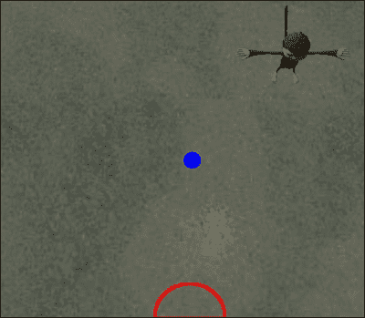
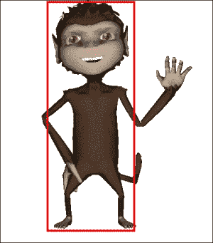
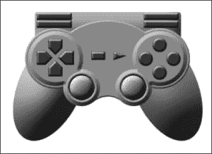
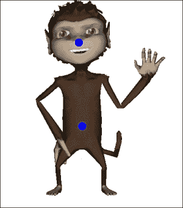

# 第二章 相机和游戏控制

本章包含以下食谱：

+   创建可重用的角色控制

+   附加输入 AppState 对象

+   在 FPS 中开火

+   开射非即时子弹

+   创建一个 RTS 相机 AppState 对象

+   在 RTS 中选择单位

+   让相机跟随单位

+   使用 ChaseCamera 追踪角色

+   添加游戏控制器和游戏手柄输入

+   在角落里倾斜

+   在第三人称游戏中自动检测掩护

# 简介

本章是关于控制各种游戏类型的角色和相机。无论你的游戏是**第一人称射击**（**FPS**）、**角色扮演游戏**（**RPG**）还是**实时策略**（**RTS**）游戏，你将学习一些技巧，帮助你克服困难障碍。

本章将大量依赖 `ActionListener` 和 `AnalogListener` 接口。在 jMonkeyEngine 中监听玩家输入时，这些接口是必不可少的。`ActionListener` 接口将捕获任何二进制输入，如键盘按键或鼠标按钮。`AnalogListener` 接口监听鼠标和游戏手柄的移动以及其他开/关输入。

# 创建可重用的角色控制

为了开始本章，我们将创建一个可以用于各种角色控制目的的类。示例描述了一个 FPS 角色，但这种方法适用于任何玩家控制的角色。

我们将要构建的 `Control` 类将基于 `BetterCharacterControl`。如果你想知道这是如何工作的，查看 jMonkeyEngine 测试包中的类或 `TestBetterCharacter` 示例可能是个好主意。另一个好的起点是查看同一包中的输入示例。

## 准备工作

`BetterCharacterControl` 类基于物理，需要在应用程序中设置 `BulletAppState` 类。完成此所需的步骤在附录 *The ImageGenerator class* 部分的 *Information Fragments* 中描述，*信息片段*。要了解更多关于子弹和物理的信息，请参阅 *第八章*，*使用 Bullet 的物理*。

## 如何实现...

执行以下步骤集以创建可重用的角色控制：

1.  首先，创建一个名为 `GameCharacterControl` 的新类，该类扩展 `BetterCharacterControl`。这个类还需要实现 `ActionListener` 和 `AnalogListener`。这里的想法是将可以处理的操作传递给这个类。要控制角色的移动，可以使用以下一系列布尔值：

    ```java
    boolean forward, backward, leftRotate, rightRotate, leftStrafe, rightStrafe;
    ```

1.  还要定义一个名为 `moveSpeed` 的浮点字段，这将帮助你控制角色在每次更新中移动的距离。

    你添加的控制布尔值是在实现的 `onAction` 方法中设置的。请注意，一个键在释放时总会触发 !isPressed（注意，一个键在释放时总会触发 `isPressed == false`）：

    ```java
    public void onAction(String action, boolean isPressed, float tpf) {
      if (action.equals("StrafeLeft")) {
        leftStrafe = isPressed;
      } else if (action.equals("StrafeRight")) {
          rightStrafe = isPressed;

      } else if (action.equals("MoveForward")) {
          forward = isPressed;

      } else if (action.equals("MoveBackward")) {
          backward = isPressed;

      } else if (action.equals("Jump")) {
          jump();
      } else if (action.equals("Duck")) {
          setDucked(isPressed);

      }
    }
    ```

1.  现在您已经处理了键盘输入，将要在`update`方法中使用的控制布尔值放在一起。如果您查看过`TestBetterCharacter`，可能会认出这段代码。它首先做的事情是获取`spatial`对象当前面对的方向，以便前进和后退。它还检查用于侧滑的方向，如下所示：

    ```java
    public void update(float tpf) {
      super.update(tpf);
      Vector3f modelForwardDir = spatial.getWorldRotation().mult(Vector3f.UNIT_Z);
      Vector3f modelLeftDir = spatial.getWorldRotation().mult(Vector3f.UNIT_X);
      walkDirection.set(0, 0, 0);
    ```

1.  根据布尔值，以下代码修改`walkDirection`。通常，您会将结果乘以`tpf`，但这一点已经在`BetterCharacterControl`类中处理，如下所示：

    ```java
    if (forward) {
      walkDirection.addLocal(modelForwardDir.mult(moveSpeed));
    } else if (backward) {
      walkDirection.addLocal(modelForwardDir.negate().multLocal(moveSpeed));
    }
    if (leftStrafe) {
      walkDirection.addLocal(modelLeftDir.mult(moveSpeed));
    } else if (rightStrafe) {
      walkDirection.addLocal(modelLeftDir.negate().multLocal(moveSpeed));
    }
    ```

1.  最后，在`setWalkDirection`方法中，按照以下方式应用`walkDirection`：

    ```java
    BetterCharacterControl.setWalkDirection(walkDirection);
    ```

1.  上述代码处理了向前、向后和向侧移动。角色的转动和上下看通常是通过移动鼠标（或游戏控制器）来处理的，这实际上是一个模拟输入。这是由`onAnalog`方法处理的。从这里，我们获取输入的名称并将其值应用于两个新方法`rotate`和`lookUpDown`，如下所示：

    ```java
    public void onAnalog(String name, float value, float tpf) {
      if (name.equals("RotateLeft")) {
        rotate(tpf * value * sensitivity);
      } else if (name.equals("RotateRight")) {
      rotate(-tpf * value * sensitivity);
      } else if(name.equals("LookUp")){
      lookUpDown(value * tpf * sensitivity);
      } else if (name.equals("LookDown")){
      lookUpDown(-value * tpf * sensitivity);
      }
    }
    ```

1.  现在，首先处理角色左右转动的过程。`BetterCharacterControl`类已经提供了对角色转动（在这种情况下，等同于左右看）的良好支持，并且您可以直接访问其`viewDirection`字段。您应该只修改*Y*轴，即从头部到脚趾的轴，以微小的量进行如下修改：

    ```java
    private void rotate(float value){
      Quaternion rotate = new Quaternion().fromAngleAxis(FastMath.PI * value, Vector3f.UNIT_Y);
      rotate.multLocal(viewDirection);
      setViewDirection(viewDirection);
    }
    ```

1.  为了处理上下查找，您需要做更多的工作。思路是让`spatial`对象来处理这个问题。为此，您需要回到类的顶部并添加两个额外的字段：一个名为`head`的`Node`字段和一个名为`yaw`的浮点字段。`yaw`字段将用于控制头部上下旋转的值。

1.  在构造函数中，设置`head`节点的位置。位置相对于`spatial`对象是适当的。在一个正常缩放的世界中，`1.8f`对应于`1.8`米（或大约 6 英尺）：

    ```java
    head.setLocalTranslation(0, 1.8f, 0);
    ```

1.  接下来，您需要将`head`节点附加到`spatial`上。您可以在`setSpatial`方法中完成此操作。当提供`spatial`时，首先检查它是否是一个`Node`（否则您将无法添加头节点）。如果是的话，按照以下方式附加头节点：

    ```java
    public void setSpatial(Spatial spatial) {
      super.setSpatial(spatial);
      if(spatial instanceof Node){
        ((Node)spatial).attachChild(head);
      }
    }
    ```

1.  现在您已经有一个可以自由旋转的头部，您可以实现处理上下看的函数。使用提供的值修改`yaw`字段。然后，将其限制在不能向上或向下旋转超过 90 度。不这样做可能会导致奇怪的结果。然后，按照以下方式设置头部围绕*x*轴（想象耳朵到耳朵）的旋转：

    ```java
    private void lookUpDown(float value){
      yaw += value;
      yaw = FastMath.clamp(yaw, -FastMath.HALF_PI, FastMath.HALF_PI);
      head.setLocalRotation(new Quaternion().fromAngles(yaw, 0, 0));
    }
    ```

1.  现在，我们有一个可以像标准 FPS 角色一样移动和旋转的角色。它仍然没有与摄像机绑定。为了解决这个问题，我们将使用 `CameraNode` 类并劫持应用程序的摄像机。`CameraNode` 允许你像操作节点一样控制摄像机。通过 `setControlDir`，我们指示它使用 `spatial` 的位置和旋转，如下所示：

    ```java
    public void setCamera(Camera cam){
      CameraNode camNode = new CameraNode("CamNode", cam);
      camNode.setControlDir(CameraControl.ControlDirection.SpatialToCamera);
      head.attachChild(camNode);
    }
    ```

    ### 注意

    摄像机是逻辑对象，不是场景图的一部分。`CameraNode` 保留一个摄像机实例。它是一个 `Node`，并将自己的位置传播到摄像机。它还可以执行相反的操作，将摄像机的位置应用到 `CameraNode`（以及因此，任何附加到它的其他 `spatial` 对象）。

1.  要在应用程序中使用 `GameCharacterControl`，请将以下代码行添加到应用程序的 `simpleInit` 方法中。实例化一个新的（不可见）`Node` 实例，并将其添加到 `GameCharacterControl` 类中。将应用程序的摄像机设置为用于角色，并按如下方式将其添加到 `physicsSpace` 中：

    ```java
    Node playerNode = new Node("Player");
    GameCharacterControl charControl = new GameCharacterControl(0.5f, 2.5f, 8f);
    charControl.setCamera(cam);
    playerNode.addControl(charControl);
    charControl.setGravity(normalGravity);

    bulletAppState.getPhysicsSpace().add(charControl);
    ```

## 它是如何工作的...

jMonkeyEngine 的 `BetterCharacterControl` 类已经有很多处理角色移动的功能。通过扩展它，我们可以访问它，并在其之上实现额外的功能。

我们使用布尔值来控制移动的原因是 `onAction` 和 `onAnalog` 事件不是连续触发的；它们只在发生变化时触发。所以，按下一个键不会生成超过两个动作，一个是在按下时，另一个是在释放时。通过布尔值，我们确保动作将持续执行，直到玩家释放按键。

此方法等待一个动作发生，并根据绑定参数，将设置或清除我们的布尔值之一。通过监听动作而不是输入（实际的按键），我们可以重用此类来处理**非玩家角色**（**NPC**）。

我们不能像进行侧向旋转那样以相同的方式处理上下看。原因是后者改变了实际的运动方向。当我们向上或向下看时，我们只想让摄像机朝那个方向看。角色通常被锁定在地面上（在飞行模拟器中情况可能不同！）。

如我们所见，`BetterCharacterControl` 类已经有处理跳跃和蹲下的方法。很好！

## 还有更多...

假设我们更愿意有一个第三人称游戏。修改这个类以支持第三人称会有多难？在后面的菜谱中，我们将查看 jMonkeyEngine 的 `ChaseCamera` 类，但通过在 `setCamera` 方法的末尾插入以下两行代码，我们将得到一个基本的跟随角色的摄像机：

```java
camNode.setLocalTranslation(new Vector3f(0, 5, -5));
camNode.lookAt(head.getLocalTranslation(), Vector3f.UNIT_Y);
```

所有这些操作都由 `CamNode` 处理，它相对于自身（跟随 `head` 节点）调整摄像机的位置。移动 `CamNode` 后，我们确保摄像机也朝向头部（而不是默认的前方）。

# 将输入的 AppState 对象附加

在这个菜谱中，我们将创建一个`AppState`对象，该对象将处理角色的玩家输入。这是一种以模块化方式向应用程序添加功能的好方法。我们在这里创建的`AppState`对象可以很容易地在游戏过程中添加，在剪辑场景或游戏菜单中移除或禁用。

## 准备中

对于这个菜谱，我们不需要任何特殊资源，但了解 AppState 的工作原理及其在 jMonkeyEngine 中的目的将是有益的。这个菜谱的特定实现将使用在先前的示例中创建的字符控制类。它仍然可以直接操作`spatial`对象，而无需`GameCharacterControl`类。这个菜谱将提供如何做到这一点的指导。

## 如何做到这一点...

要附加输入`AppState`对象，请执行以下步骤：

1.  首先，创建一个名为`InputAppState`的类，它扩展了`AbstractAppState`并实现了`ActionListener`和`AnalogListener`。

1.  `InputAppState`类需要几个字段才能正常工作。首先，我们将保留一个指向应用程序`InputManager`的引用，在名为`inputManager`的字段中。我们还添加了一个名为`character`的`GameCharacterControl`字段。这可以被任何`spatial`替换。最后，我们将有一个控制模拟控制灵敏度的值。我们使用一个名为`sensitivity`的浮点数来完成此操作。为角色和灵敏度添加 getter 和 setter。

1.  接下来，我们将设置我们将要处理的各种输入类型。jMonkeyEngine 使用字符串进行映射，但枚举可以在类之间更容易地管理。在这里，我们将使用一个枚举并供应值的名称作为映射。我们使用它来创建一些基本的 FPS 控制，如下所示：

    ```java
    public enum InputMapping{
      RotateLeft, RotateRight, LookUp, LookDown, StrafeLeft,
      StrafeRight, MoveForward, MoveBackward;
    }
    ```

1.  我们创建了一个名为`addInputMappings`的方法来添加这些映射并确保它监听它们。为此，我们提供`enum`值的名称作为映射并将其绑定到特定的输入，如下所示：

    ```java
    private void addInputMappings(){
      inputManager.addMapping(InputMapping.RotateLeft.name(), new MouseAxisTrigger(MouseInput.AXIS_X, true));
      inputManager.addMapping(InputMapping.RotateRight.name(), new MouseAxisTrigger(MouseInput.AXIS_X, false));
      inputManager.addMapping(InputMapping.LookUp.name(), new MouseAxisTrigger(MouseInput.AXIS_Y, false));
      inputManager.addMapping(InputMapping.LookDown.name(), new MouseAxisTrigger(MouseInput.AXIS_Y, true));
      inputManager.addMapping(InputMapping.StrafeLeft.name(), new KeyTrigger(KeyInput.KEY_A), new KeyTrigger(KeyInput.KEY_LEFT));
      inputManager.addMapping(InputMapping.StrafeRight.name(), new KeyTrigger(KeyInput.KEY_D), new KeyTrigger(KeyInput.KEY_RIGHT));
      inputManager.addMapping(InputMapping.MoveForward.name(), new KeyTrigger(KeyInput.KEY_W), new KeyTrigger(KeyInput.KEY_UP));
      inputManager.addMapping(InputMapping.MoveBackward.name(), new KeyTrigger(KeyInput.KEY_S), new KeyTrigger(KeyInput.KEY_DOWN));

    }
    ```

    ### 注意

    将多个键分配给相同的映射是可以的。例如，这个菜谱将箭头键和经典的 WASD 模式都分配给移动键。

1.  最后，在同一个方法中，我们告诉`InputManager`监听命令，否则它实际上不会在任何输入上触发：

    ```java
    for (InputMapping i : InputMapping.values()) {
      inputManager.addListener(this, i.name());
    }
    ```

1.  现在，一旦`AppState`附加，它就会运行`initialize`方法（以线程安全的方式）。在这里，我们获取应用程序`InputManager`对象的引用并运行我们刚刚创建的`addMappings`方法，如下所示：

    ```java
    public void initialize(AppStateManager stateManager, Application app) {
      super.initialize(stateManager, app);
      this.inputManager = app.getInputManager();
      addInputMappings();
    }
    ```

1.  一旦`InputManager`检测到任何动作并将它们发送给我们，我们只需将它们通过应用灵敏度值到模拟输入的方式转发给`GameCharacterControl`对象，如下所示：

    ```java
    public void onAnalog(String name, float value, float tpf) {
      if(character != null){
        character.onAnalog(name, value * sensitivity, tpf);
      }
    }

    public void onAction(String name, boolean isPressed, float tpf) {
      if(character != null){
        character.onAction(name, isPressed, tpf);
      }
    }
    ```

1.  我们实际上已经接近完成这个菜谱了。我们只需确保当不再使用`AppState`时重置一切。我们通过覆盖清理方法来完成此操作。在这里，我们移除所有映射，并按照以下方式从`inputManager`的监听器中移除此实例：

    ```java
    public void cleanup() {
      super.cleanup();
      for (InputMapping i : InputMapping.values()) {
        if (inputManager.hasMapping(i.name())) {
          inputManager.deleteMapping(i.name());
        }
      }
      inputManager.removeListener(this);
    }
    ```

## 它是如何工作的...

`AppState`对象与应用程序一起工作的方式类似于`Control`与`spatial`一起工作的方式。它们以模块化的方式提供扩展功能。一旦它被附加到`stateManager`，它的`update`方法将在每个周期被调用。这使我们能够访问应用程序的线程。它还具有`stateAttached`和`stateDetached`方法，可以用来轻松地开启和关闭功能。

# 在 FPS 中射击

有几种执行射击的方法，具体取决于游戏类型。这个配方将从基础知识开始，然后可以扩展以支持不同的射击形式。我们将创建必要的功能来发射瞬间子弹；它们性能友好，适合近距离 FPS。

## 准备中

这个例子将基于本章的*创建可重用角色控制*和*附加输入 AppState 对象*配方中的`GameCharacterControl`和`InputAppState`，分别。熟悉这些配方是有益的。此外，我们将结合使用`Ray`类和`CollisionResults`来检查子弹是否击中了任何东西。

射线可以想象成无限长的线，在游戏开发中非常常见。这是一种快速检测与游戏对象交点的方法，因此适合即时射击。目标可能由任何类型的`spatial`组成。在这种情况下，它是由配方测试类生成的一组球体。

我们将让`InputAppState`类处理射击逻辑，而`GameCharacterControl`类将跟踪武器的冷却时间，或者每次射击之间的时间。我们不将所有内容都放在`AppState`中的原因是这样，这个类可以用于除了玩家的角色之外的其他事物。

## 如何做...

我们将首先对`GameCharacterControl`类进行一些更新。对于`GameCharacterControl`类，我们引入了两个新变量，`cooldownTime`和`cooldown`：

1.  第一项是射击之间的时间。

1.  第二个是角色可以再次射击的当前倒计时。我们需要为`cooldown`添加一个获取器，其值在以下`onFire`方法中设置：

    ```java
    public void onFire(){
      cooldown = cooldownTime;
    }
    ```

1.  最后，在更新方法中，如果`cooldown`大于零，我们需要从`tpf`中减去`cooldown`。

在`InputAppState`中，我们还需要做一些修改：

1.  我们首先引入一个名为`targets`的`List<Geometry>`。这是发射射线将检查碰撞的物体的列表。在`addInputMapping`方法中，为`Fire`添加另一个映射。合适的按钮是左鼠标按钮。这是按照以下方式实现的：

    ```java
    inputManager.addMapping(InputMapping.Fire.name(), new MouseButtonTrigger(MouseInput.BUTTON_LEFT));
    ```

1.  在`onAction`方法中，稍微改变一下逻辑。我们为射击动作添加了一个新的检查，并将现有的逻辑放在`else`子句中。我们告诉`character`处理所有动作，除了当我们射击时。这是按照以下方式实现的：

    ```java
    if (name.equals("Fire")) {
      if (isPressed && character.getCooldown() == 0f){
        fire();
      }
    } else {
      character.onAction(name, isPressed, tpf);
    }
    ```

1.  现在，创建一个名为 `fire` 的新方法。这是我们将要添加大部分新功能的地方。在这个方法内部，我们首先定义一个新的 `Ray` 类，并将其放置在摄像机的位置（如果是一个 FPS），并将方向设置为与摄像机的方向相同，如下面的代码所示：

    ```java
    Ray r = new Ray(app.getCamera().getLocation(), app.getCamera().getDirection());
    ```

1.  然后，创建一个新的 `CollisionResults` 实例，我们将使用它来跟踪碰撞。我们遍历目标列表，查看 `Ray` 是否与其中任何一个发生碰撞。所有碰撞都按以下方式存储在 `CollisionResults` 实例中：

    ```java
    CollisionResults collRes = new CollisionResults();
    for(Geometry g: targets) {
      g.collideWith(r, collRes);
    }
    ```

1.  之后，检查是否发生了任何碰撞。如果有，获取最近的一个并按以下方式显示位置：

    ```java
    if(collRes.size() > 0){
      System.out.println("hit " + collRes.getClosestCollision().getContactPoint());
    }
    ```

1.  最后，调用角色的 `onFire` 方法，`character.onFire();`。

## 它是如何工作的...

使用此实现，我们处理了在 `InputAppState` 中射击时发生的实际逻辑的大部分。`GameCharacterControl` 类保留以控制是否可以进行射击。对此进行一些进一步的工作可以让角色播放动画并跟踪弹药。

我们正在使用的 `Ray` 对象是从摄像机发射出来的。这使得设置位置和方向变得容易。如果是铁瞄准镜或狙击模式的游戏，情况就是这样。如果你想从腰间射击，例如，这会稍微复杂一些。

射线通常非常快。然而，在具有复杂碰撞形状的大型游戏世界中使用它们可能会变得性能要求很高。这是在列表中跟踪要检查的项目而不是使用整个 `rootNode` 的一个原因。在其他情况下，首先根据玩家距离过滤列表可能是个好主意。

`CollisionResults` 类存储了 `spatial` 或 `ray` 之间的碰撞。它包含一个 `CollisionResult` 对象的列表，该列表包含确定碰撞发生位置和碰撞对象的许多有用方法。

# 射出非即时子弹

在上一个菜谱中，我们实现了一种基本的射击形式，它适用于许多情况。子弹的出膛速度通常在 300 m/s（或接近 1000 英尺/s）左右，在近距离内可能看起来几乎是瞬间的。然而，对于超过 30 m（大约 90 英尺）的距离，延迟开始变得明显，更逼真的游戏可能需要另一个模型。在这个菜谱中，我们将探讨一种在游戏世界中移动的子弹类型。它仍然是一个不可见的子弹，但在需要时可以轻松地可视化。

## 准备工作

这个菜谱可以看作是上一个菜谱的更高级版本，并且不会要求对之前所做的工作进行很多更改，但主要包含添加。几乎所有功能都将在一个名为 `Bullet` 的新类中实现（不要与我们在第八章 Physics with Bullet 中使用的同名物理引擎混淆）。

## 如何做...

执行以下步骤以射出非即时子弹：

1.  让我们先定义我们的`Bullet`类。`worldPosition`和`direction`变量被`Ray`类用作每次移动的起始位置。`RANGE`字段是一个静态字段，定义了子弹有效的最大范围。`distance`变量是子弹自实例化以来所走过的距离。它还需要跟踪它是否存活，以便进行清理。应该指出的是，这个特定的子弹相当慢，寿命也较短。

    ```java
    private Vector3f worldPosition;
    private Vector3f direction;
    private float speed = 10;
    private Ray ray;
    private final static int RANGE = 10;
    private float distance;
    private boolean alive = true;
    ```

1.  为了避免不必要的对象创建，我们在构造函数中实例化`Ray`，如下所示，我们将在子弹的生命周期中重用它：

    ```java
    ray = new Ray(origin, direction);
    ray.setOrigin(worldPosition);
    ```

1.  大部分工作是在`update`方法中完成的。一开始，我们将射线的起点设置为子弹的当前位置。方向将保持不变，因此无需更改。然而，我们需要设置由更新经过的时间（`tpf`）因子化的限制。这个限制也是子弹自实例化以来所走过的距离，因此我们使用这个值来更新子弹的当前位置：

    ```java
    ray.setLimit (speed * tpf);
    distance += ray.limit;
    worldPosition.addLocal(direction.mult(ray.limit));
    ```

1.  如果总距离超过范围，子弹可以被认为是超出其有效范围。我们将其`alive`设置为`false`，如下所示，以便将其移除：

    ```java
    if(distance >= RANGE){
      alive = false;
    }
    ```

1.  `Bullet`类还有一个`checkCollision`方法。它接受一个目标列表作为输入，并尝试将每个目标与射线进行碰撞。如果检测到任何碰撞，`alive`将被设置为`false`，并将最近的`CollisionResult`返回给调用方法，如下所示：

    ```java
    public CollisionResult checkCollision(List<Collidable> targets){
      CollisionResults collRes = new CollisionResults();
      for(Collidable g: targets){
        g.collideWith(ray, collRes);
      }
      if(collRes.size() > 0){
        alive = false;
        return collRes.getClosestCollision();
      }
      return null;
    }
    ```

1.  接下来，我们将向应用程序类添加一些代码。它需要跟踪名为`targets`的`List<Collidable>`和名为`bullets`的`List<Bullet>`。

1.  `simpleUpdate`方法通过在检查是否发生任何碰撞之前调用它们的更新方法来更新所有子弹的运动。任何耗尽的子弹都会以避免`ArrayIndexOutOfBounds`异常的方式被移除：

    ```java
    Bullet b = bullets.get(i);
    b.update(tpf);
    CollisionResult result = b.checkCollision(targets);
    if(result != null){
      System.out.println("hit " + result);
    }
    if(!b.isAlive()){
      bullets.remove(b);
      bulletAmount--;
      if(i > 0){
        i--;
      }
    }
    ```

1.  创建一个`fire()`方法，该方法通过使用摄像机的位置和方向创建一个新的子弹，如下所示：

    ```java
    bullets.add(new Bullet(cam.getLocation().clone(), cam.getDirection().clone()));
    ```

1.  该方法是从`InputAppState`的`onAction`方法中调用的，这与之前食谱中的样子相似：

    ```java
    if (isPressed && character.getCooldown() == 0f){
      ((CharacterInputTest_Firing_NonInstant) app ).fire();
      character.onFire();
    }
    ```

## 它是如何工作的...

`Bullet`类几乎可以看作是一个慢速射线。在`Bullet`中我们拥有的`Ray`实例主要是为了方便，因为它已经准备好与目标发生碰撞。通过增加射线的位置并为其设置一个短距离限制，我们在游戏世界中创建了一个`Ray`实例，它在每次更新中向前迈出小步，并检查碰撞：

如果发生碰撞，返回的`CollisionResult`将包含有关碰撞发生位置、碰撞对象以及是否可以用于构建进一步功能的信息。

# 创建一个 RTS 摄像机`AppState`对象

在这个食谱中，我们将尝试模仿在 RTS 游戏中常见的相机和控制。相机将主要向下看场景，除了基本移动和旋转相机外，当鼠标到达屏幕边缘时，还将自动滚动。

## 准备工作

我们将在本食谱中设置相机和相机处理。加载一个场景以确保相机按预期工作将很有帮助。

## 如何实现...

要创建一个 RTS 相机`AppState`对象，请执行以下步骤：

1.  我们首先创建一个实现`AnalogListener`和`ActionListener`接口的类，这样我们就可以从鼠标和键盘接收用户输入。我们将使用这些来控制相机，如下所示：

    ```java
    public class RTSCameraAppState extends AbstractAppState implements AnalogListener, ActionListener{
    ```

1.  接下来，我们将定义我们将要处理的控制。使用`enum`可以使事情变得整洁，所以输入以下代码片段：

    ```java
    public enum InputMapping{
    MoveLeft, MoveRight, MoveUp, MoveDown,
        RotateLeft, RotateRight;
    }
    ```

    以下截图显示了相机在地面以上（半圆形）的位置和相机焦点（在中心）之间的区别：

    

1.  然后，我们在`initialize`方法中设置了一些东西。而不是完全的从上到下的视角，我们用`lookAtDirection`和单位向量给相机一个轻微的倾斜。然后，我们用`camDistance`变量将相机从地面移开。我们这样做而不是简单地设置相机的位置是有原因的。通过这种方式，我们可以更容易地获取相机所看的地点。如果我们想添加更高级的功能，这将很有用：

    ```java
    private Vector3f camLocation = new Vector3f(0, 20, 0);
    private Vector3f lookAtDirection = new Vector3f(0, -0.8f, -0.2f);

    public void initialize(AppStateManager stateManager, Application app) {
      this.cam = app.getCamera();cam.lookAtDirection(lookAtDirection, Vector3f.UNIT_Y);
      camLocation.set(cam.getDirection().mult(-camDistance));
      cam.setLocation(camLocation);
      this.inputManager = app.getInputManager();
      addInputMappings();
    }
    ```

1.  最后，添加我们将监听的键到`inputManager`：

    ```java
    private void addInputMappings(){
      inputManager.addMapping(InputMapping.MoveLeft.name(), new KeyTrigger(KeyInput.KEY_A), new KeyTrigger(KeyInput.KEY_LEFT));
      inputManager.addMapping(InputMapping.MoveRight.name(), new KeyTrigger(KeyInput.KEY_D), new KeyTrigger(KeyInput.KEY_RIGHT));
    ...[repeat for all keys]... InputMapping.MoveDown.name(),InputMapping.RotateLeft.name(),InputMapping.RotateRight.name()});
    }
    ```

1.  现在来看`onAction`方法，其中任何对这些映射的调用都将结束。由于我们有`enum`，我们可以使用 switch 来查看输入的类型，并相应地设置我们的布尔值：

    ```java
    public void onAction(String name, boolean isPressed, float tpf) {
      InputMapping input = InputMapping.valueOf(name);
      switch(input){
        case MoveUp:
          moveUp = isPressed;
          break;
          [repeat for all actions]      case RotateRight:
          rotateRight = isPressed;
          break;
      }
    }
    ```

1.  让我们看看`update`方法，我们将在这里使用这些布尔值。`update`方法在每一帧都会自动调用，我们还可以知道自上次更新以来已经过去了多少时间（以秒为单位），在`tpf`中。我们首先存储相机的当前位置，并初始化一个`Vector3f`对象，我们将用它作为移动的增量，如下所示：

    ```java
    public void update(float tpf) {
      super.update(tpf);
      camLocation = cam.getLocation();
      Vector3f tempVector = new Vector3f();
    ```

1.  接下来，我们查看是否有任何我们的`movement`布尔值是`true`，并按照以下方式将其应用于`tempVector`：

    ```java
    if(moveUp){
      tempVector.addLocal(0, 0, 1f);
    } else if(moveDown){
      tempVector.addLocal(0, 0, -1f);
    }
    if(moveLeft){
      tempVector.addLocal(1f, 0, 0);
    } else if (moveRight){
      tempVector.addLocal(-1f, 0, 0);
    }
    ```

1.  为了保持移动速度恒定，无论帧率如何，我们将`tempVector`乘以`tpf`，然后我们也将它乘以我们的`moveSpeed`变量。然后，我们按照以下方式将其添加到`camLocation`：

    ```java
    tempVector.multLocal(tpf).multLocal(moveSpeed);
    camLocation.addLocal(tempVector);
    ```

1.  在方法末尾，我们将相机的位置设置为修改后的存储位置，如下所示：

    ```java
    cam.setLocation(camLocation);
    ```

1.  如果我们现在尝试使用`AppState`，我们就能用键盘滚动场景。我们仍然需要处理鼠标控制和旋转。

1.  让我们从旋转开始。我们将通过一个名为`rotate`的方法来处理它。提供的值是我们的`rotateSpeed`变量，我们将从中提取一个围绕*y*轴旋转的`Quaternion`。然后，我们将 Quaternion 与相机的旋转相乘，如下所示：

    ```java
    private void rotate(float value){
      Quaternion rotate = new Quaternion().fromAngleAxis(FastMath.PI * value, Vector3f.UNIT_Y);
      rotate.multLocal(cam.getRotation());
      cam.setRotation(rotate);
    }
    ```

1.  此外，我们还需要对 `update` 方法进行一些修改。首先，我们查看用户是否按下了任何旋转键，并调用 `rotate` 方法：

    ```java
    if(rotateLeft){
      rotate(rotateSpeed);
    } else if (rotateRight){
      rotate(-rotateSpeed);
    }
    ```

1.  下一个部分稍微有点复杂，我们就在乘以 `tempVector` 和 `moveSpeed` 的行上方执行它（高亮显示）。我们通过将 `tempVector` 乘以摄像机的旋转来确保我们能在正确的轴上获得移动。然后，由于摄像机略微倾斜，我们取消沿 *y* 轴的任何移动。理解会发生什么最好的方法可能是移除这一行并尝试如下操作：

    ```java
    cam.getRotation().multLocal(tempVector);
    tempVector.multLocal(1, 0, 1).normalizeLocal();
    tempVector.multLocal(tpf).multLocal(moveSpeed);

    ```

1.  那个旋转问题解决了！在 RTS 或俯视游戏中，通过将鼠标移动到屏幕的边缘来滚动是很常见的。所以，让我们添加相应的功能。以下代码片段应该添加在上述 `update` 方法中的旋转检查上方：

    ```java
    Vector2f mousePos2D = inputManager.getCursorPosition();
    if(mousePos2D.x > 0 && mousePos2D.x < cam.getWidth() / 10f){
      tempVector.addLocal(1f, 0, 0);
    } else if(mousePos2D.x < cam.getWidth() && mousePos2D.x > cam.getWidth() - cam.getWidth() / 10f){
      tempVector.addLocal(-1f, 0, 0);
    }
    if(mousePos2D.y > 0 && mousePos2D.y < cam.getHeight() / 10f){
      tempVector.addLocal(0, 0, -1f);
    } else if(mousePos2D.y < cam.getHeight() && mousePos2D.y > cam.getHeight() - cam.getHeight() / 10f){
      tempVector.addLocal(0, 0, 1f);
    }
    ```

## 它是如何工作的...

`AppState` 对象通过 `InputManager` 监听玩家的输入并将其应用于应用程序的摄像机。在短短的一个类中，我们已经产生了一个类似 RTS 的摄像机行为。

最后，在这个菜谱中，我们添加了当鼠标光标靠近屏幕边缘时平移摄像机的功能。我们使用了 `InputManager.getCursorPosition()`，这是一个非常方便的方法，它返回鼠标在屏幕空间中的位置。屏幕左下角有一个 x,y 坐标为 0,0。屏幕左上角有一个 *x*，*y* 坐标与屏幕的像素宽度和高度相同。接下来的 `if` 语句检查光标是否在摄像机（在这种情况下与屏幕相同）最外层部分的 10% 内，并相应地修改 `tempVector`。

## 还有更多...

这很好，但是如果我们场景中有地形，而且地形不是平的，摄像机可能会非常准确地低于地面水平。我们如何解决这个问题？一个简单的方法是使用射线投射来检查摄像机所在位置的地形高度。这可以按如下方式实现：

1.  首先，我们需要确保地形有 `CollisionShape`：

    ```java
    terrain.addControl(new RigidBodyControl(0));
    ```

1.  通过向 `RigidBodyControl` 提供一个 `0`，我们表示它没有任何质量（并且如果有的话，它不会受到重力的影响）。由于我们没有提供 `CollisionShape`，将创建 `MeshCollisionShape`。由于地形形状不规则，原始形状（如盒子）是不可用的。

1.  接下来，我们需要在 `AppState` 中创建一个用于地形的字段以及一个设置器。

1.  为了实际上找出地形的高度，我们创建了一个名为 `checkHeight` 的方法，它返回一个浮点数的高度。

1.  在 `checkHeight` 内部，我们向摄像机所在位置并朝向摄像机面对的方向发射 `Ray`。另一种选择是将它向下发射以直接获取摄像机正下方的海拔，如下所示：

    ```java
    Ray ray = new Ray(cam.getLocation(), cam.getDirection());
    CollisionResults results = new CollisionResults();terrain.collideWith(ray, results);
    ```

1.  如果我们从射线得到结果，我们就从碰撞点获取 `y` 值并按如下方式返回：

    ```java
    height = results.getClosestCollision().getContactPoint().y;
    ```

1.  现在，在`update`方法中，在设置位置的行上方，我们调用`checkHeight`方法。务必应用`camDistance`变量以获取正确的偏移量！这是这样实现的：

    ```java
    camLocation.setY(checkHeight() + camDistance);
    cam.setLocation(camLocation);
    ```

# 在实时战略中选择单位

在这个菜谱中，我们将向您展示在实时战略游戏中如何选择单位，并实现显示单位被选中时的功能。我们将使用`AppState`，它处理鼠标选择，并且我们还将创建一个新的`Control`类，以便用于任何我们希望可选择的`spatial`。在菜谱中，`Control`将在选中的`spatial`脚下显示一个标记，但它可以很容易地扩展以执行其他操作。

## 准备工作

如果您已经开始了创建一个您希望通过点击来选择事物的游戏，或者如果您已经完成了上一个菜谱，这个菜谱将运行得很好。为此菜谱，您至少需要一个可以点击的场景。在文本中，我们将引用在第一章中创建的`TestScene`，*SDK 游戏开发中心*，以及其中使用的 Jaime 模型。假设您在处理动作方面有一些经验。如果没有，建议您参考本章的*附加输入 AppState 对象*菜谱，以了解其简介。

## 如何操作...

执行以下步骤以在实时战略中选择单位：

1.  让我们从创建名为`SelectableControl`的`Control`类开始，并使其扩展`AbstractControl`。

1.  该类只有两个字段：selected，它跟踪`spatial`字段是否被选中（当然），以及 marker，它是一个另一个`spatial`字段，当 selected 为 true 时显示。

1.  类中的唯一逻辑在`setSelected`方法中；我们让它处理标记的附加或分离：

    ```java
    public void setSelected(boolean selected) {
      this.selected = selected;
      if (marker != null) {
        if (this.selected) {
          ((Node) spatial).attachChild(marker);
        } else {
          ((Node) spatial).detachChild(marker);
        }
      }
    }
    ```

    ### 注意

    此方法假设`spatial`实际上是一个`Node`。如果不是`Node`，该类可以执行其他操作，例如，将`Material`的颜色参数更改为表示它已被选中。

1.  我们可能希望为不同类型的选中显示不同的标记，所以让我们通过添加一个设置标记的方法来使其更灵活。

1.  现在，我们创建一个新的`AppState`类，命名为`SelectAppState`。它应该扩展`AbstractAppState`并实现`ActionListener`以接收鼠标点击事件。

1.  我们将添加两个字段，一个静态字符串来表示鼠标点击，以及一个名为`selectables`的`List<Spatial>`，它将存储任何可选择的项，如下所示：

    ```java
    private static String LEFT_CLICK = "Left Click";
    private List<Spatial> selectables = new ArrayList<Spatial>();
    ```

1.  如果您阅读过其他游戏控制菜谱，`initialize`方法应该很熟悉。我们为`LEFT_CLICK`添加映射，并将其注册到应用程序的`InputManager`，以确保它监听它。

1.  `onAction`方法目前唯一要做的事情是在按下左鼠标按钮时触发`onClick`方法。

1.  鼠标选择（或拾取）是通过从鼠标光标位置向屏幕发射`Ray`来工作的。我们首先获取屏幕上鼠标光标的位置，如下所示：

    ```java
    private void onClick() {
      Vector2f mousePos2D = inputManager.getCursorPosition();
    ```

1.  然后，我们获取它在游戏世界中的位置，如下所示：

    ```java
    Vector3f mousePos3D = app.getCamera().getWorldCoordinates(mousePos2D, 0f);
    ```

1.  现在，我们可以通过将位置延伸到摄像机的投影中更深处来查看这个方向，如下所示：

    ```java
    Vector3f clickDir = mousePos3D.add(app.getCamera().getWorldCoordinates(mousePos2D, 1f)).normalizeLocal();
    ```

    下图显示了以盒子形状的`BoundingVolume`如何包围角色：

    

1.  我们使用`mousePos3D`作为原点，`clickDir`作为方向，并创建一个`CollisionResults`实例来存储可能发生的任何碰撞。

1.  现在，我们可以定义一个`for`循环，遍历我们的`selectables`列表，并检查`Ray`是否与任何`BoundingVolumes`相交。`CollisionResults`实例将它们添加到列表中，然后我们可以检索最近的碰撞，对于大多数情况，这是最相关的，如下所示：

    ```java
    for (Spatial spatial : selectables) {
      spatial.collideWith(ray, results);
    }

    CollisionResult closest = results.getClosestCollision();
    ```

    ### 小贴士

    看一下`CollisionResults`类以及`CollisionResult`是个好主意，因为这些类已经跟踪了许多有用的东西，这将节省宝贵的编码时间。

1.  在此之后，我们可以遍历我们的`selectable`列表，查看被点击的`spatial`是否包含列表中的任何项目。如果是，我们调用以下代码：

    ```java
    spatial.getControl(SelectableControl.class).setSelected(true);
    ```

1.  根据要求，我们可能想要在这个时候取消选择所有其他`spatial`。如果我们使用节点，我们也可能需要查看是否是任何被射线击中的空间的孩子。

1.  为了测试这个，我们可以使用之前配方中使用的相同类，并添加几行代码。

1.  首先，我们需要创建并附加`SelectAppState`，如下所示：

    ```java
    SelectAppState selectAppState = new SelectAppState();
    stateManager.attach(selectAppState);
    ```

1.  创建`SelectableControl`以及可以作为标记的东西（在这个例子中，它将是一个简单的四边形）。

1.  最后，我们需要将`SelectableControl`添加到我们的 Jaime 模型中，然后将 Jaime 作为可选择的添加到`AppState`中，如下所示：

    ```java
    jaime.addControl(selectableControl);
    selectAppState.addSelectable(jaime);
    ```

1.  如果我们现在运行示例并点击 Jaime，四边形应该渲染在他的脚边。

## 它是如何工作的...

这个例子展示了使用`Control`和`AppState`的一个优点，因为只要逻辑保持模块化，就很容易向`spatial`对象添加功能。另一种（尽管可能不太有效）执行选择的方法是对场景中的所有`spatial`对象运行碰撞检查，并使用`Spatial.getControl (SelectableControl.class)`来查看是否有任何`spatial`可以被选择。

在这个配方中，`selectables`列表中的项目扩展了`Spatial`类，但唯一实际的要求是对象实现`Collidable`接口。

当射击射线时，我们从`InputManager`获取鼠标光标的当前位置。它是一个`Vector2f`对象，其中`0,0`是左下角，右上角等于屏幕的高度和宽度（以单位计）。之后，我们使用`Camera.getWorldCoordinates`来给我们鼠标点击（或屏幕上的任何位置）的 3D 位置。为此，我们必须提供一个深度值。这个值在 0（最接近屏幕）和 1f（无限远）之间。方向将是最近和最远值之间的差异，并且它将被归一化。

# 让摄像机跟随单位

这个配方将涵盖一些如何在游戏世界中让摄像机跟随某些物体的原则。虽然一开始这可能看起来是一个简单的任务，但也有一些棘手的地方。

## 准备工作

这个配方将基于本章的*创建一个 RTS 摄像机 AppState 对象*配方。本配方中描述的所有步骤都将应用于`AppState`。

## 如何做到这一点...

要让摄像机跟随单位，执行以下步骤：

1.  我们首先添加两个新变量，我们将使用它们来实现新功能。一个名为`targetLocation`的 Vector3f 变量将用于跟踪目标，一个名为`follow`的布尔变量将用于声明摄像机是否应该跟踪目标。这些是从外部类设置的。

1.  为了方便起见，我们还定义了一个名为`UNIT_XZ`的最终 Vector3f 变量，并将其设置为`(1f, 0, 1f)`。我们将使用它将 3D 位置转换为 2D。

1.  然后，我们需要在`cam.setLocation(camLocation);`之前在`update`方法中添加一些功能。

1.  首先，我们添加一个检查以查看摄像机是否被玩家移动。如果是这样，我们按照以下方式关闭跟踪：

    ```java
    if(tempVector.length() > 0){
      follow = false;
    }
    ```

1.  由于摄像机在空中而目标（很可能是）在地面，我们将摄像机的位置转换到与目标相同的水平平面上的位置。`targetLocation`向量处理起来相当简单。我们只需通过将`Y`值置零来展平它，如下所示：

    ```java
    Vector3f targetLocation2D = targetLocation.mult(UNIT_XZ);
    ```

1.  摄像机有点棘手；由于我们感兴趣的是目标相对于摄像机注视点的位置，我们首先需要找出它在哪里注视。首先，我们通过将高度与方向相乘来获取摄像机注视点的相对位置，如下所示：

    ```java
    Vector3f camDirOffset = cam.getDirection().mult(camDistance);
    ```

1.  然后，我们将它添加到摄像机的位置（你可以说是我们在地面上投影它）以获取其世界位置。最后，我们用`UNIT_XZ`将其也展平，如下所示：

    ```java
    Vector3f camLocation2D = camLocation.add(camDirOffset).multLocal(UNIT_XZ);
    ```

1.  我们使用线性插值，每次循环将摄像机的焦点点移动到目标位置 30%。然后，我们撤销我们之前所做的添加（或反投影）以获取摄像机的新的 3D 位置。距离检查是可选的，但由于我们将使用插值，如果我们只在上面的某个阈值以上进行插值，我们可能会节省一些计算，如下所示：

    ```java
    if(targetLocation2D.distance(camLocation2D) > 0.01f){
      camLocation2D.interpolate(targetLocation2D, 0.3f);
      camLocation.set(camLocation2D);
      camLocation.subtractLocal(camDirOffset);
    ```

1.  为了证明这些更改有效，我们需要在我们的测试应用程序中更改一些东西。我们可以从场景中抓取 Jaime，并使用他的平移作为目标位置。在这种情况下，我们使用`worldTranslation`而不是`localTranslation`：

    ```java
    appState.setTargetLocation(jaime.getWorldTranslation());
    appState.setFollow(true);
    ```

1.  然后，在测试用例的`update`方法中，我们让他沿着*x*轴缓慢移动，如下所示：

    ```java
    jaime.move(0.2f * tpf, 0, 0);
    ```

1.  在运行应用程序时，我们应该看到相机跟随 Jaime，直到我们手动移动它。

## 它是如何工作的...

另一种处理方式是在输入时不要移动相机，而是它实际注视的点，让相机沿着它滚动。不过，无论你选择哪种方式，练习并因此更好地理解这些三角学问题总是一个好主意。

由于我们在这里使用线性插值，`camLocation2D`实际上永远不会达到`targetLocation`；它只会无限接近。这就是为什么在这些情况下，`if`语句可以很有用，以查看是否真的值得改变距离。找到合适的阈值来中断是经验性的，并且因情况而异。

# 使用 ChaseCamera 跟随角色

在这个菜谱中，我们将探索 jMonkeyEngine 的`ChaseCamera`类。这个相机与我们之前探索的相机有点不同，因为我们无法直接控制其位置。它不像我们在*创建可重用角色控制*菜谱中尝试的“相机在棍子上”的方法。虽然它仍然跟随并注视角色，但它可以更自由地在角色周围浮动，也可以由玩家控制。

相机的默认控制方式是按住鼠标左键并拖动它来绕着角色旋转相机。这在游戏机上的第三人称游戏中是一个非常常见的控制模式，在那里你用左摇杆旋转相机，用右摇杆控制角色。

我们将实现一种行为，其中角色在按前进键时朝向相机的方向移动，而不是朝向角色面对的方向。这在游戏机上很常见。

## 准备工作

为了方便起见，我们将扩展或修改之前提到的`GameCharacterControl`类。这样，我们将获得一些基本功能并节省一些时间。

## 如何做...

为了开始，我们可以在新的`SimpleApplication`类中创建一个新类，我们将应用以下步骤：

1.  要初始化相机，你需要提供要跟随的应用程序相机`spatial`和输入管理器，如下所示：

    ```java
    ChaseCamera chaseCam = new ChaseCamera(cam, playerNode, inputManager);
    ```

1.  `ChaseCamera`类有很多设置来适应不同类型的游戏。为了开始，我们关闭了需要按住鼠标左键来旋转相机的需求。这不是我们在这个菜谱中想要的。这如下实现：

    ```java
    chaseCam.setDragToRotate(false);
    ```

1.  然而，我们确实希望相机有平滑的运动。为此，输入以下代码行：

    ```java
    chaseCam.setSmoothMotion(true);
    ```

1.  默认情况下，相机将聚焦于`spatial`的原点，在这种情况下，将是 Jaime 的脚。我们可以轻松地让它看向更高的点，例如`waist.chaseCam.setLookAtOffset(new Vector3f(0, 1f, 0));`。

1.  接下来，我们为相机设置一些距离限制。但是，不能保证它会保持在那些边界内。它尤其似乎违反了`minDistance`：

    ```java
    chaseCam.setDefaultDistance(7f);
    chaseCam.setMaxDistance(8f);
    chaseCam.setMinDistance(6f);
    ```

1.  `ChasingSensitivity`方法定义了相机跟随`spatial`的速度。如果它是`1`，它会缓慢跟随；如果它是`5`，它会快速跟随。我们希望在这个食谱中相机非常灵敏：

    ```java
    chaseCam.setChasingSensitivity(5);
    ```

1.  以下`RotationSpeed`方法定义了移动相机时的移动速度：

    ```java
    chaseCam.setRotationSpeed(10);
    ```

1.  现在，我们已经为`ChaseCamera`设置了一个基本配置。让我们看看我们需要对`GameCharacterControl`类进行哪些修改以适应这种游戏。

1.  我们可以轻松地应用这样的行为，即前进方向是相机的方向，通过替换两行，并在`update`方法中设置`modelForwardDir`和`modelLeftDir`：

    ```java
    Vector3f modelForwardDir = cam.getRotation().mult(Vector3f.UNIT_Z).multLocal(1, 0, 1);
    Vector3f modelLeftDir = cam.getRotation().mult(Vector3f.UNIT_X);
    ```

1.  由于我们不再直接控制角色的视图方向，我们可以将其设置为始终是角色面对的最后一个方向（当移动时），如下所示：

    ```java
    viewDirection.set(walkDirection);
    ```

1.  在方法末尾，我们别忘了将其应用到`PhysicsCharacter`上，如下所示：

    ```java
    setViewDirection(viewDirection);
    ```

## 它是如何工作的...

`ChaseCamera`类是一个方便的类，它将大量的相机处理工作从程序员那里卸载下来。它有许多可以调整的设置，以获得期望的行为。相机调整是一个细致且耗时的工作，如果你在一个团队中工作，如果这些属性以文本文件的形式公开并在启动时加载，那么这可能是一个设计师可能会做的事情。

## 还有更多…

如果你按下前进然后旋转相机，角色将朝那个方向移动。然而，在许多这类游戏中，角色会继续沿着玩家旋转相机之前的方向奔跑。我们可以通过一些调整将这种行为应用到我们的角色上。

要做到这一点，我们需要将`modelForwardDir`和`modelLeftDir`改为类中的私有字段。然后，我们确保只有在角色没有从玩家那里接收任何输入时才更新这些字段。在这个食谱中，这意味着一个`if`语句，如下所示：

```java
if(!forward && !backward && !leftStrafe && !rightStrafe){
  modelForwardDir = cam.getRotation().mult(Vector3f.UNIT_Z).multLocal(1, 0, 1);
  modelLeftDir = cam.getRotation().mult(Vector3f.UNIT_X);
}
```

# 添加游戏控制器或摇杆输入

到目前为止，我们使用了鼠标和键盘进行输入。这是在 PC 上处理控制的最常见方式，但让我们在 jMonkeyEngine 中探索一下游戏控制器和摇杆支持。为游戏控制器编写代码并不困难。困难的部分是足够通用以支持广泛的各种设备。摇杆只有四个方向和一个开火按钮的时代已经过去了。

## 准备工作

就像本章中的许多食谱一样，我们将使用来自*附加输入 AppState 对象*食谱的`InputAppState`。这个食谱适用于任何输入处理类。当然，还需要某种类型的输入设备。

## 如何做到这一点...

要添加游戏控制器或摇杆输入，请执行以下步骤：

1.  首先，系统识别到的任何控制器都可通过`inputManager.getJoysticks()`获取。我们将创建一个新的方法`assignJoysticks()`来应用这个方法。

1.  这些控制器可能以不同的方式出现，没有特定的顺序。有时它们似乎还会显示重复的轴或某些轴作为单独的控制。我们该如何处理这种情况？最安全的方法可能就是使用一个`for`循环，解析所有控制器并尝试将它们映射到以下控制上：

    ```java
    Joystick[] joysticks = inputManager.getJoysticks();
      if (joysticks != null){
        for( Joystick j : joysticks ) {
          for(JoystickAxis axis : j.getAxes()){
    ```

1.  键盘和鼠标映射之间的一个区别是我们实际上不需要向`InputManager`添加新的映射。相反，我们告诉摇杆要发出哪些动作。在这种情况下，是左侧摇杆上的*x*轴被分配了移动动作，如下所示：

    ```java
    axis.assignAxis(InputMapping.StrafeRight.name(), InputMapping.StrafeLeft.name());
    ```

    ### 注意

    *x*轴和*y*轴通常很容易映射，通常位于控制器的左侧摇杆上。右侧的轴可能不那么明显。在这个例子中，它被映射到旋转-X 和旋转-Y 轴上，但也可能被映射到*z*轴或旋转-Z 轴上。

1.  同样，我们可以将按钮分配给发出特定动作：

    ```java
    button.assignButton("Fire");
    ```

## 它是如何工作的...

摇杆是一种输入设备，就像鼠标或键盘一样。虽然可以通过`InputManager.addMapping()`以相同的方式映射动作，但推荐的方式是反过来，将动作分配给摇杆。记住，`InputManager`仍然需要监听映射。

映射按钮比映射轴更复杂。首先，有两种类型的按钮：模拟和数字。在控制器上，通常由食指控制的右下角和左下角的按钮是模拟的，而其他所有按钮通常是数字的。在 jMonkeyEngine 中，所有模拟的都视为轴。因此，你会发现这些很可能是作为轴来报告的。

### 注意

在我的控制器 Razer Hydra 上，左右扳机被报告为*z*轴。

似乎还不够，你只能使用按钮索引来工作。幸运的是，由于大多数游戏控制器模拟了大型游戏机制造商的品牌，可以期待某种标准。然而，也有一些例外，对于任何严肃的游戏，一个允许用户重新映射其设备的界面是必需的。

## 还有更多...

在 jMonkeyEngine 项目中有一个很好的、可视的测试示例，名为`TestJoystick`，你可以立即看到附加控制器的映射和每个输入的相应动作。

下图显示了 TestJoystick 示例中的视图：



# 在角落里学习

如果你正在制作运动鞋或战术射击游戏，一个常见的功能是能够绕角落倾斜。这用于侦察而不被发现或射击而不暴露自己太多。在这个菜谱中，我们将开发一种使用我们的`GameCharacterControl`类来实现这一功能的方法。我们将实现使用按键（如游戏手柄上的肩部按钮）处理倾斜和自由形式倾斜的鼠标。

## 准备工作

这个菜谱将扩展本章开头的`GameCharacterControl`和`InputAppState`类，但应该很容易适应你自己的项目。它主要用于 FPS 游戏，这就是我们将为它构建的。

在这个例子中，倾斜将模拟玩家角色移动上半身。为了实现这一点并节省我们在倾斜时如何偏移摄像机的计算，我们将使用 spatials 的内置行为以及如何在节点中传播平移和旋转。

## 如何做到这一点...

1.  首先，我们需要在`GameCharacterControl`中创建一个新的`Node`实例，称为`centerPoint`。这将是我们的倾斜原点，换句话说：

    ```java
    private Node centerPoint = new Node("Center");
    ```

1.  我们将平移设置为位于角色身体中心（到摄像机的距离的一半）。我们还把头部节点附加到`centerPoint`。在`setSpatial`方法中，我们添加以下代码行：

    ```java
    if(spatial instanceof Node){
      ((Node)spatial).attachChild(centerPoint);
      centerPoint.setLocalTranslation(0, 0.9f, 0);
      centerPoint.attachChild(head);
    }
    ```

    下图显示了`head`和`centerPoint`节点之间的关系：

    

1.  我们继续遵循在`GameCharacterControl`中使用的模式，并使用布尔值来定义是否应该发生某个动作，然后在`update`方法中处理任何变化。所以，让我们先添加三个新的布尔值来处理倾斜，如下所示：

    ```java
    private boolean leanLeft, leanRight, leanFree;
    ```

1.  现在，在我们添加实际的倾斜功能之前，我们需要引入两个额外的字段。`leanValue`字段存储角色的当前倾斜量。我们使用`maxLean`字段来限制玩家可以倾斜的最大程度。这是以弧度为单位，设置为相应的 22.5 度。听起来太少？请随意使用以下代码行进行实验：

    ```java
    private float leanValue;
    private float maxLean = FastMath.QUARTER_PI * 0.5f;
    ```

1.  在`onAction`方法中，我们确保我们处理相应的输入。同样，在设置布尔值之后，确保我们的动作持续到按键释放：

    ```java
    if (binding.equals("LeanLeft")){
      leanLeft = value;
    } else if (binding.equals("LeanRight")){
      leanRight = value;
    } else if (binding.equals("LeanFree")){
      leanFree = value;
    }
    ```

1.  应用倾斜值相当直接。我们在一个名为`lean`的方法中这样做，该方法接受一个浮点值作为输入。首先，我们将`leanValue`夹具以确信我们不超过`maxLean`值。然后，我们将沿*z*轴设置旋转为以下负值：

    ```java
    private void lean(float value){
      FastMath.clamp(value, -maxLean, maxLean);
      centerPoint.setLocalRotation(new Quaternion().fromAngles(0, 0, -value));
    }
    ```

1.  现在还剩一个比特位，那就是调用这个方法的地方。在`update`方法中，我们添加了两块代码。这可以读作：如果按下向左倾斜的按钮并且倾斜值小于最大倾斜值，则倾斜更多。否则，如果未按下自由倾斜按钮并且倾斜值大于 0，则倾斜较少：

    ```java
    if(leanLeft && leanValue < maxLean){
      lean(leanValue+= 0.5f * tpf);
    } else if(!leanFree && leanValue > 0f){
      lean(leanValue-= 0.5f * tpf);
    }
    ```

1.  然后需要将此代码块镜像以实现向另一方向倾斜。

1.  仅使用按钮控制倾斜就到这里了。要添加在按下`leanFree`时使用鼠标进行倾斜的功能，`onAnalog`方法也需要做一些工作。当`leanFree`设置为`true`时，我们需要拦截`RotateLeft`和`RotateRight`输入。此时角色不应该转向，而应该倾斜。这可以通过一个`if`语句轻松实现。在这种情况下，我们立即应用倾斜值。我们在`update`方法中之前添加的代码将负责在按钮释放时将倾斜值返回到零：

    ```java
    if(leanFree){
      if (name.equals("RotateLeft")) {
        leanValue += value * tpf;
      } else if (name.equals("RotateRight")) {
        leanValue -= value * tpf;
      }
      lean(leanValue);
    }
    ```

1.  我们已经有了`InputAppState`，它处理我们的输入，所以让我们给它添加一些更多的按钮。在`InputMapping`枚举中添加三个更多值：`LeanLeft`、`LeanRight`和`LeanFree`。

1.  然后，我们将它们分配给*Q*和*E*键以实现向左和向右倾斜，V 键用于自由倾斜或模拟倾斜。

## 它是如何工作的...

这是一种处理倾斜的简单方法，因为我们需要做的计算很少。场景图为我们处理了这一点。这同样适用于相同的原因；在*创建可重用角色控制*菜谱中`head`节点的旋转可以控制相机，这在场景图中通常是不可能的。通过将`head`节点附加到中心点（该中心点反过来又附加到主要玩家节点），节点所做的任何旋转或移动都将传播到`head`节点，从而影响相机。

# 在第三人称游戏中自动检测掩护

覆盖射击类游戏是当今主机游戏中的一个永受欢迎的流派。如何编写一个识别并允许玩家进行掩护的系统呢？有几种方法可以实现这一点，但基本上，主要有两个分支，每个分支都有其优势和劣势。第一个分支是设计师在环境中放置逻辑掩护物品，或者艺术家将它们嵌入模型中。这可能只是一个边界体积，也可能非常复杂，包含方向数据。这对程序员来说是一个好处，因为通过比较边界体积，很容易识别玩家是否在掩护物内。另一个好处是设计师可以完全控制掩护物的位置和不存在的地方。一个劣势是，对设计师或艺术家来说，这很费时，并且可能对玩家来说不够一致。

我们将实现的方法是一个没有预生成掩护，而是在运行时检查的方法。除了使用的模型需要达到一定高度才能被识别为掩护（并且与动画一起工作）之外，设计师或艺术家不需要做任何额外的工作。

通常，有两种不同类型的掩护：一种是低掩护，角色可以蹲在后面射击。另一种是全高度掩护，角色站在掩护的边缘并从角落射击。在某些游戏中，只有在可以从中射击的地方，才可能使用全高度掩护，例如角落。

一旦角色进入掩护，通常会有一些移动限制。在大多数游戏中，玩家可以沿着掩护侧向移动。在某些游戏中，向后移动会释放角色从掩护中出来，而在其他游戏中，你必须切换掩护按钮。我们将实现后者。

## 准备工作

让我们更详细地定义我们将要实现的内容以及如何实现。我们将使用 `Rays` 来检测玩家是否被掩护，并使用 `KeyTrigger` 来切换进入或退出掩护。如果你不熟悉 `Ray` 的概念，例如，你可以查看本章中的 *FPS 中的射击* 或 *RTS 中的选择单位* 菜单。掩护可以是场景中高于一定高度的所有内容。本菜谱中的所有动作将由 *跟随角色使用 ChaseCamera* 菜谱中的 `GameCharacterControl` 处理。我们需要查看两个独立区域。一个是掩护检测本身，另一个是关于角色在掩护中应该如何表现的相关内容。

## 如何实现...

要实现自动掩护检测，请执行以下步骤：

1.  我们需要引入一些新的字段来跟踪事物。仅仅从中心发射一束光线来检测掩护是不够的，因此我们还需要从玩家模型的边缘或接近边缘发射。我们称这个偏移量为 `playerWidth`。`inCover` 变量用于跟踪玩家是否处于掩护模式（切换）。`hasLowCover` 和 `hasHighCover` 变量在掩护检测方法中设置，这是我们了解玩家是否当前处于掩护范围内（但不一定处于掩护模式）的一种方式。`lowHeight` 和 `highHeight` 变量是我们将从中发射 `Ray` 以检查掩护的高度。`structures` 变量是我们应该检查掩护的所有内容。这里不要提供 `rootNode`，否则我们最终会与自己发生碰撞：

    ```java
    private float playerWidth = 0.1f;
    private boolean inCover, hasLowCover, hasHighCover;
    private float lowHeight = 0.5f, highHeight = 1.5f;
    private Node structures;
    ```

1.  现在，让我们转到有趣的部分，即检测掩护。需要创建一个新的方法，称为 `checkCover`。它接受 `Vector3f` 作为输入，并且是从哪里发射光线需要起源的位置。

1.  接下来，我们定义一个新的 `Ray` 实例。我们还没有设置原点；我们只是设置方向与角色的 `viewDirection` 相同，并为其设置一个最大长度（这可能会根据上下文和游戏而变化），如下所示：

    ```java
    Ray ray = new Ray();
    ray.setDirection(viewDirection);
    ray.setLimit(0.8f);
    ```

1.  我们定义了两个整数字段，称为 `lowCollisions` 和 `highCollisions`，以跟踪我们发生了多少次碰撞。

1.  接下来，我们填充一个新的字段，称为 `leftDir`。这是角色左侧的方向。我们将其乘以 `playerWidth` 以获取左侧极限，以便检查掩护，如下所示：

    ```java
    Vector3f leftDir = spatial.getWorldRotation().getRotationColumn(0).mult(playerWidth);
    ```

1.  我们将首先检查低掩护，并将 `y` 设置为 `lowHeight`，如下所示：

    ```java
    leftDir.setY(lowHeight);
    ```

1.  然后，我们创建一个`for`循环，发送三条射线：一条在玩家的左侧极限，一条在中心，一条在右侧。这是通过将`leftDir`乘以`i`来实现的。循环必须为上方的射线重复：

    ```java
    for(int i = -1; i < 2; i++){
      leftDir.multLocal(i, 1, i);
      ray.setOrigin(position.add(leftDir));
      structures.collideWith(ray, collRes);
      if(collRes.size() > 0){
      lowCollisions++;
      }
      collRes.clear();
    }
    ```

1.  为了被认为是处于掩护范围内，三条射线（左、中、右）都必须击中某个物体。高掩护总是包含低掩护，因此我们可以检查是否首先击中了低掩护。如果我们击中了，我们将进行一次额外的射线检查，以找出实际击中三角形的法线。这将帮助我们使模型与掩护对齐：

    ```java
    if(lowCollisions == 3){
      ray.setOrigin(spatial.getWorldTranslation().add(0, 0.5f, 0));
      structures.collideWith(ray, collRes);

      Triangle t = new Triangle();
      collRes.getClosestCollision().getTriangle(t);
    ```

1.  三角形法线的相反方向应该是角色的新`viewDirection`：

    ```java
    viewDirection.set(t.getNormal().negate());
    ```

1.  最后，我们检查是否也有高掩护，并相应地设置`hasLowCover`和`hasHighCover`字段。

1.  为了限制移动，`onAction`方法需要一些修改。我们首先检查是否按下了切换掩护按钮。如果我们已经在掩护中，我们将释放角色从掩护中出来。如果我们不在掩护中，我们检查是否有可能进入掩护：

    ```java
    if(binding.equals("ToggleCover") && value){
      if(inCover){
        inCover = false;
      } else {
        checkCover(spatial.getWorldTranslation());
        if(hasLowCover || hasHighCover){
          inCover = true;
        }
      }
    ```

1.  在以下括号中，如果我们处于掩护中，我们限制左右移动。如果前面的任何一条语句都不适用，移动应按常规处理。如果我们不希望玩家能在掩护中移动，我们到现在就已经完成了。

1.  尽管我们想要模仿流行的基于掩护的游戏，但我们还有更多的工作要做。

1.  在更新方法顶部，我们有根据摄像机的旋转设置角色方向的代码。我们需要稍作修改，因为一旦角色进入掩护，它应该根据掩护的方向而不是摄像机的方向移动。为了实现这一点，我们在原始的`if`语句中添加了一个`!inCover`条件，因为在外部掩护的情况下，这应该像之前一样工作。

1.  然后，如果我们处于掩护中，我们将`modelForwardDir`和`modelLeftDir`基于空间的旋转来设置，如下所示：

    ```java
    modelForwardDir = spatial.getWorldRotation().mult(Vector3f.UNIT_Z);
    modelLeftDir = spatial.getWorldRotation().mult(Vector3f.UNIT_X);
    ```

1.  一旦将移动应用到`walkDirection`向量中，但在将其应用到角色之前，我们检查角色移动后是否仍然处于掩护中：

    ```java
    if(walkDirection.length() > 0){
     if(inCover){
     checkCover(spatial.getWorldTranslation().add(walkDirection.multLocal(0.2f).mult(0.1f)));
        if(!hasLowCover && !hasHighCover){
          walkDirection.set(Vector3f.ZERO);
        }
      }
    ```

1.  我们将当前的`walkDirection`向量加到玩家的位置上，并检查该位置是否有掩护。如果没有掩护，则不允许移动，并将`walkDirection`设置为`0`。

1.  现在所需的就是为`ToggleCover`添加一个新的映射，该映射被添加到`InputAppState`中：

    ```java
    inputManager.addMapping(InputMapping.ToggleCover.name(), new KeyTrigger(KeyInput.KEY_V));
    ```

## 它是如何工作的...

每次玩家按下`ToggleCover`键或按钮时，都会进行一次检查，以确定范围内是否有掩护。从低高度向前发射三条射线，一条在模型的左侧边缘，一条从中心发射，一条从右侧发射。由于`leftDir`在*x*和*z*轴上乘以-1、0 和 1，我们得到了中心位置左右两侧的偏移量。要被认为是处于掩护之下，三条射线都必须与某个物体发生碰撞。这确保了玩家模型完全被掩护。

光线不会仅仅因为与物体碰撞就停止，如果掩体很薄，它可能会穿过它的背面，从而产生额外的碰撞。尽管如此，我们只想计算每条光线的一次碰撞（最近的），这就是为什么我们只增加`lowCollisions`一次。

在检查低掩体之后检查高掩体，因为一般来说，永远不会只有覆盖上半身的掩体。

一旦确定角色在掩体内部并且玩家想要移动，我们需要检查玩家在新位置是否仍然在掩体内部。这样做是为了防止玩家意外地离开掩体而被杀。为了避免不必要的性能影响，我们不想每帧都做这个检查。只有在实际上发生了移动时，我们才进行这个检查。

## 参见

+   为了充分利用这一点，我们需要合适的动画。参考第四章，*掌握角色动画*，以获得一些关于如何做到这一点的想法。
