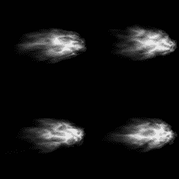
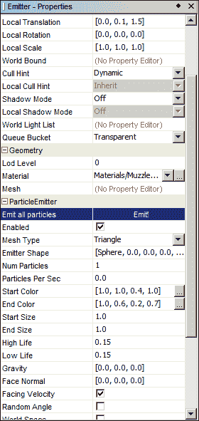
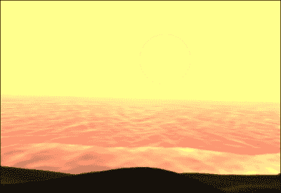
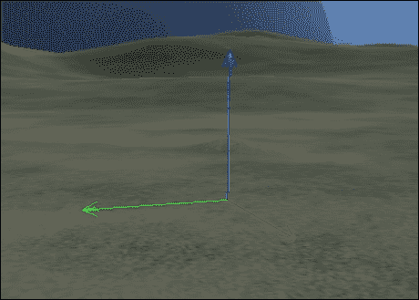

# 第九章. 将我们的游戏提升到下一个层次

在本章中，我们将涵盖以下主题：

+   使用 ParticleEmitter 创建枪口闪光

+   创建触发器系统

+   创建计时器触发器

+   添加交互触发器

+   使用触发器控制 AI

+   创建一个带有移动太阳的动态天空盒

+   使用后处理过滤器改善场景

+   使用 MotionPaths 执行复杂动作

+   使用电影制作镜头

+   使用位置音频和环境效果

# 简介

因此，核心机制已经到位，游戏可玩，但仍然感觉游戏缺少一些东西。在本章中，我们将探讨不同的方法来增强游戏，并将一些其他章节中的食谱融合在一起。

# 使用 ParticleEmitter 创建枪口闪光

某种类型的武器是许多游戏中的常见特性，枪口闪光在开火时极大地增强了外观和感觉。这个食谱将展示如何通过调整 ParticleEmitter 的属性来创建看起来不错的枪口闪光。以下截图显示了一个包含四个枪口闪光的纹理：



## 准备工作

在我们开始对 ParticleEmitter 进行工作之前，需要准备两件事：

+   首先，我们需要一个枪口闪光的纹理。这可以是从一个到几个枪口闪光图像。纹理应该是灰度图。我们将使用`ParticleEmitter`添加颜色。

+   其次，我们需要通过以下步骤创建一个`Material`，使用纹理：

    1.  在你的项目材质文件夹上右键单击并选择**新建.../Empty Material file**。

    1.  选择**Particle.j3md**作为**材质定义**。

    1.  然后选择枪口闪光纹理作为**纹理**。

## 如何做到这一点...

现在，我们可以开始创建枪口闪光发射器：

1.  导航到项目中的**发射器**文件夹并选择**新建.../Empty jme3 Scene**。我们现在应该有一个新的场景。

1.  在**场景浏览器**窗口中的主节点上右键单击并选择**添加空间/粒子发射器**。

1.  选择发射器实例并打开**属性**窗口。

1.  确保将**阴影模式**选项设置为**关闭**，并将**队列桶**设置为**透明**。

1.  然后，在**几何/材质**部分选择我们创建的枪口闪光材质。

1.  使**发射器**形状非常小，例如，例如`[Sphere, 0.0, 0.0, 0.0, 0.05]`。

1.  **粒子数**应该是`1`，而**每秒粒子数**应该是`0.0`。

1.  将**起始颜色**设置为类似`[1.0, 1.0, 0.4, 1.0]`的东西，并将**结束颜色**设置为`[1.0, 0.6, 0.2, 0.7]`。

1.  **起始大小**和**结束大小**都应该设置为`1.0`。

1.  **高生命值**和**低生命值**应该是`0.15`。

1.  **重力**和**面向法线**应该是`[0.0, 0.0, 0.0]`。

1.  打开**面向速度**复选框并将**初始速度**设置为`[0.0, 0.0, 1.0]`。

1.  **图像 X**和**图像 Y**应该反映我们创建的纹理中的帧数。

1.  我们现在可以通过点击**Emit!**按钮来测试发射器。

所有这些值都可以在以下屏幕截图中看到：



## 它是如何工作的...

闪光灯基本上就像一个普通的`ParticleEmitter`，但有几个例外。它不会输出恒定的粒子流，而只会发射一个。这是因为**粒子数量**设置为`1`，这意味着在任何给定时间只能有一个粒子是活跃的。**每秒粒子数**为`0.0`，所以它不会连续发射任何东西。

颜色设置为黄色调，在寿命结束时略微变橙并逐渐变淡；在这种情况下，寿命非常短，只有 0.15 秒。

闪光灯只向一个方向发射。这就是为什么我们将**面向速度**设置为`true`，这样粒子就会指向速度的方向。

使其在与武器的正确位置出现可能需要一些调整。使用**局部平移**可以帮助我们做到这一点。

要在武器上使用闪光灯，请打开**场景编辑器**中的目标，然后在闪光灯上选择**场景链接**。这样就可以修改原始文件，并且更改将自动出现在使用它的地方。

## 还有更多...

现在我们已经有了闪光灯并将其添加到武器中，我们可以通过以下步骤创建一个控制，以便在游戏中使用它：

1.  创建一个名为`WeaponControl`的新类，它扩展了`AbstractControl`。

1.  添加一个名为`muzzleFlash`的`ParticleEmitter`字段。

1.  在`setSpatial`方法中，检查提供的空间是否具有合适的子空间，无论是通过类型还是名称（需要闪光灯有一个固定的名称），并设置`muzzleFlash`字段：

    ```java
    muzzleFlash = (ParticleEmitter) ((Node)spatial).getChild("MuzzleFlash");
    ```

1.  现在，我们创建一个公开的`onFire`方法并添加以下内容：

    ```java
    if(muzzleFlash != null){
      muzzleFlash.emitAllParticles();
    }
    ```

然后，这个控制应该添加到游戏中的武器空间内，并且每当武器开火时都应该调用`onFire`。这个类适合播放声音，并跟踪弹药。

# 创建一个触发系统

几乎所有以故事驱动的游戏都需要某种系统来触发某种事件，例如对话、敌人或门打开。除非游戏非常小，否则通常不希望硬编码这些。以下配方将描述一个触发系统，它可以用于几乎任何类型的游戏，从 FPS 到 RTS 和 RPG。

我们将首先通过一个控制所有脚本对象和`Trigger`类基本功能的`AppState`来打下基础。然后，我们将探讨如何实际激活触发器并使用它。

## 准备工作

在开始实际实现之前，我们创建了一个小接口，我们将用它来处理各种脚本场景。我们称之为`ScriptObject`，它应该有以下三个方法：

```java
void update(float tpf);
void trigger();
voidonTrigger();
```

## 如何做...

现在，我们可以在一个名为`Trigger`的类中实现`ScriptObject`。这将包括六个步骤：

1.  将以下字段添加到`Trigger`类中：

    ```java
    private boolean enabled;
    private float delay;
    private boolean triggered;
    private float timer;
    private HashMap<String, ScriptObject> targets;
    ```

1.  `enabled`和`delay`字段应该有 getter 和 setter，`targets`应该有一个公开可用的`addTarget`和`removeTarget`方法。

1.  在`trigger`方法中，我们添加以下功能：

    ```java
    If enabled is false it shouldn't do anything.
    Otherwise timer should be set to 0 and triggered to true.
    ```

1.  如果在`update`方法中启用了脚本，我们应该执行以下步骤：

    1.  如果`triggered`为`true`且延迟大于 0，计时器应该通过 tpf 增加。

    1.  然后，如果计时器超过或等于延迟，它应该调用`onTrigger()`。

1.  如果延迟为 0 且`triggered`为`true`，计时器也应该调用`onTrigger()`。

1.  在`onTrigger`方法中，我们应该遍历`targetsMap`的所有值并调用它们上的触发器。然后`triggered`应该设置为`false`。

现在，执行以下步骤来控制`Trigger`类。

1.  我们定义了一个名为`ScriptAppState`的新类，该类继承自`AbstractAppState`。

1.  它应该有一个名为`scriptObjects`的`List<ScriptObject>`，以及添加和从`List`中删除 ScriptObjects 的方法。

1.  在`update`方法中，如果`isEnabled()`为`true`，它应该解析`scriptObjects`并对所有 ScriptObjects 调用更新。

现在，我们有一个灵活的系统，其中一个`ScriptObject`可以触发另一个。尽管如此，我们仍然缺少输入和输出效果。触发事件的一种常见方式是当玩家进入一个区域时。所以，让我们继续添加这个功能，通过执行以下步骤：

1.  创建一个名为`EnterableTrigger`的新类，该类继承自`Trigger`。

1.  这个触发器需要一个名为`position`的`Vector3f`字段来定义它在物理世界中的位置，以及一个 getter 和 setter。

1.  添加一个名为`volume`的`BoundingVolume`字段。在这个字段的`setter`方法中，我们应该调用`volume.setCenter(position)`。

1.  此外，它需要一个名为`actors`的`List<Spatial>`以及`add`和`remove`方法。

1.  现在，我们应该重写`update`方法，然后如果`actors`列表中的任何项目在`volume`内部，就调用触发器。

    ```java
    if(isEnabled() && volume != null && actors != null){
      for(int i = 0; i<actors.size(); i++ ){
        Spatial n = actors.get(i);
        if(volume.contains(n.getWorldTranslation())){
          trigger();
        }
      }
    }
    ```

1.  我们已经处理了触发。现在，让我们通过创建一个名为`SpawnTarget`的新类并实现`ScriptObject`来实际使用这个触发器。

1.  与`EnterableTrigger`类类似，`SpawnTarget`类需要一个`position`字段，还有一个名为`rotation`的`Quaternion`字段。

1.  `SpawnTarget`类还需要一个名为`target`的`Spatial`字段和一个名为`triggered`的布尔字段，以知道它是否已经被触发过。

1.  我们还应该添加一个名为`sceneNode`的`Node`字段，以便将目标附加到它。

1.  在`trigger`方法中，我们应该检查它是否已经被触发。如果没有，我们应该将`triggered`设置为`true`并调用`onTrigger`。

1.  `onTrigger`方法应该将位置和旋转应用到目标并将其附加到`sceneNode`。根据实现方式，我们可能想要从我们应用的价值中减去`worldTranslation`和`worldRotation`值。

    ```java
    target.setLocalTranslation(position);
    target.setLocalRotation(rotation);
    sceneNode.attachChild(target);
    ```

让我们看看另一个常见的可捡起游戏对象。在许多游戏中，角色可以通过走过它们简单地捡起各种增强武器或其他物品。本节将包含以下八个步骤：

1.  我们创建了一个名为`Pickup`的新类，它扩展了`Trigger`类。

1.  与`EnterableTrigger`类似，`Pickup`类需要一个位置和一个名为`actors`的`List<Spatial>`。我们还需要添加一个名为`triggeringActor`的`Spatial`字段和一个名为`triggeringDistance`的浮点数。

1.  对于这个类，我们还需要一些可以捡起的东西，这里通过一个名为`Pickupable`的接口来表示。此外，我们需要通过一个名为`pickedUp`的布尔值来跟踪它是否已经被捡起。

1.  我们之前使用的 ScriptObjects 与当前的 ScriptObjects 之间的区别在于，本食谱中的 ScriptObjects 应该在世界中可见，由一个名为`model`的`Spatial`表示。

1.  在`update`方法中，我们应该检查`Pickup`对象是否启用并且没有被`pickedUp`。

1.  为了在游戏世界中让它稍微突出一点，我们通过应用`model.rotate(0, 0.05f, 0)`值稍微旋转一下模型。

1.  仍然在`if`子句中，我们检查`actors`是否不为 null，并遍历列表。如果任何 actor 位于`triggerDistance`半径内，我们将它设置为`triggeringActor`并调用`trigger`方法：

    ```java
    for(int i = 0; i<actors.size(); i++ ){

      Spatial actor = actors.get(i);
      if((actor.getWorldTranslation().distance(position) <triggerDistance)){
        triggeringActor = actor;
        trigger();
      }
    }
    ```

1.  最后，在`onTrigger`方法中，我们应该将`pickedUp`设置为`true`，将`model`从场景图中分离，并调用`pickupObject.apply(triggeringActor)`以执行`Pickupable`对象应该执行的操作。

## 它是如何工作的...

`Trigger`类具有相当简单的功能。它将等待某个东西调用它的`trigger`方法。

当这种情况发生时，它将立即触发所有连接的 ScriptObjects，或者如果设置了延迟，它将开始计时，直到时间过去然后执行触发。一旦完成，它将被设置为可以再次触发。

`ScriptAppState`状态是控制脚本的一种方便方式。由于`AppState`要么是禁用的，要么没有附加到`stateManager`，因此在`ScriptObjects`中没有调用`update`。这样，我们可以轻松地禁用所有脚本。

为了创建一个带有`Trigger`的工作示例，我们将其扩展为一个名为`EnterableTrigger`的类。`EnterableTrigger`类的想法是，如果任何提供的 actor spatial 进入其`BoundingVolume`实例，那么它应该触发与之连接的任何内容。

基本的`Trigger`方法不需要位置，因为它是一个纯粹逻辑的对象。然而，`EnterableTrigger`对象必须与物理空间有关，因为它需要知道何时有 actor 进入其`BoundingVolume`实例。

这同样适用于`SpawnTarget`，除了位置外，它还应有一个旋转，以将潜在的敌人旋转到特定方向。在游戏中生成角色或物品通常用于控制游戏流程并节省性能。`SpawnTarget`选项通过仅在触发时添加新的`spatial`来实现这种控制。

如何执行生成可能因实现而异，但这里描述的方法假设它涉及将目标`Spatial`附加到主节点树中，这通常会激活其更新方法和控制。

同样，场景图的`rootNode`不一定是最合适的选择来附加目标，这很大程度上取决于游戏架构。它可以是一个任意的`Spatial`。

最后，在这个配方中，我们创建了一个`Pickup`对象，这在许多游戏中非常常见。这些可以是任何增加生命值、武器或其他装备，这些装备被添加到库存中。在许多情况下，它与`EnterableTrigger`类似，但它只需要一个半径来判断某人是否在拾取范围内。我们跟踪进入它的演员，以便我们知道将拾取应用于谁。在这个配方中，拾取由一个称为`Pickupable`的对象表示。

一旦拾取，我们将`pickedUp`设置为`true`，这样它就不能再次被拾取，并从节点树中分离模型以使其消失。如果它是一个重复的增强，可以使用延迟在一段时间后再次使其可用。

游戏中的拾取物品通常在游戏世界中突出显示，以吸引玩家的注意。这种做法取决于游戏风格，但在这里，我们在每次调用`update`方法时对其应用一个小旋转。

由于`Pickup`也扩展了`Trigger`，因此可以使用它来触发其他事物！

# 创建计时器触发器

在*创建触发系统*的配方中，我们为`Trigger`系统奠定了基础，并创建了一些基本实现。在创建依赖于时间或顺序事件的复杂脚本时，计时器非常有用。它不仅执行明显的操作（触发门的爆炸然后士兵通过），还可以作为多个同时触发事件的接力触发器。在这个配方中，我们将创建这个`Timer`对象以及其实际实现，其中它通过几个组件触发爆炸。为了节省时间，我们将使用 jMonkeyEngine 的`TestExplosion`测试来免费设置`ParticleEmitters`和计时。我们还将创建一个新的`ScriptObject`，称为`PlayEffect`，它控制粒子发射器。

## 如何做...

为了能够从我们的脚本系统中控制`ParticleEmitter`对象，我们需要一个新的类来处理`ParticleEmitter`对象：

1.  首先，创建一个名为`PlayEffect`的新类，该类实现了`ScriptObject`。

1.  `PlayEffect` 类需要一个名为 `emitAllParticles` 的布尔值，一个名为 `effect` 的 `ParticleEmitter` 字段，以及一个布尔值来控制是否启用（默认设置为 `true`）。

1.  `trigger` 方法应该在对象启用时调用 `onTrigger`。

1.  `onTrigger` 方法应该启用 `effect`，如果 `emitAllParticles` 是 `true`，则应该调用 `emitter.emitAllParticles()`。

除了设置器方法之外，这就是 `PlayEffect` 类所需的所有内容。现在，我们可以通过以下步骤查看 `Timer` 类：

1.  我们创建一个新的类 `Timer`，该类实现了 `ScriptObject`。

1.  它将使用简单的回调接口来跟踪事件：

    ```java
    public interface TimerEvent{
      public Object[] call();
    }
    ```

1.  它需要两个布尔字段。一个名为 `enabled`，另一个名为 `running`。它还需要使用三个浮点数 `time`、`lastTime` 和 `maxTime` 来跟踪时间。

1.  最后，我们将事件存储在 `HashMap<Float, TimerEvent>` 中。

1.  我们需要一个方法来向计时器添加事件。命名为 `addTimerEvent`，并添加 `time` 秒的输入来执行事件，以及一个包含执行代码的 `TimerEvent` 对象。在将 `TimerEvent` 放入 `timerEvents` 映射后，我们检查提供的 `time` 值是否高于当前的 `maxTime`，如果是，则将 `maxTime` 设置为 `time`，如下面的代码所示：

    ```java
    public void addTimerEvent(float time, TimerEvent callback){
      timerEvents.put(time, callback);
      if(time >maxTime ){
        maxTime = time;
      }
    }
    ```

1.  `trigger` 方法应该在启用时调用 `onTrigger`。

1.  `onTrigger` 方法应将时间设置为 `0` 并将 `running` 设置为 `true`。

1.  `update` 方法应该首先检查 `Timer` 是否 `enabled` 和 `running`。

1.  如果是，则将 tpf 添加到时间中。

1.  在 `same` 语句内部，我们根据 `timerEvents` 的 `keySet` 创建一个迭代器，并遍历它。如果键（一个浮点数）大于 `lastTime` 并且小于或等于当前时间，我们应该从 `timerEvents` 映射中获取相应的值并执行它。否则，如果键小于 `lastTime`，我们应该继续使用以下代码：

    ```java
    Iterator<Float> it = timerEvents.keySet().iterator();
    while(it.hasNext()){
      float t = it.next();
      if(t >lastTime&& t <= time){
        TimerEvent event = timerEvents.get(t);
        if(event != null){
          event.call();
        }
      } else if(t <lastTime){
        continue;
      }
    }
    ```

1.  在前面的循环之外，我们检查 `time` 是否大于 `maxTime`，如果是，则将 `running` 设置为 `false`。

1.  最后在 `update` 方法中，我们将 `lastTime` 设置为等于 `time`。

基本逻辑完成后，让我们看看如何使用计时器进行实际操作，并按照以下步骤通过触发爆炸来实现：

1.  从 jMonkeyEngine 的测试包中复制 `TestExplosion` 类，并从中移除除了创建 `ParticleEmitters` 的方法和在 `simpleInitApp` 中使用它们的行之外的所有内容，该行设置了相机。

1.  然后，为每个 `ParticleEmitters` 创建一个 `PlayEffect` 实例，并相应地设置效果，将 `emitAllParticles` 设置为 `true`。

1.  创建一个名为 `explosionTimer` 的新 `Timer` 实例。

1.  在时间 0 添加一个新的 `TimerEvent`，触发 `flash`、`spark`、`smoke`、`debris` 和 `shockwave` 效果，通过在 `PlayEffects` 的每个实例上调用 `trigger()`，如下面的代码所示：

    ```java
    explosionTimer.addTimerEvent(0, new Timer.TimerEvent() {

      public Object[] call() {
        flashEffect.trigger();
        sparkEffect.trigger();
        ...
        return null;
      }
    });
    ```

1.  然后，在时间 `0.05f` 处添加另一个 `TimerEvent`，触发 `flame` 和 `roundSpark` 效果。

1.  最后一个 `TimerEvent` 应该在时间 `5f` 时发生，并且应该在所有效果上调用 `stop()`。

1.  最后，我们创建一个 `ScriptAppState` 实例，向其中添加 `explosionTimer`，然后使用以下代码将其添加到 `stateManager`：

    ```java
    ScriptAppStateappState = new ScriptAppState();
    stateManager.attach(appState);
    appState.addScriptObject(explosionTimer);
    ```

1.  现在，我们可以触发 `explosionTimer`。它应该以与 `TestExplosion` 相同的方式执行爆炸。

## 它是如何工作的...

一旦触发，`Timer` 通过检查自启动以来经过的时间（`time`）来工作。然后，它检查 `timerEvents` 映射中的每个事件，以查看它们的执行时间是否在当前时间和最后时间（`lastTime`）之间。`maxTime` 选项被 `Timer` 用于知道何时已执行其最后的事件，并可以关闭自己。如果 `Timer` 只打算使用一次，则可以简单地从 `timerEvent` 映射中删除事件。这样就可以重复使用。

`PlayEffect` 实例具有相当简单的功能来打开和关闭它。由于 `ParticleEmitters` 可以有两种使用方式，一次发射所有粒子，或发射粒子的连续流，因此它需要知道如何发射。

在示例应用程序中，我们创建 `ScriptAppState`，因为它需要用经过的时间更新 `Timer`。我们不需要添加 `PlayEffect` 实例，因为它们不使用 `update` 方法。

# 添加交互触发器

另一个常见的触发器是要求玩家执行动作的情况。例如，你可以用它来打开门，或访问游戏内的商店系统或对话框。

## 如何做到这一点...

1.  我们首先创建一个名为 `InteractionTrigger` 的新类，它扩展了 `Trigger` 并实现了 `ActionListener`。

1.  `InteractionTrigger` 类需要一个名为 `position` 的 `Vector3f` 字段，一个名为 `volume` 的 `BoundingVolume` 字段，一个名为 `player` 的 `Spatial` 字段，以及一个名为 `inside` 的 `boolean` 字段。

1.  此外，`InteractionTrigger` 类需要访问应用程序的 `guiNode`，我们将其存储在具有相同名称的 `Node` 字段和一个名为 `interactionPrompt` 的 `BitmapText` 字段中。当可以进行交互时，将显示文本。

1.  我们还必须在类中或 `input manager` 类中定义一个静态字符串 `INTERACTION_KEY = "Interact"`。

1.  `update` 方法将检查玩家是否在 `BoundingVolume` 内。如果是，并且 `inside` 为 `false`，则显示 `interactionPrompt`。另一方面，如果 `inside` 为 `true` 且玩家不在 `BoundingVolume` 内，则将其移除，如下面的代码所示：

    ```java
    Boolean contains = volume.contains(player.getWorldTranslation());
    if(!inside && contains){
      guiNode.attachChild(interactionPrompt);
    } else if (inside && !contains){guiNode.detachChild(interactionPrompt);
    }
    inside = contains;
    ```

1.  在实现的 `onAction` 方法中，我们检查与 `INTERACTION_KEY` 对应的键何时被释放。然后，我们查看触发器是否启用以及 `inside` 是否为 `true`。如果两者都为 `true`，则调用 `trigger()`。

1.  需要在类外实现一些逻辑才能使触发器工作。除了向触发器提供`guiNode`和`BitmapText`之外，还需要将`INTERACTION_KEY`绑定到`inputManager`。这可以通过以下行完成：

    ```java
    inputManager.addMapping(INTERACTION_KEY, new KeyTrigger(KeyInput.KEY_SPACE));
    ```

1.  `InteractionTrigger`实例还需要被添加为`inputManager`的监听器：

    ```java
    inputManager.addListener(interactionTrigger, mappingNames);
    ```

## 它是如何工作的...

`InteractionTrigger`实例与我们在*创建触发器系统*配方中创建的`EnterableTrigger`有几个共同点，它还具有新的功能。它不是在玩家进入时立即触发触发器，而是设置`inside`标志，该标志定义了是否可以与之交互。它还在玩家的 GUI 上显示文本。

一旦`InteractionTrigger`从`InputManager`收到对其`onAction`方法的调用，它会检查`inside`是否为`true`并调用`trigger`。为了提高你对如何处理输入的知识，请查看第二章，*相机和游戏控制*。

# 使用触发器控制 AI

第五章，*人工智能*，讨论了在游戏中控制 AI 的几种方法。正如我们在那一章中学到的，控制和可预测性非常重要。即使我们拥有世界上最聪明的 AI，作为程序员，我们仍然希望能够知道 AI 将在某个时间执行某个动作。这就是触发器可以极其有用的地方。事实上，有了好的触发系统，可能根本不需要太多的 AI。

触发器使用的一个例子可能是一个仓库，守卫处于巡逻状态。一旦玩家到达某个区域（可能是不应该去的地方），就会触发警报。此时，我们还想让守卫切换到更具有侵略性的状态。

## 准备工作

本配方将把我们在本章中之前创建的触发器系统与基于状态机的`AIControl`类链接起来，该类来自第五章，*人工智能*中的*决策制定 – 有限状态机*配方。即使你没有遵循第五章，*人工智能*中的配方，但有一个不同的类控制 AI，也应该很容易将此配方适应以适应该类。

## 如何实现...

与前面的例子一样，我们首先创建一个新的类，该类扩展了`ScriptObject`接口。我们可以将其命名为`AIScriptControl`。

1.  需要有一个名为`aiControl`的`AIControl`字段和一个名为`targetState`的`Class<AIState>`字段。

1.  它可能还有一个名为`target`的`Spatial`。

1.  最后，我们添加一个名为`enabled`的布尔值。

1.  在其`trigger`方法中，如果`enabled`为`true`，我们应该调用`onTrigger`。

1.  在`onTrigger`方法中，我们将`targetState`应用于`aiControl`：

    ```java
    aiControl.setState(targetState);
    ```

1.  如果`target`不为空，我们调用`aiControl.setTarget(target)`。

1.  我们创建的`AIControl`的`StateMachine`是一个封闭系统，它不需要任何外部输入来改变状态。现在，我们需要能够从外部触发它，所以让我们在`AIControl`中添加一个 setter 方法。创建一个名为`setState`的新方法，它接受一个名为`state`的`Class<AIState>`作为输入参数。

1.  在内部，我们检查`spatial`是否具有提供的状态，并在可能的情况下启用它：

    ```java
    if(spatial.getControl(state) != null){
    spatial.getControl(state).setEnabled(true);
    }
    ```

## 它是如何工作的...

这个菜谱遵循我们在*创建触发系统*菜谱中建立的模式。在`onTrigger`方法中，我们应用`targetState`，这将改变 AI 的行为和动作。例如，它可以从`PatrolState`变为`AttackState`。我们只提供类类型，而不是整个类的实例，因为 AI 应该已经有了状态，并且可能已经配置好了。这样，我们告诉 AI 如果可用，就简单地改变状态。我们还有一个`target`字段，以防新状态需要它。

## 还有更多...

它不必以这种方式结束。例如，我们可以通过一些修改触发 AI 开始行走路径、转向特定方向或掩护等。这种功能可以集成到这个类中，或者作为独立的类来实现。

为了详细探索一个示例，让我们看看在`AIScriptControl`被触发后，AI 移动到特定位置需要什么。

1.  我们需要一个`AIState`，用于处理移动到指定位置。第五章*人工智能*解释了这一点。`SeekCoverState`可以轻松修改，使其只包含一个`target`字段，而不是一个可供选择的列表。

1.  我们需要一个作为航标或目标的东西。同样，来自同一菜谱的`CoverPoint`控件也可以作为航标使用。它还可以扩展，以便在`WayPoint`中使用掩护成为类中的一个选项。

1.  最后，我们需要将`WayPoint`传递给状态。由于我们没有提供整个类，我们无法在`AIState`本身中设置它。一种方法是通过`AIControl`的`setTarget`方法传递它。

# 创建带有移动太阳的动态天空盒

我们在第一章*SDK 游戏开发中心*中介绍了如何创建静态天空盒。虽然它们适用于许多实现，但有些游戏需要昼夜循环。

## 准备中

这个菜谱将向我们展示如何创建一个移动的太阳，它可以叠加在常规天空盒上。在这种情况下，一个没有突出特征（如山脉）的中性天空盒将工作得最好。我们还将学习如何制作一天中改变颜色的天空。在这种情况下，不需要天空盒。

我们还需要一个纹理，它应该有一个透明的背景，其中包含一个填充的白色圆圈，如图所示：



## 如何做到这一点...

1.  我们首先创建一个新的应用程序类，它扩展了`SimpleApplication`。

1.  在`simpleInitApp`方法中，我们首先需要为太阳创建`Geometry`：

    ```java
    Geometry sun = new Geometry("Sun", new Quad(1.5f, 1.5f));
    ```

1.  我们需要在其上设置一些渲染提示，如下面的代码所示：

    ```java
    sun.setQueueBucket(RenderQueue.Bucket.Sky);
    sun.setCullHint(Spatial.CullHint.Never);
    sun.setShadowMode(RenderQueue.ShadowMode.Off);
    ```

1.  现在，我们可以根据无阴影材质定义加载一个`Material`实例。

1.  对于`ColorMap`，我们加载包含白色圆圈的纹理并应用该纹理。然后，对于`Color`，我们可以设置一个几乎为白色但带有黄色色调的颜色。我们还需要在材质中启用 alpha：

    ```java
    sunMat.getAdditionalRenderState().setBlendMode(RenderState.BlendMode.Alpha);
    sunMat.setTexture("ColorMap", assetManager.loadTexture("Textures/sun.png"));
    sunMat.setColor("Color", new ColorRGBA(1f, 1f, 0.9f, 1f));
    ```

因此，基本的`Geometry`已经设置好，我们可以创建一个`Control`类，通过以下步骤在天空移动太阳：

1.  创建一个名为`SunControl`的类，它扩展了`AbstractControl`。

1.  它应该有一个名为`time`的`float`字段，一个指向应用程序摄像机的引用`cam`，一个名为`position`的`Vector3f`字段，以及一个名为`directionalLight`的`DirectionalLight`字段。

1.  在`controlUpdate`方法中，我们首先根据时间找到`x`和`z`位置，并将结果乘以一定的距离来移动太阳。我们也可以通过同样的方式对`y`值进行操作，使太阳上下移动：

    ```java
    float x = FastMath.cos(time) * 10f;
    float z = FastMath.sin(time) * 10f;
    float y = FastMath.sin(time ) * 5f;
    position.set(x, y, z);
    ```

1.  然后，我们应该设置太阳的`localTranslation`。由于我们希望它看起来非常远，我们添加了摄像机的位置。这样，它将始终看起来与摄像机保持相同的距离：

    ```java
    spatial.setLocalTranslation((cam.getLocation().add(position)));
    ```

1.  我们还希望太阳始终面向摄像机。这可以通过调用以下代码轻松实现：

    ```java
    spatial.lookAt(cam.getLocation(), Vector3f.UNIT_Y);
    ```

1.  如果设置了`directionalLight`字段，我们还应该设置其方向。我们通过反转`position`来获取方向，如下面的代码所示：

    ```java
    directionalLight.setDirection(position.negate());
    ```

1.  最后，我们将`time`值增加一个因子`tpf`（取决于我们希望太阳移动得多快）。由于两个 PI 弧度组成一个圆，因此当`time`超过该值时，我们使用以下代码重新开始：

    ```java
    time += tpf * timeFactor;
    time = time % FastMath.TWO_PI;
    ```

1.  回到`application`类，我们将控制添加到太阳的`Geometry`和场景图中：

    ```java
    sun.addControl(sunControl);
    rootNode.attachChild(sun);
    ```

之前的实现对于许多游戏来说可能已经足够，但它可以做得更多。让我们探索如何根据太阳在水平线以上的高度动态调整太阳颜色，以及如何通过以下步骤动态调整天空颜色：

1.  首先，让我们在`SunControl`类中引入两个静态`ColorRGBA`字段，分别称为`dayColor`和`eveningColor`。我们还添加另一个名为`sunColor`的`ColorRGBA`字段。

1.  在`controlUpdate`方法中，我们取太阳的`y`值并对其进行除法处理，使其得到一个介于`-1`和`1`之间的值，并将其存储为高度。

1.  `ColorRGBA`有一个方法可以插值两种颜色，我们可以使用它来在白天得到平滑的过渡：

    ```java
    sunColor.interpolate(eveningColor, dayColor, FastMath.sqr(height));
    ```

1.  之后，我们将`directionalLight`的颜色设置为与`sunColor`相同，并将材质的`Color`参数也设置为相同：

    ```java
    directionalLight.setColor(sunColor);
    ((Geometry)spatial).getMaterial().setColor("Color", sunColor);
    ```

处理天空颜色需要更多的工作。为此，请执行以下步骤：

1.  我们首先创建一个名为`SkyControl`的新类，它扩展了`AbstractControl`。

1.  与`SunControl`类似，`SkyControl`类需要一个名为`cam`的`Camera`字段。它还需要一个名为`color`的`ColorRGBA`字段以及三个用于一天中不同时间的静态`ColorRGBA`字段：

    ```java
    private static final ColorRGBA dayColor = new ColorRGBA(0.5f, 0.5f, 1f, 1f);
    private static final ColorRGBA eveningColor = new ColorRGBA(1f, 0.7f, 0.5f, 1f);
    private static final ColorRGBA nightColor = new ColorRGBA(0.1f, 0.1f, 0.2f, 1f);
    ```

1.  `SkyControl`类需要了解太阳的位置，因此我们添加了一个名为`sun`的`SunControl`字段。

1.  在`controlUpdate`方法中，我们将空间体的`localTranslation`设置为`cam`的位置。

1.  接下来，我们获取太阳的高度，如果它高于 0，我们在`eveningColor`和`dayColor`之间插值颜色。否则，我们将在`eveningColor`和`nightColor`之间插值。然后，我们将结果颜色设置在天空材料的`Color`参数中，如下面的代码所示：

    ```java
    if(sunHeight> 0){
      color.interpolate(eveningColor, dayColor, FastMath.pow(sunHeight, 4));
    } else {
      color.interpolate(eveningColor, nightColor, FastMath.pow(sunHeight, 4));
    }
    ((Geometry)spatial).getMaterial().setColor("Color", color);
    ```

1.  回到`application`类，我们创建了一个名为`sky`的盒子形状的`Geometry`。

1.  用于控制具有`10f`边的形状。

1.  与太阳几何形状类似，天空应该应用 Sky `QueueBucket`、`ShadowMode.Off`和`CullHint.Never`设置。

1.  此外，我们还应该调用`getAdditionalRenderState`并将`FaceCullMode`设置为`FaceCullMode.Off`。

## 它是如何工作的...

总是使这个食谱中的几何形状跟随相机移动是使这个食谱工作的一部分原因。另一个技巧是使用 Sky `QueueBucket`。Sky `QueueBucket`可以被视为要渲染的项目列表。Sky 桶中的所有内容都会首先渲染。因为它首先渲染，所以其他东西将渲染在其上方。这就是为什么它看起来很遥远，尽管它实际上非常接近相机。

我们还使用从相机到太阳的方向为场景中的`DirectionalLight`设置，使其随着太阳在天空中的移动而移动。

在更新控制时，我们使用`time`值处理太阳的运动，该值在每次更新时增加。使用`FastMath.sin`和`FastMath.cos`为`x`和`z`值，使其在相机周围移动圆形。再次使用`FastMath.sin`为`y`值将使其在地平线以上（和以下）的弧线上移动。通过乘以`y`值，我们可以使其在天空中的高度更高。

结果位置被添加到相机的位置，以确保太阳始终位于相机中心。由于太阳是一个简单的四边形，我们还需要在每次更新时将其旋转以面向相机。

我们继续根据地平线以上的高度更改太阳的颜色。我们使用`ColorRGBA`的插值方法来完成此操作。插值需要一个介于`0.0`和`1.0`之间的值。这就是为什么我们需要将`y`值除以最大`y`值（或振幅），在之前将其乘以以获得更高天空弧度的情况下。

模拟天空的盒子运动类似。我们只需将其保持在相机中心，即使它是一个小盒子，它看起来也覆盖了整个天空。通常，当我们身处其中时，我们不会看到盒子的侧面，所以我们设置`FaceCullMode`为`Off`以始终渲染侧面。

`SkyControl`被配置了三个`ColorRGBA`实例，分别是带有蓝色调的`dayColor`，橙色调的`eveningColor`，以及几乎全黑的`nightColor`。`SunControl`被提供给控制器，并用于根据太阳的高度在颜色之间进行插值。任何大于`0.0f`的值都被认为是白天。

在这个实现中，整个天空随着太阳的颜色变化。`SkyControl`的任何进一步开发都可能包括一个更复杂的形状，例如圆柱体或球体，其中只有与太阳同侧的顶点颜色会改变。云可以实施，并且它们也使用一个在 xz 平面移动的四边形。

另一个改进是，在盒子外面有一个充满星星的夜晚天空盒，并逐渐降低`nightColor`的 alpha 值，让它逐渐在夜晚发光。

## 还有更多...

如果我们尝试使用天空的无阴影材质定义这个配方，在大多数情况下它都会工作得很好。然而，当涉及到后处理器水过滤器时，它将无法正确拾取天空颜色。为了实现这一点，我们可能需要对其材质进行一些修改。我们实际上不需要更改任何`.vert`或`.frag`文件，但可以创建一个新的`Material Definition (.j3md)`文件。

为了尽可能简化操作，我们可以复制`Unshaded.j3md`文件。请参考`Unshaded.j3md`文件内的以下代码：

```java
VertexShader GLSL100:   Common/MatDefs/Misc/Unshaded.vert
```

将上一行替换为以下行：

```java
VertexShader GLSL100:   Common/MatDefs/Misc/Sky.vert
```

这意味着我们将使用通常由天空材质使用的顶点着色器来处理渲染器的顶点位置。

我们还需要更改`WorldParameters`部分，使其包含以下内容：

```java
ViewMatrix
ProjectionMatrix
WorldMatrix
```

# 使用后处理过滤器改善场景

在*创建带有移动太阳的动态天空盒*配方中，我们创建了一个具有许多应用的动态天空盒。通过后处理过滤器，我们可以显著改善这个（以及任何其他）场景的外观。它们被称为后处理过滤器，因为它们是在场景渲染之后应用的。这也使得它们影响场景中的所有内容。

我们还介绍了如何在第一章 *SDK 游戏开发中心* 中创建高级后过滤器。

## 如何做到这一点...

我们现在的太阳正在天空中移动。它有非常锐利的边缘，我们可以使用布隆过滤器稍微平滑一下。执行以下步骤，通过后处理过滤器改善场景：

1.  首先，我们需要创建一个新的`FilterPostProcessor`实例，命名为`processor`。

1.  通过在应用程序中调用`viewPort.addProcessor(processor)`，将此添加到主视口中。

1.  然后，我们创建一个新的名为`bloomFilter`的布隆过滤器。默认设置会产生一个相当不错的成果，但可能值得稍微调整一下设置。

1.  将`bloomFilter`添加到`processor.addFilter(bloomFilter)`中，并再次尝试。

1.  然后，我们创建一个新的 `LightScatteringFilter` 实例，命名为 `lightScatteringFilter`，并将其再次添加到 `processor.addFilter(lightScatteringFilter)`。

1.  这取决于光散射的位置，因此我们需要让它知道太阳的位置。我们可以通过在 `SunControl` 类中添加一个新的字段以及一个设置器来实现这一点，该类来自上一个食谱。

1.  然后在 `controlUpdate` 方法中，一旦我们更新了 `position`，我们添加以下代码：

    ```java
    lightScatteringFilter.setLightPosition(position.mult(1000));
    ```

1.  我们仍然需要进行一些调整，因为现在当太阳在地面以下时，它也会应用这个效果。为了减轻这种情况，我们可以在夜间禁用过滤器：

    ```java
    if(y > -2f){
      if(!lightScatteringFilter.isEnabled()){
        lightScatteringFilter.setEnabled(true);
      }
      lightScatteringFilter.setLightDensity(1.4f);
    } else if(lightScatteringFilter.isEnabled()){
      lightScatteringFilter.setEnabled(false);
    }
    ```

## 它是如何工作的...

`FilterPostProcessor` 作为一个容器，用于存放过滤器并将它们应用于渲染结果。可以将多个过滤器添加到同一个处理器中，并且顺序很重要。如果我们先添加 `LightScatteringFilter`，然后再添加 `bloomFilter`，那么我们将得到应用于光散射的模糊效果，反之亦然。

`bloomFilter` 通过轻微模糊图像并增强颜色来实现效果，使得结果看起来更加柔和。Bloom 过滤器在调整后效果最佳，不应直接应用于场景。人们很容易被最初的效果所吸引，并就此停止，但应该始终适应游戏的美术风格。在一个魔法森林中的幻想游戏可能比一个冷酷的赛博朋克射击游戏更能容忍更多的模糊效果。

`LightScatteringFilter` 实例做两件事。首先，它从光源方向创建一束光晕。其次，如果相机指向光源，它将使图像逐渐变白，模拟眩光。

在一个正常的盒子中，太阳是静态的，但在这个例子中，太阳是移动的。通过将过滤器提供给 `SunControl`，我们可以在该类中保持更新位置的逻辑。我们还将得到一些奇怪的效果，因为眩光仍然会显示。一个简单的解决方案是在太阳低于地平线时简单地关闭效果。

# 使用 MotionPaths 进行复杂移动

自从游戏诞生以来，玩家就必须在移动平台上跳跃。即使在今天这些极其先进的游戏中，遇到这种最原始的游戏机制也并不罕见，尽管图形有所改进。还有一个流行的复古游戏类型，也要求这样做，至少对于移动游戏来说是这样。

在 jMonkeyEngine 中我们该如何实现？一种方法当然是简单地使用移动或 `setLocalTranslation` 对几何体进行操作。如果我们想要制作序列路径，这可能会很快变得复杂。一个更好的选择是使用 MotionPaths 和 MotionEvents。

`MotionPath` 对象基本上是一系列航点，通过这些航点，对象将以插值的方式移动，这意味着移动将是平滑的。`MotionEvent` 是一个控制类，它定义了对象何时以及如何沿着 `MotionPath` 对象移动。它可以定义对象在路径上如何旋转，以及路径是否以及如何循环。

在这个菜谱中，我们将探讨如何将它们用于游戏，这可能是一个横向卷轴 2D 游戏，但相同的原理也可以用来创建高级电影场景。

## 如何操作...

让我们先通过以下步骤创建一个可移动的平台对象：

1.  我们定义一个新的`Geometry`名为`platform`，并应用`Unshaded`材质，如下面的代码所示：

    ```java
    platform = new Geometry("Platform", new Box(1f, 0.1f, 1f));
    platform.setMaterial(new Material(assetManager, "MatDefs/Misc/Unshaded.j3md"));
    ```

1.  然后，我们将`platform`对象附加到`rootNode`上。

1.  接下来，我们定义一个新的名为`path`的`MotionPath`对象。

1.  我们使用以下代码以圆形模式添加 8 个航点：

    ```java
    for(inti = 0 ; i< 8; i++){
      path.addWayPoint(new Vector3f(0, FastMath.sin(FastMath.QUARTER_PI * i) * 10f, FastMath.cos(FastMath.QUARTER_PI * i) * 10f));
    }
    ```

1.  然后，我们调用`path.setCycle(true)`来使其连接第一个和最后一个航点。

1.  现在，我们可以定义一个新的名为`event`的`MotionEvent`，并在构造函数中提供`platform`和`path`。

1.  我们调用`event.setInitialDuration(10f)`和`setSpeed(1f)`。

1.  最后，我们调用`event.setLoopMode(LoopMode.Loop)`。

    使用红色航点调试 MotionPath

1.  可选地，我们可以通过调用以下方法来可视化路径：

    ```java
    path.enableDebugShape(assetManager, rootNode);
    ```

1.  现在，我们只需要调用`event.play()`来开始事件！

## 它是如何工作的...

`for`循环在彼此之间相隔 45 度的圆周上创建了八个航点。然而，为了形成一个完整的圆，第一个和最后一个航点需要连接，否则路径将在最后一个航点上停止。这就是为什么必须设置`setCycle(true)`。这被视为与第一个航点相同位置的第九个航点。

MotionEvent 的`initialDuration`是完成路径所需的时间。速度定义了`initialDuration`应该完成的因子。因此，将速度设置为 2f 将减半对象完成移动的实际时间。不出所料，`loopMode`定义了对象在完成路径后是否应该停止，或者继续。还有一个选项使用`LoopMode.Cycle`让它再次沿着相同的路径移动。这与 MotionPath 的`setCycle`方法无关。

虽然这个菜谱没有探索这个选项，但`MotionPath`中的空间可以执行各种类型的旋转。默认情况下，不会应用任何旋转。通过调用`setDirectionType`，例如，可以让对象跟随路径的旋转（面向路径的方向）或以固定量旋转或始终面向某个点。某些方向类型需要通过`setRotation`方法提供旋转。

## 还有更多...

现在，对象正沿着其给定的路径移动，我们可以添加几个以不同模式移动的平台。假设我们想在平台到达其路径的末端时发生某些事情。也许它应该启动下一个，或者从之前的菜谱中触发我们的 ScriptObjects。

在那种情况下，我们可以使用`MotionPathListener`。这是一个具有名为`onWayPointReached`的回调方法的接口，每次路径经过航点时都会被调用。它将提供`MotionEvent`和航点的`index`。如果我们想在路径的末端触发某些操作，代码片段可能如下所示：

```java
path.addListener(new MotionPathListener() {
  public void onWayPointReach(MotionEvent control, intwayPointIndex) {
    if (path.getNbWayPoints() == wayPointIndex + 1) {
      nextMotionEvent.play();
    }
  }
});
```

# 使用电影制作镜头场景

之前的菜谱探讨了使用`MotionPaths`移动对象的可能性。比那更进一步，以及组织一系列事件的方法是电影。它可以用来创建游戏中的脚本事件和高级镜头。一个精心编写的游戏事件的力量不应被低估，但也不应低估正确实现它所需的时间。

在这个菜谱中，我们将通过创建一个使用之前创建的内容的镜头场景来探索`Cinematics`系统的可能性。

## 准备工作

需要一些关于`MotionPaths`和`MotionEvents`的基本知识。查看*使用 MotionPath 执行复杂动作*菜谱应该提供足够的信息来开始。新引入的一个类是`Cinematic`类。这个类作为一个事件序列器或管理者，在设定的时间触发事件。事件不一定是`MotionEvents`，也可以是处理基于骨骼的动画的`AnimationEvents`、`SoundEvents`，甚至是`GuiEvents`。它还可以管理多个相机并在它们之间切换。

在开始实际实现电影场景之前，有一个描述将要发生什么的脚本是个好主意。这将有助于组织电影事件，并在最后节省时间。

本菜谱将使用来自第一章的`TestScene`，*SDK 游戏开发中心*。我们也可以使用本章早些时候的动画天空盒。它将显示杰伊迈从他的初始位置走到水边，眺望远方。在他行走的过程中，将发生几个切换到全景相机的动作。



使用空节点作为航点

为角色和相机找到好的航点可能已经足够困难，如果你必须全部用代码来完成，那就更不容易了。一个技巧是使用 SceneComposer 创建标记，就像真正的电影制作人使用胶带标记演员应该移动的位置一样。在场景节点上右键单击并选择**添加空间.../新建节点**将给我们一个不可见的标记。给它一个可识别的名称，并使用`移动`功能将其拖放到合适的位置。

## 如何操作...

因此，现在我们已经准备了一个带有一些航点的场景，我们可以通过执行以下步骤来实现镜头场景本身：

1.  我们首先加载一个场景，其中将播放`Cinematic`。场景引用将在几个地方使用，所以将其存储在一个字段中是个好主意。

1.  我们还将创建一个名为贾迈的 `Spatial` 字段，作为主要演员，要么从场景中加载他，要么提取他（取决于设置）。

1.  现在，我们可以为贾迈创建一个名为 `jaimePath` 的 `MotionPath` 实例。由于我们在 `SceneComposer` 中为每个航点创建了 `Nodes`，我们可以通过以下方式从场景中获取它们的位置：

    ```java
    jaimePath.addWayPoint(scene.getChild("WayPoint1").getWorldTranslation());
    ```

1.  我们继续创建一个名为 `jaimeMotionEvent` 的 `MotionEvent`，使用 `jaimePath` 和 25 秒的 `initialDuration`：

    ```java
    jaimeMotionEvent = new MotionEvent(jaime, jaimePath, 25f);
    ```

1.  如果贾迈面向他行进路径的方向，那就更好了，因此我们也设置 `directionType` 为 `MotionEvent.Direction.Path`。

在我们走得太远之前，我们想检查一下贾迈遵循的路径是否正确。因此，我们应该在这个时候创建一个 `Cinematic` 实例。为此，执行以下步骤：

1.  做这件事很简单，只需提供一个场景，这将影响 `rootNode` 以及整个电影的总时长：

    ```java
    cinematic = new Cinematic(scene, 60f);
    ```

1.  之后，我们添加以下 `MotionEvent`；0 是它应该开始的时间：

    ```java
    cinematic.addCinematicEvent(0, jaimeMotionEvent);
    ```

1.  我们还需要使用 `stateManager.attach(cinematic)` 将电影添加到应用程序的 `stateManager` 中。

1.  在这个时刻调用 `cinematic.play()` 应该会显示贾迈沿着路径滑动。

一旦我们对此满意，我们就可以继续进行以下相机工作：

1.  当我们调用 `cinematic.bindCamera("cam1", cam)` 时，`Cinematic` 实例会为我们创建一个 `CameraNode`，所以让我们为我们的第一个相机做这件事。这个字符串是 `Cinematic` 通过它来识别相机的引用。

1.  这将是一个平移的相机，因此我们为它创建一个 `MotionPath` 实例和一个 `MotionEvent` 实例。同样，我们可以从场景中获取相机路径的航点。由于我们在 `SceneComposer` 中添加的 `Node` 默认情况下会吸附到地面上，我们需要在 y 轴上添加 1.5f 到 2.0f 以达到合适的高度。

1.  当相机平移时，它应该看向一个固定点，因此我们将相机 `MotionEvent` 的 `directionType` 设置为 `LookAt`，然后通过 `cam1Event.setLookAt` 设置它应该看向的方向，其中第一个 `Vector3f` 是要查看的位置，第二个是 `Vector3f`，它在世界中是向上的：

    ```java
    cam1Event = new MotionEvent(camNode, camPath1, 5f);     cam1Event.setDirectionType(MotionEvent.Direction.LookAt);
    cam1Event.setLookAt(Vector3f.UNIT_X.mult(100), Vector3f.UNIT_Y);
    ```

1.  完成这些后，我们可以测试第一个相机的平移。我们通过调用以下代码来完成：

    ```java
    cinematic.activateCamera(0, "cam1");
    ```

1.  下一个相机将获得自己的 `MotionPath` 和 `MotionEvent` 实例，并且可以像第一个相机一样获得自己的 `CameraNode`。使用相同的物理相机为两个 `CameraNode` 是完全可以接受的。

现在，我们可以开始处理场景中缺少动画的问题。

1.  贾迈在场景中的第一件事是走向海滩。我们可以创建一个新的 `AnimationEvent` 实例，它使用 `Walk` 动画：

    ```java
    AnimationEventwalkEvent = new AnimationEvent(jaime, "Walk", LoopMode.Loop);
    ```

1.  然后，我们在 0 秒时将其添加到 `cinematic` 中：

    ```java
    cinematic.addCinematicEvent(0, walkEvent);
    ```

1.  当贾迈到达最后一个航点时，他应该停止，这也是 `jaimeMotionEvent` 结束的时候。因此，我们创建另一个带有空闲动画的 `AnimationEvent` 并将其添加到 `jaimeMotionEvent` 的持续时间末尾。

### 提示

在撰写本文时，似乎当它开始新的动画时，电影不会结束动画，因此我们必须自己做一些事情来停止它。使用 MotionPathListener，我们可以检查何时达到最后一个航点，并手动停止行走动画：

```java
jaimePath.addListener(new MotionPathListener() {
  public void onWayPointReach(MotionEventmotionControl, intwayPointIndex) {
    if(wayPointIndex == 2){
      walkEvent.stop();
    }
  }
});
```

## 它是如何工作的...

`Cinematic`充当所有不同事件的序列器，除了在定义的间隔处触发事件外，我们还可以使用`cinematic.enqueueCinematicEvent`。这样做将在上一个事件完成后立即启动提供的事件。如果我们想在一系列动画之后立即触发一系列动画，这很有用。Cinematics 也可以设置为循环或循环，就像`MotionEvents`一样，你不需要从时间 0 开始。

总之，使用电影并不是特别技术性。只是很难正确地获取所有位置、角度和时间，尤其是在脚本中不涉及智能或碰撞的情况下。然而，一旦你做到了，结果将会非常令人满意。

# 使用位置音频和环境效果

音频是一个极其强大的情绪营造者，在游戏中不应被忽视。在这个菜谱中，我们将介绍如何利用运行时效果和设置充分利用你的声音资产。如果你只是想寻找无处不在的声音或如何播放它们的基础知识，请查看第一章，*SDK 游戏开发中心*。

这个菜谱在 FPS 游戏中效果很好，其中当玩家移动时会有许多脚步声播放。然而，这个原理适用于任何经常播放以至于听起来重复的短声音。

我们将分两步来处理这个菜谱：

1.  首先，我们将学习如何改变一个基本且重复的声音。我们可以通过改变声音的音调和使用`LowPassFilter`来实现这一点。

1.  在第二步中，我们将使用混响进一步改变声音，这取决于场景。

## 如何做到这一点...

首先，我们需要设置一些基础知识。

1.  我们创建一个新的扩展`SimpleApplication`的应用程序，并添加一个名为`audioNode`的`AudioNode`字段。

1.  此外，我们还需要使用名为`time`的`float`字段和另一个名为`pauseTime`的`float`字段来跟踪经过的时间，我们将`pauseTime`设置为`0.7f`。

1.  在`simpleInitApp`方法中，我们创建一个新的`audioNode`实例：

    ```java
    new AudioNode(assetManager, "Sound/Effects/Foot steps.ogg");
    ```

1.  我们重写`simpleUpdate`方法，首先检查`time`是否大于`pauseTime`。

1.  如果是这样，我们应该设置一个新的名为`pitch`的`float`。这个值应该是`1f +- 10%`，以下代码可以实现：

    ```java
    FastMath.nextRandomFloat() * 0.2f + 0.9f.
    ```

1.  然后，我们调用`audioNode.setPitch(pitch)`来设置它。

1.  由于这个特定的声音文件按顺序播放四个脚步声，我们告诉节点不要从开头开始，而是通过在时间上跳过来只播放最后一个脚步声，以下代码如下：

    ```java
    audioNode.setTimeOffset(2.0f);
    audioNode.playInstance();
    ```

1.  在退出`if`语句之前，我们将`time`设置为`0`。

1.  最后，我们不应该忘记通过 tpf 增加`time`。

1.  现在尝试运行应用程序。我们应该会一遍又一遍地听到相同的声音，但略有变化。

1.  我们可以使用`LowPassFilter`进一步改变声音。我们通过提供一个浮点数作为一般音量和另一个作为高频音量来实例化它。为了获得最大的变化，我们可以提供介于 0f 和 1f 之间的两个随机值：

    ```java
    LowPassFilter filter = new LowPassFilter(FastMath.nextRandomFloat(), FastMath.nextRandomFloat());
    ```

1.  然后，我们在`audioNode.playInstance()`之前调用`audioNode.setDryFilter(filter)`。

1.  再次播放时，我们应该听到一个稍微变化的声音，偶尔会变得更闷。

反射是我们可以用于声音的另一个参数。但与前面的例子不同，每次播放时不应随机化（或者根本不随机化！）！我们可以通过以下步骤添加反射：

1.  在`simpleInitApp`方法中创建`Environment`的新实例，使用`Environment`类中预制的静态之一，并告诉应用程序的`audioRenderer`使用它：

    ```java
    Environment env = Environment.Cavern;
    audioRenderer.setEnvironment(env);
    ```

1.  再次运行此环境下的应用程序应该会给每个脚步声带来巨大的回声。

## 它是如何工作的...

在食谱的第一部分，我们通过每次播放时略微改变音高来改变单个声音。这听起来仍然会重复，建议有几种预制的声音变体，并使用这种技术与它们结合使用，以获得更多效果。

在撰写本文时，过滤器尚未开发到`LowPassFilter`以上，并且用途有限。它仍然可以用来减少声音的干燥感，使其听起来更闷，例如，就像是通过墙壁听到的声音。

如果有一个包含脚步声序列的声音文件，就像测试数据库中的那样，对于某些类型的游戏来说是可以的。当你知道每次角色会移动多远时，它们效果最好，例如在实时战略游戏或回合制游戏中。然而，在第一人称射击游戏中，由于我们不知道玩家决定移动多快或多远，最好将脚步声分开并基于移动速度单独播放。

使用`Environment`类是一种在不将效果烘焙到声音文件中的情况下为声音添加沉浸感的好方法。除非是全局级别的效果，否则控制效果可能会有些棘手。例如，你可能希望在室外比在装饰过的房间里有更多的反射。一种方法可能是使用本章早些时候提到的触发系统，以及大边界体积触发玩家进入其区域时的环境变化。

在这个例子中，我们使用了`audioNode`的`setDryFilter`方法。这不会修改来自环境的任何反射。为了做到这一点，我们必须使用`setReverbFilter`。

## 还有更多

食谱已经涵盖了播放来自玩家的音频。为场景中的其他实体做这件事几乎一样简单。由于`AudioNode`扩展了`Node`，它在场景图中有一个位置。将`AudioNode`实例附加到场景图中将使用其`worldTranslation`字段播放声音，就像模型将在该位置显示一样。

除了设置`localTranslation`之外，我们还需要确保`AudioNode`中的位置布尔值是`true`（默认情况下就是如此）。在使用位置音频时，我们只能使用单声道声音。
