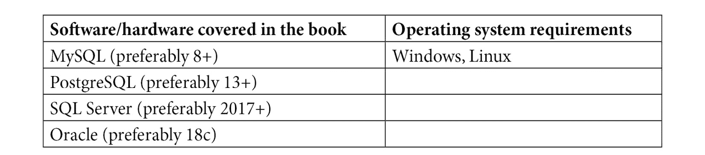

# 前言

过去的十年不断改变着我们的思维和编写应用程序的方式，包括持久化层，它必须面对新的挑战，如工作在微服务架构和云环境中。灵活性、多功能性、方言无关性、坚如磐石的 SQL 支持、学习曲线小、高性能只是使 jOOQ 成为现代应用程序最具吸引力的持久化技术的一些属性。

作为现代技术栈的一部分，jOOQ 是尊重成熟、稳健和良好文档化的技术所有标准的新的持久化趋势。本书详细介绍了 jOOQ，因此它为您成为 jOOQ 高级用户和准备应对持久化层未来的升级版自己做好准备。不要将 jOOQ 视为仅仅是另一项技术；将其视为您心态的一部分，您直接利用 SQL 而不是抽象 SQL 的简单途径，以及您在组织中正确做事的方法。

# 本书面向的对象

本书面向编写通过 SQL 与数据库交互的应用程序的 Java 开发者。假设您没有使用 jOOQ 的先验经验。

# 本书涵盖的内容

*第一章*，*启动 jOOQ 和 Spring Boot*，展示了如何在 Java/Kotlin 下使用 Maven/Gradle 创建涉及 jOOQ 和 Spring Boot 的启动应用程序。

*第二章*，*定制 jOOQ 的参与级别*，涵盖了使用 jOOQ 作为类型安全的查询构建器和执行器所需的配置（声明性和程序性）。此外，我们设置 jOOQ 代表我们生成 POJOs 和 DAOs。我们使用 Java/Kotlin 在 Maven/Gradle 下。

*第三章*，*jOOQ 核心概念*，讨论了 jOOQ 核心概念，如流畅 API、SQL 语法正确性、模拟缺失的语法/逻辑、jOOQ 结果集、jOOQ 记录、类型安全、CRUD 绑定和内联参数。

*第四章*，*构建 DAO 层（演变生成的 DAO 层）*，展示了以多种方式/模板实现 DAO 层的方法。我们探讨了如何演变由 jOOQ 生成的 DAO 层。

*第五章*，*处理不同类型的 SELECT、INSERT、UPDATE、DELETE 和 MERGE 语句*，涵盖了不同类型的`SELECT`、`INSERT`、`UPDATE`、`DELETE`和`MERGE`查询。例如，我们涵盖了嵌套`SELECT`、`INSERT`...`DEFAULT VALUES`、`INSERT`...`SET`查询等。

*第六章*，*处理不同类型的 JOIN 语句*，处理不同类型的`JOIN`。jOOQ 在标准和非标准`JOIN`方面表现出色。我们涵盖了`INNER`、`LEFT`、`RIGHT`、…、`CROSS`、`NATURAL`和`LATERAL` `JOIN`。

*第七章*，*类型、转换器和绑定*，涵盖了自定义数据类型、转换和绑定。

*第八章*，*获取和映射*，作为最全面的章节之一，涵盖了广泛的 jOOQ 获取和映射技术，包括 JSON/SQL、XML/SQL 和多集功能。

*第九章*，*CRUD、事务和锁定*，在 Spring/jOOQ 事务和乐观/悲观锁定旁边涵盖了 jOOQ 的 CRUD 支持。

*第十章*，*导出、批处理、批量加载和加载*，在 jOOQ 中涵盖了批量、批量加载和将文件加载到数据库中的操作。我们将进行单线程和多线程的批处理。

*第十一章*，*jOOQ 键*，从 jOOQ 的角度探讨了不同类型的标识符（自动生成标识符、自然标识符和组合标识符）。

*第十二章*，*分页和动态查询*，涵盖了分页和构建动态查询。主要来说，所有 jOOQ 查询都是动态的，但在这章中，我们将强调这一点，并且我们将通过粘合和重用不同的 jOOQ 工具来编写几个过滤器。

*第十三章*，*利用 SQL 函数*，在 jOOQ 的上下文中涵盖了窗口函数（可能是最强大的 SQL 功能）。

*第十四章*，*派生表、CTE 和视图*，在 jOOQ 的上下文中涵盖了派生表和递归的**公共表表达式**（**CTE**）。

*第十五章*，*调用和创建存储函数和过程*，在 jOOQ 的上下文中涵盖了存储过程和函数。这是 jOOQ 最强大和最受欢迎的功能之一。

*第十六章*，*处理别名和 SQL 模板*，涵盖了别名和 SQL 模板。正如你将看到的，这一章包含了一组必备的知识，这将帮助你避免常见的相关陷阱。

*第十七章*，*jOOQ 中的多租户*，涵盖了多租户/分区方面的不同方面。

*第十八章*，*jOOQ SPI（提供者和监听器）*，涵盖了 jOOQ 提供者和监听器。使用这些类型的工具，我们可以干扰 jOOQ 的默认行为。

*第十九章*，*日志记录和测试*，涵盖了 jOOQ 的日志记录和测试。

# 为了充分利用这本书

为了充分利用这本书，你需要了解 Java 语言，并且熟悉以下数据库技术之一：



请参考此链接以获取额外的安装说明和设置所需的信息：[`github.com/PacktPublishing/jOOQ-Masterclass/tree/master/db`](https://github.com/PacktPublishing/jOOQ-Masterclass/tree/master/db)。

**如果您正在使用本书的数字版，我们建议您亲自输入代码或从本书的 GitHub 仓库（下一节中有一个链接）获取代码。这样做将帮助您避免与代码复制和粘贴相关的任何潜在错误。**

# 下载示例代码文件

您可以从 GitHub 下载本书的示例代码文件[`github.com/PacktPublishing/jOOQ-Masterclass`](https://github.com/PacktPublishing/jOOQ-Masterclass)。如果代码有更新，它将在 GitHub 仓库中更新。

我们还有其他来自我们丰富的图书和视频目录的代码包可供下载，请访问[`github.com/PacktPublishing/`](https://github.com/PacktPublishing/)。查看它们！

# 下载彩色图像

我们还提供了一个包含本书中使用的截图和图表的彩色图像的 PDF 文件。您可以从这里下载：[`packt.link/a1q9L`](https://packt.link/a1q9L)。

# 使用的约定

本书使用了多种文本约定。

`文本中的代码`：表示文本中的代码单词、数据库表名、文件夹名、文件名、文件扩展名、路径名、虚拟 URL、用户输入和 Twitter 昵称。以下是一个示例：“例如，下一个代码片段依赖于`fetchInto()`功能。”

代码块设置如下：

```java
// 'query' is the ResultQuery object
```

```java
List<Office> result = query.fetchInto(Office.class);
```

当我们希望您注意代码块中的特定部分时，相关的行或项目将以粗体显示：

```java
public List<Office> findOfficesInTerritory(
```

```java
                                    String territory) {
```

```java
  List<Office> result = ctx.selectFrom(table("office"))
```

```java
    .where(field("territory").eq(territory))
```

```java
.fetchInto(Office.class); 
```

```java
  return result;
```

```java
}
```

任何命令行输入或输出都应如下所示：

```java
<result>
 <record>
  <value field="product_line">Vintage Cars</value>
  <value field="product_id">80</value>
  <value field="product_name">1936 Mercedes Benz ...</value>
 </record>
 ...
</result>
```

小贴士或重要注意事项

看起来是这样的。

# 联系我们

欢迎读者反馈

**一般反馈**：如果您对本书的任何方面有疑问，请通过 mailto:customercare@packtpub.com 给我们发邮件，并在邮件主题中提及书名。

**勘误表**：尽管我们已经尽最大努力确保内容的准确性，但错误仍然可能发生。如果您在本书中发现错误，我们将不胜感激，如果您能向我们报告，我们将不胜感激。请访问[www.packtpub.com/support/errata](http://www.packtpub.com/support/errata)并填写表格。

**盗版**：如果您在互联网上遇到我们作品的任何非法副本，我们将不胜感激，如果您能提供位置地址或网站名称，我们将不胜感激。请通过 mailto:copyright@packt.com 与我们联系，并提供材料的链接。

**如果您想成为一名作者**：如果您在某个领域有专业知识，并且您有兴趣撰写或为书籍做出贡献，请访问 authors.packtpub.com。

# 分享您的想法

一旦您阅读了*jOOQ Masterclass*，我们很乐意听到您的想法！请[点击此处直接进入此书的亚马逊评论页面](https://packt.link/r/1800566891)并分享您的反馈。

您的评论对我们和科技社区都很重要，并将帮助我们确保我们提供高质量的内容。
