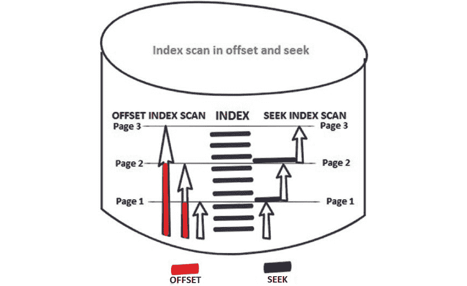
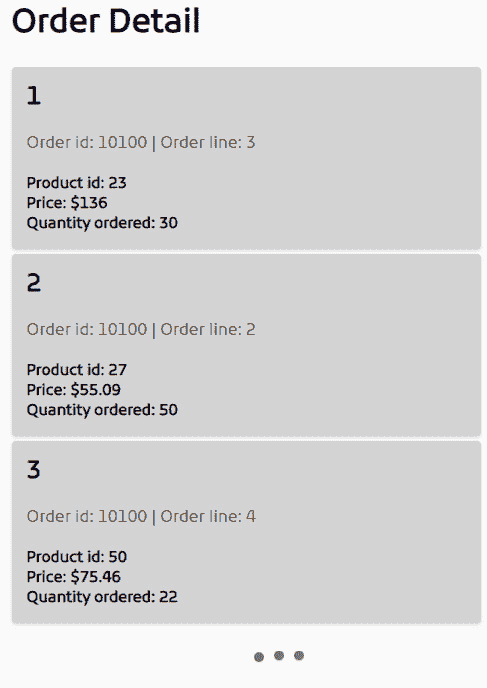
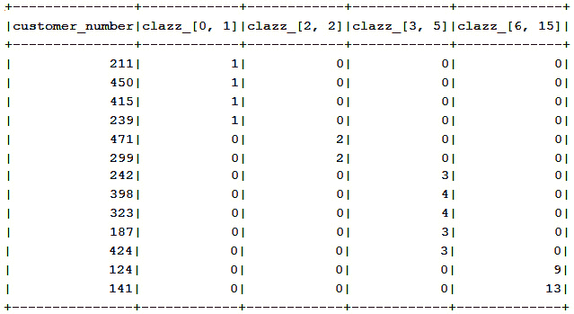
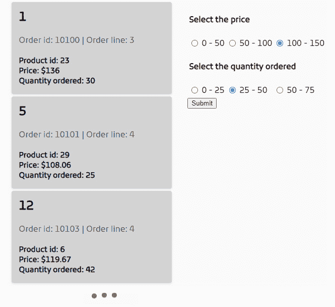

# 第十二章：分页和动态查询

在本章中，我们将讨论 jOOQ 中的分页和动态查询，这两个主题在广泛的应用中协同工作，用于分页和过滤产品、项目、图片、帖子、文章等列表。

本章将涵盖以下主题：

+   jOOQ 偏移量分页

+   jOOQ 键集分页

+   编写动态查询

+   无限滚动和动态筛选

让我们开始吧！

# 技术要求

本章的代码可以在 GitHub 上找到：[`github.com/PacktPublishing/jOOQ-Masterclass/tree/master/Chapter12`](https://github.com/PacktPublishing/jOOQ-Masterclass/tree/master/Chapter12)。

# 偏移量和键集分页

偏移量和键集分页（或如马克斯·温安德所说的“查找”）是两种在从数据库中获取数据时进行分页的知名技术。偏移量分页相当流行，因为 Spring Boot（更确切地说，Spring Data Commons）提供了两种默认实现，通过 `Page` 和 `Slice` API。因此，从生产力的角度来看，依赖这些实现非常方便。然而，从性能的角度来看，随着项目的演变和数据量的积累，依赖偏移量分页可能会导致严重的性能下降。不过，正如你很快就会看到的，jOOQ 可以帮助你改善这种情况。

相反，键集分页是一种保持高性能的技术，比偏移量分页更快、更稳定。键集分页在分页大型数据集和无限滚动方面表现尤为出色，同时其性能几乎与偏移量分页相同，尤其是在相对较小的数据集上。然而，你能保证数据量不会随着时间的推移而增长（有时增长得相当快）吗？如果可以，那么使用偏移量分页应该是可以的。否则，最好从一开始就防止这种已知的性能问题，并依赖键集分页。不要认为这是过早优化；将其视为根据你正在建模的业务案例做出正确决策的能力。而且，正如你很快就会看到的，jOOQ 使得键集分页变得轻而易举。

## 偏移量和键集索引扫描

处理偏移量分页意味着你可以忽略在达到期望偏移量之前丢弃 *n* 条记录所引起的性能惩罚。较大的 *n* 会导致显著的性能惩罚，这同样影响了 `Page` 和 `Slice` API。另一个惩罚是需要额外的 `SELECT COUNT` 来计算记录总数。这个额外的 `SELECT COUNT` 仅针对 `Page` API，因此不会影响 `Slice` API。基本上，这是 `Page` 和 `Slice` API 之间的主要区别；前者包含记录总数（用于计算总页数），而后者只能判断是否至少还有一页可用或这是最后一页。

Lukas Eder 在这里有一个非常棒的观察：“我倾向于这样思考的另一种方式是：能够跳转到第 2712 页的商业价值是什么？那个页码甚至意味着什么？难道不应该使用更好的过滤器来细化搜索吗？另一方面，从任何页面跳转到下一页是一个非常常见的需求。”*

偏移量索引扫描将从开始到指定的偏移量遍历索引范围。基本上，偏移量表示在将记录包含到结果集中之前必须跳过的记录数。因此，偏移量方法将遍历已经显示的记录，如下面的图所示：



图 12.1 – 偏移量和键集分页中的索引扫描

另一方面，键集分页中的索引扫描将仅遍历所需值，从最后一个前一个值开始（它跳过直到最后一个之前获取的值）。在键集中，性能相对于表记录的增加保持大致恒定。

重要提示

在 *USE THE INDEX, LUKE!* 网站上提到了一个重要的参考和反对使用偏移量分页的论点（[`use-the-index-luke.com/no-offset`](https://use-the-index-luke.com/no-offset)）。我强烈建议你花些时间观看 Markus Winand 的这个精彩演示（[`www.slideshare.net/MarkusWinand/p2d2-pagination-done-the-postgresql-way?ref=https://use-the-index-luke.com/no-offset`](https://www.slideshare.net/MarkusWinand/p2d2-pagination-done-the-postgresql-way?ref=https://use-the-index-luke.com/no-offset)），它涵盖了调整分页-SQL 的重要主题，例如在偏移量和键集分页中使用索引和行值（在 PostgreSQL 中受支持）。

好的，在总结了偏移量与键集分页之后，让我们看看 jOOQ 如何模拟甚至改进默认的 Spring Boot 偏移量分页实现。

# jOOQ 偏移量分页

Spring Boot 的偏移量分页实现可以通过 `LIMIT … OFFSET`（或 `OFFSET … FETCH`）和 `SELECT COUNT` 轻松地塑形。例如，如果我们假设客户端通过 `page` 参数给我们一个页码（`size` 是要在 `page` 上显示的产品数量），那么下面的 jOOQ 查询模拟了 `PRODUCT` 表的默认 Spring Boot 分页行为：

```java
long total = ctx.fetchCount(PRODUCT);
```

```java
List<Product> result = ctx.selectFrom(PRODUCT)
```

```java
  .orderBy(PRODUCT.PRODUCT_ID)
```

```java
  .limit(size)
```

```java
  .offset(size * page)
```

```java
  .fetchInto(Product.class);
```

如果客户端（例如，浏览器）期望作为响应返回经典 `Page<Product>` (`org.springframework.data.domain.Page`) 的序列化，那么你可以简单地生成它，如下所示：

```java
Page<Product> pageOfProduct = new PageImpl(result,
```

```java
  PageRequest.of(page, size, Sort.by(Sort.Direction.ASC, 
```

```java
    PRODUCT.PRODUCT_ID.getName())), total);
```

然而，我们不必执行两个 `SELECT` 语句，我们可以使用 `COUNT()` 窗口函数以单个 `SELECT` 获取相同的结果：

```java
Map<Integer, List<Product>> result = ctx.select(
```

```java
    PRODUCT.asterisk(), count().over().as("total"))
```

```java
  .from(PRODUCT)
```

```java
  .orderBy(PRODUCT.PRODUCT_ID)
```

```java
  .limit(size)
```

```java
  .offset(size * page)
```

```java
  .fetchGroups(field("total", Integer.class), Product.class);
```

这已经比默认的 Spring Boot 实现要好。当你将这个 `Map<Integer, List<Product>>` 返回给客户端时，你也可以返回一个 `Page<Product>`：

```java
Page<Product> pageOfProduct 
```

```java
  = new PageImpl(result.values().iterator().next(),
```

```java
    PageRequest.of(page, size, Sort.by(Sort.Direction.ASC, 
```

```java
       PRODUCT.PRODUCT_ID.getName())),
```

```java
         result.entrySet().iterator().next().getKey());
```

很可能，你更喜欢`Page`，因为它包含一系列元数据，例如如果没有分页的总记录数（`totalElements`），当前页码（`pageNumber`），实际页面大小（`pageSize`），返回行的实际偏移量（`offset`），以及我们是否在最后一页（`last`）。你可以在捆绑的代码（*PaginationCountOver*）中找到之前的例子。

然而，正如 Lukas Eder 在这篇文章中强调的（[`blog.jooq.org/2021/03/11/calculating-pagination-metadata-without-extra-roundtrips-in-sql/`](https://blog.jooq.org/2021/03/11/calculating-pagination-metadata-without-extra-roundtrips-in-sql/))，所有这些元数据都可以在一个 SQL 查询中获取；因此，没有必要创建一个`Page`对象来使它们可用。在捆绑的代码（*PaginationMetadata*）中，你可以通过 REST 控制器练习 Lukas 的动态查询。

# jOOQ 键集分页

键集（或 seek）分页在 Spring Boot 中没有默认实现，但这不应该阻止你使用它。只需从选择一个用作最新访问记录/行的表列（例如，id 列）开始，并在`WHERE`和`ORDER BY`子句中使用这个列。依赖于 ID 列的惯用用法如下（多列排序遵循相同的概念）:

```java
SELECT ... FROM ...
```

```java
WHERE id < {last_seen_id}
```

```java
ORDER BY id DESC
```

```java
LIMIT {how_many_rows_to_fetch}
```

```java
SELECT ... FROM ...
```

```java
WHERE id > {last_seen_id}
```

```java
ORDER BY id ASC
```

```java
LIMIT {how_many_rows_to_fetch}
```

或者，像这样：

```java
SELECT ... FROM ...
```

```java
WHERE ... AND id < {last_seen_id}
```

```java
ORDER BY id DESC
```

```java
LIMIT {how_many_rows_to_fetch}
```

```java
SELECT ... FROM ...
```

```java
WHERE ... AND id > {last_seen_id}
```

```java
ORDER BY id ASC
```

```java
LIMIT {how_many_rows_to_fetch}
```

根据迄今为止获得的经验，在 jOOQ 中表达这些查询应该轻而易举。例如，让我们通过`PRODUCT_ID`将第一个惯用用法应用到`PRODUCT`表上：

```java
List<Product> result = ctx.selectFrom(PRODUCT)
```

```java
   .where(PRODUCT.PRODUCT_ID.lt(productId))
```

```java
   .orderBy(PRODUCT.PRODUCT_ID.desc())
```

```java
   .limit(size)
```

```java
   .fetchInto(Product.class);
```

在 MySQL 中，渲染的 SQL 如下（其中`productId` = `20`和`size` = `5`）：

```java
SELECT `classicmodels`.`product`.`product_id`,
```

```java
       `classicmodels`.`product`.`product_name`,
```

```java
       ...
```

```java
FROM `classicmodels`.`product`
```

```java
WHERE `classicmodels`.`product`.`product_id` < 20
```

```java
ORDER BY `classicmodels`.`product`.`product_id` DESC
```

```java
LIMIT 5
```

这很简单！你可以在*KeysetPagination*中练习这个案例。

然而，如果`WHERE`子句变得更加复杂，键集分页就会变得有点棘手。幸运的是，jOOQ 通过一个名为`SEEK`的合成子句帮助我们避免了这种情况。让我们深入探讨它！

## jOOQ 的 SEEK 子句

jOOQ 的合成`SEEK`子句简化了键集分页的实现。其主要优点之一是`SEEK`子句是类型安全的，并且能够生成/模拟正确的/预期的`WHERE`子句（包括行值表达式的模拟）。

例如，前面的键集分页示例可以使用`SEEK`子句来表示，如下所示（`productId`由客户提供）:

```java
List<Product> result = ctx.selectFrom(PRODUCT)
```

```java
  .orderBy(PRODUCT.PRODUCT_ID)
```

```java
  .seek(productId) 
```

```java
  .limit(size)
```

```java
  .fetchInto(Product.class);
```

注意，这里没有显式的`WHERE`子句。jOOQ 会根据`seek()`参数为我们生成它。虽然这个例子可能看起来并不那么令人印象深刻，但让我们考虑另一个例子。这次，让我们使用员工的办公代码和薪水来分页`EMPLOYEE`:

```java
List<Employee> result = ctx.selectFrom(EMPLOYEE)
```

```java
  .orderBy(EMPLOYEE.OFFICE_CODE, EMPLOYEE.SALARY.desc())
```

```java
  .seek(officeCode, salary) 
```

```java
  .limit(size)
```

```java
  .fetchInto(Employee.class);
```

`officeCode`和`salary`都由客户提供，并会落在以下生成的 SQL 示例中（其中`officeCode` = `1`，`salary` = `75000`，`size` = `10`）:

```java
SELECT `classicmodels`.`employee`.`employee_number`,
```

```java
  ...
```

```java
FROM `classicmodels`.`employee`
```

```java
WHERE (`classicmodels`.`employee`.`office_code` > '1'
```

```java
   OR (`classicmodels`.`employee`.`office_code` = '1'
```

```java
     AND `classicmodels`.`employee`.`salary` < 75000))
```

```java
ORDER BY `classicmodels`.`employee`.`office_code`,
```

```java
         `classicmodels`.`employee`.`salary` DESC
```

```java
LIMIT 10
```

查看生成的`WHERE`子句！我非常确信你不想手动编写这个子句。以下例子如何？

```java
List<Orderdetail> result = ctx.selectFrom(ORDERDETAIL)
```

```java
 .orderBy(ORDERDETAIL.ORDER_ID, ORDERDETAIL.PRODUCT_ID.desc(),
```

```java
          ORDERDETAIL.QUANTITY_ORDERED.desc())
```

```java
 .seek(orderId, productId, quantityOrdered)
```

```java
 .limit(size)
```

```java
 .fetchInto(Orderdetail.class);
```

以下代码是生成的 SQL 示例（其中 `orderId` = `10100`，`productId` = `23`，`quantityOrdered` = `30`，`size` = `10`）：

```java
SELECT `classicmodels`.`orderdetail`.`orderdetail_id`,
```

```java
      ...
```

```java
FROM `classicmodels`.`orderdetail`
```

```java
WHERE (`classicmodels`.`orderdetail`.`order_id` > 10100
```

```java
  OR (`classicmodels`.`orderdetail`.`order_id` = 10100
```

```java
  AND `classicmodels`.`orderdetail`.`product_id` < 23)
```

```java
  OR (`classicmodels`.`orderdetail`.`order_id` = 10100
```

```java
  AND `classicmodels`.`orderdetail`.`product_id` = 23
```

```java
  AND `classicmodels`.`orderdetail`.`quantity_ordered` < 30))
```

```java
ORDER BY `classicmodels`.`orderdetail`.`order_id`,
```

```java
         `classicmodels`.`orderdetail`.`product_id` DESC,
```

```java
         `classicmodels`.`orderdetail`.`quantity_ordered` DESC
```

```java
LIMIT 10
```

在这个示例之后，我认为很明显，你应该选择 `SEEK` 子句，让 jOOQ 做它的工作！看，你甚至可以这样做：

```java
List<Product> result = ctx.selectFrom(PRODUCT)
```

```java
 .orderBy(PRODUCT.BUY_PRICE, PRODUCT.PRODUCT_ID)
```

```java
 .seek(PRODUCT.MSRP.minus(PRODUCT.MSRP.mul(0.35)), 
```

```java
     val(productId)) 
```

```java
 .limit(size)
```

```java
 .fetchInto(Product.class);
```

你可以在 *SeekClausePagination* 中练习这些示例，包括使用 jOOQ 内嵌键作为 `SEEK` 子句的参数。

## 实现无限滚动

无限滚动是键集分页的经典用法，并且近年来越来越受欢迎。例如，假设我们计划获取如图所示的内容：



图 12.2 – 无限滚动

因此，我们想要对 `ORDERDETAIL` 表进行无限滚动。在每次滚动时，我们通过 `SEEK` 子句获取下一个 *n* 条记录：

```java
public List<Orderdetail> fetchOrderdetailPageAsc(
```

```java
         long orderdetailId, int size) {
```

```java
  List<Orderdetail> result = ctx.selectFrom(ORDERDETAIL)
```

```java
    .orderBy(ORDERDETAIL.ORDERDETAIL_ID)
```

```java
    .seek(orderdetailId) 
```

```java
    .limit(size)
```

```java
    .fetchInto(Orderdetail.class);
```

```java
  return result;
```

```java
}
```

这种方法获取最后访问的 `ORDERDETAIL_ID` 和要获取的记录数（`size`），然后返回一个 `jooq.generated.tables.pojos.Orderdetail` 的列表，这些列表将通过定义在 `@GetMapping("/orderdetail/{orderdetailId}/{size}")` 的 Spring Boot REST 控制器端点以 JSON 格式序列化。

在客户端，我们依赖于 JavaScript Fetch API（当然，你也可以使用 XMLHttpRequest、jQuery、AngularJS、Vue、React 等等）来执行 HTTP `GET` 请求，如下所示：

```java
const postResponse 
```

```java
   = await fetch('/orderdetail/${start}/${size}');
```

```java
const data = await postResponse.json();
```

为了获取正好三条记录，我们将 `${size}` 替换为 `3`。此外，`${start}` 占位符应该被替换为最后访问的 `ORDERDETAIL_ID`，因此 `start` 变量可以计算如下：

```java
start = data[size-1].orderdetailId;
```

在滚动时，你的浏览器将在每三条记录后执行一个 HTTP 请求，如下所示：

```java
http://localhost:8080/orderdetail/0/3
```

```java
http://localhost:8080/orderdetail/3/3
```

```java
http://localhost:8080/orderdetail/6/3
```

```java
…
```

你可以在 *SeekInfiniteScroll* 中查看这个示例。接下来，让我们看看分页 `JOIN` 语句的方法。

## 通过 DENSE_RANK() 分页 JOIN

假设我们想要分页显示办公室（`OFFICE`）和员工（`EMPLOYEE`）。如果我们将经典的偏移量或键集分页应用于 `OFFICE` 和 `EMPLOYEE` 之间的 `JOIN`，那么结果可能会被截断。因此，一个办公室可能只能获取其部分员工的记录。例如，当我们认为一个大小为 3 的结果页面包含三个具有所有员工的办公室时，我们实际上只得到一个有三个员工的办公室（即使这个办公室有更多员工）。以下图显示了我们的预期结果与从大小为 3 的页面（办公室）得到的结果：


图 12.3 – 连接分页

为了获得如图左侧所示的结果集，我们可以依赖 `DENSE_RANK()` 窗口函数，该函数为每个组 `b` 中 `a` 的不同值分配一个顺序号，如下查询所示：

```java
Map<Office, List<Employee>> result = ctx.select().from(
```

```java
  select(OFFICE.OFFICE_CODE, OFFICE...,
```

```java
         EMPLOYEE.FIRST_NAME, EMPLOYEE...,
```

```java
         denseRank().over().orderBy(
```

```java
             OFFICE.OFFICE_CODE, OFFICE.CITY).as("rank"))
```

```java
  .from(OFFICE)
```

```java
  .join(EMPLOYEE)
```

```java
  .on(OFFICE.OFFICE_CODE.eq(EMPLOYEE.OFFICE_CODE)).asTable("t"))
```

```java
  .where(field(name("t", "rank")).between(start, end))
```

```java
  .fetchGroups(Office.class, Employee.class);
```

`start`和`end`变量代表通过`DENSE_RANK()`设置的办公室范围。以下图应能阐明这一点，其中`start` = `1`和`end` = `3`（下一个包含三个办公室的页面在`start` = `4`和`end` = `6`之间）：

![图 12.4 – DENSE_RANK()的效果

![img/B16833_Figure_12.4.jpg]

图 12.4 – DENSE_RANK()的效果

这里是上一个查询的一个更紧凑版本，使用了`QUALIFY`子句：

```java
Map<Office, List<Employee>> result = 
```

```java
  ctx.select(OFFICE.OFFICE_CODE, OFFICE...,       
```

```java
             EMPLOYEE.FIRST_NAME, EMPLOYEE...)
```

```java
     .from(OFFICE)
```

```java
     .join(EMPLOYEE)
```

```java
     .on(OFFICE.OFFICE_CODE.eq(EMPLOYEE.OFFICE_CODE))
```

```java
     .qualify(denseRank().over()
```

```java
        .orderBy(OFFICE.OFFICE_CODE, OFFICE.CITY)
```

```java
        .between(start, end))   
```

```java
     .fetchGroups(Office.class, Employee.class);
```

您可以通过 MySQL 的*DenseRankPagination*中的三个 REST 控制器端点查看这些示例（偏移量、键集和`DENSE_RANK()`查询）。在这些所有情况下，返回的`Map<Office, List<Employee>>`被序列化为 JSON。

## 通过 ROW_NUMBER()分页数据库视图

让我们考虑以下图，它表示名为`PRODUCT_MASTER`的数据库视图的快照（它也可以是一个常规表）：

![图 12.5 – PRODUCT_MASTER 数据库视图

![img/B16833_Figure_12.5.jpg]

图 12.5 – PRODUCT_MASTER 数据库视图

接下来，我们希望通过`PRODUCT_LINE`（第一列）来分页这个视图，因此我们必须考虑到`PRODUCT_LINE`包含重复项的事实。虽然这对于偏移分页不是问题，但它可能会为仅依赖于`PRODUCT_LINE`和`LIMIT`（或其对应项）子句的关键集分页产生奇怪的结果。我们可以通过在`ORDER BY`和`WHERE`谓词中使用(`PRODUCT_LINE`, `PRODUCT_NAME`)组合来消除这个问题。这将按预期工作，因为`PRODUCT_NAME`包含唯一值。

然而，让我们尝试另一种方法，依赖于`ROW_NUMBER()`窗口函数。此函数为行分配一个数据库临时值序列。更确切地说，`ROW_NUMBER()`窗口函数生成一个从值 1 开始，增量 1 的值序列。这是一个在查询执行时动态计算的临时值序列（非持久）。

基于`ROW_NUMBER()`，我们可以可视化`PRODUCT_MASTER`，如图所示：

![图 12.6 – ROW_NUMBER()的效果

![img/B16833_Figure_12.6.jpg]

图 12.6 – ROW_NUMBER()的效果

在此上下文中，可以这样表达分页：

```java
var result = ctx.select().from(
```

```java
  select(PRODUCT_MASTER.PRODUCT_LINE,
```

```java
    PRODUCT_MASTER.PRODUCT_NAME, PRODUCT_MASTER.PRODUCT_SCALE,
```

```java
      rowNumber().over().orderBy(
```

```java
        PRODUCT_MASTER.PRODUCT_LINE).as("rowNum"))
```

```java
 .from(PRODUCT_MASTER).asTable("t"))
```

```java
 .where(field(name("t", "rowNum")).between(start, end))
```

```java
 .fetchInto(ProductMaster.class);
```

或者，我们可以通过`QUALIFY`子句使其更加紧凑：

```java
var result = ctx.select(PRODUCT_MASTER.PRODUCT_LINE,
```

```java
    PRODUCT_MASTER.PRODUCT_NAME, PRODUCT_MASTER.PRODUCT_SCALE)
```

```java
 .from(PRODUCT_MASTER)
```

```java
 .qualify(rowNumber().over()
```

```java
    .orderBy(PRODUCT_MASTER.PRODUCT_LINE).between(start, end))
```

```java
 .fetchInto(ProductMaster.class);
```

通过`start` = `1`和`end` = `5`获取大小为 5 的第一页。通过`start` = `6`和`end` = `10`获取下一页的大小为 5。完整的示例在 MySQL 的 bundler 代码中的*RowNumberPagination*部分可用。

好的，关于分页就说到这里。接下来，让我们解决动态查询（过滤器）的问题。

# 编写动态查询

通常，一个动态查询包含没有或一些固定部分，以及一些可以在运行时附加的部分，以形成一个对应于特定场景或用例的查询。

重要提示

在 jOOQ 中，即使它们看起来像静态查询（由于 jOOQ 的 API 设计），每个 SQL 都是动态的；因此，它可以分解成可以流畅地重新组合在任何有效 jOOQ 查询中的查询部分。我们已经在 *第三章*，*jOOQ 核心概念*，*理解 jOOQ 流畅 API* 部分中涵盖了这一方面。

动态创建 SQL 语句是 jOOQ 最受欢迎的主题之一，因此让我们尝试涵盖一些在实际应用中可能有用的方法。

## 使用三元运算符

Java 的三元运算符 (`?`) 是在运行时塑造查询的最简单方法之一。查看以下示例：

```java
public List<ProductRecord> fetchCarsOrNoCars(
```

```java
       float buyPrice, boolean cars) {
```

```java
  return ctx.selectFrom(PRODUCT)
```

```java
   .where((buyPrice > 0f ? PRODUCT.BUY_PRICE.gt(
```

```java
       BigDecimal.valueOf(buyPrice)) : noCondition())
```

```java
     .and(cars ? PRODUCT.PRODUCT_LINE.in("Classic Cars", 
```

```java
       "Motorcycles", "Trucks and Buses", "Vintage Cars") : 
```

```java
   PRODUCT.PRODUCT_LINE.in("Plains","Ships", "Trains")))
```

```java
   .fetch();
```

```java
}
```

`PRODUCT.BUY_PRICE.gt(BigDecimal.valueOf(buyPrice))` 条件仅在传递的 `buyPrice` 大于 0 时附加；否则，我们依赖便捷的 `noCondition()` 方法。接下来，根据 `cars` 标志，我们调整 `PRODUCT.PRODUCT_LINE.in()` 的值域。通过这个单一的 jOOQ 查询，我们可以在运行时形成四个不同的 SQL 查询，具体取决于 `buyPrice` 和 `cars` 的值。

## 使用 jOOQ 比较器

jOOQ 的 `Comparator` API 在条件中切换比较运算符时非常方便，同时保持流畅。例如，假设客户端（用户、服务等等）可以在两个员工类别之间进行选择——一个是所有销售代表的类别，另一个是非销售代表的类别。如果客户端选择第一个类别，那么我们希望获取所有 `salary` 小于 *65,000* 的员工 (`EMPLOYEE`)。然而，如果客户端选择第二个类别，那么我们希望获取所有 `salary` 大于或等于 *65,000* 的员工 (`EMPLOYEE`)。而不是编写两个查询或使用其他任何方法，我们可以依赖 jOOQ 的 `Comparator.IN` 和 `Comparator.NOT_IN`（注意，在 `NOT_IN` 的情况下，投影的列应该是 `NOT NULL`），如下所示：

```java
List<EmployeeRecord> fetchEmployees(boolean isSaleRep) {
```

```java
 return ctx.selectFrom(EMPLOYEE)
```

```java
  .where(EMPLOYEE.SALARY.compare(isSaleRep 
```

```java
     ? Comparator.IN : Comparator.NOT_IN,
```

```java
       select(EMPLOYEE.SALARY).from(EMPLOYEE)
```

```java
           .where(EMPLOYEE.SALARY.lt(65000))))
```

```java
           .orderBy(EMPLOYEE.SALARY)
```

```java
           .fetch();
```

```java
}
```

jOOQ 提供了一个全面的内置比较器列表，包括 `EQUALS`、`GREATER`、`LIKE` 和 `IS_DISTINCT_FROM`。虽然你可以在 jOOQ 文档中找到所有这些内容，但这里有一个使用 `Comparator.LESS` 和 `Comparator.GREATER` 来在 jOOQ 中表达一个可以翻译成四个 SQL 查询的查询的例子，具体取决于 `buyPrice` 和 `msrp` 的值：

```java
public List<ProductRecord> fetchProducts(
```

```java
                   float buyPrice, float msrp) {
```

```java
  return ctx.selectFrom(PRODUCT)
```

```java
    .where(PRODUCT.BUY_PRICE.compare(
```

```java
      buyPrice < 55f ? Comparator.LESS : Comparator.GREATER,
```

```java
       select(avg(PRODUCT.MSRP.minus(
```

```java
        PRODUCT.MSRP.mul(buyPrice / 100f))))
```

```java
    .from(PRODUCT).where(PRODUCT.MSRP.coerce(Float.class)
```

```java
     .compare(msrp > 100f ? 
```

```java
         Comparator.LESS : Comparator.GREATER, msrp))))
```

```java
     .fetch();
```

```java
}
```

你可以在 *DynamicQuery* 中查看这些示例以及其他示例。

## 使用 SelectQuery、InsertQuery、UpdateQuery 和 DeleteQuery

`SelectQuery`（`InsertQuery`、`UpdateQuery` 和 `DeleteQuery`）类型的目标是允许以命令式风格表达动态查询。然而，建议避免这种命令式风格，并使用更函数式的方法，正如你将在本章中很快看到的。所以，当你阅读这一节时，请将这句话视为免责声明。

当前面的方法无法使用或查询变得杂乱时，是时候将注意力转向`SelectQuery`（`InsertQuery`、`UpdateQuery`和`DeleteQuery`）API 了。这些 jOOQ API 对于表达动态查询非常有用，因为它们包含用于轻松添加查询不同部分的方法（例如，条件、连接、HAVING 和 ORDER BY）。

### 使用 SelectQuery

例如，假设我们的应用程序公开了一个过滤器，可以可选地选择一个价格范围（`startBuyPrice`和`endBuyPrice`），产品供应商（`productVendor`）和产品规模（`productScale`）来订购`PRODUCT`。基于客户端的选择，我们应该执行适当的`SELECT`查询，所以我们首先编写一个`SelectQuery`，如下所示：

```java
SelectQuery select = ctx.selectFrom(PRODUCT)
```

```java
  .where(PRODUCT.QUANTITY_IN_STOCK.gt(0))
```

```java
  .getQuery();
```

到目前为止，这个查询没有涉及任何客户端选择。此外，我们针对每个客户端选择，并依靠`addConditions()`来相应地丰富它们：

```java
if (startBuyPrice != null && endBuyPrice != null) {
```

```java
   select.addConditions(PRODUCT.BUY_PRICE
```

```java
         .betweenSymmetric(startBuyPrice, endBuyPrice));
```

```java
}
```

```java
if (productVendor != null) {
```

```java
    select.addConditions(PRODUCT.PRODUCT_VENDOR
```

```java
          .eq(productVendor));
```

```java
}
```

```java
if (productScale != null) {
```

```java
    select.addConditions(PRODUCT.PRODUCT_SCALE
```

```java
          .eq(productScale));
```

```java
}
```

最后，我们执行查询并获取结果：

```java
select.fetch();
```

完成！同样的事情也可以这样表达：

```java
Condition condition = PRODUCT.QUANTITY_IN_STOCK.gt(0);
```

```java
if (startBuyPrice != null && endBuyPrice != null) {
```

```java
    condition = condition.and(PRODUCT.BUY_PRICE
```

```java
       .betweenSymmetric(startBuyPrice, endBuyPrice));
```

```java
}
```

```java
if (productVendor != null) {
```

```java
    condition = condition.and(PRODUCT.PRODUCT_VENDOR
```

```java
       .eq(productVendor));
```

```java
}
```

```java
if (productScale != null) {
```

```java
    condition = condition.and(PRODUCT.PRODUCT_SCALE
```

```java
       .eq(productScale));
```

```java
}
```

```java
SelectQuery select = ctx.selectFrom(PRODUCT)
```

```java
   .where(condition)
```

```java
   .getQuery();
```

```java
select.fetch();
```

如果你没有起始条件（一个固定条件），那么你可以从一个虚拟的`true`条件开始：

```java
Condition condition = trueCondition();
```

除了`trueCondition()`之外，我们还可以使用`falseCondition()`或`noCondition()`。更多详情请参阅[`www.jooq.org/doc/latest/manual/sql-building/conditional-expressions/true-false-no-condition/`](https://www.jooq.org/doc/latest/manual/sql-building/conditional-expressions/true-false-no-condition/)。

接下来，使用`and()`、`or()`、`andNot()`、`andExists()`等来按适当的方式链式连接可选条件。

然而，条件并不是动态查询中唯一的灵活部分。例如，假设我们有一个查询返回办公室的城市和国家（`OFFICE.CITY`和`OFFICE.COUNTRY`）。然而，根据客户端的选择，这个查询还应返回这些办公室的员工（`EMPLOYEE`）以及这些员工的销售额（`SALE`）。这意味着我们的查询应该动态地添加连接。通过`SelectQuery` API，这可以通过`addJoin()`方法完成，如下所示：

```java
public List<Record> appendTwoJoins(
```

```java
       boolean andEmp, boolean addSale) {
```

```java
  SelectQuery select = ctx.select(OFFICE.CITY, 
```

```java
       OFFICE.COUNTRY).from(OFFICE).limit(10).getQuery();
```

```java
  if (andEmp) {
```

```java
    select.addSelect(EMPLOYEE.FIRST_NAME, EMPLOYEE.LAST_NAME);
```

```java
    select.addJoin(EMPLOYEE, 
```

```java
              OFFICE.OFFICE_CODE.eq(EMPLOYEE.OFFICE_CODE));
```

```java
    if (addSale) {
```

```java
     select.addSelect(SALE.FISCAL_YEAR, 
```

```java
                SALE.SALE_, SALE.EMPLOYEE_NUMBER);
```

```java
     select.addJoin(SALE, JoinType.LEFT_OUTER_JOIN, 
```

```java
          EMPLOYEE.EMPLOYEE_NUMBER.eq(SALE.EMPLOYEE_NUMBER));
```

```java
    }
```

```java
  }
```

```java
return select.fetch();
```

```java
}
```

如您所见，`addJoin()`有多种形式。主要的是有一组`addJoin()`会隐式生成一个`INNER JOIN`（如`addJoin(TableLike<?> tl, Condition cndtn)`），有一组`addJoin()`允许我们通过`JoinType`枚举指定连接类型（如`addJoin(TableLike<?> tl, JoinType jt, Condition... cndtns)`），有一组`addJoinOnKey()`会根据给定的外键生成`ON`谓词（如`addJoinOnKey(TableLike<?> tl, JoinType jt, ForeignKey<?,?> fk)`），以及一组`addJoinUsing()`依赖于`USING`子句（如`addJoinUsing(TableLike<?> table, Collection<? extends Field<?>> fields)`）。

在这里使用/提到的`addFoo()`方法旁边，我们有`addFrom()`、`addHaving()`、`addGroupBy()`、`addLimit()`、`addWindow()`等等。你可以在 jOOQ 文档中找到所有这些及其变体。

有时，我们需要多次简单地重用查询的一部分。例如，以下图是通过`UNION`（几乎）相同的查询获得的：



图 12.7 – 应用 UNION 对客户的付款进行计数和分类

此图背后的查询通过`UNION`对基于给定类别的客户付款进行计数和分类，如下所示：

```java
SELECT `classicmodels`.`customer`.`customer_number`,
```

```java
  count(*) AS `clazz_[0, 1]`, 0 AS `clazz_[2, 2]`, 
```

```java
            0 AS `clazz_[3, 5]`, 0 AS `clazz_[6, 15]`
```

```java
FROM `classicmodels`.`customer`
```

```java
JOIN `classicmodels`.`payment` ON   
```

```java
  `classicmodels`.`customer`.`customer_number` 
```

```java
    = `classicmodels`.`payment`.`customer_number`
```

```java
GROUP BY `classicmodels`.`customer`.`customer_number`
```

```java
HAVING count(*) BETWEEN 0 AND 1
```

```java
UNION
```

```java
...
```

```java
HAVING count(*) BETWEEN 2 AND 2
```

```java
UNION
```

```java
...
```

```java
HAVING count(*) BETWEEN 3 AND 5
```

```java
UNION
```

```java
SELECT `classicmodels`.`customer`.`customer_number`,
```

```java
       0, 0, 0, count(*)
```

```java
FROM `classicmodels`.`customer`
```

```java
JOIN `classicmodels`.`payment` ON   
```

```java
  `classicmodels`.`customer`.`customer_number` 
```

```java
    = `classicmodels`.`payment`.`customer_number`
```

```java
GROUP BY `classicmodels`.`customer`.`customer_number`
```

```java
HAVING count(*) BETWEEN 6 AND 15
```

然而，如果类的数量变化（这是一个由客户提供的输入参数），那么`UNION`语句的数量也会变化，并且必须动态地附加`HAVING`子句。首先，我们可以隔离查询的固定部分，如下所示：

```java
private SelectQuery getQuery() {
```

```java
  return ctx.select(CUSTOMER.CUSTOMER_NUMBER)
```

```java
    .from(CUSTOMER)
```

```java
    .join(PAYMENT)
```

```java
    .on(CUSTOMER.CUSTOMER_NUMBER.eq(PAYMENT.CUSTOMER_NUMBER))
```

```java
    .groupBy(CUSTOMER.CUSTOMER_NUMBER)
```

```java
    .getQuery();
```

```java
}
```

接下来，我们应该对每个给定的类`UNION`一个`getQuery()`并生成特定的`HAVING`子句，但在阅读以下重要提示之前不要这样做。

重要提示

注意，在集合操作（如`s.union(s)`）的两边不能使用相同的`SelectQuery`实例，因此你需要为每个`UNION`创建一个新的`SelectQuery`。这似乎是一个可修复的错误，所以当你阅读这本书时，这个注意事项可能不再相关。

这可以通过以下简单代码完成：

```java
public record Clazz(int left, int right) {}
```

```java
public List<CustomerRecord> classifyCustomerPayments(
```

```java
                                    Clazz... clazzes) {
```

```java
  SelectQuery[] sq = new SelectQuery[clazzes.length];
```

```java
  for (int i = 0; i < sq.length; i++) {
```

```java
     sq[i] = getQuery(); // create a query for each UNION
```

```java
  }
```

```java
  sq[0].addSelect(count().as("clazz_[" + clazzes[0].left() 
```

```java
    + ", " + clazzes[0].right() + "]"));
```

```java
  sq[0].addHaving(count().between(clazzes[0].left(), 
```

```java
    clazzes[0].right()));
```

```java
  for (int i = 1; i < sq.length; i++) {
```

```java
       sq[0].addSelect(val(0).as("clazz_[" + clazzes[i]
```

```java
         .left() + ", " + clazzes[i].right() + "]"));
```

```java
  }
```

```java
  for (int i = 1; i < sq.length; i++) {
```

```java
     for (int j = 0; j < i; j++) {
```

```java
         sq[i].addSelect(val(0));
```

```java
     }
```

```java
     sq[i].addSelect(count());
```

```java
     for (int j = i + 1; j < sq.length; j++) {
```

```java
         sq[i].addSelect(val(0));
```

```java
     }
```

```java
     sq[i].addHaving(count().between(clazzes[i].left(), 
```

```java
       clazzes[i].right()));
```

```java
     sq[0].union(sq[i]);
```

```java
  }
```

```java
  return sq[0].fetch();
```

```java
}
```

当然，你可以尝试写得更加巧妙和紧凑。这里展示了此方法的调用：

```java
List<CustomerRecord> result = classicModelsRepository
```

```java
  .classifyCustomerPayments(new Clazz(0, 1), new Clazz(2, 2), 
```

```java
                   new Clazz(3, 5), new Clazz(6, 15));
```

为了查看这些示例，请参考*DynamicQuery*应用程序。

### InsertQuery, UpdateQuery, 和 DeleteQuery

jOOQ 也支持表示 DML 操作的动态查询。`InsertQuery`、`UpdateQuery`和`DeleteQuery`与`SelectQuery`的工作原理相同，并公开了一个综合的 API，旨在将 SQL 部分链接成一个有效且动态的 SQL 查询。

让我们看看使用`InsertQuery`插入一个基于客户提供的数据的`PRODUCT`（一辆经典汽车）并返回生成的 ID 的例子：

```java
public long insertClassicCar(
```

```java
    String productName, String productVendor, 
```

```java
    String productScale, boolean price) {
```

```java
  InsertQuery iq = ctx.insertQuery(PRODUCT);
```

```java
  iq.addValue(PRODUCT.PRODUCT_LINE, "Classic Cars");
```

```java
  iq.addValue(PRODUCT.CODE, 599302);
```

```java
  if (productName != null) {
```

```java
    iq.addValue(PRODUCT.PRODUCT_NAME, productName);
```

```java
  }
```

```java
  if (productVendor != null) {
```

```java
    iq.addValue(PRODUCT.PRODUCT_VENDOR, productVendor);
```

```java
  }
```

```java
  if (productScale != null) {
```

```java
    iq.addValue(PRODUCT.PRODUCT_SCALE, productScale);
```

```java
  }
```

```java
  if (price) {
```

```java
    iq.addValue(PRODUCT.BUY_PRICE, 
```

```java
           select(avg(PRODUCT.BUY_PRICE)).from(PRODUCT));
```

```java
  }
```

```java
  iq.setReturning(PRODUCT.getIdentity());
```

```java
  iq.execute();
```

```java
  return iq.getReturnedRecord()
```

```java
    .getValue(PRODUCT.getIdentity().getField(), Long.class);
```

```java
}
```

正如你将在 jOOQ 文档中看到的，`InsertQuery` API 支持许多其他方法，例如`addConditions()`、`onDuplicateKeyIgnore()`、`onConflict()`、`setSelect()`和`addValueForUpdate()`。

动态更新或删除怎么样？这里有一个动态更新的非常直观的例子：

```java
public int updateProduct(float oldPrice, float value) {
```

```java
  UpdateQuery uq = ctx.updateQuery(PRODUCT);
```

```java
  uq.addValue(PRODUCT.BUY_PRICE, 
```

```java
     PRODUCT.BUY_PRICE.plus(PRODUCT.BUY_PRICE.mul(value)));
```

```java
  uq.addConditions(PRODUCT.BUY_PRICE
```

```java
     .lt(BigDecimal.valueOf(oldPrice)));
```

```java
  return uq.execute();
```

```java
}
```

下面是动态删除销售（`SALE`）的代码示例：

```java
public int deleteSale(int fiscalYear, double sale) {
```

```java
  DeleteQuery dq = ctx.deleteQuery(SALE);
```

```java
  Condition condition = SALE.FISCAL_YEAR
```

```java
    .compare(fiscalYear <= 2003 
```

```java
       ? Comparator.GREATER : Comparator.LESS, fiscalYear);
```

```java
  if (sale > 5000d) {
```

```java
     condition = condition.or(SALE.SALE_.gt(sale));
```

```java
  }
```

```java
  dq.addConditions(condition);
```

```java
  return dq.execute();
```

```java
}
```

你可以在*DynamicQuery*中查看这些示例。在探索这些 API 之后，花些时间挑战自己编写你自己的动态查询。这真的很有趣，并帮助你熟悉这个简单但强大的 API。

## 编写通用的动态查询

总有一天，你会意识到你需要的是一个通用的动态查询。例如，你可能遇到一个听起来像这样的场景。你需要根据任意条件从任意表中选取任意列。在这种情况下，仅仅为了改变表名、列名和条件而重复代码将是不高效的。所以，很可能会选择一个通用的动态查询，如下所示：

```java
public <R extends Record> List<R> select(
```

```java
    Table<R> table, Collection<SelectField<?>> fields,  
```

```java
                               Condition... conditions) {
```

```java
   SelectQuery sq = ctx.selectQuery(table);
```

```java
   sq.addSelect(fields);
```

```java
   sq.addConditions(conditions);
```

```java
   return sq.fetch();
```

```java
}
```

调用这个方法可以像以下示例那样进行：

```java
List<ProductRecord> rs1 = 
```

```java
  classicModelsRepository.select(PRODUCT,
```

```java
     List.of(PRODUCT.PRODUCT_LINE, PRODUCT.PRODUCT_NAME, 
```

```java
             PRODUCT.BUY_PRICE, PRODUCT.MSRP),
```

```java
     PRODUCT.BUY_PRICE.gt(BigDecimal.valueOf(50)), 
```

```java
     PRODUCT.MSRP.gt(BigDecimal.valueOf(80)));
```

```java
List<Record> rs2 =   
```

```java
  classicModelsRepository.select(table("product"),
```

```java
     List.of(field("product_line"), field("product_name"), 
```

```java
       field("buy_price"), field("msrp")),
```

```java
         field("buy_price").gt(50), field("msrp").gt(80));
```

如果你只想依赖第一种类型的调用——即基于 jOOQ 生成的代码的调用——那么你可以通过将`SelectField<?>`替换为`TableField<R, ?>`来强制通用方法的类型安全，如下所示：

```java
public <R extends Record> List<R> select(
```

```java
    Table<R> table, Collection<TableField<R, ?>> fields, 
```

```java
       Condition... conditions) {
```

```java
  SelectQuery sq = ctx.selectQuery(table);
```

```java
  sq.addSelect(fields);
```

```java
  sq.addConditions(conditions);
```

```java
  return sq.fetch();
```

```java
}
```

这次，只有第一次调用（`List<ProductRecord> rs1 = …`）编译并工作。同样的情况也适用于 DML 操作——例如，在任意表中插入：

```java
public <R extends Record> int insert (
```

```java
    Table<R> table, Map<TableField<R, ?>, ?> values) {
```

```java
    InsertQuery iq = ctx.insertQuery(table);
```

```java
   iq.addValues(values);
```

```java
   return iq.execute();
```

```java
}
```

这里是前一种方法的调用示例：

```java
int ri = classicModelsRepository.insert(PRODUCT,
```

```java
  Map.of(PRODUCT.PRODUCT_LINE, "Classic Cars", 
```

```java
         PRODUCT.CODE, 599302,
```

```java
         PRODUCT.PRODUCT_NAME, "1972 Porsche 914"));
```

或者，对于任意的更新，我们可以编写以下方法：

```java
public <R extends Record> int update(Table<R> table,
```

```java
    Map<TableField<R, ?>, ?> values, Condition... conditions) {
```

```java
  UpdateQuery uq = ctx.updateQuery(table);
```

```java
  uq.addValues(values);
```

```java
  uq.addConditions(conditions);
```

```java
  return uq.execute();
```

```java
}
```

这里是前一种方法的调用示例：

```java
int ru = classicModelsRepository.update(SALE, 
```

```java
    Map.of(SALE.TREND, "UP", SALE.HOT, true), 
```

```java
       SALE.TREND.eq("CONSTANT"));
```

或者，对于任意的删除，我们可以编写以下方法：

```java
public <R extends Record> int delete(Table<R> table, 
```

```java
       Condition... conditions) {
```

```java
  DeleteQuery dq = ctx.deleteQuery(table);
```

```java
  dq.addConditions(conditions);
```

```java
  return dq.execute();
```

```java
}  
```

这里是前一种方法的调用示例：

```java
int rd1 = classicModelsRepository.delete(SALE, 
```

```java
    SALE.TREND.eq("UP"));
```

```java
int rd2 = classicModelsRepository.delete(table("sale"),    
```

```java
    field("trend").eq("CONSTANT"));
```

你可以在*GenericDynamicQuery*旁边看到这些示例。

## 写作功能动态查询

功能动态查询将这个主题提升到了新的水平。然而，让我们尝试看看我们应该如何以及为什么应该从零到功能实现地演变查询。让我们假设我们为某个组织的销售部门开发应用程序，我们必须编写一个查询来过滤销售（`SALE`）按财政年度（`SALE.FISCAL_YEAR`）。最初（第一天），我们可以像下面这样操作：

```java
// Day 1
```

```java
public List<SaleRecord>
```

```java
  filterSaleByFiscalYear(int fiscalYear) {
```

```java
  return ctx.selectFrom(SALE)
```

```java
   .where(SALE.FISCAL_YEAR.eq(fiscalYear))
```

```java
   .fetch();
```

```java
}
```

当每个人都对结果感到满意时，我们收到了一个新的请求，需要获取某种趋势（`SALE.TREND`）的销售。我们在第一天已经做过这个操作，所以第二天重复它没有问题：

```java
// Day 2
```

```java
public List<SaleRecord> filterSaleByTrend(String trend) {
```

```java
  return ctx.selectFrom(SALE)
```

```java
    .where(SALE.TREND.eq(trend))
```

```java
    .fetch();
```

```java
}
```

这个过滤器与第一天的过滤器相同，只是它有一个不同的条件/过滤器。我们意识到继续这样下去将导致大量类似的方法，这些方法只是为不同的过滤器重复代码，这意味着大量的*样板代码*。在反思这个方面时，我们刚刚收到了一个紧急请求，需要按财政年度和趋势进行销售过滤。所以，我们第三天的糟糕解决方案如下所示：

```java
// Day 3
```

```java
public List<SaleRecord> filterSaleByFiscalYearAndTrend(
```

```java
     int fiscalYear, String trend) {
```

```java
  return ctx.selectFrom(SALE)
```

```java
    .where(SALE.FISCAL_YEAR.eq(fiscalYear)
```

```java
    .and(SALE.TREND.eq(trend)))
```

```java
    .fetch();
```

```java
}
```

经过 3 天后，我们意识到这是不可接受的。代码变得冗长，难以维护，并且容易出错。

在第四天，当我们寻找解决方案时，在 jOOQ 文档中注意到`where()`方法还提供了`where(Collection<? extends Condition> clctn)`和`where(Condition... cndtns)`。这意味着我们可以简化我们的解决方案，如下所示：

```java
// Day 4
```

```java
public List<SaleRecord>
```

```java
  filterSaleBy(Collection<Condition> cf) {
```

```java
  return ctx.selectFrom(SALE)
```

```java
        .where(cf)
```

```java
        .fetch();
```

```java
}
```

这相当不错，因为我们可以在不修改`filterSaleBy()`方法的情况下传递任何一组条件。以下是一个调用示例：

```java
List<SaleRecord> result = 
```

```java
  classicModelsRepository.filterSaleBy(
```

```java
    List.of(SALE.FISCAL_YEAR.eq(2004), SALE.TREND.eq("DOWN"), 
```

```java
          SALE.EMPLOYEE_NUMBER.eq(1370L)));
```

然而，这并不是类型安全的。例如，这个调用的错误只有在编译时才会被发现（查看粗体代码）：

```java
List<SaleRecord> result =   
```

```java
  classicModelsRepository.filterSaleBy(
```

```java
     List.of(SALE.FISCAL_YEAR.eq(2004), SALE.TREND.eq("DOWN"), 
```

```java
         EMPLOYEE.EMPLOYEE_NUMBER.eq(1370L)));
```

嗯，新的一天带来了新的想法！在第 5 天，我们定义了一个接口来防止第 4 天的类型安全问题。这是一个函数式接口，如下所示：

```java
// Day 5
```

```java
@FunctionalInterface
```

```java
public interface SaleFunction<Sale, Condition> {
```

```java
    Condition apply(Sale s);
```

```java
}
```

而 `filterSaleBy()` 变成了以下形式：

```java
public List<SaleRecord> filterSaleBy(
```

```java
     SaleFunction<Sale, Condition> sf) {
```

```java
  return ctx.selectFrom(SALE)
```

```java
    .where(sf.apply(SALE))
```

```java
    .fetch();
```

```java
}
```

问题解决！这次，我们可以运行这个类型安全的调用：

```java
List<SaleRecord> result = classicModelsRepository
```

```java
  .filterSaleBy(s -> s.SALE_.gt(4000d));
```

在第 6 天，我们的同事马克注意到了这段代码，他向我们指出 Java 8 已经有了这个函数式接口，称为 `java.util.function.Function<T, R>`。因此，没有必要定义我们的 `SaleFunction`，因为 `Function` 可以完成这项工作，如下所示：

```java
// Day 6
```

```java
public List<SaleRecord> filterSaleBy(
```

```java
       Function<Sale, Condition> f) {
```

```java
  return ctx.selectFrom(SALE)
```

```java
    .where(f.apply(SALE))
```

```java
    .fetch();
```

```java
}
```

在第 7 天，我们注意到调用 `filterSaleBy()` 只适用于单个条件。然而，我们还需要传递多个条件（就像我们在使用 `Collection<Condition>` 的时候所做的那样）。这导致了修改 `filterSaleBy()` 以接受一个 `Function` 数组的决定。挑战在于应用这个 `Function` 数组，解决方案依赖于 `Arrays.stream(array)` 或 `Stream.of(array)`，如下所示（使用你认为更具有表达力的一个；作为一个例子，在幕后，`Stream.of()` 调用了 `Arrays.stream()`）：

```java
// Day 7
```

```java
public List<SaleRecord> filterSaleBy(
```

```java
        Function<Sale, Condition>... ff) {
```

```java
  return ctx.selectFrom(SALE)
```

```java
    .where(Stream.of(ff).map(f -> f.apply(SALE))
```

```java
                        .collect(toList()))
```

```java
    .fetch();
```

```java
}
```

现在，我们可以编写类型安全的调用，如下所示：

```java
List<SaleRecord> result = classicModelsRepository
```

```java
     .filterSaleBy(s -> s.SALE_.gt(4000d), 
```

```java
                   s -> s.TREND.eq("DOWN"), 
```

```java
                   s -> s.EMPLOYEE_NUMBER.eq(1370L));
```

太棒了！第 8 天是一个重要的日子，因为我们设法通过编写泛型代码使这段代码适用于任何表和条件：

```java
public <T extends Table<R>, R extends Record> List<R>
```

```java
    filterBy(T t, Function<T, Condition>... ff) {
```

```java
  return ctx.selectFrom(t)
```

```java
  .where(Stream.of(ff).map(f -> f.apply(t)).collect(toList()))
```

```java
  .fetch();
```

```java
}
```

这里有一些调用示例：

```java
List<SaleRecord> result1 
```

```java
 = classicModelsRepository.filterBy(SALE, 
```

```java
    s -> s.SALE_.gt(4000d), s -> s.TREND.eq("DOWN"), 
```

```java
    s -> s.EMPLOYEE_NUMBER.eq(1370L));
```

```java
List<EmployeeRecord> result2 = classicModelsRepository
```

```java
  .filterBy(EMPLOYEE, e -> e.JOB_TITLE.eq("Sales Rep"), 
```

```java
            e -> e.SALARY.gt(55000));
```

```java
List<Record> result3 = classicModelsRepository
```

```java
  .filterBy(table("employee"), 
```

```java
   e -> field("job_title", String.class).eq("Sales Rep"), 
```

```java
   e -> field("salary", Integer.class).gt(55000));
```

在第 9 天，我们开始考虑调整这个查询。例如，我们决定不再通过 `selectFrom()` 获取所有字段，而是添加一个参数来接收应该获取的字段，作为一个 `Collection<TableField<R, ?>>`。此外，我们决定将这些字段集合的创建推迟到它们真正被使用时，为了实现这一点，我们将集合包装在一个 `Supplier` 中，如下所示：

```java
public <T extends Table<R>, R extends Record> List<Record>
```

```java
 filterBy(T t, Supplier<Collection<TableField<R, ?>>> 
```

```java
          select, Function<T, Condition>... ff) {
```

```java
  return ctx.select(select.get())
```

```java
    .from(t)
```

```java
    .where(Stream.of(ff).map(
```

```java
       f -> f.apply(t)).collect(toList()))
```

```java
    .fetch();
```

```java
}
```

这里有一个调用示例：

```java
List<Record> result = classicModelsRepository.filterBy(SALE, 
```

```java
   () -> List.of(SALE.SALE_ID, SALE.FISCAL_YEAR),
```

```java
      s -> s.SALE_.gt(4000d), s -> s.TREND.eq("DOWN"), 
```

```java
      s -> s.EMPLOYEE_NUMBER.eq(1370L));
```

可能你还想支持以下这样的调用：

```java
List<Record> result = classicModelsRepository
```

```java
   .filterBy(table("sale"), 
```

```java
    () -> List.of(field("sale_id"), field("fiscal_year")),
```

```java
       s -> field("sale").gt(4000d), 
```

```java
       s -> field("trend").eq("DOWN"), 
```

```java
       s -> field("employee_number").eq(1370L));
```

在这种情况下，将 `TableField<R, ?>` 替换为 `SelectField<?>`，如下所示：

```java
public <T extends Table<R>, R extends Record> List<Record>
```

```java
  filterBy (T t, Supplier<Collection<SelectField<?>>> 
```

```java
            select, Function<T, Condition>... ff) {
```

```java
 return ctx.select(select.get())
```

```java
 .from(t)
```

```java
 .where(Stream.of(ff).map(f -> f.apply(t))
```

```java
 .collect(toList()))
```

```java
 .fetch();
```

```java
}   
```

完成！我希望你发现这个故事和示例对你的功能性泛型动态查询有用且富有启发性。在此之前，你可以在名为 *FunctionalDynamicQuery* 的捆绑代码中查看这些示例。

# 无限滚动和动态筛选

在本章的最后部分，让我们将我们的两个主要主题——分页和动态查询——结合起来。在之前的 *实现无限滚动* 部分中，我们为 `ORDERDETAIL` 表实现了无限滚动。现在，让我们为 `ORDERDETAIL` 添加一些筛选器，允许客户端选择价格和订购数量的范围，如图所示：



图 12.8 – 无限滚动和动态筛选

我们可以通过融合 `SEEK` 和 `SelectQuery` 的力量轻松实现这种行为：

```java
public List<Orderdetail> fetchOrderdetailPageAsc(
```

```java
    long orderdetailId, int size, BigDecimal priceEach, 
```

```java
      Integer quantityOrdered) {
```

```java
  SelectQuery sq = ctx.selectFrom(ORDERDETAIL)
```

```java
     .orderBy(ORDERDETAIL.ORDERDETAIL_ID)
```

```java
     .seek(orderdetailId)
```

```java
     .limit(size)
```

```java
     .getQuery();
```

```java
  if (priceEach != null) {
```

```java
   sq.addConditions(ORDERDETAIL.PRICE_EACH.between(
```

```java
    priceEach.subtract(BigDecimal.valueOf(50)), priceEach));
```

```java
  }
```

```java
  if (quantityOrdered != null) {
```

```java
    sq.addConditions(ORDERDETAIL.QUANTITY_ORDERED.between(
```

```java
      quantityOrdered - 25, quantityOrdered));
```

```java
  }
```

```java
  return sq.fetchInto(Orderdetail.class);
```

```java
}
```

以下示例 URL 涉及加载价格在 *50* 到 *100* 之间，订购数量在 *50* 到 *75* 之间的前三个记录的第一页：

```java
http://localhost:8080/orderdetail/0/3
```

```java
        ?priceEach=100&quantityOrdered=75
```

你可以在名为 *SeekInfiniteScrollFilter* 的 MySQL 中找到完整的示例。

# 概述

这是一章相对简短的章节，关于分页和动态查询。正如你所见，jOOQ 在这两个主题上都表现出色，并提供了支持和 API，使我们能够直观且快速地实现从最简单到最复杂的场景。在本章的第一部分，我们介绍了偏移量和键集分页（包括无限滚动、花哨的`DENSE_RANK()`和`ROW_NUMBER()`方法）。在第二部分，我们讨论了动态查询，包括三元运算符、`Comparator` API、`SelectQuery`、`InsertQuery`、`UpdateQuery`和`DeleteQuery` API，以及它们各自的泛型和功能动态查询。

在下一章中，我们将讨论利用 SQL 函数。
