# 第三章：使用 Apache ActiveMQ 部署消息代理

在本章中，我们将介绍以下食谱：

+   将 Apache ActiveMQ 模块安装到 Apache Karaf 中

+   使用 ActiveMQ 查询命令

+   使用 ActiveMQ 列表命令

+   使用 ActiveMQ dstat 命令

+   使用 ActiveMQ 清理命令

+   使用 JMS 连接工厂命令

+   使用 JMS 发送命令

+   使用 JMS 浏览命令

+   使用 Apache Karaf 配置和部署主/从代理

+   使用 Apache Karaf 配置和部署代理网络

# 简介

ActiveMQ 是在 TCP、SSL、HTTP(s)、VM 和 STOMP 等多种方式中实现 JMS 消息传递的常用框架之一，这是允许组件间通信的许多方法之一。ActiveMQ 提供了许多好处，从处理数据突发到提供故障转移和扩展。在本章中，我们将介绍在 Karaf 环境中实现嵌入式 ActiveMQ 代理的原因和方法。我们还将探讨在不同部署拓扑下如何管理代理。

在我们开始之前，我们应该讨论何时使用嵌入式代理部署策略与独立部署。这和学会如何做一样重要，因为嵌入式代理可能会像糟糕的架构一样快速地将系统拖垮。在许多情况下，最初的考虑是嵌入式 ActiveMQ 更容易部署，并且会使消息传递更快。虽然这一点有一定的真实性，但在大多数情况下，这种好处并不超过成本。允许 ActiveMQ 共享 JVM 资源将在高负载系统中引起竞争。此外，如果 ActiveMQ 出现问题导致其失败，它很可能会对 Karaf 实例产生直接影响，进而导致应用程序失败，反之亦然。嵌入式 ActiveMQ 为企业应用程序带来了很多价值；只是确保它被用于正确的目的。

一个常见的嵌入式解决方案是用于地理位置分离的客户端/服务器应用程序。一个例子是客户端应用程序位于跨越 WAN 的 Karaf 实例中，可能会发生间歇性中断。那么，拥有一个本地的嵌入式 ActiveMQ 以允许客户端在代理与服务器重新建立通信时继续运行可能是个好主意。以下图示展示了这一点：

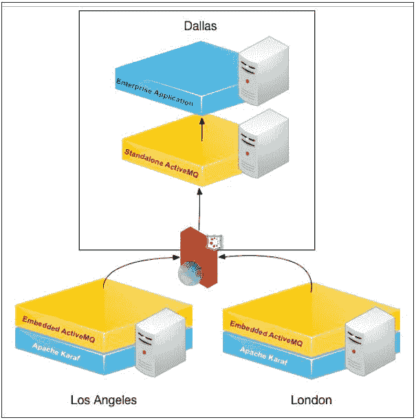

### 小贴士

仔细考虑是否真的需要一个嵌入式代理。

# 将 Apache ActiveMQ 模块安装到 Apache Karaf 中

将 ActiveMQ 代理安装到 Karaf 实例中几乎不需要任何努力。本食谱将向您展示如何轻松地集成并运行 ActiveMQ。为了在 Karaf 中安装 ActiveMQ 代理，我们首先需要添加功能 URL。

## 如何操作...

开箱即用，Karaf 并未安装 ActiveMQ。但无需担心，Karaf 使得安装它变得非常简单。步骤如下：

1.  首先，我们需要通过添加我们期望使用的版本的仓库来安装 XML 功能。这可以通过以下命令完成：

    ```java
    feature:repo-add activemq <version>

    ```

    以下截图展示了如何启动：

    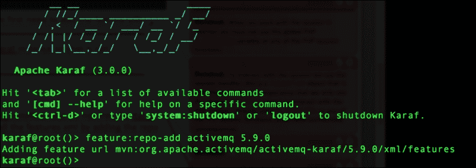

1.  现在我们有了这些功能可用，我们可以使用以下命令列出它们：

    ```java
    feature:list | grep activemq

    ```

    截图应该看起来像以下这样：

    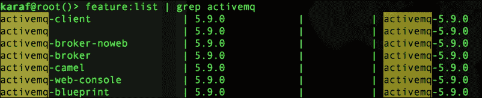

有几种方法可以只安装我们需要的部分。如果你的应用程序连接到任何 ActiveMQ 实例，那么在 OSGi 环境中你只需要连接客户端 API。只需安装`activemq-client`功能；这提供了实例化连接和发送或接收消息所需的必要类。你可以使用以下命令完成此操作：

```java
feature:install activemq-client

```

但是，由于我们在 Karaf 实例中嵌入代理，我们需要运行以下命令：

```java
feature:install activemq-broker

```

注意以下截图中的`activemq-client`、`activemq`、`activemq-broker`和`activemq-web-console`功能已被安装。这由第三列中的'X'表示。

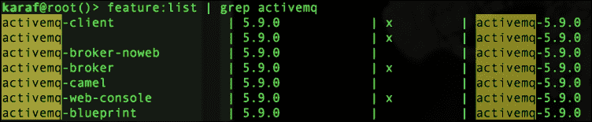

## 它是如何工作的…

如果我们安装 ActiveMQ 代理，其实例化配置在文件`etc/org.apache.activemq.server-default.cfg`中。该文件在启动嵌入式代理时被读取，并将使用引用的`activemq.xml`文件来定义 ActiveMQ 代理的初始化方式。该文件还配置了各种其他 JVM 参数。默认配置文件看起来像以下代码：

```java
broker-name=amq-broker
data=${karaf.data}/${broker-name}
config=${karaf.base}/etc/activemq.xml
```

将配置设置放在`.cfg`文件中的一个大好处是，对配置文件中值的任何更改都会导致代理停止并重新启动，从而合并更改。对`activemq.xml`文件的更改需要手动停止和启动代理。一个很好的配置文件更新是添加如下内存设置：

```java
jvmMemory=50
storage=100gb
tempStorage=10gb
```

然后，使用以下代码在`activemq.xml`文件中添加属性：

```java
<memoryUsage>
   <memoryUsage percentOfJvmHeap="${jvmMemory}"/>
</memoryUsage>
<storeUsage>
   <storeUsage limit="${storage}"/>
</storeUsage>
<tempUsage>
   <tempUsage limit="${tempStorage}"/>
</tempUsage>
```

### 小贴士

你能设置的配置属性越多，管理运行时就越容易。

# 使用 ActiveMQ 查询命令

嵌入式 ActiveMQ 的一个方便的特性是能够运行命令来监控代理活动。`query`命令提供了关于代理的基本信息。

## 准备就绪

为了开始，我们需要按照前一个菜谱中概述的步骤安装`activemq-broker`功能。一旦安装完成，我们就可以使用以下命令：

```java
activemq

```

输入命令后，按*Tab*键。这将列出所有可用的 ActiveMQ 命令，如下面的截图所示：


现在，仅仅运行命令相当无聊；在一个空的代理中看不到太多东西。

让我们加载数据，以便我们可以看到正在发生的事情。

## 如何操作…

现在，让我们开始通过代理发送一些数据，以便使这个例子更有趣、更真实。这个菜谱有一些辅助类我们可以用来加载数据到代理中：

1.  在“将 Apache ActiveMQ 模块安装到 Apache Karaf”的示例代码中运行`mvn clean install`命令。然后，你可以运行发布者对嵌入的 ActiveMQ。如果没有从`activemq.xml`文件更改默认设置，那么发布者代码中的默认设置将工作。我们可以使用以下命令运行发布者：

    ```java
    java -cp target/openwire-example-0.1-SNAPSHOT.jar example.Publisher

    ```

    这将向代理发送 10001 条消息，包括关闭消息。

1.  现在我们可以看到测试队列中有 10001 条消息等待，让我们继续使用我们的`Listener`来消费它们，如下面的命令所示：

    ```java
    java -cp target/openwire-example-0.1-SNAPSHOT.jar example.Listener

    ```

    这将在队列上创建一个消费者并拉取消息。

1.  能够一眼看到队列是件好事，但如果我们需要看到更多关于队列的信息怎么办？在许多情况下，我们需要看到队列消耗了多少内存，或者消费者数量，或者任何数量的参数。一个好的方法是使用查询命令，如下所示：

    ```java
    activemq:query -QQueue=test

    ```

这将列出队列的属性，就像你可能在 JConsole 中找到的那样，JConsole 是 Java 提供的一个 JMX 监控工具。这是一种使用脚本监控队列属性或用于持续集成测试监控结果的好方法。我们可以查看在调试时在 JConsole 中经常查看的一些属性。我们可以看到队列的深度是 10001。这可以在 JConsole 的**QueueSize**参数下找到。但如果我们想看到一个告诉我们队列健康状况的参数，让我们看看**MemoryPercentageUsage**参数。

我们可以在 JConsole 中看到当前值是**3**，如下面的屏幕截图所示：

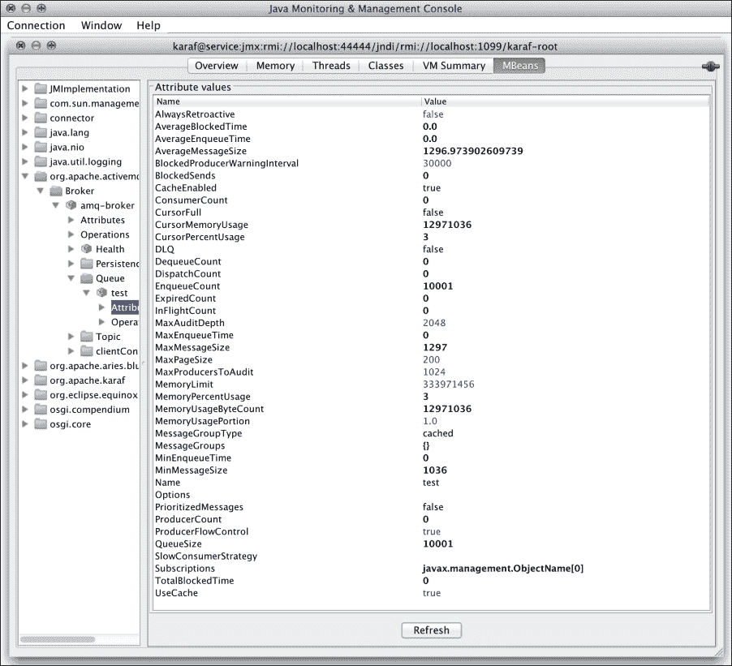

要查看这些参数的一个更简单的方法是使用 Karaf 控制台命令`activemq:query`。这使我们免去了打开 JConsole 并输入长远程进程 URL 的麻烦：`service:jmx:rmi://localhost:44444/jndi/rmi://localhost:1099/karaf-root`。

然后，我们可以输入用户名和密码。或者，我们可以简单地使用`activemq:query –QQueue=<queue_name>`命令，通过 JMX 查询队列统计信息。下面的屏幕截图显示了控制台将显示的内容：

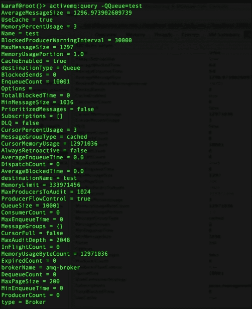

由于我们是命令行高手，我们可以使用`|`命令来 grep 我们感兴趣的信息。这在上面的屏幕截图中有展示：

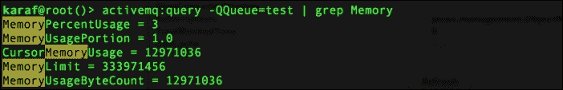

注意到**MemoryPercentUsage**（如前一个屏幕截图所示）的统计数据包含在内，以及所有其他基于内存的属性。另一个有用的过滤器是计数。这将显示`enqueue`、`dequeue`、`inflight`、`producer`、`consumer`等的所有计数。

查询命令有许多选项。这些可以通过使用`--help`参数查看，如下所示：

```java
activemq:query --help

```

## 它是如何工作的…

**队列大小**列显示了当前在队列中等待被消费的消息数量。**出队**列是已被监听器消费的总消息数量。如果我们再次运行发布者代码，我们会看到队列大小再次增加到 10001，但**出队**值没有变化，这表明队列中有 10001 条消息。

大多数 ActiveMQ 命令都是通过 MBeans 或 JMX 提供的。许多相同的功能也通过 JConsole 提供。

## 相关内容

+   **使用 ActiveMQ list 命令**的配方

+   **使用 ActiveMQ dstat 命令**的配方

# 使用 ActiveMQ list 命令

`list`命令可以用来列出在 Karaf 容器内当前运行的代理。

## 准备中

为了开始，我们需要安装`activemq-broker`功能。参考以下屏幕截图中的`activemq:query`命令：


## 如何操作...

要列出在这个 Karaf 实例内部当前运行的嵌入式所有代理，我们可以简单地运行以下命令：

```java
karaf@root()> activemq:list

```

这将列出以下嵌入式代理名称：

```java
brokerName = amq-broker

```

## 工作原理...

这个`activemq`命令将在 JMX 连接上调用`JmxMBeansUtil.getAllBrokers`类，并检索任何当前正在运行的代理的名称。

## 相关内容

+   **使用 ActiveMQ 查询命令**的配方

+   **使用 ActiveMQ dstat 命令**的配方

# 使用 ActiveMQ dstat 命令

`dstat`命令是一种方便的方法，可以一眼看到队列消息统计信息。它将列出队列，包括队列大小、生产者和消费者数量、入队和出队消息数量以及内存使用百分比。

## 准备中

为了开始，我们需要安装`activemq-broker`功能。

### 小贴士

如果你运行过任何之前的配方，一个好的方法是停止 Karaf，删除数据目录，然后重新启动。这将清理之前运行的所有数据。记住在重新启动后重新安装`activemq-broker`功能。

例如，让我们运行`activemq:dstat`命令，如下面的屏幕截图所示。

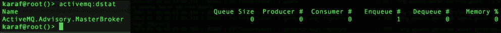

并不太令人印象深刻。没有数据，这些命令可能会相当无聊。在之前的屏幕截图中，我们可以看到此刻我们定义了一个队列，没有消息，没有生产者，也没有消费者。所以，让我们加载数据来看看发生了什么。

## 如何操作...

我们需要开始通过代理发送一些数据，以便使这个过程更加有趣和真实。这个配方有一些辅助类我们可以用来加载数据到代理。这可以按以下方式完成：

1.  在**将 Apache ActiveMQ 模块安装到 Apache Karaf**配方下的示例代码中运行`mvn clean install`命令。然后，你可以对嵌入式 ActiveMQ 运行发布者。

1.  如果没有从 `activemq.xml` 文件更改默认值，则发布者代码中的默认值将工作。我们可以使用以下命令运行发布者：

    ```java
    java -cp target/openwire-example-0.1-SNAPSHOT.jar example.Publisher

    ```

    这将向代理发送 10001 条消息。现在我们可以查看 `dstat` 代理，看看是否有任何变化。以下屏幕截图显示了 `dstat` 代理的结果：

    

    使用 `dstat` 命令，我们可以看到发布者已经在测试队列上放置了 10001 条消息，并且还有几条通知消息已经入队。

    ### 提示

    通知消息是特定于 ActiveMQ 的消息，旨在通知您事件。

1.  既然我们可以看到我们有 10001 条消息在测试队列中等待，让我们继续使用我们的监听器使用以下命令消费它们：

    ```java
    java -cp target/openwire-example-0.1-SNAPSHOT.jar example.Listener

    ```

    这将在队列上创建一个消费者并拉取消息。我们可以通过 `dstat` 命令看到我们队列上发生的事情。这将在以下屏幕截图中显示：

    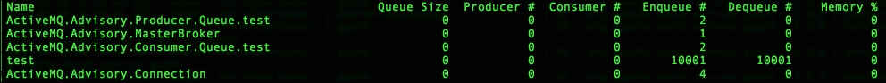

## 工作原理…

`dstat` 命令使用 ServerInvocationHandler 接口通过 JMX 连接创建 QueueViewMBean 接口或 TopicViewMBean 接口的实例。这些提供了关于队列或主题的统计信息。统计信息简单地列在控制台上，以提供队列/主题的高级快照。

## 参见

+   *使用 ActiveMQ 清除命令* 菜谱

+   *使用 ActiveMQ 查询命令* 菜谱

# 使用 ActiveMQ 清除命令

清除数据的实用命令是 `purge` 命令。它可以与通配符结合使用，以清除大量队列。

## 准备工作

以类似 *使用 ActiveMQ dstat 命令* 菜谱中的方式安装 `activemq-broker` 功能。

## 如何做…

在我们能够清除数据之前，我们首先需要加载数据。我们可以使用前面菜谱中提供的示例代码加载数据。步骤如下：

1.  我们可以使用以下命令再次运行发布者：

    ```java
    java -cp target/openwire-example-0.1-SNAPSHOT.jar example.Publisher

    ```

1.  使用前面菜谱中的 `dstat` 命令，我们可以在以下屏幕截图中看到我们已将 10001 条消息加载到嵌入式代理的测试队列中：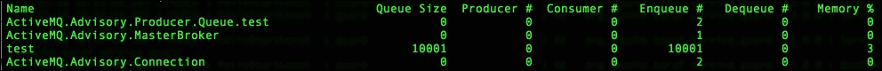

    `purge` 命令将使用通配符和 SQL92 语法从任意数量的队列中删除数据。

1.  现在，使用我们在 *将 Apache ActiveMQ 模块安装到 Apache Karaf* 脚本中看到的发布者向队列中添加消息。为了乐趣，运行几次。现在，使用以下命令查询队列，看看我们有多少条消息：

    ```java
    activemq:query -QQueue=* --view EnqueueCount

    ```

    ### 注意

    使用 `*` 字符作为队列名称将返回所有队列的 `EnqueueCount` 值，但在这个例子中，我们只有测试队列。

    我们可以看到，经过两次运行，我们的 `EnqueueCount` 值为 **20002**，如下面的屏幕截图所示：

    

1.  在运行发布者几次之后，现在我们可以看到队列中有成千上万的消息。现在运行以下 `purge` 命令针对测试队列：

    ```java
    activemq:purge test

    ```

    

    `purge` 命令会移除给定队列中的所有消息。让我们重新运行以下 `query` 命令，看看队列是否被清空：

    ```java
    activemq:query -QQueue=* --view EnqueueCount

    ```

## 它是如何工作的…

ActiveMQ 代码库中的 `PurgeCommand` 类用于在所选队列中清除消息。如果没有定义队列，如以下命令所示，它将清除所有队列中的所有消息：

```java
activemq:purge

```

我们可以使用类似于 `JMSPriority>2,MyHeader='Foo'` 的 AMQ 特定语言，或者我们可以使用 SQL-92 语法 `(JMSPriority>2) AND (MyHeader='Foo')` 来选择要删除的特定消息。

## 参见

+   *使用 ActiveMQ 列表命令* 的配方

+   *使用 ActiveMQ 查询命令* 的配方

# 使用 JMS 连接工厂命令

现在我们已经有一个嵌入式代理，并且查看了一些用于查看代理属性和统计信息的命令，让我们看看如何使用 JMS 命令与代理交互。在这个配方中，我们将通过创建连接工厂来查看创建和与代理交互的命令。

## 准备就绪

为了我们能够控制连接工厂并向嵌入式代理发送消息，我们首先需要使用以下 JMS 功能命令安装所需的命令：

```java
feature:install jms

```

使用 *Tab* 键，我们将看到可用于创建、发送、浏览消息以及创建连接工厂的 JMS 命令列表。这些命令在以下屏幕截图中列出：

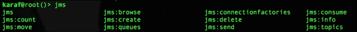

首先，让我们为我们的嵌入式代理创建一个连接工厂。我们使用 `jms:create` 命令来完成这项工作。

### 小贴士

请务必参考 `--help` 命令以获取所需和可选参数。

## 如何操作…

让我们首先创建一个连接工厂，这样我们就可以发送消息了。创建连接工厂只需要以下命令：

```java
jms:create [options] name

```

因此，对于这个例子，以下命令将用于将类型为 `-t activemq` 的连接到 URL `-u tcp://localhost:61616`：

```java
jms:create -t activemq --url tcp://localhost:61616 cookbook

```

## 它是如何工作的…

这将使用由 `–t` 选项定义的 ActiveMQConnectionFactory 创建连接工厂（另一个选项是 WebsphereMQ）。我们可以通过在命令行中执行 `la` 命令来验证我们的工厂确实已设置。你的最后一条条目应该类似于以下命令行输出：

```java
51 | Active   |  80 | 0.0.0 | connectionfactory-cookbook.xml

```

### 注意

注意，XML 文件命名的模式是 `connectionfactory-<name>.xml`。在我们的例子中，我们使用了名称 'cookbook'。如果不是最后一个条目，或者你没有看到它，尝试使用 `la | grep cookbook` 命令。

在 Karaf 实例的`deploy`目录中创建了一个名为`connectionfactory-cookbook.xml`的文件，如下面的代码所示。这是一个 Blueprint XML 文件，它将实例化连接工厂、池化连接工厂、资源管理器和事务管理器。

```java
<?xml version="1.0" encoding="UTF-8"?>
<blueprint >

    <bean id="activemqConnectionFactory" class="org.apache.activemq.ActiveMQConnectionFactory">
        <property name="brokerURL" value="tcp://localhost:61616" />
    </bean>

    <bean id="pooledConnectionFactory" class="org.apache.activemq.pool.PooledConnectionFactory">
        <property name="maxConnections" value="8" />
        <property name="connectionFactory" ref="activemqConnectionFactory" />
    </bean>

    <bean id="resourceManager" class="org.apache.activemq.pool.ActiveMQResourceManager" init-method="recoverResource">
        <property name="transactionManager" ref="transactionManager" />
        <property name="connectionFactory" ref="activemqConnectionFactory" />
        <property name="resourceName" value="activemq.localhost" />
    </bean>

    <reference id="transactionManager" interface="javax.transaction.TransactionManager" />

    <service ref="pooledConnectionFactory" interface="javax.jms.ConnectionFactory">
        <service-properties>
            <entry key="name" value="cookbook" />
            <entry key="osgi.jndi.service.name" value="/jms/cookbook" />
        </service-properties>
    </service>

</blueprint>
```

池化连接工厂以 JNDI 名称`jms/cookbook`添加到服务中。这里需要注意的重要信息是用于定义基于该 URL 的连接的`-u`选项，这也基于该 URL 创建了连接池。这对于系统资源管理方面是一个重要的输入。

## 相关内容

+   *使用 JMS 发送命令*菜谱

# 使用 JMS 发送命令

在调试或测试代码时，能够向特定队列发送消息是非常方便的。这可以通过在 Karaf 的命令控制台中使用 JMS 子 shell 来完成。

## 准备工作

确保 JMS 功能已安装并可用。为了通过 JMS 使用大多数命令，我们需要创建一个连接工厂（参见*使用 JMS 连接工厂命令*菜谱）。

## 如何操作…

首先，让我们使用`info`命令确保服务到位。连接工厂可以通过指定的名称`cookbook`或 JNDI 服务名称`jms/cookbook`来引用，如下面的命令所示：

```java
karaf@root()> jms:info jms/cookbook

Property | Value 
-------------------
product  | ActiveMQ
version  | 5.9.0

```

现在我们已经验证了 JMS 连接工厂，我们可以使用它向代理发送消息。这可以通过以下命令完成：

```java
karaf@root()> jms:send jms/cookbook cookbookQueue "the recipes are sweet"

```

这将使用我们连接工厂的 JNDI 名称`jms/cookbook`向`cookbookQueue`发送一条消息，`the recipes are sweet`。

## 工作原理…

`send`命令将包装命令行中的字符串变量，并将其放入 JMS 消息中，然后将消息发送到指定的队列。如果您查看命令行，有三个参数，如下所示：

+   连接到连接工厂的 JNDI 引用

+   我们要发送消息到的队列名称

+   消息体

## 相关内容

+   查看`browse`命令以了解如何查看您刚刚发送到代理的消息。您也可以在[`karaf.apache.org/manual/latest/users-guide/jms.html`](http://karaf.apache.org/manual/latest/users-guide/jms.html)中查看。

# 使用 JMS 浏览命令

现在我们已经有一个嵌入式代理并且查看了一些用于查看代理属性和统计信息的命令，让我们看看如何使用命令与代理交互。在这个菜谱中，我们将查看浏览消息的命令。

## 准备工作

为了让我们能够控制连接工厂并向嵌入式代理发送消息，我们首先需要使用以下 JMS 功能命令安装命令，就像我们在前面的菜谱中所做的那样：

```java
feature:install jms

```

首先，让我们为我们的嵌入式代理创建一个连接工厂。我们使用`jms:create`命令来完成此操作。

### 小贴士

一定要参考`--help`命令以获取所需或可选参数。

## 如何操作…

命令的实际核心是浏览队列中消息的能力。以下是一个示例 `browse` 命令：

```java
karaf@root()> jms:browse jms/cookbook cookbookQueue

```

这允许您查看消息内容、持久性（投递模式）、过期时间、ID、回复到值、目的地等。这是在任何给定时间监控队列中内容的快速方法。前面 `browse` 命令的输出如下：

```java
ID:mbp.pk5001z-55253-1393261878969-4:2:1:1:1 | the recipes are sweet | UTF-8   |   |   | Persistent    | queue://cookbookQueue | Never      | 4        | false       |         | Mon Feb 24 14:55:21 MST 2014

```

## 它是如何工作的…

在队列中浏览消息很简单。命令行上的参数告诉 `browse` 命令使用哪个连接工厂以及要浏览哪个队列。

# 使用 Apache Karaf 配置和部署主/从代理

在这个菜谱中，我们将设置和部署两个带有嵌入式 ActiveMQ 的 Karaf 实例，配置为主/从配置。这用于消息系统中的高可用性。这将允许系统在活动实例失败的情况下继续运行。

## 准备工作

首先，我们需要启动两个带有嵌入式代理的 Karaf 实例。如果我们在这两台不同的机器上执行此操作，实际上会更简单，因为我们不会在两台机器上使用默认值时遇到端口冲突。记住，如果你决定在单台机器上运行此部署，Karaf 中嵌入的 Jetty 和 ActiveMQ 中的一个实例需要更改其端口。

## 如何操作…

由于我们只能假设我们有一台机器可以工作，我们将介绍如何在单台机器上运行两个 Karaf 实例。我们可以通过将 Karaf 的 `.zip` 或 `.tar` 文件解压到新目录或直接复制粘贴当前实例到新目录来创建第二个实例。现在，我们必须更改其中一个实例的端口号设置。这可以通过以下步骤完成：

1.  打开 `<karaf-home>/etc/` 文件夹中的 `org.apache.karaf.management.cfg` 文件，找到以下代码行：

    ```java
    #
    # Port number for RMI registry connection
    #
    rmiRegistryPort = 1099
    ```

1.  将端口更改为未使用的端口，例如 `1096`。然后，如以下代码所示更改 RMI 服务器连接端口：

    ```java
    #
    # Port number for RMI server connection
    #
    rmiServerPort = 44444
    ```

1.  我们可以将其更改为类似 `44446` 的值。现在，我们可以启动第二个实例而不会发生端口冲突。但我们的工作还没有完成。我们仍然需要配置 ActiveMQ 实例以实现故障转移。

对 Karaf 的实例 1 和实例 2 进行以下更改：

1.  打开 `<karaf-home>/etc/` 文件夹中的 `org.apache.activemq.server-default.cfg` 文件，将以下代码更改为磁盘上的硬编码位置：

    ```java
    data=${karaf.data}/${broker-name}
    ```

    一个示例可能如下所示：

    ```java
    data=/Users/default/data
    ```

1.  打开 `<karaf-home>/etc/` 文件夹中的 `jetty.xml` 文件，将 `jetty.port` 的值更改为类似 `8186` 的值，如下面的代码所示：

    ```java
    <Property name="jetty.port" default="8186" />
    ```

1.  打开 `<karaf-home>/etc/` 文件夹中的 `org.apache.karaf.shell.cfg` 文件，将 `sshPort` 的值更改为类似 `8106` 的值，如下面的代码所示：

    ```java
    sshPort = 8106
    sshHost = 0.0.0.0
    ```

1.  由于我们在同一台机器上运行两个 ActiveMQ 实例，因此将第二个 ActiveMQ 实例的端口更改为不同的端口会更完整，尽管这不是必需的，因为端口只有在 ActiveMQ 锁定文件位置后才会分配（在这个配置中，这一步是可选的；然而，在单台机器上的代理网络配置中更为重要，因为两个实例都是活动的）。可以按照以下方式完成：

    ```java
    <transportConnector name="openwire" uri="tcp://0.0.0.0:61617?maximumConnections=1000&amp;wireFormat.maxFrameSize=104857600"/>
    ```

1.  在更改配置文件后，保存它们并启动 Karaf 的两个实例。在实例 1 上按照以下方式安装 `activemq-broker` 功能：

    ```java
    karaf> feature:repo-add activemq 5.9.0
    karaf> feature:install activemq-broker

    ```

1.  我们将看到嵌入式 ActiveMQ 实例启动没有问题。现在在实例 2 上做同样的事情，并查看 `data/log` 文件夹中的 `karaf.log` 文件中的实例 2 的日志。

1.  在实例 2 的日志文件中搜索短语 `could not be locked`。我们将看到以下输出行：

    ```java
    2014-02-23 20:37:12,472 | INFO  | ctivemq.server]) | SharedFileLocker                 | 103 - org.apache.activemq.activemq-osgi - 5.9.0 | Database /Users/default/data/kahadb/lock is locked... waiting 10 seconds for the database to be unlocked. Reason: java.io.IOException: File '/Users/default/data/kahadb/lock' could not be locked.
    ```

1.  这表明第二个嵌入式代理实例处于等待状态，并未完全实例化。要查看实例 2 的启动和初始化，请在实例 1 上按 *Ctrl* + *D*（以关闭实例）。如果您正在跟踪日志文件或刷新您的查看器中的日志文件，您将看到以下输出：

    ```java
    2014-02-23 20:40:02,909 | INFO  | ctivemq.server]) | TransportServerThreadSupport     | 103 - org.apache.activemq.activemq-osgi - 5.9.0 | Listening for connections at: tcp:// mbp.pk5001z:61616?maximumConnections=1000&wireFormat.maxFrameSize=104857600
    2014-02-23 20:40:02,909 | INFO  | ctivemq.server]) | TransportConnector               | 103 - org.apache.activemq.activemq-osgi - 5.9.0 | Connector openwire started
    2014-02-23 20:40:02,909 | INFO  | ctivemq.server]) | BrokerService                    | 103 - org.apache.activemq.activemq-osgi - 5.9.0 | Apache ActiveMQ 5.9.0 (cookbook-broker, ID: mbp.pk5001z-53046-1393213202778-0:1) started
    ```

这表明实例 2 上的从代理已启动并初始化了连接。

## 如何工作…

ActiveMQ 通过几个选项为我们提供了高可用性。在本食谱的情况下，我们使用基于文件的持久性（`kahadb`）。这允许我们将两个实例指向相同的数据文件位置以建立主实例或从实例。第一个启动的实例将锁定文件位置，然后完成初始化。另一个实例将查看相同的文件位置，并看到已经建立了锁定。然后，它将记录 IOException 并在默认的 10 秒后再次尝试。

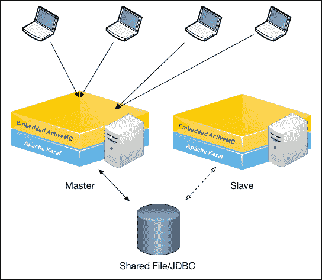

之前的图示显示主 ActiveMQ 实例已从文件位置建立锁定。它已实例化了在 `etc` 文件夹下由传输连接元素定义的 `activemq.xml` 文件中配置的所有连接。这允许客户端现在连接到主实例。一旦实例关闭，这些连接将被终止。

假设客户端已配置为使用以下故障转移协议连接到从实例：

```java
failover:(tcp://master:61616,tcp://slave:61617)?options
```

一旦辅助代理完成初始化，客户端机器将自动重新连接到从机器。这在下图中得到演示：

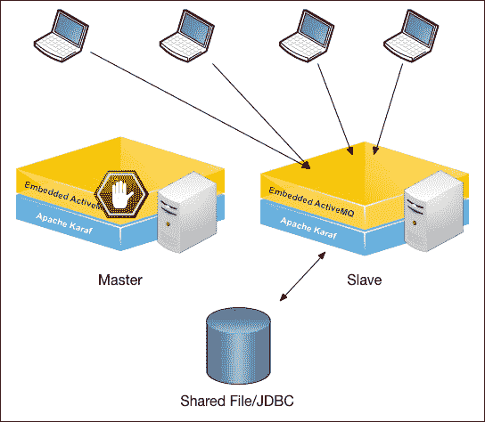

在这一点上，我们可以重新启动原始主实例（实例 1），它现在将等待获取文件锁定。这使我们能够在不重新启动实例或恢复数据的情况下获得主/从设置。

## 参见

+   *使用 Apache Karaf 配置和部署代理网络* 食谱

# 使用 Apache Karaf 配置和部署代理网络

许多时候，单个系统可能不足以处理应用程序的负载。在这种情况下，需要扩展以在多个系统之间平衡负载。我们可以使用**代理网络**（**NoB**）配置中的嵌入式 ActiveMQ 实例来扩展应用程序。

这与主/从配置不同，因为我们会有两个活动实例，而不是一个活动实例和一个被动实例。

## 准备工作

通过遵循上一个配方中的相同初始设置，我们需要运行两个 Karaf 实例。我们可以在单个机器或多个机器上证明这个概念。对于这个配方，我们再次将向您展示如何在同一台机器上设置两个实例，这需要为不同的 Karaf 实例使用不同的端口。

确保两个实例的默认设置就绪。

## 如何操作…

请按照以下步骤配置和部署一个代理网络配置：

1.  打开`<karaf-home>/etc/`文件夹下的`org.apache.activemq.server-defaults.cfg`文件，并确保以下数据值已设置：

    ```java
    data=${karaf.data}/${broker-name}
    ```

    这将告诉嵌入式 ActiveMQ 实例使用前面提到的参数定义的本地数据文件夹。

1.  将实例 1 的代理名称选项更改为`recipe-3-broker-1`，并将实例 2 的代理名称选项更改为`recipe-3-broker-2`。因此，文件中的值应如下代码所示：

    ```java
    Instance 1:
    broker-name=recipe-3-broker-1
    Instance 2:
    broker-name=recipe-3-broker-2
    ```

    这样，在通过 JMX 查看时，可以很容易地区分不同的代理。`karaf.data`属性是基于 Karaf 位置设置的系统属性。

1.  对于这个配方，让我们处理实例 2。首先，我们必须修改`etc/activemq.xml`文件，以使其具有一个网络连接器，将其与实例连接起来。以下是需要添加的 XML 代码：

    ```java
    <networkConnectors>
      <networkConnector  uri="static:(tcp://0.0.0.0:61616)"
                         duplex="true"
                         userName="karaf"
                         password="karaf"/>
    </networkConnectors>
    ```

    注意 URI 具有静态协议，通过 TCP 连接到实例 1 的端口（在这种情况下，实例 1 的默认端口被保留为`61616`）。我们打开双工，允许通过单个管道进行双向通信，并传递用户名和密码。

1.  为了避免端口冲突，我们需要将实例 2 的传输连接器端口更改为除了`61616`之外的其他端口，如下所示：

    ```java
    <transportConnector name="openwire" uri="tcp://0.0.0.0:61617?
    maximumConnections=1000&wireFormat.maxFrameSize=104857600"/>
    ```

1.  再做一次更改，我们就可以开始测试了。我们需要更改位于`etc`文件夹下的`jetty.xml`文件中的端口。默认端口是`8181`，但由于实例 1 正在使用该端口，我们需要将实例 2 的端口更改为其他端口。对于这个配方，我使用了`8182`，如下代码所示：

    ```java
    <Set name="port">
       <Property name="jetty.port" default="8182" />
    </Set>
    ```

1.  我们现在可以启动这两个实例。如果我们监控实例 2 的日志，我们将看到以下输出：

    ```java
    Establishing network connection from vm://recipe-3-broker-1?async=false&network=true to tcp://0.0.0.0:61616

    vm:// recipe-3-broker-1 started

    Network connection between vm:// recipe-3-broker-1#24 and tcp://mbp.pk5001z/192.168.0.97:61616@55254 (recipe-3-broker-2) has been established.
    ```

    日志条目表明实例 2 已找到实例 1，并在两者之间建立了连接。

## 它是如何工作的…

经纪人网络配置可用于两种不同的拓扑：垂直或水平。首先，让我们看看水平扩展，这更多的是为了扩展目的。这种拓扑通常用于为系统提供极高的吞吐量。主要思想是不要增加消息必须通过的数量，以便被您的应用程序消费。相反，它旨在平衡多个服务器之间的负载。注意在以下图中，每个实例都连接了两个客户端机器，使得每个经纪人/Karaf 对只需处理两个客户端的消息。

### 小贴士

每个经纪人实例都有自己的消息存储，并且不被认为是高可用拓扑。

即使客户端可以从一个客户端切换到另一个客户端，持久化数据在实例之间并不共享。这意味着如果经纪人实例中的一个实例死亡，那么在该存储中的挂起消息将不会处理，直到经纪人重新启动，尽管客户端已经切换到活动的经纪人实例。看看以下图示：

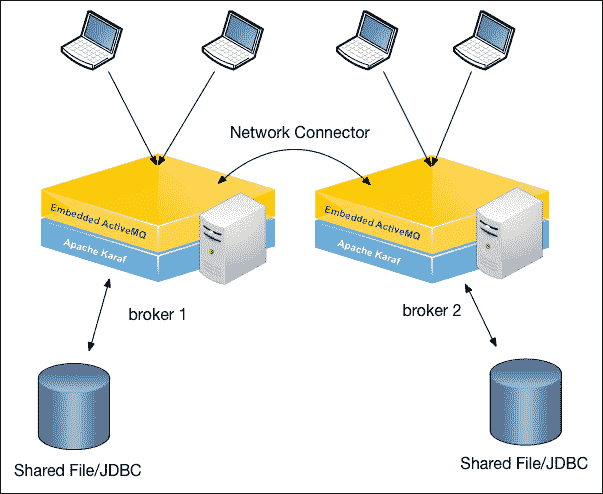

拥有一个经纪人网络的好处是能够将消息转发给空闲的客户。如果一个消息被发送到本地的**经纪人 1**，但所有客户都在忙碌，那么 ActiveMQ 会将消息转发到**经纪人 2**上的任何空闲客户。这被认为是水平扩展。

## 还有更多…

还有垂直扩展的概念。但这有一个完全不同的用例。当使用垂直扩展时，通常不是性能问题。在大多数情况下，垂直扩展用于 WAN 上的通信问题。以下图示中概述了一个很好的例子：

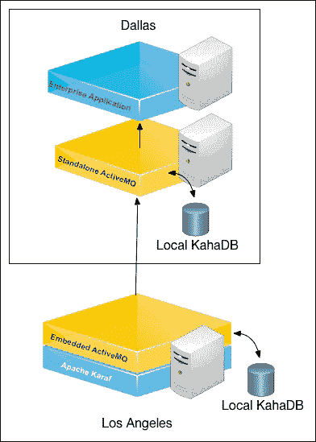

在之前的图中，使用本地嵌入的 ActiveMQ 以避免在洛杉矶和达拉斯之间的连接丢失时导致应用程序停机。因此，本地应用程序将直接与本地实例通信，无需担心 WAN 是否在线。然后，本地 ActiveMQ 将负责建立和维护与后端服务的连接。

### 注意

垂直扩展会有性能成本。

垂直扩展会强制进行两个经纪人的跳转。因此，您必须确定从需求中哪个更重要：性能或稳定性。

## 参见

+   *配置*和*部署*Apache Karaf 的 master/slave 经纪人食谱
