# 第四章：使用 Pax Web 托管 Web 服务器

在本章中，我们将涵盖以下主题：

+   在 Apache Karaf 中安装 Pax 模块

+   在 Apache Karaf 中安装扩展 Http 服务

+   在 Apache Karaf 中配置部署的 Pax Web 模块

+   构建一个可在 Apache Karaf 中托管的 Http 服务项目

+   在 Apache Karaf 中使用白板模式构建 Http 服务

+   使用 Apache Karaf 自定义 HttpContext 构建应用程序

+   在 Apache Karaf 中构建一个标准 Web 项目以托管

+   在 Apache Karaf 中配置 Web 应用程序的安全

+   在 Apache Karaf 中将 Web 项目绑定到特定主机

+   使用 Apache Karaf 构建带有 Servlet 3.0 注解的 Web 应用程序

+   使用 Apache Karaf 创建 CDI Web 应用程序

# 简介

本章解释了如何通过 Pax Web 增强您的 Apache Karaf 以作为 Web 容器。OPS4j Pax Web 项目是一个 OSGi R4 Http 服务和 Web 应用程序（参考*第一百二十八章*，*OSGi 企业发布 4*）的实现。它通过更好的 servlet、过滤器、监听器、错误页面、JavaServer Pages（JSPs）等支持扩展 Http 服务，以支持最新的 Java Servlet 规范。

Karaf 的标准功能包含一组选项，用于以不同风味安装 Pax Web。有如下选项：

+   基本 Http 服务

+   支持白板模式和 JSPs 的增强 Http 服务

+   支持**Web 应用程序存档**（**WAR**）和**Web 应用程序包**（**WAB**）文件的完整 Web 容器配置

### 小贴士

对 Apache Karaf 和 Pax Web 结合使用有更深入理解兴趣的读者应咨询 OPS4j 社区。您将找到更多关于 Pax Web 通用用法和 Apache Karaf 特长的示例。

# 在 Apache Karaf 中安装 Pax 模块

要开始使用 Http 服务，您需要安装前面提到的功能之一。本食谱将指导您安装 Pax Web 的不同扩展以及它是如何工作的。

## 如何操作…

要安装基本 Http 服务，启动您的 Apache Karaf 服务器，并通过控制台使用以下命令安装 Http 服务功能：

```java
karaf@root()> feature:install http

```

## 它是如何工作的…

安装此功能后，使用`la`命令列出捆绑包。这将向您显示以下附加捆绑包到您的 Karaf 实例：

```java
78 | Active   |  30 | 2.2.0           | Apache ServiceMix :: Specs :: Activation API 1.4
79 | Active   |  30 | 1.0            | Servlet 3.0
80 | Active   |  30 | 1.4.4          | JavaMail API (compat)
81 | Active   |  30 | 1.1.1          | geronimo-jta_1.1_spec
82 | Active   |  30 | 1.0.1          | Annotation 1.1
83 | Active   |  30 | 1.1            | Java Authentication SPI for Containers
84 | Active   |  30 | 8.1.14         | Jetty :: Aggregate :: All Server
85 | Active   |  30 | 1.6.0          | OPS4J Pax Swissbox :: OSGi Core
86 | Active   |  30 | 1.6.0          | OPS4J Pax Swissbox :: Optional JCL
87 | Active   |  20 | 3.16.0         | Apache XBean OSGI Bundle Utilities
88 | Active   |  20 | 3.16.0         | Apache XBean :: ASM 4 shaded (repackaged)
89 | Active   |  20 | 3.16           | Apache XBean :: Reflect
90 | Active   |  20 | 3.16.0         | Apache XBean :: Finder shaded (repackaged)
91 | Active   |  30 | 3.1.0          | OPS4J Pax Web - API
92 | Active   |  30 | 3.1.0          | OPS4J Pax Web - Service SPI
93 | Active   |  30 | 3.1.0          | OPS4J Pax Web - Runtime
94 | Active   |  30 | 3.1.0          | OPS4J Pax Web - Jetty
95 | Active   |  30 | 3.0.1          | Apache Karaf :: HTTP :: Core
96 | Active   |  30 | 3.0.1          | Apache Karaf :: HTTP :: Commands

```

当然，它将安装所需的 Jetty 服务器以服务 Web 内容，以及四个基本的 Pax Web 捆绑包，以拥有最小的 Http 服务。这四个捆绑包包含 API、服务 SPI、运行时和 Jetty 服务器包装器，它负责启动底层的 Jetty 实例。所有这些由 HTTP 功能安装的捆绑包为您提供了使用 Http 服务的一些可能方式，但没有其他。这种场景通常足够用于运行简单的 servlet 和 Felix Web 控制台。

在此基本安装之上，Karaf 已经提供了一个简单的命令来检查当前安装的 servlet。它将为您提供 servlet 和注册别名的概览。以下是该命令：

```java
karaf@root()> http:list
ID | Servlet | Servlet-Name | State | Alias | Url
-------------------------------------------------

```

## 参考以下内容

+   在 Apache Karaf 中托管 Http Service 项目的构建配方

# 在 Apache Karaf 中安装扩展的 Http 服务

通常，仅仅使用基本的 Http 服务已经不再足够，尤其是在需要服务 JSP 或完整的 Web 应用程序时。因此，需要一个更好用的容器。

## 如何操作...

1.  要安装 HTTP 白板功能，启动您的 Apache Karaf 服务器，并通过控制台使用以下命令安装 HTTP 白板功能：

    ```java
    karaf@root()> feature:install http-whiteboard

    ```

1.  使用以下命令将 Apache Karaf 服务器转换为一个功能齐全的 Web 容器：

    ```java
    karaf@root()> feature:install war

    ```

## 它是如何工作的...

白板功能安装了另外两个 Pax Web bundle。这两个 bundle 为您提供了 JSP 和白板支持。这两个 bundle 在以下命令行输出中显示：

```java
97 | Active   |  30 | 3.1.0       | OPS4J Pax Web - Jsp Support
98 | Active   |  30 | 3.1.0       | OPS4J Pax Web - Extender - Whiteboard

```

这使得 Pax Web 能够部署并服务于现在可用的 WebContainer 接口注册的 JSP。该接口是标准化 Http Service 的扩展。白板扩展器是另一种在 OSGi 中注册服务的方法。

### 小贴士

更多关于白板模式的详细信息可以在[`www.osgi.org/wiki/uploads/Links/whiteboard.pdf`](http://www.osgi.org/wiki/uploads/Links/whiteboard.pdf)找到。

使用 WAR 功能，Pax Web 的安装就完成了。这包括用于安装 OSGi WAB 文件的 WAR 扩展器，以及负责将 WAR 存档转换为 WAB 文件的 Pax URL WAR 处理器。以下列出了这些附加的 bundle：

```java
99  | Active   |  30 | 3.1.0       | OPS4J Pax Web - Extender - WAR
100 | Active   |  30 | 3.1.0       | OPS4J Pax Web - FileInstall Deployer
101 | Active   |  30 | 1.4.2       | OPS4J Pax Url - war
102 | Active   |  30 | 1.4.2       | OPS4J Pax Url - Commons
103 | Active   |  30 | 1.6.0       | OPS4J Pax Swissbox :: Bnd Utils
104 | Active   |  30 | 1.6.0       | OPS4J Pax Swissbox :: Property
105 | Active   |  30 | 1.43.0      | aQute Bundle Tool Library
106 | Active   |  30 | 3.0.1       | Apache Karaf :: Web :: Core
107 | Active   |  30 | 3.0.1       | Apache Karaf :: Web :: Commands

```

Karaf WAR 功能带来了另一个命令；`web:*`命令有助于分析已安装 WAR 的状态。以下是一个示例命令：

```java
karaf@root()> web:list
ID | State | Web-State | Level | Web-ContextPath | Name
-------------------------------------------------------

```

这些命令也有助于控制 web bundle 的状态。考虑以下命令：

```java
karaf@root()> web:
web:list     web:start    web:stop

```

`web:list`命令显示已安装 WAR 文件列表，并列出状态和`Web-ContextPath`。

## 参考以下内容

+   在 Apache Karaf 中使用白板模式构建 Http Service 的配方

+   在 Apache Karaf 中托管标准 Web 项目的构建配方

+   更多关于 WAR URL 处理器如何工作的详细信息，请访问[`github.com/jgoodyear/ApacheKarafCookbook/tree/master/chapter4`](https://github.com/jgoodyear/ApacheKarafCookbook/tree/master/chapter4)

# 配置在 Apache Karaf 中部署的 Pax Web 模块

Pax Web 使用 Jetty 作为底层的 Web 容器。OSGi Http Service 规范定义了一组用于配置 Http 服务的参数。除了这些标准配置参数之外，Pax Web 特定的参数也是可配置的。在这些配置参数之上，还可以根据进一步的需求配置 Jetty 本身。

## 如何操作...

Http Service 的配置是通过配置管理服务完成的。在安装 Http Service 期间，配置也会为服务 PID `org.ops4j.pax.web` 设置，如下代码片段所示：

```java
javax.servlet.context.tempdir = ${karaf.data}/pax-web-jsp
org.ops4j.pax.web.config.file = ${karaf.home}/etc/jetty.xml
org.osgi.service.http.port = 8181
```

## 它是如何工作的...

这个基本的配置集定义了 Jetty 服务器监听的 HTTP 端口，创建 JSP 服务器文件的 `temp` 目录，以及可选的 `jetty.xml` 文件的位置，用于增强 Jetty 配置。

### 小贴士

文档说明如何配置 `jetty.xml` 文件，可以在 [`wiki.eclipse.org/Jetty/Reference/jetty.xml`](http://wiki.eclipse.org/Jetty/Reference/jetty.xml) 找到。请确保您还查看使用 Pax Web 运行 Jetty 的特性，请参阅 [`ops4j1.jira.com/wiki/display/paxweb/Advanced+Jetty+Configuration`](https://ops4j1.jira.com/wiki/display/paxweb/Advanced+Jetty+Configuration)。

## 还有更多...

此外，可以将所有配置参数的配置文件放置在 `etc` 文件夹中。文件名类似于服务 PID，后缀为 `.cfg`。以下是从 `org.ops4j.pax.web.cfg` 配置文件中的摘录。完整的配置文件和 `jetty.xml` 文件可以在 [`github.com/jgoodyear/ApacheKarafCookbook/blob/master/chapter4/chapter4-recipe2`](https://github.com/jgoodyear/ApacheKarafCookbook/blob/master/chapter4/chapter4-recipe2) 找到。

```java
org.osgi.service.http.enabled = true
org.osgi.service.http.port = 8181
org.osgi.service.http.connector.name = default
org.osgi.service.http.useNIO = true
org.osgi.service.http.secure.enabled = true
org.osgi.service.http.port.secure = 8443
org.osgi.service.http.secure.connector.name = secureDefault
javax.servlet.context.tempdir = ${karaf.data}/pax-web-jsp
org.ops4j.pax.web.config.file=${karaf.base}/etc/jetty.xml
…
```

以下代码配置了额外的 JSP 参数：

```java
org.ops4j.pax.web.jsp.scratch.dir = 
org.ops4j.pax.web.jsp.check.interval = 300
…
org.ops4j.pax.web.jsp.precompilation = false
…
```

以下是为 NCSA 日志格式设置的配置：

```java
org.ops4j.pax.web.log.ncsa.enabled = false
org.ops4j.pax.web.log.ncsa.format = yyyy_mm_dd.request.log
org.ops4j.pax.web.log.ncsa.retaindays = 90
org.ops4j.pax.web.log.ncsa.append = true
org.ops4j.pax.web.log.ncsa.extended = true
org.ops4j.pax.web.log.ncsa.dispatch = false
org.ops4j.pax.web.log.ncsa.logtimezone = GMT
org.ops4j.pax.web.log.ncsa.directory = 
org.ops4j.pax.web.log.ncsa.latency = false
org.ops4j.pax.web.log.ncsa.cookies = false
org.ops4j.pax.web.log.ncsa.server = false
```

### 注意

关于 NCSA 日志格式的详细信息，请参阅 [`en.wikipedia.org/wiki/Common_Log_Format`](http://en.wikipedia.org/wiki/Common_Log_Format)。

以下配置用于拥有不同的虚拟主机和连接器：

```java
org.ops4j.pax.web.default.virtualhosts = 
org.ops4j.pax.web.default.connectors = 
```

更多详细信息，请参阅 *《在 Apache Karaf 中将 Web 项目绑定到特定主机》* 菜谱。

## 它是如何工作的...

此配置摘录显示了 Pax Web 内部已使用的默认配置。如果需要，可以在 Karaf shell 中设置一些或所有这些配置参数，或者将它们放置在 `etc` 文件夹中的 `org.ops4j.pax.web.cfg` 文件中。以下是如何通过 shell 命令设置 HTTP 端口的快速示例：

```java
karaf@root()> config:edit org.ops4j.pax.web
karaf@root()> config:property-set org.osgi.service.http.port 8080
karaf@root()> config:update

```

关于如何使用 `config` 命令的更多详细信息，请参阅 *《学习 Apache Karaf》*，作者：*Jamie Goodyear, Johan Edstrom, 和 Heath Kesler*，*Packt Publishing*。

当引用外部目录时，最好使用 `karaf.data` 环境变量，例如，通过切换 `org.ops4j.pax.web.log.ncsa.enabled` 选项到 `true` 来启用 NCSA 记录器。还需要将目录配置到特定的文件夹中，如下代码行所述：

```java
org.ops4j.pax.web.log.ncsa.directory = ${karaf.data}/ncsa-log/
```

对于 JSP 编译的 `scratch` 目录也是如此——最好配置如下：

```java
org.ops4j.pax.web.jsp.scratch.dir = ${karaf.data}/jsp-compile
```

# 构建 Http Service 项目以在 Apache Karaf 中托管

仅使用 Http 服务构建 Web 应用程序也意味着将服务减少到仅 servlet，因为 Http 服务只支持 servlet，不支持其他 Web 元素，如过滤器 JSP。在这个简化的集合中，仍然可以构建现代 Web 应用程序。例如，只需要一些 JavaScript 代码和一个生成 JSON 的 servlet 就可以构建一个现代 Web 应用程序。使用这些元素，结合 OSGi，你就可以得到 µ 服务完美的混合体。本食谱和以下食谱的重点仅在于 Http 服务的使用；因此，不要期望创建一个花哨的 Web 应用程序。完成之后，你将能够构建一个像下面截图所示的单一 servlet 应用程序：

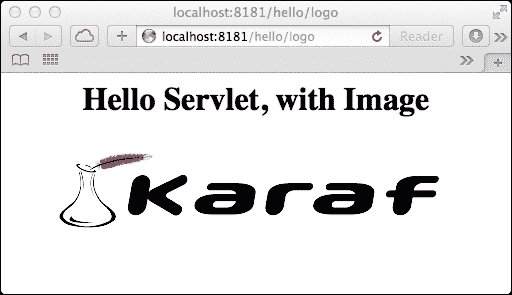

## 准备工作

要预配置 Apache Karaf 中安装的 Http 服务，请参阅 *在 Apache Karaf 中安装 Pax 模块* 食谱。源代码可以在 [`github.com/jgoodyear/ApacheKarafCookbook/tree/master/chapter4/chapter4-recipe3`](https://github.com/jgoodyear/ApacheKarafCookbook/tree/master/chapter4/chapter4-recipe3) 找到。

由于本书页面有限，最好总是查看完整的源代码，以避免样板代码。这就是为什么在这里只引用了本食谱中的关键部分。本食谱中使用的示例应用程序可以使用以下命令安装和启动：

```java
install -s mvn:com.packt/chapter4-recipe3/1.0.0-SNAPSHOT/jar

```

## 如何操作…

由于我们在这个食谱中使用 Http 服务，我们需要获取 `HttpService` 服务。为此，通常使用 ServiceTracker 机制。步骤如下：

1.  第一步是引用 Http 服务。在我们的示例应用程序的激活器中，创建了一个 `ServiceTracker` 对象，该对象引用创建此跟踪器的包，并声明要跟踪的服务类。第三个参数是 ServiceTrackerCustomizer 接口的实现。ServiceTracker 本身提供了一个默认实现，因此我们直接使用它。所有这些都在包激活器代码中完成，如下所示：

    ```java
    public void start(BundleContext bc) throws Exception {
      bundleContext = bc;
      tracker = new ServiceTracker<HttpService, HttpService>(bc, HttpService.class, this);
      tracker.open();
    }
    ```

1.  第二步是注册 servlet 作为服务。当服务可用时，ServiceTracker 将启动，并调用包激活器的 `addingService` 方法。在这里，与 servlet 注册一起创建了 `HttpContext` 函数和 servlet 的 `init` 参数，如下面的代码所示：

    ```java
    HttpContext httpContext = httpService.createDefaultHttpContext();
    Dictionary<String, Object> initParams = new Hashtable<String, Object>();
    ```

1.  在此之后，我们就可以使用 Http 服务注册 servlet 作为服务了。这通过以下简单的 API 调用完成：

    ```java
    httpService.registerServlet("/hello",
    new HelloServlet(), initParams, httpContext);
    ```

Http 服务也支持资源的注册，例如图像和 CSS 文件。Felix 网络控制台基于这两种机制。

为了注册资源，Http 服务 API 提供了另一种注册方法，如下面的代码所示：

```java
httpService.registerResources("/images", "/images", httpContext);
```

图片应包含在`images`文件夹中的 JAR 文件中（如下面的截图所示），在注册图片别名时使用：

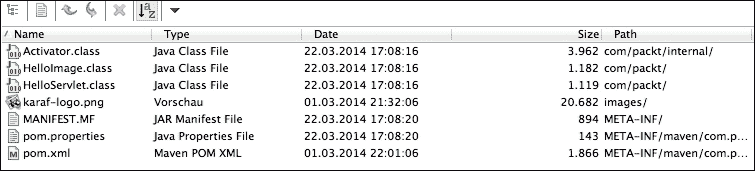

### 小贴士

相应的 API 可以在[`www.osgi.org/javadoc/r4v42/org/osgi/service/http/HttpService.html`](http://www.osgi.org/javadoc/r4v42/org/osgi/service/http/HttpService.html)找到。

要使用此图片，创建一个使用此图片的第二个 servlet，并使用不同的别名注册它，如下面的代码所示：

```java
httpService.registerServlet("/hello/logo", new HelloImage(), initParams, httpContext);
```

servlet 将图片作为根上下文中的资源引用，如下面的代码所示：

```java
out.println("");
```

## 它是如何工作的...

Http Service 配置并注册 HelloServlet 到底层 Jetty 服务器。从这一点开始，它被视为一个经典的 servlet 并相应地处理。资源需要额外的处理，因为 ResourceServlet 需要了解 OSGi 类加载，因此需要知道在哪里查找包的类路径中的资源。

## 参见

+   Http Service 仅提供基本的 HTTP 服务，例如服务 servlet 和资源。如果您想服务动态内容，如 JSPs，则需要 Pax Web 扩展 OSGi Http Service——Pax Web web 容器。这可以与 Whiteboard 扩展一起使用，并在 Apache Karaf 中使用*Building a Http Service with the Whiteboard pattern*配方。

# 在 Apache Karaf 中使用 Whiteboard 模式构建 Http Service

Whiteboard 模式是一种注册 servlet、资源、JSP 或过滤器的方法。使用 Whiteboard 扩展，服务的注册方式与上一个配方相反。bundle activator 不需要等待 Http Service 出现；它只是注册 servlet 和其他资源作为服务，同时 Whiteboard 扩展拾取这些服务并确保一切准备就绪以供服务。使用 Whiteboard 功能，可以使用底层 Jetty 服务器提供的所有 Web 技术，因为我们不再受限于受限的 Http Service 接口。本配方将通过使用两种不同的技术来指导您完成这个过程；首先，标准方式，即通过 bundle activator，其次，通过 Blueprint。

## 如何操作…

1.  第一步是注册一个 servlet 作为服务。首先，通过 bundle 上下文使用 activator 注册您的 servlet。由于 servlet 被注册为 OSGi 服务，别名需要放在服务属性中。这些属性被解释并部分用于 servlet 的`init`参数。

    ```java
    Hashtable<String, String> props = new Hashtable<String, String>();
    props.put("alias", "/whiteboard");
    ```

    servlet 本身被注册为任何常规的 OSGi 服务，如下面的代码所示：

    ```java
    servletReg = bundleContext.registerService(Servlet.class, new HelloServlet(), props);
    ```

1.  第二步是注册资源。由于这不是一个标准化的 OSGi Http Service，需要一个特殊的 Pax Web `ResourceMapping`类来将资源注册为服务，如下面的代码所示：

    ```java
    DefaultResourceMapping resourceMapping = new DefaultResourceMapping();
    resourceMapping.setAlias("/whiteboardresources");
    resourceMapping.setPath("/images");
    resourcesReg = bundleContext.registerService(ResourceMapping.class, resourceMapping, null);
    ```

    注册后，可以通过 servlet 使用这些资源，如下所示：

    ```java
    out.println("");
    ```

    将 Web 组件注册为服务的这种模式会重复出现。

1.  下一步是使用 Blueprint 注册 servlet。与使用激活器进行注册不同，Whiteboard 模式也允许您使用其他注册服务的方式，例如 Blueprint 或 DS。使用 Blueprint XML 文件，现在只需配置服务的连接，而不是创建激活器中包含的样板代码：

    ```java
    <service id="filteredServletService" ref="filteredServlet" interface="javax.servlet.Servlet">
      <service-properties>
        <entry key="alias" value="/filtered"/>
      </service-properties>
      <bean class="com.packt.HelloServlet"/>
    </service>
    ```

    这将 servlet 注册为别名`/filtered`，该别名用作匹配 filter 的 URL 模式。

1.  最后一步是使用 Blueprint 注册 filter。注册 filter 与注册 servlet 一样简单。使用 Blueprint 进行此类注册使用的样板代码更少。这可以通过以下代码完成：

    ```java
    <service id="servletFilterService" interface="javax.servlet.Filter">
      <service-properties>
        <entry key="urlPatterns" value="/filtered/*"/>
      </service-properties>
      <bean class="com.packt.ServletFilter"/>
    </service>
    ```

    因此，当导航到`/filtered`时，可以看到 Hello Servlet 的过滤调用，如下面的截图所示：

    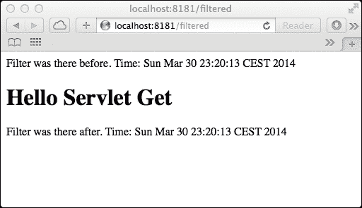

Whiteboard 方法还有更多内容。只需注册服务即可配置完整的 Web 应用程序。

### 注册错误页面

例如，注册`DefaultErrorPageMapping`可以轻松配置错误页面。相应的类由 Pax Web 提供，并通过 Apache Karaf Http Whiteboard 功能可用。考虑以下代码：

```java
<service interface=" org.ops4j.pax.web.extender.whiteboard.ErrorPageMapping">
  <bean class=" org.ops4j.pax.web.extender.whiteboard.runtime.DefaultErrorPageMapping">
    <property name="error" value="java.lang.Exception"/>
    <property name="location" value="/uncaughtException.html"/>
  </bean>
</service>
```

此错误页面映射定义了在容器中抛出的任何异常都将导致服务`uncaughtException.html`页面，如下面的截图所示：

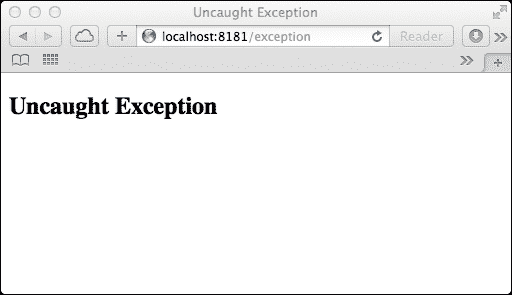

### 定义错误页面映射

同时，可以通过额外的映射注册自定义 404 错误代码处理页面，该映射再次作为服务注册，如下面的代码所示：

```java
<!-- 404 mapping -->
<service id="errorPageMapping" interface="org.ops4j.pax.web.extender.whiteboard.ErrorPageMapping">
  <bean class="org.ops4j.pax.web.extender.whiteboard.runtime.DefaultErrorPageMapping">
    <property name="error" value="404"/>
    <property name="location" value="/404.html"/>
  </bean>
</service>
```

Pax Web 提供的`DefaultErrorPageMapping`只需要 HTTP 错误代码和自定义错误代码页面的位置。

### 注册欢迎页面

为欢迎页面配置和注册服务的配置和注册与之前的注册一样简单。考虑以下代码：

```java
<service id="welcomeFileService" interface="org.ops4j.pax.web.extender.whiteboard.WelcomeFileMapping">
  <bean class="org.ops4j.pax.web.extender.whiteboard.runtime.DefaultWelcomeFileMapping">
    <property name="redirect" value="true" />
    <property name="welcomeFiles">
      <array>
        <value>index.html</value>
        <value>welcome.html</value>
      </array>
    </property>
  </bean>
</service>
```

Whiteboard 扩展器 bundle 提供了`WelcomeFileMapping`的默认实现。以下截图显示了欢迎页面：

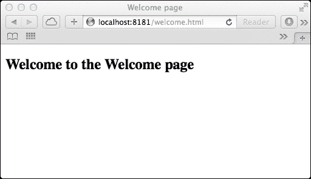

### 注册 JSP

JSP 的注册与所有之前的食谱一样简单。您只需将`DefaultJspMapping`与相应的 URL 模式注册即可。完成此操作后，您就可以立即提供 JSP 服务。考虑以下代码：

```java
<service id="jspMapping" interface="org.ops4j.pax.web.extender.whiteboard.JspMapping">
  <bean class="org.ops4j.pax.web.extender.whiteboard.runtime.DefaultJspMapping">
    <property name="urlPatterns">
      <array>
        <value type="java.lang.String">/jsp</value>
      </array>
    </property>
  </bean>
</service>
```

当您准备好提供 JSP 时，将出现以下屏幕：

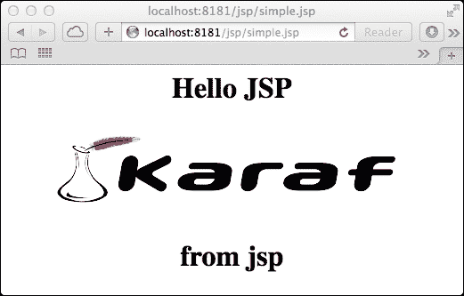

## 它是如何工作的…

现在可用的 Whiteboard 扩展器启动一个 ServiceListener，该 Listener 注册任何传入的新服务，如 servlet、filter 和 JSP，并将它们交给标准 Http Service 或扩展的 Http Service（WebContainer 接口）。

使用直接服务方法只有一个缺点——所有注册的 servlet 服务都使用相同的`ServletContextPath`。这是因为注册的 Http Service servlet 忽略了注册 servlet 时使用专门的 ServletContextPath 的方法，因此绑定到了`/`，并为 servlet 添加了额外的 URL 路径。例如，这个配方中的前两个 servlet 注册为`/whiteboard`和`/whiteboard/logo`，其中 ServletContextPath 是`/`。为了区分不同的 ServletContextPaths，需要一个 WAB。

所有之前的示例都有一个共同点：它们都是在同一个 bundle 中注册的。为了将 servlet 与过滤器分开，你需要确保使用相同的 HttpContext；这将在后面的配方中处理。

# 使用 Apache Karaf 构建具有自定义 HttpContext 的应用程序

所有之前的配方都涵盖了如何注册 servlet 和过滤器，并且都是在绑定到默认 HttpContext 的同一个个 bundle 中完成的。如果没有定义其他 HttpContext，则在注册 servlet 或资源时创建 DefaultHttpContext。在这个配方中，我们将使用自定义的 HttpContext。

## 准备中

由于这个配方是之前配方的特殊化，你可以在*在 Apache Karaf 中使用 Whiteboard 模式构建 Http 服务*的配方中找到它的源代码。像往常一样，这个配方要求成功安装`http-whiteboard`功能；如何实现这一点在*在 Apache Karaf 中安装扩展 Http 服务*的配方中有解释。这个配方中的源代码被缩减到了重要的部分。完整的源代码可以在[`github.com/jgoodyear/ApacheKarafCookbook/tree/master/chapter4/chapter4-recipe4`](https://github.com/jgoodyear/ApacheKarafCookbook/tree/master/chapter4/chapter4-recipe4)找到。

## 如何操作…

1.  第一步是定义属性。与 servlet 类似，注册 HttpContext 需要为 HttpContext 配置一个名称，如下面的代码所示：

    ```java
    props = new Hashtable<String, String>();
    props.put(ExtenderConstants.PROPERTY_HTTP_CONTEXT_ID, "forbidden");
    ```

1.  下一步是注册，HttpContext。这将使用专门的 ID `forbidden` 将自定义的 WhiteboardContext 注册为 HttpContext。这样，其他服务就可以选择这个 HttpContext。这在上面的代码中有所展示：

    ```java
    httpContextReg = bundleContext.registerService(HttpContext.class, new WhiteboardContext(), props);
    ```

1.  下一步是注册 servlet。使用这个 HttpContext 的 servlet 通过使用相同的 HttpContext ID 进行注册来引用 HttpContext。考虑以下代码：

    ```java
    props = new Hashtable<String, String>();
    props.put(ExtenderConstants.PROPERTY_ALIAS, "/forbidden");
    props.put(ExtenderConstants.PROPERTY_HTTP_CONTEXT_ID, "forbidden");
    forbiddenServletReg = bundleContext.registerService(Servlet.class, new HelloServlet(), props);
    ```

    自定义 HttpContext 对`handleSecurity`方法返回`false`。因此，请求将返回 401 错误作为 HTTP 返回代码。考虑以下代码：

    ```java
    public boolean handleSecurity(final HttpServletRequest request,final HttpServletResponse response) throws IOException {
      // Forbidden access!
      return false;
    }
    ```

下面的截图显示了 HTTP 错误窗口：

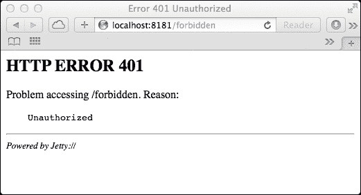

## 更多内容…

到目前为止，servlet、过滤器和其他资源的注册总是来自同一个包。这在 OSGi 世界中是如何适应的？这不是将它们分开更有意义吗？实际上确实如此，但这并不容易，OSGi 规范也没有要求它必须可行。使用 Pax Web 3，可以实现这一点，但需要一些特殊处理。首先，它需要一个共享 HttpContext（其描述和如何使用它将在下一步骤中找到）。以下是一个组件图，以帮助您了解设置：

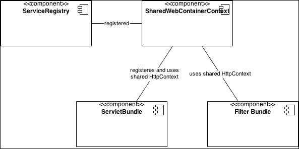

可以这样做：

1.  第一步是注册 SharedWebContainerContext。对于共享 HttpContext，拥有 SharedWebContainerContext（这是一个专门的 HttpContext）是至关重要的。在此阶段，WebContainer 接口是我们的朋友，并通过提供创建 SharedWebContainerContext 的方法来帮助我们，即 `getDefaultSharedHttpContext` 方法。这将在以下代码中描述：

    ```java
    WebContainer service = (WebContainer) context.getService(serviceReference);
    HttpContext httpContext = service.getDefaultSharedHttpContext();
    ```

    这个新创建的 SharedWebContainerContext 需要注册为服务，因为来自其他包的过滤器需要引用它。考虑以下代码：

    ```java
    props = new Hashtable<String, String>();
    props.put(ExtenderConstants.PROPERTY_HTTP_CONTEXT_ID, "shared");
    httpContextReg = context.registerService(HttpContext.class,httpContext, props);
    ```

1.  下一步是注册与共享上下文关联的 servlet。由于我们想要添加来自不同包的过滤器，我们需要先添加一个 servlet。我们将使用以下代码来完成：

    ```java
    props = new Hashtable<String, String>();
    props.put( ExtenderConstants.PROPERTY_ALIAS, "/extfilter" );
    props.put("servlet-name", "FilteredServlet");
    props.put(ExtenderConstants.PROPERTY_HTTP_CONTEXT_ID, "shared");
    registerService = context.registerService( Servlet.class, new HelloServlet(), props );
    ```

    在这一点上，我们的配方中已经设置了第一个包，我们需要注意只包含过滤器的第二个包。

1.  下一步是引用共享 HttpContext。我们需要首先获取 *shared* HttpContext，尽管这次我们不创建一个新的，我们只需要引用第一个包注册的那个。

    查找与给定 LDAP 过滤器 `(httpContext.id=shared)` 匹配的 HttpContext 服务的服务引用。同时，参见步骤 1，我们在那里使用此属性注册了服务。考虑以下代码：

    ```java
    Collection<ServiceReference<HttpContext>> serviceReferences = context.getServiceReferences(HttpContext.class, "(httpContext.id=shared)");

    if (serviceReferences.size() > 1) {
      throw new RuntimeException("should only be one http shared context");
    }

    HttpContext httpContext = context.getService(serviceReferences.iterator().next());
    ```

    从这个服务引用中，我们获取到 HttpContext 实例，在我们的例子中，此时是 SharedWebContainerContext。

1.  下一步是注册共享上下文的过滤器。从现在开始，这相当简单。servlet 过滤器的注册是以通常的方式进行。

    ```java
    Dictionary<String, String> props;
    props = new Hashtable<String, String>();
    props.put("pattern", ".*");
    props.put(ExtenderConstants.PROPERTY_HTTP_CONTEXT_ID, "shared");

    service.registerFilter(new ServletFilter(), new String[] { "/*" }, null, props, httpContext);
    ```

    创建注册所需的属性，并将过滤器与 WebContainer 服务注册。重要的是属性中包含对正确 HttpContext 的引用，此时为 `shared`。最重要的是，它需要实际上将过滤器与已预注册的 HttpContext 注册。

### 小贴士

**这难道不能更简单吗？**

Pax Web 4 的尚未发布版本有助于共享上下文。它将特别有助于使用 Whiteboard 模式。自从 Karaf 3（使用 Pax Web 3）发布以来，Pax Web 的 `features.xml` 文件在 Pax Web 发布周期中维护和发布。这将有助于仅升级此功能，而 Karaf 本身可能停留在另一个版本上。

# 在 Apache Karaf 中托管标准 Web 项目

由于构建标准 Web 应用程序和 WAR 并不在本书的范围内，本菜谱的重点在于将标准 WAR 转换为 WAB。

## 准备工作

本菜谱的示例代码可在 [`github.com/jgoodyear/ApacheKarafCookbook/tree/master/chapter4/chapter4-recipe6`](https://github.com/jgoodyear/ApacheKarafCookbook/tree/master/chapter4/chapter4-recipe6) 找到。

## 如何做到这一点...

将标准 WAR 项目转换为 WAB 简单。所以，让我们看看 WAR 和 WAB 文件的特殊之处。为了简单起见，从现在起让我们称这个项目为 Web 项目。

与直接位于 JAR 文件中的类的标准包项目相比，Web 项目的类应包含在 `WEB-INF` 文件夹下的 `classes` 文件夹中。对于嵌入式库也是如此；在 Web 项目中，这些库需要放置在 `WEB-INF` 文件夹下的 `lib` 文件夹中。

### 注意

警告——仅当需要内部使用 JAR 文件时才应嵌入其他 JAR 文件。引用其他包应该是你的首选。

好消息是 `maven-bundle-plugin` 能够处理这种特殊放置的类和库。`<_wab>` 部分负责这一点。在这里，你定义你的 Web 应用程序文件夹的基本路径。由于这是一个 Maven 项目，Web 应用程序路径位于 `src/main` 文件夹中的 `webapp` 文件夹。考虑以下代码：

```java
<plugin>
  <groupId>org.apache.felix</groupId>
  <artifactId>maven-bundle-plugin</artifactId>
  <version>2.4.0</version>
  <extensions>true</extensions>
  <configuration>
    <instructions>
 <_wab>src/main/webapp</_wab>
 <Web-ContextPath>packt-sample</Web-ContextPath>
    </instructions>
  </configuration>
</plugin>
```

由于需要为 Web 应用程序包有一个 `Web-ContextPath` 清单条目，因此在本菜谱中将其设置为 `packt-sample`。

## 它是如何工作的...

WAR 功能安装了 Pax Web War 扩展器。WAR 扩展器等待包含 `Web-ContextPath` 标头的包，并将扫描此包中的 `web.xml` 和 `jetty-web.xml` 配置文件。它还负责注解的 servlet 类。对于每个 WAR 文件，将有一个唯一的 servlet 上下文，其路径由 `Web-ContextPath` 清单头中定义。这与通过 Http 服务（带或不带 Whiteboard 扩展器）注册 servlet 不同，那里一切都关于别名。

## 还有更多...

之前创建的 WAB 文件唯一的缺点是它不再是 WAR 文件了。由于 POM 文件声明生成的包类型为 bundle，因此该工件被打包为 JAR 文件。这无疑会在需要在 Apache Karaf 或非 OSGi 容器上运行的 WAR 文件中引起问题。

要使这生效，项目的 Maven POM 文件需要做出调整。首先，将打包设置为 WAR。这将使用 `maven-war-plugin` 打包此包，而 WAR 文件不再是 WAB 文件，因为它缺少有效的 OSGi 清单。

必须结合两个插件来创建一个有效的 OSGi WAB 文件。为此，我们需要以下方式配置 `maven-bundle-plugin`：

```java
…
<executions>
  <execution>
    <id>bundle-manifest</id>
    <phase>process-classes</phase>
    <goals>
 <goal>manifest</goal>
    </goals>
  </execution>
</executions>
<configuration>
  <supportedProjectTypes>
    <supportedProjectType>jar</supportedProjectType>
    <supportedProjectType>bundle</supportedProjectType>
 <supportedProjectType>war</supportedProjectType>
  </supportedProjectTypes>
…
```

插件配置仅为生成 manifest 文件，由于打包类型为 WAR，因此需要配置`maven-bundle-plugin`以支持 WAR 格式作为有效的打包格式。

上述代码生成的 manifest 文件将显式地使用`manifestFile`属性合并到 WAR 包中，如下面的代码所示：

```java
<configuration>
  <archive>
    <manifestFile>${project.build.outputDirectory}/META-INF/MANIFEST.MF</manifestFile>
  </archive>
</configuration>
```

使用这些配置，您将生成一个可以在 Apache Karaf 和 OSGi 外部运行的网络应用程序。

对于一个完整的示例，请查看[`github.com/jgoodyear/ApacheKarafCookbook/tree/master/chapter4/chapter4-recipe6`](https://github.com/jgoodyear/ApacheKarafCookbook/tree/master/chapter4/chapter4-recipe6)中的源代码。在这里，您将找到一个特殊的 POM 文件，`pom.war_xml`。

# 在 Apache Karaf 中配置网络应用程序的安全

此配方将处理如何构建启用身份验证的网络应用程序。由于我们在 Apache Karaf 中运行，并且 Karaf 默认支持**Java 身份验证和授权服务**（**JAAS**），我们将向您展示运行 Karaf 上基本身份验证所需的一切。

## 准备工作

先决条件是安装 WAR 功能。此配方的源代码可在[`github.com/jgoodyear/ApacheKarafCookbook/tree/master/chapter4/chapter4-recipe7`](https://github.com/jgoodyear/ApacheKarafCookbook/tree/master/chapter4/chapter4-recipe7)中找到。

## 如何操作...

1.  第一步是在 Karaf 中配置用户/密码组合。让我们从用户配置开始。让我们确保`/etc`文件夹中的`users.properties`文件包含以下设置（这是默认配置）：

    ```java
    karaf = karaf,_g_:admingroup
    _g_\:admingroup = group,admin,manager,viewer
    ```

    `users.properties`文件遵循以下语法：

    ```java
    USER=PASSWORD, ROLE1, ROLE2, …
    ```

    它也可以有以下的语法：

    ```java
    USER=PASSWORD, _g_:GROUP, …
    _g_\:GROUP=ROLE1,ROLE2, …
    ```

1.  下一步是配置 Jetty 中的 JAAS。Pax Web 使用的`jetty.xml`文件需要包含一个有效的认证领域。此领域需要配置为使用 JAAS。`JAASLoginService`类的配置如下所示：

    ```java
    <Call name="addBean">
      <Arg>
     <New class="org.eclipse.jetty.plus.jaas.JAASLoginService">
          <Set name="name">default</Set>
          <Set name="loginModuleName">karaf</Set>
          <Set name="roleClassNames">
            <Array type="java.lang.String">
              <Item>org.apache.karaf.jaas.boot.principal.RolePrincipal
              </Item>
            </Array>
          </Set>
        </New>
      </Arg>
    ```

    访问 Karaf 领域的关键是定义`loginModuleName`值为`karaf`并定义正确的主体。由于我们在 Karaf 中运行，我们需要配置`roleClassNames`值为`org.apache.karaf.jaas.boot.principal.RolePrincipal`。这样，Jetty 和 Karaf 之间的安全握手配置就完成了。

1.  最后一步是将网络应用程序配置为使用 JAAS。要在网络应用程序内部使用它，`web.xml`文件需要启用并配置安全设置，如下面的代码所示：

    ```java
    <security-constraint>
      <web-resource-collection>
        <web-resource-name>Protected Area</web-resource-name>
        <description>Protect the Example Servlet</description>
     <url-pattern>/secured/*</url-pattern>
        <http-method>GET</http-method>
        <http-method>POST</http-method>
      </web-resource-collection>
      <auth-constraint>
        <description>Authorized Users Group</description>
     <role-name>admin</role-name>
      </auth-constraint>
    </security-constraint>
    ```

    此应用程序的安全设置是为了保护`GET`和`POST`方法的安全 URL。所需的角色名称必须是`admin`，正如步骤 1 中配置的那样。请考虑以下代码：

    ```java
    <login-config>
      <auth-method>BASIC</auth-method>
      <realm-name>default</realm-name>
    </login-config>
    ```

    登录配置设置为`BASIC`类型，因此容器负责身份验证，并配置为使用默认域。此配置指向已定义的`JAASLoginService`类，其名称为`default`（在第 2 步中配置）。

## 如何工作…

在 Web 应用程序中进行身份验证的密钥是 Karaf 提供的 JAAS 安全机制。这只是一个配置问题，以确保所有部分都适当地连接。

当与 Karaf 和 JAAS 安全域一起工作时，了解当前可用的域可能会有所帮助。有一个 shell 命令可以列出所有域——`jaas:realm-list`命令。

此命令将显示可用的域，如下面的屏幕截图所示：

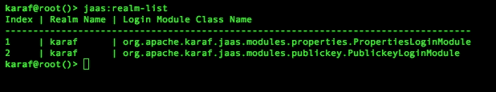

## 还有更多…

现在我们已经在 Web 应用程序中配置了安全设置，唯一缺少的是一种安全地访问应用程序的方法。为了启用 SSL，我们需要从*配置在 Apache Karaf 中部署的 Pax Web 模块*的配置中提取部分内容，并启用默认情况下关闭的某些值。所有这些操作都是在`org.ops4j.pax.web.cfg`配置文件中完成的，如下面的代码片段所示：

```java
org.osgi.service.http.secure.enabled = true
org.osgi.service.http.port.secure = 8443
org.osgi.service.http.secure.connector.name = secureDefault

org.ops4j.pax.web.ssl.keystore = ${karaf.base}/etc/keystore/.keystore
org.ops4j.pax.web.ssl.password = password
org.ops4j.pax.web.ssl.keypassword = password
org.ops4j.pax.web.ssl.clientauthwanted = false
org.ops4j.pax.web.ssl.clientauthneeded = false
```

使用此配置，我们启用了对安全端口的监听，在我们的例子中是`8443`。`keystore`值存储在相对于 Karaf 基本目录的位置。

如果客户端应发送证书进行身份验证而不是登录凭据，则将`clientauthwanted`和`clientauthneeded`属性设置为`true`。

保存配置后，它们将被 FileInstaller 包获取并应用于通过 Pax Web 运行的 Jetty 服务器。

为了实现完全工作的 SSL，你需要一个证书，因此我们需要创建一个。以下步骤将在 Linux 和 Mac 环境中工作，并且很可能会在 Windows 上工作：

1.  第一步是`keystore`设置。首先，创建用于包含与 Karaf 一起使用的 keystore 的目录。它必须与`org.ops4j.pax.web.ssl.keystore`属性在`org.ops4j.pax.web.cfg`文件中配置的值相匹配。如下面的屏幕截图所示：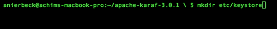

    在系统 shell 中，而不是 Karaf shell 中，你需要使用工具来创建 SSH 密钥。我们将使用名为**keytool**的 Java 工具来创建密钥和证书。首先，创建用于签名证书的密钥。确保你在`keystore`目录（`etc/keystore`）中执行此操作。可以按照以下方式完成：

    ```java
    keytool -genkey -keyalg RSA -validity 1024 -alias serverkey -keypass password -storepass password -keystore server.jks

    ```

    由于这是一个示例，我们使用简单的密码作为密码，但在生产环境中实际上不应该这样做。我们将使用`server`作为密码。请查看以下屏幕截图：

    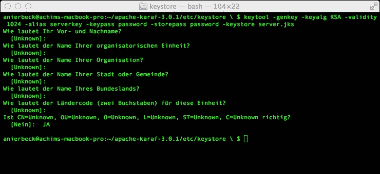

    一旦您看到前面的截图，您就已经设置好可以在应用程序中使用 SSL 了。您需要将浏览器导航到配置了 SSL 端口的先前应用程序；在我们的例子中，它是`8443`。您的浏览器将抱怨来自未知来源的未签名证书。接受它后，您将收到来自您的认证 WAR 文件的登录提示。

1.  下一步是导入客户端证书。也可以使用带有签名的客户端证书连接到服务器。客户端需要执行与服务器相同的事情——创建一个自签名证书。此证书需要导入到服务器的密钥库中，以便服务器知道要接受哪个证书。可以按照以下方式操作：

    ```java
    keytool -import -trustcacerts -keystore server.jks -storepass password -alias clientkey -file client.cer

    ```

    此客户端证书需要通过 HTTP 客户端软件传输，这可能是一个浏览器或其他通信软件的方式。

# 在 Apache Karaf 中将 Web 项目绑定到特定主机

使用 Karaf 3 和 Pax Web 3，可以将 Web 应用程序绑定到特定的 HTTP 连接器。这是在相同服务器上分离内部和外部应用程序的可行解决方案。

## 准备工作

此菜谱的示例代码可在[`github.com/jgoodyear/ApacheKarafCookbook/tree/master/chapter4/chapter4-recipe8`](https://github.com/jgoodyear/ApacheKarafCookbook/tree/master/chapter4/chapter4-recipe8)找到。在这里，您将在`src/main/etc`位置找到一个`jetty.xml`文件。它可以用来添加额外的连接器。有两个额外的菜谱可以展示如何使用标准 WAB 文件或 Whiteboard 扩展器。

## 如何操作...

首先，服务器需要配置以支持不同的 HTTP 连接器。因此，有必要通过编辑`etc`文件夹中找到的`jetty.xml`文件来配置 Jetty 服务器，如下面的代码所示：

```java
<Call name="addConnector">
  <Arg>
    <New class="org.eclipse.jetty.server.nio.SelectChannelConnector">
      <Set name="host"><Property name="jetty.host" /></Set>
 <Set name="port"><Property name="jetty.port" default="8282"/></Set>
      <Set name="maxIdleTime">300000</Set>
      <Set name="Acceptors">2</Set>
      <Set name="statsOn">false</Set>
      <Set name="confidentialPort">8443</Set>
 <Set name="name">alternateConnector</Set>
      <Set name="lowResourcesConnections">20000</Set>
      <Set name="lowResourcesMaxIdleTime">5000</Set>
    </New>
  </Arg>
```

对`jetty.xml`文件的更改仅在服务器重启时生效，并且不会被 FileInstaller 拾取并在运行时应用。

第二个连接器绑定到端口`8282`，并命名为`alternateConnector`。这将由绑定到此连接器的应用程序引用。

要这样做，WAB 文件需要两个额外的清单条目，如下所示：

```java
<plugin>
  <groupId>org.apache.felix</groupId>
  <artifactId>maven-bundle-plugin</artifactId>
  <version>2.4.0</version>
  <extensions>true</extensions>
  <configuration>
    <instructions>
      <_wab>src/main/webapp</_wab>
      <Web-ContextPath>packt-sample</Web-ContextPath>
 <Web-Connectors>alternateConnector</Web-Connectors>
 <Web-VirtualHosts>localhost</Web-VirtualHosts>
    </instructions>
  </configuration>
</plugin>
```

## 它是如何工作的...

在`jetty.xml`文件中配置的额外连接器被 Pax Web 解释并添加到 Jetty 中。通过特殊的清单条目，Web 应用程序包绑定到配置的 HTTP 连接器。连接器的数量以及绑定到它们的应用程序数量没有限制。

## 还有更多...

使用 Pax Web 3，因此使用 Apache Karaf 3，不仅可以将 WAB 文件绑定到 Web 连接器，还可以绑定到普通包。这需要一些特殊处理，因为没有`Web-ContextPath`清单头可以定义上下文路径。

实现这一点的最佳方式是使用 Whiteboard 扩展器。为此，我们需要注册一个专门的 HttpContext，如下面的代码所示：

```java
//preparing special HTTP Context with HTTP Connector
Hashtable<String, String> props = new Hashtable<String, String>();
props.put( ExtenderConstants.PROPERTY_HTTP_CONTEXT_ID, "httpConnector" );
HashMap<String,String> contextMappingParams = new HashMap<String,String>();
contextMappingParams.put(ExtenderConstants.PROPERTY_HTTP_VIRTUAL_HOSTS, "localhost");
contextMappingParams.put(ExtenderConstants.PROPERTY_HTTP_CONNECTORS, "alternateConnector");
contextMappingReg = bundleContext.registerService( HttpContextMapping.class, new WhiteboardHttpContextMapping("httpConnector", "whiteboard", contextMappingParams), props );

```

注册的 servlet 只需使用以下 HttpContext：

```java
props.put(ExtenderConstants.PROPERTY_ALIAS, "/connector");
props.put( ExtenderConstants.PROPERTY_HTTP_CONTEXT_ID, "httpConnector" );
servletReg = bundleContext.registerService(Servlet.class, new HelloServlet(), props);
```

就这些了。现在你需要使用 `http://localhost:8282/whiteboard/connector` URL 调用 servlet。

Servlet 使用别名/连接器进行注册，但 HttpContext 负责处理 Whiteboard 上下文路径。

# 使用 Apache Karaf 构建 Servlet 3.0 注解 Web 应用程序

使用 Servlet 3.0 API，可以只使用注解的 servlet 而不包含 `web.xml` 文件，或者至少在 `web.xml` 文件中省略应用程序的配置。

## 准备工作

如同往常，你可以在 GitHub 上的位置找到这个菜谱的代码：[`github.com/jgoodyear/ApacheKarafCookbook/tree/master/chapter4/chapter4-recipe9`](https://github.com/jgoodyear/ApacheKarafCookbook/tree/master/chapter4/chapter4-recipe9)。

## 如何操作...

与在 Apache Karaf 中托管的标准 Web 项目菜谱一样，我们只是构建另一个 WAB 包。但这一次，我们有一个只包含 `welcome-file-list` 方法定义和注解 servlet 的 `web.xml` 文件：

1.  第一步是定义 `web.xml` 文件。可以按照以下方式完成：

    ```java
    <web-app  
        xsi:schemaLocation="http://java.sun.com/xml/ns/javaee http://java.sun.com/xml/ns/javaee/web-app_3_0.xsd"
        version="3.0">

        <welcome-file-list>
          <welcome-file>welcome.html</welcome-file>
        </welcome-file-list>

    </web-app>
    ```

1.  下一步是注解 servlet。servlet 简单，只包含常规的 servlet 代码和注解。考虑以下代码：

    ```java
    @WebServlet (value="/test", name="test")
    public class HelloServlet extends HttpServlet {
    ```

1.  下一步是注解过滤器。过滤器也包含声明它为过滤器的注解以及 `init` 参数，如下面的代码所示：

    ```java
    @WebFilter(urlPatterns={"/*"}, servletNames = {"test"})
    public class ServletFilter implements Filter {
    ```

使用这个组件，你就可以在 Apache Karaf 中运行 Servlet 3.0 API 应用程序了。

## 还有更多...

Pax Web 还更进一步。只要包在其 `MANIFEST.MF` 文件中包含 `Web-ContextPath`，它就被视为 WAB 文件，因此 Pax Web WAR 扩展器会将其作为此类文件处理。

确保你的清单中有一个 `Web-ContextPath`，如下面的代码行所示：

```java
<Web-ContextPath>packt-sample</Web-ContextPath>
```

接下来，确保你的包中包含注解的 servlet，如下面的代码行所示：

```java
@WebServlet (value="/test", name="test")
public class HelloServlet extends HttpServlet {
```

将浏览器指向 `http://localhost:8181/packt-sample/test` 将返回所需的 Web 内容。

## 它是如何工作的...

Pax Web WAR 扩展器通常会查找包含在清单中的 `Web-ContextPath` 以及 `web.xml` 文件以发布 Web 存档。从 Pax Web 3.0 开始，WAR 扩展器也接受只包含其清单中的 `Web-ContextPath` 的包。

# 使用 Apache Karaf 创建 CDI Web 应用程序

现在，现代 Web 应用程序使用 **上下文和依赖注入**（**CDI**）来连接应用程序。在 OSGi 的环境中，能够与 OSGi 服务一起工作会很好。Pax Web 与 Pax CDI 一起处理这种情况。

## 准备工作

除了安装 WAR 功能外，还需要安装 Pax CDI。使用以下命令安装它们：

```java
feature:install war
feature:install pax-cdi-web-openwebbeans

```

或者，你可以使用以下 `weld` 命令：

```java
feature:install pax-cdi-web-weld

```

这个菜谱的源代码可以在[`github.com/jgoodyear/ApacheKarafCookbook/tree/master/chapter4/chapter4-recipe10`](https://github.com/jgoodyear/ApacheKarafCookbook/tree/master/chapter4/chapter4-recipe10)找到。

这个菜谱需要包和 Web 子模块。包子模块包含 OSGi 服务，而 Web 子模块包含 CDI Web 应用程序。

## 如何操作…

让我们从 Web 应用程序开始。`web.xml`文件可以是空的，也可以包含`welcome-file-list`方法的条目，因为该应用程序是一个 Servlet 3.0 应用程序。对于 CDI 应用程序，需要在类路径中有一个`beans.xml`定义。由于这是一个 Web 应用程序，`beans.xml`文件预计将位于`WEB-INF`文件夹中。对于我们的使用，在这个目录中保留一个空的`beans.xml`文件就足够了。

Servlet 需要使用`@WebServlet`注解来被 Pax Web 拾取。如下代码所示：

```java
@WebServlet(urlPatterns = "/sample")
public class OsgiServiceServlet  extends HttpServlet {
```

Servlet 使用 OSGi 服务来检索简单的引语。这个服务通过注入引用，如下代码所示：

```java
@Inject
@OsgiService (dynamic = true)
private MessageService messageService;
```

Pax CDI 的特色是`@OsgiService`注解。这个注解会将相应的 OSGi 服务连接到这个 Servlet。`dynamic = true`属性确保使用 OSGi 服务的动态性。

为了 Pax Web 和 Pax CDI 之间顺畅的交互，还需要一些额外的配置。这些配置在以下代码中的 POM 文件中处理：

```java
<instructions>
  <_wab>src/main/webapp/</_wab>
  <Bundle-SymbolicName>${project.artifactId}</Bundle-SymbolicName>
  <Bundle-Version>${project.version}</Bundle-Version>
  <Web-ContextPath>cdi-sample</Web-ContextPath>
  <Pax-ManagedBeans>WEB-INF/beans.xml</Pax-ManagedBeans>
 <Require-Capability>
 org.ops4j.pax.cdi.extension;
 </Require-Capability>
</instructions>
```

除了已知指令如`<_wab>`和`<Web-ContextPath>`之外，CDI 包还需要`<Require-Capability>`指令。有了这个指令，解析器会被告知 Web 包需要 CDI 包的能力。

## 它是如何工作的…

Pax Web 注册了 CDI Web 应用程序的所有 Servlet。这些 Servlet 通过 Pax CDI 等待上下文的初始化。服务由另一个包提供。只要这个服务不可用，Servlet 就不会启动。另一个重要部分是`<Require-Capability>`清单条目。它帮助解析器将 WAR 包连接到 Pax CDI 扩展包。这样，Pax CDI 扩展器就能够处理注入。

这个`<Require-Capability>`头也可以绑定到特定版本。为此，需要配置以下内容：

```java
<Require-Capability>
  org.ops4j.pax.cdi.extension;
  filter:="(&amp;(extension=pax-cdi-extension)(version&gt;=${version;==;${pax.cdi.osgi.version.clean}})(!(version&gt;=${version;=+;${pax.cdi.osgi.version.clean}})))",osgi.extender; filter:="(osgi.extender=pax.cdi)"
</Require-Capability>
```

## 参见

+   虽然这个菜谱给了你如何使用 CDI 在 OSGi 中连接服务的简要概述，但还有更多可能。你不仅可以使用 CDI 在同一个包内连接应用程序，还可以通过 CDI 提供服务并在另一个包中使用它。有关 Pax CDI 和可能性的更多详细信息，请参阅 Pax CDI 项目页面[`ops4j1.jira.com/wiki/display/PAXCDI/Documentation`](https://ops4j1.jira.com/wiki/display/PAXCDI/Documentation)。

+   更多示例可以在[`github.com/ops4j/org.ops4j.pax.cdi/tree/master/pax-cdi-samples`](https://github.com/ops4j/org.ops4j.pax.cdi/tree/master/pax-cdi-samples)找到。
