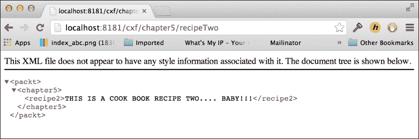
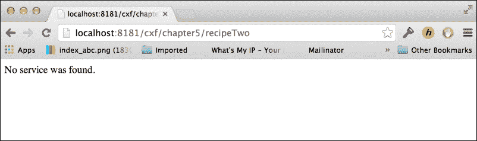
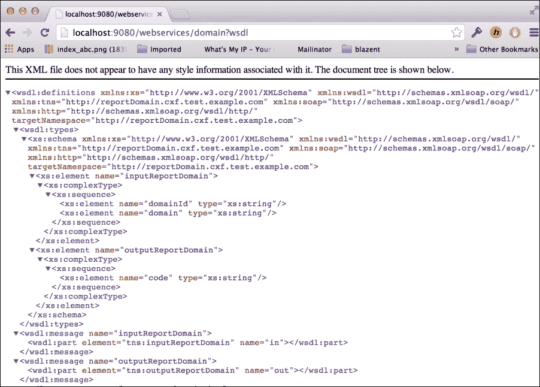
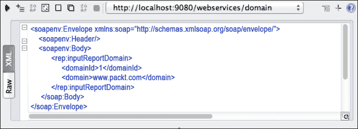
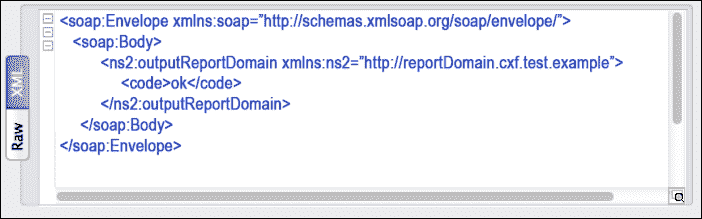

# 第五章。使用 Apache CXF 托管 Web 服务

在本章中，我们将介绍以下配方：

+   在 Apache Karaf 中安装 Apache CXF 模块

+   使用 CXF 列出端点命令

+   使用 CXF 停止/启动端点命令

+   在 Karaf 中构建和部署 RESTful 服务

+   在 Karaf 中构建和部署 Camel CXF Web 服务

# 简介

在第三章中，*使用 Apache ActiveMQ 部署消息代理*，我们讨论了如何以及何时设置 JMS 系统。另一种在系统或应用程序之间进行通信的方式是提供 Web 服务或 RESTful 端点。Apache CXF 提供了一种轻松设置和发布 Web 服务端点的方法。在 Apache Karaf 中发布 Web 服务提供了控制端点生命周期和监控已部署内容的命令。

# 在 Apache Karaf 中安装 Apache CXF 模块

在我们能够部署任何 Web 服务或 RESTful 服务之前，我们需要在 Karaf 容器中安装 CXF。就像其他框架一样，我们需要安装支持所需服务的特性。

## 如何做…

要安装 CXF 框架，只需从默认的 Karaf 实例安装 CXF 特性。如果没有指定版本，它将使用最新版本。在这个例子中，我们使用`version 3.0.0-milestone2`。我们可以使用以下命令完成此操作：

```java
karaf@root()> feature:repo-add cxf <version>

```

一旦添加了特性 URL，我们就可以看到所有提供的 CXF 特性。这可以通过以下命令完成：

```java
karaf@root()> feature:list | grep cxf

```

CXF 特性的列表非常广泛，但对我们所有的配方来说，我们只需使用以下命令简单地安装 CXF 特性。这将安装本书中将使用的所有所需特性。

```java
karaf@root()> feature:install cxf

```

我们可以看到，此时已经安装了大量所需特性。以下列表是从`feature:list`命令的一个子集：

```java
cxf-specs                     | 3.0.0-milestone2 | x
cxf-jaxb                      | 3.0.0-milestone2 | x
wss4j                         | 2.0.0-rc1        | x
cxf-core                      | 3.0.0-milestone2 | x
cxf-wsdl                      | 3.0.0-milestone2 | x
cxf-ws-policy                 | 3.0.0-milestone2 | x
cxf-ws-addr                   | 3.0.0-milestone2 | x
cxf-ws-rm                     | 3.0.0-milestone2 | x
cxf-ws-mex                    | 3.0.0-milestone2 | x
cxf-ws-security               | 3.0.0-milestone2 | x
cxf-http                      | 3.0.0-milestone2 | x
cxf-http-jetty                | 3.0.0-milestone2 | x
cxf-bindings-soap             | 3.0.0-milestone2 | x
cxf-jaxws                     | 3.0.0-milestone2 | x
cxf-jaxrs                     | 3.0.0-milestone2 | x
cxf-databinding-aegis         | 3.0.0-milestone2 | x
cxf-databinding-jaxb          | 3.0.0-milestone2 | x
cxf-databinding-xmlbeans      | 3.0.0-milestone2 | x
cxf-features-clustering       | 3.0.0-milestone2 | x
cxf-bindings-corba            | 3.0.0-milestone2 | x
cxf-bindings-coloc            | 3.0.0-milestone2 | x
cxf-bindings-object           | 3.0.0-milestone2 | x
cxf-transports-local          | 3.0.0-milestone2 | x
cxf-transports-jms            | 3.0.0-milestone2 | x
cxf-transports-udp            | 3.0.0-milestone2 | x
cxf-javascript                | 3.0.0-milestone2 | x
cxf-frontend-javascript       | 3.0.0-milestone2 | x
cxf-xjc-runtime               | 3.0.0-milestone2 | x
cxf                           | 3.0.0-milestone2 | x

```

## 它是如何工作的…

如果我们查看 CXF 代码库中的`features.xml`文件，我们可以看到`cxf`特性只是一个安装所有在 Karaf 中部署 CXF 所需特性的特性。这如下面的代码所示：

```java
<feature name="cxf" version="${version}" resolver='(obr)'>
  <feature version="[3,4)">spring</feature>
  <feature version="[1.2,2)">spring-dm</feature>
  <feature version="${version}">cxf-core</feature>
  <feature version="${version}">cxf-jaxws</feature>
  <feature version="${version}">cxf-jaxrs</feature>

  <feature version="${version}">cxf-databinding-jaxb</feature>
  <feature version="${version}">cxf-databinding-aegis</feature>
  <feature version="${version}">cxf-databinding-xmlbeans</feature>
  <feature version="${version}">cxf-bindings-corba</feature>
  <feature version="${version}">cxf-bindings-coloc</feature>
  <feature version="${version}">cxf-bindings-object</feature>

  <feature version="${version}">cxf-http-jetty</feature>

  <feature version="${version}">cxf-transports-local</feature>
  <feature version="${version}">cxf-transports-jms</feature>
  <feature version="${version}">cxf-transports-udp</feature>

  <feature version="${version}">cxf-xjc-runtime</feature>
  <feature version="${version}">cxf-ws-security</feature>
  <feature version="${version}">cxf-ws-rm</feature>
  <feature version="${version}">cxf-ws-mex</feature>
  <feature version="${version}">cxf-javascript</feature>
  <feature version="${version}">cxf-frontend-javascript</feature>
  <feature version="${version}">cxf-features-clustering</feature>

  <bundle start-level='50'>mvn:org.apache.cxf/cxf-bundle-compatible/${version}</bundle>
</feature>
```

`cxf`特性为所需的包添加了一个兼容性包，如`features.xml`文件中所述。

## 相关内容

+   *使用 CXF 列出端点命令*配方

+   *使用 CXF 停止和启动命令*配方

# 使用 CXF 列出端点命令

为了查看部署到 CXF 实例中的内容，我们可以使用`list-endpoints`命令。这将列出在 Karaf 运行时当前部署的所有总线。

### 注意

这个配方只是为了演示命令的使用；我们将在后面的配方中介绍如何创建不同的 CXF 包。

## 准备工作

在完成*在 Apache Karaf 中安装 Apache CXF 模块*配方后，我们现在需要构建和部署一个示例 CXF 应用程序到 Karaf。

前往本章的代码包，并使用以下命令运行 Maven 构建：

```java
mvn clean install

```

这将在 Maven 仓库中构建和安装本章的示例应用程序，以便我们可以在 Karaf 实例中轻松安装它们。

在 Karaf 实例的命令行中，使用以下命令安装此配方的 CXF 模块：

```java
Install -s mvn:com.packt/chapter5-recipe2/1.0.0-SNAPSHOT

```

## 如何操作...

我们可以运行以下命令来列出在此 Karaf 实例中发布的 CXF 端点：

```java
karaf@root()> cxf:list-endpoints

```

这将为我们提供一个列表，其中包含从我们的示例包中启动的 CXF 总线。以下命令行输出显示了这一点：

```java
Name           State      Address   BusID 
[StringRestSe…][Started][/chapter5] [chapter5-recipe2-cxf1752581114 ]

```

从结果中我们可以看到，我们的端点已发布并可用。实现类的名称是`StringRestServiceImpl`。此外，请注意它处于`Started`状态，以及我们可以找到 REST 服务的地址。

### 小贴士

使用`list-endpoints`命令的`-f`参数来获取端点的完整地址。

因此，让我们试一试。当你访问`http://localhost:8181/cxf/chapter5/recipeTwo`时，它将显示配方代码返回的消息。

### 注意

浏览器的类型可能会影响您看到的内容；在这个例子中，我们使用 Chrome。

以下截图显示了在浏览器中将会看到的内容：



如您所见，我们能够访问端点并看到实现类中的消息。

## 工作原理...

就像`list-busses`命令一样，此命令使用 CXF 控制器来获取控制台显示所需的信息。此代码位于`ListEndpointsCommand`类中。这将使用 CXF 控制器获取总线，然后遍历列表并获取 ServiceRegistry 以获取服务器列表。从服务器，我们可以获取列表的其余详细信息，包括名称、状态和地址。

## 参见

+   *使用 CXF 停止和启动命令*配方

# 使用 CXF 停止和启动命令

在某些情况下，可能需要手动控制端点的状态。使用`stop-endpoint`或`start-endpoint`命令，我们可以从命令行关闭和启动已发布的端点。这在测试客户端代码以确保正确处理不可用端点时非常有用。

## 准备工作

按照从*使用 CXF list-endpoints 命令*配方中的步骤操作。

## 如何操作...

让我们看看如何使用`stop-endpoint`和`start-endpoint`命令。这两个命令都需要提供总线参数和端点参数，以便知道要启动或停止什么。这些命令的语法如下所示：

```java
cxf:stop-endpoint <bus> <endpoint name>
cxf:start-endpoint <bus> <endpoint name>

```

要停止一个端点，请按照以下步骤操作：

1.  使用`list-endpoints`命令获取总线 ID 和我们的已发布端点的名称。以下将是输出：

    ```java
    Name           State      Address      BusID 
    [StringRestSe…][Started][/chapter5] [chapter5-recipe2-cxf1752581114   ].

    ```

1.  在前一步骤的输出中的信息现在可以用来启动和停止在此 Karaf 实例中发布的端点。考虑以下命令：

    ```java
    cxf:stop-endpoint chapter5-recipe2-<cxf identifier> StringRestServiceImpl

    ```

1.  前面的命令将停止在*准备工作*部分发布的端点。重新运行`list-endpoints`命令以查看状态变化如下：

    ```java
    Name           State      Address   BusID 
    [StringRestSe…][Stopped][/string] [chapter5-recipe2-<cxf identifier>   ].

    ```

注意，状态已更改为`Stopped`。这表示我们的 REST 服务端点不再从我们的浏览器中可用。使用浏览器访问此端点地址：`http://localhost:8181/cxf/chapter5/recipeTwo`。

浏览器找不到指定的地址，这正是我们期望发生的。以下截图是你应该看到的：



现在，执行以下步骤重新启动端点：

1.  使用`list-endpoints`命令中列出的端点如下：

    ```java
    cxf:start-endpoint chapter5-recipe2-<cxf identifier> StringRestServiceImpl

    ```

1.  这将启动我们在*准备工作*部分发布的端点。重新运行`list-endpoints`命令，以查看状态变化如下：

    ```java
    Name           State      Address      BusID 
    [StringRestSe…][Started  ][/chapter5] [chapter5-recipe2-<cxf identifier> ].

    ```

## 它是如何工作的…

命令由`StopEndpointCommand`类（`start-endpoint`命令非常相似）实现的`cxf`功能提供。这如下面的代码行所示：

```java
@Command(scope = "cxf", name = "stop-endpoint", description = "Stops a CXF Endpoint on a Bus.")
```

命令注释显示 CXF 定义了子 shell，命令名称为`stop-endpoint`。此命令还定义了以下代码中定义的几个必需参数：

```java
@Argument(index = 0, name = "bus", description = "The CXF bus name where to look for the Endpoint", required = true, multiValued = false)
String busName;

@Argument(index = 1, name = "endpoint", description = "The Endpoint name to stop", required = true, multiValued = false)
String endpoint;
```

有两个参数是必需的（如`Argument`注释中的`required=true`参数所示）。

## 参见

+   *使用 CXF list-endpoints 命令*配方

# 在 Karaf 中构建和部署 RESTful 服务

现在，让我们看看代码是如何组装的，以便仅使用 CXF 在 Karaf 中发布 CXF 端点。

## 准备工作

在这个配方中，我们将使用代码包中的`chapter5-recipe3`示例。在继续此配方之前，请先卸载`recipe2`代码。

首先，按照*在 Apache Karaf 中安装 Apache CXF 模块*配方所示安装 CXF，然后构建并部署一个示例 CXF 应用程序，作为 Karaf 中的`recipe3`。

从代码包中的`chapter5-recipe3`示例运行 Maven 构建，使用以下命令：

```java
mvn clean install

```

这将在 Maven 仓库中构建和安装`chapter5-recipe3`示例的样本应用程序，这样我们就可以轻松地在 Karaf 实例中安装它们。

## 如何操作…

一旦部署了包，我们就可以查看部署和启动 CXF 端点。

在 Karaf 实例的命令行中，安装`chapter5-recipe3`示例的 CXF 模块，启动包，并使用以下命令发布端点：

```java
install -s mvn:com.packt/chapter5-recipe3/1.0.0-SNAPSHOT

```

`list-endpoints`命令将显示我们的端点已启动且可用，如下面的命令行片段所示：

```java
karaf@root()> cxf:list-endpoints
Name         State    Address    BusID 
[StringRes…][Started][/chapter5]chapter5-recipe3-<cxf identifier>

```

现在我们已经验证了我们的端点已发布，让我们通过访问此端点地址来测试它：`http://localhost:8181/cxf/chapter5/recipeThree`。输出如下所示截图：

![如何操作…

## 如何操作…

让我们检查这个拼图中不同的部分，以了解我们是如何发布端点的。

首先，我们需要使用一个接口定义端点。在示例代码中，查看以下所示的`StringRestService`接口类：

```java
@Path("/")
public interface StringRestService {
    @GET
    @Path("/recipeThree")
    @Produces("application/xml")
    public String getRecipeThree() throws Exception;
}
```

`@Path("/")`注解被设置为 null。这意味着没有定义地址位置来访问此 RESTful 端点。

此接口仅定义了 RESTful 端点的`@GET`值（而不是`@POST`值）。为了访问此端点，我们只需在默认值之后使用`/recipeThree`位置即可访问`getRecipeThree()`方法。

`@Produces`注解定义了将返回给调用者的数据类型。在这种情况下，我们通过`application/xml`定义了 XML。

然后，我们必须实现接口以处理对端点的请求。在我们的简单示例中，我们只是返回一个带有 XML 的字符串值。实现类如下所示：

```java
public class StringRestServiceImpl implements StringRestService {
  @Override
  public String getRecipeThree() throws Exception {
    System.out.println("RECIPE 3 :: restful endpoint hit.");
    return "<packt>
      <chapter5>
        <recipe3>THIS IS A COOK BOOK RECIPE THREE....BABY!!!</recipe3>
      </chapter5>
    </packt>";
  }
}
```

实现类很简单——我们正在创建`getRecipeThree`方法并返回一个 XML 字符串。

现在我们已经定义了接口和实现类，我们需要配置端点。考虑以下代码：

```java
<cxf:bus>
  <cxf:features>
    <cxf:logging/>
  </cxf:features>
</cxf:bus>

<jaxrs:server id="stringRestService" address="/chapter5">
  <jaxrs:serviceBeans>
    <ref component-id="stringRestServiceBean"/>
  </jaxrs:serviceBeans>
</jaxrs:server>

<bean id="stringRestServiceBean" class="com.example.test.cxf.StringRestServiceImpl"/>
```

在 OSGi 环境中工作时，建议您使用 Blueprint。前面的 XML 代码来自一个 Blueprint XML 文件。

在此配置中，我们正在定义`cxf`总线并添加`logging`功能。由于所有日志信息都嵌入在底层模式定义中，因此没有必要指定总线的实现类。

然后，我们需要将实现类实例化为一个 Bean。在这里，我们给它一个 ID 为`stringRestServiceBean`。

此 Bean ID 用于服务器配置中定义 ServiceBean。这将使用实现类实现的接口类在`/chapter5`位置发布端点。由于我们没有定义一个具有基本位置的类，因此一旦部署，地址将看起来像`http://localhost:8181/cxf/chapter5/recipeThree`。

注意，在前面的 URL 中，`/chapter5`位置首先出现，这是 JAX-RS 服务器的地址，然后是接口类中定义的路径。

## 参见

+   *在 Karaf 中构建和部署 Camel CXF web 服务*的配方。

# 在 Karaf 中构建和部署 Camel CXF web 服务

在前面的配方中，我们看到了如何使用 CXF 和 Karaf 轻松部署 RESTful 服务。现在，我们将探讨如何使用 Camel 部署 WSDL 首先的 CXF 端点。这是实现暴露 Web 服务的集成路由的好方法。在继续此配方之前，请先卸载`recipe2`代码。

## 准备工作

此配方的示例代码位于代码包的`chapter5-recipe4`示例中。很可能您已经构建了代码，但以防万一，请运行针对`chapter5`文件夹的`mvn clean install`命令。这将构建并将包移动到 Maven 仓库以在 Karaf 中部署。

注意，在构建控制台中有以下行：

```java
[INFO] --- cxf-codegen-plugin:2.7.4:wsdl2java (generate-sources) @ chapter5-recipe4 ---

```

前面的行表示 CXF 的 codegen 插件已运行，并已从`pom.xml`文件中定义的 WSDL 生成了代码。以下是指示 Maven 从 WSDL 构建代码的插件定义：

```java
<plugin>
  <groupId>org.apache.cxf</groupId>
  <artifactId>cxf-codegen-plugin</artifactId>
  <version>2.7.4</version>
  <executions>
    <execution>
      <id>generate-sources</id>
      <phase>generate-sources</phase>
      <configuration>
        <sourceRoot>
          ${basedir}/target/generated/src/main/java
        </sourceRoot>
        <wsdlOptions>
          <wsdlOption>
            <wsdl>
              ${basedir}/src/main/resources/META-INF/wsdl/report_domain.wsdl
            </wsdl>
          </wsdlOption>
        </wsdlOptions>
      </configuration>
      <goals>
        <goal>wsdl2java</goal>
      </goals>
    </execution>
  </executions>
</plugin>
```

WSDL 由`<wsdl>`标签标识，因此我们可以看到`report_domain.wsdl`文件位于`${basedir}/src/main/resources/META-INF/wsdl/`目录中。

`wsdl2java`目标表示我们希望插件从 WSDL 生成必要的文件。

## 如何做…

首先，我们需要设置环境以运行我们的 Camel CXF 端点。这可以按以下方式完成：

1.  我们需要使用以下 Camel 功能命令安装 Apache Camel：

    ```java
    feature:repo-add camel 2.12.3

    ```

    这将为 Camel 的功能定义添加到 Karaf 实例中。

1.  现在，我们需要实际使用以下命令安装`camel`和`camel-cxf`功能：

    ```java
    feature:install camel
    feature:install camel-cxf

    ```

1.  一旦安装了`camel`和`camel-cxf`功能，我们可以使用以下命令安装此菜谱的包：

    ```java
    install –s mvn:com.packt/chapter5-recipe4/1.0.0-SNAPSHOT

    ```

我们可以使用`bundle:list`命令列出包，以确保包已成功安装。输出将如下所示：

```java
START LEVEL 100 , List Threshold: 50
 ID | State  | Lvl | Version  | Name 
---------------------------------------------------------
 85 | Active |  50 | 2.12.3   | camel-core 
 86 | Active |  50 | 2.12.3   | camel-karaf-commands 
101 | Active |  50 | 1.1.1    | geronimo-jta_1.1_spec 
102 | Active |  50 | 2.12.3   | camel-spring 
103 | Active |  50 | 2.12.3   | camel-blueprint 
179 | Active |  50 | 2.7.10   | Apache CXF Compatibility Bundle Jar
180 | Active |  50 | 2.12.3   | camel-cxf-transport 
181 | Active |  50 | 2.12.3   | camel-cxf 
182 | Active |  80 | 1.0.0.SNA| Chapter 5 :: Recipe 4 ::

```

我们可以看到最后一个包是我们的菜谱包。它已启动并处于活动状态，这表明端点已发布。

为了验证这一点，我们可以使用 CXF 命令。当我们使用`karaf@root()> cxf:list-busses`命令时，输出将如下所示：

```java
Name                             State 
[chapter5-recipe4-<id>         ] [RUNNING           ]

```

当我们使用`karaf@root()> cxf:list-endpoints -f`命令时，输出将如下所示：

```java
Name                      State
[ReportDomainService    ] [Started ]
Address
[http://localhost:9080/webservices/domain  ]
BusID
[chapter5-recipe4-<id>        ]

```

这表明我们的 Camel CXF Web 服务已部署并可在`http://localhost:9080/webservices/domain`处访问。

您还可以查看端点`http://localhost:9080/webservices/domain?wsdl`上可用的 WSDL 代码。

将上述地址放入您喜欢的网页浏览器中，我们将看到 WSDL 代码。这应该看起来像以下截图：



我们看到端点通过多个途径发布并可用。让我们使用 SoapUI 来测试它，这是一个免费的 Web 服务测试工具，可在[`www.soapui.org/`](http://www.soapui.org/)找到。步骤如下：

1.  将 WSDL 代码作为项目加载到 SoapUI 中，它将根据 WSDL 定义自动为我们设置请求。以下截图显示了请求应该看起来是什么样子：

    这也将自动加载请求的地址。

1.  我们可以点击播放按钮向端点提交请求。它将简单地响应`OK`，如下面的截图所示：

这表明我们能够向端点提交请求并检索响应。响应是一个简单的硬编码的`OK`，但展示了端点的可用性。

## 它是如何工作的…

首先，让我们看看 Camel 组件的端点配置。在 Blueprint 文件中，我们定义服务端点，如下面的代码所示：

```java
<blueprint

       xsi:schemaLocation="http://www.osgi.org/xmlns/blueprint/v1.0.0 http://www.osgi.org/xmlns/blueprint/v1.0.0/blueprint.xsd
       ">

  <camelcxf:cxfEndpoint id="reportDomain"
          address="http://localhost:9080/webservices/domain"
          wsdlURL="META-INF/wsdl/report_domain.wsdl"
          serviceClass="com.example.test.cxf.reportdomain.ReportDomainEndpoint"/>

  <bean id="domainRoutes" class="com.example.test.cxf.routes.DomainRoutes"/>

  <camelContext id="camel">
    <routeBuilder ref="domainRoutes"/>
  </camelContext>

</blueprint>
```

上述代码是 CXF 端点配置；请注意，我们指定了发布的 Web 服务的地址和端口，以及 WSDL 文件的位置。

路由通过一个带有`domainRoutes` bean ID 的 Blueprint 实例化。这将允许我们从 CamelContext 配置中引用它。

CamelContext 定义了在此捆绑包中要使用的所有 Camel 路由。

现在，让我们看看路由的实际代码：

```java
public class DomainRoutes extends RouteBuilder {
    OutputReportDomain ok = new OutputReportDomain();

    public void configure() throws Exception {
        // webservice response for OK
        ok.setCode("OK");

        from("cxf:bean:reportDomain").id("domainService").choice().when().simple("${in.header.operationName} == 'ReportDomain'").convertBodyTo(InputReportDomain.class).to("log:dummy").process(new Processor() {
                    public void process(Exchange exchange)throws Exception {
                        exchange.getIn().setBody(ok);
                    }
        })
        .end();
    }
}
```

`from("cxf:bean:reportDomain")`代码行是路由的开始。我们需要能够配置它，以便它可以处理对我们的 Web 服务的任何调用。URI 中的`reportDomain`部分是对在`blueprint.xml`文件中配置的`cxfEndpoint`对象的引用。

### 小贴士

注意，当使用 Camel CXF 端点时，不需要实现代码，因为所有请求都被路由拦截并处理。

剩余的路由只是为了展示。我们在 WSDL 中将主体转换为定义的数据类型。在这种情况下，它被转换为`InputReportDomain.class`。然后，我们使用`.to("log:dummy")`将其记录到`karaf.log`文件中。最后，我们返回带有`OK`代码的`OutputReportDomain.class`。

## 参见

+   *在 Karaf 中构建和部署 RESTful 服务的方法*
