# 第六章：使用 Apache Karaf Cellar 分发集群容器

在本章中，我们将涵盖以下主题：

+   在 Apache Karaf 中安装 Apache Karaf Cellar 模块

+   使用 Apache Karaf Cellar 命令

+   使用 Cellar 构建和部署分布式架构

# 简介

本章展示了如何使用 Apache Karaf 安装和使用 Apache Karaf Cellar。Apache Karaf Cellar 的主要目标是实现 Apache Karaf 的集群化供应。这种供应可以通过捆绑包、功能和配置的白名单和黑名单进行控制。除了这些核心功能之外，还可以使用 Cellar 在云中或与云进行集群，并通过集群发送事件。使用 Cellar 还可以拥有分布式 OSGi 服务。

### 小贴士

如果你想要更深入地了解 Apache Karaf Cellar 的工作原理，请参阅*Learning Karaf Cellar*，作者*Jean-Baptiste Onofré*，出版社*Packt Publishing*。

# 在 Apache Karaf 中安装 Apache Karaf Cellar 模块

首先，我们需要添加集群多个 Karaf 实例的能力。为此，Cellar 需要首先安装在 Apache Karaf 上。为此，需要添加所需的功能仓库 URL，这可以通过以下便捷方法完成：

```java
karaf@root()> feature:repo-add cellar

```

在此之后，最新版本的 Cellar 的所有可能功能都可以用于安装。在我们的案例中，这是 Cellar 3.0.0。除了安装 Cellar，还需要运行多个 Karaf 实例以验证这些配方。

## 如何做到这一点...

按照以下步骤设置 Cellar 并在同一台机器上创建多个 Karaf 实例：

1.  使用以下命令安装所需的`cellar`功能：

    ```java
    karaf@root()> feature:install cellar

    ```

    这将安装所有所需的 Cellar 捆绑包，以便我们有基本的设置来运行 Karaf 集群。

1.  接下来，拥有另一个用于集群的节点非常重要。为此，我们将在同一台机器上设置第二个 Karaf 实例。为此，以下命令将很有用。因此，使用以下命令创建另一个 Karaf 实例：

    ```java
    karaf@root()> instance:create second

    ```

    这将创建一个新的 Karaf 实例，看起来就像一个新提取的 Apache Karaf ZIP 存档。

1.  第二个实例已创建；现在，我们需要启动这个第二个实例。Karaf 有一个用于此目的的命令，如下所示：

    ```java
    karaf@root()> instance:start second

    ```

1.  这刚刚启动了第二个实例，现在可以通过外部 SSH 客户端或通过 Karaf 连接到它。这可以通过以下命令完成：

    ```java
    karaf@root()> instance:connect second

    ```

1.  使用这种方式，你将连接到第二个 Karaf 实例。我们还需要将`cellar`仓库添加到这个实例中。这可以通过以下命令完成：

    ```java
    karaf@second()> feature:repo-add cellar

    ```

1.  当`cellar`功能仓库对第二个实例可用时，`cellar`功能就准备好安装了。

    ```java
    karaf@second()> feature:install cellar

    ```

这将安装所需的捆绑包；因此，我们有两个节点准备好进行集群。由于 Cellar 集群通过多播进行自动发现，两个节点都应该能够找到对方。

### 注意

由于 Cellar 使用 Hazelcast 作为其底层集群技术，多播由 Hazelcast 处理。有关 Hazelcast 的更多信息，请参阅[`www.hazelcast.org/docs/3.0/manual/html/ch12s02.html`](http://www.hazelcast.org/docs/3.0/manual/html/ch12s02.html)。

可以使用以下命令列出可用的群组来检查这些节点：

```java
karaf@second()> cluster:group-list

```

这将列出可用的群组以及每个群组中包含的节点。由于尚未对任何群组进行配置，默认群组包含两个节点——根 Karaf 实例和第二个实例。以下屏幕截图显示了`group-list`命令的执行，该命令是`cluster:group-list`命令的别名：

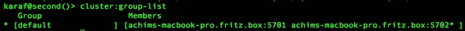

## 它是如何工作的…

在两个节点上安装 Cellar 后，Cellar 在两个节点上都创建了一个默认群组，因此这两个节点自动添加到这个默认群组中。Cellar 的基础是 Hazelcast 内存集群配置，它会将自己复制到集群中所有已知的节点。Hazelcast 本身通过多播扫描网络以查找其他实例。Hazelcast 可以被配置为使用其他网络连接技术。Apache Karaf Cellar 使用这种行为来在运行中的节点上同步集群配置。

Cellar 集群由一个群组定义，其中每个群组包含一个节点列表。对于每个集群群组，都有一个 Hazelcast 主题，它是通信后端。通过这个主题，同一群组内的所有节点都会在包、功能或配置中通信更改。此外，服务和事件也是通过这个主题进行通信的。

由于这个主题，所有节点的配置被组合成一个共享的集群配置，如下面的屏幕截图所示：

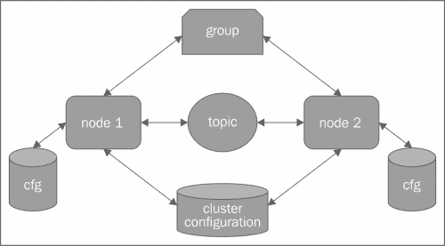

# 使用 Apache Karaf Cellar 命令

与 Apache Karaf 的许多其他功能一样，Cellar 提供了一些命令来管理 Apache Karaf Cellar 集群。

## 准备工作

确保您遵循了*在 Apache Karaf 中安装 Apache Karaf Cellar 模块*的基本设置说明来运行一个简单的 Apache Karaf 集群。

## 如何操作…

我们有两种不同类型的命令来处理 Apache Karaf Cellar 集群：用于管理和配置集群的基本命令以及一些增强的命令用于额外管理。

### 群组命令

安装 Cellar 后，已经有一个默认群组可用，该群组默认包含所有未来可用的节点。可以使用以下命令执行不同的任务：

1.  现在，让我们使用以下命令创建一个新的群组并将两个节点添加到其中：

    ```java
    karaf@root()> cluster:group-create main-cluster

    ```

    之前的命令创建了一个名为`main-cluster`的新集群群组。这个群组中没有节点。使用`group-list`命令检查集群现在的样子。该命令的结果可以在以下屏幕截图中看到：

    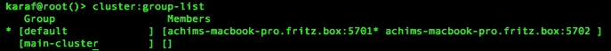

1.  新创建的组仍然是空的。因此，我们需要添加一些节点。向集群中添加节点可以通过不同的方式完成。以下命令是一个示例：

    ```java
    karaf@root()> cluster:group-pick default main-cluster

    ```

    以下命令的完整语法如下：

    ```java
    cluster:group-pick source-group destination-group number-of-nodes

    ```

    它从给定的源组中选择一些节点并将这些节点转移到目标组。如果没有指定数量，则从源组中选择一个。执行和外观如下面的截图所示：

    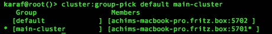

1.  向集群组添加节点的另一种方法是使用`join`命令。使用此命令，您还可以将节点添加到多个组中。

    ```java
    karaf@root()> cluster:group-join main-cluster achims-macbook-pro.fritz.box:5702

    ```

    上述命令的语法如下：

    ```java
    cluster:group-join group-destination node-id

    ```

    命令及其输出如下面的截图所示：

    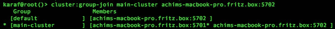

1.  如您所见，第二个节点现在包含在两个集群组中，尽管我们不再希望这个节点保留在默认组中。为此，我们需要使用以下命令将其从该组中移除：

    ```java
    karaf@root()> cluster:group-quit default achims-macbook-pro.fritz.box:5702

    ```

    上述命令的语法如下：

    ```java
    cluster:group-quit group-id node-id

    ```

    命令返回当前组的状态列表，如下面的截图所示：

    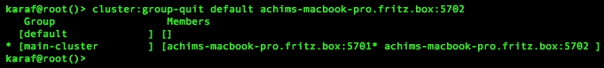

1.  可以使用以下命令删除此空组：

    ```java
    karaf@root()> cluster:group-delete default

    ```

当使用`cluster:group-list`命令检查时，您会看到默认组无法删除。这是因为其默认特性。因此，如果您创建一个新的测试组并立即删除它，您将看到测试组已通过命令创建和删除。

### 节点命令

以下是对节点命令的简要介绍。

1.  类似于`group-list`命令，`node-list`命令将列出所有可用的节点：

    ```java
    karaf@root()> cluster:node-list

    ```

    上述命令的输出如下面的截图所示：

    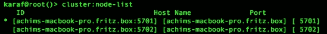

1.  类似于网络 ping，可以 ping 一个集群节点来测试该节点的网络可达性。这可以通过以下命令完成：

    ```java
    karaf@root()> cluster:node-ping achims-macbook-pro:5702

    ```

    输出将如下面的截图所示：

    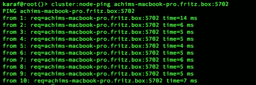

### 集群配置命令

到目前为止，之前的命令已用于集群本身的管理，通过添加或删除集群组以及配置一个集群组的节点。

1.  最后一个管理命令是`cluster:sync`命令：

    ```java
    karaf@root()> cluster:sync

    ```

    这将强制同步集群中的所有节点，如下面的截图所示：

    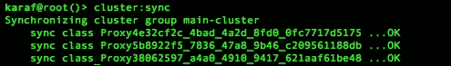

1.  现在，以下命令用于配置集群的内容。例如，可以在集群中安装功能和包。要列出一个集群组的当前可用功能，只需发出以下命令：

    ```java
    karaf@root()> cluster:feature-list main-cluster

    ```

    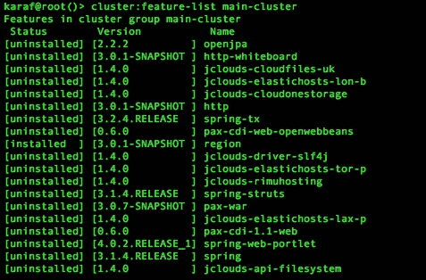

1.  上述命令同样适用于列出集群中安装的包：

    ```java
    karaf@root()> cluster:bundle-list main-cluster

    ```

    这将生成集群组可用的包列表。输出将如下所示：

    ```java
    karaf@root()> cluster:bundle-list main-cluster
    Bundles in cluster group main-cluster
     ID     State        Name
    [0   ] [Active     ] OPS4J Base - Lang (1.4.0)
    [1   ] [Active     ] Apache Karaf :: Cellar :: Hazelcast (3.0.0.SNAPSHOT)
    [2   ] [Active     ] Apache Karaf :: Cellar :: Features (3.0.0.SNAPSHOT)
    [3   ] [Active     ] Apache Karaf :: Cellar :: Core (3.0.0.SNAPSHOT)
    [4   ] [Active     ] JLEdit :: Core (0.2.1)
    [5   ] [Active     ] Apache Karaf :: JAAS :: Command (3.0.1)
    [6   ] [Active     ] Apache Mina SSHD :: Core (0.9.0)
    [7   ] [Active     ] Apache Karaf :: Cellar :: Management (3.0.0.SNAPSHOT)
    [8   ] [Active     ] jansi (1.11.0)

    ```

1.  为了在集群中进行进一步的包交互，请使用以下特殊的集群包命令：

    ```java
    cluster:bundle-* <groupId>

    ```

    这些包命令与标准的 Apache Karaf 包命令类似。这些命令的范围是在集群内分发命令。

1.  对于功能，命令与`cluster:bundle`命令类似。适用于功能的命令也可以在集群范围内运行：

    ```java
    cluster:feature-* <groupId>

    ```

    `cluster:feature`命令将在集群中像独立 Karaf 实例一样工作。

1.  与包和功能命令类似，配置命令也可以更改、设置或取消设置在整个集群中有效的配置。考虑以下命令：

    ```java
    karaf@root()> cluster:config-list main-cluster

    ```

    前面命令的输出与`config:list`命令的输出相同，但仅限于对集群组有效的配置，如下面的截图所示：

    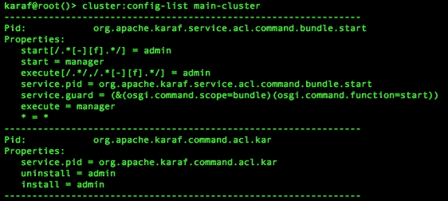

1.  通常，集群配置命令具有以下模式：

    ```java
    cluster:config-* <groupId>

    ```

前面的命令提供了编辑、删除或添加配置的可能性，然后这些配置会自动在整个集群中共享。

## 它是如何工作的…

如所见，Apache Karaf Cellar 提供了一些专门的集群命令。这种功能基于这样一个事实：所有配置、安装的包和安装的功能在整个集群中都是共享的。为了对这部分信息进行专门的控制，可以白名单或黑名单某些信息。这些信息定义在两个配置文件中，`org.apache.karaf.cellar.node.cfg`用于节点配置，`org.apache.karaf.cellar.groups.cfg`包含组配置信息。

通常，在集群中部署应用程序时，使用功能而不是包会更好。这使得过滤白名单和黑名单中的包或功能以适应特定的集群节点变得更容易。

## 参见

+   《*学习 Karaf Cellar*》，*Jean-Baptiste Onofré*，*Packt Publishing*，比本食谱中可以做到的更详细地介绍了 Cellar 的见解。

# 使用 Cellar 构建和部署分布式架构

本食谱描述了如何构建集群应用程序以及在整个集群中透明使用服务的方法。我们将向您展示如何创建基于 Cellar 的**分布式 OSGi**（**DOSGi**）应用程序，以及您如何从 Apache Karaf Cellar 中获益。

## 准备工作

至关重要的是，您至少完成*在 Apache Karaf 中安装 Apache Karaf Cellar 模块*配方，以便在测试环境中有一个集群环境。您还应该熟悉*使用 Apache Karaf Cellar 命令*配方中向您展示的集群命令。本配方中使用的源代码可以在[`github.com/jgoodyear/ApacheKarafCookbook/tree/master/chapter6/chapter6-recipe3`](https://github.com/jgoodyear/ApacheKarafCookbook/tree/master/chapter6/chapter6-recipe3)找到。

## 如何操作…

首先，我们需要一个额外的集群组，其中包含一个额外的节点。为此，我们首先创建一个额外的实例，使用以下命令：

```java
karaf@root()> instance:create sender

```

启动此实例，并按照*在 Apache Karaf 中安装 Apache Karaf Cellar 模块*配方中的说明安装`cellar`功能。此实例将被添加到一个新组中。首先，使用以下命令创建一个新的集群组：

```java
karaf@root()> cluster:group-create second-cluster

```

现在，使用以下命令将新实例添加到新创建的集群组：

```java
karaf@root()> cluster:group-pick default second-cluster

```

在完成此设置后，我们需要注意分布式 OSGi 服务。为此，您将创建三个不同的包，其中第一个将包含服务接口，第二个将包含位于一个节点上的服务实现，第三个将包含消费包。

以下图显示了此设置：

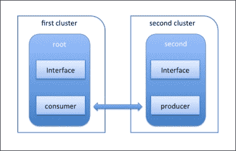

首先，我们需要安装所需的功能。为此，我们将使用以下命令在每个节点上安装`cellar-dosgi`功能。默认情况下，所有 Cellar 功能都被列入黑名单。

```java
karaf@root()> feature:install cellar-dosgi

```

在集群中安装此功能后，您将有一个新的命令可以使用。`cluster:service-list`命令将列出集群中分布的所有服务。在安装功能后立即调用的命令将给出以下输出：

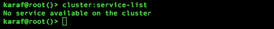

### 生成服务包

在此设置完成后，我们需要一个提供远程客户端可用服务的包。为此，我们创建一个简单的服务，该服务返回一个随机消息。可以按照以下方式完成：

1.  要注册此服务，我们将使用以下`blueprint.xml`文件：

    ```java
    <!-- Service Implementation -->
    <bean id="messageService" class="com.packt.impl.MessageServiceImpl"/>

    <!-- Registering the Service -->
    <service ref="messageService" interface="com.packt.MessageService">
      <service-properties>
        <entry key="service.exported.interfaces" value="*"/>
      </service-properties>
    </service>
    ```

1.  使用以下命令从代码包中安装`chapter6-recipe3-interface`包到两个集群组：

    ```java
    karaf@root()> cluster:bundle-install master mvn:com.packt/chapter6-recipe3-interface/1.0.0-SNAPSHOT
    karaf@root()> cluster:bundle-install second-cluster mvn:com.packt/chapter6-recipe3-interface/1.0.0-SNAPSHOT

    ```

1.  然后，使用以下命令从代码包中在第二个组`second-cluster`上安装`chapter6-recipe3-producer`包：

    ```java
    karaf@root()> cluster:bundle-install second-cluster mvn:com.packt/chapter6-recipe3-producer/1.0.0-SNAPSHOT

    ```

1.  新安装的包需要启动。为了方便找到这些已安装的包，使用带有`grep`命令的`bundle-list`命令，如下所示：

    ```java
    karaf@root()> cluster:bundle-list main-cluster | grep -i chapter

    ```

    这将产生以下输出：

    ```java
    karaf@root()> cluster:bundle-list main-cluster | grep chapter6
    [36  ] [Installed  ] chapter6-recipe3-interface (1.0.0.SNAPSHOT)

    ```

1.  现在您已经找到了相应的包 ID，只需为它发出一个启动命令：

    ```java
    karaf@root()> cluster:bundle-start main-cluster <bundle id>

    ```

    使用`list`命令的快速使用将为您提供节点捆绑包列表，显示新安装并运行的捆绑包`chapter6-recipe3-interface`。如下截图所示：

    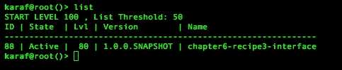

现在我们已经检查了消费端，我们需要确保发送端正在运行。我们需要查找我们刚刚安装的捆绑包。这可以通过以下命令完成：

```java
karaf@root()> cluster:bundle-list second-cluster | grep -i chapter

```

这将产生以下输出：

```java
karaf@root()> cluster:bundle-list second-cluster | grep chapter6
[38  ] [Installed  ] chapter6-recipe3-interface (1.0.0.SNAPSHOT)
[39  ] [Installed  ] chapter6-recipe3-producer (1.0.0.SNAPSHOT)

```

我们可以使用以下命令启动捆绑包：

```java
karaf@root()> cluster:bundle-start main-cluster <bundle id>

```

在启动此捆绑包之后，我们可以通过从根捆绑包调用的`cluster:service-list`命令来检查集群中可用的服务。此操作的结果如下所示：

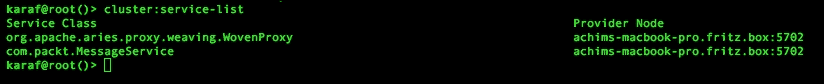

### 服务消费捆绑包

由于服务现在在整个集群中可用，消费捆绑包可以安装到主集群并消费此服务。考虑以下代码：

```java
<!-- reference service -->
<reference id="messageService" interface="com.packt.MessageService" />

<!-- Service Implementation -->
<bean class="com.packt.consumer.MessageConsumer" init-method="doRun">
  <property name="messageService" ref="messageService"/>
</bean>
```

消费捆绑包从注册表中检索服务引用并使用它。消费类通过`init-method`调用启动。

接口捆绑包已经安装，因为我们已经为它发出了`cluster:bundle-install`命令。现在，只需使用以下命令在根节点上安装`consumer`捆绑包：

```java
karaf@root()>cluster:bundle-install main-cluster mvn:com.packt/chapter6-recipe3-consumer/1.0.0-SNAPSHOT

```

现在，通过以下命令启动`consumer`捆绑包；您可能需要更改捆绑包 ID：

```java
karaf@root()> cluster:bundle-list master | grep -i chapter
[36  ] [Active     ] chapter6-recipe3-interface (1.0.0.SNAPSHOT)
[52  ] [Installed  ] chapter6-recipe3-consumer (1.0.0.SNAPSHOT)

```

您可以使用以下命令启动捆绑包：

```java
karaf@root()> cluster:bundle-start <bundle-id>

```

### 注意

注意，如果您在单独的终端中启动了第二个节点，这将使您从中获得最大收益，因为您将看到两个节点都从发送者那里接收消息。

## 它是如何工作的……

默认情况下，Cellar DOSGi 不会在整个集群中共享任何服务。一个打算在集群环境中使用并绑定到专用集群节点的服务需要在服务上进行特殊处理。您可能已经注意到了`MessageService`注册上的额外服务属性。属性条目`service.exported.interfaces`标记此服务将在整个集群中导出。Cellar 将在不包含实际服务的节点上为远程服务创建代理。

为什么我们需要额外的节点和组？因为 Apache Karaf Cellar 是为了在集群组中提供捆绑包，这将导致所有捆绑包都在同一组中分散。而实际上，在集群中运行服务需要将捆绑包在集群中分离，这又导致节点通过显式组再次分离。

查看以下截图，它总结了集群组内的通信方式。在整个集群中安装一个包，可以通过之前提到的命令实现，或者只需在**节点 1**上安装此包。新包的此**状态**将在整个集群组中同步，除非此包被明确列入黑名单。另一种在整个集群中禁用此自动同步的方法是使用管理节点。管理节点需要在集群组内有一个**主节点**来管理整个集群的功能安装。这与默认设置和“无所不知”的集群**大脑**背后的理念相反。更多详情，请参阅《学习 Karaf Cellar》，作者**让-巴蒂斯特·奥诺弗雷**，**Packt 出版社**。

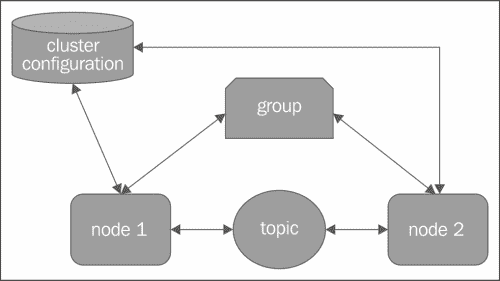
