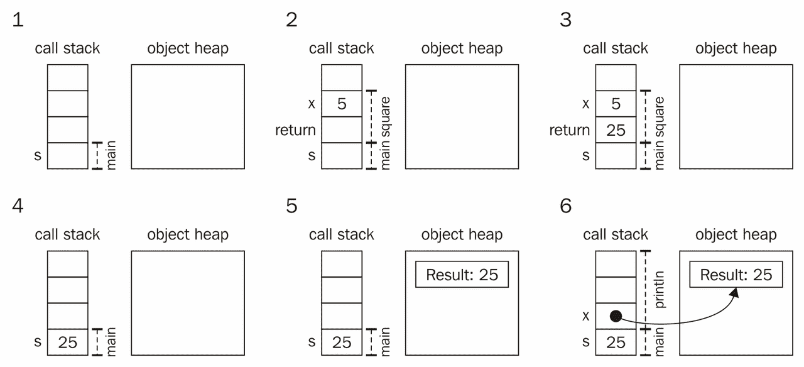

# 第一章。简介

|   | *"For over a decade prophets have voiced the contention that the organization of a single computer has reached its limits and that truly significant advances can be made only by interconnection of a multiplicity of computers."* |   |
| --- | --- | --- |
|   | --*吉恩·阿姆达尔，1967 年* |

尽管并发编程学科有着悠久的历史，但随着多核处理器的出现，它在近年来获得了大量的关注。计算机硬件的最近发展不仅复兴了一些经典的并发技术，而且也引发了并发编程领域的一次重大范式转变。在并发性变得如此重要的今天，理解并发编程对于每一位软件开发者来说都是一项基本技能。

本章解释了并发计算的基本原理，并介绍了本书所需的某些 Scala 基础知识。具体来说，它做了以下几件事：

+   展示了并发编程的简要概述

+   研究使用 Scala 进行并发时的优势

+   涵盖了阅读本书所需的 Scala 基础知识

我们将从探讨并发编程是什么以及为什么它很重要开始。

# 并发编程

在**并发编程**中，我们将程序表达为一组在重叠时间段内执行并按某种方式协调的并发计算。实现一个功能正确的并发程序通常比实现一个顺序程序要困难得多。顺序编程中存在的所有陷阱都潜伏在每一个并发程序中，但还有许多其他可能出错的地方，正如我们将在本书中学到的那样。一个自然的问题出现了：为什么还要费这个劲？我们难道不能只继续编写顺序程序吗？

并发编程具有多个优点。首先，增加并发性可以提高**程序性能**。不是在单个处理器上执行整个程序，而是在不同的处理器上执行不同的子计算，从而使程序运行得更快。随着多核处理器的普及，这是并发编程如今受到如此多关注的主要原因。

并发编程模型可以实现更快的 I/O 操作。一个纯顺序程序必须定期轮询 I/O 以检查是否有来自键盘、网络接口或其他设备的数据输入。另一方面，并发程序可以立即对 I/O 请求做出反应。对于 I/O 密集型操作，这会导致吞吐量的提高，这也是为什么在多处理器出现之前，编程语言中就存在并发编程支持的原因之一。因此，并发性可以确保与环境的交互程序具有更好的**响应性**。

最后，并发可以简化计算机程序的**实现**和**可维护性**。一些程序可以使用并发更简洁地表示。将程序划分为更小、更独立的计算比将其全部纳入一个大程序更方便。用户界面、Web 服务器和游戏引擎是这类系统的典型例子。

在这本书中，我们采用了一种约定，即并发程序通过使用共享内存进行通信，并在单个计算机上执行。相比之下，在多台计算机上执行，每台计算机都有自己的内存的计算机程序被称为**分布式程序**，编写此类程序的学科被称为**分布式编程**。通常，分布式程序必须假设每台计算机在任何时候都可能失败，并在这种情况发生时提供一些安全保证。我们将主要关注并发程序，但也会查看分布式程序的示例。

## 传统并发的简要概述

在计算机系统中，并发可以在计算机硬件、操作系统级别或编程语言级别上体现出来。我们将主要关注编程语言级别的并发。

在并发系统中，多个执行之间的协调被称为**同步**，这是成功实现并发的一个关键部分。同步包括用于在时间上对并发执行进行排序的机制。此外，同步还指定了并发执行如何进行通信，即它们如何交换信息。在并发程序中，不同的执行通过修改计算机的共享内存子系统来相互交互。这种类型的同步被称为**共享内存通信**。在分布式程序中，执行通过交换消息来交互，因此这种类型的同步被称为**消息传递通信**。

在最低级别，并发执行由称为进程和线程的实体表示，这在第二章中有所介绍，*JVM 和 Java 内存模型上的并发*。进程和线程传统上使用锁和监视器等实体来对其执行的部分进行排序。在线程之间建立顺序确保了一个线程所做的内存修改对后来执行的线程是可见的。

通常，使用线程和锁来表示并发程序是繁琐的。为了解决这个问题，已经开发了一些更复杂的并发设施，例如通信通道、并发集合、屏障、倒计时锁和线程池。这些设施旨在更容易地表达特定的并发编程模式，其中一些在第三章中有所介绍，*并发传统构建块*。

传统的并发相对较低级，容易发生各种错误，如死锁、饥饿、数据竞争和竞态条件。在编写并发 Scala 程序时，你通常不会使用低级并发原语。然而，对低级并发编程的基本了解将在以后理解高级并发概念时非常有价值。

## 现代并发范式

现代并发范式比传统的并发方法更先进。在这里，关键的区别在于，高级并发框架表达的是*要实现哪个目标*，而不是*如何实现这个目标*。

在实践中，低级并发和高级并发的区别并不那么明显，不同的并发框架形成了一个连续体，而不是两个截然不同的组。然而，最近在并发编程方面的发展显示出对声明式和函数式编程风格的偏好。

正如我们将在第二章中看到的那样，*JVM 和 Java 内存模型上的并发*，并发计算一个值需要创建一个带有自定义`run`方法的线程，调用`start`方法，等待线程完成，然后检查特定的内存位置以读取结果。在这里，我们真正想说的是*并发计算某个值，并在完成后通知我*。此外，我们更倾向于使用一种编程模型，该模型抽象出并发计算的协调细节，将计算结果视为我们已经拥有它，而不是必须等待它并从内存中读取它。**使用未来异步编程**是一种旨在特别支持这些语句的范例，我们将在第四章中学习，*使用未来和承诺的异步编程*。同样，**使用事件流的响应式编程**旨在声明性地表达产生许多值的并发计算，正如我们将在第六章中看到的那样，*使用响应式扩展的并发编程*。

声明式编程风格在顺序编程中也越来越普遍。例如，Python、Haskell、Ruby 和 Scala 等语言使用函数运算符来表示其集合上的操作，并允许诸如*从这个集合中过滤出所有负整数*之类的语句。这个语句表达了一个目标，而不是底层的实现，使得在幕后并行化此类操作变得容易。第五章，*数据并行集合*，描述了 Scala 中可用的**数据并行**集合框架，该框架旨在通过使用多核来加速集合操作。

在高级并发框架中，另一个趋势是向特定任务的专业化发展。软件事务内存技术专门设计用来表达内存事务，根本不涉及如何启动并发执行的问题。一个**内存事务**是一系列看起来要么同时执行要么根本不执行的内存操作。这与数据库事务的概念类似。使用内存事务的优势在于这避免了与低级并发相关的大量错误。第七章，*软件事务内存*，详细解释了软件事务内存。

最后，一些高级并发框架旨在透明地提供分布式编程支持。这对于数据并行框架和消息传递并发框架尤其如此，例如第八章*Actor*中描述的**actor**。

# Scala 的优势

尽管 Scala 仍然是一种正在兴起的语言，但它还没有像 Java 这样的语言得到广泛采用；然而，它对并发编程的支持丰富而强大。Scala 生态系统中有针对几乎所有不同风格的并发编程的并发框架，并且正在积极开发中。在其发展过程中，Scala 在提供现代、高级的应用程序编程接口或 API 方面推动了并发编程的边界。这有很多原因。

许多现代并发框架之所以能够进入 Scala，主要原因是其固有的语法灵活性。多亏了以下章节中解释的一等函数、byname 参数、类型推断和模式匹配等特性，可以定义看起来像是内置语言特性的 API。

这样的 API 模拟了各种编程模型，如嵌入式领域特定语言，Scala 作为宿主语言：actor、软件事务内存和 future 是看起来像是基本语言特性但实际上作为库实现的 API 的例子。一方面，Scala 避免了为每个新的并发编程模型开发新语言的需要，并作为现代并发框架丰富的嵌套基础。另一方面，减轻了许多其他语言中存在的语法负担，吸引了更多用户。

Scala 领先的第二原因是它是一种安全的语言。自动垃圾回收、自动边界检查以及没有指针运算有助于避免内存泄漏、缓冲区溢出和其他内存错误等问题。同样，静态类型安全性在早期阶段消除了许多编程错误。当涉及到本身容易发生各种并发错误的并发编程时，少了一件需要担心的事情可以产生巨大的影响。

第三个重要原因是互操作性。Scala 程序被编译成 Java 字节码，因此生成的可执行代码在**Java 虚拟机**（**JVM**）上运行。这意味着 Scala 程序可以无缝地使用现有的 Java 库，并与 Java 的丰富生态系统进行交互。通常，转向不同的语言是一个痛苦的过程。在 Scala 的情况下，从 Java 等语言过渡可以逐步进行，并且要容易得多。这是其日益普及的原因之一，也是一些 Java 兼容框架选择 Scala 作为实现语言的原因之一。

重要的是，Scala 运行在 JVM 上这一事实意味着 Scala 程序可以在不同的平台上移植。不仅如此，JVM 具有定义良好的线程和内存模型，这些模型在不同的计算机上保证以相同的方式工作。虽然可移植性对于顺序程序的一致语义很重要，但在并发计算中，它更为重要。

在了解了 Scala 在并发编程方面的优势之后，我们现在可以研究本书相关的语言特性。

# 前置知识

本书假设读者对顺序编程有基本的了解。虽然我们建议读者熟悉 Scala 编程语言，但对于类似 Java 或 C#这样的语言的理解应该足以应对本书。对面向对象编程中的概念，如类、对象和接口，有基本的了解是有帮助的。同样，对函数式编程原则，如一等函数、纯净性和类型多态，有基本的理解有助于理解本书，但这些并非严格的前提条件。

## Scala 程序的执行

为了更好地理解 Scala 程序的执行模型，让我们考虑一个简单的程序，该程序使用`square`方法计算数字`5`的平方值，然后将结果打印到标准输出：

```java
object SquareOf5 extends App { 
  def square(x: Int): Int = x * x 
  val s = square(5) 
  println(s"Result: $s") 
} 

```

我们可以使用在**前言**中描述的**简单构建工具**（**SBT**）运行此程序。当 Scala 程序运行时，JVM 运行时为程序分配所需的内存。在这里，我们考虑两个重要的内存区域——**调用栈**和**对象堆**。调用栈是一个内存区域，其中程序存储有关当前执行方法的局部变量和参数的信息。对象堆是一个程序在其中分配对象的内存区域。为了理解这两个区域之间的差异，我们考虑这个程序执行的一个简化场景。

首先，在图 **1** 中，程序为局部变量 `s` 在调用栈中分配了一个条目。然后，它在图 **2** 中调用 `square` 方法来计算局部变量 `s` 的值。程序将值 `5` 放在调用栈上，作为 `x` 参数的值。它还为方法的返回值预留了一个栈条目。此时，程序可以执行 `square` 方法，因此它将 `x` 参数自乘，并将返回值 `25` 放在图 **3** 中的栈上。这在上面的插图的第一行中显示：



在 `square` 方法返回结果后，结果 `25` 被复制到局部变量 `s` 的栈条目中，如图 **4** 所示。现在，程序必须为 `println` 语句创建字符串。在 Scala 中，字符串被表示为 `String` 类的对象实例，因此程序在对象堆中分配了一个新的 `String` 对象，如图 **5** 所示。最后，在图 **6** 中，程序将新分配的对象的引用存储到栈条目 `x` 中，并调用 `println` 方法。

尽管这个演示被大大简化了，但它展示了 Scala 程序的基本执行模型。在第二章中，“JVM 和 Java 内存模型上的并发”，我们将了解到每个执行线程维护一个独立的调用栈，并且线程主要通过修改对象堆来进行通信。我们将了解到堆的状态和局部调用栈之间的差异通常是并发程序中某些错误的原因。

在看到 Scala 程序通常是如何执行的一个例子之后，我们现在继续概述 Scala 的特性，这些特性对于理解本书的内容至关重要。

## Scala 入门

在本节中，我们简要概述了本书示例中使用的 Scala 编程语言特性。这是对 Scala 基础的快速浏览。请注意，本节并非旨在提供一个完整的 Scala 介绍。这是为了提醒您一些语言特性，并将它们与您可能熟悉的类似语言进行对比。如果您想了解更多关于 Scala 的信息，请参考本章 *总结* 中提到的书籍。

一个名为 `Printer` 的类，它接受一个 `greeting` 参数，并有两个名为 `printMessage` 和 `printNumber` 的方法，声明如下：

```java
class Printer(val greeting: String) { 
  def printMessage(): Unit = println(greeting + "!") 
  def printNumber(x: Int): Unit = { 
    println("Number: " + x) 
  } 
}

```

在前面的代码中，`printMessage` 方法不接受任何参数，并包含一个单独的 `println` 语句。`printNumber` 方法接受一个名为 `x` 的 `Int` 类型的单个参数。这两个方法都不返回任何值，这由 `Unit` 类型表示。

我们可以这样实例化类并调用其方法：

```java
val printy = new Printer("Hi") 
printy.printMessage() 
printy.printNumber(5) 

```

Scala 允许声明**单例对象**。这就像声明一个类并同时实例化它的单个实例一样。我们之前看到了 `SquareOf5` 单例对象，它被用来声明一个简单的 Scala 程序。以下名为 `Test` 的单例对象声明了一个名为 `Pi` 的字段，并将其初始化为值 `3.14`：

```java
object Test { 
  val Pi = 3.14 
} 

```

当类似语言的类扩展称为接口的实体时，Scala 类可以扩展**特质**。Scala 的特质允许声明具体的字段和方法实现。在以下示例中，我们声明了 `Logging` 特质，它使用抽象的 `log` 方法输出自定义的错误和警告消息，然后将特质混合到 `PrintLogging` 类中：

```java
trait Logging { 
  def log(s: String): Unit 
  def warn(s: String) = log("WARN: " + s) 
  def error(s: String) = log("ERROR: " + s) 
} 
class PrintLogging extends Logging { 
  def log(s: String) = println(s) 
} 

```

类可以有**类型参数**。下面的通用 `Pair` 类有两个类型参数，`P` 和 `Q`，它们决定了其参数 `first` 和 `second` 的类型：

```java
class PairP, Q 

```

Scala 支持一等函数对象，也称为**lambda**。在下面的代码片段中，我们声明了一个 `twice` lambda，它将其参数乘以二：

```java
val twice: Int => Int = (x: Int) => x * 2 

```

### 小贴士

**下载示例代码：**

您可以从您在 [`www.packtpub.com`](http://www.packtpub.com) 的账户下载您购买的所有 Packt 书籍的示例代码文件。如果您在其他地方购买了这本书，您可以访问 [`www.packtpub.com/support`](http://www.packtpub.com/support) 并注册，以便将文件直接通过电子邮件发送给您。

在前面的代码中，`(x: Int)` 部分是 lambda 的参数，而 `x * 2` 是它的主体。`=>` 符号必须放置在 lambda 的参数和主体之间。相同的 `=>` 符号也用于表示 lambda 的类型，即 `Int => Int`，读作“Int 到 Int”。在先前的例子中，我们可以省略类型注解 `Int => Int`，编译器会自动推断 `twice` lambda 的类型，如下面的代码所示：

```java
val twice = (x: Int) => x * 2 

```

或者，我们可以在 lambda 声明中省略类型注解，从而得到更方便的语法，如下所示：

```java
val twice: Int => Int = x => x * 2 

```

最后，当 lambda 参数在 lambda 体中只出现一次时，Scala 允许使用更方便的语法，如下所示：

```java
val twice: Int => Int = _ * 2 

```

首类函数允许将代码块作为首类值来操作。它们允许更轻量级和简洁的语法。在以下示例中，我们使用 **按名参数** 来声明一个 `runTwice` 方法，该方法运行指定的代码块 `body` 两次：

```java
def runTwice(body: =>Unit) = { 
  body 
  body 
} 

```

按名参数是通过在类型之前放置 `=>` 注解来形成的。每当 `runTwice` 方法引用 `body` 参数时，表达式将被重新评估，如下面的代码片段所示：

```java
runTwice { // this will print Hello twice 
  println("Hello") 
} 

```

Scala `for` 表达式是遍历和转换集合的便捷方式。以下 `for` 循环打印了从 `0 until 10` 范围内的数字；其中 `10` 不包含在范围内：

```java
for (i <- 0 until 10) println(i) 

```

在前面的代码中，范围是通过表达式 `0 until 10` 创建的；这相当于表达式 `0.until(10)`，它调用值 `0` 上的 `until` 方法。在 Scala 中，在对象上调用方法时，有时可以省略点符号。

每个 `for` 循环都等价于一个 `foreach` 调用。前面的 `for` 循环被 Scala 编译器转换为以下表达式：

```java
(0 until 10).foreach(i => println(i)) 

```

For-comprehensions 用于转换数据。以下 for-comprehension 通过乘以 `-1` 转换 `0 until 10` 的所有数字：

```java
val negatives = for (i <- 0 until 10) yield -i 

```

`negatives` 值包含从 `0` 到 `-10` 的负数。这个 for-comprehension 等价于以下 `map` 调用：

```java
val negatives = (0 until 10).map(i => -1 * i) 

```

还可以从多个输入转换数据。以下 for-comprehension 创建了 `0` 到 `4` 之间的所有整数对：

```java
val pairs = for (x <- 0 until 4; y <- 0 until 4) yield (x, y) 

```

前面的 for-comprehension 等价于以下表达式：

```java
val pairs = (0 until 4).flatMap(x => (0 until 4).map(y => (x, y))) 

```

我们可以在 for-comprehension 中嵌套任意数量的生成表达式。Scala 编译器会将它们转换成一个嵌套的 `flatMap` 调用序列，然后是最深层的 `map` 调用。

常用的 Scala 集合包括序列，用 `Seq[T]` 类型表示；映射，用 `Map[K, V]` 类型表示；以及集合，用 `Set[T]` 类型表示。在以下代码中，我们创建了一个字符串序列：

```java
val messages: Seq[String] = Seq("Hello", "World.", "!") 

```

在整本书中，我们大量依赖 **字符串插值** 功能。通常，Scala 字符串是用双引号形成的。插值字符串前面有一个 `s` 字符，并且可以包含 `$` 符号和从封装作用域中解析的任意标识符，如下例所示：

```java
val magic = 7 
val myMagicNumber = s"My magic number is $magic" 

```

**模式匹配** 是 Scala 的另一个重要特性。对于有 Java、C# 或 C 背景的读者来说，一个好的描述方法是说 Scala 的 `match` 语句就像强化的 `switch` 语句。`match` 语句可以分解任意数据类型，并允许你在程序中简洁地表达不同的案例。

在以下示例中，我们声明一个名为`successors`的`Map`集合，用于将整数映射到它们的直接后继。然后我们调用`get`方法来获取数字 5 的后继。`get`方法返回一个具有`Option[Int]`类型的对象，该对象可以是`Some`类实现，表示数字 5 存在于映射中，或者`None`类实现，表示数字 5 不是映射中的键。在`Option`对象上使用模式匹配可以按情况继续，如下面的代码片段所示：

```java
val successors = Map(1 -> 2, 2 -> 3, 3 -> 4) 
successors.get(5) match { 
  case Some(n) => println(s"Successor is: $n") 
  case None    => println("Could not find successor.") 
} 

```

在 Scala 中，大多数运算符都可以重载。**运算符重载**与声明方法没有区别。在以下代码片段中，我们声明一个具有`+`运算符的`Position`类：

```java
class Position(val x: Int, val y: Int) { 
  def +(that: Position) = new Position(x + that.x, y + that.y) 
} 

```

最后，Scala 允许定义**包对象**来存储给定包的顶级方法和值定义。在以下代码片段中，我们声明了`org.learningconcurrency`包的包对象。我们实现了顶级`log`方法，该方法输出给定的字符串和当前线程名称：

```java
package org 
package object learningconcurrency { 
  def log(msg: String): Unit = 
    println(s"${Thread.currentThread.getName}: $msg") 
} 

```

我们将在本书的示例中使用`log`方法来跟踪并发程序是如何执行的。

这就结束了我们对重要 Scala 特性的快速概述。如果您想深入了解这些语言结构中的任何一种，我们建议您查阅关于 Scala 顺序编程的入门书籍之一。

# Scala 2.12 新特性的概述

在撰写本文时，语言的下一次计划发布版本是 Scala 2.12。从用户和 API 的角度来看，Scala 2.12 没有引入新的突破性特性。2.12 版本的目标是改进代码优化并使 Scala 符合 Java 8 运行时。由于 Scala 的主要目标是 Java 运行时，使 Scala 符合 Java 8 运行时将减少编译程序和 JAR 文件的大小，提高性能和加快编译速度。从用户的角度来看，主要变化是您将不得不安装 JDK 8 框架而不是 JDK 7。

值得在 Scala 2.12 中提到的特定变化如下：

+   在之前的版本中，如果所有方法都是抽象的，则特质编译为一个单独的接口。如果特质有一个具体方法实现，编译器将生成两个类文件——一个包含 JVM 接口，另一个类文件包含具体方法的实现。在 Scala 2.12 中，编译器将生成一个包含 Java 8 **默认方法**的单个接口文件。结果是代码大小减少。

+   以前，每个 Scala 闭包都被编译成一个单独的类。从 2.12 版本开始，Scala 闭包被编译成 Java 8 风格的 lambda 表达式。结果是代码大小减少，并且可能通过 Java 8 运行时进行更好的优化。

+   Scala 编译成 Java 字节码，然后在这些字节码上由 Java 虚拟机进行解释。在 Scala 2.12 中，旧的编译器后端被一个新的实现所取代，该实现可以更快地生成字节码，从而对编译速度产生积极影响。

+   Scala 2.12 随带一个新优化器，可以通过 `-opt` 编译器标志启用。新的优化器在内联最终方法方面更加激进，对在单个方法中创建和使用的对象和函数进行更好的逃逸分析，并执行死代码消除。所有这些都有助于提高 Scala 程序的性能。

+   Scala 2.12 允许使用 lambda 表达式为单抽象方法 (SAM) 类型。SAM 类型是具有恰好一个抽象方法的类或特质，通常通过扩展类来实现。假设我们有一个方法调用，其期望的类型是 SAM 类型。如果用户传递一个 lambda，即函数字面量，而不是 SAM 类型实例，2.12 编译器将自动将函数对象转换为 SAM 类型的实例。

# 摘要

在本章中，我们研究了并发编程是什么以及为什么 Scala 是一种适合并发的语言。我们简要概述了本书将介绍的内容以及本书的组织结构。最后，我们列举了一些理解后续章节中各种并发主题所需的 Scala 基础知识。如果您想了解更多关于顺序 Scala 编程的知识，我们建议您阅读书籍，《Scala 编程》，作者：马丁·奥德斯基、莱克斯·斯波恩和比尔·文纳，出版社：Artima Inc。

在下一章中，我们将从 JVM 上的并发编程基础开始。我们将介绍并发编程的基本概念，展示 JVM 上可用的低级并发实用工具，并了解 Java 内存模型。

# 练习

以下练习旨在测试你对 Scala 编程语言的知识。它们涵盖了本章介绍的内容，以及一些额外的 Scala 功能。最后两个练习对比了本章定义的并发编程和分布式编程之间的差异。你应该通过绘制伪代码解决方案来解决它们，而不是一个完整的 Scala 程序。

1.  实现一个具有以下签名的 `compose` 方法：

    ```java
                def compose[A, B, C]
                (g: B => C, f: A => B): A => C = ??? 

    ```

    此方法必须返回一个函数 `h`，它是函数 `f` 和 `g` 的组合

1.  实现一个具有以下签名的 `fuse` 方法：

    ```java
                def fuse[A, B] 
                (a: Option[A], b: Option[B]): Option[(A, B)] = ??? 

    ```

    结果的 `Option` 对象应包含来自 `Option` 对象 `a` 和 `b` 的值元组，前提是 `a` 和 `b` 都不为空。使用 for-表达式

1.  实现一个 `check` 方法，它接受类型为 `T` 的值集合和一个类型为 `T => Boolean` 的函数：

    ```java
                def checkT(pred: T => Boolean): Boolean = ??? 

    ```

    该方法必须返回 `true`，仅当 `pred` 函数对所有 `xs` 中的值返回 `true` 而不抛出异常时。如下使用 `check` 方法：

    ```java
                check(0 until 10)(40 / _ > 0) 

    ```

    ### 小贴士

    `check` 方法有一个柯里化定义：它不是只有一个参数列表，而是有两个。柯里化定义在调用函数时提供了更简洁的语法，但在其他方面与单参数列表定义在语义上是等价的。

1.  修改本章中的 `Pair` 类，使其能够用于模式匹配。

    ### 提示

    如果你还没有这样做，请熟悉 Scala 中的模式匹配。

1.  实现一个 `permutations` 函数，它接受一个字符串，并返回一个字符串序列，这些字符串是输入字符串的字典序排列：

    ```java
                def permutations(x: String): Seq[String]  

    ```

1.  实现一个 `combinations` 函数，它接受一个元素序列，并生成一个长度为 `n` 的所有可能组合的迭代器。组合是从集合中选择元素的一种方式，使得每个元素只被选中一次，且元素的顺序不重要。例如，给定一个集合 `Seq(1, 4, 9, 16)`，长度为 2 的组合有 `Seq(1, 4)`、`Seq(1, 9)`、`Seq(1, 16)`、`Seq(4, 9)`、`Seq(4, 16)` 和 `Seq(9, 16)`。组合函数具有以下签名：

    ```java
                def combinations(n: Int, xs: Seq[Int]): Iterator[Seq[Int]] 

    ```

    请参阅标准库文档中的 `Iterator` API。

1.  实现一个方法，该方法接受一个正则表达式，并返回一个从字符串到该字符串内匹配项列表的部分函数：

    ```java
                def matcher   (regex: String): PartialFunction[String,   
                List[String]] 

    ```

    如果在参数字符串中没有匹配项，则不应定义部分函数。否则，它应使用正则表达式输出匹配项的列表。

1.  考虑这样一个场景：你和你的三位同事在一个被分成隔断的办公室里工作。你们彼此看不到对方，也不允许口头交流，因为这可能会打扰到其他工作人员。相反，你们可以通过互相扔带有简短信息的纸条来进行交流。由于你们被限制在隔断内，你们中的任何一个人都无法确定信息是否已经到达目的地。在任何时候，你或你的同事都可能被叫到老板的办公室，并且可能在那里无限期地等待。设计一个算法，让你们和你的同事能够决定何时在当地酒吧见面。除了被叫到老板办公室的那个人之外，你们所有人都必须决定相同的时间。如果有些纸条可以任意地错过目标隔断怎么办？

1.  想象一下，在上一个练习中，你和你的同事也在办公室旁边的走廊里有一个白板。你们中的任何一个人偶尔会经过走廊并在白板上写些东西，但无法保证你们中的任何一个人会在同一时间出现在走廊上。

使用白板解决上一个练习中的问题。
