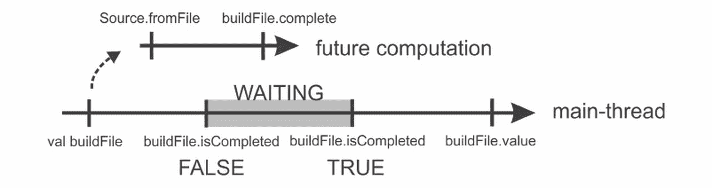
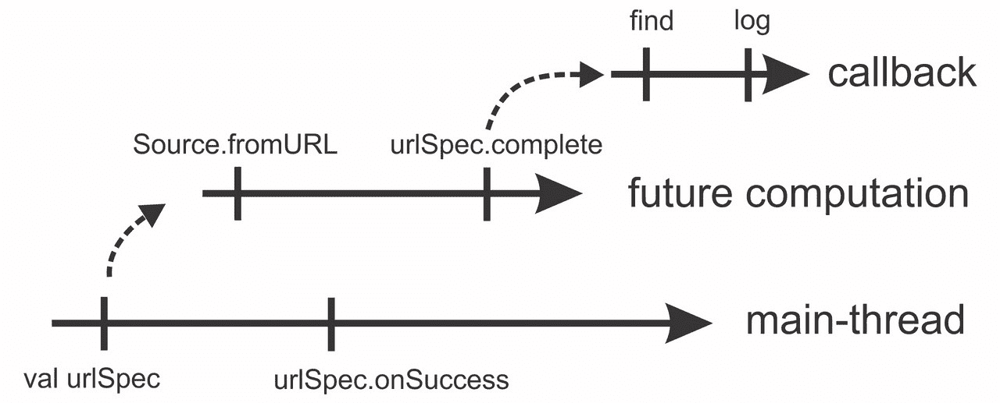
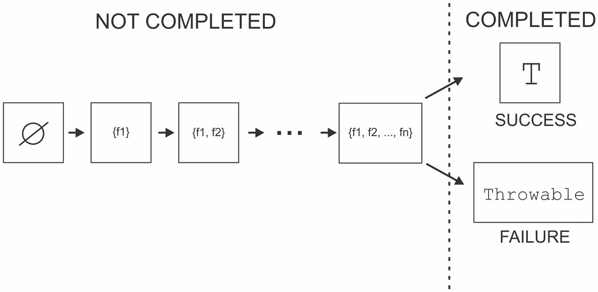
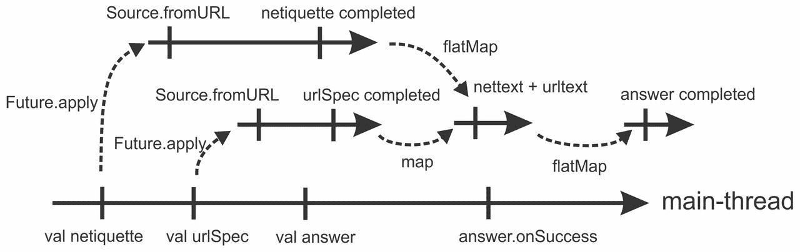
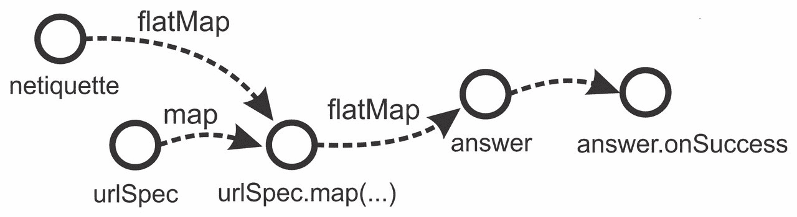

# 第四章。使用 Futures 和 Promises 进行异步编程

|   | *以函数式风格编程使代码呈现的状态明确，这使得推理更容易，并且在完全纯系统中，使得线程竞争条件成为不可能。* |   |
| --- | --- | --- |
|   | --*约翰·卡马克* |

在前几章的示例中，我们经常处理阻塞计算。我们了解到阻塞同步可能产生负面影响：它可能导致死锁、耗尽线程池或破坏懒值初始化。虽然在某些情况下，阻塞是完成工作的正确工具，但在许多情况下我们可以避免它。异步编程指的是执行独立于主程序流程的编程风格。异步编程帮助您在资源不可用时消除阻塞，而不是挂起线程；一旦资源可用，就会安排一个单独的计算继续进行。

从某种意义上说，到目前为止看到的许多并发模式都支持异步编程；线程创建和调度执行上下文任务可以用来在主程序流程并发执行计算。尽管如此，在避免阻塞或组合异步计算时直接使用这些设施并不简单。在本章中，我们将关注 Scala 中专门针对此任务的两个抽象：futures 和 promises。

更具体地说，我们将研究以下主题：

+   启动异步计算，并使用`Future`对象

+   安装处理异步计算结果的回调

+   `Future`对象的异常语义，以及使用类型`Try`

+   `Future`对象的函数式组合

+   使用`Promise`对象与基于回调的 API 接口，实现 future 组合子，并支持取消

+   在异步计算中阻塞线程

+   使用 Scala 的`Async`库

在下一节中，我们将首先介绍`Future`，并展示为什么它是有用的。

# Futures

在前几章中，我们了解到并发程序中的并行执行是在称为**线程**的实体上进行的。在任何时刻，线程的执行可以被暂时挂起，直到满足特定条件。当这种情况发生时，我们说线程被阻塞了。为什么在并发编程中我们最初要阻塞线程呢？其中一个原因是资源有限；共享这些资源的多个计算有时需要等待。在其他情况下，一个计算需要特定的数据才能继续进行，如果这些数据尚未可用，负责生成数据的线程可能运行缓慢或数据源可能位于程序外部。一个经典的例子是等待通过网络到达的数据。假设我们有一个`getWebpage`方法，给定一个包含网页位置的`url`字符串，返回该网页的内容：

```java
def getWebpage(url: String): String 

```

`getWebpage`方法的返回类型是`String`；该方法必须返回包含网页内容的字符串。然而，在发送 HTTP 请求后，网页的内容并不立即可用。请求需要一些时间在网络中从服务器传回，程序才能访问文档。唯一的方法是等待 HTTP 响应到达，但这可能需要相对较长的时间；即使有高速的互联网连接，`getWebpage`方法也需要等待。由于调用`getWebpage`方法的线程在没有网页内容的情况下无法继续执行，它需要暂停其执行；因此，正确实现`getWebpage`方法的唯一方式是阻塞。

我们已经知道阻塞可能会产生负面影响，那么我们能否将`getWebpage`方法的返回值更改为一个可以立即返回的特殊值呢？答案是肯定的。在 Scala 中，这个特殊值被称为**future**。future 是一个占位符，即值的内存位置。这个占位符在 future 创建时不需要包含值；值最终可以通过`getWebpage`方法放入 future 中。我们可以将`getWebpage`方法的签名更改为返回一个 future，如下所示：

```java
def getWebpage(url: String): Future[String] 

```

这里，`Future[String]`类型意味着 future 对象最终可以包含一个`String`值。现在我们可以实现不阻塞的`getWebpage`方法——我们可以异步启动 HTTP 请求，并在内容可用时将其放入 future 中。当这种情况发生时，我们说`getWebpage`方法完成了 future。重要的是，在 future 完成并带有某个值之后，该值将无法再改变。

### 注意

`Future[T]`类型在程序中编码了延迟；使用它来编码在执行过程中稍后可用的值。

这消除了`getWebpage`方法中的阻塞，但调用线程如何提取 future 的内容并不明确。轮询是一种非阻塞提取内容的方法。在轮询方法中，调用线程调用一个特殊方法来阻塞，直到值变得可用。虽然这种方法并没有消除阻塞，但它将阻塞的责任从`getWebpage`方法转移到了调用线程。Java 定义了自己的`Future`类型来编码稍后可用的值。然而，作为一个 Scala 开发者，你应该使用 Scala 的 futures；它们允许处理 future 值的方式更多，并且避免了阻塞，正如我们很快就会看到的。

当在 Scala 中使用未来编程时，我们需要区分**未来值**和**未来计算**。类型为`Future[T]`的未来值表示程序中可能当前不可用，但以后可能可用的某种类型的`T`值。通常，当我们说未来时，我们实际上是指未来值。在`scala.concurrent`包中，未来是通过`Future[T]`特质来表示的：

```java
trait Future[T] 

```

相比之下，未来的计算是一种异步计算，它产生一个未来的值。可以通过在`Future`伴生对象上调用`apply`方法来启动未来的计算。在`scala.concurrent`包中，此方法具有以下签名：

```java
def applyT(implicit e: ExecutionContext): Future[T] 

```

此方法接受一个类型为`T`的按名参数。这是异步计算的主体，该计算产生某种类型的`T`值。它还接受一个隐式`ExecutionContext`参数，该参数抽象化了线程在哪里以及何时执行，正如我们在第三章中学习的，*并发的传统构建块*。回想一下，Scala 的隐式参数可以在调用方法时指定，就像正常参数一样，或者它们可以被省略——在这种情况下，Scala 编译器会在周围作用域中搜索`ExecutionContext`类型的值。大多数`Future`方法都接受一个隐式执行上下文。最后，`Future.apply`方法返回一个类型为`T`的未来。这个未来通过异步计算的结果值`b`来完成。

## 启动未来计算

让我们通过一个例子来看看如何启动未来的计算。我们首先导入`scala.concurrent`包的内容。然后从`Implicits`对象中导入`global`执行上下文。这确保了未来的计算将在`global`上执行，这是大多数情况下你可以使用的默认执行上下文：

```java
import scala.concurrent._ 
import ExecutionContext.Implicits.global 
object FuturesCreate extends App { 
  Future { log("the future is here") } 
  log("the future is coming") 
  Thread.sleep(1000) 
} 

```

`log` 方法调用（在未来的计算和主线程中）执行的顺序是非确定的。跟随一个块的 `Future` 单例对象是调用 `Future.apply` 方法的语法糖。`Future.apply` 方法的作用类似于 第三章 中的 `execute` 语句，*并发的传统构建块*。不同之处在于 `Future.apply` 方法返回一个未来值。我们可以轮询这个未来值，直到它完成。在以下示例中，我们可以使用 `scala.io.Source` 对象在未来的计算中读取 `build.sbt` 文件的全部内容。主线程在未来的计算返回的 `buildFile` 未来值上调用 `isCompleted` 方法。很可能会发生的是，构建文件没有快速读取，所以 `isCompleted` 返回 `false`。250 毫秒后，主线程再次调用 `isCompleted`，这次 `isCompleted` 返回 `true`。最后，主线程调用 `value` 方法，它返回构建文件的内容：

```java
import scala.io.Source 
object FuturesDataType extends App { 
  val buildFile: Future[String] = Future { 
    val f = Source.fromFile("build.sbt") 
    try f.getLines.mkString("\n") finally f.close() 
  } 
  log(s"started reading the build file asynchronously") 
  log(s"status: ${buildFile.isCompleted}") 
  Thread.sleep(250) 
  log(s"status: ${buildFile.isCompleted}") 
  log(s"value: ${buildFile.value}") 
} 

```

在这个例子中，我们使用了轮询来获取未来的值。`Future` 单例对象的轮询方法是非阻塞的，但它们也是非确定的；`isCompleted` 将会反复返回 `false` 直到未来完成。重要的是，未来的完成与轮询调用之间存在发生之前的关系。如果未来在轮询方法调用之前完成，那么其效果将在轮询完成后对线程可见。

以图形方式展示，轮询看起来像以下图：



轮询图

轮询就像每隔五分钟给你的潜在雇主打电话询问你是否被雇佣一样。你真正想做的应该是提交一份工作申请，然后申请其他工作，而不是忙等雇主的回复。一旦你的雇主决定雇佣你，他们会在你留给他们的电话号码上给你打电话。我们希望未来能做同样的事情；当它们完成时，它们应该调用我们留给它们的特定函数。这是下一节的主题。

## 未来回调

回调是一个在其参数可用时被调用的函数。当 Scala 未来接受一个回调时，它最终会调用那个回调。然而，未来不会在完成并带有某个值之前调用回调。

假设我们需要查找 W3 联盟的 URL 规范细节。我们对`telnet`关键字的全部实例感兴趣。URL 规范作为文本文档可在[`www.w3.org/`](https://www.w3.org/)找到。我们可以使用`scala.io.Source`对象获取规范的正文内容，并在`getUrlSpec`方法中使用未来异步执行 HTTP 请求。`getUrlSpec`方法首先调用`fromURL`方法以获取包含文本文档的`Source`对象。然后它调用`getLines`以获取文档中的单独行列表：

```java
object FuturesCallbacks extends App { 
  def getUrlSpec(): Future[List[String]] = Future { 
    val url = "http://www.w3.org/Addressing/URL/url-spec.txt" 
    val f = Source.fromURL(url) 
    try f.getLines.toList finally f.close() 
  } 
  val urlSpec: Future[List[String]] = getUrlSpec() 

```

要找到`urlSpec`未来中包含`telnet`关键字的行，我们使用`find`方法，该方法接受一个行列表和一个关键字，并返回包含匹配项的字符串：

```java
  def find(lines: List[String], keyword: String): String = lines.zipWithIndex collect { 
      case (line, n) if line.contains(keyword) => (n, line) 
    } mkString("\n") 

```

`find`方法接受一个`List[String]`参数，但`urlSpec`是`Future[List[String]]`类型。我们不能直接将`urlSpec`未来传递给`find`方法；而且有很好的理由，该值可能在调用`find`方法时不可用。

相反，我们使用`foreach`方法安装到未来的回调。请注意，`foreach`方法的等效方法是`onSuccess`方法，但它可能在 Scala 2.11 之后被弃用。此方法接受一个部分函数，给定未来的值，执行某些操作，如下所示：

```java
  urlSpec foreach { 
    case lines => log(find(lines, "telnet")) 
  } 
  log("callback registered, continuing with other work") 
  Thread.sleep(2000) 

```

重要的是，安装回调是一个非阻塞操作。在主线程中，回调注册后立即执行`log`语句，但回调中的`log`语句可以在很久以后被调用。这在下图中得到了说明：



回调图

注意，回调不一定在未来完成后立即被调用。大多数执行上下文都会安排一个任务以异步处理回调。如果我们在尝试安装回调时未来已经完成，也是如此。

### 注意

未来的完成之后，回调最终被调用，并且独立于同一未来的其他回调。指定的执行上下文决定了回调何时以及在哪条线程上执行。

完成未来和开始回调之间存在发生之前的关系。

我们不仅限于安装一个回调到未来。如果我们还想找到所有`password`关键字的实例，我们可以安装另一个回调：

```java
  urlSpec foreach { 
    case lines => log(find(lines, "password")) 
  } 
  Thread.sleep(1000) 
} 

```

作为一名经验丰富的 Scala 程序员，你可能听说过引用透明性。大致来说，一个函数是引用透明的，如果它不执行任何副作用，例如变量赋值、修改可变集合或写入标准输出。未来的回调有一个非常有用的特性。仅使用`Future.apply`和`foreach`调用具有引用透明回调的程序是确定性的。对于相同的输入，这些程序将始终计算相同的结果。

### 注意

由引用透明未来计算和回调组成的程序是确定性的。

在之前的例子中，我们假设异步计算产生未来总是成功的。然而，计算有时会失败并抛出异常。我们将研究如何处理异步计算中的失败情况。

## 未来和异常

如果未来计算抛出异常，那么相应的未来对象就不能用值完成。理想情况下，我们希望在发生这种情况时得到通知。如果你申请一份工作，而雇主决定雇佣其他人，你仍然希望接到电话。否则，你可能会在电话前无所事事地坐上几天，等待招聘人员的电话。

当 Scala 未来完成时，它可以是成功完成或失败。当一个未来以失败完成时，我们还说未来已经失败。为了总结未来的所有不同状态，我们展示了以下状态图。未来创建时没有任何关联的回调。然后，可以为它分配任意数量的回调 `f1`、`f2`、...、`fn`。当未来完成时，它要么成功完成，要么失败。之后，未来的状态不再改变，并立即注册回调以安排其执行。



现在，我们更详细地看看如何处理失败情况。`foreach` 方法只接受处理成功完成的未来的回调，因此我们需要另一个方法来安装失败回调。这个方法被称为 `failed`。它返回一个包含当前对象失败时异常的 `Future[Throwable]` 对象，并且可以与 `foreach` 语句一起使用来访问异常：

```java
object FuturesFailure extends App { 
  val urlSpec: Future[String] = Future { 
    val invalidUrl = "http://www.w3.org/non-existent-url-spec.txt" 
    Source.fromURL(invalidUrl).mkString 
  } 
  urlSpec.failed foreach { 
    case t => log(s"exception occurred - $t") 
  } 
  Thread.sleep(1000) 
} 

```

在这个例子中，我们的异步计算向一个无效的 URL 发送 HTTP 请求。结果，`fromURL` 方法抛出异常，`urlSpec` 未来失败。然后程序使用 `log` 语句打印异常名称和消息。

## 使用 Try 类型

为了简洁，有时我们想在同一个回调中订阅成功和失败。为此，我们需要使用类型 `Try[T]`。类型 `Try[T]` 与类型 `Option[T]` 非常相似。回想一下你在顺序 Scala 编程中的经验，类型 `Option[T]` 用于编码类型 `T` 的值或其不存在。`Option[T]` 类型的值可以是 `Some[T]` 类型的对象，它包含一些值，或者 `None`，它不包含任何东西。我们使用模式匹配来确定 `Option[T]` 类型是 `Some[T]` 还是 `None`。可选类型是使用 `null` 值的替代方案，这在 Java 中通常是这样做。然而，`Option[T]` 类型不允许在它的 `None` 子类型中编码失败。`None` 子类型告诉我们关于计算中异常的什么信息。为此，我们使用 `Try[T]` 类型。

类型`Try[T]`有两个实现--类型`Success[T]`，它编码了成功计算的成果，以及`Failure[T]`类型，它编码了导致计算失败的`Throwable`对象。我们使用模式匹配来确定`Try[T]`对象是哪一个：

```java
def handleMessage(t: Try[String]) = t match { 
  case Success(msg) => log(msg) 
  case Failure(error) => log(s"unexpected failure - $error") 
} 

```

`Try[T]`对象是用于同步的不可变对象；与未来不同，它们从创建的那一刻起就包含一个值或异常。它们更类似于集合而不是未来。我们甚至可以在 for 推导式中组合`Try[T]`值。在下面的代码片段中，我们将组合当前线程的名称和一些自定义文本：

```java
import scala.util.{Try, Success, Failure} 
object FuturesTry extends App { 
  val threadName: Try[String] = Try(Thread.currentThread.getName) 
  val someText: Try[String] = Try("Try objects are synchronous") 
  val message: Try[String] = for { 
    tn <- threadName 
    st <- someText 
  } yield s"Message $st was created on t = $tn" 
  handleMessage(message) 
} 

```

我们首先将使用`Try.apply`工厂方法创建两个`Try[String]`值，分别是`threadName`和`someText`。`for`推导式从`threadName`值中提取线程名`tn`，然后从`someText`值中提取`st`文本。这些值随后被用来生成另一个字符串。如果在`for`推导式中任何一个`Try`值失败，那么结果`Try`值将使用第一个失败的`Try`值中的`Throwable`对象失败。然而，如果所有的`Try`值都是`Success`，那么结果`Try`值将是带有`yield`关键字之后表达式值的`Success`。如果这个表达式抛出异常，结果`Try`值将使用那个异常失败。

注意，前面的例子总是打印主线程的名称。创建`Try`对象并在`for`推导式中使用它们总是在调用者线程上发生的。

### 注意

与`Future[T]`值不同，`Try[T]`值是同步操作的。

在大多数情况下，我们使用`Try`值进行模式匹配。在调用`onComplete`回调时，我们将提供一个部分函数来匹配`Success`和`Failure`值。我们获取 URL 规范的示例如下：

```java
urlSpec onComplete { 
  case Success(txt) => log(find(txt)) 
  case Failure(err) => log(s"exception occurred - $err") 
} 

```

## 致命异常

我们已经看到未来存储了导致它们失败的异常。然而，有一些`Throwable`对象是未来计算无法捕获的。在以下简短的程序中，`f`未来的回调永远不会被调用。相反，`InterruptedException`异常的堆栈跟踪被打印到标准错误输出：

```java
object FuturesNonFatal extends App { 
  val f = Future { throw new InterruptedException } 
  val g = Future { throw new IllegalArgumentException } 
  f.failed foreach { case t => log(s"error - $t") } 
  g.failed foreach { case t => log(s"error - $t") } 
} 

```

`InterruptedException`异常和一些严重的程序错误，如`LinkageError`、`VirtualMachineError`、`ThreadDeath`和 Scala 的`ControlThrowable`错误，会被转发到执行上下文的`reportFailure`方法，该方法在第三章中介绍，*并发传统构建块*。这些类型的`Throwable`对象被称为**致命错误**。要找出一个`Throwable`对象是否会被存储在`Future`实例中，你可以使用`NonFatal`提取器与`Throwable`对象进行模式匹配：

```java
f.failed foreach { 
  case NonFatal(t) => log(s"$t is non-fatal!") 
} 

```

注意，你永远不需要手动匹配来查看你的未来中的错误是否是非致命的。致命错误会自动转发到执行上下文。

### 注意

Future 计算不会捕获致命错误。使用`NonFatal`提取器来对非致命错误进行模式匹配。

## futures 上的函数式组合

回调很有用，但当程序变得更大时，它们可能会使关于控制流的推理变得困难。它们还禁止异步编程中的一些特定模式，特别是同时订阅多个未来的回调使用起来很繁琐。幸运的是，Scala 的 futures 有针对这些问题的解决方案，称为**函数式组合**。在 futures 上的函数式组合允许在`for`循环中使用 futures，并且通常比回调更直观易用。

引入 futures 将阻塞的责任从 API 转移到调用者。`foreach`方法帮助你完全避免阻塞。它还消除了`isCompleted`和`value`等轮询方法固有的非确定性。尽管如此，在某些情况下，`foreach`语句并不是最佳解决方案。

假设我们想要实现 Git 版本控制系统中的一些功能；我们想要使用`.gitignore`文件来找到我们的项目树中不应进行版本控制的文件。我们通过假设`.gitignore`文件只包含黑名单文件路径的前缀列表，而不包含正则表达式来简化我们的任务。

我们执行两个异步操作。首先，我们在 future 计算中获取`.gitignore`文件的内容。然后，使用其内容，我们将异步扫描我们的项目目录中的所有文件并进行匹配。我们将首先导入必要的文件处理包。除了`scala.io.Source`对象外，我们还使用`java.io`包和`apache.commons.io.FileUtils`类，并按如下方式导入它们：

```java
import java.io._ 
import org.apache.commons.io.FileUtils._ 
import scala.collection.convert.decorateAsScala._ 

```

如果你还没有在前面章节的`build.sbt`文件中添加对 Commons IO 的依赖项，现在是引入以下行的好时机：

```java
libraryDependencies += "commons-io" % "commons-io" % "2.4" 

```

我们首先使用`blacklistFile`方法创建一个 future，该方法读取`.gitignore`文件的内容。鉴于技术目前的发展速度，我们永远不知道何时不同的版本控制系统会变得更加流行；因此，我们添加了`name`参数来指定黑名单文件的名称。我们过滤掉空行和所有以`#`符号开始的注释行。然后我们将它们转换为列表，如下面的代码片段所示：

```java
object FuturesClumsyCallback extends App { 
  def blacklistFile(name: String): Future[List[String]] = Future { 
    val lines = Source.fromFile(name).getLines 
    lines.filter(x => !x.startsWith("#") && !x.isEmpty).toList 
  } 

```

在我们的情况下，`blacklistFile`方法返回的 future 最终包含一个包含单个字符串的列表，目标目录是 SBT 存储由 Scala 编译器创建的文件的地方。然后，我们实现另一个名为`findFiles`的方法，该方法接受一个模式列表，并找到当前目录中包含这些模式的所有文件。Commons IO 库的`iterateFiles`方法返回一个 Java 迭代器，遍历项目文件，因此我们可以通过调用`asScala`将其转换为 Scala 迭代器。然后我们产生所有匹配的文件路径：

```java
  def findFiles(patterns: List[String]): List[String] = { 
    val root = new File(".") 
    for { 
      f <- iterateFiles(root, null, true).asScala.toList 
      pat <- patterns 
      abspat = root.getCanonicalPath + File.separator + pat 
      if f.getCanonicalPath.contains(abspat) 
    } yield f.getCanonicalPath 
  } 

```

如果我们现在想要列出黑名单文件，我们首先需要在`blacklistFile`未来上调用`foreach`，然后在回调内部调用`findPatterns`，如下所示：

```java
  blacklistFile(".gitignore") foreach { 
    case lines => 
      val files = findFiles(lines) 
      log(s"matches: ${files.mkString("\n")}") 
  } 
  Thread.sleep(1000) 
} 

```

假设你的同事现在要求你实现另一个接受黑名单文件名称并返回包含黑名单文件列表的未来的`blacklisted`方法。这允许我们在程序中独立指定回调；而不是将文件打印到标准输出，程序的另一部分可以，例如，使用以下方法创建黑名单文件的安全备份：

```java
def blacklisted(name: String): Future[List[String]] 

```

作为一名经验丰富的面向对象开发者，你希望重用`blacklistFile`未来和`findFiles`方法。毕竟，功能已经存在了。我们挑战你使用现有方法来实现新的`blacklisted`方法。尝试使用`foreach`语句。你会发现这项任务极其困难。

到目前为止，我们还没有看到使用现有未来的值生成新未来的方法。`Future`特质有一个`map`方法，它将一个未来的值映射到另一个未来的值：

```java
def mapS(implicit e: ExecutionContext): Future[S] 

```

此方法是非阻塞的--它立即返回`Future[S]`对象。在原始未来完成并带有某些值`x`之后，返回的`Future[S]`对象最终会完成并带有`f(x)`。使用`map`方法，我们的任务很简单：通过调用`findFiles`方法将模式转换成匹配文件列表：

```java
def blacklisted(name: String): Future[List[String]] = 
  blacklistFile(name).map(patterns => findFiles(patterns)) 

```

作为 Scala 开发者，你知道在集合上执行`map`操作会将多个元素转换成一个新的集合。为了更容易理解像`map`操作这样的操作，你可以将未来视为一种特定的集合形式，该集合最多包含一个元素。

**函数组合**是一种编程模式，通过称为**组合子**的高阶函数将更简单的值组合成更复杂的值。Scala 集合上的函数组合应该对你来说很熟悉，来自顺序 Scala 编程。例如，集合上的`map`方法会产生一个新的集合，包含来自原始集合的元素，这些元素通过指定的函数进行映射。

未来的函数组合与之前类似；我们可以通过转换或合并现有未来来生成新未来，就像前面的例子一样。回调很有用，但它们并不直接允许像`map`这样的组合子进行函数组合。就像回调一样，传递给组合子的函数在相应的未来完成之前永远不会被调用。

### 注意

完成未来和调用其组合子中的任何函数之间存在一种“先发生”的关系。

在处理未来的不同方法之间进行选择可能会令人困惑。我们应该在什么情况下使用函数组合而不是回调？一个好的经验法则是，对于依赖于单个未来的副作用操作，应使用回调。在所有其他情况下，我们可以使用函数组合。

### 小贴士

当程序中的某个操作依赖于单个未来的值时，使用未来的回调。当程序中的后续操作依赖于多个未来的值或产生新的未来时，使用未来的函数组合。

让我们考虑几个关键的组合器，用于函数组合。`Future[T]` 上的 `map` 方法接受一个 `f` 函数并返回一个新的 `Future[S]` 未来。在 `Future[T]` 完成之后，通过将 `f` 应用到 `Future[T]` 中的值来完成 `Future[S]`。如果 `Future[T]` 因异常 `e` 失败，或者映射函数 `f` 抛出异常 `e`，那么 `Future[S]` 也会因该异常 `e` 失败。

回想一下，Scala 允许在具有 `map` 方法的对象上使用 `for` 表达式，因此我们可以在 `for` 表达式中使用未来。假设我们想要从我们的 `build.sbt` 文件中获取具有最长行的未来。计算分为两个步骤进行。首先，我们从磁盘读取行，然后调用 `maxBy` 方法来获取最长行：

```java
val buildFile = Future {  
  Source.fromFile("build.sbt").getLines  
} 

val longest = for (ls <- buildFile) yield ls.maxBy(_.length) 
longest foreach { 
  case line => log(s"longest line: $line") 
} 

```

`longest` 声明被 Scala 编译器转换为以下行：

```java
val longest = buildFile.map(ls => ls.maxBy(_.length)) 

```

当我们使用 `flatMap` 组合器时，`for` 表达式的真正优势才会显现出来，该组合器的签名如下：

```java
def flatMapS(implicit e: ExecutionContext): 
  Future[S] 

```

`flatMap` 组合器使用当前具有 `Future[T]` 类型的未来来产生另一个具有类型 `Future[S]` 的未来。结果 `Future[S]` 通过从当前未来中获取类型 `T` 的值 `x` 并将该值映射到另一个未来 `f(x)` 来完成。当 `map` 方法的结果未来完成时，映射函数 `f` 也完成了，而 `flatMap` 方法的结果未来在 `f` 和 `f` 返回的未来都完成时才完成。

为了理解这个组合器的有用性，让我们考虑以下示例。假设你的求职申请进展顺利，你得到了你一直希望得到的新工作。在工作的第一天，你从你的秘书那里收到了一封连锁电子邮件。这封连锁电子邮件声称你永远不应该打开以 `ftp://` 开头的 URL，因为它们都包含病毒。作为一个经验丰富的技术高手，你很快就能识别出这封连锁信是骗局。因此，你决定通过发送给她如何使用电子邮件进行通信的说明以及 FTP 链接的解释来启发你的秘书。你编写了一个简短的异步回复程序。你有很多比整天写电子邮件更重要的事情要做：

```java
val netiquetteUrl = "http://www.ietf.org/rfc/rfc1855.txt" 
val netiquette = Future { Source.fromURL(netiquetteUrl).mkString } 
val urlSpecUrl = "http://www.w3.org/Addressing/URL/url-spec.txt" 
val urlSpec = Future { Source.fromURL(urlSpecUrl).mkString } 
val answer = netiquette.flatMap { nettext => 
  urlSpec.map { urltext => 
    "Check this out: " + nettext + ". And check out: " + urltext 
  } 
} 
answer foreach { case contents => log(contents) } 

```

这个程序异步地获取了古老的**RFC 1855**——电子邮件通信或网络礼仪的指南。然后它异步地获取了包含`ftp`方案信息的 URL 规范。程序尝试连接这两个文本。它在`netiquette`期货上调用`flatMap`。根据`netiquette`期货中的`nettext`值，`flatMap`期货需要返回另一个期货。它可以直接返回`urlSpec`期货，但结果期货`answer`将只包含 URL 规范。相反，我们可以在`urlSpec`期货上调用`map`组合器；我们将它的值`urltext`映射到`nettext`和`urltext`值的连接中。这导致另一个中间期货持有连接；一旦这个期货完成，`answer`期货也完成了。从图形上看，这看起来如下：



如果你从远处看这个执行图，你会注意到异步计算之间存在固有的顺序。我们可以在以下图中捕获这些关系：



这个图被称为**数据流图**，因为它描述了数据如何从一个期货流向另一个期货。期货用顶点表示，异步计算用它们之间的有向边表示。如果第一个顶点中期货的值用于计算第二个顶点中期货的值，则边从第一个顶点指向第二个顶点。在这个图中，由`Future.apply`产生的期货是源顶点——它们只有向外边。各种期货组合器，如`map`和`flatMap`，连接不同的顶点。回调函数，如`foreach`，导致汇点——它们没有向外边。一些组合器，如`flatMap`，可以使用多个顶点的值。

### 小贴士

`flatMap`组合器将两个期货合并为一个：调用`flatMap`组合器的那个期货和由参数函数返回的那个期货。

在我们的电子邮件示例中存在两个问题。首先，我们应该对我们新来的秘书更加友好；她不像我们那样是技术人士。其次，直接使用`flatMap`使得程序难以理解。在 Scala 社区中，使用`flatMap`像这样使用的人并不多。相反，`flatMap`应该在`for`循环理解中隐式使用：

```java
val answer = for { 
  nettext <- netiquette 
  urltext <- urlSpec 
} yield { 
  "First, read this: " + nettext + ". Now, try this: " + urltext 
} 

```

在去糖化之后，这个`for`循环理解与之前我们所拥有的相同。这要简单得多；现在程序几乎可以自读。对于`netiquette`期货的`nettext`值和`urlSpec`期货的`urltext`值，`answer`期货是一个新的期货，它是`nettext`和`urltext`的连接。

### 小贴士

你应该优先使用`for`循环理解而不是直接使用`flatMap`，以使程序更加简洁和易于理解。

注意，以下 for-comprehension 看起来与我们之前看到的一样，但它并不等价：

```java
val answer = for { 
  nettext <- Future { Source.fromURL(netiquetteUrl).mkString } 
  urltext <- Future { Source.fromURL(urlSpecUrl).mkString } 
} yield { 
  "First, read this: " + nettext + ". Now, try this: " + urltext 
} 

```

在前面的代码中，从第一个未来中提取了`nettext`值。只有当第一个未来完成之后，第二个未来的计算才开始。这在第二个异步计算使用`nettext`时很有用，但在我们的情况下，获取`netiquette`文档和 URL 规范可以并行进行。

到目前为止，我们只考虑了与成功未来一起工作的未来组合器。当任何输入未来失败或组合器中的计算抛出异常时，结果未来会以相同的异常失败。在某些情况下，我们希望像在顺序编程中使用`try-catch`块处理异常一样处理未来的异常。在这些情况下有帮助的组合器称为`recover`。它的简化签名如下：

```java
def recover(pf: PartialFunction[Throwable, T]) 
  (implicit e: ExecutionContext): Future[T] 

```

当这个组合器在一个成功完成某个类型`T`的值`x`的未来上被调用时，结果未来会以相同的值`x`完成。另一方面，如果一个未来失败，那么`pf`部分函数会被应用到导致它失败的那个`Throwable`对象上。如果`pf`部分函数没有为`Throwable`对象定义，那么结果未来会以相同的`Throwable`对象失败。否则，结果未来会以将`pf`应用到`Throwable`对象上的结果完成。如果`pf`部分函数本身抛出异常，那么结果未来会以那个异常完成。

假设你担心拼写`netiquette`文档的 URL 出错。你可以在`netiquette`未来上使用`recover`组合器来提供一个合理的默认消息，如果发生任何错误，如下所示：

```java
val netiquetteUrl = "http://www.ietf.org/rfc/rfc1855.doc" 
val netiquette = Future { Source.fromURL(netiquetteUrl).mkString } 
val answer = netiquette recover { 
  case e: java.io.FileNotFoundException => 
    "Dear secretary, thank you for your e-mail." + 
    "You might be interested to know that ftp links " + 
    "can also point to regular files we keep on our servers." 
} 
answer foreach { case contents => log(contents) } 
Thread.sleep(2000) 

```

未来还有其他组合器，如`filter`、`fallbackTo`或`zip`，但在这里我们不会涵盖所有这些；对基本组合器的理解应该足够了。你可能希望研究 API 文档中剩余的组合器。

# 承诺

在第二章中，*JVM 和 Java 内存模型上的并发*，我们实现了一个使用工作线程和任务队列接收和执行异步计算的`异步`方法。这个例子应该让你对`execute`方法在执行上下文中的实现有了基本的直觉。你可能想知道`Future.apply`方法如何返回并完成一个`Future`对象。我们将在本节中研究承诺来回答这个问题。**承诺**是只能赋予一个值或一个异常一次的对象。这就是为什么承诺有时也被称为单赋值变量。在 Scala 中，承诺用`Promise[T]`类型表示。要创建承诺实例，我们使用`Promise`伴生对象的`Promise.apply`方法：

```java
def apply[T](): Promise[T] 

```

此方法返回一个新的承诺实例。与`Future.apply`方法一样，`Promise.apply`方法立即返回；它是非阻塞的。然而，`Promise.apply`方法并不启动异步计算；它只是创建一个新的承诺对象。当承诺对象被创建时，它不包含值或异常。要分配值或异常给承诺，我们分别使用`success`或`failure`方法。

也许你已经注意到承诺与未来非常相似。未来和承诺最初都是空的，可以用值或异常来完成。这是故意的；每个承诺对象都对应于一个确切的未来对象。要获取与承诺关联的未来，我们可以在承诺上调用`future`方法。调用此方法多次始终返回相同的未来对象。

### 注意

承诺和未来代表单个赋值变量的两个方面——承诺允许你将值分配给未来对象，而未来允许你读取那个值。

在下面的代码片段中，我们创建了两个可以包含字符串值的承诺，`p`和`q`。然后我们在与`p`承诺关联的未来上安装了一个`foreach`回调并等待一秒钟。回调只有在调用`success`方法完成`p`承诺时才会被调用。然后我们以相同的方式失败`q`承诺并安装一个`failed.foreach`回调：

```java
object PromisesCreate extends App { 
  val p = Promise[String] 
  val q = Promise[String] 
  p.future foreach { case x => log(s"p succeeded with '$x'") } 
  Thread.sleep(1000) 
  p success "assigned" 
  q failure new Exception("not kept") 
  q.future.failed foreach { case t => log(s"q failed with $t") } 
  Thread.sleep(1000) 
} 

```

或者，我们可以使用`complete`方法并指定一个`Try[T]`对象来完成承诺。根据`Try[T]`对象是成功还是失败，承诺将成功完成或失败。重要的是，一旦承诺成功完成或失败，就不能以任何方式再次分配异常或值。尝试这样做会导致异常。注意，即使在有多个线程同时调用`success`或`complete`时，这也是正确的。只有一个线程完成承诺，其余的抛出异常。

### 注意

将值或异常分配给已完成的承诺是不允许的，并且会抛出异常。

我们还可以使用与`success`、`failure`和`complete`相对应的`trySuccess`、`tryFailure`和`tryComplete`方法，但返回一个布尔值以指示分配是否成功。回想一下，使用`Future.apply`和具有引用透明函数的回调方法会产生确定性的并发程序。只要我们不使用`trySuccess`、`tryFailure`和`tryComplete`方法，并且`success`、`failure`和`complete`方法中没有任何一个抛出异常，我们就可以使用承诺并在我们的程序中保持确定性。

我们现在拥有了实现自定义`Future.apply`方法所需的一切。在下面的例子中，我们将其称为`myFuture`。`myFuture`方法接受一个名为`b`的按名参数，它是异步计算。首先，它创建一个`p`承诺。然后，它在`global`执行上下文中启动异步计算。这个计算尝试评估`b`并完成承诺。然而，如果`b`的主体抛出一个非致命异常，异步计算将使用该异常失败承诺。同时，`myFuture`方法在启动异步计算后立即返回未来：

```java
import scala.util.control.NonFatal 
object PromisesCustomAsync extends App { 
  def myFutureT: Future[T] = { 
    val p = Promise[T] 
    global.execute(new Runnable { 
      def run() = try { 
        p.success(b) 
      } catch { 
        case NonFatal(e) => p.failure(e) 
      } 
    }) 
    p.future 
  } 
  val f = myFuture { "naa" + "na" * 8 + " Katamari Damacy!" } 
  f foreach { case text => log(text) } 
} 

```

这是在生成未来时的一个常见模式。我们创建一个承诺，让其他计算完成该承诺，并返回相应的未来。然而，承诺并非仅仅是为了我们的自定义未来计算方法`myFuture`而发明的。在接下来的章节中，我们将研究承诺有用的用例。

## 转换基于回调的 API

Scala 的未来非常出色。我们已经看到它们如何被用来避免阻塞。我们已经了解到回调帮助我们避免轮询和忙等待。我们见证了未来与函数组合子和`for`循环很好地结合。在某些情况下，未来和承诺甚至可以保证确定性程序。但是，我们必须面对现实——并非所有遗留 API 都是使用 Scala 未来创建的。尽管现在异步计算的正确方式是使用未来，但各种第三方库对编码延迟的方法各不相同。

遗留框架通过原始回调处理程序中的延迟。那些需要无限时间才能完成的方法不会返回结果；相反，它们接受一个回调参数，稍后用结果调用该参数。JavaScript 库和框架是这方面的好例子——有一个线程在执行 JavaScript 程序，每次调用阻塞方法时阻塞该线程都是不可接受的。

这样的遗留系统在大规模开发中存在问题。首先，它们没有很好地组合，正如我们之前看到的。其次，它们难以理解和推理；一大堆无结构的回调几乎就像意大利面代码。程序的流程控制从代码中不明显，而是由库的内部机制决定。这被称为**控制反转**。我们希望 somehow 在遗留基于回调的 API 和未来之间建立桥梁，并避免这种控制反转。这正是承诺派上用场的地方。

### 小贴士

使用承诺来弥合基于回调的 API 和未来之间的差距。

让我们考虑来自 **Commons IO** 库的 `org.apache.commons.io.monitor` 包。这个包允许订阅文件系统事件，如文件和目录的创建和删除。由于我们已经熟练掌握了未来的使用，我们不想再直接处理这个 API。因此，我们实现了一个 `fileCreated` 方法，它接受一个目录名并返回一个包含该新创建目录中第一个文件名称的未来：

```java
import org.apache.commons.io.monitor._ 

```

要使用这个包订阅文件系统事件，我们首先需要实例化一个 `FileAlterationMonitor` 对象。这个对象定期扫描文件系统以查找更改。之后，我们需要创建一个 `FileAlterationObserver` 对象，它观察特定目录的更改。最后，我们创建一个 `FileAlterationListenerAdaptor` 对象，它代表回调。当文件系统中有文件被创建时，会调用它的 `onFileCreate` 方法；我们使用它来完成包含已更改文件名称的承诺：

```java
def fileCreated(directory: String): Future[String] = { 
  val p = Promise[String] 
  val fileMonitor = new FileAlterationMonitor(1000) 
  val observer = new FileAlterationObserver(directory) 
  val listener = new FileAlterationListenerAdaptor { 
    override def onFileCreate(file: File): Unit = 
      try p.trySuccess(file.getName) finally fileMonitor.stop() 
  } 
  observer.addListener(listener) 
  fileMonitor.addObserver(observer) 
  fileMonitor.start() 
  p.future 
} 

```

注意，这个方法的结构与 `myFuture` 方法结构相同。我们首先创建一个承诺，并将承诺的完成推迟到其他一些计算。然后，我们返回与承诺关联的未来。这种重复出现的模式被称为未来-回调桥接。

现在，我们可以使用这个未来来订阅文件系统的第一个文件更改。我们在 `fileCreated` 方法返回的未来上添加一个 `foreach` 调用，在编辑器中创建一个新文件，并观察程序如何检测到新文件：

```java
fileCreated(".") foreach { 
  case filename => log(s"Detected new file '$filename'") 
} 

```

一个在未来的 API 中不可用的有用实用工具是 `timeout` 方法。我们想要调用一个 `timeout` 方法，它接受一些 `t` 毫秒数并返回一个至少 `t` 毫秒后完成的未来。我们将回调-未来桥接应用于 `java.util` 包中的 `Timer` 类。我们使用单个计时器对象来处理所有的 `timeout` 调用：

```java
import java.util._ 
private val timer = new Timer(true) 

```

再次，我们首先创建一个承诺 `p`。这个承诺除了表明它已完成之外，不包含任何有用的信息，所以我们给它赋予类型 `Promise[Unit]`。然后，我们使用一个在 `t` 毫秒后完成 `p` 承诺的 `TimerTask` 对象调用 `Timer` 类的 `schedule` 方法：

```java
def timeout(t: Long): Future[Unit] = { 
  val p = Promise[Unit] 
  timer.schedule(new TimerTask { 
    def run() = { 
      p success () 
      timer.cancel() 
    } 
  }, t) 
  p.future 
} 
timeout(1000) foreach { case _ => log("Timed out!") } 
Thread.sleep(2000) 

```

`timeout` 方法返回的未来可以用来安装一个回调，或者它可以与其他未来使用组合器进行组合。在下一节中，我们将介绍为此目的而创建的新组合器。

## 扩展未来 API

通常，现有的未来组合器足够用于大多数任务，但偶尔我们想要定义新的组合器。这是承诺的另一个用例。假设我们想要为未来添加一个组合器，如下所示：

```java
def or(that: Future[T]): Future[T] 

```

此方法返回一个与同一类型的新`Future`，该`Future`被分配了`this` `Future`或`that` `Future`的值，取决于哪个先完成。我们无法直接将此方法添加到`Future`特质中，因为`Future`是在 Scala 标准库中定义的，但我们可以创建一个隐式转换来添加此方法。回想一下，如果你在某种类型`A`的对象上调用一个不存在的`xyz`方法，Scala 编译器将搜索从类型`A`到具有`xyz`方法的某些其他类型的所有隐式转换。定义此类隐式转换的一种方法是用 Scala 的隐式类：

```java
implicit class FutureOpsT { 
  def or(that: Future[T]): Future[T] = { 
    val p = Promise[T] 
    self onComplete { case x => p tryComplete x } 
    that onComplete { case y => p tryComplete y } 
    p.future 
  } 
} 

```

隐式`FutureOps`类将类型`Future[T]`的`Future`转换为具有额外`or`方法的对象。在`FutureOps`对象内部，我们用`self`这个名字来引用原始`Future`；我们不能使用`this`这个词，因为`this`是一个保留关键字，它指向`FutureOps`对象。`or`方法在`self`和`that` `Future`上安装回调。这些回调中的每一个都会在`p` `Promise`上调用`tryComplete`方法；首先执行的回调会成功完成`Promise`。另一个回调中的`tryComplete`方法返回`false`，并且不会改变`Promise`的状态。

### 小贴士

使用`Promise`来扩展`Future`，添加额外的功能性组合器。

注意，我们在这个例子中使用了`tryComplete`方法，因此`or`组合器是非确定性的。结果`Future`会根据执行计划完成，其值取决于输入`Future`中的一个。在这个特定情况下，这正是我们想要的。

## 异步计算的取消

在某些情况下，我们想要取消一个`Future`计算。这可能是因为异步计算花费的时间超过了分配的时间，或者因为用户在 UI 中点击了**取消**按钮。在任一情况下，我们需要为取消的`Future`提供一个替代值。

`Futures` 没有内置的取消支持。一旦异步计算开始，就无法直接取消它。回想一下第二章，*JVM 和 Java 内存模型上的并发*，猛烈地停止并发计算可能会造成损害，这也是为什么在早期 JDK 版本中`Thread`方法如`stop`被弃用的原因。

取消`Future`的一种方法是将它与另一个称为**取消`Future`**的`Future`组合。`cancellation` `Future`在`Future`被取消时提供一个默认值。我们可以使用上一节中讨论的`or`组合器以及`timeout`方法来组合一个`Future`与其`cancellation` `Future`：

```java
val f = timeout(1000).map(_ => "timeout!") or Future { 
  Thread.sleep(999) 
  "work completed!" 
} 

```

当运行此程序时，`or` 组合子的非确定性是显而易见的。`timeout` 和 `sleep` 语句被精确调整，以大约相同的时间发生。另一个值得注意的事情是，由 `Future.apply` 方法启动的计算在超时发生时实际上并不会停止。`f` 期约以值 `"timeout!"` 完成，但未来计算是并发进行的。最终，它在 `or` 组合子中调用 `tryComplete` 时未能设置期约的值。在许多情况下，这并不是一个问题。需要完成未来的 HTTP 请求不会占用任何计算资源，并且最终会超时。当触发时，完成未来的键盘事件只会消耗一小部分 CPU 时间。基于回调的期约通常可以取消，就像前面的例子一样。另一方面，执行异步计算的未来可能会使用大量的 CPU 功率或其他资源。我们可能想确保像扫描文件系统或下载大文件这样的操作真正终止。

未来计算不能被强制停止。相反，未来计算和未来客户端之间应该存在某种形式的合作。在迄今为止看到的例子中，异步计算始终使用未来与客户端通信一个值。在这种情况下，客户端也以相反方向通信，让异步计算知道它应该停止。自然地，我们使用未来和期约来完成这种双向通信。

首先，我们定义一个类型 `Cancellable[T]` 作为 `Promise[Unit]` 和 `Future[T]` 对象的配对。客户端将使用 `Promise[Unit]` 部分来请求取消，并使用 `Future[T]` 部分来订阅计算的输出：

```java
object PromisesCancellation extends App { 
  type Cancellable[T] = (Promise[Unit], Future[T]) 

```

`cancellable` 方法获取异步计算的 `b` 主体。这次，`b` 主体接受一个单一参数，`Future[Unit]`，以检查是否请求了取消。`cancellable` 方法创建一个类型为 `Promise[Unit]` 的 `cancel` 期约，并将其对应的前端传递给异步计算。我们称这个期约为 **取消期约**。`cancel` 期约将用于指示异步计算 `b` 应该结束。在异步计算 `b` 返回某个值 `r` 后，`cancel` 期约需要失败。这确保了，如果类型 `Future[T]` 完成，那么客户端不能通过 `cancel` 期约成功取消计算：

```java
  def cancellableT: Cancellable[T] = { 
    val cancel = Promise[Unit] 
    val f = Future { 
      val r = b(cancel.future) 
      if (!cancel.tryFailure(new Exception)) 
        throw new CancellationException 
      r 
    } 
    (cancel, f) 
  } 

```

如果在 `cancel` 期约上调用 `tryFailure` 返回 `false`，则客户端可能已经完成了 `cancel` 期约。在这种情况下，我们无法失败客户端尝试取消计算，因此我们抛出 `CancellationException`。请注意，我们不能省略这个检查，因为它存在是为了避免客户端成功请求取消，而同时未来计算完成未来的竞争。

异步计算必须偶尔检查未来是否被取消，这可以通过在`cancel`未来的`isCompleted`方法上执行来实现。如果检测到它已被取消，它必须通过抛出`CancellationException`值来停止执行：

```java
  val (cancel, value) = cancellable { cancel => 
    var i = 0 
    while (i < 5) { 
      if (cancel.isCompleted) throw new CancellationException 
      Thread.sleep(500) 
      log(s"$i: working") 
      i += 1 
    } 
    "resulting value" 
  } 

```

在`cancellable`计算开始后，主线程等待 1,500 毫秒，然后调用`trySuccess`来完成取消承诺。到那时，取消承诺可能已经失败了；在这种情况下，调用`success`而不是`trySuccess`方法会导致异常：

```java
  Thread.sleep(1500) 
  cancel trySuccess () 
  log("computation cancelled!") 
  Thread.sleep(2000) 
} 

```

我们期望在主线程的`"computation cancelled!"`消息之后打印出最终的`working`消息。这是因为异步计算使用轮询，并不能立即检测到它已被取消。

### 小贴士

使用承诺来实现客户端和异步计算之间的取消或其他任何形式的双向通信。

注意，在`cancel`承诺上调用`trySuccess`方法并不能保证计算真的会被取消。完全有可能异步计算在客户端有机会取消它之前就失败了`cancel`承诺。因此，客户端，例如我们例子中的主线程，通常应该使用`trySuccess`方法的返回值来检查取消是否成功。

# 未来和阻塞

本书中的示例应该已经阐明了为什么阻塞有时被认为是一种反模式。未来和异步计算主要存在是为了避免阻塞，但在某些情况下，我们无法没有它。因此，询问阻塞如何与未来交互是合理的。

使用未来有两种阻塞方式。第一种是等待未来完成。第二种是在异步计算内部进行阻塞。我们将在本节中研究这两个主题。

## 等待未来

在罕见的情况下，我们无法使用回调或未来组合器来避免阻塞。例如，启动多个异步计算的主线程必须等待这些计算完成。如果一个执行上下文使用守护线程，就像`global`执行上下文那样，主线程需要阻塞以防止 JVM 进程终止。

在这些异常情况下，我们使用来自`scala.concurrent`包的`Await`对象的`ready`和`result`方法。`ready`方法阻塞调用者线程，直到指定的未来完成。`result`方法也会阻塞调用者线程，但如果未来成功完成，则返回未来的值，如果未来失败，则抛出未来的异常。

这两种方法都需要指定一个超时参数——调用者在抛出`TimeoutException`之前应该等待未来完成的最高持续时间。要指定超时，我们需要导入`scala.concurrent.duration`包。这允许我们编写如`10.seconds`这样的表达式：

```java
import scala.concurrent.duration._ 
object BlockingAwait extends App { 
  val urlSpecSizeFuture = Future { 
    val specUrl = "http://www.w3.org/Addressing/URL/url-spec.txt" 
    Source.fromURL(specUrl).size 
  } 
  val urlSpecSize = Await.result(urlSpecSizeFuture, 10.seconds) 
  log(s"url spec contains $urlSpecSize characters") 
} 

```

在这个例子中，主线程启动了一个获取 URL 规范的计算，然后等待。此时，万维网联盟担心正在进行 DOS 攻击，因此这是我们最后一次下载 URL 规范。

## 异步计算中的阻塞

等待未来的完成并不是唯一阻塞的方式。一些遗留 API 不使用回调来异步返回结果。相反，这些 API 公开了阻塞方法。在调用阻塞方法后，我们失去了对线程的控制；它取决于阻塞方法来解除线程的阻塞并返回控制权。

执行上下文通常使用线程池实现。正如我们在第三章中看到的，“并发的传统构建块”，阻塞工作线程可能导致线程饥饿。因此，通过启动阻塞的计算，可以减少并行性，甚至可能导致死锁。以下是一个示例，其中 16 个独立的前期计算调用`sleep`方法，主线程等待它们完成，时间是不确定的：

```java
val startTime = System.nanoTime 
val futures = for (_ <- 0 until 16) yield Future { 
  Thread.sleep(1000) 
} 
for (f <- futures) Await.ready(f, Duration.Inf) 
val endTime = System.nanoTime 
log(s"Total time = ${(endTime - startTime) / 1000000} ms") 
log(s"Total CPUs = ${Runtime.getRuntime.availableProcessors}") 

```

假设你的处理器有八个核心。这个程序不会在一秒内结束。相反，`Future.apply`方法启动的第一个批次的八个未来将阻塞所有工作线程一秒，然后另一批次的八个未来将再阻塞一秒。结果，我们的八个处理器核心在一秒内都无法进行任何有用的工作。

### 小贴士

避免在异步计算中阻塞，因为它可能导致线程饥饿。

如果你绝对必须阻塞，那么应该将阻塞的代码部分放在`blocking`调用中。这会向执行上下文发出信号，表明工作线程被阻塞，并在必要时临时启动额外的工人线程：

```java
  val futures = for (_ <- 0 until 16) yield Future { 
    blocking { 
      Thread.sleep(1000) 
    } 
  } 

```

在`sleep`调用周围使用`blocking`调用，当检测到工作线程的工作量超过时，全局执行上下文会额外启动线程。所有 16 个未来计算可以同时执行，程序在一秒后终止。

### 注意

`Await.ready`和`Await.result`语句会阻塞调用线程，直到未来完成，在大多数情况下，它们在异步计算外部使用。它们是阻塞操作。`blocking`语句在异步代码中使用，以指定包含阻塞调用的代码块。它本身不是阻塞操作。

# Scala 异步库

在本章的最后部分，我们将转向 Scala **Async** 库。你应该明白 Scala Async 库并没有为未来和承诺添加任何概念上的新内容。如果你已经读到本章的这一部分，你已经知道你需要知道的一切关于异步编程、回调、未来组合、承诺和阻塞的知识。你现在就可以开始构建异步应用程序了。

话虽如此，Scala Async 库是一个方便的库，用于未来和承诺，允许更方便地表达异步计算的链。你使用 Scala Async 库表达的所有程序也可以使用未来和承诺来表达。通常，Scala Async 库允许编写更短、更简洁、更易于理解的程序。

Scala Async 库引入了两种新的方法调用——`async` 和 `await` 方法。`async` 方法在概念上等同于 `Future.apply` 方法；它启动一个异步计算并返回一个未来对象。`await` 方法不应与用于在未来的阻塞上使用的 `Await` 对象混淆。`await` 方法接受一个未来并返回该未来的值。然而，与 `Await` 对象上的方法不同，`await` 方法不会阻塞底层线程；我们很快就会看到这是如何可能的。

目前 Scala Async 库不是 Scala 标准库的一部分。要使用它，我们需要在我们的构建定义文件中添加以下行：

```java
libraryDependencies += 
  "org.scala-lang.modules" %% "scala-async" % "0.9.1" 

```

作为简单的示例，考虑 `delay` 方法，它返回一个在 `n` 秒后完成的未来。我们使用 `async` 方法启动一个异步计算，调用 `sleep` 方法。当 `sleep` 调用返回时，未来就完成了：

```java
def delay(n: Int): Future[Unit] = async { 
  blocking { Thread.sleep(n * 1000) } 
} 

```

`await` 方法必须在同一方法中的 `async` 块内静态封装；在 `async` 块之外调用 `await` 是编译时错误。每当 `async` 块内的执行达到 `await` 语句时，它就会停止，直到 `await` 语句中的未来值可用。考虑以下示例：

```java
async { 
  log("T-minus 1 second") 
  await { delay(1) } 
  log("done!") 
} 

```

在这里，`async` 块中的异步计算打印出 `"T-minus 1 second"`。然后调用 `delay` 以获取一个在一秒后完成的未来。`await` 调用指定只有在 `delay` 返回的未来完成之后，计算才能继续进行。在那之后，`async` 块打印出文本 `done`。

自然会问：Scala Async 库是如何在不阻塞的情况下执行前面的示例的？答案是 Scala Async 库使用 Scala 宏来转换 `async` 语句内部的代码。代码被转换成这样的方式，即每个 `await` 语句之后的代码都变成了注册到 `await` 中的未来的回调。极大地简化了这种转换在底层的工作方式，前面的代码等同于以下计算：

```java
Future { 
  log("T-minus 1 second") 
  delay(1) foreach { 
    case x => log("done!") 
  } 
} 

```

如您所见，由 Scala Async 库产生的等效代码是完全非阻塞的。`async`/`await`风格代码的优势在于它更容易理解。例如，它允许定义一个自定义的`countdown`方法，该方法接受秒数以及每秒执行一次的`n`和`f`函数。我们在`async`块内部使用`while`循环实现`countdown`方法：每次调用`await`实例时，执行将推迟一秒。使用 Scala Async 库的实现感觉像常规的过程代码，但它不会产生阻塞的成本：

```java
def countdown(n: Int)(f: Int => Unit): Future[Unit] = async { 
  var i = n 
  while (i > 0) { 
    f(i) 
    await { delay(1) } 
    i -= 1 
  } 
} 

```

`countdown`方法可以从主线程使用，每秒打印到标准输出。由于`countdown`方法返回一个 future，我们还可以安装一个`foreach`回调，在`countdown`方法完成后执行：

```java
countdown(10) { n => log(s"T-minus $n seconds") } foreach { 
  case _ => log(s"This program is over!") 
} 

```

在实践中看到 Async 库的表达能力后，问题是：何时使用它来替代回调、未来组合器和 for-comprehensions？在大多数情况下，只要您可以在单个方法内部表达一系列异步计算，您就可以自由地使用 Async。在应用它时，您应该运用最佳判断；始终选择产生简洁、更易于理解和更易于维护的程序的开发风格。

### 小贴士

当一系列异步计算可以用`async`和`await`语句以更直观的过程代码形式表达时，请使用 Scala Async 库。

# 替代未来框架

Scala futures 和 promises API 源于尝试整合几个不同的异步编程 API，其中包括遗留的 Scala futures、Akka futures、Scalaz futures 和 Twitter 的 Finagle futures。遗留的 Scala futures 和 Akka futures 已经收敛到您在本章中已经了解到的 futures 和 promises APIs。Finagle 的`com.twitter.util.Future`类型计划最终实现与`scala.concurrent.Future`相同的接口，而 Scalaz 的`scalaz.concurrent.Future`类型实现了一个略有不同的接口。在本节中，我们简要描述 Scalaz futures。

要使用 Scalaz，我们将在`build.sbt`文件中添加以下依赖项：

```java
libraryDependencies += 
  "org.scalaz" %% "scalaz-concurrent" % "7.0.6" 

```

我们现在使用 Scalaz 来编码一个异步的彩票程序。Scalaz 中的`Future`类型没有`foreach`方法。相反，我们使用它的`runAsync`方法，该方法异步运行未来计算以获取其值，然后调用指定的回调：

```java
import scalaz.concurrent._ 
object Scalaz extends App { 
  val tombola = Future { 
    scala.util.Random.shuffle((0 until 10000).toVector) 
  } 
  tombola.runAsync { numbers => 
    log(s"And the winner is: ${numbers.head}") 
  } 
  tombola.runAsync { numbers => 
    log(s"... ahem, winner is: ${numbers.head}") 
  } 
} 

```

除非你非常幸运，两次都抽到了相同的排列，否则运行这个程序会揭示两个`runAsync`调用打印了不同的数字。每个`runAsync`调用单独计算随机数的排列。这并不奇怪，因为 Scalaz `Future`具有拉语义，即每次某个回调请求值时都会计算值，这与 Finagle 和 Scala `Future`的推语义形成对比，后者将回调存储起来，并在异步计算值可用时应用它。

为了达到与 Scala `Future`相同的语义，我们需要使用`start`组合子来运行异步计算一次，并缓存其结果：

```java
val tombola = Future { 
  scala.util.Random.shuffle((0 until 10000).toVector) 
} start 

```

通过这个变化，两个`runAsync`调用使用了相同的随机数排列`tombola`，并打印了相同的值。

我们不会进一步深入探讨其他框架的内部结构。本章中你学到的`Future`和`Promise`的基本原理应该足以让你在需要时轻松熟悉其他异步编程库。

# 摘要

本章介绍了异步编程的一些强大抽象。我们看到了如何使用`Future`类型来编码延迟，如何通过在`Future`上使用回调来避免阻塞，以及如何从多个`Future`中组合值。我们了解到`Future`和`Promise`紧密相连，并且`Promise`允许与基于回调的旧系统进行接口。在阻塞不可避免的情况下，我们学习了如何使用`Await`对象和`blocking`语句。最后，我们了解到 Scala Async 库是表达未来计算的一种更简洁的强大替代方案。

`Future`和`Promise`仅允许一次处理一个值。如果一个异步计算在完成之前产生了多个值，该怎么办？同样，我们如何高效地在大型数据集的不同元素上执行数千个异步操作？在这种情况下，我们应该使用`Future`吗？在下一章中，我们将探索 Scala 对数据并行性的支持，这是一种在集合的不同元素上并行执行类似异步计算的并发形式。我们将看到，当集合很大时，使用数据并行集合比使用`Future`更可取，因为它会产生更好的性能。

# 练习

以下练习总结了本章关于`Future`和`Promise`的学习内容，并需要实现自定义的`Future`工厂方法和组合子。几个练习还涉及本章未涵盖的几个确定性编程抽象，例如单赋值变量和映射：

1.  实现一个命令行程序，要求用户输入某个网站的 URL，并显示该网站的 HTML。在用户按下 **ENTER** 和检索到 HTML 之间，程序应每隔 50 毫秒重复打印一个 `.` 到标准输出，并设置 2 秒的超时。仅使用未来和承诺，并避免使用上一章中的同步原语。你可以重用本章中定义的 `timeout` 方法。

1.  实现一个名为单赋值变量的抽象，表示为 `IVar` 类：

    ```java
                class IVar[T] { 
                  def apply(): T = ??? 
                  def :=(x: T): Unit = ??? 
                } 

    ```

    当创建时，`IVar` 类不包含任何值，调用 `apply` 会引发异常。使用 `:=` 方法分配一个值后，后续对 `:=` 的调用会引发异常，而 `apply` 方法返回之前分配的值。仅使用未来和承诺，并避免使用上一章中的同步原语。

1.  扩展类型 `Future[T]`，添加 `exists` 方法，该方法接受一个谓词并返回一个 `Future[Boolean]` 对象：

    ```java
                def exists(p: T => Boolean): Future[Boolean] 

    ```

    结果未来只有在原始未来完成且谓词返回 `true` 时才完成 `true`，否则为 `false`。你可以使用未来组合子，但在实现中不允许创建任何 `Promise` 对象。

1.  重复之前的练习，但使用 `Promise` 对象代替未来组合子。

1.  重复之前的练习，但使用 Scala Async 框架。

1.  实现一个名为 `spawn` 的方法，它接受一个命令行字符串，异步执行它作为子进程，并返回一个包含子进程退出码的未来：

    ```java
                def spawn(command: String): Future[Int] 

    ```

    确保你的实现不会导致线程饥饿。

1.  实现名为 `IMap` 的类，它表示单赋值映射：

    ```java
                class IMap[K, V] { 
                  def update(k: K, v: V): Unit 
                  def apply(k: K): Future[V] 
                } 

    ```

    可以向 `IMap` 对象添加键值对，但它们不能被删除或修改。特定的键只能分配一次，后续使用该键的 `update` 调用会导致异常。使用特定键调用 `apply` 会返回一个未来，该未来在将该键插入映射后完成。除了未来和承诺外，你还可以使用 `scala.collection.concurrent.Map` 类。

1.  扩展类型 `Promise[T]`，添加 `compose` 方法，该方法接受类型 `S => T` 的函数，并返回一个 `Promise[S]` 对象：

    ```java
                def composeS: Promise[S] 

    ```

    当结果承诺完成并带有某种类型 `S` 的值 `x`（或失败）时，原始承诺必须异步完成带有值 `f(x)`（或失败），除非原始承诺已经完成。

1.  实现名为 `scatterGather` 的方法，该方法接受一系列任务，并行异步运行这些任务，然后合并结果，并返回一个包含来自不同任务的结果序列的未来。`scatterGather` 方法具有以下接口：

    ```java
                def scatterGatherT => T]): Future[Seq[T]] 

    ```

1.  实现本章中展示的`timeout`方法的另一个版本，但不使用`blocking`构造或`Thread.sleep`。相反，使用 JDK 中的`java.util.Timer`类。这种新实现有什么优点？

1.  有向图是由有限节点集合组成的数据结构，其中每个节点都有有限数量的有向边，这些边将其与其他图中的节点连接起来。有向无环图，或简称 DAG，是一种有向图数据结构，其中从任何节点 N 开始，沿着有向边跟随任何路径，我们无法回到 N。换句话说，DAG 的有向边永远不会形成一个循环。

    表示 DAG 数据结构节点的一种方式如下：

    ```java
                class DAGT { 
                  val edges = scala.collection.mutable.Set[DAG[T]] 
                } 

    ```

    下面是一个 DAG 声明的示例：

    ```java
                val a = new DAG("a") 
                val b = new DAG("b") 
                val c = new DAG("c") 
                val d = new DAG("d") 
                val e = new DAG("e") 
                a.edges += b 
                b.edges += c 
                b.edges += d 
                c.edges += e 
                d.edges += e 

    ```

    之前 DAG 的声明在以下图中以图形方式展示：

    

    DAGs 通常用于声明不同项目之间的依赖关系，例如，在项目构建工具或 IDE 中的构建任务。你的任务是实现一个`fold`方法，该方法接受一个 DAG 节点和一个函数，该函数将每个项目和其输入映射到某个值，然后返回包含输入节点结果的 future：

    ```java
                def foldT, S => S): Future[S] 

    ```

    `fold`方法为 DAG 中的每个项目运行一个异步任务，将项目及其输入映射到一个新值。DAG 项目之间的依赖关系必须得到尊重：一个项目只能在所有依赖项都已计算之后才能运行。例如，在之前的图中，任务`b`只能在`c`和`d`都生成结果之后才能运行。
