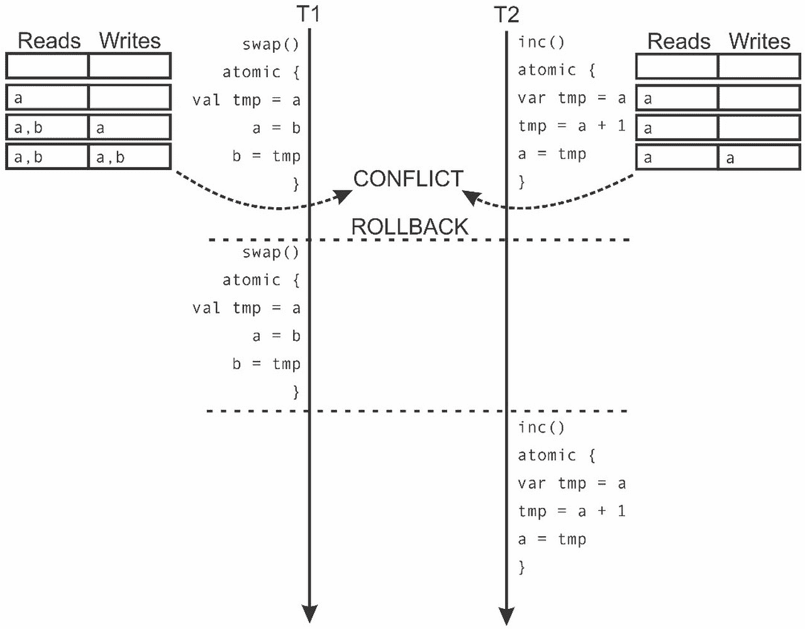

# 第七章. 软件事务内存

|   | *"每一个学习并发并认为自己理解了它的人，最终都会发现一些他们本以为不可能出现的神秘竞态，并发现他们实际上还没有真正理解它。"* |   |
| --- | --- | --- |
|   | --*赫伯·萨特* |

在调查第二章中并发的根本原语时，即《JVM 和 Java 内存模型上的并发》，我们认识到需要保护程序的一部分免受共享访问。我们注意到实现这种隔离性的基本方法之一是`synchronized`语句，它使用内建对象锁来确保最多只有一个线程同时执行程序的一部分。使用锁的缺点是它们很容易导致死锁，这是一种程序无法继续进行的情况。

在本章中，我们将介绍**软件事务内存**（**STM**），这是一种用于控制对共享内存访问的并发控制机制，它大大降低了死锁和竞态的风险。STM 用于指定代码的关键部分。不是使用锁来保护关键部分，STM 跟踪对共享内存的读取和写入，并通过交错读取和写入来序列化关键部分。`synchronized`语句被替换为表达需要独立执行的程序段的原子块。STM 更安全、更易于使用，同时保证了相对较好的可扩展性。

*内存事务*的概念源于数据库事务，它确保一系列数据库查询在隔离状态下发生。内存事务是对共享内存进行的一系列读取和写入操作，逻辑上发生在同一时间点。当内存事务 T 发生时，并发内存事务观察到内存的状态要么是在事务 T 开始之前，要么是在事务 T 完成之后，但不是在 T 执行过程中的中间状态。这个特性被称为**隔离性**。

正如我们将看到的，**可组合性**是使用 STM 的另一个重要优点。考虑一个基于锁的哈希表实现，具有线程安全的`insert`和`remove`操作。虽然单个`insert`和`remove`操作可以安全地由不同的线程调用，但无法实现一个方法，从一个哈希表中删除元素并将其添加到另一个哈希表中，而不暴露元素不在任一哈希表中的中间状态。传统上，STM 被提议作为编程语言的一部分，具有编译时确保某些事务限制的优势。由于这种方法需要对语言进行侵入性更改，许多软件事务内存被实现为库。ScalaSTM 就是这样一个例子。我们将使用 ScalaSTM 作为具体的 STM 实现。具体来说，本章涵盖了以下主题：

+   原子变量的缺点

+   STM 的语义和内部机制

+   事务引用

+   事务与外部副作用之间的交互

+   单个操作事务和嵌套事务的语义

+   条件重试事务和超时事务

+   事务局部变量、事务数组、事务映射

我们已经在第三章，*并发的传统构建块*中学习了，使用原子变量和并发集合可以表达无锁程序。为什么不用原子变量来表示并发共享数据呢？为了更好地强调 STM 的需求，我们将首先展示一个原子变量证明不足的情况。

# 原子变量的麻烦

第三章，*并发的传统构建块*中的原子变量是基本同步机制之一。我们已经知道，在第二章，*JVM 上的并发和 Java 内存模型*中引入的 volatile 变量允许竞争条件，其中程序的正确性取决于不同线程的精确执行顺序。原子变量可以确保在读取和写入操作之间没有线程并发修改变量。同时，原子变量降低了死锁的风险。尽管它们有优点，但在某些情况下使用原子变量并不令人满意。

在 第六章，*使用响应式扩展的并发编程* 中，我们使用 **Rx** 框架实现了一个最小化的网络浏览器。在网上冲浪很棒，但我们希望在浏览器中添加一些额外的功能。例如，我们希望维护浏览器的历史记录——之前访问过的 URL 列表。我们决定将 URL 列表保存在 Scala 的 `List[String]` 集合中。此外，我们决定跟踪所有 URL 的总字符长度。如果我们想将 URL 字符串复制到一个数组中，这些信息允许我们快速分配一个适当大小的数组。

我们浏览器的不同部分异步执行，因此我们需要同步访问这个可变状态。我们可以将 URL 列表及其总字符长度保存在私有可变字段中，并使用 `synchronized` 语句来访问它们。然而，鉴于我们在前面的章节中看到了 `synchronized` 语句的罪魁祸首，我们决定避免锁。相反，我们将使用原子变量。我们将 URL 列表及其总字符长度存储在两个原子变量中，即 `urls` 和 `clen`：

```java
import java.util.concurrent.atomic._ 
val urls = new AtomicReference[List[String]](Nil) 
val clen = new AtomicInteger(0) 

```

每当浏览器打开 URL 时，我们需要更新这些原子变量。为了更容易地做到这一点，我们定义了一个名为 `addUrl` 的辅助方法：

```java
import scala.annotation.tailrec 
def addUrl(url: String): Unit = { 
  @tailrec def append(): Unit = { 
    val oldUrls = urls.get 
    val newUrls = url :: oldUrls 
    if (!urls.compareAndSet(oldUrls, newUrls)) append() 
  } 
  append() 
  clen.addAndGet(url.length + 1) 
} 

```

正如我们在介绍章节中学到的，我们需要在原子变量上使用原子操作来确保它们的值从一个状态一致地改变到另一个状态。在前面的代码片段中，我们使用 `compareAndSet` 操作原子地替换名为 `oldUrls` 的旧 URL 列表为更新版本 `newUrls`。正如在 第三章 中详细讨论的那样，*并发传统的构建块*，当两个线程同时在同一原子变量上调用 `compareAndSet` 操作时，该操作可能会失败。因此，我们定义了一个嵌套的、尾递归的方法 `append`，它调用 `compareAndSet` 方法，并在 `compareAndSet` 方法失败时重新启动。更新 `clen` 字段更容易。我们只需调用在原子整数上定义的原子 `addAndGet` 方法。

网络浏览器的其他部分可以使用 `urls` 和 `clen` 变量来渲染浏览历史记录，将其导出到 `log` 文件或导出浏览器数据，以防我们的用户决定更喜欢 Firefox。为了方便起见，我们定义了一个辅助方法 `getUrlArray`，它返回一个字符数组，其中 URL 由换行符分隔。`clen` 字段是获取数组所需大小的快捷方式。我们调用 `get` 方法来读取 `clen` 字段的值并分配数组。然后我们调用 `get` 来读取当前的 URL 列表，将换行符附加到每个 URL 上，将字符串列表展平成一个单独的列表，将字符与其索引配对，并将它们存储到数组中：

```java
def getUrlArray(): Array[Char] = { 
  val array = new ArrayChar 
  val urlList = urls.get 
  for ((ch, i) <- urlList.map(_ + "\n").flatten.zipWithIndex) { 
    array(i) = ch 
  } 
  array 
} 

```

为了测试这些方法，我们可以通过模拟用户与两个异步计算之间的交互来测试。第一个异步计算通过调用`getUrlArray`方法将浏览历史记录到文件中。第二个异步计算通过三次调用`addURL`方法访问三个不同的 URL，然后向标准输出打印`"done browsing"`字符串：

```java
import scala.concurrent._ 
import ExecutionContext.Implicits.global 
object AtomicHistoryBad extends App { 
  Future { 
    try { log(s"sending: ${getUrlArray().mkString}") } 
    catch { case e: Exception => log(s"Houston... $e!") } 
  } 
  Future { 
    addUrl("http://scala-lang.org") 
    addUrl("https://github.com/scala/scala") 
    addUrl("http://www.scala-lang.org/api") 
    log("done browsing") 
  } 
  Thread.sleep(1000) 
} 

```

运行这个程序几次会揭示一个错误。程序有时会神秘地崩溃，并抛出`ArrayIndexOutOfBoundsException`异常。通过分析`getUrlArray`方法，我们发现错误的根源。这个错误发生在检索到的`clen`字段的值不等于列表长度时。`getUrlArray`方法首先读取`clen`原子变量，然后从`urls`原子变量中读取 URL 列表。在这两次读取之间，第一个线程通过添加一个额外的 URL 字符串修改了`urls`变量。当`getUrlArray`读取`urls`变量时，总字符长度已经超过了分配的数组长度，我们最终得到了一个异常。

这个例子说明了原子变量的重要缺点。尽管特定的原子操作本身是原子的，并且发生在单一的时间点，但调用多个原子操作通常不是原子的。当多个线程同时执行多个原子操作时，操作可能会以不可预见的方式交错，从而导致与使用 volatile 变量相同类型的竞争条件。请注意，交换`clen`和`urls`变量的更新并不能解决问题。尽管在我们的例子中还有其他确保原子性的方法，但它们并不明显。

### 注意

读取多个原子变量不是一个原子操作，并且它可能会观察到程序数据处于不一致的状态。

当程序中的所有线程都观察到操作在相同的时间点发生时，我们可以说该操作是*可线性化的*。操作发生的时间点被称为**线性化点**。`compareAndSet`和`addAndGet`操作是固有的可线性化操作。从所有线程的角度来看，它们原子地执行，通常作为单个处理器指令并在单个时间点执行。前一个示例中的`append`嵌套方法也是可线性化的。其线性化点是一个成功的`compareAndSet`操作，因为这是`append`修改程序状态的唯一地方。另一方面，`addUrl`和`getUrlArray`方法不可线性化。它们不包含单个原子操作来修改或读取程序状态。`addUrl`方法修改程序状态两次。首先，它调用`append`方法，然后调用`addAndGet`方法。同样，`getUrlArray`方法使用两个独立的原子`get`操作读取程序状态。这是使用原子变量时常见的误解点，我们说原子变量不能组合成更大的程序。

我们可以通过移除`clen`原子变量，并在读取`urls`变量一次后计算所需的数组长度来修复我们的示例。同样，我们可以使用单个原子引用来存储包含 URL 列表及其大小的元组。这两种方法都会使`addUrl`和`getUrlArray`方法可线性化。

并发编程专家已经证明，使用原子变量可以表达任何程序状态，并且可以使用可线性化操作任意修改此状态。在实践中，有效地实现这样的可线性化操作可能相当具有挑战性。通常很难正确实现任意的可线性化操作，而高效地实现它们则更加困难。

与原子变量不同，多个`synchronized`语句可以更容易地一起使用。当我们使用`synchronized`语句时，我们可以修改对象的多个字段，甚至可以嵌套多个`synchronized`语句。因此，我们面临一个困境。我们可以使用原子变量并冒着在组合更大程序时发生竞态条件的风险，或者我们可以退回到使用`synchronized`语句，但风险死锁。幸运的是，STM 是一种提供两者最佳方案的技术；它允许您将简单的原子操作组合成更复杂的原子操作，而不会出现死锁的风险。

# 使用软件事务内存

在本节中，我们将研究使用 STM 的基础知识。历史上，为 Scala 和 JVM 平台引入了多个 STM 实现。本章中描述的特定 STM 实现称为 **ScalaSTM**。ScalaSTM 成为我们的首选 STM 的有两个原因。首先，ScalaSTM 是由一组 STM 专家编写的，他们同意使用一套标准化的 API 和功能。强烈鼓励 Scala 的未来 STM 实现实现这些 API。其次，ScalaSTM API 是为多个 STM 实现设计的，并附带一个高效的默认实现。程序启动时可以选择不同的 STM 实现。用户可以使用标准化的 API 编写应用程序，并在以后无缝切换到不同的 STM 实现中。

`atomic` 语句是每个 STM 核心的基本抽象。当程序执行带有 `atomic` 符号的代码块时，它开始一个内存事务，这是一系列对内存的读取和写入操作，对于程序中的其他线程来说这些操作是原子性的。`atomic` 语句类似于 `synchronized` 语句，并确保代码块在隔离的环境中执行，不受其他线程的干扰，从而避免竞争条件。与 `synchronized` 语句不同，`atomic` 语句不会导致死锁。

以下方法，`swap` 和 `inc`，展示了如何在高级别使用 `atomic` 语句。`swap` 方法原子性地交换两个内存位置 `a` 和 `b` 的内容。在某个线程读取内存位置 `a`（或 `b`）的时间与 `atomic` 语句结束的时间之间，没有其他线程能够有效地修改位置 `a`（或 `b`）的值。同样，`inc` 方法原子性地增加内存位置 `a` 的整数值。当一个线程调用 `inc` 方法并读取 `atomic` 语句中的 `a` 的值时，直到 `atomic` 语句结束，没有其他线程可以更改位置 `a` 的值：

```java
def swap() = atomic { // not actual code 
  val tmp = a 
  a = b 
  b = tmp 
} 
def inc() = atomic { a = a + 1 } 

```

STM 实现死锁自由并确保没有两个线程同时修改相同的内存位置的方式相当复杂。在大多数 STM 实现中，`atomic` 语句维护一个读写操作的日志。每次在内存事务中读取内存位置时，相应的内存地址都会添加到日志中。同样，每当在内存事务中写入内存位置时，内存地址和提议的值都会写入到日志中。一旦执行到达 `atomic` 块的末尾，事务日志中的所有写入都会写入到内存中。当这种情况发生时，我们说事务已经提交。另一方面，在事务期间，STM 可能会检测到其他线程执行的一些并发事务正在同时读取或写入相同的内存位置。这种情况被称为**事务冲突**。当发生事务冲突时，一个或两个事务将被取消，并按顺序重新执行，一个接一个。我们说 STM **回滚**了这些事务。这种 STM 被称为**乐观的**。乐观 STM 尝试在假设事务将成功的情况下执行事务，并在检测到冲突时回滚。当我们说一个事务已完成时，我们的意思是它要么已提交，要么已回滚并重新执行。

为了说明内存事务是如何工作的，我们考虑这样一个场景：两个线程 **T1** 和 **T2** 同时调用 `swap` 和 `inc` 方法。由于这些方法中的 `atomic` 语句都修改了内存位置 `a`，执行结果导致运行时事务冲突。在程序执行过程中，STM 检测到事务日志条目重叠：与 `swap` 方法相关的事务在其读写集中都有内存位置 `a` 和 `b`，而 `inc` 方法在其读写集中只有 `a`。这表明存在潜在的冲突。这两个事务都可以回滚，然后按顺序一个接一个地执行，如下面的图所示：



我们不会深入探讨 ScalaSTM 实现的内部细节，因为这超出了本书的范围。相反，我们将关注如何使用 ScalaSTM 轻松编写并发应用程序。在合理的情况下，我们会暗示一些实现细节，以更好地理解 ScalaSTM 语义背后的原因。

在某些 STM 中，`atomic`语句跟踪对内存的所有读取和写入。ScalaSTM 仅跟踪事务中特别标记的内存位置。这有几个原因。首先，如果程序的一部分访问`atomic`语句之外的内存位置，而另一部分访问`atomic`语句内的相同内存位置，STM 无法确保安全性。ScalaSTM 通过显式标记只能在事务中使用的内存位置来避免在事务之外意外使用。其次，JVM 的 STM 框架需要使用编译后或字节码内省来准确捕获所有读取和写入。ScalaSTM 是一个仅库的 STM 实现，因此它不能像编译器那样分析和转换程序。

在 ScalaSTM 中，`atomic`语句的效果仅限于称为**事务引用**的特殊对象。在我们展示如何使用`atomic`语句执行内存事务之前，我们将研究如何创建事务引用。

## 事务引用

在本节中，我们将学习如何声明事务引用。事务引用是一个内存位置，它为单个内存位置提供事务性的读写访问。在 ScalaSTM 中，类型`T`的事务引用被封装在`Red[T]`类型的对象中：

在我们开始在 Scala 中使用 STM 之前，我们需要将一个外部依赖项添加到我们的项目中，因为 ScalaSTM 不是 Scala 标准库的一部分：

```java
libraryDependencies += "org.scala-stm" %% "scala-stm" % "0.7" 

```

要在编译单元中使用 ScalaSTM 的`atomic`语句，我们需要导入`scala.concurrent.stm`包的内容：

```java
import scala.concurrent.stm._ 

```

要实例化一个`Ref`对象，我们使用`Ref`伴生对象的`apply`工厂方法。让我们用事务内存重写我们的浏览器历史示例。我们首先用事务引用替换原子变量。我们将每个事务引用的初始值传递给`apply`方法：

```java
val urls = Ref[List[String]](Nil) 
val clen = Ref(0) 

```

在事务引用上调用`apply`方法返回其值，调用`update`方法修改它。然而，我们不能从事务之外调用这些方法。`apply`和`update`方法接受一个隐式参数，类型为`InTxn`（代表*在事务中*），它指定正在进行事务。没有`InTxn`对象，我们不能调用`apply`和`update`方法。这个约束保护我们免受意外绕过 ScalaSTM 安全机制的风险。

要读取和修改事务引用，我们必须首先启动一个提供隐式`InTxn`对象的交易。我们将在下一节中学习如何做到这一点。

## 使用原子语句

在将`urls`和`clen`变量重新定义为事务引用后，我们重新定义了`addUrl`方法。我们不是分别更新两个原子变量，而是使用`atomic`语句开始一个内存事务。在 ScalaSTM 中，`atomic`语句接受一个类型为`InTxn => T`的块，其中`InTxn`是前面提到的事务对象的类型，`T`是事务的返回值类型。请注意，我们可以使用`implicit`关键字注解`InTxn`参数：

```java
def addUrl(url: String): Unit = atomic { implicit txn => 
  urls() = url :: urls() 
  clen() = clen() + url.length + 1 
} 

```

`addUrl`的新定义非常简单。它首先读取`urls`列表的值，将一个新的 URL 添加到列表中，并将更新后的列表重新赋值给`urls`变量。然后，它读取当前的总字符长度`clen`，将其增加新 URL 的长度，并将新值重新赋值给`clen`。请注意，`addUrl`方法的新定义几乎与单线程实现完全相同。

ScalaSTM 中`atomic`语句的一个重要限制是它不跟踪对普通局部变量和对象字段的读写操作。正如我们稍后将看到的，这些被视为任意副作用，不允许在事务内部进行。

我们以类似的方式重新实现了`getUrlArray`方法。我们首先使用`atomic`语句创建一个事务。使用`clen`变量的值来分配一个适当大小的字符数组。然后，我们读取`urls`列表，并在`for`循环中将它的字符赋值给数组。同样，`getUrlArray`方法的实现看起来与相应的单线程实现非常相似：

```java
def getUrlArray(): Array[Char] = atomic { implicit txn => 
  val array = new ArrayChar) 
  for ((ch, i) <- urls().map(_ + "\n").flatten.zipWithIndex) { 
    array(i) = ch 
  } 
  array 
} 

```

这次，看到`clen`和`urls`变量不一致值的风险已经不存在了。当在事务中使用时，这两个值总是彼此一致的，如下面的程序所示：

```java
object AtomicHistorySTM extends App { 
  Future { 
    addUrl("http://scala-lang.org") 
    addUrl("https://github.com/scala/scala") 
    addUrl("http://www.scala-lang.org/api") 
    log("done browsing") 
  } 
  Thread.sleep(25) 
  Future { 
    try { log(s"sending: ${getUrlArray().mkString}") } 
    catch { case e: Exception => log(s"Ayayay... $e") } 
  } 
  Thread.sleep(5000) 
} 

```

注意，我们在主程序中添加了`sleep`语句，因为这设置了两个异步计算的定时，以便它们大约同时发生。你可以调整`sleep`语句的持续时间，以观察两个异步计算的多种交织方式。通过以下事实来证实自己的观点：将浏览历史记录输出到`log`文件总是观察到三个`addUrl`调用的一些前缀，并且不会抛出异常。

### 提示

当编码复杂的程序状态时，使用多个事务引用。为了原子性地对程序状态进行多个更改，使用`atomic`语句。

在了解了使用事务引用的基本方式使用`atomic`语句后，我们将继续展示更高级的示例，并更详细地研究 STM 语义。

# 编写事务

当正确使用时，事务性内存是构建修改共享数据并发应用程序的强大工具。然而，没有技术是一劳永逸的，STM 也不例外。在本节中，我们将研究如何在更大的程序中组合事务，并了解事务性内存如何与 Scala 的其他特性交互。我们探讨了 STM 的一些注意事项，并超越了事务性引用和`atomic`语句块，展示了如何更有效地使用 STM。

## 事务与副作用之间的交互

之前，我们了解到 STM 可能会回滚并重试一个事务。一个细心的读者可能会注意到，重试一个事务意味着重新执行其副作用。在这里，副作用是对常规`object`字段和变量的任意读取和写入。

有时，副作用并不是问题。事务性引用在事务外部无法修改，并且在事务内部，它们的修改在重试时会中止。尽管如此，其他类型的副作用并不会回滚。考虑以下程序：

```java
object CompositionSideEffects extends App {` 
  val myValue = Ref(0) 
  def inc() = atomic { implicit txn => 
    log(s"Incrementing ${myValue()}") 
    myValue() = myValue() + 1 
  } 
  Future { inc() } 
  Future { inc() } 
  Thread.sleep(5000) 
} 

```

上述程序声明了一个`myValue`事务性引用和一个在`atomic`块内增加`myValue`的`inc`方法。`inc`方法还包含一个打印`myValue`引用当前值的`log`语句。程序异步两次调用`inc`方法。执行此程序后，我们得到以下输出：

```java
ForkJoinPool-1-worker-1: Incrementing 0 
ForkJoinPool-1-worker-3: Incrementing 0 
ForkJoinPool-1-worker-3: Incrementing 1 

```

两个异步计算同时调用`inc`方法，并且都启动了一个事务。其中一个事务将`myValue`引用添加到其读取集中，使用`0`值调用`log`语句，然后继续通过将`myValue`引用添加到其写入集中来增加`myValue`引用。与此同时，另一个事务首先记录了`0`值，然后尝试再次读取`myValue`，并检测到`myValue`处于另一个活动事务的写入集中。第二个事务被回滚，并在第一个事务提交后重试。第二个事务再次读取`myValue`引用，打印`1`，然后增加`myValue`。两个事务都提交了，但由于回滚，副作用性的`log`调用执行了三次。

多次执行简单的`log`语句可能不会造成伤害，但重复任意副作用可能会轻易破坏程序的正确性。在事务中避免副作用是一种推荐的做法。

回想一下，一个操作如果是幂等的，那么多次执行它产生的效果与执行一次相同，正如在第六章中讨论的，*使用反应式扩展进行并发编程*。你可能会得出结论，如果一个有副作用的操作是幂等的，那么在事务中执行它是安全的。毕竟，最坏的情况是幂等操作执行了多次，对吧？不幸的是，这种推理是错误的。在事务回滚并重试后，事务引用的值可能会改变。第二次执行事务时，幂等操作的参数可能不同，或者幂等操作根本不会被调用。避免这种状况的最安全方法是完全避免外部副作用。

### 小贴士

在事务内部避免外部副作用，因为事务可能会被多次执行。

在实践中，我们通常只想在事务提交后执行副作用，也就是说，在我们确定事务引用的更改对其他线程可见之后。为此，我们使用`Txn`单例对象，它可以安排在事务提交或回滚后执行多个操作。

在回滚后，这些操作会被移除，并且在重试事务时可能会重新注册。它的方法只能在活动事务内部调用。在下面的代码中，我们将`inc`方法重写为调用`Txn`对象的`afterCommit`方法，并安排`log`语句在事务提交后执行：

```java
def inc() = atomic { implicit txn => 
  val valueAtStart = myValue() 
  Txn.afterCommit { _ => 
    log(s"Incrementing $valueAtStart") 
  } 
  myValue() = myValue() + 1 
} 

```

注意，我们在事务内部读取`myValue`引用并将其值赋给局部变量`valueAtStart`。稍后，`valueAtStart`局部变量的值会被打印到标准输出。这与在`afterCommit`块内部读取`myValue`引用不同：

```java
def inc() = atomic { implicit txn => 
  Txn.afterCommit { _ => 
    log(s"Incrementing ${myValue()}") // don't do this! 
  } 
  myValue() = myValue() + 1 
} 

```

调用`inc`的最后一个版本会抛出异常。尽管在调用`afterCommit`方法时存在事务上下文`txn`，但`afterCommit`块是在事务结束后才执行，此时`txn`对象已经不再有效。在事务外部读取或修改事务引用是不合法的。在使用它之前，我们需要将事务引用的值存储到事务本身中的局部变量中。

为什么在`afterCommit`块内访问事务引用仅在运行时失败，当事务执行时，而不是在编译时失败？`afterCommit`方法位于事务的**静态作用域**中，换句话说，它是静态地嵌套在一个`atomic`语句中的。因此，编译器解析事务的`txn`对象，并允许你访问事务引用，例如`myValue`。然而，`afterCommit`块不在事务的动态作用域中执行。换句话说，`afterCommit`块是在`atomic`块返回后运行的。

相比之下，在`atomic`块外部访问事务引用不在事务的静态作用域中，因此编译器会检测到这一点并报告错误。

通常，`InTxn`对象不得从事务块中逃逸。例如，在事务内部启动异步操作并使用`InTxn`对象访问事务引用是不合法的。

### 小贴士

只在启动事务的线程中使用事务上下文。

在某些情况下，我们希望在回滚发生时执行一些副作用操作。例如，我们可能希望记录每次回滚以跟踪程序中的竞争。这些信息可以帮助我们重构程序并消除潜在的性能瓶颈。为了实现这一点，我们使用`afterRollback`方法：

```java
  def inc() = atomic { implicit txn => 
    Txn.afterRollback { _ => 
      log(s"rollin' back") 
    } 
    myValue() = myValue() + 1 
  } 

```

重要的是，在回滚之后，事务不再进行中。就像在`afterCommit`块中一样，在`afterRollback`块中访问事务引用是不合法的。

### 小贴士

使用`Txn`对象的`afterCommit`和`afterRollback`方法在事务中执行副作用操作，而不用担心它们会多次执行。

并非所有在事务内部产生副作用的操作都是不好的。只要副作用仅限于在事务内部创建的修改对象，我们就自由地使用它们。实际上，这种副作用有时是必要的。为了演示这一点，让我们定义一个用于事务性链表集合的`Node`类。事务性列表是一个并发、线程安全的链表，它使用内存事务进行修改。类似于 Scala 中的`List`类表示的函数式 cons 列表，事务性`Node`类包含两个我们称之为`elem`和`next`的字段。`elem`字段包含当前节点的值。为了保持简单，`elem`字段是一个值字段，只能包含整数。

`next`字段是一个包含链表中下一个节点的事务引用。我们只能在内存事务内部读取和修改`next`字段：

```java
case class Node(elem: Int, next: Ref[Node]) 

```

我们现在定义一个`nodeToString`方法，它接受一个事务性链表节点`n`，并创建以`n`节点开始的事务性列表的`String`表示形式：

```java
def nodeToString(n: Node): String = atomic { implicit txn => 
  val b = new StringBuilder 
  var curr = n 
  while (curr != null) { 
    b ++= s"${curr.elem}, " 
    curr = curr.next() 
  } 
  b.toString 
} 

```

在前面的代码片段中，我们小心地将副作用限制在事务内部创建的对象上，在这种情况下，是`StringBuilder`对象`b`。如果我们是在事务开始之前实例化`StringBuilder`对象，`nodeToString`方法将无法正确工作：

```java
def nodeToStringWrong(n: Node): String = { 
  val b = new StringBuilder // very bad 
  atomic { implicit txn => 
    var curr = n 
    while (curr != null) { 
      b ++= s"${curr.elem}, " 
      curr = curr.next() 
    } 
  } 
  b.toString 
} 

```

如果在`nodeToStringWrong`示例中事务被回滚，`StringBuilder`对象的内容不会被清除。当事务第二次运行时，它将修改已经存在的、非空的`StringBuilder`对象，并返回一个不对应事务列表状态的字符串表示。

### 提示

在事务内部修改对象时，请确保对象是在事务内部创建的，并且对该对象的引用没有超出事务的作用域。

在了解了如何在事务内部管理副作用之后，我们现在来探讨几种特殊的交易类型，并研究如何将较小的交易组合成较大的交易。

## 单个操作事务

在某些情况下，我们只想读取或修改单个事务引用。为了只读取单个`Ref`对象，输入`atomic`关键字和隐式`txn`参数可能会很麻烦。为了减轻这种不便，ScalaSTM 定义了在事务引用上的单个操作事务。单个操作事务通过在`Ref`对象上调用单个方法来执行。此方法返回一个`Ref.View`对象，它具有与`Ref`对象相同的接口，但其方法可以从事务外部调用。对`Ref.View`对象上的每个操作都类似于单个操作事务。

回想一下上一节中提到的用于事务链表的`Node`类，它在`elem`字段中存储整数，并在事务引用中称为`next`的下一个节点的引用。让我们给`Node`增加两个链表方法。`append`方法接受一个名为`n`的单个`Node`参数，并在当前节点之后插入`n`。`nextNode`方法返回下一个节点的引用，或者如果当前节点是列表的末尾，则返回`null`：

```java
case class Node(val elem: Int, val next: Ref[Node]) { 
  def append(n: Node): Unit = atomic { implicit txn => 
    val oldNext = next() 
    next() = n 
    n.next() = oldNext 
  } 
  def nextNode: Node = next.single() 
} 

```

`nextNode`方法执行单个操作的事务。它对`next`事务引用调用`single`，然后调用`apply`方法以获取下一个节点的值。这相当于以下定义：

```java
def nextNode: Node = atomic { implicit txn => 
  next() 
} 

```

我们可以使用我们的事务`Node`类来声明一个名为`nodes`的链表，最初包含值`1`、`4`和`5`，然后并发地修改它。我们启动两个`f`和`g`两个未来，分别调用`append`添加值为`2`和`3`的节点。在`futures`完成之后，我们调用`nextNode`并打印下一个节点的值。以下代码片段将打印值为`2`或`3`的节点，具体取决于哪个`future`最后完成：

```java
val nodes = Node(1, Ref(Node(4, Ref(Node(5, Ref(null)))))) 
val f = Future { nodes.append(Node(2, Ref(null))) } 
val g = Future { nodes.append(Node(3, Ref(null))) } 
for (_ <- f; _ <- g) log(s"Next node is: ${nodes.nextNode}") 

```

我们还可以使用`single`方法来调用其他事务引用操作。在下面的代码片段中，我们使用`transform`操作在`Node`类上定义了一个`appendIfEnd`方法，该方法仅在当前节点后面跟随`null`时才将节点`n`附加到当前节点：

```java
def appendIfEnd(n: Node) = next.single.transform { 
  oldNext => if (oldNext == null) n else oldNext 
} 

```

对包含类型`T`值的`Ref`对象上的`transform`操作需要一个类型为`T => T`的转换函数。它原子地执行对事务引用的读取，将转换函数应用于当前值，并将新值写回。其他单操作事务包括`update`、`compareAndSet`和`swap`操作。我们建议读者查阅在线文档以了解它们的精确语义。

### 小贴士

使用单操作事务来执行单次读取、写入和类似 CAS 的操作，以避免与`atomic`块相关的语法模板。

单操作事务是方便的方法，输入更简单，并且可能更高效，这取决于底层 STM 实现。它们可能很有用，但随着程序的扩展，我们更感兴趣的是从简单的事务构建更大的事务。我们将在下一节中探讨如何实现这一点。

## 事务嵌套

回想一下第二章，*JVM 和 Java 内存模型中的并发*，其中`synchronized`语句可以嵌套在其他`synchronized`语句中。当从多个软件模块组成程序时，这个特性是必不可少的。例如，银行系统中的货币转账模块必须调用日志模块的操作以持久化事务。这两个模块可能内部使用任意集合的锁，而无需其他模块知道。不幸的是，任意嵌套`synchronized`语句的一个不利之处是它们允许死锁的可能性。

单独的`atomic`语句也可以任意嵌套。这种动机与`synchronized`语句相同。软件模块内部的事务必须能够调用其他软件模块内的操作，而这些模块本身可能已经开始事务。不需要了解操作内部的事务使得不同软件组件之间的分离更好。

让我们用一个具体的例子来说明这一点。回想一下上一节中的`Node`类，它用于事务性链表。`Node`类相对较低级。我们只能调用`append`方法在指定节点之后插入新节点，并且可以在特定节点上调用`nodeToString`将其元素转换为`String`对象。

在本节中，我们定义了事务性排序列表类，由`TSortedList`类表示。这个类按升序存储整数。它维护一个单独的事务性引用`head`，该引用指向`Node`对象链表的头部。我们在`TSortedList`类上定义了`toString`方法，以将其内容转换为文本表示。`toString`方法需要读取事务性引用`head`，因此它首先创建一个新的事务。在将`head`事务性引用的值读取到局部值`headNode`后，`toString`方法可以重用我们之前定义的`nodeToString`方法：

```java
class TSortedList { 
  val head = RefNode 
  override def toString: String = atomic { implicit txn => 
    val h = head() 
    nodeToString(h) 
  } 
} 

```

回想一下，`nodeToString`方法启动另一个事务以读取每个节点中的下一个引用。当`toString`方法调用`nodeToString`时，第二个事务成为`toString`启动的事务的*嵌套*。`nodeToString`方法中的`atomic`块并没有启动一个新的、独立的交易。相反，嵌套事务成为现有事务的一部分。这有两个重要的后果。首先，如果嵌套事务失败，它不会回滚到`nodeToString`方法中的`atomic`块开始处。相反，它回滚到`toString`方法中的`atomic`块开始处。我们说事务的开始是由动态作用域决定的，而不是静态作用域。同样，嵌套事务在达到`nodeToString`方法中`atomic`块的末尾时不会提交。嵌套事务引起的更改在初始事务提交时变得可见。我们说事务的作用域始终是顶级事务的作用域。

### 注意

嵌套的`atomic`块导致的事务在顶级`atomic`块开始时启动，并且只能在顶级`atomic`块完成后提交。同样，回滚会重试从顶级`atomic`块开始的事务。

我们现在研究使用嵌套事务的另一个例子。原子地将事务性排序列表转换为它们的字符串表示是有用的，但我们还需要在列表中插入元素。我们定义了一个`insert`方法，它接受一个整数并将其插入到事务性列表的正确位置。

由于`insert`可以修改事务性引用`head`和列表中的节点，它首先创建一个事务。然后它检查两个特殊情况。列表可以是空的，在这种情况下我们将`head`设置为包含`x`的新节点。同样，整数`x`可能小于列表中的第一个值；在这种情况下，`head`引用被设置为包含`x`的新节点，并且其`next`字段被设置为`head`引用的前一个值。如果这两个条件都不适用，我们调用一个尾递归的嵌套方法`insert`来处理列表的其余部分：

```java
import scala.annotation.tailrec 
def insert(x: Int): this.type = atomic { implicit txn => 
  @tailrec def insert(n: Node): Unit = { 
    if (n.next() == null || n.next().elem > x) 
      n.append(new Node(x, Ref(null))) 
    else insert(n.next()) 
  } 
  if (head() == null || head().elem > x) 
    head() = new Node(x, Ref(head())) 
  else insert(head()) 
  this 
} 

```

嵌套的`insert`方法按顺序遍历链表以找到整数`x`的正确位置。它获取当前节点`n`并检查该节点是否被`null`跟随，表示列表的末尾，或者下一个元素是否大于`x`。在这两种情况下，我们都会在节点上调用`append`方法。如果跟随`n`的节点不是`null`，并且其`elem`字段小于或等于`x`，我们将在下一个节点上递归调用`insert`。

注意，尾递归的嵌套方法`insert`使用封装的`atomic`块的`txn`事务上下文。我们也可以在事务作用域之外定义一个单独的尾递归方法`insert`。在这种情况下，我们需要将事务上下文`txn`编码为一个单独的隐式参数：

```java
@tailrec 
final def insert(n: Node, x: Int)(implicit txn: InTxn): Unit = { 
  if (n.next() == null || n.next().elem > x) 
    n.append(new Node(x, Ref(null))) 
  else insert(n.next(), x) 
} 

```

或者，我们可以省略隐式的`txn`事务上下文参数，但这样我们就必须在尾递归的`insert`方法内部启动一个嵌套事务。这可能比之前的方法稍微低效一些，但从语义上是等价的：

```java
@tailrec 
final def insert(n: Node, x: Int): Unit = atomic { implicit txn => 
  if (n.next() == null || n.next().elem > x) 
    n.append(new Node(x, Ref(null))) 
  else insert(n.next(), x) 
} 

```

我们使用以下代码片段测试我们的事务排序列表。我们实例化一个空的交易排序列表，并从异步计算`f`和`g`中并发插入几个整数。在相应的未来完成执行后，我们打印排序列表的内容：

```java
val sortedList = new TSortedList 
val f = Future { sortedList.insert(1); sortedList.insert(4) } 
val g = Future { sortedList.insert(2); sortedList.insert(3) } 
for (_ <- f; _ <- g) log(s"sorted list - $sortedList") 

```

运行前面的代码片段始终以相同的排序顺序输出元素`1`、`2`、`3`和`4`，无论未来的执行调度如何。我们创建了一个线程安全的事务排序列表类，其实现几乎与相应的顺序排序列表实现相同。这个例子展示了 STM 的真正潜力。它允许你创建并发数据结构和线程安全的数据模型，而无需过多担心并发问题。

交易还有一个方面我们尚未考虑。如果交易因异常而失败会怎样？例如，尾递归的`insert`方法可能会接收到一个`null`值而不是有效的`Node`引用。这会导致抛出`NullPointerException`，但它会如何影响交易？我们将在下一节探讨交易的异常语义。

## 交易和异常

根据我们到目前为止对事务的了解，如果事务抛出异常，不清楚会发生什么。异常可能会回滚事务，或者它可能会提交其更改。ScalaSTM 默认执行回滚，但此行为可以被覆盖。

假设我们的事务排序列表的客户端希望将其用作并发优先队列。*优先队列*是一个包含有序元素的集合，例如整数。可以使用`insert`方法将任意元素插入到优先队列中。在任意时刻，我们可以使用`head`方法检索优先队列中当前最小的元素。优先队列还允许您使用`pop`方法移除最小的元素。

事务排序列表已经排序，并支持使用`insert`方法插入元素，然而，一旦添加，元素就不能被移除。为了使我们的事务排序列表可以作为优先队列使用，我们定义了一个`pop`方法，该方法从事务列表`xs`中移除前`n`个元素。我们在`pop`方法内部启动一个事务，并声明一个局部变量`left`，将其初始化为移除的元素数量`n`。然后我们使用一个`while`循环从`head`中移除节点并减少`left`变量，直到它变为 0：

```java
def pop(xs: TSortedList, n: Int): Unit = atomic { implicit txn => 
  var left = n 
  while (left > 0) { 
    xs.head() = xs.head().next() 
    left -= 1 
  } 
} 

```

为了测试`pop`方法，我们声明了一个新的事务列表`lst`，并插入整数`4`、`9`、`1`和`16`。列表已排序，因此整数按顺序`1`、`4`、`9`和`16`出现在列表中：

```java
val lst = new TSortedList 
lst.insert(4).insert(9).insert(1).insert(16) 

```

接下来，我们通过调用`pop`来启动一个异步计算，该计算从列表中移除前两个整数。异步计算成功完成后，我们将事务列表的内容打印到标准输出：

```java
Future { pop(lst, 2) } foreach { 
  case _ => log(s"removed 2 elements; list = $lst") 
} 

```

到目前为止，一切顺利。`log`语句输出了包含元素`9`和`16`的列表。我们继续启动另一个异步计算，该计算从事务列表中移除前三个元素：

```java
Future { pop(lst, 3) } onComplete { 
  case Failure(t) => log(s"whoa $t; list = $lst") 
} 

```

然而，当我们再次调用`pop`方法时，它抛出了`NullPointerException`；事务列表中只剩下两个元素。因此，在事务期间，`head`引用最终被分配为`null`。当`pop`方法尝试在`null`上调用`next`时，会抛出异常。

在`onComplete`回调中，我们输出异常的名称和事务列表的内容。结果发现，事务列表仍然包含元素`9`和`16`，尽管在事务中已将事务列表的`head`引用设置为`null`。当抛出异常时，事务的效果会被撤销。

### 注意

当事务内部抛出异常时，事务会被回滚，并且异常会在顶级`atomic`块开始的地方重新抛出。

重要的是，嵌套事务也会回滚。在下面的代码片段中，`pop`方法中的嵌套`atomic`块成功完成，但其更改并未提交。相反，当在封装的顶级`atomic`块中调用`sys.error`并抛出`RuntimeException`时，整个事务被回滚：

```java
Future { 
  atomic { implicit txn => 
    pop(lst, 1) 
    sys.error("") 
  } 
} onComplete { 
  case Failure(t) => log(s"oops again $t - $lst") 
} 

```

与 ScalaSTM 不同，一些其他 STM 实现不会在抛出异常时回滚事务；相反，它们提交事务。STM 专家尚未就异常语义达成共识。ScalaSTM 使用一种混合方法。大多数异常都会回滚事务，但 Scala 的 **控制异常** 除外。控制异常是在 Scala 程序中用于控制流的异常。它们扩展了来自 `scala.util.control` 包的 `ControlThrowable` 特质，并且有时会被 Scala 编译器和运行时以不同的方式处理。当在事务内部抛出控制异常时，ScalaSTM 不会回滚事务。相反，事务将被提交。

控制异常用于在 Scala 中支持 `break` 语句，这不是一种原生语言结构。`break` 语句抛出一个控制异常，然后被包围的 `breakable` 块捕获。在下一个示例中，我们为 `break` 语句定义了一个 `breakable` 块，并启动了一个调用 `pop` 的 `for` 循环，循环的值为 `1`、`2` 和 `3`。在第一次迭代后，我们中断循环。示例显示第一次 `pop` 语句中的更改已被提交。事务列表现在只包含元素 `16`：

```java
import scala.util.control.Breaks._ 
Future { 
  breakable { 
    atomic { implicit txn => 
      for (n <- List(1, 2, 3)) { 
        pop(lst, n) 
        break 
      } 
    } 
  } 
  log(s"after removing - $lst") 
} 

```

此外，可以通过在原子块上调用 `withControlFlowRecognizer` 方法来覆盖特定事务如何处理异常。此方法接受一个从 `Throwable` 到 `Boolean` 的部分函数，并使用它来决定是否将特定异常视为控制异常。如果部分函数未定义特定异常，则决定将推迟到默认控制流识别器。

在以下示例中，`atomic` 块覆盖了默认的控制流识别器。对于这个特定的交易，`ControlThrowable` 特质的子类被视为常规异常。`pop` 调用作为此交易的一部分移除了事务列表的最后一个元素，但当调用 `break` 时，事务将被回滚。异步计算结束时的 `log` 语句显示列表仍然包含数字 `16`：

```java
import scala.util.control._ 
Future { 
  breakable { 
    atomic.withControlFlowRecognizer { 
      case c: ControlThrowable => false 
    } { implicit txn => 
      for (n <- List(1, 2, 3)) { 
        pop(lst, n) 
        break 
      } 
    } 
  } 
  log(s"after removing - $lst") 
} 

```

注意，事务内部抛出的异常也可以使用 `catch` 语句来拦截。在这种情况下，嵌套事务的效果将被中止，并且执行将从捕获异常的点继续。在以下示例中，我们捕获了第二次 `pop` 调用抛出的异常：

```java
val lst = new TSortedList 
lst.insert(4).insert(9).insert(1).insert(16) 
atomic { implicit txn => 
  pop(lst, 2) 
  log(s"lst = $lst") 
  try { pop(lst, 3) } 
  catch { case e: Exception => log(s"Houston... $e!") } 
  pop(lst, 1) 
} 
log(s"result - $lst") 

```

第二次 `pop` 方法调用不应从列表中移除任何元素，因此我们预计在最后看到元素 `16`。运行此代码片段的结果如下：

```java
run-main-26: lst = 9, 16,
run-main-26: lst = 9, 16,
run-main-26: Houston... java.lang.NullPointerException!
run-main-26: result - 16,

```

有趣的是，输出显示第一条`log`语句被调用了两次。原因是，当第一次抛出异常时，嵌套和顶级事务都被回滚。这是 ScalaSTM 实现中的优化，因为在第一次执行尝试期间，将嵌套和顶级事务扁平化更有效率。请注意，在事务块第二次执行后，嵌套事务的异常被正确处理。

这些示例有助于理解事务内异常的语义。尽管如此，当客户端在空排序列表上调用`pop`方法时，他们想要的不仅仅是异常。在某些情况下，例如第三章中的生产者-消费者模式，*并发的传统构建块*，当排序列表变为非空时，线程必须等待并重复事务。这被称为重试，也是下一节的主题。

# 重试事务

在顺序计算中，单个线程负责执行程序。如果某个特定值不可用，单个线程负责生成它。在并发编程中，情况则不同。当某个值不可用时，其他线程，称为**生产者**，可能会最终生成该值。消费该值的线程，称为**消费者**，可以选择阻塞执行直到该值可用，或者在进行下一次检查之前临时执行其他工作。我们已经看到了实现这种关系的各种机制，从第二章中的监控器和`synchronized`语句，*JVM 和 Java 内存模型中的并发*，第三章中的并发队列，*并发的传统构建块*；第四章中的 Future 和 Promise，*使用 Future 和 Promise 的异步编程*；到第六章中的事件流，*使用响应式扩展的并发编程*。

在语法上，`atomic`语句最符合`synchronized`语句。回想一下，`synchronized`语句支持受保护的块模式，其中线程获取一个监控器，检查某个条件，然后在该监控器上调用`wait`。当其他线程满足这个条件时，它会在同一个监控器上调用`notify`方法，表示第一个线程应该醒来并继续其工作。尽管有时可能脆弱，但这种机制允许我们绕过忙等待。

到目前为止，我们从 STM 中学到的知识表明，监视器和`notify`方法在`atomic`语句中没有直接的对应物。没有它们，当事务需要等待特定条件继续时，忙等待是唯一的选择。为了说明这一点，让我们考虑上一节中的事务排序列表。我们希望增强事务排序列表，添加一个`headWait`方法，该方法接受一个列表并返回列表中的第一个整数，如果列表非空。否则，执行应阻塞，直到列表变为非空：

```java
def headWait(lst: TSortedList): Int = atomic { implicit txn => 
  while (lst.head() == null) {} // never do this 
  lst.head().elem 
} 

```

`headWait`方法启动一个事务，并忙等待直到事务列表`lst`的`head`引用与`null`不同。为了测试这个方法，我们创建了一个空的交易排序列表，并启动一个异步计算，该计算调用`headWait`方法。一秒后，我们开始另一个异步计算，将数字`1`添加到列表中。在这秒的延迟期间，第一个异步计算反复忙等待：

```java
object RetryHeadWaitBad extends App { 
  val myList = new TSortedList 
  Future { 
    val headElem = headWait(myList) 
    log(s"The first element is $headElem") 
  } 
  Thread.sleep(1000) 
  Future { myList.insert(1) } 
  Thread.sleep(1000) 
} 

```

第一次运行这个示例时，它在一秒后成功完成，并报告列表的第一个元素是`1`。然而，这个示例很可能会失败。ScalaSTM 最终会检测到`headWait`方法中的事务与`insert`方法中的事务之间存在冲突，并将这两个事务序列化。在这种情况下，如果 STM 选择首先执行`headWait`方法，数字`1`将永远不会插入到`myList`值中。实际上，这个程序最终会陷入死锁。这个示例说明，在事务中进行忙等待与在`synchronized`语句中进行忙等待一样糟糕。

### 提示

尽可能避免长时间运行的事务。绝不要在事务中执行无限循环，因为这可能导致死锁。

STM 不仅仅是支持执行隔离的内存事务。为了完全取代监视器和`synchronized`语句，STM 必须为需要等待特定条件满足的事务提供额外的实用工具。ScalaSTM 定义了`retry`语句来达到这个目的。当事务内部的执行达到`retry`语句时，事务会回滚到包含它的顶级`atomic`块，并抛出一个特殊异常，调用线程将被阻塞。回滚后，事务的读取集被保存。

读取集中的事务引用的值是事务决定调用`retry`方法的原因。如果读取集中的某个事务引用在另一个事务中更改其值，则阻塞的事务可以重试。

我们现在重新实现`headWait`方法，使其在事务列表的`head`值为`null`（表示列表为空）时调用`retry`方法：

```java
def headWait(lst: TSortedList): Int = atomic { implicit txn => 
  if (lst.head() != null) lst.head().elem 
  else retry 
} 

```

我们重新运行整个程序。调用`headWait`方法是一个潜在的阻塞操作，因此我们需要在异步计算中使用`blocking`调用。`headWait`中的事务读取事务性引用`head`，并在调用`retry`方法后将它放入读集中。当引用`head`稍后发生变化时，事务会自动重试：

```java
object RetryHeadWait extends App { 
  val myList = new TSortedList 
  Future { 
    blocking { 
      log(s"The first element is ${headWait(myList)}") 
    } 
  } 
  Thread.sleep(1000) 
  Future { myList.insert(1) } 
  Thread.sleep(1000) 
} 

```

这次，程序按预期运行。第一次异步计算被暂停，直到第二次异步计算将`1`添加到列表中。这唤醒了第一次异步计算并重复了事务。

### 小贴士

使用`retry`语句阻塞事务，直到满足特定条件，一旦其读集发生变化，则自动重试事务。

在某些情况下，当特定条件未满足且事务无法进行时，我们希望重试不同的交易。假设程序中有许多生产者线程和一个单独的消费者线程。为了减少生产者之间的竞争，我们决定引入两个名为`queue1`和`queue2`的交易性排序列表。为了避免同时访问这两个列表而造成的竞争，消费者线程必须分别检查这两个交易性排序列表的内容。`orAtomic`构造允许你这样做。

以下代码片段说明了如何在这种情况下使用`orAtomic`。我们实例化了两个空的交易性排序列表：`queue1`和`queue2`。然后我们启动一个异步计算，代表消费者，并开始一个调用`queue1`列表上的`headWait`方法的事务。我们在第一次事务之后调用`orAtomic`方法。这指定了如果第一次事务调用`retry`时的替代事务。在`orAtomic`块中，我们在`queue2`列表上调用`headWait`方法。当第一个`atomic`块调用`retry`方法时，控制权传递给`orAtomic`块，并开始不同的交易。

由于交易性列表`queue1`和`queue2`最初都是空的，第二次事务也调用`retry`方法，事务链被阻塞，直到其中一个交易性列表发生变化：

```java
val queue1 = new TSortedList 
val queue2 = new TSortedList 
val consumer = Future { 
  blocking { 
    atomic { implicit txn => 
      log(s"probing queue1") 
      log(s"got: ${headWait(queue1)}") 
    } orAtomic { implicit txn => 
      log(s"probing queue2") 
      log(s"got: ${headWait(queue2)}") 
    } 
  } 
} 

```

我们现在模拟几个在 50 毫秒后调用`insert`方法的生成者：

```java
Thread.sleep(50) 
Future { queue2.insert(2) } 
Thread.sleep(50) 
Future { queue1.insert(1) } 
Thread.sleep(2000) 

```

消费者首先打印`"probing queue1"`字符串，在`headWait`方法内部调用`retry`方法，然后继续下一个事务。它以相同的方式打印`"probing queue2"`字符串，然后阻塞其执行。在第一个生成者计算将`2`插入第二个交易性列表后，消费者再次重试事务链。它尝试执行第一个事务，并再次打印`"probing queue1"`字符串，然后发现`queue1`列表为空。然后它打印`"probing queue2"`字符串并成功从`queue2`列表输出元素`2`。

## 带超时的重试

我们已经看到，在某些情况下，挂起事务直到特定条件得到满足是有用的。在某些情况下，我们希望防止事务永远被阻塞。对象监视器的`wait`方法提供了一个带有超时参数的重载。当超时到期而没有其他线程的`notify`调用时，会抛出`InterruptedException`。ScalaSTM 的`withRetryTimeout`方法是一个类似的机制，用于处理超时。

在下面的代码片段中，我们创建了一个包含空字符串的`message`事务性引用。然后我们启动一个超时设置为`1000`毫秒的`atomic`块。如果在那个时间内`message`事务性引用没有改变其值，事务将通过抛出`InterruptedException`来失败：

```java
val message = Ref("") 
Future { 
  blocking { 
    atomic.withRetryTimeout(1000) { implicit txn => 
      if (message() != "") log(s"got a message - ${message()}") 
      else retry 
    } 
  } 
} 
Thread.sleep(1025) 
message.single() = "Howdy!" 

```

我们故意将超时设置为`1025`毫秒以创建一个竞争条件。这个程序要么打印出`"Howdy!"`消息，要么因异常而失败。

当超时是异常行为时，我们使用`withRetryTimeout`方法。例如，关闭应用程序就是这种行为之一。我们希望避免出现阻塞事务，从而阻止程序终止。另一个例子是等待网络响应。如果在一段时间后没有响应，我们希望使事务失败。

在某些情况下，超时是正常程序行为的一部分。在这种情况下，我们等待一段时间，以使与事务相关的条件发生变化。如果它们确实发生了变化，我们将回滚并重试事务，就像之前一样。如果在指定的时间内没有任何变化，事务应该继续。在 ScalaSTM 中，执行此操作的方法称为`retryFor`。在下面的代码片段中，我们使用`retryFor`方法重写了之前的示例：

```java
Future { 
  blocking { 
    atomic { implicit txn => 
      if (message() == "") { 
        retryFor(1000) 
        log(s"no message.") 
      } else log(s"got a message - '${message()}'") 
    } 
  } 
} 
Thread.sleep(1025) 
message.single() = "Howdy!" 

```

这次，异步计算内部的事务没有抛出异常。相反，如果发生超时，事务将打印出`"no message."`字符串。

### 小贴士

当超时表示程序行为异常时，使用`withRetryTimeout`方法在事务中设置超时持续时间。当事务在超时后正常进行时，使用`retryFor`方法。

不同的`retry`变体是 ScalaSTM 对标准 STM 模型的强大补充。它们与`wait`和`notify`调用一样表达性强，并且使用起来更安全。与`atomic`语句一起，它们释放了同步的全部潜力。

# 事务性集合

在本节中，我们暂时离开事务引用，研究更强大的事务构造，称为事务集合。虽然事务引用一次只能保持一个值，但事务集合可以操作多个值。原则上，`atomic`语句和事务引用足以表达任何类型的共享数据事务。然而，ScalaSTM 的事务集合与 STM 深度集成。它们可以更方便地表达共享数据操作并更有效地执行事务。

## 事务局部变量

我们已经看到，某些事务需要在事务执行期间仅存在的本地可变状态中创建。有时，我们需要为多个事务反复重新声明相同的状态。在这种情况下，我们希望只声明一次相同的状态，并在多个事务中重用它。在 ScalaSTM 中支持此功能的构造称为**事务局部变量**。

要声明一个事务局部变量，我们实例化一个`TxnLocal[T]`类型的对象，给它一个类型为`T`的初始值。在下面的代码中，我们实例化了一个`myLog`事务局部变量。我们将在事务排序列表操作中使用`myLog`来记录不同事务的流程：

```java
val myLog = TxnLocal("") 

```

每个事务单独看到`myLog`事务局部变量的值。当事务开始时，`myLog`的值等于声明`myLog`时指定的空字符串。当事务更新`myLog`变量的值时，这种更改仅对该特定事务可见。其他事务的行为就像它们有自己的`myLog`变量单独副本一样。

我们现在声明一个`clearList`方法，该方法原子性地从指定的事务排序列表中移除所有元素。此方法使用`myLog`变量来记录被移除的元素：

```java
def clearList(lst: TSortedList): Unit = atomic { implicit txn => 
  while (lst.head() != null) { 
    myLog() = myLog() + "\nremoved " + lst.head().elem 
    lst.head() = lst.head().next() 
  } 
} 

```

通常，我们对`myLog`变量的内容不感兴趣。然而，我们可能偶尔想检查`myLog`变量以进行调试。因此，我们声明了`clearWithLog`方法，该方法清除列表并返回`myLog`的内容。然后，我们从两个不同的异步计算中调用`clearWithLog`方法，对非空事务列表进行操作。在两个异步计算完成执行后，我们输出它们的日志：

```java
val myList = new TSortedList().insert(14).insert(22) 
def clearWithLog(): String = atomic { implicit txn => 
  clearList(myList)  
  myLog() 
} 
val f = Future { clearWithLog() } 
val g = Future { clearWithLog() } 
for (h1 <- f; h2 <- g) log(s"Log for f: $h1\nLog for g: $h2") 

```

由于`clearList`操作是原子的，只有一个事务可以移除所有元素。`myLog`对象的内容反映了这一点。根据异步计算之间的时机，元素`14`和`22`都出现在`f`未来的日志中或`g`未来的日志中。这表明两个事务中的每一个都看到了`myLog`变量的单独副本。

### 小贴士

事务局部变量在语法上比创建事务引用并在不同方法之间传递它们更轻量级。

在记录或收集程序执行统计信息时使用事务局部变量。`TxnLocal`构造函数还允许您指定`afterCommit`和`afterRollback`回调，分别在事务提交或回滚时调用事务局部变量。我们建议读者查阅在线文档以了解如何使用它们。为了构建更复杂的同时数据模型，我们使用事务数组和映射，我们将在下一节中学习。

## 事务数组

事务引用是一种方便的方式来封装事务状态，但它们也带来了一定的开销。首先，`Ref`对象比简单的对象引用更重，消耗更多的内存。其次，每次访问新的`Ref`对象都需要在事务的读取集中添加一个条目。当我们处理许多`Ref`对象时，这些开销可能会变得相当大。让我们用一个例子来说明这一点。

假设我们是一家 Scala 咨询公司的市场营销部门，我们被要求编写一个程序，用关于 Scala 2.10 发布的营销信息更新公司网站的内容。自然，我们决定为此任务使用 ScalaSTM。网站由五个独立的页面组成，每个页面都由一个字符串表示。我们在一个名为`pages`的序列中声明网站的内容。然后，我们将页面的内容分配给一个事务引用数组。如果某个页面稍后发生变化，我们可以在事务中更新其事务引用：

```java
val pages: Seq[String] = Seq.fill(5)("Scala 2.10 is out, " * 7) 
val website: Array[Ref[String]] = pages.map(Ref(_)).toArray 

```

这个解决方案并不令人满意。我们创建了大量的事务引用对象，`website`的定义也不容易理解。幸运的是，ScalaSTM 有一个名为**事务数组**的替代方案。事务数组，用`TArray`类表示，与普通的 Scala 数组类似，但只能在事务内部访问。其修改只有在事务提交时才对其他线程可见。从语义上讲，`TArray`类对应于事务引用数组，但它更节省内存且更简洁：

```java
val pages: Seq[String] = Seq.fill(5)("Scala 2.10 is out, " * 7) 
val website: TArray[String] = TArray(pages) 

```

Scala 的开发速度令人惊叹。在 Scala 2.10 宣布不久后，Scala 2.11 版本就发布了。市场营销团队要求我们更新网站的内容。所有出现的`"2.10"`字符串都应该替换为`"2.11"`字符串。我们编写了一个`replace`方法来完成这个任务：

```java
def replace(p: String, s: String): Unit = atomic { implicit txn => 
  for (i <- 0 until website.length) 
    website(i) = website(i).replace(p, s) 
} 

```

使用 `TArray` 类比在数组中存储事务引用要方便得多。这不仅使我们免于在数组中的事务引用上调用 `apply` 操作时产生的括号汤，而且占用的内存也更少。这是因为为 `TArray[T]` 对象创建了一个单一的连续数组对象，而 `Array[Ref[T]]` 对象则需要许多 `Ref` 对象，每个对象都有内存开销。

### 小贴士

使用 `TArray` 类代替事务引用数组，以优化内存使用并使程序更加简洁。

让我们在一个简短的程序中测试 `TArray` 类和 `replace` 方法。我们首先定义一个额外的方法，`asString`，它连接所有网站页面的内容。然后我们将所有 `2.10` 字符串替换为 `2.11` 字符串。为了测试 `replace` 是否正确工作，我们并发地替换所有 `out` 单词为 `"released"`：

```java
def asString = atomic { implicit txn => 
  var s: String = "" 
  for (i <- 0 until website.length) 
    s += s"Page $i\n======\n${website(i)}\n\n" 
  s 
} 
val f = Future { replace("2.10", "2.11") } 
val g = Future { replace("out", "released") } 
for (_ <- f; _ <- g) log(s"Document\n$asString") 

```

`asString` 方法捕获了事务数组中的所有条目。实际上，`asString` 方法原子性地生成了一个 `TArray` 对象状态的快照。或者，我们也可以将 `website` 的内容复制到另一个 `TArray` 对象中，而不是字符串。在两种情况下，计算 `TArray` 对象的快照都需要遍历其所有条目，并且可能与只修改 `TArray` 类子集的事务发生冲突。

回想一下本章开头的事务冲突示例。像 `asString` 方法那样，具有许多读取和写入操作的事务可能效率低下，因为当发生冲突时，所有其他事务都需要与 `asString` 方法进行序列化。当数组很大时，这会创建一个可扩展性瓶颈。在下一节中，我们将检查另一种能够以更可扩展的方式生成原子快照的集合，即事务性映射。

## 事务性映射

与事务性数组类似，事务性映射避免了在映射内部存储事务引用对象的需要。因此，它们减少了内存消耗，提高了事务性能，并提供了更直观的语法。在 ScalaSTM 中，事务性映射用 `TMap` 类表示。

ScalaSTM 的 `TMap` 类有一个额外的优势。它提供了一个可扩展的、常数时间的原子 `snapshot` 操作。`snapshot` 操作返回一个包含快照时刻 `TMap` 对象内容的不可变 `Map` 对象。让我们声明一个事务性映射，`alphabet`，它将字符字符串映射到其在字母表中的位置：

```java
val alphabet = TMap("a" -> 1, "B" -> 2, "C" -> 3) 

```

我们对字母 `A` 是小写的事实不满意。我们开始一个事务，原子地将小写字母 `a` 替换为大写字母 `A`。同时，我们开始另一个异步计算，该计算在 `alphabet` 映射上调用 `snapshot` 操作。我们调整第二次异步计算的时机，使其与第一个事务产生竞态条件：

```java
Future { 
  atomic { implicit txn => 
    alphabet("A") = 1 
    alphabet.remove("a") 
  } 
} 
Thread.sleep(23) 
Future { 
  val snap = alphabet.single.snapshot 
  log(s"atomic snapshot: $snap") 
} 
Thread.sleep(2000) 

```

在本例中，`snapshot` 操作不能与 `atomic` 块中的两个更新交织。我们可以多次运行程序来确信这一点。第二次异步计算会打印出包含小写字母 `a` 的映射，或者包含大写字母 `A` 的映射，但它永远不会输出同时包含小写和大写字母 `A` 的映射。

### 小贴士

使用 `TMap`（而不是事务性引用的映射）来优化内存使用，使程序更加简洁，并高效地检索原子快照。

# 摘要

在本章中，我们学习了 STM 的工作原理以及如何在并发程序中应用它。我们看到了使用 STM 的事务性引用和 `atomic` 块相对于 `synchronized` 语句的优势，并调查了它们与副作用之间的交互。我们研究了事务内异常处理的语义，并学习了如何重试和有条件地重新执行事务。最后，我们了解了事务性集合，它允许我们更有效地编码共享程序数据。

这些特性共同实现了一种并发编程模型，在该模型中，程序员可以专注于表达程序的意义，而无需担心处理锁对象，或避免死锁和竞态条件。这对于模块化来说尤为重要。在存在独立软件组件的情况下，很难或几乎不可能对死锁或竞态条件进行推理。STM 的存在是为了解放程序员从这些担忧中，当从更简单的模块中组合大型并发程序时，这是必不可少的。

然而，这些优势也伴随着代价，因为使用 STM 进行数据访问比使用锁和 `synchronized` 语句要慢。对于许多应用程序来说，使用 STM 的性能损失是可以接受的。当它不可接受时，我们需要回退到更简单的原语，例如锁、原子变量和并发数据结构。

要了解更多关于 STM 的信息，我们建议阅读书籍《多处理器编程的艺术》，*Maurice Herlihy 和 Nir Shavit*，*Morgan Kauffman*中相关的章节。野外有许多不同的 STM 实现，你需要研究各种研究文章来深入理解 STM。STM 研究文献的详尽列表可在[`research.cs.wisc.edu/trans-memory/biblio/index.html`](http://research.cs.wisc.edu/trans-memory/biblio/index.html)找到。要了解更多关于 ScalaSTM 的具体信息，可以考虑阅读题为《高性能并发集合上的可组合操作》的博士论文，*Nathan G. Bronson*。

在下一章中，我们将研究 actor 编程模型，它采用不同的方法来实现内存一致性。正如我们将看到的，在 actor 模型中，独立的计算永远不会访问彼此的内存区域，主要通过交换消息进行通信。

# 练习

在以下练习中，你将使用 ScalaSTM 实现各种事务编程抽象。在大多数情况下，它们的实现将非常类似于顺序实现，同时使用事务。在某些情况下，你可能需要查阅外部文献或 ScalaSTM 文档来正确解决练习。

1.  实现事务对抽象，用`TPair`类表示：

    ```java
            class TPairP, Q { 
              def first(implicit txn: InTxn): P = ??? 
              def first_=(x: P)(implicit txn: InTxn): P = ??? 
              def second(implicit txn: InTxn): Q = ??? 
              def second_=(x: Q)(implicit txn: InTxn): Q = ??? 
              def swap()(implicit e: P =:= Q, txn: InTxn): Unit = ??? 
            } 

    ```

    除了两个字段的 getter 和 setter 之外，事务对定义了交换字段的`swap`方法，并且只能在类型`P`和`Q`相同的情况下调用。

1.  使用 ScalaSTM 实现从 Haskell 来的可变位置抽象，用`MVar`类表示：

    ```java
            class MVar[T] { 
              def put(x: T)(implicit txn: InTxn): Unit = ??? 
              def take()(implicit txn: InTxn): T = ??? 
            } 

    ```

    `MVar`对象可以是满的或空的。在满的`MVar`对象上调用`put`会阻塞，直到`MVar`对象变为空，并添加一个元素。同样，在空的`MVar`对象上调用`take`会阻塞，直到`MVar`对象变为满，并移除元素。现在，实现一个名为`swap`的方法，该方法接受两个`MVar`对象并交换它们的值：

    ```java
            def swapT(implicit txn: InTxn) 

    ```

    将`MVar`类与第二章中的`SyncVar`类进行对比，*JVM 和 Java 内存模型上的并发*。在不修改 SyncVar 类内部实现的情况下，为`SyncVar`对象实现`swap`方法是否可能？

1.  实现用于跟踪事务在成功完成前回滚次数的`atomicRollbackCount`方法：

    ```java
            def atomicRollbackCountT: (T, Int) 

    ```

1.  实现用于启动最多可以重试`n`次的事务的`atomicWithRetryMax`方法：

    ```java
           def atomicWithRetryMaxT(block: InTxn => T): T 

    ```

    达到最大重试次数时抛出异常。

    ### 小贴士

    使用`Txn`对象。

1.  实现一个事务性的**先进先出**（**FIFO**）队列，用`TQueue`类表示：

    ```java
            class TQueue[T] { 
              def enqueue(x: T)(implicit txn: InTxn): Unit = ??? 
              def dequeue()(implicit txn: InTxn): T = ??? 

    ```

    `TQueue` 类与 `scala.collection.mutable.Queue` 类具有类似的语义，但在空队列上调用 `dequeue` 会阻塞，直到有值可用。

1.  使用 ScalaSTM 实现一个线程安全的 `TArrayBuffer` 类，它扩展了 `scala.collection.mutable.Buffer` 接口。

1.  本章中描述的 `TSortedList` 类始终是有序的，但访问最后一个元素需要遍历整个列表，可能会很慢。可以使用 AVL 树来解决这个问题。网上有大量关于 AVL 树的描述。使用 ScalaSTM 实现线程安全的交易性有序集合作为 AVL 树：

    ```java
            class TSortedSet[T] { 
              def add(x: T)(implicit txn: InTxn): Unit = ??? 
              def remove(x: T)(implicit txn: InTxn): Boolean = ??? 
              def apply(x: T)(implicit txn: InTxn): Boolean = ??? 
            } 

    ```

    `TSortedSet` 类与 `scala.collection.mutable.Set` 类具有类似的语义。

1.  使用 ScalaSTM 实现一个追踪用户账户金额的银行系统。不同的线程可以调用 `send` 方法将资金从一个账户转移到另一个账户，调用 `deposit` 和 `withdraw` 方法分别向特定账户存入或取出资金，以及调用 `totalStock` 方法返回银行当前存入的总金额。最后，实现 `totalStockIn` 方法，该方法返回当前在指定银行组中存入的总金额。

1.  实现一个通用的交易性优先队列类，用类型 `TPriorityQueue` 表示，用于排序元素。然后实现一个名为 `scheduleTask` 的方法，该方法将任务添加到优先队列中。每个任务都有一个优先级。一组工作者必须等待队列非空，然后重复移除具有最高优先级的任务并执行它们。

1.  实现一个通用的交易性有向图数据结构，其节点由 `Node` 类表示。然后实现一个 `scheduleTask` 方法，该方法将任务添加到图中。每个任务都有一个依赖列表 - 在它开始之前必须执行的其他任务；这个列表代表了图中的有向边。一组工作者重复查询图，并安排任务执行。一个任务只能在它的依赖任务执行完毕后才能执行。
