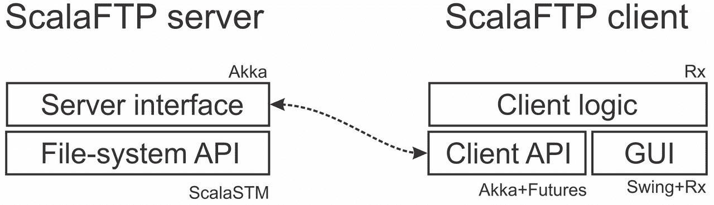
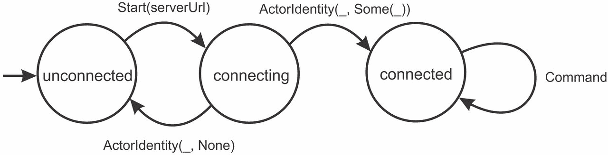
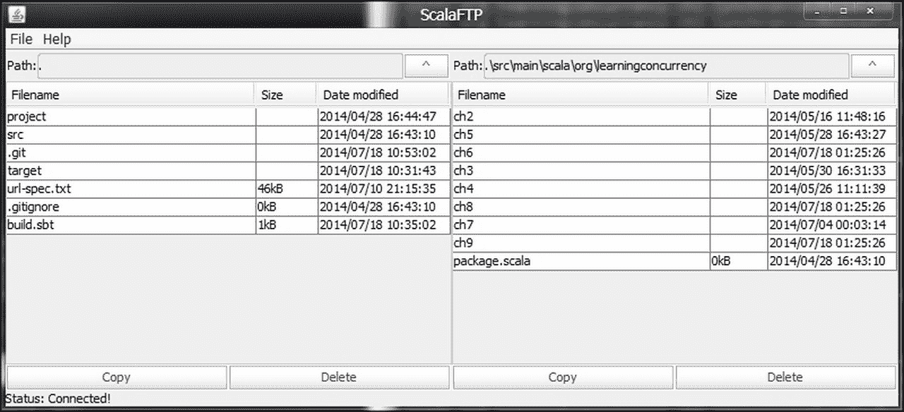
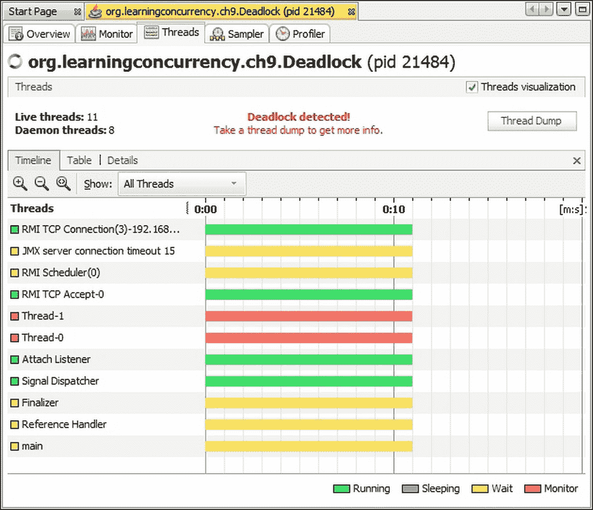
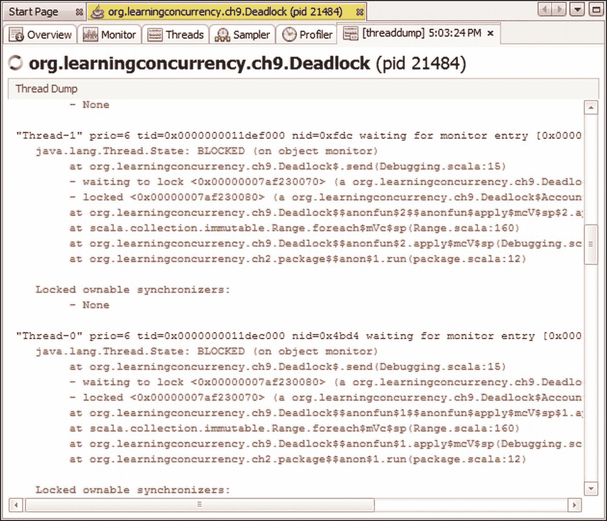

# 第九章. 实践中的并发

|   | *"最好的理论是受实践启发的。" |   |
| --- | --- | --- |
|   | --*唐纳德·克努特* |

本书我们研究了大量的不同并发设施。到目前为止，你已经了解了数十种启动并发计算和访问共享数据的不同方法。了解如何使用不同的并发风格是有用的，但可能还不明显何时使用哪种。

本章的目的是介绍并发编程的总体情况。我们将研究各种并发抽象的使用案例，了解如何调试并发程序，以及如何将不同的并发库集成到更大的应用程序中。在本章中，我们将执行以下任务：

+   总结前面章节中介绍的不同并发框架的特点和典型用途

+   调查如何处理并发应用程序中出现的各种类型的错误

+   学习如何识别和解决性能瓶颈

+   将之前关于并发的知识应用于实现一个更大的并发应用程序，即远程文件浏览器

我们首先概述了本书中我们学习的重要并发框架，以及何时使用它们的总结。

# 选择适合工作的正确工具

在本节中，我们概述了我们所了解的不同并发库。我们退后一步，看看这些库之间的差异以及它们的共同点。这个总结将使我们深入了解不同的并发抽象对什么是有用的。

并发框架通常需要解决以下几个问题：

+   它必须提供一种声明在并发执行之间共享的数据的方式

+   它必须提供读取和修改程序数据的构造

+   它必须能够表达条件执行，当满足一定条件集时触发

+   它必须定义一种启动并发执行的方式

本书的一些框架解决了所有这些问题；其他框架只解决了一部分，并将部分责任转移给了另一个框架。

通常，在并发编程模型中，我们以不同的方式表达并发共享数据，与仅从单个线程访问的数据。这使得 JVM 运行时能够更有效地优化程序的顺序部分。到目前为止，我们已经看到了许多表达并发共享数据的不同方法，从低级设施到高级抽象。以下表格总结了不同的数据抽象：

| **数据抽象** | **数据类型或注解** | **描述** |
| --- | --- | --- |
| Volatile 变量（JDK） | @volatile | 确保类字段和局部变量（在闭包中捕获）的可见性和 happens-before 关系。 |
| 原子变量（JDK） | AtomicReference[T]AtomicIntegerAtomicLong | 提供基本的复合原子操作，例如 **`compareAndSet`** 和 **`incrementAndGet`** . |
| 期货和承诺（ **`scala.concurrent`** ） | Future[T]Promise[T] | 有时称为单赋值变量，这些表达可能尚未计算但最终将变得可用的值。 |
| 可观察的和主题（Rx） | Observable[T]Subject[T] | 也称为一等事件流，这些描述了许多不同值，它们按时间顺序一个接一个地到达。 |
| 事务性引用（ScalaSTM） | Ref[T] | 这些描述了只能从内存事务内部访问的内存位置。它们的修改只有在事务成功提交后才会变得可见。 |

下一个重要的问题是提供对共享数据的访问，这包括读取和修改共享内存位置。通常，并发程序使用特殊的结构来表示此类访问。我们将在下表中总结不同的数据访问结构：

| **数据抽象** | **数据访问结构** | **描述** |
| --- | --- | --- |
| 任意数据（JDK） | synchronized | 使用内建对象锁来排除对任意共享数据的访问。 |
| 原子变量和类（JDK） | compareAndSet | 原子地交换单个内存位置的价值。它允许实现无锁程序。 |
| 期货和承诺（ **`scala.concurrent`** ） | valuetryComplete | 用于将值分配给承诺，或检查相应期货的值。**`value`** 方法不是与期货交互的首选方式。 |
| 事务性引用和类（Scala STM） | atomicorAtomicsingle | 原子地修改一组内存位置的价值。减少了死锁的风险，但禁止在事务块内部有副作用。 |

并发数据访问并不是并发框架的唯一关注点。正如我们在前面的章节中学到的，并发计算有时只有在满足某些条件后才能进行。在下表中，我们总结了不同的结构，这些结构可以启用此功能：

| **并发框架** | **条件执行结构** | **描述** |
| --- | --- | --- |
| JVM 并发 | waitnotifynotifyAll | 用于挂起线程的执行，直到其他线程通知条件已满足。 |
| 期货和承诺 | onCompleteAwait.ready | 条件性地安排异步计算。**`Await.ready`** 方法使线程挂起，直到期货完成。 |
| 反应式扩展 | subscribe | 当事件到达时异步或同步执行计算。 |
| 软件事务内存 | retryretryForwithRetryTimeout | 当一些相关内存位置发生变化时，重试当前内存事务。 |
| 演员 | receive | 当消息到达时执行演员的 **`receive`** 块。 |

最后，并发模型必须定义一种启动并发执行的方法。以下表格总结了不同的并发构造：

| **并发框架** | **并发构造** | **描述** |
| --- | --- | --- |
| JVM 并发 | Thread.start | 启动一个新的执行线程。 |
| 执行上下文 | execute | 在线程池上为执行调度一段代码。 |
| 期货和承诺 | Future.apply | 为执行调度一段代码，并返回执行结果的未来值。 |
| 并行集合 | par | 允许调用集合方法的数据并行版本。 |
| 反应式扩展 | Observable.createObserveOn | **`create`** 方法定义了一个事件源。**`observeOn`** 方法在不同的线程上调度事件的处理。 |
| 演员 | actorOf | 为执行调度一个新的演员对象。 |

这种分解显示，不同的并发库专注于不同的任务。例如，并行集合没有条件等待构造，因为数据并行操作是在独立元素上进行的。同样，软件事务内存没有用于表达并发计算的构造，它只关注保护对共享数据的访问。演员没有用于建模共享数据和保护其访问的特殊构造，因为数据封装在单独的演员中，并且只能由拥有它的演员按顺序访问。

根据它们如何建模共享数据和表达并发，我们对并发库进行了分类，现在我们总结一下不同的并发库适合做什么：

+   经典的 JVM 并发模型使用线程、`synchronized`语句、volatile 变量和原子原语进行低级任务。用途包括实现自定义并发实用程序、并发数据结构或针对特定任务优化的并发框架。

+   期货和承诺最适合引用产生单个结果值的并发计算。期货模型程序中的延迟，并允许在程序执行过程中将可用的值组合起来。用途包括执行远程网络请求并等待回复，引用异步长时间运行计算的结果，或对 I/O 操作的完成做出反应。期货通常是并发应用程序的粘合剂，将并发程序的不同部分绑定在一起。我们经常使用期货将单事件回调 API 转换为基于`Future`类型的标准化表示。

+   并行集合最适合在大型数据集上高效执行数据并行操作。用途包括文件搜索、文本处理、线性代数应用、数值计算和模拟。长时间运行的 Scala 集合操作通常是并行化的良好候选。

+   反应式扩展用于表达基于异步事件驱动的程序。与并行集合不同，在反应式扩展中，数据元素在操作开始时不可用，而是在应用程序运行时到达。应用包括将基于回调的 API 转换为反应式 API，在用户界面中建模事件，建模应用程序外部的事件，使用集合样式组合子操作程序事件，从输入设备或远程位置流式传输数据，或在程序中增量传播数据模型的变化。

+   使用 STM（软件事务内存）来保护程序数据免受并发访问的损坏。STM 允许构建复杂的数据模型，并以降低死锁和竞态条件风险的方式访问它们。典型用途是在保护并发可访问数据的同时，保持线程之间数据访问不重叠时的良好可伸缩性。

+   演员（Actors）适合封装可并发访问的数据，并无缝构建分布式系统。演员框架提供了一种自然的方式来表达通过显式发送消息进行通信的并发任务。应用包括将并发访问数据序列化以防止损坏，在系统中表达有状态的并发单元，以及构建如交易系统、P2P 网络、通信中心或数据挖掘框架等分布式应用程序。

某些编程语言、库或框架的倡导者可能会试图说服你，他们的技术适用于任何任务和任何情况，通常带有销售的目的。理查德·斯托尔曼曾经说过：“计算机科学是唯一比女性时尚更受时尚驱动的行业。”作为工程师，我们需要比屈服于编程时尚和营销宣传更有见识。不同的框架针对特定的用例定制，选择技术的正确方式是在特定情况下仔细权衡其优缺点。

### 小贴士

没有一种技术可以适用于所有情况。在决定为特定的编程任务使用哪个并发框架时，请使用自己的最佳判断。

有时，选择最适合的并发工具比说起来容易做起来难。选择正确的技术需要大量的经验。在许多情况下，我们甚至对系统的需求了解不足，无法做出明智的决定。无论如何，一个很好的经验法则是将几个并发框架应用于同一应用程序的不同部分，每个框架最适合特定任务。通常，不同并发框架的真实力量在它们一起使用时才会显现。这是我们将在下一节中讨论的主题。

# 将所有内容整合在一起 - 远程文件浏览器

在本节中，我们利用我们对不同并发框架的了解来构建一个远程文件浏览器。这个更大的应用程序示例说明了不同的并发库如何协同工作，以及如何将它们应用于不同的场景。我们将我们的远程文件浏览器命名为 ScalaFTP。

ScalaFTP 浏览器分为两个主要组件：服务器和客户端进程。服务器进程将在我们想要操作的文件系统所在的机器上运行。客户端将在我们的计算机上运行，包括一个用于导航远程文件系统的图形用户界面。为了简化问题，客户端和服务器之间将使用的通信协议实际上不是 FTP，而是一个自定义通信协议。通过选择正确的并发库来实现 ScalaFTP 的不同部分，我们将确保完整的 ScalaFTP 实现仅占用 500 行代码。

具体来说，ScalaFTP 浏览器将实现以下功能：

+   显示远程文件系统中文件和目录的名称，并允许通过目录结构进行导航

+   在远程文件系统中在不同目录之间复制文件

+   在远程文件系统中删除文件

为了实现这一功能的各个部分，我们将 ScalaFTP 服务器和客户端程序划分为多个层次。服务器程序的任务是响应传入的复制和删除请求，以及响应关于特定目录内容的查询。为了确保其对文件系统的视图保持一致，服务器将缓存文件系统的目录结构。我们将服务器程序划分为两个层次：文件系统 API 和服务器接口。文件系统 API 将暴露服务器程序的数据模型，并定义用于操作文件系统的有用实用方法。服务器接口将接收请求并向客户端发送响应。

由于服务器接口将需要与远程客户端通信，我们决定使用 Akka actor 框架。Akka 内置远程通信功能，正如我们在第八章 Actors 中学习的那样。文件系统的内容，即其状态，会随时间变化。因此，我们对选择合适的数据访问结构很感兴趣。

在文件系统 API 中，我们可以使用对象监视器和锁定来同步对共享状态的访问，但我们将避免使用这些方法，因为它们可能导致死锁。我们同样避免使用原子变量，因为它们容易发生竞态条件。我们可以在 actor 中封装文件系统状态，但请注意，这可能导致可扩展性瓶颈：actor 将序列化对文件系统状态的所有访问。因此，我们决定使用 ScalaSTM 框架来建模文件系统内容。STM 可以避免死锁和竞态条件的风险，并确保良好的横向可扩展性，正如我们在第七章，“软件事务内存”中所学到的。

客户端程序的任务是图形化展示远程文件系统的内容，并与服务器进行通信。我们将客户端程序划分为三个功能层。GUI 层将渲染远程文件系统的内容并注册用户请求，如按钮点击。我们将使用 Swing 和 Rx 框架来实现 GUI，类似于我们在第六章，“使用响应式扩展的并发编程”中实现网页浏览器的方式。客户端 API 将在客户端复制服务器接口并与服务器通信。我们将使用 Akka 与服务器通信，但暴露远程操作的结果作为 futures。最后，客户端逻辑将是一个粘合层，它将 GUI 和客户端 API 绑定在一起。

ScalaFTP 浏览器的架构在以下图中得到展示，图中我们指出了各个层将使用哪些并发库。虚线代表客户端和服务器之间的通信路径：



我们现在开始实现 ScalaFTP 服务器，采用自底向上的设计方法。在下一节中，我们将描述文件系统 API 的内部结构。

## 文件系统的建模

在第三章，“并发的传统构建块”中，我们使用了原子变量和并发集合来实现一个无阻塞、线程安全的文件系统 API，这允许复制文件和检索文件系统的快照。在本节中，我们将使用 STM 重复这项任务。我们将看到使用 STM 更加直观且错误率更低。

我们首先定义文件可能处于的不同状态。与第三章，“并发的传统构建块”一样，文件可以是当前创建中、空闲状态、正在复制或正在删除。我们使用一个密封的`State`特质及其四个情况来建模这一点：

```java
sealed trait State 
case object Created extends State 
case object Idle extends State 
case class Copying(n: Int) extends State 
case object Deleted extends State 

```

只有在文件处于空闲状态时才能删除它，只有当它处于空闲状态或已复制状态时才能复制它。由于文件可以同时复制到多个目的地，`Copying` 状态编码了当前正在进行多少次复制。我们向 `State` 特质添加了 `inc` 和 `dec` 方法，分别返回一个状态增加或减少一个复制的新的状态。例如，`Copying` 状态的 `inc` 和 `dec` 的实现如下：

```java
def inc: State = Copying(n + 1) 
def dec: State = if (n > 1) Copying(n - 1) else Idle 

```

与 `java.io` 包中的 `File` 类类似，我们使用相同的实体来表示文件和目录，并更一般地称它们为文件。每个文件由 `FileInfo` 类表示，该类编码了路径、其名称、其父目录以及文件最后修改的日期、一个表示文件是否为目录的布尔值、文件的大小以及其 `State` 对象。`FileInfo` 类是不可变的，更新文件的状态将需要创建一个新的 `FileInfo` 对象：

```java
case class FileInfo(path: String, name: String, 
  parent: String, modified: String, isDir: Boolean, 
  size: Long, state: State) 

```

我们分别定义了 `apply` 和 `creating` 工厂方法，它们分别接受一个 `File` 对象并返回一个处于 `Idle` 或 `Created` 状态的 `FileInfo` 对象。

服务器启动的位置不同，ScalaFTP 目录结构的根在实际的文件系统中是不同的子目录。`FileSystem` 对象跟踪给定 `rootpath` 目录中的文件，使用一个名为 `files` 的事务性映射：

```java
class FileSystem(val rootpath: String) { 
  val files = TMap[String, FileInfo]() 
} 

```

我们引入了一个单独的 `init` 方法来初始化 `FileSystem` 对象。`init` 方法启动一个事务，清除 `files` 映射的内容，并使用 Apache Commons IO 库遍历 `rootpath` 下的文件和目录。对于每个文件和目录，`init` 方法创建一个 `FileInfo` 对象并将其添加到 `files` 映射中，使用其路径作为键：

```java
def init() = atomic { implicit txn => 
  files.clear() 
  val rootDir = new File(rootpath) 
  val all = TrueFileFilter.INSTANCE 
  val fileIterator = 
    FileUtils.iterateFilesAndDirs(rootDir, all, all).asScala 
  for (file <- fileIterator) { 
    val info = FileInfo(file) 
    files(info.path) = info 
  } 
} 

```

回想一下，ScalaFTP 浏览器必须显示远程文件系统的内容。为了启用目录查询，我们首先将 `getFileList` 方法添加到 `FileSystem` 类中，该方法检索指定 `dir` 目录中的文件。`getFileList` 方法启动一个事务并过滤出直接父级等于 `dir` 的文件：

```java
def getFileList(dir: String): Map[String, FileInfo] = 
  atomic { implicit txn => 
    files.filter(_._2.parent == dir) 
  } 

```

我们在文件系统 API 中使用`copyFile`方法实现复制逻辑。此方法接受`src`源文件的路径和`dest`目标文件的路径，并启动一个事务。在检查`dest`目标文件是否存在之后，`copyFile`方法检查源文件条目的状态，除非状态是`Idle`或`Copying`，否则会失败。然后它调用`inc`来创建一个新的状态，复制计数增加，并使用新状态更新`files`映射中的源文件条目。同样，`copyFile`方法在`files`映射中为目标文件创建一个新的条目。最后，`copyFile`方法在事务完成后调用`afterCommit`处理程序，将文件物理复制到磁盘。回想一下，在事务体中执行副作用操作是不合法的，因此仅在事务提交后调用私有的`copyOnDisk`方法：

```java
def copyFile(src: String, dest: String) = atomic { implicit txn => 
  val srcfile = new File(src) 
  val destfile = new File(dest) 
  val info = files(src) 
  if (files.contains(dest)) sys.error(s"Destination exists.") 
  info.state match { 
    case Idle | Copying(_) => 
      files(src) = info.copy(state = info.state.inc) 
      files(dest) = FileInfo.creating(destfile, info.size) 
      Txn.afterCommit { _ => copyOnDisk(srcfile, destfile) } 
      src 
  } 
} 

```

`copyOnDisk`方法在 Apache Commons IO 库的`FileUtils`类上调用`copyFile`方法。在文件传输完成后，`copyOnDisk`方法启动另一个事务，在此事务中，它减少源文件的复制计数并将目标文件的状态设置为`Idle`：

```java
private def copyOnDisk(srcfile: File, destfile: File) = { 
  FileUtils.copyFile(srcfile, destfile) 
  atomic { implicit txn => 
    val ninfo = files(srcfile.getPath) 
    files(srcfile.getPath) = ninfo.copy(state = ninfo.state.dec) 
    files(destfile.getPath) = FileInfo(destfile) 
  } 
} 

```

`deleteFile`方法以类似的方式删除文件。它将文件状态更改为`Deleted`，删除文件，并启动另一个事务以删除文件条目：

```java
def deleteFile(srcpath: String): String = atomic { implicit txn => 
  val info = files(srcpath) 
  info.state match { 
    case Idle => 
      files(srcpath) = info.copy(state = Deleted) 
      Txn.afterCommit { _ => 
        FileUtils.forceDelete(info.toFile) 
        files.single.remove(srcpath) 
      } 
      srcpath 
  } 
} 

```

使用 STM（软件事务内存）对服务器数据模型进行建模，允许无缝地将不同的并发计算添加到服务器程序中。在下一节中，我们将实现一个使用服务器 API 执行文件系统操作的服务器 actor。

### 小贴士

使用 STM 来建模可并发访问的数据，因为 STM 与大多数并发框架透明地工作。

完成文件系统 API 后，我们现在继续处理 ScalaFTP 浏览器的服务器接口层。

## 服务器接口

服务器接口由一个名为`FTPServerActor`的单个 actor 组成。这个 actor 将接收客户端请求并依次响应它们。如果服务器 actor 是系统的顺序瓶颈，我们可以简单地添加额外的服务器接口 actor 来提高水平可伸缩性。

我们首先定义服务器 actor 可以接收的不同类型的消息。我们遵循在`FTPServerActor`类的伴生对象中定义它们的惯例：

```java
object FTPServerActor { 
  sealed trait Command 
  case class GetFileList(dir: String) extends Command 
  case class CopyFile(src: String, dest: String) extends Command 
  case class DeleteFile(path: String) extends Command 
  def apply(fs: FileSystem) = Props(classOf[FTPServerActor], fs) 
} 

```

服务器 actor 的 actor 模板接受一个`FileSystem`对象作为参数。它通过调用文件系统 API 中的适当方法来响应`GetFileList`、`CopyFile`和`DeleteFile`消息：

```java
class FTPServerActor(fileSystem: FileSystem) extends Actor { 
  val log = Logging(context.system, this) 
  def receive = { 
    case GetFileList(dir) => 
      val filesMap = fileSystem.getFileList(dir) 
      val files = filesMap.map(_._2).to[Seq] 
      sender ! files 
    case CopyFile(srcpath, destpath) => 
      Future { 
        Try(fileSystem.copyFile(srcpath, destpath)) 
      } pipeTo sender 
    case DeleteFile(path) => 
      Future { 
        Try(fileSystem.deleteFile(path)) 
      } pipeTo sender 
  } 
} 

```

当服务器接收到`GetFileList`消息时，它使用指定的`dir`目录调用`getFileList`方法，并将包含`FileInfo`对象的序列集合发送回客户端。由于`FileInfo`是一个 case 类，它扩展了`Serializable`接口，因此其实例可以通过网络发送。

当服务器接收到 `CopyFile` 或 `DeleteFile` 消息时，它会异步调用相应的文件系统方法。当文件系统 API 中的方法出错时，会抛出异常，因此我们需要在调用它们时使用 `Try` 对象进行包装。异步文件操作完成后，结果 `Try` 对象会通过 Akka 的 `pipeTo` 方法作为消息管道回传给发送者演员。

要启动 ScalaFTP 服务器，我们需要实例化和初始化一个 `FileSystem` 对象，并启动服务器演员。我们解析网络端口命令行参数，并使用它创建一个能够进行远程通信的演员系统。为此，我们使用我们在第八章[“Actors”]中介绍的 `remotingSystem` 工厂方法。然后，远程演员系统创建一个 `FTPServerActor` 实例。这在上面的程序中显示：

```java
object FTPServer extends App { 
  val fileSystem = new FileSystem(".") 
  fileSystem.init() 
  val port = args(0).toInt 
  val actorSystem = ch8.remotingSystem("FTPServerSystem", port) 
  actorSystem.actorOf(FTPServerActor(fileSystem), "server") 
} 

```

ScalaFTP 服务器演员可以在与客户端应用程序相同的进程中运行，在同一台机器的另一个进程中运行，或者在网络连接的不同机器上运行。演员模型的优势在于，我们通常不需要担心演员在哪里运行，直到我们将它集成到整个应用程序中。

### 提示

当你需要实现运行在不同机器上的分布式应用程序时，使用演员框架。

我们的服务器程序现在已完成，我们可以使用 SBT 的 `run` 命令来运行它。我们将演员系统设置为使用端口 `12345`：

```java
run 12345 

```

在下一节中，我们将实现 ScalaFTP 客户端的文件导航 API，该 API 将通过网络与服务器接口通信。

## 客户端导航 API

客户端 API 通过返回未来对象的异步方法将服务器接口暴露给客户端程序。与在本地运行的服务器文件系统 API 不同，客户端 API 方法执行远程网络请求。未来对象是客户端 API 方法中建模延迟和避免网络请求阻塞的自然方式。

在内部，客户端 API 维护一个与服务器演员通信的演员实例。当客户端演员被创建时，它并不知道服务器演员的演员引用。因此，客户端演员以 **未连接** 的状态开始。当它接收到包含服务器演员系统 URL 的 `Start` 消息时，客户端构建一个指向服务器演员的演员路径，发送一个 `Identify` 消息，并切换到 **连接中** 的状态。如果演员系统能够找到服务器演员，客户端演员最终会收到包含服务器演员引用的 `ActorIdentity` 消息。在这种情况下，客户端演员切换到 **已连接** 的状态，并能够将命令转发给服务器。否则，连接失败，客户端演员将恢复到未连接状态。客户端演员的状态图如下所示：



我们在客户端 actor 的伴生对象中定义了`Start`消息：

```java
object FTPClientActor { 
  case class Start(host: String) 
} 

```

我们随后定义了`FTPClientActor`类，并给它一个隐式的`Timeout`参数。这个`Timeout`参数将在 Akka 的 ask 模式中稍后使用，当将客户端请求转发到服务器 actor 时。`FTPClientActor`类的 stub 如下：

```java
class FTPClientActor(implicit val timeout: Timeout) 
extends Actor 

```

在定义`receive`方法之前，我们定义了对应不同 actor 状态的行为。一旦未连接状态的客户端 actor 收到带有主机字符串的`Start`消息，它构建了一个指向服务器的 actor 路径并创建了一个 actor 选择对象。然后客户端 actor 向 actor 选择发送`Identify`消息，并将行为切换到`connecting`。这在上面的`unconnected`行为方法中展示：

```java
def unconnected: Actor.Receive = { 
  case Start(host) => 
    val serverActorPath = 
      s"akka.tcp://FTPServerSystem@$host/user/server" 
    val serverActorSel = context.actorSelection(serverActorPath) 
    serverActorSel ! Identify(()) 
    context.become(connecting(sender)) 
} 

```

`connecting`方法根据`Start`消息的发送者的 actor 引用创建一个行为。我们称这个 actor 引用为`clientApp`，因为 ScalaFTP 客户端应用程序会将`Start`消息发送到客户端 actor。一旦客户端 actor 收到带有`ref`引用的服务器 actor 的`ActorIdentity`消息，它可以向`clientApp`引用发送`true`，表示连接成功。在这种情况下，客户端 actor 切换到`connected`行为。否则，如果客户端 actor 收到没有服务器引用的`ActorIdentity`消息，客户端 actor 向应用程序发送`false`并恢复到`unconnected`状态：

```java
def connecting(clientApp: ActorRef): Actor.Receive = { 
  case ActorIdentity(_, Some(ref)) => 
    clientApp ! true 
    context.become(connected(ref)) 
  case ActorIdentity(_, None) => 
    clientApp ! false 
    context.become(unconnected) 
} 

```

`connected`状态使用`serverActor`服务器 actor 引用来转发`Command`消息。为此，客户端 actor 使用 Akka 的 ask 模式，它返回一个带有服务器响应的 future 对象。future 的内容被管道回`Command`消息的原始发送者。这样，客户端 actor 充当了应用程序（发送者）和服务器 actor 之间的中介。下面的代码片段展示了`connected`方法：

```java
def connected(serverActor: ActorRef): Actor.Receive = { 
  case command: Command => 
    (serverActor ? command).pipeTo(sender) 
} 

```

最后，`receive`方法返回`unconnected`行为，其中创建了客户端 actor：

```java
def receive = unconnected 

```

在实现了客户端 actor 之后，我们可以继续到客户端 API 层。我们将其建模为一个带有`connected`值的特质，具体的方法有`getFileList`、`copyFile`和`deleteFile`，以及一个抽象的`host`方法。客户端 API 创建了一个私有的远程 actor 系统和一个客户端 actor。然后它实例化了一个计算连接状态的`connected`future，通过向客户端 actor 发送一个`Start`消息来实现。`getFileList`、`copyFile`和`deleteFile`方法类似。它们在客户端 actor 上使用 ask 模式来获取带有响应的 future。

回想一下，actor 消息是无类型的，ask 模式返回一个`Future[Any]`对象。因此，客户端 API 中的每个方法都使用`mapTo` future 组合器来恢复消息的类型：

```java
trait FTPClientApi { 
  implicit val timeout: Timeout = Timeout(4 seconds) 
  private val props = Props(classOf[FTPClientActor], timeout) 
  private val system = ch8.remotingSystem("FTPClientSystem", 0) 
  private val clientActor = system.actorOf(props) 
  def host: String 
  val connected: Future[Boolean] = { 
    val f = clientActor ? FTPClientActor.Start 
    f.mapTo[Boolean] 
  } 
  def getFileList(d: String): Future[(String, Seq[FileInfo])] = { 
    val f = clientActor ? FTPServerActor.GetFileList(d) 
    f.mapTo[Seq[FileInfo]].map(fs => (d, fs)) 
  } 
  def copyFile(src: String, dest: String): Future[String] = { 
    val f = clientActor ? FTPServerActor.CopyFile(src, dest) 
    f.mapTo[Try[String]].map(_.get) 
  } 
  def deleteFile(srcpath: String): Future[String] = { 
    val f = clientActor ? FTPServerActor.DeleteFile(srcpath) 
    f.mapTo[Try[String]].map(_.get) 
  } 
} 

```

注意，客户端 API 没有暴露它使用 actor 进行远程通信的事实。此外，客户端 API 与服务器 API 相似，但方法的返回类型是 futures 而不是正常值。Futures 编码了方法的延迟，但没有暴露延迟的原因，所以我们经常在不同 API 的边界处找到它们。我们可以用远程`Observable`对象替换客户端和服务器之间的 actor 通信，但这不会改变客户端 API。

### 小贴士

在并发应用程序中，在层的边界处使用 futures 来表示延迟。

现在我们能够以编程方式与远程 ScalaFTP 服务器通信，我们将注意力转向客户端程序的界面。

## 客户端用户界面

在本节中，我们为 ScalaFTP 客户端程序创建静态用户界面。这个图形前端将使我们的 ScalaFTP 应用程序易于使用且直观。我们将依赖 Scala Swing 库来实现 UI。

我们将在一个抽象的`FTPClientFrame`类中实现客户端接口：

```java
abstract class FTPClientFrame extends MainFrame { 
  title = "ScalaFTP" 
} 

```

在本节的剩余部分，我们将向`FTPClientFrame`类添加不同的 UI 组件。这些 UI 组件将使用户能够与客户端应用程序以及远程服务器进行交互。因此，我们将实现以下内容：

+   带有常用应用程序选项的菜单栏

+   一个状态栏，显示各种用户通知，如连接状态、最后请求的操作状态以及各种错误消息

+   一对文件窗格，显示文件系统中特定目录的路径及其内容，以及启动复制或删除操作的按钮

完成后，ScalaFTP 客户端程序将类似于以下截图：



我们首先实现菜单栏。在创建我们的 UI 中的 Swing 组件时，我们可以实例化一个扩展`Menu`或`MenuBar`类的匿名类，并将其分配给局部变量。然而，使用匿名类不允许访问其自定义成员。如果匿名 UI 组件类包含嵌套组件，我们无法引用它们。因此，我们将使用嵌套单例对象来实例化 UI 组件，这样做可以让我们引用对象的嵌套组件。

在以下代码片段中，我们创建了一个扩展`MenuBar`类的`menu`单例对象。我们创建了`file`和`help`菜单，分别带有`exit`和`about`菜单项，并注意将每个`Menu`组件添加到封装组件的`contents`集合中：

```java
object menu extends MenuBar { 
  object file extends Menu("File") { 
    val exit = new MenuItem("Exit ScalaFTP") 
    contents += exit 
  } 
  object help extends Menu("Help") { 
    val about = new MenuItem("About...") 
    contents += about 
  } 
  contents += file += help 
} 

```

类似地，我们通过扩展`BorderPanel`类来实现`status`对象。`BorderPanel`组件用于包含其他嵌套组件：在我们的例子中，两个嵌套的`Label`对象。匿名`Label`对象始终包含静态的`Status:`文本，而命名的`Label`对象包含任意状态消息。我们将匿名`Label`对象放置在左侧，将带有状态消息的`Label`对象放置在中间。如下面的代码片段所示：

```java
object status extends BorderPanel { 
  val label = new Label("connecting...", null, Alignment.Left) 
  layout(new Label("Status: ")) = West 
  layout(label) = Center 
} 

```

最后，我们实现了一个自定义的`FilePane`组件，用于显示远程文件系统中目录的内容。客户端程序中将有两个`FilePane`实例，因此我们声明一个自定义的`FilePane`类，它本身扩展了`BorderPanel`组件类型：

```java
class FilePane extends BorderPanel 

```

我们将`FilePane`类分层分解为三个部分：显示当前目录路径的`pathBar`组件，允许滚动查看当前目录内容的`scrollPane`组件，以及包含复制和删除按钮的`buttons`组件。在下面的代码片段中，我们添加了一个不可编辑的文本字段，用于显示当前路径，以及一个用于在文件层次结构中向上导航的`upButton`组件：

```java
object pathBar extends BorderPanel { 
  val label = new Label("Path:") 
  val filePath = new TextField(".") { editable = false } 
  val upButton = new Button("^") 
  layout(label) = West 
  layout(filePath) = Center 
  layout(upButton) = East 
} 

```

`scrollPane`组件包含一个名为`fileTable`的`Table`对象。`fileTable`对象将包含名为`Filename`、`Size`和`Date modified`的列，并且每个表格行将包含当前工作目录中的一个文件或子目录。为了防止用户修改文件名、大小或修改日期，我们安装了一个自定义的`TableModel`对象，该对象禁止在每一行和每一列中进行编辑。`scrollPane`组件的完整实现如下：

```java
object scrollPane extends ScrollPane { 
  val columnNames = 
    ArrayAnyRef 
  val fileTable = new Table { 
    showGrid = true 
    model = new DefaultTableModel(columnNames, 0) { 
      override def isCellEditable(r: Int, c: Int) = false 
    } 
    selection.intervalMode = Table.IntervalMode.Single 
  } 
  contents = fileTable 
} 

```

`buttons`单例对象是一个具有一行两列的`GridPanel`组件。每个列包含一个单独的按钮，如下面的代码片段所示：

```java
object buttons extends GridPanel(1, 2) { 
  val copyButton = new Button("Copy") 
  val deleteButton = new Button("Delete") 
  contents += copyButton += deleteButton 
} 

```

然后，我们将这些自定义组件放置在`FilePane`组件内部：

```java
layout(pathBar) = North 
layout(scrollPane) = Center 
layout(buttons) = South 

```

最后，我们将`parent`目录字段和当前目录中的文件列表，命名为`dirFiles`，添加到`FilePane`类中，以及一些方便的方法来更容易地访问深层嵌套的 UI 组件：

```java
var parent: String = "." 
var dirFiles: Seq[FileInfo] = Nil 
def table = scrollPane.fileTable 
def currentPath = pathBar.filePath.text 

```

回想一下，我们需要在客户端程序的左侧放置一个`FilePane`实例，并在右侧放置另一个。我们在`FTPClientFrame`类内部声明`files`单例对象，以包含两个`FilePane`实例，如下所示：

```java
object files extends GridPanel(1, 2) { 
  val leftPane = new FilePane 
  val rightPane = new FilePane 
  contents += leftPane += rightPane 
  def opposite(pane: FilePane) = 
    if (pane eq leftPane) rightPane else leftPane 
} 

```

最后，我们需要将`menu`、`files`和`status`组件放置在客户端程序的上部、中心和底部：

```java
contents = new BorderPanel { 
  layout(menu) = North 
  layout(files) = Center 
  layout(status) = South 
} 

```

在这个阶段，我们已经开始运行客户端程序，并尝试与之交互。不幸的是，客户端程序目前还没有任何动作。点击`FilePane`组件、按钮或菜单项目前没有任何效果，因为我们还没有为各种 UI 动作定义回调函数。在下一节中，我们将使用 Rx 来完成客户端应用程序的功能。

## 实现客户端逻辑

现在，我们准备为 ScalaFTP 客户端程序添加一些活力。我们将在 `FTPClientLogic` 特质中定义逻辑层。我们只想允许将 `FTPClientLogic` 特质与扩展 `FTPClientFrame` 类和 `FTPClientApi` 特质的类混合，因为这允许逻辑层引用 UI 组件并使用客户端 API。因此，我们给这个特质赋予 `FTPClientFrame` 类和 `FTPClientApi` 的自类型：

```java
trait FTPClientLogic { 
  self: FTPClientFrame with FTPClientApi => 
} 

```

在我们开始之前，回想一下 Swing 组件只能从事件分派线程进行修改。类似于我们在第六章 并发编程与响应式扩展 中使用 `swingScheduler` 对象确保这一点的方式，我们现在引入了 `swing` 方法，它接受一段代码并将其调度到 Swing 库的事件分派线程上：

```java
def swing(body: =>Unit) = { 
  val r = new Runnable { def run() = body } 
  javax.swing.SwingUtilities.invokeLater(r) 
} 

```

在本节中，我们将依赖 `swing` 方法以确保异步计算的效果仅发生在 Swing 事件分派线程上。

### 小贴士

Swing 工具包允许仅从事件分派线程修改 UI 组件，但编译时并不确保此限制，并且可能在运行时意外失败。

我们首先将连接状态与用户界面相关联。回想一下，我们将 `connected` 未来作为客户端 API 的一部分引入。根据 `connected` 未来的结果，我们要么修改状态标签的 `text` 值以显示错误消息，要么报告客户端程序已成功连接到服务器。在后一种情况下，我们调用 `refreshPane` 方法来更新我们即将查看的 `FilePane` 组件的内容。以下代码片段显示了 `onComplete` 回调：

```java
connected.onComplete { 
  case Failure(t) => 
    swing { status.label.text = s"Could not connect: $t" } 
  case Success(false) => 
    swing { status.label.text = "Could not find server." } 
  case Success(true) => 
    swing { 
      status.label.text = "Connected!" 
      refreshPane(files.leftPane) 
      refreshPane(files.rightPane) 
    } 
} 

```

更新 `FilePane` 组件涉及两个步骤。首先，我们需要从服务器获取远程目录的内容。其次，一旦这些内容到达，我们需要刷新 `FilePane` 组件中的 `Table` 对象。在以下代码中，我们调用客户端 API 中的 `getFileList` 方法，并使用 `updatePane` 方法刷新 `Table` 对象：

```java
def refreshPane(pane: FilePane): Unit = { 
  val dir = pane.pathBar.filePath.text 
  getFileList(dir) onComplete { 
    case Success((dir, files)) => 
      swing { updatePane(pane, dir, files) } 
    case Failure(t) => 
      swing { status.label.text = s"Could not update pane: $t" } 
  } 
} 

```

`updatePane` 方法接收 `dir` 目录名称和 `files` 列表，并使用它们来更新 `FilePane` 组件 `p`。它提取 `DefaultTableModel` 对象，并通过将行数设置为 `0` 来清除其先前内容。然后，它将 `FilePane` 对象中的 `parent` 字段更新为 `dir` 目录的父目录。

最后，它将 `files` 列表存储到 `dirFiles` 字段中，并为每个条目添加一行：

```java
def updatePane(p: FilePane, dir: String, files: Seq[FileInfo]) = { 
  val table = p.scrollPane.fileTable 
  table.model match { 
    case d: DefaultTableModel => 
      d.setRowCount(0) 
      p.parent = 
        if (dir == ".") "." 
        else dir.take(dir.lastIndexOf(File.separator)) 
      p.dirFiles = files.sortBy(!_.isDir) 
      for (f <- p.dirFiles) d.addRow(f.toRow) 
  } 
} 

```

在前面的方法中，我们依赖于 `toRow` 方法将 `FileInfo` 对象转换为 `String` 对象数组，这是 `Table` 组件所处理的：

```java
def toRow = ArrayAnyRef "" else size / 1000 + "kB", modified) 

```

到目前为止，一切顺利！我们的客户端程序能够连接到服务器并显示根目录的内容。接下来，我们需要实现允许在远程文件系统中导航的 UI 逻辑。

在 第六章 中处理 UI 事件时，我们在 *使用响应式扩展进行并发编程* 中增强了我们的 UI 组件，添加了 `Observable` 对象。回想一下，我们添加了 `clicks` 和 `texts` 方法来处理来自 `Button` 和 `TextField` 组件的事件。在下面的代码中，我们通过 `rowDoubleClicks` 方法增强了 `Table` 组件，该方法返回一个包含被双击的行索引的 `Observable` 对象：

```java
implicit class TableOps(val self: Table) { 
  def rowDoubleClicks = Observable[Int] { sub => 
    self.peer.addMouseListener(new MouseAdapter { 
      override def mouseClicked(e: java.awt.event.MouseEvent) { 
        if (e.getClickCount == 2) { 
          val row = self.peer.getSelectedRow 
          sub.onNext(row) 
        } 
      } 
    }) 
  } 
} 

```

为了在远程文件系统中导航，用户需要点击 `FilePane` 和 `upButton` 对象。我们需要为每个面板设置此功能，因此我们定义 `setupPane` 方法来达到这个目的：

```java
def setupPane(pane: FilePane): Unit 

```

当对 `FilePane` 组件的点击做出反应时，第一步是将每个用户的双击映射到被点击的文件或目录的名称。然后，如果双击的文件是目录，我们更新当前的 `filePath` 方法，并调用 `refreshPane` 方法：

```java
val fileClicks = 
  pane.table.rowDoubleClicks.map(row => pane.dirFiles(row)) 
fileClicks.filter(_.isDir).subscribe { fileInfo => 
  pane.pathBar.filePath.text = 
    pane.pathBar.filePath.text + File.separator + fileInfo.name 
  refreshPane(pane) 
} 

```

类似地，当用户点击 `upButton` 组件时，我们调用 `refreshPane` 方法导航到父目录：

```java
pane.pathBar.upButton.clicks.subscribe { _ => 
  pane.pathBar.filePath.text = pane.parent 
  refreshPane(pane) 
} 

```

在远程文件系统中导航是有信息的，但我们还希望能够复制和删除远程文件。这需要对 UI 按钮点击做出反应，每个点击都需要映射到正确的当前选定的文件。`rowActions` 方法生成一个事件流，其中包含在按钮点击时选定的文件：

```java
def rowActions(button: Button): Observable[FileInfo] = 
  button.clicks 
    .map(_ => pane.table.peer.getSelectedRow) 
    .filter(_ != -1) 
    .map(row => pane.dirFiles(row)) 

```

点击复制按钮将选定的文件复制到对面面板中选定的目录。我们使用 `rowActions` 方法映射对面面板上的目录，并从客户端 API 调用 `copyFile` 方法。回想一下，`copyFile` 方法返回一个 future，因此我们需要调用 `onComplete` 方法来异步处理其结果：

```java
rowActions(pane.buttons.copyButton) 
  .map(info => (info, files.opposite(pane).currentPath)) 
  .subscribe { t => 
    val (info, destDir) = t 
    val dest = destDir + File.separator + info.name 
    copyFile(info.path, dest) onComplete { 
      case Success(s) => 
        swing { 
          status.label.text = s"File copied: $s" 
          refreshPane(pane) 
        } 
    } 
  } 

```

我们以类似的方式使用 `rowActions` 方法，以便对删除按钮的点击做出反应。最后，我们为每个面板调用一次 `setupPane` 方法：

```java
setupPane(files.leftPane) 
setupPane(files.rightPane) 

```

我们远程文件浏览器现在完全可用。为了测试它，我们打开两个独立的终端实例，并从两个终端在我们的项目目录中运行 SBT。我们首先运行服务器程序：

```java
> set fork := true
> run 12345

```

通过确保服务器在端口 `12345` 上运行，我们可以从第二个终端运行客户端，如下所示：

```java
> set fork := true
> run 127.0.0.1:12345

```

现在，尝试在不同目录之间复制一些我们的项目文件。如果你也实现了删除功能，确保在删除任何内容之前备份项目文件，以防万一。在源代码上测试实验性的文件处理工具并不总是好主意。

## 改进远程文件浏览器

如果你成功运行了 ScalaFTP 服务器、客户端程序并复制了文件，你可能已经注意到，如果你从外部应用程序（如你的源代码编辑器）在磁盘上删除文件，这些更改将不会反映在 ScalaFTP 服务器程序中。原因是服务器 actor 没有监控文件系统更改，当我们删除文件时，服务器文件系统层没有更新。

为了处理 ScalaFTP 服务器程序外部文件系统的更改，我们需要监控文件系统以检测更改。这似乎是一个事件流的理想用例。回想一下，我们在第六章中已经做了这件事，即定义了`modified`方法来跟踪文件修改。这次，我们定义了`FileCreated`、`FileDeleted`和`FileModified`类型来表示三种不同的文件系统事件：

```java
sealed trait FileEvent 
case class FileCreated(path: String) extends FileEvent 
case class FileDeleted(path: String) extends FileEvent 
case class FileModified(path: String) extends FileEvent 

```

通过实现`FileAlterationListener`接口中的额外方法，我们确保生成的`Observable`对象产生三种事件类型中的任何一种。在下面的代码片段中，我们展示了`fileSystemEvents`方法的相关部分，该方法生成一个带有文件系统事件的`Observable[FileEvent]`对象：

```java
override def onFileCreate(file: File) = 
  obs.onNext(FileCreated(file.getPath)) 
override def onFileChange(file: File) = 
  obs.onNext(FileModified(file.getPath)) 
override def onFileDelete(file: File) = 
  obs.onNext(FileDeleted(file.getPath)) 

```

现在我们有了文件事件的流，我们可以轻松地修改文件系统模型。我们订阅文件事件流，并开始单操作事务来更新`fileSystem`事务映射：

```java
fileSystemEvents(".").subscribe { e => e match { 
    case FileCreated(path) => 
      fileSystem.files.single(path) = FileInfo(new File(path)) 
    case FileDeleted(path) => 
      fileSystem.files.single.remove(path) 
    case FileModified(path) => 
      fileSystem.files.single(path) = FileInfo(new File(path)) 
  } 
} 

```

现在，你可以再次运行服务器和客户端，并在服务器启动后，在你的编辑器中尝试删除或复制文件。你会注意到，文件系统更改在服务器上被检测到，并在客户端刷新时最终显示出来。

注意，这个例子被选出来是为了说明本书中描述的所有不同并发库是如何协同工作的。然而，在每一个程序中并不需要使用所有这些并发库。在许多情况下，我们只需要几个不同的并发抽象。根据你的编程任务，你应该决定哪些是最合适的。

### 小贴士

永远不要过度设计你的并发程序。只使用那些帮助你解决特定编程任务的并发库。

在研究了如何在大型应用程序中组合不同的并发库，并瞥见了如何选择正确的并发库之后，我们将注意力转向处理并发的另一个方面，即调试并发程序。

# 调试并发程序

并发编程比顺序编程要困难得多。这有多种原因。首先，内存模型的细节在并发编程中更为重要，导致编程复杂性增加。即使在具有明确定义内存模型的平台（如 JVM）上，程序员也必须小心使用适当的内存访问原语，以避免数据竞争。然后，跟踪多线程程序的执行更困难，因为存在多个同时进行的执行。语言调试器仍然专注于一次跟踪一个线程的执行。死锁和固有的非确定性是另一个错误来源，这些在顺序程序中并不常见。更糟糕的是，所有这些问题都只与确保并发程序的正确性有关。确保提高吞吐量和性能又打开了一组新的问题，这通常比听起来更难。一般来说，需要付出很多努力才能确保并发程序真正运行得更快，性能调试也是一门艺术。

在本节中，我们概述了一些并发程序中错误典型原因，并检查了处理它们的不同方法。我们从最简单的并发错误形式开始，这些错误是由系统中缺乏进展而暴露出来的。

## 死锁和缺乏进展

尽管通常与死锁一词相关的恐怖感，但在调试并发程序时，死锁是你将遇到的一种更为温和的并发错误形式。原因在于死锁易于追踪和分析。在本节中，我们研究如何在并发程序中识别和解决死锁。

在我们开始之前，我们将确保 SBT 在单独的 JVM 进程中启动示例程序。为此，我们将以下命令输入到 SBT 交互式 shell 中：

```java
> set fork := true

```

在第二章《JVM 和 Java 内存模型中的并发》中，我们详细讨论了死锁是什么以及为什么会出现。在这里，我们回顾了该章节中引入的银行账户示例，这是一个死锁的典型示例。银行账户示例包括一个`Account`类和`send`方法，该方法锁定两个`Account`对象，并在它们之间转移一定数量的金额：

```java
class Account(var money: Int) 

def send(a: Account, b: Account, n: Int) = a.synchronized { 
  b.synchronized { 
    a.money -= n 
    b.money += n 
  } 
} 

```

当我们同时尝试从账户`a`向账户`b`转账，反之亦然时，死锁非确定性地发生，如下面的代码片段所示：

```java
val a = new Account(1000) 
val b = new Account(2000) 
val t1 = ch2.thread { for (i <- 0 until 100) send(a, b, 1) } 
val t2 = ch2.thread { for (i <- 0 until 100) send(b, a, 1) } 
t1.join() 
t2.join() 

```

在前面的代码片段中，我们使用`thread`方法创建线程，来自第二章，*JVM 和 Java 内存模型上的并发*。这个程序永远不会完成，因为`t1`和`t2`线程在死锁状态下被挂起。在一个更大的程序中，这种效果表现为缺乏响应。当一个并发程序无法产生结果或结束，这是一个很好的迹象，表明其中一部分处于死锁状态。

通常，调试死锁中最困难的部分是定位它。虽然在我们简单的例子中这很容易确定，但在更大的应用程序中则要困难得多。然而，死锁的一个定义特征是没有任何进展，我们可以利用这一点来找到其原因；我们只需要找到处于阻塞状态的线程，并确定它们的堆栈跟踪。

Java VisualVM 工具，它是随新 JDK 发行版捆绑的，是确定运行中的 Scala 和 Java 应用程序状态的最简单方法。在不退出死锁程序的情况下，我们可以在另一个终端实例中运行`jvisualvm`程序，如下所示：

```java
$ jvisualvm

```

运行后，Java VisualVM 应用程序显示当前机器上所有活动的 JVM 进程。在下面的截图中，Java VisualVM 应用程序显示了 SBT 进程、我们的死锁示例程序以及 VisualVM 本身，作为运行实例：


点击示例进程后，我们得到以下截图所示的报告：



前面的截图显示，示例进程中运行着多个线程。其中大部分线程是虚拟机运行时的一部分，并不在程序员的直接控制之下。其他线程，如**main**、**Thread-0**和**Thread-1**，是由我们的程序创建的。

要确定死锁的原因，我们需要检查处于`BLOCKED`状态的线程。通过检查它们的堆栈跟踪，我们可以确定导致死锁的循环。在这种情况下，Java VisualVM 足够智能，可以自动确定死锁的原因，并用红色条显示死锁的线程。

点击**线程转储**按钮后，Java VisualVM 显示所有线程的堆栈跟踪，如下面的截图所示：



前面的截图中的堆栈跟踪告诉我们线程在程序中的阻塞位置以及原因。**Thread-0**和**Thread-1**线程都在`Debugging.scala`文件的第 15 行挂起。在我们的编辑器中检查这些代码行揭示，两个线程都阻塞在嵌套的`synchronized`语句上。我们现在知道死锁的原因是`send`方法中的锁定顺序颠倒。

我们已经在第二章中讨论了如何处理这种类型的死锁，*JVM 和 Java 内存模型上的并发*。在`send`方法中强制执行锁定顺序是处理死锁的教科书式例子，通过为不同的锁分配唯一标识符可以轻松确保。

在某些情况下，我们无法强制执行锁定顺序以避免死锁。例如，在第三章中，*并发传统的构建块*，我们了解到懒值初始化隐式调用`synchronized`语句，而未经我们的控制。在那里，我们通过在包含懒值的对象上避免显式`synchronized`语句来规避死锁。防止死锁的另一种方法是当资源不可用时避免阻塞。在第三章中，*并发传统的构建块*，我们了解到自定义锁可以返回一个错误值，如果锁不可用，程序的其他部分可以决定如何继续。

除了死锁之外，还存在其他类型的并发错误，这些错误与缺乏进展有关。我们已经看到了**饥饿**的例子，其中并发计算被拒绝访问所需的资源。在第四章中，*使用 Future 和 Promise 进行异步编程*，我们同时启动了许多 future，并通过调用`sleep`方法挂起它们。结果，`ExecutionContext`对象背后的线程池耗尽了，直到`sleep`方法返回，没有更多的 future 可以执行。

在**活锁**中，不同的并发计算没有被挂起，并且不断改变它们的状态，但无法取得进展。活锁类似于两个人在街上相遇，并不断试图移动到对面以允许对方通过的情况。结果，两个人都没有移动，他们不断地从一个方向移动到另一个方向。这些错误类型的共同之处在于系统几乎没有或几乎没有进展，这使得它们很容易识别。

寻找死锁就像寻找一只死动物。因为它意味着没有进展，所以死锁比其他类型的并发错误更容易追踪。在下一节中，我们将研究一类更恶意的并发错误，这些错误通过错误的程序输出表现出来。

## 调试程序输出错误

在本节中，我们研究了一类更广泛的并发错误，这些错误表现为程序的不正确输出。通常，这类错误更难追踪，因为它们的影响在错误实际发生很久之后才会显现。一个现实世界的例子是在路上的一块破碎的玻璃。当你开车时，你看不到玻璃，不小心就会压到它。等到你的轮胎瘪了，你意识到发生了什么，这时很难确定玻璃在路上的确切位置。

出错的方式主要有两种。首先，并发程序可以持续产生相同的错误输出。当这种情况发生时，我们可以认为自己很幸运，因为我们能够持续地重现错误以便研究。相反，错误输出可能只偶尔出现，在某些程序的执行中。这是一个不太理想的情况。一个有缺陷的并发程序可能由于其固有的非确定性，偶尔才会表现出错误行为。在本节的剩余部分，我们将探讨确定性和非确定性错误。

本节的目标是实现未来的`fold`方法。给定一个未来对象的序列、一个零值和`folding`操作符，`fold`方法将返回一个应用了`folding`操作符之间的所有值的未来对象。我们将要求`folding`操作符是交换律、结合律和无副作用的。`fold`方法将与集合上的`foldLeft`方法紧密对应。未来上的`fold`方法的签名如下：

```java
def foldT(z: T)(op: (T, T) => T): Future[T] 

```

`fold`方法的一个用例是计算许多不同未来对象中的值的总和，这不能直接通过集合上的`foldLeft`方法完成。以下代码片段展示了这一点：

```java
val fs: Seq[Future[Int]] = for (i <- 0 until 5) yield Future { i } 
val sum: Future[Int] = fold(fs)(0)(_ + _) 

```

我们将分两步实现`fold`方法。首先，我们将通过应用`op`操作符对所有`fs`序列中的值进行累积，从而从所有值中累积值。累积值将给出结果的未来的累积值。然后，在所有未来完成之后，我们将使用累积值完成结果未来。

我们首先实现几个基本的并发抽象，这将帮助我们实现`fold`方法。**并发累加器**是一种并发设施，允许你跟踪值的累积。在这里，值可以是整数，累积可以是它们的和。并发累加器包含一个`add`方法，用于添加新值，以及一个`apply`方法，用于获取累积的当前状态。我们展示了并发累加器的最简单可能的无锁实现，它使用了来自第三章，*并发传统的构建块*中的原子变量。`Accumulator`类接受累积的类型`T`，一个初始值`z`，以及一个`op`归约操作符，并在以下代码片段中展示：

```java
class AccumulatorT(op: (T, T) => T) { 
  private val value = new AtomicReference(z) 
  def apply(): T = value.get 
  @tailrec final def add(v: T): Unit = { 
    val ov = value.get 
    val nv = op(ov, v) 
    if (!value.compareAndSet(ov, nv)) add(v) 
  } 
} 

```

`Accumulator`实现有一个名为`value`的私有原子变量，初始化为`z`值，用于跟踪累积的值。`apply`方法易于实现；我们只需调用可线性化的`get`方法来获取当前的累积值。`add`方法必须使用`compareAndSet`操作来原子地更新累积。在这里，我们读取原子变量的当前值`ov`，调用`op`操作符来计算新的累积值`nv`，最后调用`compareAndSet`操作来用新的`nv`值替换旧的累积值`ov`。如果`compareAndSet`操作返回`false`，则累积已被修改，因为它之前已被读取，并且尾递归的`add`操作必须重试。我们在第三章，*并发传统的构建块*中详细研究了这项技术。

注意，由于重试，`op`操作符可以多次用相同的`v`参数调用。因此，我们的无锁并发累加器实现仅适用于没有副作用的重减操作符。

接下来，我们需要一个允许不同未来同步的设施。**倒计时闩锁**是一种同步原语，当指定数量的线程同意可以执行该操作时，它执行特定的动作。我们的`CountDownLatch`类接受线程数`n`和一个`action`块。闩锁保持一个名为`left`的原子整数变量，具有当前的倒计时值，并定义了一个`count`方法，它减少`left`原子变量的值。在调用`count`方法`n`次之后，`action`块被调用一次。这在上面的代码片段中展示：

```java
class CountDownLatch(n: Int)(action: =>Unit) { 
  private val left = new AtomicInteger(n) 
  def count() = 
    if (left.decrementAndGet() <= 1) action 
} 

```

现在我们已经具备了实现`fold`方法的先决条件。这个方法需要返回一个 future 对象，因此我们首先实例化一个 promise 对象。这个 promise 将使我们能够返回与 promise 对应的 future 对象。我们在第四章中多次看到了这种模式，*使用 Future 和 Promise 进行异步编程*。接下来，我们需要一种方法来组合来自不同 future 的值，因此我们实例化了一个带有初始`z`值和`op`累加操作符的`Accumulator`对象。只有当所有 future 都完成时，我们才能用累加器的值来完成 promise，因此我们创建了一个倒计时闩锁，其倒计时值设置为 future 的数量。与倒计时闩锁关联的操作将使用累加器的值来完成 promise，我们决定为此使用`trySuccess`方法。最后，我们需要在所有 future 上安装回调，这些回调会更新累加器，然后调用闩锁的`count`方法。`fold`方法的完整实现如以下代码片段所示：

```java
def foldT(z: T)(op: (T, T) => T) = { 
  val p = Promise[T]() 
  val accu = new Accumulator(z)(op) 
  val latch = new CountDownLatch(fs.length)({ 
    p.trySuccess(accu())) 
  }) 
  for (f <- fs) f foreach { case v => 
    accu.add(v) 
    latch.count() 
  } 
  p.future 
} 

```

如果你仔细观察，你可能会注意到我们在`fold`实现中故意引入了一个错误。如果你还没有注意到这个错误，请不要担心，因为我们现在将分析错误是如何表现出来的，以及如何识别它。为了测试`fold`方法，我们运行以下示例程序：

```java
val fs = for (i <- 0 until 5) yield Future { i } 
val folded = fold(fs)(0)(_ + _) 
folded foreach { case v => log(s"folded: $v") } 

```

在我们的机器上，运行此程序会打印出正确的值`10`。我们已经有信心认为我们正确实现了程序，但我们再次运行程序，只是为了确保。然而，这次程序输出的值是`7`。结果证明我们在`fold`方法的实现中有一个错误。更糟糕的是，这个错误是非确定性地表现出来的！

在顺序编程中，正常的反应是使用调试器，逐步通过程序，直到我们达到有问题的行为。在并发编程中，这种方法通常没有帮助。通过在调试器中跟踪一个线程的进度，我们任意地延迟了它，并改变了程序的执行计划。错误是非确定性地出现的，所以我们可能不会在调试器中运行程序时看到它。

我们不是通过程序向前查找问题所在，而是通过代码向后工作。future 以错误的值完成，这意味着某个线程一定在相应的 promise 中插入了错误的值。我们应该在 promise 完成点设置断点，并观察发生了什么。为了保持简单，我们避免使用调试器，并插入一个简单的`println`语句来跟踪 promise 完成的值：

```java
val total = accu() 
println(total) 
p.trySuccess(total) 

```

再次运行程序会得到以下输出：

```java
8
10
ForkJoinPool-1-worker-1: folded: 8

```

这揭示了令人惊讶的事实：实际上，承诺被完成了两次。第一次，某个线程使用了累加器的值`8`，第二次，另一个线程使用了值`10`。这也意味着倒计时闩锁的`action`块被调用了两次，因此我们需要找出原因。因此，我们修改了`count`方法以跟踪何时调用`action`块：

```java
def count() = { 
  val v = left.decrementAndGet() 
  if (v <= 1) { 
    println(v) 
    action 
  } 
} 

```

程序输出现在显示以下内容：

```java
1
0
ForkJoinPool-1-worker-15: folded: 7

```

看起来`action`块不仅在最后一次递减时被调用，还在最后一次之前被调用。这是因为`decrementAndGet`方法首先递减原子整数，然后返回其值，而不是相反。修复这个问题的方法是调用`getAndDecrement`方法，或者更改`if`语句。我们重新实现了`count`方法如下：

```java
def count() = 
  if (left.decrementAndGet() == 0) action 

```

注意，如果我们用`success`方法代替`trySuccess`，我们就会更早地了解到错误。让我们将`fold`方法中`action`块的实现更改为使用`success`方法：

```java
p.success(accu())) 

```

使用这个更改和之前不正确的`count`方法运行程序，导致以下异常：

```java
java.lang.IllegalStateException: Promise already completed. 

```

这要好得多。程序的输出是不正确的，但异常在每次程序运行时都会一致发生。除了错误的原因外，我们还会得到完整的堆栈跟踪，以便快速确定错误发生的位置。我们说错误是确定性发生的。

回想一下，在第四章中，*使用未来和承诺进行异步编程*，我们使用了`tryComplete`方法来实现未来的`or`组合器。这个组合器本质上是非确定性的，因此我们被迫使用`tryComplete`方法。然而，在`fold`实现中不需要使用任何`tryXYZ`方法，因为`fold`方法应该始终返回相同结果的未来。在可能的情况下，你应该使用`complete`、`success`和`failure`方法来代替`tryComplete`、`trySuccess`和`tryFailure`方法。更普遍地说，总是努力追求确定性语义，除非程序本身本质上是非确定性的。

### 提示

防御性编程：经常检查一致性违规，优先考虑确定性，并在早期阶段失败。这样当程序出现错误时，可以简化调试过程。

在以下部分，我们将转向并发程序中不同的正确性方面，即测试其性能。

## 性能调试

当涉及到性能调试时，这个领域几乎是无限的。关于这个主题的单独一本书也几乎触及不到表面。本节的目标是展示两个基本示例，这些示例将教会你分析并解决并发 Scala 程序中性能问题的基本知识。

近年来，处理器时钟频率已达到极限，处理器供应商一直在努力提高单处理器性能。因此，多核处理器已经占据了消费市场。它们的主要目标是通过增加并行性来提高性能。最终，并发和并行计算的目标是提高程序性能。

提高程序性能有两种方式。第一种是通过优化程序，使其顺序实例尽可能快地运行。第二种方法是在程序的部分并行运行。在并发和并行计算中，这两种方法都是实现最佳性能的关键。将一个比最佳顺序程序慢得多的程序并行化是没有意义的。

因此，我们将研究如何优化和并行化一个并发程序。我们将从一个使用并发累加器的单线程程序版本开始，并确保它运行得高效。然后，我们将确保程序也是可扩展的，也就是说，添加额外的处理器可以使它更快。

调试并行程序性能的第一步是测量其运行时间。如第五章所述，*数据并行集合*，基准测试程序性能是唯一的原则方法，可以了解程序有多快，并找到其瓶颈。由于垃圾收集、JIT 编译和自适应优化等影响，此任务在 JVM 上可能很复杂。

幸运的是，Scala 生态系统自带一个名为 ScalaMeter 的工具，该工具旨在轻松测试 Scala 和 Java 程序的性能。ScalaMeter 工具可以有两种使用方式。首先，ScalaMeter 允许定义性能回归测试，这本质上是对性能的单元测试。其次，ScalaMeter 允许内联基准测试，用于基准测试运行中的应用程序的部分。在本节中，我们将保持简单，仅使用 ScalaMeter 的内联基准测试功能。我们在`build.sbt`文件中添加以下行：

```java
libraryDependencies += 
  "com.storm-enroute" %% "scalameter-core" % "0.6" 

```

要在程序中使用 ScalaMeter，我们需要导入以下包：

```java
import org.scalameter._ 

```

此包为我们提供了访问`measure`语句的权限，该语句用于测量各种性能指标。默认情况下，此方法测量代码片段的运行时间。让我们用它来测量将一百万个整数添加到上一节中定义的`Accumulator`对象所需的时间：

```java
val time = measure { 
  val acc = new Accumulator(0)(_ + _) 
  var i = 0 
  val total = 1000000 
  while (i < total) { 
    acc.add(i) 
    i += 1 
  } 
} 

```

打印`time`值会给出以下输出：

```java
Running time: 34.60

```

从这一点，我们可能会得出结论，添加一百万个整数大约需要 34 毫秒。然而，这个结论是错误的。如第五章中所述，在 JVM 程序运行后，它会经过一个预热阶段。程序通常只有在预热阶段完成后才能达到最佳性能。为了更准确地测量相关运行时间，我们首先需要确保 JVM 达到了稳定性能。

好消息是 ScalaMeter 可以自动完成这项操作。在下面的代码中，我们配置了`measure`调用以使用默认的预热实现，称为`Warmer.Default`。我们设置了几个配置参数，例如预热运行的最小次数、最大次数以及用于计算平均运行时间的基准运行次数。最后，我们将`verbose`键设置为`true`，以便获取更多关于 ScalaMeter 执行的日志输出。这在上面的代码片段中显示：

```java
val accTime = config( 
  Key.exec.minWarmupRuns -> 20, 
  Key.exec.maxWarmupRuns -> 40, 
  Key.exec.benchRuns -> 30, 
  Key.verbose -> true 
) withWarmer(new Warmer.Default) measure { 
  val acc = new Accumulator(0L)(_ + _) 
  var i = 0 
  val total = 1000000 
  while (i < total) { 
    acc.add(i) 
    i += 1 
  } 
} 
println("Accumulator time: " + accTime) 

```

当运行此代码时，请确保您的计算机上没有运行任何后台应用程序。运行此代码片段给我们以下输出：

```java
18\. warmup run running time: 17.285859
GC detected.
19\. warmup run running time: 21.460975
20\. warmup run running time: 16.557505
21\. warmup run running time: 17.712535
22\. warmup run running time: 16.355897
Steady-state detected.
Accumulator time: 17.24

```

现在，我们可以看到预热运行期间运行时间的变化。最终，ScalaMeter 检测到一个稳定状态并输出了运行时间。我们现在有一个`17.24`毫秒的值，这是一个很好的估计。

仔细检查 ScalaMeter 的输出，我们发现偶尔会发生**垃圾回收**（**GC**）周期。这些 GC 周期在我们的代码片段执行期间定期出现，因此我们得出结论，`add`方法中某个地方分配了堆对象。然而，`add`实现中不包含任何`new`语句。对象分配必须以某种方式隐式发生。

注意，`Accumulator`类是泛型的。它接受一个`T`类型参数，表示累加的类型。Scala 允许使用引用类型，如`String`或`Option`，以及原始类型，如`Int`或`Long`，作为类类型参数。虽然这方便地将原始类型和引用类型以相同的方式处理，但它有一个不幸的副作用，即传递给泛型类的原始值会被转换为堆对象。这个过程被称为自动装箱，它会以各种方式影响性能。首先，它比仅仅传递一个原始值要慢得多。其次，它会导致 GC 周期更频繁。第三，它会影响缓存局部性，并可能导致内存竞争。在`Accumulator`类的情况下，每次我们用`Long`值调用`add`方法时，都会在堆上创建一个`java.lang.Long`对象。

实际上，装箱有时可能有问题，有时则没有。通常，在高性能代码中应该避免装箱。在我们的例子中，我们可以通过创建一个专门针对`Long`值的累加器来避免装箱。我们将在下面的代码片段中展示它：

```java
class LongAccumulator(z: Long)(op: (Long, Long) => Long) { 
  private val value = new AtomicLong(z) 
  @tailrec final def add(v: Long): Unit = { 
    val ov = value.get 
    val nv = op(ov, v) 
    if (!value.compareAndSet(ov, nv)) add(v) 
  } 
  def apply() = value.get 
} 

```

重新运行程序揭示，新的累加器几乎快了两倍：

```java
Long accumulator time: 8.88

```

装箱可能会使程序速度降低一个到几十个因素。这取决于对象分配和其他工作的具体比率，并且需要在每个程序的基础上进行测量。

不幸的是，我们只能为`Long`值使用新的累加器实现。然而，Scala 允许我们保留之前`Accumulator`实现的泛型特性。Scala 的特殊化功能允许使用`@specialized`注解来注解类类型参数，指示 Scala 编译器自动为原始类型（如`Long`）生成泛型类的版本，并避免装箱。我们不会进一步深入这个话题，而是让感兴趣的读者自行了解更多。

现在我们已经知道了如何识别性能问题并优化顺序程序，我们接下来研究如何通过提高并行级别来提升性能。让我们通过从四个不同的线程添加一百万个整数来并行化之前的程序。这在上面的代码片段中有所展示：

```java
val intAccTime4 = config( 
  Key.exec.minWarmupRuns -> 20, 
  Key.exec.maxWarmupRuns -> 40, 
  Key.exec.benchRuns -> 30, 
  Key.verbose -> true 
) withWarmer(new Warmer.Default) measure { 
  val acc = new LongAccumulator(0L)(_ + _) 
  val total = 1000000 
  val p = 4 
  val threads = for (j <- 0 until p) yield ch2.thread { 
    val start = j * total / p 
    var i = start 
    while (i < start + total / p) { 
      acc.add(i) 
      i += 1 
    } 
  } 
  for (t <- threads) t.join() 
} 
println("4 threads integer accumulator time: " + intAccTime4) 

```

在前面的例子中，我们将添加一百万个整数的任务分配到四个不同的线程中，因此我们预计程序的运行时间会增加四倍。遗憾的是，运行程序揭示我们的预期是错误的：

```java
4 threads integer accumulator time: 95.85

```

如第五章中所述，*数据并行集合*，从多个线程持续写入相同的内存位置会导致内存竞争问题。在大多数计算机架构中，需要在不同处理器之间交换写入相同内存位置的缓存行，这会减慢程序运行速度。在我们的例子中，竞争点是`LongAccumulator`类中的`AtomicLong`对象。同时在该内存位置上调用`compareAndSet`操作不会扩展。

为了解决内存竞争问题，我们需要以某种方式分散写入到不同的缓存行中。我们不会将累积值添加到单个内存位置，而是将维护许多具有部分累积值的内存位置。当某个处理器调用 `add` 方法时，它将选择这些内存位置之一并更新部分累积值。当一个处理器调用 `apply` 方法时，它将扫描所有部分累积值并将它们相加。在这个实现中，我们以 `apply` 方法的性能为代价，换取了 `add` 方法的改进可伸缩性。在很多情况下，这种权衡是可以接受的，包括我们的 `fold` 方法，其中我们多次调用 `add` 方法，但只调用一次 `apply` 方法。

此外，请注意，新的 `apply` 实现不是可线性化的，正如在第七章中所述，*软件事务内存*。如果有多个处理器正在调用 `add` 方法时某个处理器调用 `apply` 方法，则累积的结果值可能会略微不正确。然而，如果没有其他处理器在调用 `apply` 方法时调用 `add` 方法，则累积的结果值将是正确的。我们说新的 `apply` 实现与 `add` 方法是**静默一致的**。

注意，这个属性足以确保前面 `fold` 实现的正确性，因为 `fold` 方法仅在所有 `add` 调用完成后才调用 `apply` 方法。

现在我们展示 `ParLongAccumulator` 类的实现，它使用一个名为 `values` 的 `AtomicLongArray` 对象来保持部分累积值。原子数组是在其上可以调用诸如 `compareAndSet` 方法等操作的数组。从概念上讲，`AtomicLongArray` 等同于 `AtomicLong` 对象的数组，但更节省内存。

`ParLongAccumulator` 类必须为 `AtomicLongArray` 对象选择一个合适的大小。将数组的大小设置为处理器数量并不能消除内存竞争问题。回想一下第三章，*并发的传统构建块*，处理器在写入之前需要以独占模式拥有一个缓存行。缓存行的大小通常是 64 字节。这意味着在一个 32 位 JVM 上，`AtomicLongArray` 对象中的八个连续条目可以放入一个单独的缓存行中。即使不同的处理器写入不同的 `AtomicLongArray` 条目，如果这些条目位于同一缓存行中，也会发生内存竞争。这种现象被称为**伪共享**。避免伪共享的必要前提是使数组大小至少是处理器数量的八倍。

`ParLongAccumulator`对象被许多不同的线程同时使用。在大多数程序中，线程的数量远多于处理器。为了尽可能减少假共享，我们将`values`数组的大小设置为处理器数量的 128 倍：

```java
import scala.util.hashing 
class ParLongAccumulator(z: Long)(op: (Long, Long) => Long) { 
  private val par = Runtime.getRuntime.availableProcessors * 128 
  private val values = new AtomicLongArray(par) 
  @tailrec final def add(v: Long): Unit = { 
    val id = Thread.currentThread.getId.toInt 
    val pos = math.abs(hashing.byteswap32(id)) % par 
    val ov = values.get(pos) 
    val nv = op(ov, v) 
    if (!values.compareAndSet(pos, ov, nv)) add(v) 
  } 
  def apply(): Long = { 
    var total = z 
    for (i <- 0 until values.length) 
      total = op(total, values.get(i)) 
    total 
  } 
} 

```

新的`add`实现与之前类似。主要区别在于新的实现需要选择部分累积值的`pos`内存位置。不同的处理器应根据它们的索引选择不同的内存位置。不幸的是，JVM 上的标准 API 没有提供当前处理器的索引。一个充分的近似是从当前线程 ID 计算`pos`部分累积位置。我们此外还使用`byteswap32`哈希函数来有效地随机化数组中的位置。这降低了两个具有相邻 ID 的线程最终写入数组相邻条目的可能性，并减少了假共享的可能性。

运行程序表明我们达到了目标，并将程序性能提高了近三倍：

```java
Parallel integer accumulator time: 3.34

```

有其他方法可以改进我们的`ParLongAccumulator`类。一种是通过在`values`数组中选择条目更加随机来进一步减少假共享。另一种是确保`apply`方法不仅是一致的，而且是可线性化的。为了保持本节简单明了，我们没有进一步深入探讨这些主题，但让感兴趣的读者自行探索。

在本节和前几节中，我们总结了不同的并发风格，并研究了处理并发错误的基础知识。这让我们对整体情况有了有用的洞察，但我们学到的理论只有在实践中应用才有价值。我们设计和实现了远程文件浏览器应用程序，这是一个大型并发应用程序的实用示例。这让我们对并发编程的理论和实践方面都有了深入的了解。

# 摘要

在前几章中，我们看到了各种不同并发库的技术细节后，我们退后几步，提出了一个更一致的 Scala 并发视图。在介绍不同并发风格的分类之后，我们概述了不同并发框架的使用案例。然后我们研究了如何调试并发程序并分析它们的性能。最后，我们将不同的并发框架结合起来，实现了一个现实世界的分布式应用程序：远程文件浏览器。

最好的理论源于实践，最好的实践源于理论。本书已经给了你相当多的两者。为了加深你对并发计算的理解，考虑研究每章末尾列出的参考文献：你应该已经能够理解大部分。重要的是，为了提高你的实际并发编程技能，尝试解决本书中的练习。最后，开始构建你自己的并发应用程序。到现在为止，你必须已经理解了高级并发抽象是如何工作的，以及如何一起使用它们，并且正在成为真正的并发专家的道路上。

# 练习

以下练习将提高你在构建实际并发应用程序方面的技能。其中一些需要扩展本章中的 ScalaFTP 程序，而其他一些则需要从头开始实现并发应用程序。最后，几个练习专门用于测试并发程序的性能和可伸缩性：

1.  扩展 ScalaFTP 应用程序，允许将目录添加到远程文件系统中。

1.  扩展 ScalaFTP 应用程序，以便服务器文件系统的更改自动反映在客户端程序中。

1.  扩展 ScalaFTP 应用程序，以便它允许在远程文件系统中的文件名上并行进行正则表达式搜索。

1.  扩展 ScalaFTP 服务器，以便它允许递归复制目录。

1.  实现下载和上传功能，并使用`Observable`对象在 Swing `ProgressBar`组件中显示文件传输进度。

1.  扩展 ScalaFTP 客户端实现，以便`FilePane`可以显示远程或本地文件系统的内容。

1.  设计和实现一个分布式聊天应用程序。

1.  设计和实现一个具有协作编辑功能的 Paint 程序。

1.  比较创建和启动新线程以及等待其终止的时间与使用`Future.apply`启动计算并等待相应`Future`对象完成的时间。

1.  池是集合抽象中最简单的一种，它允许添加和提取元素。`remove`操作返回之前添加到池中的任何元素。并发池由`ConcurrentPool`类表示：

    ```java
            class ConcurrentPool[T] { 
              def add(x: T): Unit = ??? 
              def remove(): T = ??? 
              def isEmpty(): Boolean = ??? 
            } 

    ```

    实现并发池，并确保其操作是可线性化的。测量并确保你实现的性能和可伸缩性。

1.  将第二章中的练习中 Treiber 栈的性能和可伸缩性与第七章中的事务排序列表进行比较，*JVM 和 Java 内存模型中的并发*。它们与之前练习中的并发池相比如何？

1.  实现第二章中的 `getUniqueId` 方法，*JVM 和 Java 内存模型上的并发*。测量并确保你实现的性能和可扩展性高。

1.  实现一个无锁的并发链表和一个基于锁的并发链表，这两个链表都支持可线性化的 prepend 和 append 操作。两种实现都必须是单链表。测量插入大量元素的性能。

1.  障碍是一个并发对象，它允许 *N* 个线程在程序的某个点上同步。障碍暴露一个单一的方法，`await`，它有效地阻塞线程，直到所有 *N* 个线程调用 `await`。在所有 *N* 个线程调用 `await` 之后，所有线程的 `await` 调用立即返回。阻塞可以通过例如忙等待来实现。使用原子整数来实现一个障碍。测量你实现的一个、两个、四个和八个线程的性能，以及一些大量的 `await` 调用。
