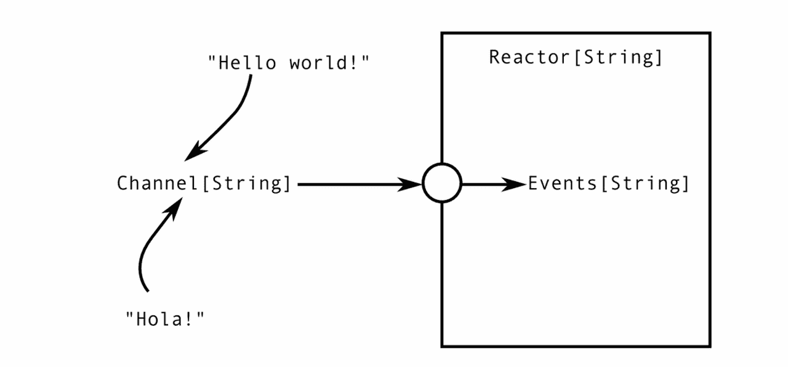
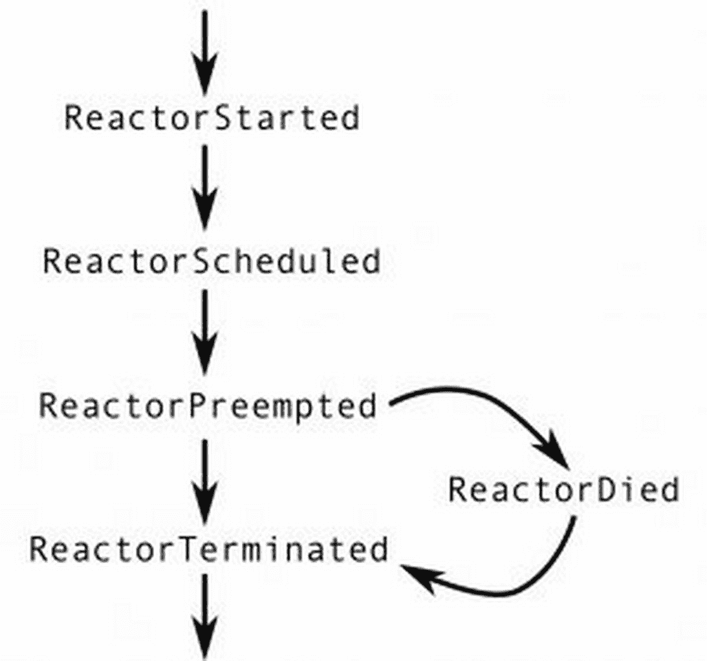
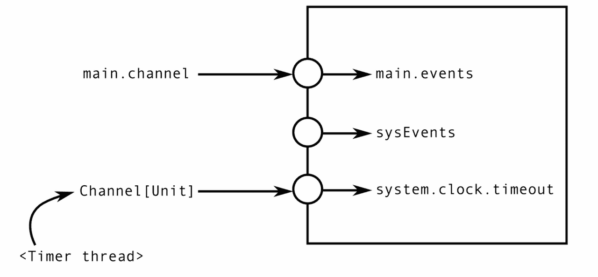
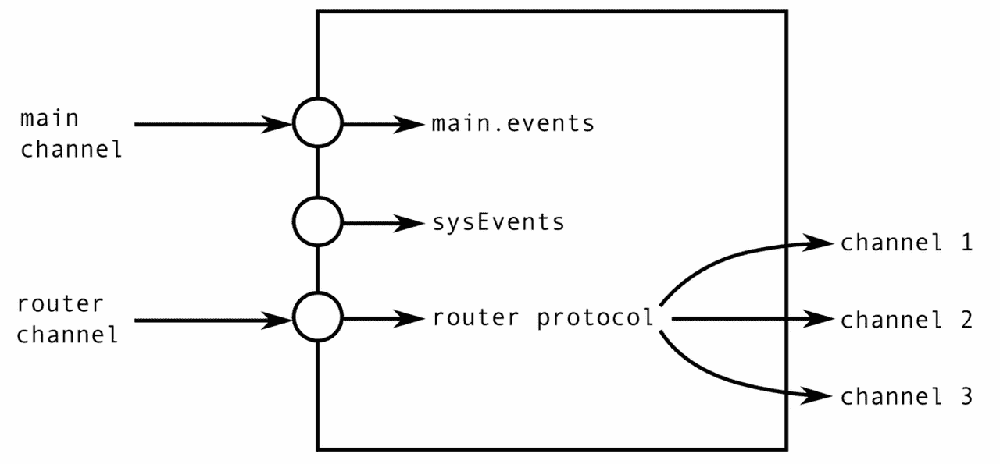
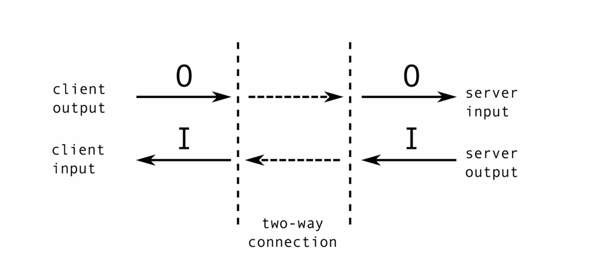
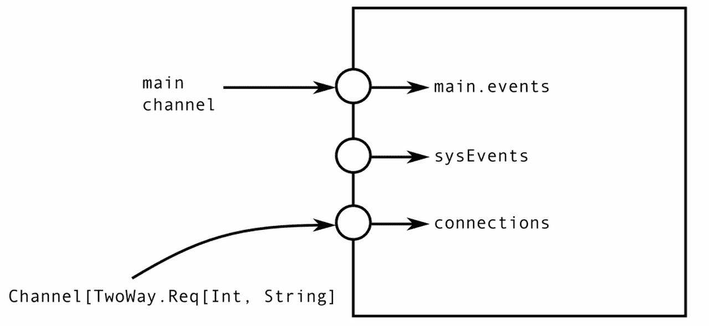
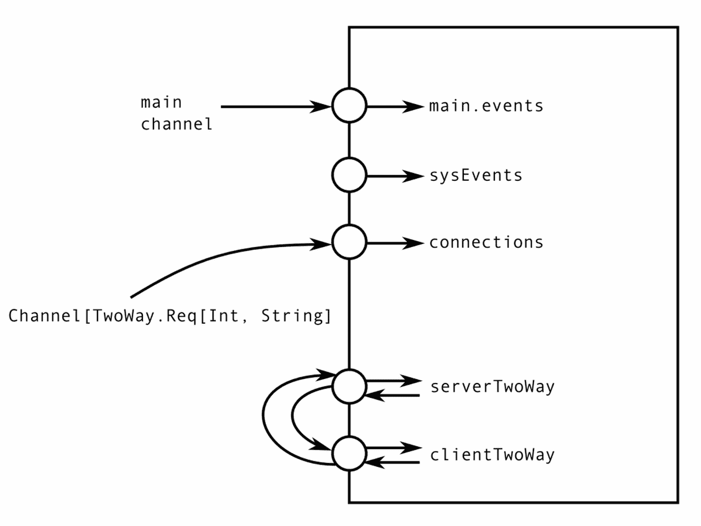

# 第十章。反应器

|   | *"简单是可靠性的前提。" |   |
| --- | --- | --- |
|   | --*埃德加·W·迪杰斯特拉* |

位置透明性、可序列化的事件处理以及发送的非阻塞语义，使得 actor 模型成为构建分布式系统的强大基础。然而，actor 模型有几个重要的限制，这些限制只有在构建更大的系统时才会变得明显。首先，actor 不能同时包含多个消息入口点。所有消息都必须通过同一个`receive`块到达。因此，两个不同的协议不能重用相同的消息类型，并且必须相互了解。我们看到的这个主要例子是`Identify`消息，它要求用户将一个唯一的令牌纳入消息中。其次，actor 不能等待特定的消息组合。例如，同时向两个目标 actor 发送请求消息并在两个回复到达后继续操作是很繁琐的。第三，`receive`语句不是一等公民。我们在 Rx 框架中看到的事件流是一等公民，这提高了程序组合、模块化和关注点分离。

在本章中，我们研究分布式计算的 reactor 编程模型，该模型保留了 actor 模型的优势，但克服了上述限制。这个框架通过为分布式编程提供正确、健壮和可组合的抽象，使得创建复杂并发和分布式应用变得更加容易。与 actor 模型类似，reactor 模型允许编写位置透明的程序。通过称为 reactor 的特殊实体实现了并发单元之间的清晰分离。这种分离使得推理并发程序变得更加容易，正如 actor 模型中的情况一样。然而，在 reactor 模型中，计算和消息交换模式可以更容易地细分为模块化组件。reactor 模型核心的改进组合是传统 actor 模型和函数式响应式编程概念的谨慎整合的结果。

我们在本章中使用 Reactors 框架来了解 reactor 编程模型。我们将涵盖以下主题：

+   利用和组合事件流来在 reactor 中构建逻辑

+   定义 reactor 和启动 reactor 实例

+   自定义 reactor 实例和使用自定义调度器

+   使用 reactor 系统服务访问非标准事件，并定义自定义服务

+   协议组合的基本原理，以及几个具体的协议示例

我们首先回顾我们关于并发和分布式编程的知识，并解释为什么 reactor 模型很重要。

# 对 reactor 的需求

通过阅读本书，你可能已经得出结论，编写并发和分布式程序并不容易。确保程序的正确性、可扩展性和容错性比在顺序程序中更难。在这里，我们回顾一下造成这种情况的一些原因：

+   首先，大多数并发和分布式计算在本质上是非确定性的。这种非确定性并非由于编程抽象不良的结果，而是需要对外部事件做出反应的系统固有的。

+   数据竞争是大多数共享内存多核系统的一个基本特征。结合固有的非确定性，这些会导致难以检测或重现的微妙错误。

+   当涉及到分布式计算时，事情变得更加复杂。随机故障、网络中断或中断，这些在分布式编程中普遍存在，会损害分布式系统的正确性和鲁棒性。

+   此外，共享内存程序在分布式环境中无法工作，现有的共享内存程序也不容易移植到分布式设置中。

另一个使并发和分布式编程变得困难的原因是，当构建大型系统时，我们希望将简单的程序组件组合成更大的实体。然而，正确组合并发和分布式程序往往很困难。当这些组件一起使用时，特定组件的正确性并不能保证全局程序的正确性。锁固有的死锁就是一个例子，actor 中潜在的竞争条件是另一个。

本书中所提到的框架努力解决上述并发和分布式编程中的问题。不同的并发模型试图从不同的角度解决这些问题。本章所描述的反应器模型的目的是借鉴现有框架的一些最佳特性，例如位置透明性、可串行性和数据竞争自由，特别是解决可组合性问题。

为了实现这些目标，反应器模型采用了几种最小化抽象，这些抽象可以组合成复杂的协议、算法和程序组件。特别是，该模型基于以下内容：

+   位置透明的**反应器**，轻量级实体，可以与其他反应器并发执行，但内部始终是单线程的，并且可以从单机环境移植到分布式环境。每个反应器都创建了一个主要事件流。反应器是传统 actor 模型中 actor 的泛化。

+   可以以声明式、函数式方式推理的异步一等**事件流**，是组件组合的基础。事件流是通道的读取端。只有拥有该通道的反应器才能从对应的事件流中读取。事件流不能在不同反应器之间共享。借用 actor 模型的类比，事件流是`receive`语句的对等物。

+   **通道**可以在反应器之间共享，并用于异步发送事件。通道是对应事件流的写入端，任何数量的反应器都可以向通道写入。通道与我们在 actor 模型中看到的 actor 引用非常相似。

这三个独特的抽象是构建强大的分布式计算抽象的核心先决条件。在本章中，我们研究的 Reactors 框架中的大多数其他实用工具都是基于反应器、通道和事件流构建的。

# Reactors 入门

本节包含如何在项目中设置 Reactors 的说明。Reactors 框架具有多种语言前端，并在多个平台上运行。在撰写本书时，Reactors 可以用作 Scala 和 Java 的 JVM 库，或者如果您使用 Reactors 的`Scala.js`前端，还可以在 NodeJS 或浏览器中使用。

如果您使用 SBT 进行开发，最简单的方法是将 Reactors 作为库依赖项包含到您的项目中。要开始使用`Reactors.IO`，您应该获取在**Maven**上分发的最新快照版本。如果您使用 SBT，请将以下内容添加到您的项目定义中：

```java
resolvers ++= Seq( 
  "Sonatype OSS Snapshots" at "https://oss.sonatype.org/content/repositories/snapshots", 
  "Sonatype OSS Releases" at "https://oss.sonatype.org/content/repositories/releases" 
) 
libraryDependencies ++= Seq( 
  "io.reactors" %% "reactors" % "0.8") 

```

在撰写本文时，Scala `2.11`的最新版本是`0.8`。在为 Scala `2.12`发布 Reactors 版本之后，您可能需要替换前面代码中的`0.8`版本。

# "Hello World"程序

在本节中，我们将通过一个简单、有效的 Hello World 程序进行操作。我们不会深入太多，但将在后续章节中提供更深入的信息。现在，我们只需定义一个等待一个传入事件、在事件到达时向标准输出打印一条消息，然后终止的反应器。

我们首先导入`io.reactors`包的内容：

```java
import io.reactors._ 

```

这允许我们使用 Reactors 框架提供的设施。在下面的代码片段中，我们声明了一个基于反应器的简单程序：

```java
object ReactorHelloWorld { 
  def main(args: Array[String]): Unit = { 
    val welcomeReactor = Reactor[String] { self => 
      self.main.events onEvent { name => 
        println(s"Welcome, $name!") 
        self.main.seal() 
      } 
    } 
    val system = ReactorSystem.default("test-system") 
    val ch = system.spawn(welcomeReactor) 
    ch ! "Alan" 
  } 
} 

```

上面的程序声明了一个名为`welcomeReactor`的匿名反应器，它等待其主事件流上到达一个名称，打印该名称，然后密封其主通道，从而终止自身。主程序随后创建一个新的反应器系统，使用反应器模板启动之前定义的`welcomeReactor`的新运行实例，并向它发送一个事件`"Alan"`。

通过分析前面的程序，我们得出以下结论：

+   使用`Reactor[T]`构造函数定义 reactor，其中`T`是可以向 reactor 的主通道发送的事件类型。

+   Reactor 根据传递给`onEvent`方法的回调函数中指定的方式对传入的事件做出反应。例如，我们可以在 reactor 的主事件流上调用`onEvent`，该主事件流通过表达式`main.events`获得。

+   调用`main.seal()`终止 reactor。

+   使用特定定义的 reactor 可以通过`spawn`方法启动，该方法返回 reactor 的主通道。

+   通过在 reactor 的一个通道上调用`!`运算符来向 reactor 发送事件。

后续章节将更深入地解释这些功能中的每一个。

# 事件流

在本节中，我们研究驱动 Reactor 框架中大多数计算的基本数据类型：事件流。事件流表示偶尔可以产生事件的特殊程序值。事件流由`Event[T]`类型表示。

从语义上讲，事件流与我们在第六章中看到的`Observable`类型非常相似，即*使用 Reactive Extensions 进行并发编程*。我们将看到，`Observable`和`Events`之间的主要区别在于，`Observable`对象通常可以从不同的线程中使用，并且在使用`observeOn`方法时甚至可以在不同的线程之间发出事件。相比之下，`Events`对象只能在其拥有该事件流的 reactor 内部使用。

### 提示

永远不要在两个 reactor 之间共享事件流。事件流只能由拥有相应通道的 reactor 使用。

在以下内容中，我们展示了名为`myEvents`的事件流示例，它产生类型为`String`的事件：

```java
val myEvents: Events[String] = createEventStreamOfStrings() 

```

目前，我们假设方法`createEventStreamOfStrings`已经定义，并且它返回一个类型为`Events[String]`的事件流。

要变得有用，事件流必须允许用户以某种方式操作它产生的事件。为此，每个事件流都有一个名为`onEvent`的方法，该方法接受一个用户回调函数，并在每次事件到达时调用它：

```java
myEvents.onEvent(x => println(x)) 

```

`onEvent`方法类似于大多数基于回调的框架所暴露的：提供一段可执行代码片段的方式，该代码片段在事件可用时被调用。然而，就像 Reactive Extensions 中的`Observable`对象一样，`onEvent`方法的接收者，即事件流，是一个一等值。这种微妙的不同之处使得可以将事件流作为参数传递给其他方法，从而允许编写更通用的抽象。例如，我们可以实现一个可重用的`trace`方法，如下所示：

```java
def traceT: Unit = { 
  events.onEvent(println) 
} 

```

`onEvent` 方法返回一个特殊的 `Subscription` 对象。事件会传递到用户指定的回调函数，直到用户决定调用该 `Subscription` 对象的 `unsubscribe` 方法。这些 `Subscription` 对象的语义与在 **Reactive Extensions** 框架中看到的类似。

在我们继续之前，我们注意到事件流完全是单线程的实体。同一个事件流永远不会同时产生两个事件，因此同一个事件流上的 `onEvent` 方法永远不会同时被两个不同的线程调用。正如我们将看到的，这个特性简化了编程模型，使得基于事件的程序更容易推理。

为了更好地理解这一点，让我们研究一个具体的名为发射器的事件流，它由 `Events.Emitter[T]` 类型表示。在下面的代码中，我们实例化了一个发射器：

```java
val emitter = new Events.Emitter[Int] 

```

发射器同时是事件流和事件源。我们可以通过调用其 `react` 方法来强制发射器产生一个事件。当我们这样做时，发射器会调用之前通过 `onEvent` 方法注册的回调函数。

```java
var luckyNumber = 0 
emitter.onEvent(luckyNumber = _) 
emitter.react(7) 
assert(luckyNumber == 7) 
emitter.react(8) 
assert(luckyNumber == 8) 

```

通过运行上面的代码片段，我们确信 `react` 调用确实强制发射器产生一个事件。此外，调用 `emitter.react(8)` 总是在 `emitter.react(7)` 之后执行，回调函数将首先使用 `7` 调用，然后使用 `8` 调用，但不会并发。事件传播将在调用 `react` 的同一个线程上发生。

## 事件流的生命周期

现在，我们更详细地看看事件流可以产生的事件。类型为 `Events[T]` 的事件流通常发出类型为 `T` 的事件。然而，类型 `T` 并不是事件流可以产生的唯一类型。一些事件流是有限的。在发出所有事件后，它们会发出一个特殊的事件，表示将不会有更多的事件。有时，事件流会遇到异常情况，并发出异常而不是普通事件。

我们之前看到的 `onEvent` 方法只能响应普通事件。要监听其他类型的事件，事件流有更通用的 `onReaction` 方法。`onReaction` 方法接受一个 `Observer` 对象作为参数。`Observer` 对象有三个不同的方法，用于响应不同类型的事件。在下面的代码片段中，我们实例化了一个发射器并监听其所有事件：

```java
var seen = List[Int]() 
var errors = List[String]() 
var done = 0 
val e = new Events.Emitter[Int] 
e.onReaction(new Observer[Int] { 
  def react(x: Int, hint: Any) = seen ::= x 
  def except(t: Throwable) = errors ::= t.getMessage 
  def unreact() = done += 1 
}) 

```

类型 `Observer[T]` 有三个方法：

+   当一个普通事件被触发时，会调用 `react` 方法。第二个可选的提示参数可能包含额外的值，但通常设置为 `null`。

+   当事件流产生异常时，会调用 `except` 方法。事件流可以产生多个异常。然而，异常并不会终止流，同一个事件流可以发出多个异常。这与 Reactive Extensions 中的类型 `Observable` 有一个很大的不同点。

+   当事件流停止产生事件时调用的 `unreact` 方法。在此方法在观察者上调用后，事件流将不再产生更多事件或异常。

让我们断言这个合约对于 `Events.Emitter` 是正确的。我们已经了解到，我们可以通过调用 `react` 方法来使用发射器产生事件。我们可以类似地调用 `except` 来产生异常，或者调用 `unreact` 方法来表示将不再有事件。例如：

```java
e.react(1) 
e.react(2) 
e.except(new Exception("^_^")) 
e.react(3) 
assert(seen == 3 :: 2 :: 1 :: Nil) 
assert(errors == "^_^" :: Nil) 
assert(done == 0) 
e.unreact() 
assert(done == 1) 
e.react(4) 
e.except(new Exception("o_O")) 
assert(seen == 3 :: 2 :: 1 :: Nil) 
assert(errors == "^_^" :: Nil) 
assert(done == 1) 

```

如果你运行前面的代码片段，你将看到，在调用 `unreact` 方法后，对 `react` 或 `except` 方法的后续调用都没有效果，`unreact` 调用实际上终止了发射器。然而，并非所有事件流都像发射器那样命令式。大多数其他事件流是通过功能组合不同的事件流创建的。

## 事件流的功能组合

使用事件流方法，如 `onEvent` 和 `onReaction`，很容易导致回调地狱：由大量无结构的 `onXYZ` 调用组成的程序，难以理解和维护。拥有第一类事件流是正确的方向，但这还不够。

事件流支持功能组合，这在前面章节中已经看到。这种模式允许通过组合更简单的值来声明性地形成复杂值。考虑以下示例，其中我们计算传入事件的平方和：

```java
var squareSum = 0 
val e = new Events.Emitter[Int] 
e.onEvent(x => squareSum += x * x) 
for (i <- 0 until 5) e react i 

```

这个例子相当直接，但如果我们想让 `squareSum` 成为一个事件流，以便程序的另一部分能够对其变化做出反应呢？我们就需要创建另一个发射器，并让我们的 `onEvent` 回调在该新发射器上调用 `react` 方法，传递 `squareSum` 的值。这可能可行，但并不优雅，如下面的代码片段所示：

```java
val ne = new Events.Emitter[Int] 
e onEvent { x => 
  squareSum += x * x 
  ne.react(squareSum) 
} 

```

我们现在使用事件流组合子重写前面的代码片段。具体来说，我们使用 `map` 和 `scanPast` 组合子。`map` 组合子将一个事件流中的事件转换成派生事件流的事件。我们使用 `map` 组合子来生成每个整数事件的平方。`scanPast` 组合子将最后一个事件和当前事件结合起来，为派生事件流生成一个新事件。我们使用 `scanPast` 来将总和的先前值加到当前值上。例如，如果输入事件流产生数字 `0`、`1` 和 `2`，则由 `scanPast(0)(_ + _)` 产生的事件流将产生数字 `0`、`1` 和 `3`。

下面是如何重写前面的示例：

```java
val e = new Events.Emitter[Int] 
val sum = e.map(x => x * x).scanPast(0)(_ + _) 
for (i <- 0 until 5) e react i 

```

类型`Events[T]`附带大量预定义的组合子。您可以在在线 API 文档中找到其他组合子。使用功能组合子组成的事件流集合形成一个数据流图。发射器通常是此图中的源节点，由各种组合子创建的事件流是内部节点，而回调方法，如`onEvent`，是汇节点。例如，`union`这样的组合子接受多个输入事件流。这些事件流对应于具有多个输入边的图节点。以下是一个例子：

```java
val numbers = new Events.Emitter[Int] 
val even = numbers.filter(_ % 2 == 0) 
val odd = numbers.filter(_ % 2 == 1) 
val numbersAgain = even union odd 

```

由事件流引起的数据流图在本质上与由 Scala 的`futures`和 Reactive Extensions 中的`Observable`对象引起的数据流图相似，因此我们不会在本章中进一步研究它们。关于反应器模型中事件流最重要的记住的事情是，它们是单线程实体。正如我们将在下一节中看到的，每个事件流只能属于单个反应器。

# 反应器

正如我们之前所学的，事件流总是在单线程上传播事件。这对于程序理解是有用的，但我们仍然需要在我们的程序中表达并发。在本节中，我们将看到如何通过使用称为反应器的实体来实现并发。

反应器是并发的基本单元。当演员接收消息时，我们将采用反应器接收事件的术语，以便消除歧义。然而，尽管一个处于特定状态的演员只有一个可以接收消息的点，即`receive`语句，但反应器可以在任何时候从许多不同的来源接收事件。尽管这种灵活性，但一个反应器在任何时候最多只能处理一个事件。我们说反应器接收的事件是**序列化的**，类似于演员接收的消息是如何序列化的。

为了能够创建新的反应器，我们需要一个`ReactorSystem`对象，它跟踪单个机器中的反应器：

```java
val system = new ReactorSystem("test-system") 

```

在我们可以启动反应器实例之前，我们需要定义其模板。一种方法是调用`Reactor.apply[T]`方法，它返回一个用于反应器的`Proto`对象。`Proto`对象是一个反应器原型，可以用来启动反应器。以下反应器将接收到的所有事件打印到标准输出：

```java
val proto: Proto[Reactor[String]] = Reactor[String] { self => 
  self.main.events onEvent { 
    x => println(x) 
  } 
} 

```

让我们更仔细地检查这段代码。`Reactor.apply`方法使用类型参数`String`被调用。这意味着由结果`Proto`对象编码的反应器默认接收类型为`String`的事件。这与标准演员模型中的演员可以接收任何类型的消息的第一个区别。反应器接收的事件是严格类型化的。

在反应器模型中，每个反应器都可以访问一个特殊的事件流，称为 `main.events`，它发出反应器从其他反应器接收的事件。由于我们使用 `Reactor.apply` 方法声明了一个匿名反应器，因此我们需要添加一个前缀 `self` 来访问反应器的成员。我们之前了解到，我们可以调用 `onEvent` 来注册事件流的回调，并且我们在本例中使用了它来使用 `println` 打印事件。

在定义反应器模板之后，下一步是启动一个新的反应器。我们通过在反应器系统上调用 `spawn` 方法来完成此操作：

```java
val ch: Channel[String] = system.spawn(proto) 

```

`spawn` 方法接受一个 `Proto` 对象作为参数。`Proto` 对象可以通常编码反应器的构造函数参数、调度器、名称和其他选项。在我们的例子中，我们使用 `Reactor.apply` 方法创建了一个匿名反应器的 `Proto` 对象，因此我们无法访问任何构造函数参数。我们将在以后看到声明反应器和配置原型的其他方法。

`spawn` 方法执行两个操作。首先，它注册并启动一个新的反应器实例。其次，它返回一个 `Channel` 对象，该对象用于向新创建的反应器发送事件。我们在以下图中展示了反应器、其事件流和通道之间的关系：



外部世界访问反应器内部唯一的方式是向其通道发送事件。这些事件最终被传递到相应的事件流，反应器可以监听这些事件流。通道和事件流只能传递与反应器类型相对应的事件类型。

让我们向我们的反应器发送一个事件。我们通过在通道上调用感叹号操作符 `!` 来完成此操作：

```java
ch ! "Hola!" 

```

执行最后一条语句应该在标准输出中打印字符串 `"Hola!"`。

## 定义和配置反应器

在前面的章节中，我们看到了如何使用 `Reactor.apply` 方法定义一个反应器。在本节中，我们将探讨定义反应器的另一种方法——通过扩展 `Reactor` 基类。回想一下，`Reactor.apply` 方法定义了一个匿名反应器模板。扩展 `Reactor` 类声明了一个命名反应器模板。

在以下内容中，我们声明了 `HelloReactor` 类，它必须是顶级类：

```java
class HelloReactor extends Reactor[String] { 
  main.events onEvent { 
    x => println(x) 
  } 
} 

```

要运行此反应器，我们首先创建一个原型来配置它。`Proto.apply` 方法接受反应器的类型，并返回该反应器类型的原型。然后我们使用该 `Proto` 对象调用 `spawn` 方法来启动反应器：

```java
val ch = system.spawn(Proto[HelloReactor]) 
ch ! "Howdee!" 

```

我们还可以使用原型来设置反应器实例应使用的调度器。如果我们想让反应器实例在自己的专用线程上运行以赋予它更高的优先级，我们可以执行以下操作：

```java
system.spawn( 
  Proto[HelloReactor].withScheduler(JvmScheduler.Key.newThread)) 

```

注意，如果你在`Scala.js`上运行反应器，你需要使用一个`Scala.js`特定的调度器。这是因为`Scala.js`编译到的 JavaScript 运行时不是多线程的。异步执行被放置在单个队列中，并依次执行。在`Scala.js`上，你需要使用`JsScheduler.Key.default`调度器。

`Proto`对象有几种其他配置选项，你可以在在线 API 文档中了解更多信息。我们可以将本节总结如下。启动反应器通常是一个三步的过程：

1.  通过扩展`Reactor`类创建一个命名的反应器模板。

1.  反应器配置对象是通过`Proto.apply`方法创建的。

1.  反应器实例是通过反应器系统的`spawn`方法启动的。

为了方便，我们可以通过使用`Reactor.apply`方法合并前两个步骤，该方法创建一个匿名反应器模板并直接返回类型为`Proto[I]`的原型对象，其中`I`是某种反应器类型。通常，我们在测试中这样做，或者在 Scala REPL 中尝试新事物时这样做。

## 使用通道

现在我们已经了解了如何以不同的方式创建和配置反应器，我们可以更深入地了解通道，这是反应器与其环境通信的手段。正如之前所提到的，每个反应器都是通过一个默认的通道创建的，该通道称为`main`，这通常足够使用。但有时反应器需要能够接收不止一种类型的事件，并且需要额外的通道来实现这一目的。

让我们声明一个存储键值对的反应器。反应器必须对存储键值对的请求以及检索特定键下的值做出反应。由于反应器的输入通道将必须服务于两个目的，我们需要以下数据类型：

```java
trait Op[K, V] 
case class PutK, V extends Op[K, V] 
case class GetK, V extends Op[K, V] 

```

`Op`数据类型有两个类型参数，称为`K`和`V`，它们表示存储的键和值的类型。`Put`案例类用于将值存储到反应器中，因此它包含新的键和值。`Get`案例类用于检索之前使用某个键存储的值，因此它编码了键和类型为`V`的通道。当反应器接收到`Get`事件时，它必须查找与键关联的值，并通过通道发送该值。

使用`Op[K, V]`数据类型，我们可以定义如以下代码片段所示的`MapReactor`。

```java
class MapReactor[K, V] extends Reactor[Op[K, V]] { 
  val map = mutable.Map[K, V]() 
  main.events onEvent { 
    case Put(k, v) => map(k) = v 
    case Get(k, ch) => ch ! map(k) 
  } 
} 

```

让我们启动`MapReactor`并对其进行测试。我们将使用`MapReactor`来存储一些 DNS 别名。我们将映射每个别名`String`键到一个 URL，其中 URL 用`List[String]`类型表示。我们首先初始化如下：

```java
val mapper = system.spawn(Proto[MapReactor[String, List[String]]]) 

```

然后我们发送几个`Put`消息来存储一些别名值：

```java
mapper ! Put("dns-main", "dns1" :: "lan" :: Nil) 
mapper ! Put("dns-backup", "dns2" :: "com" :: Nil) 

```

接下来，我们创建一个客户端反应器，我们通过发送`String`事件来控制它。这意味着反应器的类型将是`Reactor[String]`。然而，客户端反应器还必须联系`MapReactor`并请求其中一个 URL。由于`MapReactor`只能发送不对应客户端默认通道类型的`List[String]`事件，因此客户端的默认通道无法接收回复。因此，客户端必须向`MapReactor`提供一个不同的通道。以下表达式用于创建一个新通道：

```java
val c: Connector[EventType] = system.channels.open[EventType] 

```

表达式`system.channels`返回一个通道构建器对象，它提供了`named`或`daemon`等方法，用于自定义通道（有关更多详细信息，请参阅在线 API 文档）。在这个例子中，我们将创建**守护通道**，以表示该通道不需要关闭（关于这一点稍后还会详细介绍）。要创建一个新通道，我们调用通道构建器上的`open`方法，并使用适当的类型参数。

结果的`Connector`对象包含两个成员：`channel`字段，它是新创建的通道；以及`events`字段，它是与该通道对应的事件流。事件流传播了在通道上发送和交付的所有事件，并且只能由创建它的反应器使用。另一方面，通道可以与其他反应器共享。

### 小贴士

使用`system.channels`对象上的`open`操作来创建新的连接器。每个连接器都包含一对通道及其事件流。

让我们定义一个客户端反应器，它等待一个`"start"`消息，然后检查 DNS 条目。这个反应器将使用`onMatch`处理程序而不是`onEvent`，以仅监听某些`String`事件并忽略其他事件：

```java
val ch = system.spawn(Reactor[String] { self => 
  self.main.events onMatch { 
    case "start" => 
      val reply = self.system.channels.daemon.open[List[String]] 
      mapper ! Get("dns-main", reply.channel) 
      reply.events onEvent { url => 
        println(url) 
      } 
    case "end" => 
      self.main.seal() 
  } 
}) 

```

在前面的代码片段中，当反应器从主程序接收到`"start"`事件时，它打开一个新的`reply`通道，该通道接受`List[String]`事件。然后，它向`MapReactor`发送一个带有`"dns-main"`键和`reply`通道的`Get`事件。最后，反应器监听通过`reply`通道发送回来的事件，并将 URL 打印到标准输出。在主模式匹配的`"end"`情况下，反应器在主通道上调用`seal`方法，以指示它将不会在该通道上接收任何进一步的事件。一旦所有非守护通道都变为密封状态，反应器就会终止。

### 小贴士

反应器在以下任一情况下终止：当所有非守护通道都密封时，或者当其构造函数或某些事件处理程序抛出异常时。

让我们启动客户端反应器，看看会发生什么：

```java
ch ! "start" 

```

到目前为止，我们应该在标准输出上看到 URL。最后，我们可以向客户端反应器发送`"end"`消息来停止它。

```java
ch ! "end" 

```

在下一节中，我们将看到如何使用自定义调度策略自定义反应器。

# 调度器

每个反应堆模板都可以用来启动多个反应堆实例，每个反应堆实例都可以使用不同的反应堆调度器。不同的调度器在执行优先级、频率、延迟和吞吐量方面有不同的特性。在本节中，我们将探讨如何使用非默认调度器，以及在必要时如何定义自定义调度器。

我们首先定义一个记录传入事件、每次被调度时报告，并在被调度三次后结束的反应堆。我们将使用反应堆的 `sysEvents` 流，这将在下一节中解释。现在，你需要知道的是，系统事件流在反应堆获得一些执行时间（即被调度）时产生事件，并暂停其执行（即被抢占）。

`Logger` 反应堆在下面的代码片段中显示：

```java
class Logger extends Reactor[String] { 
  var count = 3 
  sysEvents onMatch { 
    case ReactorScheduled => 
      println("scheduled") 
    case ReactorPreempted => 
      count -= 1 
      if (count == 0) { 
        main.seal() 
        println("terminating") 
      } 
  } 
  main.events.onEvent(println) 

```

在启动 `Logger` 反应堆的实例之前，我们需要创建一个反应堆系统，正如我们在前面的章节中学到的：

```java
val system = new ReactorSystem("test-system") 

```

每个反应堆系统都捆绑了一个默认调度器和一些额外的预定义调度器。当启动反应堆时，它使用默认调度器，除非有其他指定。在下面的代码中，我们使用 Scala 的全局执行上下文（即 Scala 的默认线程池）覆盖了默认调度器：

```java
val proto = Proto[Logger].withScheduler( 
  JvmScheduler.Key.globalExecutionContext) 
val ch = system.spawn(proto) 

```

运行上面的代码片段应该会启动 `Logger` 反应堆并打印一次 `"scheduled"` 字符串，因为启动反应堆会在任何事件到达之前就进行调度。如果我们现在向主通道发送一个事件，我们会再次看到打印的 `"scheduled"` 字符串，然后是事件本身。我们这样做如下：

```java
ch ! "event 1" 

```

再次发送事件会减少反应堆的计数器。主通道被密封，使反应堆处于没有非守护进程通道的状态，然后反应堆终止：

```java
ch ! "event 2" 

```

反应堆系统还允许注册自定义调度器实例。在下面的代码中，我们创建并注册了一个自定义的 `Timer` 调度器，该调度器每 1,000 毫秒调度一次 `Logger` 反应堆：

```java
system.bundle.registerScheduler("customTimer", 
  new JvmScheduler.Timer(1000)) 
val periodic = system.spawn( 
  Proto[Logger].withScheduler("customTimer")) 

```

通过运行上面的代码，我们可以看到即使没有事件发送给反应堆，反应堆也会被调度。`Timer` 调度器确保反应堆每 N 秒正好调度一次，并处理一些其挂起的任务。

# 反应堆生命周期

每个反应堆在其生命周期中都会经过一系列的阶段，这些阶段共同被称为 **反应堆生命周期**。当反应堆进入特定阶段时，它会发出生命周期事件。这些生命周期事件在称为 `sysEvents` 的特殊守护进程事件流上分发。每个反应堆都是使用这个特殊事件流创建的。

反应堆生命周期可以总结如下：

+   调用 `spawn` 方法后，反应堆被调度执行。其构造函数异步启动，紧接着，一个 `ReactorStarted` 事件被分发。

+   然后，每当反应堆获得执行时间时，都会触发`ReactorScheduled`事件。之后，事件会在正常事件流上分发。

+   当调度系统决定抢占反应堆时，会触发`ReactorPreempted`事件。这个调度周期可以重复任意次数。

+   最终，反应堆会终止，无论是正常执行还是异常终止。如果用户代码异常导致执行终止，则会触发一个`ReactorDied`事件。

+   在正常或异常执行中，都会发出一个`ReactorTerminated`事件。

以下图表显示了该反应堆的生命周期：



为了测试这一点，我们定义以下反应堆：

```java
class LifecycleReactor extends Reactor[String] { 
  var first = true 
  sysEvents onMatch { 
    case ReactorStarted => 
      println("started") 
    case ReactorScheduled => 
      println("scheduled") 
    case ReactorPreempted => 
      println("preempted") 
      if (first) first = false 
      else throw new Exception 
    case ReactorDied(_) => 
      println("died") 
    case ReactorTerminated => 
      println("terminated") 
  } 
} 

```

在创建生命周期反应堆时，反应堆会接收到`ReactorStarted`事件，然后是`ReactorStarted`和`ReactorScheduled`事件。随后，反应堆被挂起，并保持这种状态，直到调度器给它更多的执行时间。

```java
val ch = system.spawn(Proto[LifecycleReactor]) 

```

当调度器检测到有针对该反应堆的挂起消息时，它会再次执行反应堆。如果我们现在向反应堆发送一个事件，我们会从标准输出看到相同的`ReactorScheduled`和`ReactorPreempted`事件周期。然而，这次`ReactorPreempted`处理程序抛出一个异常。异常被捕获，随后发出一个`ReactorDied`事件，然后是必须的`ReactorTerminated`事件。

```java
ch ! "event" 

```

到这个时候，反应堆已经完全从反应堆系统中移除。

# 反应堆系统服务

在前面的章节中，我们了解到反应堆界定并发执行，并且事件流允许在每个反应堆内部路由事件。这已经是一套强大的抽象，我们可以使用反应堆和事件流来编写各种分布式程序。然而，这种模型仅限于反应堆计算。例如，我们不能启动阻塞 I/O 操作，从硬件实现的温度传感器中读取数据，等待 GPU 计算完成，或者对时间事件做出反应。在某些情况下，我们需要与操作系统的原生功能交互，或者利用现有的丰富库生态系统。为此，每个反应堆系统都有一组**服务**：这些协议将事件流与外部世界联系起来。

在本节中，我们将更详细地研究默认可用的各种服务，并展示如何实现自定义服务并将它们集成到反应堆系统中。

## 日志服务

我们从最简单的服务`Log`开始。这个服务用于将日志消息打印到标准输出。在下面的内容中，我们将创建一个使用`Log`服务的匿名反应堆。我们首先导入`Log`服务：

```java
import io.reactors.services.Log 

```

接下来，我们创建一个反应器系统，并启动一个反应器实例。反应器在反应器系统上调用`service`方法，该方法返回具有指定类型的单例服务。然后，反应器在`log`对象上调用`apply`方法以打印一条消息，并密封自身。

这在下述代码片段中显示：

```java
system.spawn(Reactor[String] { self => 
  val log = system.service[Log] 
  log("Test reactor started!") 
  self.main.seal() 
}) 

```

运行上述代码片段会将带时间戳的消息打印到标准输出。这个例子非常简单，但我们用它来描述服务的一些重要特性：

+   反应器系统的`service[S]`方法返回类型为`S`的服务。

+   以这种方式获得的服务是一个懒加载的单例实例。每个反应器系统中最多存在一个服务实例，并且它仅在某个反应器请求后创建。

+   一些标准服务在反应器系统创建时被积极初始化。这些服务通常作为`ReactorSystem`类上的独立方法可用。例如，`system.log`是获取`Log`服务的另一种方式。

## 时钟服务

在看到了一个简单的服务示例之后，让我们看看一个更复杂的服务，它将反应器与事件的外部世界连接起来，即`Clock`服务。`Clock`服务能够产生时间驱动的事件，例如超时、倒计时或周期性计数。这个服务是标准的，因此可以通过调用`system.clock`或`system.service[Clock]`来获得。

在以下内容中，我们创建了一个匿名反应器，该反应器使用`Clock`服务在 1 秒后创建一个超时事件。时钟服务的`timeout`方法返回一个`Unit`类型的事件流，该事件流始终最多产生一个事件。我们向`timeout`事件流安装了一个回调，该回调密封了这个反应器的主通道。这在下述代码片段中显示：

```java
import scala.concurrent.duration._ 
system.spawn(Reactor[String] { self => 
  system.clock.timeout(1.second) on { 
    println("done") 
    self.main.seal() 
  } 
}) 

```

`Clock`服务在幕后使用一个单独的计时器线程，当计时器线程决定是时候这样做时，它会向反应器发送事件。这些事件是在`timeout`方法创建的特殊通道上发送的，因此它们只会在相应的事件流组合器上看到。这总结在下述图中：



当主通道被密封时，反应器终止。这是因为`timeout`事件流在幕后创建了一个守护进程通道，这并不能阻止在非守护进程通道消失后，我们的匿名反应器终止。

`Clock`服务显示了一个通用模式：当一个本地实体或外部事件需要与反应器通信时，它会创建一个新的通道，然后异步地向其发送事件。

## 通道服务

一些服务提供与反应器系统内部工作的事件流。`Channels`服务就是这样一个例子--它提供了对当前反应器系统中所有通道的事件驱动视图。这允许轮询当前可用的通道，或者等待具有特定名称的通道变得可用。等待通道特别有用，因为它允许更容易地处理反应器之间的异步性，这是分布式系统固有的。

作为旁注，我们实际上在之前已经看到并使用了`Channels`服务，当时我们在一个反应器中打开了第二个通道。表达式`system.channels.open`实际上是在标准通道服务上调用`open`方法。因此，通道服务不仅允许查询反应器系统中存在的通道，还允许在现有反应器中创建新的通道。

为了展示`Channels`服务的基本用法，我们构建了两个反应器。第一个反应器将在一段时间延迟后创建一个名为`"hidden"`的通道，第二个反应器将等待这个通道。当通道出现时，第二个反应器将向该通道发送一个事件。第一个反应器在接收到消息后打印字符串`"event received"`，并密封其主通道。这在上面的代码片段中有所展示：

```java
val first = Reactor[String] { self => 
  system.clock.timeout(1.second) on { 
    val c = system.channels.daemon.named("hidden").open[Int] 
    c.events on { 
      println("event received") 
      self.main.seal() 
    } 
  } 
} 
system.spawn(first.withName("first")) 
system.spawn(Reactor[String] { self => 
  system.channels.awaitInt onEvent { ch => 
    ch ! 7 
    self.main.seal() 
  } 
}) 

```

在前面的程序中，我们使用之前看到的`Clock`服务在第一个反应器中引入延迟。在第二个反应器中，我们使用`Channels`服务等待名为`"hidden"`的`"first"`反应器中的通道。两个反应器大约同时启动。

一秒后，第一个反应器使用`Channels`服务打开一个名为`"hidden"`的新守护进程通道。然后第一个反应器安装一个回调：当第一个事件到达隐藏通道时，它将消息打印到标准输出，并密封主通道，以确保反应器终止。第二个反应器从`Channels`服务获得一个事件，因为现在存在一个具有所需名称的通道。这个反应器向隐藏通道发送一个值`7`，然后终止。

总结来说，在异步系统中建立时间顺序时，等待通道出现是很重要的。一般来说，第一个反应器中隐藏通道的创建可以被反应器系统延迟任意时间，而`Channels`服务只允许在其它反应器中的特定通道创建后进行计算。

## 自定义服务

在看到一些现有的服务之后，我们现在展示如何创建一个自定义服务。为此，我们必须实现`Protocol.Service`特质，它有一个名为`shutdown`的单个成员方法：

```java
class CustomService(val system: ReactorSystem) 
extends Protocol.Service { 
  def shutdown(): Unit = ??? 
} 

```

当相应的反应器系统关闭时，会调用`shutdown`方法，并用于释放服务可能拥有的任何资源。任何自定义服务都必须有一个单参数构造函数，它接受一个`ReactorSystem`对象，这允许服务在其存在期间与反应器系统交互和使用。

如前所述，服务是一种机制，它提供了反应器通常无法从其他反应器获得的事件的访问。让我们实现一个服务，当封装的反应器系统关闭时，它会通知反应器。为此，我们需要保留一个订阅关闭事件的通道映射和一个保护对该状态访问的锁。最后，我们将公开一个名为`state`的方法，该方法创建一个在反应器系统关闭时发出事件的流。

`state`方法将返回一种特殊的事件流，称为`Signal`。`Signal`类型扩展了`Events`类型，并且信号对象在其值变化时发出事件。此外，`Signal`缓存了之前发出的事件的值，可以通过信号的`apply`方法访问。任何事件流都可以通过调用`toSignal`方法转换为信号。

被特定反应器调用的`state`方法必须创建一个新的守护进程通道，称为`shut`。此通道被添加到关闭服务的`subscribers`集合中。与此通道相关的事件流被转换为初始值为`false`的信号，并返回给调用者。

`Shutdown`服务的实现如下所示：

```java
class Shutdown(val system: ReactorSystem) 
extends Protocol.Service { 
  private val subscribers = mutable.Set[Channel[Boolean]]() 
  private val lock = new AnyRef 
  def state: Signal[Boolean] = { 
    val shut = system.channels.daemon.open[Boolean] 
    lock.synchronized { 
      subscribers += shut.channel 
    } 
    shut.events.toSignal(false) 
  } 
  def shutdown() { 
    lock.synchronized { 
      for (ch <- subscribers) ch ! true 
    } 
  } 
} 

```

我们现在可以在用户程序中使用`Shutdown`服务。这在上面的代码片段中显示：

```java
val system = ReactorSystem.default("test-shutdown-system") 
system.spawn(Reactor[Unit] { self => 
  system.service[Shutdown].state on { 
    println("Releasing important resource.") 
    self.main.seal() 
  } 
}) 

```

之后，当我们关闭系统时，我们期望回调中的代码运行并完成承诺：

```java
system.shutdown() 

```

注意，在实现自定义服务时，我们不再与编写正常反应器代码时处于同一水平。一个服务可能被多个反应器同时调用，这就是为什么我们不得不在`Shutdown`实现中对订阅者映射的访问进行同步。一般来说，在实现自定义服务时，我们必须注意以下几点：

+   在服务构造函数中永远不要阻塞或获取锁

+   确保对服务共享状态的操作得到适当的同步

总之，当你有一个本地事件驱动 API，必须将事件传递给程序中的反应器，或者希望公开反应器系统、操作系统或底层硬件的内部访问时，你应该使用自定义服务。通常，反应器系统服务的实现将使用一些低级别的并发原语，但将公开一个依赖于事件流和通道的高级 API。

# 协议

反应器、事件流和通道构成了反应器编程模型的基础。这些基本原语允许构建强大的通信抽象。在本节中，我们将探讨 Reactors 框架如何使用其基本原语实现的一些基本通信协议。这些协议的共同之处在于，它们不是基本模型的简单扩展。相反，它们是由基本抽象和其他更简单的协议组成的。

我们从最简单的协议之一开始，即**服务器-客户端**协议。首先，我们展示如何自己实现一个简单的服务器-客户端协议。之后，我们将展示如何使用 Reactors 框架提供的标准服务器-客户端实现。在后续关于协议的章节中，我们不会深入到实现细节，而是立即展示如何使用框架中预定义的协议。

这种方法将服务于几个目的。首先，你应该了解如何使用事件流和通道实现通信模式。其次，你会发现实现协议并将其暴露给客户端的方式不止一种。最后，你将看到协议在 Reactors 框架中的结构和暴露方式。

## 自定义服务器-客户端协议

在本小节中，我们将自己实现服务器-客户端协议。在我们开始之前，我们必须创建一个默认的反应器系统：

```java
val system = ReactorSystem.default("system") 

```

现在让我们更仔细地考虑服务器-客户端协议。该协议的流程如下：首先，客户端向服务器发送一个请求值。然后，服务器使用请求来计算一个响应值并发送给客户端。但要做到这一点，服务器需要一个响应通道，它作为发送响应值的目的地。这意味着客户端不仅需要将请求值发送到服务器，还需要发送一个用于回复的通道。因此，客户端发送的请求是一个包含值和回复通道的元组。服务器使用的通道必须接受这样的元组。我们通过以下两个类型来捕捉这些关系：

```java
type Req[T, S] = (T, Channel[S]) 
type Server[T, S] = Channel[Req[T, S]] 

```

在这里，`T`是请求值的类型，而`S`是响应值的类型。`Req`类型代表请求：一个包含请求值`T`和类型为`S`的响应通道的元组。`Server`类型就是一个接受请求对象的通道。

接下来，我们问自己——我们如何创建一个`Server`通道？`Server`通道的工厂方法应满足几个要求。首先，服务器方法应在请求和响应类型上具有泛型性。其次，它应在将请求类型映射到响应类型的方式上具有泛型性。第三，当请求发送到服务器时，映射的响应应发送回服务器。将这些要求结合起来，我们得到了以下`server`方法的实现，它实例化了一个新的服务器：

```java
def serverT, S: Server[T, S] = { 
  val c = system.channels.open[Req[T, S]] 
  c.events onMatch { 
    case (x, reply) => reply ! f(x) 
  } 
  c.channel 
} 

```

`server` 方法首先为 `Req[T, S]` 类型创建一个连接器。然后，它将一个回调添加到新创建的连接器的事件流中。该回调将请求元组分解为请求值 `x`（类型为 `T`）和 `reply` 通道，然后使用指定的映射函数 `f` 映射输入值，并最终通过 `reply` 通道发送映射后的值（类型为 `S`）。`server` 方法返回与该连接器关联的通道。我们可以使用此方法启动一个将请求字符串映射为大写字符串的服务器，如下所示：

```java
val proto = Reactor[Unit] { self => 
  val s = serverString, String 
} 
system.spawn(proto) 

```

接下来，我们将实现客户端协议。我们将在 `Channel` 类型上定义一个新的方法，该方法将请求发送到服务器。由于响应是异步到达的，该方法不能立即返回服务器的响应。相反，`?` 方法必须返回一个包含服务器响应的事件流。因此，`?` 方法必须创建一个回复通道，将 `Req` 对象发送到服务器，然后返回与回复通道相关联的事件流。这在上面的代码片段中展示：

```java
implicit class ServerOpsT, S: Arrayable { 
  def ?(x: T): Events[S] = { 
    val reply = system.channels.daemon.open[S] 
    s ! (x, reply.channel) 
    reply.events 
  } 
} 

```

在上面的代码中，我们通过声明一个隐式类 `ServerOps` 为 `Server` 类型的对象定义了一个扩展方法 `?`。在 Reactors 框架中，对类型 `S` 的 `Arrayable` 上下文绑定是必需的，以启用数组的创建。每当我们要打开一个泛型类型的通道时，Reactors 框架都需要 `Arrayable` 类型类，在这个例子中是类型 `S`。

现在我们通过在同一个反应器中实例化两个协议来展示服务器和客户端之间的交互。服务器只是返回输入字符串的大写版本，而客户端发送内容为 `"hello"` 的请求，并将响应打印到标准输出。这在上面的代码片段中展示：

```java
val serverClient = Reactor[Unit] { self => 
  val s = serverString, String 

  (s ? "hello") onEvent { upper => 
    println(upper) 
  } 
} 
system.spawn(serverClient) 

```

我们的实施方案是可行的，但将服务器-客户端协议启动在单个反应器内部并不是很有用。通常情况下，服务器和客户端通过网络隔开，或者至少是在同一反应器系统中运行的不同反应器。

结果表明，使用我们的玩具服务器-客户端协议实现，在两个不同的反应器中实例化协议并不简单。主要原因是一旦服务器通道在一个反应器中实例化，我们就无法在另一个反应器中“看到”它。服务器通道隐藏在服务器反应器的词法作用域内。我们将看到如何通过 Reactors 框架提供的标准服务器-客户端实现轻松克服这个问题。

## 标准服务器-客户端协议

我们刚刚看到了服务器-客户端协议的一个示例实现，它仅依赖于 Reactors 框架提供的基本原语。然而，所展示的实现非常简单，并且忽略了几个重要的问题。例如，我们如何停止服务器协议？此外，我们在单个反应器中实例化了服务器-客户端协议，但这是否意味着可以在两个不同的反应器中实例化服务器-客户端？

在本节中，我们更详细地探讨了服务器-客户端协议在 Reactors 框架中的暴露方式，并解释了如何解决上述的一些问题。大多数预定义的协议可以通过几种方式实例化：

+   在现有的反应器内部安装协议，该反应器具有适合该协议的适当类型。这样做的主要好处是可以在反应器的主通道上安装协议。这也使得协议对其他知道相应通道的反应器可访问。

+   通过为协议创建一个新的连接器，然后将协议安装到该连接器上。这样做的主要好处是你可以完全自定义协议的连接器（例如，命名它），但你将需要找到一种方法来与其他反应器共享协议的通道，例如，通过在 `Channels` 服务中使用它，或者通过将通道发送到特定的反应器。

+   通过为仅运行特定协议的反应器创建一个新的 `Proto` 对象。这样做的主要好处是能够完全配置你希望启动的反应器（例如，指定一个调度器、反应器名称或传输方式）。

+   通过立即启动一个运行特定协议的反应器。这是最简洁的选项。

这些方法大多等效，但它们代表了便利性和定制化之间的不同权衡。让我们通过查看预定义的服务器-客户端协议，依次研究这些方法。

### 使用现有的连接器

当使用现有的连接器时，我们需要确保连接器的类型与协议所需的类型匹配。在服务器的情况下，连接器的事件类型必须是 `Server.Req`。在下面的内容中，我们定义了一个服务器原型，该原型将请求整数乘以 `2` 来计算响应。为了安装服务器-客户端协议，我们在连接器上调用 `serve` 方法：

```java
val proto = Reactor[Server.Req[Int, Int]] { self => 
  self.main.serve(x => x * 2) 
} 
val server = system.spawn(proto) 

```

客户端可以使用 `?` 操作符查询 `server` 通道。为了方便，我们使用了 `spawnLocal` 方法，该方法同时定义了一个匿名反应器模板并使用它来启动一个新的客户端反应器。这在上面的代码片段中有所展示：

```java
system.spawnLocal[Unit] { self => 
  (server ? 7) onEvent { response => 
    println(response) 
  } 
} 

```

### 创建一个新的连接器

假设主通道已经被用于其他目的。例如，主通道可能正在接受终止请求。因此，主通道不能与服务器协议共享，因为协议通常需要对其各自通道的排他性所有权。在这种情况下，我们希望为协议创建一个新的连接器。

这种方法与使用现有连接器非常相似。唯一的区别是我们必须首先创建连接器本身，这给了我们自定义它的机会。特别是，我们将服务器设置为`daemon`通道，并将其命名为特定的名称`"server"`，以便其他反应器可以找到它。我们将反应器本身命名为`"Multiplier"`。要创建服务器连接器，我们使用通道构建器对象上的便利方法`server`，以获取适当类型的新的连接器。

然后，我们可以调用连接器上的`serve`方法来启动协议。这在上面的代码片段中有所展示：

```java
val proto = Reactor[String] { self => 
  self.main.events onMatch { 
    case "terminate" => self.main.seal() 
  } 
  self.system.channels.daemon.named("server") 
    .server[Int, Int].serve(_ * 2) 
} 
system.spawn(proto.withName("Multiplier")) 

```

客户端现在必须查询名称服务以找到服务器通道，然后从那里开始，如以下所示：

```java
system.spawnLocal[Unit] { self => 
  self.system.channels.await[Server.Req[Int, Int]]( 
    "Multiplier", "server" 
  ) onEvent { server => 
    (server ? 7) onEvent { response => 
      println(response) 
    } 
  } 
} 

```

### 创建特定协议的反应器原型

当我们确定反应器仅用于或主要用作服务器协议时，我们可以直接创建一个反应器服务器。为此，我们使用`Reactor`伴随对象上的`server`方法。`server`方法返回服务器的`Proto`对象，然后可以在启动反应器之前进一步自定义。`server`方法接受一个用户函数，每次请求到达时都会调用该函数。这个用户函数接收服务器的状态和请求事件，并返回响应事件。这在上面的代码片段中有所展示：

```java
val proto = Reactor.serverInt, Int => x * 2) 
val server = system.spawn(proto) 

system.spawnLocal[Unit] { self => 
  (server ? 7) onEvent { response => 
    println(response) 
  } 
} 

```

服务器`state`对象包含一个`Subscription`对象，允许用户在例如意外事件到达时停止服务器。

### 直接启动特定协议的反应器

最后，我们可以立即启动一个服务器反应器，无需任何自定义。这是通过将服务器函数传递给`ReactorSystem`上的`server`方法来完成的，如下所示：

```java
val server = system.serverInt, Int => x * 2) 

system.spawnLocal[Unit] { self => 
  (server ? 7) onEvent { response => println(response)  } 
} 

```

在随后的章节中，我们将探讨一些其他预定义的协议，这些协议具有与服务器-客户端协议相似的 API。

## 路由协议

在本节中，我们将探讨一个简单的路由协议。在这里，到达特定通道的事件根据某些用户指定的策略在一系列目标通道之间路由。实际上，该协议有许多应用，从数据复制和分片到负载均衡和多播。该协议在以下图中展示：



为了展示路由协议的实际应用，我们将实例化一个主反应器，该反应器将在两个工人之间路由传入的请求。在实际系统中，请求通常代表工作负载，而工人根据这些请求执行计算。为了简单起见，请求将是字符串，而工人将只将这些字符串打印到标准输出。

就像服务器-客户端协议一样，有几种方式可以实例化路由协议。首先，协议可以在现有的反应器内部启动，在这种情况下，它只是在该反应器内部运行的协议之一。或者，协议可以作为独立反应器启动，在这种情况下，该反应器专门用于路由协议。在我们的例子中，我们在现有的反应器中创建了一个路由协议的实例。

我们首先启动两个工人，分别命名为`worker1`和`worker2`。这两个反应器将打印传入的事件到标准输出。我们使用简写方法`spawnLocal`，简洁地启动反应器而不创建`Proto`对象：

```java
val worker1 = system.spawnLocal[String] { self => 
  self.main.events.onEvent(x => println(s"1: ${x}")) 
} 
val worker2 = system.spawnLocal[String] { self => 
  self.main.events.onEvent(x => println(s"2: ${x}")) 
} 

```

接下来，我们声明一个反应器，其主要通道接收`Unit`事件，因为我们不会将主通道用于任何特殊用途。在那个反应器内部，我们首先在`channels`服务上调用`router`方法，以打开适合路由器的适当类型的连接器。仅仅调用`router`方法，路由协议尚未启动。我们需要在新创建的连接器上调用`route`方法来实际启动路由。

`route`方法期望一个`Router.Policy`对象作为参数。策略对象包含一个函数，该函数返回我们想要路由的事件的通道。这个类型为`T => Channel[T]`的函数代表了路由协议的路由逻辑。

在我们的例子中，我们将使用简单的轮询策略。这个策略可以通过`Router.roundRobin`工厂方法实例化，该方法期望一个用于轮询策略的通道列表，因此我们将传递包含`worker1`和`worker2`通道的列表。我们将在下面的代码片段中展示这一点：

```java
system.spawnLocal[Unit] { self => 
  val router = system.channels.daemon.router[String] 
    .route(Router.roundRobin(Seq(worker1, worker2))) 
  router.channel ! "one" 
  router.channel ! "two" 
} 

```

在启动路由协议并将事件`"one"`和`"two"`发送到路由器通道后，这两个字符串被发送到两个不同的工人。`roundRobin`策略没有指定首先选择哪个目标通道，因此输出可以包含`"1: one"`和`"2: two"`，或者`"1: two"`和`"2: one"`。

轮询路由策略对两个目标通道没有任何了解，因此它只是依次选择一个，当达到目标列表的末尾时，再次选择第一个。实际上，这种策略构成了一个非常简单的负载均衡形式。

路由协议可以使用其他预定义的策略。例如，`Router.random` 策略使用随机数生成器将事件路由到不同的通道，在定期发送高负载事件的情况下更为健壮。另一个策略是 `Router.hash`，它计算事件的哈希码，并使用它来查找目标通道。如果这些都不令人满意，`deficitRoundRobin` 策略跟踪每个事件的预期成本，并偏置其路由决策以平衡发送到每个目标的总成本。用户还可以为其他用例创建自定义路由策略。

## 双向协议

在本节中，我们展示了一个双向通信协议。在双向通信中，双方获得一个类型为 `TwoWay` 的连接句柄，这允许它们在决定关闭此连接之前同时发送和接收无限数量的事件。一方发起连接，因此我们称该方为客户端，另一方为服务器。`TwoWay` 类型有两个类型参数 `I` 和 `O`，分别描述从客户端的角度看输入和输出事件的类型。这将在以下图中说明：



注意，这些类型取决于您是从服务器端还是客户端的角度来看连接。客户端双向连接的类型是：

```java
val clientTwoWay: TwoWay[In, Out] 

```

而从服务器的角度来看，双向连接的类型是：

```java
val serverTwoWay: TwoWay[Out, In] 

```

因此，`TwoWay` 对象包含一个输出通道 `output` 和一个输入事件流 `input`。要关闭连接，`TwoWay` 对象包含一个名为 `subscription` 的订阅对象，用于关闭连接并释放相关资源。

让我们创建一个双向协议的实例。这个协议分为两个阶段。首先，客户端请求一个双向连接服务器建立双向连接。之后，客户端和服务器通过双向通道进行通信。

在接下来的内容中，我们声明一个反应器，并在该反应器中实例化一个双向连接服务器。对于每个建立的双向连接，双向服务器将接收字符串，并发送这些字符串的长度。

```java
val seeker = Reactor[Unit] { self => 
  val lengthServer = self.system.channels 
    .twoWayServer[Int, String].serveTwoWay() 

```

上面的两行声明了一个名为 `Proto` 的反应器对象，它实例化了一个名为 `lengthServer` 的双向服务器。我们首先在 `Channels` 服务上调用 `twoWayServer` 方法，并指定了输入和输出类型（从客户端的角度来看）。然后，我们调用 `serverTwoWay` 方法来启动协议。在我们的案例中，我们将输入类型 `I` 设置为 `Int`，这意味着客户端将从服务器接收整数，将输出类型 `O` 设置为 `String`，这意味着客户端将向服务器发送字符串。

结果对象`lengthServer`表示连接的状态。它包含一个名为`connections`的事件流，每当客户端请求连接时，它都会发出一个事件。如果我们不对这个事件流做任何处理，服务器将保持沉默——它将启动新的连接，但会忽略来自客户端的事件。客户端和服务器如何通过双向连接进行通信（以及何时终止此连接）由用户指定。为了使用我们自己的逻辑自定义双向通信协议，我们需要对`connections`事件流发出的`TwoWay`事件做出反应，并将回调安装到`TwoWay`对象上。

在我们的情况下，对于每个传入的双向连接，我们希望通过计算字符串的长度来对`input`字符串做出反应，然后将该长度发送回`output`通道。我们可以这样做：

```java
  lengthServer.connections.onEvent { serverTwoWay => 
    serverTwoWay.input.onEvent { s => 
      serverTwoWay.output ! s.length 
    } 
  } 

```

现在我们有一个工作实例的双向连接服务器。反应器的当前状态可以用以下图示表示，其中我们的新通道与标准反应器通道并列：



接下来，让我们开始协议的客户端部分。客户端必须使用双向服务器通道请求连接。我们之前看到的`lengthServer`对象有一个名为`channel`的字段，必须用于此目的。客户端必须了解这个通道才能启动连接。请注意，只有`channel`需要共享，而不是完整的`lengthServer`对象。为了简化问题，我们将协议的客户端部分实例化在服务器端部分相同的反应器中。

要连接到服务器，客户端必须在`channel`上调用`connectTwoWay`扩展方法。此方法仅在导入包`io.reactors.protocol`时可用，并且适用于双向服务器通道。`connect`方法返回一个事件流，一旦连接建立，它就会发出一个`TwoWay`对象。

在以下内容中，我们连接到服务器。一旦服务器响应，我们使用`TwoWay[Int, String]`对象发送一个字符串事件，然后打印我们得到的长度事件：

```java
  lengthServer.channel.connect() onEvent { clientTwoWay => 
    clientTwoWay.output ! "What's my length?" 
    clientTwoWay.input onEvent { len => 
      if (len == 17) println("received correct reply") 
      else println("reply incorrect: " + len) 
    } 
  } 
} 

system.spawn(seeker) 

```

连接建立后，反应器和其连接器的状态如下所示：



注意，在这种情况下，双向通道的两个端点都在同一个反应器中。这是因为我们为了演示的目的，在同一个反应器中调用了`twoWayServe`和`connect`。在实际场景中，我们通常会在这两个不同的反应器上调用这两个操作。

# 摘要

在本章中，我们学习了反应器模型及其在 Reactors 框架中的实现。我们看到了如何定义和实例化反应器，组合事件流，自定义反应器名称并分配调度器，使用反应器系统服务以及定义自定义服务。重要的是，我们看到了如何使用一些基本低级协议，例如服务器-客户端、路由器和双向连接协议。

要了解更多关于反应器的信息，您可以在 Reactors 框架的网站上找到大量信息，网址为 [`reactors.io`](http://reactors.io/)。Reactors 框架相对较新，但正在不断开发中。随着框架的成熟和更多功能的增加，您将在网站上找到越来越多的信息。要了解更多关于反应器编程模型本身的信息，值得一看的论文是《Reactors, Channels, and Event Streams for Composable Distributed Programming》。

# 练习

在接下来的练习中，您需要定义几个反应器协议。在某些情况下，任务是在网上自己首先调查特定的算法，然后使用 Reactors 框架实现它。练习按难度排序，从简单任务到更复杂的任务。

1.  定义一个名为 `twice` 的方法，该方法接受一个目标通道，并返回一个通道，该通道将每个事件转发给目标两次。

    ```java
            def twiceT: Channel[T] 

    ```

1.  定义一个名为 `throttle` 的方法，该方法限制事件转发到目标通道的速率。

    ```java
            def throttleT: Channel[T] 

    ```

    **提示**：您将不得不使用 `Clock` 服务和函数式事件流组合。

1.  本章中展示的 `Shutdown` 服务如果有很多反应器订阅它，可能会耗尽内存。这是因为当前实现从未从服务的 `subscribers` 映射中删除条目。修改自定义的 `Shutdown` 服务，以便 `state` 信号的客户端可以取消订阅监听关闭事件。此外，确保当反应器终止时，如果它已订阅 `Shutdown` 服务，则取消订阅。为此使用 `sysEvents` 事件流。

1.  假设正常的 `Channel` 对象有时会丢失一些事件或重新排序它们，但永远不会重复或损坏事件。实现一个可靠的通道协议，确保每个通过通道发送的事件都按发送顺序交付到其目的地。定义两个方法 `reliableServer` 和 `openReliable`，分别用于启动可靠的连接服务器和在客户端打开可靠的连接。这些方法的签名如下，具体类型由您决定：

    ```java
            def reliableServer[T](): Channel[Reliable.Req[T]] 
            def openReliable[T] 
            (s: Channel[Reliable.Req[T]]): Events[Channel[T]] 

    ```

1.  实现一种**尽力而为的广播协议**，将事件发送到多个目标。广播方法必须实现以下接口，其中发送到结果通道的事件必须转发到所有目标：

    ```java
            def broadcast(targets: Seq[Channel[T]]): Channel[T] 

    ```

1.  调查和学习 CRDT 计数器算法的工作原理。然后，使用之前练习中的尽力而为广播协议来实现 CRDT 计数器算法。定义一个名为`crdt`的方法，允许用户创建 CRDT 计数器。

1.  实现一个`failureDetector`方法，该方法接收一个`Unit`类型的请求和响应心跳服务器，并返回一个表示服务器是否疑似失败的`Signal`对象：

    ```java
            def failureDetector(s: Server[Unit, Unit]): Signal[Boolean] 

    ```

    由该方法启动的协议必须定期向服务器发送心跳信号，并在一定时间内期望收到回复。如果在那个时间周期内没有收到响应，则怀疑服务器已失败。实现一个单元测试以验证生成的信号是否正确检测到服务器故障。

1.  实现一个**可靠的广播算法**，该算法与之前练习中的尽力而为广播具有相同的接口，但即使在发送过程中发送者中途死亡，也能保证将消息发送到所有或没有任何目标。实现单元测试以验证你实现的正确性。
