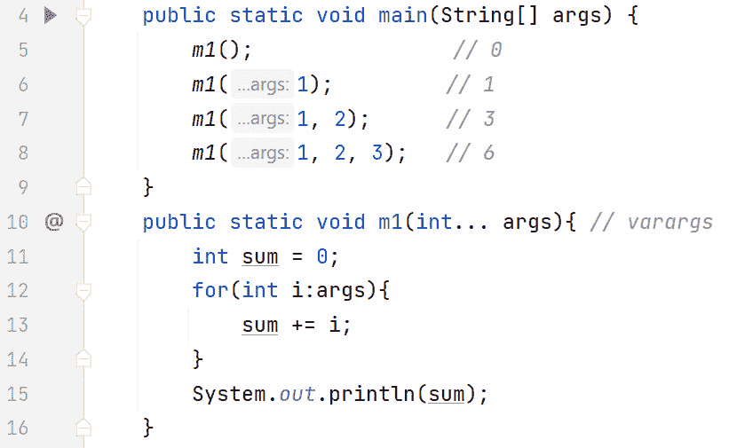

# 第七章：方法

在*第六章*中，我们学习了 Java 中的数组。我们了解到数组是固定大小的数据结构。它们存储在连续的内存位置中，每个位置的数据类型相同。我们还看到了如何声明、初始化和处理数组。传统和增强的`for`循环都非常适合处理数组。

此外，我们还讨论了多维数组，包括它们的组织方式和处理方法。最后，由于数组非常常见，我们讨论了`Arrays`类，它有几个用于处理数组的实用方法。

在本章中，我们将介绍方法。方法使我们能够创建一个可以执行于代码其他部分的命名代码块。首先，我们将解释为什么方法如此普遍。您将学习方法定义和方法调用的区别。我们将探讨方法签名是什么，以及方法重载如何使方法具有相同的名称，而不产生冲突。我们还将解释变量参数（`varargs`），它允许方法以 0 个或多个参数执行。最后，我们将概述 Java 的按值传递参数（和返回值）的原则。到本章结束时，您将能够编写和执行方法。此外，您将理解方法重载、`varargs`和 Java 的按值调用机制。

本章涵盖了以下主要主题：

+   解释为什么方法很重要

+   理解方法定义和方法执行之间的区别

+   探索方法重载

+   解释`varargs`

+   掌握按值调用

# 技术要求

本章的代码可以在 GitHub 上找到：[`github.com/PacktPublishing/Learn-Java-with-Projects/tree/main/ch7`](https://github.com/PacktPublishing/Learn-Java-with-Projects/tree/main/ch7)。

# 解释为什么方法很重要

方法是为便于引用而命名的代码块。它们可以接受输入并返回输出。输入和输出都是可选的。方法应该完成一个任务并且做得很好。将方法保持简短（少于 20 行）被认为是良好的实践。方法越长，它做得多的事情就越多。这里的“保持简单”的原则适用。

## 控制流程

简而言之，当方法被调用（执行）时，执行的控制流程会发生变化。让我们讨论一个简单的例子，这将有助于展示这一点。这是一个重要的观点，特别是对于经验不足的开发者来说。*图 7.1*展示了代码：


图 7.1 – 一个非常简单的函数

在这个例子中，我们有两个方法：`main()`方法（第 4 至 8 行）和`simpleExample()`方法（第 9 至 11 行）。它们都存在于`Methods`类中（第 3 至 12 行）。

在 Java 中，每个程序都以`main()`方法开始。JVM 代表我们调用它；我们不必自己调用（或执行）它。因此，在这个例子中，`main()`中的第一行，第 5 行，是第一条要执行的行。

第 6 行很重要——这就是我们所说的方法调用。第 9 行的`simpleExample()`方法定义与第 6 行的方法调用之间存在直接关联。我们将在稍后讨论这种关系。目前，只需理解方法调用改变了程序的执行顺序。通常，Java 从上到下执行代码行，这是真的。然而，*方法调用改变了这一点*。在本例中，当第 6 行执行时，接下来要执行的行是第 10 行（在`simpleExample()`方法内部）。

因此，`main()`方法现在已经将控制权交给了`simpleExample()`方法，并且只有在`simpleExample()`方法退出后，控制才会返回到`main()`。这可以在执行到`simpleExample()`方法末尾的闭合`}`时发生（第 11 行）。这正是本例中的情况。或者，一个方法可以通过使用`return`关键字来退出。

因此，第 6 行调用了`simpleExample()`方法，导致其代码执行。第 10 行将一些文本输出到屏幕上。第 11 行的闭合`}`导致`simpleExample()`退出，现在控制权返回到`main()`，执行从第 7 行恢复。

总结来说，这个程序的执行顺序可以通过输出来说明：

```java
main: before call to simpleExample()    Executing simpleExample() method...
main: after call to simpleExample()
```

在这里，你可以看到`println()`，在`simpleExample()`方法内部，被`main()`方法中的两个`println()`语句所包围。这表明控制流在第六行的方法调用中被改变。

### 栈

那么，调用方法，例如`main()`，如何在`simpleExample()`方法返回后简单地*恢复*到它离开的地方？`main()`的局部变量又是如何的呢？

方法能够在调用它的方法返回后精确地恢复到它离开的地方，这需要使用一种称为*栈*的内存结构。我们将在本章后面讨论栈。

回到我们关于“为什么方法很重要”的讨论，方法的主要优势有两个：它们提供了抽象并避免了代码重复。我们将依次探讨这些优势。

## 抽象

抽象是软件工程中的一个原则，其中服务的客户端被从服务实现中抽象出来。这解耦了使用服务的客户端，使他们不必知道服务是如何实现的。因此，如果服务实现发生变化，客户端不会受到影响。

以麦当劳的免下车服务为例，你开车到那里并下订单。在这种情况下，你是麦当劳服务的客户。你不在乎麦当劳如何处理你的订单；你只是想下订单并收到食物/饮料。如果麦当劳更改其内部实现，你会受到保护（抽象化）免受这些更改的影响。这被称为抽象。

对于我们的目的而言，方法本身就像是麦当劳的服务。方法调用就像是麦当劳的客户。方法调用抽象了方法代码的内部变化。

## 代码重复

方法可以帮助我们避免代码重复。这还有一个额外的优点，就是简化调试。让我们来看一个简单的例子。*图 7.2* 展示了重复的代码：


图 7.2 – 重复的代码

在前面的图中，第 8 行到第 12 行在第 14 行到第 18 行重复，第 20 行到第 24 行也重复。这些部分中的每一个都提示用户输入一个数字，将用户输入存储在名为 `number` 的变量中，并检查该数字是否在范围内。如果数字超出范围，则标记错误。虽然循环会是一个明显的改进，但请记住，这些代码行可能位于程序的单独部分。此外，对于这个简单的例子，我们只对突出代码重复感兴趣。我们只是提示输入一个数字，接受用户的输入，并验证它。结果是五行代码重复了三次。

现在，假设我们想要将有效范围从 10 调整到 100。我们必须修改第 8、14 和 20 行的提示。此外，第 10、16 和 22 行的 `if` 语句也需要修改。因此，简单的范围调整导致了相当多的代码更改，我们很容易忘记进行一个或多个必要的更改。让我们将代码重构为一个方法。*图 7.3* 展示了重构后的代码：


图 7.3 – 将图 7.2 中的代码重构为使用方法

在前面的图中，方法本身是从第 9 行到第 17 行编写的，将在下一节中详细解释。*图 7.2* 中的五行重复代码只在第 11 行到第 15 行编写了一次。方法的执行调用在第 5、6 和 7 行；每行一个执行调用。如果我们想将有效范围从 10 调整到 100，我们只需修改方法即可——即第 11 和第 13 行。这两个更改会*自动*反映在整个代码中。实际上，第 5、6 和 7 行的三个方法调用会自动反映方法中的更改。

如您所想象，这种情况非常易于扩展。例如，如果在*图 7.2* 中我们重复了代码 10 次，我们就需要在代码的 10 个区域进行更改。然而，有了方法实现，仍然只有*一个*地方需要更改，那就是方法本身。

既然我们已经解释了为什么需要方法，让我们来检查方法本身和方法调用之间的区别。

# 理解方法定义和方法执行之间的区别

对于编程新手来说，可能会惊讶地知道，要让方法*做*某事有两个部分。首先，我们必须编写方法（方法定义）。这类似于街上的自动取款机 – 它只是静静地坐着，什么也不做，等待被使用。其次，我们必须执行方法（方法执行）。这类似于客户“使用”自动取款机。记住，`main`方法是唯一由 JVM 自动执行的方法。任何其他方法调用都必须明确编码。

现在，让我们依次检查方法定义和方法执行。

## 方法定义

方法定义（声明）本身就是方法代码 - 这是在调用方法时执行的代码块。*图 7.4* 展示了语法：


图 7.4 – 方法定义的语法

在前面的图中，与其他图一样，方括号表示可选元素。`access-modifier` 和 `static` 元素将在*第八章*中讨论。`throws` `someException` 元素将在*第十一章*中介绍。在本章中，我们将重点关注加粗的元素；即，`return-type`（必需）、`methodName`（必需）和`parameters`（可选）。

方法的返回类型可以是原始类型、引用类型或`void`。`void`关键字表示该方法不返回任何内容。如果是这种情况，你*不能*简单地省略返回类型；你必须指定`void`。此外，当你从方法中不返回任何内容时，你可以指定`return;`或完全省略`return`关键字（这是我们为所有`main()`方法所做的那样）。 

让我们检查一个接受输入并返回结果的方法。*图 7.5* 展示了这样一个例子：


图 7.5 – 示例方法定义

在前面的图中，我们有一个接受两个整数和一个要使用这两个整数作为操作数执行数学运算的方法。例如，如果传入`"+"`，则两个数字相加并返回结果。让我们回顾一下方法是如何做到这一点的。

第 15 行非常重要。目前，如前所述，*第八章*将解释`public`（访问修饰符）和`static`。`return-type`是`int` – 这意味着这个方法返回整数。方法的名字是`performCalc`。方法名通常以动词开头，并遵循驼峰命名法。

注意，圆括号跟在方法名后面。圆括号是方法可选输入参数的分隔符。对于每个参数，你必须指定参数的数据类型（因为 Java 是一种强类型语言）和参数的标识符名称。如果你有两个或更多参数，用逗号分隔它们。这些参数是方法接受输入的方式。在 *图 7.5* 中，我们有两个整数 `x` 和 `y`，后面跟着一个名为 `operation` 的 `String`。在这种情况下，任何方法参数（例如 `x`、`y` 和 `operation`）的作用域是整个方法。

第 16-26 行封装了一个 `switch` 表达式。实际上，根据传入的数学 `operation`，该操作会在两个输入 `x` 和 `y` 上执行。局部 `int` 变量 `result` 根据相应地初始化。第 27 行返回 `result` 变量。由于第 15 行声明的返回类型是 `int`，返回 `result`（它也是一个 `int`），这是可以的。

方法定义本身并不做任何事情。它只是定义了一块代码。如前所述，这类似于街上的自动取款机 – 它只是坐在那里，什么也不做，等待被使用。为了让自动取款机有用，你必须“使用”它。同样，我们必须“使用”方法 – 这就是我们所说的执行方法。

## 方法执行

执行方法也称为调用或调用方法。调用方法的方法称为“调用”方法（或调用者方法）。所以，你有调用方法和被调用方法。当你调用一个方法时，如果你有，你会传递所需的参数。被调用方法将在这一点上执行。当被调用方法完成后，控制权返回到调用方法。如果被调用方法有结果，该结果也会返回。这使得被调用方法能够将数据返回给调用方法，在那里它可以输出到屏幕、存储在变量中，或者简单地被忽略。

方法参数与方法参数

方法定义定义了参数，而方法调用传递参数。这些术语通常被交替使用。

*图 7.6* 展示了一个代码示例，以帮助进一步解释这一点：


图 7.6 – 展示方法调用的示例代码

IntelliJ IDEA 内联提示

注意，当你编码时，IntelliJ 编辑器会插入内联提示。在上一幅图中，`performCalc` 方法签名（第 13 行）指定参数为 `x`、`y` 和 `operation`。这就是为什么在每个方法调用中，内联提示都使用这些参数名称。例如，在第 5 行，我们输入了 10 作为第一个参数；然而，IntelliJ 在检查方法签名后意识到 10 映射到 `x`，这就是为什么你会看到“`performCalc(10, 2, "+")`”以及 IntelliJ 将其转换为 `performCalc(x: 10, y: 2, operation: "+")` 的原因。

在**图 7**.6 中，`performCalc`方法（第 13-26 行）与**图 7**.5 中的没有变化。然而，我们现在可以看到各种方法调用（第 5 行和第 7-11 行）。

让我们从第 5 行开始。在赋值的右侧，我们有`performCalc(10, 2, "+")`方法的调用。这个方法调用比赋值有更高的优先级，所以它首先被执行。IntelliJ IDE 非常出色地突出显示了`10`将被作为`x`传递给方法，`2`将被作为`y`传递给方法，而`"+"`将作为`operation`传递。非常重要的一点是，一旦我们到达第 5 行的方法调用，接下来执行的代码是第 14 行——所以，从第 5 行开始，我们跳入`performCalc`方法，并开始执行第 14 行的`switch`表达式。

由于这次方法调用中的`operation`是`"+"`，第 15 行将 10 + 2（12）赋值给`result`。第 25 行将`result`的值返回到调用方法（第 5 行），其中值 12 被赋值给`result`。第 6 行输出了第 5 行`performCalc`调用的返回值，即 12。

不同的作用域

注意，两个`result`变量（第 5 行和第 14 行）完全不同，因为它们在不同的作用域中——一个在`main()`方法中，另一个在`performCalc`方法中。因此，没有任何冲突或歧义。

第 7 行在`println`的`()`内执行了`System.out.println()`方法调用。在这种情况下，Java 将执行`println`的`()`内的方法调用，然后方法返回的内容将被输出到屏幕。所以，对于第 7 行，传递给`performCalc`的参数是`10`、`2`和`"-"`。因此，在`performCalc`中，`x`是 10，`y`是 2，`operation`是`"-"`。`switch`表达式现在执行第 16 行，导致`result`变为 8（10 - 2）。这个`result`被返回（第 25 行）到调用方法（第 7 行），其中`8`被输出到屏幕。

第 8 行和第 9 行的操作与第 7 行类似，除了`switch`表达式中执行的代码行不同。第 8 行的方法调用执行了`switch`表达式中的第 17 行，导致`result`被初始化为 20。这个值被返回到调用方法（第 8 行），其中`20`被输出到屏幕。第 9 行的方法调用执行了`switch`表达式中的第 18 行，导致`result`被初始化为 5，因此`5`被输出到屏幕。

第 10 行导致`switch`表达式中的第 19 行被执行，初始化`result`为`0`（10 % 2）。这个`result`被返回到调用方法，由于它没有被存储在变量中，所以它只是被丢失/忽略。

第 11 行的`performCalc`调用传递了`"&"`，这执行了`switch`表达式的`default`分支。这导致屏幕上显示错误消息“未识别的操作：&”，并返回-1。然后-1 被输出到屏幕。

现在我们已经知道了如何定义和执行方法，我们将继续讨论方法重载，其中不同的方法可以具有相同的标识符名称。

# 探索方法重载

考虑一个场景，你有一个算法，通过一个方法实现，它在各种输入类型上操作相似——例如`String`和`int`。如果为每种输入类型分别构造两个不同的方法名，比如`doStuffForString(String)`和`doStuffForInt(int)`，那就太遗憾了。如果两个方法都有相同的名称——即`doStuff`——并通过它们的输入类型区分，即`doStuff(String)`和`doStuff(int)`，那就好多了。这样就不会有构造的方法名。这正是方法重载提供的。为了正确地讨论方法重载，我们首先必须定义方法签名。

## 方法签名

方法签名由方法名和可选参数组成。它*不*包括返回类型。让我们通过一个例子来进一步解释这一点：


图 7.7 – 方法签名

在前面的图中，方法签名用虚线矩形突出显示。它由方法名、参数的类型和顺序组成。这意味着图*7.7*中的方法签名是`performCalc`，它接受两个整数和一个`String`，*按此顺序*。请注意，参数名并不重要。因此，实际上，从编译器的角度来看，方法签名是`performCalc(int, int, String)`。

## 方法重载

当两个或多个方法具有相同的名称但参数类型和/或顺序不同时，方法就是重载的。如果你从编译器的角度来看，这很有意义。如果你调用一个有两个或多个定义的方法，编译器将如何知道你指的是哪一个？为了定位正确的方法定义，编译器会将方法调用与重载的方法签名进行比较和匹配。*图 7.8*展示了一个具有各种签名的重载方法：


图 7.8 – 方法签名对重载的影响

在这个图中，`someMethod`方法被重载了多次。第 6 到第 10 行的方法签名分别是`someMethod()`、`someMethod(int)`、`someMethod(double)`、`someMethod(String)`和`someMethod(double, int)`。

有趣的案例是第 11-13 行的编译器错误。第 11 行的错误是编译器的一个误导性错误。换句话说，如果我们注释掉第 12 和第 13 行，第 11 行的编译器错误就会消失。第 11 行没有问题，因为这是编译器第一次看到这个特定的方法签名——即`someMethod(int, double)`。问题是第 12 到第 13 行有相同的方法签名，编译器正在标记所有具有该签名的行。

第 12 行强调了参数名称并不重要，因为它们不是方法签名的一部分。因此，它们在 11 行被命名为`x`和`y`，在 12 行被命名为`a`和`b`，这根本无关紧要。

同样，第 13 行表明返回类型不是方法签名的一部分。第 13 行是一个编译器错误，因为它的签名`someMethod(int, double)`与第 11 行和第 12 行的签名相同，尽管这两个方法有不同的返回类型（分别是`int`和`void`）。

总结来说，返回类型和参数名称都不是方法签名的一部分。现在我们已经了解了方法签名中包含什么（以及不包含什么），让我们看看一个简单的方法重载示例。*图 7.9*展示了代码：


图 7.9 – 方法重载示例

在这个图中，我们有一个重载的`add`方法。第一个版本（第 10 到 13 行）接受两个`int`参数；第二个版本（第 14-17 行）接受两个`double`参数。它们各自的签名分别在第 10 行和第 14 行捕获。因此，当我们第 5 行调用`add`并传递两个整数时，编译器将调用与第 10 行的`add`版本匹配，因为该版本的`add`接受两个整数。同样，第 7 行的`add`调用与第 14 行的`add`匹配，因为调用和方法签名都匹配（两者都是两个`double`类型）。

现在我们已经了解了方法参数类型及其顺序如何影响方法重载，让我们来看看 Java 如何使我们能够执行参数数量可变的函数。

# 解释可变参数

考虑以下情况：你想调用一个方法`m1`，但参数的数量可能不同。你是否需要为每个版本的方法重载，每个版本的方法都多接受一个参数？例如，假设参数类型是`String`类型，你是否在每次新版本中多接受一个`String`参数时重载`m1`？在这种情况下，你将不得不编写`m1(String)`、`m1(String, String)`、`m1(String, String, String)`等等。这并不具有可扩展性。

这就是`varargs`发挥作用的地方。`varargs`是 Java 中一个非常灵活的语言特性，专门为此用例提供。语法是类型名称后跟省略号（三个点）。*图 7.10*显示了`varargs`的实际应用：



图 7.10 – 可变参数示例

在这个图中，在第 10 行，`m1(int… )`为`m1`方法定义了一个方法签名，定义了 0 个或多个`int`参数。这与第 4 行定义的`main`的`String[]`非常不同。实际上，你根本不需要向`m1`传递任何参数；或者你可以传递 1 个、2 个、3 个或更多的整数。这通过方法调用（第 5-8 行）显示出来。在`m1`方法内部，`varargs`被视为一个数组。第 12-14 行的`for`循环展示了这一点。

*图 7.10*的输出如下：

```java
01
3
6
```

第 5 行没有任何输出。第 6 行生成`1`；第 7 行生成`3`；第 8 行生成`6`。

让我们通过*图 7.11*来检查一些`varargs`的边缘情况：


图 7.11 – varargs 编译器错误

在前面的图中，我们可以看到`varargs`必须是方法定义中的最后一个参数。第 10 行是正确的，因为它将`varargs`参数定义为最后一个参数。然而，第 11 行是编译器错误，因为它试图在`varargs`参数之后定义一个参数。这是有道理的，因为所有其他参数都是强制性的；所以，如果`varargs`可以定义 0 个或多个参数，它必须是最后一个参数。

由于`varargs`被当作数组处理，这引发了一个问题：我们能否用数组代替`varargs`？答案是：不可以。编译器错误（第 5-8 行）都与这样一个事实有关，即尽管在第 12 行有`m1(int[])`的定义，但编译器无法找到与这些方法调用匹配的方法定义。

方法中的最后一个重要主题是按值调用。我们现在将讨论这个主题。

# 掌握按值调用

Java 在向方法传递参数和从方法返回结果时使用按值调用。简而言之，这意味着 Java*会复制某个东西*。实际上，当你向方法传递一个参数时，会复制该参数；当你从方法返回一个结果时，会复制该结果。我们为什么要关心这个？好吧，根据你复制的内容——原始类型或引用类型——`int`是一个引用类型的例子。

在方法中，当参数是原始类型和引用类型时，改变的效果有明显的区别。我们将通过一个代码示例来演示这一点，但首先，为了欣赏这些差异，我们需要理解内存中发生了什么。

## 内存中的原始类型与引用类型

数组是一个对象，而原始类型不是。我们将在*第八章*中详细讨论对象，但现在，让我们检查*图 7.12*中的代码：


图 7.12 – 包含原始类型和数组的示例代码

要理解前图中代码在内存中的样子，我们需要讨论栈、堆和引用。

### 栈

栈是方法使用的一个特殊内存区域。每次调用一个新的方法 `A` 时，就会在栈上 *push*（创建）一个新的帧。该帧包含诸如 `A` 的局部变量及其值等内容。每个帧像盘子一样一个压一个地堆叠起来。如果 `A` 调用了另一个方法 `B`，则 `A` 的现有帧会被保存，并在栈上为 `B` 推入一个新的帧，从而创建一个新的上下文。当 `B` 执行完毕后，其栈帧会被从栈中 *pop*（移除），然后恢复 `A` 的帧（包括所有局部变量及其值，就像在调用 `B` 之前一样）。这就是为什么栈被称为 **后进先出**（**LIFO**）结构。有关栈和 Java 内存管理的更多详细信息，请参阅我们之前的书籍：[`www.amazon.com/Java-Memory-Management-comprehensive-collection/dp/1801812853/ref=sr_1_1?crid=3QUEBKJP46CN7&keywords=java+memory+management+maaike&qid=1699112145&sprefix=java+memory+management+maaike%2Caps%2C148&sr=8-1`](https://www.amazon.com/Java-Memory-Management-comprehensive-collection/dp/1801812853/ref=sr_1_1?crid=3QUEBKJP46CN7&keywords=java+memory+management+maaike&qid=1699112145&sprefix=java+memory+management+maaike%2Caps%2C148&sr=8-1)

)

对于我们这里的讨论，我们需要意识到局部变量（原始数据类型和/或引用）存储在栈上。对象 *不* 存储在栈上；对象存储在堆上。

### 堆

堆是为对象和数组预留的内存区域，而数组也是对象。这意味着数组存储在堆上。要访问一个对象，我们使用引用。

### 参考文献

用于访问对象的命名标识符称为引用。引用类似于指针。考虑一台没有按钮来更换频道但有一个遥控器的电视。引用是遥控器，而电视是对象。

在理解了这些定义之后，让我们回顾一下 *图 7.12* 中的代码。第 5 行声明了一个原始数据类型 `int` 叫做 `x` 并将其初始化为 19。第 6 行声明了一个 `int` 数组，即 `arr`，并将 `arr[0]` 初始化为 `1`，`arr[1]` 初始化为 `2`。数组引用是 `arr`。*图 7.13* 显示了当我们到达第 7 行时 *图 7.12* 的内存表示：


图 7.13 – 图 7.12 代码的内存表示

在前面的图中，我们可以看到有一个 `main` 方法的栈帧，其中包含局部变量 `x` 和 `arr`。请注意，为了简化，省略了 `main` 中的 `String[] args` 参数。立即，你可以看到原始数据类型（即 `x`）和引用（即 `arr`）的存储方式之间的区别 – `x` 和其值存储在栈上；而 `arr` 的值则指向堆上的对象。

考虑到这一点，我们现在可以检查一个合适的代码示例，以展示在传递原始数据类型和引用时按值传递的实际影响。*图 7.14*代表了我们将要使用的代码示例：


图 7.14 – 按值传递原始数据类型和引用

在这个图中，`callByValue`方法定义在第 13-17 行：该方法按顺序接受一个`int`类型和一个`int`数组，并返回一个`int`。第 14 行将`int`参数的值改为-1，第 15 行将数组的索引 0 改为-1。最后，该方法在第 16 行返回`x`的值。

让我们检查对`callByValue`的第一次调用，传递`x`和`arr`参数。重要的是要注意，在`main`中声明的`x`和`arr`变量与在`callByValue`方法中声明的`x`和`arr`参数是完全不同的变量。这是因为它们在两个不同的作用域（方法）中。由于 Java 使用按值传递，原始数据`x`和引用`arr`的副本被创建，并且传递到`callByValue`方法的是这些*副本*。

复制一个原始数据类型就像复印一张空白纸——如果你把复印的纸给某人，他们可以在上面写字，你的原始空白纸仍然是空的。复制一个引用就像复制一个遥控器——如果你把第二个遥控器（复制的那个）给另一个人，他们可以改变电视的频道。关键在于，这里只有一个电视——复制的是遥控器，*而不是*电视。

注意

这样做可以节省内存，因为复制一个引用的内存占用远小于复制一个可能很大的对象。

*图 7.15*代表了在即将从`callByValue`的第一次调用`return`时的内存表示：


图 7.15 - 基于 7.14 行 16 的内存视图（基于第一次调用 callByValue 行 7）

如前一个图中的堆栈所示，当我们从`main`中调用`callByValue(x, arr)`时，现有的`main`帧被保存，并在`main`帧的上面压入一个`callByValue`帧。然后执行`callByValue`的代码：

```java
x = -1:arr[0] = -1;
return x;
```

首先，在`callByValue`帧中改变了`x`的值。这是从`main`中复制来的`x`的副本。注意，`main`中的`x`的值保持不变（仍然是 19）。因此，`main`中的`x`输出为 19（第 8 行）。因此，被调用的方法不能（直接）改变调用方法的基本值。我们很快会回到这个点上。

然而，`callByValue` 中的 `arr[0] = 1;` 行确实对 `main` 有实质性影响。当 `callByValue` 使用其 `arr` 引用，这是从 `main` 复制的 `arr` 引用时，它会改变两个方法共享的一个对象。实际上，`main` 正在查看的数组对象被改变了。这可以在 `callByValue` 方法返回后的 `main` 中看到：

```java
System.out.println(arr[0] + ", " + arr[1]); // -1, 2
```

关键的是，`arr[0]` 的值输出为 `-1`。因此，请注意，在传递方法引用时，方法可以更改你正在查看的对象。

让我们回顾一下原始情况。如果我们想让被调用的方法改变传递下来的原始值，这是为什么 `callByValue` 会返回 `x`。第一次对 `callByValue` 的调用完全忽略了返回值：

```java
callByValue(x, arr);
```

然而，第二次调用并不：

```java
x = callByValue(x, arr);
```

从 `callByValue` 返回的 -1 用于覆盖 `main` 中 `x` 的值。因此，`main` 中的 `x` 输出为 -1（第 11 行）。

这就完成了我们对方法的讨论。现在，让我们将这些知识付诸实践，以巩固这些概念。

# 练习

维护恐龙公园需要的不仅仅是热情。它包括对我们恐龙的定期健康检查，确保我们的客人感到舒适，以及公园有足够的员工。所有这些任务都涉及系统化的过程。幸运的是，我们现在知道了方法！

您可以将这些方法添加到同一个类中：

1.  恐龙所处的生命阶段可以显著影响其行为和需求。编写一个接受恐龙年龄并返回其是孵化幼体、幼崽还是成年恐龙的方法。

1.  重要的是要记住，我们的恐龙实际上并不是宠物——它们是体型庞大、通常很重的生物，有着很大的胃口。编写一个接受恐龙体重并计算其每日所需食物量的方法。

1.  了解我们恐龙的平均年龄有助于我们规划未来。设计一个接受恐龙年龄数组的数组并计算平均年龄的方法。

1.  公园不是全天 24 小时对日间游客开放。我们需要一些时间来清理爆米花和修复围栏的任何轻微损坏。编写一个根据当前时间检查公园是否开放或关闭的方法。（提示：此方法不需要任何输入。）

1.  个性化是让我们的客人感到特别的关键。创建一个使用恐龙的名字和游客的名字来制作个性化问候信息的方法。

1.  正如你所意识到的，安全是我们的首要任务。我们需要一种方法来确定我们是否可以让另一组客人（一定数量的人）进入公园，这基于当前游客数量和允许的最大游客数量。

# 项目 - 中生代伊甸园助手

这将是我们的最大项目。所以，系好安全带！

让我们从高级描述开始。中生代伊甸园助手是一个交互式控制台应用程序，用于管理恐龙公园。助手应该具备以下功能：

+   添加或删除恐龙

+   检查公园的营业时间

+   欢迎客人并提供公园信息

+   跟踪游客数量以确保公园不会过于拥挤

+   管理公园员工详细信息

由于我们不会让你淹死，如果你需要，这里有一个逐步指南。起始项目将遵循以下步骤：

1.  `Dinosaur`、`Guest`和`Employee`。包括适当的属性和方法。

1.  `Scanner`类。

1.  `Scanner`类。

1.  **创建菜单**：创建一个菜单，允许用户与公园管理系统交互。

1.  **处理操作**：每个菜单项应触发特定的操作，例如添加恐龙、检查公园营业时间或欢迎客人。

1.  **退出程序**：提供一个选项让用户退出程序。

这里有一个代码片段来帮助你开始：

```java
import java.util.Scanner;public class Main {
    // Use Scanner for reading input from the user
    Scanner scanner = new Scanner(System.in);
    public static void main(String[] args) {
        Main main = new Main();
        main.start();
    }
    public void start() {
        // This is the main loop of the application. It
          will keep running until the user decides to exit.
        while (true) {
            displayMenu();
            int choice = scanner.nextInt();
            handleMenuChoice(choice);
        }
    }
    public void displayMenu() {
        System.out.println("Welcome to Mesozoic Eden
          Assistant!");
        System.out.println("1\. Add Dinosaur");
        System.out.println("2\. Check Park Hours");
        System.out.println("3\. Greet Guest");
        System.out.println("4\. Check Visitors Count");
        System.out.println("5\. Manage Staff");
        System.out.println("6\. Exit");
        System.out.print("Enter your choice: ");
    }
    public void handleMenuChoice(int choice) {
        switch (choice) {
            case 1:
                // addDinosaur();
                break;
            case 2:
                // checkParkHours();
                break;
            case 3:
                // greetGuest();
                break;
            case 4:
                // checkVisitorsCount();
                break;
            case 5:
                // manageStaff();
                break;
            case 6:
                System.out.println("Exiting...");
                System.exit(0);
        }
    }
}
```

因此，这是一个很好的起点！但还没有完成。在前面的代码片段中，`addDinosaur()`、`checkParkHours()`、`greetGuest()`、`checkVisitorsCount()`和`manageStaff()`是方法占位符，你需要根据你的数据结构和功能实现这些方法。`Scanner`类用于从控制台读取用户的菜单选择。

你可以通过添加额外的功能和增强来使项目变得尽可能复杂。

# 摘要

在本章中，我们通过说明方法只是被赋予名称以便于引用的代码块来开始对方法的讨论。方法之所以重要，是因为它们使我们能够抽象出实现，同时帮助我们避免不必要的代码重复。

一个方法有两个部分：方法定义（或声明）和方法调用（或调用）。方法定义声明（包括其他内容）了方法名称、输入参数和返回类型。方法名称和参数类型（包括它们的顺序）构成了方法签名。方法调用将（如果有的话）传递参数作为方法的输入。如果方法有返回值，可以通过将方法调用赋值给变量来捕获返回值。

方法重载是在几个不同的方法中使用相同的方法名称。区分各种方法的是它们有不同的签名——参数类型和/或它们的顺序将不同。参数名称和返回类型并不重要。

在方法声明中使用省略号（三个点）指定了一个`varargs`（可变参数）参数。这意味着在调用此方法时，对应该参数的参数是可变的——你可以传递 0 个或更多参数。在方法内部，`varargs`参数被视为一个数组。

当向方法传递参数时，Java 使用按值传递。这意味着会创建参数的副本。根据你传递的是原始数据类型还是引用类型，对被调用方法对调用方法产生的影响有重大影响。如果是原始数据类型，被调用方法不能改变调用方法中的原始数据类型（除非调用方法故意用返回值覆盖变量）。如果是引用类型，被调用方法可以改变调用方法正在查看的对象。

现在我们已经完成了对方法的探讨，让我们继续到我们的第一个严格意义上的**面向对象编程**（**OOP**）章节，我们将探讨类、对象和枚举。

# 第二部分：面向对象编程

在这部分，我们将深入探讨`抽象`类和极其重要的`接口`结构。随后，我们将研究 Java 的异常框架。最后，我们将探索 Java 核心 API 中的选定类，例如`String`和`StringBuilder`。

本节包含以下章节：

+   *第八章*, *类、对象和枚举*

+   *第九章*, *继承和多态*

+   *第十章*, *接口和抽象类*

+   *第十一章*, *处理异常*

+   *第十二章*, *Java 核心 API*
