# 第九章：继承和多态

在*第八章*中，我们学习了类、对象和枚举。最初，我们探讨了类与对象之间的关系以及将引用类型与对象类型分开的需要。我们对比了实例成员与类成员，并看到使用`static`关键字将类作用域应用于成员。我们讨论了`this`引用，并演示了在实例方法内部，`this`引用指向负责方法调用的对象实例。我们还涵盖了各种访问修饰符：`private`、包私有（无关键字）、`protected`和`public`。这些修饰符使我们能够应用面向对象编程的基石之一，即封装。虽然封装通常被称为“私有数据，公有方法”，但我们演示了这还不够，因为 Java 在将引用传递进方法和从方法返回时采用值传递机制。我们展示了如何使用称为“防御性复制”的技术来应用适当的（高级）封装。为了提高我们对后台发生的事情的理解，我们详细介绍了对象生命周期，并简要提到了垃圾回收。我们还涵盖了`instanceof`关键字，它用于确定引用所引用的对象类型。我们涵盖了类的变体，即**枚举**（**枚举**）。枚举使我们能够限制实例的数量，从而促进类型安全。我们涵盖了简单和复杂的枚举。最后，我们涵盖了另一种类变体，即记录，它可以节省我们编写大量样板代码。

在本章中，我们将探讨继承，这是面向对象编程的另一个核心原则。最初，我们将概述继承的好处以及要使用的 Java 关键字。这导致多态，这是面向对象编程的另一个核心支柱。我们将解释多态，并通过示例说明如何实现多态。由于多态需要“方法重写”，我们将解释如何使用`instanceof`，以确保向下转型时的类型安全。

我们还将对比方法重写与方法重载。我们将解释`super`关键字及其用法。正如在*第八章*中所承诺的，我们将重新探讨`protected`，这是 Java 访问修饰符中最容易被误解的一个。

之后，我们将讨论`abstract`和`final`关键字及其在继承中的作用。我们还将展示如何使用`sealed`类来限制继承的范围。此外，我们还将涵盖继承层次结构中的`static`和实例块。最后，我们将讨论向上转型和向下转型继承树，以及一个简单的经验法则如何帮助防止`ClassCastException`错误。

本章涵盖了以下主要主题：

+   理解继承

+   应用继承

+   探索多态

+   对比方法重写与方法重载

+   探索`super`关键字

+   重新探讨`protected`访问修饰符

+   解释`abstract`和`final`关键字

+   应用`sealed`类

+   理解实例和`static`块

+   掌握向上转型和向下转型

# 技术要求

本章的代码可以在 GitHub 上找到：[`github.com/PacktPublishing/Learn-Java-with-Projects/tree/main/ch9`](https://github.com/PacktPublishing/Learn-Java-with-Projects/tree/main/ch9)。

# 理解继承

Java 有三个核心支柱：多态性、继承和封装（数据隐藏）。使用缩写“PIE”(*P*olymorphism, *I*nheritance, 和 *E*ncapsulation)来记忆它们很容易。现在让我们来考察继承。

继承是一种代码重用机制，通过在相关类型之间形成关系来利用它们之间的共同属性。Java 中的继承关系是通过从一个类扩展或通过实现一个接口来创建的。我们将在*第十章*中介绍接口，所以现在我们将假设类。为了理解为什么面向对象的继承很重要，我们将检查其优点（和缺点）。由于我们尚未介绍所使用的术语，这次讨论将有些抽象。

## 继承的优点

继承的一个主要优点是代码重用。可以基于现有类编写新类，而不是从头开始编写新类。换句话说，新类可以继承已经编写（并测试）的代码。这被称为*代码重用*，减少了冗余。

继承自然地促进了多态性，我们稍后讨论。这个特性给你的代码带来了灵活性。例如，你可以有一个处理`Animal`引用的方法，但在运行时，执行的代码是在`Dog`类型（或`Cat`或任何其他`Animal`类型的层次结构中的类型）。实际上，一个方法可以与所有`Animal`类型一起工作。

继承将代码组织成层次结构。这可以提高生产力并简化代码的维护，因为对继承代码所做的更改会立即在整个层次结构中反映出来。

## 继承的缺点

尽管有优点，继承确实有其缺点。基类型（源类型）和派生类型（目标类型）之间的紧密耦合是一个缺点。对基类型所做的任何更改都会影响所有派生类型。

代码膨胀是另一个缺点。可能对基类型进行更改，而许多派生类型并不需要这些更改，这可能导致代码库不必要地庞大。

既然我们已经对继承及其用途有了认识，让我们讨论在讨论继承时使用的术语（名词）。

## 基类

“基”类也被称为“超”类或“父”类。这是定义继承成员的地方。由于类是一种类型，因此术语*类型*通常可以与类互换使用。请注意，在 Java 中，*Object*类是每个层次结构的顶层。

## 派生类

子类也被称为“子”或“派生”类。因此，子类从基类继承功能（和/或数据）。再次强调，由于类是一种类型，因此术语 *子类型* 常与子类互换使用。一个类可以既是基类也是子类。Java 确保每个（继承）层次结构的顶部都是 *Object*。因此，我们编写的每个类都是隐式子类型（即使你没有这么说）。

## “是”关系

继承生成所谓的 *“是”* 关系。*图 9.1* 将帮助我们解释这一点。随着本章的进展，我们将扩展这个图：

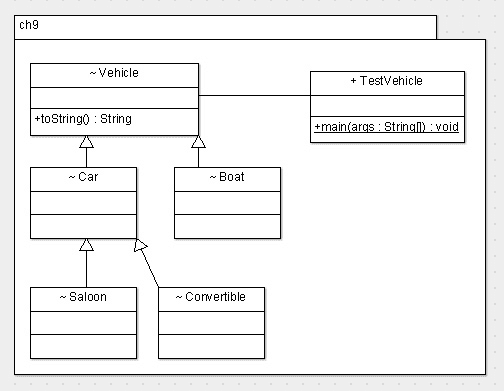

图 9.1 – 车辆层次结构的 UML 图

统一建模语言 (UML)

UML 是一种在软件设计中使用的建模语言，它利用了“一图胜千言”的原则。UML 使得理解诸如继承等主题变得非常直接，因此在这里我们将简要介绍 UML。更多详细信息请参阅：[`en.wikipedia.org/wiki/Unified_Modeling_Language`](https://en.wikipedia.org/wiki/Unified_Modeling_Language)。

在考虑 *图 9.1* 的基础上，以下是所使用的符号概述：

+   *包名*：包名位于左上角 (`ch9`)

+   *类*：类在有三个部分的框中，顶部框是类名；中间框用于实例/类变量；底部框用于方法

+   *访问修饰符*：`public` (+), `private` (-), 包私有 (~), 和 `protected` (#)

+   *静态*：下划线用于表示成员是 `static`

+   *方法返回类型*：UML 中方法签名中的最后一部分

+   *类继承*：带有实线的箭头；例如，`Car` 从 `Vehicle` 继承

+   *接口*：这些在带有虚线的框中表示 (*第十章*)

+   *接口继承*：带有虚线的箭头 (*第十章*)

+   *关联*：一条实线；例如，`TestVehicle` 与 `Vehicle` 相关联的简单原因是我们将在 `main()` 函数中基于 `Vehicle` 层次创建对象。

如 *图 9.1* 所示，我们有一个包，即 `ch9`。在 `Vehicle` 层次结构中有五个类：`Vehicle`、`Car`、`Saloon`、`Convertible` 和 `Boat`。在这个层次结构中，从基类角度来看，`Vehicle` 是 `Car` 和 `Boat` 的基类；而 `Car` 是 `Saloon` 和 `Convertible` 的基类。从子类角度来看，`Car` 和 `Boat` 是 `Vehicle` 的子类，而 `Saloon` 和 `Convertible` 是 `Car` 的子类。无论使用哪种视角，每个 `Car` 都是 `Vehicle` 的“是”，每个 `Boat` 也是 `Vehicle` 的“是”。此外，每个 `Saloon` 是 `Car` 的“是”，每个 `Convertible` 也是 `Car` 的“是”。

这也意味着，因为`Saloon`是`Car`的一种，而`Car`又是`Vehicle`的一种，所以`Saloon`也是`Vehicle`的一种。同样的情况也适用于`Convertible`；换句话说，`Convertible`是`Car`的一种，`Car`是`Vehicle`的一种；因此，`Convertible`也是`Vehicle`的一种。

然而，“是一个”的关系只在一个方向上起作用（从底部向上读取图）。例如，虽然*每个*`Car`都是`Vehicle`的一种，但*不是*每个`Vehicle`都是`Car`的一种；有些是`Boat`。这有一个非常好的原因，我们将在讨论向上转型和向下转型时进一步探讨。

在`Vehicle`类中有一个方法，即`toString()`，因为它被声明为`public`，所以被所有子类型继承；也就是说，`Car`、`Saloon`、`Convertible`和`Boat`。因此，`Vehicle`中的`toString()`版本在整个层次结构中都是可用的。最后，其他类`TestVehicle`包含`main()`方法，这样我们就可以测试这个层次结构。

现在我们已经理解了继承的概念，让我们在代码中应用它。

# 应用继承

如我们在上一节所学，继承创建了一个“是一个”的关系层次结构。这使得基类的功能可以被继承，因此对子类可用，而无需额外的编码。Java 在应用继承时使用两个关键字：`extends`和`implements`。现在让我们来讨论它们。

## extends

这是用于类和接口的原理关键字。关于类，我们声明`class Sub extends Base {}`。在这种情况下，`Base`类中所有非`private`成员都将被继承到`Sub`类中。请注意，`private`成员和构造函数不会被继承——这是有道理的，因为`private`成员和构造函数都是类特定的。此外，Java 禁止多重类继承。这意味着你一次不能从一个以上的类中扩展。关于接口，我们声明`interface ChildInt extends ParentInt {}`。

## implements

虽然我们将在*第十章*中详细讨论接口，但在这里简要概述是合适的。接口是一种结构，它使 Java 能够确保如果一个类实现了接口，那么这个类实际上是在签署一份合同。这个合同通常表示，该类将为接口中的`abstract`方法提供代码。`abstract`方法，我们将在稍后详细讨论，是一种没有实现代码的方法；换句话说，没有花括号。

关于继承，与类不同，Java 允许接口一次扩展多个接口。例如，`interface C extends A, B {}`，其中`A`、`B`和`C`都是接口，这是可以的。请注意，截至 Java 8，接口中的`default`和`static`方法都有实现代码。

一个类使用 `class Dog implements Walkable` 语法实现接口。这样，`Walkable` 中的 `static` 和 `default` 方法对 `Dog` 可用。

现在，让我们看看继承的实际应用。*图 9*.*2* 展示了 *图 9*.*1* 中的 UML 图对应的 Java 代码：

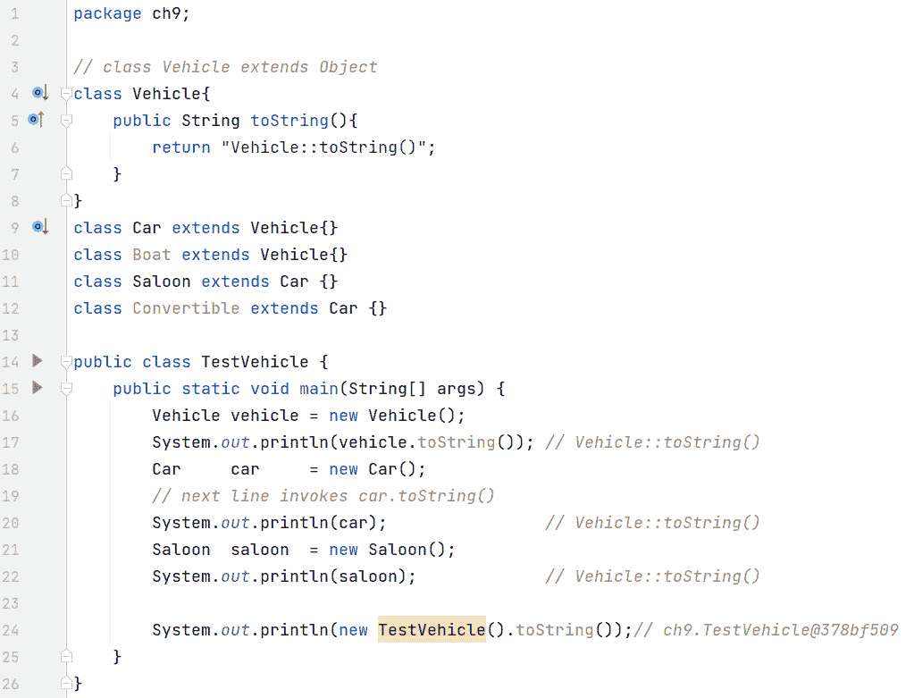

图 9.2 – 继承的实际应用

在这个图中，第 3 行和第 4 行是等效的。`Vehicle` 是这个特定层次结构的最顶层，为了确保每个类都继承自 `Object`，编译器在第 3 行简单地插入 `extends Object`。第 5-7 行是对从 `Object` 继承的 `toString()` 方法的自定义实现。这被称为 *重写*，我们将在稍后详细讨论这个话题。第 9-12 行代表了继承层次结构的其余部分：一个 `Car` 是一个 `Vehicle`；一个 `Boat` 是一个 `Vehicle`；一个 `Saloon` 是一个 `Car`；一个 `Convertible` 是一个 `Car`。

在第 16 行，我们创建了一个 `Vehicle` 对象，并使用一个名为 `vehicle` 的 `Vehicle` 引用来引用它。在第 17 行，我们调用定义在第 5-7 行的 `toString()` 方法，输出 `Vehicle::toString()`。

在第 18 行，我们创建了一个 `Car` 对象，并使用一个名为 `car` 的 `Car` 引用来引用它。在第 20 行，我们只需将 `car` 引用插入到 `System.out.println()` 中。当 Java 遇到这样的引用在 `System.out.println()` 内部时，它会查找对象类型（在这个例子中是 `Car`）并调用其 `toString()` 方法。由于每个类都继承自 `Object`，而 `Object` 定义了一个基本的（不友好的）`toString()`，因此将存在一个 `toString()` 版本。然而，在这个层次结构中，`Vehicle` 用自己的自定义版本（第 5-7 行）替换了从 `Object` 继承的 `toString()`。这个来自 `Vehicle` 的自定义版本被 `Car` 继承。发生的情况是，Java 检查 `Car` 中是否定义了自定义的 `toString()`；由于没有定义，Java 然后检查其父类，即 `Vehicle`。如果 `Vehicle` 中没有 `toString()`，将使用来自 `Object` 的版本。由于 `toString()` 在 `Vehicle` 中定义，这是 `Car` 继承并用于第 20 行的版本。因此，输出再次是 `Vehicle::toString()`。

在第 21 行，我们创建了一个 `Saloon` 对象，并使用一个名为 `saloon` 的 `Saloon` 引用来引用它。同样，在第 22 行，我们只需将 `saloon` 引用插入到 `System.out.println()` 中。由于 `Saloon` 没有自定义的 `toString()`，其父类 `Car` 也没有自定义版本，因此使用从 `Vehicle` 继承的版本。这导致输出到屏幕的是 `Vehicle::toString()`。

第 24 行用于演示当使用`Object`类的`toString()`方法时的输出。在第 24 行，我们创建了一个`TestVehicle`的实例并调用其`toString()`方法。由于`TestVehicle`没有明确地从任何类继承（使用`extends`），它隐式地继承了`Object`。此外，由于`TestVehicle`没有用自己的自定义版本覆盖`toString()`，因此使用从`Object`继承的版本。这可以通过第 24 行的输出得到证明：`ch9.TestVehicle@378bf509`。`Object`中的`toString()`方法的输出格式为`package_name.class name@hash code`。在这个例子中，包名是`ch9`（第 1 行），类名是`TestVehicle`（第 24 行），而哈希码是一个用于散列集合的十六进制数（*第十三章*）。

现在我们已经看到了基本继承的作用，让我们继续探讨面向对象编程的另一个基石，即多态性。

# 探索多态性

多态性起源于希腊术语 poly（许多）和 morphe（形式）。任何通过一个以上的“is-a”测试的对象都可以被认为是多态的。因此，只有`Object`类型的对象不是多态的，因为任何类型都会通过`Object`和它自己的“is-a”测试。

在本节中，我们将讨论为什么将引用类型与对象类型分开是如此重要。此外，我们还将检查方法覆盖及其在启用多态性中的关键作用。

## 将引用类型与对象类型分开

现在我们有了继承层次结构，我们将经常区分引用类型和对象类型。引用类型可以是类、记录、枚举或接口。换句话说，我们在引用类型方面有灵活性。对象类型更为严格：对象类型仅基于非抽象类、记录和枚举。换句话说，我们不能基于抽象类或接口创建对象。

例如，给定*图 9.2*中的层次结构，以下说法是完全合法的：

```java
Vehicle v = new Car();
```

这是因为每个`Car`都是`Vehicle`的“is-a”类型（从右到左阅读，因为赋值是从右到左关联的）。在这个例子中，引用`v`是`Vehicle`类型，它指向一个`Car`类型的对象。这被称为*向上转型*，因为我们正在*向上*继承树（再次从右到左阅读，从`Car`向上到`Vehicle`）。我们正在向上转型`Car`引用，由`new Car()`创建，并将其转换为`Vehicle`引用`v`。

为什么这行得通？这行得通是因为，由于继承，`Vehicle`可用的所有可继承方法都将存在于`Car`中。这是一个保证。无论`Car`是否用其自定义的任何/所有`Vehicle`方法替换了这些方法，都是无关紧要的。鉴于编译器查看引用类型（而不是对象类型），我们可以使用`Vehicle`引用`v`调用的方法是在`Vehicle`（和`Object`）中定义的，并且将在`Car`（对象类型）中存在。

因此，这是需要记住的第一个要点——编译器始终查看引用类型。正如我们很快就会看到的，对象类型在运行时发挥作用。所以，一个简单但有效的经验法则是*一个引用可以指向其自身类型的对象或子类对象*。实际上，一个引用可以指向（UML）层次结构的“上方和下方”。

如果一个引用始终指向层次结构的“上方”，那么就会出现`ClassCastException`错误。为什么会出现这种情况呢？好吧，子类从其父类继承。除了替换继承的功能（重写）之外，子类还可以添加额外的方法。所以，如果你有一个子类类型的引用，你可以调用这些*额外*添加的方法。但是，如果你的对象是父类类型，这些方法将不存在！这对 JVM 来说是一个严重的问题，它会立即抛出一个异常（*第十一章*）。

因此，引用类型决定了可以调用对象的方法。此外，虽然引用类型不能改变，但它所指向的对象类型可以改变。

现在，让我们讨论如何利用多态性。

## 应用多态性

多态性仅适用于实例（非静态）方法，因为只有实例方法可以被重写。在编译时，编译器决定绑定哪个方法签名；然而，将提供实际要执行的方法的对象是在运行时决定的！这就是多态性的含义。这也是为什么多态性也被称为“运行时绑定”或“后期绑定”的原因。

如果你正在访问一个静态成员怎么办？

一个`static`成员（方法或数据）与类相关联，因此不涉及多态性。以下适用：如果你正在访问任何类型的数据（`static`或非静态）或`static`方法，JVM 使用引用类型。只有当它是实例方法时，才会使用对象类型（多态性）。

因此，为了使多态性起作用，我们需要在基类和子类中实现实例方法，其中子类重写了基类版本。为了实现这一点，子类必须编写一个与父类具有相同签名的函数。

好吧，理论就到这里为止——让我们看看一个例子，以巩固我们迄今为止所学的一切。

### 代码中的多态性——示例 1

*图 9.3*显示了以下代码的 UML 图：

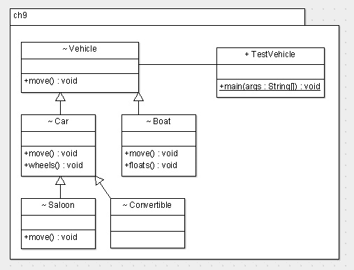

图 9.3 – 多态性的 UML 示例

在这个图中，`Vehicle`类有一个`move()`方法。它是一个实例方法，返回类型为`void`。`Car`和`Boat`都扩展了`Vehicle`并重写了`move()`方法。`Car`添加了一个名为`wheels()`的方法，而`Boat`添加了一个名为`floats()`的方法。`Saloon`和`Convertible`都扩展了`Car`。`Saloon`重写了`move()`方法，而`Convertible`没有。

*图 9**.4* 展示了此 UML 的代码，并展示了多态的实际应用：

`@Override`注释

注释是一种元数据形式，它提供了关于程序的信息，但这些信息本身并不包含在程序中。在 Java 中，注释由`@`符号开头，并且有多种用途。例如，注释被编译器用来检测错误，或者被运行时用来生成代码。

当重写基类方法时，我们可以在子类方法之前插入`@Override`注释。虽然这不是强制的，但它非常有用，因为如果我们应用这个注释，编译器将确保我们正确地重写了方法。

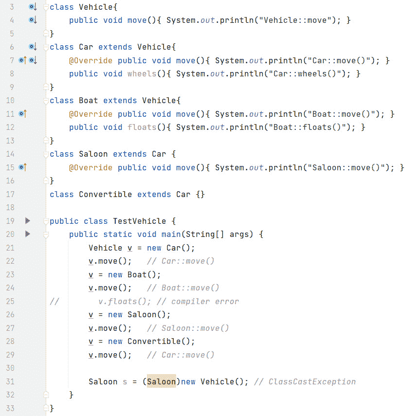

图 9.4 – 多态示例

在这个图中，`Car`和`Boat`都扩展了`Vehicle`；`Saloon`和`Convertible`都扩展了`Car`。请注意，`Vehicle`中的`move()`方法（第 4 行）是一个非静态/实例方法，因此是多态的。此外，由于`move()`不是`private`的，它是可继承的。`Vehicle`中的`move()`方法被`Car`（第 7 行）、`Boat`（第 11 行）和`Saloon`（第 15 行）重写。为了强调这一点，我们在这些行的每一行都使用了`@Override`注释。这意味着父类`move()`方法被相应的子类版本重写。

第 21 行创建了一个`Car`对象，并使用一个`Vehicle`引用，即`v`，来引用它。值得重复的是，这种从`Car`到`Vehicle`的上转型，仅因为通过继承，*每个* `Car` 都是 `Vehicle` 的子类。因此，任何对`Vehicle`引用可用的方法都将存在于`Car`中。因此，由于上转型从不构成风险，编译器会隐式地执行它；换句话说，你不需要在代码中显式地声明（上）转型，如下所示：

```java
Vehicle v = (Vehicle) new Car();
```

#### 编译时

第 22 行调用了多态的`v.move()`方法。每次在代码中进行方法调用时，都需要考虑两个视角：编译时和运行时。正如我们所知，编译器关注的是引用类型。因此，在这种情况下，编译器检查引用`v`，并确定它是`Vehicle`类型。然后编译器检查在`Vehicle`类中是否存在具有该确切签名的`move()`方法，无论是定义在`Vehicle`中还是从`Object`（在这个例子中）继承到`Vehicle`中。由于在`Vehicle`中定义了`move()`方法，编译器对此感到满意。

#### 多态的实际应用

在运行时，由于`move()`是一个非静态的多态方法，被引用的对象，即`v`，适用。由于`v`指的是一个`Car`对象，所以执行了`Car`版本的`move()`。这是多态的实际应用！我们有一个方法，但有很多这个方法的实现。编译器确保方法存在，并在运行时动态地触发多态，并执行被引用对象中的版本。由于`v`指的是一个`Car`对象，所以第 22 行的输出结果是`Car::move()`。

第 23 行重复使用了`Vehicle`引用，`v`（这是完全有效的），来指代一个`Boat`对象。因为`Boat`是`Vehicle`的一种（即“is-a”关系），所以这是可以的。第 24 行对`v.move()`进行了与第 22 行相同的多态调用。然而，这次`v`指的是一个`Boat`对象，并且由于`Boat`重写了`move()`方法，所以在运行时执行了`Boat`版本的`move()`。因此，输出结果是`Boat::move()`。

第 25 行展示了编译器查看引用类型。正如我们所知，`v`的类型是`Vehicle`。然而，`Vehicle`没有`floats()`方法；这是一个特定于`Boat`的方法。因此，编译器在第 25 行对`v.floats()`提出了抱怨，所以这一行被注释掉了。

第 26 行重复使用了`Vehicle`引用，`v`，来指代一个`Saloon`对象。因为`Saloon`是`Vehicle`的一种（即“is-a”关系），所以这是可以的。第 27 行对`v.move()`进行了相同的多态调用，就像第 22 行和第 24 行的情况一样。由于`v`现在指的是一个具有重写`move()`方法的`Saloon`对象，所以在运行时以多态方式执行了`Saloon`版本的`move()`。因此，输出结果是`Saloon::move()`。

第 28 行创建了一个`Convertible`对象，并使用`v`来引用它。这没问题，因为`Convertible`是`Vehicle`的一种（通过`Car`间接）。换句话说，因为`Convertible`是`Vehicle`的一种，而`Vehicle`是`Car`的一种，所以`Convertible`也是`Car`的一种。第 29 行进行了相同的多态调用，即`v.move()`，就像第 22 行、第 24 行和第 27 行的情况一样。然而，需要注意的是，`Convertible`没有重写`move()`方法。`Convertible`有一个空的类体。因此，`Convertible`中的方法是从`Car`继承来的`move()`和`wheels()`方法，以及从`Object`继承来的方法，如`toString()`。所以，在运行时，当调用`v.move()`时，JVM 执行了`Car`中的`move()`版本，结果是`Car::move()`。你也可以这样理解：运行时在`Convertible`中查找`move()`，但没有找到；然后 JVM 检查其父类`Car`，并找到了一个，然后执行它。请注意，如果`Car`没有提供`move()`方法，它的父类`Vehicle`将会是下一个搜索的对象。所以，这是一个“逐级向上，一次一代”的有序搜索。

#### 为什么我们会得到`ClassCastException`错误？

第 31 行展示了向下转型和`ClassCastException`错误。异常将在*第十一章*中讨论，所以这里不会详细说明。向下转型将在本章后面更详细地讨论，但这个例子太好了，不容错过！让我们更详细地检查第 31 行：

```java
Saloon s = (Saloon) new Vehicle(); // ClassCastException
```

首先要注意的是，转型（`Saloon`）是必需的。编译器不会允许以下代码：

```java
Saloon s = new Vehicle(); // Compiler error
```

这是一个编译器错误，因为并非每个`Vehicle`都是`Saloon`类；有些是`Boat`。实际上，即使没有`Boat`类，这一行代码也无法编译。为什么？因为，从右向左阅读，你是在从`Vehicle`到`Saloon`的层次结构中向下移动。由于`Saloon`可能（实际上确实如此）有不在`Vehicle`类中的额外方法，这种情况必须被阻止。例如，`Saloon`引用`s`可以访问从`Car`继承来的`wheels()`方法，而`Vehicle`中没有这个方法。

现在，我们可以通过使用（向下）转型来覆盖编译器。这就是第 31 行使用`(Saloon)`转型的做法。实际上，通过插入转型并覆盖编译器错误，你是在告诉编译器：“让我继续，我知道我在做什么。”因此，代码在放置转型后可以编译。然而，在运行时，JVM 意识到它有一个指向继承树中`Vehicle`对象的`Saloon`引用。这是大忌，因为如果 JVM 允许`Saloon`引用`s`指向一个`Vehicle`对象，那么在随后的`s.wheels()`方法调用中会发生什么？记住，我们会看到一个没有这种方法的`Vehicle`对象！因此，JVM 生成一个`ClassCastException`错误。

让我们重构这段代码，从另一个角度展示多态性。

### 代码中的多态性 – 示例 2

*图 9.5*显示了从*图 9.4*重构的代码：

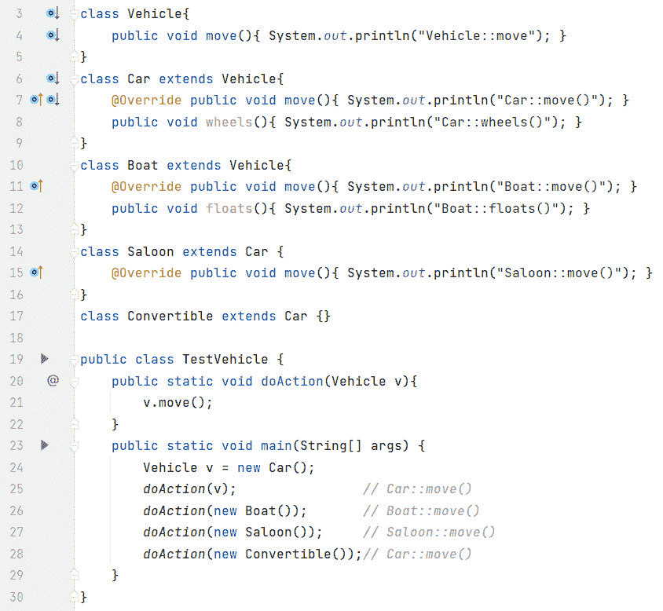

图 9.5 – 重构的多态性示例

注意，在这个图中，继承层次结构从*图 9.4*保持不变。`TestVehicle`类（第 19-30 行）已经被重构。我们引入了一个新方法，即`doAction()`（第 20-22 行），它接受一个`Vehicle`引用。在`doAction()`方法中，我们简单地调用`move()`方法（第 21 行）。由于`Vehicle`有一个`move()`方法，这是可以的。

第 24 行与之前相同；它创建了一个`Car`对象，并将引用向上转换为`Vehicle`引用`v`。因此，`v`引用了一个`Car`对象。第 25 行调用`doAction()`方法，传入引用`v`。这个在第 24 行声明的引用`v`被复制到另一个（不同的作用域）但名称相似的引用`v`，它在第 20 行声明。现在，在`doAction()`中，我们有一个局部`v`引用，它引用了第 24 行创建的同一个`Car`对象。因此，当我们第 21 行调用`v.move()`时，多态就起作用了，我们得到`Car`版本的`move()`，结果是`Car::move()`。

第 26 行在一行代码中做了与前面两行代码（第 24-25 行）相同的事情。在第 26 行，创建了`Boat`对象，对`doAction()`的方法调用导致向上转换为`Vehicle`引用`v`（第 20 行）。之后，第 21 行以多态方式执行，我们得到`Boat`版本的`move()`，结果是`Boat::move()`。

第 27 行与第 26 行相同，只是我们正在创建一个`Saloon`对象。因此，`doAction()`中的`Vehicle`引用`v`执行了`move()`方法作为`Saloon`，结果是`Saloon::move()`。

第 28 行与第 27 行相同，只是我们正在创建一个`Convertible`对象。因此，`doAction()`中的`Vehicle`引用`v`试图在`Convertible`中执行`move()`方法。由于没有找到，检查`Convertible`的父类，即`Car`。`Car`确实有一个`move()`版本，结果是`Car::move()`。

为了清楚地了解何时应用多态以及何时不应用，我们将重新审视之前提出的调用框。

## JVM – 引用类型与对象类型的使用

如前一个调用框中简要讨论的，如果你处理任何类型的数据（`static`或非静态），则应用引用类型；当处理实例方法时，应用对象类型（多态）。**图 9**.6 展示了代码示例：

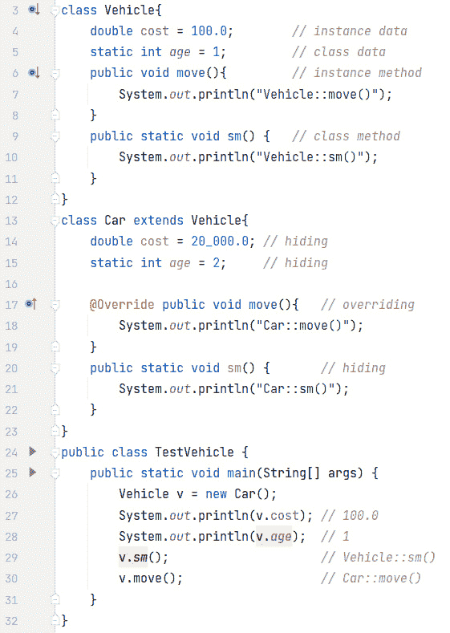

图 9.6 – JVM 使用引用类型与对象类型的情况

在这个图中，`Vehicle`类声明了一个实例变量，即`cost`（第 4 行），以及一个类变量，即`age`（第 5 行）。此外，`Vehicle`还声明了一个名为`move()`的实例方法（第 6-8 行）和一个名为`sm()`的类方法（第 9-11 行）。因此，在`Vehicle`中，我们既有实例和`static`数据，也有实例和`static`方法。

`Car`类从`Vehicle`扩展（第 13-23 行）并简单地复制`Vehicle`。换句话说，`Car`具有与父类`Vehicle`相同的数据和方法。

在`Car`中，我们分别声明了实例变量和非实例变量，即`cost`和`age`（第 14-15 行）。这些变量在`Car`中的类型和标识符与父类`Vehicle`中的对应变量相同。换句话说，`Vehicle`有一个名为`cost`的实例变量，它是一个`double`；`Car`也有一个名为`cost`的实例变量，它也是一个`double`。`Vehicle`中的`age`类变量也有相同的情况——`Car`子类中也有一个名为`age`的类变量。这被称为*隐藏*（或*遮蔽*）。

`Vehicle`定义了一个实例方法`move()`（第 6-8 行），它被`Car`中的版本（第 17-19 行）重写。由于这是一个实例方法，如果调用`move()`，则在运行时应用多态。

`Vehicle`还定义了一个名为`sm()`的类方法（第 9-11 行），它被`Car`中的`sm()`版本（第 20-22 行）隐藏（遮蔽）。

第 26 行创建了一个`Car`对象，并使用一个`Vehicle`引用`v`来引用它。

第 27 行输出`v.cost`。由于`cost`是数据（一个实例变量），引用类型适用。因此，我们得到`100.0`，这是`Vehicle`中的`cost`实例变量（而不是`20_000.0`，这是`Car`中的`cost`实例变量）。

在访问静态成员时使用类名

第 28 行和第 29 行展示了你应该*永远不要*使用的语法：使用引用来访问`static`成员。在访问`static`成员时，你应该在成员前加上类名。例如，第 28 行应该使用`Vehicle.age`，而第 29 行应该使用`Vehicle.sm()`，因为这强调了成员的`static`属性。在这里使用引用是令人困惑的，因为它暗示成员是非静态的。我们仅为了演示目的使用引用来访问`static`成员！

第 28 行输出`v.age`。由于`age`是一个`static`成员，编译器会检查`v`的类型（即`Vehicle`），并将`v.code`更改为`Vehicle.code`。因此，使用的是`Vehicle`中的`age`，而不是`Car`中的`age`。换句话说，输出是 1，而不是 2。

第 29 行是对`v.sm()`的调用。由于`sm()`也是`static`的，编译器将其转换为`Vehicle.sm()`，因此输出是`Vehicle::sm()`。

最后，第 30 行是对`move()`的多态调用，因此使用的是对象类型`Car`。这导致输出`Car::move()`。

现在我们已经理解了多态，让我们确保我们理解了两个经常被混淆的术语之间的区别，即方法重写和方法重载。

# 对比方法重写和方法重载

这两个术语经常被混淆，但在本节中，我们将比较和对比这两个术语。我们将展示，在方法重载的情况下，方法签名必须不同；而在方法重写的情况下，方法签名必须相同。回想一下，方法签名由方法名和参数类型组成，包括它们的顺序。返回类型和参数标识符不是方法签名的一部分。所以，例如，考虑*图 9**.5*中的方法：

```java
public static void doAction(Vehicle v){…}
```

签名为`doAction(Vehicle)`。

在这个前提下，我们将首先讨论方法重载。

## 方法重载

回想一下，方法签名由方法名和参数类型组成。方法重载是你有相同的方法名，但参数不同，无论是类型和/或顺序。这意味着即使方法名相同，方法签名也不同。它们必须这样，否则编译器如何选择绑定哪个方法？因此，方法重载完全是关于编译时间的。

### 规则

考虑到方法签名*必须不同*（除了方法名之外），规则相当简单：

+   重载方法必须使用*不同的*参数列表；要么使用的类型必须不同，要么类型的顺序必须不同

+   由于方法签名只与方法名和参数列表相关，重载方法可以更改返回类型和访问修饰符，并使用新的或更广泛的检查异常

+   重载方法可以在同一类型或子类型中进行重载

现在，让我们看看代码中方法重载的一个例子。

### 方法重载示例

*图 9**.7* 展示了示例代码：

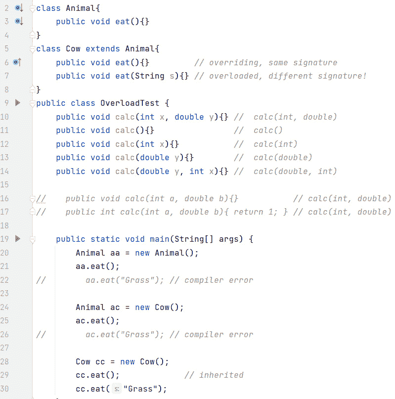

图 9.7 – 方法重载

在这个图中，我们将首先讨论第 10-17 行之间的方法重载。为了帮助理解，每行上的注释中都包含了方法签名。第 10 行定义了一个`calc`方法，该方法接受一个`int`和一个`double`类型的参数，顺序如下。因此，签名如下：

```java
calc(int, double)
```

我们对返回类型或用于`int`和`double`参数的标识符不感兴趣。只要我们不在同一个类中编码另一个`calc(int, double)`方法，我们就没问题。注意，如果我们在一个子类型中编码了一个具有相同签名的函数，这将是重写！由于第 11-14 行之间的方法签名不同，它们是可行的。

让我们分析为什么第 16 和 17 行无法编译。第 16 行试图只更改参数使用的标识符。这并没有改变方法签名。因此，这个签名与方法第 10 行的签名完全匹配，因此编译器会报错。同样，第 17 行更改了返回类型（以及参数列表中的标识符）。再次，由于这个签名与第 10 行的签名重复，编译器会报错。

继承层次结构很有趣。我们有一个父类`Animal`（第 2-4 行）和一个子类`Cow`（第 5-8 行）。在第 3 行，`Animal`定义了一个`eat()`方法。在第 7 行，`Cow`使用`eat(String)`方法重载了这个方法。父类`Animal`版本不接受任何参数，而子类版本接受`String`参数。编译器很高兴。

但第 6 行呢，`Cow`类定义了一个不接受任何参数的`eat()`方法？这是在覆盖父类版本（多态），所以没有冲突。编译器将绑定到使用的引用类型，无论是`Animal`还是`Cow`，因为两者都有一个`eat()`方法。在运行时，根据对象类型，JVM 将执行相关代码。

让我们检查这个过程以确保它清晰。第 20 行创建了一个`Animal`对象，并使用一个`Animal`引用`aa`来引用它。第 21 行调用`aa.eat()`。在编译时，编译器检查`Animal`类中是否有具有该确切签名的`eat()`方法，因为`Animal`是`aa`的类型。由于有，编译器很高兴。在运行时，由于方法是实例方法，多态适用，JVM 将执行`Animal`版本（因为这是对象类型）。

注意第 22 行为什么无法编译。这是因为`Animal`类中没有`eat(String)`方法。记住，编译器只查看引用类型，而`aa`的类型是`Animal`，它检查`Animal`类。

第 24-26 行进一步说明了问题。第 24 行创建了一个`Cow`对象，并使用一个名为`ac`的`Animal`引用来引用它。第 25 行进行了多态调用`eat()`，这将执行运行时的`Cow`版本。第 26 行很有趣，它存在是为了证明编译器正在查看引用类型。尽管我们的对象类型是`Cow`且`Cow`有一个`eat(String)`方法，但`ac.eat("Grass")`类仍然无法编译（因为`ac`的类型是`Animal`）。

那么，我们如何访问`eat(String)`方法呢？我们需要一个`Cow`引用。这正是第 28-30 行所展示的。第 30 行成功使用第 28 行声明的`cc`引用调用了`cc.eat("Grass")`。

这段代码展示的是，一个`Animal`引用只能访问它定义的`eat()`方法。另一方面，一个`Cow`引用可以访问`eat()`和`eat(String)`。`Cow`类型继承（并覆盖）了`eat()`并自己定义了`eat(String)`。注意，`Cow`类不需要覆盖`eat()`就能访问继承的版本。

## 方法覆盖

当你在父类和子类中都有相同的方法签名时，就会发生方法重写。方法重写对于启用（运行时）多态至关重要。记住，一个方法必须首先被继承才能被重写。例如，定义为`private`、`static`或`final`的方法不会被继承，因为`private`方法仅限于类内部；`static`方法不是多态的，将方法标记为`final`是声明“这个方法不应该被重写”。

要理解规则，关键是要记住编译器是根据引用来编译代码的。因此，运行时多态方法**必须**与编译器验证的行为一致。例如，重写方法上的访问修饰符不能更严格。

在我们讨论规则之前，我们必须首先解释协变返回。

### 协变返回

当你在子类中重写父类的方法时，如果返回类型是原始类型，那么重写方法的返回类型必须匹配。然而，如果返回类型是非原始类型，那么有一个例外：协变返回。

协变返回的含义是，如果你在父方法中返回类型`X`，那么你可以在重写方法中返回`X`及其任何子类型。例如，如果父方法返回`Animal`，那么重写方法可以返回`Animal`（自然地），以及`Animal`的任何子类型；例如，`Cow`。

### 规则

在我们讨论规则时，记住编译器是针对引用类型进行检查是有帮助的。这些重写规则确保运行时对象不能做编译器（以及你的代码）没有期望的事情。规则如下：

+   方法签名必须在父类和子类中完全匹配；否则，你只是在重载方法。

+   返回类型也必须匹配，除了协变返回。

+   重写方法上的访问修饰符不能更严格。所以，如果父方法将方法定义为`public`，子类不能使用`private`方法来重写它。这很有意义，因为你的代码，经过编译器的验证，期望可以访问该方法。然而，如果你被允许在重写时降低访问级别，编译器会说“可以访问这个方法”，而 JVM 则不会！这条规则有助于保持编译器和 JVM 同步。

+   再次强调，为了保持编译器和 JVM 同步，重写方法不能抛出（生成）新的或更广泛的已检查异常（*第十一章*）。简而言之，异常是一个错误，已检查异常必须有代码来处理它们。这是由编译器强制执行的。如果在运行时，重写方法抛出/生成了一个没有代码来处理的异常，JVM 就会遇到麻烦。因此，编译器介入并阻止这种情况发生。

现在，让我们看看代码中方法重写的一个例子。

### 方法重写示例

*图 9.8*展示了示例代码：

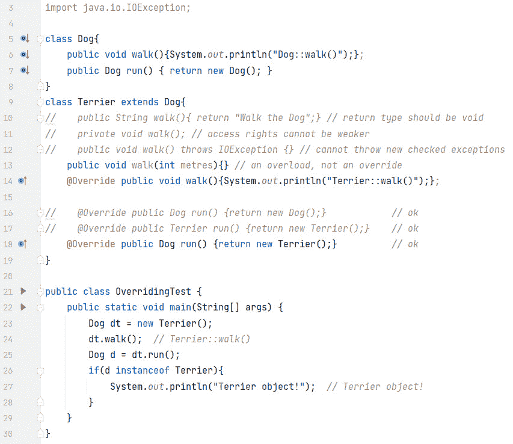

图 9.8 – 方法重写

该图中的代码演示了在重写方法时可以做什么和不能做什么。在`Dog`类（第 5-8 行）中，我们有一个返回无内容（`void`）的`walk()`方法。还有一个返回`Dog`的`run()`方法。

`Terrier`类从`Dog`类继承（第 9 行）。因此，任何`Terrier`都是`Dog`的子类。由于`Dog`中的两个方法都是`public`，`Terrier`自动继承它们。

让我们依次检查`Terrier`中的行。

第 10 行无法编译，因为虽然方法签名匹配（两者都是`walk()`），但返回类型不同。父类返回类型是`void`，因此，重写返回类型必须匹配；它不匹配，是`String`，导致编译器错误。

第 11 行无法编译，因为在重写时不能弱化访问修饰符。`Dog`中的`walk()`方法是`public`，所以`Terrier`中的`walk()`不能是`private`。*如果*这被允许，那么当 JVM 执行`Terrier`中的`walk()`方法时（如第 24 行所示），将会有严重问题。编译器查看`public`的`Dog`版本，会说“一切正常；”但 JVM 会多态地遇到`Terrier`中的`private`版本！

第 12 行无法编译，因为被重写的方法没有抛出任何异常，但重写的方法正在尝试抛出一个新的已检查异常（`IOException`）。这与之前的访问问题类似——编译器将检查`Dog`中的`walk()`版本，并且因为它没有抛出异常（错误），没有代码来处理（适应）这些异常。*如果*重写方法被允许抛出新的已检查异常，JVM 将如何处理它们（因为没有代码来处理它们）？

第 13 行只是一个重载。`Dog`定义了一个`walk()`方法；`Terrier`定义了一个`walk(int)`方法。两个不同的方法签名意味着两个不同的方法。由于方法具有相同的名称，这属于方法重载。

第 14 行是一个正确的方法重写。我们使用了`@Override`注解来确保我们已经正确地重写了（例如，没有打字错误）。

第 16 行是第 7 行定义的`run()`方法的精确复制。我们只是为了演示目的而包含它。

第 17 行展示了协变返回，因为它定义了`Terrier`返回类型。这是一个有效的协变返回，因为`Terrier`是父类返回类型`Dog`（第 7 行）的子类型。重写方法的代码（第 17 行）简单地返回一个`Terrier`对象。

第 18 行几乎与第 17 行相同，除了返回类型现在是`Dog`。因此，在后台发生了向上转型。第 18 行的`walk()`代码是以下代码的简写：

```java
Dog d = new Terrier():return d;
```

现在，让我们看看`OverridingTest`中的`main()`方法。

第 23 行创建了一个可以通过 `Dog` 引用 `dt` 访问的 `Terrier` 对象。第 24 行在 `Terrier` 中调用了多态的 `walk()` 方法。由于 `Terrier` 覆盖了从 `Dog` 继承的 `walk()` 方法，因此在运行时动态执行的是 `Terrier` 版本的 `walk()`，导致输出 `Terrier::walk()`。

第 25 行使用第 23 行创建的 `dt` 引用执行了 `run()` 方法。由于 `run()` 是一个实例方法，其中 `Terrier` 覆盖了从 `Dog` 继承的版本，因此执行的是 `Terrier` 中的版本，导致第 25 行的 `d` 引用指向一个 `Terrier` 对象（第 18 行）。这通过使用 `instanceof` 操作符（第 26 行）得到了证明。由于 `Dog` 引用 `d` 确实指向一个 `Terrier` 对象，因此 `if` 语句为 `true`，导致在屏幕上输出 *Terrier 对象*。

这就结束了我们对方法重载和方法覆盖的讨论。现在，让我们考察一个在继承中至关重要的关键字：`super`。

# 探索 `super` 关键字

`super` 关键字在子类中有两个特定的使用场景：调用父构造函数和访问父成员（通常是方法）。当对象被构造时，构造函数调用的顺序非常重要。考虑到我们现在有可能在继承层次结构中有许多类，*构造函数调用的顺序是从上到下的*。这意味着父构造函数总是先于子类构造函数被调用。如果你有一个 `Toyota` 是 `Car` 的子类，而 `Car` 又是 `Vehicle` 的子类，那么当你创建一个 `Toyota` 对象时，构造函数调用的顺序如下：首先调用 `Vehicle` 的构造函数，然后是 `Car`，最后是 `Toyota`。

这有一个很好的原因。首先，记住构造函数的作用是初始化类的实例成员。现在，考虑到子类构造函数在初始化自己的成员时可能会使用从其父类继承的成员，因此可以合理地认为父类必须首先有机会初始化这些成员。

让我们讨论 `super` 关键字经常被使用的情景。然后我们将展示代码，并辅以 UML 图形，以演示这两种上下文。

## super()

当你在 `super` 后面使用括号，如 `super()` 时，你是在调用父构造函数。如果需要，你可以在括号内传递参数，因为构造函数只是（特殊的）方法。使用 `super()` 有两个规则：

+   调用 `super()` 只能在构造函数内部出现，而不能在普通方法中

+   如果存在，`super()` 的调用必须是构造函数中的第一行（有一个例外——见注释）

我们已经编写了几个构造函数，但它们都没有包含对`super()`的调用。这是怎么工作的呢？好吧，如果你**没有**提供任何构造函数，编译器会为你生成默认构造函数，并且其第一行代码是`super();`。请参考图 8.1 和图 8.2 中的示例。如果你**提供**了构造函数，编译器也会插入`super();`作为第一行（除非第一行已经是`super()`或`this()`的调用）。

任何构造函数的第一行

任何构造函数的第一行必须是`this()`或`super()`。两者不能同时存在。对`this()`的调用是对同一类中另一个构造函数的调用。从继承层次的角度来看，这是一个横向调用。请记住，在子类构造函数之前必须调用父类构造函数。无论是否有`this()`，构造函数调用的顺序都是从上到下。现在，如果子类构造函数中存在`this()`调用，它只会延迟对`super()`的调用。在某个时刻，无论是显式还是隐式，对`super()`的调用都将执行。注意，与`super()`一样，对`this()`的调用可以包含参数。

因此，`super()`仅与构造函数相关，并且必须是代码的第一行（假设`this()`已经存在）。现在，让我们考察另一种情况。

## super.

要访问父成员（不是构造函数），你可以使用`super.`点符号语法。与`this`关键字一样，`super`关键字与实例相关，因此不能在`static`上下文中使用（`static`方法或`static`块）。这在你想要利用父功能时非常有用。例如，子类方法可以先调用其父版本，然后再执行自己的版本。这正是我们将通过示例来展示的。

因此，与其从子类构造函数中调用父类构造函数（这正是`super()`的作用），`super.`为我们提供了访问其他（非构造函数）成员的能力。

## 使用 super 的示例

让我们通过代码来考察`super()`和`super.`。图 9.9 展示了 UML 继承图：

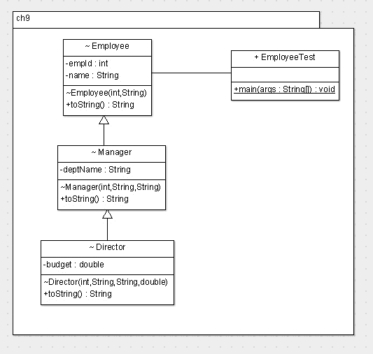

图 9.9 – 展示 super()和 super.的 UML 图

在这个图中，我们有三个类代表一个类继承层次结构。`Employee`位于层次结构的顶部。`Manager`“是”`Employee`，`Director`“是”`Manager`。间接地，`Director`“是”`Employee`。每个类都有其各自的构造函数将初始化的`private`实例变量。例如，`Employee`构造函数接受两个参数，`int`后跟`String`；这些参数将被用来初始化`Employee`实例变量，即`empId`（`int`）和`name`（`String`）。

`EmployeeTest`只是一个驱动程序，以确保代码按预期工作。让我们检查一下代码。*图 9**.10*是*图 9**.9*中 UML 的代码：

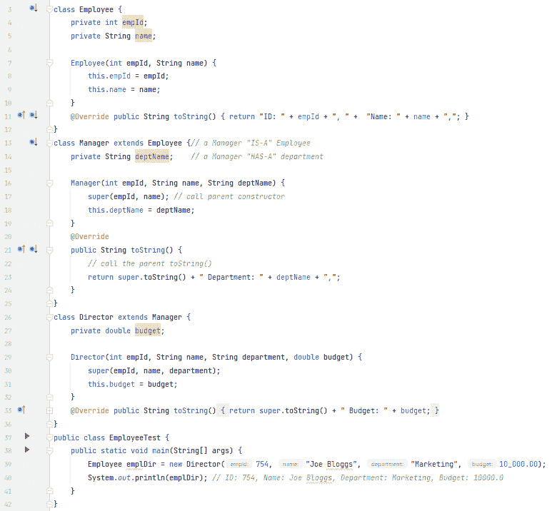

图 9.10 – 展示 super 的代码

在这个图中，`Employee`类初始化其实例变量（第 8-9 行）。`Employee`的`toString()`方法（第 11 行）返回一个`String`，概述了`empId`和`name`实例变量的值。第 11 行还使用了`@Override`注解，因为它正在重写从`Object`继承来的`toString()`方法。

`Manager`类“是”`Employee`（第 13 行）。`Manager`包含（由`String`实例变量组成）名为`deptName`的变量。这被称为组合。

组合与继承

组合定义了一个*“具有”*关系，而继承定义了一个*“是”*关系。组合是指一个对象由其他对象“组成”。例如，`Car`具有`Engine`。在*图 9**.10*中，`Manager`“是”`Employee`（第 13 行），但`Manager`“具有”一个部门，这由`String`实例变量`deptName`（第 14 行）表示。

`Manager`构造函数（第 16-19 行）是事情变得有趣的地方。第 17 行，`super(empId, name)`，是调用`Employee`中的父构造函数，传递了`Employee`构造函数所需的员工 ID（`empId`）和员工姓名（`name`）。这就是为什么`Manager`构造函数最初需要这些参数的原因——它需要员工 ID 和员工姓名，以便调用其父`Employee`构造函数。`Manager`构造函数还需要部门名称，以便初始化其自己的实例变量`deptName`。因此，当执行`Manager`构造函数时，首先执行`Employee`构造函数，然后执行`Manager`构造函数。

注意，如果第 17 行被注释掉，代码将无法编译。为什么？因为编译器现在将插入`super()`；它试图调用不带参数的`Employee`构造函数（即`no-args`构造函数，即`Employee()`）。在`Employee`中没有这样的构造函数。此外，由于`Employee`已经定义了一个构造函数，编译器将不会插入默认的（不带参数的）构造函数。

`Manager`类的`toString()`方法（第 21-24 行）覆盖了从`Employee`继承来的版本。然而，`Manager`仍然可以访问`Employee`的版本，它是通过在第 23 行使用`super.toString()`来实现的。因此，`Manager`中的`toString()`方法首先执行`Employee`中的`toString()`方法，该方法返回员工 ID 和员工姓名。然后，`Manager`类的`toString()`方法将它的自己的实例变量`deptName`追加到要返回的整体`String`中。

`Director` 类的行为与 `Manager` 类相似。构造函数“向上传递”（第 30 行）了 `Manager` 构造函数所需的数据；反过来，`Manager` 构造函数向上传递了 `Employee` 构造函数所需的数据。因此，在创建 `Director` 对象时，构造函数调用的顺序如下：首先 `Employee`，然后 `Manager`，最后 `Director`。在第 31 行，`Director` 初始化其自己的实例数据。

在第 33 行，`Director` 版本的 `toString()` 首先使用 `super.toString()` 调用 `Manager` 版本的 `toString()`。`Manager` 版本（第 23 行）然后调用 `Employee` 类的 `toString()` 方法，该方法在第 11 行。因此，员工的 ID 和姓名是字符串中的第一个员工详细信息。接下来，将经理数据（`deptName`）附加到字符串中（在调用 `Employee` 类的 `toString()` 方法返回之后）。最后，将 `Director` 数据（`budget`）附加到字符串中（在调用 `Manager` 类的 `toString()` 方法返回之后）。请注意，您不能绕过层次结构中的任何一级；这意味着不允许使用 `super.super.`。

`EmployeeTest` 是驱动类。在 `main()` 函数的第 39 行，我们创建了一个 `Director` 对象，该对象可以通过 `emplDir` 的 `Employee` 引用访问（隐式向上转型）。按照概述使用 `super()`，这将导致首先执行 `Employee` 构造函数，然后是 `Manager` 构造函数，最后执行 `Director` 构造函数。

第 40 行将 `emplDir` 引用传递给 `System.out.println()`，导致对 `Director` 类的 `toString()` 方法的多态调用。使用 `super.toString()`，`Director` 调用 `Manager` 类的 `toString()` 方法，该方法也有一个 `super.toString()` 方法，导致首先执行 `Employee` 的 `toString()` 方法。然后，`Manager` 类的 `toString()` 方法完成，最后，`Director` 类的 `toString()` 方法完成。输出显示如下：

```java
ID: 754, Name: Joe Bloggs, Department: Marketing, Budget:10000.0
```

关于输出，`ID: 754, Name: Joe Bloggs` 是从 `Employee toString()` 输出的，`Department: Marketing` 是从 `Department toString()` 输出的，而 `Budget: 10000.0` 是从 `Director toString()` 输出的。

这就结束了我们对 `super` 的讨论。现在，正如在 *第八章* 中所承诺的，我们已经理解了继承，让我们回到 `protected` 访问修饰符。

# 回顾 `protected` 访问修饰符

回想一下，一个`protected`成员可以从其自身包内以及包外的任何子类中访问：`protected = package + children`。表面上，这似乎非常简单。然而，一些细微差别会导致混淆。访问`protected`成员的子类（通过继承），只能以非常具体的方式进行。来自包外部的子类不能使用超类引用来访问`protected`成员！此外，来自包外部的无关类也不能使用对包外子类的引用来访问`protected`成员。实际上，一旦包外部的子类继承了`protected`成员，该成员对该子类（以及子类的子类）来说就变成了`private`。这相当棘手，确实需要举例说明。

## UML 图

*图 9.11*显示了此例的 UML 图：

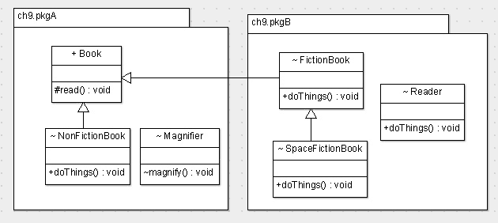

图 9.11 – “protected”代码的 UML

在这个图中，我们有两个包，即`ch9.pkgA`和`ch9.pkgB`。在`ch9.pkgA`中，我们有一个`Book`类及其子类`NonFictionBook`。`Book`中的`read()`方法用`#`符号标记，这意味着它是`protected`的。`Magnifier`类与`Book`无关，只是同一包中的另一个类。

在`ch9.pkgB`中，`FictionBook`从`ch9.pkgA`的`Book`类中继承，并提供了`doThings()`方法，我们将用它来演示允许和不允许的情况。此外，`SpaceFictionBook`从`FictionBook`继承，并覆盖了从`FictionBook`继承的`doThings()`方法。最后，`Reader`是一个完全独立的类，与`Book`层次结构无关；它的`doThings()`方法也是一个用于演示目的的示例方法。

回想一下上一章，我们没有完全完成访问修饰符表（因为我们当时还没有涉及继承）。*表 9.1*表示完成的访问修饰符表。请注意，该表表示在`Book`类中注释一个成员。

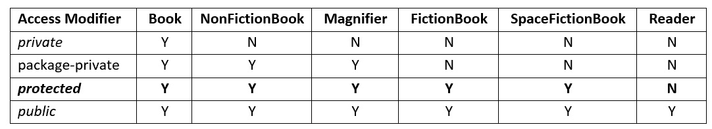

表 9.1 - 填充了“protected”行的访问修饰符表

检查`protected`行，我们现在可以看到，无论子类属于哪个包，都可以访问继承的受保护的成员。

现在，让我们依次检查每个包的代码。首先，我们将检查定义`protected`成员的包。

## 包含受保护成员的包

*图 9.12*显示了来自*图 9.11*的第一个包`ch9.pkgA`的代码：

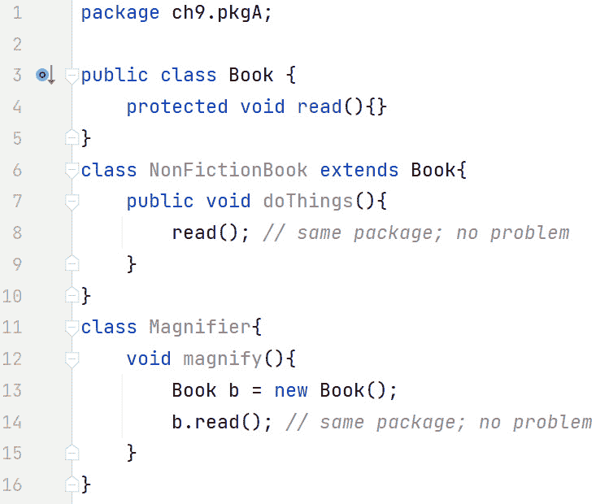

图 9.12 – 来自 UML 的“ch9.pkgA”代码

在这个图中，有一个名为`Book`的类（第 3-5 行），它定义了一个`protected`的`read()`方法（第 4 行）。`NonFictionBook`是`Book`的子类，并有自己的`doThings()`方法（第 7-9 行）。此外，还有一个与`Book`完全无关的类，即`Magnifier`。

首先要注意的是，由于`read()`方法是`protected`的，同一包中的其他代码可以访问它，即使代码不是子类。这由第 14 行演示，其中从完全无关的类`Magnifier`访问了`Book`中的`read()`方法。

当然，无论包是什么，子类都可以访问`protected`成员。这在第 8 行显示，其中`NonFictionBook`子类调用了`read()`。记住，第 8 行实际上是`this.read()`。所以，无论使用哪个`NonFictionBook`对象在第 7 行调用`doThings()`，都会用来在第 4 行调用继承的（并且是`protected`的）`read()`方法。

有趣的代码在另一个包中，即`ch9.pkgB`。现在让我们检查一下。

## 另一个包

*图 9**.13* 展示了代码：

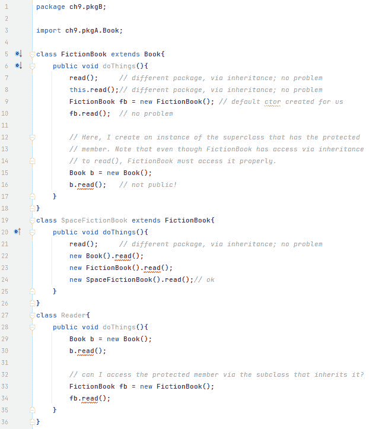

图 9.13 – 来自 UML 的“ch9.pkgB”代码

在这个图中，我们可以看到`FictionBook`“是”`Book`（第 5 行），而`SpaceFictionBook`“是”`FictionBook`（第 19 行）。为了使这个层次结构成为可能，`Book`类需要从另一个包中导入（第 3 行）。我们之所以能够从另一个包中导入`Book`，是因为`Book`是一个`public`类。此外，还有一个完全无关的类叫做`Reader`（第 27-36 行）。

现在，让我们来点有趣的！让我们检查一下`FictionBook`中的`dothings()`方法（第 6-17 行）。第 7 行和第 8 行实际上是等价的，显示了当子类在包外部使用*直接继承*时，可以访问`protected`成员。

第 9-10 行也显示，当在包外部的子类内部时，如果你创建该特定子类的实例（在这个例子中是`FictionBook`），那么一切正常。这很有道理，因为用于调用`read()`而不出问题的两个引用，即`this`和`fb`，都是`FictionBook`类型，代码就在那里。

注意第 15 行，我们实例化了一个`Book`对象，它可以编译，因为`Book`类（**图 9**.12，第 3 行）是`public`的。`Book`类没有定义构造函数，因此为我们创建了一个默认构造函数。这个默认构造函数具有与类相同的访问权限，即`public`，因此我们可以从不同的包中调用构造函数。

第 16 行无法编译，非常有趣。当在包外部的子类内部时，你不能使用超类引用来访问`protected`成员——即使`protected`成员位于那个超类中！记住，一旦超出包，`protected`成员对子类（及其子类）来说就变成了`private`。换句话说，你必须非常具体地使用继承。

`SpaceFictionBook` (第 19-26 行) 显示，包外子类的子类可以访问权限。第 21 行与第 7 行相同，只是它们位于两个不同的类中。当这一行编译时，它证明了包外子类的子类可以访问基类中的`protected`成员。

第 22 行和第 23 行都无法编译。第 22 行试图通过`Book`引用访问`protected`成员，而第 23 行试图通过`FictionBook`引用访问它。两者都失败了。与第 24 行形成对比，它使用当前类的实例，即`SpaceFictionBook`，这是可行的。注意，第 24 行与第 21 行相似，因为在两种情况下都使用了`SpaceFictionBook`引用（因为第 21 行等价于`this.read()`）。此外，第 24 行与第 9-10 行非常相似。因此，当在包外的子类中，直接访问`protected`成员，就像第 7 行、第 21 行那样；或者使用当前子类的引用，就像第 10 行、第 24 行那样。

`Reader`类（第 27-36 行）与`Book`层次结构完全独立。第 30 行试图使用定义`protected`成员的类的引用来访问`protected`成员，即`Book`，并失败了。第 34 行试图使用继承`protected`成员的包外子类的引用来访问它，即`FictionBook`，也失败了。

所以`protected`有些棘手。当我们回顾先前的主题时，这是一个回顾`switch`的理想机会。更具体地说，讨论`switch`的模式匹配。

## `switch`的表达式模式匹配

正如从*第四章*中承诺的，现在我们理解了继承和多态，我们将重新审视`switch`。考虑到以下代码：

```java
public static void patternMatchingSwitch(Vehicle v) {    System.out.println(
        switch(v){
case Boat b -> "It's a Boat";
            case Train t -> "It's a Train";
            case Car c when c.getNumDoors() == 4  ->
                "Saloon "+ c.onRoad(); // custom Car method
            case Car c when c.getNumDoors() == 2  ->
               "Convertible: " + c.onRoad();
            case null, default -> "Invalid type";
        }
);
}
```

假设`Car`、`Boat`和`Train`都扩展自`Vehicle`，并且`Car`有一个自定义方法`onRoad()`。正如你所见，在这个`switch`表达式中，选择器表达式`v`可以是任何引用类型（`Boat`、`Train`、`Car`等等）。`case`标签展示了*类型模式和模式匹配*；例如，`Boat b`。

此外，`Car`的两个`case`标签都被称为*保护模式*。保护模式是位于`when`子句右侧的“保护器”上的`case`标签。保护器是一个条件表达式，其结果为真或假。注意使用自定义的`Car`方法`onRoad()`，以及不需要进行类型转换的事实，因为类型转换已经在后台为我们完成了（前提是我们处理的是`Car`）。

最后一个包含`default`的`case`标签确保了穷举性，从而让编译器满意。换句话说，所有可能的`Vehicle`都被考虑到了。注意，`null`也被用作一个有效的标签，以及`null`和`default`可以用逗号分隔。

现在，让我们考察两个特定关键字对继承的影响，即`abstract`和`final`。

# 解释`抽象`和`final`关键字

如我们所知，在编写方法时，我们可以应用访问修饰符关键字，即`private`、`protected`、`public`和包私有（没有关键字）。还有两个关键字在继承方面具有特殊意义：`abstract`和`final`。两者互为对立，这就是为什么它们不能同时应用于一个方法。现在让我们来讨论它们，从`abstract`开始。

## `抽象`关键字

`抽象`关键字应用于类和方法。虽然`抽象`类将在*第十章*中更详细地讨论，但我们也会在这里讨论它们（原因很快就会变得明显）。一个`抽象`方法没有实现（代码）。换句话说，方法签名，而不是跟随大括号`{}`，它代表实现，一个`抽象`方法签名只是简单地跟随一个分号。将方法标记为`抽象`意味着以下内容：

+   类必须也是`抽象`的

+   第一个具体（非`抽象`）子类必须为`抽象`方法提供实现

让我们更详细地讨论这个问题。当你将一个方法（或多个方法）标记为`抽象`时，你是在说这个方法没有实现代码。由于有“缺失”的部分，类本身也必须被标记为`抽象`。这告诉编译器该类是不完整的，因此，你不能基于一个`抽象`类实例化（创建）对象。换句话说，你不能在抽象类上执行`new`操作（尽管引用是完全可行的）。`抽象`方法（以及因此`抽象`类）的全部理由是让子类覆盖它们，在子类中提供“缺失”的实现代码。现在，如果直接子类没有为继承的`抽象`方法提供实现代码，那么该子类也必须是`抽象`的。因此，一个`抽象`类的第一个非`抽象`（具体）子类必须为`抽象`方法提供实现代码。*图 9**.14*展示了这些原则：

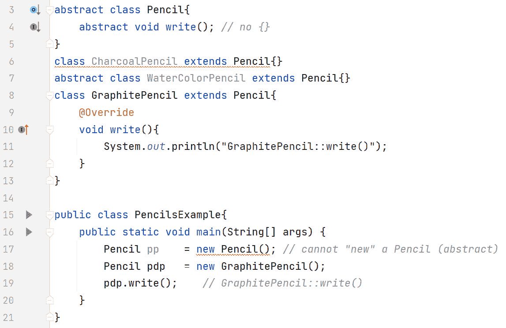

图 9.14 – “抽象”关键字的作用

在这个图中，我们在第 4 行有一个`抽象`方法，即`write()`。注意方法中没有花括号；我们只是在括号后立即有一个分号。由于`Pencil`类（第 3-5 行）包含一个`抽象`方法，因此该类本身也必须是`抽象`的；它确实是（第 3 行）。

在第 6 行，`CharcoalPencil`试图继承`Pencil`。但是因为（a）它没有为从`Pencil`继承的`抽象`方法`write()`提供实现，并且（b）`CharcoalPencil`本身不是`抽象`的，所以`CharcoalPencil`无法编译。

将第 6 行与第 7 行进行对比。正如我们所见，第 6 行无法编译。然而，第 7 行`WaterColorPencil`可以编译。为什么？因为`WaterColorPencil`是`abstract`的；它没有为`abstract`方法`write()`提供实现，这并不成问题。

抽象类不必有抽象方法

正如我们所知，如果你有 1（或更多）`abstract`方法，那么这个类必须是`abstract`的。然而，情况并非总是如此。换句话说，一个`abstract`类根本不必有任何`abstract`方法！注意，`WaterColorPencil`（*图 9*.14 中的第 7 行）是这样的一个类的例子。它是`abstract`的，但没有任何方法。这是可以的。这可能是设计决策，即使类只包含具体方法，你仍然希望这个类被用作引用类型而不是对象类型（因为你不能`new`它）。

`GraphitePencil`类（第 8-13 行）是一个具体、非抽象类。因为它`extends`了`abstract`类`Pencil`，它必须为`abstract`方法`write()`提供实现。这是在第 10 到 12 行完成的，我们使用`@Override`注解来强调这一点。

第 17 行演示了你不能实例化一个`abstract`类的对象。`Pencil pp`语句的引用部分是好的。问题是`new Pencil()`部分。

第 18 行显示了允许的情况。同样，我们再次使用`Pencil`引用，但这次我们引用的是一个`GraphitePencil`对象。`GraphitePencil`是一个具体类（第 8 行）。第 19 行多态地调用了`GraphitePencil`（第 10-12 行）提供的`write()`方法。假设第 6 行和第 17 行被注释掉（这样代码就可以编译），第 19 行输出`GraphitePencil::write()`。

现在我们已经理解了`abstract`方法和类，让我们来检查`final`关键字。

## `final`关键字

`final`关键字可以应用于各种上下文。继承是这里的主要焦点，但我们也将检查其他情况。我们将逐一检查它们，然后查看演示它们的代码。我们将从`final`方法开始。

### `final`方法

一个`final`方法不能在子类中被重写。这防止了子类的不当更改。我们可以通过`final`类进一步探讨这一点。

### `final`类

被标记为`final`的类不能用作基类。这意味着你不能从一个`final`类扩展。类中的所有方法都是隐式`final`的。Java 在其 API 中使用这一点来保证行为。例如，`String`类是`final`的，这样就没有人可以扩展它并提供自定义实现。因此，Java 总是知道字符串的行为。现在，我们将检查`final`方法参数。

### `final`方法参数

`final`方法参数是一个不能更改的参数。然而，请注意，根据参数类型，其语义可能会有细微差别。如果参数类型是原始类型，例如`int`，那么你不能更改`int`参数的值。

然而，如果相关的参数是一个引用（而不是原始类型），`final`应用于引用，因此，不能更改的是引用本身。换句话说，引用指向的对象是可修改的，但引用本身不是。这意味着，例如，如果方法接受一个`Dog`引用，即`dog`，那么使用`dog`引用，你可以改变对象的属性，例如`dog.setAge(10)`。然而，你不能将`dog`改为指向不同的对象，例如`dog = new Dog()`。

### final（常量）

常量是一个不能改变的值。使用大写字母作为常量的标识符是一种习惯，并且是良好的实践，每个单词之间用下划线分隔。这使得它们更加突出，开发者知道它们不能更改。Java API 中的一个例子是`Math`类（在自动导入的`java.lang`包中）的`*PI*`常量。它是`final`的，因此不能更改。为了提供方便的访问，`PI`也是`public`和`static`的。

现在，让我们通过一个代码示例来加强`final`的使用。*图 9**.15*展示了以下代码：

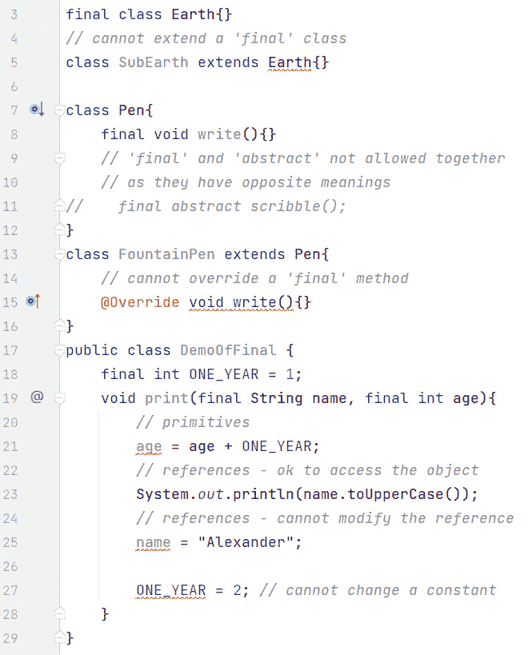

图 9.15 – “final”关键字的作用

在这个图中，我们有一个名为`Earth`的`final`类（第 3 行）。第 5 行通过编译器错误演示了你不能从一个`final`类扩展。

第 8 行在`Pen`类中定义了一个名为`write()`的`final`方法。因此，当尝试覆盖`write()`时，`FountainPen`类会遇到编译器错误（第 15 行）。

第 11 行显示你不能将一个方法同时标注为`abstract`和`final` – `abstract`意味着这个方法将在子类中被覆盖；`final`意味着这个方法不能被覆盖。

第 18 行声明了一个名为`ONE_YEAR`的常量，并将其设置为`1`。第 27 行尝试更改常量值 – 由于不允许这样做，编译器会报错。

`print()`方法（第 19-28 行）概述了`final`对方法参数的含义。方法参数（第 19 行）分别是`final String name`和`final int age`。`String`是一个非原始类型，因此`name`是一个引用。换句话说，`name`内部的价值是对象在堆上的内存位置（引用）。另一方面，`age`只是一个原始的`int`类型，其值是一个简单的整数，例如`1`。当你将`value`视为`final`时，很容易理解你可以和不能做什么。因此，如果`1`在`age`中，它不能被更改，`name`中的引用（地址）也不能更改。然而，`name`引用的对象可以被修改。

第 21 行是一个编译器错误，展示了`final`原始数据类型不能被更改。

第 23 行显示我们能够访问（如果需要的话可以修改）引用所指向的对象。请注意，在这个特定的例子中，因为`String`是不可变对象，所以`toUpperCase()`方法返回新的大写`String`，而不是改变原始的。我们将在*第十二章*中更多地讨论`String`。重要的是要注意，编译器对第 23 行没有问题。

第 25 行尝试将`String`引用`name`改为指向不同的`String`。由于引用是`final`的，编译器会报错。再一次，引用和对象的分离使得事情更容易理解。

到目前为止，我们知道如何创建（无限的）继承层次结构（使用`extends`）。我们还知道`final`禁用了继承。如果我们想要一个“中间地带”，在这个地带中我们可以根据某些类型定制我们的层次结构，那会是什么样子？这就是密封类所允许的。现在让我们来讨论它们。

# 应用密封类

密封类是在 Java 17 中引入的。我们在这里要讨论的内容与类相关，但同样的逻辑也适用于接口（*第十章*）。使用继承，你可以使用`extends`关键字从任何类（或接口）扩展，当然，前提是这个类不是`final`。

注意

接口不能是`final`的，因为它们的整个理由就是要被实现。

考虑以下场景：如果你希望你的类可以被继承，但仅限于某些类？换句话说，你想要限定允许的子类范围。到目前为止，使用`extends`关键字进行继承使得每个类都可以成为子类，而`final`关键字则阻止一个类有子类。

这就是密封类有用的地方——它们允许你指定允许哪些子类。只是为了重申，这也适用于接口，我们可以指定允许实现接口的类。

在我们看例子之前，有一些新的关键字我们需要理解。

## 密封和允许

这些关键字共同工作。为了声明一个类是密封的，你可以简单地指定它就是密封的，即`sealed`。然而，一旦你这样做了，你必须指定哪些类可以从这个类扩展。为此，你使用`permits`关键字，后面跟着用逗号分隔的类列表。

## 非密封

当你开始限定/限制一个层次结构时，在指定子类时必须使用某些关键字。参与密封层次结构的子类必须声明以下之一：

+   它也是密封的。这意味着我们还有进一步的限定要执行，因此我们必须在这个子类上使用`sealed`/`permits`配对来指定允许的子类。

+   这是层次结构中的`final`类（不允许有更多的子类）。

+   这结束了限定。实际上，你希望再次打开层次结构以进行扩展。为此，我们使用`non-sealed`关键字，因为`non-sealed`类可以被继承。

现在，让我们来看一个例子。

## 使用密封、允许和非密封的示例

*图 9.16*展示了我们将使用的代码示例的 UML 图：

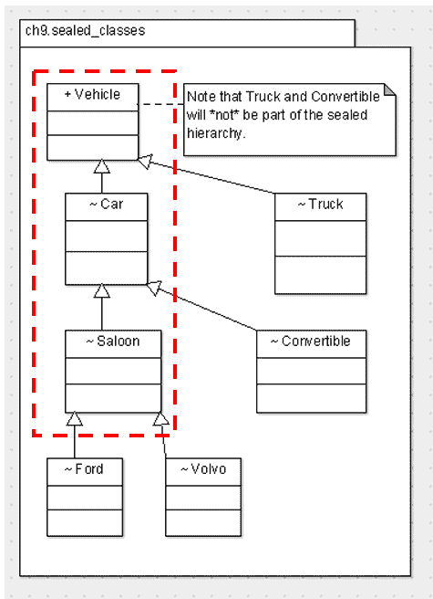

图 9.16 – “密封”类的 UML 图

在这个图中，我们有一个`Vehicle`层次结构。我们将要限制（密封）的部分是`Vehicle`、`Car`和`Saloon`类。因此，唯一可以成为`Vehicle`子类的类是`Car`；唯一可以成为`Car`子类的类是`Saloon`。请注意，尽管图表暗示`Truck`是`Vehicle`的子类，而`Convertible`是`Car`的子类，但在这个示例中，我们将通过代码防止这种情况发生。

代码的目标是确保我们感兴趣的`Vehicle`只有`Car`，我们感兴趣的`Car`只有`Saloon`。此外，所有`Saloon`（`Ford`和`Volvo`）都是感兴趣的。*图 9.17*展示了代码。

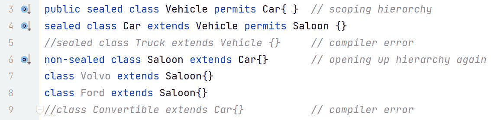

图 9.17 – “密封”代码

在前面的图中，第 3 行声明我们有一个名为`Vehicle`的密封类，并且允许的唯一子类（允许的）是`Car`。在此阶段，`Car`类必须存在；否则，编译器会报错。

第 4 行定义了一个名为`Car`的密封类，它是`Vehicle`的子类（由于第 3 行的原因，它必须这样做），并且允许的唯一子类是`Saloon`。请注意，当我们定义`Car`时，我们必须指定`Car`是`sealed`、`non-sealed`还是`final`。

第 5 行是尝试将`Truck`类作为`Vehicle`子类的`Truck`类。然而，由于我们已经将`Vehicle`密封，只允许`Car`作为子类，这会生成编译器错误。

第 6 行将`Saloon`定义为`Car`的子类（正如第 4 行所预期的）。在这种情况下，我们选择通过声明`Saloon`是`non-sealed`来打开层次结构以供进一步扩展（由任何类）。第 7 行和第 8 行通过允许`Volvo`和`Ford`分别从它扩展来展示`Saloon`是一个非密封类。

最后，在第 9 行，`Convertible`尝试将`Car`类作为子类。这不被允许，因为第 4 行声明，允许的`Car`类的唯一子类是`Saloon`。

现在让我们继续讨论实例和`static`块。

# 理解实例和静态块

如我们所知，在 Java 中，代码块由大括号`{}`界定，这些代码块没有不同。实例和`static`代码块的不同之处在于它们出现的*位置*，换句话说，它们的范围。这两个代码块都出现在每个方法之外，但出现在类内部。

我们将逐一讨论它们，然后通过代码示例来展示它们的工作原理。我们将从实例块开始。

## 实例块

实例块是一组大括号，它出现在任何方法之外但出现在类内部。假设一个类中存在实例块，每次创建对象（使用`new`）时，实例块都会被执行。请注意，实例块在构造函数之前执行。为了技术上的准确性，`super()`首先执行，这样父构造函数就有机会执行；然后是实例块，之后是构造函数的其余部分执行。使用“sic”（*s*uper, *i*nstance block, *c*onstructor）这个缩写可以帮助记住顺序。你可以认为编译器在调用`super()`之后将实例块插入到构造函数代码中。如果一个类中存在多个实例块，它们将按照出现的顺序执行，从上到下。

作为一个例子，实例块作为每个构造函数的一部分执行，因此是插入你希望每个构造函数都拥有的代码的理想位置。换句话说，所有构造函数中通用的代码应该放入实例块中。这样可以避免在构造函数之间重复代码。

正如我们所知，父构造函数必须在子构造函数之前执行。实例块也是如此。换句话说，父实例块必须在子实例块之前执行。我们将在代码示例中看到这一点。

## 静态块

`static`块是一组大括号，它由`static`关键字开头，出现在任何方法之外但出现在类内部。`static`块只执行一次，即在类第一次被加载时执行。这可能会发生在创建类的第一个对象或第一次访问`static`成员时。`static`块在实例块之前执行（因为我们必须在执行构造函数之前加载类文件/字节码）。一旦执行，由于类文件现在已加载到内存中，`static`块将不再执行。

与实例块类似，如果一个类中存在多个`static`块，它们将按照出现的顺序执行，从上到下。同样，如果涉及到继承，那么父`static`块将在子`static`块之前执行。

这一切都会在代码示例中变得更加清晰，我们将能够比较和对比继承层次结构中这两种类型的代码块。

*图 9.18* 展示了以下代码：

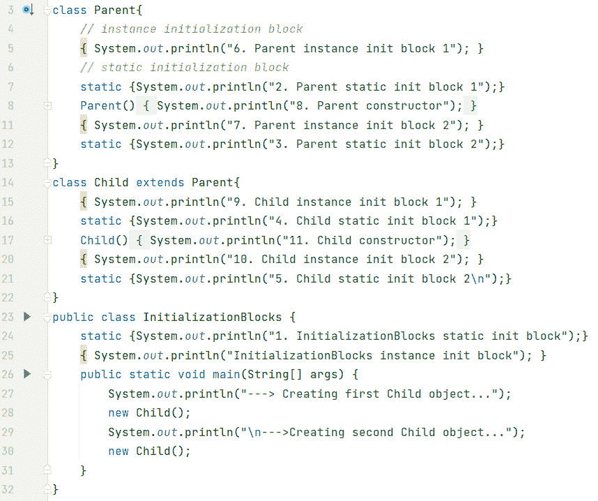

图 9.18 – 实例和“static”代码块示例

在这个图中，我们有一个名为`Parent`的父类和一个名为`Child`的子类（想出这些名字花了一些时间！）。这两个类都有两个实例初始化块、两个`static`初始化块和一个构造函数。请注意，`static`初始化块（第 7、12、16 和 21 行）都是简单地用`static`关键字前缀的代码块。同时，注意它们的位置/作用域——在方法之外但在类内部。实例初始化块（第 5、11、15 和 20 行）也是如此，只是实例块前面没有关键字。

主要驱动类`InitializationBlocks`也有一个`static`初始化块和一个实例初始化块（分别在第 24 和 25 行）。

这些块简单地输出跟踪消息，以便我们知道当前正在执行哪个代码块。跟踪消息用递增的数字标注，以便我们更容易地跟踪执行顺序。*图 9**.19*展示了*图 9**.18*中的代码输出：

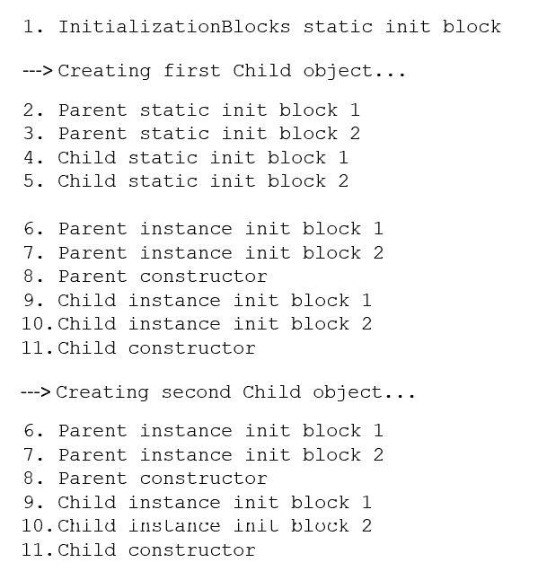

图 9.19 – 图 9.18 中的代码输出

注意

为了避免在*图 9**.19*中代表输出的数字与*图 9**.18*中的行号混淆，这里提到的所有数字都指的是*图 9**.19*中的输出数字。任何与*图 9**.18*相关的行号将明确标注为“行....”

所有 Java 程序都以`main()`方法开始。因此，JVM 必须使用`CLASSPATH`环境变量查找包含`main()`的`.class`文件，即`InitializationBlocks.class`。当 JVM 加载类时，如果类有父类，它会先加载父类。在这个例子中，因为`InitializationBlocks`不是一个子类，所以这不适用。然而，有一个`static`块，这给了我们第一条输出。注意，`InitializationBlocks`的实例块从未被执行。这是因为从未创建过`InitializationBlocks`的实例。换句话说，代码中没有`new` `InitializationBlocks()`。

第 27 行简单地输出了`"---> Creating first Child object…"`。值得注意的是，这不是屏幕上输出的第一行——`static`块的输出先于它。

第 28 行创建了一个`Child`对象。它的输出用数字 2-11 表示。由于这是第一次创建`Child`对象（因为在此之前没有访问`Child`中的任何`static`成员），所以会加载`Child`的类文件。在这个过程中，JVM 意识到`Child`是`Parent`的子类，因此它会先加载`Parent`类。因此，`Parent`中的`static`块会首先执行，按照出现的顺序（2 和 3）；然后是`Child`的`static`块，也按照出现的顺序（4 和 5）。

现在 `static` 块已经完成，实例块和构造函数将被执行。首先，按照出现的顺序执行超类 `Parent` 的实例块（6 和 7），然后是 `Parent` 构造函数（8）。然后，按照出现的顺序执行子类 `Child` 的实例块（9 和 10），然后是 `Child` 构造函数（11）。从简单的 `new Child()` 代码行来看，这需要大量的处理。

第 29 行简单地输出了 `"---> 创建第二个` `Child` 对象…"`。

第 30 行创建了另一个 `Child` 对象。由于类之前已经被加载，`Child` 及其超类 `Parent` 的 `static` 块已经运行。因此，它们不会再次运行。所以我们运行 `Parent` 实例块（6 和 7），然后是 `Parent` 构造函数（8）。然后，我们运行 `Child` 实例块（9 和 10），然后是 `Child` 构造函数（11）。

注意在创建 `Child` 对象时行号 6-11 的重复。`Parent` 实例块按顺序执行；然后是 `Parent` 构造函数。`Child` 实例块和构造函数以类似的方式执行。

这涵盖了 `static` 和实例初始化块。在我们结束关于继承的这一章之前，我们只想深入探讨一下我们之前提到的一个主题：向上转型和向下转型。

# 掌握向上转型和向下转型

之前，我们提到了为什么会出现 `ClassCastException` 错误。规则是，引用可以指向其自身类型的对象或子类的对象。实际上，引用可以指向继承层次结构中的任何位置，但不能向上。如果引用确实指向了继承层次结构的上方，你将得到一个 `ClassCastException` 错误。回想一下，这种情况发生的原因是子类引用可能具有任何超类对象都没有代码的额外方法。无论这种情况是否成立，*可能存在* 就足够了。

请记住，赋值是从右向左进行的；因此，在阅读涉及向上转型/向下转型的代码时，继承层次的方向也是从右向左。此外，请记住编译器始终在查看引用类型。

现在，让我们借助代码示例来讨论向上转型和向下转型。让我们从向上转型开始。

## 向上转型

使用向上转型，你将从更具体的类型“向上”到更通用的类型。例如，让我们看看以下代码行：

```java
Vehicle vc = new Car()
```

在这里，我们是从 `Car` *向上* 到 `Vehicle`。更具体类型（`Car`）在层次结构中更低，并且可能具有额外的功能。由于继承，父引用可以访问的方法，子类也会拥有。因此，任何对 `Vehicle` 引用 `vc` 可用的方法都将存在于 `Car` 对象中！因此，向上转型永远不会成为问题，不需要显式转换。

*图 9**.20* 展示了代码中的向上转型：

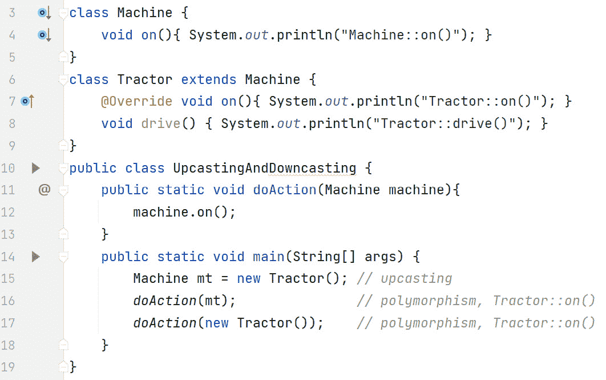

图 9.20 – 向上转型动作

在此图中，我们有一个名为`Machine`的类（第 3-5 行）和一个名为`Tractor`的子类（第 6-9 行）。`Tractor`中的`on()`方法（第 7 行）覆盖了`Machine`中的`on()`方法（第 4 行）。

第 15 行涉及隐式向上转型。从右到左阅读（因为赋值是从右到左的），我们是从`Tractor`“向上”到`Machine`。这是可能的，因为每个`Tractor`都是`Machine`的子类。因此，第 15 行产生一个指向`Tractor`对象的`Machine`引用。

第 16 行调用了`doAction()`方法，同时传入第 15 行创建的引用，即`mt`。这个`mt`引用被复制（记住 Java 是按值传递的）到第 11 行的`Machine`引用，即`machine`。因此，`main()`方法中的`mt`引用和`doAction()`方法中的`machine`引用都指向同一个对象，该对象是在第 15 行创建的。

在`doAction()`方法内部，我们使用`machine`引用调用`on()`方法（第 12 行）。由于`machine`引用的类型，即`Machine`，有一个`on()`方法，编译器很高兴。在运行时，`machine`引用到的对象，即`Tractor`，被使用。换句话说，`Tractor`中的`on()`方法被动态执行（多态）。

第 17 行在一行中完成了在第 15 行和第 16 行中编码的内容。在第 17 行调用`doAction()`时，向上转型如下：

```java
Machine machine = new Tractor()
```

`Machine`引用，即`machine`，由`doAction()`签名（第 11 行）提供，而`Tractor`实例的创建来自第 17 行。

第 16 行和第 17 行产生了相同的结果：`Tractor::on()`。现在，让我们讨论两个中较难的一个：向下转型。

## 向下转型

使用向下转型，你是在从更一般的类型“向下”到更具体的类型。例如，让我们看看以下代码行：

```java
Car cv = (Car) new Vehicle(),
```

从右到左阅读，我们是从`Vehicle` *向下* 到`Car`。同样，更具体的类型（`Car`）在层次结构中更低，可能还有额外的功能。编译器发现了这一点，并报错。我们可以通过插入一个（向下）转型，`(Car)`来覆盖编译器。这正是我们在这里所做的事情。然而，在运行时，这一行代码会导致`ClassCastException`错误。这是因为，在赋值语句的右侧，我们试图创建一个指向继承树中`Vehicle`对象的`Car`引用！

*图 9**.21* 展示了代码中的向下转型：

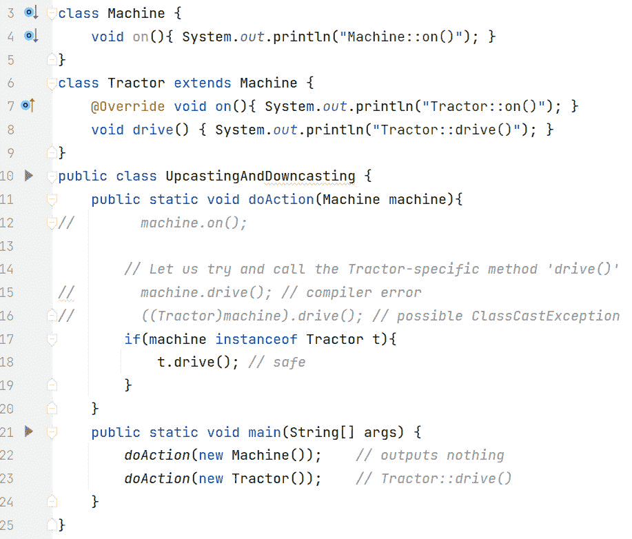

图 9.21 – 向下转型动作

此图中的代码与*图 9**.20*中的代码非常相似。继承层次结构是相同的。变化在于`doAction()`和`main()`方法。第 12 行正常工作，我们已将其注释掉以关注向下转型。

我们的目标，如第 14 行所述，是*安全地*调用`Tractor`对象的`drive()`方法。请注意，此方法仅针对`Tractor`。让我们一步一步地看看变化。

首先，由于`drive()`方法特指`Tractor`（而不是`Machine`），这意味着我们需要一个`Tractor`引用来使代码编译通过。第 15 行无法编译的事实证明了这一点——`machine`引用是`Machine`类型的，而`Machine`没有`drive()`方法。

第 16 行解决了第 15 行的编译错误。第 16 行可以编译，因为它在调用`drive()`方法之前将`machine`引用（向下）转换为`Tractor`引用。这就是为什么需要额外的括号——方法调用比类型转换有更高的优先级，所以我们通过使用括号来改变优先级顺序。如果没有额外的括号，我们将有`(Tractor)machine.drive()`，这不会编译（与第 15 行不编译的原因相同）。然而，额外的括号强制首先执行从`Machine`到`Tractor`的类型转换，因此编译器会在`Tractor`中查找`drive()`方法。

然而，我们仍然没有“走出困境”。是的，编译器很高兴，但 JVM 在运行时容易受到`ClassCastException`错误的攻击。如果取消注释第 16 行，那么第 22 行将在运行时引发`ClassCastException`错误。这是因为第 22 行传递了一个`Machine`对象，因此在`doAction()`方法内部，`machine`引用指向一个`Machine`对象。因此，在第 16 行，我们试图创建一个指向`Machine`对象的`Tractor`引用，这整天都是`ClassCastException`。

第 17 行使用了`instanceof`关键字，结合类型模式和模式匹配。只有当引用`machine`指向一个`Tractor`对象时，第 17 行才是真的；当它是时，后台会为我们完成类型转换，并将`t`初始化为指向`Tractor`对象。这就是为什么第 22 行没有输出任何内容——传递进来的`Machine`对象未能通过`instanceof`测试，因此第 18 行没有执行。然而，由于第 23 行传递了一个`Tractor`对象，它通过了`instanceof`测试。这意味着第 18 行被执行并输出了`Tractor::drive()`。

这完成了另一个非常重要的章节。现在，让我们应用我们所学到的知识！

# 练习

我们的公园充满了多样性，不仅包括恐龙的种类，还包括我们员工的角色。为了模拟这种多样性，我们将在我们的应用程序中引入继承的概念：

1.  并非所有恐龙都相同。有的小，有的大。有的食草，有的食肉。为不同类型的恐龙创建至少三个子类，这些子类继承自基类`Dinosaur`。

    如果你需要灵感，你可以从`Dinosaur`类创建一个`FlyingDinosaur`子类和一个`AquaticDinosaur`子类，每个子类都有其独特的属性。（这不是建模的最佳方式，但现在不用担心这个。）

1.  就像我们的恐龙一样，我们的员工也有不同的角色。有些是公园管理员，而有些是保安或兽医。为这些员工角色创建继承自`Employee`基类的子类。至少想出三个子类。

1.  继承不仅限于属性和方法。甚至某些方法的行为也可以在子类中进行自定义。在`Dinosaur`和`Employee`类（来自练习 1 和 2）及其子类中提供自定义的`toString()`方法实现，以显示每个对象的详细信息。

1.  此外，覆盖`Dinosaur`和`Employee`类中的`equals()`方法，以比较这些类的对象。

1.  创建一个名为`App`的类，其中包含一个`main`方法。在其中，添加功能以检查员工是否有资格在特定围栏工作，考虑到员工的角色和围栏的安全级别。

1.  公园提供普通门票和季票。创建一个扩展`Ticket`类的`SeasonTicket`类，并添加起始日期和结束日期等属性。

# 项目

你将开发一个更高级的中生代伊甸园公园管理控制台应用程序的版本。你的任务是实现多态概念来处理不同类型的恐龙和员工。通过引入多态，应用程序可以容纳更广泛的恐龙物种和员工角色。系统的主要功能现在应包括以下内容：

+   管理代表各种恐龙档案的能力，代表各种物种。

+   管理代表各种角色的不同类型的公园员工档案，例如公园管理员、清洁工、兽医等。

+   所有以前的功能，如编辑和删除档案、实时恐龙追踪、员工排班、客人登记和处理特殊事件，现在应适应这些新种类。

这里是你需要做的，如果需要的话，可以分解成更小的步骤：

1.  将`Dinosaur`和`Employee`类划分为不同的子类，以表示不同类型的恐龙和员工角色。确保这些子类展示了多态原则。

1.  `Dinosaur`和`Employee`对象，其中每个对象可以是任何子类的实例。

1.  **更新交互**：修改你的基于交互的控制台界面以处理新的恐龙和员工类型。你可能需要添加更多选项或子菜单。

1.  **增强菜单创建**：你的菜单现在应处理不同类型的恐龙和员工。确保每个选项对应程序中的特定功能。

1.  **处理操作**：每个菜单项应触发一个现在能够处理不同类型恐龙和员工的函数。例如，“管理恐龙”选项现在可以触发一个函数来添加、删除或编辑任何恐龙物种的档案。

1.  **退出程序**：确保程序继续为用户提供退出程序的选择。

起始代码片段将基本上与上一个相同。然而，在实现`manageDinosaurs()`、`manageEmployees()`和其他类似函数时，你需要处理不同类型的恐龙和员工：

```java
public void handleMenuChoice(int choice) {    switch (choice) {
        case 1:
            manageDinosaurs();  // This function now needs
              to handle different types of dinosaurs
            break;
        case 2:
            manageEmployees();  // This function now needs
               to handle different types of employees
            break;
        case 3:
            // manageTickets();
            break;
        case 4:
            // checkParkStatus();
            break;
        case 5:
            // handleSpecialEvents();
            break;
        case 6:
            System.out.println("Exiting...");
            System.exit(0);
    }
}
```

现在需要更新`manageDinosaurs()`、`manageEmployees()`、`manageTickets()`、`checkParkStatus()`和`handleSpecialEvents()`方法，以便能够处理增加的复杂性。

# 摘要

在本章中，我们探讨了面向对象编程的一个基石，即继承。继承定义了子类和父类之间的“是”关系——例如，`Fox`“是”`Animal`，`Train`“是”`Vehicle`。继承通过使可继承的基类成员自动对子类可用来促进代码重用。类继承是通过`extends`关键字启用的，接口继承是通过`implements`关键字启用的。

关于方法，子类可以自由地覆盖（替换）基类的实现。这就是我们如何启用面向对象编程的另一个基石，即多态性。

多态性是一种特性，其中对象实例的方法仅在运行时选择。因此，多态性的其他术语包括“后期绑定”、“运行时绑定”和“动态绑定”。为了使多态性工作，子类型中实例方法的签名必须与父方法匹配。该规则的唯一例外是协变返回，在覆盖方法中，允许使用父返回类型的子类型。与父版本相比，覆盖方法不得降低访问权限或添加额外的已检查异常。

另一方面，方法重载是指方法签名必须不同（除了匹配的方法名）。因此，参数的数量、它们的类型和/或它们的顺序必须不同。返回类型和参数名称不重要（因为它们不是方法签名的一部分）。方法重载可以在层次结构的任何级别发生。

使用继承时，引用类型和对象类型通常不同。由于赋值是从右到左工作的，当我们讨论向上转型和向下转型时，我们指的是沿着继承树“向上”或“向下”。向上转型总是安全的，因为子类型将始终通过超类型引用访问方法。然而，向下转型是不安全的，需要转型以使编译器满意。即使如此，如果你最终创建了一个指向继承树顶部的引用，你将在运行时得到`ClassCastException`错误。指向继承树顶部是不允许的，因为子类的引用类型可能有父类型对象没有代码的方法。

`super`关键字在两种情况下使用。第一种是使用`super()`访问父构造函数。这个调用仅允许在任何构造函数中的第一行进行。如果没有明确编码，编译器将插入`super()`以确保父构造函数在子类型构造函数之前执行。构造是从基类向下发生的，因为子类型可能依赖于父成员，因此父类必须有机会首先初始化它们。第二种情况是从子类型代码中访问父成员，使用`super.parentMember`。

我们从*第八章*中已经知道，`protected`访问修饰符确保成员在包内可用，并且对任何子类都可用，无论包如何。我们回顾了这一点，并证明了，当从一个不同包的子类访问`protected`成员时，你必须通过继承以非常具体的方式进行。

`abstract`方法是一种没有代码（实现）的方法。即使一个类本身不需要有任何`abstract`方法也可以是`abstract`的；一旦类中有一个`abstract`方法，该类就必须是`abstract`的。任何`abstract`类的子类都必须提供继承的`abstract`方法（们）的实现代码，或者该子类也必须是`abstract`的。

关于继承，`final`类不能被继承。`final`方法不能被重写。`final`的其他用途是定义常量并确保（方法参数的）值是常量。

封闭类的使用使我们能够将层次结构的一部分限制为某些类型。而不是通用的`extends`，它允许一个类从它想要的任何基类中子类化；并且没有完全关闭继承使用`final`；封闭类通过使用`sealed`、`non-sealed`和`permits`关键字实现自定义限制。

实例和`static`初始化块在方法外部但类内部编写。`static`块在带有`static`关键字的块之前。实例不使用任何关键字（实例语义是隐含的）。两者都允许在各个点进行初始化。静态初始化仅发生一次——当类首次被加载时。实例初始化每次调用构造函数时都会发生。因此，实例块是插入对所有构造函数都通用的代码的完美位置。

最后，我们深入探讨了向上转型和向下转型。这有助于加深我们对为什么向上转型不是问题、为什么向下转型需要转型以及为什么我们会得到`ClassCastException`错误的理解。此外，使用`instanceof`运算符确保我们防止`ClassCastException`错误发生。

这就完成了我们对继承的讨论——这是一个很大的章节！我们现在将转向接口和`abstract`类。
