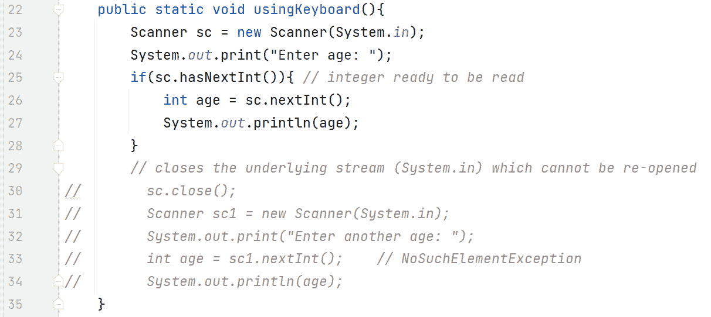
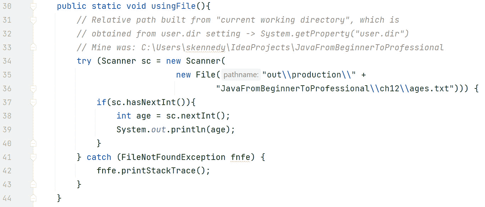

# 第十二章：Java 核心 API

在本章中，我们将更深入地探讨 Java API 中流行的类和接口。我们将从常用的 `Scanner` 类开始，该类常用于从键盘（用户）等来源扫描和解析文本。然后，我们将检查非常流行的 `String` 和 `StringBuilder` 类。我们将讨论它们之间的区别，这需要对比可变和不可变类型。我们还将向您展示如何设计不可变类型，并查看 `List` 接口及其流行的实现类 `ArrayList`。最后，我们将检查在 Java 8 中进行重写的 `Date` API。

关于本章涵盖的类型更详细的信息，请参阅 Java Docs API：[`docs.oracle.com/en/java/javase/21/docs/api/index.html`](https://docs.oracle.com/en/java/javase/21/docs/api/index.html)。

本章涵盖了以下主要主题：

+   理解 `Scanner` 类

+   比较 `String` 与 `StringBuilder`

+   设计不可变类型

+   检查 `List` 和 `ArrayList`

+   探索 `Date` API

# 技术要求

本章的代码可以在 GitHub 上找到：[`github.com/PacktPublishing/Learn-Java-with-Projects/tree/main/ch12`](https://github.com/PacktPublishing/Learn-Java-with-Projects/tree/main/ch12)。

# 理解 `Scanner` 类

`Scanner`（来自 `java.util` 包）是一个文本扫描器，可以使用正则表达式解析基本类型和字符串。正则表达式是一个允许字符串操作的模式。正如 Java API 中所明确指出的：“*Scanner 使用分隔符模式将其输入拆分为标记，默认情况下匹配空白。然后可以使用各种 *next 方法* 将这些标记转换为不同类型的值。*”

这些 `nextXXX()` 方法将输入流中的标记转换为基本类型。例如，如果用户输入了 `23`，则 `nextInt()` 会返回 `23` 的 `int` 值；如果用户输入了 `45.89`，则 `nextDouble()` 会返回 `45.89` 的 `double` 值。

然而，如果输入流中的标记不是整数并且调用了 `nextInt()`，则会抛出 `InputMismatchException` 错误。这可能会发生在用户输入 `"abc"` 并调用 `nextInt()` 的情况下。为了防止这种情况，每个 `nextXXX()` 方法都有一个相应的守护天使方法，即 `hasNextXXX()`。例如，`nextInt()` 有一个相应的 `hasNextInt()` 方法，`nextDouble()` 有一个相应的 `hasNextDouble()` 方法，依此类推。`hasNextXXX()` 方法都会预先查看输入流中的下一个标记（不消耗它）并检查该标记是否可以成功转换为所需类型。它们相应地返回 `true` 或 `false`。如果返回 `true`，则可以安全地使用相应的 `nextXXX()` 方法而不会引发异常。

*表 12.1* 展示了一些更重要的 `Scanner` 方法。请注意，我们只列出了一种 `hasNextXXX()` 方法，即 `hasNextDouble()`，以及其对应的 `nextXXX()` 方法，即 `nextDouble()`。所有以下类型都遵循相同的模式：`boolean`、`byte`、`float`、`int`、`long` 和 `short`：

| **方法名称** | **描述** |
| --- | --- |
| `Scanner(InputStream source)` | 创建一个 `Scanner` 类，它从指定的输入流中生成值 - 例如，键盘 |
| `Scanner(File source)` | 创建一个 `Scanner` 类，它从指定的文件中生成值 |
| `Scanner(String source)` | 创建一个 `Scanner` 类，它从指定的字符串中生成值 |
| `String next()` | 返回下一个标记 |
| `boolean hasNextDouble()` | 返回 `true` 当且仅当下一个标记是一个有效的 `double` 值 |
| `double nextDouble()` | 将下一个标记扫描为 `double` 值 |
| `String nextLine()` | 返回（行的剩余部分） |
| `Scanner` `useDelimiter(String pattern)` | 根据传递的参数设置 Scanner 的分隔模式 |

表 12.1 – “Scanner” API 方法示例

现在，让我们看看一些代码示例。

## 使用 Scanner 从键盘读取

标准输入流可以通过 `System.in` 访问。通常，这是键盘。在创建我们的 `Scanner` 时，我们必须将输入源（在这种情况下为 `System.in`）作为 `Scanner` 构造函数的参数传递。*图 12.1* 展示了一个示例：



图 12.1 – “Scanner” 从键盘获取输入

在这个图中，第 23 行我们创建了一个 `Scanner` 对象，通过将 `System.in` 传递给 `Scanner` 构造函数来引用键盘。第 24 行简单地提示用户输入年龄。第 25 行是守护天使方法，用于防止异常。如果输入的下一个标记是 `int` 类型，那么第 25 行的条件将为 `true`，我们就可以安全地在第 26 行执行 `nextInt()`。第 27 行回显在键盘上输入的整数。

关闭 Scanner 资源

关闭已经完成使用的资源是明智的，因为它可以防止资源泄漏。然而，围绕 `System.in` 包装的 `Scanner` 对象略有不同。实际上，如果我们关闭了一个围绕 `System.in` 包装的 `Scanner` 对象，我们将无法再次从标准输入读取。

这正是 *图 12.1* 中的第 30-34 行所展示的。如果我们关闭 `Scanner` 对象（第 30 行），即使第 31-34 行在本质上与第 23-27 行相同（除了 `hasNextInt()`），第 33 行将抛出异常。这是因为我们正在尝试访问一个已关闭的资源。

现在，让我们看看一个将进一步解释标记和分隔符的示例：


图 12.2 – 由空白分隔的 next()

在这个图中，我们使用`next()`尝试从输入流（键盘）中解析`Sean Kennedy`。然而，（默认）分隔符是空白字符，因此返回的是`Sean`。请注意，`Kennedy`仍然在输入流中。我们可以再次调用`next()`来消费额外的`Kennedy`标记。但是，有一个方法可以解决这个问题：`nextLine()`。*图 12.3*展示了`nextLine()`的作用：


图 12.3 – 由行尾分隔的 nextLine()

在这个图中，我们使用`nextLine()`，它使用不同的分隔符。与`next()`不同，它不是用空白字符分隔标记（如`next()`），而是用换行符分隔`nextLine()`。实际上，`nextLine()`读取一行文本，而`next()`读取单词。第 17 行通过输出`Sean Kennedy`来演示这一点。

`Scanner`可以重定向到其他输入源。其中一个源是文件。

## 使用 Scanner 从文件中读取

让我们看看如何将`Scanner`重定向到从文件中读取，而不是从键盘读取。*图 12.4*展示了这样一个例子：



图 12.4 – “Scanner”从文件中读取输入

在前面的图中，所涉及的文件（`ages.txt`）是一个简单的文本文件，包含数字`12`，后面跟着一个回车符。我们将`File`对象传递给`Scanner`构造函数（第 34-36 行）。传递给`File`构造函数的`String`对象（第 35-36 行）是一个相对路径。换句话说，它附加到当前工作目录（与包含从根目录的完整路径的绝对路径相对）。`String`中的`\\`是我们对反斜杠（`\`）进行转义的地方。Java 将`\\`内部转换为单个反斜杠。因此，`"out\\production"`变为`"out\production"`。`hasNextInt()`和`nextInt()`方法（第 37 和 38 行）与之前的工作方式相同。

由于我们使用了 try-with-resources，我们不需要记住显式关闭`Scanner`或`File`资源（它们会为我们隐式关闭）。

`Scanner`输入的另一个可能来源是`String`对象。现在让我们看看这一点。

## 使用 Scanner 从字符串中读取

使用`String`作为输入`Scanner`源也是可能的。*图 12.5*展示了这样一个例子：


图 12.5 – “Scanner”从字符串中读取输入

在这个图中，我们声明了一个`String`对象（第 14 行）并将其传递给`Scanner`构造函数（第 15 行）。然后我们将`useDelimiter(String)`方法链接到返回的`Scanner`对象。此方法接受`String`作为参数，并代表解析输入所需的正则表达式模式。双反斜杠，正如之前一样，只是简单地转义反斜杠。换句话说，`\\`变为`\`。

正则表达式 `\s*` 转换为 *0 个或多个空白字符*。`*` 代表 *0 个或多个*，`\s` 代表 *单个空白字符*。`delim` 字符串是硬编码的。这意味着输入标记由 0 个或多个空格、`delim` 标记以及 0 个或多个空格分隔。

当我们将此分隔符模式应用于给定的输入字符串（第 14 行）时，`next()` 返回的第一个标记是 `Maaike`。这是在第 16 行输出的。由于 `Maaike` 已经从输入流中消耗掉，第 17 行的 `next()` 方法调用返回 `van` 标记，然后输出。同样，第 18 行的 `next()` 方法返回 `Putten` 以供输出。最后，第 19 行使用 `nextInt()` 返回 22 作为 `int` 类型，然后输出到屏幕。

现在我们知道了如何从用户那里获取输入，让我们来介绍两个处理字符串的最重要类，即 `String` 和 `StringBuilder`。

# 比较 String 与 StringBuilder

当处理字符串时，这两个类是你的首选类。它们的主要区别在于 `String` 对象是不可变的，而 `StringBuilder` 对象是可变的。这意味着对于字符串，一旦创建了 `String` 对象，就不能再更改该对象。Java 可能会让你看起来改变了对象，但你并没有；一个新的对象，反映了你的更改，已经被创建。另一方面，`StringBuilder` 对象是可变的。这意味着你始终在处理一个对象。我们将在稍后的示例中深入探讨这一点。

为什么是不可变的？

从安全角度来说，不可变性很有吸引力，因为不可变对象不能被更改。此外，在多线程环境中，不可变对象是线程安全的。在多线程环境中，对（非不可变）对象的更改必须逐个同步，以防止更改相互干扰。不可变对象按照定义是受到保护的。参见*第十七章*（并发）中关于多线程的讨论。

目前，让我们从 `String` 类开始。

## 字符串类

`String` 类位于 `java.lang` 包中，表示字符序列。由于该类位于 `java.lang` 中，它将自动为你导入。`String` 类实现了 `Comparable` 接口，这意味着在排序字符串时定义了自然排序。这种排序是字母顺序。

正如所述，`String` 是一个不可变类型。一旦创建了 `String` 类型的对象，就不能对其进行修改。`String` 也是一个 `final` 类，这意味着你不能对其进行子类化。这是故意的——Java 设计者期望字符串以某种方式行为。如果我们被允许子类化 `String` 并覆盖其行为，可能会出现意外结果。因此，通过确保字符串行为的可预测性，将类设置为 `final` 防止了这种情况。

所有`String`字面量都是`String`类的实例。`String`字面量存储在堆的一个特殊区域，称为字符串池（或字符串常量池）。这被称为字符串的内部化。如果遇到具有相同字符序列的另一个字符串字面量，将重用字符串池中的字符串。这可以节省内存。然而，如果您使用`new`关键字来创建您的`String`对象，即使该对象在字符串池中可用，也会在堆的另一个部分创建一个新的具有字符序列的对象。换句话说，如果使用`new`，则忽略字符串池。

让我们通过代码示例以及一个内存图来查看一个示例。

### 字符串示例（代码）

*图 12.6* 表示以下代码：


图 12.6 – 代码中的“字符串”示例

在这个图中，第 5 行，我们使用`s1`字符串引用来引用`"abc"`字符串字面量。当 JVM 遇到字符串字面量时，它首先检查是否在字符串池中存在相同的字符串字面量。如果存在，它将重用池中的那个。由于第 5 行是第一次遇到`"abc"`，因此带有`"abc"`的`String`对象被插入到池中。请注意，字符串池只是堆中的一个特殊区域。

第 6 行是字符串池对象被重用的地方。现在，`s1`和`s2`都引用了同一个`String`对象（在池中）。这就是为什么第 7 行输出`true`的原因。回想一下，当使用`==`运算符与引用一起使用时，我们是在比较引用。换句话说，`s1`和`s2`是否都指向内存中的同一个对象？是的，它们是。

第 8 行使用`new`关键字创建一个`String`对象。一旦使用`new`，无论是否使用相同的字面量`"abc"`，都会在堆的另一个部分创建一个全新的对象。由于第 8 行创建了一个新对象，当我们第 9 行比较`s1`和`s3`时，结果是`false`。这是因为`s1`和`s3`引用了两个不同的对象。

`String`对象的`equals()`方法与等价运算符`==`操作不同。`equals()`不是比较引用，而是比较对象的内容。由于第 10 行返回`true`，这表明`s1`和`s2`引用的对象内容是相同的。这不应该令人惊讶，因为`s1`和`s2`都引用了同一个对象。

然而，第 11 行也返回`true`。尽管`s1`和`s3`引用了不同的对象，但这表明`equals()`比较的是对象的内容，而不是引用。

第 12 行很有趣。我们可以通过使用其`intern()`方法来内部化一个字符串。第 12 行所说的就是“将`s3`引用指向的内容在字符串池中内部化，并使`s3`引用指向字符串池对象。”第 13 行返回`true`，表明`s1`和`s3`现在都引用了同一个字符串对象。注意，第 13 行与之前返回`false`的第 9 行是相同的代码。

这里的图表肯定会很有帮助，所以让我们检查内存中发生了什么。

### String 示例（图表）

*图 12**.7* 表示了 *图 12**.6* 中的代码的内存表示：


图 12.7 – “String”在内存中的示例

如前图所示，`s1`和`s2`都指向字符串池中的`"abc"`对象。从`s3`发出的虚线代表由`new`关键字（第 8 行）创建的对象。因此，我们有两个独立的字符串对象：一个在堆上，一个在池中（池也是堆的一部分）。

从`s3`发出的实线代表第 12 行上 intern 操作的结果。现在，很容易看出为什么在第 12 行之后，`s1 == s3`返回`true`。

因此，当使用字符串时，如果您想比较内容，请使用`equals()`方法。请注意，`equals()`是区分大小写的。有一个方法，即`equalsIgnoreCase()`，它是不区分大小写的。

`String`对象的一个重要属性是它们是不可变的。现在让我们来讨论这一点。

### String 不可变性

如果您想创建不可变类型或希望获得 Java 认证，这个主题非常重要。我们将在稍后讨论如何创建自定义不可变类型。关于`String`类，它是不可变对象，而不是引用。这意味着您可以更改引用以指向不同的字符串，但不能更改字符串对象的内容。此外，请注意，所有“包装”类型，如`Integer`、`Double`、`Float`和`Character`，也都是不可变的。

让我们通过代码示例和相关的内存图表来查看。*图 12**.8* 表示了代码：


图 12.8 – “String”不可变性（代码）

在这个图表中，第 18 行使用`"The "`字面量创建了一个由`s`引用的`String`对象。由于这是一个字面量，对象进入字符串池。第 19 行使用`+=`运算符将`"quick "`追加到`s`。由于第 20 行输出`"The quick "`,您可能会认为由`s`引用的字符串对象已经改变。事实并非如此。由于`String`对象是不可变的，这是不允许的。发生的情况是创建了一个新的`String`对象，反映了所需的变化。因此，在第 20 行我们有三个`String`对象：两个字面量`"The "`和`"quick "`在字符串池中，新创建的`"The quick "`对象在堆上。

第 21 行是揭示性的。许多 `String` API 方法返回一个 `String`（引用）。由于 `String` 对象是不可变的，因此返回的这个 `String` 引用是到新创建的 `String` 对象的引用。这个对象在后台创建，反映了请求的更改。由于我们没有在第 21 行存储引用，因此这个对象对我们来说是丢失的，并且立即可以回收。当我们第 22 行输出 `s` 时，你可以看到它没有改变；其内容仍然是 `"The` `quick "`。

第 23 行显示了第 21 行应该做的事情。通过重新初始化 `s`，我们重定向了引用到新创建的对象。因此，当我们第 24 行输出 `s` 时，我们得到完整的字符串，即 `"The quick` `brown fox"`。

一个表示内存中发生情况的图表将有助于理解。*图 12.9* 表示 *图 12.8* 代码的内存表示：


图 12.9 – “String”不可变性（图表）

在前面的图中，虚线表示被覆盖的引用。我们总共有六个 `String` 对象 – 池中的三个字符串字面量以及使用 `+=` 操作符和 `concat()` 方法的三个构造的字符串对象。

注意到中间的字符串对象（在底部），没有引用指向它。它从未有过，因此没有虚线指向它。这就是第 21 行创建的对象，但由于引用从未分配给变量，它已经丢失了。

另一方面，第 23 行确实存储了新创建的字符串对象的引用。它覆盖了 `s` 引用中的内容。这就是为什么 `s` 指向 `"The quick` `brown fox"`。

当我们讨论 `StringBuilder` 时，我们将重新编写 *图 12.8* 中的代码。目前，我们将查看 `String` API 中更重要的方法。这些方法反映在 *表 12.2* 中：

| **方法名称** | **描述** |
| --- | --- |
| `char` `charAt(int index)` | 返回指定索引处的字符。索引范围从 0（与数组相同）到 `length()`-1。 |
| `int` `compareTo(String anotherString)` | 按字典顺序逐字符比较两个字符串。换句话说，`this.charAt(k)-anotherString.charAt(k)`。例如，`"ace"` 在 `"bat"` 之前，`"and"` 在 `"at"` 之前，以此类推。如果所有字符都匹配但两个字符串长度不同，则较短的字符串排在较长的字符串之前。例如，`"bat"` 在 `"battle"` 之前。让我们看一下：`"ace".compareTo("bat")` 返回 `-1`；`"and".compareTo("at")` 返回 `-6`；`"bat".compareTo("battle")` 返回 `-3` |
| `String` `concat(String str)` | 将参数字符串连接到这个字符串上。`"abc".concat("def")` 返回 `"abcdef"`。 |
| `boolean endsWith(String suffix)` | 此字符串是否以指定的后缀结束？因为它使用`equals(Object)`，所以它是区分大小写的。“abc.endsWith("bc")”返回`true`。“abc.endsWith("BC")”返回`false`。 |
| `int hashCode()` | 返回此字符串的哈希码。哈希码用于存储/检索用于基于哈希的集合（如`HashMap`）中的对象。 |
| `int indexOf(String str)` | 返回指定子字符串首次出现处的索引。它是区分大小写的，并且是重载的。“abcdef.indexOf("b")”返回`1`。“abcdef.indexOf("B")”返回`-1`。 |
| `int length()` | 返回字符串的长度。 |
| `String substring(int beginIndex)` | 返回此字符串的子字符串，从指定的`beginIndex`开始，并继续到字符串的末尾。索引从 0 开始。“abcdef.substring(3)”返回`"def"`。 |
| `String substring(int beginIndex, int endIndex)` | 返回此字符串的子字符串。子字符串从指定的`beginIndex`开始，延伸到`endIndex`-1 处的字符。索引从 0 开始。思考： “给我`endIndex-startIndex`个字符，从`startIndex`开始。” 例如，`"Sean Kennedy".substring(3,8)`意味着“给我 5 个字符，从索引 3 开始”，它返回`"n Ken"`。 |
| `String toLowerCase()``String toUpperCase()` | 分别将字符串转换为小写和大写。 |
| `String trim()` | `trim()`方法从字符串的两端删除空白字符 – 例如，`" lots of spaces here".trim()`返回`" lots of spaces here"` |

表 12.2 – “String”API 方法示例

现在，让我们将注意力转向`StringBuilder`类。

## `StringBuilder`类

`StringBuilder`类也在`java.lang`包中，表示一个可变的字符序列。`StringBuilder`的 API 与`StringBuffer`类相同。在单线程环境中使用`StringBuilder`，在多线程环境中使用`StringBuffer`。`StringBuilder`还实现了`Comparable`接口，其中定义的自然排序顺序也是字母顺序。

`StringBuilder`是一个可变类型。`StringBuilder`也是一个`final`类，这意味着你不能从它派生子类。再次强调，这是故意的，因为 Java 设计者希望确保`StringBuilder`对象的行为可预测。

如前所述，我们将重构*图 12**.8*，使用`StringBuilder`代替`String`。此外，我们还将绘制内存中的差异图。

### `StringBuilder`示例（代码）

*图 12**.10* 表示的代码：


图 12.10 – 代码中的“StringBuilder”示例

在这个图中，第 49 行创建了一个新的`StringBuilder`对象并将其初始化为`"The "`。第 50 行使用`append()`方法将`"quick "`追加到由`sb`引用的对象中。由于`StringBuilder`对象是可变的，我们可以忽略返回的引用（因为我们已经在`sb`中有了这个引用）。第 51 行输出了`"The quick "`，从而证明了（唯一的）`StringBuilder`对象已被更改。第 52 行将`"brown fox"`追加到`StringBuilder`对象中，第 53 行再次显示始终只有一个对象。

让我们看看*图 12.10**的内存表示。

### StringBuilder 示例（图表）

*图 12.11*代表了*图 12.10*中代码的内存表示：


图 12.11 – 内存中的“StringBuilder”示例

从这个图中可以看出，除了字符串池对象（因为它们是字符串字面量）之外，我们只有一个`StringBuilder`对象。每次我们调用`append()`时，那个可变的`StringBuilder`对象都会被更改。

让我们看看`StringBuilder`中更常用的 API 方法。*表 12.3*反映了这个 API：

| **方法名称** | **描述** |
| --- | --- |
| `StringBuilder` `append(String str)` | 将指定的字符串追加到`StringBuilder`。有可用的重载版本（见 API）。 |
| `char` `charAt(int index)` | 返回指定索引处的字符。索引范围从 0。 |
| `int` `indexOf(String str)` | 返回指定子字符串首次出现的索引。 |
| `StringBuilder insert(int offset,` `String str)` | 在指定的偏移量处将给定的字符串插入到`StringBuilder`对象中，并将该位置以上的任何字符向上移动。 |
| `String` `substring(int beginIndex)` | 返回一个新的字符串，从指定的`beginIndex`开始，直到此字符串构建器的末尾。索引从 0 开始。 |
| `String substring(int beginIndex,` `int endIndex)` | 返回一个新的字符串，从指定的`beginIndex`开始，并扩展到`endIndex-1`处的字符。索引从 0 开始。 |
| `String toString()` | 返回字符序列的字符串表示。 |

表 12.3 – 样本“StringBuilder”API 方法

正如我们所见，`String`和`StringBuilder`之间的主要区别在于`String`对象是不变的，而`StringBuilder`对象是可变的。让我们看看一个将有助于将这种差异清晰地聚焦的示例。

## String 与 StringBuilder 示例

我们将使用一个示例代码来演示这一点。此代码将帮助我们突出`String`对象的不变性和`StringBuilder`对象的可变性。作为额外的好处，因为我们使用了方法，所以代码将帮助我们复习按值传递的原则。**图 12.12**显示了代码：


图 12.12 – “String”与“StringBuilder”代码示例

在这个图中，在第 11 行，我们声明了一个指向`"Hi"`的`String`引用`s`和一个包含`"Hi"`的`StringBuilder`引用`sb`。在第 13 行，我们调用`whatHappens()`方法，分别传入`s`和`sb`。

由于 Java 使用按值调用，每个引用都会创建一个副本。因此，方法声明（第 4 行）中的`s`和`sb`引用分别指向第 11 行和第 12 行声明的相同对象。虽然不是必需的，但保持相同的标识符`s`和`sb`有助于强调这一点。

第 5 行然后将`" there!"`连接到由`s`引用的字符串。由于字符串是不可变的，该对象不能被更改，因此 JVM 创建了一个具有字符序列（字符串值）为`"Hi there!"`的新对象。第 7 行输出这个新字符串。

第 6 行将`" there!"`追加到`StringBuilder`对象。由于它是可变的，对象只是被修改。修改后，第 8 行输出`sb`。

在第 13 行的方法调用返回后，我们输出由`s`引用的字符串对象的值和由`sb`引用的字符串构建器对象的值。记住，因为我们传递了引用，并且由于按值调用，`whatHappens()`方法可以直接访问第 11 行和第 12 行在`main()`中声明的对象。然而，当我们输出字符串对象（第 14 行）时，我们看到它仍然是`"Hi"`，这证明了`String`对象是不可变的。另一方面，当我们输出`StringBuilder`对象时，它已变为`"Hi there!"`，这证明了`StringBuilder`对象的可变性。

这里有一个图表会有帮助。然而，为了使图表简单并专注于可变/不可变，省略了字符串池。*图 12*.*13*是*图 12*.*12*中代码的内存表示：


图 12.13 - 内存中的“String”与“StringBuilder”

此图表示我们即将离开`whatHappens()`方法（第 9 行）时的内存图片。虚线箭头是重要的箭头。当我们进入`whatHappens()`方法时，两个`s`引用都指向同一个`String`对象。第 5 行将局部`s`引用更改为指向新的`String`对象，而原始`String`对象保持未变（因为它是不可变的）。要注意的另一件事是`StringBuilder`对象已被修改（我们使用删除线来突出这一点）。

因此，在调用方法（第 13 行）后返回`main()`，`s`引用指向未更改的包含`"Hi"`的`String`对象，而`sb`引用指向已修改的包含`"Hi there!"`的`StringBuilder`对象。

关于不可变类型的讨论引出一个自然的问题，我如何创建一个自定义的不可变类型？这就是下一节的主题。

# 设计一个自定义的不可变类型

在 API 中，有可变类型，如 `StringBuilder` 和 `ArrayList`，以及不可变类型，如 `String` 和 `Integer`。当某物是“不可变”的时候，意味着它不能改变。我们可以使用 `final` 关键字来使原始类型不可变。当我们对引用应用 `final` 时，是不可变的引用而不是对象。

如果我们想要创建自己的类型（类）并使其不可变呢？换句话说，我们希望基于我们的自定义类的 *对象* 是不可变的。涉及哪些考虑因素？这就是我们将在本节中讨论的内容。

在我们展示清单之前，请记住，Java 在向方法传递参数和从方法中检索值时使用按值传递。按值传递意味着会创建参数的副本，并且方法使用这个副本。对于原始类型，这意味着被调用方法不能改变从调用方法传递过来的原始类型值。这类似于传递一张纸的复印件；复印的纸张可以被写上内容，而不会改变原件。然而，对于引用来说，情况就不同了。向方法传递引用意味着被调用方法可以改变调用方法正在查看的对象。这类似于传递一个遥控器的副本；遥控器的副本也可以改变电视频道。这在清单中得到了体现。让我们来检查这个清单。

## 清单

应用的清单如下：

+   不要提供任何“setter”方法

+   将所有字段 `private` 化并设置为 `final`

+   防止子类化（这样方法就不能被重写）：

    +   将类 `final` 化

    +   将构造函数 `private` 化并提供一个 `public static` 工厂方法，例如 `createNewInstance`

+   关于实例字段，请注意以下几点：

    +   像字符串 `String` 这样的不可变类型是可以的

    +   对于像 `StringBuilder` 这样的可变类型，*不要* 共享引用 – 使用在 *第八章* 中概述的高级封装技术。这项技术也被称为“防御性复制”。

这个清单最好通过代码示例来解释。我们将从一个看起来不错但存在细微问题的示例开始。我们将通过内存中的问题来进一步解释这个问题。最后，我们将通过代码来解决这个问题，并展示为什么它在内存中是可行的。

### 不可变类型（破坏封装）

*图 12.14* 展示了这样一个示例：


图 12.14 – 一个破坏封装的自定义不可变类型

在这个图中，我们有一个名为`Farm`的不可变类型。该类是`final`（第 6 行），因此不能被继承。所有的字段都是`private`和`final`（第 8-10 行）。将它们标记为`private`确保没有外部类可以在不知情的情况下更改它们的值（基本的封装）。将它们标记为`final`意味着一旦赋予初始值，这些值就不能改变。在这个例子中，由于它们在声明点没有赋予初始值，因此它们被称为*空白 final*。空白 final 必须在构造函数完成之前初始化，这正是我们所做的（第 14-17 行）。

我们的构造函数在第 13 行被标记为`private`。因此，没有外部类可以通过这个构造函数直接`new`一个`Farm`对象。这是防止继承的另一种方式，因为子类无法访问这个构造函数，并且因为我们已经编写了构造函数，编译器也不会插入默认构造函数。我们还把构造函数参数标记为`final`，以防意外更改。

`createNewInstance()`工厂方法（第 20-23 行）是我们如何使外部类能够创建`Farm`对象。我们提供了一个`public` `static`方法，代表它们调用`private`构造函数。将其标记为`public`使得每个类都可以访问这个方法；将其标记为`static`确保客户端不需要创建一个对象来创建`Farm`（他们直接也无法做到！）。

注意，没有`set`方法，只有`get`方法（第 25-34 行）。每个实例变量都有一个`get`方法。

注意，这个类打破了封装。这是因为，在构造函数（第 17 行）中，我们存储了传入的引用。此外，我们的`getAnimals()`方法返回我们存储的引用。我们将在稍后的内存中看到这一点的含义。

然而，现在让我们看看一个利用“看似不可变”的`Farm`类的客户端类。*图 12.15*突出了一个问题：


图 12.15 – 使用弱封装的自定义不可变类型的类

在这个图中，我们声明了一个`List`（接口）引用，即`animals`，它指向一个`ArrayList`对象（第 54 行）。通过声明引用是`List<String>`类型，我们告诉编译器只允许字符串。这为我们提供了类型安全，因为我们不能，例如，向我们的列表中添加一个`Integer`对象。由于`ArrayList`是可变类型，它非常适合我们的例子。第 55 行将`"Cattle"`添加到我们的`ArrayList`中。

第 57 行使用了`createNewInstance()`工厂方法，传递了`"Small Farm"`、`25`和我们的`animals`数组列表。第 58 行证明了对象被正确创建。

第 61-63 行是初始化局部变量的地方，这些变量基于`Farm`对象的状态（实例变量的值）。第 64-65 行检查它们是否按预期设置。

第 68-70 行是我们更改局部变量的地方。这是关键测试。更改局部变量不应该影响我们的`Farm`对象的状态。在第 73 行，我们再次通过隐式调用`toString()`输出实例变量。输出在上一行的注释中，即第 72 行。从输出中可以看出，实例的`String`变量名未受影响（仍然是`"Small Farm"`)，而`numAnimals`实例原始值也未受影响（仍然是 25）。然而，`animals`实例变量已更改！这里的`ArrayList`对象类型是问题所在。最初，列表中只有`"Cattle"`；现在，它变成了`"Cattle"`、`"Sheep"`和`"Horses"`。这种变化通过矩形突出显示。这是怎么发生的？查看内存中的情况将揭示问题。

### 内存表示（破坏封装）

*图 12.16*显示了内存中的情况（因为我们即将退出程序）。请注意，*图 12.16*代表整个程序，即*图 12.14*和*图 12.15*。


图 12.16 – 被自定义“不可变”类型破坏的封装

在前面的图中，虚线表示原始状态或值。例如，从`name`变量到`main()`中栈上的虚线表示代码中的第 61 行。相比之下，从同一变量的实线表示第 68 行。

让我们先讨论栈。局部`farm`引用指向堆上的`Farm`对象，在那里初始化了相应的`name`、`numAnimals`和`animals`实例变量。正如所述，`main()`中的局部`name`变量初始化（第 61 行）为引用与`Farm`对象中的实例变量查看相同的`String`对象。局部`numAnimals`变量初始化为同名实例变量的值（第 62 行）。请注意，局部副本表示为矩形而不是箭头；这反映了纸张复印件的类比。第 63 行初始化局部`animals`引用指向堆上`Farm`对象的`animals`实例变量相同的`ArrayList`对象。这正是问题所在，正如我们很快就会看到的。

正当我们开始执行第 68 行时，两个`name`引用，栈上的局部引用和堆上的实例引用，都指向相同的`String`对象。第 68 行将`name`局部变量更改为`"Big Farm"`。然而，由于`String`对象是不可变的，堆上创建了一个新的`String`对象来反映这些更改。换句话说，创建了一个新的`"Big Farm"`的`String`对象，而`name`（在栈上）指向它。虚线和实线表示这一点（从栈上的`name`）。

注意，`name`实例变量完全不受此更改的影响。这正是不可变类型的优势。其他类无法更改它们的值。

第 69 行将局部变量`numAnimals`（在栈上）更改为 500。旧值的删除线字体和新的 500 代表这一点。再次强调，`numAnimals`实例变量未受影响，这证明了在自定义不可变类型中原始数据类型是安全的。

问题在第 70 行变得明显，我们在局部数组列表中添加了`"Sheep"`和`"Horses"`。这不应该改变实例变量所查看的所谓`private`列表。但它确实改变了！

因此，我们知道存在问题，但我们该如何修复它呢？

### 不可变类型（正确封装）

这里的问题是传入并返回的可变类型引用。自定义不可变类型不应直接存储或返回引用。一旦这样做，外部类就会查看同一个对象，由于它是可变的，你无法从 JVM 中获得保护。这就是为什么在*图 12.16*中，17 行和 33 行被加粗。它们是导致问题的行。

那么，我们该如何解决这个问题呢？好吧，解决方案是回顾我们在*第八章*中讨论的内容，*精通高级封装*。总的来说，我们应该使用一种称为“防御性复制”的技术来处理这种情况。

只需对我们的不可变`Farm`类型进行两个代码更改。一个是在构造函数中；另一个是在相关的`get`方法中，即`getAnimals()`。*图 12.17*显示了代码更改：


图 12.17 – 正确封装的自定义不可变类型

而不是展示未更改的代码，此图展示了一个类段，以便我们可以关注更改。之前被注释掉的 16 行现在被取消注释，而存在问题的 17 行现在被注释掉。通过对比它们，我们可以看到，我们现在是创建一个基于传入列表内容的`ArrayList`对象（第 17 行），而不是直接存储传入的引用。然后我们将新`ArrayList`对象的引用存储在我们的`private`实例变量中。

另一个更改与第 32 行和 33 行有关。存在问题的第 33 行已被注释掉，而具有修复功能的第 32 行已被取消注释。同样，我们不是返回我们的`private`实例变量的副本（第 33 行），而是基于我们的数组列表内容创建一个`ArrayList`对象，并返回该引用。新对象的内容可以与我们的私有副本完全相同，只要外部类不能更改我们的私有副本。这些更改实现了这一点。让我们看看内存中的情况。

### 内存表示（正确封装）

为了在图中保持清晰，我们只展示了`ArrayList`对象及其引用。*图 12**.16* 已经展示了`String`对象和原始数据类型是正常的，所以没有必要再次查看这些元素。

*图 12**.18* 展示了当前内存中的情况（在程序结束前，在我们退出之前）：


图 12.18 - 正确封装的自定义不可变类型的内存表示

在这个图中，标记了创建三个`ArrayList`对象的每个方法。例如，底部的`ArrayList`对象（标记为 A）是在`main()`中创建的。暂时检查该对象，我们可以看到堆栈上的`animals`引用最初（虚线）指向它。它里面只有一个`String`，即`"Cattle"`。

此对象通过工厂方法传递到构造函数中，其中其内容（`"Cattle"”）被用来创建一个新的数组列表对象并初始化`animals`实例变量，使其指向新对象（第 16 行）。这在图中通过标记为`Farm()`（以及字母 B）的`ArrayList`对象来表示。

对`getAnimals()`的调用也会导致创建一个新的数组列表对象（第 32 行）。这个新对象由创建它的方法名称标记，即`getAnimals()`，以及字母 C。最初，它只包含`"Cattle"`，因为这正是实例变量包含的内容。虚线矩形表示这一点。

然而，现在当我们使用局部动物引用将“羊”和“马”都插入到数组列表（标记为 D）中时，私有实例数组列表**不受影响**。因此，这个类被正确封装。

这就完成了我们对创建自定义不可变类型的覆盖。接下来几个主题是我们最近示例中提到的，即`List`和`ArrayList`。现在让我们更详细地讨论这两个主题。

# 检查 List 和 ArrayList

`List`是由`ArrayList`类实现的一个接口。因此，`List`中的任何 API 方法都自动在`ArrayList`中。正如我们所知，使用接口引用（`List`）来引用对象（`ArrayList`）是良好的编码实践。由于编译器查看引用类型，这使你在未来可以使用不同的`List`实现，例如`LinkedList`。

`List`和`ArrayList`都在`java.util`包中。在 API 中，两者都使用泛型`E`（代表`Element`）进行类型化，这意味着我们可以自由指定我们想要存储在列表中的类型。未能遵循声明的类型会导致编译器错误。我们将在*第十三章*中详细介绍泛型。

## List 属性

列表是有序集合（有时称为序列）。我们可以精确控制元素在列表中的插入位置。索引（与数组一样）从 0 开始，允许重复元素。列表保持的顺序是插入顺序。换句话说，如果你简单地添加两个元素，第二个元素将位于第一个元素之后。因此，列表保持顺序并允许重复。*图 12**.19*展示了捕获这些属性的小段代码：


图 12.19 – 展示 List 属性的代码

在这个图中，第 11 行声明了一个名为`list`的`List`引用，它引用一个`ArrayList`对象。`List`引用被类型化为字符串，这意味着我们只能向列表中添加`String`对象。由于列表是通过`ArrayList`实现的，因此这里概述的属性也适用于`ArrayList`实现。

第 12-15 行按顺序添加了`J`，`A`，`V`和`A`字符串。当我们输出列表（第 17 行）时，我们可以看到插入顺序得到保持，并且允许重复元素。

为了演示对元素插入位置的精确控制，第 18-19 行将`"O"`插入到两个不同的位置，即索引 1 和 3。当我们再次输出列表（第 21 行）时，我们可以看到字符串已插入到它们正确的位置。

让我们看看另一个示例，展示其他`List`/`ArrayList` API 调用：


图 12.20 – 展示“List”和”ArrayList”的代码

在这个图中，我们有几个 API 调用及其相应的输出以注释形式显示在每行的右侧。在这个图中，我们的列表包含`"Joe"`，`"Mary"`和`"Joe"`，顺序如下。我们有以下 API 调用序列：

+   `contains(Object o)`检查`"Mary"`是否在列表中。这返回`true`。

+   `get(int index)`返回索引 0 处的元素，即`"Joe"`。

+   `indexOf(Object o)`返回`2`第一次出现的位置。这将作为`Integer`类型装箱，它是`Object`的子类。然而，由于列表中没有这样的对象，返回`-1`。

+   `0`，因为这将是列表中`"Joe"`第一次出现的位置。

+   `remove(Object o)`从列表中移除对象的第一次出现，并根据对象是否找到返回 true/false。由于`"Joe"`在列表中，返回`true`。

+   `"Mary"`和`"Joe"`。

+   `remove(int index)`移除索引 0 处的对象，即`"Mary"`。

+   `"Joe"`（第二个`"Joe"`）。

+   `set(int index, E element)`将给定索引的内容更改为传递的对象。因此，`"Paul"`现在位于索引`0`。

+   **第 36 行**：这表明第 35 行按预期操作。

现在我们已经讨论了一些 API 方法，让我们再讨论一些其他的。*表 12.4*展示了这些信息：

| **方法名称** | **描述** |
| --- | --- |
| `void add(int index, E element)` | 在指定索引处添加元素 |
| `boolean add(E e)` | 将元素添加到列表的末尾 |
| `void clear()` | 从列表中移除所有元素 |
| `boolean contains(Object o)` | 如果对象在列表中，则返回 `true` |
| `E get(int index)` | 返回指定索引处的元素 |
| `boolean isEmpty()` | 如果列表为空，则返回 `true` |
| `int indexOf(Object o)` | 返回指定元素的第一个出现的索引；如果列表中不存在此类元素，则返回 -1 |
| `E remove(int index)` | 移除指定索引处的元素 |
| `boolean remove(Object o)` | 移除指定的第一个对象 |
| `E set(int index, E element)` | 使用给定的元素替换指定索引处的元素 |
| `int size()` | 返回列表中的元素数量 |

表 12.4 – “List” 和 “ArrayList” API 方法示例

这就结束了关于检查 `List` 和 `ArrayList` 的本节。欲了解更多信息，请参阅 Java 文档 [`docs.oracle.com/en/java/javase/21/docs/api/index.html`](https://docs.oracle.com/en/java/javase/21/docs/api/index.html)。现在，让我们继续探索日期 API。

# 探索日期 API

`java.time` 包是在 Java 8 中引入的，旨在取代之前的 `java.util.Date`、`java.util.Calendar` 和 `java.text.DateFormat` 类。`java.time` 中的类代表日期、时间、时区、瞬间、期间和持续时间。遵循 ISO 日历系统，这是事实上的世界日历（遵循格里高利规则）。所有类都是不可变的且线程安全的。

这是一个大型 API ([`docs.oracle.com/en/java/javase/21/docs/api/java.base/java/time/package-summary.html`](https://docs.oracle.com/en/java/javase/21/docs/api/java.base/java/time/package-summary.html))，包含大量处理日期的类，而处理时间的类相对较少。幸运的是，尽管有大量方法可用，但方法前缀的一致使用使得管理变得可行。我们很快就会查看这些 API 前缀。但在我们这样做之前，让我们讨论一下更重要的日期和时间类。

协调世界时（UTC）

UTC 是世界调节时钟和时间的标准。它实际上是格林尼治平均时间（GMT）的继任者。UTC 不对夏令时进行调整。

时区使用 UTC+/-00:00，有时用字母 Z 表示，这是对等效航海时区（GMT）的引用。由于北约语音字母表中的 Z 对应的单词是“Zulu”，因此 UTC 有时被称为“Zulu 时间。”

## 日期和时间

这里有几个重要的类。让我们逐一检查：

+   `Instant`: 一个瞬间是一个数值时间戳。它对日志记录和持久化很有用。历史上，`System.currentTimeMillis()`会被使用。`System.currentTimeMillis()`返回自“纪元日”（1970 年 1 月 1 日 00:00:00 UTC）以来的毫秒数。纪元是一个固定的时间点，所有时间戳都从这个时间点开始计算。

+   `LocalDate`: 存储不带时间的日期。这对于表示生日，如 2000-10-21 很有用。因为它遵循 ISO-8601，格式为年-月-日。

+   `LocalTime`: 存储不带日期的时间。这对于表示营业/关闭时间，如 09:00 很有用。

+   `LocalDateTime`: 存储日期和时间，如 2000-10-21T17:00。注意用作日期和时间分隔符的“T”。这对于表示预定事件的日期和时间，如音乐会很有用。

+   `ZonedDateTime`: 表示带有时区和从 UTC 解析的偏移的“完整”日期时间。例如，2023-02-14T16:45+01:00[Europe/Zurich]是欧洲/Zurich 时区的日期时间，并且比 UTC 快 1 小时。

## 持续时间和周期

除了日期和时间之外，该 API 还表示持续时间和时间周期。现在让我们来看看这些。

+   `Duration`: 表示时间量，以秒（和纳秒）为单位；例如，“54 秒。”

+   `Period`: 表示对人类更有意义的时间单位，如年或天。例如，“3 年，6 个月和 12 天。”

## 其他有趣类型

其他类型也很有趣。现在让我们来检查其中的一些。

+   `Month`: 表示一个月份；例如，JANUARY。

+   `DayOfWeek`: 表示一周中的某一天；例如，FRIDAY。

+   `YearMonth`: 表示年份和月份，没有日期或时间；例如，2025-12\. 这可能对信用卡到期日很有用。

+   `MonthDay`: 表示月份和日期，没有年份或时间；例如，--08-09。这可能对年度事件，如周年纪念很有用。

+   `ZoneOffset`: 表示从 GMT/UTC 的时间区域偏移，例如+2:00。

如前所述，类中存在大量方法。然而，由于前缀应用一致，这还是可以管理的。*表 12.5* 表示了这些前缀。

| **方法前缀** | **描述**注意：在这些示例中使用到的`ld2`等都是相关的。 |
| --- | --- |
| `of` | 创建实例的静态工厂方法 - 例如，`LocalDate ld1 = LocalDate.of(2023,` `3, 17);` |
| `parse` | 创建实例的静态工厂方法 - 例如，`LocalDate ld2 =` `LocalDate.parse("2023-03-17");` |
| `get` | 获取某个值 - 例如，`int dayOfMonth = ld2.getDayOfMonth(); //` `17` |
| `is` | 检查某物是否为真 - 例如，`boolean isLeapYear = ld2.isLeapYear(); //` `false` |
| `with` | setter 方法的不可变等效 - 例如，`LocalDate ld3 = ld2.withDayOfMonth(25); //` `2023-03-25` |
| `plus` | 向对象添加一个量 - 例如，`LocalDate ld4 = ld3.plusDays(2); //` `2023-03-27` |
| `minus` | 从对象中减去一个量 – 例如，`LocalDate ld5 = ld4.minusMonths(2); //` `2023-01-27` |
| `at` | 将此对象与另一个对象组合 – 例如，`LocalDateTime ldt1 = ld5.atTime(13, 45, 10); //` `2023-01-27T13:45:10` |

表 12.5 – 日期 API 方法前缀

现在我们已经查看了一下 API 中的前缀，让我们看看一些示例代码来加强它们。*图 12**.21*显示了用于操作日期和时间的代码：


图 12.21 – 操作日期和时间的代码

在这个图中，第 13 行使用`now()`工厂方法创建`LocalDate`。这基于默认区域设置的系统时钟设置创建一个`LocalDate`对象。同时，使用`now()`方法，第 14-15 行分别创建`LocalTime`和`LocalDateTime`对象。第 16 行显示了使用`of()`工厂方法通过传入`LocalDate`和`LocalTime`对象来创建`LocalDateTime`对象的另一种方式。第 17 行显示了`LocalDateTime`对象的输出为`yyyy-mm-ddThh:mm:ss:nnnnnnnnn`。日期部分在前，然后是`"T"`，它将日期与时间分开，其中时间部分中的`n`代表纳秒。

接下来，我们想要创建代表 2025 年圣帕特里克节（3 月 17 日）的`LocalDate`值。第 20 行使用`of()`工厂方法，并传入年、月和日的数值。请注意，月份从 1 开始，而不是 0。因此，三月表示为 3。

第 21 行使用了一个替代的工厂方法，即`parse(String)`，它接受一个`String`并相应地创建一个`LocalDate`。如果字符串无法解析，将发生异常。

第 22 行输出 2025 年 3 月 17 日是星期几（星期一）。第 23 行“修改”月份，将其从 3 改为 5（三月改为五月）。由于 Date API 类型是不可变的，更改是在后台对新对象进行的（`ld2`保持不变）。`ld3`引用指向这个新对象（`2025-05-17`）。

第 25 行增加了一年，所以我们现在有 2026-05-17。第 27 行减去 5 天，所以我们现在有 2026-05-12。最后，在第 29 行，我们将我们的`LocalDate`转换为`LocalDateTime`。因为我们已经有了日期，所以我们只提供了时间元素。未提供的时间单位（纳秒）被设置为 0，并且结果中不显示。

现在，让我们看看*图 12**.22*中的`ZonedDateTime`示例：


图 12.22 – ZonedDateTime 示例

在这个图中，一架航班在当地时间下午 1 点从都柏林飞往巴黎。飞行时长为 1 小时 45 分钟。我们正在尝试计算飞机降落时在巴黎的当地时间。这里提出的解决方案是其中一个选项。

第 34-38 行创建了一个`LocalDateTime`对象，用于出发日期和时间（2023 年 11 月 24 日，下午 1 点）。第 39 行使用`atZone()`方法将日期时间对象时区化，通过传递相关的时间区域（`ZoneId`）。要获取时间区域`ZoneId`对象，只需调用工厂`of()`方法，并传递相关的时间区域字符串。在这个例子中，它是`"Europe/Dublin"`。第 40 行显示了`ZonedDateTime`对象的格式。注意`"Z"`代表 Zulu 时间（UTC）。在这一年中的这个时候，由于夏令期已经结束，都柏林与 UTC 保持一致。

第 42-45 行表示在巴黎计算本地到达时间。第 43 行使用`withZoneSameInstant()`方法计算当航班从都柏林起飞时巴黎的时间。现在，我们只需要加上 1 小时 45 分钟的飞行时间。

第 47 行显示了到达时间的`ZonedDateTime`。时间和时区偏移量元素很有趣。本地时间允许巴黎比都柏林快 1 小时。这种时间差异反映在`+1:00`的偏移量中。因此，巴黎比 UTC 快 1 小时。

现在，让我们看看一些使用`Period`和`Duration`的代码。*图 12.23*展示了示例：


图 12.23 – 使用 Period 和 Duration 的示例

在这个图中，`Period`和`Duration`都得到了演示。`Period`适用于大于 1 天的时间块；例如，2 年、5 个月和 11 天。`Duration`更适合于小于 1 天的时间块；例如，8 小时和 20 秒。

第 57-63 行计算并输出美国内战持续了多少年、月和日。首先，我们创建起始和结束日期的`LocalDate`对象（第 57-58 行）。第 59 行使用静态`Period.between()`方法创建一个`Period`对象，传递相关起始和结束日期。第 60 行输出`Period`对象，`P3Y11M28D`，代表 3 年、11 个月和 28 天（周用天数表示）。第 61-63 行分别输出年、月和日值。

接下来，我们将看看`Duration`。在这种情况下，我们使用两个`LocalTime`对象；一个代表 12:00:20（第 66 行），另一个代表 14:45:40（第 67 行）。第 68 行计算两者之间的时间差，第 69 行输出结果。注意，与第 60 行（`Period`）上的 Y、M 或 D（年、月或日）不同，这里没有。现在，在第 69 行，我们有一个`Duration`为`PT2H45M20S`，代表 2 小时、45 分钟和 20 秒。

最后，让我们看看如何格式化日期和时间。

## 格式化日期和时间

格式化器可以在两个方向上工作：将你的时间相关对象格式化为字符串或将字符串解析为时间对象。这两种方法都适用于格式化器。这可以通过以下 API 中的代码表示：

```java
LocalDate date = LocalDate.now();String text = date.format(formatter);
LocalDate parsedDate = LocalDate.parse(text, formatter);
```

我们将关注如何为`format()`方法创建格式化工具。然而，由于格式化工具在格式化和解析中都是通用的，所以我们所说的适用于两者。

我们在指定日期和时间的格式方面有很多灵活性。首先，我们有可用的预定义标准格式。此外，我们可以指定自定义格式。在指定自定义格式时，字母 A-Z 和 a-z 是保留的，并且具有特定的语义。重要的是，格式字母的数量很重要——例如，MMM 将月份格式化为 Aug，而 MM 产生 08。

格式化日期和时间有两种常见的方法。一种是在`LocalDate`、`LocalTime`、`LocalDateTime`和`ZonedDateTime`时间类中使用`format(DateTimeFormatter)`。它的签名接受一个`DateTimeFormatter`类型的参数。另一种方法是在`DateTimeFormatter`类本身中使用`format(TemporalAccessor)`。`TemporalAccessor`是一个接口，由前面提到的几个时间类实现。

在我们查看一些示例代码之前，我们必须介绍更受欢迎的预定义格式化工具和格式模式。它们有很多，我们鼓励您查阅 API 以获取更多详细信息。

### 预定义格式化工具

访问这些格式化工具最简单的方法是使用`DateTimeFormatter`类中的常量或通过调用`DateTimeFormatter`中的“of”工厂方法。*表 12.6*展示了更受欢迎的一些格式化工具的概述。请参阅 API 以获取更多详细信息。注意，**ISO**代表**国际标准化组织**：

| **格式化工具** | **描述** | **示例** |
| --- | --- | --- |
| `ofLocalizedDate (dateStyle)` | 使用地区日期样式的格式化工具 | 这取决于传入的样式。一个例子是“星期一 10 七月 2023”。 |
| `ofLocalizedTime (timeStyle)` | 使用地区时间样式的格式化工具 | 这取决于传入的样式。一个例子是“15:47”。 |
| `ofLocalizedDateTime (dateTimeStyle)` | 使用地区日期和时间样式的格式化工具 | 这取决于传入的样式。一个例子是“3 七月 2018 09:19”。 |
| `ISO_DATE` | ISO 日期（可能包含偏移） | “2023-07-10”， “2023-07-10+01:00”。 |
| `ISO_TIME` | ISO 时间（可能包含偏移） | “15:47:13”， “15:47:13+01:00”。 |
| `ISO_LOCAL_DATE` | ISO 本地日期（无偏移） | “2023-07-10”。 |
| `ISO_LOCAL_TIME` | ISO 本地时间（无偏移） | “16:00:03”。 |
| `ISO_ZONED_DATE_TIME` | 时区日期时间 | “2023-07-12T09:33:03+01:00 [Europe/Dublin]”。 |

表 12.6 – 日期 API 预定义格式化工具

现在，让我们检查一些使用预定义格式化工具的代码。

*图 12**.24*展示了使用这些预定义格式化工具的代码：


图 12.24 – 使用预定义格式化工具的代码示例

在这个图中，我们根据`DateTimeFormatter`中可用的预定义格式，以各种格式表示当前日期（第 74 行）和当前时间（第 81 行）。首先是`ISO_DATE`（第 75 行）。其输出（在第 76 行的注释中）是`2023-07-10`，这是 yyyy-mm-dd 格式。

第 78 行使用`ofLocalizedDate()`工厂方法创建一个格式。通过传递`FormatStyle.FULL`枚举常量，我们请求尽可能多的细节。因此，这个格式输出（第 79 行）是`Monday 10 July 2023`。如所见，这比`ISO_DATE`格式更详细。

第 82 行创建了一个`ISO_TIME`格式化程序，并将其（第 83 行）应用于已经创建的时间对象（第 81 行）。第 85 行使用`ofLocalizedTime()`工厂方法。`FormatStyle.SHORT`枚举返回最少的细节，通常是数字。

这涵盖了预定义的格式化程序。现在，让我们讨论如何指定自定义格式化程序。

### 自定义格式化程序

自定义格式化程序使用模式字母定义，使用的字母数量很重要。让我们首先讨论最常用的模式字母，然后展示一些使用它们的代码。*表 12.7*展示了模式字母的总结：

| **字母** | **描述** | **示例** |
| --- | --- | --- |
| y | 年 | 2023; 23 |
| M | 月份 | 8; 08; Aug; August |
| d | 月份中的天数 | 16 |
| E | 星期中的天数 | Wed; Wednesday |
| D | 年中的天数 | 145 |
| h | 一天中的小时；12 小时制（1-12） | 10 |
| H | 一天中的小时；24 小时制（0-23） | 19 |
| m | 小时中的分钟 | 32 |
| s | 分钟中的秒 | 55 |
| a | A.M.或 P.M. | PM |
| z | 时区 | GMT |
| G | 时代 | AD |

表 12.7 – 日期 API 模式字母概述

这个表格最好通过例子来解释。*图 12**.25*展示了使用*表 12.7*中的模式字母的例子：


图 12.25 – 使用模式字母的代码示例

在这个图中，第 91 行获取该时区的当前日期和时间，这是**爱尔兰标准时间**（**IST**）。

爱尔兰标准时间（IST）

这是爱尔兰使用的时区。在爱尔兰，我们使用夏令时（“夏令时”）。这意味着在夏季月份，我们将时钟向前调整 1 小时，以便黑暗在更晚的时钟时间降临。因此，在三月，我们将时钟向前调整 1 小时，而在十月，我们将时钟向后调整 1 小时。

UTC 中没有“夏令时”。由于这个原因，再加上现在是七月，IST 比 UTC 快 1 小时。

第 92 行的输出在右侧的注释中。日期和时间通常由“T.”分隔。时区偏移量为“+1:00”，表示此时区时间比 UTC 快 1 小时。时区 ID 是“[Europe/Dublin]”。

我们首先将查看一个与日期相关的格式化器。第 93 行使用`yy-MMM-dd E D`模式创建了一个格式化器。它生成的输出是`23-Jul-11 Tue 192`（第 94 行）。因此，当前年份 2023 以`23`输出，因为我们只提供了格式中的`yy`（而不是`yyyy`）。注意，如果格式中是`yyyy`，则输出将是`2023`。这就是为什么模式字母的数量很重要。大写字母`M`代表月份。`M`产生`7`，`MM`产生`07`，`MMM`（如模式所示）产生`Jul`，而`MMMM`产生`July`。再次，这表明模式字母的数量很重要。

`dd`模式输出月份的日期。这给我们`11`，对应于`11th`。`E`给出星期几，这里是`Tue`。注意，`EEEE`返回`Tuesday`。`D`代表一年中的天数；在这个例子中是第 192 天。

注意，破折号和空格只是简单地插入到输出中。这是因为，与字母不同，它们没有被保留。我们很快就会学习如何在不引起异常的情况下将单词（包含字母）插入到输出中。

现在，让我们考察一个与时间相关的格式化器。第 96 行使用`hh:mm:ss a z G`模式创建了一个格式化器，它生成了（第 97 行）`09:05:50 a.m. IST AD`的输出。`hh:mm:ss`模式以小时（12 小时制）、分钟和秒的格式返回当前时间。`a`返回是上午还是下午。现在，是上午，所以返回`am`。`z`模式字母返回缩写的时区名称，`IST`。将其扩展到`zzzz`返回`Irish Standard Time`。最后，`G`返回时代，`AD`（公元）。

现在，让我们学习如何将文本插入到我们的格式化器中。正如我们所知，字母 a-z 和 A-Z 是保留的。那么，我们如何将字母作为常规字母插入，而不是模式字母呢？为了做到这一点，我们必须用单引号包围常规字母。第 101 行指定了一个使用常规字母和模式字母的模式。模式是“`'Year: ‘*yyyy*’. Month: ‘*MMMM*’. Day: ‘*dd*’.’`”。模式字母是斜体的。任何其他字符都包含在单引号中。

`Year: 2023\. Month: July. Day: 11.`被生成为输出。

如我们所见，年份值`2023`前面是文本`"Year: "`。这是通过将文本用单引号包围来实现的：`'Year: '`。在`yyyy`年模式之后，插入常规文本`'. Month: '`。因此，大写字母`M`被简单地视为一个大写字母`M`，而不是月份模式字母。之后，插入`'. Day: '`来在月份的日期`11`之前。最后，通过将其用单引号包围，在末尾插入一个句号。注意，没有单引号的句号也是可以的，因为它不是一个保留字符。

最后，让我们看看一个解析示例，我们可以从`String`值创建时间对象。第 105 行声明了一个字符串`"2023-07-10 22:10"`。第 106 行声明了一个可以解析这个字符串的模式。模式是`"yyyy-MM-dd HH:mm"`。注意，`"HH"`代表 24 小时制。这将使我们能够解析字符串中的`"22"`时间。

第 107 行通过提供的模式解析字符串来创建一个`LocalDateTime`对象。第 108 行输出`LocalDateTime`对象，生成`"2023-07-10T22:10"`，这正是字符串所表示的。

这样我们就完成了对自定义格式器的讨论，并结束了*第十二章*。现在，让我们将所学知识付诸实践，以巩固我们所学过的概念。

# 练习

在本章中，我们学到了许多有趣的新知识。是时候用我们新掌握的一些新功能来启发 Mesozoic Eden 软件的用户了：

1.  管理我们公园中恐龙的生日。将`birthday`属性添加到`Dinosaur`类中。

1.  公园按照严格的日程表运行。使用日期 API 创建一个简单的系统来记录公园中的事件，如喂食时间、清洁和紧急演习。

1.  在 Mesozoic Eden 中，我们有一个非常强的以安全为第一的政策。定期的检查帮助我们保持高标准的安全。创建一个程序，根据上次安全检查的日期计算公园下一次安全检查前还有多少天。安全检查需要每 45 天进行一次。

1.  我们有一个新生的兽脚类恐龙。游客被要求为我们 Mesozoic Eden 最年轻的居民提交名字。选出了 10 个名字。为这 10 个名字创建一个列表。

1.  我们想创建一个包含新生儿的全名的字符串。使用`StringBuilder`将每个名字附加到新名字上，完成后将其转换为字符串。（提示：使用循环结合`StringBuilder`。）

# 项目 – 恐龙护理系统

我们将继续完善我们的“恐龙护理系统”，通过使用 Java 核心 API 添加功能来记录恐龙的日常护理活动。这包括接受用户输入、维护活动历史记录以及随时间存储恐龙的健康数据。别担心——我们会一步步为您分解。

**第一步：添加额外的** **Java 类**：

+   创建一个名为`coreapi`的新包。

+   在这个包内部，创建一个名为`Dinosaur`的类。这个类应该具有名称、物种、健康状况等属性。

+   此外，创建一个名为`Activity`的类，具有名称、日期、恐龙等属性。

**第二步：扩展恐龙** **护理系统**：

+   在您的`DinosaurCareSystem`类中，创建一个`List`来保存`Dinosaur`对象，并创建另一个`List`来保存`Activity`对象。

+   创建一个名为`addDinosaur()`的方法，该方法接受用户输入以创建一个新的`Dinosaur`对象并将其添加到恐龙列表中。

+   创建一个名为`logActivity()`的方法，该方法也接受用户输入以创建一个新的`Activity`对象（包括从列表中选择恐龙）并将其添加到活动列表中。

这里有一些示例代码可以帮助你开始这一步：

```java
import java.util.*;public class DinosaurCareSystem {
    private List<Dinosaur> dinosaurs;
    private List<Activity> activities;
    public DinosaurCareSystem() {
        dinosaurs = new ArrayList<>();
        activities = new ArrayList<>();
    }
    public void addDinosaur(Dinosaur dinosaur) {
        dinosaurs.add(dinosaur);
    }
    public void logActivity(Activity activity) {
        activities.add(activity);
    }
    //... existing methods for handling exceptions here
}
```

**第 3 步：与** **系统** **交互**：

+   在你的主类中，创建一个`DinosaurCareSystem`对象，并使用循环不断询问用户他们想做什么（添加恐龙、记录活动等）。使用`Scanner`对象从用户那里获取输入。

这里有一些代码可以帮助你开始：

```java
import java.util.Scanner;public class Main {
    public static void main(String[] args) {
        DinosaurCareSystem system = new
          DinosaurCareSystem();
        Scanner scanner = new Scanner(System.in);
        while (true) {
            System.out.println("What would you like to
              do?");
            System.out.println("1\. Add a dinosaur");
            System.out.println("2\. Log an activity");
            System.out.println("3\. Exit");
            int choice = scanner.nextInt();
            scanner.nextLine();  // consume newline
            if (choice == 1) {
                // add dinosaur
            } else if (choice == 2) {
                // log activity
            } else if (choice == 3) {
                break;
            }
        }
    }
}
```

如往常一样，你可以自由地扩展它，让你的创造力自由发挥！

# 摘要

在本章中，我们探讨了 Java 核心 API 中的流行类。我们从`Scanner`类开始，这是一个用于读取输入的有用类。`Scanner`可以指向从文件、`String`对象或键盘读取。从键盘读取特别有助于处理用户输入。

我们检查了`String`类及其 API。我们看到了字符串字面量如何使用字符串常量池来节省内存。我们检查了`String`对象的一个重要属性，即不可变性。一旦创建，`String`对象就不能被更改。

接下来，我们检查了`StringBuilder`及其 API。我们讨论了`StringBuilder`是一个可变类型，因此内存中只有一个对象。

由于`String`是不可变的，而`StringBuilder`是可变的，我们提供了一个详细的示例，包括代码和支持图表，以比较和对比`String`和`StringBuilder`。

这引发了对如何创建我们自己的自定义不可变类型的讨论。我们检查了一个必须执行的步骤清单，以确保你的类是不可变的。然后，我们展示了一个例子，其中，非常微妙地，Java 的按值调用原则破坏了封装（从而破坏了不可变性）。我们讨论了如何使用防御性复制来修复此类问题。实际上，对于我们的`private`实例可变类型，我们必须确保传递给初始化它们的引用没有被直接存储；我们必须先复制它们。此外，我们还必须确保我们不返回我们的`private`实例可变类型的引用；我们也必须先复制它们。

从那里，我们检查了`List`和`ArrayList` API。`List`是一个接口，`ArrayList`是`List`的一个实现。`ArrayList`本质上是一个可扩展的数组。它维护插入顺序并允许重复。

然后，我们检查了 Java 8 中彻底重写的日期 API。我们讨论了`Instant`、`LocalDate`、`LocalTime`、`LocalDateTime`、`ZonedDateTime`、`Period`和`Duration`。所有这些类型都是不可变的，这意味着我们可以使用工厂方法（如`now()`和`of()`）来创建实例。在一个大型 API 中，方法前缀名称的一致性是有帮助的。

最后，我们讨论了如何格式化时间对象以供输出，以及如何将字符串解析为时间对象。我们检查了可用的预定义格式化程序，并且还设计了使用保留模式字母的自定义格式化程序。

这完成了我们对 Java 核心 API 的讨论。我们将继续到下一章的泛型和集合。

# 第三部分：高级主题

在这部分，我们将探讨 Java 中的一些更高级的主题。我们将从 Java 集合框架开始。这包括其几个流行的接口及其常见实现。我们将讨论 Java 中的排序以及如何处理泛型。然后我们转向 lambda 表达式及其与函数式接口的关系。我们将查看 API 中的流行函数式接口以及方法引用。然后我们将讨论两章的流，包括基础和高级主题。基础部分将涵盖流管道、流惰性以及终端操作等主题。高级章节将讨论中间操作、原始流、`Optional`s 以及并行流。最后，我们将讨论并发，其中我们将解释多线程、数据竞争、`ExecutorService`以及并发集合。

本节包含以下章节：

+   *第十三章*, *泛型和集合*

+   *第十四章*, *Lambda 表达式*

+   *第十五章*, *流：基础*

+   *第十六章*, *流：高级概念*

+   *第十七章*, *并发*
