# 第十六章：流：高级概念

在*第十五章*中，我们学习了流的基本概念。我们通过类比流水线来讨论什么是流管道。我们了解到，项目只有在需要时才会进入流水线。这是惰性求值的原理。在这个类比中，有几个操作员在主管（Java）的监督下对数据进行操作。主管不会允许任何工作开始，直到终端操作就绪。由于 Java 现在知道整个管道，可以引入效率。一旦铅笔通过一个操作员，该操作员就无法将其取回。因此，流与数组或`Collection`在这一点上有所不同。铅笔可以由所需数量的操作员处理，但只有一个操作员是终端操作。其他操作员代表中间操作（本章的主题）。

我们探讨了如何创建流。流可以从各种来源创建：数组、集合、文件和可变参数。我们创建了有限和无限的流。无限流是通过`Stream.generate()`和`Stream.iterate()`创建的。

我们深入研究了终端操作。直到终端操作执行，否则不会发生任何事情。一旦执行，流就被认为是关闭的，如果你想要再次使用它，必须重新流式传输。归约是一种检查整个流并产生单个输出（原始或`Object`）的操作。终端操作之一是重载的`reduce()`方法，它对流执行归约。`collect()`终端操作对于从流中提取数据（例如，到一个`Map`）以供以后使用非常有用。

在本章中，我们将继续对流的讨论。我们将通过代码示例来检查中间操作。随后，我们将讨论原始流以及如何映射流。我们还将讨论`Optional`，最后，我们将以并行流结束。

本章涵盖了以下主要主题：

+   检查中间操作

+   深入探讨原始流

+   映射流

+   解释`Optional`

+   理解并行流

# 技术要求

本章的代码可以在 GitHub 上找到，地址为[`github.com/PacktPublishing/Learn-Java-with-Projects/tree/main/ch16`](https://github.com/PacktPublishing/Learn-Java-with-Projects/tree/main/ch16)。

# 检查中间操作

如我们所知，流管道由一个源，后面跟着零个或多个中间操作，然后是一个终端操作组成。虽然终端操作是强制性的，但中间操作不是。换句话说，中间操作是管道获得真正力量的地方，因为它们在数据流过时转换流数据。与终端操作不同，中间操作产生一个流作为结果。让我们从 `filter()` 开始，它来自 repo 上的 IntermediateOperations.java：

## filter(Predicate)

`filter()` 操作返回一个包含匹配给定谓词的元素的流。*图 16.1* 展示了一个代码示例（来自 repo 上的 `IntermediateOperations.java`）：

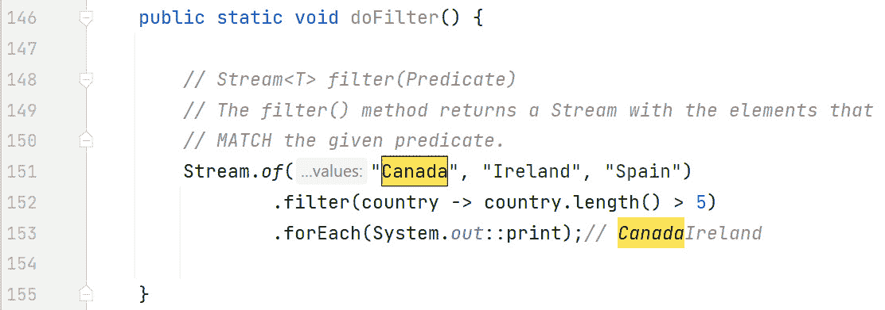

图 16.1 - 代码中的 filter(Predicate) 中间操作

在这个图中，输出的是名字长度超过 5 个字符的国家。

## distinct()

`distinct()` 操作返回一个移除了重复元素的流。内部，`distinct()` 使用 `Object` 的 `equals()` 方法进行比较。

它是一个 *有状态的* 中间操作，这意味着它需要保持一些状态以有效地操作。这个状态使 `distinct()` 能够按以下方式操作：如果这是 `distinct()` 第一次看到这个对象，它将其传递并记住它；如果 `distinct()` 已经看到这个对象，它将其过滤掉。

*图 16.2* 展示了一个代码示例（来自 repo 上的 `IntermediateOperations.java`）：

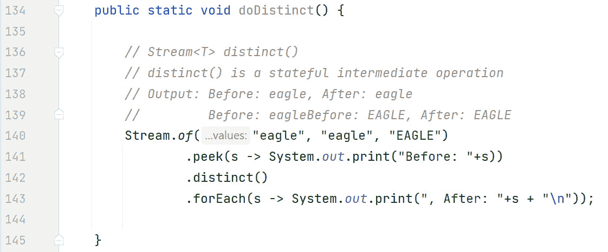

图 16.2 - 代码中的 distinct() 中间操作

在这个图中，我们正在流式传输一个字符串列表，其中 `"eagle"` 是重复的。我们使用了非常有用的 `Stream<T> peek(Consumer)` 中间操作。这个 `peek()` 操作在数据通过时执行消费者。这非常有帮助，因为它使我们能够查看流过的数据。`distinct()` 操作在我们的管道中，而 `forEach()` 终端操作开始流式传输。

当运行时，此代码生成以下输出：

```java
// Output: Before: eagle, After: eagle//              Before: eagleBefore: EAGLE, After: EAGLE
```

第一个 `"eagle"` 被流式传输到管道中，其中 `peek()` 将其回显到屏幕上，并带有装饰 `"Before: "`。然后 `peek()` 将 `"eagle"` 传递给 `distinct()`。由于这是 `distinct()` 第一次看到 `"eagle"`，它将其传递并记住它。最后，`forEach()` 将 `"eagle"` 与字符串 `", After:"` 预先连接，然后输出一个换行符。

现在第二个 `"eagle"` 被流式传输。`peek()` 操作输出详细信息并将 `"eagle"` 传递下去。然而，`distinct()` 记住它已经看到这个元素，并将其过滤掉。这就是为什么在输出中只出现一次 `", After: eagle"` 的原因。

最后，`"EAGLE"` 被流式传输。这与第一个 `"eagle"` 的处理方式相同。

## limit(long)

`limit()`操作是一个短路、有状态的中间操作。我们看到了其短路特性在将无限流转换为有限流的过程中得到了很好的应用，这在*第十五章*中有所体现。显然，它需要维护一些状态以保持通过元素的数量。*图 16.3*展示了代码示例（`IntermediateOperations.java`）：

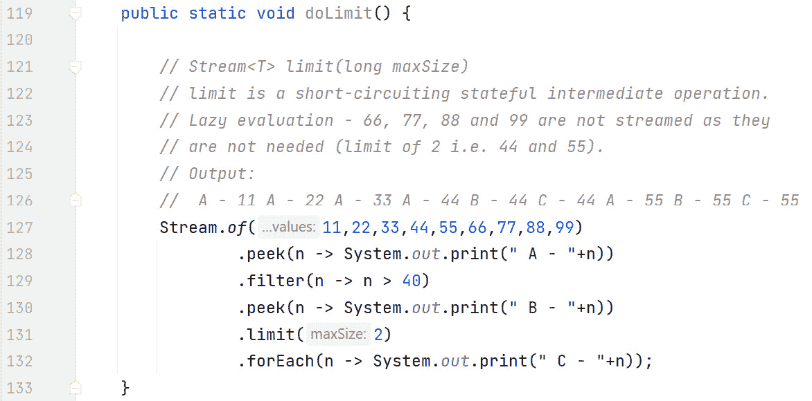

图 16.3 - 代码中的 limit(long)中间操作

在这个例子中，我们正在流式传输一个数字列表。这是一个懒加载的好例子。输出如下：

```java
   A - 11 A - 22 A - 33 A - 44 B - 44 C - 44 A - 55 B - 55 C - 55
```

让我们看看这里发生了什么。

+   11 被流式传输，第一个`peek()`输出它前面加上`"A - "`，然后传递给`filter()`，在那里失败（因为 11 不大于 40）

+   22 被流式传输，表现与 11 相同

+   33 被流式传输，操作方式与 11 和 22 相似

+   44 被流式传输，通过了过滤器，因此输出了`"B - 44"`；44 被传递给`limit()`，它记录这是它看到的第一个元素，然后再传递；`forEach()`输出前面加上`"C - "`的 44。

+   55 被流式传输，操作方式与 44 相同，除了`limit()`通知 Java 这是它遇到的第二个元素，限制为 2。Java 允许`forEach()`完成，流关闭。

+   注意，第一个`peek()`永远不会输出`"A - 66"`、`"A - 77"`、`"A - 88"`或`"A - 99"`。因此，66、77、88 和 99 永远不会被流式传输——因为它们不是必需的。这是另一个懒加载的例子。

现在我们来看一下`map()`。

## map(Function)

`Stream<R> map(Function<T, R>)`操作用于转换数据。它创建流中的元素与新返回的流中的元素之间的一对一映射。*图 16.4*展示了代码示例（`IntermediateOperations.java`）：

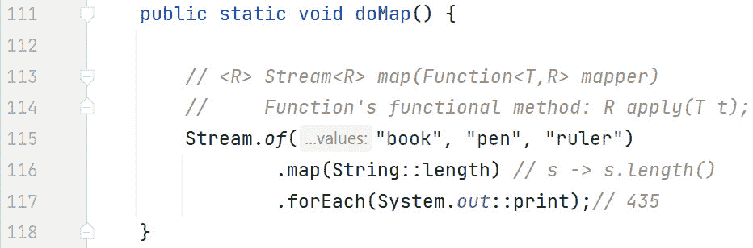

图 16.4 - 代码中的 map(Function)中间操作

`map()`操作接受一个`Function`，它接受一个类型并返回另一个类型，可能是不同的类型。在这个例子中，使用的 lambda 接受一个`String`，即`s`，并返回该`String`的`Integer`长度。`forEach()`输出流式传输的`String`的长度：`"book"`是`4`，`"pen"`是`3`，`"ruler"`是`5`。

## flatMap(Function)

`flatMap()`操作“扁平化”了一个流。换句话说，多个集合/数组被合并为一个。例如，如果我们正在流式传输`List<String>`元素，它们将被扁平化为一个`String`的流，这“移除”或隐藏了每个单独的`List`。这在合并列表或删除空元素（`flatMap()`也这样做）时很有用。*图 16.5*展示了代码示例（`IntermediateOperations.java`）：

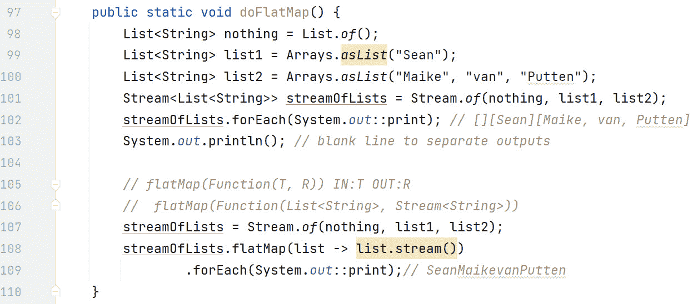

图 16.5 - 代码中的 flatMap(Function)中间操作

在这个例子中，我们将对比两个流 - 一个使用`flatMap()`，另一个不使用`flatMap()`。让我们从非`flatMap()`流开始。

首先，我们创建列表，其中第一个是一个空列表：

```java
   List<String> nothing = List.of();   List<String> list1 = Arrays.asList("Sean");
   List<String> list2 = Arrays.asList("Maike", "van", "Putten");
```

然后，我们流式传输这三个列表：

```java
   Stream<List<String>> streamOfLists = Stream.of(nothing, list1, list2);
```

然后，我们使用`forEach()`流式传输并输出我们的`streamOfLists`：

```java
   streamOfLists.forEach(System.out::print);
```

这会输出：

```java
   [][Sean][Maike, van, Putten]
```

注意，每个元素都是一个列表（通过方括号`[ ]`反映出来），并且空列表是存在的。

由于流已经被终端操作（`forEach()`）处理，流已经关闭。为了避免异常，我们必须重新流式传输源。这就是我们做的：

```java
   streamOfLists = Stream.of(nothing, list1, list2);
```

这个第二个管道包含`flatMap()`操作：

```java
   streamOfLists.flatMap(list -> list.stream())
```

`flatMap()`的签名如下：

```java
   Stream<R> flatMap(Function(T, R))
```

因此，`flatMap()`接受一个`Function`。函数输入`T`是一个`List<String>`，函数输出`R`是一个`Stream<String>`。

再次使用`forEach()`来启动流式传输并输出流中的元素，我们得到以下结果：

```java
   SeanMaikevanPutten
```

注意，它们都是`Strings`（没有`List`），并且空元素已经被移除。现在，列表中的`String`元素现在是流中的顶级元素。这就是前面解释的扁平化过程。

## sorted() 和 sorted(Comparator)

重载的`sorted()`操作返回一个已排序元素的流。就像排序数组一样，Java 使用自然排序，除非我们提供`Comparator`。例如，数字的自然排序是升序数字顺序；`String`的自然排序是字母顺序。这个操作是一个有状态的中间操作，这意味着`sorted()`在排序之前需要看到所有数据。这两个排序示例都是基于 repo 中的 IntermediateOperations.java。*图 16.6*展示了`sorted(Comparator)`的代码示例。

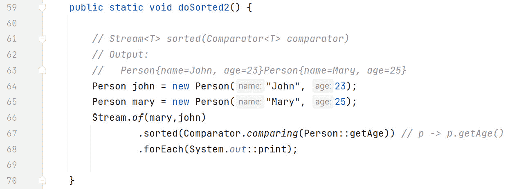

图 16.6 - 代码中的 sorted(Comparator)中间操作

在这个例子中，假设存在一个`Person`类，它既有`String`类型的`name`实例变量，也有`Integer`类型的`age`实例变量。我们首先流式传输`Person`对象；`"Mary"`是第一个，年龄 25 岁，`"John"`是第二个，年龄`23`岁。

`sorted(Comparator)`这一行很有趣：

```java
   .sorted(Comparator.comparing(Person::getAge)) // p -> p.getAge()
```

`Comparator.comparing(Function keyExtractor)`静态方法是一种生成`Comparator`的非常有用方式。它接受一个`Function`，该函数提取一个`Comparable`排序键 - 也就是说，一个键的类型实现了`Comparable`接口。在这个例子中，`Function`输入是一个`Person`，而`Function`返回值是一个`Integer`（人的年龄）。由于`Integer`实现了`Comparable`，这是可以的。然后该方法返回一个通过该排序键比较的`Comparator`。这个管道很短，并没有清楚地展示`sorted()`的状态性。下一个例子将做到这一点。

当我们输出流时，"John" 首先出现，然后是 "Mary"（与它们被流出的顺序相反）。这是因为我们按 `age` 排序，而 `John`，23 岁，比 `Mary`（25 岁）年轻。

现在让我们看看另一个 `sorted()` 的例子。这个例子将演示 `sorted()` 的有状态特性，同时突出懒加载。*图 16**.7* 展示了代码。


图 16.7 - `sorted()` 的有状态特性

在这个例子中，我们正在流式传输一个 `String`（名字）列表。长度为 `3` 的名字通过过滤器：

```java
.filter(name -> name.length() == 3)
```

`sorted()` 操作是有状态的 - 它需要看到 *所有* 数据才能对数据进行排序。我们还有一个 `limit(2)` 操作，它既是有状态的又是短路操作。它将在两个名字通过后短路。最后，终端操作 `forEach()` 启动了流式传输过程，并按到达顺序输出名字。

输出如下：

```java
   0.Tim 1.Tim 0.Jim 1.Jim 0.Peter 0.Ann 1.Ann 0.Mary 2.Ann 3.Ann 2.Jim 3.Jim
```

让我们看看这里发生了什么。注意，管道右侧的注释（第 49-55 行）表明每个名字到达的阶段。

+   `"Tim"` 被流出并通过了过滤器。`"Tim"` 进入 `sorted()` 并被存储。Java 告诉 `sorted()` 还有更多数据要流式传输，不要排序。这导致输出中有 `"0. Tim 1. Tim"`。

+   `"Jim"` 接下来被流出，其行为与 `"Tim"` 完全一样，`sorted()` 记录了它将需要排序 `"Tim"` 和 `"Jim"`。再次，Java 告诉 `sorted()` 还有更多数据要来，不要排序。因此，输出中有 `"0. Jim 1. Jim"`。

+   `"Peter"` 然后被流出，但未通过过滤器（输出中只有 `"0. Peter"` 而没有 `"1. Peter"`）。

+   `"Ann"` 接下来被流出，其行为与 `"Tim"` 和 `"Jim"` 完全一样，`sorted()` 记录了它将需要排序 `"Tim"`、`"Jim"` 和 `"Ann"`。再次，Java 告诉 `sorted()` 还有更多数据要来，不要排序。因此，输出中有 `"0. Ann 1. Ann"`。

+   `"Mary"` 是最后一个被流出的名字。`"Mary"` 也未通过过滤器（输出中只有 “`0. Mary`” 而没有 “`1. Mary`”）。

+   由于流现在为空，Java 告诉 `sorted()` 它可以排序数据。排序后的名字是 `"Ann"`、`"Jim"` 和 `"Tim"`。因此，`"Ann"` 现在从 `sorted()` 流出，进入流管道的下一阶段。

+   `sorted()` 后的 `peek()` 输出 `"2. Ann"`，显示 `"Ann"` 到达了这里。

+   `limit()` 操作将 “Ann” 传递下去，但记录了它已经处理了一个名字。

+   终端操作 `forEach()`，它启动了整个流式传输过程，输出 `"3. Ann"` 以显示 `"Ann"` 已经到达这里。

+   `"Jim"` 现在从 `sorted()` 中流出。`"Jim"` 被窥视（`"2. Jim"`）并通过 `limit()`。然而，由于这是它处理的第二个名字，`limit()` 被短路。Java 被告知这一事实。

+   `forEach()` 操作允许完成输出 `"3. Jim"`。

+   注意，`"Tim"`从未从`sorted()`中出来，进入最后的`peek()` - 输出中没有“2. Tim”。

这就完成了关于中间操作的这一部分。现在让我们来考察原生流。

# 深入原生流

到目前为止，我们所有的流都是针对`Object`类型的。例如，`Stream<Integer>`为包装类`Integer`提供支持。Java 也有专门针对原生流类的。例如，假设有一个`int`原生流，而不是`Stream<Integer>`，我们使用`IntStream`。正如我们将很快看到的，原生流有一些非常实用的方法用于处理数值数据，例如`sum()`和`average()`。

*表 16.1*介绍了原生流类。

| **包装流** | **原生流** | **支持的** **原生类型** |
| --- | --- | --- |
| `Stream<Integer>` | `IntStream` | `int, short, byte, char` |
| `Stream<Double>` | `DoubleStream` | `double, float` |
| `Stream<Long>` | `LongStream` | `long` |

表 16.1 - 原生流类

在这个表中，第一列列出了包装类型流；第二列列出了相应的原生流，最后一列，列举了第二列原生流所支持的原生类型。

让我们考察如何创建原生流。

## 创建原生流

与创建`Object`流一样，我们也可以轻松地创建原生流。*图 16.8*展示了创建原生流的示例代码（基于 repo 中的 PrimitiveStreams.java 文件中的代码）。

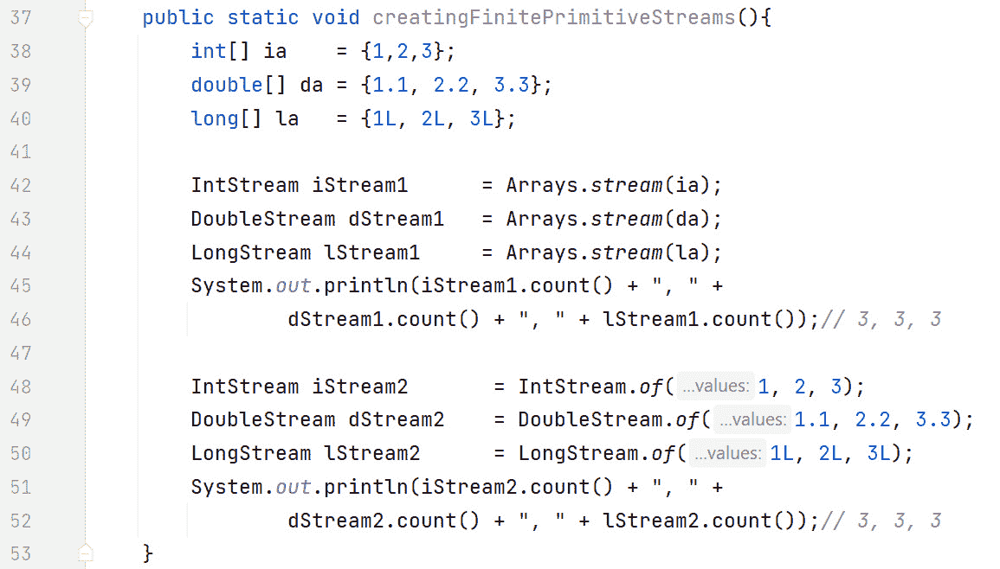

图 16.8 - 创建原生流

在这个例子中，我们创建了不同原生类型的数组：

```java
   int[] ia          = {1,2,3};   double[] da       = {1.1, 2.2, 3.3};
   long[] la         = {1L, 2L, 3L};
```

使用重载的`Arrays.stream()`方法，我们分别创建`IntStream`、`DoubleStream`和`LongStream`：

```java
   IntStream iStream1       = Arrays.stream(ia);   DoubleStream dStream1    = Arrays.stream(da);
   LongStream lStream1      = Arrays.stream(la);
```

例如，`Arrays.stream(ia)`接受一个`int[]`并返回一个以指定数组为源的`IntStream`。

然后我们对每个流执行`count()`终端操作。每个流都返回`3`，因为每个数组源中都有`3`个原生值：

```java
System.out.println(iStream1.count() + ", " + dStream1.count() + ", " + lStream1.count()); // 3, 3, 3
```

`of()`方法应该与我们使用`Stream`类创建常规流的方式相似。在`IntStream`、`DoubleStream`和`LongStream`中都有一个等效的方法。流中的值由 varargs 参数指定：

```java
   IntStream iStream2       = IntStream.of(1, 2, 3);   DoubleStream dStream2    = DoubleStream.of(1.1, 2.2, 3.3);
   LongStream lStream2      = LongStream.of(1L, 2L, 3L);
```

再次，我们对每个流执行`count()`终端操作。和之前一样，每次返回`3`，因为每个流中都有`3`个原生值：

```java
System.out.println(iStream2.count() + ", " + dStream2.count() + ", " + lStream2.count()); // 3, 3, 3
```

我们当然可以创建无限的原生流。*图 16.9*，来自 repo 中的 PrimitiveStreams.java 文件，展示了它们的使用及其在`Stream`类中的等效名称，即`generate()`和`iterate()`。

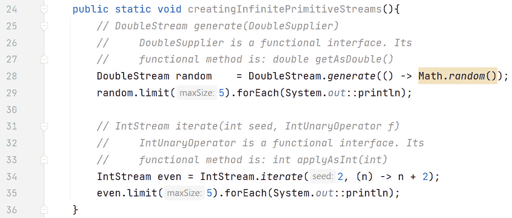

图 16.9 - 无限原生流

在这个例子中，我们开始时有两行代码：

```java
   DoubleStream random    = DoubleStream.generate(() -> Math.random());   random.limit(5).forEach(System.out::println);
```

`DoubleStream.generate(DoubleSupplier)` 方法在 `IntStream` 和 `LongStream` 中有等效版本。它的参数 `DoubleSupplier` 是一个函数式接口，它产生一个 `double`。因此，它是 `Supplier<T>` 的 `double` 原始版本。它的函数式方法 `double getAsDouble()` 强调了这一点。我们使用 `limit(5)` 来限制无限数字流的数量为 `5`，并且每个数字都通过终端操作 `forEach()` 输出。

接下来是下一行代码：

```java
   IntStream even = IntStream.iterate(2, (n) -> n + 2);   even.limit(5).forEach(System.out::println);
```

`IntStream.iterate()` 方法在 `DoubleStream` 和 `LongStream` 中有等效版本。它接受两个参数，一个 `int` 种子（起始值）和一个 `IntUnaryOperator` 函数。这个 `IntUnaryOperator` 函数接受一个 `int` 并返回一个 `int`。它是 `UnaryOperator<T>` 的 `int` 原始特化。生成的数字流是偶数，从 `2` 开始。由于数字序列是无限的，我们应用了 5 个数字的限制（`2`、`4`、`6`、`8`、`10`）。

现在，让我们来考察常见的原始流方法。

## 常见的原始流方法

刚才提到的这些方法，即 `of()`、`generate()` 和 `iterate()`，在 `Stream<T>` 中也是通用的。*表 16.2* 展示了原始流中特有的常用方法。

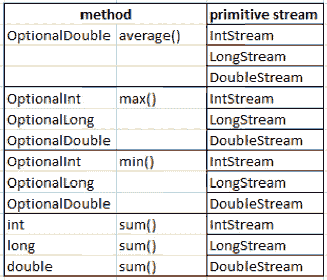

表 16.2 - 常见的原始流方法

此表有两列：方法的名称（包括其返回类型）和原始流。列出的每个方法都是归约和终端操作。回想一下，归约通过反复对一个输入结果序列应用操作来生成单个总结结果。我们在 `Stream<T>` 接口中的 `reduce()` 和 `collect()` 方法中看到了归约的一般形式。此表中的归约是针对原始数据类型特化的。

让我们先来考察 `sum()` 方法。注意，它不返回 `Optional`，而其他所有方法都返回。这是因为对于空流的求和，`0` 是一个有效的返回值。换句话说，如果你在执行 `sum()` 时流为空——可能所有数据都被过滤掉了——那么 `0` 是一个有效的返回值。然而，表中的其他方法在这种情况下需要返回一个空的 `Optional`。`IntStream` 的 `sum()` 返回一个 `int`，`LongStream` 中的版本返回一个 `long`，而 `DoubleStream` 中的版本返回一个 `double`。

关于 `min()` 和 `max()`，`IntStream` 的两个版本都返回 `OptionalInt`；`LongStream` 的两个版本都返回 `OptionalLong`，而 `DoubleStream` 的两个版本都返回 `OptionalDouble`。

`average()` 方法略有不同，因为无论总计数类型如何，都存在小数位。所以三种原始流类型，即 `IntStream`、`LongStream` 和 `DoubleStream` 都返回 `OptionalDouble`。

让我们通过代码（repo 中的 PrimitiveStreams.java）来检查它们。首先，**图 16**.10 展示了`min()`、`max()`和`average()`。

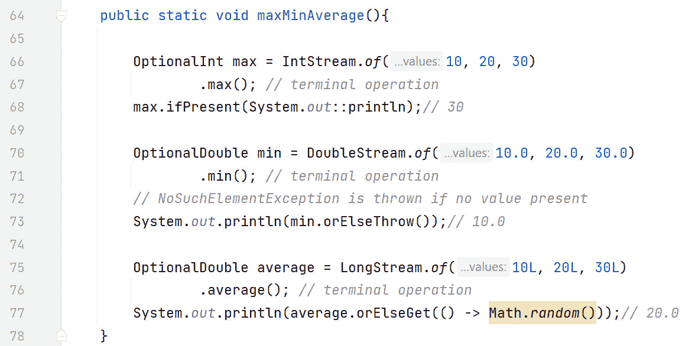

图 16.10 – 代码中的 min()、max()和 average()操作

在这个图中，我们从以下代码开始：

```java
   OptionalInt max = IntStream.of(10, 20, 30)           .max(); // terminal operation
   max.ifPresent(System.out::println);// 30
```

首先，我们创建一个`int`原始流。然后执行终端操作`max()`，它启动流并计算流中的最大数，即 30。这里不需要任何`Comparator`或累加器！然后我们使用`OptionalInt`的`ifPresent(IntConsumer)`（对于`OptionalDouble`和`OptionalLong`也有等效方法）。这个方法的意思是，如果`OptionalInt`中存在值，则输出它。如果可选对象为空，则不打印任何内容。

下一段有趣的代码是：

```java
   OptionalDouble min = DoubleStream.of(10.0, 20.0, 30.0)           .min(); // terminal operation
   // NoSuchElementException is thrown if no value present
   System.out.println(min.orElseThrow());// 10.0
```

在这个代码段中，我们根据提供的 varargs 参数创建一个`DoubleStream`。使用`min()`，我们流式传输值并计算最小值。`orElseThrow()`方法意味着：如果存在值，则返回该值；否则抛出`NoSuchElementException`。

最后一段代码是：

```java
   OptionalDouble average = LongStream.of(10L, 20L, 30L)           .average(); // terminal operation
   System.out.println(average.orElseGet(() -> Math.random())); // 20.0
```

在这里，我们根据提供的 varargs 参数创建一个`LongStream`。随后执行`average()`，它既流式传输值又计算它们的平均值。`orElseGet(DoubleSupplier)`方法意味着：如果存在值，则返回该值；否则返回供应函数（一个随机数）的值。

让我们现在检查`sum()`。很容易看出原始流在下一个示例（*图 16**.11*）中的有用性。

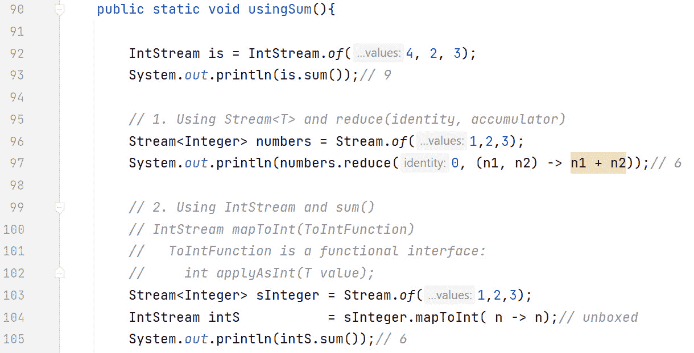

图 16.11 - sum()原始操作

在这个图中，我们首先从以下内容开始：

```java
   IntStream is = IntStream.of(4, 2, 3);   System.out.println(is.sum());// 9
```

这段代码直接使用`IntStream.of()`方法创建一个`int`原始流，并使用`sum()`终端方法流式传输数字并返回总和，即 9。

示例代码的其余部分，对比了`Stream<T>`的`reduce()`和`IntStream`的`sum()`。让我们首先关注`reduce()`：

```java
   Stream<Integer> numbers = Stream.of(1,2,3);  System.out.println(numbers.reduce(0, (n1, n2) -> n1 + n2)); // 6
```

最初，我们将一个`Integer`列表流式传输到一个`Stream<Integer>`中，然后通过传递累加函数参数给`reduce()`来求和。

现在我们将关注如何使用`sum()`做同样的事情：

```java
   Stream<Integer> sInteger = Stream.of(1,2,3);   IntStream intS           = sInteger.mapToInt( n -> n); // unboxed
   System.out.println(intS.sum()); // 6
```

首先，我们再次以`Stream<Integer>`的形式流式传输相同的数字 - 目前我们还没有原始类型的流。第二行显示了将`Stream<Integer>`转换为`int`原始类型的`Stream`有多容易。使用`Stream`接口的`mapToInt()`函数；我们传递我们的函数，该函数接受一个`Integer`并返回由该`Integer`包装的`int`原始类型。在这段代码中，我们通过在箭头符号两侧简单地指定标识符`n`来利用自动拆箱。现在我们有了`IntStream`对象，我们可以使用`sum()`方法 - 该方法流式传输整数并返回 6 的总和。请注意，我们故意在代码中保留了返回类型。这有助于解释管道中发生的事情。实际上，你会更简洁地编写如下：

```java
int sum = Stream.of(1,2,3)                           .mapToInt(n -> n)
                           .sum();
System.out.println(sum); // 6
```

对于每个原始流，你可以获取汇总统计信息（关于流中元素的汇总数据）。让我们看看这些在实际中的应用。*图 16.12*展示了`IntSummaryStatistics`。

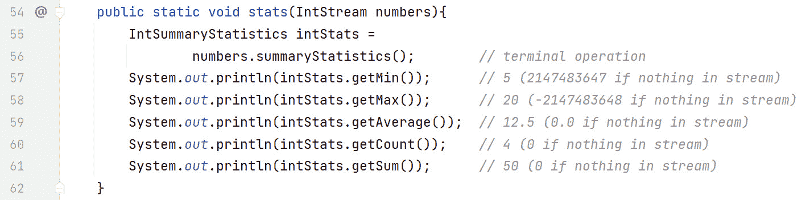

图 16.12 - 代码中的 IntSummaryStatistics

在这个例子中，流是通过以下方法调用来传递的：

```java
   stats(IntStream.of(5, 10, 15, 20));   stats(IntStream.empty());
```

第一次调用传递了一个有效的整数流，而第二个流是空的。一旦进入`stats()`方法，终端操作`summaryStatistics()`就会在传入的`IntStream`上执行。现在可以检查`IntSummaryStatistics`对象以获取汇总数据：

```java
   IntSummaryStatistics intStats = numbers.summaryStatistics(); // terminal op.
```

第一流的输出（5，10，15 和 20）如下：

```java
520
12.5
4
50
```

`getMin()`输出`5`；`getMax()`输出`20`；`getAverage()`输出`12.5`；`getCount()`输出`4`和`getSum()`输出`50`。

空流的输出如下：

```java
2147483647-2147483648
0.0
0
0
```

`2147483647`（即`Integer.MAX_VALUE`）由`getMin()`输出；`-2147483648`（`Integer.MIN_VALUE`）由`getMax()`输出；`getAverage()`输出`0.0`；`getCount()`和`getSum()`都输出`0`。

在原始流中，现在有额外的功能接口需要我们注意。

## 新的原始流接口

有许多新的功能接口需要我们注意。幸运的是，它们遵循一致的命名模式。*表 16.3*概述了更常见的接口。有关更多详细信息，请参阅 JavaDocs：[`docs.oracle.com/en/java/javase/21/docs/api/java.base/java/util/function/package-summary.html`](https://docs.oracle.com/en/java/javase/21/docs/api/java.base/java/util/function/package-summary.html)。

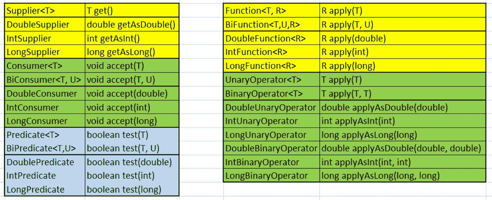

表 16.3（a）和（b）- 新的原始流功能接口

在这个图中，表 A 在左边，表 B 在右边。每个表都有两列 - 一列是功能接口名称，另一列是其功能方法。

我们故意包括了之前遇到的泛型标记的功能接口。这是为了帮助它们与它们的原生对应者进行对比。我们之前遇到的功能接口是：`Supplier<T>、Consumer<T>、BiConsumer<T, U>、Predicate<T>、BiPredicate<T, U>、Function<T, R>、BiFunction<T, U, R>、UnaryOperator<T>`和`BinaryOperator<T>`。注意它们中的泛型类型。非常少的功能接口使用泛型，因为它们是为特定的原生类型类型化的。

我们对接口进行了颜色协调，以便将它们分组。例如，在表格 A 中，黄色标注的接口是供应商。`Supplier<T>`具有`T get()`功能方法——如前所述，这是为了比较目的而包含的。`DoubleSupplier`是生成`double`原生类型的接口。其功能方法是`getAsDouble()`，其返回类型是`double`。`IntSupplier`和`LongSupplier`接口遵循相同的模式。

仍然在表格 A 中，消费者接下来，用绿色标注。`DoubleConsumer`“接受”一个`double`原生类型并返回空值。`IntConsumer`接受一个`int`，返回空值；`LongConsumer`接受一个`long`，返回空值。所有功能方法都被称为`accept()`。注意命名模式：供应商使用`DoubleSupplier`；消费者使用`DoubleConsumer`。

这种命名约定在谓词（蓝色）中继续。我们有一个`DoublePredicate`，它“测试”一个`double`并返回一个`boolean`。`IntPredicate`和`LongPredicate`以类似的方式表现——一个原生类型参数和一个返回类型`boolean`。所有功能方法都被称为`test()`。

在表格 B 中，我们看到了函数，用黄色标注。我们有一个`DoubleFunction<R>`，它“应用”一个`double`并返回类型`R`。函数是一个使用泛型来表示返回类型的例子。然而，被应用的原生类型在这里是重要的方面。`IntFunction<R>`和`LongFunction<R>`以类似的方式表现——一个原生类型参数和一个返回类型`R`。所有功能方法都被称为`apply()`。

最后，在表格 B 中，我们有`UnaryOperator<T>`和`BinaryOperator<T>`的原生版本。`UnaryOperator<T>`的`double`原生版本是`DoubleUnaryOperator`（注意开头再次出现的单词`Double`）。回想一下，一元函数是接受一个参数并返回值的函数；其中两种类型都是相同的。因此，`DoubleUnaryOperator`有一个`double`参数和一个`double`返回类型。`IntUnaryOperator`和`LongUnaryOperator`遵循相同的模式。

`DoubleBinaryOperator`、`IntBinaryOperator`和`LongBinaryOperator`接口与它们的一元对应者仅在它们接受的参数数量上有所不同。因此，`DoubleBinaryOperator`接受两个`double`，`IntBinaryOperator`接受两个`int`，`LongBinaryOperator`接受两个`long`。

创建流还有其他方法，那就是从其他流映射。现在让我们来探讨这一点。

# 流映射

再次，有许多新的函数式接口需要我们注意；幸运的是，它们遵循一致的命名模式。*表 16.4* 列出了更常见的接口。

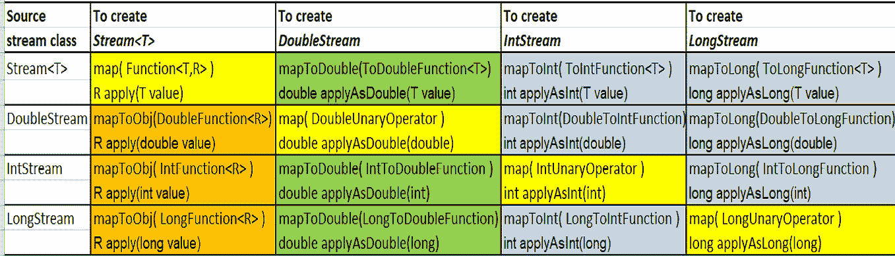

表 16.4 - 流映射

在这个表中，行代表源流类，列代表目标流类。再次，我们使用颜色来帮助组织我们的解释。黄色框代表源和目标类相同的情况。例如，如果您从 `DoubleStream` 转换到另一个 `DoubleStream`，则方法为 `map(DoubleUnaryOperator)`。函数方法也列出了——在这个例子中，`DoubleUnaryOperator` 的函数方法是 `double applyAsDouble(double)`。

让我们检查棕色框。这些中的每一个都使用 `mapToObj()` 方法作为源，因为源是原始流，目标是对象流。源流暗示了要使用的函数。例如，如果源是 `DoubleStream`，则适用 `DoubleFunction` 接口，因为您正在将 `double` 原始类型映射到类型 `R`。这指定在函数方法 `R apply(double value)` 中。

接下来是绿色框。目标流是 `DoubleStream`，因此方法名为 `mapToDouble()`。如果源流是对象流，则接口是 `ToDoubleFunction<T>`。其函数方法是 `double applyAsDouble(T value)`，所以输入类型是 `T`，输出是 `double` 原始类型。正如从类型 `T` 的对象到原始 `double` 类型转换时预期的那样。

保持目标流为 `DoubleStream`，如果源是 `IntStream`，则涉及的原始类型在接口名称中：`IntToDoubleFunction`。它的函数方法 `double applyAsDouble(int)` 也没有什么意外。如果源是 `LongStream`，则涉及的原始类型再次在接口名称中：`LongToDoubleFunction`。它的函数方法 `double applyAsDouble(long)` 也没有什么意外。

蓝色框代表目标流为 `IntStream` 的情况。方法名为 `mapToInt()`。用作参数的函数式接口及其函数方法遵循为 `DoubleStream` 概述的相同命名模式。

最后，灰色框代表 `LongStream` 的目标流。方法名为 `mapToLong()`。类似的命名模式再次应用于函数式接口及其函数方法，如 `DoubleStream` 和 `IntStream` 中所示。

让我们看看一些代码示例。我们将从对象流映射开始。

## 从对象流映射

第一个例子将以 `Stream<String>` 作为源流，并相应地映射到各种其他流。*图 16**.13* 表示代码（存储库中的 `MappingStreams.java`）。

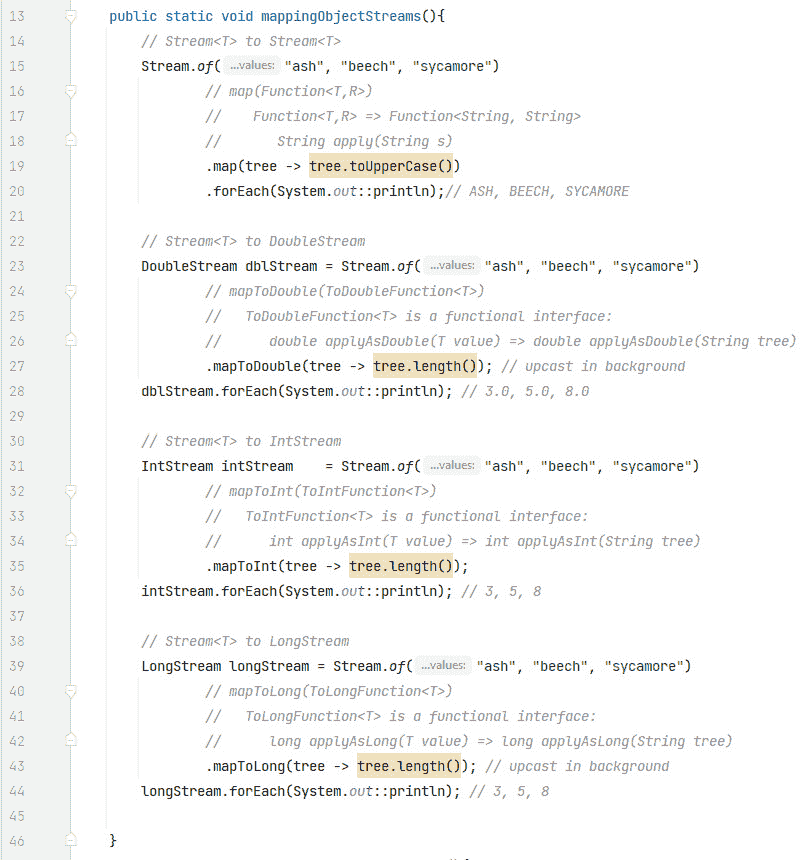

图 16.13 - 映射对象流

在这个图中，我们将 `Stream<String>` 映射到所有其他流类型，包括 `Stream<String>` 本身。第一个示例是：

```java
// Stream<T> to Stream<T>Stream.of("ash", "beech", "sycamore")
        // map(Function<T,R>)
        //    Function<T,R> => Function<String, String>
        //       String apply(String s)
        .map(tree -> tree.toUpperCase())
        .forEach(System.out::println);// ASH, BEECH, SYCAMORE
```

在这种情况下，`map(Function<T,R>)` 将 `String` 映射到 `String`。该函数将字符串转换为大写。`forEach()` 终端操作启动流式传输过程并输出字符串。

第二个示例是：

```java
// Stream<T> to DoubleStreamDoubleStream dblStream = Stream.of("ash", "beech", "sycamore")
        // mapToDouble(ToDoubleFunction<T>)
        //   ToDoubleFunction<T> is a functional interface:
        //      double applyAsDouble(T value) => double applyAsDouble(String tree)
        .mapToDouble(tree -> tree.length()); // upcast in background
dblStream.forEach(System.out::println); // 3.0, 5.0, 8.0
```

这次，`Stream<String>` 被映射到 `DoubleStream`（`double` 原始类型）。请注意，我们必须重新流化源，因为之前的 `forEach()` 已经关闭了它。这个管道使用 `mapToDouble(ToDoubleFunction<T>)` 将 `String` 映射到 `double` 原始类型。这次函数使用 `String` 的 `length()`，它是一个 `int`。这个 `int` 在后台被向上转型为 `double`。`forEach()` 启动流并输出 `double` 值。

第三个示例是：

```java
// Stream<T> to IntStreamIntStream intStream    = Stream.of("ash", "beech", "sycamore")
        // mapToInt(ToIntFunction<T>)
        //   ToIntFunction<T> is a functional interface:
        //      int applyAsInt(T value) => int applyAsInt(String tree)
        .mapToInt(tree -> tree.length());
intStream.forEach(System.out::println); // 3, 5, 8
```

这次，`Stream<String>` 被映射到 `IntStream`。我们再次需要重新流化源。这个管道使用 `mapToInt(ToIntFunction<T>)` 将 `String` 映射到 `int` 原始类型。我们再次使用 `String` 的 `length()` 函数。由于这是一个 `int`，不需要在后台进行向上转型。使用 `forEach()` 终端操作来启动流并输出 `int` 值。

最后一个示例是：

```java
// Stream<T> to LongStreamLongStream longStream = Stream.of("ash", "beech", "sycamore")
        // mapToLong(ToLongFunction<T>)
        //   ToLongFunction<T> is a functional interface:
        //      long applyAsLong(T value) => long applyAsLong(String tree)
        .mapToLong(tree -> tree.length()); // upcast in background
longStream.forEach(System.out::println); // 3, 5, 8
```

这里，`Stream<String>` 被映射到 `LongStream`。这个管道使用 `mapToLong(ToLongFunction<T>)` 将 `String` 映射到 `long` 原始类型。由于 `String` 的 `length()` 返回一个 `int`，后台进行了向上转型。`long` 值作为 `forEach()` 终端操作的一部分输出。

现在我们来检查从原始数据流映射的代码示例。

## 从原始流映射

在这个例子中，我们是从原始数据流映射到其他流类型。*图 16.14* 展示了代码（`MappingStreams.java`）。

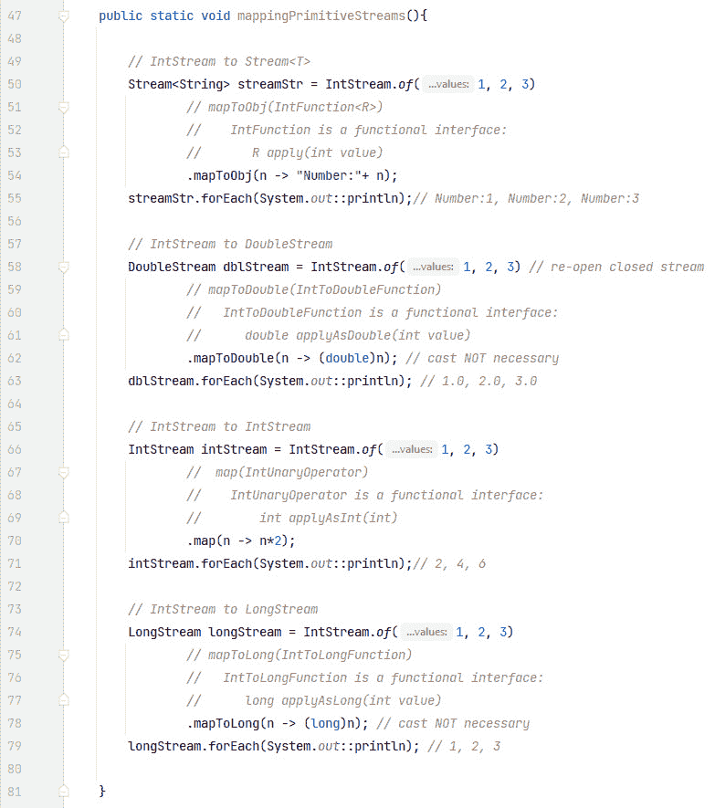

图 16.14 - 映射原始流

在这个例子中，我们使用 `IntStream.of()` 流式传输 `int` 原始类型，并依次将 `IntStream` 转换为 `Stream<String>`、`DoubleStream`、`IntStream` 和 `LongStream`。

这里是第一个示例：

```java
// IntStream to Stream<T>Stream<String> streamStr = IntStream.of(1, 2, 3)
        // mapToObj(IntFunction<R>)
        //    IntFunction is a functional interface:
        //       R apply(int value)
        .mapToObj(n -> "Number:"+ n);
streamStr.forEach(System.out::println);// Number:1, Number:2, Number:3
```

这段代码代表了一个用于流式传输 `int` 原始值并将它们映射到 `String` 对象流的一个示例管道。`mapToObj()` 方法在这里很重要。它的签名是：`Stream<R> mapToObj(IntFunction<R>)`。当查看函数式接口 `IntFunction<R>` 的函数方法时，传入的 lambda 更容易理解。函数方法是 `R apply(int value)`。在我们的例子中，将 `int` 原始值作为 `n` 传入，返回的 `String`（在方法签名中用 `R` 表示）是在 `int` 前面添加 `"Number:"` 形成的字符串。回想一下，当你在 `+` 的左右两侧（或两侧都是）有一个字符串时，结果是 `String`。`forEach()` 流式传输 `int` 原始值并输出 `Stream<String>`。

下一个例子是：

```java
// IntStream to DoubleStreamDoubleStream dblStream = IntStream.of(1, 2, 3) // re-open closed stream
        // mapToDouble(IntToDoubleFunction)
        //   IntToDoubleFunction is a functional interface:
        //      double applyAsDouble(int value)
        .mapToDouble(n -> (double)n); // cast NOT necessary
dblStream.forEach(System.out::println); // 1.0, 2.0, 3.0
```

这段代码是将 `IntStream` 映射到 `DoubleStream`。`mapToDouble()` 方法在这里很重要。它的签名是：

`DoubleStream mapToDouble(IntToDoubleFunction)`。`IntToDoubleFunction` 的函数方法是 `double applyAsDouble(int value)`。因此，我们的 lambda 传入一个 `int` 并返回一个 `double`。强制类型转换不是必需的，它只是用来强调返回的是一个 `double` 原始值。

这是下一个例子：

```java
// IntStream to IntStreamIntStream intStream = IntStream.of(1, 2, 3)
        //  map(IntUnaryOperator)
        //    IntUnaryOperator is a functional interface:
        //        int applyAsInt(int)
        .map(n -> n*2);
intStream.forEach(System.out::println);// 2, 4, 6
```

在这里，我们将 `IntStream` 映射到另一个 `IntStream`。使用 `IntStream map(IntUnaryOperator)` 方法。它的函数方法是：

`int applyAsInt(int value)` 因此我们传入一个 `int` 并返回一个 `int`。我们的 lambda 简单地将传入的 `int` 乘以 2 并返回结果。

最后一个例子：

```java
// IntStream to LongStreamLongStream longStream = IntStream.of(1, 2, 3)
        // mapToLong(IntToLongFunction)
        //   IntToLongFunction is a functional interface:
        //      long applyAsLong(int value)
        .mapToLong(n -> (long)n); // cast NOT necessary
longStream.forEach(System.out::println); // 1, 2, 3
```

这段代码将 `IntStream` 映射到 `LongStream`。使用 `LongStream mapToLong(IntToLongFunction)` 方法。它的函数方法是：

`long applyAsLong(int value)` 因此我们传入一个 `int` 并返回一个 `long`。同样，强制类型转换不是必需的，它只是用来强调返回的是一个 `long` 原始值。

这样我们就完成了对映射流的覆盖。现在让我们转向考察 `Optional`。

# 解释 `Optional`

可以将 `Optional` 视为一个可能为空也可能不为空的容器。根据 API，容器“可能包含或不包含非 `null` 值”。`Optional` 主要用作方法返回类型，当确实需要表示“无结果”且返回 `null` 可能导致错误时。在 Java 8 之前，程序员会返回 `null`，但现在，自从 Java 8 以来，我们可以返回一个 *空的* `Optional`。这有几个优点：

+   降低 `NullPointerException` 的风险

+   通过使用 `Optional` 作为返回类型，API 现在可以清楚地声明可能不会返回值

+   `Optional` API 促进了函数式编程风格

除了 `Optional<T>`，还有原始类型的 `Optional`；即：`OptionalInt`、`OptionalDouble` 和 `OptionalLong`。我们将在稍后考察它们。

让我们先看看如何创建 `Optional`。

## 创建 `Optional`

API 提供了几个 `static` 方法用于此目的。让我们从 `Optional.of(T)` 开始。

```java
Optional<T> Optional.of(T value)
```

`value` 参数被包裹在一个 `Optional` 中。传递的 `value` 必须是一个非 `null` 值。如果传递了 `null`，则会产生一个 `NullPointerException`。

现在，让我们看看 `Optional.empty()`。这就是创建一个空的 `Optional` 实例的方法。

```java
Optional.empty()
```

最后，我们将检查 `Optional.ofNullable(T)`。

```java
Optional.ofNullable(T value)
```

如果给定的 `value` 是非 `null`，此方法返回一个包裹在 `Optional` 中的 `value`。如果传递了 `null`，则返回一个空的 `Optional`。如果我们检查以下代码：

```java
Optional opt1 = Optional.ofNullable(value);Optional opt2 = (value == null) ? Optional.empty() : Optional.of(value);
```

这两行做的是同一件事。第一行是第二行三目运算符的简写。三目运算符表示以下内容：如果 `value` 是 `null`，则 `opt2` 被分配一个空的 `Optional`；否则，`opt2` 被分配包裹的 `value`。

*图 16.15* 以代码形式（在仓库中的 `Optionals.java`）展示了它们。

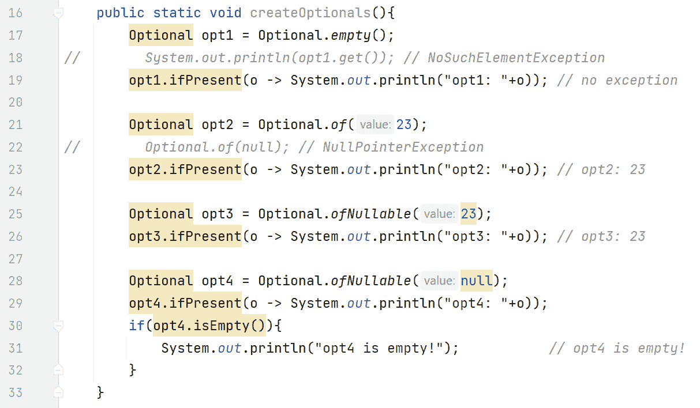

图 16.15 - 创建 Optionals

在这里，第一个示例创建了一个空的 `Optional`：

```java
        Optional opt1 = Optional.empty();//        System.out.println(opt1.get()); // NoSuchElementException
        opt1.ifPresent(o -> System.out.println("opt1: "+o)); 
        // no exception
```

我们使用 `Optional.empty()` 方法来创建一个空的 `Optional`。下一行被注释掉了，因为如果你在一个空的 `Optional` 上执行 `get()`，你会得到一个 `NoSuchElementException` 异常。最后一行显示了函数式风格的 `ifPresent(Consumer)`。如果存在值，给定的消费者会被应用到该值上；否则，它什么都不做。在这种情况下，由于 `Optional` 是空的，所以它什么都不做。

下一个示例创建了一个非空的 `Optional`：

```java
        Optional opt2 = Optional.of(23);//        Optional.of(null); // NullPointerException
        opt2.ifPresent(o -> System.out.println("opt2: "+o)); 
        // opt2: 23
```

这次我们使用 `Optional.of()` 创建了一个 `Optional`，值为 23。第二行显示，如果你将 `null` 传递给 `Optional.of()`，你会得到一个 `NullPointerException`。现在 `ifPresent()` 执行传递的消费者，它输出了 `"``opt2: 23"`。

下一个示例再次使用了 `Optional.ofNullable()`：

```java
Optional opt3 = Optional.ofNullable(23);opt3.ifPresent(o -> System.out.println("opt3: "+o)); // opt3: 23
```

我们在这里使用 `Optional.ofNullable()` 创建了一个 `Optional`，并且值是 23。由于 `Optional` 不是空的，传递给 `ifPresent()` 的消费者输出了 `"``opt3: 23"`。

这里是最后一个示例：

```java
Optional opt4 = Optional.ofNullable(null);opt4.ifPresent(o -> System.out.println("opt4: "+o));
if(opt4.isEmpty()){
    System.out.println("opt4 is empty!");           // opt4 is empty!
}
```

在这个例子中，我们再次使用了 `Optional.ofNullable()`，但这次我们传递了 `null`。而不是得到一个异常（这是 `Optional.of(null)` 会产生的），我们得到了一个 `Optional`。由于 `Optional` 是空的，`ifPresent()` 什么都不做。`isEmpty()` 证明 `Optional` 确实是空的，因此输出了 `"opt4 is empty!"`。

现在我们知道了如何创建 `Optional`s，让我们探索可用的 API 方法。

## 使用 Optional API

*表 16.5* 表示 `Optional` 中的实例方法。

| **方法** | **如果 Optional 为空会发生什么** | **如果 Optional 有值会发生什么** |
| --- | --- | --- |
| `get()` | 抛出 `NoSuchElementException` | 返回值 |
| `isPresent()` | 返回 `false` | 返回 `true` |
| `ifPresent(Consumer)` | 什么都不做 | 使用值执行 `Consumer` |
| `orElse(T otherValue)` | 返回 `otherValue` | 返回值 |
| `orElseGet(Supplier)` | 返回执行 `Supplier` 的结果 | 返回值 |
| `orElseThrow()` | 抛出`NoSuchElementException` | 返回值 |
| `orElseThrow(Supplier)` | 抛出由`Supplier`返回的异常。然而，如果`Supplier`是`null`，则抛出`NullPointerException` | 返回值 |

表 16.5 - Optional 实例方法

许多这些方法使我们能够以更简洁和更富有表现力的方式编写代码。`ifPresent(Consumer)`是一个非常好的例子——与在`if-else`语句中相比，`ifPresent(Consumer)`消除了编写`else`部分的必要性。此外，`ifPresent(Consumer)`帮助我们更清楚地表达我们的意图——如果值*存在*，则执行此操作；否则不执行任何操作。

*图 16*.16 展示了`Optional` API 中的方法。

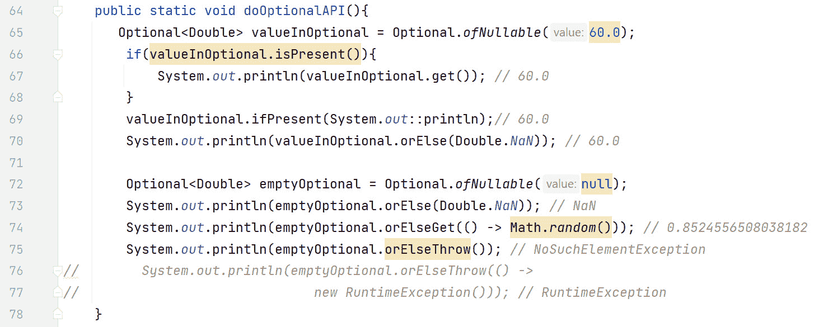

图 16.16 - 代码中的 Optional 方法

在这个例子中，我们将使用一个非空的`Optional`和一个空的`Optional`来测试各种方法。让我们从一个有效的非空`Optional`开始。

### 带有值的 Optional

首先，我们创建一个包裹着`Double 60.0`的`Optional`：

```java
   Optional<Double> valueInOptional = Optional.ofNullable(60.0);
```

然后，我们使用`isPresent()`来确保执行`get()`方法是安全的，因为在对空的`Optional`执行`get()`操作会导致异常：

```java
   if(valueInOptional.isPresent()){     System.out.println(valueInOptional.get());  // 60.0
   }
```

由于`isPresent()`返回`true`，执行`get()`是安全的，它返回`60.0`并输出到屏幕。

接下来的两行是：

```java
   valueInOptional.ifPresent(System.out::println);// 60.0   System.out.println(valueInOptional.orElse(Double.NaN)); // 60.0
```

在此代码段中，由于`valueInOptional`中有一个非空值，`ifPresent()`的消费者参数将被执行，并将`60.0`输出到屏幕。此外，由于我们在`valueInOptional`中有值，`orElse(T value)`方法不会执行；这意味着`60.0`被输出到屏幕。

### 空的 Optional

首先，我们通过将`null`传递给`ofNullable()`来创建一个空的`Optional`：

```java
   Optional<Double> emptyOptional = Optional.ofNullable(null);
```

然后，我们有：

```java
System.out.println(emptyOptional.orElse(Double.NaN)); // NaNSystem.out.println(emptyOptional.orElseGet(() -> Math.random())); 
// 0.8524556508038182
```

`orElse(T value)`返回`NaN`，而`orElseGet(Supplier)`执行`Supplier`，用于生成一个随机数。请注意，`Supplier`必须返回一个`Double`，因为这是`emptyOptional`的类型。

最后，我们有：

```java
    System.out.println(emptyOptional.orElseThrow()); // NoSuchElementException
// System.out.println(emptyOptional.orElseThrow(() -> new RuntimeException()));
```

两行都执行`orElseThrow()`，它们是互斥的。这意味着，要看到第二行的异常，请注释掉第一行。由于`Optional`是空的，第一行抛出`NoSuchElementException`。假设我们注释掉第一行并取消注释第二行，传递给`orElseThrow()`的`Supplier`将返回一个`RuntimeException`。请注意，我们不在`Supplier`中使用关键字`throw`。`orElseThrow()`方法会为我们做这件事——我们的工作是，通过`Supplier`给它提供一个要抛出的异常对象。

关于`Optional`的最后一部分，是原始的`Optional`。

## 原始 Optional

如前所述，也有原始类型的`Optional`；即：`OptionalInt`、`OptionalDouble`和`OptionalLong`。我们现在将研究它们。

*表 16.6* 突出了更常用的原始流方法。

| **OptionalInt** | **OptionalDouble** | **OptionalLong** |
| --- | --- | --- |
| `int getAsInt()` | `double getAsDouble()` | `long getAsLong()` |
| `ifPresent(IntConsumer)``void accept(int)` | `ifPresent (DoubleConsumer)``void accept(double)` | `ifPresent(LongConsumer)``void accept(long)` |
| `OptionalInt of(int)` | `OptionalDouble of(double)` | `OptionalLong of(long)` |
| `int` `orElse(int other)` | `double orElse`（`double other`） | `long` `orElse(long other)` |
| `orElseGet(IntSupplier)``int getAsInt()` | `orElseGet (DoubleSupplier)``double getAsDouble()` | `orElseGet(LongSupplier)``long getAsLong()` |
| `IntStream stream()` | `DoubleStream stream()` | `LongStream stream()` |

表 16.6 - 常用的原始流方法

这个表格对比了原始流中更常用的方法。在适当的地方，也列出了函数式方法，位于函数式接口下方。例如，检查`OptionalInt`的`ifPresent(IntConsumer)`，可以看到`IntConsumer`的函数式方法是`void accept(int)`。

注意，`orElseGet()`方法的返回类型可以从下面的函数式方法推断出来。例如，检查`OptionalInt`的`orElseGet()`方法，可以看到`IntSupplier`的函数式方法是`int getAsInt()`。因此，`orElseGet(IntSupplier)`的返回类型也是`int`。

让我们通过代码检查其中的一些。*图 16.17* 是示例（`Optionals.java`）：


图 16.17 - 代码中的原始流方法

在这个图中，我们开始如下：

```java
   OptionalDouble optAvg = IntStream.rangeClosed(1, 10).average();   optAvg.ifPresent(d -> System.out.println(d));// 5.5
```

这第一行使用了`IntSream`方法的`rangeClosed()`来生成一个从 1 到 10（包括 10）的整数流，步长为 1。然后`average()`方法计算这些数字的平均值，为`5.5`（55/10）。请注意，`optAvg`的类型是`OptionalDouble`。

第二次使用的是现在熟悉的`ifPresent()`方法。这次消费者参数是`DoubleConsumer`，这意味着函数式方法是`void accept(double)`。这正是我们正在做的事情 - 使用`OptionalDouble`的值（即`d`）并输出。

我们接下来有：

```java
   System.out.println(optAvg.getAsDouble()); // 5.5
```

它使用`getAsDouble()`来返回`double`值。如果没有值存在，这个方法（就像`Optional<T>`中的`get()`）会生成一个`NoSuchElementException`。

接下来的两行是：

```java
   double dblAvg = optAvg.orElseGet(() -> Double.NaN);   System.out.println(dblAvg);// 5.5
```

第一行使用了`orElseGet()`方法。我们传递了一个`DoubleSupplier`，这意味着没有输入参数（因此 lambda 中有`()`），并且返回一个`double`值（`Double.NaN`）。由于`OptionDouble`有值，该值用于初始化`dblAvg`，而`DoubleSupplier`被忽略。然后我们输出变量`dblAvg`。

下面的代码段完成了示例：

```java
   OptionalInt optInt = OptionalInt.of(35);   int age = optInt.orElseGet(() -> 0);
   System.out.println(age); // 35
   System.out.println(optInt.getAsInt()); // 35
```

第一行使用静态方法 `OptionalInt.of()` 创建了一个 `OptionalInt`。第二行使用了 `orElseGet()` 方法。我们传递了一个 `IntSupplier`，这意味着我们传递了空值并返回一个 `int`（即 `0`）。由于 `optInt` 有值，所以使用该值初始化 `age`，而 `IntSupplier` 被忽略。第三行输出了变量 `age`。最后一行使用 `getAsInt()` 返回 `int` 值。如果 `optional` 中没有值，此方法也会像 `getAsDouble()` 一样生成一个 `NoSuchElementException`。然而，由于 `optInt` 包含一个值（35），它被返回并输出。

这样就完成了 `Optional` 部分的讲解。本章最简短的部分是并行流。

# 理解并行流

到目前为止的所有流都是顺序流，其结果是有序的。在顺序流中，单个线程一次处理一个条目。并行流由多个线程并发执行（在多个 CPU 上运行）。流元素被分成子流，这些子流由多个线程中的流管道实例处理。然后将这些部分子流的结果组合成最终结果。为了并行执行子流，流使用 Java 的 fork/join 框架来管理线程。

## 创建并行流

要将一个流转换为并行流非常简单。我们有两种选择：我们可以使用 `Collection` API 中的 `parallelStream()` 方法，或者使用 `Stream` API 中的 `parallel()` 中间操作。

这里是两种方法的示例：

```java
Stream<String> parallelFarmAnimals =    List.of("sheep", "pigs", "horses").parallelStream(); // Collection API
Stream<String> parallelHouseAnimals =
    Stream.of("cats", "dogs").parallel(); // Stream API
```

让我们通过一个对比顺序流和并行流的例子来看看创建并行流有多简单。*图 16.18* 是代码（在仓库中的 `ParalledStreams.java`）：

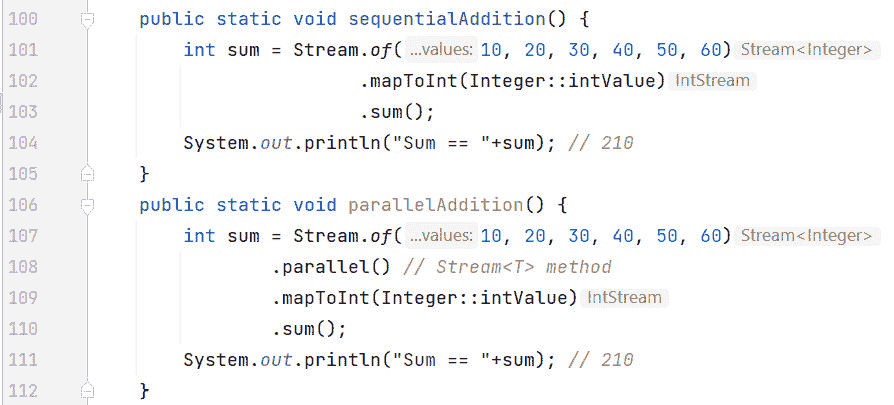

图 16.18 - 创建并行流

让我们先来检查一下顺序流：

```java
   int sum = Stream.of(10, 20, 30, 40, 50, 60)                              .mapToInt(Integer::intValue)
                              .sum();
   System.out.println("Sum == "+sum);  // 210
```

我们最初生成一个 `Stream<Integer>` 的流。第二行使用 `mapToInt()` 函数将 `Stream<Integer>` 映射到 `IntStream`。换句话说，将 `Integer` 对象的流映射到 `int` 原始值的流。这样我们就可以在 `IntStream` 中使用 `sum()` 方法。结果，210 被输出。

并行版本是：

```java
   int sum = Stream.of(10, 20, 30, 40, 50, 60)                              .parallel()  // Stream<T> method
                              .mapToInt(Integer::intValue)
                              .sum();
   System.out.println("Sum == "+sum);  // 210
```

唯一的区别在于第二行对 `parallel()` 的调用。这是一个 `Stream` 方法。这是抽象的极致！数据分区和线程管理由 API 和 JVM 处理。

## 并行分解

创建并行流是容易的部分。当执行 *并行分解* 时，事情变得有趣——任务被分解成更小的任务，这些任务并发执行，然后汇总其结果。

对于串行流，结果是有序的，因此是可预测的。对于并行流和并行分解，情况并非如此，因为顺序没有保证，因此结果是不可预测的。这是因为线程以任何顺序接受子任务，并以任何顺序返回结果。

让我们看看一个简单的代码示例来展示这一点。*图 16**.19* 展示了代码（`ParalledStreams.java`）：

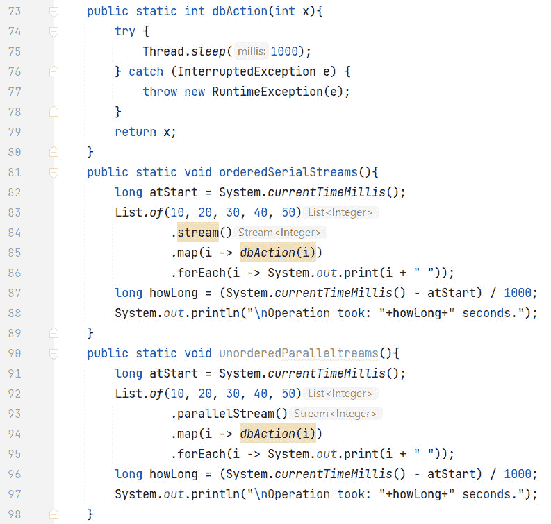

图 16.19 - 串行流中的排序和并行流中的无排序

此图展示了一个 `dbAction()` 方法，该方法通过使线程休眠 1 秒来模拟数据库操作。当 `orderedSerialStreams()` 方法执行时，输出是可预测的：

```java
10 20 30 40 50Operation took: 5 seconds.
```

整数按照源顺序排序，操作耗时 `5 秒`，每个值 `1 秒`。

`unorderedParallelStreams()` 方法与串行版本相同，只是我们现在正在创建一个并行流。让我们来检查它的输出：

```java
40 20 30 50 10Operation took: 1 seconds.
```

可以看到并行处理的明显性能优势：1 秒与 5 秒。请注意，这种性能提升取决于可用的 CPU 数量——如果在这台机器上运行此代码，处理器较少，则收益会更少。

然而，输出现在是无序的，因为 `map()` 和 `forEach()` 都是并发应用的。我们本可以使用 `forEachOrdered()` 终端操作。这个操作确保消费者以元素离开源时的*遇到顺序*应用元素。在我们的例子中，这将依次是 `10`、`20`、`30`、`40` 和 `50`。*图 16**.20* 展示了它在代码中的样子（`ParalledStreams.java`）。

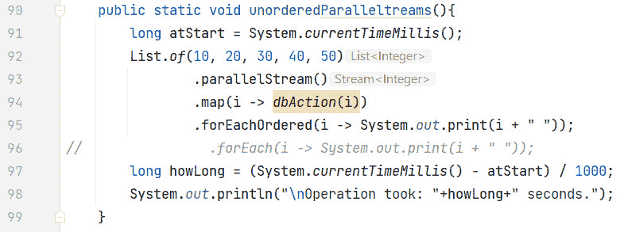

图 16.20 - forEachOrdered() 方法

在此图中，终端操作不再是 `forEach()`，而是 `forEachOrdered()`。此图的输出如下：

```java
10 20 30 40 50Operation took: 1 seconds.
```

现在整数是有序的，由于 `map()` 是并发应用的，性能提升仍然非常显著。

## 使用 reduce() 进行并行归约

由于并行流不保证顺序，并行归约的结果可能会出乎意料。归约操作将流合并成一个单一的结果。回想一下，重载的 `reduce()` 操作接受三个参数：一个恒等元、一个累加器和一个组合器。组合器函数在并行环境中用于组合累加器的结果。以下示例将要展示的是，*累加器和组合器必须能够在它们执行的任何顺序下工作*。它们必须是结合律的。

结合律

如果以下条件成立，则运算符或函数被认为是结合律的：

`(a op b) op c)` == `a op (b` `op c)`.

例如，加法是结合律的：

`(2 + 3) + 4` == `2 + (3 + 4)` == `9`

然而，减法不是结合律的：

`(2 - 3) - 4` == `-5` 而 `2 - (3 - 4)` == `3`

这在并行处理中非常重要。例如：

`a op b op c op d` == `(a op b) op (c op d)`

如果`op`是结合律的，那么`(a op b)`和`(c op d)`可以并行评估；然后对结果执行`op`操作。

让我们首先检查串行归约：

```java
   int result = Stream.of(1,2,3,4,5)                                .reduce(0,
                                              (n1, n2) -> n1 - n2);
   System.out.println(result); // -15
```

由于这是一个串行归约，不需要组合器。结果是-15。现在让我们检查并行版本，看看我们是否得到相同的结果。*图 16**.21*表示代码（ParallelStreams.java）。

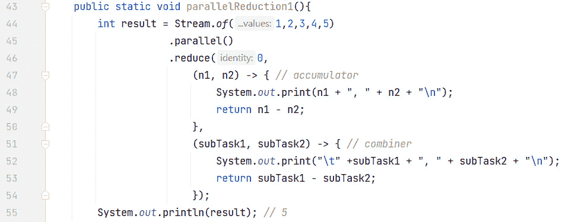

图 16.21 - 使用 reduce()的并行归约

在这个图中，我们将累加器和组合器都扩展了，以显示它们出现的值：

```java
(n1, n2) -> { // accumulator    System.out.print(n1 + ", " + n2 + "\n");
    return n1 - n2;
},
(subTask1, subTask2) -> { // combiner
    System.out.print("\t" +subTask1 + ", " + subTask2 + "\n");
    return subTask1 - subTask2;
}
```

输出如下（组合子任务值缩进）：

```java
0, 1           // (identity, 1) == -1        // line 10, 3           // (identity, 3) == -3        // line 2
0, 5           // (identity, 5) == -5        // line 3
0, 2           // (identity, 2) == -2        // line 4
0, 4           // (identity, 4) == -4        // line 5
    -1, -2     // (line 1, line 4)        // line 6
    -4, -5     // (line 5, line 3)        // line 7
    -3, 1      // (line 2, line 6)        // line 8
    1, -4      // (line 7, line 8)        // line 9
5                 // line 9
```

注意，最终结果是`5`，这是不正确的。这是因为减法不是结合律的。有趣的是，在并行过程中，恒等式被应用于流中的多个元素，从而产生了意外的结果。

## 使用 collect()的并行归约

`collect()`方法与`reduce()`一样，有一个三个参数的版本，它接受一个累加器和组合器。对于第一个参数，`collect()`使用一个`Supplier`而不是恒等式。同样的规则也适用于这里 - 累加器和组合器操作必须能够以任何顺序执行。

应该使用并发集合，以避免并发线程导致`ConcurrentModificationException`。另一个考虑因素是目标集合 - 如果它是有序的（例如，一个`List`），那么维护该顺序所需的背景处理可能会降低性能。*图 16**.22*展示了并发集合的一个例子，即代码中的`ConcurrentMap`（ParallelStreams.java）。

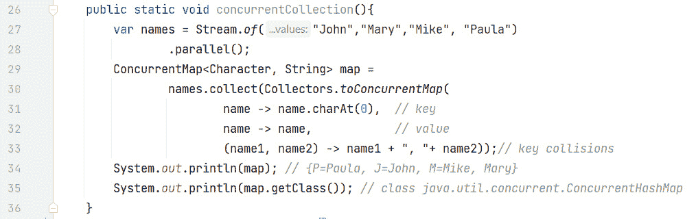

图 16.22 - collect()返回一个并发集合

代码的输出如下：

```java
   {P=Paula, J=John, M=Mike, Mary}   class java.util.concurrent.ConcurrentHashMap
```

因此，这里的`ConcurrentMap`实现是一个`ConcurrentHashMap`。这并不保证，但某些`ConcurrentMap`接口的实现是保证的。

我们映射的键是名称的第一个字母：

```java
   name -> name.charAt(0),  // key
```

与键关联的值是名称本身：

```java
   name -> name,            // value
```

如果多个名称以相同的字母开头，则名称将附加，名称之间用逗号分隔：

```java
   (name1, name2) -> name1 + ", "+ name2));// key collisions
```

这完成了我们对并行流的讨论，并且确实结束了第十六章*.* 现在，让我们将这一知识付诸实践，以巩固这些概念。

# 练习

1.  为了使公园运行顺畅，我们需要跟踪所有恐龙的健康状况。我们需要识别任何生病的恐龙。使用`Dinosaur`对象的流，过滤掉生病的恐龙（假设`Dinosaur`类中存在`isIll()`方法），将它们映射到它们的名称，并将结果收集到一个列表中。最后，打印出需要立即关注的恐龙名称列表。

1.  管理这样一个规模的恐龙公园涉及到处理大量数据。为了在公园中关于恐龙喂食时间的公告，创建一个恐龙列表，将其转换为流，并使用`map()`函数获取恐龙名称列表。然后，使用`forEach`终端操作为每个恐龙的喂食时间打印出一条消息。

1.  跟踪所有恐龙所需的总食物量可能很棘手。假设你有一个包含所有恐龙重量的数组。将其转换为`IntStream`并使用`sum`方法获取公园中所有恐龙的总重量。这可以帮助你估计总食物需求。

1.  当处理关于恐龙或员工的数据时，我们可能会遇到空引用。为了避免`NullPointerException`错误，在从恐龙映射中按名称检索恐龙时使用`Optional`。如果提供的名称的恐龙不存在，`Optional`应返回一条消息，表明恐龙尚未找到。

1.  计算恐龙的平均重量可能是一个耗时操作，尤其是在处理大量恐龙时。为了加快处理速度，使用并行流。将恐龙重量列表转换为并行流并使用平均方法计算平均重量。

# 项目 - 动态恐龙护理系统

将 Stream API 集成到你的恐龙护理系统中以处理大量的恐龙数据，例如健康记录、喂食时间表等。系统还应适当地采用`Optional`和并行流，优化数据处理并最小化潜在的空指针异常。

这里是让你达到目的的步骤：

1.  `Dinosaur`类具有`name`、`species`、`healthStatus`等属性。还应该有一个`DinosaurCareSystem`类来实现主要功能。

1.  从记录列表中`Stream`并使用`filter`方法获取这些记录。以下是一个示例：`List<HealthRecord> criticalRecords = records.stream().filter(r -> r.getHealthStatus() < CRITICAL_THRESHOLD).collect(Collectors.toList())`.

1.  使用`Stream`来过滤时间表。以下是一个示例：`List<FeedingSchedule> morningFeeds = schedules.stream().filter(s -> s.getTime().isBefore(LocalTime.NOON)).collect(Collectors.toList())`.

1.  使用`NullPointerException`和`Optional`来避免`NullPointerException`错误。以下是一个示例：`Optional.ofNullable(dinosaur.getTrainer()).map(Trainer::getName).orElse("No trainer assigned").`

+   在前面的示例中使用`stream()`和`parallelStream()`。然而，要注意，并非每个问题都适合并行处理。如果任务有依赖关系或需要按特定顺序处理，请坚持使用常规流。

# 摘要

在本章中，我们探讨了高级流概念。我们首先探索了中间操作，这些操作非常强大，因为它们将流转换成另一个流。流行的中间操作包括：`filter()`、`distinct()`、`limit()`、`map()`、`flatMap()`和`sorted()`。其中一些被称为*有状态的*，因为它们需要维护一些状态才能有效地操作。例如，`limit()`和`sorted()`。`limit()`方法也是*短路*的，因为它可以在源中还有更多数据可用的情况下关闭管道。

然后，我们检查了 API 中的原始流类型，即`IntStream`、`LongStream`和`DoubleStream`。这些类型有一些非常实用的方法来操作数值类型，例如`sum()`和`average()`。我们还解释了新的原始流功能接口及其功能方法的命名背后的模式。

我们可以通过将另一个流映射来创建流。有许多方法可以做到这一点，但它们的命名遵循一定的模式。我们检查了这些方法并解释了这些模式。

`Optional`是可能为空或不为空的盒子。它们主要用于方法返回类型，其中确实需要表示“无结果”。而不是返回`null`（及其陷阱），我们可以返回一个空的`Optional`。我们可以使用`Optional.of`、`Optional.empty()`和`Optional.ofNullable()`来创建`Optional`。`Optional` API 支持函数式编程风格；例如，`ifPresent()`让我们可以清楚地表达我们想要的内容，而无需`else`语句。我们还检查了原始的`Optional`，即`OptionalInt`、`OptionalLong`和`OptionalDouble`。

最后，我们研究了并行流，可以使用`Collection` API 方法`parallelStream()`或`Stream` API 方法`parallel()`轻松创建。虽然顺序流是有序的，但并行流不是。这是由于并行分解，任务被分解并在稍后重新组装。在并行多线程环境中，线程可以以任何顺序接收子任务，并以任何顺序返回结果。这对于关联任务（如加法）是可以的，但不适合减法。

如果你正在使用并行减少方法`reduce()`和`collect()`，请确保累加器和组合函数是关联的；因为它们必须在不考虑执行顺序的情况下正确工作。

这就完成了我们对流的讨论。下一章，并发，将进一步巩固这里关于并行流的最后部分。
