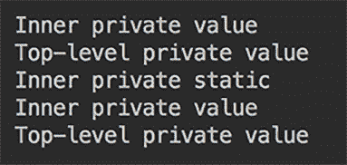
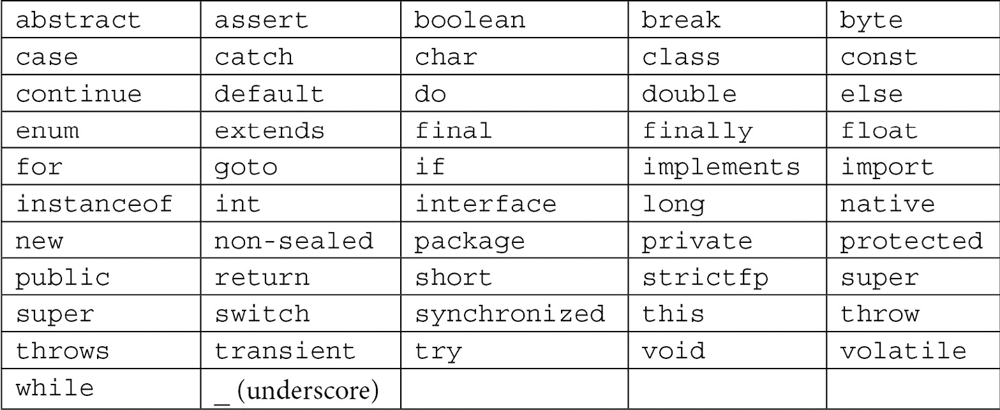

# 第三章：Java 基础知识

本章向您展示了 Java 作为语言的更详细视图。它从包中的代码组织以及类（接口）及其方法、属性（字段）的可访问性级别描述开始。作为 Java 面向对象性质的主要类型，引用类型也进行了详细说明，随后列出了保留和受限关键字及其用法讨论。本章最后介绍了不同原始类型之间的转换方法，以及从原始类型到相应引用类型及其反向转换的方法。

这些是 Java 语言的基本术语和功能。理解它们的重要性不容忽视。没有它们，您无法编写任何 Java 程序。因此，请尽量不要急于翻阅本章，并确保您理解了所展示的所有内容。

本章将涵盖以下主题：

+   包、导入和访问

+   Java 引用类型

+   保留和受限关键字

+   `this` 和 `super` 关键字的用法

+   在原始类型之间进行转换

+   在原始类型和引用类型之间进行转换

# 技术要求

要执行本章提供的代码示例，您需要以下内容：

+   一台装有 Microsoft Windows、Apple macOS 或 Linux 操作系统的计算机

+   Java SE 版本 17 或更高版本

+   您偏好的 IDE 或代码编辑器

本书在*第一章*“Java 17 入门”中提供了如何设置 Java SE 和 IntelliJ IDEA 编辑器的说明。本章的代码示例文件可在 GitHub 仓库的 `examples/src/main/java/com/packt/learnjava/ch03_fundamentals` 文件夹中找到，网址为 [`github.com/PacktPublishing/Learn-Java-17-Programming.git`](https://github.com/PacktPublishing/Learn-Java-17-Programming.git)。

# 包、导入和访问

如您所知，包名反映了目录结构，从包含 `.java` 文件的项目目录开始。每个 `.java` 文件的名字必须与其中声明的顶层类名相同（此类可以包含其他类）。`.java` 文件的第一行是包声明，以 `package` 关键字开始，后跟实际的包名——该文件在目录路径中的斜杠被点号替换。

包名和类名一起组成**完全限定类名**。它唯一地标识了该类，但通常太长且不便使用。这时，**导入**就派上用场，允许只指定一次完全限定名，然后只通过类名来引用该类。

从另一个类的类方法中调用一个类的方法只有在调用者可以访问该类及其方法时才可能。`public`、`protected`和`private`访问修饰符定义了可访问性级别，并允许（或不允许）某些方法、属性，甚至类本身对其他类可见。

当前节将详细讨论所有这些方面。

## 包

让我们看看我们称之为`Packages`的类：

```java
package com.packt.learnjava.ch03_fundamentals;
```

```java
import com.packt.learnjava.ch02_oop.hiding.C;
```

```java
import com.packt.learnjava.ch02_oop.hiding.D;
```

```java
public class Packages {
```

```java
    public void method(){
```

```java
        C c = new C();
```

```java
        D d = new D();
```

```java
    }
```

```java
}
```

`Packages`类的第一行是一个包声明，它标识了类在源树中的位置，换句话说，在文件系统中的`.java`文件位置。当类被编译并生成包含字节码的`.class`文件时，包名也反映了文件系统中的`.class`文件位置。

## 导入

在包声明之后，跟随的是`import`语句。正如你从前面的例子中看到的，它们允许你在当前类（或接口）的任何地方避免使用完全限定的类（或接口）名称。当从同一个包中导入许多类（或接口）时，可以使用`*`符号将同一包中的所有类和接口作为一组导入。在我们的例子中，它看起来如下所示：

```java
import com.packt.learnjava.ch02_oop.hiding.*;
```

但这不是一个推荐的做法，因为它在作为一组导入多个包时隐藏了导入的类（或接口）的位置。例如，看看这个代码片段：

```java
package com.packt.learnjava.ch03_fundamentals;
```

```java
import com.packt.learnjava.ch02_oop.*;
```

```java
import com.packt.learnjava.ch02_oop.hiding.*;
```

```java
public class Packages {
```

```java
    public void method(){
```

```java
        C c = new C();
```

```java
        D d = new D();
```

```java
    }
```

```java
}
```

在前面的代码中，你能猜出类`C`或类`D`属于哪个包吗？还有可能两个不同包中的类有相同的名称。如果是这样，分组导入可能会造成一定程度的混淆，甚至可能是一个难以确定的问题。

还可以导入单个静态类（或接口）成员。例如，如果`SomeInterface`有一个`NAME`属性（作为一个提醒，接口属性默认是公共和静态的），你通常可以这样引用它：

```java
package com.packt.learnjava.ch03_fundamentals;
```

```java
import com.packt.learnjava.ch02_oop.SomeInterface;
```

```java
public class Packages {
```

```java
    public void method(){
```

```java
        System.out.println(SomeInterface.NAME);
```

```java
    }
```

```java
}
```

为了避免使用甚至接口名称，你可以使用静态导入：

```java
package com.packt.learnjava.ch03_fundamentals;
```

```java
import static com.packt.learnjava.ch02_oop.SomeInterface.NAME;
```

```java
public class Packages {
```

```java
    public void method(){
```

```java
        System.out.println(NAME);
```

```java
    }
```

```java
}
```

类似地，如果`SomeClass`有一个公共静态属性`someProperty`和一个公共静态方法`someMethod()`，你也可以将它们静态导入：

```java
package com.packt.learnjava.ch03_fundamentals;
```

```java
import com.packt.learnjava.ch02_oop.StaticMembers.SomeClass;
```

```java
import com.packt.learnjava.ch02_oop.hiding.C;
```

```java
import com.packt.learnjava.ch02_oop.hiding.D;
```

```java
import static com.packt.learnjava.ch02_oop.StaticMembers
```

```java
                                         .SomeClass.someMethod;
```

```java
import static com.packt.learnjava.ch02_oop.StaticMembers
```

```java
                                      .SomeClass.SOME_PROPERTY;
```

```java
public class Packages {
```

```java
    public static void main(String... args){
```

```java
        C c = new C();
```

```java
        D d = new D();
```

```java
        SomeClass obj = new SomeClass();
```

```java
        someMethod(42);
```

```java
        System.out.println(SOME_PROPERTY);    //prints: abc
```

```java
    }
```

```java
}
```

但这种技术应该明智地使用，因为它可能会给人留下这样的印象：静态导入的方法或属性属于当前类。

## 访问修饰符

我们已经在我们的例子中使用了三种访问修饰符——`public`、`protected`和`private`——它们从外部（来自其它类或接口）调节对类、接口及其成员的访问。还有一个第四个隐含的（也称为**默认修饰符包私有**）修饰符，当没有指定这三个显式访问修饰符时应用。

他们的使用效果相当直接：

+   `public`：可被当前和其它包中的其它类和接口访问

+   `protected`：只能被同一包中的其它成员和类的子类访问

+   没有访问修饰符：仅对同一包的其他成员可访问

+   `private`：仅对同一类的成员可访问

从类或接口内部，所有类或接口成员总是可访问的。此外，正如我们已多次声明，所有接口成员默认是公共的，除非声明为`private`。

此外，请注意，类的可访问性高于类成员的可访问性，因为如果类本身在某处不可访问，其方法或属性的访问性变化也无法使其变得可访问。

当人们谈论类和接口的访问修饰符时，他们指的是在其它类或接口内部声明的类和接口。包含它们的类或接口被称为顶层类或接口，而它们内部的是内部类或接口。静态内部类也被称为静态嵌套类。

声明顶层类或接口为`private`是没有意义的，因为它将无法从任何地方访问。而且，Java 的作者决定不允许顶层类或接口被声明为`protected`。尽管如此，可以有一个没有显式访问修饰符的类，这样它就只能被同一包的成员访问。

这里有一个例子：

```java
public class AccessModifiers {
```

```java
    String prop1;
```

```java
    private String prop2;
```

```java
    protected String prop3;
```

```java
    public String prop4;
```

```java
    void method1(){ }
```

```java
    private void method2(){ }
```

```java
    protected void method3(){ }
```

```java
    public void method4(){ }
```

```java
    class A1{ }
```

```java
    private class A2{ }
```

```java
    protected class A3{ }
```

```java
    public class A4{ }
```

```java
    interface I1 {}
```

```java
    private interface I2 {}
```

```java
    protected interface I3 {}
```

```java
    public interface I4 {}
```

```java
}
```

请注意，静态嵌套类无法访问顶层类的其他成员。

内部类的另一个特别之处在于，它可以访问顶层类的所有成员，包括私有成员，反之亦然。为了演示这一特性，让我们在顶层类和一个`private`内部类中创建以下私有属性和方法：

```java
public class AccessModifiers {
```

```java
    private String topLevelPrivateProperty = 
```

```java
                                     "Top-level private value";
```

```java
    private void topLevelPrivateMethod(){
```

```java
        var inner = new InnerClass();
```

```java
        System.out.println(inner.innerPrivateProperty);
```

```java
        inner.innerPrivateMethod();
```

```java
    }
```

```java
    private class InnerClass {
```

```java
        //private static String PROP = "Inner static"; //error
```

```java
        private String innerPrivateProperty = 
```

```java
                                         "Inner private value";
```

```java
        private void innerPrivateMethod(){
```

```java
            System.out.println(topLevelPrivateProperty);
```

```java
        }
```

```java
    }
```

```java
    private static class InnerStaticClass {
```

```java
        private static String PROP = "Inner private static";
```

```java
        private String innerPrivateProperty = 
```

```java
                                         "Inner private value";
```

```java
        private void innerPrivateMethod(){
```

```java
            var top = new AccessModifiers();
```

```java
            System.out.println(top.topLevelPrivateProperty);
```

```java
        }
```

```java
    }
```

```java
}
```

如你所见，前述类中的所有方法和属性都是私有的，这意味着通常它们不能从类外部访问。这对于`AccessModifiers`类也是如此——它的私有方法和属性对声明在其外部的其他类不可访问。但是`InnerClass`类可以访问顶层类的私有成员，而顶层类可以访问其内部类的私有成员。唯一的限制是非静态内部类不能有静态成员。相比之下，静态嵌套类可以既有静态成员也有非静态成员，这使得静态嵌套类更加实用。

为了演示所有描述的可能性，我们将在`AccessModifiers`类中添加以下`main()`方法：

```java
public static void main(String... args){
```

```java
    var top = new AccessModifiers();
```

```java
    top.topLevelPrivateMethod();
```

```java
    //var inner = new InnerClass();  //compiler error
```

```java
    System.out.println(InnerStaticClass.PROP);
```

```java
    var inner = new InnerStaticClass();
```

```java
    System.out.println(inner.innerPrivateProperty);
```

```java
    inner.innerPrivateMethod();
```

```java
}
```

自然地，非静态内部类不能从顶层类的静态上下文中访问，因此前述代码中的`编译器错误`注释。如果我们运行它，结果将如下所示：



输出的前两行来自`topLevelPrivateMethod()`，其余来自`main()`方法。正如你所见，内部类和顶层类可以相互访问对方的私有状态，这些状态从外部是无法访问的。

# Java 引用类型

`new`运算符创建一个类的对象，并返回对象所在内存位置的引用。从实际的角度来看，持有这个引用的变量在代码中被当作对象本身来处理。这样的变量可以是类、接口、数组或表示没有分配内存引用的`null`字面量。如果引用的类型是接口，它可以被赋值为`null`或实现此接口的类的对象引用，因为接口本身不能被实例化。

JVM 会监视所有创建的对象，并检查当前执行代码中是否有对每个对象的引用。如果一个对象没有任何引用，JVM 会在一个称为**垃圾回收**的过程中将其从内存中移除。我们将在*第九章*，*JVM 结构和垃圾回收*中描述这个过程。例如，一个对象在方法执行期间被创建，并被局部变量引用。这个引用将在方法执行完毕后消失。

您已经看到了自定义类和接口的示例，我们之前也已经讨论了`String`类（见*第一章*，*Java 17 入门*）。在本节中，我们还将描述两种其他的 Java 引用类型——数组和枚举——并演示如何使用它们。

## 类和接口

使用相应的类名声明一个类类型的变量：

```java
<Class name> identifier;
```

可以赋值给此类变量的值可以是以下之一：

+   `null`字面量引用类型（这意味着变量可以被使用，但不指向任何对象）

+   对同一类或其任何子类的对象的引用（因为子类继承了所有祖先的类型）

这种最后的赋值类型称为`java.lang.Object`，以下赋值可以对任何类进行：

```java
Object obj = new AnyClassName();
```

这种赋值也称为**向上转型**，因为它将变量的类型向上移动到继承线上（这就像任何家谱一样，通常将最古老的祖先放在顶部）。

在这样的向上转型之后，可以使用`(type)`类型转换运算符进行缩窄赋值：

```java
AnyClassName anyClassName = (AnyClassName)obj;
```

这种赋值也称为`instanceof`运算符（见*第二章*，*Java 面向对象编程（OOP）*）来检查引用类型。

同样，如果一个类实现了某个接口，其对象引用可以被赋值给这个接口或接口的任何祖先：

```java
interface C {}
```

```java
interface B extends C {}
```

```java
class A implements B { }
```

```java
B b = new A();
```

```java
C c = new A();
```

```java
A a1 = (A)b;
```

```java
A a2 = (A)c;
```

如您所见，与类引用的向上转型和向下转型一样，在将对象的引用赋给实现了接口类型之一的变量之后，可以恢复对象的原始类型。

本节的内容也可以被视为 Java 多态性在行动中的另一个演示。

## 数组

同样也是一个`java.lang.Object`类。数组元素与声明的数组类型相同。元素的数量可能为零，在这种情况下，数组被称为空数组。每个元素可以通过索引访问，索引是一个正整数或零。第一个元素的索引为零。元素的数量称为数组长度。一旦创建了数组，其长度就不会改变。

以下是一些数组声明的示例：

```java
int[] intArray;
```

```java
float[][] floatArray;
```

```java
String[] stringArray;
```

```java
SomeClass[][][] arr;
```

每一对括号表示另一个维度。括号对的数量是数组的嵌套深度：

```java
int[] intArray = new int[10];
```

```java
float[][] floatArray = new float[3][4];
```

```java
String[] stringArray = new String[2];
```

```java
SomeClass[][][] arr = new SomeClass[3][5][2];
```

`new`运算符为可以分配（填充）值的每个元素分配内存。但在我这个例子中，数组的元素在创建时被初始化为默认值，如下例所示：

```java
System.out.println(intArray[3]);      //prints: 0
```

```java
System.out.println(floatArray[2][2]); //prints: 0.0
```

```java
System.out.println(stringArray[1]);   //prints: null
```

创建数组的另一种方法是使用数组初始化器——每个维度中用大括号括起来的逗号分隔的值列表，如下所示：

```java
int[] intArray = {1,2,3,4,5,6,7,8,9,10};
```

```java
float[][] floatArray ={{1.1f,2.2f,3,2},{10,20.f,30.f,5},{1,2,3,4}};
```

```java
String[] stringArray = {"abc", "a23"};
```

```java
System.out.println(intArray[3]);      //prints: 4
```

```java
System.out.println(floatArray[2][2]); //prints: 3.0
```

```java
System.out.println(stringArray[1]);   //prints: a23
```

可以不声明每个维度的长度来创建多维数组。只需指定第一个维度的长度：

```java
float[][] floatArray = new float[3][];
```

```java
System.out.println(floatArray.length);  //prints: 3
```

```java
System.out.println(floatArray[0]);      //prints: null
```

```java
System.out.println(floatArray[1]);      //prints: null
```

```java
System.out.println(floatArray[2]);      //prints: null
```

```java
//System.out.println(floatArray[3]);    //error
```

```java
//System.out.println(floatArray[2][2]); //error
```

其他维度的长度可以稍后指定：

```java
float[][] floatArray = new float[3][];
```

```java
floatArray[0] = new float[4];
```

```java
floatArray[1] = new float[3];
```

```java
floatArray[2] = new float[7];
```

```java
System.out.println(floatArray[2][5]);   //prints: 0.0
```

这样，就可以为不同的维度分配不同的长度。使用数组初始化器，也可以创建不同长度的维度：

```java
float[][] floatArray ={{1.1f},{10,5},{1,2,3,4}};
```

唯一的要求是，在可以使用之前，必须初始化维度。

## Enum

`java.lang.Enum`类，它反过来扩展了`java.lang.Object`。它允许指定一组有限的常量，每个常量都是同一类型的实例。此类集合的声明以`enum`关键字开始。以下是一个示例：

```java
enum Season { SPRING, SUMMER, AUTUMN, WINTER }
```

列出的每个项目——`SPRING`、`SUMMER`、`AUTUMN`和`WINTER`——都是`Season`类型的实例。它们是`Season`类可以拥有的唯一四个实例。它们是预先创建的，可以在任何地方用作`Season`类型的值。不能创建`Season`类的其他实例，这就是创建`enum`类型的原因——它可以在需要将类的实例列表限制为固定集合的情况下使用。

`enum`声明也可以写成标题大小写：

```java
enum Season { Spring, Summer, Autumn, Winter }
```

然而，全大写风格的使用更为常见，因为我们之前提到，有一个约定，即用大写字母表示静态最终常量的标识符。这有助于区分常量和变量。`enum`常量隐式地是静态和最终的。

因为`enum`值是常量，它们在 JVM 中唯一存在，可以通过引用进行比较：

```java
Season season = Season.WINTER;
```

```java
boolean b = season == Season.WINTER;
```

```java
System.out.println(b);   //prints: true
```

以下是最常用的`java.lang.Enum`类的方法：

+   `name()`: 返回`enum`常量的标识符，正如它在声明时拼写的那样（例如`WINTER`）。

+   `toString()`: 默认情况下返回与`name()`方法相同的值，但可以重写以返回任何其他`String`值。

+   `ordinal()`: 返回`enum`常量在声明时的位置（列表中的第一个具有`0`序数值）。

+   `valueOf(Class enumType, String name)`: 通过其名称（以字符串字面量表示）返回`enum`常量对象。

+   `values()`: 这是一个静态方法，在`valueOff()`方法的文档中描述如下：“可以通过调用该类的隐式`public static T[] values()`方法来获取一个`enum`类的所有常量。”

为了演示前面的方法，我们将使用已经熟悉的`enum`，`Season`：

```java
enum Season { SPRING, SUMMER, AUTUMN, WINTER }
```

下面是演示代码：

```java
System.out.println(Season.SPRING.name());      //prints: SPRING
```

```java
System.out.println(Season.WINTER.toString());  //prints: WINTER
```

```java
System.out.println(Season.SUMMER.ordinal());        //prints: 1
```

```java
Season season = Enum.valueOf(Season.class, "AUTUMN");
```

```java
System.out.println(season == Season.AUTUMN);     //prints: true
```

```java
for(Season s: Season.values()){
```

```java
    System.out.print(s.name() + " "); 
```

```java
                          //prints: SPRING SUMMER AUTUMN WINTER
```

```java
}
```

为了重写`toString()`方法，让我们创建`Season1` `enum`：

```java
enum Season1 {
```

```java
    SPRING, SUMMER, AUTUMN, WINTER;
```

```java
    public String toString() {
```

```java
        return this.name().charAt(0) + 
```

```java
               this.name().substring(1).toLowerCase();
```

```java
    }
```

```java
}
```

下面是如何工作的示例：

```java
for(Season1 s: Season1.values()){
```

```java
    System.out.print(s.toString() + " "); 
```

```java
                          //prints: Spring Summer Autumn Winter
```

```java
}
```

可以向每个`enum`常量添加任何其他属性。例如，让我们给每个`enum`实例添加一个平均温度值：

```java
Enum Season2 {
```

```java
    SPRING(42), SUMMER(67), AUTUMN(32), WINTER(20);
```

```java
    private int temperature;
```

```java
    Season2(int temperature){
```

```java
    this.temperature = temperature;
```

```java
    }
```

```java
    public int getTemperature(){
```

```java
        return this.temperature;
```

```java
    }
```

```java
    public String toString() {
```

```java
        return this.name().charAt(0) +
```

```java
            this.name().substring(1).toLowerCase() +
```

```java
                "(" + this.temperature + ")";
```

```java
    }
```

```java
}
```

如果我们遍历`Season2` `enum`的值，结果将如下所示：

```java
for(Season2 s: Season2.values()){
```

```java
    System.out.print(s.toString() + " "); 
```

```java
          //prints: Spring(42) Summer(67) Autumn(32) Winter(20)
```

```java
}
```

在标准的 Java 库中，有几个`enum`类——例如，`java.time.Month`、`java.time.DayOfWeek`和`java.util.concurrent.TimeUnit`。

## 默认值和字面量

正如我们已经看到的，引用类型的默认值是`null`。一些资料称之为`null`。

唯一具有除`null`字面量之外字面量的引用类型是`String`类。我们已经在*第一章*，*Java 17 入门*中讨论了字符串。

## 将引用类型作为方法参数

当一个原始类型值传递到方法中时，我们使用它。如果我们不喜欢传递到方法中的值，我们可以随意更改它，并且不会对此多加思考：

```java
void modifyParameter(int x){
```

```java
    x = 2;
```

```java
}
```

我们对外部方法之外的变量值可能发生变化没有顾虑：

```java
int x = 1;
```

```java
modifyParameter(x);
```

```java
System.out.println(x);  //prints: 1
```

由于原始类型参数是通过值传递到方法中的，因此不可能在方法外部更改原始类型的参数值。这意味着值的副本被传递到方法中，因此即使方法内部的代码将其赋值为不同的值，原始值也不会受到影响。

参考类型的一个问题是，尽管引用本身是通过值传递的，但它仍然指向内存中的同一个原始对象，因此方法内部的代码可以访问并修改该对象。为了演示这一点，让我们创建一个`DemoClass`及其使用方法：

```java
class DemoClass{
```

```java
    private String prop;
```

```java
    public DemoClass(String prop) { this.prop = prop; }
```

```java
    public String getProp() { return prop; }
```

```java
    public void setProp(String prop) { this.prop = prop; }
```

```java
}
```

```java
void modifyParameter(DemoClass obj){
```

```java
    obj.setProp("Changed inside the method");
```

```java
}
```

如果我们使用前面的方法，结果将如下所示：

```java
DemoClass obj = new DemoClass("Is not changed");
```

```java
modifyParameter(obj);
```

```java
System.out.println(obj.getProp()); 
```

```java
                            //prints: Changed inside the method
```

这确实是一个很大的区别，不是吗？因此，你必须小心不要修改传入的对象，以避免产生不希望的效果。然而，这种效果偶尔被用来返回结果。但这并不属于最佳实践列表，因为它会使代码的可读性降低。修改传入的对象就像使用一个难以察觉的秘密通道。所以，只有在必要时才使用它。

即使传入的对象是一个包装原始值的类，这种效果仍然存在（我们将在 *“在 *转换原始类型和引用类型之间*”部分讨论原始值包装类型）。以下是 `DemoClass1` 和 `modifyParameter()` 方法的重载版本：

```java
class DemoClass1{
```

```java
    private Integer prop;
```

```java
    public DemoClass1(Integer prop) { this.prop = prop; }
```

```java
    public Integer getProp() { return prop; }
```

```java
    public void setProp(Integer prop) { this.prop = prop; }
```

```java
}
```

```java
void modifyParameter(DemoClass1 obj){
```

```java
    obj.setProp(Integer.valueOf(2));
```

```java
}
```

如果我们使用前面的方法，结果将如下所示：

```java
DemoClass1 obj = new DemoClass1(Integer.valueOf(1));
```

```java
modifyParameter(obj);
```

```java
System.out.println(obj.getProp());  //prints: 2
```

引用类型这种行为的唯一例外是 `String` 类的对象。以下是 `modifyParameter()` 方法的另一个重载版本：

```java
void modifyParameter(String obj){
```

```java
    obj = "Changed inside the method";
```

```java
}  
```

如果我们使用前面的方法，结果将如下所示：

```java
String obj = "Is not changed";
```

```java
modifyParameter(obj);
```

```java
System.out.println(obj); //prints: Is not changed
```

```java
obj = new String("Is not changed");
```

```java
modifyParameter(obj);
```

```java
System.out.println(obj); //prints: Is not changed
```

如您所见，无论我们使用字面量还是一个新的 `String` 对象，结果都相同——在将另一个值赋给它的方法之后，原始的 `String` 值并未改变。这正是我们在 *第一章*，*《Java 17 入门》中讨论的 `String` 值不可变特性的目的。

## `equals()` 方法

等号运算符（`==`），当应用于引用类型的变量时，比较的是引用本身，而不是对象的内容（状态）。但是，即使它们具有相同的内容，两个对象也总是有不同的内存引用。即使用于 `String` 对象，如果至少有一个是通过 `new` 运算符创建的，运算符（`==`）也会返回 `false`（参见 *第一章*，*《Java 17 入门》中关于 `String` 值不可变的讨论）。

要比较内容，可以使用 `equals()` 方法。在 `String` 类和数值类型包装类（`Integer`、`Float` 等）中的实现正是这样——比较对象的内容。

然而，`java.lang.Object` 类中的 `equals()` 方法仅比较引用，这是可以理解的，因为后代可能具有的可能内容种类繁多，而通用内容比较的实现根本不可行。这意味着每个需要 `equals()` 方法比较对象内容的 Java 对象——不仅仅是引用——都必须重新实现 `equals()` 方法，并因此覆盖 `java.lang.Object` 类中的实现，如下所示：

```java
  public boolean equals(Object obj) {
```

```java
       return (this == obj);
```

```java
}
```

相比之下，看看同样的方法在 `Integer` 类中的实现：

```java
private final int value;
```

```java
public boolean equals(Object obj) {
```

```java
    if (obj instanceof Integer) {
```

```java
        return value == ((Integer)obj).intValue();
```

```java
    }
```

```java
    return false;
```

```java
}
```

如您所见，它从输入对象中提取原始 `int` 值，并将其与当前对象的原始值进行比较。它根本不比较对象引用。

与之相反，`String` 类首先比较引用，如果引用不相同，则比较对象的内容：

```java
private final byte[] value;
```

```java
public boolean equals(Object anObject) {
```

```java
      if (this == anObject) {
```

```java
            return true;
```

```java
      }
```

```java
      if (anObject instanceof String) {
```

```java
         String aString = (String)anObject;
```

```java
         if (coder() == aString.coder()) {
```

```java
           return isLatin1() ? StringLatin1.equals(value, 
```

```java
             aString.value)
```

```java
                             : StringUTF16.equals(value, 
```

```java
             aString.value);
```

```java
         }
```

```java
      }
```

```java
      return false;
```

```java
}
```

`StringLatin1.equals()` 和 `StringUTF16.equals()` 方法逐字符比较值，而不仅仅是引用。

同样，如果应用程序代码需要通过内容比较两个对象，相应类中的 `equals()` 方法必须被重写。例如，让我们看看熟悉的 `DemoClass` 类：

```java
class DemoClass{
```

```java
    private String prop;
```

```java
    public DemoClass(String prop) { this.prop = prop; }
```

```java
    public String getProp() { return prop; }
```

```java
    public void setProp(String prop) { this.prop = prop; }
```

```java
}
```

我们可以手动添加 `equals()` 方法，但 IDE 可以帮助我们完成这项工作，如下所示：

1.  在类中右键单击关闭括号 `}` 之前的位置。

1.  选择 **生成** 然后按照提示操作。

最终，将生成并添加到类中的两个方法：

```java
@Override
```

```java
public boolean equals(Object o) {
```

```java
    if (this == o) return true;
```

```java
    if (!(o instanceof DemoClass)) return false;
```

```java
    DemoClass demoClass = (DemoClass) o;
```

```java
    return Objects.equals(getProp(), demoClass.getProp());
```

```java
}
```

```java
@Override
```

```java
public int hashCode() {
```

```java
    return Objects.hash(getProp());
```

```java
}
```

查看生成的代码时，请注意以下要点：

+   `@Override` 注解的使用——这确保了方法确实覆盖了祖先中的一个方法（具有相同的签名）。有了这个注解，如果您修改了方法并更改了签名（无意或有意），编译器（和您的 IDE）将立即抛出一个错误，告诉您在祖先类中没有这样的签名的方法。因此，它有助于早期发现错误。

+   `java.util.Objects` 类的使用——它包含许多非常有用的方法，包括 `equals()` 静态方法，它不仅比较引用，还使用 `equals()` 方法：

    ```java
         public static boolean equals(Object a, Object b) {
             return (a == b) || (a != null && a.equals(b));
         }
    ```

如我们之前所展示的，`String` 类中实现的 `equals()` 方法通过内容比较字符串，并因此服务于这个目的，因为 `DemoClass` 的 `getProp()` 方法返回一个字符串。

`hashCode()` 方法——此方法返回的整数唯一地标识了该特定对象（但请不要期望它在应用程序的不同运行之间是相同的）。如果只需要 `equals()` 方法，则不需要实现此方法。尽管如此，出于以防万一，如果此类对象将被收集到 `Set` 或基于哈希码的其他集合中，建议实现它（我们将在 *第六章*，*数据结构、泛型和常用工具*）中讨论 Java 集合）。

这两个方法都在 `Object` 中实现，因为许多算法使用 `equals()` 和 `hashCode()` 方法，并且如果您的应用程序没有实现这些方法，则可能无法正常工作。同时，您的对象可能不需要它们在您的应用程序中。然而，一旦您决定实现 `equals()` 方法，实现 `hashCode()` 方法也是一个好主意。此外，如您所见，IDE 可以在不产生任何开销的情况下完成这项工作。

# 保留和限制关键字

**关键字**是对于编译器有特定意义的单词，不能用作标识符。截至 Java 17，有 52 个保留关键字、5 个保留标识符、3 个保留词和 10 个限制性关键字。保留关键字不能在任何 Java 代码中使用作标识符，而限制性关键字只能在模块声明上下文中用作标识符。

## 保留关键字

以下是一份所有 Java 保留关键字的列表：



到目前为止，你应该对前面的大部分关键字都很熟悉。作为一个练习，你可以通过列表检查你记得多少。到目前为止，我们还没有讨论以下八个关键字：

+   `const`和`goto`是保留的，但尚未使用。

+   `assert`关键字用于`assert`语句中（我们将在*第四章*，*异常处理*）中使用。

+   `synchronized`关键字用于并发编程（我们将在*第八章*，*多线程与并发处理*）中使用。

+   `volatile`关键字使得变量的值不可缓存。

+   `transient`关键字使得变量的值不可序列化。

+   `strictfp`关键字限制了浮点数计算，使得在执行浮点变量操作时，每个平台上的结果都相同。

+   `native`关键字声明了一个在平台相关代码（如 C 或 C++）中实现的方法。

## 保留标识符

Java 中的五个保留标识符如下：

+   `permits`

+   `record`

+   `sealed`

+   `var`

+   `yield`

## 文字值的保留字

Java 中的三个保留字如下：

+   `true`

+   `false`

+   `null`

## 受限关键字

Java 中的 10 个受限关键字如下：

+   `open`

+   `module`

+   `requires`

+   `transitive`

+   `exports`

+   `opens`

+   `to`

+   `uses`

+   `provides`

+   `with`

它们被称为*受限*，因为它们不能在模块声明上下文中作为标识符，我们将在本书中不讨论这一点。在其他所有地方，它们都可以用作标识符，例如以下内容：

```java
String to = "To";
```

```java
String with = "abc";
```

虽然你可以这样做，但即使在不进行模块声明的情况下，不将它们用作标识符也是一个好习惯。

# `this`和`super`关键字的用法

`this`关键字提供了一个对当前对象的引用。`super`关键字指向父类对象。这些关键字允许我们引用在当前上下文和父对象中具有相同名称的变量或方法。

## `this`关键字的用法

这里是最受欢迎的例子：

```java
class A {
```

```java
    private int count;
```

```java
    public void setCount(int count) {
```

```java
        count = count;         // 1
```

```java
    }
```

```java
    public int getCount(){
```

```java
        return count;          // 2
```

```java
    }
```

```java
}
```

第一行看起来有些模糊，但实际上并非如此——局部变量`int count`隐藏了`int count`私有属性实例。我们可以通过运行以下代码来证明这一点：

```java
A a = new A();
```

```java
a.setCount(2);
```

```java
System.out.println(a.getCount());     //prints: 0
```

使用`this`关键字可以解决问题：

```java
class A {
```

```java
    private int count;
```

```java
    public void setCount(int count) {
```

```java
        this.count = count;         // 1
```

```java
    }
```

```java
    public int getCount(){
```

```java
        return this.count;          // 2
```

```java
    }
```

```java
}
```

在第`1`行添加`this`允许将值分配给实例属性。在第`2`行添加`this`没有区别，但每次使用`instance`属性时都使用`this`关键字是一个好习惯。这使得代码更易读，并有助于避免难以追踪的错误，例如我们刚才演示的那个。

我们也看到了`this`关键字在`equals()`方法中的使用：

```java
@Override
```

```java
public boolean equals(Object o) {
```

```java
    if (this == o) return true;
```

```java
    if (!(o instanceof DemoClass)) return false;
```

```java
    DemoClass demoClass = (DemoClass) o;
```

```java
    return Objects.equals(getProp(), demoClass.getProp());
```

```java
}
```

并且，为了提醒你，以下是我们曾在*第二章*，*Java 面向对象编程（OOP）*中展示的构造函数的例子：

```java
class TheChildClass extends TheParentClass{
```

```java
    private int x;
```

```java
    private String prop;
```

```java
    private String anotherProp = "abc";
```

```java
    public TheChildClass(String prop){
```

```java
        super(42);
```

```java
        this.prop = prop;
```

```java
    }
```

```java
    public TheChildClass(int arg1, String arg2){
```

```java
        super(arg1);
```

```java
        this.prop = arg2;
```

```java
    }
```

```java
    // methods follow
```

```java
}
```

在前面的代码中，你可以看到不仅有关键字 `this`，还有 `super` 关键字的使用，我们将在下一节讨论它的用法。在构造函数中，`super` 关键字已经展示了它的用法，它必须仅在第一行使用，因为父类对象必须在当前对象创建之前创建。如果构造函数的第一行不是 `super()`，这意味着父类有一个不带参数的构造函数。

## 超级关键字的使用

`super` 关键字指的是父对象。我们在构造函数中已经看到了它的用法，在 *超级关键字的使用* 部分，它必须仅在第一行使用，因为父类对象必须在当前对象创建之前创建。如果构造函数的第一行不是 `super()`，这意味着父类有一个不带参数的构造函数。

当一个方法被重写，并且需要调用父类的方法时，`super` 关键字特别有用：

```java
class B  {
```

```java
    public void someMethod() {
```

```java
        System.out.println("Method of B class");
```

```java
    }
```

```java
}
```

```java
class C extends B {
```

```java
    public void someMethod() {
```

```java
        System.out.println("Method of C class");
```

```java
    }
```

```java
    public void anotherMethod() {
```

```java
        this.someMethod();    //prints: Method of C class
```

```java
        super.someMethod();   //prints: Method of B class
```

```java
    }
```

```java
}
```

随着我们在这本书中的进展，我们将看到更多使用 `this` 和 `super` 关键字的例子。

# 原始类型之间的转换

一个数值类型可以持有的最大数值取决于为其分配的位数。以下是对每种数值类型表示的位数：

+   `byte`：8 位

+   `char`：16 位

+   `short`：16 位

+   `int`：32 位

+   `long`：64 位

+   `float`：32 位

+   `double`：64 位

当一个数值类型的值赋给另一个数值类型的变量，并且新类型可以容纳更大的数字时，这种转换称为 `cast` 操作符。

## 宽泛转换

根据 Java 语言规范，共有 19 种宽泛的原始类型转换：

+   `byte` 到 `short`、`int`、`long`、`float` 或 `double`

+   `short` 到 `int`、`long`、`float` 或 `double`

+   `char` 到 `int`、`long`、`float` 或 `double`

+   `int` 到 `long`、`float` 或 `double`

+   `long` 到 `float` 或 `double`

+   `float` 到 `double`

在整数类型之间的宽泛转换，以及某些整数类型到浮点类型的转换中，结果值与原始值完全匹配。然而，从 `int` 到 `float`、从 `long` 到 `float` 或从 `long` 到 `double` 的转换可能会导致精度损失。根据 Java 语言规范，结果浮点值可以使用 `IEEE 754 四舍五入到最接近的模式` 正确舍入。以下是一些演示精度损失的例子：

```java
int i = 123456789;
```

```java
double d = (double)i;
```

```java
System.out.println(i - (int)d);       //prints: 0
```

```java
long l1 = 12345678L;
```

```java
float f1 = (float)l1;
```

```java
System.out.println(l1 - (long)f1);    //prints: 0
```

```java
long l2 = 123456789L;
```

```java
float f2 = (float)l2;
```

```java
System.out.println(l2 - (long)f2);    //prints: -3
```

```java
long l3 = 1234567891111111L;
```

```java
double d3 = (double)l3;
```

```java
System.out.println(l3 - (long)d3);    //prints: 0
```

```java
long l4 = 12345678999999999L;
```

```java
double d4 = (double)l4;
```

```java
System.out.println(l4 - (long)d4);    //prints: -1 
```

如你所见，从 `int` 到 `double` 的转换会保留值，但 `long` 到 `float` 或 `long` 到 `double` 可能会丢失精度。这取决于值的大小。所以，如果你在计算中需要精确度，请注意并允许一些精度损失。

## 狭义转换

Java 语言规范确定了 22 种狭义原始类型转换：

+   `short` 到 `byte` 或 `char`

+   `char` 到 `byte` 或 `short`

+   `int` 到 `byte`、`short` 或 `char`

+   `long` 到 `byte`、`short`、`char` 或 `int`

+   `float` 到 `byte`、`short`、`char`、`int` 或 `long`

+   `double` 到 `byte`、`short`、`char`、`int`、`long` 或 `float`

与拓宽转换类似，缩窄转换可能会导致精度丢失，甚至可能丢失值的大小。缩窄转换比拓宽转换更复杂，我们不会在本书中讨论它。重要的是要记住，在执行缩窄之前，必须确保原始值小于目标类型的最大值。否则，您可能会得到一个完全不同的值（丢失了大小）。请看以下示例：

```java
System.out.println(Integer.MAX_VALUE); //prints: 2147483647
```

```java
double d1 = 1234567890.0;
```

```java
System.out.println((int)d1);           //prints: 1234567890
```

```java
double d2 = 12345678909999999999999.0;
```

```java
System.out.println((int)d2);           //prints: 2147483647
```

从示例中可以看出，如果不首先检查目标类型是否可以容纳该值，那么得到的结果将正好等于目标类型的最大值。其余的都将丢失，无论差异有多大。

重要提示

在执行缩窄转换之前，检查目标类型的最大值是否可以容纳原始值。

请注意，`char`类型与`byte`或`short`类型之间的转换是一个更为复杂的程序，因为`char`类型是一个无符号数值类型，而`byte`和`short`类型是有符号数值类型，所以即使一个值看起来似乎可以适应目标类型，也可能发生信息丢失。

## 转换方法

除了类型转换之外，每种原始类型都有一个相应的引用类型（称为`boolean`和`char`。所有的包装类都属于`java.lang`包）：

+   `java.lang.Boolean`

+   `java.lang.Byte`

+   `java.lang.Character`

+   `java.lang.Short`

+   `java.lang.Integer`

+   `java.lang.Long`

+   `java.lang.Float`

+   `java.lang.Double`

其中除了`Boolean`和`Character`类之外，它们都扩展了`java.lang.Number`抽象类，该抽象类有以下抽象方法：

+   `byteValue()`

+   `shortValue()`

+   `intValue()`

+   `longValue()`

+   `floatValue()`

+   `doubleValue()`

这种设计迫使`Number`类的后代实现所有这些方法。它们产生的结果与前面示例中的`cast`运算符相同：

```java
int i = 123456789;
```

```java
double d = Integer.valueOf(i).doubleValue();
```

```java
System.out.println(i - (int)d);          //prints: 0
```

```java
long l1 = 12345678L;
```

```java
float f1 = Long.valueOf(l1).floatValue();
```

```java
System.out.println(l1 - (long)f1);       //prints: 0
```

```java
long l2 = 123456789L;
```

```java
float f2 = Long.valueOf(l2).floatValue();
```

```java
System.out.println(l2 - (long)f2);       //prints: -3
```

```java
long l3 = 1234567891111111L;
```

```java
double d3 = Long.valueOf(l3).doubleValue();
```

```java
System.out.println(l3 - (long)d3);       //prints: 0
```

```java
long l4 = 12345678999999999L;
```

```java
double d4 = Long.valueOf(l4).doubleValue();
```

```java
System.out.println(l4 - (long)d4);       //prints: -1
```

```java
double d1 = 1234567890.0;
```

```java
System.out.println(Double.valueOf(d1)
```

```java
                         .intValue());   //prints: 1234567890
```

```java
double d2 = 12345678909999999999999.0;
```

```java
System.out.println(Double.valueOf(d2)
```

```java
                         .intValue());   //prints: 2147483647
```

此外，每个包装类都有方法，允许将数值的`String`表示形式转换为相应的原始数值类型或引用类型，如下所示：

```java
byte b1 = Byte.parseByte("42");
```

```java
System.out.println(b1);             //prints: 42
```

```java
Byte b2 = Byte.decode("42");
```

```java
System.out.println(b2);             //prints: 42
```

```java
boolean b3 = Boolean.getBoolean("property");
```

```java
System.out.println(b3);            //prints: false
```

```java
Boolean b4 = Boolean.valueOf("false");
```

```java
System.out.println(b4);            //prints: false
```

```java
int i1 = Integer.parseInt("42");
```

```java
System.out.println(i1);            //prints: 42
```

```java
Integer i2 = Integer.getInteger("property");
```

```java
System.out.println(i2);            //prints: null
```

```java
double d1 = Double.parseDouble("3.14");
```

```java
System.out.println(d1);            //prints: 3.14
```

```java
Double d2 = Double.valueOf("3.14");
```

```java
System.out.println(d2);            //prints: 3.14
```

在示例中，请注意接受`property`参数的两个方法。这两个方法以及其他包装类的类似方法将系统属性（如果存在）转换为相应的原始类型。

每个包装类都有一个`toString(primitive value)`静态方法，用于将原始类型值转换为它的`String`表示形式，如下所示：

```java
String s1 = Integer.toString(42);
```

```java
System.out.println(s1);            //prints: 42
```

```java
String s2 = Double.toString(3.14);
```

```java
System.out.println(s2);            //prints: 3.14
```

包装类有许多其他有用的转换方法，可以从一种原始类型转换为另一种原始类型，以及转换为不同的格式。因此，如果您需要做类似的事情，首先查看相应的包装类。

# 原始类型与引用类型之间的转换

将原始类型值转换为相应包装类的对象称为**装箱**。同样，将包装类的对象转换为相应原始类型值称为**拆箱**。

## 装箱

原始类型的装箱可以自动完成（每个包装类型都提供了名为`valueOf()`的方法）：

```java
int i1 = 42;
```

```java
Integer i2 = i1;              //autoboxing
```

```java
//Long l2 = i1;               //error
```

```java
System.out.println(i2);       //prints: 42
```

```java
i2 = Integer.valueOf(i1);
```

```java
System.out.println(i2);       //prints: 42
```

```java
Byte b = Byte.valueOf((byte)i1);
```

```java
System.out.println(b);       //prints: 42
```

```java
Short s = Short.valueOf((short)i1);
```

```java
System.out.println(s);       //prints: 42
```

```java
Long l = Long.valueOf(i1);
```

```java
System.out.println(l);       //prints: 42
```

```java
Float f = Float.valueOf(i1);
```

```java
System.out.println(f);       //prints: 42.0
```

```java
Double d = Double.valueOf(i1);
```

```java
System.out.println(d);       //prints: 42.0 
```

注意，自动装箱仅在相关包装类型之间才可能。否则，编译器会生成错误。

`Byte`和`Short`包装类的`valueOf()`方法的输入值需要强制类型转换，因为它是我们之前章节中讨论的原始类型缩窄。

## 拆箱

可以使用每个包装类中实现的`Number`类的方法来完成拆箱：

```java
Integer i1 = Integer.valueOf(42);
```

```java
int i2 = i1.intValue();
```

```java
System.out.println(i2);      //prints: 42
```

```java
byte b = i1.byteValue();
```

```java
System.out.println(b);       //prints: 42
```

```java
short s = i1.shortValue();
```

```java
System.out.println(s);       //prints: 42
```

```java
long l = i1.longValue();
```

```java
System.out.println(l);       //prints: 42
```

```java
float f = i1.floatValue();
```

```java
System.out.println(f);       //prints: 42.0
```

```java
double d = i1.doubleValue();
```

```java
System.out.println(d);       //prints: 42.0
```

```java
Long l1 = Long.valueOf(42L);
```

```java
long l2 = l1;                //implicit unboxing
```

```java
System.out.println(l2);      //prints: 42
```

```java
double d2 = l1;              //implicit unboxing
```

```java
System.out.println(d2);      //prints: 42.0
```

```java
long l3 = i1;                //implicit unboxing
```

```java
System.out.println(l3);      //prints: 42
```

```java
double d3 = i1;              //implicit unboxing
```

```java
System.out.println(d3);      //prints: 42.0
```

如您从示例中的注释中可以看到，从包装类型到相应原始类型的转换不被称为**自动拆箱**；而是称为**隐式拆箱**。与自动装箱不同，即使在包装类型和与之不匹配的原始类型之间，也可以使用隐式拆箱。

# 摘要

在本章中，您学习了 Java 包是什么以及它们在组织代码和类可访问性方面所起的作用，包括`import`语句和访问修饰符。您还熟悉了引用类型——类、接口、数组和枚举。任何引用类型的默认值都是`null`，包括`String`类型。

您现在应该理解了引用类型是如何通过引用传递给方法的，以及`equals()`方法的使用和重写方式。您还有机会研究完整的保留和限制关键字列表，并学习了`this`和`super`关键字的意义和用法。

本章通过描述原始类型、包装类型和`String`字面量之间的转换过程和方法来结束。

在下一章中，我们将讨论 Java 异常框架，检查和未检查（运行时）异常，`try-catch-finally`块，`throws`和`throw`语句，以及异常处理的最佳实践。

# 测验

1.  选择所有正确的语句：

    1.  `Package`语句描述了类或接口的位置。

    1.  `Package`语句描述了类或接口的名称。

    1.  `Package`是一个完全限定名。

    1.  `Package`名称和类名组成类的完全限定名。

1.  选择所有正确的语句：

    1.  `Import`语句允许使用完全限定名。

    1.  `Import`语句必须在`.java`文件的第一行。

    1.  `Group import`语句仅引入一个包中的类（和接口）。

    1.  `Import statement`允许避免使用完全限定名。

1.  选择所有正确的语句：

    1.  没有访问修饰符，类只能被同一包中的其他类和接口访问。

    1.  私有类的私有方法可以被同一 `.java` 文件中声明的其他类访问。

    1.  私有类的公共方法可以被同一包中但不在同一 `.java` 文件中声明的其他类访问。

    1.  受保护的（protected）方法只能被类的后代访问。

1.  选择所有正确的陈述：

    1.  私有方法可以被重载但不能被覆盖。

    1.  受保护的（protected）方法可以被覆盖但不能被重载。

    1.  没有访问修饰符的方法既可以被重载也可以被覆盖。

    1.  私有方法可以访问同一类的私有属性。

1.  选择所有正确的陈述：

    1.  狭义和向下转型是同义词。

    1.  扩展和向下转型是同义词。

    1.  扩展和向上转型是同义词。

    1.  扩展和狭义与向上转型和向下转型没有共同之处。

1.  选择所有正确的陈述：

    1.  `Array` 是一个对象。

    1.  `Array` 有一个表示它能容纳的元素数量的长度。

    1.  数组的第一个元素具有索引 1。

    1.  数组的第二个元素具有索引 1。

1.  选择所有正确的陈述：

    1.  `Enum` 包含常量。

    1.  `Enum` 总是有一个构造函数，无论是默认的还是显式的。

    1.  枚举（enum）常量可以有属性。

    1.  `Enum` 可以有任何引用类型的常量。

1.  选择所有正确的陈述：

    1.  任何作为参数传入的引用类型都可以被修改。

    1.  作为参数传入的 `new String()` 对象可以被修改。

    1.  作为参数传入的对象引用值不能被修改。

    1.  作为参数传入的数组可以有不同的值分配给其元素。

1.  选择所有正确的陈述：

    1.  保留关键字不能使用。

    1.  限制关键字不能用作标识符。

    1.  保留的 `identifier` 关键字不能用作标识符。

    1.  保留关键字不能用作标识符。

1.  选择所有正确的陈述：

    1.  `this` 关键字指的是当前类。

    1.  `super` 关键字指的是超类。

    1.  `this` 和 `super` 关键字指的是对象。

    1.  `this` 和 `super` 关键字指的是方法。

1.  选择所有正确的陈述：

    1.  原始类型的扩展会使值变大。

    1.  原始类型的狭义总是改变值的类型。

    1.  原始类型的扩展只能在转换狭义之后进行。

    1.  狭义会使值变小。

1.  选择所有正确的陈述：

    1.  装箱（Boxing）对值有限制。

    1.  解箱（Unboxing）创建了一个新值。

    1.  装箱（Boxing）创建了一个引用类型对象。

    1.  解箱（Unboxing）删除了一个引用类型对象。
