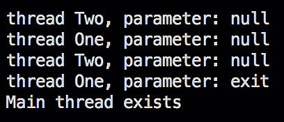
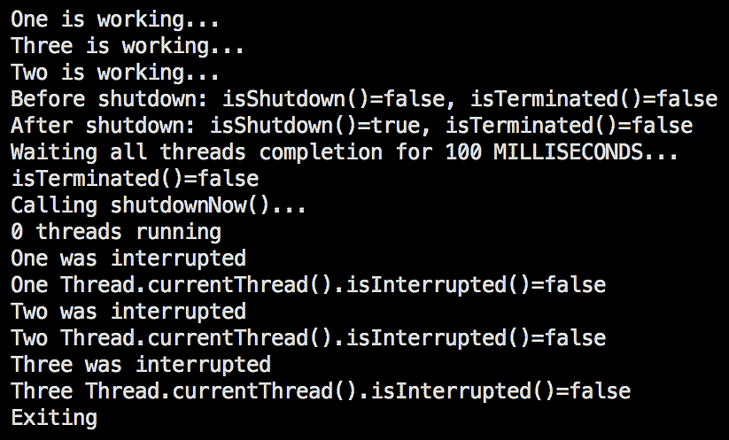
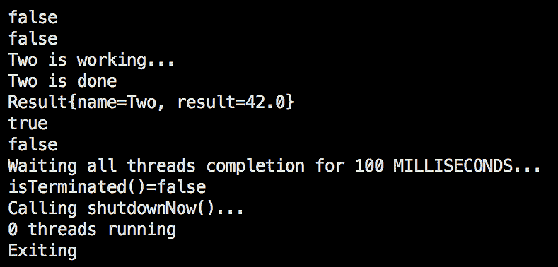
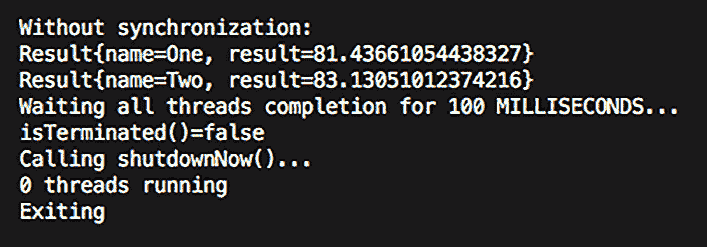
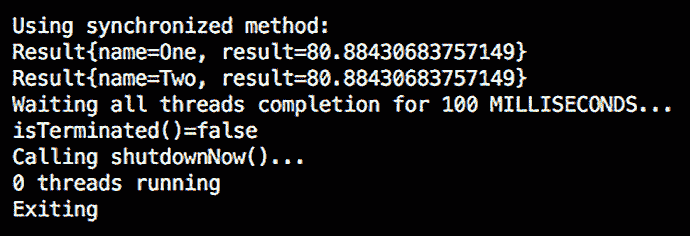
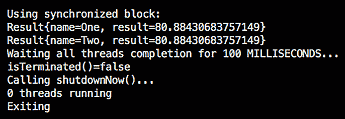
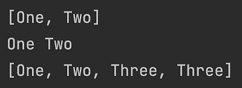

# 第八章：多线程与并发处理

在本章中，我们将讨论通过使用并发处理数据的工作者（线程）来提高 Java 应用程序性能的方法。我们将解释 Java 线程的概念并演示其用法。我们还将讨论并行处理与并发处理之间的区别以及如何避免由共享资源的并发修改引起的不可预测的结果。

完成本章后，您将能够编写多线程处理的代码——创建和执行线程，并在并行和并发情况下使用线程池。

本章将涵盖以下主题：

+   线程与进程

+   用户线程与守护线程

+   扩展`Thread`类

+   实现`Runnable`接口

+   扩展`Thread`类与实现`Runnable`接口

+   使用线程池

+   从线程获取结果

+   并行处理与并发处理

+   同一资源的并发修改

# 技术要求

要执行本章提供的代码示例，您需要以下内容：

+   一台装有 Microsoft Windows、Apple macOS 或 Linux 操作系统的计算机

+   Java **标准版**（**SE**）17 或更高版本

+   一个**集成开发环境**（**IDE**）或您偏好的代码编辑器

在*第一章*“Java 17 入门”中提供了如何设置 Java SE 和 IntelliJ IDEA 编辑器的说明。本章的代码示例文件可在 GitHub 的[`github.com/PacktPublishing/Learn-Java-17-Programming.git`](https://github.com/PacktPublishing/Learn-Java-17-Programming.git)仓库中的`examples/src/main/java/com/packt/learnjava/ch08_threads`文件夹找到。

# 线程与进程

Java 有两个执行单元——进程和线程。一个`java.lang.ProcessBuilder`。但由于多进程案例超出了本书的范围，我们将关注第二个执行单元——即线程，它类似于进程，但与其他线程的隔离性较低，执行所需的资源也更少。

一个进程可以运行多个线程，并且至少有一个称为**主线程**的线程——启动应用程序的那个线程——我们在每个示例中都使用它。线程可以共享资源，包括内存和打开的文件，这可以提高效率，但这也带来了代价：更高的意外互斥风险，甚至可能阻塞执行。这就是需要编程技能和对并发技术理解的地方。

# 用户线程与守护线程

有一种特殊的线程称为守护线程。

注意

词语*守护线程*起源于古希腊，意为介于神与人之间的自然神祇或超自然存在，以及内在或伴随的精神或灵感之源。

在计算机科学中，术语*守护*有更普通的用法，它被应用于*作为后台进程运行的计算机程序，而不是在交互式用户的直接控制之下*。这就是为什么 Java 中有以下两种类型的线程：

+   由应用程序启动的用户线程（默认）（主线程就是一个例子）

+   在支持用户线程活动时在后台工作的守护线程

正因如此，所有守护线程在最后一个用户线程退出后立即退出，或者在未处理的异常后由 JVM 终止。

# 扩展 Thread 类

创建线程的一种方式是扩展`java.lang.Thread`类并重写其`run()`方法。以下是一个这样的示例：

```java
class MyThread extends Thread {
```

```java
    private String parameter;
```

```java
    public MyThread(String parameter) {
```

```java
        this.parameter = parameter;
```

```java
    }
```

```java
    public void run() {
```

```java
        while(!"exit".equals(parameter)){
```

```java
           System.out.println((isDaemon() ? "daemon" 
```

```java
              : "  user") + " thread " + this.getName() + 
```

```java
              "(id=" + this.getId() + ") parameter: " +
```

```java
                                               parameter);
```

```java
            pauseOneSecond();
```

```java
        }
```

```java
        System.out.println((isDaemon() ? "daemon" 
```

```java
              : "  user") + " thread " + this.getName() + 
```

```java
              "(id=" + this.getId() + ") parameter: " +
```

```java
                                               parameter);
```

```java
    }
```

```java
    public void setParameter(String parameter) {
```

```java
        this.parameter = parameter;
```

```java
    }
```

```java
}
```

如果没有重写`run()`方法，线程将不执行任何操作。在我们的例子中，只要参数不等于`"exit"`字符串，线程就会每秒打印其名称和其他属性；否则，它将退出。

`pauseOneSecond()`方法看起来是这样的：

```java
private static void pauseOneSecond(){
```

```java
    try {
```

```java
        TimeUnit.SECONDS.sleep(1);
```

```java
    } catch (InterruptedException e) {
```

```java
        e.printStackTrace();
```

```java
    }
```

```java
}
```

我们现在可以使用`MyThread`类运行两个线程——一个用户线程和一个守护线程，如下所示：

```java
public static void main(String... args) {
```

```java
    MyThread thr1 = new MyThread("One");
```

```java
    thr1.start();
```

```java
    MyThread thr2 = new MyThread("Two");
```

```java
    thr2.setDaemon(true);
```

```java
    thr2.start();
```

```java
    pauseOneSecond();
```

```java
    thr1.setParameter("exit");
```

```java
    pauseOneSecond();
```

```java
    System.out.println("Main thread exists");
```

```java
}
```

如您所见，主线程创建了两个其他线程，暂停一秒，将用户线程的`exit`参数设置，再暂停一秒，最后退出（`main()`方法完成其执行）。

如果我们运行前面的代码，我们会看到类似这样的结果（`id`线程在不同的操作系统上可能不同）：


前面的截图显示，守护线程在最后一个用户线程（在我们的例子中是主线程）退出后自动退出。

# 实现 Runnable 接口

创建线程的第二种方式是使用实现`java.lang.Runnable`的类。以下是一个这样的类的示例，其功能几乎与`MyThread`类完全相同：

```java
class MyRunnable implements Runnable {
```

```java
    private String parameter, name;
```

```java
    public MyRunnable(String name) {
```

```java
        this.name = name;
```

```java
    }
```

```java
    public void run() {
```

```java
        while(!"exit".equals(parameter)){
```

```java
            System.out.println("thread " + this.name + 
```

```java
                              ", parameter: " + parameter);
```

```java
            pauseOneSecond();
```

```java
        }
```

```java
        System.out.println("thread " + this.name +
```

```java
                              ", parameter: " + parameter);
```

```java
    }
```

```java
    public void setParameter(String parameter) {
```

```java
        this.parameter = parameter;
```

```java
    }
```

```java
}
```

不同之处在于没有`isDaemon()`、`getId()`或任何其他现成方法。`MyRunnable`类可以是实现`Runnable`接口的任何类，因此我们无法打印线程是否是守护线程。我们添加了`name`属性，以便我们可以识别线程。

我们可以使用`MyRunnable`类创建与使用`MyThread`类类似线程，如下所示：

```java
public static void main(String... args) {
```

```java
    MyRunnable myRunnable1 = new MyRunnable("One");
```

```java
    MyRunnable myRunnable2 = new MyRunnable("Two");
```

```java
    Thread thr1 = new Thread(myRunnable1);
```

```java
    thr1.start();
```

```java
    Thread thr2 = new Thread(myRunnable2);
```

```java
    thr2.setDaemon(true);
```

```java
    thr2.start();
```

```java
    pauseOneSecond();
```

```java
    myRunnable1.setParameter("exit");
```

```java
    pauseOneSecond();
```

```java
    System.out.println("Main thread exists");
```

```java
}
```

以下截图证明`MyRunnable`类的行为与`MyThread`类的行为相似：



守护线程（命名为`Two`）在最后一个用户线程退出后退出——这与`MyThread`类发生的情况完全相同。

# 扩展线程与实现 Runnable

实现 `Runnable` 有优点（在某些情况下，是唯一可能的选择），即允许实现扩展另一个类。当你想要向现有类添加类似线程的行为时，这尤其有帮助。实现 `Runnable` 可以在使用上提供更多灵活性，但与其他扩展 `Thread` 类的功能相比，在功能上没有差异。

`Thread` 类有几个构造函数，允许设置线程名称和它所属的组。线程的分组有助于在多个线程并行运行时管理它们。`Thread` 类也有几个方法，可以提供有关线程状态及其属性的信息，并允许我们控制其行为。

如你所见，线程的 **标识符**（**ID**）是自动生成的。它不能更改，但在线程终止后可以重用。另一方面，可以设置几个线程具有相同的名称。

执行优先级也可以通过在 `Thread.MIN_PRIORITY` 和 `Thread.MAX_PRIORITY` 之间的值来程序化设置。值越小，线程被允许运行的时间越长，这意味着它具有更高的优先级。如果没有设置，优先级值默认为 `Thread.NORM_PRIORITY`。

线程的状态可以有以下之一：

+   `NEW`: 当一个线程尚未启动

+   `RUNNABLE`: 当一个线程正在执行

+   `BLOCKED`: 当一个线程被阻塞并正在等待监视器锁

+   `WAITING`: 当一个线程正在无限期地等待另一个线程执行特定动作

+   `TIMED_WAITING`: 当一个线程正在等待另一个线程执行动作，最长等待指定的时间

+   `TERMINATED`: 当一个线程已退出

线程——以及任何对象——也可以使用 `java.lang.Object` 基类中的 `wait()`、`notify()` 和 `notifyAll()` 方法相互“交谈”，但线程行为的这一方面超出了本书的范围。

# 使用线程池

每个线程都需要资源——**中央处理单元**（**CPU**）和**内存**。这意味着必须控制线程的数量，而创建固定数量的线程是一种方法。此外，创建对象会产生开销，这可能在某些应用程序中是显著的。

在本节中，我们将探讨 `Executor` 接口及其在 `java.util.concurrent` 包中提供的实现。它们封装了线程管理，并最小化了应用程序开发者编写与线程生命周期相关的代码所需的时间。

在 `java.util.concurrent` 包中定义了三个 `Executor` 接口，如下所示：

+   基础 `Executor` 接口：它只包含一个 `void execute(Runnable r)` 方法。

+   `ExecutorService` 接口：它扩展了 `Executor` 并添加了四个管理工作线程和执行器本身生命周期的方法组，如下所示：

    +   `submit()` 方法，它将 `Runnable` 或 `Callable` 对象放入执行队列中，并返回 `Future` 接口的对象，可以用来访问 `Callable` 对象返回的值以及管理工作线程的状态

    +   `invokeAll()` 方法，它将 `Callable` 接口的对象集合放入执行队列中，当所有工作线程完成时（也存在一个带有超时的重载 `invokeAll()` 方法）

    +   `invokeAny()` 方法，它将 `Callable` 接口的对象集合放入执行队列中，并返回任何完成工作线程的 `Future` 对象（也存在一个带有超时的重载 `invokeAny()` 方法）

+   管理工作线程状态和服务的以下方法：

    +   `shutdown()`：防止将新的工作线程提交到服务中。

    +   `shutdownNow()`：中断所有未完成的工作线程。工作线程应该被编写成定期检查自己的状态（例如使用 `Thread.currentThread().isInterrupted()`），并在其自身优雅地关闭；否则，即使在调用 `shutdownNow()` 之后，它也会继续运行。

    +   `isShutdown()`：检查执行器的关闭是否已启动。

    +   `awaitTermination(long timeout, TimeUnit timeUnit)`：在关闭请求后等待所有工作线程完成执行，或者发生超时，或者当前线程被中断，以先发生者为准。

    +   `isTerminated()`：检查在启动关闭后所有工作线程是否已完成。除非首先调用 `shutdown()` 或 `shutdownNow()`，否则它永远不会返回 `true`。

+   `ScheduledExecutorService` 接口：它扩展了 `ExecutorService` 并添加了允许调度工作线程执行（一次性或周期性）的方法

可以使用 `java.util.concurrent.ThreadPoolExecutor` 或 `java.util.concurrent.ScheduledThreadPoolExecutor` 类创建基于池的 `ExecutorService` 实现。还有一个 `java.util.concurrent.Executors` 工厂类，它涵盖了大多数实际案例。因此，在为工作线程池创建编写自定义代码之前，我们强烈建议查看 `java.util.concurrent.Executors` 类的以下工厂方法：

+   `newCachedThreadPool()`：创建一个线程池，根据需要添加新线程，除非在之前创建了一个空闲线程；空闲了 60 秒的线程将从池中移除

+   `newSingleThreadExecutor()`：创建一个执行工作线程的 `ExecutorService`（池）实例，这些工作线程是顺序执行的

+   `newSingleThreadScheduledExecutor()`：创建一个单线程执行器，可以调度在给定延迟后运行，或周期性地执行

+   `newFixedThreadPool(int nThreads)`: 创建一个重用固定数量工作线程的线程池；如果当所有工作线程仍在执行时提交新任务，它将被放置在队列中，直到有工作线程可用

+   `newScheduledThreadPool(int nThreads)`: 创建一个固定大小的线程池，可以安排在给定延迟后运行，或者定期执行

+   `newWorkStealingThreadPool(int nThreads)`: 创建一个使用`ForkJoinPool`中使用的*工作窃取*算法的线程池，这在工作线程生成其他线程的情况下特别有用，例如在递归算法中；它还可以适应指定的 CPU 数量，你可以将其设置为高于或低于你计算机上的实际 CPU 数量

    工作窃取算法

    工作窃取算法允许完成分配任务的线程帮助其他仍在执行任务的作业。例如，请参阅官方 Oracle Java 文档中关于 fork/join 实现的描述（[`docs.oracle.com/javase/tutorial/essential/concurrency/forkjoin.html`](https://docs.oracle.com/javase/tutorial/essential/concurrency/forkjoin.html)）。

这些方法都有重载版本，允许传递`ThreadFactory`，当需要时用于创建新线程。让我们通过一个代码示例看看它是如何工作的。首先，我们运行`MyRunnable`类的另一个版本，如下所示：

```java
class MyRunnable implements Runnable {
```

```java
   private String name;
```

```java
   public MyRunnable(String name) {
```

```java
      this.name = name;
```

```java
   }
```

```java
   public void run() {
```

```java
      try {
```

```java
            while (true) {
```

```java
           System.out.println(this.name + 
```

```java
                                     " is working...");
```

```java
           TimeUnit.SECONDS.sleep(1);
```

```java
         }
```

```java
      } catch (InterruptedException e) {
```

```java
        System.out.println(this.name + 
```

```java
                      " was interrupted\n" + this.name + 
```

```java
            " Thread.currentThread().isInterrupted()=" +
```

```java
                  Thread.currentThread().isInterrupted());
```

```java
      }
```

```java
   }
```

```java
}
```

我们不能再使用`parameter`属性来告诉线程停止执行，因为线程的生命周期现在将由`ExecutorService`接口控制，它通过调用`interrupt()`线程方法来实现。此外，请注意，我们创建的线程有一个无限循环，所以它将永远不会停止执行，除非被强制停止（通过调用`interrupt()`方法）。

让我们编写执行以下操作的代码：

+   创建一个包含三个线程的池

+   确保池不接受更多线程

+   等待固定时间，让所有线程完成它们正在做的事情

+   停止（中断）未完成任务的线程

+   退出

以下代码执行了前面列表中描述的所有操作：

```java
ExecutorService pool = Executors.newCachedThreadPool();
```

```java
String[] names = {"One", "Two", "Three"};
```

```java
for (int i = 0; i < names.length; i++) {
```

```java
    pool.execute(new MyRunnable(names[i]));
```

```java
}
```

```java
System.out.println("Before shutdown: isShutdown()=" +
```

```java
            pool.isShutdown() + ", isTerminated()=" + 
```

```java
                                pool.isTerminated());
```

```java
pool.shutdown(); 
```

```java
           // New threads cannot be added to the pool
```

```java
//pool.execute(new MyRunnable("Four"));    
```

```java
                          //RejectedExecutionException
```

```java
System.out.println("After shutdown: isShutdown()=" +
```

```java
           pool.isShutdown() + ", isTerminated()=" + 
```

```java
                               pool.isTerminated());
```

```java
try {
```

```java
  long timeout = 100;
```

```java
  TimeUnit timeUnit = TimeUnit.MILLISECONDS;
```

```java
  System.out.println("Waiting all threads completion for "
```

```java
                      + timeout + " " + timeUnit + "...");
```

```java
         // Blocks until timeout, or all threads complete
```

```java
         // execution, or the current thread is
```

```java
         // interrupted, whichever happens first.
```

```java
  boolean isTerminated = 
```

```java
                pool.awaitTermination(timeout, timeUnit);
```

```java
  System.out.println("isTerminated()=" + isTerminated);
```

```java
  if (!isTerminated) {
```

```java
    System.out.println("Calling shutdownNow()...");
```

```java
    List<Runnable> list = pool.shutdownNow();
```

```java
    System.out.println(list.size() + " threads running");
```

```java
    isTerminated = 
```

```java
                pool.awaitTermination(timeout, timeUnit);
```

```java
    if (!isTerminated) {
```

```java
     System.out.println("Some threads are still running");
```

```java
    }
```

```java
    System.out.println("Exiting");
```

```java
  }
```

```java
} catch (InterruptedException ex) {
```

```java
    ex.printStackTrace();
```

```java
}
```

在调用`pool.shutdown()`之后尝试向池中添加另一个线程会生成`java.util.concurrent.RejectedExecutionException`异常。

前面代码的执行产生以下结果：



注意前一个屏幕截图中的`Thread.currentThread().isInterrupted()=false`信息。线程被中断了。我们知道这一点是因为线程收到了`InterruptedException`消息。那么，为什么`isInterrupted()`方法返回`false`呢？这是因为线程状态在收到中断消息后立即被清除。我们现在提到这一点，因为它是一些程序员错误的来源。例如，如果主线程监视`MyRunnable`线程并在其上调用`isInterrupted()`，返回值将是`false`，这在线程被中断后可能会产生误导。

因此，在另一个线程可能正在监控`MyRunnable`线程的情况下，`MyRunnable`的实现必须更改为如下。注意以下代码片段中在`catch`块中如何调用`interrupt()`方法：

```java
class MyRunnable implements Runnable {
```

```java
   private String name;
```

```java
   public MyRunnable(String name) {
```

```java
      this.name = name;
```

```java
   }
```

```java
   public void run() {
```

```java
      try {
```

```java
         while (true) {
```

```java
             System.out.println(this.name + " is working...");
```

```java
             TimeUnit.SECONDS.sleep(1);
```

```java
         }
```

```java
      } catch (InterruptedException e) {
```

```java
         Thread.currentThread().interrupt();
```

```java
         System.out.println(this.name + 
```

```java
           " was interrupted\n" + this.name + 
```

```java
           " Thread.currentThread().isInterrupted()=" + 
```

```java
                Thread.currentThread().isInterrupted());
```

```java
      }
```

```java
   }
```

```java
}
```

现在，如果我们再次使用相同的`ExecutorService`线程池运行此线程，这将得到以下结果：


如您所见，`isInterrupted()`方法返回的值现在是`true`，这与所发生的情况相对应。公平地说，在许多应用中，一旦线程被中断，其状态就不会再次检查。但设置正确的状态是一种良好的实践，尤其是在那些你并非创建特定线程的更高级代码的作者的案例中。

在我们的示例中，我们使用了一个缓存线程池，该线程池根据需要创建新线程，或者如果可用，则重用已经使用的线程，但这些线程已经完成了任务并返回到线程池以进行新的分配。我们不必担心创建过多的线程，因为我们的演示应用最多只有三个工作线程，而且它们的生命周期相当短。

但在应用没有固定的工作线程数量限制，或者没有好的方法来预测线程可能占用多少内存或可以执行多长时间的情况下，对工作线程数量设置上限可以防止应用性能意外下降、内存耗尽或任何其他工作线程使用的资源耗尽。如果线程行为极其不可预测，单个线程池可能是唯一的解决方案，可以选择使用自定义线程池执行器。但在大多数情况下，固定大小的线程池执行器是在应用需求和代码复杂性之间的一种良好的实用折衷方案（在本节前面，我们列出了由`Executors`工厂类创建的所有可能的池类型）。

将池的大小设置得太低可能会剥夺应用程序有效利用可用资源的机会。因此，在选择池大小之前，建议花些时间监控应用程序，目标是识别应用程序行为的特殊性。实际上，*部署-监控-调整*周期必须在整个应用程序的生命周期中重复进行，以便适应并利用代码或执行环境中发生的变化。

您首先考虑的第一个特征是您系统中的 CPU 数量，因此线程池的大小至少应该与 CPU 数量一样大。然后，您可以监控应用程序，看看每个线程占用 CPU 的时间有多长，以及它使用其他资源（如**输入/输出**（**I/O**）操作）的时间有多长。如果未使用 CPU 的时间与线程的总执行时间相当，那么您可以按以下比例增加池大小：未使用 CPU 的时间除以总执行时间，但这是在另一个资源（磁盘或数据库）不是线程之间争用对象的情况下。如果后者是情况，那么您可以使用该资源而不是 CPU 作为划分因素。

假设您的应用程序的工作线程不太大或执行时间不太长，并且属于典型工作线程的主流群体，这些工作线程在合理短的时间内完成工作，您可以通过添加（向上取整）所需响应时间与线程使用 CPU 或另一个最争用资源的时间的比例来增加池大小。这意味着，在相同的所需响应时间下，线程使用 CPU 或另一个并发访问的资源越少，池大小就应该越大。如果争用资源具有提高并发访问能力的能力（例如数据库中的连接池），请首先考虑利用该功能。

如果在运行时不同情况下同时运行的线程数量发生变化，您可以使池大小动态，并创建一个新的池，具有新的大小（在所有线程完成后关闭旧池）。在添加或删除可用资源后，重新计算新池的大小也可能是必要的。您可以使用`Runtime.getRuntime().availableProcessors()`根据当前可用的 CPU 数量编程调整池大小，例如。

如果`java.util.concurrent.ThreadPoolExecutor`类提供的任何现成的线程池执行器实现都不适用。它有几个重载的构造函数。

为了让您了解其功能，这里有一个具有最多选项的构造函数：

```java
ThreadPoolExecutor (int corePoolSize, 
```

```java
                    int maximumPoolSize, 
```

```java
                    long keepAliveTime, 
```

```java
                    TimeUnit unit, 
```

```java
                    BlockingQueue<Runnable> workQueue, 
```

```java
                    ThreadFactory threadFactory, 
```

```java
                    RejectedExecutionHandler handler)
```

这些是前一个构造函数的参数：

+   `corePoolSize`是池中要保留的线程数，即使它们是空闲的，除非调用`allowCoreThreadTimeOut(boolean value)`方法并传入`true`值。

+   `maximumPoolSize`是允许在池中的最大线程数。

+   `keepAliveTime`：当线程数量大于核心线程数时，这是超出空闲线程等待新任务的最大时间，然后终止。

+   `unit`是`keepAliveTime`参数的时间单位。

+   `workQueue`是用于在执行之前持有任务的队列；这个队列将只持有通过`execute()`方法提交的`Runnable`对象。

+   `threadFactory`是当执行器创建新线程时使用的工厂。

+   `handler`是在线程因为达到线程界限和队列容量而阻塞时使用的处理器。

除了`workQueue`之外，之前的所有构造参数也可以在创建`ThreadPoolExecutor`类的对象之后通过相应的 setter 设置，从而允许更灵活和动态调整现有池的特性。

# 从线程获取结果

在我们之前的例子中，我们使用了`ExecutorService`接口的`execute()`方法来启动一个线程。实际上，这个方法来自`Executor`基接口。同时，`ExecutorService`接口还有其他方法（在之前的*使用线程池*部分列出），可以启动线程并获取线程执行的返回结果。

返回线程执行结果的对象是`Future`类型——一个具有以下方法的接口：

+   `V get()`：阻塞直到线程完成；返回结果（如果可用）

+   `V get(long timeout, TimeUnit unit)`：阻塞直到线程完成或提供的超时时间到达；返回结果（如果可用）

+   `boolean isDone()`：如果线程已完成，则返回`true`

+   `boolean cancel(boolean mayInterruptIfRunning)`：尝试取消线程的执行；如果成功，则返回`true`；如果线程在调用该方法时已经正常完成，则也返回`false`

+   `boolean isCancelled()`：如果线程在正常完成之前被取消，则返回`true`

`get()`方法的描述中的*可用*说明意味着结果原则上并不总是可用，即使调用不带参数的`get()`方法也是如此。这完全取决于产生`Future`对象的方法。以下是返回`Future`对象（s）的所有`ExecutorService`方法的列表：

+   `Future<?> submit(Runnable task)`：提交线程（任务）以供执行；返回一个表示任务的`Future`对象；返回的`Future`对象的`get()`方法返回`null`。例如，让我们使用只工作 100 毫秒的`MyRunnable`类，如下所示：

    ```java
    class MyRunnable implements Runnable {
       private String name;
       public MyRunnable(String name) {
         this.name = name;
       }
       public void run() {
          try {
             System.out.println(this.name + 
                                      " is working...");
             TimeUnit.MILLISECONDS.sleep(100);
             System.out.println(this.name + " is done");
          } catch (InterruptedException e) {
             Thread.currentThread().interrupt();
             System.out.println(this.name + 
                          " was interrupted\n" + this.name + 
                " Thread.currentThread().isInterrupted()=" +
                    Thread.currentThread().isInterrupted());
          }
       }
    }
    ```

基于上一节的代码示例，让我们创建一个方法来关闭线程池并终止所有线程，如果需要的话，如下所示：

```java
void shutdownAndTerminate(ExecutorService pool){
  try {
    long timeout = 100;
    TimeUnit timeUnit = TimeUnit.MILLISECONDS;
    System.out.println("Waiting all threads " + 
             "completion for " + timeout + " " + 
                               timeUnit + "...");
     //Blocks until timeout or all threads complete
     // execution, or the current thread is
     // interrupted, whichever happens first.
    boolean isTerminated = 
          pool.awaitTermination(timeout, timeUnit);
    System.out.println("isTerminated()=" +
                                     isTerminated);
    if(!isTerminated) {
      System.out.println("Calling shutdownNow()...");
      List<Runnable> list = pool.shutdownNow();
      System.out.println(list.size() + 
                                 " threads running");
       isTerminated = 
            pool.awaitTermination(timeout, timeUnit);
       if (!isTerminated) {
          System.out.println("Some threads are still running");
       }
       System.out.println("Exiting");
     }
  } catch (InterruptedException ex) {
      ex.printStackTrace();
   }
}
```

我们将在 `finally` 块中使用前面的 `shutdownAndTerminate()` 方法来确保没有留下正在运行的线程。以下是我们要执行的代码：

```java
ExecutorService pool = Executors.newSingleThreadExecutor();
Future future = pool.submit(new MyRunnable("One"));
System.out.println(future.isDone());         
                                          //prints: false
System.out.println(future.isCancelled());    
                                          //prints: false
try{
    System.out.println(future.get());        
                                           //prints: null
    System.out.println(future.isDone());     
                                           //prints: true
    System.out.println(future.isCancelled());
                                          //prints: false
} catch (Exception ex){
    ex.printStackTrace();
} finally {
    shutdownAndTerminate(pool);
}
```

您可以在以下屏幕截图中看到此代码的输出：


如预期的那样，`Future` 对象的 `get()` 方法返回 `null`，因为 `Runnable` 的 `run()` 方法不返回任何内容。我们可以从返回的 `Future` 对象中获取的唯一信息是任务是否完成。

+   `Future<T> submit(Runnable task, T result)`: 提交线程（任务）以执行；返回一个包含提供 `result` 的 `Future` 对象表示的任务；例如，我们将使用以下类作为结果：

    ```java
    class Result {
        private String name;
        private double result;
        public Result(String name, double result) {
            this.name = name;
            this.result = result;
        }
        @Override
        public String toString() {
            return "Result{name=" + name +
                    ", result=" + result + "}";
        }
    }
    ```

以下代码片段演示了 `submit()` 方法返回的 `Future` 对象如何返回默认结果：

```java
ExecutorService pool = 
                Executors.newSingleThreadExecutor();
Future<Result> future = 
            pool.submit(new MyRunnable("Two"), 
                            new Result("Two", 42.));
System.out.println(future.isDone());   
                                     //prints: false
System.out.println(future.isCancelled());     
                                      //prints: false
try{
    System.out.println(future.get());         
                                       //prints: null
    System.out.println(future.isDone());      
                                       //prints: true
    System.out.println(future.isCancelled());
                                      //prints: false
} catch (Exception ex){
    ex.printStackTrace();
} finally {
    shutdownAndTerminate(pool);
}
```

如果我们执行前面的代码，输出将如下所示：



如预期的那样，`Future` 对象的 `get()` 方法返回作为参数传递的对象。

+   `Future<T> submit(Callable<T> task)`: 提交线程（任务）以执行；返回一个表示任务的 `Future` 对象，该任务由 `Callable` 接口的 `V call()` 方法产生的结果和返回值，这是接口唯一的 `Callable` 方法。以下是一个示例：

    ```java
    class MyCallable implements Callable {
       private String name;
       public MyCallable(String name) {
            this.name = name;
       }
       public Result call() {
          try {
             System.out.println(this.name + 
                                           " is working...");
             TimeUnit.MILLISECONDS.sleep(100);
             System.out.println(this.name + " is done");
             return new Result(name, 42.42);
          } catch (InterruptedException e) {
             Thread.currentThread().interrupt();
             System.out.println(this.name + 
                          " was interrupted\n" + this.name + 
                " Thread.currentThread().isInterrupted()=" +
                    Thread.currentThread().isInterrupted());
          }
          return null;
       }
    ```

上述代码的结果如下所示：


如您所见，`Future` 对象的 `get()` 方法返回 `MyCallable` 类的 `call()` 方法产生的值：

+   `List<Future<T>> invokeAll(Collection<Callable<T>> tasks)`: 执行提供的集合中的所有 `Callable` 任务；返回一个包含由执行 `Callable` 对象产生的结果的 `Future` 对象列表

+   `List<Future<T>> invokeAll(Collection<Callable<T>>`: 执行提供的集合中的所有 `Callable` 任务；返回一个包含由执行 `Callable` 对象产生的结果的 `Future` 对象列表，或者在超时到期之前发生，以先到者为准。

+   `T invokeAny(Collection<Callable<T>> tasks)`: 执行提供的集合中的所有 `Callable` 任务；如果有的话，返回成功完成（意味着，没有抛出异常）的任务的结果

+   `T invokeAny(Collection<Callable<T>> tasks, long timeout, TimeUnit unit)`: 执行提供的集合中的所有 `Callable` 任务；如果有的话，在提供的超时时间到期之前返回成功完成（意味着，没有抛出异常）的任务的结果

如您所见，从线程中获取结果有许多方法。您选择的方法取决于您应用程序的具体需求。

# 并行与并发处理

当我们听说工作线程同时执行时，我们自然会假设它们确实并行地执行了它们被编程要做的事情。只有当我们深入查看这样一个系统的内部时，我们才会意识到这种并行处理只有在每个线程由不同的 CPU 执行时才可能；否则，它们将共享相同的处理能力。我们之所以认为它们同时工作，只是因为它们使用的时间段非常短——是我们日常生活中所用时间单位的一小部分。在计算机科学中，当线程共享同一资源时，我们说它们是**并发**地做的。

# 同一资源的并发修改

两个或更多线程修改同一值，而其他线程读取它，这是并发访问问题之一的最一般描述。更微妙的问题包括**线程干扰**和**内存一致性**错误，这两种错误都会在看似良性的代码片段中产生意外结果。在本节中，我们将展示这些案例以及避免它们的方法。

初看，解决方案似乎非常直接：只允许一次只有一个线程修改/访问资源，就是这样。但如果访问时间过长，它可能会产生瓶颈，从而消除多线程并行工作的优势。或者，如果一个线程在等待访问另一个资源时阻塞了对一个资源的访问，而第二个线程在等待访问第一个资源时阻塞了对第二个资源的访问，它将产生一个称为**死锁**的问题。这些都是程序员在使用多个线程时可能遇到的两个非常简单的挑战示例。

首先，我们将重现由同一值的并发修改引起的问题。让我们创建一个`Calculator`接口，如下所示：

```java
interface Calculator {
```

```java
    String getDescription();
```

```java
    double calculate(int i);
```

```java
}
```

我们将使用`getDescription()`方法来捕获实现的描述。以下是第一个实现：

```java
class CalculatorNoSync implements Calculator{
```

```java
    private double prop;
```

```java
    private String description = "Without synchronization";
```

```java
    public String getDescription(){ return description; }
```

```java
    public double calculate(int i){
```

```java
        try {
```

```java
            this.prop = 2.0 * i;
```

```java
            TimeUnit.MILLISECONDS.sleep(i);
```

```java
            return Math.sqrt(this.prop);
```

```java
        } catch (InterruptedException e) {
```

```java
            Thread.currentThread().interrupt();
```

```java
            System.out.println("Calculator was interrupted");
```

```java
        }
```

```java
        return 0.0;
```

```java
    }
```

```java
}
```

如您所见，`calculate()`方法将新值赋给`prop`属性，然后做其他事情（我们通过调用`sleep()`方法来模拟它），然后计算赋给`prop`属性的值的平方根。`"Without synchronization"`描述描绘了每次调用`calculate()`方法时`prop`属性的值都会改变的事实——没有任何协调或**同步**，正如在线程并发修改同一资源时的协调所称呼的那样。

现在，我们将在这个对象之间共享两个线程，这意味着`prop`属性将被并发更新和使用。因此，围绕`prop`属性的某种线程同步是必要的，但我们已经决定我们的第一个实现不这样做。

这里是我们将要使用的方法，在执行我们将要创建的每个`Calculator`实现时：

```java
void invokeAllCallables(Calculator c){
```

```java
    System.out.println("\n" + c.getDescription() + ":");
```

```java
    ExecutorService pool = Executors.newFixedThreadPool(2);
```

```java
    List<Callable<Result>> tasks = 
```

```java
                              List.of(new MyCallable("One", c), 
```

```java
                                     new MyCallable("Two", c));
```

```java
    try{
```

```java
        List<Future<Result>> futures = pool.invokeAll(tasks);
```

```java
        List<Result> results = new ArrayList<>();
```

```java
        while (results.size() < futures.size()){
```

```java
            TimeUnit.MILLISECONDS.sleep(5);
```

```java
            for(Future future: futures){
```

```java
                if(future.isDone()){
```

```java
                    results.add((Result)future.get());
```

```java
                }
```

```java
            }
```

```java
        }
```

```java
        for(Result result: results){
```

```java
            System.out.println(result);
```

```java
        }
```

```java
    } catch (Exception ex){
```

```java
        ex.printStackTrace();
```

```java
    } finally {
```

```java
        shutdownAndTerminate(pool);
```

```java
    }
```

```java
}
```

如您所见，前面的方法执行以下操作：

+   打印传入的`Calculator`实现的描述。

+   为两个线程创建一个固定大小的线程池。

+   创建一个包含两个`Callable`任务的列表——以下`MyCallable`类的对象：

    ```java
    class MyCallable implements Callable<Result> {
        private String name;
        private Calculator calculator;
        public MyCallable(String name, 
                          Calculator calculator) {
            this.name = name;
            this.calculator = calculator;
        }
        public Result call() {
            double sum = 0.0;
            for(int i = 1; i < 20; i++){
                sum += calculator.calculate(i);
            }
            return new Result(name, sum);
        }
    }
    ```

+   将任务列表传递给线程池的`invokeAll()`方法，其中每个任务通过调用`call()`方法执行；每个`call()`方法将传入的`Calculator`对象的`calculate()`方法应用于从 1 到 20 的所有 19 个数字，并将结果相加。结果总和在`Result`对象中返回，并附带`MyCallable`对象的名字。

+   每个`Result`对象最终都包含在一个`Future`对象中。

+   然后`invokeAllCallables()`方法遍历`Future`对象列表，并检查每个任务是否已完成。当任务完成时，结果被添加到`List<Result> results`中。

+   所有任务完成后，`invokeallCallables()`方法将打印`List<Result> results`的所有元素，并终止线程池。

这里是我们从`invokeAllCallables(new CalculatorNoSync())`的一次运行中得到的成果：



每次运行前面的代码时，实际数字都会略有不同，但`One`任务的结果永远不会等于`Two`任务的结果。这是因为，在设置`prop`字段值和`calculate()`方法中返回其平方根之间，其他线程设法将不同的值赋给`prop`。这是一个线程干扰的例子。

有几种方法可以解决这个问题。我们从一个原子变量开始，作为实现线程安全并发访问属性的一种方式。然后，我们还将演示两种线程同步方法。

## 原子变量

如果`prop`值已被其他线程更改，则不应使用它。

`java.util.concurrent.atomic`包有十几个类支持这种逻辑：`AtomicBoolean`、`AtomicInteger`、`AtomicReference`和`AtomicIntegerArray`等。这些类中的每一个都有许多可用于不同同步需求的方法。请检查每个类的在线**应用程序编程接口**（**API**）文档（[`docs.oracle.com/en/java/javase/17/docs/api/java.base/java/util/concurrent/atomic/package-summary.html`](https://docs.oracle.com/en/java/javase/17/docs/api/java.base/java/util/concurrent/atomic/package-summary.html)）。为了演示，我们将只使用其中所有类都存在的两个方法，如下所述：

+   `V get()`: 返回当前值

+   `boolean compareAndSet(V expectedValue, V newValue)`: 如果当前值通过`==`运算符等于`expectedValue`值，则将值设置为`newValue`；如果成功则返回`true`，如果实际值不等于预期值则返回`false`

下面是如何使用`AtomicReference`类来解决这个问题，即在使用这两种方法同时访问`Calculator`对象的`prop`属性时，解决线程干扰问题：

```java
class CalculatorAtomicRef implements Calculator {
```

```java
    private AtomicReference<Double> prop = 
```

```java
                              new AtomicReference<>(0.0);
```

```java
    private String description = "Using AtomicReference";
```

```java
    public String getDescription(){ return description; }
```

```java
    public double calculate(int i){
```

```java
       try {
```

```java
          Double currentValue = prop.get();
```

```java
          TimeUnit.MILLISECONDS.sleep(i);
```

```java
          boolean b = 
```

```java
           this.prop.compareAndSet(currentValue, 2.0 * i);
```

```java
          //System.out.println(b); 
```

```java
                            //prints: true for one thread 
```

```java
                            //and false for another thread
```

```java
           return Math.sqrt(this.prop.get());
```

```java
       } catch (InterruptedException e) {
```

```java
         Thread.currentThread().interrupt();
```

```java
         System.out.println("Calculator was interrupted");
```

```java
       }
```

```java
       return 0.0;
```

```java
    }
```

```java
}
```

如您所见，前面的代码确保在线程睡眠期间`prop`属性的`currentValue`值不会改变。以下是当我们运行`invokeAllCallables(new CalculatorAtomicRef())`时产生的消息截图：


现在，线程产生的结果相同。

`java.util.concurrent`包中的以下类也提供了同步支持：

+   `Semaphore`：限制可以访问资源的线程数量

+   `CountDownLatch`：允许一个或多个线程等待，直到其他线程中正在执行的一组操作完成

+   `CyclicBarrier`：允许一组线程等待其他线程到达共同的屏障点

+   `Phaser`：提供了一种更灵活的屏障形式，可用于控制多个线程之间的分阶段计算

+   `Exchanger`：允许两个线程在会合点交换对象，并在多个管道设计中非常有用

## 同步方法

解决这个问题的另一种方法是使用同步方法。下面是`Calculator`接口的另一种实现，它使用这种方法来解决线程干扰问题：

```java
class CalculatorSyncMethod implements Calculator {
```

```java
    private double prop;
```

```java
    private String description = "Using synchronized method";
```

```java
    public String getDescription(){ return description; }
```

```java
    synchronized public double calculate(int i){
```

```java
       try {
```

```java
           //there may be some other code here
```

```java
           synchronized (this) {
```

```java
              this.prop = 2.0 * i;
```

```java
              TimeUnit.MILLISECONDS.sleep(i);
```

```java
              return Math.sqrt(this.prop);
```

```java
           }
```

```java
       } catch (InterruptedException e) {
```

```java
         Thread.currentThread().interrupt();
```

```java
         System.out.println("Calculator was interrupted");
```

```java
       }
```

```java
       return 0.0;
```

```java
    }
```

```java
}
```

我们刚刚在`calculate()`方法前添加了`synchronized`关键字。现在，如果我们运行`invokeAllCallables(new CalculatorSyncMethod())`，两个线程的结果总是相同的，正如我们在这里看到的：



这是因为另一个线程无法进入同步方法，直到当前线程（已经进入方法的那个线程）退出它。这可能是最简单的解决方案，但如果方法执行时间较长，这种方法可能会导致性能下降。在这种情况下，可以使用同步块，它只将几行代码封装在一个原子操作中。

## 同步块

下面是一个使用同步块解决线程干扰问题的示例：

```java
class CalculatorSyncBlock implements Calculator {
```

```java
    private double prop;
```

```java
    private String description = "Using synchronized block";
```

```java
    public String getDescription(){
```

```java
        return description;
```

```java
    }
```

```java
    public double calculate(int i){
```

```java
        try {
```

```java
            //there may be some other code here
```

```java
            synchronized (this) {
```

```java
                this.prop = 2.0 * i;
```

```java
                TimeUnit.MILLISECONDS.sleep(i);
```

```java
                return Math.sqrt(this.prop);
```

```java
            }
```

```java
        } catch (InterruptedException e) {
```

```java
            Thread.currentThread().interrupt();
```

```java
            System.out.println("Calculator was interrupted");
```

```java
        }
```

```java
        return 0.0;
```

```java
    }
```

```java
}
```

如您所见，同步块获取了`this`对象的锁，该锁由两个线程共享，并且仅在线程退出块后释放。在我们的演示代码中，该块覆盖了方法的所有代码，因此性能上没有差异。但想象一下，方法中还有更多的代码（我们在注释中标记了位置为`there may be some other code here`）。如果是这样，代码的同步部分较小，因此成为瓶颈的机会更少。

如果我们运行`invokeAllCallables(new CalculatorSyncBlock())`，结果看起来像这样：



如您所见，结果与前面两个例子完全相同。不同类型的锁针对不同的需求，并且具有不同的行为，都被组装在`java.util.concurrent.locks`包中。

Java 中的每个对象都从基对象继承了`wait()`、`notify()`和`notifyAll()`方法。这些方法也可以用来控制线程的行为以及它们对锁的访问。

## 并发集合

解决并发问题的另一种方法是使用`java.util.concurrent`包中的线程安全集合。在选择使用哪个集合之前，请阅读*Javadoc*文档([`docs.oracle.com/en/java/javase/17/docs/api/index.html`](https://docs.oracle.com/en/java/javase/17/docs/api/index.html))，以查看集合的限制是否适合您的应用程序。以下是一些这些集合的列表和一些推荐：

+   `ConcurrentHashMap<K,V>`：支持完全并发检索和高预期的更新并发性；当并发需求非常严格且您需要允许在写入操作上锁定但不需要锁定元素时使用它。

+   `ConcurrentLinkedQueue<E>`：基于链表的线程安全队列；采用高效的非阻塞算法。

+   `ConcurrentLinkedDeque<E>`：基于链表的并发队列；当许多线程共享对公共集合的访问时，`ConcurrentLinkedQueque`和`ConcurrentLinkedDeque`都是合适的选择。

+   `ConcurrentSkipListMap<K,V>`：并发`ConcurrentNavigableMap`接口实现。

+   `ConcurrentSkipListSet<E>`：基于`ConcurrentSkipListMap`类的并发`NavigableSet`实现。根据*Javadoc*文档，`ConcurrentSkipListSet`和`ConcurrentSkipListMap`类“*提供预期的平均对数(n)时间成本，对于包含、添加和删除操作及其变体。升序视图及其迭代器比降序视图更快*。”当您需要快速按特定顺序遍历元素时使用它们。

+   `CopyOnWriteArrayList<E>`：`ArrayList`的线程安全变体，其中所有可变操作（添加、设置等）都是通过创建底层数组的全新副本来实现的。根据*Javadoc*文档，`CopyOnWriteArrayList`类“*通常成本较高，但在遍历操作远多于突变时可能比其他替代方案更有效，当您无法或不想同步遍历，但仍需要防止并发线程之间的干扰时很有用*。”当您不需要在不同位置添加新元素且不需要排序时使用它；否则，使用`ConcurrentSkipListSet`。

+   `CopyOnWriteArraySet<E>`：使用内部`CopyOnWriteArrayList`类执行所有操作的集合。

+   `PriorityBlockingQueue`：当可以接受自然顺序且需要快速向队列尾部添加元素和快速从队列头部移除元素时，这是一个更好的选择。**阻塞**意味着在检索元素时队列等待变为非空，在存储元素时等待队列中有空间可用。

+   `ArrayBlockingQueue`、`LinkedBlockingQueue`和`LinkedBlockingDeque`具有固定大小（有界）；其他队列是无界的。

根据指南使用这些和类似的特点和建议，但在实现功能前后进行全面的测试和性能测量。为了展示这些集合的一些功能，让我们使用`CopyOnWriteArrayList<E>`。首先，让我们看一下以下代码片段中`ArrayList`在尝试并发修改时的行为：

```java
List<String> list = Arrays.asList("One", "Two");
```

```java
System.out.println(list);
```

```java
try {
```

```java
    for (String e : list) {
```

```java
        System.out.println(e);  //prints: One
```

```java
        list.add("Three");      //UnsupportedOperationException
```

```java
    }
```

```java
} catch (Exception ex) {
```

```java
    ex.printStackTrace();
```

```java
}
```

```java
System.out.println(list);       //prints: [One, Two]
```

如预期的那样，在迭代列表的同时尝试修改它会产生异常，并且列表保持未修改状态。

现在，让我们在相同的情况下使用`CopyOnWriteArrayList<E>`，如下所示：

```java
List<String> list = 
```

```java
       new CopyOnWriteArrayList<>(Arrays.asList("One", "Two"));
```

```java
System.out.println(list);
```

```java
try {
```

```java
    for (String e : list) {
```

```java
        System.out.print(e + " "); //prints: One Two
```

```java
        list.add("Three");         //adds element Three
```

```java
    }
```

```java
} catch (Exception ex) {
```

```java
    ex.printStackTrace();
```

```java
}
```

```java
System.out.println("\n" + list);
```

```java
                             //prints: [One, Two, Three, Three]
```

这段代码产生的输出看起来像这样：



如您所见，列表被修改而没有异常，但不是当前迭代的副本。这就是您如果需要可以使用的操作行为。

## 解决内存一致性错误

在多线程环境中，内存一致性错误可能具有许多形式和原因。它们在`java.util.concurrent`包的*Javadoc*文档中有很好的讨论。在这里，我们只提到最常见的情况，即由可见性不足引起。

当一个线程更改属性值时，另一个线程可能不会立即看到更改，并且不能为原始类型使用`synchronized`关键字。在这种情况下，考虑使用`volatile`关键字来指定属性，因为这保证了它在不同线程之间的读写可见性。

并发问题不容易解决，这也是为什么越来越多的开发者现在采取更激进的方法并不令人惊讶。他们不是管理对象状态，而是更喜欢在一系列无状态操作中处理数据。我们将在*第十三章*“函数式编程”和*第十四章*“Java 标准流”中看到此类代码的示例。看起来 Java 和许多现代语言以及计算机系统都在这个方向上发展。

# 摘要

在本章中，我们讨论了多线程处理、组织它的方法以及避免由共享资源的并发修改引起的不可预测的结果。我们向您展示了如何创建线程并使用线程池来执行它们。我们还演示了如何从成功完成的线程中提取结果，并讨论了并行处理和并发处理之间的区别。

在下一章中，我们将为您提供对 JVM 及其结构和过程的更深入理解，并将详细讨论防止内存溢出的垃圾回收过程。到本章结束时，您将了解构成 Java 应用程序执行、JVM 内部的 Java 进程、垃圾回收以及 JVM 一般工作原理的内容。

# 习题

1.  选择所有正确的陈述：

    1.  JVM 进程可以有主线程。

    1.  主线程是主进程。

    1.  一个进程可以启动另一个进程。

    1.  一个线程可以启动另一个线程。

1.  选择所有正确的陈述：

    1.  守护线程是一个用户线程。

    1.  守护线程在第一个用户线程完成后退出。

    1.  守护线程在最后一个用户线程完成后退出。

    1.  主线程是一个用户线程。

1.  选择所有正确的陈述：

    1.  所有线程都以`java.lang.Thread`为基类。

    1.  所有线程都扩展自`java.lang.Thread`。

    1.  所有线程都实现了`java.lang.Thread`。

    1.  守护线程不扩展自`java.lang.Thread`。

1.  选择所有正确的陈述：

    1.  任何类都可以实现`Runnable`接口。

    1.  `Runnable`接口的实现是一个线程。

    1.  `Runnable`接口的实现被线程使用。

    1.  `Runnable`接口只有一个方法。

1.  选择所有正确的陈述：

    1.  线程名称必须是唯一的。

    1.  线程 ID 是自动生成的。

    1.  可以设置线程名称。

    1.  可以设置线程优先级。

1.  选择所有正确的陈述：

    1.  线程池执行线程。

    1.  线程池会重用线程。

    1.  一些线程池可以有固定数量的线程。

    1.  一些线程池可以有无限数量的线程。

1.  选择所有正确的陈述：

    1.  从线程获取结果的方法只有`Future`对象。

    1.  从线程获取结果的唯一方法是`Callable`对象。

    1.  `Callable`对象允许我们从线程获取结果。

    1.  `Future`对象代表一个线程。

1.  选择所有正确的陈述：

    1.  并发处理可以在并行中进行。

    1.  只有当计算机上有多个 CPU 或核心时，才可能进行并行处理。

    1.  并行处理是并发处理。

    1.  没有多个 CPU，并发处理是不可能的。

1.  选择所有正确的陈述：

    1.  并发修改总是导致结果不正确。

    1.  原子变量可以保护属性免受并发修改。

    1.  原子变量可以保护属性免受线程干扰。

    1.  原子变量是保护属性免受并发修改的唯一方式。

1.  选择所有正确的陈述：

    1.  `synchronized`方法是避免线程干扰的最佳方式。

    1.  `synchronized`关键字可以应用于任何方法。

    1.  `synchronized`方法可以创建处理瓶颈。

    1.  `synchronized`方法易于实现。

1.  选择所有正确的陈述：

    1.  只有当`synchronized`块小于方法时才有意义。

    1.  `synchronized`块需要一个共享锁。

    1.  每个 Java 对象都可以提供一个锁。

    1.  `synchronized`块是避免线程干扰的最佳方式。

1.  选择所有正确的陈述：

    1.  使用并发集合比使用非并发集合更受欢迎。

    1.  使用并发集合会带来一些开销。

    1.  并非每个并发集合都适合每个并发处理场景。

    1.  我们可以通过调用`Collections.makeConcurrent()`方法来创建并发集合。

1.  选择所有正确的陈述：

    1.  避免内存一致性错误的唯一方法是声明`volatile`变量。

    1.  使用`volatile`关键字可以保证所有线程都能看到值的变化。

    1.  避免并发的一种方法是不进行任何状态管理。

    1.  无状态工具方法不会有并发问题。
