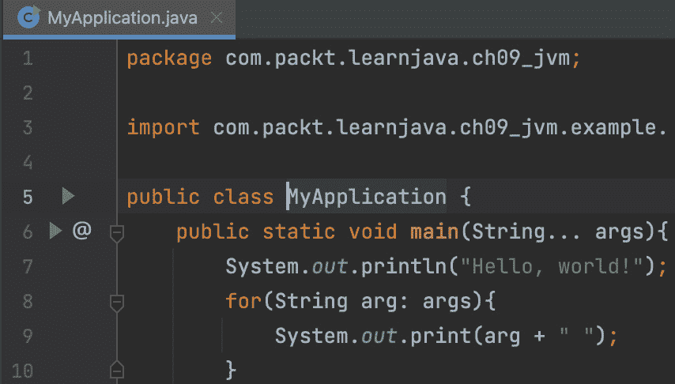
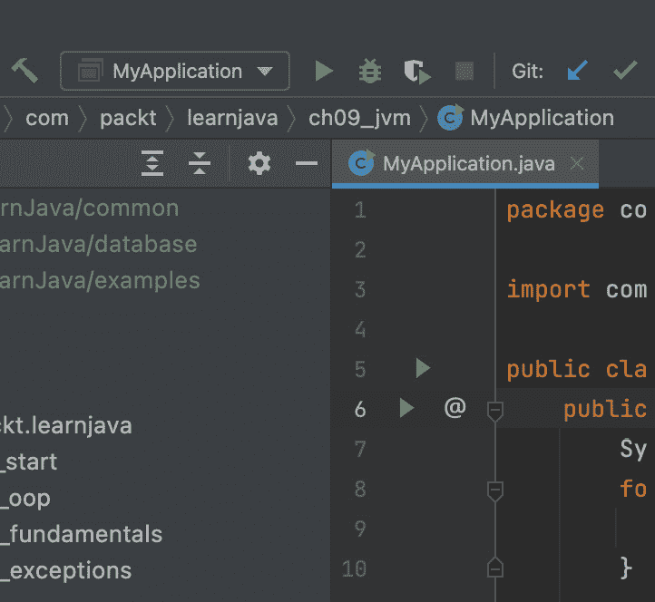
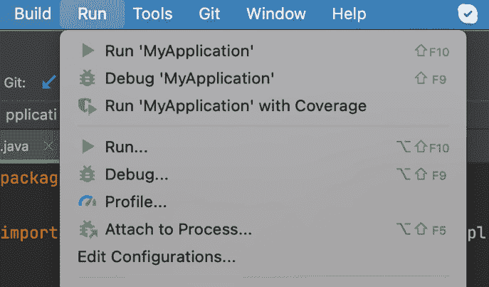
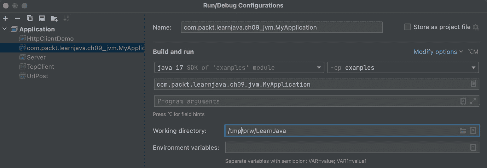
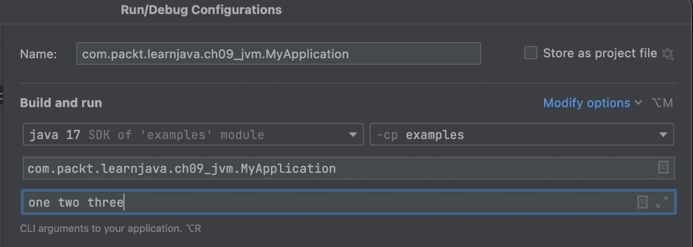
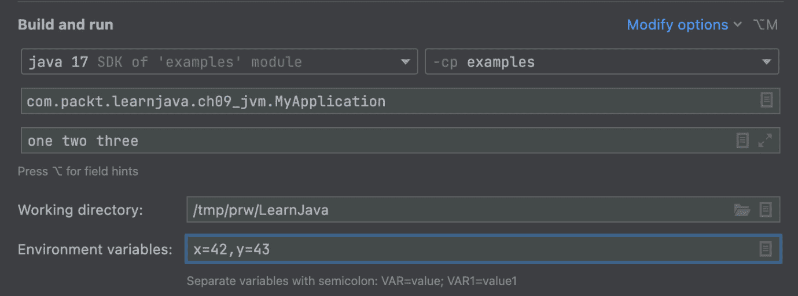
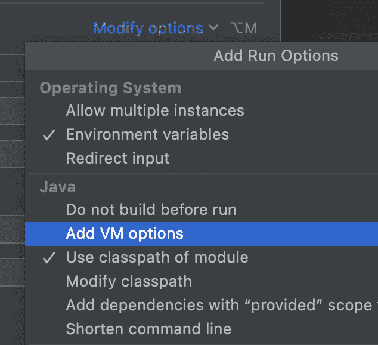
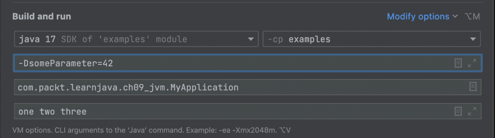
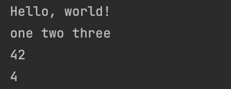

# 第九章：JVM 结构和垃圾回收

本章将为你提供一个关于**Java 虚拟机**（**JVM**）结构和行为的概述，这些结构和行为可能比你想象的要复杂。

JVM 根据编码逻辑执行指令。它还会找到并加载应用程序请求的`.class`文件到内存中，验证它们，解释字节码（即，将它们转换为特定平台的二进制代码），并将生成的二进制代码传递给中央处理器（或多个处理器）以执行。除了应用程序线程外，它还使用几个服务线程。其中一个服务线程被称为**垃圾回收**（**GC**），执行释放未使用对象内存的重要步骤。

通过完成本章，你将了解构成 Java 应用程序执行的内容，JVM 内部的 Java 进程和 GC，以及 JVM 的一般工作原理。

在本章中，我们将涵盖以下主题：

+   Java 应用程序执行

+   Java 进程

+   JVM 的结构

+   垃圾回收

# 技术要求

要执行本章提供的代码示例，你需要以下内容：

+   配备 Microsoft Windows、Apple macOS 或 Linux 操作系统的计算机

+   Java SE 版本 17 或更高

+   你选择的 IDE 或代码编辑器

在*第一章*“Java 17 入门”中提供了如何设置 Java SE 和 IntelliJ IDEA 编辑器的说明。本章的代码示例文件可在 GitHub 的[`github.com/PacktPublishing/Learn-Java-17-Programming.git`](https://github.com/PacktPublishing/Learn-Java-17-Programming.git)仓库中的`examples/src/main/java/com/packt/learnjava/ch09_jvm`文件夹找到。

# Java 应用程序执行

在我们学习 JVM 的工作原理之前，让我们回顾一下如何运行应用程序，同时记住以下语句是同义词：

+   运行/执行/启动主类。

+   运行/执行/启动`main()`方法。

+   运行/执行/启动/启动应用程序。

+   运行/执行/启动/启动 JVM 或 Java 进程。

还有几种方法可以做到这一点。在*第一章*“Java 17 入门”中，我们展示了如何使用 IntelliJ IDEA 运行`main(String[])`方法。在本章中，我们将重复一些已经说过的话，并添加一些可能对你有帮助的变体。

## 使用 IDE

任何 IDE 都允许你运行`main()`方法。在 IntelliJ IDEA 中，可以通过以下三种方式实现：

1.  点击`main()`方法名称旁边的绿色三角形：



1.  一旦你至少使用绿色三角形执行了`main()`方法一次，类的名称将被添加到下拉菜单中（在顶部行，绿色三角形的左侧）：

1.  打开**运行**菜单并选择类的名称。你可以选择以下几种选项：



在前面的截图中，您还可以看到开始的 `main()` 方法，以及一些其他选项：



**程序参数** 字段允许在 java 命令中设置一个参数。例如，让我们在这个字段中设置 one two three：



此设置将导致以下 java 命令：

```java
java -DsomeParameter=42 -cp . \
```

```java
       com.packt.learnjava.ch09_jvm.MyApplication one two three
```

我们可以在 main() 方法中读取这些参数：

```java
public static void main(String... args){
```

```java
    System.out.println("Hello, world!"); 
```

```java
                              //prints: Hello, world!
```

```java
    for(String arg: args){
```

```java
        System.out.print(arg + " ");     
```

```java
                              //prints: one two three
```

```java
    }
```

```java
    String p = System.getProperty("someParameter");
```

```java
    System.out.println("\n" + p);        //prints: 42
```

```java
}
```

在 **编辑配置** 屏幕上，另一个可能的设置是在 **环境变量** 字段中。可以从应用程序中使用 System.getenv() 访问的环境变量。例如，让我们设置环境变量 x 和 y ，如下所示：



如果像前面的截图所示完成，x 和 y 的值不仅可以在 main() 方法中读取，还可以在任何使用 System.getenv(“varName”) 方法的应用程序中读取。在我们的情况下，x 和 y 的值可以按以下方式检索：

```java
String p = System.getenv("x");
```

```java
System.out.println(p);            //prints: 42
```

```java
p = System.getenv("y");
```

```java
System.out.println(p);            //prints: 43
```

`java` 命令选项。例如，如果您输入 `-Xlog:gc`，IDE 将形成以下 `java` 命令：

```java
java -Xlog:gc -cp . com.packt.learnjava.ch09_jvm.MyApplication
```

`-Xlog:gc` 选项需要显示 GC 日志。我们将在下一节中使用此选项来演示 GC 的工作原理。`-cp .` 选项（`.class` 文件位于 `com/packt/learnjava/ch09_jvm` 文件夹中，其中 `com` 是当前目录的子文件夹。类路径可以包括 JVM 必须查找的 `.class` 文件的位置，这些文件对于应用程序的执行是必要的）。

使用 **修改选项** 链接来显示以下 **虚拟机选项**：



对于这个演示，让我们在 **虚拟机选项** 字段中设置值 `-DsomeParameter=42`，如下面的截图所示：



现在，someParameter 的值不仅可以在 `main()` 方法中读取，还可以在任何应用程序代码中如下所示：

```java
String p = System.getProperty("someParameter");
```

```java
System.out.println("\n" + p);    
```

```java
                     //prints someParameter set as VM option -D
```

在 **编辑配置** 屏幕上，还可以设置其他 java 命令参数。我们鼓励您花些时间在那个屏幕上查看可能的选择。

## 使用命令行与类

现在，让我们从命令行运行 `MyApplication`。为了提醒您，主类看起来如下：

```java
package com.packt.learnjava.ch09_jvm;
```

```java
public class MyApplication {
```

```java
   public static void main(String... args){
```

```java
      System.out.println("Hello, world!");
```

```java
                                //prints: Hello, world!
```

```java
      for(String arg: args){
```

```java
         System.out.print(arg + " ");
```

```java
                                //prints all arguments
```

```java
      }
```

```java
      String p = System.getProperty("someParameter");
```

```java
      System.out.println("\n" + p); 
```

```java
                     //prints someParameter set as VM option -D
```

```java
   }
```

```java
}
```

首先，必须使用 `javac` 命令进行编译。在 Linux 类型的平台上，命令行看起来如下（假设您在项目的根目录中打开终端窗口，在 `pom.xml` 所在的文件夹中）：

```java
javac src/main/java/com/packt/learnjava/ch09_jvm/MyApplication.java
```

在 Windows 上，命令看起来类似：

```java
javac src\main\java\com\packt\learnjava\ch09_jvm\MyApplication.java
```

编译后的 `MyApplication.class` 文件放在与 `MyApplication.java` 相同的文件夹中。现在，我们可以使用 `java` 命令执行编译后的类：

```java
java -DsomeParameter=42 -cp src/main/java \
  com.packt.learnjava.ch09_jvm.MyApplication one two three
```

注意到 `-cp` 指向 `src/main/java` 文件夹（路径相对于当前文件夹），其中主类的包开始。结果是如下所示：



我们也可以将这两个编译后的类放入一个 `.jar` 文件中，并从那里运行它们。

## 使用命令行与 JAR 文件

将编译文件保留在文件夹中作为 `.class` 文件并不总是方便，尤其是当许多相同框架的编译文件属于不同的包并且作为单个库分发时。在这种情况下，编译的 `.class` 文件通常一起存档在 `.jar` 文件中。这种存档的格式与 `.zip` 文件的格式相同。唯一的区别是 `.jar` 文件还包括一个包含描述存档元数据的清单文件（我们将在下一节中更多地讨论清单）。

为了演示如何使用它，让我们使用以下命令创建一个包含 `ExampleClass.class` 文件的 `.jar` 文件，以及一个包含 `MyApplication.class` 的另一个 `.jar` 文件：

```java
cd src/main/java
jar -cf myapp.jar 
               com/packt/learnjava/ch09_jvm/MyApplication.class
jar -cf example.jar \
        com/packt/learnjava/ch09_jvm/example/ExampleClass.class
```

注意我们需要在 `.class` 文件包开始的文件夹中运行 `jar` 命令。

现在，我们可以按照以下方式运行应用程序：

```java
java -cp myapp.jar:example.jar \
```

```java
                     com.packt.learnjava.ch09_jvm.MyApplication
```

`.jar` 文件位于当前文件夹中。如果我们想从另一个文件夹中执行应用程序（让我们回到根目录，`cd ../../..`），命令应该看起来像这样：

```java
java -cp 
```

```java
src/main/java/myapp.jar:src/main/java/example.jar\
```

```java
            com.packt.learnjava.ch09_jvm.MyApplication
```

注意每个 `.jar` 文件都必须单独列在类路径上。仅仅指定一个包含所有 `.jar` 文件的文件夹（就像 `.class` 文件的情况一样）是不够的。你还必须添加一个星号（通配符符号，`*`），如下所示：

```java
java -cp "src/main/java/*" \
```

```java
           com.packt.learnjava.ch09_jvm.MyApplication
```

注意文件夹路径周围的引号，包含 `.jar` 文件的文件夹路径。如果没有引号，这将不会工作。

## 使用可执行 JAR 文件的命令行

有可能避免在命令行中指定主类。相反，我们可以创建一个可执行的 `.jar` 文件。这可以通过将主类的名称放入清单文件中实现——你需要运行的那个包含 `main()` 方法的类。以下是步骤：

1.  创建一个名为 `manifest.txt` 的文本文件（名称不重要，但这个名字可以使意图更清晰），其中包含以下行：

    ```java
    Main-Class: com.packt.learnjava.ch09_jvm.MyApplication 
    ```

在冒号（`:`）之后必须有一个空格，并且在末尾必须有一个不可见的换行符号，所以请确保你已经按下了 *Enter* 键，并且你的光标已经跳到了下一行的开头。

1.  执行以下命令：

    ```java
    cd src/main/java 
    jar -cfm myapp.jar manifest.txt \
             com/packt/learnjava/ch09_jvm/*.class \
             com/packt/learnjava/ch09_jvm/example/*.class
    ```

注意 `jar` 命令选项（`fm`）的顺序和 `myapp.jar manifest.txt` 文件的顺序。它们必须相同，因为 `f` 代表 `jar` 命令将要创建的文件，而 `m` 代表清单源。如果你包含 `mf` 选项，那么文件必须列出为 `manifest.txt myapp.jar`。

1.  现在，我们可以使用以下命令运行应用程序：

    ```java
         java -jar myapp.jar 
    ```

创建可执行 `.jar` 文件的另一种方法更容易：

```java
jar cfe myjar.jar 
com.packt.learnjava.ch09_jvm.MyApplication \
             com/packt/learnjava/ch09_jvm/*.class\
             com/packt/learnjava/ch09_jvm/example/*.class
```

上述命令会自动生成包含指定主类名的清单：`c` 选项代表 `f` 选项，`e` 选项表示 **应用程序入口点**。

# Java 进程

如您可能已经猜到的，JVM 对 Java 语言和源代码一无所知。它只知道如何读取字节码。它从 `.class` 文件中读取字节码和其他信息，将字节码转换（解释）成特定于当前平台（JVM 运行的位置）的二进制代码指令序列，并将生成的二进制代码传递给执行它的微处理器。当谈论这种转换时，程序员通常将其称为 **Java 进程** 或简称为 **进程**。

当执行 `java` 命令时，通常会启动一个新的 JVM 实例，该实例专门用于以单独的进程运行特定应用程序，并为其分配自己的内存（内存大小设置为默认值或作为命令选项传入）。在这个 Java 进程内部，多个线程正在运行，每个线程都有自己的分配内存。有些是 JVM 创建的服务线程；其他的是由应用程序创建和控制的线程。

这就是 JVM 执行编译代码的大致情况。但如果你仔细观察并阅读 JVM 规范，你会发现，关于 JVM，"进程" 这个词也被用来描述 JVM 内部进程。JVM 规范确定了 JVM 内部运行的几个其他进程，通常程序员不会提及，除非是 **类加载过程**。

这是因为大多数时候，我们可以成功地编写和执行 Java 程序，而不必了解 JVM 内部进程的任何信息。但偶尔，对 JVM 内部工作原理的一些基本理解有助于我们识别某些问题的根本原因。这就是为什么在本节中，我们将简要概述 JVM 内部发生的所有进程。然后，在接下来的章节中，我们将讨论 JVM 的内存结构及其功能的其他方面，这些可能对程序员有所帮助。

两个子系统运行 JVM 的内部进程：

+   `.class` 文件并在 JVM 内存中的方法区域填充与类相关的数据：

    +   静态字段

    +   方法字节码

    +   描述类的类元数据

+   **执行引擎**：它使用以下属性执行字节码：

    +   用于对象实例化的堆区域

    +   用于跟踪已调用方法的 Java 和本地方法栈

    +   一个回收内存的 GC 进程

在主 JVM 进程中运行的某些进程如下：

+   类加载器执行的进程，如下所示：

    +   类加载

    +   类链接

    +   类初始化

执行引擎执行的进程，如下所示：

+   类实例化

+   方法执行

+   GC

+   应用程序终止

    JVM 架构

    JVM 架构可以描述为有两个子系统——**类加载器**和**执行引擎**——它们使用运行时数据内存区域（如方法区、堆和应用线程栈）来运行服务进程和应用线程。**线程**是轻量级进程，比 JVM 执行过程需要的资源分配更少。

这个列表可能会给你一种印象，这些过程是按顺序执行的。在某种程度上，这是真的，如果我们只谈论一个类的话。在加载类之前，我们无法对类做任何事情。我们只能在所有前面的过程完成后执行一个方法。然而，例如，GC 并不是一旦一个对象停止使用就立即发生（参见 *垃圾回收* 部分）。此外，当发生未处理的异常或其他错误时，应用程序可以随时退出。

只有类加载器过程受 JVM 规范的约束。执行引擎的实现主要取决于每个供应商。它基于实现作者设定的语言语义和性能目标。

执行引擎的过程处于一个不受 JVM 规范约束的领域。这里有常识、传统、已知和经过验证的解决方案，以及一个可以指导 JVM 供应商实现决策的 Java 语言规范。但是没有单一的管理文件。好消息是，最流行的 JVM 使用类似的解决方案——至少从高层次上看是这样的。

在这个前提下，让我们更详细地讨论之前列出的七个过程。

## 类加载

根据 JVM 规范，加载阶段包括通过其名称（在类路径上列出的位置）找到 `.class` 文件，并在内存中创建其表示。

首先要加载的类是命令行中传递的，其中包含 `main(String[])` 方法。类加载器读取 `.class` 文件，解析它，并将静态字段和方法字节码填充到方法区。它还创建了一个 `java.lang.Class` 实例，描述了这个类。然后，类加载器将类链接（参见 *类链接* 部分），初始化它（参见 *类初始化* 部分），然后将其传递给执行引擎以运行其字节码。

`main(String[])` 方法是进入应用程序的入口。如果它调用另一个类的某个方法，那么这个类必须在类路径上找到、加载和初始化；只有在这种情况下，它的方法才能被执行。如果这个刚刚加载的方法调用另一个类的某个方法，那么这个类也必须被找到、加载和初始化，依此类推。这就是 Java 应用程序开始并运行的方式。

`main(String[])` 方法

每个类都可以有一个`main(String[])`方法，并且通常都有。这样的方法用于将类独立运行作为独立的应用程序进行测试或演示。存在这样的方法并不会使类成为`main`。只有当在`java`命令行或`.jar`文件清单中将其识别为`main`时，类才成为`main`。

话虽如此，让我们继续讨论加载过程。

如果你查看`java.lang.Class`的 API，你将不会在那里看到一个公共构造函数。类加载器会自动创建其实例。这就是`getClass()`方法返回的实例，你可以在任何 Java 对象上调用它。

它不携带类的静态数据（这些数据存储在方法区），也不携带状态值（它们存储在执行过程中创建的对象中）。它也不包含方法字节码（这些也存储在方法区）。相反，`Class`实例提供了描述类的元数据——它的名称、包、字段、构造函数、方法签名等。这些元数据不仅对 JVM 有用，对应用程序也有用。

注意

由类加载器在内存中创建并由执行引擎维护的所有数据称为**类型的二进制表示**。

如果`.class`文件包含错误或不符合某种格式，则终止该过程。这意味着加载过程已经验证了加载的类格式及其字节码。在下一个过程的开始处还有更多的验证，称为**类链接**。

这里是对加载过程的概述。它执行三个任务：

1.  查找并读取`.class`文件

1.  根据方法区内部数据结构解析它

1.  创建一个带有类元数据的`java.lang.Class`实例

## 类链接

根据 JVM 规范，类链接解决了加载类的引用，以便可以执行类的方法。

这里是对链接过程的概述。它执行三个任务：

+   `.class`文件是由 Java 编译器生成的，并且所有指令都满足语言的约束和要求，但这并不能保证加载的文件是由已知的编译器实现生成的，或者是由编译器生成的。这就是为什么链接过程的第一步是验证。这确保了类的二进制表示在结构上是正确的，这意味着以下内容：

    +   每个方法调用的参数与方法描述符兼容。

    +   返回指令与其方法的返回类型匹配。

    +   一些其他检查和验证过程，这些过程因 JVM 供应商而异。

+   **准备方法区中的静态字段**：一旦验证完成，接口或类（静态）变量将在方法区中创建并初始化为其类型的默认值。其他类型的初始化，例如程序员指定的显式赋值和静态初始化块，将延迟到称为**类初始化**的过程（参见*类初始化*部分）。

+   **将符号引用解析为指向方法区的具体引用**：如果加载的字节码引用了其他方法、接口或类，符号引用将被解析为指向方法区的具体引用，这是通过解析过程完成的。如果引用的接口和类尚未加载，类加载器将根据需要找到并加载它们。

## 类初始化

根据 JVM 规范，初始化是通过执行类初始化方法来完成的。这发生在程序员定义的初始化（在静态块和静态赋值中）执行时，除非类已经被另一个类的请求初始化。

这句话的最后部分很重要，因为类可能被不同的（已经加载的）方法多次请求，也因为 JVM 进程是由不同的线程执行的，并且可能并发访问同一个类。因此，需要在不同线程之间进行**协调**（也称为**同步**），这大大增加了 JVM 实现的复杂性。

## 类实例化

这一步可能永远不会发生。技术上，由`new`运算符触发的实例化过程是执行过程的第一步。如果`main(String[])`方法（它是静态的）只使用其他类的静态方法，则这种实例化永远不会发生。这就是为什么将这个过程识别为与执行过程分开是合理的。

这个活动有非常具体的任务：

+   在堆区域为对象（其状态）分配内存

+   将实例字段初始化为默认值

+   为 Java 和本地方法创建线程栈

当第一个方法（不是构造函数）准备好执行时，执行开始。对于每个应用程序线程，都会创建一个专用的运行时栈，其中每个方法调用都捕获在一个栈帧中。例如，如果发生异常，当我们调用`printStackTrace()`方法时，我们会从当前的栈帧中获取数据。

## 方法执行

第一个应用程序线程（称为`main(String[])`方法开始执行。它可以创建其他应用程序线程。

执行引擎读取字节码，解释它，并将二进制代码发送到微处理器执行。它还维护了一个计数器，记录每个方法被调用的次数和频率。如果计数器超过某个阈值，执行引擎会使用一个称为**即时编译器**（**JIT**）的编译器，将方法字节码编译成本地代码。这样，下次调用该方法时，它将无需解释即可准备好。这大大提高了代码性能。

当前正在执行的指令和下一条指令的地址被保存在**程序计数器**（**PC**）寄存器中。每个线程都有专门的 PC 寄存器。这也提高了性能并跟踪执行情况。

## 垃圾收集

垃圾收集器识别出不再被引用的对象，并可以从内存中移除。

有一个 Java 静态方法`System.gc()`，可以用来程序化地触发 GC，但其立即执行并不保证。每次 GC 周期都会影响应用程序的性能，因此 JVM 必须在内存可用性和快速执行字节码的能力之间保持平衡。

## 应用程序终止

应用程序可以通过多种方式被终止（以及 JVM 停止或退出）：

+   正常终止，没有错误状态码

+   非正常终止，由于未处理的异常

+   强制程序化退出，带或不带错误状态码

如果没有异常和无限循环，`main(String[])`方法会通过返回语句或在其最后一条语句执行后完成。一旦发生这种情况，主应用程序线程将控制流传递给 JVM，JVM 也会停止执行。这就是美好的结局，许多应用程序在现实生活中也享受到了它。我们的大部分示例，除了我们演示异常或无限循环的情况外，也都成功退出了。

然而，Java 应用程序还有其他退出方式，其中一些相当优雅——而另一些则不然。如果主应用程序线程创建了子线程，或者说，程序员编写的代码生成了其他线程，即使是优雅的退出也可能不容易。这完全取决于创建的子线程类型。

如果其中任何一个是一个用户线程（默认），那么即使主线程退出后，JVM 实例也会继续运行。只有当所有用户线程都完成后，JVM 实例才会停止。主线程可以请求子用户线程完成。但在它退出之前，JVM 会继续运行。这意味着应用程序仍在运行。

但如果所有子线程都是守护线程，或者没有子线程正在运行，那么一旦主应用程序线程退出，JVM 实例就会停止运行。

应用程序在异常情况下的退出方式取决于代码设计。我们在*第四章*“异常处理”中讨论了异常处理的最佳实践时提到了这一点。如果线程在`main(String[])`或类似高级方法中的 try-catch 块中捕获了所有异常，那么如何最好地继续取决于应用程序（以及编写代码的程序员）——尝试更改输入数据并重复生成异常的代码块，记录错误并继续，或者退出。另一方面，如果异常未得到处理并传播到 JVM 代码中，发生异常的线程将停止执行并退出。接下来发生什么取决于线程的类型和一些其他条件。以下有四种可能的选择：

+   如果没有其他线程，JVM 将停止执行并返回错误码和堆栈跟踪。

+   如果未处理的异常的线程不是主线程，其他线程（如果存在）将继续运行。

+   如果主线程抛出了未处理的异常，并且子线程（如果存在）是守护线程，它们也会退出。

+   如果至少有一个用户子线程，JVM 将继续运行，直到所有用户线程退出。

也有方法可以编程强制应用程序停止：

+   `System.exit(0);`

+   `Runtime.getRuntime().exit(0);`

+   `Runtime.getRuntime().halt(0);`

所有这些方法都强制 JVM 停止执行任何线程，并以作为参数传入的状态码退出（在我们的示例中为`0`）：

+   零表示正常终止

+   非零值表示异常终止

如果 Java 命令是由某个脚本或其他系统启动的，可以使用状态码的值来自动化关于下一步决策的决定。但这已经超出了应用程序和 Java 代码的范围。

前两种方法具有相同的功能，因为这是`System.exit()`的实现方式：

```java
public static void exit(int status) { 
```

```java
    Runtime.getRuntime().exit(status); 
```

```java
}
```

要在 IDE 中查看源代码，只需单击方法。

当某个线程调用`Runtime`或`System`类的`exit()`方法，或者`Runtime`类的`halt()`方法，并且安全管理器允许退出或挂起操作时，JVM 退出。`exit()`和`halt()`之间的区别在于`halt()`强制 JVM 立即退出，而`exit()`执行一些额外的操作，这些操作可以使用`Runtime.addShutdownHook()`方法设置。但主流程序员很少使用这些选项。

# JVM 的结构

可以用内存中的运行时数据结构及其使用的两个子系统（类加载器和执行引擎）来描述 JVM 的结构。

## 运行时数据区域

JVM 内存的每个运行时数据区域属于以下两个类别之一：

+   **共享区域**，包括以下内容：

    +   **方法区**：类元数据、静态字段和方法字节码

    +   **堆区**：对象（状态）

+   **未共享区域**，这些区域专门用于特定的应用程序线程，包括以下内容：

    +   **Java 栈**：当前和调用帧，每个帧保持 Java（非本地）方法调用的状态：

        1.  局部变量的值

        1.  方法参数值

        1.  中间计算的操作数值（操作数栈）

        1.  方法返回值（如果有）

+   **程序计数器**：下一个要执行的指令

+   **本地方法栈**：本地方法调用的状态

我们已经讨论过，程序员在使用引用类型时必须小心，除非需要修改对象本身，否则不要修改对象。在多线程应用程序中，如果对象的引用可以在线程之间传递，我们必须格外小心，因为可能存在相同数据被并发修改的可能性。然而，从积极的一面来看，这样的共享区域可以——并且通常被用作线程之间通信的方法。

## 类加载器

类加载器执行以下三个功能：

+   读取 `.class` 文件

+   填充方法区

+   初始化程序员未初始化的静态字段

## 执行引擎

执行引擎执行以下操作：

+   在堆区域实例化对象

+   使用程序员编写的初始化器初始化静态和实例字段

+   向/从 Java 栈中添加/删除帧

+   更新程序计数器，以执行下一个指令

+   维护本地方法栈

+   记录方法调用次数并编译流行的调用

+   终止对象

+   运行 GC

+   终止应用程序

# 垃圾收集

自动内存管理是 JVM 的重要方面，它减轻了程序员需要程序化地执行此操作的负担。在 Java 中，清理内存并允许其重用的过程称为 **GC**。

## 响应性、吞吐量和停止世界

GC 的有效性影响两个主要的应用程序特性——**响应性**和**吞吐量**：

+   **响应性**：这是通过应用程序响应速度（提供必要的数据）来衡量的；例如，网站返回页面有多快，或者桌面应用程序对事件的响应有多快。响应时间越短，用户体验越好。

+   **吞吐量**：这表示应用程序在单位时间内可以完成的工作量；例如，Web 应用程序可以处理多少请求，或者数据库可以支持多少事务。数字越大，应用程序潜在的价值越高，它可以支持的用户请求也越多。

同时，垃圾回收（GC）需要移动数据，这在允许数据处理进行的同时是不可能的，因为引用将会改变。这就是为什么 GC 需要时不时地停止应用程序线程执行一段时间。这被称为**停止世界**。这些周期越长，GC 完成其工作的速度越快，应用程序冻结的时间越长，这最终可能足够大，以至于影响应用程序的响应性和吞吐量。

幸运的是，可以通过 Java 命令选项调整 GC 的行为，但这超出了本书的范围。相反，我们将提供一个 GC 主要活动的概述——检查堆中的对象，并移除那些在任何线程堆栈中没有引用的对象。

## 对象年龄和代际

基本的 GC 算法确定每个对象的**年龄**。术语**年龄**指的是对象存活了多少次收集周期。

当 JVM 启动时，堆是空的，并被分为三个部分：

+   年轻一代

+   老一代或资深一代

+   用来存放大小为标准区域 50%或更大的物体的巨大区域

年轻一代有三个区域：

+   一个伊甸园空间

+   幸存者 0（S0）

+   幸存者 1（S1）

新创建的对象被放置在伊甸园。当它开始填满时，一个小的 GC 过程开始。它移除未引用的和循环引用的对象，并将其他对象移动到 S1 区域。在下一次小收集期间，S0 和 S1 交换角色。引用对象从伊甸园和 S1 移动到 S0。

在每次小收集期间，达到一定年龄的对象被移动到老一代。由于这个算法，老一代包含比一定年龄更老的对象。这个区域比年轻一代大，因此 GC 过程更昂贵，并且不像在年轻一代那样频繁发生。但最终会进行检查（在几次小收集之后）。未引用的对象被移除，内存被碎片化。清理老一代被认为是主要收集。

## 当停止世界不可避免时

一些对象在老一代并发收集，而另一些则使用停止世界的暂停进行收集。步骤如下：

1.  **初始标记**：这标记了可能包含指向老一代对象引用的幸存区域（根区域）。这是通过停止世界的暂停完成的。

1.  **扫描**：这搜索幸存区域以查找对老一代的引用。这是在应用程序继续运行的同时并行的。

1.  **并发标记**：这标记了整个堆中的活动对象，并且是在应用程序继续运行的同时并行的。

1.  **重标记**：在这个阶段，活动对象已经被标记，这是通过停止世界的暂停完成的。

1.  **清理**：这计算活动对象的生命周期，释放区域（使用停止世界），并将它们返回到空闲列表。这是并发执行的。

为了帮助 GC 调整，JVM 为垃圾收集器、堆大小和运行时编译器提供了平台相关的默认选择。但幸运的是，JVM 供应商一直在改进和调整 GC 过程，所以大多数应用程序使用默认的 GC 行为都能正常工作。

# 摘要

在本章中，你学习了如何使用 IDE 或命令行执行 Java 应用程序。现在，你可以根据给定环境以适当的方式编写应用程序并启动它们。关于 JVM 结构和其过程（类加载、链接、初始化、执行、GC 和应用终止）的知识，为你提供了更好的应用程序执行控制和对 JVM 性能和当前状态的透明度。

在下一章中，我们将讨论并演示如何从 Java 应用程序中管理数据库中的数据——插入、读取、更新和删除。我们还将简要介绍 SQL 语言及其基本数据库操作，包括如何连接到数据库、如何创建数据库结构、如何使用 SQL 编写数据库表达式以及如何执行它们。

# 测验

回答以下问题以测试你对本章知识的了解：

1.  选择所有正确的陈述：

    1.  一个 IDE 可以在不编译的情况下执行 Java 代码。

    1.  一个 IDE 使用已安装的 Java 来执行代码。

    1.  一个 IDE 在不需要 Java 安装的情况下检查代码。

    1.  一个集成开发环境（IDE）使用 Java 安装的编译器。

1.  选择所有正确的陈述：

    1.  应用程序使用的所有类必须在类路径上列出。

    1.  应用程序使用的所有类的位置必须在类路径上列出。

    1.  如果类在类路径上列出的文件夹中，编译器可以找到该类。

    1.  主包中的类不需要在类路径上列出。

1.  选择所有正确的陈述：

    1.  应用程序使用的所有`.jar`文件必须在类路径上列出。

    1.  应用程序使用的所有`.jar`文件的位置必须在类路径上列出。

    1.  如果类在类路径上列出的`.jar`文件中，JVM 才能找到该类。

    1.  每个类都可以包含`main()`方法。

1.  选择所有正确的陈述：

    1.  包含清单的每个`.jar`文件都是可执行的。

    1.  如果`java`命令使用`-jar`选项，则忽略类路径选项。

    1.  每个`.jar`文件都有一个清单。

    1.  可执行的`.jar`文件是一个包含清单的 ZIP 文件。

1.  选择所有正确的陈述：

    1.  类加载和链接可以在不同的类上并行工作。

    1.  类加载将类移动到执行区域。

    1.  类链接连接两个类。

    1.  类链接使用内存引用。

1.  选择所有正确的陈述：

    1.  类初始化为实例属性赋值。

    1.  每当另一个类引用该类时，都会发生类初始化。

    1.  类初始化为静态属性赋值。

    1.  类初始化为`java.lang.Class`的实例提供数据。

1.  选择所有正确的陈述：

    1.  类实例化可能永远不会发生。

    1.  类实例化包括对象属性初始化。

    1.  类实例化包括在堆上进行内存分配。

    1.  类实例化包括执行构造函数代码。

1.  选择所有正确的陈述：

    1.  方法执行包括二进制代码生成。

    1.  方法执行包括源代码编译。

    1.  方法执行包括重用 JIT 编译器产生的二进制代码。

    1.  方法执行统计每个方法被调用的次数。

1.  选择所有正确的陈述：

    1.  在调用`System.gc()`方法后，垃圾回收立即开始。

    1.  应用程序可以带错误代码或不带错误代码终止。

    1.  一旦抛出异常，应用程序就会立即退出。

    1.  主线程是一个用户线程。

1.  选择所有正确的陈述：

    1.  JVM 具有所有线程共享的内存区域。

    1.  JVM 具有线程之间不共享的内存区域。

    1.  类元数据在所有线程之间共享。

    1.  方法参数值在所有线程之间不共享。

1.  选择所有正确的陈述：

    1.  类加载器填充方法区。

    1.  类加载器在堆上分配内存。

    1.  类加载器写入`.class`文件。

    1.  类加载器解析方法引用。

1.  选择所有正确的陈述：

    1.  执行引擎在堆上分配内存。

    1.  执行引擎终止应用程序。

    1.  执行引擎运行垃圾回收。

    1.  执行引擎初始化程序员未初始化的静态字段。

1.  选择所有正确的陈述：

    1.  数据库每秒可以支持的交易数量是一个吞吐量度量。

    1.  当垃圾回收器暂停应用程序时，它被称为停止一切。

    1.  网站返回数据有多慢是一个响应性度量。

    1.  垃圾回收器清除作业的 CPU 队列。

1.  选择所有正确的陈述：

    1.  对象年龄是通过对象创建以来的秒数来衡量的。

    1.  对象越老，它被从内存中移除的可能性就越大。

    1.  清理旧生代是一项主要收集。

    1.  将对象从一个年轻代区域移动到另一个年轻代区域是轻微的收集。

1.  选择所有正确的陈述：

    1.  可以通过设置`javac`命令的参数来调整垃圾回收器。

    1.  垃圾回收器可以通过设置`java`命令的参数进行调整。

    1.  垃圾回收器根据其逻辑工作，不能根据设置的参数改变其行为。

    1.  清理旧生代区域需要停止世界的暂停。
