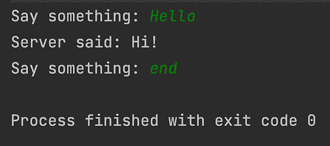
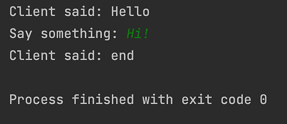
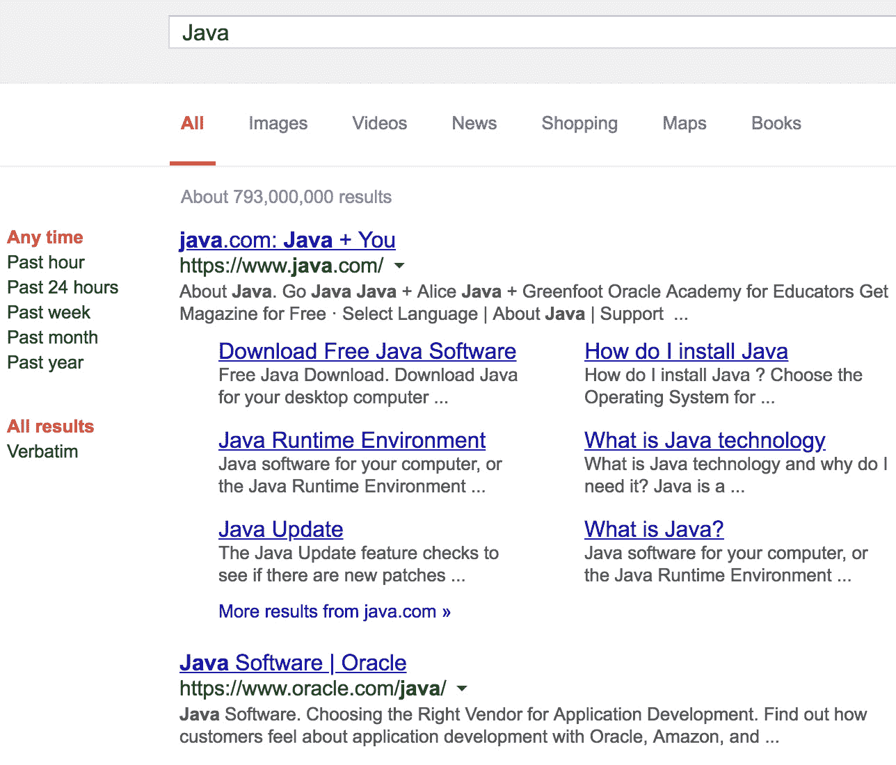
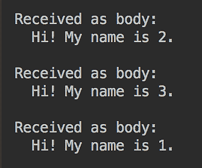

# 第十一章：网络编程

在本章中，我们将描述和讨论最流行的网络协议——**用户数据报协议**（**UDP**）、**传输控制协议**（**TCP**）、**超文本传输协议**（**HTTP**）和**WebSocket**——以及它们对**Java 类库**（**JCL**）的支持。我们将演示如何使用这些协议以及如何在 Java 代码中实现客户端-服务器通信。我们还将回顾基于**统一资源定位符**（**URL**）的通信和最新的**Java HTTP 客户端 API**。学习完本章后，你将能够创建使用**UDP**、**TCP**、**HTTP**协议以及**WebSocket**进行通信的服务器和客户端应用程序。

本章将涵盖以下主题：

+   网络协议

+   基于 UDP 的通信

+   基于 TCP 的通信

+   UDP 与 TCP 协议

+   基于 URL 的通信

+   使用 HTTP 2 客户端 API

+   创建独立应用程序的 HTTP 服务器

到本章结束时，你将能够使用所有最流行的协议在客户端和服务器之间发送/接收消息。你还将学习如何创建作为独立项目的服务器以及如何创建和使用公共共享库。

# 技术要求

要执行本章提供的代码示例，你需要以下内容：

+   拥有 Microsoft Windows、Apple macOS 或 Linux 操作系统的计算机

+   Java SE 版本 17 或更高

+   你选择的 IDE 或代码编辑器

关于如何设置 Java SE 和 IntelliJ IDEA 编辑器的说明提供在本书的**第一章**，*开始使用 Java 17*，链接为*Chapter 1*。本章的代码示例文件可在 GitHub 的[`github.com/PacktPublishing/Learn-Java-17-Programming.git`](https://github.com/PacktPublishing/Learn-Java-17-Programming.git)存储库中找到，位于`examples/src/main/java/com/packt/learnjava/ch11_network`文件夹中，以及`common`和`server`文件夹中，作为独立的项目。

# 网络协议

网络编程是一个庞大的领域。**互联网协议**（**IP**）套件由四层组成，每一层都有十几个或更多的协议：

+   **链路层**：当客户端物理连接到主机时使用的协议组；三个核心协议包括**地址解析协议**（**ARP**）、**反向地址解析协议**（**RARP**）和**邻居发现协议**（**NDP**）。

+   `10011010.00010111.11111110.00010001`，这导致 IP 地址为`154.23.254.17`。本章的示例使用 IPv4。然而，行业正在缓慢地转向 IPv6。一个 IPv6 地址的例子是`594D:1A1B:2C2D:3E3F:4D4A:5B5A:6B4E:7FF2`。

+   **传输层**：一组主机间通信服务。它包括 TCP，也称为 TCP/IP 协议，以及 UDP（我们将在稍后讨论）。本组中的其他协议包括**数据报拥塞控制协议**（**DCCP**）和**流控制传输协议**（**SCTP**）。

+   **应用层**：一组由通信网络中的主机使用的协议和接口方法。它包括**Telnet**、**文件传输协议**（**FTP**）、**域名系统**（**DNS**）、**简单邮件传输协议**（**SMTP**）、**轻量级目录访问协议**（**LDAP**）、**超文本传输协议**（**HTTP**）、**安全超文本传输协议**（**HTTPS**）和**安全外壳**（**SSH**）。

链路层是最低层；它被互联网层使用，而互联网层反过来又被传输层使用。然后，传输层被应用层用于支持协议实现。

由于安全原因，Java 不提供对链路层和互联网层协议的访问。这意味着 Java 不允许您创建自定义传输协议，例如，作为 TCP/IP 的替代品。这就是为什么在本章中，我们只回顾传输层（TCP 和 UDP）和应用层（HTTP）的协议。我们将解释和演示 Java 如何支持它们，以及 Java 应用程序如何利用这种支持。

Java 通过`java.net`包中的类支持 TCP 和 UDP 协议，而 HTTP 协议可以使用`java.net.http`包中的类在 Java 应用程序中实现（该包是在 Java 11 中引入的）。

TCP 和 UDP 协议都可以使用*套接字*在 Java 中实现。套接字由 IP 地址和端口号的组合标识，它们代表两个应用程序之间的连接。由于 UDP 协议比 TCP 协议简单一些，我们将从 UDP 开始。

# 基于 UDP 的通信

UDP 协议由 David P. Reed 于 1980 年设计。它允许应用程序使用具有最小协议机制（如校验和）的简单无连接通信模型发送称为**数据报**的消息，以实现数据完整性。它没有握手对话，因此不保证消息的交付或保持消息的顺序。它适用于那些宁愿丢弃消息或混淆顺序而不是等待重传的情况。

数据报由`java.net.DatagramPacket`类表示。可以使用六个构造函数中的任何一个来创建此类对象；以下两个构造函数是最常用的：

+   `DatagramPacket(byte[] buffer, int length)`: 此构造函数创建一个数据报包，用于接收数据包；`buffer`包含传入的数据报，而`length`是要读取的字节数。

+   `DatagramPacket(byte[] buffer, int length, InetAddress address, int port)`: 这创建一个数据报包，并用于发送数据包；`buffer` 存储数据包数据，`length` 是数据包数据长度，`address` 存储目标 IP 地址，`port` 是目标端口号。

一旦构造，`DatagramPacket` 对象会公开以下方法，可用于从对象中提取数据或设置/获取其属性：

+   `void setAddress(InetAddress iaddr)`: 这设置目标 IP 地址。

+   `InetAddress getAddress()`: 这返回目标或源 IP 地址。

+   `void setData(byte[] buf)`: 这设置数据缓冲区。

+   `void setData(byte[] buf, int offset, int length)`: 这设置数据缓冲区、数据偏移量和长度。

+   `void setLength(int length)`: 这设置数据包的长度。

+   `byte[] getData()`: 这返回数据缓冲区。

+   `int getLength()`: 这返回要发送或接收的数据包的长度。

+   `int getOffset()`: 这返回要发送或接收的数据的偏移量。

+   `void setPort(int port)`: 这设置目标端口号。

+   `int getPort()`: 这返回数据要发送或接收的端口号。一旦创建 `DatagramPacket` 对象，就可以使用 `DatagramSocket` 类发送或接收，该类表示用于发送和接收数据报包的无连接套接字。可以使用六个构造函数之一创建此类对象；以下三个构造函数是最常用的：

    +   `DatagramSocket()`: 这创建一个数据报套接字并将其绑定到本地主机上的任何可用端口。它通常用于创建发送套接字，因为目标地址（和端口）可以设置在数据包内（参见前面的 `DatagramPacket` 构造函数和方法）。

    +   `DatagramSocket(int port)`: 这创建一个数据报套接字并将其绑定到本地主机上的指定端口。它用于创建接收套接字，当任何本地机器地址（称为 `DatagramSocket(int port, InetAddress address)`: 这创建一个数据报套接字并将其绑定到指定的端口和指定的本地地址；本地端口必须在 `0` 和 `65535` 之间。它用于创建接收套接字，当需要绑定特定本地机器地址时。

`DatagramSocket` 对象的以下两种方法是最常用的用于发送和接收消息（或数据包）：

+   `void send(DatagramPacket p)`: 这发送指定的数据包。

+   `void receive(DatagramPacket p)`: 这通过填充指定的 `DatagramPacket` 对象的缓冲区以接收数据。指定的 `DatagramPacket` 对象还包含发送者的 IP 地址和发送者机器上的端口号。

让我们看看一个代码示例。以下是一个在接收到消息后退出的 UDP 消息接收器：

```java
public class UdpReceiver {
```

```java
  public static void main(String[] args){
```

```java
    try(DatagramSocket ds = new DatagramSocket(3333)){
```

```java
       DatagramPacket dp = 
```

```java
                          new DatagramPacket(new byte[16], 16);
```

```java
       ds.receive(dp);
```

```java
       for(byte b: dp.getData()){
```

```java
           System.out.print(Character.toString(b));
```

```java
       }
```

```java
    } catch (Exception ex){
```

```java
            ex.printStackTrace();
```

```java
    }
```

```java
  }
```

```java
}
```

如您所见，接收者在本地机器的任何地址上监听端口`3333`的文本消息（它将每个字节解释为字符）。它只使用 16 字节的缓冲区；一旦缓冲区被接收到的数据填满，接收者就会打印其内容并退出。

这里是 UDP 消息发送者的一个示例：

```java
public class UdpSender {
```

```java
  public static void main(String[] args) {
```

```java
    try(DatagramSocket ds = new DatagramSocket()){
```

```java
       String msg = "Hi, there! How are you?";
```

```java
       InetAddress address = 
```

```java
                            InetAddress.getByName("127.0.0.1");
```

```java
       DatagramPacket dp = new DatagramPacket(msg.getBytes(), 
```

```java
                                  msg.length(), address, 3333);
```

```java
       ds.send(dp);
```

```java
    } catch (Exception ex){
```

```java
        ex.printStackTrace();
```

```java
    }
```

```java
  }
```

```java
}
```

如您所见，发送者构建了一个包含消息、本地机器地址以及与接收者使用的相同端口的包。在发送构建的包之后，发送者退出。

现在，我们可以运行发送者，但如果没有接收者运行，就没有人能够接收到消息。所以，我们将首先启动接收者。它监听端口`3333`，但没有消息到来——所以它等待。然后，我们运行发送者，接收者显示以下消息：


由于缓冲区小于消息，所以只部分接收了消息——其余的消息丢失了。这就是为什么我们将缓冲区大小增加到 30 的原因。此外，我们可以创建一个无限循环，并让接收者无限期地运行（参见`UdpReceiver2`类）：

```java
public class UdpReceiver2 {
```

```java
 public static void main(String[] args){
```

```java
    try(DatagramSocket ds = new DatagramSocket(3333)){
```

```java
       DatagramPacket dp = 
```

```java
                          new DatagramPacket(new byte[30], 30);
```

```java
       while(true){
```

```java
          ds.receive(dp);
```

```java
          for(byte b: dp.getData()){
```

```java
              System.out.print(Character.toString(b));
```

```java
          }
```

```java
          System.out.println(); //added here to have end-of-
```

```java
             // line after receiving (and printing) the message
```

```java
       }
```

```java
    } catch (Exception ex){
```

```java
            ex.printStackTrace();
```

```java
    }
```

```java
  }
```

```java
}
```

通过这样做，我们可以多次运行发送者。以下是当我们运行发送者三次时，接收者`UdpReceiver2`打印的内容：


如您所见，所有三条消息都已接收。如果您运行`UdpReceiver2`接收者，不要忘记在您不再需要运行它时手动停止它。否则，它将继续无限期地运行。

因此，这就是 UDP 协议的基本思想。发送者即使没有套接字在这个地址和端口上监听，也会向特定的地址和端口发送消息。在发送消息之前，它不需要建立任何类型的连接，这使得 UDP 协议比 TCP 协议（需要你首先建立连接）更快、更轻量。这样，TCP 协议通过确保目的地存在并且消息可以被投递，将消息发送提升到了另一个可靠性的层次。

# 基于 TCP 的通信

TCP 是在 20 世纪 70 年代由**国防高级研究计划局**（**DARPA**）为在**高级研究计划局网络**（**ARPANET**）中使用而设计的。它补充了 IP，因此也被称为 TCP/IP。从其名称来看，TCP 协议表明它提供可靠（即，经过错误检查或控制的）数据传输。它允许在 IP 网络中按顺序交付字节，并被广泛应用于网页、电子邮件、安全外壳和文件传输。

使用 TCP/IP 的应用程序甚至不知道在套接字和传输细节之间发生的所有握手过程——例如网络拥塞、流量负载均衡、重复以及甚至某些 IP 数据包的丢失。传输层的底层协议实现检测到这些问题，重新发送数据，重建发送数据包的顺序，并最小化网络拥塞。

与 UDP 协议相比，基于 TCP/IP 的通信更注重准确交付，而牺牲了交付周期。这就是为什么它不适用于需要可靠交付和正确顺序的实时应用，如 IP 语音。然而，如果每个比特都需要精确地按照发送的顺序到达，那么 TCP/IP 是不可或缺的。

为了支持这种行为，TCP/IP 通信在整个通信过程中保持一个会话。会话由客户端地址和端口标识。每个会话在服务器上的表中都有一个条目。这包含有关会话的所有元数据：客户端 IP 地址和端口、连接状态和缓冲区参数。然而，这些细节通常对应用程序开发者是隐藏的，所以我们不会在这里进一步详细说明。相反，我们将转向 Java 代码。

与 UDP 协议类似，Java 中的 TCP/IP 协议实现使用套接字。但与实现 UDP 协议的`java.net.DatagramSocket`类不同，基于 TCP/IP 的套接字由`java.net.ServerSocket`和`java.net.Socket`类表示。它们允许两个应用程序之间发送和接收消息，其中一个作为服务器，另一个作为客户端。

`ServerSocket`和`SocketClass`类执行非常相似的任务。唯一的区别是`ServerSocket`类有`accept()`方法，它*接受*来自客户端的请求。这意味着服务器必须首先启动并准备好接收请求。然后，客户端通过创建自己的套接字并发送连接请求（来自`Socket`类的构造函数）来发起连接。服务器随后接受请求并创建一个连接到远程套接字（在客户端端）的本地套接字。

在建立连接后，可以使用如*第五章*中描述的 I/O 流进行数据传输，即*字符串、输入/输出和文件*。`Socket`对象具有`getOutputStream()`和`getInputStream()`方法，这些方法提供了对套接字数据流的访问。来自本地计算机的`java.io.OutputStream`对象看起来像是来自远程机器的`java.io.InputStream`对象。

现在我们将更详细地研究`java.net.ServerSocket`和`java.net.Socket`类，然后运行一些它们使用示例。

## `java.net.ServerSocket`类

`java.net.ServerSocket`类有四个构造函数：

+   `ServerSocket()`: 这将创建一个未绑定到特定地址和端口的服务器套接字对象。它需要使用`bind()`方法来绑定套接字。

+   `ServerSocket(int port)`：这创建了一个绑定到提供的端口的服务器套接字对象。`port`值必须在`0`和`65535`之间。如果端口号指定为`0`的值，这意味着端口号需要自动绑定。然后可以通过调用`getLocalPort()`来检索此端口号。默认情况下，传入连接的最大队列长度为`50`。这意味着默认情况下最大并行传入连接为`50`。超出连接将被拒绝。

+   `ServerSocket(int port, int backlog)`：这提供了与`ServerSocket(int port)`构造函数相同的功能，并允许您通过`backlog`参数设置传入连接的最大队列长度。

+   `ServerSocket(int port, int backlog, InetAddress bindAddr)`：这创建了一个与前面的构造函数类似的服务器套接字对象，但还绑定到提供的 IP 地址。当`bindAddr`值为`null`时，它将默认接受任何或所有本地地址上的连接。

`ServerSocket`类的以下四种方法是使用最频繁的，它们对于建立套接字的连接是必不可少的：

+   `void bind(SocketAddress endpoint)`：这会将`ServerSocket`对象绑定到特定的 IP 地址和端口。如果提供的地址为`null`，则系统将自动选择一个端口和有效的本地地址（以后可以使用`getLocalPort()`、`getLocalSocketAddress()`和`getInetAddress()`方法检索）。此外，如果`ServerSocket`对象是通过不带任何参数的构造函数创建的，那么在建立连接之前，需要调用此方法或下面的`bind()`方法。

+   `void bind(SocketAddress endpoint, int backlog)`：这与前面的方法类似；`backlog`参数是套接字上挂起的最大连接数（即队列的大小）。如果`backlog`值小于或等于`0`，则使用实现特定的默认值。

+   `void setSoTimeout(int timeout)`：这设置了在调用`accept()`方法后套接字等待客户端的时间（以毫秒为单位）。如果客户端没有调用并且超时到期，将抛出`java.net.SocketTimeoutException`异常，但`ServerSocket`对象仍然有效并且可以被重用。`timeout`值为`0`表示无限超时（`accept()`方法会阻塞，直到客户端调用）。

+   `Socket accept()`：这会阻塞，直到客户端调用或超时期（如果已设置）到期。

类的其他方法允许您设置或获取`Socket`对象的其他属性，并且它们可以用于更好地动态管理套接字连接。您可以参考该类的在线文档以更详细地了解可用的选项。

以下代码是使用`ServerSocket`类实现服务器的一个示例：

```java
public class TcpServer {
```

```java
  public static void main(String[] args){
```

```java
    try(Socket s = new ServerSocket(3333).accept();
```

```java
      DataInputStream dis = 
```

```java
                      new DataInputStream(s.getInputStream());
```

```java
      DataOutputStream dout = 
```

```java
                     new DataOutputStream(s.getOutputStream());
```

```java
      BufferedReader console = 
```

```java
        new BufferedReader(new InputStreamReader(System.in))){
```

```java
        while(true){
```

```java
           String msg = dis.readUTF();
```

```java
           System.out.println("Client said: " + msg);
```

```java
           if("end".equalsIgnoreCase(msg)){
```

```java
               break;
```

```java
           }
```

```java
           System.out.print("Say something: ");
```

```java
           msg = console.readLine();
```

```java
           dout.writeUTF(msg);
```

```java
           dout.flush();
```

```java
           if("end".equalsIgnoreCase(msg)){
```

```java
               break;
```

```java
           }
```

```java
        }
```

```java
    } catch(Exception ex) {
```

```java
      ex.printStackTrace();
```

```java
    }
```

```java
  }
```

```java
}
```

让我们逐步分析前面的代码。在 try-with-resources 语句中，我们根据新创建的 socket 创建了`Socket`、`DataInputStream`和`DataOutputStream`对象，以及`BufferedReader`对象来读取控制台的用户输入（我们将用它来输入数据）。在创建 socket 时，`accept()`方法会阻塞，直到客户端尝试连接到本地服务器的`3333`端口。

然后，代码进入一个无限循环。首先，它使用`DataInputStream`的`readUTF()`方法读取客户端发送的字节，并将其作为修改后的 UTF-8 格式的 Unicode 字符字符串读取。结果带有`"Client said: "`前缀打印出来。如果接收到的消息是`"end"`字符串，则代码退出循环，服务器程序退出。如果消息不是`"end"`，则控制台显示`"Say something: "`提示，`readLine()`方法会阻塞，直到用户输入一些内容并点击*Enter*。

服务器从屏幕读取输入，并使用`writeUtf()`方法将其作为 Unicode 字符字符串写入输出流。正如我们之前提到的，服务器的输出流连接到客户端的输入流。如果客户端从输入流中读取，它会接收到服务器发送的消息。如果发送的消息是`"end"`，则服务器退出循环和程序。如果不是，则再次执行循环体。

描述的算法假设客户端只有在发送或接收`"end"`消息时才会退出。否则，如果客户端在之后尝试向服务器发送消息，则会生成异常。这展示了我们之前提到的 UDP 和 TCP 协议之间的区别——TCP 基于服务器和客户端 socket 之间建立的会话。如果任一方断开连接，另一方会立即遇到错误。

现在，让我们回顾一个 TCP 客户端实现的例子。

## The java.net.Socket class

由于在先前的例子中已经使用过，`java.net.Socket`类现在应该对您来说很熟悉。我们使用它来访问已连接 socket 的输入和输出流。现在我们将系统地回顾`Socket`类，并探讨如何使用它来创建 TCP 客户端。`Socket`类有五个构造函数：

+   `Socket()`: 这将创建一个未连接的 socket。它使用`connect()`方法来建立此 socket 与服务器上 socket 的连接。

+   `Socket(String host, int port)`: 这将创建一个 socket 并将其连接到`host`服务器上提供的端口。如果它抛出异常，则不会建立与服务器的连接；否则，您可以开始向服务器发送数据。

+   `Socket(InetAddress address, int port)`: 这与前面的构造函数类似，只是将主机提供为`InetAddress`对象。

+   `Socket(String host, int port, InetAddress localAddr, int localPort)`: 这个构造函数的行为与前面的构造函数类似，但它还允许您将套接字绑定到提供的本地地址和端口（如果程序在具有多个 IP 地址的机器上运行）。如果提供的 `localAddr` 值为 `null`，则选择任何本地地址。或者，如果提供的 `localPort` 值为 `null`，则系统在绑定操作中选取一个空闲端口。

+   `Socket(InetAddress address, int port, InetAddress localAddr, int localPort)`: 这个构造函数的行为与前面的构造函数类似，但提供了一个 `InetAddress` 对象作为本地地址。

这里是 `Socket` 类我们已经使用过的以下两种方法：

+   `InputStream getInputStream()`: 这个方法返回一个表示源（远程套接字）的对象，并将数据（输入）带入程序（本地套接字）。

+   `OutputStream getOutputStream()`: 这个方法返回一个表示源（本地套接字）的对象，并将数据（输出）发送到远程套接字。

现在让我们检查一下 TCP 客户端代码，如下所示：

```java
public class TcpClient {
```

```java
  public static void main(String[] args) {
```

```java
    try(Socket s = new Socket("localhost",3333);
```

```java
      DataInputStream dis = 
```

```java
                       new DataInputStream(s.getInputStream());
```

```java
      DataOutputStream dout = 
```

```java
                     new DataOutputStream(s.getOutputStream());
```

```java
      BufferedReader console = 
```

```java
         new BufferedReader(new InputStreamReader(System.in))){
```

```java
         String prompt = "Say something: ";
```

```java
         System.out.print(prompt);
```

```java
         String msg;
```

```java
         while ((msg = console.readLine()) != null) {
```

```java
             dout.writeUTF( msg);
```

```java
             dout.flush();
```

```java
             if (msg.equalsIgnoreCase("end")) {
```

```java
                 break;
```

```java
             }
```

```java
             msg = dis.readUTF();
```

```java
             System.out.println("Server said: " +msg);
```

```java
             if (msg.equalsIgnoreCase("end")) {
```

```java
                 break;
```

```java
             }
```

```java
             System.out.print(prompt);
```

```java
         }
```

```java
    } catch(Exception ex){
```

```java
          ex.printStackTrace();
```

```java
    }
```

```java
  }
```

```java
}
```

上述 `TcpClient` 代码几乎与我们所审查的 `TcpServer` 代码完全相同。唯一的根本区别是 `new Socket("localhost", 3333)` 构造函数立即尝试与 `"localhost:3333"` 服务器建立连接，因此它期望 `localhost` 服务器正在端口 `3333` 上运行并监听；其余部分与服务器代码相同。

因此，我们唯一需要使用 `ServerSocket` 类的原因是允许服务器在等待客户端连接时运行；其余所有操作都可以仅使用 `Socket` 类来完成。

`Socket` 类的其他方法允许您设置或获取 `socket` 对象的其他属性，并且它们可以用于更好地动态管理套接字连接。您可以阅读该类的在线文档以详细了解可用的选项。

## 运行示例

现在让我们运行 `TcpServer` 和 `TcpClient` 程序。如果我们首先启动 `TcpClient`，我们会先遇到 `TcpServer` 程序的 `java.net.ConnectException`。当它启动时，不会显示任何消息。相反，它只是等待客户端连接。因此，我们随后启动 `TcpClient` 并在屏幕上看到以下消息：


我们输入 `Hello!` 然后按 *Enter* 键：


现在让我们看看服务器端屏幕：


我们在服务器端屏幕上输入 `Hi!` 并按 *Enter* 键：


在客户端屏幕上，我们看到以下消息：


我们可以无限期地继续这个对话，直到服务器或客户端发送消息 `end`。让我们让客户端来完成这个操作；客户端说 `end` 然后退出：



然后，服务器也照此办理：



这就是我们讨论 TCP 协议时想要展示的所有内容。现在让我们回顾 UDP 和 TCP 协议之间的区别。

# UDP 与 TCP 协议对比

UDP 和 TCP/IP 协议之间的区别可以列举如下：

+   UDP 简单地发送数据，无论数据接收器是否正在运行。这就是为什么 UDP 比许多使用多播分发的其他客户端更适合发送数据。另一方面，TCP 需要首先在客户端和服务器之间建立连接。TCP 客户端发送一个特殊的控制消息；服务器接收它并以确认响应。然后客户端向服务器发送一个消息以确认服务器的确认。只有在完成这些步骤后，客户端和服务器之间才能进行数据传输。

+   TCP 保证消息的交付或引发错误，而 UDP 则不保证，数据报文可能丢失。

+   TCP 保证在交付时消息的顺序，而 UDP 则不保证。

+   由于这些提供的保证，TCP 比 UDP 慢。

+   此外，协议需要将头部信息与数据包一起发送。TCP 数据包的头部大小为 20 字节，而数据报文为 8 字节。UDP 头部包含`长度`、`源端口`、`目的端口`和`校验和`，而 TCP 头部包含`序列号`、`确认号`、`数据偏移`、`保留位`、`控制位`、`窗口`、`紧急指针`、`选项`和`填充`，除了 UDP 头部之外。

+   不同的应用程序协议基于 TCP 或 UDP 协议。基于**TCP**的协议有**HTTP**、**HTTPS**、**Telnet**、**FTP**和**SMTP**。基于**UDP**的协议有**动态主机配置协议**（**DHCP**）、**DNS**、**简单网络管理协议**（**SNMP**）、**简单文件传输协议**（**TFTP**）、**引导协议**（**BOOTP**）和**网络文件系统**（**NFS**）的早期版本。

我们可以用一句话概括 UDP 和 TCP 之间的区别：UDP 协议比 TCP 更快、更轻量，但可靠性较低。就像生活中的许多事情一样，你必须为额外的服务支付更高的代价。然而，并非所有这些服务在所有情况下都是必需的，所以考虑手头的任务，并根据应用程序需求决定使用哪种协议。

# 基于 URL 的通信

现在，似乎每个人对 URL 都有一些概念；那些在电脑或智能手机上使用浏览器的用户会每天看到 URL。在本节中，我们将简要解释构成 URL 的不同部分，并演示如何通过编程方式从网站（或文件）请求数据或向网站发送（发布）数据。

## URL 语法

一般而言，URL 语法符合以下格式的**统一资源标识符**（**URI**）语法：

```java
scheme:[//authority]path[?query][#fragment]
```

方括号表示该组件是可选的。这意味着 URI 至少由`scheme:path`组成。`scheme`组件可以是`http`、`https`、`ftp`、`mailto`、`file`、`data`或另一个值。`path`组件由一系列由斜杠(`/`)分隔的路径段组成。以下是一个只包含`scheme`和`path`的 URL 示例：

```java
file:src/main/resources/hello.txt
```

前面的 URL 指向一个位于使用此 URL 的目录中的本地文件系统上的文件。以下是一些您更熟悉的例子：[`www.google.com`](https://www.google.com)，[`www.packtpub.com`](https://www.packtpub.com)。我们将很快演示它是如何工作的。

`path`组件可以是空的，但这样 URL 看起来就没什么用了。尽管如此，空路径通常与`authority`一起使用，其格式如下：

```java
[userinfo@]host[:port]
```

`authority`的唯一必需组件是`host`，它可以是 IP 地址（例如`137.254.120.50`）或域名（例如`oracle.com`）。

`userinfo`组件通常与`scheme`组件的`mailto`值一起使用，因此`userinfo@host`代表一个电子邮件地址。

如果省略了`port`组件，则假定默认值。例如，如果`scheme`值是`http`，则默认`port`值是`80`，如果`scheme`值是`https`，则默认`port`值是`443`。

URL 的可选`query`组件是一系列由分隔符（`&`）分隔的键值对：

```java
key1=value1&key2=value2
```

最后，可选的`fragment`组件是 HTML 文档某部分的标识符，这意味着浏览器可以将此部分滚动到视图中。

注意事项

有必要指出，Oracle 的在线文档使用略微不同的术语：

+   `protocol`代替`scheme`

+   `reference`代替`fragment`

+   `file`代替`path[?query][#fragment]`

+   `resource`代替`host[:port]path[?query][#fragment]`

所以，从 Oracle 文档的角度来看，URL 由`protocol`和`resource`值组成。

现在我们来看看 Java 中 URL 的编程使用。

## Java 的`java.net.URL`类

在 Java 中，URL 由`java.net.URL`类的对象表示，该类有六个构造函数：

+   `URL(String spec)`: 从 URL 字符串创建一个`URL`对象。

+   `URL(String protocol, String host, String file)`: 从提供的`protocol`、`host`和`file`（`path`和`query`）值创建一个`URL`对象，并基于提供的`protocol`值使用默认端口号。

+   `URL(String protocol, String host, int port, String path)`: 从提供的`protocol`、`host`、`port`和`file`（`path`和`query`）值创建一个`URL`对象。`port`值为`-1`表示需要根据提供的`protocol`值使用默认端口号。

+   `URL(String protocol, String host, int port, String file, URLStreamHandler handler)`: 这个构造函数与前面的构造函数作用相同，并且还允许您传递特定协议处理器的对象；所有前面的构造函数都会自动加载默认处理器。

+   `URL(URL context, String spec)`: 这个构造函数创建了一个`URL`对象，它扩展了提供的`URL`对象或使用提供的`spec`值覆盖其组件，其中`spec`是 URL 或其组件的字符串表示。例如，如果方案在两个参数中都存在，则`spec`中的方案值会覆盖`context`中的方案值以及许多其他值。

+   `URL(URL context, String spec, URLStreamHandler handler)`: 这个构造函数与前面的构造函数作用相同，并且还允许您传递特定协议处理器的对象。

一旦创建，`URL`对象允许您获取底层 URL 的各个组件的值。`InputStream openStream()`方法提供了从 URL 接收到的数据流的访问权限。实际上，它是作为`openConnection.getInputStream()`实现的。`URL`类的`openConnection()`方法返回一个`URLConnection`对象，该对象具有许多方法，可以提供有关与 URL 的连接的详细信息，包括允许您向 URL 发送数据的`getOutputStream()`方法。

让我们看一下`UrlFileReader`代码示例，它从`hello.txt`文件读取数据，这是一个我们在*第五章*，“字符串、输入/输出和文件”中创建的本地文件。该文件只包含一行：`Hello!`；以下是读取它的代码：

```java
try {
```

```java
  ClassLoader classLoader = 
```

```java
              Thread.currentThread().getContextClassLoader(); 
```

```java
  String file = classLoader.getResource("hello.txt").getFile(); 
```

```java
  URL url = new URL(file);
```

```java
     try(InputStream is = url.openStream()){
```

```java
        int data = is.read();
```

```java
        while(data != -1){
```

```java
            System.out.print((char) data); //prints: Hello!
```

```java
            data = is.read();
```

```java
        }            
```

```java
     }
```

```java
} catch (Exception e) {
```

```java
    e.printStackTrace();
```

```java
}
```

在前面的代码中，我们使用类加载器访问资源（`hello.txt`文件）并构建一个指向它的 URL。

接下来的代码是打开来自文件的数据输入流，并将接收到的字节作为字符打印出来。结果在内联注释中显示。

现在，让我们演示一下 Java 代码如何从指向互联网上源点的 URL 读取数据。让我们使用`Java`关键字调用 Google 搜索引擎（`UrlSiteReader`类）：

```java
try {
```

```java
   URL url = 
```

```java
       new URL("https://www.google.com/search?q=Java&num=10");
```

```java
   System.out.println(url.getPath()); //prints: /search
```

```java
   System.out.println(url.getFile()); 
```

```java
                               //prints: /search?q=Java&num=10
```

```java
   URLConnection conn = url.openConnection();
```

```java
   conn.setRequestProperty("Accept", "text/html");
```

```java
   conn.setRequestProperty("Connection", "close");
```

```java
   conn.setRequestProperty("Accept-Language", "en-US");
```

```java
   conn.setRequestProperty("User-Agent", "Mozilla/5.0");
```

```java
   try(InputStream is = conn.getInputStream();
```

```java
    BufferedReader br = 
```

```java
            new BufferedReader(new InputStreamReader(is))){
```

```java
      String line;
```

```java
      while ((line = br.readLine()) != null){
```

```java
         System.out.println(line);
```

```java
      }
```

```java
   }
```

```java
} catch (Exception e) {
```

```java
  e.printStackTrace();
```

```java
}
```

在这里，我们经过一些研究和实验后提出了[`www.google.com/search?q=Java&num=10`](https://www.google.com/search?q=Java&num=10) URL，并请求了其属性。不能保证它总是有效，所以如果它没有返回我们描述的数据，请不要感到惊讶。此外，这是一个实时搜索，结果可能会随时改变。当它有效时，Google 会返回包含数据的页面。

上述代码还演示了`getPath()`和`getFile()`方法返回值的差异。您可以在前面的代码示例中查看内联注释。

与使用文件 URL 的示例相比，Google 搜索示例使用了`URLConnection`对象，因为我们需要设置请求头字段：

+   `Accept` 告诉服务器调用者请求的内容类型（`理解`）。

+   `Connection` 告诉服务器在收到响应后关闭连接。

+   `Accept-Language` 告诉服务器调用者请求的语言（`理解`）。

+   `User-Agent` 告诉服务器有关调用者的信息；否则，谷歌搜索引擎（`www.google.com`）会以 403（禁止）HTTP 状态码响应。

上述示例中的剩余代码只是从来自 URL 的数据（HTML 代码）输入流中读取并逐行打印。我们捕获了结果（从屏幕上复制），将其粘贴到在线 HTML 格式化工具（[`jsonformatter.org/html-pretty-print`](https://jsonformatter.org/html-pretty-print)）中，并运行它。结果在以下屏幕截图中展示，运行结果可能会有所不同，因为谷歌功能随着时间的推移而不断发展：



如您所见，它看起来像典型的页面，带有搜索结果，只是没有返回的 HTML 中的谷歌图片。

重要提示

注意，如果你多次执行此代码，谷歌可能会阻止你的 IP 地址。

类似地，可以向 URL 发送（POST）数据。以下是一个示例代码：

```java
try {
```

```java
    URL url = new URL("http://localhost:3333/something");
```

```java
    URLConnection conn = url.openConnection();
```

```java
    conn.setRequestProperty("Method", "POST");
```

```java
    conn.setRequestProperty("User-Agent", "Java client");
```

```java
    conn.setDoOutput(true);
```

```java
    OutputStream os = conn.getOutputStream()
```

```java
    OutputStreamWriter osw = new OutputStreamWriter(os);
```

```java
    osw.write("parameter1=value1&parameter2=value2");
```

```java
    osw.flush();
```

```java
    osw.close();
```

```java
    InputStream is = conn.getInputStream();
```

```java
    BufferedReader br = 
```

```java
               new BufferedReader(new InputStreamReader(is));
```

```java
    String line;
```

```java
    while ((line = br.readLine()) != null) {
```

```java
        System.out.println(line);
```

```java
    }
```

```java
    br.close();
```

```java
} catch (Exception e) {
```

```java
    e.printStackTrace();
```

```java
}
```

上述代码期望在 `localhost` 服务器上运行，端口为 `3333`，能够处理带有 `"/something"` 路径的 `POST` 请求。如果服务器没有检查方法（它是 `POST` 还是其他 HTTP 方法）并且没有检查 `User-Agent` 值，则无需指定任何内容。因此，我们注释了这些设置，只是为了演示如果需要，这些以及类似值可以如何设置。

注意，我们使用了 `setDoOutput()` 方法来指示必须发送输出；默认情况下，它设置为 `false`。然后，我们让输出流将查询参数发送到服务器。

上述代码的另一个重要方面是，在打开输入流之前必须关闭输出流。否则，输出流的内容将不会发送到服务器。虽然我们明确地这样做，但更好的方法是使用 try-with-resources 块，该块保证即使在块中引发异常，也会调用 `close()` 方法。

这是上述示例的更好版本（使用 try-with-resources 块）在 `UrlPost` 类中：

```java
try {
```

```java
    URL url = new URL("http://localhost:3333/something");
```

```java
    URLConnection conn = url.openConnection();
```

```java
    conn.setRequestProperty("Method", "POST");
```

```java
    conn.setRequestProperty("User-Agent", "Java client");
```

```java
    conn.setDoOutput(true);
```

```java
    try (OutputStream os = conn.getOutputStream();
```

```java
         OutputStreamWriter osw = new OutputStreamWriter(os)) {
```

```java
       osw.write("parameter1=value1&parameter2=value2");
```

```java
       osw.flush();
```

```java
    }
```

```java
    try (InputStream is = conn.getInputStream();
```

```java
         BufferedReader br = 
```

```java
                new BufferedReader(new InputStreamReader(is))) {
```

```java
       String line;
```

```java
       while ((line = br.readLine()) != null) {
```

```java
           System.out.println(line);  //prints server response 
```

```java
       }
```

```java
    }
```

```java
} catch (Exception ex) {
```

```java
    ex.printStackTrace();
```

```java
}
```

如您所见，此代码在端口 `3333` 的 `localhost` 服务器上调用 URI `something`，并带有查询参数 `parameter1=value1&parameter2=value2`。然后，它立即读取服务器的响应，打印它，并退出。

为了演示这个示例的工作原理，我们还创建了一个简单的服务器，该服务器监听 `localhost` 的 `3333` 端口，并分配了一个处理所有带有 `"/something"` 路径的请求的处理程序（请参考 `server` 文件夹中单独项目中的 `Server` 类）：

```java
private static Properties properties;
```

```java
public static void main(String[] args){
```

```java
   ClassLoader classLoader =  
```

```java
                Thread.currentThread().getContextClassLoader();
```

```java
   properties = Prop.getProperties(classLoader, 
```

```java
                                             "app.properties");
```

```java
   int port = Prop.getInt(properties, "port");
```

```java
   try {
```

```java
      HttpServer server = 
```

```java
             HttpServer.create(new InetSocketAddress(port), 0);
```

```java
      server.createContext("/something", new PostHandler());
```

```java
      server.setExecutor(null);
```

```java
      server.start();
```

```java
   } catch (IOException e) {
```

```java
        e.printStackTrace();
```

```java
   }
```

```java
} 
```

```java
private static class PostHandler implements HttpHandler {
```

```java
    public void handle(HttpExchange exch) {
```

```java
       System.out.println(exch.getRequestURI());   
```

```java
                                        //prints: /something  
```

```java
       System.out.println(exch.getHttpContext().getPath());
```

```java
                                        //prints: /something
```

```java
       try (InputStream is = exch.getRequestBody();
```

```java
            BufferedReader in = 
```

```java
               new BufferedReader(new InputStreamReader(is));
```

```java
            OutputStream os = exch.getResponseBody()){
```

```java
          System.out.println("Received as body:");
```

```java
          in.lines().forEach(l -> System.out.println(
```

```java
                                                    "  " + l));
```

```java
          String confirm = "Got it! Thanks.";
```

```java
          exch.sendResponseHeaders(200, confirm.length());
```

```java
          os.write(confirm.getBytes());
```

```java
       } catch (Exception ex){
```

```java
            ex.printStackTrace();
```

```java
       }
```

```java
    }
```

```java
}
```

为了实现服务器，我们使用了 Java 类库中随 JDK 提供的`com.sun.net.httpserver`包中的类。它开始监听端口`3333`，并阻塞直到带有`"/something"`路径的请求到来。

我们使用了位于`common`文件夹中的`common`库（一个独立的项目），其中包含`Prop`类，该类提供了对`resources`文件夹中属性文件的访问。请注意，如何将此库作为依赖项包含在`server`项目的`pom.xml`文件中：

```java
        <dependency> 
```

```java
            <groupId>com.packt.learnjava</groupId> 
```

```java
            <artifactId>common</artifactId> 
```

```java
            <version>1.0-SNAPSHOT</version> 
```

```java
        </dependency> 
```

`Prop`类包含两个方法：

```java
public static Properties getProperties(ClassLoader classLoader,
```

```java
                                               String fileName){
```

```java
    String file = classLoader.getResource(fileName).getFile();
```

```java
    Properties properties = new Properties();
```

```java
    try(FileInputStream fis = new FileInputStream(file)){
```

```java
         properties.load(fis);
```

```java
    } catch (Exception ex) {
```

```java
         ex.printStackTrace();
```

```java
    }
```

```java
    return properties;
```

```java
}
```

```java
public static int getInt(Properties properties, String name){
```

```java
    return Integer.parseInt(properties.getProperty(name));
```

```java
}
```

我们使用`Prop`类从`server`项目的`app.properties`文件中获取`port`属性的值。

在`server`项目中，内部`PostHandler`类的实现展示了 URL 没有参数：我们打印了 URI 和路径。它们都有相同的`"/something"`值；参数来自请求体。

请求处理完毕后，服务器会发送回消息*“收到了！谢谢。”*让我们看看它是如何工作的；我们首先运行服务器。这也可以用两种方式来完成：

1.  只需使用您的 IDE 在`Server`类中运行`main()`方法。点击以下截图中的任意一个绿色三角形：


1.  进入`common`文件夹并执行以下 Maven 命令：

    ```java
    mvn clean package
    ```

此命令在`common`项目中编译代码，并在`target`子目录中构建了`common-1.0-SNAPSHOT.jar`文件。现在，在`server`文件夹中重复相同的命令，并在`server`文件夹中运行以下命令：

```java
java -cp target/server-1.0-SNAPSHOT.jar:          \
         ../common/target/common-1.0-SNAPSHOT.jar \
         com.packt.learnjava.network.http.Server
```

如您所见，前面的命令在类路径上列出了两个`.jar`文件（我们刚刚构建的），并运行了`Server`类的`main()`方法。

结果是服务器正在等待客户端代码调用它。

现在，让我们执行客户端（`UrlPost`类）。我们也可以用两种方式来做这件事：

1.  只需使用您的 IDE 在`UrlPost`类中运行`main()`方法。点击以下截图中的任意一个绿色三角形：


1.  进入`examples`文件夹并执行以下 Maven 命令：

    ```java
    mvn clean package
    ```

此命令在`examples`项目中编译代码，并在`target`子目录中构建了`examples-1.0-SNAPSHOT.jar`文件。

现在，在`examples`文件夹中运行以下命令：

```java
java -cp target/examples-1.0-SNAPSHOT.jar:       \
         com.packt.learnjava.ch11_network.UrlPost
```

运行客户端代码后，在服务器端屏幕上观察以下输出：


如您所见，服务器成功接收到了参数（或者任何其他消息）。现在它可以解析它们并按需使用。

如果我们查看客户端屏幕，我们会看到以下输出：


这意味着客户端从服务器接收到了消息，并按预期退出了。

注意到在我们的例子中，服务器不会自动退出，必须手动停止。

`URL`和`URLConnection`类的其他方法允许您设置/获取其他属性，并可用于更动态地管理客户端-服务器通信。`java.net`包中还有`HttpUrlConnection`类（以及其他类），它简化并增强了基于 URL 的通信。您可以阅读`java.net`包的在线文档以更好地了解可用的选项。

# 使用 HTTP 2 客户端 API

Java 9 中引入了 HTTP 客户端 API，作为`jdk.incubator.http`包中的孵化 API。在 Java 11 中，它被标准化并移动到`java.net.http`包。它是一个比`URLConnection`API 更丰富且更易于使用的替代品。除了所有基本连接相关功能外，它还提供了使用`CompletableFuture`的非阻塞（异步）请求和响应，并支持 HTTP 1.1 和 HTTP 2。

HTTP 2 向 HTTP 协议添加了以下新功能：

+   能够以二进制格式发送数据而不是文本格式；二进制格式在解析上更高效，更紧凑，且更不易受到各种错误的影响。

+   它是完全多路复用的，因此只需使用一个连接就可以并发地发送多个请求和响应。

+   它使用头部压缩，从而减少了开销。

+   如果客户端表示支持 HTTP 2，它允许服务器将响应推送到客户端的缓存。

该包包含以下类：

+   `HttpClient`：这用于同步和异步地发送请求和接收响应。可以使用具有默认设置的静态`newHttpClient()`方法或使用`HttpClient.Builder`类（由静态`newBuilder()`方法返回）创建一个实例，该类允许您自定义客户端配置。一旦创建，该实例是不可变的，并且可以被多次使用。

+   `HttpRequest`：这创建并代表一个带有目标 URI、头部和其他相关信息的 HTTP 请求。可以使用`HttpRequest.Builder`类（由静态`newBuilder()`方法返回）创建一个实例。一旦创建，该实例是不可变的，并且可以被多次发送。

+   `HttpRequest.BodyPublisher`：它从某个来源（如字符串、文件、输入流或字节数组）发布一个体（用于`POST`、`PUT`和`DELETE`方法）。

+   `HttpResponse`：这代表客户端在发送 HTTP 请求后收到的 HTTP 响应。它包含原始 URI、头部、消息体和其他相关信息。一旦创建，该实例可以被多次查询。

+   `HttpResponse.BodyHandler`：这是一个函数式接口，它接受响应并返回一个`HttpResponse.BodySubscriber`实例，该实例可以处理响应体。

+   `HttpResponse.BodySubscriber`：它接收响应体（其字节）并将其转换为字符串、文件或类型。

`HttpRequest.BodyPublishers`、`HttpResponse.BodyHandlers`和`HttpResponse.BodySubscribers`类是工厂类，用于创建相应类的实例。例如，`BodyHandlers.ofString()`方法创建一个`BodyHandler`实例，该实例将响应体字节作为字符串处理，而`BodyHandlers.ofFile()`方法创建一个`BodyHandler`实例，该实例将响应体保存到文件中。

您可以阅读`java.net.http`包的在线文档，了解更多关于这些以及其他相关类和接口的信息。接下来，我们将查看并讨论一些 HTTP API 使用的示例。

## 阻塞 HTTP 请求

以下是一个简单 HTTP 客户端的示例，它向 HTTP 服务器发送一个`GET`请求（请参阅`HttpClientDemo`类中的`get()`方法）：

```java
HttpClient httpClient = HttpClient.newBuilder()
```

```java
     .version(HttpClient.Version.HTTP_2) // default
```

```java
     .build();
```

```java
HttpRequest req = HttpRequest.newBuilder()
```

```java
     .uri(URI.create("http://localhost:3333/something"))
```

```java
     .GET()        // default
```

```java
     .build();
```

```java
try {
```

```java
 HttpResponse<String> resp = 
```

```java
          httpClient.send(req, BodyHandlers.ofString());
```

```java
 System.out.println("Response: " + 
```

```java
               resp.statusCode() + " : " + resp.body());
```

```java
} catch (Exception ex) {
```

```java
   ex.printStackTrace();
```

```java
}
```

我们创建了一个构建器来配置`HttpClient`实例。然而，由于我们只使用了默认设置，我们可以用相同的结果来完成，如下所示：

```java
HttpClient httpClient = HttpClient.newHttpClient();
```

为了展示客户端的功能，我们将使用之前已经使用过的相同的`Server`类。提醒一下，这是它处理客户端请求并响应`"Got it! Thanks."`的方式：

```java
try (InputStream is = exch.getRequestBody();
```

```java
     BufferedReader in = 
```

```java
            new BufferedReader(new InputStreamReader(is));
```

```java
     OutputStream os = exch.getResponseBody()){
```

```java
   System.out.println("Received as body:");
```

```java
   in.lines().forEach(l -> System.out.println("  " + l));
```

```java
   String confirm = "Got it! Thanks.";
```

```java
   exch.sendResponseHeaders(200, confirm.length());
```

```java
   os.write(confirm.getBytes());
```

```java
   System.out.println();
```

```java
} catch (Exception ex){
```

```java
    ex.printStackTrace();
```

```java
}
```

如果我们启动这个服务器并运行前面的客户端代码，服务器会在其屏幕上打印以下信息：


客户端没有发送消息，因为它使用了 HTTP 的`GET`方法。尽管如此，服务器仍然响应，客户端的屏幕显示了以下信息：


`HttpClient`类的`send()`方法在收到来自服务器的响应之前会阻塞。

使用 HTTP 的`POST`、`PUT`或`DELETE`方法会产生类似的结果；现在让我们运行以下代码（请参阅`HttpClientDemo`类中的`post()`方法）：

```java
HttpClient httpClient = HttpClient.newBuilder()
```

```java
        .version(Version.HTTP_2)  // default
```

```java
        .build();
```

```java
HttpRequest req = HttpRequest.newBuilder()
```

```java
        .uri(URI.create("http://localhost:3333/something"))
```

```java
        .POST(BodyPublishers.ofString("Hi there!"))
```

```java
        .build();
```

```java
try {
```

```java
    HttpResponse<String> resp = 
```

```java
                 httpClient.send(req, BodyHandlers.ofString());
```

```java
    System.out.println("Response: " + 
```

```java
                      resp.statusCode() + " : " + resp.body());
```

```java
} catch (Exception ex) {
```

```java
    ex.printStackTrace();
```

```java
}
```

如您所见，这次客户端发送了消息`Hi there!`，服务器的屏幕显示了以下内容：


`HttpClient`类的`send()`方法在收到相同的响应后才会解除阻塞：


到目前为止，所展示的功能与我们在上一节中看到的基于 URL 的通信并没有太大的不同。现在我们将使用`HttpClient`方法，这些方法在 URL 流中是不可用的。

## 非阻塞（异步）HTTP 请求

`HttpClient`类的`sendAsync()`方法允许您在不阻塞的情况下向服务器发送消息。为了演示它是如何工作的，我们将执行以下代码（请参阅`HttpClientDemo`类中的`getAsync1()`方法）：

```java
HttpClient httpClient = HttpClient.newHttpClient();
```

```java
HttpRequest req = HttpRequest.newBuilder()
```

```java
        .uri(URI.create("http://localhost:3333/something"))
```

```java
        .GET()   // default
```

```java
        .build();
```

```java
CompletableFuture<Void> cf = httpClient
```

```java
        .sendAsync(req, BodyHandlers.ofString())
```

```java
        .thenAccept(resp -> System.out.println("Response: " +
```

```java
                   resp.statusCode() + " : " + resp.body()));
```

```java
System.out.println("The request was sent asynchronously...");
```

```java
try {
```

```java
    System.out.println("CompletableFuture get: " +
```

```java
                                cf.get(5, TimeUnit.SECONDS));
```

```java
} catch (Exception ex) {
```

```java
    ex.printStackTrace();
```

```java
}
```

```java
System.out.println("Exit the client...");
```

与使用`send()`方法的示例（它返回`HttpResponse`对象）相比，`sendAsync()`方法返回`CompletableFuture<HttpResponse>`类的实例。如果你阅读`CompletableFuture<T>`类的文档，你会看到它实现了`java.util.concurrent.CompletionStage`接口，该接口提供了许多可以链式调用的方法，允许你设置各种函数来处理响应。

为了给你一个概念，以下是`CompletionStage`接口中声明的函数列表：`acceptEither`, `acceptEitherAsync`, `acceptEitherAsync`, `applyToEither`, `applyToEitherAsync`, `applyToEitherAsync`, `handle`, `handleAsync`, `handleAsync`, `runAfterBoth`, `runAfterBothAsync`, `runAfterBothAsync`, `runAfterEither`, `runAfterEitherAsync`, `runAfterEitherAsync`, `thenAccept`, `thenAcceptAsync`, `thenAcceptAsync`, `thenAcceptBoth`, `thenAcceptBothAsync`, `thenAcceptBothAsync`, `thenApply`, `thenApplyAsync`, `thenApplyAsync`, `thenCombine`, `thenCombineAsync`, `thenCombineAsync`, `thenCompose`, `thenComposeAsync`, `thenComposeAsync`, `thenRun`, `thenRunAsync`, `thenRunAsync`, `whenComplete`, `whenCompleteAsync`, 和 `whenCompleteAsync`。

我们将在*第十三章*“函数式编程”中讨论函数以及它们如何作为参数传递。现在，我们只是提到`resp -> System.out.println("Response: " + resp.statusCode() + " : " + resp.body())`构造表示与以下方法相同的功能：

```java
void method(HttpResponse resp){
```

```java
    System.out.println("Response: " + 
```

```java
                      resp.statusCode() + " : " + resp.body());
```

```java
}
```

`thenAccept()` 方法将传入的功能应用于链中前一个方法返回的结果。

在返回`CompletableFuture<Void>`实例之后，前面的代码打印出“请求已异步发送...”消息，并在`CompletableFuture<Void>`对象的`get()`方法上阻塞它。此方法有一个重载版本`get(long timeout, TimeUnit unit)`，有两个参数，`TimeUnit unit`和`long timeout`，它们指定了单位的数量，表示该方法应该等待由`CompletableFuture<Void>`对象表示的任务完成多长时间。在我们的例子中，任务是向服务器发送消息并获取响应（并使用提供的函数进行处理）。如果任务在指定的时间内未完成，`get()`方法将被中断（并在`catch`块中打印堆栈跟踪）。

“退出客户端...”的消息应该在屏幕上出现，要么是 5 秒后（在我们的例子中），要么在`get()`方法返回之后。

如果我们运行客户端，服务器的屏幕上会再次显示以下消息，这是由于阻塞的 HTTP `GET` 请求：


客户端的屏幕显示以下消息：


如您所见，`CompletableFuture<Void>`对象被包围，并且可以在任何时间调用它以获取结果。在我们的情况下，结果是`void`，因此`get()`方法仅表示任务已完成。

我们知道服务器返回了消息，因此我们可以通过使用`CompletionStage`接口的另一个方法来利用它。我们选择了`thenApply()`方法，它接受一个返回值的函数：

```java
CompletableFuture<String> cf = httpClient
```

```java
                .sendAsync(req, BodyHandlers.ofString())
```

```java
                .thenApply(resp -> "Server responded: " + 
```

```java
                 resp.body());
```

现在，`get()`方法返回由`resp -> "Server responded: " + resp.body()`函数产生的值，因此它应该返回服务器消息体；让我们运行此代码（请参阅`HttpClientDemo`类中的`getAsync2()`方法）并查看结果：


现在，`get()`方法按预期返回服务器的消息，并通过函数呈现，并将其作为参数传递给`thenApply()`方法。

类似地，我们可以使用 HTTP 的`POST`、`PUT`或`DELETE`方法来发送消息（请参阅`HttpClientDemo`类中的`postAsync()`方法）：

```java
HttpClient httpClient = HttpClient.newHttpClient();
```

```java
HttpRequest req = HttpRequest.newBuilder()
```

```java
        .uri(URI.create("http://localhost:3333/something"))
```

```java
        .POST(BodyPublishers.ofString("Hi there!"))
```

```java
        .build();
```

```java
CompletableFuture<String> cf = httpClient
```

```java
        .sendAsync(req, BodyHandlers.ofString())
```

```java
        .thenApply(resp -> "Server responded: " + resp.body());
```

```java
System.out.println("The request was sent asynchronously...");
```

```java
try {
```

```java
    System.out.println("CompletableFuture get: " +
```

```java
                                cf.get(5, TimeUnit.SECONDS));
```

```java
} catch (Exception ex) {
```

```java
    ex.printStackTrace();
```

```java
}
```

```java
System.out.println("Exit the client...");
```

与上一个示例的唯一区别是，现在服务器显示了接收到的客户端消息：


客户端的屏幕显示与`GET`方法相同的信息：


异步请求的优点是它们可以快速发送，而且不需要等待每个请求完成。HTTP 2 协议通过多路复用来支持它；例如，让我们发送三个请求如下（请参阅`HttpClientDemo`类中的`postAsyncMultiple()`方法）：

```java
HttpClient httpClient = HttpClient.newHttpClient();
```

```java
List<CompletableFuture<String>> cfs = new ArrayList<>();
```

```java
List<String> nums = List.of("1", "2", "3");
```

```java
for(String num: nums){
```

```java
    HttpRequest req = HttpRequest.newBuilder()
```

```java
           .uri(URI.create("http://localhost:3333/something"))
```

```java
           .POST(BodyPublishers.ofString("Hi! My name is " 
```

```java
                                               + num + "."))
```

```java
           .build();
```

```java
    CompletableFuture<String> cf = httpClient
```

```java
           .sendAsync(req, BodyHandlers.ofString())
```

```java
           .thenApply(rsp -> "Server responded to msg " + num + 
```

```java
                 ": " + rsp.statusCode() + " : " + rsp.body());
```

```java
    cfs.add(cf);
```

```java
}
```

```java
System.out.println("The requests were sent asynchronously...");
```

```java
try {
```

```java
    for(CompletableFuture<String> cf: cfs){
```

```java
        System.out.println("CompletableFuture get: " + 
```

```java
                                  cf.get(5, TimeUnit.SECONDS));
```

```java
    }
```

```java
} catch (Exception ex) {
```

```java
    ex.printStackTrace();
```

```java
}
```

```java
System.out.println("Exit the client...");
```

服务器的屏幕显示以下消息：



注意传入请求的任意顺序；这是因为客户端使用`Executors.newCachedThreadPool()`线程池来发送消息。每条消息由不同的线程发送，线程池有自己的逻辑来使用池成员（线程）。如果消息数量很大，或者每条消息消耗了大量的内存，限制并发运行的线程数量可能是有益的。

`HttpClient.Builder`类允许您指定用于获取发送消息的线程的池（请参阅`HttpClientDemo`类中的`postAsyncMultipleCustomPool()`方法）：

```java
ExecutorService pool = Executors.newFixedThreadPool(2);
```

```java
HttpClient httpClient = HttpClient.newBuilder().executor(pool).build();
```

```java
List<CompletableFuture<String>> cfs = new ArrayList<>();
```

```java
List<String> nums = List.of("1", "2", "3");
```

```java
for(String num: nums){
```

```java
    HttpRequest req = HttpRequest.newBuilder()
```

```java
          .uri(URI.create("http://localhost:3333/something"))
```

```java
          .POST(BodyPublishers.ofString("Hi! My name is " 
```

```java
                                                + num + "."))
```

```java
          .build();
```

```java
    CompletableFuture<String> cf = httpClient
```

```java
          .sendAsync(req, BodyHandlers.ofString())
```

```java
          .thenApply(rsp -> "Server responded to msg " + num + 
```

```java
                 ": " + rsp.statusCode() + " : " + rsp.body());
```

```java
    cfs.add(cf);
```

```java
}
```

```java
System.out.println("The requests were sent asynchronously...");
```

```java
try {
```

```java
    for(CompletableFuture<String> cf: cfs){
```

```java
        System.out.println("CompletableFuture get: " + 
```

```java
                                  cf.get(5, TimeUnit.SECONDS));
```

```java
    }
```

```java
} catch (Exception ex) {
```

```java
    ex.printStackTrace();
```

```java
}
```

```java
System.out.println("Exit the client...");
```

如果运行前面的代码，结果将相同，但客户端将只使用两个线程来发送消息。随着消息数量的增加，性能可能会稍微慢一些（与上一个示例相比）。因此，在软件系统设计中，通常需要平衡使用的内存量和性能。

与执行器类似，可以在`HttpClient`对象上设置几个其他对象来配置连接以处理身份验证、请求重定向、Cookie 管理等功能。

## 服务器推送功能

HTTP/2 协议相对于 HTTP/1.1 的第二个（在多路复用之后）显著优势是允许服务器在客户端表明它支持 HTTP/2 的情况下将响应推送到客户端的缓存。以下是利用此功能的客户端代码（请参阅 `HttpClientDemo` 类中的 `push()` 方法）：

```java
HttpClient httpClient = HttpClient.newHttpClient();
```

```java
HttpRequest req = HttpRequest.newBuilder()
```

```java
   .uri(URI.create("http://localhost:3333/something"))
```

```java
    .GET()
```

```java
    .build();
```

```java
CompletableFuture cf = httpClient
```

```java
    .sendAsync(req, BodyHandlers.ofString(), 
```

```java
       (PushPromiseHandler) HttpClientDemo::applyPushPromise);
```

```java
System.out.println("The request was sent asynchronously...");
```

```java
try {
```

```java
    System.out.println("CompletableFuture get: " + 
```

```java
                                cf.get(5, TimeUnit.SECONDS));
```

```java
} catch (Exception ex) {
```

```java
    ex.printStackTrace();
```

```java
}
```

```java
System.out.println("Exit the client...");
```

注意 `sendAsync()` 方法的第三个参数。它是一个处理来自服务器的推送响应的函数。客户端开发者需要决定如何实现这个函数；这里有一个可能的示例：

```java
void applyPushPromise(HttpRequest initReq, HttpRequest pushReq,
```

```java
 Function<BodyHandler, CompletableFuture<HttpResponse>> 
```

```java
 acceptor){
```

```java
  CompletableFuture<Void> cf = 
```

```java
   acceptor.apply(BodyHandlers.ofString())
```

```java
  .thenAccept(resp -> System.out.println("Got pushed response " 
```

```java
                                                + resp.uri()));
```

```java
  try {
```

```java
        System.out.println("Pushed completableFuture get: " + 
```

```java
                                  cf.get(1, TimeUnit.SECONDS));
```

```java
  } catch (Exception ex) {
```

```java
        ex.printStackTrace();
```

```java
  }
```

```java
  System.out.println("Exit the applyPushPromise function...");
```

```java
}
```

这个函数的实现并没有做太多。它只是打印出推送源 URI。但是，如果需要，它可以用来从服务器接收资源（例如，支持提供的 HTML 的图片）而无需请求它们。这种解决方案节省了往返请求-响应模型并缩短了页面加载时间。它还可以用于更新页面上的信息。

您可以找到许多发送推送请求的服务器代码示例；所有主流浏览器也支持这一功能。

## WebSocket 支持

HTTP 基于请求-响应模型。客户端请求一个资源，服务器对此请求提供响应。正如我们多次演示的那样，客户端是通信的发起者。没有它，服务器无法向客户端发送任何内容。为了克服这一限制，最初在 HTML5 规范中引入了 TCP 连接的概念，并在 2008 年设计了 WebSocket 协议的第一版。

它在客户端和服务器之间提供了一个全双工通信通道。连接建立后，服务器可以在任何时候向客户端发送消息。结合 JavaScript 和 HTML5，WebSocket 协议的支持使得 Web 应用程序能够提供更加动态的用户界面。

WebSocket 协议规范定义了 WebSocket (`ws`) 和 WebSocket Secure (`wss`) 作为两种分别用于未加密和加密连接的方案。该协议不支持分片，但允许所有在 *URL 语法* 部分中描述的其他 URI 组件。

支持客户端 WebSocket 协议的所有类都位于 `java.net` 包中。要创建一个客户端，我们需要实现 `WebSocket.Listener` 接口，该接口有以下方法：

+   `onText()`: 当收到文本数据时被调用

+   `onBinary()`: 当收到二进制数据时被调用

+   `onPing()`: 当收到 ping 消息时被调用

+   `onPong()`: 当收到 pong 消息时被调用

+   `onError()`: 当发生错误时被调用

+   `onClose()`: 当收到关闭消息时被调用

该接口的所有方法都是 `default`。这意味着您不需要实现所有这些方法，而只需实现客户端为特定任务所需的方法（请参阅 `HttpClientDemo` 类中的私有 `WsClient` 类）：

```java
class WsClient implements WebSocket.Listener {
```

```java
    @Override
```

```java
    public void onOpen(WebSocket webSocket) {
```

```java
        System.out.println("Connection established.");
```

```java
        webSocket.sendText("Some message", true);
```

```java
        Listener.super.onOpen(webSocket);
```

```java
    }
```

```java
    @Override
```

```java
    public CompletionStage onText(WebSocket webSocket, 
```

```java
                             CharSequence data, boolean last) {
```

```java
        System.out.println("Method onText() got data: " + 
```

```java
                                                         data);
```

```java
        if(!webSocket.isOutputClosed()) {
```

```java
            webSocket.sendText("Another message", true);
```

```java
        }
```

```java
        return Listener.super.onText(webSocket, data, last);
```

```java
    }
```

```java
    @Override
```

```java
    public CompletionStage onClose(WebSocket webSocket, 
```

```java
                               int statusCode, String reason) {
```

```java
        System.out.println("Closed with status " + 
```

```java
                           statusCode + ", reason: " + reason);
```

```java
        return Listener.super.onClose(webSocket, 
```

```java
                                           statusCode, reason);
```

```java
    }
```

```java
}
```

服务器可以以类似的方式实现，但服务器实现超出了本书的范围。为了演示前面的客户端代码，我们将使用由`echo.websocket.events`网站提供的 WebSocket 服务器。它允许 WebSocket 连接并将接收到的消息发送回；这样的服务器通常被称为**回声服务器**。

我们预计我们的客户端将在建立连接后发送消息。然后，它将从服务器接收（相同的）消息，显示它，并发送另一条消息，依此类推，直到它关闭。以下代码调用了我们创建的客户端（请参阅`HttpClientDemo`类中的`webSocket()`方法）：

```java
HttpClient httpClient = HttpClient.newHttpClient();
```

```java
WebSocket webSocket = httpClient.newWebSocketBuilder()
```

```java
    .buildAsync(URI.create("ws://echo.websocket.events"), 
```

```java
                           new WsClient()).join();
```

```java
System.out.println("The WebSocket was created and ran asynchronously.");
```

```java
try {
```

```java
    TimeUnit.MILLISECONDS.sleep(200);
```

```java
} catch (InterruptedException ex) {
```

```java
    ex.printStackTrace();
```

```java
}
```

```java
webSocket.sendClose(WebSocket.NORMAL_CLOSURE, "Normal closure")
```

```java
         .thenRun(() -> System.out.println("Close is sent."));
```

前面的代码使用`WebSocket.Builder`类创建了一个`WebSocket`对象。`buildAsync()`方法返回`CompletableFuture`对象。`CompletableFuture`类的`join()`方法在完成时返回结果值，或者抛出异常。如果没有生成异常，那么，正如我们之前提到的，`WebSocket`通信将继续，直到任一方发送**关闭**消息。这就是为什么我们的客户端等待 200 毫秒，然后发送**关闭**消息并退出。如果我们运行此代码，我们将看到以下消息：


如您所见，客户端表现如预期。为了完成我们的讨论，我们想提到所有现代网络浏览器都支持 WebSocket 协议的事实。

# 摘要

在本章中，您被介绍了一些最流行的网络协议的描述：UDP、TCP/IP 和 WebSocket。讨论通过使用 JCL 的代码示例进行了说明。我们还回顾了基于 URL 的通信和最新的 Java HTTP 2 客户端 API。

现在，您可以使用基本的互联网协议在客户端和服务器之间发送/接收消息，并且还知道如何创建一个作为独立项目的服务器，以及如何创建和使用公共共享库。

下一章提供了 Java GUI 技术的概述，并演示了一个使用 JavaFX 的 GUI 应用程序，包括带有控件、图表、CSS、FXML、HTML、媒体和各种其他效果的代码示例。您将学习如何使用 JavaFX 创建 GUI 应用程序。

# 测验

1.  列出应用层五个网络协议。

1.  列出两个传输层的网络协议。

1.  哪个 Java 包包括支持 HTTP 协议的类？

1.  哪个协议是基于交换数据报文的？

1.  是否可以向没有运行服务器的 IP 地址发送数据报？

1.  哪个 Java 包包含支持 UDP 和 TCP 协议的类？

1.  TCP 代表什么？

1.  TCP 和 TCP/IP 协议有什么共同之处？

1.  如何识别 TCP 会话？

1.  `ServerSocket`和`Socket`的功能之间有一个主要区别是什么？

1.  TCP 和 UDP 哪个更快？

1.  TCP 和 UDP 哪个更可靠？

1.  列出三个基于 TCP 的协议。

1.  以下哪些是 URI 的组成部分？选择所有适用的选项：

    1.  分节

    1.  标题

    1.  权限

    1.  查询

1.  `scheme`和`protocol`之间的区别是什么？

1.  URI 和 URL 之间的区别是什么？

1.  以下代码会打印什么？

    ```java
      URL url = new URL("http://www.java.com/something?par=42");
      System.out.print(url.getPath());  
      System.out.println(url.getFile());   
    ```

1.  列举 HTTP 2 相对于 HTTP 1.1 的两个新特性。

1.  `HttpClient`类的完全限定名称是什么？

1.  `WebSocket`类的完全限定名称是什么？

1.  `HttpClient.newBuilder().build()`和`HttpClient.newHttpClient()`之间的区别是什么？

1.  `CompletableFuture`类的完全限定名称是什么？
