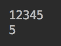
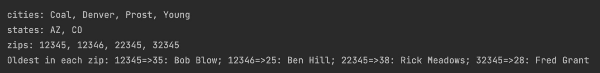

# 第十四章：Java 标准流

在本章中，我们将讨论数据处理流，这些流与我们在*第五章*，“字符串、输入/输出和文件”中回顾的 I/O 流不同。我们将定义什么是数据流，如何使用`java.util.stream.Stream`对象的方法（操作）处理它们的元素，以及如何在管道中链式（连接）流操作。我们还将讨论流的初始化以及如何并行处理流。

本章将涵盖以下主题：

+   流作为数据和操作源

+   流初始化

+   操作（方法）

+   数字流接口

+   并行流

+   创建独立的流处理应用程序

到本章结束时，你将能够编写处理数据流以及创建作为独立项目的流处理应用程序的代码。

# 技术要求

要能够执行本章提供的代码示例，你需要以下内容：

+   配有 Microsoft Windows、Apple macOS 或 Linux 操作系统的计算机

+   Java SE 版本 17 或更高版本

+   你选择的 IDE 或代码编辑器

在*第一章*，“开始使用 Java 17”中提供了如何设置 Java SE 和 IntelliJ IDEA 编辑器的说明。本章的代码示例文件可在 GitHub 仓库[`github.com/PacktPublishing/Learn-Java-17-Programming.git`](https://github.com/PacktPublishing/Learn-Java-17-Programming.git)的`examples/src/main/java/com/packt/learnjava/ch14_streams`文件夹和`streams`文件夹中找到，其中包含一个独立的流处理应用程序。

# 流作为数据和操作源

在上一章中描述和演示的 Lambda 表达式，以及函数式接口，为 Java 添加了强大的函数式编程能力。它们允许将行为（函数）作为参数传递给针对数据处理性能优化的库。这样，应用程序程序员可以专注于开发系统的业务方面，将性能方面留给专家——库的作者。这样的库的一个例子是`java.util.stream`，这将是本章的重点。

在*第五章*，*字符串、输入/输出和文件*中，我们讨论了 I/O 流作为数据源，但除此之外，它们在进一步处理数据方面帮助不大。此外，它们是基于字节或字符的，而不是基于对象的。只有当对象首先以编程方式创建和序列化后，才能创建对象流。I/O 流只是连接到外部资源，主要是文件，没有其他用途。然而，有时可以从 I/O 流过渡到`java.util.stream.Stream`。例如，`BufferedReader`类有一个`lines()`方法，它将底层的基于字符的流转换为`Stream<String>`对象。

另一方面，`java.util.stream`包中的流是面向处理对象集合的。在*第二章*，*数据结构、泛型和常用工具*中，我们描述了`Collection`接口的两个方法，允许您将集合元素作为流元素读取：`default Stream<E> stream()`和`default Stream<E> parallelStream()`。我们还提到了`java.util.Arrays`的`stream()`方法。它有以下八个重载版本，可以将数组或其部分转换为相应数据类型的流：

+   `static DoubleStream stream(double[] array)`

+   `static DoubleStream stream(double[] array, int startInclusive, int endExclusive)`

+   `static IntStream stream(int[] array)`

+   `static IntStream stream(int[] array, int startInclusive, int endExclusive)`

+   `static LongStream stream(long[] array)`

+   `static LongStream stream(long[] array, int startInclusive, int endExclusive)`

+   `static <T> Stream<T> stream(T[] array)`

+   `static <T> Stream<T> stream(T[] array, int startInclusive, int endExclusive)`

让我们更仔细地看看`java.util.stream`包中的流。理解流的最佳方式是将它与集合进行比较。后者是存储在内存中的数据结构。每个集合元素在添加到集合之前都会被计算。相比之下，流发出的元素存在于其他地方，即源，并且按需计算。因此，集合可以成为流的一个来源。

`Stream`对象是`Stream`接口、`IntStream`、`LongStream`或`DoubleStream`的实现；后三个称为`Stream`接口，也在数值流中可用。一些数值流有一些额外的方法，如`average()`和`sum()`，它们是特定的数值。在本章中，我们将主要讨论`Stream`接口及其方法，但我们所涵盖的一切同样适用于数值流。

一旦之前发射的元素被处理，流就会*产生*（或*发射*）流元素。它允许以声明性方式呈现可以应用于发射元素的方法（操作），也可以并行执行。如今，随着大数据集处理机器学习需求变得普遍，这一特性加强了 Java 作为少数现代编程语言之一的选择地位。

说了这么多，我们将从流初始化开始。

# 流初始化

创建和初始化流有许多方法——`Stream`类型的对象或任何数值接口。我们根据具有流创建方法的类和接口对它们进行了分组。我们这样做是为了方便您记忆，并在需要时更容易找到它们。

## Stream 接口

这个`Stream`工厂组由属于`Stream`接口的静态方法组成。

### empty()

`Stream<T> empty()`方法创建一个不发射任何元素的空流：

```java
Stream.empty().forEach(System.out::println);   //prints nothing
```

`forEach()` `Stream`方法与`forEach()` `Collection`方法类似，并将传入的函数应用于流中的每个元素：

```java
new ArrayList().forEach(System.out::println);  //prints nothing
```

结果与从空集合创建流相同：

```java
new ArrayList().stream().forEach(System.out::println);  
```

```java
                                               //prints nothing
```

如果没有元素被发射，则不会发生任何操作。我们将在*终端操作*子节中讨论`forEach()` `Stream`方法。

### of(T... values)

`of(T... values)`方法接受可变参数，也可以创建一个空流：

```java
Stream.of().forEach(System.out::print);       //prints nothing
```

然而，它通常用于初始化非空流：

```java
Stream.of(1).forEach(System.out::print);           //prints: 1
```

```java
Stream.of(1,2).forEach(System.out::print);         //prints: 12
```

```java
Stream.of("1 ","2").forEach(System.out::print);   //prints: 1 2
```

注意用于调用`println()`和`print()`方法的引用方法。

使用`of(T... values)`方法的另一种方式如下：

```java
String[] strings = {"1 ", "2"};
```

```java
Stream.of(strings).forEach(System.out::print);    //prints: 1 2
```

如果没有为`Stream`对象指定类型，编译器不会对数组中包含的类型混合提出异议：

```java
Stream.of("1 ", 2).forEach(System.out::print);    //prints: 1 2
```

添加声明预期元素类型的泛型会导致至少有一个列表元素类型不同时抛出异常：

```java
//Stream<String> stringStream = Stream.of("1 ", 2);   
```

```java
                                                //compile error
```

泛型帮助程序员避免许多错误，因此应该尽可能添加。

`of(T... values)`方法也可以用于多个流的连接。例如，假设我们有以下四个流，我们希望将它们连接成一个：

```java
Stream<Integer> stream1 = Stream.of(1, 2);
```

```java
Stream<Integer> stream2 = Stream.of(2, 3);
```

```java
Stream<Integer> stream3 = Stream.of(3, 4);
```

```java
Stream<Integer> stream4 = Stream.of(4, 5);
```

我们希望将它们连接成一个新的流，该流发射`1,2,2,3,3,4,4,5`值。首先，我们尝试以下代码：

```java
Stream.of(stream1, stream2, stream3, stream4)
```

```java
   .forEach(System.out::print);
```

```java
     //prints: java.util.stream.ReferencePipeline$Head@58ceff1j
```

它没有达到我们希望的效果。它将每个流视为`Stream`接口实现中使用的`java.util.stream.ReferencePipeline`内部类的对象。因此，我们需要添加`flatMap()`操作将每个流元素转换为流（我们将在*中间操作*子节中描述）：

```java
Stream.of(stream1, stream2, stream3, stream4)
```

```java
 .flatMap(e -> e).forEach(System.out::print);   
```

```java
                                             //prints: 12233445
```

我们传递给`flatMap()`作为参数的函数（`e -> e`）看起来像是在做无用功，但这是因为流中的每个元素本身就是一个流，所以没有必要对其进行转换。通过将元素作为`flatMap()`操作的返回值，我们告诉管道将返回值作为`Stream`对象处理。

### ofNullable(T t)

`ofNullable(T t)`方法返回`Stream<T>`，如果传入的`t`参数不是`null`，则发出单个元素；否则，它返回一个空的`Stream`。为了演示`ofNullable(T t)`方法的用法，我们创建以下方法：

```java
void printList1(List<String> list){
```

```java
    list.stream().forEach(System.out::print);
```

```java
}
```

我们执行此方法两次 - 参数列表等于`null`和一个`List`对象。以下是结果：

```java
//printList1(null);                      //NullPointerException
```

```java
List<String> list = List.of("1 ", "2");
```

```java
printList1(list);                          //prints: 1 2
```

注意，第一次调用`printList1()`方法会生成`NullPointerException`。为了避免异常，我们可以将方法实现如下：

```java
void printList1(List<String> list){ 
```

```java
     (list == null ? Stream.empty() : list.stream()) 
```

```java
                           .forEach(System.out::print);
```

```java
} 
```

使用`ofNullable(T t)`方法可以达到相同的结果：

```java
void printList2(List<String> list){
```

```java
    Stream.ofNullable(list).flatMap(l -> l.stream())
```

```java
                           .forEach(System.out::print);
```

```java
}
```

注意我们如何添加了`flatMap()`，因为否则流入`forEach()`的`Stream`元素将是一个`List`对象。我们将在*中间操作*子节中更多地讨论`flatMap()`方法。在前面代码中传递给`flatMap()`操作的函数也可以表示为一个方法引用：

```java
void printList4(List<String> list){
```

```java
    Stream.ofNullable(list).flatMap(Collection::stream)
```

```java
                           .forEach(System.out::print);
```

```java
}
```

### 迭代（对象和一元操作符）

`Stream`接口的两种静态方法允许您使用类似于传统`for`循环的迭代过程生成值流，如下所示：

+   `Stream<T> iterate(T seed, UnaryOperator<T> func)`: 这根据第二个参数`func`函数对第一个`seed`参数的迭代应用创建了一个无限顺序流，产生一个值流：`seed`，`f(seed)`，`f(f(seed))`，等等。

+   `Stream<T> iterate(T seed, Predicate<T> hasNext, UnaryOperator<T> next)`: 这根据第三个参数`next`函数对第一个`seed`参数的迭代应用创建了一个有限顺序流，产生一个值流：`seed`，`f(seed)`，`f(f(seed))`，等等，只要第三个参数`hasNext`函数返回`true`。

以下代码演示了这些方法的用法，如下所示：

```java
Stream.iterate(1, i -> ++i).limit(9)
```

```java
      .forEach(System.out::print);   //prints: 123456789
```

```java
Stream.iterate(1, i -> i < 10, i -> ++i)
```

```java
      .forEach(System.out::print);   //prints: 123456789
```

注意，我们被迫向第一个管道添加了一个中间操作符`limit(int n)`，以避免生成无限数量的生成值。我们将在*中间操作*子节中更多地讨论此方法。

### 连接（流 a 和流 b）

`Stream<T> concat(Stream<> a, Stream<T> b)`的静态方法`Stream`接口根据传入的参数`a`和`b`创建一个值流。新创建的流由第一个参数`a`的所有元素组成，后面跟着第二个参数`b`的所有元素。以下代码演示了此方法：

```java
Stream<Integer> stream1 = List.of(1, 2).stream();
```

```java
Stream<Integer> stream2 = List.of(2, 3).stream();
```

```java
Stream.concat(stream1, stream2)
```

```java
 .forEach(System.out::print); //prints: 1223
```

注意，`2`元素在原始流中都有，因此结果流会发出两次。

### 生成（供应商）

`Stream`接口的`generate(Supplier<T> supplier)`静态方法创建一个无限流，其中每个元素都是由提供的`Supplier<T>`函数生成的。以下有两个示例：

```java
Stream.generate(() -> 1).limit(5)
```

```java
 .forEach(System.out::print);    //prints: 11111
```

```java
Stream.generate(() -> new Random().nextDouble()).limit(5)
```

```java
   .forEach(System.out::println);  //prints: 0.38575117472619247
```

```java
                                   //        0.5055765386778835
```

```java
                                   //        0.6528038976983277
```

```java
                                   //        0.4422354489467244
```

```java
                                   //        0.06770955839148762
```

如果你运行这段代码，你可能会因为生成的值具有随机（伪随机）性质而得到不同的结果。

由于创建的流是无限的，我们添加了一个`limit(int n)`操作，它只允许指定的流元素数量通过。我们将在*中间操作*子节中更多地讨论此方法。

## `Stream.Builder`接口

`Stream.Builder<T> builder()`静态方法返回一个内部（位于`Stream`接口内部）的`Builder`接口，可以用来构建`Stream`对象。`Builder`接口扩展了`Consumer`接口，并具有以下方法：

+   `default Stream.Builder<T> add(T t)`: 这个方法调用`accept(T)`方法并返回`Builder`对象，从而允许你以流畅的点连接方式链式调用`add(T t)`方法。

+   `void accept(T t)`: 这个方法向流中添加一个元素（此方法来自`Consumer`接口）。

+   `Stream<T> build()`: 这个方法将构建器从构建状态转换为`built`状态。调用此方法后，无法向此流中添加新元素。

`add(T t)`方法的用法很简单：

```java
Stream.<String>builder().add("cat").add(" dog").add(" bear")
```

```java
   .build().forEach(System.out::print);  //prints: cat dog bear
```

注意我们如何在`builder()`方法前添加了`<String>`泛型。这样，我们告诉构建器，我们创建的流将包含`String`类型的元素。否则，它将添加`Object`类型的元素，并且无法确保添加的元素是`String`类型。

当构建器作为`Consumer<T>`类型的参数传递，或者你不需要链式调用添加元素的方法时，会使用`accept(T t)`方法。以下是一个代码示例：

```java
Stream.Builder<String> builder = Stream.builder();
```

```java
List.of("1", "2", "3").stream().forEach(builder);   
```

```java
builder.build().forEach(System.out::print);    //prints: 123
```

`forEach(Consumer<T> consumer)`方法接受一个具有`accept(T t)`方法的`Consumer`函数。每当流发出一个元素时，`forEach()`方法接收它并将其传递给`Builder`对象的`accept(T t)`方法。然后，在下一行调用`build()`方法时，创建`Stream`对象并开始发出之前通过`accept(T t)`方法添加的元素。发出的元素传递给`forEach()`方法，然后逐个打印它们。

下面是`accept(T t)`方法的一个显式使用示例：

```java
List<String> values = List.of("cat", " dog", " bear");
```

```java
Stream.Builder<String> builder = Stream.builder();
```

```java
for(String s: values){
```

```java
    if(s.contains("a")){
```

```java
        builder.accept(s);
```

```java
    }
```

```java
}
```

```java
builder.build().forEach(System.out::print);  //prints: cat bear
```

这次，我们决定不将所有列表元素添加到流中，而只添加包含`a`字符的元素。正如预期的那样，创建的流只包含`cat`和`bear`元素。同时，注意我们如何使用`<String>`泛型来确保所有流元素都是`String`类型。

## 其他类和接口

在 Java 8 中，向`java.util.Collection`接口添加了两个默认方法，如下所示：

+   `Stream<E> stream()`: 这将返回此集合的元素流。

+   `Stream<E> parallelStream()`: 这将返回（可能）一个并行流，包含此集合的元素 – 我们说“可能”，因为 JVM 尝试将流分割成几个块，并在多个 CPU 上并行处理（如果有多个 CPU）或使用 CPU 时间共享进行虚拟并行处理。然而，这并不总是可能的，部分取决于请求处理的性质。

这意味着所有扩展此接口的集合接口，包括 `Set` 和 `List`，都有这些方法，如本示例所示：

```java
List.of("1", "2", "3").stream().forEach(builder);
```

```java
List.of("1", "2", "3").parallelStream().forEach(builder);
```

我们将在“并行流”部分讨论并行流。

在“流作为数据源和操作”部分的开始，我们描述了 `java.util.Arrays` 类的八个静态重载 `stream()` 方法。以下是通过数组子集创建流的一种另一种方法示例：

```java
int[] arr = {1, 2, 3, 4, 5}; 
```

```java
Arrays.stream(arr, 2, 4).forEach(System.out::print); 
```

```java
                                                   //prints: 34 
```

`java.util.Random` 类允许您创建伪随机数值的数值流，如下所示：

+   `DoubleStream doubles()`: 创建一个无限流，包含 `double` 值，介于 `0`（包含）和 `1`（不包含）

+   `IntStream ints()` 和 `LongStream longs()`: 创建一个无限流，包含相应类型的值

+   `DoubleStream doubles(long streamSize)`: 创建一个大小为指定值的 `double` 值流，介于 `0`（包含）和 `1`（不包含）

+   `IntStream ints(long streamSize)` 和 `LongStream longs(long streamSize)`: 创建一个大小为指定类型值的流

+   `IntStream ints(int randomNumberOrigin, int randomNumberBound)`: 创建一个无限流，包含 `int` 值，介于 `randomNumberOrigin`（包含）和 `randomNumberBound`（不包含）

+   `LongStream longs(long randomNumberOrigin, long randomNumberBound)`: 创建一个无限流，包含 `long` 值，介于 `randomNumberOrigin`（包含）和 `randomNumberBound`（不包含）

+   `DoubleStream doubles(long streamSize, double randomNumberOrigin, double randomNumberBound)`: 创建一个大小为指定值的 `double` 值流，这些值介于 `randomNumberOrigin`（包含）和 `randomNumberBound`（不包含）

以下是一个前面方法的示例：

```java
new Random().ints(5, 8).limit(5) 
```

```java
            .forEach(System.out::print);    //prints: 56757 
```

由于使用了 `random`，每次执行都可能（并且很可能）生成不同的结果。

`java.nio.file.Files` 类有六个静态方法创建行和路径流，如下所示：

+   `Stream<String> lines(Path path)`: 从提供的路径指定的文件创建行流

+   `Stream<String> lines(Path path, Charset cs)`: 从提供的路径指定的文件创建行流；使用提供的 `charset` 将文件字节解码为字符

+   `Stream<Path> list(Path dir)`: 创建指定目录中的文件和目录流

+   `Stream<Path> walk(Path start, FileVisitOption... options)`: 创建从 `Path start` 开始的文件树中的文件和目录流

+   `Stream<Path> walk(Path start, int maxDepth, FileVisitOption... options)`: 创建从 `Path start` 开始的文件和目录的文件树流，直到指定的 `maxDepth` 深度

+   `Stream<Path> find(Path start, int maxDepth, BiPredicate<Path, BasicFileAttributes> matcher, FileVisitOption... options)`: 创建从 `Path start` 开始的文件和目录（匹配提供的谓词）的文件树流，直到指定的 `maxDepth` 深度

其他创建流的类和方法包括以下内容：

+   `java.util.BitSet` 类具有 `IntStream stream()` 方法，该方法创建一个索引流，对于这个 `BitSet`，它包含在 `set` 状态下的位。

+   `java.io.BufferedReader` 类具有 `Stream<String> lines()` 方法，该方法从这个 `BufferedReader` 对象创建一个流，通常是来自文件。

+   `java.util.jar.JarFile` 类具有 `Stream<JarEntry> stream()` 方法，该方法创建一个 ZIP 文件条目的流。

+   `java.util.regex.Pattern` 类具有 `Stream<String> splitAsStream(CharSequence input)` 方法，该方法从提供的序列中创建一个流，围绕此模式的匹配项。

`java.lang.CharSequence` 接口有两个方法，如下所示：

+   `default IntStream chars()`: 创建一个 `int` 流，将 `char` 值零扩展

+   `default IntStream codePoints()`: 从这个序列创建一个代码点值的流

此外，还有一个 `java.util.stream.StreamSupport` 类，它包含用于库开发者的静态低级实用方法。然而，我们不会对其进行审查，因为这超出了本书的范围。

# 操作（方法）

`Stream` 接口中的许多方法，包括那些参数为函数接口类型的方法，被称为 `parameter` 方法。

例如，让我们看看 `Stream<T> filter (Predicate<T> predicate)` 方法。它的实现基于对 `Predicate<T>` 函数的 `test(T t)` 方法 Boolean 的调用。因此，与其说“我们使用 `Stream` 对象的 `filter()` 方法来选择一些流元素并跳过其他元素”，程序员更愿意说“我们应用一个过滤操作，允许一些流元素通过并跳过其他元素”。这描述了操作（操作）的本质，而不是特定的算法，直到方法接收到特定的函数才知道。`Stream` 接口中有两组操作，如下所示：

+   `Stream` 对象

+   `Stream`

流处理通常组织成一个管道，使用流畅（点连接）风格。一个创建 `Stream` 的方法或另一个流源开始这样一个管道。终端操作产生最终结果或副作用，并以此结束管道。中间操作可以放置在原始 `Stream` 对象和终端操作之间。

中间操作处理流元素（在某些情况下可能不处理）并返回修改后的（或未修改的）`Stream`对象，以便下一个中间或终端操作可以应用。以下是一些中间操作的例子：

+   `Stream<T> filter(Predicate<T> predicate)`: 仅选择符合特定标准的元素。

+   `Stream<R> map(Function<T,R> mapper)`: 根据传入的函数转换元素。注意，返回的`Stream`对象类型可能与输入类型大不相同。

+   `Stream<T> distinct()`: 删除重复项。

+   `Stream<T> limit(long maxSize)`: 限制流到指定的元素数量。

+   `Stream<T> sorted()`: 按特定顺序排列流元素。

我们将在*中间操作*节中讨论一些其他中间操作。

流元素的真正处理实际上只有在终端操作开始执行时才开始。然后，所有中间操作（如果有的话）按顺序开始处理。一旦终端操作完成执行，流就会关闭，无法重新打开。

终端操作的例子有`forEach()`、`findFirst()`、`reduce()`、`collect()`、`sum()`、`max()`以及`Stream`接口的其他不返回`Stream`对象的方法。我们将在*终端操作*子节中讨论它们。

所有的`Stream`操作都支持并行处理，这在处理多核计算机上的大量数据时特别有帮助。我们将在*并行流*子节中讨论它。

## 中间操作

正如我们之前提到的，中间操作返回一个`Stream`对象，该对象发出相同的或修改后的值，甚至可能不同于流源的类型。

中间操作可以根据其功能分为四个类别，这些类别执行**过滤**、**映射**、**排序**或**查看**操作。

### 过滤

此组包括以下操作，用于删除重复项、跳过一些元素、限制处理元素的数量，以及仅选择通过某些标准筛选的元素：

+   `Stream<T> distinct()`: 使用`Object.equals(Object)`方法比较流元素并跳过重复项

+   `Stream<T> skip(long n)`: 忽略提供的第一个指定数量的流元素

+   `Stream<T> limit(long maxSize)`: 仅允许处理提供的指定数量的流元素

+   `Stream<T> filter(Predicate<T> predicate)`: 仅允许通过提供的`Predicate`函数处理结果为`true`的元素被处理

+   `default Stream<T> dropWhile(Predicate<T> predicate)`: 跳过流中那些通过提供的`Predicate`函数处理结果为`true`的第一个元素

+   `default Stream<T> takeWhile(Predicate<T> predicate)`: 仅允许流中那些通过提供的`Predicate`函数处理结果为`true`的第一个元素被处理

以下代码演示了刚刚描述的操作是如何工作的：

```java
Stream.of("3", "2", "3", "4", "2").distinct()
```

```java
                  .forEach(System.out::print);    //prints: 324
```

```java
List<String> list = List.of("1", "2", "3", "4", "5");
```

```java
list.stream().skip(3).forEach(System.out::print);  //prints: 45
```

```java
list.stream().limit(3).forEach(System.out::print); 
```

```java
                                                  //prints: 123
```

```java
list.stream().filter(s -> Objects.equals(s, "2"))
```

```java
             .forEach(System.out::print);          //prints: 2
```

```java
list.stream().dropWhile(s -> Integer.valueOf(s) < 3)
```

```java
             .forEach(System.out::print);         //prints: 345
```

```java
list.stream().takeWhile(s -> Integer.valueOf(s) < 3)
```

```java
             .forEach(System.out::print);          //prints: 12
```

注意，我们能够重用源 `List<String>` 对象，但不能重用 `Stream` 对象。一旦 `Stream` 对象关闭，就无法重新打开。

### 映射

这组操作可能是最重要的中间操作。它们是唯一修改流元素的中间操作。它们 **映射**（转换）原始流元素值到一个新的值，如下所示：

+   `Stream<R> map(Function<T, R> mapper)`: 将提供的函数应用于流中每个类型为 `T` 的元素，并生成一个类型为 `R` 的新元素值

+   `IntStream mapToInt(ToIntFunction<T> mapper)`: 将提供的函数应用于流中每个类型为 `T` 的元素，并生成一个类型为 `int` 的新元素值

+   `LongStream mapToLong(ToLongFunction<T> mapper)`: 将提供的函数应用于流中每个类型为 `T` 的元素，并生成一个类型为 `long` 的新元素值

+   `DoubleStream mapToDouble(ToDoubleFunction<T> mapper)`: 将提供的函数应用于流中每个类型为 `T` 的元素，并生成一个类型为 `double` 的新元素值

+   `Stream<R> flatMap(Function<T, Stream<R>> mapper)`: 将提供的函数应用于流中每个类型为 `T` 的元素，并生成一个发出类型为 `R` 的元素的 `Stream<R>` 对象

+   `IntStream flatMapToInt(Function<T, IntStream> mapper)`: 将提供的函数应用于流中每个类型为 `T` 的元素，并生成一个发出类型为 `int` 的元素的 `IntStream` 对象

+   `LongStream flatMapToLong(Function<T, LongStream> mapper)`: 将提供的函数应用于流中每个类型为 `T` 的元素，并生成一个发出类型为 `long` 的 `LongStream` 对象

+   `DoubleStream flatMapToDouble(Function<T, DoubleStream> mapper)`: 将提供的函数应用于流中每个类型为 `T` 的元素，并生成一个发出类型为 `double` 的 `DoubleStream` 对象

以下是一些使用这些操作的示例，如下所示：

```java
List<String> list = List.of("1", "2", "3", "4", "5");
```

```java
list.stream().map(s -> s + s)
```

```java
             .forEach(System.out::print);  //prints: 1122334455
```

```java
list.stream().mapToInt(Integer::valueOf)
```

```java
             .forEach(System.out::print);  //prints: 12345
```

```java
list.stream().mapToLong(Long::valueOf)
```

```java
             .forEach(System.out::print);  //prints: 12345
```

```java
list.stream().mapToDouble(Double::valueOf)
```

```java
       .mapToObj(Double::toString)
```

```java
       .map(s -> s + " ")
```

```java
       .forEach(System.out::print); 
```

```java
                                  //prints: 1.0 2.0 3.0 4.0 5.0
```

```java
list.stream().mapToInt(Integer::valueOf)
```

```java
    .flatMap(n -> IntStream.iterate(1, I -> i < n, i -> ++i))
```

```java
    .forEach(System.out::print);         //prints: 1121231234
```

```java
list.stream().map(Integer::valueOf)
```

```java
    .flatMapToInt(n -> IntStream.iterate(1, i->i<n, i -> ++i))
```

```java
    .forEach(System.out::print);        //prints: 1121231234
```

```java
list.stream().map(Integer::valueOf)
```

```java
    .flatMapToLong(n -> LongStream.iterate(1, i->i<n,i -> ++i))
```

```java
    .forEach(System.out::print);        //prints: 1121231234
```

```java
list.stream().map(Integer::valueOf)
```

```java
 .flatMapToDouble(n -> DoubleStream.iterate(1,i->i<n,i -> ++i))
```

```java
    .mapToObj(Double::toString)
```

```java
    .map(s -> s +"""")
```

```java
    .forEach(System.out::print);
```

```java
              //prints: 1.0 1.0 2.0 1.0 2.0 3.0 1.0 2.0 3.0 4.0
```

在最后一个示例中，通过将流转换为 `DoubleStream`，我们将每个数值转换为 `String` 对象并添加空格，因此结果可以在数字之间打印空格。这些示例非常简单——只是转换，处理最少。但在现实生活中，每个 `map()` 或 `flatMap()` 操作通常接受一个更复杂的函数，执行更有用的操作。

### 排序

以下两个中间操作按顺序对流元素进行排序，如下所示：

+   `Stream<T> sorted()`: 按自然顺序（根据其 `Comparable` 接口的实现）对流元素进行排序

+   `Stream<T> sorted(Comparator<T> comparator)`: 按提供的 `Comparator<T>` 对象的顺序对流元素进行排序

自然地，这些操作必须在所有元素发出后才能完成，因此这种处理会产生大量开销，降低性能，并且必须用于小流。

这里有一些演示代码：

```java
List<String> list = List.of("2", "1", "5", "4", "3");
```

```java
list.stream().sorted().forEach(System.out::print); 
```

```java
                                                //prints: 12345
```

```java
list.stream().sorted(Comparator.reverseOrder())
```

```java
             .forEach(System.out::print);       //prints: 54321
```

### 预览

中间操作`Stream<T> peek(Consumer<T> action)`将提供的`Consumer<T>`函数应用于每个流元素，但不更改流值（`Consumer<T>`返回`void`）。此操作用于调试。以下代码显示了它是如何工作的：

```java
List<String> list = List.of("1", "2", "3", "4", "5");
```

```java
list.stream()
```

```java
 .peek(s -> System.out.print("3".equals(s) ? 3 : 0))
```

```java
 .forEach(System.out::print); //prints: 0102330405
```

## 终端操作

**终端操作**是流管道中最重要的操作。可以在其中完成所有操作，而无需使用任何其他操作。

我们已经使用了`forEach(Consumer<T>)`终端操作来打印每个元素。它不返回值，因此它用于其副作用。然而，`Stream`接口有许多更强大的终端操作，它们确实返回值。

其中最重要的是`collect()`操作，它有两种形式，如下所示：

+   `R collect(Collector<T, A, R> collector)`

+   `R collect(Supplier<R> supplier, BiConsumer<R, T> accumulator, BiConsumer<R, R> combiner)`

这允许您编写可以应用于流的任何过程。以下是一个经典示例：

```java
List<String> list = Stream.of("1", "2", "3", "4", "5")
```

```java
                          .collect(ArrayList::new,
```

```java
                                   ArrayList::add,
```

```java
                                   ArrayList::addAll);
```

```java
System.out.println(list);  //prints: [1, 2, 3, 4, 5]
```

此示例的使用方式使其适合并行处理。`collect()`操作的第一个参数是一个基于流元素的函数，它产生一个值。第二个参数是累积结果的函数。第三个参数是结合所有处理流的所有线程的累积结果的函数。

然而，只有一个这样的通用终端操作将迫使程序员反复编写相同的函数。这就是为什么 API 作者添加了`Collectors`类，它可以在不需要为每个`collect()`操作创建三个函数的情况下生成许多专门的`Collector`对象。

除了这些，API 作者还向`Stream`接口添加了各种更加专业的终端操作，这些操作更加简单且易于使用。在本节中，我们将回顾`Stream`接口的所有终端操作，并在`Collect`子节中查看由`Collectors`类产生的众多`Collector`对象。我们将从最简单的终端操作开始，该操作允许您逐个处理此流中的每个元素。

在我们的示例中，我们将使用以下类，`Person`：

```java
public class Person {
```

```java
    private int age;
```

```java
    private String name;
```

```java
    public Person(int age, String name) {
```

```java
        this.age = age;
```

```java
        this.name = name;
```

```java
    }
```

```java
    public int getAge() {return this.age; }
```

```java
    public String getName() { return this.name; }
```

```java
    @Override
```

```java
    public String toString() {
```

```java
        return "Person{" + "name='" + this.name + "'" +
```

```java
                                       ", age=" + age + "}";
```

```java
    }
```

```java
}
```

### 处理每个元素

该组中有两个终端操作，如下所示：

+   `void forEach(Consumer<T> action)`: 对此流中的每个元素应用提供的操作

+   `void forEachOrdered(Consumer<T> action)`: 对此流中的每个元素应用提供的操作，顺序由源定义，无论流是顺序的还是并行的

如果你需要处理元素顺序并且这个顺序必须与源中值排列的顺序一致，请使用第二种方法，尤其是如果你能预见你的代码可能会在具有多个 CPU 的计算机上执行。否则，使用第一种方法，就像我们在所有示例中所做的那样。

让我们看看`forEach()`操作的一个示例，用于从文件中读取逗号分隔的值（年龄和姓名）并创建`Person`对象。我们放置了以下`persons.csv`文件（`resources`文件夹中）：

```java
23 , Ji m
```

```java
    2 5 , Bob
```

```java
  15 , Jill
```

```java
17 , Bi ll
```

我们在值内部和外部添加了空格，以便利用这个机会向您展示一些简单但非常实用的技巧，用于处理现实生活中的数据。

首先，我们将只读取文件并逐行显示其内容，但只显示包含字母`J`的行（调整路径值或将其设置为`绝对路径`，如果代码找不到`persons.csv`文件）：

```java
Path path = Paths.get("src/main/resources/persons.csv");
```

```java
try (Stream<String> lines = Files.newBufferedReader(path).lines()) {
```

```java
    lines.filter(s -> s.contains("J"))
```

```java
         .forEach(System.out::println);  
```

```java
                                  //prints: 23 , Ji m 15 , Jill
```

```java
} catch (IOException ex) {
```

```java
    ex.printStackTrace();
```

```java
}
```

这是一种典型的使用`forEach()`操作的方式——独立处理每个元素。此代码还提供了一个 try-with-resources 结构的示例，该结构会自动关闭`BufferedReader`对象。

以下是一个没有经验的程序员可能会编写的代码，用于从`Stream<String> lines`对象中读取流元素并创建`Person`对象列表：

```java
List<Person> persons = new ArrayList<>();
```

```java
lines.filter(s -> s.contains("J")).forEach(s -> {
```

```java
    String[] arr = s.split(",");
```

```java
    int age = Integer.valueOf(StringUtils.remove(arr[0], ' '));
```

```java
    persons.add(new Person(age, StringUtils.remove(arr[1], 
```

```java
                                                        ' ')));
```

```java
});
```

您可以看到`split()`方法是如何被用来通过分隔值的逗号来分割每一行的，以及`org.apache.commons.lang3.StringUtils.remove()`方法是如何从每个值中删除空格的。尽管这段代码在单核计算机上的小示例中运行良好，但它可能在长流和并行处理中产生意外的结果。

这是为什么 lambda 表达式要求所有变量必须是 final 或实际上是 final 的原因——这样相同的函数就可以在不同的上下文中执行。

以下是对前面代码的正确实现：

```java
List<Person> persons = lines.filter(s -> s.contains("J"))
```

```java
   .map(s -> s.split(","))
```

```java
   .map(arr -> {
```

```java
       int age = Integer.valueOf(StringUtils.remove(arr[0], 
```

```java
                                                         ' '));
```

```java
       return new Person(age, StringUtils.remove(arr[1], ' '));
```

```java
   }).collect(Collectors.toList());
```

为了提高可读性，我们可以创建一个执行映射工作的方法：

```java
private Person createPerson(String[] arr){
```

```java
    int age = Integer.valueOf(StringUtils.remove(arr[0], ' '));
```

```java
    return new Person(age, StringUtils.remove(arr[1], ' '));
```

```java
}
```

现在，我们可以这样使用它：

```java
List<Person> persons = lines.filter(s -> s.contains("J"))
```

```java
                            .map(s -> s.split(","))
```

```java
                            .map(this::createPerson)
```

```java
                            .collect(Collectors.toList());
```

如您所见，我们使用了`collect()`操作符和由`Collectors.toList()`方法创建的`Collector`函数。我们将在*收集*子部分中看到由`Collectors`类创建的更多函数。

### 计数所有元素

`Stream`接口的`long count()`终端操作看起来简单且无害。它返回此流中的元素数量。那些习惯于使用集合和数组的人可能会不加思考地使用`count()`操作。以下代码片段演示了一个注意事项：

```java
long count = Stream.of("1", "2", "3", "4", "5")
```

```java
                   .peek(System.out::print)
```

```java
                   .count();
```

```java
System.out.print(count);          //prints: 5               
```

如果我们运行前面的代码，结果将如下所示：


正如你所见，实现`count()`方法的代码能够确定流的大小而不需要执行所有管道。`peek()`操作没有打印任何内容，这证明了元素没有被发出。所以，如果你期望看到流中的值被打印出来，你可能会感到困惑，并期望代码存在某种缺陷。

另一个注意事项是，在源处并不总是可以确定流的大小。此外，流可能是无限的。因此，你必须小心使用`count()`。

确定流大小的另一种可能方法是使用`collect()`操作：

```java
long count = Stream.of("1", "2", "3", "4", "5")
```

```java
                   .peek(System.out::print)     //prints: 12345
```

```java
                   .collect(Collectors.counting());
```

```java
System.out.println(count);                         //prints: 5 
```

以下截图显示了在运行前面的代码示例之后发生的情况：



如你所见，`collect()`操作没有在源处计算流的大小。这是因为`collect()`操作不像`count()`操作那样专门化。它只是将传入的收集器应用于流。收集器只是计算`collect()`操作提供的元素数量。

### 匹配全部、任意或没有

有三种看似非常相似的终端操作，允许我们评估流中的元素是否全部、任意或没有任何一个具有特定的值，如下所示：

+   `boolean allMatch(Predicate<T> predicate)`: 当流中的每个元素作为提供的`Predicate<T>`函数的参数返回`true`时，返回`true`

+   `boolean anyMatch(Predicate<T> predicate)`: 当流中的某个元素作为提供的`Predicate<T>`函数的参数返回`true`时，返回`true`

+   `boolean noneMatch(Predicate<T> predicate)`: 当流中的没有任何元素作为提供的`Predicate<T>`函数的参数返回`true`时，返回`true`

以下是一些使用示例：

```java
List<String> list = List.of("1", "2", "3", "4", "5");
```

```java
boolean found = list.stream()
```

```java
                    .peek(System.out::print)      //prints: 123
```

```java
                    .anyMatch(e -> "3".equals(e));
```

```java
System.out.println(found);                       //prints: true
```

```java
boolean noneMatches = list.stream()
```

```java
                         .peek(System.out::print) //prints: 123
```

```java
                         .noneMatch(e -> "3".equals(e));
```

```java
System.out.println(noneMatches);                //prints: false
```

```java
boolean allMatch = list.stream()
```

```java
                       .peek(System.out::print)    //prints: 1
```

```java
                       .allMatch(e -> "3".equals(e));
```

```java
System.out.println(allMatch);                   //prints: false
```

请注意，所有这些操作都进行了优化，以便在结果可以提前确定的情况下，不会处理所有流元素。

### 查找任意或第一个

以下终端操作允许你找到流中的任意元素或第一个元素，如下所示：

+   `Optional<T> findAny()`: 返回流中任意元素的`Optional`值，如果流为空则返回一个空的`Optional`

+   `Optional<T> findFirst()`: 返回流中第一个元素的`Optional`值，如果流为空则返回一个空的`Optional`

以下示例说明了这些操作：

```java
List<String> list = List.of("1", "2", "3", "4", "5");
```

```java
Optional<String> result = list.stream().findAny();
```

```java
System.out.println(result.isPresent());    //prints: true
```

```java
System.out.println(result.get());          //prints: 1
```

```java
result = list.stream()
```

```java
             .filter(e -> "42".equals(e))
```

```java
             .findAny();
```

```java
System.out.println(result.isPresent());   //prints: false
```

```java
//System.out.println(result.get());    //NoSuchElementException
```

```java
result = list.stream().findFirst();
```

```java
System.out.println(result.isPresent());   //prints: true
```

```java
System.out.println(result.get());         //prints: 1
```

在前面的例子中的第一个和第三个例子中，`findAny()`和`findFirst()`操作产生相同的结果——它们都找到了流中的第一个元素。但在并行处理中，结果可能会有所不同。

当流被分成几个部分进行并行处理时，`findFirst()`操作总是返回流中的第一个元素，而`findAny()`操作只在其中一个处理线程中返回第一个元素。

现在，让我们更详细地谈谈`class java.util.Optional`。

### Optional 类

`java.util.Optional` 对象用于避免返回 `null`（因为它可能引发 `NullPointerException`）。相反，`Optional` 对象提供了允许你检查值是否存在，并在返回值为 `null` 时用预定义值替换它的方法，如下例所示：

```java
List<String> list = List.of("1", "2", "3", "4", "5");
```

```java
String result = list.stream()
```

```java
                    .filter(e -> "42".equals(e))
```

```java
                    .findAny()
```

```java
                    .or(() -> Optional.of("Not found"))
```

```java
                    .get();
```

```java
System.out.println(result);              //prints: Not found
```

```java
result = list.stream()
```

```java
             .filter(e -> "42".equals(e))
```

```java
             .findAny()
```

```java
             .orElse("Not found");
```

```java
System.out.println(result);              //prints: Not found
```

```java
Supplier<String> trySomethingElse = () -> {
```

```java
    //Code that tries something else
```

```java
    return "43";
```

```java
};
```

```java
result = list.stream()
```

```java
             .filter(e -> "42".equals(e))
```

```java
             .findAny()
```

```java
             .orElseGet(trySomethingElse);
```

```java
System.out.println(result);              //prints: 43
```

```java
list.stream()
```

```java
    .filter(e -> "42".equals(e))
```

```java
    .findAny()
```

```java
    .ifPresentOrElse(System.out::println,
```

```java
       () -> System.out.println("Not found")); 
```

```java
                                            //prints: Not found
```

如您所见，如果 `Optional` 对象为空，则以下适用，如下所示：

+   `Optional` 类的 `or()` 方法允许你返回一个替代的 `Optional` 对象。

+   `orElse()` 方法允许你返回一个替代值。

+   `orElseGet()` 方法允许你提供 `Supplier` 函数，该函数返回一个替代值。

+   `ifPresentOrElse()` 方法允许你提供两个函数——一个用于从 `Optional` 对象中消费值，另一个在 `Optional` 对象为空时执行其他操作。

### 最小值和最大值

以下终端操作返回流元素的最小值或最大值，如果存在，如下所示：

+   `Optional<T> min(Comparator<T> comparator)`: 使用提供的 `Comparator` 对象返回此流的最小元素

+   `Optional<T> max(Comparator<T> comparator)`: 使用提供的 `Comparator` 对象返回此流的最大元素

以下代码演示了这一点：

```java
List<String> list = List.of("a", "b", "c", "c", "a");
```

```java
String min = list.stream()
```

```java
                 .min(Comparator.naturalOrder())
```

```java
                 .orElse("0");
```

```java
System.out.println(min);     //prints: a
```

```java
String max = list.stream()
```

```java
 .max(Comparator.naturalOrder())
```

```java
                 .orElse("0");
```

```java
System.out.println(max);     //prints: c
```

如您所见，在非数值的情况下，最小元素是按照提供的比较器从左到右排序时第一个出现的元素。相应地，最大值是最后一个元素。在数值的情况下，最小值和最大值只是流元素中的最小和最大数字：

```java
int mn = Stream.of(42, 77, 33)
```

```java
               .min(Comparator.naturalOrder())
```

```java
               .orElse(0);
```

```java
System.out.println(mn);    //prints: 33
```

```java
int mx = Stream.of(42, 77, 33)
```

```java
               .max(Comparator.naturalOrder())
```

```java
               .orElse(0);
```

```java
System.out.println(mx);    //prints: 77
```

让我们看看另一个例子，使用 `Person` 类。任务是找到以下列表中的最年长者：

```java
List<Person> persons = List.of(new Person(23, "Bob"),
```

```java
 new Person(33, "Jim"),
```

```java
 new Person(28, "Jill"),
```

```java
 new Person(27, "Bill"));
```

为了做到这一点，我们可以创建以下 `Comparator<Person>`，它仅通过年龄比较 `Person` 对象：

```java
Comparator<Person> perComp = (p1, p2) -> p1.getAge() - p2.getAge();
```

然后，使用此比较器，我们可以找到最年长者：

```java
Person theOldest = persons.stream()
```

```java
                          .max(perComp)
```

```java
                          .orElse(null);
```

```java
System.out.println(theOldest);
```

```java
                          //prints: Person{name='Jim', age=33}
```

### 转为数组

以下两个终端操作生成一个包含流元素的数组，如下所示：

+   `Object[] toArray()`: 创建一个对象数组；每个对象都是流中的一个元素

+   `A[] toArray(IntFunction<A[]> generator)`: 使用提供的函数创建一个流元素数组

让我们看看一些例子：

```java
List<String> list = List.of("a", "b", "c");
```

```java
Object[] obj = list.stream().toArray();
```

```java
Arrays.stream(obj).forEach(System.out::print);    //prints: abc
```

```java
String[] str = list.stream().toArray(String[]::new);
```

```java
Arrays.stream(str).forEach(System.out::print);    //prints: abc
```

第一个例子很简单。它将元素转换为相同类型的数组。至于第二个例子，`IntFunction` 作为 `String[]::new` 的表示可能并不明显，所以让我们来分析一下。`String[]::new` 是一个方法引用，它表示 `i -> new String[i]` lambda 表达式，因为 `toArray()` 操作接收的不是流中的元素，而是它们的数量：

```java
String[] str = list.stream().toArray(i -> new String[i]);
```

我们可以通过打印一个 `i` 值来证明这一点：

```java
String[] str = list.stream()
```

```java
                   .toArray(i -> {
```

```java
                          System.out.println(i);    //prints: 3
```

```java
                          return  new String[i];
```

```java
                   });
```

`i -> new String[i]` 表达式是 `IntFunction<String[]>`，根据其文档，它接受一个 `int` 参数并返回指定类型的值。它可以定义为匿名类，如下所示：

```java
IntFunction<String[]> intFunction = new IntFunction<String[]>() { 
```

```java
         @Override 
```

```java
         public String[] apply(int i) { 
```

```java
              return new String[i]; 
```

```java
         } 
```

```java
}; 
```

`java.util.Collection`接口有一个非常类似的方法，可以将集合转换为数组：

```java
List<String> list = List.of("a", "b", "c");
```

```java
String[] str = list.toArray(new String[lits.size()]);
```

```java
Arrays.stream(str).forEach(System.out::print);    //prints: abc
```

唯一的区别是`Stream`接口的`toArray()`接受一个函数，而`Collection`接口的`toArray()`接受一个数组。

### 减少

这个终端操作被称为`reduce`，因为它处理所有流元素并产生一个值，从而将所有流元素减少到一个值。然而，这并不是唯一执行此操作的运算。`collect`操作也将流元素的值减少到一个结果。从某种意义上说，所有终端操作都是减少性的。它们在处理许多元素后产生一个值。

因此，你可以将`reduce`和`collect`视为同义词，它们有助于为`Stream`接口中许多操作添加结构和分类。此外，`reduce`组中的操作可以看作是`collect`操作的专用版本，因为`collect()`可以根据需要提供与`reduce()`操作相同的功能。

说了这么多，让我们看看一组`reduce`操作，如下所示：

+   `Optional<T> reduce(BinaryOperator<T> accumulator)`: 使用提供的关联函数来减少流元素，该函数聚合元素；如果可用，返回包含减少值的`Optional`

+   `T reduce(T identity, BinaryOperator<T> accumulator)`: 提供与之前`reduce()`版本相同的功能，但使用身份参数作为累加器的初始值或如果流为空时的默认值

+   `U reduce(U identity, BiFunction<U,T,U> accumulator, BinaryOperator<U> combiner)`: 提供与之前`reduce()`版本相同的功能，但除此之外，当此操作应用于并行流时，它还使用`combiner`函数来聚合结果；如果流不是并行的，则不使用`combiner`函数

为了演示`reduce()`操作，我们将使用之前使用过的相同的`Person`类和相同的`Person`对象列表作为流示例的来源：

```java
List<Person> persons = List.of(new Person(23, "Bob"),
```

```java
                               new Person(33, "Jim"),
```

```java
                               new Person(28, "Jill"),
```

```java
                               new Person(27, "Bill"));
```

让我们使用`reduce()`操作来找出这个列表中最年长的人：

```java
Person theOldest = list.stream()
```

```java
       .reduce((p1, p2) -> p1.getAge() > p2.getAge() ? p1 : p2)
```

```java
          .orElse(null);
```

```java
System.out.println(theOldest); 
```

```java
                           //prints: Person{name='Jim', age=33}
```

实现有些令人惊讶，不是吗？`reduce()`操作接受一个累加器，但它似乎没有累加任何东西。相反，它比较所有流元素。嗯，累加器保存比较的结果并将其作为下一次比较（与下一个元素）的第一个参数提供。你可以这样说，在这个例子中，累加器累积了所有先前比较的结果。

现在我们来明确地累加一些东西。让我们将人员名单中的所有名字组装成一个以逗号分隔的列表：

```java
String allNames = list.stream()
```

```java
                      .map(p -> p.getName())
```

```java
                      .reduce((n1, n2) -> n1 + ", " + n2)
```

```java
                      .orElse(null);
```

```java
System.out.println(allNames);    //prints: Bob, Jim, Jill, Bill
```

在这种情况下，累积的概念更有意义，不是吗？

现在，让我们使用`identity`值来提供一个初始值：

```java
String all = list.stream()
```

```java
            .map(p -> p.getName())
```

```java
            .reduce("All names: ", (n1, n2) -> n1 + ", " + n2);
```

```java
System.out.println(all);
```

```java
                    //prints: All names: , Bob, Jim, Jill, Bill
```

注意，这个版本的 `reduce()` 操作返回 `value`，而不是 `Optional` 对象。这是因为，通过提供初始值，我们保证如果流为空，至少这个值将出现在结果中。但结果字符串看起来并不像我们希望的那样漂亮。显然，提供的初始值被当作任何其他流元素处理，并且由我们创建的累加器在其后添加了逗号。为了使结果再次看起来漂亮，我们可以再次使用 `reduce()` 操作的第一种形式，并这样添加初始值：

```java
String all = "All names: " + list.stream()
```

```java
                            .map(p -> p.getName())
```

```java
                            .reduce((n1, n2) -> n1 + ", " + n2)
```

```java
                            .orElse(null);
```

```java
System.out.println(all); 
```

```java
                      //prints: All names: Bob, Jim, Jill, Bill
```

或者，我们可以使用空格作为分隔符而不是逗号：

```java
String all = list.stream()
```

```java
             .map(p -> p.getName())
```

```java
             .reduce("All names:", (n1, n2) -> n1 + " " + n2);
```

```java
System.out.println(all);    
```

```java
                         //prints: All names: Bob Jim Jill Bill
```

现在，结果看起来更好。在下一小节中演示 `collect()` 操作时，我们将展示一种更好的方法来创建带有前缀的逗号分隔值列表。

同时，让我们继续回顾 `reduce()` 操作，并看看它的第三种形式——带有三个参数的形式：`identity`（单位元）、`accumulator`（累加器）和`combiner`（组合器）。向 `reduce()` 操作中添加组合器并不会改变结果：

```java
String all = list.stream()
```

```java
               .map(p -> p.getName())
```

```java
               .reduce("All names:", (n1, n2) -> n1 + " " + n2,
```

```java
                                   (n1, n2) -> n1 + " " + n2 );
```

```java
System.out.println(all);   
```

```java
                         //prints: All names: Bob Jim Jill Bill
```

这是因为流不是并行的，组合器只与并行流一起使用。如果我们使流并行，结果就会改变：

```java
String all = list.parallelStream()
```

```java
                .map(p -> p.getName())
```

```java
                .reduce("All names:", (n1, n2) -> n1 + " " + 
```

```java
n2, (n1, n2) -> n1 + " " + n2 );
```

```java
System.out.println(all); 
```

```java
                        //prints: All names: Bob All names: Jim 
```

```java
                              //All names: Jill All names: Bill
```

显然，对于并行流，元素序列被分割成子序列，每个子序列独立处理，然后由组合器聚合其结果。在这个过程中，组合器将初始值（单位元）添加到每个结果中。即使我们移除了组合器，并行流处理的结果仍然相同，因为默认组合器行为已经提供：

```java
String all = list.parallelStream()
```

```java
              .map(p -> p.getName())
```

```java
              .reduce("All names:", (n1, n2) -> n1 + " " + n2);
```

```java
System.out.println(all); 
```

```java
                        //prints: All names: Bob All names: Jim
```

```java
                              //All names: Jill All names: Bill
```

在 `reduce()` 操作的前两种形式中，单位元值被累加器使用。在第三种形式中，`identity` 值被组合器使用（注意，`U` 类型是组合器类型）。为了从结果中去除重复的 `identity` 值，我们决定从组合器的第二个参数中移除它（以及尾随空格）：

```java
String all = list.parallelStream().map(p->p.getName())
```

```java
               .reduce("All names:", (n1, n2) -> n1 + " " + n2,
```

```java
 (n1, n2) -> n1 + " " + StringUtils.remove(n2, "All names: "));
```

```java
System.out.println(all); //prints: All names: Bob Jim Jill Bill 
```

结果正如预期的那样。

在我们迄今为止的基于字符串的示例中，单位元不仅仅是一个初始值。它还在结果字符串中充当了一个标识符（标签）。然而，当流中的元素是数值时，单位元看起来更像只是一个初始值。让我们看看以下示例：

```java
List<Integer> ints = List.of(1, 2, 3);
```

```java
int sum = ints.stream()
```

```java
              .reduce((i1, i2) -> i1 + i2)
```

```java
              .orElse(0);
```

```java
System.out.println(sum);                          //prints: 6
```

```java
sum = ints.stream()
```

```java
          .reduce(Integer::sum)
```

```java
          .orElse(0);
```

```java
System.out.println(sum);                          //prints: 6
```

```java
sum = ints.stream()
```

```java
          .reduce(10, Integer::sum);
```

```java
System.out.println(sum);                         //prints: 16
```

```java
sum = ints.stream()
```

```java
          .reduce(10, Integer::sum, Integer::sum);
```

```java
System.out.println(sum);                         //prints: 16
```

这两个管道的前两个部分完全相同，只是第二个管道使用了方法引用。第三和第四个管道的功能也相同。它们都使用了一个初始值 `10`。现在，第一个参数作为初始值比作为单位元更有意义，不是吗？在第四个管道中，我们添加了一个组合器，但由于流不是并行的，所以它没有被使用。让我们将其变为并行，看看会发生什么：

```java
List<Integer> ints = List.of(1, 2, 3);
```

```java
int sum = ints.parallelStream()
```

```java
              .reduce(10, Integer::sum, Integer::sum);
```

```java
System.out.println(sum);                        //prints: 36
```

结果是 `36`，因为初始值 `10` 被添加了三次，每次都是部分结果。显然，流被分成了三个子序列。然而，情况并不总是如此，因为随着流的增长和计算机上 CPU 数量的增加，子序列的数量也会变化。这就是为什么你不能依赖于某个固定的子序列数量，并且最好在并行流中不使用非零初始值：

```java
List<Integer> ints = List.of(1, 2, 3);
```

```java
int sum = ints.parallelStream()
```

```java
              .reduce(0, Integer::sum, Integer::sum);
```

```java
System.out.println(sum);                            //prints: 6
```

```java
sum = 10 + ints.parallelStream()
```

```java
               .reduce(0, Integer::sum, Integer::sum);
```

```java
System.out.println(sum);                           //prints: 16
```

正如你所见，我们将恒等值设置为 `0`，因此每个子序列都会得到它，但当所有处理线程的结果由组合器组装时，总和不会受到影响。

### 收集

`collect()` 操作的一些用法非常简单，任何初学者都可以轻松掌握，而其他情况可能很复杂，即使对于经验丰富的程序员来说也不容易理解。结合已经讨论的操作，本节中我们展示的 `collect()` 操作的流行用例已经足够满足初学者的所有需求，并将涵盖大多数经验更丰富的专业人士的需求。结合数值流操作（参见 *数值流接口* 部分），它们将涵盖主流程序员可能需要的所有需求。

正如我们已经提到的，`collect()` 操作非常灵活，允许我们自定义流处理。它有两种形式，如下所示：

+   `R collect(Collector<T, A, R> collector)`: 使用提供的 `Collector` 处理类型为 `T` 的流元素，并通过中间累积类型 `A` 产生类型为 `R` 的结果

+   `R collect(Supplier<R> supplier, BiConsumer<R, T> accumulator, BiConsumer<R, R> combiner)`: 使用提供的函数处理类型为 `T` 的流元素：

    +   `Supplier<R> supplier`: 创建一个新的结果容器

    +   `BiConsumer<R, T> accumulator`: 一个无状态的函数，用于将一个元素添加到结果容器中

    +   `BiConsumer<R, R> combiner`: 一个无状态的函数，用于合并两个部分结果容器——它将第二个结果容器中的元素添加到第一个结果容器中

首先让我们看看 `collect()` 操作的第二种形式。它与刚刚展示的具有三个参数的 `reduce()` 操作非常相似：`supplier`、`accumulator` 和 `combiner`。最大的区别是 `collect()` 操作的第一个参数不是恒等函数或初始值，而是一个容器，一个对象，它将在函数之间传递并保持处理状态。

让我们通过从 `Person` 对象列表中选择最年长的人来演示它是如何工作的。在以下示例中，我们将使用熟悉的 `Person` 类作为容器，但为其添加一个无参数的构造函数和两个设置器：

```java
public Person(){}
```

```java
public void setAge(int age) { this.age = age;}
```

```java
public void setName(String name) { this.name = name; }
```

添加一个不带参数的构造函数和设置器是必要的，因为`Person`对象作为一个容器，应该能够在任何时刻不带任何参数地创建，并且能够接收并保持部分结果：迄今为止最年长的人的`name`和`age`。在处理每个元素时，`collect()`操作将使用这个容器，并在处理完最后一个元素后，包含最年长的人的姓名和年龄。

我们将再次使用相同的人员列表：

```java
List<Person> list = List.of(new Person(23, "Bob"),
```

```java
                            new Person(33, "Jim"),
```

```java
                            new Person(28, "Jill"),
```

```java
                            new Person(27, "Bill"));
```

这里是找到列表中最年长人的`collect()`操作：

```java
BiConsumer<Person, Person> accumulator = (p1, p2) -> {
```

```java
    if(p1.getAge() < p2.getAge()){
```

```java
        p1.setAge(p2.getAge());
```

```java
        p1.setName(p2.getName());
```

```java
    }
```

```java
};
```

```java
BiConsumer<Person, Person> combiner = (p1, p2) -> {
```

```java
    System.out.println("Combiner is called!");
```

```java
    if(p1.getAge() < p2.getAge()){
```

```java
        p1.setAge(p2.getAge());
```

```java
        p1.setName(p2.getName());
```

```java
    }
```

```java
};
```

```java
Person theOldest = list.stream()
```

```java
                  .collect(Person::new, accumulator, combiner);
```

```java
System.out.println(theOldest);
```

```java
                           //prints: Person{name='Jim', age=33}
```

我们尝试在操作调用中内联函数，但看起来有点难以阅读，所以我们决定首先创建函数，然后再在`collect()`操作中使用它们。容器，一个`Person`对象，只在处理第一个元素之前创建一次。从这个意义上说，它类似于`reduce()`操作的初始值。然后，它被传递给累加器，与第一个元素进行比较。容器中的`age`字段被初始化为零的默认值，因此第一个元素的`age`和`name`被设置为迄今为止最年长的人的参数。当第二个流元素（`Person`对象）被发射时，它的`age`值与容器中当前存储的`age`值进行比较，依此类推，直到处理完流中的所有元素。结果在之前的注释中显示。

当流是顺序的时，组合器永远不会被调用。但当我们将其并行化（`list.parallelStream()`）时，`reduce()`操作中部分结果的数目可能会根据 CPU 的数量和`collect()`操作实现的内部逻辑而变化。因此，“**组合器被调用**！”消息可以打印任意次数。

现在，让我们看看`collect()`操作的第一种形式。它需要一个实现了`java.util.stream.Collector<T,A,R>`接口的类的对象，其中`T`是流类型，`A`是容器类型，`R`是结果类型。你可以使用以下`of()`方法（来自`Collector`接口）来创建必要的`Collector`对象：

```java
static Collector<T,R,R> of(Supplier<R> supplier, 
```

```java
                    BiConsumer<R,T> accumulator, 
```

```java
                    BinaryOperator<R> combiner, 
```

```java
                  Collector.Characteristics... characteristics)
```

或者，你可以使用以下方法：

```java
static Collector<T,A,R> of(Supplier<A> supplier, 
```

```java
                    BiConsumer<A,T> accumulator, 
```

```java
                    BinaryOperator<A> combiner, 
```

```java
                    Function<A,R> finisher, 
```

```java
                 Collector.Characteristics... characteristics).
```

你必须传递给前面方法的函数与我们之前演示的函数类似。但我们不会这样做，有两个原因。首先，这更加复杂，超出了本书的范围，其次，在这样做之前，你必须查看`java.util.stream.Collectors`类，它提供了许多现成的收集器。

正如我们之前提到的，连同我们将在下一节中讨论的操作和数值流操作，现成的收集器涵盖了主流编程中的大多数处理需求，你很可能永远不需要创建自定义收集器。

### 收集器

`java.util.stream.Collectors`类提供了超过 40 种方法来创建`Collector`对象。我们将只演示最简单和最受欢迎的几个，如下所示：

+   `Collector<T,?,List<T>> toList()`: 创建一个收集器，从流元素生成`List`对象

+   `Collector<T,?,Set<T>> toSet()`: 创建一个收集器，从流元素生成`Set`对象

+   `Collector<T,?,Map<K,U>> toMap (Function<T,K> keyMapper, Function<T,U> valueMapper)`: 创建一个收集器，从流元素生成`Map`对象

+   `Collector<T,?,C> toCollection (Supplier<C> collectionFactory)`: 创建一个收集器，生成由`Supplier<C> collectionFactory`提供的类型的`Collection`对象

+   `Collector<CharSequence,?,String> joining()`: 创建一个收集器，通过连接流元素生成`String`对象

+   `Collector<CharSequence,?,String> joining (CharSequence delimiter)`: 创建一个收集器，从流元素生成以分隔符分隔的`String`对象

+   `Collector<CharSequence,?,String> joining (CharSequence delimiter, CharSequence prefix, CharSequence suffix)`: 创建一个收集器，从流元素生成以分隔符分隔的`String`对象，并添加指定的`prefix`和`suffix`

+   `Collector<T,?,Integer> summingInt(ToIntFunction<T>)`: 创建一个收集器，计算由提供的函数应用于每个元素生成的结果的总和；对于`long`和`double`类型也存在相同的方法

+   `Collector<T,?,IntSummaryStatistics> summarizingInt(ToIntFunction<T>)`: 创建一个收集器，该收集器计算由提供的函数应用于每个元素生成的结果的总和、最小值、最大值、计数和平均值；对于`long`和`double`类型也存在相同的方法

+   `Collector<T,?,Map<Boolean,List<T>>> partitioningBy (Predicate<? super T> predicate)`: 创建一个收集器，使用提供的`Predicate`函数分离元素

+   `Collector<T,?,Map<K,List<T>>> groupingBy(Function<T,U>)`: 创建一个收集器，将元素分组到由提供的函数生成的键的`Map`中

以下演示代码展示了如何使用前面列出的方法创建的收集器。首先，我们将演示`toList()`、`toSet()`、`toMap()`和`toCollection()`方法的用法：

```java
List<String> ls = Stream.of("a", "b", "c")
```

```java
                        .collect(Collectors.toList());
```

```java
System.out.println(ls);                //prints: [a, b, c]
```

```java
Set<String> set = Stream.of("a", "a", "c")
```

```java
                        .collect(Collectors.toSet());
```

```java
System.out.println(set);                //prints: [a, c]
```

```java
List<Person> list = List.of(new Person(23, "Bob"),
```

```java
                            new Person(33, "Jim"),
```

```java
                            new Person(28, "Jill"),
```

```java
                            new Person(27, "Bill"));
```

```java
Map<String, Person> map = list.stream()
```

```java
                              .collect(Collectors
```

```java
                              .toMap(p -> p.getName() + "-" + 
```

```java
                                          p.getAge(), p -> p));
```

```java
System.out.println(map);
```

```java
               //prints: {Bob-23=Person{name='Bob', age:23},
```

```java
               //         Bill-27=Person{name='Bill', age:27},
```

```java
               //         Jill-28=Person{name='Jill', age:28},
```

```java
               //         Jim-33=Person{name='Jim', age:33}}
```

```java
Set<Person> personSet = list.stream()
```

```java
                            .collect(Collectors
```

```java
                            .toCollection(HashSet::new));
```

```java
System.out.println(personSet);  
```

```java
               //prints: [Person{name='Bill', age=27},
```

```java
               //         Person{name='Jim', age=33},
```

```java
               //         Person{name='Bob', age=23},
```

```java
               //         Person{name='Jill', age=28}]
```

`joining()`方法允许您使用`prefix`和`suffix`将分隔列表中的`Character`和`String`值连接起来：

```java
List<String> list1 = List.of("a", "b", "c", "d");
```

```java
String result = list1.stream()
```

```java
                     .collect(Collectors.joining());
```

```java
System.out.println(result);                    //prints: abcd
```

```java
result = list1.stream()
```

```java
              .collect(Collectors.joining(", "));
```

```java
System.out.println(result);                //prints: a, b, c, d
```

```java
result = list1.stream()
```

```java
        .collect(Collectors.joining(", ", "The result: ", ""));
```

```java
System.out.println(result);    //prints: The result: a, b, c, d
```

```java
result = list1.stream()
```

```java
  .collect(Collectors.joining(", ", "The result: ", 
```

```java
                                                ". The End."));
```

```java
System.out.println(result);
```

```java
                     //prints: The result: a, b, c, d. The End.
```

现在，让我们转向`summingInt()`和`summarizingInt()`方法。它们创建收集器，计算由提供的函数应用于每个元素生成的`int`值的总和和其他统计信息：

```java
List<Person> list2 = List.of(new Person(23, "Bob"),
```

```java
                             new Person(33, "Jim"),
```

```java
                             new Person(28, "Jill"),
```

```java
                             new Person(27, "Bill"));
```

```java
int sum = list2.stream()
```

```java
               .collect(Collectors.summingInt(Person::getAge));
```

```java
System.out.println(sum);                 //prints: 111
```

```java
IntSummaryStatistics stats = list2.stream()
```

```java
           .collect(Collectors.summarizingInt(Person::getAge));
```

```java
System.out.println(stats); //prints: IntSummaryStatistics{
```

```java
         //count=4, sum=111, min=23, average=27.750000, max=33}
```

```java
System.out.println(stats.getCount());    //prints: 4
```

```java
System.out.println(stats.getSum());      //prints: 111
```

```java
System.out.println(stats.getMin());      //prints: 23
```

```java
System.out.println(stats.getAverage());  //prints: 27.750000
```

```java
System.out.println(stats.getMax());      //prints: 33
```

此外，还有`summingLong()`、`summarizingLong()`、`summingDouble()`和`summarizingDouble()`方法。

`partitioningBy()`方法创建一个收集器，该收集器根据提供的标准对元素进行分组，并将组（列表）放入一个`Map`对象中，以布尔值作为键：

```java
Map<Boolean, List<Person>> map2 = list2.stream()
```

```java
     .collect(Collectors.partitioningBy(p -> p.getAge() > 27));
```

```java
System.out.println(map2); //prints: {false=[Person{name='Bob',
```

```java
//age=23}, Person{name='Bill', age=27}, true=[Person{name='Jim',
```

```java
//age=33}, Person{name='Jill', age=28}]}
```

正如您所看到的，使用 `p.getAge() > 27` 条件，我们能够将所有人分为两组：一组年龄在 `27` 岁以下或等于 `27` 岁（键为 `false`），另一组年龄在 `27` 岁以上（键为 `true`）。

最后，`groupingBy()` 方法允许您按值对元素进行分组，并将组（列表）放入以该值作为键的 `Map` 对象中：

```java
List<Person> list3 = List.of(new Person(23, "Bob"),
```

```java
                             new Person(33, "Jim"),
```

```java
                             new Person(23, "Jill"),
```

```java
                             new Person(33, "Bill"));
```

```java
Map<Integer, List<Person>> map3 = list3.stream()
```

```java
               .collect(Collectors.groupingBy(Person::getAge));
```

```java
System.out.println(map3);  
```

```java
//prints: {33=[Person{name='Jim', age=33}, Person{name='Bill', //age=33}], 23=[Person{name='Bob', age=23}, Person{name='Jill', //age=23}]} 
```

为了能够演示此方法，我们通过将每个 `Person` 对象的 `age` 设置为 `23` 或 `33` 来更改我们的 `Person` 对象列表。结果是按年龄排序的两个组。

此外，还有重载的 `toMap()`、`groupingBy()` 和 `partitioningBy()` 方法以及以下方法，这些方法通常被重载，用于创建相应的 `Collector` 对象，如下所示：

+   `counting()`

+   `reducing()`

+   `filtering()`

+   `toConcurrentMap()`

+   `collectingAndThen()`

+   `maxBy()`, `minBy()`

+   `mapping()`, `flatMapping()`

+   `averagingInt()`, `averagingLong()`, `averagingDouble()`

+   `toUnmodifiableList()`, `toUnmodifiableMap()`, `toUnmodifiableSet()`

如果您在本书中找不到所需的操作，请在构建自己的 `Collector` 对象之前，首先在 `Collectors` API 中进行搜索。

# 数值流接口

如我们之前提到的，所有三个数值接口 `IntStream`, `LongStream`, 和 `DoubleStream` 都有与 `Stream` 接口中的方法类似的方法，包括 `Stream.Builder` 接口中的方法。这意味着我们在这章中讨论的所有内容都同样适用于任何数值流接口。这就是为什么在本节中，我们只会讨论那些不在 `Stream` 接口中的方法，如下所示：

+   `IntStream` 和 `LongStream` 接口中的 `range(lower,upper)` 和 `rangeClosed(lower,upper)` 方法允许您从指定范围内的值创建一个流。

+   `boxed()` 和 `mapToObj()` 中间操作将数值流转换为 `Stream`

+   `mapToInt()`, `mapToLong()`, 和 `mapToDouble()` 中间操作将一种类型的数值流转换为另一种类型的数值流。

+   `flatMapToInt()`, `flatMapToLong()`, 和 `flatMapToDouble()` 中间操作将流转换为数值流。

+   `sum()` 和 `average()` 终端操作计算数值流元素的求和和平均值。

## 创建一个流

除了创建流的 `Stream` 接口方法之外，`IntStream` 和 `LongStream` 接口还允许您从指定范围内的值创建一个流。

### `range()` 和 `rangeClosed()`

`range(lower, upper)` 方法按顺序生成所有值，从 `lower` 值开始，以 `upper` 值之前的一个值结束：

```java
IntStream.range(1, 3).forEach(System.out::print);  //prints: 12
```

```java
LongStream.range(1, 3).forEach(System.out::print); //prints: 12
```

`rangeClosed(lower, upper)` 方法按顺序生成所有值，从 `lower` 值开始，以 `upper` 值结束：

```java
IntStream.rangeClosed(1, 3).forEach(System.out::print); 
```

```java
                                                  //prints: 123
```

```java
LongStream.rangeClosed(1, 3).forEach(System.out::print);  
```

```java
                                                  //prints: 123
```

## 中间操作

除了 `Stream` 接口的中间操作外，`IntStream`、`LongStream` 和 `DoubleStream` 接口还有特定于数字的中间操作：`boxed()`、`mapToObj()`、`mapToInt()`、`mapToLong()`、`mapToDouble()`、`flatMapToInt()`、`flatMapToLong()` 和 `flatMapToDouble()`。

### boxed() 和 mapToObj()

`boxed()` 中间操作将（装箱）原始数值类型的元素转换为相应的包装类型：

```java
    //IntStream.range(1, 3).map(Integer::shortValue) 
```

```java
                                                   //comp error 
```

```java
    //               .forEach(System.out::print);   
```

```java
    IntStream.range(1, 3)
```

```java
             .boxed()
```

```java
             .map(Integer::shortValue)
```

```java
             .forEach(System.out::print);          //prints: 12
```

```java
    //LongStream.range(1, 3).map(Long::shortValue) 
```

```java
                                                //compile error 
```

```java
    //                .forEach(System.out::print); 
```

```java
    LongStream.range(1, 3)
```

```java
              .boxed()
```

```java
              .map(Long::shortValue)
```

```java
              .forEach(System.out::print);         //prints: 12
```

```java
    //DoubleStream.of(1).map(Double::shortValue) 
```

```java
                                                //compile error
```

```java
    //              .forEach(System.out::print);
```

```java
    DoubleStream.of(1)
```

```java
                .boxed()
```

```java
                .map(Double::shortValue)
```

```java
                .forEach(System.out::print);        //prints: 1
```

在前面的代码中，我们已注释掉产生编译错误的行，因为这些由 `range()` 方法生成的元素是原始类型。`boxed()` 操作将原始值转换为相应的包装类型，因此它可以作为引用类型进行处理。`mapToObj()` 中间操作执行类似的转换，但它不如 `boxed()` 操作专业化，并允许您使用原始类型的元素生成任何类型的对象：

```java
IntStream.range(1, 3)
```

```java
         .mapToObj(Integer::valueOf)
```

```java
         .map(Integer::shortValue)
```

```java
         .forEach(System.out::print);           //prints: 12
```

```java
IntStream.range(42, 43)
```

```java
 .mapToObj(i -> new Person(i, "John"))
```

```java
 .forEach(System.out::print); 
```

```java
                          //prints: Person{name='John', age=42}
```

```java
LongStream.range(1, 3)
```

```java
          .mapToObj(Long::valueOf)
```

```java
          .map(Long::shortValue)
```

```java
          .forEach(System.out::print);          //prints: 12
```

```java
DoubleStream.of(1)
```

```java
            .mapToObj(Double::valueOf)
```

```java
            .map(Double::shortValue)
```

```java
            .forEach(System.out::print);        //prints: 1
```

在前面的代码中，我们添加了 `map()` 操作只是为了证明 `mapToObj()` 操作完成了工作并创建了预期的包装类型对象。此外，通过添加生成 `Person` 对象的管道，我们展示了如何使用 `mapToObj()` 操作创建任何类型的对象。

### mapToInt(), mapToLong(), 和 mapToDouble()

`mapToInt()`, `mapToLong()`, 和 `mapToDouble()` 中间操作允许您将一种类型的数值流转换为另一种类型的数值流。为了举例，我们将通过将每个 `String` 值映射为其长度，将 `String` 值的列表转换为不同类型的数值流：

```java
List<String> list = List.of("one", "two", "three");
```

```java
list.stream()
```

```java
    .mapToInt(String::length)
```

```java
    .forEach(System.out::print);               //prints: 335
```

```java
list.stream()
```

```java
    .mapToLong(String::length)
```

```java
    .forEach(System.out::print);               //prints: 335
```

```java
list.stream()
```

```java
  .mapToDouble(String::length)
```

```java
  .forEach(d -> System.out.print(d + " ")); 
```

```java
                                          //prints: 3.0 3.0 5.0
```

```java
list.stream()
```

```java
    .map(String::length)
```

```java
    .map(Integer::shortValue)
```

```java
    .forEach(System.out::print);             //prints: 335
```

创建的数值流元素是原始类型：

```java
//list.stream().mapToInt(String::length)
```

```java
//             .map(Integer::shortValue) //compile error
```

```java
//             .forEach(System.out::print);
```

既然我们在这个话题上，如果您想将元素转换为数值包装类型，中间的 `map()` 操作是完成这项工作的方法（而不是 `mapToInt()`）：

```java
list.stream().map(String::length)
```

```java
        .map(Integer::shortValue)
```

```java
        .forEach(System.out::print);      //prints: 335
```

### flatMapToInt(), flatMapToLong(), 和 flatMapToDouble()

`flatMapToInt()`, `flatMapToLong()`, 和 `flatMapToDouble()` 中间操作产生以下对应类型的数值流：

```java
List<Integer> list = List.of(1, 2, 3);
```

```java
list.stream()
```

```java
    .flatMapToInt(i -> IntStream.rangeClosed(1, i))
```

```java
    .forEach(System.out::print);               //prints: 112123
```

```java
list.stream()
```

```java
    .flatMapToLong(i -> LongStream.rangeClosed(1, i))
```

```java
    .forEach(System.out::print);               //prints: 112123
```

```java
list.stream()
```

```java
    .flatMapToDouble(DoubleStream::of)
```

```java
    .forEach(d -> System.out.print(d + " "));  
```

```java
                                          //prints: 1.0 2.0 3.0
```

如前所述的代码所示，我们使用了原始流中的 `int` 值，但它可以是任何类型的流：

```java
List.of("one", "two", "three")
```

```java
    .stream()
```

```java
    .flatMapToInt(s -> IntStream.rangeClosed(1, s.length()))
```

```java
    .forEach(System.out::print);          //prints: 12312312345
```

## 终端操作

数值特定终端操作相当简单。有两个，如下所示：

+   `sum()`: 计算数值流元素的总和

+   `average()`: 计算数值流元素的平均值

### sum() 和 average()

如果您需要计算数值流元素值的总和或平均值，对流的唯一要求是它不应是无限的。否则，计算永远不会完成。以下是一些这些操作用法的示例：

```java
int sum = IntStream.empty().sum();
```

```java
System.out.println(sum);    //prints: 0
```

```java
sum = IntStream.range(1, 3).sum();
```

```java
System.out.println(sum);    //prints: 3
```

```java
double av = IntStream.empty().average().orElse(0);
```

```java
System.out.println(av);     //prints: 0.0
```

```java
av = IntStream.range(1, 3).average().orElse(0);
```

```java
System.out.println(av);     //prints: 1.5
```

```java
long suml = LongStream.range(1, 3).sum();
```

```java
System.out.println(suml);   //prints: 3
```

```java
double avl = LongStream.range(1, 3).average().orElse(0);
```

```java
System.out.println(avl);    //prints: 1.5
```

```java
double sumd = DoubleStream.of(1, 2).sum();
```

```java
System.out.println(sumd);   //prints: 3.0
```

```java
double avd = DoubleStream.of(1, 2).average().orElse(0);
```

```java
System.out.println(avd);    //prints: 1.5
```

如您所见，在空流上使用这些操作不是问题。

# 并行流

我们已经看到，如果代码没有编写和测试以处理并行流，那么从顺序流更改为并行流可能会导致错误的结果。以下是与并行流相关的一些更多考虑因素。

## 无状态和有状态的操作

有 `filter()`、`map()` 和 `flatMap()`，这些操作在从流的一个元素移动到下一个元素的过程中不会保留数据（不维护状态）。此外，还有一些有状态的运算，如 `distinct()`、`limit()`、`sorted()`、`reduce()` 和 `collect()`，可以将之前处理过的元素的状态传递给下一个元素的处理。

无状态操作在从顺序流切换到并行流时通常不会引起问题。每个元素都是独立处理的，流可以被分割成任意数量的子流以进行独立处理。对于有状态操作，情况就不同了。首先，对于无限流，使用它们可能永远不会完成处理。此外，在讨论 `reduce()` 和 `collect()` 有状态操作时，我们已经展示了如果没有考虑到并行处理，切换到并行流可能会产生不同的结果。

同时，还有一些性能考虑因素。有状态的运算通常需要你多次遍历所有流元素，使用缓冲。对于大型流，这可能会消耗 JVM 资源并减慢速度，如果不是很完全地关闭应用程序。

这就是为什么程序员不应该轻率地从顺序流切换到并行流。如果涉及到有状态操作，代码必须被设计和测试，以便能够执行并行流处理而不会产生负面影响。

## 顺序或并行处理？

如我们在上一节中指出的，并行处理可能或可能不会产生更好的性能。在使用并行流之前，你必须测试每一个用例。

然而，在决定使用顺序处理还是并行处理时，你可以考虑以下一些因素：

+   小型流通常以顺序方式处理得更快（尽管，对于你的环境来说什么是“小”应该通过测试和性能测量来确定）。

+   如果无法用无状态操作替换有状态操作，请仔细设计你的代码以进行并行处理，或者简单地避免它。

考虑对需要进行大量计算的程序使用并行处理，但也要考虑将部分结果汇总以得到最终结果。查看`streams`文件夹。它包含一个独立的流处理应用程序。为了模拟数据流，我们创建了一个包含标题和 14 行的`input.csv`文件，每行代表一个人的数据：名字、姓氏、年龄、街道地址、城市、州和邮政编码。

应用程序将此文件作为行流读取，跳过第一行（标题），并将其余行转换为`Person`类对象进行处理：

```java
List<Person> getInputPersonList(File file) throws IOException {
```

```java
  return Files.lines(file.toPath())
```

```java
              .skip(1)
```

```java
              .parallel()
```

```java
              .map(Main::validLine)
```

```java
              .map(l -> {
```

```java
                    Person person = 
```

```java
                       new Person(Integer.parseInt(l.get(2)), 
```

```java
                                          l.get(0), l.get(1));
```

```java
                    person.setAddress(l.get(3), l.get(4), 
```

```java
                        l.get(5), Integer.parseInt(l.get(6)));
```

```java
                    return person;
```

```java
              }).toList();
```

```java
}
```

由于处理行的顺序不影响结果，我们可以并行处理行流。此外，请注意，如果某行数据不足或某些数据不符合预期的格式，我们将停止处理（通过抛出异常）：

```java
List<String> validLine(String line){
```

```java
   String[] arr = line.split(",");
```

```java
   if(arr.length != 7){
```

```java
     throw new RuntimeException(EXPECTED + " 7 column: " + 
```

```java
                                                         line);
```

```java
   }
```

```java
   List<String> values = Arrays.stream(arr)
```

```java
     .parallel()
```

```java
     .map(s -> {
```

```java
          String val = s.trim();
```

```java
          if(val.isEmpty()){
```

```java
            throw new RuntimeException(EXPECTED + 
```

```java
                            " only non-empty values: " + line);
```

```java
          }
```

```java
          return val;
```

```java
   }).toList();
```

```java
   try {
```

```java
         Integer.valueOf(values.get(2));
```

```java
         Integer.valueOf(values.get(6));
```

```java
   } catch (Exception e) {
```

```java
     throw new RuntimeException(EXPECTED + 
```

```java
                       " numbers in columns 3 and 7: " + line);
```

```java
   }
```

```java
   if(values.get(6).length() != 5){
```

```java
     throw new RuntimeException(EXPECTED + 
```

```java
                           " zip code 5 digits only: " + line);
```

```java
   }
```

```java
   return values;
```

```java
}
```

然后，我们按照以下方式处理`Person`类对象的列表：

```java
   Set<String> cities = new HashSet<>();
```

```java
   Set<String> states = new HashSet<>();
```

```java
   Set<Integer> zips = new HashSet<>();
```

```java
   Map<Integer, Integer> oldestByZip = new HashMap<>();
```

```java
   Map<Integer, String> oldestNameByZip = new HashMap<>();
```

```java
   URL url = Main.class.getClassLoader().getResource(
```

```java
                                                  "input.csv");
```

```java
   File file = new File(url.toURI());
```

```java
   List<Person> list = getInputPersonList(file);
```

```java
   list.stream()
```

```java
       .forEach(p -> {
```

```java
            cities.add(p.getCity());
```

```java
            states.add(p.getState());
```

```java
            zips.add(p.getZip());
```

```java
            int age = oldestByZip.getOrDefault(p.getZip(), 0);
```

```java
            if(p.getAge() > age){
```

```java
              oldestByZip.put(p.getZip(), p.getAge());
```

```java
              oldestNameByZip.put(p.getZip(), 
```

```java
                             p.getAge() + ": " + p.getName());
```

```java
            } else if (p.getAge() == age){
```

```java
              oldestNameByZip.put(p.getZip(), 
```

```java
                    oldestNameByZip.get(p.getZip()) + 
```

```java
                                          ", " + p.getName());
```

```java
            }
```

```java
   });
```

在前面的代码中，我们创建了包含我们稍后打印的结果的`Set`和`Map`对象，如下所示：

```java
System.out.println("cities: " +
```

```java
  cities.stream().sorted().collect(Collectors.joining(", ")));
```

```java
System.out.println("states: " +
```

```java
  states.stream().sorted().collect(Collectors.joining(", ")));
```

```java
System.out.println("zips: " + zips.stream().sorted()
```

```java
                              .map(i -> String.valueOf(i))
```

```java
                          .collect(Collectors.joining(", ")));
```

```java
System.out.println("Oldest in each zip: " +
```

```java
            oldestNameByZip.keySet().stream().sorted()
```

```java
              .map(i -> i + "=>" + oldestNameByZip.get(i))
```

```java
                          .collect(Collectors.joining("; ")));
```

输出结果在下面的屏幕截图中进行展示：



如您所见，它按字母顺序显示了`input.csv`文件中列出的所有城市、所有州和所有邮政编码，以及每个邮政编码的最年长者。

通过使用`for`循环而不是此应用程序中的每个流，也可以达到相同的结果，所以使用 Java 标准流更多的是一种风格问题，而不是必要性。我们更喜欢使用流，因为它可以使代码更加紧凑。在*第十五章*“响应式编程”中，我们将介绍并讨论另一种类型的流（称为*响应式流*），这种流不能轻易地被`for`循环所替代。响应式流主要用于异步处理，这将在下一章中探讨。

# 摘要

在本章中，我们讨论了数据流处理，这与我们在*第五章*“字符串、输入/输出和文件”中回顾的 I/O 流处理不同。我们定义了数据流是什么，如何使用流操作处理它们的元素，以及如何在管道中链式（连接）流操作。我们还讨论了流初始化以及如何并行处理流。

现在，你已经知道了如何编写处理数据流代码，以及如何创建一个作为独立项目的流处理应用程序。

在下一章中，你将了解到**响应式宣言**、其目的以及其实施示例。我们将讨论响应式系统和响应式系统之间的区别，以及**异步**和**非阻塞**处理是什么。我们还将讨论**响应式流**和**RxJava**。

# 测验

1.  I/O 流和`java.util.stream.Stream`之间的区别是什么？选择所有适用的：

    1.  I/O 流面向数据传输，而`Stream`面向数据处理。

    1.  一些 I/O 流可以被转换成`Stream`。

    1.  I/O 流可以从文件中读取，而`Stream`不能。

    1.  I/O 流可以写入文件，而`Stream`不能。

1.  `empty()`和`of(T... values)` `Stream`方法有什么共同点？

1.  `Stream.ofNullable(Set.of(1,2,3 )`流发出的元素类型是什么？

1.  以下代码打印了什么？

    ```java
    Stream.iterate(1, i -> i + 2)
          .limit(3)
          .forEach(System.out::print);
    ```

1.  以下代码打印了什么？

    ```java
    Stream.concat(Set.of(42).stream(), 
                 List.of(42).stream()).limit(1)
                                 .forEach(System.out::print);
    ```

1.  以下代码打印了什么？

    ```java
    Stream.generate(() -> 42 / 2)
          .limit(2)
          .forEach(System.out::print);
    ```

1.  `Stream.Builder`是否是一个函数式接口？

1.  以下流发出了多少个元素？

    ```java
    new Random().doubles(42).filter(d -> d >= 1)
    ```

1.  以下代码打印了什么？

    ```java
    Stream.of(1,2,3,4)
            .skip(2)
            .takeWhile(i -> i < 4)
            .forEach(System.out::print);
    ```

1.  在以下代码中，`d`的值是多少？

    ```java
    double d = Stream.of(1, 2)
                     .mapToDouble(Double::valueOf)
                     .map(e -> e / 2)
                     .sum();
    ```

1.  在以下代码中，`s`字符串的值是多少？

    ```java
    String s = Stream.of("a","X","42").sorted()
     .collect(Collectors.joining(","));
    ```

1.  以下代码的结果是什么？

    ```java
    List.of(1,2,3).stream()
                  .peek(i -> i > 2 )
                  .forEach(System.out::print);
    ```

1.  在以下代码中，`peek()`操作打印了多少个流元素？

    ```java
    List.of(1,2,3).stream()
                  .peek(System.out::println)
                  .noneMatch(e -> e == 2);
    ```

1.  当`Optional`对象为空时，`or()`方法返回什么？

1.  在以下代码中，`s`字符串的值是多少？

    ```java
    String s = Stream.of("a","X","42")
     .max(Comparator.naturalOrder())
     .orElse("12");
    ```

1.  `IntStream.rangeClosed(42, 42)`流发出了多少个元素？

1.  列出两个无状态操作。

1.  列出两个有状态操作。
