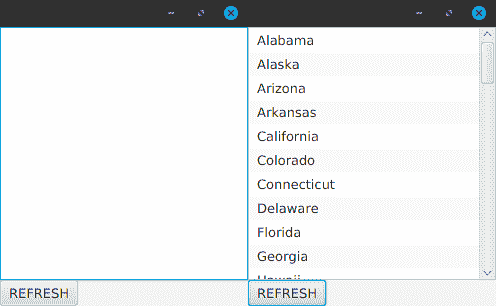

# 第六章：并发与并行化

在过去 10 年中，对并发的需求迅速增长，并已成为每位专业 Java 程序员的需求。并发（也称为**多线程**）本质上是一种多任务处理，其中同时执行多个进程。如果你想充分利用硬件的计算能力（无论是手机、服务器、笔记本电脑还是台式计算机），你需要学习如何多线程和利用并发。幸运的是，RxJava 使并发变得更容易且更安全。

在本章中，我们将涵盖以下内容：

+   并发及其必要性的概述

+   `subscribeOn()`

+   `observeOn()`

+   并行化

+   `unsubscribeOn()`

# 为什么并发是必要的

在更简单的时代，计算机只有一个 CPU，这使得并发需求变得微不足道。硬件制造商成功找到了让 CPU 更快的方法，这使得单线程程序运行得更快。但最终，这种方法的效果逐渐减弱，制造商发现他们可以通过在设备中放置多个 CPU 来提高计算能力。从台式机和笔记本电脑到服务器和智能手机，现在的多数硬件都配备了多个 CPU 或核心。

对于开发者来说，这是构建软件和编码方式的一次重大颠覆。单线程软件更容易编写，在单核设备上运行良好。但在多核设备上的单线程程序只会使用一个核心，而其他核心则未被利用。如果你想让你的程序可扩展，它需要以利用处理器中所有可用核心的方式编写。

然而，传统上并发并不容易实现。如果你有几个相互独立的进程，那么实现起来更容易。但当资源，尤其是可变对象，在不同线程和进程之间共享时，如果不小心实现锁定和同步，就会引发混乱。不仅线程可能会混乱地相互竞争以读取和更改对象的属性，而且一个线程可能根本看不到另一个线程更改的值！这就是为什么你应该努力使你的对象不可变，并尽可能多地使属性和变量`final`。这确保了属性和变量是线程安全的，任何可变的东西都应该同步，或者至少使用`volatile`关键字。

幸运的是，RxJava 使并发和多线程变得更容易且更安全。有方法可以破坏它提供的安全性，但通常，RxJava 主要使用两个操作符：`subscribeOn()`和`observeOn()`来为你安全地处理并发。正如我们将在本章中了解到的那样，其他操作符如`flatMap()`可以与这两个操作符结合使用，以创建强大的并发数据流。

虽然 RxJava 可以帮助你轻松地创建安全且强大的并发应用程序，但了解多线程中的陷阱和陷阱仍然很有帮助。Joshua Bloch 的著名书籍 *Effective Java* 是每个 Java 开发者都应该拥有的优秀资源，它简洁地涵盖了并发应用程序的最佳实践。如果你想在 Java 并发方面获得深入的知识，确保你也阅读了 Brian Goetz 的 *Java Concurrency in Practice*。

# 并发概述

并发，也称为 **多线程**，可以以多种方式应用。通常，并发的动机是为了更快地完成工作而同时运行多个任务。正如我们在本书的开头所讨论的，并发还可以帮助我们的代码更接近现实世界，在现实世界中，多种活动是同时发生的。

首先，让我们来了解一下并发背后的基本概念。

并发的一个常见应用是同时运行不同的任务。想象一下，你有三项庭院工作：修剪草坪、修剪树木和拔草。如果你自己完成这三项工作，你一次只能做一项。你不能同时修剪草坪和修剪树木。你必须先顺序修剪草坪，然后修剪树木，最后拔草。但是如果你有一个朋友帮忙，你们中的一个可以修剪草坪，而另一个可以修剪树木。第一个完成的人可以接着进行第三项任务：拔草。这样，这三项任务可以更快地完成。

比喻地说，你和你的朋友是 **线程**。你们一起工作。从整体上看，你们两人是一个 **线程池**，准备执行任务。家务是线程池中排队的任务，你可以一次执行两个。如果你有更多的线程，你的线程池将拥有更多的带宽来同时处理更多的任务。然而，根据你的计算机有多少核心（以及任务的性质），你只能拥有这么多线程。线程的创建、维护和销毁都很昂贵，随着你创建它们的数量增加，性能的回报会逐渐减少。这就是为什么有一个线程池来 *重用* 线程并让它们处理任务队列会更好。

# 理解并行化

并行化（也称为并行性）是一个广泛的概念，可以涵盖上述场景。实际上，你和你的朋友同时执行两个任务，因此是在并行处理。但让我们将并行化应用于同时处理多个相同任务的情况。以一个有 10 名顾客在结账处排队等待的杂货店为例。这 10 名顾客代表了 10 个相同的任务，他们各自需要结账。如果收银员代表一个线程，我们可以有多个收银员来更快地处理这些顾客。但就像线程一样，收银员是昂贵的。我们不希望为每个顾客创建一个收银员，而是集中一定数量的收银员并重复使用它们。如果我们有五个收银员，我们就可以一次处理五个顾客，其余的则在队列中等待。当一个收银员完成一个顾客后，他们可以处理下一个顾客。

这基本上就是并行化所达到的效果。如果你有 1000 个对象，并且需要对每个对象执行昂贵的计算，你可以使用五个线程一次处理五个对象，并可能使这个过程快五倍。关键是要池化这些线程并重复使用它们，因为创建 1000 个线程来处理这 1000 个对象可能会耗尽你的内存并使程序崩溃。

在理解了并发的概念之后，我们将继续讨论在 RxJava 中是如何实现并发的。

# 引入 RxJava 并发

在 RxJava 中执行并发很简单，但理解起来有些抽象。默认情况下，`Observable`在立即的线程上执行工作，即声明`Observer`并订阅它的线程。在我们的许多早期示例中，这是启动我们的`main()`方法的主线程。

但正如在几个其他示例中暗示的那样，并非所有`Observable`都会在立即的线程上触发。记得我们使用`Observable.interval()`的那些时候，如下面的代码所示？让我们看看：

```java
import io.reactivex.Observable;
import java.util.concurrent.TimeUnit;

public class Launcher {

    public static void main(String[] args) {

        Observable.interval(1, TimeUnit.SECONDS)
                .map(i -> i + " Mississippi")
                .subscribe(System.out::println);

        sleep(5000);
    }
    public static void sleep(long millis) {
        try {
            Thread.sleep(millis);
        } catch (InterruptedException e) {
            e.printStackTrace();
        }
    }
}

```

输出如下：

```java
0 Mississippi
1 Mississippi
2 Mississippi
3 Mississippi
4 Mississippi
```

这个`Observable`实际上会在主线程之外的线程上触发。实际上，主线程将启动`Observable.interval()`，但不会等待它完成，因为它现在正在自己的单独线程上运行。这实际上使它成为一个并发应用程序，因为它现在正在利用两个线程。如果我们不调用`sleep()`方法来暂停主线程，它将冲到`main()`方法的末尾并退出应用程序，而此时间隔还没有机会触发。

通常，并发只有在你有长时间运行或计算密集型过程时才有用。为了帮助我们学习并发而不创建嘈杂的示例，我们将创建一个名为`intenseCalculation()`的辅助方法来模拟长时间运行的过程。它将简单地接受任何值，然后睡眠 0-3 秒，然后返回相同的值。暂停线程，或暂停它，是模拟忙碌线程工作的好方法：

```java
public static <T> T intenseCalculation(T value) {
    sleep(ThreadLocalRandom.current().nextInt(3000));
    return value;
}
public static void sleep(long millis) {
    try {
        Thread.sleep(millis);
    } catch (InterruptedException e) {
        e.printStackTrace();
    }
}
```

让我们创建两个 Observables，并让两个 Observer 订阅它们。在每个操作中，将每个发射映射到`intenseCalculation()`方法以减慢它们的速度：

```java
import rx.Observable;
import java.util.concurrent.ThreadLocalRandom;
import io.reactivex.Observable;

public class Launcher {

    public static void main(String[] args) {

        Observable.just("Alpha", "Beta", "Gamma", "Delta", "Epsilon")
                .map(s -> intenseCalculation((s)))
                .subscribe(System.out::println);

        Observable.range(1,6)
                .map(s -> intenseCalculation((s)))
                .subscribe(System.out::println);
    }

    public static <T> T intenseCalculation(T value) {
        sleep(ThreadLocalRandom.current().nextInt(3000));
        return value;
    }
    public static void sleep(long millis) {
        try {
            Thread.sleep(millis);
        } catch (InterruptedException e) {
            e.printStackTrace();
        }
    }
}

```

输出如下：

```java
Alpha
Beta
Gamma
Delta
Epsilon
1
2
3
4
5
6
```

注意，由于每个 Observables 在`map()`操作中被减慢了 0-3 秒，它们发射发射的速度都很慢。更重要的是，注意第一个发射`Alpha`、`Beta`、`Gamma`的`Observable`必须首先完成并调用`onComplete()`，然后才能发射第二个发射数字`1`到`6`的`Observable`。如果我们同时发射两个 Observables 而不是等待一个完成后再开始另一个，我们可以更快地完成这个操作。

我们可以使用`subscribeOn()`操作符来实现这一点，该操作符建议源在指定的`Scheduler`上触发发射。在这种情况下，让我们使用`Schedulers.computation()`，它为计算操作收集了适当数量的线程。它将为每个`Observer`提供一个线程来推送发射。当调用`onComplete()`时，线程将被返回给`Scheduler`以便可以在其他地方重用：

```java
import io.reactivex.Observable;
import io.reactivex.schedulers.Schedulers;
import java.util.concurrent.ThreadLocalRandom;

public class Launcher {

    public static void main(String[] args) {

        Observable.just("Alpha", "Beta", "Gamma", "Delta", "Epsilon")
                .subscribeOn(Schedulers.computation())
                .map(s -> intenseCalculation((s)))
                .subscribe(System.out::println);

        Observable.range(1,6)
                .subscribeOn(Schedulers.computation())
                .map(s -> intenseCalculation((s)))
                .subscribe(System.out::println);

        sleep(20000);
    }

    public static <T> T intenseCalculation(T value) {
        sleep(ThreadLocalRandom.current().nextInt(3000));
        return value;
    }
    public static void sleep(long millis) {
        try {
            Thread.sleep(millis);
        } catch (InterruptedException e) {
            e.printStackTrace();
        }
    }
}

```

输出如下（您的可能不同）：

```java
1
2
Alpha
3
4
Beta
5
Gamma
Delta
6
Epsilon
```

您的输出可能与我不同，因为随机睡眠时间。但请注意，现在两个操作都在同时发射，这使得程序可以更快地完成。而不是主线程被占用，在执行第一个 Observables 的发射之前移动到第二个，它将立即发射两个 Observables 并继续。它不会等待任何一个 Observables 完成。

同时发生多个进程是使应用程序并发的因素。它可以带来更高的效率，因为它将利用更多核心并更快地完成工作。并发还使代码模型更强大，更能代表我们世界的运作方式，在那里多个活动同时发生。

关于 RxJava 令人兴奋的另一个方面是其操作符（至少是官方的操作符和构建良好的自定义操作符）。它们可以在不同的线程上安全地与 Observables 一起工作。甚至像`merge()`和`zip()`这样的操作符和工厂，它们可以安全地组合来自不同线程的发射。例如，即使它们在两个不同的计算线程上发射，我们也可以在我们的前一个示例中使用`zip()`：

```java
import io.reactivex.Observable;
import io.reactivex.schedulers.Schedulers;
import java.util.concurrent.ThreadLocalRandom;

public class Launcher {

    public static void main(String[] args) {

        Observable<String> source1 =
                Observable.just("Alpha", "Beta", "Gamma", "Delta", "Epsilon")
                .subscribeOn(Schedulers.computation())
                .map(s -> intenseCalculation((s)));

        Observable<Integer> source2 =
                Observable.range(1,6)
                .subscribeOn(Schedulers.computation())
                .map(s -> intenseCalculation((s)));

        Observable.zip(source1, source2, (s,i) -> s + "-" + i)
                .subscribe(System.out::println);

        sleep(20000);
    }

    public static <T> T intenseCalculation(T value) {
        sleep(ThreadLocalRandom.current().nextInt(3000));
        return value;
    }
    public static void sleep(long millis) {
        try {
            Thread.sleep(millis);
        } catch (InterruptedException e) {
            e.printStackTrace();
        }
    }
}

```

输出如下：

```java
Alpha-1
Beta-2
Gamma-3
Delta-4
Epsilon-5
```

能够在不同线程上拆分和组合 Observables 是非常强大的，并且消除了回调的痛点。Observables 对它们工作的线程一无所知，这使得并发易于实现、配置和随时演进。

当你开始使反应式应用程序并发时，可能会出现微妙的复杂性。默认情况下，一个非并发应用程序将有一个线程从源到最终的`Observer`执行所有工作。但是，多个线程可能会导致发射速度超过`Observer`可以消费的速度（例如，`zip()`操作符可能有一个源产生发射速度比另一个快）。这可能会使程序过载，内存可能会耗尽，因为某些操作符会缓存积压的发射。当你处理大量发射（超过 10,000）并利用并发时，你可能会想使用 Flowables 而不是 Observables，我们将在第八章中介绍，*Flowables 和背压*。

# 保持应用程序存活

到目前为止，我们使用`sleep()`方法来防止并发反应式应用程序过早退出，仅足够让 Observables 触发。如果你使用 Android、JavaFX 或其他管理自己的非守护线程的框架，这不是一个问题，因为应用程序会为你保持存活。但如果你只是使用`main()`方法启动程序，并且你想启动长时间运行或无限的 Observables，你可能需要让主线程存活的时间超过 5-20 秒。有时，你可能希望无限期地保持其存活。

让应用程序无限期存活的一种方法是将`Long.MAX_VALUE`传递给`Thread.sleep()`方法，如下面的代码所示，其中我们使用`Observable.interval()`无限期地触发发射：

```java
import io.reactivex.Observable;
import java.util.concurrent.ThreadLocalRandom;
import java.util.concurrent.TimeUnit;

public class Launcher {

    public static void main(String[] args) {

        Observable.interval(1, TimeUnit.SECONDS)
                .map(l -> intenseCalculation((l)))
                .subscribe(System.out::println);

        sleep(Long.MAX_VALUE);
    }

    public static <T> T intenseCalculation(T value) {
        sleep(ThreadLocalRandom.current().nextInt(3000));
        return value;
    }
    public static void sleep(long millis) {
        try {
            Thread.sleep(millis);
        } catch (InterruptedException e) {
            e.printStackTrace();
        }
    }
}

```

好吧，让主线程休眠 9,223,372,036,854,775,807 毫秒不是永远，但这相当于 292,471,208.7 年。对于休眠线程的目的来说，这几乎就是永远！

有方法可以让应用程序仅存活足够长的时间来完成订阅。在 Brian Goetz 的书籍《Java 并发实践》中讨论的经典并发工具，你可以使用`CountDownLatch`等待两个订阅完成来保持应用程序存活。但更简单的方法是使用 RxJava 中的阻塞操作符。

你可以使用阻塞操作符来停止声明线程并等待发射。通常，阻塞操作符用于单元测试（我们将在第十章中讨论，*测试和调试*），如果使用不当，它们可能会在生产中吸引反模式。然而，基于有限`Observable`订阅的生命周期来保持应用程序存活是一个有效的情况来使用阻塞操作符。如图所示，`blockingSubscribe()`可以用作`subscribe()`的替代，在允许主线程继续进行并退出应用程序之前停止并等待`onComplete()`被调用：

```java
import io.reactivex.schedulers.Schedulers;
import io.reactivex.Observable;
import java.util.concurrent.ThreadLocalRandom;

public class Launcher {

    public static void main(String[] args) {

        Observable.just("Alpha", "Beta", "Gamma", "Delta", "Epsilon")
                .subscribeOn(Schedulers.computation())
                .map(Launcher::intenseCalculation)
                .blockingSubscribe(System.out::println,
                        Throwable::printStackTrace,
                        () -> System.out.println("Done!"));
    }

    public static <T> T intenseCalculation(T value) {
        sleep(ThreadLocalRandom.current().nextInt(3000));
        return value;
    }
    public static void sleep(int millis) {
        try {
            Thread.sleep(millis);
        } catch (InterruptedException e) {
            e.printStackTrace();
        }
    }
}
```

输出如下：

```java
Alpha
Beta
Gamma
Delta
Epsilon
Done!
```

我们将在第十章[ec80132f-c411-4cc1-87b2-7a8ebba089b8.xhtml]，*测试和调试*中更详细地讨论阻塞操作符。在本章的剩余部分，我们将使用`subscribeOn()`和`observeOn()`操作符详细探讨并发。但首先，我们将介绍 RxJava 中可用的不同`Scheduler`类型。

# 理解调度器

如前所述，线程池是一组线程。根据线程池的策略，线程可能会被持久化和维护，以便可以重用。然后，该线程池会执行任务队列中的任务。

一些线程池保持固定数量的线程（例如我们之前使用的`computation()`），而其他线程池则会根据需要动态创建和销毁线程。在 Java 中，通常使用`ExecutorService`作为线程池。然而，RxJava 实现了自己的并发抽象，称为`Scheduler`。它定义了实际并发提供者（如`ExecutorService`或 actor 系统）必须遵守的方法和规则。这种结构使 RxJava 在并发源上没有特定的观点。

许多默认的`Scheduler`实现可以在`Schedulers`静态工厂类中找到。对于给定的`Observer`，`Scheduler`将提供一个线程池中的线程来推送事件。当调用`onComplete()`时，操作将被处置，并将线程返回到池中，它可能被另一个`Observer`持久化和重用。

为了使本书实用，我们只会在其自然环境中查看调度器：与`subscribeOn()`和`observeOn()`一起使用。如果你想了解更多关于调度器及其独立工作方式的信息，请参阅附录 X 以获取更多信息。

在 RxJava 中，这里有几种调度器类型。在其他库中，如 RxAndroid（在第十一章中介绍，*RxJava for Android*）和 RxJavaFX（本章后面介绍）也有一些常见的第三方调度器可用。

# 计算

我们已经看到了计算型`Scheduler`，你可以通过调用`Schedulers.computation()`来获取其全局实例。这将根据 Java 会话中可用的处理器数量维护固定数量的线程，这使得它适用于计算任务。计算任务（如数学、算法和复杂逻辑）可能充分利用核心。因此，拥有比可用核心更多的工作线程来执行此类工作没有好处，计算型`Scheduler`将确保：

```java
Observable.just("Alpha", "Beta", "Gamma", "Delta", "Epsilon")
    .subscribeOn(Schedulers.computation());
```

当你不确定将同时执行多少任务，或者只是不确定哪个`Scheduler`是正确的选择时，默认选择计算型调度器。

许多操作符和工厂默认会使用计算`Scheduler`，除非您指定不同的一个作为参数。这包括`interval()`、`delay()`、`timer()`、`timeout()`、`buffer()`、`take()`、`skip()`、`takeWhile()`、`skipWhile()`、`window()`等几个其他操作符的重载。

# IO

IO 任务，如读取和写入数据库、网络请求和磁盘存储，在 CPU 上的开销较小，并且通常有等待数据发送或返回的空闲时间。这意味着您可以更自由地创建线程，而`Schedulers.io()`是适合这种情况的。它将维护与任务数量相等的线程，并根据需要动态增长、缓存和减少线程数量。例如，您可以使用`Schedulers.io()`来执行使用 RxJava-JDBC 的 SQL 操作（[`github.com/davidmoten/rxjava-jdbc`](https://github.com/davidmoten/rxjava-jdbc)）：

```java
 Database db = Database.from(conn);

 Observable<String> customerNames = 
     db.select("SELECT NAME FROM CUSTOMER")
         .getAs(String.class)
         .subscribeOn(Schedulers.io());

```

但您必须小心！作为一个经验法则，假设每个订阅都会导致一个新的线程。

# New thread

`Schedulers.newThread()`工厂将返回一个完全不池化线程的`Scheduler`。它将为每个`Observer`创建一个新线程，并在完成后销毁该线程。这与`Schedulers.io()`不同，因为它不会尝试持久化和缓存线程以供重用：

```java
Observable.just("Alpha", "Beta", "Gamma", "Delta", "Epsilon")
  .subscribeOn(Schedulers.newThread());
```

这可能有助于在您想要立即创建、使用然后销毁线程以避免占用内存的情况下。但对于通常的复杂应用程序，您将希望使用`Schedulers.io()`，以便尽可能重用线程。您还必须小心，因为`Schedulers.newThread()`在复杂应用程序中可能会失控（就像`Schedulers.io()`一样）并创建大量线程，这可能导致您的应用程序崩溃。

# Single

当您想在单个线程上顺序运行任务时，可以调用`Schedulers.single()`。它由适合事件循环的单线程实现支持。它还可以帮助将脆弱的、非线程安全的操作隔离到单个线程：

```java
Observable.just("Alpha", "Beta", "Gamma", "Delta", "Epsilon")
 .subscribeOn(Schedulers.single());
```

# Trampoline

`Schedulers.trampoline()`是一个有趣的`Scheduler`。实际上，您不太可能经常调用它，因为它主要用于 RxJava 的内部实现。它的模式也被借用于 UI 调度器，如 RxJavaFX 和 RxAndroid。它就像在立即线程上的默认调度，但它防止了递归调度的情形，即一个任务在同一个线程上调度另一个任务。而不是导致堆栈溢出错误，它将允许当前任务完成，*然后*执行那个新调度的任务。

# ExecutorService

您可以从标准的 Java `ExecutorService` 构建一个调度器。您可能选择这样做是为了对线程管理策略有更多自定义和精细的控制。例如，假设我们想要创建一个使用 20 个线程的调度器。我们可以创建一个新的固定 `ExecutorService`，并指定这个数量的线程。然后，您可以通过调用 `Schedulers.from()` 方法将这个 `ExecutorService` 包装在一个 `Scheduler` 实现中：

```java
import io.reactivex.Observable;
import io.reactivex.Scheduler;
import io.reactivex.schedulers.Schedulers;
import java.util.concurrent.ExecutorService;
import java.util.concurrent.Executors;

public class Launcher {

    public static void main(String[] args) {

        int numberOfThreads = 20;

        ExecutorService executor =
                Executors.newFixedThreadPool(numberOfThreads);

        Scheduler scheduler = Schedulers.from(executor);

        Observable.just("Alpha", "Beta", "Gamma", "Delta", "Epsilon")
                .subscribeOn(scheduler)
                .doFinally(executor::shutdown)
                .subscribe(System.out::println);
    }
}
```

`ExecutorService` 可能会无限期地保持您的程序运行，因此如果您希望其生命周期有限，您必须管理其销毁。如果我只想要支持一个 `Observable` 订阅的生命周期，我需要调用它的 `shutdown()` 方法。这就是为什么我在操作通过 `doFinally()` 操作符终止或销毁后调用其 `shutdown()` 方法的原因。

# 启动和关闭调度器

每个默认的 `Scheduler` 都是在您第一次调用其使用时懒加载实例化的。您可以通过调用它们的 `shutdown()` 方法来在任何时候销毁 `computation()`、`io()`、`newThread()`、`single()` 和 `trampoline()` 调度器，或者通过调用 `Schedulers.shutdown()` 来销毁所有调度器。这将停止所有线程，并禁止新的任务进入，如果您尝试其他方式，将会抛出错误。您也可以调用它们的 `start()` 方法，或者 `Schedulersers.start()`，以重新初始化调度器，以便它们可以再次接受任务。

在桌面和移动应用环境中，您不太可能遇到需要启动和停止调度器的情况。然而，在服务器端，基于 J2EE 的应用程序（例如，Servlets）可能会被卸载和重新加载，并使用不同的类加载器，导致旧的调度器实例泄漏。为了防止这种情况发生，Servlet 应该在其 `destroy()` 方法中手动关闭 `Schedulers`。

只有在绝对需要的情况下才管理调度器的生命周期。最好让调度器动态管理它们对资源的使用，并保持它们初始化和可用，以便任务可以在任何时候快速执行。请注意，在关闭调度器之前，最好确保所有未完成的任务都已完成或销毁，否则您可能会留下不一致的状态。

# 理解 `subscribeOn()`

我们已经稍微提到了使用 `subscribeOn()`，但在这个部分，我们将更详细地探讨它，并查看它是如何工作的。

`subscribeOn()` 操作符会建议上游的 `Observable` 使用哪个 `Scheduler` 以及如何在它的某个线程上执行操作。如果那个上游 `Observable` 没有绑定到特定的 `Scheduler`，它将使用您指定的 `Scheduler`。然后，它将使用该线程将发射事件一直推送到最终的 `Observer`（除非您添加了 `observeOn()` 调用，我们将在后面介绍）。您可以在 `Observable` 链中的任何位置放置 `subscribeOn()`，并且它将建议上游一直到达原始 `Observable` 使用哪个线程来执行发射。

在以下示例中，你将`subscribeOn()`放在`Observable.just()`之后还是放在一个操作符之后，这并没有区别。`subscribeOn()`将向上游通信到`Observable.just()`，无论你将其放在哪里，它都将使用哪个`Scheduler`。为了清晰起见，你应该尽可能将其放置在源附近：

```java
//All three accomplish the same effect with subscribeOn()

Observable.just("Alpha", "Beta", "Gamma", "Delta", "Epsilon")
        .subscribeOn(Schedulers.computation()) //preferred
        .map(String::length)
        .filter(i -> i > 5)
        .subscribe(System.out::println);

Observable.just("Alpha", "Beta", "Gamma", "Delta", "Epsilon")
        .map(String::length)
        .subscribeOn(Schedulers.computation())
        .filter(i -> i > 5)
        .subscribe(System.out::println);

Observable.just("Alpha", "Beta", "Gamma", "Delta", "Epsilon")
        .map(String::length)
        .filter(i -> i > 5)
        .subscribeOn(Schedulers.computation())
        .subscribe(System.out::println);

```

使用多个`Observer`来订阅同一个`Observable`并调用`subscribeOn()`会导致每个`Observer`都获得自己的线程（如果没有可用线程，它们将等待可用线程）。在`Observer`中，你可以通过调用`Thread.currentThread().getName()`来打印执行线程的名称。我们将通过每次发射来打印这个名称，以证明实际上使用了两个线程来处理这两个`Observer`：

```java
import io.reactivex.Observable;
import io.reactivex.schedulers.Schedulers;
import java.util.concurrent.ThreadLocalRandom;

public class Launcher {

    public static void main(String[] args) {

        Observable<Integer> lengths =
                Observable.just("Alpha", "Beta", "Gamma", "Delta", "Epsilon")
                .subscribeOn(Schedulers.computation())
                .map(Launcher::intenseCalculation)
                .map(String::length);

        lengths.subscribe(i ->
System.out.println("Received " + i + " on thread " +
                        Thread.currentThread().getName()));

        lengths.subscribe(i ->
System.out.println("Received " + i + " on thread " +
                        Thread.currentThread().getName()));

        sleep(10000);

    }
    public static <T> T intenseCalculation(T value) {
        sleep(ThreadLocalRandom.current().nextInt(3000));
        return value;
    }
    public static void sleep(int millis) {
        try {
            Thread.sleep(millis);
        } catch (InterruptedException e) {
            e.printStackTrace();
        }
    }
}
```

输出如下：

```java
Received 5 on thread RxComputationThreadPool-2
Received 4 on thread RxComputationThreadPool-2
Received 5 on thread RxComputationThreadPool-2
Received 5 on thread RxComputationThreadPool-2
Received 5 on thread RxComputationThreadPool-1
Received 7 on thread RxComputationThreadPool-2
Received 4 on thread RxComputationThreadPool-1
Received 5 on thread RxComputationThreadPool-1
Received 5 on thread RxComputationThreadPool-1
```

注意，一个`Observer`正在使用名为`RxComputationThreadPool-2`的线程，而另一个正在使用`RxComputationThreadPool-1`。这些名称表明它们来自哪个`Scheduler`（即`Computation`类型的`Scheduler`）以及它们的索引。正如这里所示，如果我们只想让一个线程为两个`Observer`服务，我们可以使用多播操作。只需确保`subscribeOn()`在多播操作之前：

```java
import io.reactivex.Observable;
import io.reactivex.schedulers.Schedulers;
import java.util.concurrent.ThreadLocalRandom;

public class Launcher {

    public static void main(String[] args) {

        Observable<Integer> lengths =
                Observable.just("Alpha", "Beta", "Gamma", "Delta", "Epsilon")
                .subscribeOn(Schedulers.computation())
                .map(Launcher::intenseCalculation)
                .map(String::length)
                .publish()
                .autoConnect(2);

        lengths.subscribe(i ->
System.out.println("Received " + i + " on thread " +
                        Thread.currentThread().getName()));

        lengths.subscribe(i ->
System.out.println("Received " + i + " on thread " +
                        Thread.currentThread().getName()));

        sleep(10000);

    }
    public static <T> T intenseCalculation(T value) {
        sleep(ThreadLocalRandom.current().nextInt(3000));
        return value;
    }
    public static void sleep(int millis) {
        try {
            Thread.sleep(millis);
        } catch (InterruptedException e) {
            e.printStackTrace();
        }
    }
}
```

输出如下：

```java
Received 5 on thread RxComputationThreadPool-1
Received 5 on thread RxComputationThreadPool-1
Received 4 on thread RxComputationThreadPool-1
Received 4 on thread RxComputationThreadPool-1
Received 5 on thread RxComputationThreadPool-1
Received 5 on thread RxComputationThreadPool-1
Received 5 on thread RxComputationThreadPool-1
```

大多数`Observable`工厂，如`Observable.fromIterable()`和`Observable.just()`，都会在由`subscribeOn()`指定的`Scheduler`上发射项目。对于`Observable.fromCallable()`和`Observable.defer()`等工厂，当使用`subscribeOn()`时，这些源初始化也会在指定的`Scheduler`上运行。例如，如果你使用`Observable.fromCallable()`等待 URL 响应，你实际上可以在 IO Scheduler 上执行这项工作，这样主线程就不会阻塞并等待它：

```java
import io.reactivex.Observable;
import io.reactivex.schedulers.Schedulers;
import java.net.URL;
import java.util.Scanner;

public class Launcher {

    public static void main(String[] args) {

        Observable.fromCallable(() ->
getResponse("https://api.github.com/users/thomasnield/starred")
        ).subscribeOn(Schedulers.io())
         .subscribe(System.out::println);

        sleep(10000);
    }
    private static String getResponse(String path) {
        try {
            return new Scanner(new URL(path).openStream(), "UTF-8").useDelimiter("\\A").next();
        } catch (Exception e) {
            return e.getMessage();
        }
    }
    public static void sleep(int millis) {
        try {
            Thread.sleep(millis);
        } catch (InterruptedException e) {
            e.printStackTrace();
        }
    }
}
```

输出如下：

```java
[{"id":23095928,"name":"RxScala","full_name":"ReactiveX/RxScala","o ....
```

# `subscribeOn()`的细微差别

重要的是要注意，`subscribeOn()`在某些源上不会有实际效果（并且会不必要地让工作线程保持待机状态，直到该操作终止）。这可能是因为这些`Observable`已经使用了特定的`Scheduler`，如果你想要更改它，你可以提供一个`Scheduler`作为参数。例如，`Observable.interval()`将使用`Schedulers.computation()`并忽略你指定的任何其他`subscribeOn()`。但你可以提供一个第三个参数来指定要使用不同的`Scheduler`。在这里，我指定`Observable.interval()`使用`Schedulers.newThread()`，如下所示：

```java
import io.reactivex.Observable;
import io.reactivex.schedulers.Schedulers;
import java.util.concurrent.TimeUnit;

public class Launcher {

    public static void main(String[] args) {

        Observable.interval(1, TimeUnit.SECONDS, Schedulers.newThread())
                .subscribe(i -> System.out.println("Received " + i +
                        " on thread " + Thread.currentThread().getName()));

        sleep(5000);
    }

    public static void sleep(int millis) {
        try {
            Thread.sleep(millis);
        } catch (InterruptedException e) {
            e.printStackTrace();
        }
    }
}

```

输出如下：

```java
Received 0 on thread RxNewThreadScheduler-1
Received 1 on thread RxNewThreadScheduler-1
Received 2 on thread RxNewThreadScheduler-1
Received 3 on thread RxNewThreadScheduler-1
Received 4 on thread RxNewThreadScheduler-1
```

这也引出了另一个问题：如果你在给定的`Observable`链上有多个`subscribeOn()`调用，最上面的一个，或者最接近源的一个，将获胜，并导致后续的调用没有实际效果（除了不必要的资源使用）。如果我使用`Schedulers.computation()`调用`subscribeOn()`，然后调用`subscribeOn()`为`Schedulers.io()`，那么将使用`Schedulers.computation()`：

```java
import io.reactivex.Observable;
import io.reactivex.schedulers.Schedulers;

public class Launcher {

    public static void main(String[] args) {

        Observable.just("Alpha", "Beta", "Gamma", "Delta", "Epsilon")
                .subscribeOn(Schedulers.computation())
                .filter(s -> s.length() == 5)
                .subscribeOn(Schedulers.io())
                .subscribe(i -> System.out.println("Received " + i +
                       " on thread " + Thread.currentThread().getName()));

        sleep(5000);
    }
    public static void sleep(int millis) {
        try {
            Thread.sleep(millis);
        } catch (InterruptedException e) {
            e.printStackTrace();
        }
    }
}
```

输出如下：

```java
Received Alpha on thread RxComputationThreadPool-1
Received Gamma on thread RxComputationThreadPool-1
Received Delta on thread RxComputationThreadPool-1
```

这可能发生在 API 返回一个已经通过`subscribeOn()`预先应用了`Scheduler`的`Observable`时，尽管 API 的消费者想要一个不同的`Scheduler`。因此，API 的设计者被鼓励提供允许参数化使用哪个`Scheduler`的方法或重载，就像 RxJava 的基于`Scheduler`的操作符（例如，`Observable.interval()`）一样。

总结来说，`subscribeOn()`指定了源`Observable`应该使用的`Scheduler`，并且它将使用该`Scheduler`的 worker 将事件推送到最终的`Observer`。接下来，我们将学习`observeOn()`，它在`Observable`链的该点切换到不同的`Scheduler`。

# 理解`observeOn()`

`subscribeOn()`操作符指示源`Observable`在哪个`Scheduler`上发出事件。如果`subscribeOn()`是`Observable`链中唯一的并发操作，那么来自该`Scheduler`的线程将处理整个`Observable`链，将来自源的事件推送到最终的`Observer`。然而，`observeOn()`操作符将在`Observable`链的该点拦截事件，并将它们切换到不同的`Scheduler`。

与`subscribeOn()`不同，`observeOn()`的位置很重要。它将保留上游的所有操作在默认或`subscribeOn()`定义的`Scheduler`上，但将切换到下游的不同`Scheduler`。在这里，我可以让一个`Observable`发出一系列由`/`分隔的字符串，并在 IO `Scheduler`上拆分它们。但是之后，我可以切换到计算`Scheduler`来过滤出数字并计算它们的总和，如下面的代码片段所示：

```java
import io.reactivex.Observable;
import io.reactivex.schedulers.Schedulers;

public class Launcher {

    public static void main(String[] args) {

        //Happens on IO Scheduler
        Observable.just("WHISKEY/27653/TANGO", "6555/BRAVO", "232352/5675675/FOXTROT")
                .subscribeOn(Schedulers.io())
                .flatMap(s -> Observable.fromArray(s.split("/")))

                //Happens on Computation Scheduler
                .observeOn(Schedulers.computation())
                .filter(s -> s.matches("[0-9]+"))
                .map(Integer::valueOf)
                .reduce((total, next) -> total + next)
                .subscribe(i -> System.out.println("Received " + i + " on thread "
                        + Thread.currentThread().getName()));

        sleep(1000);
    }

    public static void sleep(int millis) {
        try {
            Thread.sleep(millis);
        } catch (InterruptedException e) {
            e.printStackTrace();
        }
    }
}
```

输出如下：

```java
Received 5942235 on thread RxComputationThreadPool-1
```

当然，这个例子计算量不大，在现实生活中，它应该在单个线程上完成。我们引入的并发开销是不必要的，但让我们假装它是一个长时间运行的过程。

再次使用`observeOn()`来拦截每个事件并将它们推送到不同的`Scheduler`。在前面的例子中，`observeOn()`之前的操作符在`Scheduler.io()`上执行，但之后的操作符由`Schedulers.computation()`执行。`observeOn()`之前的上游操作符不受影响，但下游操作符受影响。

你可能会在类似之前模拟的情况中使用`observeOn()`。如果你想读取一个或多个数据源并等待响应返回，你将想要在`Schedulers.io()`上执行这部分操作，并且可能会利用`subscribeOn()`，因为那是初始操作。但是一旦你有了这些数据，你可能想要用它们进行密集的计算，而`Scheduler.io()`可能不再合适。你将想要将这些操作限制在几个线程上，这些线程将充分利用 CPU。因此，你使用`observeOn()`将数据重定向到`Schedulers.computation()`。

实际上，你可以使用多个 `observeOn()` 操作符来切换 `Schedulers` 多次。继续我们之前的例子，假设我们想要将计算出的总和写入磁盘并写入一个文件。让我们假装这是一大批数据而不是一个单独的数字，并且我们想要将磁盘写入操作从计算 `Scheduler` 上移除并放回 IO `Scheduler`。我们可以通过引入第二个 `observeOn()` 来实现这一点。让我们还添加一些 `doOnNext()` 和 `doOnSuccess()`（由于 `Maybe`）操作符来查看每个操作使用的线程：

```java
import io.reactivex.Observable;
import io.reactivex.schedulers.Schedulers;
import java.io.BufferedWriter;
import java.io.File;
import java.io.FileWriter;

public class Launcher {

    public static void main(String[] args) {

        //Happens on IO Scheduler
        Observable.just("WHISKEY/27653/TANGO", "6555/BRAVO", "232352/5675675/FOXTROT")
                .subscribeOn(Schedulers.io())
                .flatMap(s -> Observable.fromArray(s.split("/")))
                .doOnNext(s -> System.out.println("Split out " + s + " on thread "
                        + Thread.currentThread().getName()))

                //Happens on Computation Scheduler
                .observeOn(Schedulers.computation())
                .filter(s -> s.matches("[0-9]+"))
                .map(Integer::valueOf)
                .reduce((total, next) -> total + next)
                .doOnSuccess(i -> System.out.println("Calculated sum " + i + " on thread "
                        + Thread.currentThread().getName()))

                //Switch back to IO Scheduler
                .observeOn(Schedulers.io())
                .map(i -> i.toString())
                .doOnSuccess(s -> System.out.println("Writing " + s + " to file on thread "
                        + Thread.currentThread().getName()))
                .subscribe(s -> write(s,"/home/thomas/Desktop/output.txt"));

        sleep(1000);
    }
    public static void write(String text, String path) {
        BufferedWriter writer = null;
        try {
            //create a temporary file
            File file = new File(path);
            writer = new BufferedWriter(new FileWriter(file));
            writer.append(text);
        } catch (Exception e) {
            e.printStackTrace();
        } finally {
            try {
                writer.close();
            } catch (Exception e) {
            }
        }
    }

    public static void sleep(int millis) {
        try {
            Thread.sleep(millis);
        } catch (InterruptedException e) {
            e.printStackTrace();
        }
    }
}
```

输出如下：

```java
Split out WHISKEY on thread RxCachedThreadScheduler-1
Split out 27653 on thread RxCachedThreadScheduler-1
Split out TANGO on thread RxCachedThreadScheduler-1
Split out 6555 on thread RxCachedThreadScheduler-1
Split out BRAVO on thread RxCachedThreadScheduler-1
Split out 232352 on thread RxCachedThreadScheduler-1
Split out 5675675 on thread RxCachedThreadScheduler-1
Split out FOXTROT on thread RxCachedThreadScheduler-1
Calculated sum 5942235 on thread RxComputationThreadPool-1
Writing 5942235 to file on thread RxCachedThreadSchedule
```

如果你仔细查看输出，你会看到 `String` 的输出最初是通过线程 `RxCachedThreadScheduler-1` 在 IO `Scheduler` 上推送和分割的。之后，每个输出都被切换到计算 `Scheduler` 并推入一个求和计算中，所有这些都是在线程 `RxComputationThreadPool-1` 上完成的。然后这个总和被切换到 IO `scheduler` 以写入一个文本文件（我指定在我的 Linux Mint 桌面上输出），这项工作是在 `RxCachedThreadScheduler-1` 上完成的（碰巧是推送初始输出的线程，并且被重用了！）。

# 使用 observeOn() 为 UI 事件线程

当涉及到构建移动应用、桌面应用程序和其他用户体验时，用户对于在操作进行时界面挂起或冻结的界面几乎没有耐心。用户界面的视觉更新通常由一个专门的 UI 线程完成，并且对用户界面的更改必须在那个线程上完成。用户输入事件通常也在 UI 线程上触发。如果用户输入触发了工作，并且这项工作没有被移动到另一个线程，那么这个 UI 线程就会变得繁忙。这就是导致用户界面无响应的原因，而今天的用户期望的要比这个更好。他们希望在后台操作进行时仍然能够与应用程序交互，因此并发性是必不可少的。

幸运的是，RxJava 可以提供帮助！你可以使用 `observeOn()` 将 UI 事件移动到计算或 IO `Scheduler` 来执行工作，当结果准备好后，再使用另一个 `observeOn()` 将其移回 UI 线程。这个 `observeOn()` 的第二次使用将使用一个围绕 UI 线程的自定义 `Scheduler` 将输出放在 UI 线程上。RxJava 扩展库，如 RxAndroid ([`github.com/ReactiveX/RxAndroid`](https://github.com/ReactiveX/RxAndroid))、RxJavaFX ([`github.com/ReactiveX/RxJavaFX`](https://github.com/ReactiveX/RxJavaFX)) 和 RxSwing ([`github.com/ReactiveX/RxSwing`](https://github.com/ReactiveX/RxSwing))，都包含这些自定义 `Scheduler` 实现。

例如，假设我们有一个简单的 JavaFX 应用程序，每次点击按钮都会显示一个包含 50 个美国州的 `ListView<String>`。我们可以从按钮创建 `Observable<ActionEvent>` 并使用 `observeOn()` 切换到 IO `Scheduler`（`subscribeOn()` 对 UI 事件源没有影响）。我们可以在 IO `Scheduler` 上从文本网络响应中加载 50 个州。一旦返回了州，我们可以使用另一个 `observeOn()` 将它们放回 `JavaFxScheduler`，并在 JavaFX UI 线程上安全地将它们填充到 `ListView<String>` 中：

```java
import javafx.application.Application;
import javafx.scene.Scene;
import javafx.scene.control.Button;
import javafx.scene.control.ListView;
import javafx.scene.layout.VBox;
import javafx.stage.Stage;
import io.reactivex.Observable;
import io.reactivex.rxjavafx.observables.JavaFxObservable;
import io.reactivex.rxjavafx.schedulers.JavaFxScheduler;
import io.reactivex.schedulers.Schedulers;
public final class JavaFxApp extends Application {

    @Override
    public void start(Stage stage) throws Exception {

        VBox root = new VBox();

        ListView<String> listView = new ListView<>();
        Button refreshButton = new Button("REFRESH");

        JavaFxObservable.actionEventsOf(refreshButton)
                .observeOn(Schedulers.io())
                .flatMapSingle(a ->
          Observable.fromArray(getResponse("https://goo.gl/S0xuOi")
         .split("\\r?\\n")
          ).toList()
                ).observeOn(JavaFxScheduler.platform())
                .subscribe(list ->
listView.getItems().setAll(list));

        root.getChildren().addAll(listView, refreshButton);
        stage.setScene(new Scene(root));
        stage.show();
}

    private static String getResponse(String path) {
        try {
            return new Scanner(new URL(path).openStream(), "UTF-8").useDelimiter("\\A").next();
        } catch (Exception e) {
            return e.getMessage();
        }
    }
}

```

以下代码应运行如下所示的 JavaFX 应用程序：



上述截图显示，点击 REFRESH 按钮将发出一个事件，但将其切换到执行检索美国州数据的 IO `Scheduler`。当响应准备好后，它将发出一个 `List<String>` 并将其放回 JavaFX `Scheduler` 以在 `ListView` 中显示。

这些概念也适用于 Android 开发，你将影响应用程序用户界面的所有操作放在 `AndroidSchedulers.mainThread()` 而不是 `JavaFxScheduler.platform()` 上。我们将在第十一章 RxJava for Android 中讨论 Android 开发。

# observeOn() 的细微差别

`observeOn()` 有一些需要注意的细微差别，尤其是在缺乏背压的情况下对性能的影响，我们将在第八章 Flowables and Backpressure 中进行讨论。

假设你有一个包含两套操作的 `Observable` 链，操作 A 和操作 B。我们暂时不考虑每个操作使用的算子是什么。如果你在这两个操作之间没有 `observeOn()`，操作将严格按照一个接一个的顺序从源传递到操作 A，然后是操作 B，最后是 `Observer`。即使有 `subscribeOn()`，源也不会在当前事件传递到 `Observer` 之前向下传递下一个事件。

当你引入一个 `observeOn()` 并将其置于操作 A 和操作 B 之间时，情况会有所不同。发生的情况是，在操作 A 将一个发射事件传递给 `observeOn()` 之后，它会立即开始下一个发射事件，而不是等待下游完成当前事件，包括操作 B 和 `Observer`。这意味着源和操作 A 可以比操作 B 和 `Observer` 更快地产生发射事件。这是一个经典的生产者/消费者场景，其中生产者产生的发射事件速度超过了消费者可以消费的速度。如果出现这种情况，未处理的事件将在 `observeOn()` 中排队，直到下游能够处理它们。但是，如果你有大量的事件，你可能会遇到内存问题。

这就是为什么当你有 10,000 次或更多次的发射流时，你肯定会想使用`Flowable`（它支持背压）而不是`Observable`。背压会向上游通信，直到源处，以减慢速度并一次只产生这么多的发射。即使在引入复杂的并发操作时，它也能恢复基于拉取的发射请求。我们将在第八章中介绍这一点，*Flowables 和 Backpressure*。

# 并行化

并行化，也称为**并行性**或**并行计算**，是一个广泛的概念，可以用于任何并发活动（包括我们讨论的内容）。但就 RxJava 而言，让我们将其定义为对给定`Observable`同时处理多个发射。如果我们有一个给定`Observable`链中的 1000 个发射要处理，如果我们一次处理八个发射而不是一个，我们可能能够更快地完成任务。如果你还记得，`Observable`契约规定发射必须按*序列*推送到`Observable`链中，并且由于并发性永远不会相互竞争。事实上，一次将八个发射推送到`Observable`链中将是灾难性的，并造成混乱。

这似乎与我们想要达成的目标相矛盾，但幸运的是，RxJava 为你提供了足够的操作符和工具来变得聪明。虽然你不能在同一个`Observable`上并发推送项目，但你允许同时运行多个`Observable`，每个`Observable`都有自己的单独线程推送项目。正如我们在本章中一直所做的那样，我们创建了几个在不同的线程/调度器上运行的`Observable`，并且甚至将它们组合在一起。实际上，你已经有了这些工具，实现并行化的秘密在于`flatMap()`操作符，它实际上是一个强大的并发操作符。

在这里，我们有一个`Observable`发出 10 个整数，并且我们对每个整数执行`intenseCalculation()`操作。这个过程可能需要一段时间，因为我们是通过`sleep()`函数模拟的人工处理。让我们在`Observer`中打印每个整数及其时间，以便我们可以测量性能，如下面的代码所示：

```java
import io.reactivex.Observable;
import java.time.LocalTime;
import java.util.concurrent.ThreadLocalRandom;

public class Launcher {
    public static void main(String[] args) {

       Observable.range(1,10)
               .map(i -> intenseCalculation(i))
               .subscribe(i -> System.out.println("Received " + i + " "
                       + LocalTime.now()));
    }

    public static <T> T intenseCalculation(T value) {
        sleep(ThreadLocalRandom.current().nextInt(3000));
        return value;
    }
    public static void sleep(long millis) {
        try {
            Thread.sleep(millis);
        } catch (InterruptedException e) {
            e.printStackTrace();
        }
    }
}
```

输出如下（你的输出可能会有所不同）：

```java
Received 1 19:11:41.812
Received 2 19:11:44.174
Received 3 19:11:45.588
Received 4 19:11:46.034
Received 5 19:11:47.059
Received 6 19:11:49.569
Received 7 19:11:51.259
Received 8 19:11:54.192
Received 9 19:11:56.196
Received 10 19:11:58.926
```

随机性当然会导致一些可变性，但在这个例子中，它大约花费了 17 秒来完成（尽管你的时间可能会不同）。如果我们并行处理发射，我们可能会得到更好的性能，那么我们如何做到这一点呢？

记住，序列化（逐个发射项目）只需要在同一个`Observable`上发生。`flatMap()`操作符会合并从每个发射中派生出的多个`Observable`，即使它们是*并发*的。如果一个灯泡还没有亮起来，请继续阅读。在`flatMap()`中，让我们将每个发射包装成`Observable.just()`，使用`subscribeOn()`在`Schedulers.computation()`上发射它，然后`map`它到`intenseCalculation()`。为了保险起见，让我们在`Observer`中打印当前线程，如下面的代码所示：

```java
import io.reactivex.Observable;
import io.reactivex.schedulers.Schedulers;
import java.time.LocalTime;
import java.util.concurrent.ThreadLocalRandom;

public class Launcher {
    public static void main(String[] args) {

       Observable.range(1,10)
               .flatMap(i -> Observable.just(i)
                       .subscribeOn(Schedulers.computation())
                       .map(i2 -> intenseCalculation(i2))
               )
               .subscribe(i -> System.out.println("Received " + i + " "
                       + LocalTime.now() + " on thread "
                       + Thread.currentThread().getName()));

       sleep(20000);
    }

    public static <T> T intenseCalculation(T value) {
        sleep(ThreadLocalRandom.current().nextInt(3000));
        return value;
    }
    public static void sleep(long millis) {
        try {
            Thread.sleep(millis);
        } catch (InterruptedException e) {
            e.printStackTrace();
        }
    }
}
```

输出如下（你的输出可能会有所不同）：

```java
Received 1 19:28:11.163 on thread RxComputationThreadPool-1
Received 7 19:28:11.381 on thread RxComputationThreadPool-7
Received 9 19:28:11.534 on thread RxComputationThreadPool-1
Received 6 19:28:11.603 on thread RxComputationThreadPool-6
Received 8 19:28:11.629 on thread RxComputationThreadPool-8
Received 3 19:28:12.214 on thread RxComputationThreadPool-3
Received 4 19:28:12.961 on thread RxComputationThreadPool-4
Received 5 19:28:13.274 on thread RxComputationThreadPool-5
Received 2 19:28:13.374 on thread RxComputationThreadPool-2
Received 10 19:28:14.335 on thread RxComputationThreadPool-2
```

这个过程花费了三秒钟完成，你会发现这个处理项目要快得多。当然，我的电脑有八个核心，这就是为什么我的输出可能表明有八个线程在使用。如果你的电脑核心数更少，这个过程将花费更长的时间并使用更少的线程。但它可能仍然比我们之前运行的单一线程实现要快。

我们所做的是为每个发射创建一个`Observable`，使用`subscribeOn()`在计算`Scheduler`上发射它，然后执行`intenseCalculation()`，这将发生在计算线程之一上。每个实例将从计算`Scheduler`请求自己的线程，`flatMap()`将安全地将它们合并回一个序列化的流。

`flatMap()`一次只会让一个线程出来推送发射，这保持了`Observable`合同要求发射保持序列化的特性。`flatMap()`的一个巧妙的行为是，它不会使用过多的同步或阻塞来完成这个任务。如果一个线程已经在将发射从`flatMap()`推送到`Observer`下游，任何等待推送发射的线程将简单地让它们的发射由那个正在使用的线程接管。

这里提供的例子不一定是最优的。为每个发射创建一个`Observable`可能会产生一些不必要的开销。虽然这样做会有更多的组件需要操作，但有一种更简洁的方法来实现并行化。如果我们想避免创建过多的`Observable`实例，也许我们应该将源`Observable`分割成固定数量的`Observable`，使得发射均匀地分配并分布到每一个中。然后，我们可以使用`flatMap()`来并行化并合并它们。甚至更好，既然我的电脑有八个核心，也许拥有八个`Observable`来处理八个计算流会是理想的。

我们可以使用 `groupBy()` 技巧来实现这一点。如果我拥有八个核心，我想将每个发射与 0 到 7 范围内的一个数字相关联。这将产生八个 `GroupedObservables`，将发射干净地分成八个流。更具体地说，我想循环这八个数字，并将它们作为键分配给每个发射。`GroupedObservables` 不一定会受到 `subscribeOn()` 的影响（它将在源线程上发射，除了缓存的发射之外），所以我需要使用 `observeOn()` 来并行化它们。我还可以使用 `io()` 或 `newThread()` 调度程序，因为我已经通过限制 `GroupedObservables` 的数量来限制了工作者的数量。

下面是我如何做这件事的，但我不是硬编码为八个核心，而是动态查询可用的核心数量：

```java
import io.reactivex.Observable;
import io.reactivex.schedulers.Schedulers;
import java.time.LocalTime;
import java.util.concurrent.ThreadLocalRandom;
import java.util.concurrent.atomic.AtomicInteger;

public class Launcher {
    public static void main(String[] args) {

       int coreCount = Runtime.getRuntime().availableProcessors();
       AtomicInteger assigner = new AtomicInteger(0);

       Observable.range(1,10)
               .groupBy(i -> assigner.incrementAndGet() % coreCount)
               .flatMap(grp -> grp.observeOn(Schedulers.io())
                       .map(i2 -> intenseCalculation(i2))
               )
               .subscribe(i -> System.out.println("Received " + i + " "
                       + LocalTime.now() + " on thread "
                       + Thread.currentThread().getName()));

       sleep(20000);
    }

    public static <T> T intenseCalculation(T value) {
        sleep(ThreadLocalRandom.current().nextInt(3000));
        return value;
    }
    public static void sleep(long millis) {
        try {
            Thread.sleep(millis);
        } catch (InterruptedException e) {
            e.printStackTrace();
        }
    }
}
```

下面是输出结果（你的输出将不同）：

```java
Received 8 20:27:03.291 on thread RxCachedThreadScheduler-8
Received 6 20:27:03.446 on thread RxCachedThreadScheduler-6
Received 5 20:27:03.495 on thread RxCachedThreadScheduler-5
Received 4 20:27:03.681 on thread RxCachedThreadScheduler-4
Received 7 20:27:03.989 on thread RxCachedThreadScheduler-7
Received 2 20:27:04.797 on thread RxCachedThreadScheduler-2
Received 1 20:27:05.172 on thread RxCachedThreadScheduler-1
Received 9 20:27:05.327 on thread RxCachedThreadScheduler-1
Received 10 20:27:05.913 on thread RxCachedThreadScheduler-2
Received 3 20:27:05.957 on thread RxCachedThreadScheduler-3
```

对于每个发射，我需要增加它所分组的数字，当它达到 `7` 时，它将从 `0` 重新开始。这确保了发射尽可能均匀地分布。我们使用 `AtomicInteger` 和模运算来实现这一点。如果我们为每个发射递增 `AtomicInteger`，我们可以将结果除以核心的数量，但返回余数，这始终是一个介于 `0` 和 `7` 之间的数字。

`AtomicInteger` 只是一个被保护在 `threadsafe` 容器内的整数，并且有方便的 `threadsafe` 方法，例如 `incrementAndGet()`。通常，当你有一个对象或状态存在于 `Observable` 链之外，但被 `Observable` 链的操作修改（这被称为副作用），那么这个对象应该被做成 `threadsafe`，尤其是在涉及并发的情况下。你可以在 Brian Goetz 的 *Java Concurrency in Practice* 中了解更多关于 `AtomicInteger` 和其他实用工具的信息。

你不必使用处理器数量来控制创建多少个 `GroupedObservables`。如果你认为更多的工作者会带来更好的性能，你可以指定任何数量。如果你的并发操作是 IO 和计算的混合，并且你发现 IO 更多，你可能从增加允许的线程/`GroupedObservables` 的数量中受益。

# `unsubscribeOn()`

我们需要讨论的最后一种并发操作符是 `unsubscribeOn()`。当你销毁一个 `Observable` 时，这有时可能是一个昂贵的操作，这取决于源的性质。例如，如果你的 `Observable` 正在使用 RxJava-JDBC 发射数据库查询的结果（[`github.com/davidmoten/rxjava-jdbc`](https://github.com/davidmoten/rxjava-jdbc)），停止和销毁这个 `Observable` 可能很昂贵，因为它需要关闭它所使用的 JDBC 资源。

这可能会导致调用 `dispose()` 的线程变得繁忙，因为它将执行所有停止 `Observable` 订阅和销毁的操作。如果这是一个 JavaFX 或 Android 中的 UI 线程（例如，因为点击了 CANCEL PROCESSING 按钮），这可能会导致不希望的 UI 冻结，因为 UI 线程正在努力停止和销毁 `Observable` 操作。

这里有一个简单的每秒发射一次的 `Observable`。我们暂停主线程三秒钟，然后它会调用 `dispose()` 来关闭操作。让我们使用 `doOnDispose()`（将由销毁线程执行）来查看主线程确实正在销毁操作：

```java
import io.reactivex.Observable;
import io.reactivex.disposables.Disposable;
import java.util.concurrent.TimeUnit;

public class Launcher {
    public static void main(String[] args) {

       Disposable d = Observable.interval(1, TimeUnit.SECONDS)
               .doOnDispose(() -> System.out.println("Disposing on thread "
                       + Thread.currentThread().getName()))
               .subscribe(i -> System.out.println("Received " + i));

       sleep(3000);
       d.dispose();
       sleep(3000);
    }

    public static void sleep(long millis) {
        try {
            Thread.sleep(millis);
        } catch (InterruptedException e) {
            e.printStackTrace();
        }
    }
}
```

输出如下：

```java
Received 0
Received 1
Received 2
Disposing on thread main
```

让我们添加 `unsubscribeOn()` 并指定在 `Schedulers.io()` 上取消订阅。你应该在你想让所有上游操作受到影响的地方放置 `unsubscribeOn()`：

```java
import io.reactivex.Observable;
import io.reactivex.disposables.Disposable;
import io.reactivex.schedulers.Schedulers;
import java.util.concurrent.TimeUnit;

public class Launcher {
    public static void main(String[] args) {

       Disposable d = Observable.interval(1, TimeUnit.SECONDS)
               .doOnDispose(() -> System.out.println("Disposing on thread "
                       + Thread.currentThread().getName()))
               .unsubscribeOn(Schedulers.io())
               .subscribe(i -> System.out.println("Received " + i));

       sleep(3000);
       d.dispose();
       sleep(3000);
    }

    public static void sleep(long millis) {
        try {
            Thread.sleep(millis);
        } catch (InterruptedException e) {
            e.printStackTrace();
        }
    }
}
```

输出如下：

```java
Received 0
Received 1
Received 2
Disposing on thread RxCachedThreadScheduler-1
```

现在，你会看到销毁是由 IO `Scheduler` 执行的，其线程由名称 `RxCachedThreadScheduler-1` 标识。这允许主线程启动销毁并继续，而无需等待其完成。

就像任何并发操作符一样，你实际上不需要为像这个例子这样的轻量级操作使用 `unsubscribeOn()`，因为它会增加不必要的开销。但是，如果你有资源密集型的 `Observable` 操作，销毁这些资源又很慢，`unsubscribeOn()` 可以是一个关键工具，如果调用 `dispose()` 的线程对高负载敏感。

如果你想针对 `Observable` 链中的特定部分使用不同的调度器来销毁，你可以使用多个 `unsubscribeOn()` 调用。直到遇到另一个 `unsubscribeOn()`，上游的所有内容都将使用那个 `Scheduler` 销毁。该 `unsubscribeOn()` 将拥有下一个上游段。

# 摘要

这可能是我们迄今为止最紧张的一章，但它为你在 RxJava 开发者以及并发大师的专业技能提供了一个转折点！我们涵盖了 RxJava 中可用的不同调度器，以及 RxJavaFX 和 RxAndroid 等其他库中可用的调度器。`subscribeOn()` 操作符用于向上游的 `Observable` 链建议推送发射的 `Scheduler`。`observeOn()` 将在 `Observable` 链的该点切换发射到不同的 `Scheduler` 并在下游使用该 `Scheduler`。你可以结合使用这两个操作符和 `flatMap()` 来创建强大的并行化模式，以便充分利用你的多 CPU 能力。我们最后涵盖了 `unsubscribeOn()`，它帮助我们指定用于销毁操作的不同的 `Scheduler`，防止在想要保持空闲和可用的线程上出现微妙的挂起，即使它们调用了 `dispose()` 方法。

需要注意的是，当你开始尝试并发编程时，你需要警惕你现在在线程之间处理的数据量。大量的数据可能会在你的`Observable`链中排队，有些线程可能会比其他线程更快地产生工作，而其他线程则可能无法及时消费这些工作。当你处理 10,000+个元素时，你将希望使用 Flowables 来防止内存问题，我们将在第八章，“Flowables 和背压”中介绍这一点。

下一章将探讨处理产生排放过快的可观测对象这一主题，并且有一些算子可以在不产生背压的情况下帮助解决这个问题。我们将在下一章中触及这一点。
