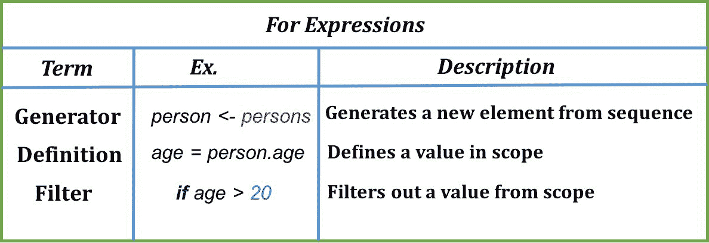
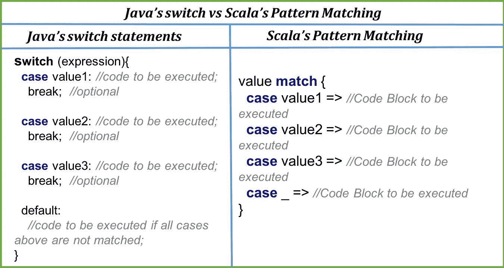

# 第三章：塑造我们的 Scala 程序

"我得出结论，构建软件设计有两种方式：一种方式是让它如此简单，以至于显然没有缺陷；另一种方式是让它如此复杂，以至于没有明显的缺陷。第一种方法要困难得多。"

- C. A. R. 霍尔

程序是对特定问题的解决方案。我们编写的解决方案被分解为不同的任务。任务可以是特定于一个步骤或解决方案的一部分。在为这样的任务编码时，我们使用构造作为工具来使它们更容易、更易读、更高效。这些工具使您能够塑造手中的程序。

```java
for, while, and do while loops. We'll see how these loops work in Scala. From there, we'll have a quick look at for expressions. We'll also go through the FP (functional programming) way of doing loops through recursion. Then, we'll start taking a look at Scala's conditional statements if and end, with learning how we can shape up program flow using pattern matching. Here's a quick card for what's in there for us in this chapter:
```

+   循环

    +   `for`、`while` 和 `do while` 循环

+   `for` 表达式：快速浏览

+   递归

+   条件语句

    +   `if` 和 `if else`

+   模式匹配

# 循环

站在打印机前，你给它一个指令，让它从你的书中打印索引为 2 到 16 的页面。这个被编程来这样做打印机，使用一个算法为你打印页面；它检查你请求打印的文档和页数。它将起始点设置为 2，最后一个点设置为 16，然后开始打印，直到达到最后一个点。打印页面我们可以称之为重复性的，因此，使用循环结构来编程打印你的文档中的每一页是很好的。就像任何其他语言一样，Scala 支持 `for`、`while` 和 `do while` 循环。

看看以下程序：

```java
object PagePrinter extends App {

   /*
    * Prints pages page 1 to lastIndex for doc
    */
   def printPages(doc: Document, lastIndex: Int) = ??? //Yet to be defined

   /*
    * Prints pages page startIndex to lastIndex for doc
    */
   def printPages(doc: Document, startIndex: Int, lastIndex: Int) = ???

   /*
    * Prints pages with given Indexes for doc
    */
   def printPages(doc: Document, indexes: Int*) = ??? 

   /*
    * Prints pages 
    */ 
  private def print(index: Int) = println(s"Printing Page $index.")

 }

  /*
   * Declares a Document type with two arguments numOfPages, typeOfDoc
   */
 case class Document(numOfPages: Int, typeOfDoc: String) 
```

我们创建了一个名为 `PagePrinter` 的对象。我们使用 `/* ... */` 语法来声明多行注释，并在 Scala 中使用 `//` 来声明单行注释。我们声明了三个方法，这些方法应该执行注释中所述的操作。这些方法尚未定义，并且我们已经通过使用语法 "???"（即三个问号符号）通知 Scala 编译器我们尚未定义该方法。

让我们回到我们的方法。第一个方法接受一个文档和要打印的页数作为参数，并打印到传递的索引页。第二个方法接受要打印的页面的起始和结束索引，并执行打印。第三个方法可以接受随机索引来打印，并从这些索引打印页面。在第三个方法中，我们使用星号 `*` 将我们的 Int 参数作为可变参数，即变量参数。现在，任务是定义这些方法。我们还可以看到，为了定义什么是文档，我们使用了案例类——我们将在下一章深入探讨 Scala 的面向对象部分时学习案例类。现在，了解案例类将很有帮助，它允许您创建一个带有所有样板代码的类；这意味着您可以访问成员，在我们的例子中，是 `numOfPages` 和 `typeOfDoc`。嗯，关于案例类有很多东西要了解，但我们稍后再谈。我们将使用我们的循环结构来定义我们的 `PagePrinter`。

让我们看看我们的循环结构。我们首先将了解 `for` 循环。

# for 循环

在 Scala 中，`for`循环，也称为`for`推导式，接受一系列元素，并对它们中的每一个执行操作。我们可以使用它们的一种方式是：

```java
scala> val stocks = List("APL", "GOOG", "JLR", "TESLA") 
stocks: List[String] = List(APL, GOOG, JLR, TESLA) 

scala> stocks.foreach(x => println(x))
APL 
GOOG 
JLR 
TESLA 
```

我们定义了一个名为`stocks`的列表，其中包含一些股票名称。然后我们使用一个简单的`for`循环来打印出列表中的每个股票。看看语法：我们有`stock <- stocks`，它表示在生成器符号`<-`左侧列表中的一个单一值，以及右侧的列表或序列。然后最终，我们可以提供任何要执行的操作，在我们的例子中我们打印了名称。现在我们已经看到了如何编写一个简单的`for`循环，让我们定义我们的`printPages`方法集：

```java
object PagePrinter extends App{

   /*
    * Prints pages page 1 to lastIndex for doc
    */
   def printPages(doc: Document, lastIndex: Int) = if(lastIndex <= doc.numOfPages) for(i <- 1 to lastIndex) print(i)

   /*
    * Prints pages page startIndex to lastIndex for doc
    */
   def printPages(doc: Document, startIndex: Int, lastIndex: Int) = if(lastIndex <= doc.numOfPages && startIndex > 0 && startIndex < lastIndex) for(i <- startIndex to lastIndex) print(i)

   /*
    * Prints pages with given Indexes for doc
    */
 def printPages(doc: Document, indexes: Int*) = for(index <- indexes if index <= doc.numOfPages && index > -1) print(index)

  /*
   *  Prints pages
   */
   private def print(index: Int) = println(s"Printing Page $index.")

   println("---------Method V1-----------")
   printPages(Document(15, "DOCX"), 5)

   println("---------Method V2-----------")
   printPages(Document(15, "DOCX"), 2, 5)

   println("---------Method V3-----------")
   printPages(Document(15, "DOCX"), 2, 5, 7, 15)

 }

/*
  * Declares a Document type with two arguments numOfPages, typeOfDoc
  */
 case class Document(numOfPages: Int, typeOfDoc: String) 
```

以下是输出：

```java
---------Method V1----------- 
Printing Page 1\. 
Printing Page 2\. 
Printing Page 3\. 
Printing Page 4\. 
Printing Page 5\. 
---------Method V2----------- 
Printing Page 2\. 
Printing Page 3\. 
Printing Page 4\. 
Printing Page 5\. 
---------Method V3----------- 
Printing Page 2\. 
Printing Page 5\. 
Printing Page 7\. 
Printing Page 15\. 
```

我们有一个名为`print`的实用方法，它只是打印一个带有索引数字的简单字符串，尽管你可以自由想象一个真正的打印机打印页面。

我们对`printPages`方法版本 1 的定义仅仅包括一个条件检查，即文档是否包含要打印的页面。这是通过一个`if`条件语句完成的。关于`if`语句的更多内容将在本章后面介绍。在条件语句之后，有一个循环遍历索引，范围从 1 到传递的`lastIndex`。同样，其他方法版本 2 也是定义的，它接受`startIndex`和`lastIndex`并为你打印页面。对于`printPages`的最后一个方法版本 3，我们正在遍历传递的索引，并且有一个以`if`语句开始的条件保护器。这检查页面索引是否小于作为参数传递的文档中的页面数，并打印它。最后，我们得到了从我们的方法中期望的结果。

# while 循环

如同在大多数其他语言中一样，`while`循环是另一种循环结构。`while`循环可以在满足条件之前执行任何重复任务。这意味着提供的条件必须为真，代码执行才能停止。`while`循环的通用语法是：

```java
while (condition check (if it's true))  
        ... // Block of Code to be executed 
```

需要检查的条件将是一个布尔表达式。当条件为`false`时，它将终止。我们可以使用它们的一种方式是：

```java
scala> val stocks = List("APL", "GOOG", "JLR", "TESLA") 
stocks: List[String] = List(APL, GOOG, JLR, TESLA) 

scala> val iteraatorForStocks = stocks.iterator 
iteraatorForStocks: Iterator[String] = non-empty iterator 

scala> while(iteraatorForStocks.hasNext) println(iteraatorForStocks.next()) 
APL 
GOOG 
JLR 
TESLA 
```

我们使用我们的股票列表和一些股票名称。然后我们在列表上调用`iterator`方法来获取我们序列的迭代器。在这里，`iteraatorForStocks`是`Type Iterator[String]`的非空迭代器，我们可以用它来遍历列表。迭代器有`hasNext`方法来检查序列中是否还有剩余的组件。在迭代器上调用`next`将给出结果元素。我们通过迭代股票列表的元素来打印。让我们看看`do while`循环。

# do while 循环

`do while`循环与`while`循环没有太大区别。`do while`循环的通用语法是：

```java
do
        ... // Block of Code to be executed 
        while(condition check (if it's true)) 
```

`do while`循环确保代码块至少执行一次，然后检查在`while`表达式中定义的条件：

```java
scala> do println("I'll stop by myself after 1 time!") while(false) 
```

以下是结果：

```java
I'll stop by myself after 1 time! 
```

这是一个简单的例子，我们的声明在`while`循环的条件变为`false`之前只打印了一次。这就是我们如何在 Scala 中使用`do while`循环的方式。

你可能想尝试使用`while`循环和`do while`循环的`PagePrinter`示例。

# `for`表达式

我们已经看到了`for`循环，以及如何在 Scala 中使用它们是多么简单。我们可以用`for`语法做更多的事情。以下是一个例子：

```java
object ForExpressions extends App {

   val person1 = Person("Albert", 21, 'm')
   val person2 = Person("Bob", 25, 'm')
   val person3 = Person("Cyril", 19, 'f')

   val persons = List(person1, person2, person3)

   for {
     person <- persons
     age = person.age
     name = person.name
     if age > 20 && name.startsWith("A")
   } {
     println(s"Hey ${name} You've won a free Gift Hamper.")
   }

 case class Person(name: String, age: Int, gender: Char)
 }

```

以下结果是：

```java
Hey Albert You've won a free Gift Hamper. 
```

在前面的例子中，我们在`for`表达式中使用了生成器、定义和过滤器。我们在人员列表上使用了一个`for`表达式。我们为名字以`A`开头且年龄超过 20 岁的人提出了一个礼品篮。

`for`中的第一个表达式是一个生成器表达式，它从人员列表中生成一个新的个人，并将其分配给`person`。第二个是年龄和名字的定义。然后最后，我们使用`if`语句应用过滤器来为我们的获胜者设置条件：



`for`表达式

如果我们想要为我们的员工增加一些奖品，那么我们可能想要获取获胜者的子列表。通过引入`yield`*.*这是可能的。

# `for yield`表达式

以下是一个`for yield`表达式的例子，我们在这里列出了获胜者的名字。获奖的条件是年龄，应该超过 20 岁：

```java
object ForYieldExpressions extends App {

   val person1 = Person("Albert", 21, 'm')
   val person2 = Person("Bob", 25, 'm')
   val person3 = Person("Cyril", 19, 'f')

   val persons = List(person1, person2, person3)

   val winners = for {
     person <- persons
     age = person.age
     name = person.name
     if age > 20
   } yield name

   winners.foreach(println)

  case class Person(name: String, age: Int, gender: Char)
 }

```

以下结果是**：

```java
Albert
Bob
```

在这里，`yield`起到了作用，并产生了一个满足条件的个人列表。这就是`for yield`表达式在 Scala 中的工作方式。

但这些迭代并不是 Scala 或其他任何函数式编程语言所推荐的。让我们来看看为什么是这样，以及迭代循环的替代方案。

# 递归

递归是一个函数对自己的调用。简单来说，递归函数是一个调用自身的函数。函数式编程推荐使用递归而不是迭代循环结构。出于同样的明显原因，Scala 也推荐使用**递归**。让我们首先看看一个递归函数：

```java
object RecursionEx extends App {

   /*
   * 2 to the power n
   * only works for positive integers!
   */
 def power2toN(n: Int): Int = if(n == 0) 1 else 2 * power2toN(n - 1)

   println(power2toN(2))
   println(power2toN(4))
   println(power2toN(6))
 } 
```

以下结果是：

```java
4 
16 
64 
```

我们定义了一个名为`power2toN`的函数，它期望一个整数`n`，检查`n`的值，如果它不是 0，则函数会调用自身，递减`n`整数的值，直到`n`变为 0。然后，在每次递归调用中，将值乘以 2，以获得所需的结果。

考虑以下内容：

```java
def power2toN(n: Int) = if(n == 0) 1 else (2 * power2toN(n - 1)) 
```

Scala 编译器会报错，指出`Recursive method power2N needs result type`*.*这是 Scala 编译器的一个必要条件。我们必须显式地定义递归函数的响应类型——这就是为什么我们必须在方法定义中给出返回类型的原因。

# 为什么递归比迭代更好？

根据声明*函数式编程推荐递归而不是迭代*，让我们讨论一下为什么是这样。如果你仔细看看我们的定义：

```java
def power2toN(n: Int): Int = if(n == 0) 1 else 2 * power2toN(n - 1) 
```

函数定义由一些条件语句和最终对自身的调用组成。没有任何变量状态的突变。函数式编程推荐纯函数，这意味着没有副作用。副作用可能包括突变一个变量的状态，执行 I/O 操作。这在迭代中是不可能的。迭代由其计数器/索引变量的突变组成，在重复中突变。另一方面，递归可以在不执行任何此类状态变化的情况下完成。这使得它强大且在函数式语言中使用。通过递归函数执行的操作可以使用所有多核执行它们的强大功能，而不用担心不同线程会改变相同的变量状态。因此，递归是推荐的。但递归中有一个问题。

# 递归的限制

在较小的重复次数或较少的函数调用级别时，递归被认为是可行的，但随着级别的增加，最终会导致栈被填满。那是什么意思？

程序中的函数调用会在调用栈中添加一个新的元素来调用。调用栈跟踪函数调用的信息。对于每次递归调用，都会在栈中添加一个新的调用，因此对于较少的递归调用来说，它运行良好。但随着递归调用级别的加深，调用栈达到其极限，程序会终止。这是意料之外的事情，破坏了我们的程序。那么，我们应该避免递归还是使用它？

# 编写递归函数的理想方式

递归的复杂性在于调用栈空间的填充。如果我们找到一种方法，可以在每次递归调用中释放当前栈，并用于所有后续的递归调用，我们可以在一定程度上优化调用栈的使用，这可以导致递归函数性能的更好。让我们这样理解：我们有我们的递归函数`power2N`的定义：*

```java
if(n == 0) 1 else 2 * power2toN(n - 1) 
```

如定义所示，在对自己进行调用之后，`power2toN`需要跟踪其调用栈，因为它的结果需要乘以 2 以完成步骤并得到期望的结果。为了避免这种情况并有效地使用调用栈，我们可以在递归函数的最后一个步骤中定义一个辅助函数。换句话说，如果我们使我们的函数调用成为尾调用，我们将能够优化调用栈的使用，从而实现更好的递归。这种现象称为尾调用优化：

```java
package chapter3

import scala.annotation.tailrec

 object TailRecursionEx extends App {

   /*
    * 2 to the power n
    * @tailrec optimization
    */
   def power2toNTail(n: Int): Int = {
     @tailrec
     def helper(n: Int, currentVal: Int): Int = {
       if(n == 0) currentVal else helper(n - 1, currentVal * 2)
     }
     helper(n, 1)
   }

   println(power2toNTail(2))
   println(power2toNTail(4))
   println(power2toNTail(6))
 } 

```

以下结果是：

```java
4 
16 
64 
```

上面的是我们方法 `power2toN` 的 *尾部优化* 版本。这里使用的注解 `@tailrec` 是为了明确告诉 Scala 编译器识别一个尾部递归函数并相应地进行优化。这里的不同之处在于使用了嵌套的、递归的 `helper` 方法，它包含尾部调用。在调用 `helper(n-1, currentVal * 2)` 之后，就不再需要这个调用栈了。因此，Scala 编译器可以自由地进行优化。更多关于尾部递归和尾部调用优化的内容请参阅 第九章，*使用强大的函数式构造*。

这是 Scala 中编写递归函数的首选方式。理解需求并编写一个递归版本比简单地编写方法的迭代版本要费劲得多。但在函数式世界中，这是值得的。

# 条件语句

我们已经多次使用条件了。没有条件或逻辑语句，程序很难有意义。这些语句有助于保持程序的流程。此外，使用这些语句实现逻辑也更容易。Scala 支持 `if` 和 `else` 条件语句。

# if else 条件表达式

在 Scala 中，你可以使用 `if else` 来控制程序流程。`if else` 语句的通用语法如下：

```java
if (condition (is true)) 
          ... //Block of code to be executed 
else 
          ... //Block of code to be executed 

scala> val age = 17 
age: Int = 17 

scala> if(age > 18) println("You're now responsible adult.") else println("You should grow up.") 
You should grow up. 
```

上文，我们定义了一个值为 17 的变量 `age`。在下一行，我们检查了一个条件 `age > 18`。如果年龄大于 18，则打印一些字符串。你现在是一个负责任的成年人，或者其他的字符串。我们不仅可以打印字符串，还可以将任何操作作为控制流程的一部分执行。在 Scala 中，我们还可以使用 `if else` 表达式声明和赋值变量：

```java
scala> val marks = 89 
marks: Int = 89 

scala> val performance = if(marks >= 90) "Excellent" else if(marks > 60 && marks < 90) "Average" else "Poor" 
performance: String = Average 
```

在这里，我们使用条件表达式即时给变量 `performance` 赋值。我们检查分数是否大于 90，或者介于 60 到 90 之间，或者小于 90，并根据这个条件为性能分配值。这是因为 Scala 中的条件是表达式——`if` 语句的结果是一个表达式。

在 Scala 中，还有另一种控制程序流程的方法，它使用表达式或结构的匹配到一个值，并在成功匹配后评估相应的代码块。我们称之为模式匹配。在 Scala 中。

# 模式匹配

模式匹配更像是 Java 的`switch`语句，但有一些不同。有一个表达式/值要匹配多个 case 子句，每当发生匹配时，相应的代码块就会被执行。这为我们程序的流程提供了多个选择。Java 的`switch`是一个穿透语句，这意味着它执行第一个匹配之后的所有语句，直到遇到`break`语句。在 Scala 中，没有`break`语句。此外，Scala 的模式匹配中没有默认情况。相反，使用通配符“_”来匹配之前`case`子句中没有涵盖的其他情况。

让我们看看 Java 的`switch`语句和 Scala 的模式匹配语句在语法上的差异：



差异很明显，正如我们之前讨论的那样。在 Scala 中，我们必须为我们的表达式提供一个 case 匹配，否则编译器将抛出一个错误，`MatchError`*：

```java
object PatternMatching extends App {

   def matchAgainst(i: Int) = i match {
     case 1 => println("One")
     case 2 => println("Two")
     case 3 => println("Three")
     case 4 => println("Four")
   }

   matchAgainst(5)
 } 
```

下面的结果是：

```java
Exception in thread "main" scala.MatchError: 5 (of class java.lang.Integer) 
            at PatternMatching$.matchAgainst(PatternMatching.scala:6) 
            at PatternMatching$.delayedEndpoint$PatternMatching$1(PatternMatching.scala:13) 
            at PatternMatching$delayedInit$body.apply(PatternMatching.scala:4) 
            at scala.Function0.apply$mcV$sp(Function0.scala:34) 
            at scala.Function0.apply$mcV$sp$(Function0.scala:34) 
            at scala.runtime.AbstractFunction0.apply$mcV$sp(AbstractFunction0.scala:12) 
```

在前面的例子中，我们没有涵盖所有可能的情况，因此编译器返回了这个错误。为了涵盖所有情况，我们可以在最后一个`case`子句中添加通配符“_”。这将工作得很好。让我们试试：

```java
object PatternMatching extends App {

   def matchAgainst(i: Int) = i match {
     case 1 => println("One")
     case 2 => println("Two")
     case 3 => println("Three")
     case 4 => println("Four")
     case _ => println("Not in Range 1 to 4")
   }

   matchAgainst(1)
   matchAgainst(5)
 } 
```

下面的结果是：

```java
One 
Not in Range 1 to 4 
```

在覆盖完每一个`case`子句后，模式匹配表现得非常出色。我们得到了响应；对于值 1，我们得到了相应的`One`，而对于 5，我们得到了`Not in Range 1 to 4`。Scala 中的模式匹配还有很多内容。我们将在第九章“使用强大的函数式构造”中详细讲解模式匹配，并学习几个匹配构造。

# 摘要

我们可以总结本章内容；让我们回顾一下我们所学到的。我们从学习 Scala 中的循环结构开始。我们讨论了原生的循环结构，如`for`*、* `while`*、*和`do while`循环。之后，我们看到了`for`表达式*，以及`for yield`表达式。然后我们理解了迭代的替代方案，即*递归*。我们也编写了一些递归函数。最后，我们研究了`if else`条件语句和模式匹配。我们知道还有更多内容要学习，但有了这些概念，我们正在更好地理解 Scala 语言结构。我们将在下一章继续这样做。在那里，我们将探讨函数式编程的核心：函数。我们将看到函数是如何定义和使用的。它将展示 Scala 中可用的各种函数式构造。我们将尝试通过函数*为我们的程序赋予意义。
