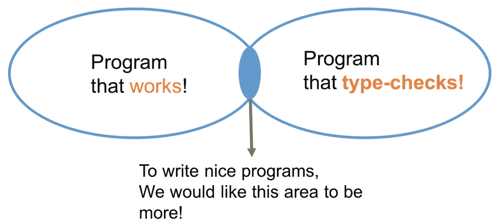
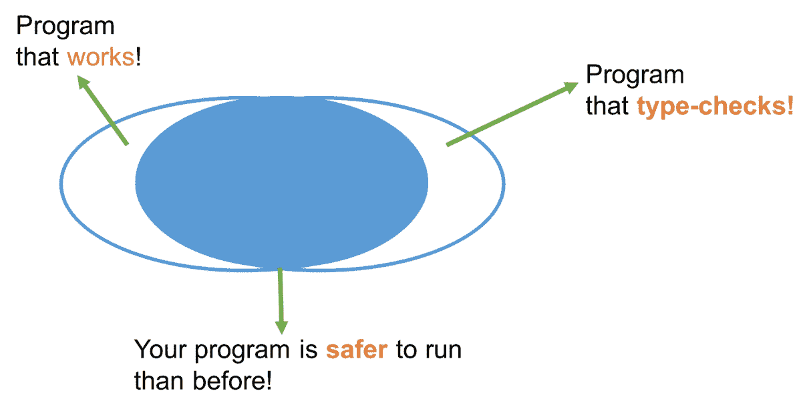

# 第十章：高级函数式编程

“就像双关语一样，编程是一种文字游戏。”

– 艾伦·佩里斯

你是开发者，对吧？想象一下，有人要求你编写一些具有某些实体的软件。看看以下内容：

```java
Animal         |      Food 
```

我们有`Animal`和`Food`实体。我们正在开发一个自动化的系统，为动物园中的动物提供食物。假设我们要编写一个函数，允许两个动物共享它们的食物。它期望两个动物对象、食物，然后完成工作。这个函数看起来是这样的：

```java
def serveSharedMeal(
    animalOne: Animal, 
    animalTwo: Animal, 
    meal: Food) = ??? 
//don't care about the implementation 
```

到目前为止，一切都很顺利，对吧？现在让我们引入两种动物。我们有两种动物子类名为`Lion`和`Deer`。我们的简单函数接受两个`animal`实例并在它们之间共享`meal`实例。现在，你可能会想知道当我们传递`Lion`和`Deer`的实例时会发生什么；可能会有什么后果？因此，我们提倡严格类型化的程序，这些程序可能在编译时失败。这意味着我们可以以这种方式编写我们的程序，以至于 Scala 编译器不会允许我们编写这样的程序。你能够看到类型如何救命。太好了，所以这就是这里的议程。

我们将讨论类型以及参数化我们的类型。我们在上一章中介绍了类型参数化，所以我们将继续我们的旅程，并学习更多关于类型参数化、抽象类型以及更多内容。让我们看看接下来会发生什么：

+   泛型/类型参数化

+   参数化类型

+   可变性

+   抽象类型

+   界限

+   抽象类型与参数化类型

+   类型类

让我告诉你，这一章将会是另一个有趣的章节。我们将使用我们已经使用过的结构来使我们的代码更有意义。但在我们深入学习参数化类型之前，让我们谈谈为什么类型如此备受关注。

# 为什么对类型如此认真？

我们已经看到，了解我们在做什么可以救命。但开个玩笑，如果我们真的在编写应用程序之前思考，这真的有帮助。我们的程序由两个成分组成：

```java
Data     |            Operations 
```

我们可以对可用的数据进行操作。同时，并不是所有操作都可以在所有类型的数据上执行。这就是类型差异所在。你不会想在整数和字符串字面量之间执行加法操作。这就是为什么编译器不允许我们这样做。即使它假设你试图将字符串与字面量连接起来，它也不会给出一个有意义的成果。这就是为什么定义类型是有意义的。

让我们讨论一下我们刚才提到的几个术语。Scala 是一个静态类型语言真是太好了，因为它为我们提供了编译时类型安全。我们编写的代码不太可能发生运行时错误，因为我们非常聪明，我们就是这样编写的（我们将在本章中学习这一点）。我们心爱的 Scala 编译器会对我们编写的程序进行编译时类型检查，并在编译时抛出错误，如果我们试图过于聪明。以下图表可能会消除你的疑虑：



你看？前面的图片描绘了，如果你的程序正在运行，那还不够，最终你可能会发现一些边缘情况会导致它们失败。所以，我们最好选择一种可以帮助你更好地覆盖这一部分的编程语言，这样你的程序就能在一个快乐的世界中生存：



这对我们理解为什么我们支持一个鼓励使用*类型*的系统至关重要。

我们开始理解类型在编程中的重要性，当我们接近编写优化和结构良好的代码时，我们发现了一种叫做类型泛型性的东西。我们开始编写可以在以后指定的类型。这导致了类型构造函数的概念的出现。现在，我们可以编写接受参数的类型。例如，考虑一个类型`constructorList[T]`*.* 在这里，我们已知的`List[T]`期望你提供一个类型。你也可以把它看作是一个类型上的函数，你在构造时提供参数。在我们的例子中，如果我们选择提供一个字符串，那么我们的列表将被称为`List[String]`*，*这是`List[T]`的`String`类型的应用版本。这个概念被称为**参数多态**，我们说我们的`List[T]`使用类型参数`T`来抽象其元素的类型。让我们在 Scala REPL 中尝试一下我们讨论的内容：

```java
scala> val xs: List = List("ABC") 
<console>:11: error: type List takes type parameters 
       val xs: List = List("ABC") 
List instead of a concrete type:
```

```java
scala> val xs: List[T] = List("ABC") 
<console>:11: error: not found: type T 
       val xs: List[T] = List("ABC") 
```

之前的代码片段也因为错误而失败了，因为我们知道我们应该提供一个类型参数，但我们提供了一些本身就不是类型的元素。那么我们现在应该怎么做？让我们尝试以下方法：

```java
scala> val xs: List[String] = List("ABC") 
xs: List[String] = List(ABC) 
```

这次对我们来说成功了：我们向我们的类型构造函数提供了一个类型`String`，并且它对我们来说工作得很好。所以我相信我们可以区分类型构造函数和类型。既然你已经了解了我们为什么要这样做，那么让我们深入探讨一下参数化类型。

# 接下来是类型参数化

想象一下相同的场景。你被要求编写一个包含一些不同实体的程序，例如，人类和动物。现在，两者都需要食物来维持生命。我们的同事已经意识到了这一点，并编写了处理人类和动物食物供应方式的代码。

他们已经编写了代码，并将其作为库提供（我们可以通过导入他们编写的包来访问这些函数）。我们的同事提前编写了一个看起来像以下这样的函数：

```java
def servseMealA, B = ??? 
```

我们被告知这个函数会工作，我们只需要提供第一个参数是谁来提供食物，以及一个可选的餐点作为食物。其余的将由他们放置的逻辑来处理。我们尝试了几种方法，并按照以下方式编写了一些应用：

```java
serveMeal(Human(Category("MALE")), None) 
serveMeal(Human(Category("FEMALE")), Some(Food())) 
serveMeal(Animal(), None) 
serveMeal(Animal(), Some("NONVEG")) 

case class Human(category: Category) 
case class Category(name: String) 
case class Animal() 
case class Food() 
```

并且，它以预期的方式工作。但是等等，这真的很酷，我们只接触到了一个函数，而且一切似乎都按预期工作。他们不希望我们特别调用`serveMealToHumans`或`serveNonVegMealToAnimals`函数。

这真的帮助我们编写了更好的代码。我们都是聪明的团队，我们分离了我们的关注点。你知道，他们的关注点是照顾所有人提供食物的方式，我们的关注点是确保我们的每个实体都能得到它们应该得到的食物。工作完成了。让我们谈谈为什么我们选择了这个例子。为了理解这一点，看看他们写的函数签名：

```java
def serveMealA, B = ??? 
```

我们看到`def`关键字，然后是函数名，但之后他们写了字母`A`和`B`*，*这是什么？为了了解更多，让我们继续阅读整个签名。有一个参数是我们应该提供的，类型被命名为*A*，食物选项被赋予了一个名为`B`的类型`(*option `B`*)*。嗯，这些都是类型参数。这个函数本身是*参数多态*的一个例子。我们知道这意味着*有多种形式*。这里也是一样。我们的函数可以有多个参数类型。为了更好地理解，看看这个：

```java
serveMeal(Human(Category("MALE")): Human, None: Option[Food]) 
serveMeal(Human(Category("FEMALE")): Human, Some(Food()): Option[Food]) 
serveMeal(Animal() : Animal, None: Option[Food]) 
serveMeal(Animal(): Animal, Some(Food()): Option[Food]) 
```

在函数调用中，我们指定了参数的类型。从函数的签名中可以清楚地看出，我们可以给出我们想要的任何类型，而`serveMeal`函数会处理其余的逻辑。所以，我们可以得出结论，这些`A`和`B`参数被称为类型参数。整个概念可以称为类型参数化。我们不仅可以编写泛型方法，还可以编写泛型类和特性*.* 让我们来了解一下。

# 另一种方法 - 泛型类和特性

我们刚刚看到了*泛型*的效果，它解决了不止一个问题，我们写了更少的代码，实现了更多。`serveMeal`函数是一个泛型函数，因为它接受类型参数，在我们的例子中是`A`和`B`*。*它执行了预期的逻辑，太棒了！让我们谈谈*参数化类型*。你知道`List`*这个类型吗？让我们看看它在 Scala 标准库中的声明：

```java
sealed abstract class List[+A] extends AbstractSeq[A] 
  with LinearSeq[A] 
  with Product 
  with GenericTraversableTemplate[A, List] 
  with LinearSeqOptimized[A, List[A]] 
  with Serializable 
```

好吧，声明看起来过于复杂，不是吗？不，等等，我们知道`sealed`的意思，我们知道为什么我们使用抽象类，然后是`List`*，*这个名字，然后是一些显示继承关系的声明。但是在我们的声明中有一个叫做`[+A]`的东西。我们的任务是找出这是什么，以及为什么我们使用了它。

从前面的几个主题中，我们得到了对这个概念*类型构造函数*的想法。所以，让我们把`List[+A]`称为类型构造函数。我们知道如果我们提供一个具体的类型，List 将创建一个有意义的类型。我们之前已经尝试过，所以不会创建另一个字符串列表。我们将在接下来的几个主题中学习这个加号的含义。它表示一个*变异性*关系。让我们先看看之前的声明。

# 类型参数名称

在这里，在 `List[+T]` 类型构造器的声明中（我们可以互换使用参数化类型或类型构造器的名称），我们使用了参数名称 `T`，在泛型编程中使用这样的名称是一种惯例。名称 *`T`*、* `A`*、* `B`* 或 *`C`* 与你初始化列表实例时提供的初始化器类型无关。例如，当你为之前提到的类型参数提供 `String` 类型以实例化 `List[String]` 时，声明是 `List[T]` 还是 `List[A]` 实际上并不重要。我们的意思是以下两个声明是等价的：

```java
//With type parameter name A 

sealed abstract class List[+A] extends AbstractSeq[A]  

//With type parameter name T 

sealed abstract class List[+T] extends AbstractSeq[T] 
```

# 容器类型

我们已经看到了 Scala 的类层次结构，因此我们了解了许多集合类型，例如 `List`、`Set` 和 `Map`。这些类型以及如 `Option` 和 `Either`** 的类型的不同之处在于，它们都要求你提供一个类型然后实例化。我们将 `List` 称为容器类型，因为它就是这样工作的。我们使用列表来包含特定数据类型的元素。同样，我们可以将 `Option` 视为一个二进制容器化类型，因为 `Option` 可以是某个值或 `None`*.* `Either` 类型也是同样的道理。在 Scala 中，当我们创建这样的容器类型** 时，我们倾向于使用类型参数来声明并提供一个具体类型，例如在实例化时提供 `String`*、* `Int`*、* `Boolean`* 等等。看看 `Option` 在 Scala 中的声明（关于 `Option` 和 `Either` 类型的更多内容将在下一章中介绍）：

```java
sealed abstract class Option[+A] extends Product  
   with Serializable 
```

它接受一个类型参数 `A`*.* 如果你的类型期望提供多个类型以进行实例化，则可以提供多个类型参数。这样的类型的一个例子是 `Either`：

```java
sealed abstract class Either[+A, +B] extends Product with Serializable 
```

如前所述，我们的 `Either` 类型接受两种类型，`A` 和 `B`*.* 但当我尝试以下代码片段时，它并没有按预期工作：

```java
object TypeErasure extends App { 
  val strings: List[String] = List("First", "Second", "Third") 
  val noStringsAttached: List[Int] = List(1, 2, 3) 

  def listOfA = value match { 
    case listOfString: List[String] => println("Strings Attached!") 
    case listOfNumbers: List[Int] => println("No Strings Attached!") 
  } 

  listOf(strings) 
  listOf(noStringsAttached) 
} 
```

结果如下：

```java
Strings Attached! 
Strings Attached! 
```

你看？我们创建了两个列表，一个是字符串列表，另一个是数字列表。然后，一个名为 `listOf` 的泛型函数，它简单地接受一个列表并告诉列表的类型。我们执行了模式匹配来检查传递给函数的列表类型并打印它。但它并没有按预期工作（可能对任何人都不行）。此外，它还抛出了一些警告，告诉我们第二个情况表达式的代码不可达。让我们来谈谈原因！

# 类型擦除

当 Scala 编译器编译前面的代码时，它会从之前的代码中擦除参数化类型信息，因此在运行时没有必要的知识；我们传递的列表不会携带任何关于自身的进一步信息。换句话说，在代码编译完成时，所有泛型类型的类型信息都被丢弃。这种现象被称为 **类型擦除**.* 这也是我们的 `listOf` 函数没有按预期或假设的方式工作或导致收到不可达代码警告的原因。这是因为我们的静态类型语言能够知道第二个情况永远不会被执行，第一个情况是这个模式匹配中的通配符。让我们更好地解释一下。看看一些类型擦除将适用的案例。想象你有一个名为 `Tfoo` 的特质：

```java
trait Tfoo[T]{ 
  val member: T 
} 
```

在编译过程之后，泛型类型被转换为对象，并变成如下所示：

```java
trait Tfoo { 
  val member: Object   //Cause scala files gets converted to *.class files. 
} 
type parameter, it's not alien code to us. But, then you ask, what's with the + sign in List[+T]? Yes, this shows variance under an inheritance relationship and this + is called variance annotation. Let's go through it.
```

# 继承下的协变

了解一个概念的一种方式是提出引导你到该概念的问题。所以，让我们自己提出一个问题。鉴于 `Cat` 类类型扩展了 `Animal` 类，将一群猫视为一群动物是否合适？从程序的角度来看，请看以下内容：

```java
abstract class Animal() 

class Cat(name: String) extends Animal()               // Inheritance relationship between Cat and Animal 

def doSomethingForAnimals(animals: List[Animal]) = ??? //definitely do something for animals. 

Is it possible to pass an argument that's a list of Cats? 
val cats = List(new Cat("Mischief"), new Cat("Birdie")) 
doSomethingForAnimals(cats) 
```

如果可能的话，`List[Cat]` 是 `List[Animal]` 的子类型这一说法是有意义的。这个概念被称为 **协变**。因此，我们说 `List` 在其类型参数 `T` 上是协变的：


如果你看看前面的图像，两个具体类（即 `*Cat*` 和 `Animal`）及其参数化版本（即 `List[Cat]` 和 `List[Animal]` 类型）之间的继承关系方向是相同的。但并非总是如此。可能会有一些情况，其中容器类型的协变关系是相反的。

这样想：给定两个类型 `A` 和 `B`，其中 `A` 是 `B` 的超类型，以及某个容器类型 `Foo[T]`，那么 `Foo[A]` 是 `Foo[B]` 的子类型的关系称为 `T` 上的逆协变，表示为 `Foo[-T]`。在这里，`-` 符号代表逆协变。

如果你认为这太理论化了，一些代码示例可能会使这个概念更清晰。让我们看看一个场景。如今，企业喜欢为员工提供各种各样的安排，从食物和保险到他们的旅行需求。如果某个公司决定与航空公司合作，为员工提供企业预订，这并不是什么大问题。为了支持这样的预订，航空公司可以支持为商务旅客、行政旅客和普通旅客预订座位的方案。所以，想象在我们的程序中预订飞机座位，我们代表每个座位为一个飞机座位。从程序的角度来看，我们可以将其表示为一个类：

```java
class AircraftSeat[-T] 
```

现在，我们有几个由 `Passenger` 类表示的乘客。有几个 `Passenger` 的子类型，如 `CorporatePassenger`、`ExecutivePassenger`* 和 `RegularPassenger`。

它们之间的关系如下：


如上图所示，`CorporatePassengers` 和 `RegularPassengers` 继承自 `Passengers` 类，因此这些类型之间存在继承关系。这可以表示如下：

```java
abstract class Passengers 
class CorporatePassengers extends Passengers 
class RegularPassengers extends Passengers 
```

现在，如果你有一个为公司员工预订座位的函数，其签名可能看起来像以下这样：

```java
def reserveSeatForCorporatePassengers(corporateSeats: AircraftSeat[CorporatePassengers]) = ??? //Seat booking logic! 
```

之前的函数期望你提供一个 `AircraftSeat[CorporatePassengers]`，并完成其任务。如果我们尝试在一个 Scala 应用程序中写出整个函数，它看起来会像以下这样：

```java
object ContraVariance extends App { 

  class AircraftSeat[-T] 

  def reserveSeatForCorporatePassengers(corporateSeats: AircraftSeat[CorporatePassengers]) = { 
    //Performs some logic regarding the seat reservation! 
    println(s" Seats Confirmed!") 
  } 

  abstract class Passengers 
  class CorporatePassengers extends Passengers 
  class RegularPassengers extends Passengers 

  reserveSeatForCorporatePassengers(new AircraftSeat[CorporatePassengers]) 

  reserveSeatForCorporatePassengers(new AircraftSeat[Passengers]) 

} 
```

结果如下：

```java
Seats Confirmed! 
Seats Confirmed! 
```

现在，花一点时间，回顾一下前面的代码。我们将讨论几个要点，并尝试玩转注解和继承：

+   在我们的情况下，`AircraftSeat[-T]` 是一个使用逆变注解的容器类型，即其类型参数前有一个 `-` 符号。

+   `reserveSeatForCorporatePassengers(corporateSeats: AircraftSeat[CorporatePassengers])` 函数接受 `AircraftSeat` 类型的 `CorporatePassengers` 或其超类型，如 `Passengers`，这是因为其类型参数中的逆变关系。

+   由于参数化类型 `AircraftSeat` 中的逆变，`reserveSeatForCorporatePassengers(new AircraftSeat[CorporatePassengers])` 和 `reserveSeatForCorporatePassengers(new AircraftSeat[Passengers])` 的函数调用是有效的。

+   在前面的代码中，尝试将类型构造器 `AircraftSeat[-T]` 改为 `AircraftSeat[+T]`。你会遇到一个编译错误，说类型不匹配，因为参数化类型在 `T` 中变成了协变，因此 `Passengers` 超类型不再适用于 `Aircraft[CorporatePassengers]`**。

+   同样地，如果我们尝试用 `RegularPassengers` 调用 `reserveSeatForCorporatePassengers` 函数，它将不会工作并抛出一个关于类型不匹配的编译错误。原因是相同的：我们的参数化类型在 `T` 中是逆变。

之前的例子和实验澄清了协变和逆变是什么，以及它们之间的区别。请看以下图像：


前面的图像解释了具体类型 `Passengers`*、`CorporatePassengers` 和参数化类型 `AircraftSeat[Passengers]`、`AircraftSeat[CorporatePassengers]`* 之间的继承关系。你可能已经注意到，逆变的方向与继承方向相反。

通过这一点，我们已经理解了参数化类型内部两种类型的方差关系。首先是协方差，然后是反协方差。现在，还有一种可能的方差关系，称为`T`中的不变关系。我们不需要任何符号来表示这种不变关系。我们只需使用容器类型和类型参数名称，例如`Foo[T]`，在`T`中的类型是不变的。因此，如果你想消费`Foo[T]`类型的实例，你必须提供一个`Foo[T]`实例，任何 T 的超类型或子类型都不会起作用。

方差是函数式编程中一个非常重要的概念。因此，你可能会在 Scala 中找到许多关于它的例子。我们已经看到了一些例子，例如`List[+T]`和`option[+T]`*，它们在 T 中是协变的。

另一个这样的方差关系的流行例子是`Function`特质：

```java
trait Function1[-T1, +R] extends AnyRef {self => 
  /** Apply the body of this function to the argument. 
    * 
    * @return the result of function application. 
    */ 
  def apply(v1: T1): R 

} 
```

在这里，我们声明如下：

```java
scala> val func = (i: Int) => i.toString 
func: Int => String 
```

在这里，Scala 将其转换为这些`Function`特质的实例，这变成了以下：

```java
new Function1[Int, String]{ 
  override def apply(v1: Int): String = v1.toString 
} 
```

在这里，这个特质，如签名所示，消费类型`T`并产生`R`。我们在`T`和`R`前面放置了方差注释，其中`Function1`在`[-T]`中是反协变的，可消费类型，在`[+R]`中是协变的，可生产类型。我希望这澄清了方差关系。让我们看看何时使用协方差和反协方差。

# 何时使用哪种类型的方差关系

很明显，方差对于告诉编译器何时可以将一个参数化类型的实例绑定到具有不同类型参数的相同参数化类型的引用非常有用。就像我们在`List[Animal]`和`List[Cat]`*中所做的那样。但是，问题出现了，是使用协方差还是反协方差。

在最后一个例子中，我们看到了 Scala 标准库中的`Function1`特质。输入/可消费类型是反协变的，输出/可生产类型是协变的。这让我们有一种感觉，当我们即将消费某种类型时，使用反协方差是可以的。（为什么？我们很快就会了解到。）当我们即将产生一些结果时，我们应该选择协方差。这里的想法是，作为一个`消费者`，你可以消费各种类型，换句话说，你被允许消费更一般的（反协变的）东西，同时作为一个`生产者`，你被允许生产更具体（协变的）东西。你明白这个意思，对吧？

所以你记得，我们谈论了由两个实体组成的程序：*数据* 和 *操作*。我们也说过，并非所有操作都可以在所有数据上执行。因此，我们有了类型的概念。现在，由于类型参数化，我们的生活变得更加有趣，但我们在声明参数化类型时应该小心，因为对于 Foo[T] 下的所有类型，可能有一些操作是没有定义的。为此，我们有一个叫做 *类型边界* 的东西。使用类型边界，我们可以指定我们想要对哪些类型执行操作。嗯，我们也会谈到 *边界*，但在那之前，我想谈谈另一种在我们的程序中实现抽象的方法，那就是通过 *抽象类型*。让我们来探讨并尝试理解当人们开始使用 Scala 时觉得困难的一个概念（你不会，我们会让它变得清晰！）。

# 抽象类型

好的，首先，当我们引入 *类型参数化* 时，我们试图实现 *抽象*。我们将使用 *抽象类型成员* 来做同样的事情。但什么是 *抽象类型成员*？我们如何编写它们，我们如何使用它们，以及为什么我们甚至需要它们，因为我们已经有了 *参数化类型*？这些问题有几个。我们将尝试回答它们。所以让我们从第一个问题开始。我们如何编写一个抽象类型。这是按照以下方式完成的：

```java
trait ThinkingInTermsOfT { 
      type T 
} 
```

好的，我们刚刚写了一个名为 `ThinkingInTermsOfT` 的特质，并且它有一个抽象类型成员。因此，要声明一个抽象类型成员，我们使用关键字 `type` 以及参数名称，在我们的例子中是 `T`。从我们的基础 Scala 介绍，或者说，从之前的章节中，我们知道如何实例化一个特质。所以当我们实例化我们的特质时，我们会给我们的抽象成员赋予一个类型。这将是一个具体类型：

```java
val instance = new ThinkingInTermsOfT { 
  type T = Int 

  def behaviourX(t: T): T = ??? 
} 
```

在这里，我们使用 `new` 关键字实例化了特质，然后在定义特质实现时，我们将 `Int` 类型赋予我们的抽象类型成员 `T`。这允许我们在声明侧的特质中不关心类型的具体是什么就使用 `T` 类型。当我们实例化时，我们分配一个具体类型，就像我们在这里做的那样：

```java
type T = Int 
```

你现在对如何执行这些类型的操作以及为什么我们使用这种 *类型 T* 声明有了一些了解：这样我们就可以编写我们的行为方法，如 `doX` 并返回 `T`，或者使用类型 `T` 的 `doY(t: T)` 并返回一些东西。抽象成员给我们提供了编写代码时的灵活性，无需担心类型。我们的函数/方法可以与我们在实例化特质/类时定义的任何类型一起工作。

让我们举一个例子来比较我们使用类型成员实现了什么以及如何实现的：

```java
object AbstractTypes extends App { 

  trait ColumnParameterized[T] { 
       def column() : T 
  } 

  trait ColumnAbstract { 
    type T 

    def column(): T 
  } 

  val aColumnFromParameterized = new ColumnParameterized[String] { 
    override val column = "CITY" 
  } 

  val aColumnFromAbstract = new ColumnAbstract { 
    type T = String 

    override val column = "HOUSE_NO" 
  } 

  println(s"Coloumn from Parameterized: ${aColumnFromParameterized.column}   |  and Column from Abstract: ${aColumnFromAbstract.column} ") 

} 
```

结果如下：

```java
Column from Parameterized: CITY   |  and Column from Abstract: HOUSE_NO 
```

这个例子很容易理解。我们既有参数化版本，也有当前版本，一个具有抽象类型的特质。所以看看参数化版本。我们指定了我们的`traitColumnParameterized[T]`是一个带有参数`T`的参数化类型。我们对这种语法很舒服，对吧？我们刚刚已经看过了，它简单易懂。现在，后者的声明，特质`ColumnAbstract`有一个类型成员，我们使用`type`关键字声明的。

现在看看实现。对于参数化类型，我们知道我们必须做什么，并实例化了特质（你知道在实例化时这些花括号发生了什么，对吧？）。同样，我们实例化了具有抽象成员的特质，并使用`val`** 覆盖了定义，这是可能的，你知道这一点。

正因为如此，我们才能调用这两个并从中获取它们的值。现在，如果你尝试分配以下内容：

```java
type T = String 
```

这里，我们使用了以下内容：

```java
override val column = 23 
```

这里，我们遇到了错误，一个不兼容类型的错误。我们知道原因：因为整数无法满足签名，签名期望的类型是`T`，而`T`是`String`*.* 所以，你正在尝试做错事；编译器不会让你通过。我建议你尝试这些参数化类型和抽象类型的两个概念。你用得越多，写得越多，就会越舒服。记住，这些抽象成员期望你提供类型，在 Scala 中，函数也是一种类型。所以，你可以通过动态生成函数来深入思考，使用特质。

让我们花点时间思考一下。假设你想形成一个执行动作/操作的机制。这样一个动作生成器的代码可能看起来像这样：

```java
trait ActionGenerator[In] { 
  type Out 

  def generateAction(): Out 
} 
```

现在，这看起来很酷：我们使用了一个参数化类型和一个抽象类型成员。此外，我们的类型`Out`成员可以是一个函数类型。把它想象成一个规则或模式。它可以如下所示：

```java
type Out = Int => String 
```

为了获得更多见解，让我们考虑一个场景，你想要提供一个机制，从你在博客文章上收到的评论列表中生成 1 到 5 的评分。现在，不同的人有不同的欣赏（或不欣赏）方式，所以有些人足够好，给你评了 4 或 5 分。有些人突然写道，“太棒了”，“很好”，或者“史上最差”。你必须从所有这些评论中为你的博客生成评分。

现在，从场景来看，编写一个规则可能看起来很酷，这个规则基于注释可以生成评分。仔细看看：*生成评分*是一个动作/操作。我们将抽象化这个，并编写生成评分生成器，我们指的是`ActionGenerator`。它可能看起来如下：

```java
object RatingApp extends App { 

  type Rating = Int 
  type NumericString = String //String that can be converted into Int! 
  type AlphaNumeric = String  //Alphanumeric String 

  val simpleRatingGenerator = new ActionGenerator[NumericString] { 
    type Out = NumericString => Rating 

    /* Times when ratings are simple NumericStrings 
     * Rating as 1, 2, 3, 4, 5 
     * We don't care about numbers more than 5 
     */ 
    override def generateAction(): NumericString => Rating = _.toInt 
  } 

  val generateNumericRating = simpleRatingGenerator.generateAction() 

  println(generateNumericRating("1")) 
} 
```

结果如下：

```java
1 
```

这里，`simpleRatingGenerator`是`ActionGenerator`*.* 从实现中我们可以得到以下几点启示：

+   语法，如`type Rating = Int`，只是为了使代码更易读。它使读者可以将`Rating`视为一个内部接受*整数*的类型。这仅仅是一个类型声明。

+   我们的`simpleRatingGenerator`从其定义中指定它可以接受一个`NumericString`并给出一个类型为`NumericString => Rating`的函数*.* 我们可以将其视为如果`simpleRatingGenerator`是一个`ActionGenerator`，它提供了一个从`NumericString`生成评分的机制*.*

+   现在，我们可以使用这种动作生成器的方式是获取机制并将一个数值字符串值传递给它以获取评分。这就是我们这样做的方式：

```java
val generateNumericRating = simpleRatingGenerator.genrateAction()
println(generateNumericRating("1"))
```

我们还可以创建另一个评分生成器，它接受诸如`Awesome`*、* `Good`*、* `Nice`*、等等这样的评论.* 下面是一个创建`AlphanumericRatingGenerator`的例子，它可以提供一个从`AlphanumericString`生成评分的机制：

```java
val alphanumericRatingGenerator = new ActionGenerator[AlphaNumeric] { 
  type Out = AlphaNumeric => Rating 

 /* Times when ratings are Awesome, Super, Good, something else like Neutral 
  * Rating as 1, 2, 3, 4, 5 
  */ 
  override def generateAction(): AlphaNumeric => Rating = toRating// Some other mechanism to generate the rating 
} 

val toRating: AlphaNumeric => Rating = _ match { 
  case "Awesome" => 5 
  case "Cool"    => 4 
  case "Nice"    => 3 
  case "Worst Ever" => 1 
  case _ => 3 // No Comments then average rating. 
} 

```

我们使用它的方式与使用`simpleRatingGenerator`的方式相同：

```java

val generateAlphanumericRating = alphanumericRatingGenerator.generateAction() 

println(generateAlphanumericRating("Awesome")) 
```

结果如下：

```java
5 
```

所以，当我们尝试为我们的功能提供简单的接口时，这些方法可能会很有用。例如，如果一个人想根据评论查看评分，他可能对复杂性不感兴趣，只想调用特定的函数。

为什么你现在想尝试使用这些概念，比如类型参数和抽象类型，现在更有意义：为了创建抽象，比如`ActionGenerator`*.* 当你有一套已经定义好的规则时，生活会更简单，你只需要编码它们。所以，让我们继续尝试制定更精确的规则。换句话说，让我们看看我们如何定义参数化类型的限制。

# 类型界限

我们看到一个例子，我们被允许为乘客创建`AircraftSeat`。例子看起来如下：

```java
class AircraftSeat[-T] 
```

从我们目前所知，`Aircraft`在其类型参数`T`上是协变的。但是，当涉及到创建`AircraftSeat`*、*实例时，它可以创建任何类型的`T`。预期的是，这个类型参数只能为`Passengers`类型或其子类型。因此，为了实现这一点，我们可以引入类型界限，在我们的情况下，我们将使用上界。这样做的原因是我们想指定继承层次结构顶部的类型，在我们的例子中是`Passengers`。

它看起来如下：

```java
  class AircraftSeat[-T <: Passengers] 
```

这里，符号`*<:*`指定了它的*上限*。这会做什么？让我们通过一个例子来更好地理解它：

```java
object Bounds extends App { 

   /* 
    * AircraftSeats can be consumed only by Passengers. 
    */ 
  class AircraftSeat[-T <: Passengers] 

  def reserveSeatForCorporatePassengers(corporateSeats: AircraftSeat[CorporatePassengers]) = { 
    //Performs some logic regarding the seat reservation! 
    println(s"Seats Confirmed!") 
  } 

  val corporateSeat = new AircraftSeat[CorporatePassengers]() 
  val passengersSeat = new AircraftSeat[Passengers]() 

  reserveSeatForCorporatePassengers(new AircraftSeat[CorporatePassengers]()) 

  reserveSeatForCorporatePassengers(new AircraftSeat[Passengers]()) 

  abstract class Passengers 
  class CorporatePassengers extends Passengers 
  class RegularPassengers extends Passengers 

} 
```

这里，我们有之前用过的相同例子；唯一不同的是现在我们只能为`Passengers`类型创建`AircraftSeat`。代码将正常工作。但我们想看看当我们尝试用不是`Passengers`子类型的类型创建`AircraftSeat`实例时的行为。为此，让我们创建另一个类并尝试从中创建一个`AircraftSeat`实例：

```java
class Person(name: String) 

val seat: AircraftSeat[Person] = new AircraftSeat[Person]() 
```

如果你尝试使用此实例编译代码，Scala 编译器将在编译时抛出一个错误。它显示以下内容：

```java
type arguments [chapter10.Bounds.Person] do not conform to class AircraftSeat's type parameter bounds [-T <: chapter10.Bounds.Passengers] 

  val seat: AircraftSeat[Person] = new AircraftSeat[Person]() 
```

从之前显示的错误中，很明显，编译器能够理解我们所指定的内容，并且除了 `Passengers` 之外，不准备接受任何其他内容。

同样，我们也可以为我们的类型参数指定下边界。我们可以使用符号 `>:` 来指定下边界。它看起来如下：

```java
class ListLikeStructure[T >: AnyRef] 
```

在这里，我们为任何引用类型指定了一个 `ListLikeStructure`。它在某种程度上是特殊的，因为它只接受 `Any`、`AnyRef`* 或等价类型在层次结构中*.* 因此，让我们尝试为 `Any` 和 `AnyRef` 创建相同的实例。Scala 编译器不会对代码提出任何异议，并且对于以下内容将正常工作：

```java
new ListLikeStructure[Any]() 
new ListLikeStructure[AnyRef]() 
```

当我们尝试使用不同于 `Any` 或 `AnyRef` 的不同类型创建相同的实例时，Scala 编译器将给出以下错误：

```java
new ListLikeStructure[String]() 
Error:(30, 7) type arguments [String] do not conform to class ListLikeStructure's type parameter bounds [T >: AnyRef] 

  new ListLikeStructure[String]() 
```

从这个错误中，很明显，指定了下边界的签名不会让你提供在类型层次结构中更低级别的类型。这就是为什么我们为 `String` 类型得到了错误。这些是我们可以在 Scala 中提供上下边界的途径。还有一种方法可以同时使用两者来指定层次结构中的特定类型范围。

想象一个类继承层次结构如下：

```java
abstract class Zero 
trait One extends Zero 
trait Two extends One 
trait Three extends Two 
trait Four extends Three 
```

对于此类结构，可以以下述方式声明 `ListLikeStructure`：

```java
class ListLikeStructure[T >: Four <: Two] 
```

它指定你只能提供介于 `Two` 和 `Four` 之间的类型，因此可以创建以下类型的结构：

```java
new ListLikeStructure[Four] 
new ListLikeStructure[Three] 
new ListLikeStructure[Two] 
```

但一旦你尝试传递不在边界内的类型，Scala 编译器将向你显示编译时错误：

```java
new ListLikeStructure[One] 
type arguments [chapter10.Bounds.One] do not conform to class ListLikeStructure's type parameter bounds [T >: chapter10.Bounds.Four <: chapter10.Bounds.Two] 
  new ListLikeStructure[One] 
```

正如错误所指示的，这个实例化不满足边界条件。因此，你现在应该了解类型参数的边界。同样，我们也可以将边界应用于抽象类型：

```java
trait ThinkingInTermsOfT { 
      type T <: Two 
} 
```

在这里，正如前一个声明所示，我们的类型 `T` 只能使用 `Two` 作为上边界的类型进行实例化。

关于边界的讨论和变异性，两者之间的差异和用例都很清楚。再次指出，变异性仅仅是参数化/容器类型之间继承关系的规则。边界仅写一条规则，说明可以使用一定范围内的类型来实例化一个参数化或包含抽象成员的类型。

现在我们已经了解了参数化类型、抽象类型以及定义它们的方法，我们也应该尝试找出为什么我们选择抽象类型而不是参数化类型，或者反之亦然。

# 抽象类型与参数化类型

这两种都是 Scala 中提供多态抽象的形式。大多数情况下，是否更喜欢其中一种是一个设计选择。谈到设计选择，让我们更仔细地看看。为此，我们将举一个有两个类层次结构的例子如下：

```java
abstract class Food 
class Grass extends Food 
class Meat extends Food 

abstract class Animal { 
   type SuitableFood <: Food 

   def eatMeal(meal: SuitableFood) 
} 
```

从关于抽象类型和上界的知识中，我们可以说`Animal`是一个抽象类，它有一个名为`SuitableFood`的抽象类型成员，该成员只期望`Food`类型。如果我们声明`Animal`类的两个子类型，即`Cow`和`Lion`，那么看起来一头牛可以吃`Grass`和`Meat`，因为它们都是`Food`的子类。但这不是我们想要的行为。为了解决这个问题，我们可以这样声明`Cow`：

```java
class Cow extends Animal { 
  type SuitableFood <: Grass 

  override def eatMeal(meal: SuitableFood): Unit = println("Cow's eating grass!") 

} 
```

我们对抽象类型成员`SuitableFood`设置了一个限制*.* 现在，对于任何牛（实例），我们提供的类型必须是`Grass`类型（*是的，我们之所以可以只使用*`Grass`*，是因为它是`Food`的子类型*）。我们可以对`Lion`类做同样的处理：

```java
class Lion extends Animal { 
  type SuitableFood <: Meat 

  override def eatMeal(meal: SuitableFood): Unit = println("Lion's eating meat!") 
} 
```

当我们尝试使用这些类时，我们必须提供预期的具体类型。让我们看看这个应用：

```java
object AbsVsParamTypes extends App { 

  abstract class Animal { 
     type SuitableFood <: Food 

     def eatMeal(meal: SuitableFood) 
  } 

  class Lion extends Animal { 
    type SuitableFood <: Meat 

    override def eatMeal(meal: SuitableFood): Unit = println("Lion's eating meat!") 
  } 

  class Cow extends Animal { 
    type SuitableFood <: Grass 

    override def eatMeal(meal: SuitableFood): Unit = println("Cow's eating grass!") 
  } 

  val lion = new Lion(){ 
    type SuitableFood = Meat 
  } 

  val cow = new Cow(){ 
    type SuitableFood = Grass 
  } 

  cow.eatMeal(new Grass) 
  lion.eatMeal(new Meat) 

  abstract class Food 
  class Grass extends Food 
  class Meat extends Food 
} 
```

结果如下：

```java
Cow's eating grass! 
Lion's eating meat! 
```

因此，如所示，我们可以通过提供一个满足指定边界的类型来创建一个牛的实例。这类要求最好使用抽象类型来编写。当你需要提供一个带有参数的类型，仅用于实例化时，例如`List[String]`或类似类型。当使用相同的类型来随着你编写/定义你的类/特质的成员时，考虑抽象类型会更好。

现在我们已经讨论了*抽象类型与参数化类型*的区别，让我们再谈谈一个你在使用 Scala 时经常会遇到的概念。我们将简要介绍类型类。

# 类型类

为什么有人需要像类型类这样的概念呢？为了回答这个问题，我们首先必须理解类型类究竟是什么。正如他们所说，“*类型类允许我们对一组类型进行泛化，以便为这些类型定义和执行一组标准特性。*”让我们试着理解这一点。

我相信你熟悉编码和解码的概念。让我们把编码想象成应用一定的规则将 A 转换为特定的模式。现在，在你编码了某物之后，它就在那个特定的模式中。解码是我们刚才所做事情的相反：它将你的类型 A 从我们刚才创建的模式中转换回其原始形状。例如，**逗号分隔值**（**CSV**）可以被认为是一个编码模式。因此，有一个方案将单词从源转换为 CSV 格式：

```java
trait CSVEncoder[T] { 
  def encode(t: T): List[String] 
} 
```

我们编写了一个名为`CSVEncoder[T]`的特质。现在是时候重新表述我们关于类型类的说法了。`CSVEncoder`允许我们对类型`T`进行泛化，以便为相同类型提供编码机制。这意味着我们可以为所有我们想要的类型使用`CSVEncoder`，并在需要时使用它们。这是类型类的一个实现。在讨论隐式之后，我们将在下一章中详细介绍整体类型类的实现。现在，了解类型类这样的概念是很好的。

在类型类的概念下，是时候总结一下我们在本章中学到的内容了。

# 概述

从理解类型的基本需求到理解什么是类型类，我们已经经历了一切。在这个过程中，我们讨论了使用参数类型和抽象类型的参数多态。随着可变性概念以及边界的引入，我们已经全部经历，现在它变得稍微清晰一些了。要获得更多见解，实践是必不可少的。我们可以设想一些场景来学习这些概念。我们试图按照它们本来的样子来理解这些概念，并查看一些例子，但如果你自己尝试其中的一些，那一定会很有趣。这一章是真实 Scala 编程的基础或形成。

在下一章中，我们将讨论诸如*隐式*等概念以及我们在 Scala 中如何进行异常处理。当然，我们还会玩转类型类。
